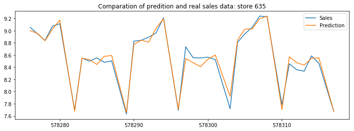
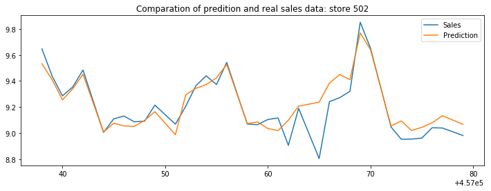
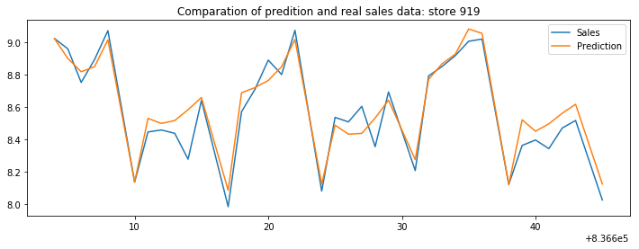
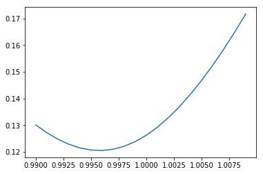
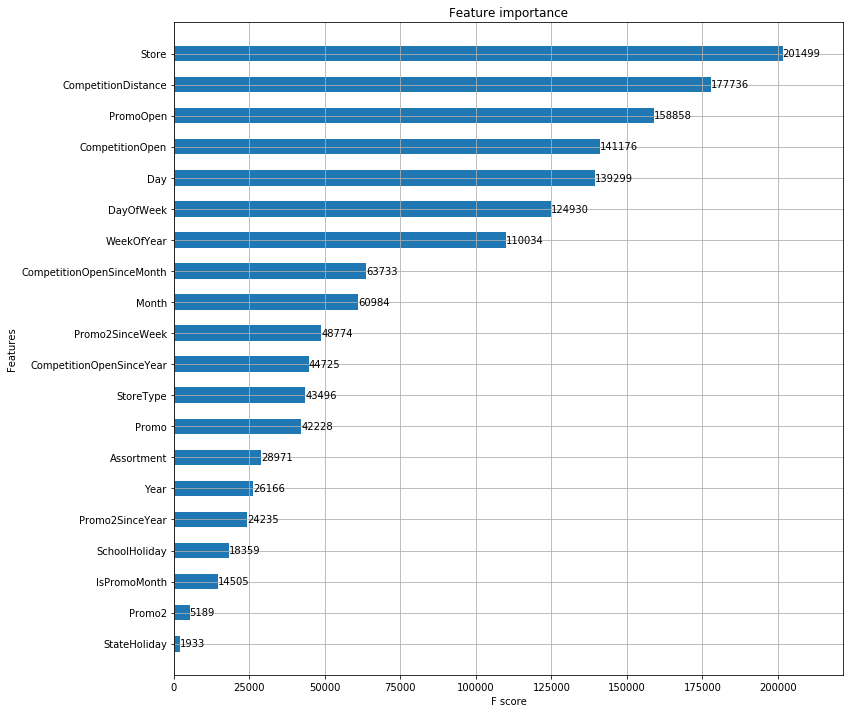

# Rossmann销售预测

**Rossmann** 是欧洲的一家连锁药店。在欧洲7个国家经营着3000多家药店。目前，Rossmann门店经理的任务是提前六 周预测他们的日常销量。商店的销售受到许多因素的影响，包括促销、竞争、学校和国家假日、季节性和所在地区。成千上万的门店经理根据其独特偏好进行销售预测，造成结果的准确性可能会偏差很大。

   可靠的销售预测使商店经理能够制定有效的员工时间表，提高生产力和积极性。通过帮助 Rossmann 创建一个健壮的预测模型，将会帮助商店经理专注于他们最重要的事情:他们的客户和他们的团队。

**数据文件：**

 - train.csv -每家店销售数据集，用于训练
 - store.csv -每家店信息数据集
 - test.csv  -跟"train.csv"结构⼀样，缺少需要提交的"Sales"字段，用于最终的测试
 - sample_submission.csv -提交数据集的参考样本
   


## 基本流程

* 1. 初始化开发环境，加载所需库。
* 2. 加载数据，数据完整性探索。（可视化图表见<a href="数据可视化.ipynb">数据可视化.ipynb</a>）
* 3. 数据预处理。
* 4. 数据探索。
* 5. 特征工程。
* 6. 模型构建、训练、调参、优化。
* 7. 生成kaggle的提交文件。
* 8. 记录kaggle得分情况。

### 环境初始化


```python
# coding: utf-8
 
#开发环境：windows10, Anacoda3.5 , jupyter notebook ,python3.6 
#库： numpy,pandas,matplotlib,seaborn,xgboost,time,warnings
#运行时间：CPU: i5-6700HQ，约两个半钟
 
#项目名称： Rossmann 销售预测

#导入所需要的库
import numpy as np
import pandas as pd
import seaborn as sns
import matplotlib.pyplot as plt
get_ipython().run_line_magic('matplotlib', 'inline')
from sklearn.cross_validation import train_test_split
from sklearn.model_selection import KFold, GridSearchCV
from sklearn.metrics import make_scorer
import xgboost as xgb
from time import time
import warnings
warnings.filterwarnings("ignore")
```

    C:\ProgramData\Anaconda3\lib\site-packages\sklearn\cross_validation.py:41: DeprecationWarning: This module was deprecated in version 0.18 in favor of the model_selection module into which all the refactored classes and functions are moved. Also note that the interface of the new CV iterators are different from that of this module. This module will be removed in 0.20.
      "This module will be removed in 0.20.", DeprecationWarning)
    

### 准备数据

所需数据都存放于当前目录的/dataset/中

部分字段解释：
1. Id:测试集内(商店、日期)的组合。
2. Store:表示每个商店的唯一Id。
3. Sales:任意一天的销售额，也是我们要预测的字段。
4. Open:是否开门，0=关门，1=开门。
5. StateHoliday:国家假日，一般假日国家假期都会关门，所有学校在公共假日都会关门，a=公共假日，b=东部假日，c=圣诞节，0=不是假日。
6. StoreType:商店类型，有四种，abcd。
7. Assortment:分类级别，a=基础，b=额外，c=扩展。
8. CompetitionDistance:竞争对手距离。
9. CompetitionOpenSince\[Month/Year\]:给出最近竞争对手的开张时间。
10. Promo:表示商店当天是否进行促销？
11. Promo2:表示商店是否进行持续的促销活动，0=没有参数，1=参与。
12. Promo2Since\[Year/Week\]:商店开始持续促销的年/星期。
13. PromoInterval:持续促销活动开始的间隔，"Feb,May,Aug,Nov"表示给定商店某一年的2589月开始持续促销活动。

### 加载数据


```python
train = pd.read_csv('./dataset/train.csv',parse_dates=[2])
test  = pd.read_csv('./dataset/test.csv',parse_dates=[3])
store = pd.read_csv('./dataset/store.csv')
```

### 读取数据


```python
#查看训练集
train.head(5).append(train.tail())

```


<div>
<style scoped>
    .dataframe tbody tr th:only-of-type {
        vertical-align: middle;
    }

    .dataframe tbody tr th {
        vertical-align: top;
    }

    .dataframe thead th {
        text-align: right;
    }
</style>
<table border="1" class="dataframe">
  <thead>
    <tr style="text-align: right;">
      <th></th>
      <th>Store</th>
      <th>DayOfWeek</th>
      <th>Date</th>
      <th>Sales</th>
      <th>Customers</th>
      <th>Open</th>
      <th>Promo</th>
      <th>StateHoliday</th>
      <th>SchoolHoliday</th>
    </tr>
  </thead>
  <tbody>
    <tr>
      <th>0</th>
      <td>1</td>
      <td>5</td>
      <td>2015-07-31</td>
      <td>5263</td>
      <td>555</td>
      <td>1</td>
      <td>1</td>
      <td>0</td>
      <td>1</td>
    </tr>
    <tr>
      <th>1</th>
      <td>2</td>
      <td>5</td>
      <td>2015-07-31</td>
      <td>6064</td>
      <td>625</td>
      <td>1</td>
      <td>1</td>
      <td>0</td>
      <td>1</td>
    </tr>
    <tr>
      <th>2</th>
      <td>3</td>
      <td>5</td>
      <td>2015-07-31</td>
      <td>8314</td>
      <td>821</td>
      <td>1</td>
      <td>1</td>
      <td>0</td>
      <td>1</td>
    </tr>
    <tr>
      <th>3</th>
      <td>4</td>
      <td>5</td>
      <td>2015-07-31</td>
      <td>13995</td>
      <td>1498</td>
      <td>1</td>
      <td>1</td>
      <td>0</td>
      <td>1</td>
    </tr>
    <tr>
      <th>4</th>
      <td>5</td>
      <td>5</td>
      <td>2015-07-31</td>
      <td>4822</td>
      <td>559</td>
      <td>1</td>
      <td>1</td>
      <td>0</td>
      <td>1</td>
    </tr>
    <tr>
      <th>1017204</th>
      <td>1111</td>
      <td>2</td>
      <td>2013-01-01</td>
      <td>0</td>
      <td>0</td>
      <td>0</td>
      <td>0</td>
      <td>a</td>
      <td>1</td>
    </tr>
    <tr>
      <th>1017205</th>
      <td>1112</td>
      <td>2</td>
      <td>2013-01-01</td>
      <td>0</td>
      <td>0</td>
      <td>0</td>
      <td>0</td>
      <td>a</td>
      <td>1</td>
    </tr>
    <tr>
      <th>1017206</th>
      <td>1113</td>
      <td>2</td>
      <td>2013-01-01</td>
      <td>0</td>
      <td>0</td>
      <td>0</td>
      <td>0</td>
      <td>a</td>
      <td>1</td>
    </tr>
    <tr>
      <th>1017207</th>
      <td>1114</td>
      <td>2</td>
      <td>2013-01-01</td>
      <td>0</td>
      <td>0</td>
      <td>0</td>
      <td>0</td>
      <td>a</td>
      <td>1</td>
    </tr>
    <tr>
      <th>1017208</th>
      <td>1115</td>
      <td>2</td>
      <td>2013-01-01</td>
      <td>0</td>
      <td>0</td>
      <td>0</td>
      <td>0</td>
      <td>a</td>
      <td>1</td>
    </tr>
  </tbody>
</table>
</div>


```python
train.info()
```

    <class 'pandas.core.frame.DataFrame'>
    RangeIndex: 1017209 entries, 0 to 1017208
    Data columns (total 9 columns):
    Store            1017209 non-null int64
    DayOfWeek        1017209 non-null int64
    Date             1017209 non-null datetime64[ns]
    Sales            1017209 non-null int64
    Customers        1017209 non-null int64
    Open             1017209 non-null int64
    Promo            1017209 non-null int64
    StateHoliday     1017209 non-null object
    SchoolHoliday    1017209 non-null int64
    dtypes: datetime64[ns](1), int64(7), object(1)
    memory usage: 69.8+ MB
    

总共数据 1017209 条数据，数据完整，无null字段


```python
#查看测试集
test.head(5).append(test.tail())
```


<div>
<style scoped>
    .dataframe tbody tr th:only-of-type {
        vertical-align: middle;
    }

    .dataframe tbody tr th {
        vertical-align: top;
    }

    .dataframe thead th {
        text-align: right;
    }
</style>
<table border="1" class="dataframe">
  <thead>
    <tr style="text-align: right;">
      <th></th>
      <th>Id</th>
      <th>Store</th>
      <th>DayOfWeek</th>
      <th>Date</th>
      <th>Open</th>
      <th>Promo</th>
      <th>StateHoliday</th>
      <th>SchoolHoliday</th>
    </tr>
  </thead>
  <tbody>
    <tr>
      <th>0</th>
      <td>1</td>
      <td>1</td>
      <td>4</td>
      <td>2015-09-17</td>
      <td>1.0</td>
      <td>1</td>
      <td>0</td>
      <td>0</td>
    </tr>
    <tr>
      <th>1</th>
      <td>2</td>
      <td>3</td>
      <td>4</td>
      <td>2015-09-17</td>
      <td>1.0</td>
      <td>1</td>
      <td>0</td>
      <td>0</td>
    </tr>
    <tr>
      <th>2</th>
      <td>3</td>
      <td>7</td>
      <td>4</td>
      <td>2015-09-17</td>
      <td>1.0</td>
      <td>1</td>
      <td>0</td>
      <td>0</td>
    </tr>
    <tr>
      <th>3</th>
      <td>4</td>
      <td>8</td>
      <td>4</td>
      <td>2015-09-17</td>
      <td>1.0</td>
      <td>1</td>
      <td>0</td>
      <td>0</td>
    </tr>
    <tr>
      <th>4</th>
      <td>5</td>
      <td>9</td>
      <td>4</td>
      <td>2015-09-17</td>
      <td>1.0</td>
      <td>1</td>
      <td>0</td>
      <td>0</td>
    </tr>
    <tr>
      <th>41083</th>
      <td>41084</td>
      <td>1111</td>
      <td>6</td>
      <td>2015-08-01</td>
      <td>1.0</td>
      <td>0</td>
      <td>0</td>
      <td>0</td>
    </tr>
    <tr>
      <th>41084</th>
      <td>41085</td>
      <td>1112</td>
      <td>6</td>
      <td>2015-08-01</td>
      <td>1.0</td>
      <td>0</td>
      <td>0</td>
      <td>0</td>
    </tr>
    <tr>
      <th>41085</th>
      <td>41086</td>
      <td>1113</td>
      <td>6</td>
      <td>2015-08-01</td>
      <td>1.0</td>
      <td>0</td>
      <td>0</td>
      <td>0</td>
    </tr>
    <tr>
      <th>41086</th>
      <td>41087</td>
      <td>1114</td>
      <td>6</td>
      <td>2015-08-01</td>
      <td>1.0</td>
      <td>0</td>
      <td>0</td>
      <td>0</td>
    </tr>
    <tr>
      <th>41087</th>
      <td>41088</td>
      <td>1115</td>
      <td>6</td>
      <td>2015-08-01</td>
      <td>1.0</td>
      <td>0</td>
      <td>0</td>
      <td>1</td>
    </tr>
  </tbody>
</table>
</div>


```python
test.info()
```

    <class 'pandas.core.frame.DataFrame'>
    RangeIndex: 41088 entries, 0 to 41087
    Data columns (total 8 columns):
    Id               41088 non-null int64
    Store            41088 non-null int64
    DayOfWeek        41088 non-null int64
    Date             41088 non-null datetime64[ns]
    Open             41077 non-null float64
    Promo            41088 non-null int64
    StateHoliday     41088 non-null object
    SchoolHoliday    41088 non-null int64
    dtypes: datetime64[ns](1), float64(1), int64(5), object(1)
    memory usage: 2.5+ MB
    

"Open" 字段有11个缺失值显示为：NaN。


```python
#查看店铺数据
store.head(5).append(store.tail())
```


<div>
<style scoped>
    .dataframe tbody tr th:only-of-type {
        vertical-align: middle;
    }

    .dataframe tbody tr th {
        vertical-align: top;
    }

    .dataframe thead th {
        text-align: right;
    }
</style>
<table border="1" class="dataframe">
  <thead>
    <tr style="text-align: right;">
      <th></th>
      <th>Store</th>
      <th>StoreType</th>
      <th>Assortment</th>
      <th>CompetitionDistance</th>
      <th>CompetitionOpenSinceMonth</th>
      <th>CompetitionOpenSinceYear</th>
      <th>Promo2</th>
      <th>Promo2SinceWeek</th>
      <th>Promo2SinceYear</th>
      <th>PromoInterval</th>
    </tr>
  </thead>
  <tbody>
    <tr>
      <th>0</th>
      <td>1</td>
      <td>c</td>
      <td>a</td>
      <td>1270.0</td>
      <td>9.0</td>
      <td>2008.0</td>
      <td>0</td>
      <td>NaN</td>
      <td>NaN</td>
      <td>NaN</td>
    </tr>
    <tr>
      <th>1</th>
      <td>2</td>
      <td>a</td>
      <td>a</td>
      <td>570.0</td>
      <td>11.0</td>
      <td>2007.0</td>
      <td>1</td>
      <td>13.0</td>
      <td>2010.0</td>
      <td>Jan,Apr,Jul,Oct</td>
    </tr>
    <tr>
      <th>2</th>
      <td>3</td>
      <td>a</td>
      <td>a</td>
      <td>14130.0</td>
      <td>12.0</td>
      <td>2006.0</td>
      <td>1</td>
      <td>14.0</td>
      <td>2011.0</td>
      <td>Jan,Apr,Jul,Oct</td>
    </tr>
    <tr>
      <th>3</th>
      <td>4</td>
      <td>c</td>
      <td>c</td>
      <td>620.0</td>
      <td>9.0</td>
      <td>2009.0</td>
      <td>0</td>
      <td>NaN</td>
      <td>NaN</td>
      <td>NaN</td>
    </tr>
    <tr>
      <th>4</th>
      <td>5</td>
      <td>a</td>
      <td>a</td>
      <td>29910.0</td>
      <td>4.0</td>
      <td>2015.0</td>
      <td>0</td>
      <td>NaN</td>
      <td>NaN</td>
      <td>NaN</td>
    </tr>
    <tr>
      <th>1110</th>
      <td>1111</td>
      <td>a</td>
      <td>a</td>
      <td>1900.0</td>
      <td>6.0</td>
      <td>2014.0</td>
      <td>1</td>
      <td>31.0</td>
      <td>2013.0</td>
      <td>Jan,Apr,Jul,Oct</td>
    </tr>
    <tr>
      <th>1111</th>
      <td>1112</td>
      <td>c</td>
      <td>c</td>
      <td>1880.0</td>
      <td>4.0</td>
      <td>2006.0</td>
      <td>0</td>
      <td>NaN</td>
      <td>NaN</td>
      <td>NaN</td>
    </tr>
    <tr>
      <th>1112</th>
      <td>1113</td>
      <td>a</td>
      <td>c</td>
      <td>9260.0</td>
      <td>NaN</td>
      <td>NaN</td>
      <td>0</td>
      <td>NaN</td>
      <td>NaN</td>
      <td>NaN</td>
    </tr>
    <tr>
      <th>1113</th>
      <td>1114</td>
      <td>a</td>
      <td>c</td>
      <td>870.0</td>
      <td>NaN</td>
      <td>NaN</td>
      <td>0</td>
      <td>NaN</td>
      <td>NaN</td>
      <td>NaN</td>
    </tr>
    <tr>
      <th>1114</th>
      <td>1115</td>
      <td>d</td>
      <td>c</td>
      <td>5350.0</td>
      <td>NaN</td>
      <td>NaN</td>
      <td>1</td>
      <td>22.0</td>
      <td>2012.0</td>
      <td>Mar,Jun,Sept,Dec</td>
    </tr>
  </tbody>
</table>
</div>


```python
store.info()
```

    <class 'pandas.core.frame.DataFrame'>
    RangeIndex: 1115 entries, 0 to 1114
    Data columns (total 10 columns):
    Store                        1115 non-null int64
    StoreType                    1115 non-null object
    Assortment                   1115 non-null object
    CompetitionDistance          1112 non-null float64
    CompetitionOpenSinceMonth    761 non-null float64
    CompetitionOpenSinceYear     761 non-null float64
    Promo2                       1115 non-null int64
    Promo2SinceWeek              571 non-null float64
    Promo2SinceYear              571 non-null float64
    PromoInterval                571 non-null object
    dtypes: float64(5), int64(2), object(3)
    memory usage: 87.2+ KB
    

总共有 1115 条数据，对应分布于德国的1115间商店；其中CompetitionOpenSinceMonth、CompetitionOpenSinceYear只有 761 条数据，也就是有 354 个商店缺失对应的竞争对手的开张日期相关信息；promo2促销相关的字段Promo2SinceWeek、Promo2SinceYear、PromoInterval只有 571 条；竞争对手的距离字段CompetitionDistance显示缺失值为 3 条 。

#### 时间跨度


```python
print(min(train['Date']),max(train['Date']))
```

    2013-01-01 00:00:00 2015-07-31 00:00:00
    

**数据集的数据从2013-01-01 到 2015-17-31 时间跨度2.5年左右**

### 缺失数据分析


```python
#查看数据缺失
display(train.isnull().sum(),test.isnull().sum(),store.isnull().sum())
```


    Store            0
    DayOfWeek        0
    Date             0
    Sales            0
    Customers        0
    Open             0
    Promo            0
    StateHoliday     0
    SchoolHoliday    0
    dtype: int64


    Id                0
    Store             0
    DayOfWeek         0
    Date              0
    Open             11
    Promo             0
    StateHoliday      0
    SchoolHoliday     0
    dtype: int64


    Store                          0
    StoreType                      0
    Assortment                     0
    CompetitionDistance            3
    CompetitionOpenSinceMonth    354
    CompetitionOpenSinceYear     354
    Promo2                         0
    Promo2SinceWeek              544
    Promo2SinceYear              544
    PromoInterval                544
    dtype: int64


```python
#测试集缺失数据
test[pd.isnull(test.Open)]
```


<div>
<style scoped>
    .dataframe tbody tr th:only-of-type {
        vertical-align: middle;
    }

    .dataframe tbody tr th {
        vertical-align: top;
    }

    .dataframe thead th {
        text-align: right;
    }
</style>
<table border="1" class="dataframe">
  <thead>
    <tr style="text-align: right;">
      <th></th>
      <th>Id</th>
      <th>Store</th>
      <th>DayOfWeek</th>
      <th>Date</th>
      <th>Open</th>
      <th>Promo</th>
      <th>StateHoliday</th>
      <th>SchoolHoliday</th>
    </tr>
  </thead>
  <tbody>
    <tr>
      <th>479</th>
      <td>480</td>
      <td>622</td>
      <td>4</td>
      <td>2015-09-17</td>
      <td>NaN</td>
      <td>1</td>
      <td>0</td>
      <td>0</td>
    </tr>
    <tr>
      <th>1335</th>
      <td>1336</td>
      <td>622</td>
      <td>3</td>
      <td>2015-09-16</td>
      <td>NaN</td>
      <td>1</td>
      <td>0</td>
      <td>0</td>
    </tr>
    <tr>
      <th>2191</th>
      <td>2192</td>
      <td>622</td>
      <td>2</td>
      <td>2015-09-15</td>
      <td>NaN</td>
      <td>1</td>
      <td>0</td>
      <td>0</td>
    </tr>
    <tr>
      <th>3047</th>
      <td>3048</td>
      <td>622</td>
      <td>1</td>
      <td>2015-09-14</td>
      <td>NaN</td>
      <td>1</td>
      <td>0</td>
      <td>0</td>
    </tr>
    <tr>
      <th>4759</th>
      <td>4760</td>
      <td>622</td>
      <td>6</td>
      <td>2015-09-12</td>
      <td>NaN</td>
      <td>0</td>
      <td>0</td>
      <td>0</td>
    </tr>
    <tr>
      <th>5615</th>
      <td>5616</td>
      <td>622</td>
      <td>5</td>
      <td>2015-09-11</td>
      <td>NaN</td>
      <td>0</td>
      <td>0</td>
      <td>0</td>
    </tr>
    <tr>
      <th>6471</th>
      <td>6472</td>
      <td>622</td>
      <td>4</td>
      <td>2015-09-10</td>
      <td>NaN</td>
      <td>0</td>
      <td>0</td>
      <td>0</td>
    </tr>
    <tr>
      <th>7327</th>
      <td>7328</td>
      <td>622</td>
      <td>3</td>
      <td>2015-09-09</td>
      <td>NaN</td>
      <td>0</td>
      <td>0</td>
      <td>0</td>
    </tr>
    <tr>
      <th>8183</th>
      <td>8184</td>
      <td>622</td>
      <td>2</td>
      <td>2015-09-08</td>
      <td>NaN</td>
      <td>0</td>
      <td>0</td>
      <td>0</td>
    </tr>
    <tr>
      <th>9039</th>
      <td>9040</td>
      <td>622</td>
      <td>1</td>
      <td>2015-09-07</td>
      <td>NaN</td>
      <td>0</td>
      <td>0</td>
      <td>0</td>
    </tr>
    <tr>
      <th>10751</th>
      <td>10752</td>
      <td>622</td>
      <td>6</td>
      <td>2015-09-05</td>
      <td>NaN</td>
      <td>0</td>
      <td>0</td>
      <td>0</td>
    </tr>
  </tbody>
</table>
</div>


```python
#查看是否Promo2系列的缺失是否是因为没有参加促销
NoPW = store[pd.isnull(store.Promo2SinceWeek)]
NoPW[NoPW.Promo2 != 0].shape
```


    (0, 10)


```python
#查看是否Promo2系列的缺失是否是因为没有参加促销
NoPW = store[pd.isnull(store.Promo2SinceYear)]
NoPW[NoPW.Promo2 != 0].shape
```


    (0, 10)


```python
#查看是否Promo2系列的缺失是否是因为没有参加促销
NoPW = store[pd.isnull(store.PromoInterval)]
NoPW[NoPW.Promo2 != 0].shape

```


    (0, 10)


#### 小结
* 1.可以看到train、test和store都有“Store”字段；
* 2.test中'open'字段有11条缺失值，需对缺失值进行处理；
* 3.store的"CompetitionDistance" "CompetitionOpenSinceMonth" "CompetitionOpenSinceYear" "Promo2SinceWeek" "Promo2SinceYear"和"PromoInterval"字段都有缺失值，同样需要对缺失值进行处理；
* 4.有大量字段属于枚举型、时间序列，这些字段都要经过处理，否则会影响预测结果。

## 数据预处理

- open统一填充为1，开放营业状态
- 店铺竞争数据缺失的原因不明，且数量比较多，我们可以用中值或者0来填充，后续的实验发现以0填充的效果更好
- 店铺促销信息的缺失是因为没有参加促销活动，所以我们以0填充


“open”字段可以填充为1 - 开放营业


```python
# - open字段可以填充为1 - 开放营业
test.fillna(1, inplace=True)
```

CompetitionOpenSinceMonth、CompetitionOpenSinceYear、CompetitionDistance填充0


```python
store.fillna(0, inplace=True)
```


```python
test['Date'] = pd.to_datetime(test['Date'])
train['Date'] = pd.to_datetime(train['Date'])
```


```python
#查看是否还存在缺失值
display(train.isnull().sum(),test.isnull().sum(),store.isnull().sum())
```


    Store            0
    DayOfWeek        0
    Date             0
    Sales            0
    Customers        0
    Open             0
    Promo            0
    StateHoliday     0
    SchoolHoliday    0
    dtype: int64


    Id               0
    Store            0
    DayOfWeek        0
    Date             0
    Open             0
    Promo            0
    StateHoliday     0
    SchoolHoliday    0
    dtype: int64


    Store                        0
    StoreType                    0
    Assortment                   0
    CompetitionDistance          0
    CompetitionOpenSinceMonth    0
    CompetitionOpenSinceYear     0
    Promo2                       0
    Promo2SinceWeek              0
    Promo2SinceYear              0
    PromoInterval                0
    dtype: int64


## 数据拼接

合并store信息到train和test数据集中


```python
#合并store信息到train和test数据集中
train_data = pd.merge(train, store, on='Store')
test_data = pd.merge(test, store, on='Store')
```


```python
train_data.head(5)
```


<div>
<style scoped>
    .dataframe tbody tr th:only-of-type {
        vertical-align: middle;
    }

    .dataframe tbody tr th {
        vertical-align: top;
    }

    .dataframe thead th {
        text-align: right;
    }
</style>
<table border="1" class="dataframe">
  <thead>
    <tr style="text-align: right;">
      <th></th>
      <th>Store</th>
      <th>DayOfWeek</th>
      <th>Date</th>
      <th>Sales</th>
      <th>Customers</th>
      <th>Open</th>
      <th>Promo</th>
      <th>StateHoliday</th>
      <th>SchoolHoliday</th>
      <th>StoreType</th>
      <th>Assortment</th>
      <th>CompetitionDistance</th>
      <th>CompetitionOpenSinceMonth</th>
      <th>CompetitionOpenSinceYear</th>
      <th>Promo2</th>
      <th>Promo2SinceWeek</th>
      <th>Promo2SinceYear</th>
      <th>PromoInterval</th>
    </tr>
  </thead>
  <tbody>
    <tr>
      <th>0</th>
      <td>1</td>
      <td>5</td>
      <td>2015-07-31</td>
      <td>5263</td>
      <td>555</td>
      <td>1</td>
      <td>1</td>
      <td>0</td>
      <td>1</td>
      <td>c</td>
      <td>a</td>
      <td>1270.0</td>
      <td>9.0</td>
      <td>2008.0</td>
      <td>0</td>
      <td>0.0</td>
      <td>0.0</td>
      <td>0</td>
    </tr>
    <tr>
      <th>1</th>
      <td>1</td>
      <td>4</td>
      <td>2015-07-30</td>
      <td>5020</td>
      <td>546</td>
      <td>1</td>
      <td>1</td>
      <td>0</td>
      <td>1</td>
      <td>c</td>
      <td>a</td>
      <td>1270.0</td>
      <td>9.0</td>
      <td>2008.0</td>
      <td>0</td>
      <td>0.0</td>
      <td>0.0</td>
      <td>0</td>
    </tr>
    <tr>
      <th>2</th>
      <td>1</td>
      <td>3</td>
      <td>2015-07-29</td>
      <td>4782</td>
      <td>523</td>
      <td>1</td>
      <td>1</td>
      <td>0</td>
      <td>1</td>
      <td>c</td>
      <td>a</td>
      <td>1270.0</td>
      <td>9.0</td>
      <td>2008.0</td>
      <td>0</td>
      <td>0.0</td>
      <td>0.0</td>
      <td>0</td>
    </tr>
    <tr>
      <th>3</th>
      <td>1</td>
      <td>2</td>
      <td>2015-07-28</td>
      <td>5011</td>
      <td>560</td>
      <td>1</td>
      <td>1</td>
      <td>0</td>
      <td>1</td>
      <td>c</td>
      <td>a</td>
      <td>1270.0</td>
      <td>9.0</td>
      <td>2008.0</td>
      <td>0</td>
      <td>0.0</td>
      <td>0.0</td>
      <td>0</td>
    </tr>
    <tr>
      <th>4</th>
      <td>1</td>
      <td>1</td>
      <td>2015-07-27</td>
      <td>6102</td>
      <td>612</td>
      <td>1</td>
      <td>1</td>
      <td>0</td>
      <td>1</td>
      <td>c</td>
      <td>a</td>
      <td>1270.0</td>
      <td>9.0</td>
      <td>2008.0</td>
      <td>0</td>
      <td>0.0</td>
      <td>0.0</td>
      <td>0</td>
    </tr>
  </tbody>
</table>
</div>


```python
test_data.head(5)
```


<div>
<style scoped>
    .dataframe tbody tr th:only-of-type {
        vertical-align: middle;
    }

    .dataframe tbody tr th {
        vertical-align: top;
    }

    .dataframe thead th {
        text-align: right;
    }
</style>
<table border="1" class="dataframe">
  <thead>
    <tr style="text-align: right;">
      <th></th>
      <th>Id</th>
      <th>Store</th>
      <th>DayOfWeek</th>
      <th>Date</th>
      <th>Open</th>
      <th>Promo</th>
      <th>StateHoliday</th>
      <th>SchoolHoliday</th>
      <th>StoreType</th>
      <th>Assortment</th>
      <th>CompetitionDistance</th>
      <th>CompetitionOpenSinceMonth</th>
      <th>CompetitionOpenSinceYear</th>
      <th>Promo2</th>
      <th>Promo2SinceWeek</th>
      <th>Promo2SinceYear</th>
      <th>PromoInterval</th>
    </tr>
  </thead>
  <tbody>
    <tr>
      <th>0</th>
      <td>1</td>
      <td>1</td>
      <td>4</td>
      <td>2015-09-17</td>
      <td>1.0</td>
      <td>1</td>
      <td>0</td>
      <td>0</td>
      <td>c</td>
      <td>a</td>
      <td>1270.0</td>
      <td>9.0</td>
      <td>2008.0</td>
      <td>0</td>
      <td>0.0</td>
      <td>0.0</td>
      <td>0</td>
    </tr>
    <tr>
      <th>1</th>
      <td>857</td>
      <td>1</td>
      <td>3</td>
      <td>2015-09-16</td>
      <td>1.0</td>
      <td>1</td>
      <td>0</td>
      <td>0</td>
      <td>c</td>
      <td>a</td>
      <td>1270.0</td>
      <td>9.0</td>
      <td>2008.0</td>
      <td>0</td>
      <td>0.0</td>
      <td>0.0</td>
      <td>0</td>
    </tr>
    <tr>
      <th>2</th>
      <td>1713</td>
      <td>1</td>
      <td>2</td>
      <td>2015-09-15</td>
      <td>1.0</td>
      <td>1</td>
      <td>0</td>
      <td>0</td>
      <td>c</td>
      <td>a</td>
      <td>1270.0</td>
      <td>9.0</td>
      <td>2008.0</td>
      <td>0</td>
      <td>0.0</td>
      <td>0.0</td>
      <td>0</td>
    </tr>
    <tr>
      <th>3</th>
      <td>2569</td>
      <td>1</td>
      <td>1</td>
      <td>2015-09-14</td>
      <td>1.0</td>
      <td>1</td>
      <td>0</td>
      <td>0</td>
      <td>c</td>
      <td>a</td>
      <td>1270.0</td>
      <td>9.0</td>
      <td>2008.0</td>
      <td>0</td>
      <td>0.0</td>
      <td>0.0</td>
      <td>0</td>
    </tr>
    <tr>
      <th>4</th>
      <td>3425</td>
      <td>1</td>
      <td>7</td>
      <td>2015-09-13</td>
      <td>0.0</td>
      <td>0</td>
      <td>0</td>
      <td>0</td>
      <td>c</td>
      <td>a</td>
      <td>1270.0</td>
      <td>9.0</td>
      <td>2008.0</td>
      <td>0</td>
      <td>0.0</td>
      <td>0.0</td>
      <td>0</td>
    </tr>
  </tbody>
</table>
</div>


## 划分数据集

留出最近的6周数据作为hold_out数据集进行测试；这样划分的基础是数据为时序数据，有助于利用时序数据的趋势特点。


```python
train_data = train_data.sort_values(['Date'],ascending = False)
ho_test    = train_data[:6*7*1115]
ho_train   = train_data[6*7*1115:]
ho_test.info()
```

    <class 'pandas.core.frame.DataFrame'>
    Int64Index: 46830 entries, 0 to 284583
    Data columns (total 18 columns):
    Store                        46830 non-null int64
    DayOfWeek                    46830 non-null int64
    Date                         46830 non-null datetime64[ns]
    Sales                        46830 non-null int64
    Customers                    46830 non-null int64
    Open                         46830 non-null int64
    Promo                        46830 non-null int64
    StateHoliday                 46830 non-null object
    SchoolHoliday                46830 non-null int64
    StoreType                    46830 non-null object
    Assortment                   46830 non-null object
    CompetitionDistance          46830 non-null float64
    CompetitionOpenSinceMonth    46830 non-null float64
    CompetitionOpenSinceYear     46830 non-null float64
    Promo2                       46830 non-null int64
    Promo2SinceWeek              46830 non-null float64
    Promo2SinceYear              46830 non-null float64
    PromoInterval                46830 non-null object
    dtypes: datetime64[ns](1), float64(5), int64(8), object(4)
    memory usage: 6.8+ MB
    


```python
#查看是否还存在缺失值
display(train.isnull().sum(),test.isnull().sum(),store.isnull().sum())
```


    Store            0
    DayOfWeek        0
    Date             0
    Sales            0
    Customers        0
    Open             0
    Promo            0
    StateHoliday     0
    SchoolHoliday    0
    dtype: int64


    Id               0
    Store            0
    DayOfWeek        0
    Date             0
    Open             0
    Promo            0
    StateHoliday     0
    SchoolHoliday    0
    dtype: int64


    Store                        0
    StoreType                    0
    Assortment                   0
    CompetitionDistance          0
    CompetitionOpenSinceMonth    0
    CompetitionOpenSinceYear     0
    Promo2                       0
    Promo2SinceWeek              0
    Promo2SinceYear              0
    PromoInterval                0
    dtype: int64


## 清洗未开放营业和销售量为0的数据

“Sales”为0的数据不计入最终得分，因此从训练数据中去除，避免对模型的干扰。


```python
ho_test = ho_test[ho_test["Open"] != 0]
ho_test = ho_test[ho_test["Sales"] > 0]
ho_train = ho_train[ho_train["Open"] != 0]
ho_train = ho_train[ho_train["Sales"] > 0]
```

## 特征处理和转换

#### Year、Month、Day、WeekOfYear、DayOfWeek、CompetitionOpen、PromoOpen


```python
#特征处理与转化，定义特征处理函数
def features_create(data):
    
    #将存在其他字符表示分类的特征转化为数字
    mappings = {'0':0, 'a':1, 'b':2, 'c':3, 'd':4}
    data.StoreType.replace(mappings, inplace=True)
    data.Assortment.replace(mappings, inplace=True)
    data.StateHoliday.replace(mappings, inplace=True)
    
    #将时间特征进行拆分和转化，并加入'WeekOfYear'特征
    data['Year'] = data.Date.dt.year
    data['Month'] = data.Date.dt.month
    data['Day'] = data.Date.dt.day
    data['DayOfWeek'] = data.Date.dt.dayofweek
    data['WeekOfYear'] = data.Date.dt.weekofyear
    
    
    #新增'CompetitionOpen'和'PromoOpen'特征,计算某天某店铺的竞争对手已营业时间和店铺已促销时间，用月为单位表示
    data['CompetitionOpen'] = 12 * (data.Year - data.CompetitionOpenSinceYear) +         (data.Month - data.CompetitionOpenSinceMonth)
    data['PromoOpen'] = 12 * (data.Year - data.Promo2SinceYear) +         (data.WeekOfYear - data.Promo2SinceWeek) / 4.0
    data['CompetitionOpen'] = data.CompetitionOpen.apply(lambda x: x if x > 0 else 0)        
    data['PromoOpen'] = data.PromoOpen.apply(lambda x: x if x > 0 else 0)
    
    
    #将'PromoInterval'特征转化为'IsPromoMonth'特征,表示某天某店铺是否处于促销月，1表示是，0表示否
    month2str = {1:'Jan', 2:'Feb', 3:'Mar', 4:'Apr', 5:'May', 6:'Jun',  7:'Jul', 8:'Aug', 9:'Sept', 10:'Oct', 11:'Nov', 12:'Dec'}
    data['monthStr'] = data.Month.map(month2str)
    data.loc[data.PromoInterval == 0, 'PromoInterval'] = ''
    data['IsPromoMonth'] = 0
    for interval in data.PromoInterval.unique():
        if interval != '':
            for month in interval.split(','):
                data.loc[(data.monthStr == month) & (data.PromoInterval == interval), 'IsPromoMonth'] = 1
 
    return data
```


```python

#对训练，保留以及测试数据集进行特征转化
features_create(ho_train)
features_create(ho_test)
features_create(test_data)
print('特征转换成功')
```

    特征转换成功
    

## 数值型数据归一化处理

这主要是避免由数值大小导致的字段在对预测结果的影响中权重不一致，因此做归一化处理，即认为每个字段的影响都是一样的。

数值型字段有：
1. CompetitionDistance。
2. PromoDays。
3. CompetitionOpenMonths。

但是有个问题，如果对训练数据、测试数据分别进行了归一化，因为归一化使用的min、max不同，是否对预测有影响不可而知，暂时不进行归一化处理。

### 做归一化之前，我们要先查看下数据中是否有异常值，比如极大极小值等，避免对归一化结果造成影响


```python
ho_train.CompetitionDistance.describe()
```


    count    804056.000000
    mean       5445.036515
    std        7806.454956
    min           0.000000
    25%         700.000000
    50%        2320.000000
    75%        6880.000000
    max       75860.000000
    Name: CompetitionDistance, dtype: float64


```python
#删掉训练和保留数据集中不需要的特征
ho_train.drop(['Date','Customers','Open','PromoInterval','monthStr'],axis=1,inplace =True)
ho_test.drop(['Date','Customers','Open','PromoInterval','monthStr'],axis=1,inplace =True)
```


```python
#拆分特征与标签，并将标签取对数处理
ho_xtrain = ho_train.drop(['Sales'],axis=1 )
ho_ytrain = np.log1p(ho_train.Sales)
ho_xtest = ho_test.drop(['Sales'],axis=1 )
ho_ytest = np.log1p(ho_test.Sales)
```


```python
#删掉测试集中对应的特征与训练集保持一致
xtest =test_data.drop(['Id','Date','Open','PromoInterval','monthStr'],axis = 1)
```


```python
ho_train.columns
```


    Index(['Store', 'DayOfWeek', 'Sales', 'Promo', 'StateHoliday', 'SchoolHoliday',
           'StoreType', 'Assortment', 'CompetitionDistance',
           'CompetitionOpenSinceMonth', 'CompetitionOpenSinceYear', 'Promo2',
           'Promo2SinceWeek', 'Promo2SinceYear', 'Year', 'Month', 'Day',
           'WeekOfYear', 'CompetitionOpen', 'PromoOpen', 'IsPromoMonth'],
          dtype='object')


```python
ho_test.columns
```


    Index(['Store', 'DayOfWeek', 'Sales', 'Promo', 'StateHoliday', 'SchoolHoliday',
           'StoreType', 'Assortment', 'CompetitionDistance',
           'CompetitionOpenSinceMonth', 'CompetitionOpenSinceYear', 'Promo2',
           'Promo2SinceWeek', 'Promo2SinceYear', 'Year', 'Month', 'Day',
           'WeekOfYear', 'CompetitionOpen', 'PromoOpen', 'IsPromoMonth'],
          dtype='object')


```python
xtest.columns
```


    Index(['Store', 'DayOfWeek', 'Promo', 'StateHoliday', 'SchoolHoliday',
           'StoreType', 'Assortment', 'CompetitionDistance',
           'CompetitionOpenSinceMonth', 'CompetitionOpenSinceYear', 'Promo2',
           'Promo2SinceWeek', 'Promo2SinceYear', 'Year', 'Month', 'Day',
           'WeekOfYear', 'CompetitionOpen', 'PromoOpen', 'IsPromoMonth'],
          dtype='object')


## 基准模型

基准模型采用恒定猜测为mean值的方式。

先将训练集中Sales的mean值计算出来。


```python
pred_base = np.expm1(ho_ytrain).mean()
print ('基准模型预测值：'+str(pred_base))
```

    基准模型预测值：6954.82295387386
    

## 性能指标

由于是要提交到kaggle，因此我们选择和kaggle一致的性能指标，即RMSPE。


```python
#定义评价函数rmspe
def rmspe(y, yhat):
    return np.sqrt(np.mean((yhat/y-1) ** 2))
 
def rmspe_xg(yhat, y):
    y = np.expm1(y.get_label())
    yhat = np.expm1(yhat)
    return "rmspe", rmspe(y,yhat)

#sklearn interface
def rmspe_gscv(y, yhat):
    y = np.expm1(y)
    yhat = np.expm1(yhat)
    return rmspe(y, yhat)

rmspe_score = make_scorer(rmspe_gscv)
kfold = KFold(n_splits=5, random_state=23)
```

## 计算基准模型的性能


```python
print ('基准模型的RMSPE：'+str(rmspe([pred_base]*len(ho_ytest), np.expm1(ho_ytest))))
```

    基准模型的RMSPE：0.4392301338342903
    

### 模型构建

导入库、训练数据处理

#### 模型训练

xgboost基本调参方式：
1. 选择一个较大的学习率，一般在0.05到0.3，然后设置一个该学习率对应下合适的n_estimators。
2. 调参max_depth、min_child_weight，这两个参数对结果影响很大。
3. 调参subsample、colsample_bytree。
4. 调参gamma。
5. 降低learning_rate，再匹配一个合适的n_estimators。

由于本地硬件有限，这里只给出调参后的参数：


```python
#定义评价函数rmspe
def rmspe(y, yhat):
    return np.sqrt(np.mean((yhat/y-1) ** 2))
 
def rmspe_xg(yhat, y):
    y = np.expm1(y.get_label())
    yhat = np.expm1(yhat)
    return "rmspe", rmspe(y,yhat)

#sklearn interface
def rmspe_gscv(y, yhat):
    y = np.expm1(y)
    yhat = np.expm1(yhat)
    return rmspe(y, yhat)

rmspe_score = make_scorer(rmspe_gscv)
kfold = KFold(n_splits=5, random_state=23)
```


```python
dtrain = xgb.DMatrix(ho_xtrain, ho_ytrain)
dvalid = xgb.DMatrix(ho_xtest, ho_ytest)
watchlist = [(dtrain, 'train'), (dvalid, 'eval')]
```


```python
#调试后的参数
params = {'booster': 'gbtree',
          'objective': 'reg:linear',
          "eta": 0.03,
          "max_depth": 10,
          "min_child_weight": 20,
          "subsample": 0.8,
          "colsample_bytree": 0.7,
          "silent": 1,
          "gamma": 0,
          "lambda": 1,
          "alpha": 0.8,
          "random_state": 23,
          "seed": 100
         }
```


```python
num_boost_round = 6000
#模型训练
print("Train a XGBoost model")
start = time()
gbm = xgb.train(params, dtrain, num_boost_round, evals=watchlist, 
  early_stopping_rounds=100, feval=rmspe_xg, verbose_eval=True)
end = time()
print('Training time is {:2f} s.'.format((end-start)))
 

```

    Train a XGBoost model
    [0]	train-rmse:8.0208	eval-rmse:8.02781	train-rmspe:0.999809	eval-rmspe:0.999811
    Multiple eval metrics have been passed: 'eval-rmspe' will be used for early stopping.
    
    Will train until eval-rmspe hasn't improved in 100 rounds.
    [1]	train-rmse:7.78064	eval-rmse:7.78806	train-rmspe:0.999711	eval-rmspe:0.999714
    [2]	train-rmse:7.54773	eval-rmse:7.55523	train-rmspe:0.99959	eval-rmspe:0.999596
    [3]	train-rmse:7.32182	eval-rmse:7.32964	train-rmspe:0.999444	eval-rmspe:0.999451
    [4]	train-rmse:7.10269	eval-rmse:7.11049	train-rmspe:0.999266	eval-rmspe:0.999276
    [5]	train-rmse:6.89015	eval-rmse:6.8982	train-rmspe:0.999053	eval-rmspe:0.999066
    [6]	train-rmse:6.68401	eval-rmse:6.69219	train-rmspe:0.998799	eval-rmspe:0.998815
    [7]	train-rmse:6.48407	eval-rmse:6.49205	train-rmspe:0.998497	eval-rmspe:0.998516
    [8]	train-rmse:6.29013	eval-rmse:6.29819	train-rmspe:0.99814	eval-rmspe:0.998165
    [9]	train-rmse:6.10198	eval-rmse:6.11034	train-rmspe:0.997723	eval-rmspe:0.997754
    [10]	train-rmse:5.91952	eval-rmse:5.92796	train-rmspe:0.997235	eval-rmspe:0.997273
    [11]	train-rmse:5.74251	eval-rmse:5.75108	train-rmspe:0.996671	eval-rmspe:0.996717
    [12]	train-rmse:5.57083	eval-rmse:5.57916	train-rmspe:0.99602	eval-rmspe:0.996074
    [13]	train-rmse:5.40439	eval-rmse:5.41233	train-rmspe:0.995271	eval-rmspe:0.995333
    [14]	train-rmse:5.24287	eval-rmse:5.25099	train-rmspe:0.994418	eval-rmspe:0.994492
    [15]	train-rmse:5.0862	eval-rmse:5.09443	train-rmspe:0.99345	eval-rmspe:0.993537
    [16]	train-rmse:4.93424	eval-rmse:4.94292	train-rmspe:0.992355	eval-rmspe:0.99246
    [17]	train-rmse:4.78688	eval-rmse:4.79587	train-rmspe:0.991122	eval-rmspe:0.991247
    [18]	train-rmse:4.64393	eval-rmse:4.65296	train-rmspe:0.989742	eval-rmspe:0.989885
    [19]	train-rmse:4.5053	eval-rmse:4.51439	train-rmspe:0.988201	eval-rmspe:0.988366
    [20]	train-rmse:4.37087	eval-rmse:4.37938	train-rmspe:0.98649	eval-rmspe:0.98667
    [21]	train-rmse:4.24044	eval-rmse:4.24901	train-rmspe:0.984598	eval-rmspe:0.984802
    [22]	train-rmse:4.11394	eval-rmse:4.12268	train-rmspe:0.982514	eval-rmspe:0.982747
    [23]	train-rmse:3.99128	eval-rmse:4.00003	train-rmspe:0.980222	eval-rmspe:0.980486
    [24]	train-rmse:3.87231	eval-rmse:3.88094	train-rmspe:0.977718	eval-rmspe:0.978011
    [25]	train-rmse:3.75687	eval-rmse:3.76546	train-rmspe:0.974996	eval-rmspe:0.975323
    [26]	train-rmse:3.64492	eval-rmse:3.65355	train-rmspe:0.97204	eval-rmspe:0.972406
    [27]	train-rmse:3.53642	eval-rmse:3.54414	train-rmspe:0.96883	eval-rmspe:0.969207
    [28]	train-rmse:3.43116	eval-rmse:3.43876	train-rmspe:0.965375	eval-rmspe:0.965789
    [29]	train-rmse:3.32908	eval-rmse:3.33684	train-rmspe:0.961659	eval-rmspe:0.962122
    [30]	train-rmse:3.23011	eval-rmse:3.23754	train-rmspe:0.957669	eval-rmspe:0.958159
    [31]	train-rmse:3.13412	eval-rmse:3.14095	train-rmspe:0.953413	eval-rmspe:0.953919
    [32]	train-rmse:3.041	eval-rmse:3.04696	train-rmspe:0.948882	eval-rmspe:0.949384
    [33]	train-rmse:2.95074	eval-rmse:2.95569	train-rmspe:0.94406	eval-rmspe:0.944541
    [34]	train-rmse:2.86309	eval-rmse:2.86768	train-rmspe:0.938976	eval-rmspe:0.939474
    [35]	train-rmse:2.77818	eval-rmse:2.78241	train-rmspe:0.93359	eval-rmspe:0.934103
    [36]	train-rmse:2.69583	eval-rmse:2.70014	train-rmspe:0.927917	eval-rmspe:0.928474
    [37]	train-rmse:2.61594	eval-rmse:2.61993	train-rmspe:0.921961	eval-rmspe:0.922527
    [38]	train-rmse:2.53853	eval-rmse:2.54195	train-rmspe:0.915706	eval-rmspe:0.916251
    [39]	train-rmse:2.46345	eval-rmse:2.46649	train-rmspe:0.909165	eval-rmspe:0.909697
    [40]	train-rmse:2.39069	eval-rmse:2.39324	train-rmspe:0.902335	eval-rmspe:0.902843
    [41]	train-rmse:2.32014	eval-rmse:2.32233	train-rmspe:0.895226	eval-rmspe:0.895716
    [42]	train-rmse:2.25176	eval-rmse:2.2527	train-rmspe:0.887836	eval-rmspe:0.888186
    [43]	train-rmse:2.18528	eval-rmse:2.18594	train-rmspe:0.880224	eval-rmspe:0.880546
    [44]	train-rmse:2.12087	eval-rmse:2.12164	train-rmspe:0.87234	eval-rmspe:0.872681
    [45]	train-rmse:2.05831	eval-rmse:2.05921	train-rmspe:0.864232	eval-rmspe:0.864591
    [46]	train-rmse:1.99774	eval-rmse:1.99811	train-rmspe:0.855854	eval-rmspe:0.856127
    [47]	train-rmse:1.93904	eval-rmse:1.93915	train-rmspe:0.847236	eval-rmspe:0.847452
    [48]	train-rmse:1.88214	eval-rmse:1.8818	train-rmspe:0.838388	eval-rmspe:0.838497
    [49]	train-rmse:1.8269	eval-rmse:1.82657	train-rmspe:0.829346	eval-rmspe:0.829439
    [50]	train-rmse:1.77352	eval-rmse:1.77263	train-rmspe:0.820055	eval-rmspe:0.819994
    [51]	train-rmse:1.72167	eval-rmse:1.72076	train-rmspe:0.810599	eval-rmspe:0.810497
    [52]	train-rmse:1.67147	eval-rmse:1.67004	train-rmspe:0.800947	eval-rmspe:0.800682
    [53]	train-rmse:1.62263	eval-rmse:1.62062	train-rmspe:0.791177	eval-rmspe:0.790717
    [54]	train-rmse:1.57547	eval-rmse:1.57295	train-rmspe:0.781203	eval-rmspe:0.780553
    [55]	train-rmse:1.5298	eval-rmse:1.52548	train-rmspe:0.771077	eval-rmspe:0.769883
    [56]	train-rmse:1.48546	eval-rmse:1.48141	train-rmspe:0.760842	eval-rmspe:0.759597
    [57]	train-rmse:1.44253	eval-rmse:1.43827	train-rmspe:0.750489	eval-rmspe:0.749036
    [58]	train-rmse:1.4008	eval-rmse:1.39612	train-rmspe:0.740065	eval-rmspe:0.738372
    [59]	train-rmse:1.36034	eval-rmse:1.35565	train-rmspe:0.729548	eval-rmspe:0.727714
    [60]	train-rmse:1.3212	eval-rmse:1.31621	train-rmspe:0.718963	eval-rmspe:0.716886
    [61]	train-rmse:1.28334	eval-rmse:1.27859	train-rmspe:0.708293	eval-rmspe:0.706109
    [62]	train-rmse:1.24672	eval-rmse:1.24116	train-rmspe:0.69758	eval-rmspe:0.694938
    [63]	train-rmse:1.21121	eval-rmse:1.2045	train-rmspe:0.68684	eval-rmspe:0.683599
    [64]	train-rmse:1.17663	eval-rmse:1.16999	train-rmspe:0.676123	eval-rmspe:0.672681
    [65]	train-rmse:1.14331	eval-rmse:1.1361	train-rmspe:0.665371	eval-rmspe:0.661476
    [66]	train-rmse:1.11106	eval-rmse:1.10373	train-rmspe:0.654625	eval-rmspe:0.650437
    [67]	train-rmse:1.07957	eval-rmse:1.07231	train-rmspe:0.643946	eval-rmspe:0.639527
    [68]	train-rmse:1.04915	eval-rmse:1.04184	train-rmspe:0.633256	eval-rmspe:0.628567
    [69]	train-rmse:1.01955	eval-rmse:1.01216	train-rmspe:0.62264	eval-rmspe:0.61765
    [70]	train-rmse:0.991142	eval-rmse:0.983733	train-rmspe:0.612081	eval-rmspe:0.606755
    [71]	train-rmse:0.9636	eval-rmse:0.956272	train-rmspe:0.601593	eval-rmspe:0.59595
    [72]	train-rmse:0.936947	eval-rmse:0.929143	train-rmspe:0.591187	eval-rmspe:0.585025
    [73]	train-rmse:0.911145	eval-rmse:0.903348	train-rmspe:0.580854	eval-rmspe:0.574398
    [74]	train-rmse:0.886138	eval-rmse:0.878348	train-rmspe:0.57066	eval-rmspe:0.563862
    [75]	train-rmse:0.862001	eval-rmse:0.854205	train-rmspe:0.560573	eval-rmspe:0.553406
    [76]	train-rmse:0.838672	eval-rmse:0.830792	train-rmspe:0.550605	eval-rmspe:0.543036
    [77]	train-rmse:0.815823	eval-rmse:0.807873	train-rmspe:0.540726	eval-rmspe:0.532814
    [78]	train-rmse:0.79384	eval-rmse:0.785988	train-rmspe:0.531013	eval-rmspe:0.522739
    [79]	train-rmse:0.772609	eval-rmse:0.765177	train-rmspe:0.521439	eval-rmspe:0.512983
    [80]	train-rmse:0.752079	eval-rmse:0.745059	train-rmspe:0.512024	eval-rmspe:0.503363
    [81]	train-rmse:0.732324	eval-rmse:0.725076	train-rmspe:0.502797	eval-rmspe:0.493588
    [82]	train-rmse:0.712783	eval-rmse:0.705526	train-rmspe:0.493678	eval-rmspe:0.483986
    [83]	train-rmse:0.694129	eval-rmse:0.68711	train-rmspe:0.484742	eval-rmspe:0.474759
    [84]	train-rmse:0.676304	eval-rmse:0.66958	train-rmspe:0.476041	eval-rmspe:0.465768
    [85]	train-rmse:0.659108	eval-rmse:0.652083	train-rmspe:0.467561	eval-rmspe:0.456652
    [86]	train-rmse:0.64236	eval-rmse:0.635419	train-rmspe:0.459234	eval-rmspe:0.447898
    [87]	train-rmse:0.626242	eval-rmse:0.619424	train-rmspe:0.45111	eval-rmspe:0.439365
    [88]	train-rmse:0.610563	eval-rmse:0.603759	train-rmspe:0.443157	eval-rmspe:0.43094
    [89]	train-rmse:0.595151	eval-rmse:0.588344	train-rmspe:0.435283	eval-rmspe:0.422639
    [90]	train-rmse:0.580701	eval-rmse:0.573467	train-rmspe:0.427783	eval-rmspe:0.414404
    [91]	train-rmse:0.566308	eval-rmse:0.559169	train-rmspe:0.42036	eval-rmspe:0.406539
    [92]	train-rmse:0.552819	eval-rmse:0.545761	train-rmspe:0.413246	eval-rmspe:0.398978
    [93]	train-rmse:0.539808	eval-rmse:0.532688	train-rmspe:0.40639	eval-rmspe:0.391555
    [94]	train-rmse:0.526957	eval-rmse:0.51996	train-rmspe:0.399578	eval-rmspe:0.384323
    [95]	train-rmse:0.514703	eval-rmse:0.507826	train-rmspe:0.393095	eval-rmspe:0.377331
    [96]	train-rmse:0.50284	eval-rmse:0.496202	train-rmspe:0.38676	eval-rmspe:0.370609
    [97]	train-rmse:0.491427	eval-rmse:0.484951	train-rmspe:0.38065	eval-rmspe:0.364063
    [98]	train-rmse:0.480284	eval-rmse:0.473892	train-rmspe:0.374705	eval-rmspe:0.357627
    [99]	train-rmse:0.469778	eval-rmse:0.463353	train-rmspe:0.369039	eval-rmspe:0.351443
    [100]	train-rmse:0.459797	eval-rmse:0.453456	train-rmspe:0.363683	eval-rmspe:0.345615
    [101]	train-rmse:0.449678	eval-rmse:0.443483	train-rmspe:0.358223	eval-rmspe:0.339721
    [102]	train-rmse:0.440356	eval-rmse:0.434576	train-rmspe:0.353258	eval-rmspe:0.334449
    [103]	train-rmse:0.431403	eval-rmse:0.425535	train-rmspe:0.348511	eval-rmspe:0.329116
    [104]	train-rmse:0.422856	eval-rmse:0.416681	train-rmspe:0.343971	eval-rmspe:0.323878
    [105]	train-rmse:0.4146	eval-rmse:0.408293	train-rmspe:0.339618	eval-rmspe:0.318931
    [106]	train-rmse:0.406303	eval-rmse:0.400072	train-rmspe:0.335313	eval-rmspe:0.314107
    [107]	train-rmse:0.398292	eval-rmse:0.392198	train-rmspe:0.331103	eval-rmspe:0.309511
    [108]	train-rmse:0.390641	eval-rmse:0.384525	train-rmspe:0.327141	eval-rmspe:0.305038
    [109]	train-rmse:0.383476	eval-rmse:0.377375	train-rmspe:0.323506	eval-rmspe:0.300919
    [110]	train-rmse:0.376462	eval-rmse:0.370454	train-rmspe:0.319953	eval-rmspe:0.296896
    [111]	train-rmse:0.36989	eval-rmse:0.363828	train-rmspe:0.316633	eval-rmspe:0.293112
    [112]	train-rmse:0.363435	eval-rmse:0.357493	train-rmspe:0.313483	eval-rmspe:0.289507
    [113]	train-rmse:0.357419	eval-rmse:0.351651	train-rmspe:0.310391	eval-rmspe:0.286233
    [114]	train-rmse:0.351697	eval-rmse:0.346352	train-rmspe:0.307639	eval-rmspe:0.283323
    [115]	train-rmse:0.345552	eval-rmse:0.340222	train-rmspe:0.304642	eval-rmspe:0.279724
    [116]	train-rmse:0.340115	eval-rmse:0.335053	train-rmspe:0.30209	eval-rmspe:0.276898
    [117]	train-rmse:0.334535	eval-rmse:0.329574	train-rmspe:0.299329	eval-rmspe:0.273759
    [118]	train-rmse:0.329468	eval-rmse:0.324739	train-rmspe:0.297	eval-rmspe:0.271112
    [119]	train-rmse:0.32449	eval-rmse:0.319986	train-rmspe:0.294601	eval-rmspe:0.268518
    [120]	train-rmse:0.319295	eval-rmse:0.315073	train-rmspe:0.292207	eval-rmspe:0.265761
    [121]	train-rmse:0.314978	eval-rmse:0.311037	train-rmspe:0.290262	eval-rmspe:0.263779
    [122]	train-rmse:0.310733	eval-rmse:0.307046	train-rmspe:0.288355	eval-rmspe:0.261782
    [123]	train-rmse:0.306372	eval-rmse:0.302953	train-rmspe:0.286433	eval-rmspe:0.259647
    [124]	train-rmse:0.302519	eval-rmse:0.299177	train-rmspe:0.284866	eval-rmspe:0.257778
    [125]	train-rmse:0.298609	eval-rmse:0.295405	train-rmspe:0.28327	eval-rmspe:0.255902
    [126]	train-rmse:0.295014	eval-rmse:0.292009	train-rmspe:0.281805	eval-rmspe:0.254332
    [127]	train-rmse:0.291699	eval-rmse:0.289066	train-rmspe:0.280469	eval-rmspe:0.25304
    [128]	train-rmse:0.288244	eval-rmse:0.285772	train-rmspe:0.278899	eval-rmspe:0.251395
    [129]	train-rmse:0.285162	eval-rmse:0.282916	train-rmspe:0.277798	eval-rmspe:0.250134
    [130]	train-rmse:0.282091	eval-rmse:0.279978	train-rmspe:0.276681	eval-rmspe:0.248978
    [131]	train-rmse:0.279413	eval-rmse:0.277545	train-rmspe:0.275863	eval-rmspe:0.248054
    [132]	train-rmse:0.276781	eval-rmse:0.275194	train-rmspe:0.275043	eval-rmspe:0.247211
    [133]	train-rmse:0.274029	eval-rmse:0.272638	train-rmspe:0.274086	eval-rmspe:0.24609
    [134]	train-rmse:0.271622	eval-rmse:0.270638	train-rmspe:0.273359	eval-rmspe:0.245455
    [135]	train-rmse:0.269101	eval-rmse:0.268312	train-rmspe:0.272567	eval-rmspe:0.244483
    [136]	train-rmse:0.26697	eval-rmse:0.266138	train-rmspe:0.272112	eval-rmspe:0.24385
    [137]	train-rmse:0.264915	eval-rmse:0.264402	train-rmspe:0.271567	eval-rmspe:0.243366
    [138]	train-rmse:0.262463	eval-rmse:0.262145	train-rmspe:0.270721	eval-rmspe:0.242397
    [139]	train-rmse:0.260558	eval-rmse:0.260449	train-rmspe:0.270407	eval-rmspe:0.241908
    [140]	train-rmse:0.257877	eval-rmse:0.258067	train-rmspe:0.269325	eval-rmspe:0.240603
    [141]	train-rmse:0.256294	eval-rmse:0.25661	train-rmspe:0.269148	eval-rmspe:0.240392
    [142]	train-rmse:0.254307	eval-rmse:0.254922	train-rmspe:0.268509	eval-rmspe:0.239825
    [143]	train-rmse:0.252759	eval-rmse:0.253542	train-rmspe:0.268272	eval-rmspe:0.239649
    [144]	train-rmse:0.250476	eval-rmse:0.251543	train-rmspe:0.267417	eval-rmspe:0.238605
    [145]	train-rmse:0.248808	eval-rmse:0.249899	train-rmspe:0.266996	eval-rmspe:0.238086
    [146]	train-rmse:0.247572	eval-rmse:0.248821	train-rmspe:0.266948	eval-rmspe:0.238067
    [147]	train-rmse:0.246032	eval-rmse:0.247479	train-rmspe:0.266625	eval-rmspe:0.23766
    [148]	train-rmse:0.244853	eval-rmse:0.246445	train-rmspe:0.266579	eval-rmspe:0.237776
    [149]	train-rmse:0.243658	eval-rmse:0.245426	train-rmspe:0.266491	eval-rmspe:0.237713
    [150]	train-rmse:0.242364	eval-rmse:0.2443	train-rmspe:0.266284	eval-rmspe:0.237439
    [151]	train-rmse:0.241278	eval-rmse:0.243498	train-rmspe:0.266263	eval-rmspe:0.23739
    [152]	train-rmse:0.240059	eval-rmse:0.242557	train-rmspe:0.265951	eval-rmspe:0.237255
    [153]	train-rmse:0.238687	eval-rmse:0.241332	train-rmspe:0.265719	eval-rmspe:0.236885
    [154]	train-rmse:0.237349	eval-rmse:0.240095	train-rmspe:0.265335	eval-rmspe:0.236461
    [155]	train-rmse:0.236472	eval-rmse:0.239339	train-rmspe:0.265355	eval-rmspe:0.23656
    [156]	train-rmse:0.235752	eval-rmse:0.238745	train-rmspe:0.265504	eval-rmspe:0.2368
    [157]	train-rmse:0.234877	eval-rmse:0.238037	train-rmspe:0.265454	eval-rmspe:0.236832
    [158]	train-rmse:0.233037	eval-rmse:0.236461	train-rmspe:0.26454	eval-rmspe:0.235882
    [159]	train-rmse:0.232219	eval-rmse:0.23579	train-rmspe:0.264521	eval-rmspe:0.235953
    [160]	train-rmse:0.231413	eval-rmse:0.235196	train-rmspe:0.26451	eval-rmspe:0.236044
    [161]	train-rmse:0.229794	eval-rmse:0.233743	train-rmspe:0.26377	eval-rmspe:0.235076
    [162]	train-rmse:0.228378	eval-rmse:0.232473	train-rmspe:0.263202	eval-rmspe:0.234357
    [163]	train-rmse:0.22724	eval-rmse:0.231446	train-rmspe:0.262811	eval-rmspe:0.233869
    [164]	train-rmse:0.226391	eval-rmse:0.230714	train-rmspe:0.262663	eval-rmspe:0.233649
    [165]	train-rmse:0.225779	eval-rmse:0.230419	train-rmspe:0.262694	eval-rmspe:0.233921
    [166]	train-rmse:0.224318	eval-rmse:0.2291	train-rmspe:0.261931	eval-rmspe:0.232978
    [167]	train-rmse:0.22349	eval-rmse:0.2284	train-rmspe:0.261727	eval-rmspe:0.232769
    [168]	train-rmse:0.222609	eval-rmse:0.22758	train-rmspe:0.261379	eval-rmspe:0.232469
    [169]	train-rmse:0.221639	eval-rmse:0.22668	train-rmspe:0.261085	eval-rmspe:0.232037
    [170]	train-rmse:0.221017	eval-rmse:0.226165	train-rmspe:0.261057	eval-rmspe:0.231956
    [171]	train-rmse:0.220601	eval-rmse:0.225961	train-rmspe:0.261182	eval-rmspe:0.232345
    [172]	train-rmse:0.220171	eval-rmse:0.225646	train-rmspe:0.261297	eval-rmspe:0.232486
    [173]	train-rmse:0.219734	eval-rmse:0.225406	train-rmspe:0.261304	eval-rmspe:0.232593
    [174]	train-rmse:0.218502	eval-rmse:0.224253	train-rmspe:0.260536	eval-rmspe:0.23172
    [175]	train-rmse:0.217664	eval-rmse:0.223525	train-rmspe:0.260244	eval-rmspe:0.231308
    [176]	train-rmse:0.216661	eval-rmse:0.222779	train-rmspe:0.259781	eval-rmspe:0.230966
    [177]	train-rmse:0.215708	eval-rmse:0.221958	train-rmspe:0.259233	eval-rmspe:0.230431
    [178]	train-rmse:0.215213	eval-rmse:0.221673	train-rmspe:0.258929	eval-rmspe:0.230626
    [179]	train-rmse:0.214112	eval-rmse:0.220688	train-rmspe:0.258243	eval-rmspe:0.229935
    [180]	train-rmse:0.213762	eval-rmse:0.220443	train-rmspe:0.258324	eval-rmspe:0.230024
    [181]	train-rmse:0.213346	eval-rmse:0.220109	train-rmspe:0.2583	eval-rmspe:0.230033
    [182]	train-rmse:0.21268	eval-rmse:0.219544	train-rmspe:0.258115	eval-rmspe:0.229771
    [183]	train-rmse:0.212416	eval-rmse:0.219431	train-rmspe:0.258208	eval-rmspe:0.22991
    [184]	train-rmse:0.211397	eval-rmse:0.218501	train-rmspe:0.257632	eval-rmspe:0.229205
    [185]	train-rmse:0.211084	eval-rmse:0.21826	train-rmspe:0.257723	eval-rmspe:0.229301
    [186]	train-rmse:0.209778	eval-rmse:0.217062	train-rmspe:0.256955	eval-rmspe:0.228309
    [187]	train-rmse:0.208652	eval-rmse:0.216086	train-rmspe:0.256329	eval-rmspe:0.227506
    [188]	train-rmse:0.207583	eval-rmse:0.215111	train-rmspe:0.255677	eval-rmspe:0.226573
    [189]	train-rmse:0.20737	eval-rmse:0.214964	train-rmspe:0.255814	eval-rmspe:0.226686
    [190]	train-rmse:0.206968	eval-rmse:0.214608	train-rmspe:0.255586	eval-rmspe:0.226484
    [191]	train-rmse:0.206567	eval-rmse:0.214309	train-rmspe:0.25546	eval-rmspe:0.226411
    [192]	train-rmse:0.206253	eval-rmse:0.214088	train-rmspe:0.255422	eval-rmspe:0.226391
    [193]	train-rmse:0.205686	eval-rmse:0.213618	train-rmspe:0.255154	eval-rmspe:0.226129
    [194]	train-rmse:0.205493	eval-rmse:0.213525	train-rmspe:0.255217	eval-rmspe:0.226303
    [195]	train-rmse:0.204314	eval-rmse:0.21247	train-rmspe:0.254467	eval-rmspe:0.225389
    [196]	train-rmse:0.203175	eval-rmse:0.211443	train-rmspe:0.253463	eval-rmspe:0.224393
    [197]	train-rmse:0.202494	eval-rmse:0.210853	train-rmspe:0.253082	eval-rmspe:0.223972
    [198]	train-rmse:0.201374	eval-rmse:0.209817	train-rmspe:0.252271	eval-rmspe:0.222996
    [199]	train-rmse:0.200901	eval-rmse:0.209441	train-rmspe:0.251759	eval-rmspe:0.222704
    [200]	train-rmse:0.200429	eval-rmse:0.209007	train-rmspe:0.251262	eval-rmspe:0.222412
    [201]	train-rmse:0.199669	eval-rmse:0.2084	train-rmspe:0.250781	eval-rmspe:0.221903
    [202]	train-rmse:0.199394	eval-rmse:0.208219	train-rmspe:0.250714	eval-rmspe:0.221866
    [203]	train-rmse:0.198687	eval-rmse:0.207536	train-rmspe:0.250239	eval-rmspe:0.221263
    [204]	train-rmse:0.197919	eval-rmse:0.206912	train-rmspe:0.249746	eval-rmspe:0.220774
    [205]	train-rmse:0.197287	eval-rmse:0.206324	train-rmspe:0.249356	eval-rmspe:0.220288
    [206]	train-rmse:0.196232	eval-rmse:0.205317	train-rmspe:0.248684	eval-rmspe:0.21932
    [207]	train-rmse:0.195378	eval-rmse:0.20461	train-rmspe:0.247887	eval-rmspe:0.218628
    [208]	train-rmse:0.194231	eval-rmse:0.203509	train-rmspe:0.247113	eval-rmspe:0.217595
    [209]	train-rmse:0.194137	eval-rmse:0.203458	train-rmspe:0.24711	eval-rmspe:0.21768
    [210]	train-rmse:0.193671	eval-rmse:0.203095	train-rmspe:0.246529	eval-rmspe:0.217404
    [211]	train-rmse:0.193255	eval-rmse:0.202755	train-rmspe:0.24621	eval-rmspe:0.217154
    [212]	train-rmse:0.192504	eval-rmse:0.202104	train-rmspe:0.2457	eval-rmspe:0.216565
    [213]	train-rmse:0.192108	eval-rmse:0.201739	train-rmspe:0.24549	eval-rmspe:0.216282
    [214]	train-rmse:0.191744	eval-rmse:0.201413	train-rmspe:0.245314	eval-rmspe:0.216044
    [215]	train-rmse:0.191569	eval-rmse:0.201288	train-rmspe:0.245253	eval-rmspe:0.216026
    [216]	train-rmse:0.191299	eval-rmse:0.20107	train-rmspe:0.245062	eval-rmspe:0.215921
    [217]	train-rmse:0.191015	eval-rmse:0.200834	train-rmspe:0.244826	eval-rmspe:0.215781
    [218]	train-rmse:0.19082	eval-rmse:0.200688	train-rmspe:0.244703	eval-rmspe:0.215664
    [219]	train-rmse:0.190139	eval-rmse:0.199978	train-rmspe:0.244157	eval-rmspe:0.214912
    [220]	train-rmse:0.18884	eval-rmse:0.198765	train-rmspe:0.243082	eval-rmspe:0.213522
    [221]	train-rmse:0.188204	eval-rmse:0.198126	train-rmspe:0.242556	eval-rmspe:0.21288
    [222]	train-rmse:0.187608	eval-rmse:0.197569	train-rmspe:0.242008	eval-rmspe:0.212294
    [223]	train-rmse:0.187073	eval-rmse:0.197064	train-rmspe:0.241642	eval-rmspe:0.211839
    [224]	train-rmse:0.18692	eval-rmse:0.196933	train-rmspe:0.241524	eval-rmspe:0.211814
    [225]	train-rmse:0.186437	eval-rmse:0.196547	train-rmspe:0.24116	eval-rmspe:0.211403
    [226]	train-rmse:0.186201	eval-rmse:0.196483	train-rmspe:0.241124	eval-rmspe:0.211478
    [227]	train-rmse:0.185733	eval-rmse:0.19604	train-rmspe:0.240732	eval-rmspe:0.21097
    [228]	train-rmse:0.185413	eval-rmse:0.195738	train-rmspe:0.240513	eval-rmspe:0.210742
    [229]	train-rmse:0.184673	eval-rmse:0.195126	train-rmspe:0.239731	eval-rmspe:0.21012
    [230]	train-rmse:0.184411	eval-rmse:0.194975	train-rmspe:0.239471	eval-rmspe:0.210082
    [231]	train-rmse:0.184079	eval-rmse:0.194656	train-rmspe:0.239199	eval-rmspe:0.209784
    [232]	train-rmse:0.184017	eval-rmse:0.194619	train-rmspe:0.239116	eval-rmspe:0.209812
    [233]	train-rmse:0.183894	eval-rmse:0.194525	train-rmspe:0.23907	eval-rmspe:0.209721
    [234]	train-rmse:0.183836	eval-rmse:0.194489	train-rmspe:0.239029	eval-rmspe:0.209745
    [235]	train-rmse:0.183405	eval-rmse:0.194052	train-rmspe:0.238727	eval-rmspe:0.209363
    [236]	train-rmse:0.182975	eval-rmse:0.193639	train-rmspe:0.238419	eval-rmspe:0.208998
    [237]	train-rmse:0.18284	eval-rmse:0.19357	train-rmspe:0.238329	eval-rmspe:0.208975
    [238]	train-rmse:0.181961	eval-rmse:0.192738	train-rmspe:0.237572	eval-rmspe:0.20801
    [239]	train-rmse:0.181812	eval-rmse:0.192611	train-rmspe:0.23747	eval-rmspe:0.207901
    [240]	train-rmse:0.181766	eval-rmse:0.192583	train-rmspe:0.237371	eval-rmspe:0.207923
    [241]	train-rmse:0.181368	eval-rmse:0.192266	train-rmspe:0.236958	eval-rmspe:0.20762
    [242]	train-rmse:0.180683	eval-rmse:0.191619	train-rmspe:0.236401	eval-rmspe:0.206926
    [243]	train-rmse:0.180555	eval-rmse:0.191493	train-rmspe:0.236323	eval-rmspe:0.206857
    [244]	train-rmse:0.179595	eval-rmse:0.190623	train-rmspe:0.235475	eval-rmspe:0.205792
    [245]	train-rmse:0.179255	eval-rmse:0.190307	train-rmspe:0.235233	eval-rmspe:0.205491
    [246]	train-rmse:0.178741	eval-rmse:0.189873	train-rmspe:0.234664	eval-rmspe:0.205068
    [247]	train-rmse:0.178328	eval-rmse:0.189536	train-rmspe:0.234421	eval-rmspe:0.204736
    [248]	train-rmse:0.178183	eval-rmse:0.189401	train-rmspe:0.234269	eval-rmspe:0.204629
    [249]	train-rmse:0.177853	eval-rmse:0.18927	train-rmspe:0.233977	eval-rmspe:0.204512
    [250]	train-rmse:0.177806	eval-rmse:0.189239	train-rmspe:0.234018	eval-rmspe:0.204518
    [251]	train-rmse:0.177601	eval-rmse:0.189064	train-rmspe:0.233788	eval-rmspe:0.204356
    [252]	train-rmse:0.17719	eval-rmse:0.188714	train-rmspe:0.233442	eval-rmspe:0.203951
    [253]	train-rmse:0.177068	eval-rmse:0.188639	train-rmspe:0.233328	eval-rmspe:0.203859
    [254]	train-rmse:0.176838	eval-rmse:0.188383	train-rmspe:0.233142	eval-rmspe:0.203631
    [255]	train-rmse:0.17657	eval-rmse:0.188043	train-rmspe:0.232915	eval-rmspe:0.203289
    [256]	train-rmse:0.176235	eval-rmse:0.187721	train-rmspe:0.232662	eval-rmspe:0.20297
    [257]	train-rmse:0.175658	eval-rmse:0.187244	train-rmspe:0.232194	eval-rmspe:0.20243
    [258]	train-rmse:0.175387	eval-rmse:0.18699	train-rmspe:0.231993	eval-rmspe:0.202179
    [259]	train-rmse:0.175277	eval-rmse:0.186892	train-rmspe:0.231964	eval-rmspe:0.202088
    [260]	train-rmse:0.174827	eval-rmse:0.186522	train-rmspe:0.231574	eval-rmspe:0.201677
    [261]	train-rmse:0.174638	eval-rmse:0.186343	train-rmspe:0.231434	eval-rmspe:0.201509
    [262]	train-rmse:0.174434	eval-rmse:0.186208	train-rmspe:0.23111	eval-rmspe:0.20139
    [263]	train-rmse:0.174205	eval-rmse:0.185994	train-rmspe:0.230964	eval-rmspe:0.201239
    [264]	train-rmse:0.17401	eval-rmse:0.185263	train-rmspe:0.230772	eval-rmspe:0.20044
    [265]	train-rmse:0.173831	eval-rmse:0.18511	train-rmspe:0.230628	eval-rmspe:0.200303
    [266]	train-rmse:0.17361	eval-rmse:0.184877	train-rmspe:0.230447	eval-rmspe:0.20006
    [267]	train-rmse:0.173548	eval-rmse:0.184819	train-rmspe:0.230316	eval-rmspe:0.200018
    [268]	train-rmse:0.172807	eval-rmse:0.184179	train-rmspe:0.22964	eval-rmspe:0.19922
    [269]	train-rmse:0.172478	eval-rmse:0.183893	train-rmspe:0.229364	eval-rmspe:0.198881
    [270]	train-rmse:0.172	eval-rmse:0.183413	train-rmspe:0.228985	eval-rmspe:0.198373
    [271]	train-rmse:0.171879	eval-rmse:0.183302	train-rmspe:0.228939	eval-rmspe:0.19828
    [272]	train-rmse:0.171795	eval-rmse:0.18324	train-rmspe:0.228879	eval-rmspe:0.198223
    [273]	train-rmse:0.171109	eval-rmse:0.182664	train-rmspe:0.2281	eval-rmspe:0.197613
    [274]	train-rmse:0.170138	eval-rmse:0.181848	train-rmspe:0.227259	eval-rmspe:0.196742
    [275]	train-rmse:0.169872	eval-rmse:0.181593	train-rmspe:0.227051	eval-rmspe:0.196483
    [276]	train-rmse:0.169597	eval-rmse:0.181339	train-rmspe:0.226829	eval-rmspe:0.196223
    [277]	train-rmse:0.168403	eval-rmse:0.180238	train-rmspe:0.225859	eval-rmspe:0.195002
    [278]	train-rmse:0.168309	eval-rmse:0.18014	train-rmspe:0.225843	eval-rmspe:0.194927
    [279]	train-rmse:0.167637	eval-rmse:0.179599	train-rmspe:0.225285	eval-rmspe:0.194385
    [280]	train-rmse:0.167444	eval-rmse:0.179406	train-rmspe:0.225129	eval-rmspe:0.194189
    [281]	train-rmse:0.167041	eval-rmse:0.179072	train-rmspe:0.224784	eval-rmspe:0.19385
    [282]	train-rmse:0.166794	eval-rmse:0.178808	train-rmspe:0.224578	eval-rmspe:0.193576
    [283]	train-rmse:0.165658	eval-rmse:0.177778	train-rmspe:0.223653	eval-rmspe:0.192444
    [284]	train-rmse:0.165321	eval-rmse:0.177502	train-rmspe:0.223121	eval-rmspe:0.192155
    [285]	train-rmse:0.164835	eval-rmse:0.177128	train-rmspe:0.222575	eval-rmspe:0.191752
    [286]	train-rmse:0.164237	eval-rmse:0.176595	train-rmspe:0.222023	eval-rmspe:0.191169
    [287]	train-rmse:0.164073	eval-rmse:0.176493	train-rmspe:0.221917	eval-rmspe:0.191073
    [288]	train-rmse:0.163745	eval-rmse:0.176308	train-rmspe:0.221589	eval-rmspe:0.190912
    [289]	train-rmse:0.163565	eval-rmse:0.17617	train-rmspe:0.221403	eval-rmspe:0.190776
    [290]	train-rmse:0.163488	eval-rmse:0.176105	train-rmspe:0.221372	eval-rmspe:0.190705
    [291]	train-rmse:0.163343	eval-rmse:0.176008	train-rmspe:0.221268	eval-rmspe:0.190584
    [292]	train-rmse:0.163124	eval-rmse:0.175834	train-rmspe:0.221118	eval-rmspe:0.190412
    [293]	train-rmse:0.162672	eval-rmse:0.175435	train-rmspe:0.22076	eval-rmspe:0.189977
    [294]	train-rmse:0.162573	eval-rmse:0.175333	train-rmspe:0.220866	eval-rmspe:0.189891
    [295]	train-rmse:0.162471	eval-rmse:0.175359	train-rmspe:0.220809	eval-rmspe:0.190028
    [296]	train-rmse:0.162015	eval-rmse:0.174967	train-rmspe:0.220271	eval-rmspe:0.189587
    [297]	train-rmse:0.161626	eval-rmse:0.174509	train-rmspe:0.219892	eval-rmspe:0.189124
    [298]	train-rmse:0.161213	eval-rmse:0.174145	train-rmspe:0.219564	eval-rmspe:0.188718
    [299]	train-rmse:0.160748	eval-rmse:0.173728	train-rmspe:0.219214	eval-rmspe:0.188289
    [300]	train-rmse:0.160581	eval-rmse:0.173548	train-rmspe:0.218966	eval-rmspe:0.188091
    [301]	train-rmse:0.160236	eval-rmse:0.173088	train-rmspe:0.218556	eval-rmspe:0.187588
    [302]	train-rmse:0.160087	eval-rmse:0.172946	train-rmspe:0.218383	eval-rmspe:0.187397
    [303]	train-rmse:0.159717	eval-rmse:0.172658	train-rmspe:0.21789	eval-rmspe:0.187067
    [304]	train-rmse:0.159633	eval-rmse:0.172621	train-rmspe:0.21781	eval-rmspe:0.187049
    [305]	train-rmse:0.159492	eval-rmse:0.172531	train-rmspe:0.217666	eval-rmspe:0.186975
    [306]	train-rmse:0.159105	eval-rmse:0.172215	train-rmspe:0.217291	eval-rmspe:0.186625
    [307]	train-rmse:0.158996	eval-rmse:0.172189	train-rmspe:0.217185	eval-rmspe:0.186656
    [308]	train-rmse:0.15858	eval-rmse:0.171787	train-rmspe:0.216834	eval-rmspe:0.186203
    [309]	train-rmse:0.158291	eval-rmse:0.171366	train-rmspe:0.216511	eval-rmspe:0.18578
    [310]	train-rmse:0.157983	eval-rmse:0.171112	train-rmspe:0.216251	eval-rmspe:0.185508
    [311]	train-rmse:0.157539	eval-rmse:0.170743	train-rmspe:0.215838	eval-rmspe:0.185106
    [312]	train-rmse:0.157036	eval-rmse:0.170316	train-rmspe:0.215448	eval-rmspe:0.184613
    [313]	train-rmse:0.156708	eval-rmse:0.169984	train-rmspe:0.215182	eval-rmspe:0.184267
    [314]	train-rmse:0.156572	eval-rmse:0.16986	train-rmspe:0.215076	eval-rmspe:0.184129
    [315]	train-rmse:0.156348	eval-rmse:0.169673	train-rmspe:0.214844	eval-rmspe:0.183906
    [316]	train-rmse:0.155955	eval-rmse:0.169342	train-rmspe:0.214497	eval-rmspe:0.183535
    [317]	train-rmse:0.155766	eval-rmse:0.169177	train-rmspe:0.214332	eval-rmspe:0.183352
    [318]	train-rmse:0.155682	eval-rmse:0.169123	train-rmspe:0.214046	eval-rmspe:0.183304
    [319]	train-rmse:0.155413	eval-rmse:0.168889	train-rmspe:0.213818	eval-rmspe:0.183013
    [320]	train-rmse:0.155167	eval-rmse:0.168642	train-rmspe:0.213623	eval-rmspe:0.182752
    [321]	train-rmse:0.155005	eval-rmse:0.168499	train-rmspe:0.213476	eval-rmspe:0.18259
    [322]	train-rmse:0.154746	eval-rmse:0.168262	train-rmspe:0.213269	eval-rmspe:0.182313
    [323]	train-rmse:0.154398	eval-rmse:0.167992	train-rmspe:0.212942	eval-rmspe:0.182016
    [324]	train-rmse:0.154274	eval-rmse:0.167876	train-rmspe:0.212856	eval-rmspe:0.181866
    [325]	train-rmse:0.153883	eval-rmse:0.167566	train-rmspe:0.212534	eval-rmspe:0.181558
    [326]	train-rmse:0.153666	eval-rmse:0.167415	train-rmspe:0.212291	eval-rmspe:0.18139
    [327]	train-rmse:0.153504	eval-rmse:0.167262	train-rmspe:0.212167	eval-rmspe:0.181218
    [328]	train-rmse:0.153265	eval-rmse:0.167096	train-rmspe:0.211973	eval-rmspe:0.181018
    [329]	train-rmse:0.152896	eval-rmse:0.166799	train-rmspe:0.211694	eval-rmspe:0.180728
    [330]	train-rmse:0.152737	eval-rmse:0.166702	train-rmspe:0.211552	eval-rmspe:0.180672
    [331]	train-rmse:0.152565	eval-rmse:0.166545	train-rmspe:0.211403	eval-rmspe:0.180493
    [332]	train-rmse:0.152125	eval-rmse:0.166174	train-rmspe:0.210887	eval-rmspe:0.180073
    [333]	train-rmse:0.151993	eval-rmse:0.166054	train-rmspe:0.211001	eval-rmspe:0.179958
    [334]	train-rmse:0.151173	eval-rmse:0.165346	train-rmspe:0.210362	eval-rmspe:0.179146
    [335]	train-rmse:0.150963	eval-rmse:0.165177	train-rmspe:0.21035	eval-rmspe:0.178974
    [336]	train-rmse:0.150842	eval-rmse:0.165055	train-rmspe:0.21025	eval-rmspe:0.178853
    [337]	train-rmse:0.150406	eval-rmse:0.164681	train-rmspe:0.209912	eval-rmspe:0.178416
    [338]	train-rmse:0.150098	eval-rmse:0.164381	train-rmspe:0.209704	eval-rmspe:0.178102
    [339]	train-rmse:0.149754	eval-rmse:0.164107	train-rmspe:0.209401	eval-rmspe:0.177822
    [340]	train-rmse:0.14965	eval-rmse:0.164057	train-rmspe:0.209331	eval-rmspe:0.177802
    [341]	train-rmse:0.149482	eval-rmse:0.163974	train-rmspe:0.209183	eval-rmspe:0.177663
    [342]	train-rmse:0.148862	eval-rmse:0.163438	train-rmspe:0.208638	eval-rmspe:0.177043
    [343]	train-rmse:0.148554	eval-rmse:0.163203	train-rmspe:0.208256	eval-rmspe:0.176798
    [344]	train-rmse:0.148461	eval-rmse:0.163063	train-rmspe:0.20801	eval-rmspe:0.176601
    [345]	train-rmse:0.148328	eval-rmse:0.162931	train-rmspe:0.207898	eval-rmspe:0.176482
    [346]	train-rmse:0.147877	eval-rmse:0.162501	train-rmspe:0.207546	eval-rmspe:0.175999
    [347]	train-rmse:0.14772	eval-rmse:0.162389	train-rmspe:0.207275	eval-rmspe:0.175879
    [348]	train-rmse:0.147671	eval-rmse:0.162344	train-rmspe:0.207078	eval-rmspe:0.175828
    [349]	train-rmse:0.147367	eval-rmse:0.162037	train-rmspe:0.206791	eval-rmspe:0.17549
    [350]	train-rmse:0.147142	eval-rmse:0.16186	train-rmspe:0.206519	eval-rmspe:0.17528
    [351]	train-rmse:0.146997	eval-rmse:0.161719	train-rmspe:0.206404	eval-rmspe:0.175132
    [352]	train-rmse:0.14672	eval-rmse:0.161496	train-rmspe:0.206193	eval-rmspe:0.174888
    [353]	train-rmse:0.146505	eval-rmse:0.161307	train-rmspe:0.206293	eval-rmspe:0.174675
    [354]	train-rmse:0.146431	eval-rmse:0.161253	train-rmspe:0.206257	eval-rmspe:0.174641
    [355]	train-rmse:0.146256	eval-rmse:0.161097	train-rmspe:0.206109	eval-rmspe:0.174471
    [356]	train-rmse:0.146114	eval-rmse:0.160992	train-rmspe:0.20602	eval-rmspe:0.174366
    [357]	train-rmse:0.146001	eval-rmse:0.160979	train-rmspe:0.205817	eval-rmspe:0.174373
    [358]	train-rmse:0.145713	eval-rmse:0.160736	train-rmspe:0.205564	eval-rmspe:0.174126
    [359]	train-rmse:0.14517	eval-rmse:0.160283	train-rmspe:0.205058	eval-rmspe:0.173594
    [360]	train-rmse:0.14479	eval-rmse:0.159987	train-rmspe:0.204752	eval-rmspe:0.173276
    [361]	train-rmse:0.14445	eval-rmse:0.159645	train-rmspe:0.204523	eval-rmspe:0.172891
    [362]	train-rmse:0.144101	eval-rmse:0.159353	train-rmspe:0.204233	eval-rmspe:0.17258
    [363]	train-rmse:0.144033	eval-rmse:0.159294	train-rmspe:0.204166	eval-rmspe:0.172541
    [364]	train-rmse:0.143923	eval-rmse:0.159253	train-rmspe:0.204241	eval-rmspe:0.172518
    [365]	train-rmse:0.143782	eval-rmse:0.159122	train-rmspe:0.204118	eval-rmspe:0.172387
    [366]	train-rmse:0.143712	eval-rmse:0.15906	train-rmspe:0.204072	eval-rmspe:0.172319
    [367]	train-rmse:0.143624	eval-rmse:0.158996	train-rmspe:0.20396	eval-rmspe:0.17225
    [368]	train-rmse:0.14347	eval-rmse:0.158888	train-rmspe:0.203831	eval-rmspe:0.172128
    [369]	train-rmse:0.143257	eval-rmse:0.15873	train-rmspe:0.203651	eval-rmspe:0.171967
    [370]	train-rmse:0.14309	eval-rmse:0.158576	train-rmspe:0.203539	eval-rmspe:0.171781
    [371]	train-rmse:0.142689	eval-rmse:0.158215	train-rmspe:0.20321	eval-rmspe:0.171386
    [372]	train-rmse:0.142384	eval-rmse:0.157951	train-rmspe:0.202961	eval-rmspe:0.171124
    [373]	train-rmse:0.14218	eval-rmse:0.157774	train-rmspe:0.202799	eval-rmspe:0.170949
    [374]	train-rmse:0.142112	eval-rmse:0.15772	train-rmspe:0.202625	eval-rmspe:0.17089
    [375]	train-rmse:0.141913	eval-rmse:0.157552	train-rmspe:0.202452	eval-rmspe:0.170664
    [376]	train-rmse:0.14179	eval-rmse:0.157437	train-rmspe:0.202352	eval-rmspe:0.170542
    [377]	train-rmse:0.141708	eval-rmse:0.157361	train-rmspe:0.202334	eval-rmspe:0.170475
    [378]	train-rmse:0.141545	eval-rmse:0.157227	train-rmspe:0.202196	eval-rmspe:0.170339
    [379]	train-rmse:0.141205	eval-rmse:0.156931	train-rmspe:0.201937	eval-rmspe:0.170029
    [380]	train-rmse:0.140757	eval-rmse:0.156544	train-rmspe:0.201569	eval-rmspe:0.169596
    [381]	train-rmse:0.140691	eval-rmse:0.156519	train-rmspe:0.201466	eval-rmspe:0.169575
    [382]	train-rmse:0.140433	eval-rmse:0.156302	train-rmspe:0.201168	eval-rmspe:0.169347
    [383]	train-rmse:0.140363	eval-rmse:0.156246	train-rmspe:0.201081	eval-rmspe:0.169299
    [384]	train-rmse:0.140292	eval-rmse:0.156253	train-rmspe:0.200971	eval-rmspe:0.169345
    [385]	train-rmse:0.140156	eval-rmse:0.156073	train-rmspe:0.200861	eval-rmspe:0.169136
    [386]	train-rmse:0.139907	eval-rmse:0.155891	train-rmspe:0.200669	eval-rmspe:0.168918
    [387]	train-rmse:0.139851	eval-rmse:0.155849	train-rmspe:0.200606	eval-rmspe:0.168888
    [388]	train-rmse:0.139659	eval-rmse:0.155674	train-rmspe:0.200451	eval-rmspe:0.168669
    [389]	train-rmse:0.139172	eval-rmse:0.155285	train-rmspe:0.200004	eval-rmspe:0.168229
    [390]	train-rmse:0.138865	eval-rmse:0.155001	train-rmspe:0.19976	eval-rmspe:0.167944
    [391]	train-rmse:0.138674	eval-rmse:0.154856	train-rmspe:0.199605	eval-rmspe:0.167793
    [392]	train-rmse:0.13859	eval-rmse:0.154952	train-rmspe:0.199545	eval-rmspe:0.167968
    [393]	train-rmse:0.138452	eval-rmse:0.154863	train-rmspe:0.199314	eval-rmspe:0.167884
    [394]	train-rmse:0.138298	eval-rmse:0.154734	train-rmspe:0.199186	eval-rmspe:0.16774
    [395]	train-rmse:0.138021	eval-rmse:0.154501	train-rmspe:0.198963	eval-rmspe:0.167497
    [396]	train-rmse:0.137789	eval-rmse:0.15428	train-rmspe:0.198777	eval-rmspe:0.167276
    [397]	train-rmse:0.13763	eval-rmse:0.154112	train-rmspe:0.198652	eval-rmspe:0.167095
    [398]	train-rmse:0.137456	eval-rmse:0.15396	train-rmspe:0.198528	eval-rmspe:0.166946
    [399]	train-rmse:0.137213	eval-rmse:0.153748	train-rmspe:0.198317	eval-rmspe:0.166716
    [400]	train-rmse:0.137128	eval-rmse:0.153653	train-rmspe:0.198254	eval-rmspe:0.166624
    [401]	train-rmse:0.136918	eval-rmse:0.153437	train-rmspe:0.198054	eval-rmspe:0.166379
    [402]	train-rmse:0.136695	eval-rmse:0.15321	train-rmspe:0.197846	eval-rmspe:0.166129
    [403]	train-rmse:0.136587	eval-rmse:0.153113	train-rmspe:0.197754	eval-rmspe:0.166019
    [404]	train-rmse:0.136398	eval-rmse:0.152951	train-rmspe:0.197613	eval-rmspe:0.16584
    [405]	train-rmse:0.13624	eval-rmse:0.153007	train-rmspe:0.197422	eval-rmspe:0.165962
    [406]	train-rmse:0.136133	eval-rmse:0.152899	train-rmspe:0.19733	eval-rmspe:0.165841
    [407]	train-rmse:0.135909	eval-rmse:0.152679	train-rmspe:0.197124	eval-rmspe:0.165573
    [408]	train-rmse:0.13585	eval-rmse:0.152646	train-rmspe:0.197032	eval-rmspe:0.165558
    [409]	train-rmse:0.135733	eval-rmse:0.152525	train-rmspe:0.19693	eval-rmspe:0.165405
    [410]	train-rmse:0.135669	eval-rmse:0.152549	train-rmspe:0.196578	eval-rmspe:0.165499
    [411]	train-rmse:0.135521	eval-rmse:0.152423	train-rmspe:0.196466	eval-rmspe:0.165364
    [412]	train-rmse:0.135469	eval-rmse:0.152369	train-rmspe:0.196415	eval-rmspe:0.165317
    [413]	train-rmse:0.135387	eval-rmse:0.15229	train-rmspe:0.196342	eval-rmspe:0.165229
    [414]	train-rmse:0.135176	eval-rmse:0.152108	train-rmspe:0.196165	eval-rmspe:0.165022
    [415]	train-rmse:0.135085	eval-rmse:0.152025	train-rmspe:0.196087	eval-rmspe:0.164929
    [416]	train-rmse:0.13492	eval-rmse:0.151885	train-rmspe:0.195935	eval-rmspe:0.164785
    [417]	train-rmse:0.134877	eval-rmse:0.151853	train-rmspe:0.19594	eval-rmspe:0.164751
    [418]	train-rmse:0.134795	eval-rmse:0.151786	train-rmspe:0.195838	eval-rmspe:0.164678
    [419]	train-rmse:0.134741	eval-rmse:0.151772	train-rmspe:0.195723	eval-rmspe:0.164689
    [420]	train-rmse:0.134494	eval-rmse:0.151552	train-rmspe:0.19552	eval-rmspe:0.16445
    [421]	train-rmse:0.134382	eval-rmse:0.151451	train-rmspe:0.195408	eval-rmspe:0.16432
    [422]	train-rmse:0.134162	eval-rmse:0.151284	train-rmspe:0.195228	eval-rmspe:0.164132
    [423]	train-rmse:0.134078	eval-rmse:0.151206	train-rmspe:0.195134	eval-rmspe:0.164051
    [424]	train-rmse:0.133807	eval-rmse:0.151005	train-rmspe:0.194725	eval-rmspe:0.163808
    [425]	train-rmse:0.133614	eval-rmse:0.15084	train-rmspe:0.194563	eval-rmspe:0.163644
    [426]	train-rmse:0.133425	eval-rmse:0.150679	train-rmspe:0.194321	eval-rmspe:0.163461
    [427]	train-rmse:0.133366	eval-rmse:0.150659	train-rmspe:0.194266	eval-rmspe:0.163446
    [428]	train-rmse:0.133215	eval-rmse:0.150544	train-rmspe:0.194014	eval-rmspe:0.163328
    [429]	train-rmse:0.133016	eval-rmse:0.150369	train-rmspe:0.193854	eval-rmspe:0.163117
    [430]	train-rmse:0.132958	eval-rmse:0.150302	train-rmspe:0.193768	eval-rmspe:0.163049
    [431]	train-rmse:0.132766	eval-rmse:0.150124	train-rmspe:0.193603	eval-rmspe:0.162861
    [432]	train-rmse:0.13261	eval-rmse:0.149979	train-rmspe:0.193485	eval-rmspe:0.162694
    [433]	train-rmse:0.132439	eval-rmse:0.149834	train-rmspe:0.193348	eval-rmspe:0.162533
    [434]	train-rmse:0.132326	eval-rmse:0.149742	train-rmspe:0.193098	eval-rmspe:0.162446
    [435]	train-rmse:0.132197	eval-rmse:0.149649	train-rmspe:0.192993	eval-rmspe:0.162357
    [436]	train-rmse:0.13201	eval-rmse:0.149484	train-rmspe:0.192838	eval-rmspe:0.162168
    [437]	train-rmse:0.131856	eval-rmse:0.149427	train-rmspe:0.192717	eval-rmspe:0.162142
    [438]	train-rmse:0.131768	eval-rmse:0.149352	train-rmspe:0.192655	eval-rmspe:0.162072
    [439]	train-rmse:0.131626	eval-rmse:0.149233	train-rmspe:0.19253	eval-rmspe:0.161948
    [440]	train-rmse:0.131493	eval-rmse:0.149118	train-rmspe:0.192423	eval-rmspe:0.16182
    [441]	train-rmse:0.131355	eval-rmse:0.148982	train-rmspe:0.192278	eval-rmspe:0.161669
    [442]	train-rmse:0.131225	eval-rmse:0.148868	train-rmspe:0.192149	eval-rmspe:0.16155
    [443]	train-rmse:0.131109	eval-rmse:0.14878	train-rmspe:0.192245	eval-rmspe:0.16146
    [444]	train-rmse:0.130982	eval-rmse:0.148817	train-rmspe:0.192169	eval-rmspe:0.161525
    [445]	train-rmse:0.130845	eval-rmse:0.148706	train-rmspe:0.192019	eval-rmspe:0.161405
    [446]	train-rmse:0.130754	eval-rmse:0.148619	train-rmspe:0.191942	eval-rmspe:0.16131
    [447]	train-rmse:0.130655	eval-rmse:0.148534	train-rmspe:0.191856	eval-rmspe:0.161218
    [448]	train-rmse:0.130593	eval-rmse:0.148539	train-rmspe:0.191785	eval-rmspe:0.161251
    [449]	train-rmse:0.130487	eval-rmse:0.148452	train-rmspe:0.191704	eval-rmspe:0.161178
    [450]	train-rmse:0.130411	eval-rmse:0.148394	train-rmspe:0.191516	eval-rmspe:0.161117
    [451]	train-rmse:0.130259	eval-rmse:0.148272	train-rmspe:0.191398	eval-rmspe:0.160977
    [452]	train-rmse:0.130137	eval-rmse:0.148197	train-rmspe:0.191295	eval-rmspe:0.160902
    [453]	train-rmse:0.130052	eval-rmse:0.148135	train-rmspe:0.191226	eval-rmspe:0.160824
    [454]	train-rmse:0.129911	eval-rmse:0.148017	train-rmspe:0.191047	eval-rmspe:0.160669
    [455]	train-rmse:0.129853	eval-rmse:0.147963	train-rmspe:0.191093	eval-rmspe:0.16061
    [456]	train-rmse:0.129581	eval-rmse:0.147758	train-rmspe:0.190859	eval-rmspe:0.160395
    [457]	train-rmse:0.129336	eval-rmse:0.147537	train-rmspe:0.190666	eval-rmspe:0.160146
    [458]	train-rmse:0.129196	eval-rmse:0.147396	train-rmspe:0.190549	eval-rmspe:0.15998
    [459]	train-rmse:0.128996	eval-rmse:0.14724	train-rmspe:0.190368	eval-rmspe:0.159817
    [460]	train-rmse:0.128795	eval-rmse:0.147076	train-rmspe:0.190207	eval-rmspe:0.159631
    [461]	train-rmse:0.128742	eval-rmse:0.147032	train-rmspe:0.190193	eval-rmspe:0.159589
    [462]	train-rmse:0.128556	eval-rmse:0.14684	train-rmspe:0.19004	eval-rmspe:0.159372
    [463]	train-rmse:0.128442	eval-rmse:0.14674	train-rmspe:0.189954	eval-rmspe:0.159259
    [464]	train-rmse:0.128378	eval-rmse:0.146678	train-rmspe:0.189905	eval-rmspe:0.159194
    [465]	train-rmse:0.128219	eval-rmse:0.146557	train-rmspe:0.189788	eval-rmspe:0.159064
    [466]	train-rmse:0.128053	eval-rmse:0.146416	train-rmspe:0.189659	eval-rmspe:0.158907
    [467]	train-rmse:0.127971	eval-rmse:0.146353	train-rmspe:0.189561	eval-rmspe:0.158832
    [468]	train-rmse:0.127843	eval-rmse:0.146221	train-rmspe:0.189459	eval-rmspe:0.158688
    [469]	train-rmse:0.127738	eval-rmse:0.146213	train-rmspe:0.189365	eval-rmspe:0.158659
    [470]	train-rmse:0.12766	eval-rmse:0.146184	train-rmspe:0.189304	eval-rmspe:0.158638
    [471]	train-rmse:0.127541	eval-rmse:0.146099	train-rmspe:0.189205	eval-rmspe:0.158547
    [472]	train-rmse:0.127394	eval-rmse:0.146011	train-rmspe:0.189073	eval-rmspe:0.158446
    [473]	train-rmse:0.127228	eval-rmse:0.145868	train-rmspe:0.18894	eval-rmspe:0.158282
    [474]	train-rmse:0.127128	eval-rmse:0.145801	train-rmspe:0.188858	eval-rmspe:0.15822
    [475]	train-rmse:0.126963	eval-rmse:0.145657	train-rmspe:0.188738	eval-rmspe:0.158054
    [476]	train-rmse:0.12683	eval-rmse:0.145551	train-rmspe:0.188628	eval-rmspe:0.15795
    [477]	train-rmse:0.126766	eval-rmse:0.145457	train-rmspe:0.188578	eval-rmspe:0.15783
    [478]	train-rmse:0.126647	eval-rmse:0.145359	train-rmspe:0.188575	eval-rmspe:0.157728
    [479]	train-rmse:0.126497	eval-rmse:0.145228	train-rmspe:0.188436	eval-rmspe:0.15758
    [480]	train-rmse:0.126302	eval-rmse:0.145065	train-rmspe:0.188282	eval-rmspe:0.157393
    [481]	train-rmse:0.126256	eval-rmse:0.145023	train-rmspe:0.188227	eval-rmspe:0.157356
    [482]	train-rmse:0.126135	eval-rmse:0.14492	train-rmspe:0.188151	eval-rmspe:0.15724
    [483]	train-rmse:0.126033	eval-rmse:0.144831	train-rmspe:0.188066	eval-rmspe:0.15715
    [484]	train-rmse:0.125956	eval-rmse:0.144756	train-rmspe:0.188007	eval-rmspe:0.15707
    [485]	train-rmse:0.125753	eval-rmse:0.144589	train-rmspe:0.187853	eval-rmspe:0.156873
    [486]	train-rmse:0.125661	eval-rmse:0.144518	train-rmspe:0.187767	eval-rmspe:0.156799
    [487]	train-rmse:0.125572	eval-rmse:0.144438	train-rmspe:0.187695	eval-rmspe:0.156709
    [488]	train-rmse:0.125482	eval-rmse:0.14441	train-rmspe:0.187641	eval-rmspe:0.156662
    [489]	train-rmse:0.12537	eval-rmse:0.144306	train-rmspe:0.18755	eval-rmspe:0.15654
    [490]	train-rmse:0.12532	eval-rmse:0.144269	train-rmspe:0.187539	eval-rmspe:0.156498
    [491]	train-rmse:0.125244	eval-rmse:0.144166	train-rmspe:0.187479	eval-rmspe:0.156353
    [492]	train-rmse:0.125192	eval-rmse:0.144138	train-rmspe:0.187427	eval-rmspe:0.156328
    [493]	train-rmse:0.125117	eval-rmse:0.144071	train-rmspe:0.187351	eval-rmspe:0.156243
    [494]	train-rmse:0.124984	eval-rmse:0.143961	train-rmspe:0.187244	eval-rmspe:0.156113
    [495]	train-rmse:0.124922	eval-rmse:0.143905	train-rmspe:0.187225	eval-rmspe:0.156053
    [496]	train-rmse:0.124764	eval-rmse:0.14374	train-rmspe:0.187084	eval-rmspe:0.155862
    [497]	train-rmse:0.124691	eval-rmse:0.143679	train-rmspe:0.187034	eval-rmspe:0.155792
    [498]	train-rmse:0.124607	eval-rmse:0.143619	train-rmspe:0.186973	eval-rmspe:0.155723
    [499]	train-rmse:0.124518	eval-rmse:0.143517	train-rmspe:0.186901	eval-rmspe:0.155606
    [500]	train-rmse:0.124427	eval-rmse:0.143455	train-rmspe:0.186828	eval-rmspe:0.155534
    [501]	train-rmse:0.124381	eval-rmse:0.143373	train-rmspe:0.186794	eval-rmspe:0.155401
    [502]	train-rmse:0.12417	eval-rmse:0.14321	train-rmspe:0.186446	eval-rmspe:0.155197
    [503]	train-rmse:0.12397	eval-rmse:0.143048	train-rmspe:0.186276	eval-rmspe:0.155009
    [504]	train-rmse:0.123869	eval-rmse:0.142958	train-rmspe:0.186199	eval-rmspe:0.154896
    [505]	train-rmse:0.123749	eval-rmse:0.142858	train-rmspe:0.186097	eval-rmspe:0.154788
    [506]	train-rmse:0.12366	eval-rmse:0.142779	train-rmspe:0.186028	eval-rmspe:0.154706
    [507]	train-rmse:0.12363	eval-rmse:0.142755	train-rmspe:0.186045	eval-rmspe:0.154682
    [508]	train-rmse:0.123564	eval-rmse:0.142784	train-rmspe:0.185957	eval-rmspe:0.154717
    [509]	train-rmse:0.123504	eval-rmse:0.142709	train-rmspe:0.185844	eval-rmspe:0.154619
    [510]	train-rmse:0.123366	eval-rmse:0.142595	train-rmspe:0.185732	eval-rmspe:0.154486
    [511]	train-rmse:0.123332	eval-rmse:0.142562	train-rmspe:0.185705	eval-rmspe:0.154457
    [512]	train-rmse:0.123309	eval-rmse:0.142543	train-rmspe:0.185717	eval-rmspe:0.154435
    [513]	train-rmse:0.123129	eval-rmse:0.142383	train-rmspe:0.185584	eval-rmspe:0.154245
    [514]	train-rmse:0.123085	eval-rmse:0.142265	train-rmspe:0.185535	eval-rmspe:0.154061
    [515]	train-rmse:0.123	eval-rmse:0.142196	train-rmspe:0.185467	eval-rmspe:0.153988
    [516]	train-rmse:0.122922	eval-rmse:0.14214	train-rmspe:0.185291	eval-rmspe:0.153928
    [517]	train-rmse:0.122829	eval-rmse:0.142048	train-rmspe:0.185254	eval-rmspe:0.153819
    [518]	train-rmse:0.122731	eval-rmse:0.141915	train-rmspe:0.185179	eval-rmspe:0.153643
    [519]	train-rmse:0.122665	eval-rmse:0.141843	train-rmspe:0.185128	eval-rmspe:0.153562
    [520]	train-rmse:0.122604	eval-rmse:0.141792	train-rmspe:0.18495	eval-rmspe:0.153506
    [521]	train-rmse:0.122464	eval-rmse:0.141685	train-rmspe:0.184833	eval-rmspe:0.153368
    [522]	train-rmse:0.122362	eval-rmse:0.141578	train-rmspe:0.184759	eval-rmspe:0.153249
    [523]	train-rmse:0.122194	eval-rmse:0.141481	train-rmspe:0.184612	eval-rmspe:0.15313
    [524]	train-rmse:0.122137	eval-rmse:0.141445	train-rmspe:0.184569	eval-rmspe:0.15309
    [525]	train-rmse:0.121996	eval-rmse:0.141349	train-rmspe:0.184432	eval-rmspe:0.152986
    [526]	train-rmse:0.121913	eval-rmse:0.141277	train-rmspe:0.184351	eval-rmspe:0.152918
    [527]	train-rmse:0.121873	eval-rmse:0.141237	train-rmspe:0.184483	eval-rmspe:0.152877
    [528]	train-rmse:0.121794	eval-rmse:0.141264	train-rmspe:0.184382	eval-rmspe:0.152892
    [529]	train-rmse:0.121654	eval-rmse:0.141148	train-rmspe:0.184273	eval-rmspe:0.152757
    [530]	train-rmse:0.121545	eval-rmse:0.141058	train-rmspe:0.184158	eval-rmspe:0.152652
    [531]	train-rmse:0.121489	eval-rmse:0.141023	train-rmspe:0.184067	eval-rmspe:0.15262
    [532]	train-rmse:0.121201	eval-rmse:0.140794	train-rmspe:0.183786	eval-rmspe:0.152349
    [533]	train-rmse:0.121181	eval-rmse:0.14078	train-rmspe:0.183651	eval-rmspe:0.152334
    [534]	train-rmse:0.12112	eval-rmse:0.140739	train-rmspe:0.183458	eval-rmspe:0.152293
    [535]	train-rmse:0.121039	eval-rmse:0.140669	train-rmspe:0.183391	eval-rmspe:0.152225
    [536]	train-rmse:0.120903	eval-rmse:0.140538	train-rmspe:0.183274	eval-rmspe:0.152079
    [537]	train-rmse:0.120771	eval-rmse:0.140429	train-rmspe:0.183171	eval-rmspe:0.151949
    [538]	train-rmse:0.120599	eval-rmse:0.140278	train-rmspe:0.183078	eval-rmspe:0.151794
    [539]	train-rmse:0.12052	eval-rmse:0.140231	train-rmspe:0.183011	eval-rmspe:0.151748
    [540]	train-rmse:0.120465	eval-rmse:0.140165	train-rmspe:0.182972	eval-rmspe:0.151651
    [541]	train-rmse:0.120329	eval-rmse:0.140045	train-rmspe:0.182869	eval-rmspe:0.151521
    [542]	train-rmse:0.12026	eval-rmse:0.139963	train-rmspe:0.182767	eval-rmspe:0.151405
    [543]	train-rmse:0.120176	eval-rmse:0.139893	train-rmspe:0.182692	eval-rmspe:0.15133
    [544]	train-rmse:0.120161	eval-rmse:0.139884	train-rmspe:0.182656	eval-rmspe:0.15132
    [545]	train-rmse:0.120136	eval-rmse:0.139865	train-rmspe:0.182523	eval-rmspe:0.151299
    [546]	train-rmse:0.120098	eval-rmse:0.139837	train-rmspe:0.182501	eval-rmspe:0.15127
    [547]	train-rmse:0.119997	eval-rmse:0.139758	train-rmspe:0.182411	eval-rmspe:0.151187
    [548]	train-rmse:0.119944	eval-rmse:0.139743	train-rmspe:0.182351	eval-rmspe:0.151171
    [549]	train-rmse:0.119902	eval-rmse:0.139703	train-rmspe:0.182316	eval-rmspe:0.15113
    [550]	train-rmse:0.119869	eval-rmse:0.139675	train-rmspe:0.182306	eval-rmspe:0.151105
    [551]	train-rmse:0.119782	eval-rmse:0.139608	train-rmspe:0.182101	eval-rmspe:0.15103
    [552]	train-rmse:0.119708	eval-rmse:0.139551	train-rmspe:0.182042	eval-rmspe:0.15097
    [553]	train-rmse:0.119588	eval-rmse:0.139466	train-rmspe:0.181948	eval-rmspe:0.150858
    [554]	train-rmse:0.119469	eval-rmse:0.139359	train-rmspe:0.181862	eval-rmspe:0.150739
    [555]	train-rmse:0.119416	eval-rmse:0.139319	train-rmspe:0.181818	eval-rmspe:0.150675
    [556]	train-rmse:0.119359	eval-rmse:0.139268	train-rmspe:0.181912	eval-rmspe:0.150628
    [557]	train-rmse:0.119302	eval-rmse:0.139188	train-rmspe:0.181876	eval-rmspe:0.150512
    [558]	train-rmse:0.119189	eval-rmse:0.13909	train-rmspe:0.181794	eval-rmspe:0.150399
    [559]	train-rmse:0.119097	eval-rmse:0.139018	train-rmspe:0.181727	eval-rmspe:0.150327
    [560]	train-rmse:0.11902	eval-rmse:0.138935	train-rmspe:0.181672	eval-rmspe:0.150226
    [561]	train-rmse:0.118891	eval-rmse:0.138831	train-rmspe:0.181578	eval-rmspe:0.150109
    [562]	train-rmse:0.118838	eval-rmse:0.138777	train-rmspe:0.181448	eval-rmspe:0.150046
    [563]	train-rmse:0.118791	eval-rmse:0.138807	train-rmspe:0.1814	eval-rmspe:0.150104
    [564]	train-rmse:0.118682	eval-rmse:0.13872	train-rmspe:0.181311	eval-rmspe:0.150011
    [565]	train-rmse:0.118621	eval-rmse:0.138655	train-rmspe:0.181217	eval-rmspe:0.149939
    [566]	train-rmse:0.118532	eval-rmse:0.138583	train-rmspe:0.181191	eval-rmspe:0.149866
    [567]	train-rmse:0.118433	eval-rmse:0.138507	train-rmspe:0.18112	eval-rmspe:0.149774
    [568]	train-rmse:0.11841	eval-rmse:0.138472	train-rmspe:0.18115	eval-rmspe:0.149745
    [569]	train-rmse:0.118329	eval-rmse:0.138477	train-rmspe:0.181077	eval-rmspe:0.149741
    [570]	train-rmse:0.118249	eval-rmse:0.138425	train-rmspe:0.180893	eval-rmspe:0.149684
    [571]	train-rmse:0.118148	eval-rmse:0.138349	train-rmspe:0.1808	eval-rmspe:0.149608
    [572]	train-rmse:0.118137	eval-rmse:0.138342	train-rmspe:0.18067	eval-rmspe:0.149601
    [573]	train-rmse:0.118071	eval-rmse:0.138416	train-rmspe:0.180572	eval-rmspe:0.149722
    [574]	train-rmse:0.118012	eval-rmse:0.138362	train-rmspe:0.180529	eval-rmspe:0.149666
    [575]	train-rmse:0.117941	eval-rmse:0.138311	train-rmspe:0.180474	eval-rmspe:0.149608
    [576]	train-rmse:0.117848	eval-rmse:0.138228	train-rmspe:0.180413	eval-rmspe:0.149527
    [577]	train-rmse:0.117787	eval-rmse:0.138185	train-rmspe:0.180238	eval-rmspe:0.149483
    [578]	train-rmse:0.117726	eval-rmse:0.138153	train-rmspe:0.180199	eval-rmspe:0.149447
    [579]	train-rmse:0.117644	eval-rmse:0.138106	train-rmspe:0.180131	eval-rmspe:0.14939
    [580]	train-rmse:0.117611	eval-rmse:0.138039	train-rmspe:0.180107	eval-rmspe:0.14929
    [581]	train-rmse:0.11758	eval-rmse:0.137979	train-rmspe:0.180038	eval-rmspe:0.14919
    [582]	train-rmse:0.11755	eval-rmse:0.137957	train-rmspe:0.180012	eval-rmspe:0.149161
    [583]	train-rmse:0.117476	eval-rmse:0.137911	train-rmspe:0.179949	eval-rmspe:0.149123
    [584]	train-rmse:0.117412	eval-rmse:0.137859	train-rmspe:0.179898	eval-rmspe:0.149067
    [585]	train-rmse:0.117355	eval-rmse:0.137778	train-rmspe:0.179867	eval-rmspe:0.148985
    [586]	train-rmse:0.117302	eval-rmse:0.137729	train-rmspe:0.179824	eval-rmspe:0.148934
    [587]	train-rmse:0.11728	eval-rmse:0.137713	train-rmspe:0.179674	eval-rmspe:0.148917
    [588]	train-rmse:0.117221	eval-rmse:0.137657	train-rmspe:0.179482	eval-rmspe:0.148864
    [589]	train-rmse:0.117123	eval-rmse:0.137575	train-rmspe:0.179411	eval-rmspe:0.148771
    [590]	train-rmse:0.117098	eval-rmse:0.137526	train-rmspe:0.179407	eval-rmspe:0.148698
    [591]	train-rmse:0.117036	eval-rmse:0.137474	train-rmspe:0.179347	eval-rmspe:0.148641
    [592]	train-rmse:0.116973	eval-rmse:0.13743	train-rmspe:0.179298	eval-rmspe:0.148594
    [593]	train-rmse:0.116852	eval-rmse:0.137337	train-rmspe:0.179092	eval-rmspe:0.148488
    [594]	train-rmse:0.116802	eval-rmse:0.137306	train-rmspe:0.178998	eval-rmspe:0.148447
    [595]	train-rmse:0.116703	eval-rmse:0.137227	train-rmspe:0.178919	eval-rmspe:0.14836
    [596]	train-rmse:0.116571	eval-rmse:0.137115	train-rmspe:0.178864	eval-rmspe:0.148223
    [597]	train-rmse:0.116462	eval-rmse:0.137032	train-rmspe:0.178917	eval-rmspe:0.148136
    [598]	train-rmse:0.116389	eval-rmse:0.136985	train-rmspe:0.178829	eval-rmspe:0.148087
    [599]	train-rmse:0.116336	eval-rmse:0.136906	train-rmspe:0.178794	eval-rmspe:0.147976
    [600]	train-rmse:0.116271	eval-rmse:0.136853	train-rmspe:0.17874	eval-rmspe:0.147919
    [601]	train-rmse:0.11623	eval-rmse:0.136796	train-rmspe:0.178464	eval-rmspe:0.147841
    [602]	train-rmse:0.116166	eval-rmse:0.136715	train-rmspe:0.178413	eval-rmspe:0.147717
    [603]	train-rmse:0.116135	eval-rmse:0.136677	train-rmspe:0.178381	eval-rmspe:0.147685
    [604]	train-rmse:0.116076	eval-rmse:0.136649	train-rmspe:0.178286	eval-rmspe:0.14765
    [605]	train-rmse:0.115999	eval-rmse:0.136592	train-rmspe:0.178325	eval-rmspe:0.147589
    [606]	train-rmse:0.115937	eval-rmse:0.136538	train-rmspe:0.178289	eval-rmspe:0.147534
    [607]	train-rmse:0.115872	eval-rmse:0.136473	train-rmspe:0.178229	eval-rmspe:0.147455
    [608]	train-rmse:0.115843	eval-rmse:0.136392	train-rmspe:0.178119	eval-rmspe:0.147355
    [609]	train-rmse:0.115808	eval-rmse:0.136369	train-rmspe:0.178095	eval-rmspe:0.147326
    [610]	train-rmse:0.115779	eval-rmse:0.136331	train-rmspe:0.178072	eval-rmspe:0.14728
    [611]	train-rmse:0.115739	eval-rmse:0.136311	train-rmspe:0.17804	eval-rmspe:0.147265
    [612]	train-rmse:0.115693	eval-rmse:0.136269	train-rmspe:0.17799	eval-rmspe:0.147221
    [613]	train-rmse:0.115641	eval-rmse:0.136229	train-rmspe:0.177932	eval-rmspe:0.147171
    [614]	train-rmse:0.115583	eval-rmse:0.136171	train-rmspe:0.177892	eval-rmspe:0.147113
    [615]	train-rmse:0.115492	eval-rmse:0.1361	train-rmspe:0.177732	eval-rmspe:0.147036
    [616]	train-rmse:0.115419	eval-rmse:0.136059	train-rmspe:0.17768	eval-rmspe:0.147005
    [617]	train-rmse:0.115333	eval-rmse:0.135999	train-rmspe:0.177615	eval-rmspe:0.146924
    [618]	train-rmse:0.115293	eval-rmse:0.135966	train-rmspe:0.177573	eval-rmspe:0.146889
    [619]	train-rmse:0.115278	eval-rmse:0.135955	train-rmspe:0.177558	eval-rmspe:0.146878
    [620]	train-rmse:0.115265	eval-rmse:0.135944	train-rmspe:0.177481	eval-rmspe:0.146866
    [621]	train-rmse:0.115241	eval-rmse:0.135929	train-rmspe:0.177451	eval-rmspe:0.146848
    [622]	train-rmse:0.115186	eval-rmse:0.135903	train-rmspe:0.177411	eval-rmspe:0.146827
    [623]	train-rmse:0.115059	eval-rmse:0.135801	train-rmspe:0.177322	eval-rmspe:0.146704
    [624]	train-rmse:0.115004	eval-rmse:0.135752	train-rmspe:0.177274	eval-rmspe:0.146647
    [625]	train-rmse:0.114947	eval-rmse:0.135704	train-rmspe:0.177231	eval-rmspe:0.146588
    [626]	train-rmse:0.114901	eval-rmse:0.135658	train-rmspe:0.177281	eval-rmspe:0.146538
    [627]	train-rmse:0.114846	eval-rmse:0.135616	train-rmspe:0.177244	eval-rmspe:0.14649
    [628]	train-rmse:0.114775	eval-rmse:0.135555	train-rmspe:0.17718	eval-rmspe:0.146432
    [629]	train-rmse:0.114677	eval-rmse:0.135483	train-rmspe:0.177101	eval-rmspe:0.146361
    [630]	train-rmse:0.114649	eval-rmse:0.135468	train-rmspe:0.17708	eval-rmspe:0.14634
    [631]	train-rmse:0.114628	eval-rmse:0.13543	train-rmspe:0.177064	eval-rmspe:0.14628
    [632]	train-rmse:0.114563	eval-rmse:0.135388	train-rmspe:0.177016	eval-rmspe:0.146237
    [633]	train-rmse:0.114494	eval-rmse:0.135345	train-rmspe:0.176957	eval-rmspe:0.146192
    [634]	train-rmse:0.114452	eval-rmse:0.135307	train-rmspe:0.177031	eval-rmspe:0.146154
    [635]	train-rmse:0.114291	eval-rmse:0.135188	train-rmspe:0.176909	eval-rmspe:0.146012
    [636]	train-rmse:0.114221	eval-rmse:0.135154	train-rmspe:0.17681	eval-rmspe:0.145977
    [637]	train-rmse:0.114155	eval-rmse:0.135149	train-rmspe:0.176758	eval-rmspe:0.145985
    [638]	train-rmse:0.113985	eval-rmse:0.135037	train-rmspe:0.176499	eval-rmspe:0.14585
    [639]	train-rmse:0.11392	eval-rmse:0.134983	train-rmspe:0.176451	eval-rmspe:0.145796
    [640]	train-rmse:0.113863	eval-rmse:0.134977	train-rmspe:0.176377	eval-rmspe:0.145796
    [641]	train-rmse:0.113835	eval-rmse:0.134942	train-rmspe:0.176355	eval-rmspe:0.145742
    [642]	train-rmse:0.113822	eval-rmse:0.134931	train-rmspe:0.176206	eval-rmspe:0.14573
    [643]	train-rmse:0.113757	eval-rmse:0.134887	train-rmspe:0.176152	eval-rmspe:0.145688
    [644]	train-rmse:0.113679	eval-rmse:0.134823	train-rmspe:0.176091	eval-rmspe:0.145608
    [645]	train-rmse:0.113626	eval-rmse:0.134784	train-rmspe:0.176043	eval-rmspe:0.145568
    [646]	train-rmse:0.113545	eval-rmse:0.134733	train-rmspe:0.175931	eval-rmspe:0.145526
    [647]	train-rmse:0.113482	eval-rmse:0.134703	train-rmspe:0.17589	eval-rmspe:0.145506
    [648]	train-rmse:0.113362	eval-rmse:0.13459	train-rmspe:0.175687	eval-rmspe:0.145367
    [649]	train-rmse:0.113331	eval-rmse:0.134583	train-rmspe:0.175659	eval-rmspe:0.145353
    [650]	train-rmse:0.113298	eval-rmse:0.134565	train-rmspe:0.175633	eval-rmspe:0.145334
    [651]	train-rmse:0.113201	eval-rmse:0.134497	train-rmspe:0.175509	eval-rmspe:0.145257
    [652]	train-rmse:0.113156	eval-rmse:0.13446	train-rmspe:0.175462	eval-rmspe:0.145225
    [653]	train-rmse:0.113136	eval-rmse:0.134437	train-rmspe:0.175597	eval-rmspe:0.145207
    [654]	train-rmse:0.11308	eval-rmse:0.134339	train-rmspe:0.175543	eval-rmspe:0.145086
    [655]	train-rmse:0.113031	eval-rmse:0.134416	train-rmspe:0.175358	eval-rmspe:0.145207
    [656]	train-rmse:0.112871	eval-rmse:0.134281	train-rmspe:0.175223	eval-rmspe:0.14505
    [657]	train-rmse:0.112812	eval-rmse:0.134229	train-rmspe:0.17518	eval-rmspe:0.144992
    [658]	train-rmse:0.11276	eval-rmse:0.134182	train-rmspe:0.175133	eval-rmspe:0.144948
    [659]	train-rmse:0.112696	eval-rmse:0.134141	train-rmspe:0.175065	eval-rmspe:0.144914
    [660]	train-rmse:0.112632	eval-rmse:0.134152	train-rmspe:0.174945	eval-rmspe:0.144948
    [661]	train-rmse:0.112594	eval-rmse:0.134119	train-rmspe:0.174938	eval-rmspe:0.144915
    [662]	train-rmse:0.112513	eval-rmse:0.134062	train-rmspe:0.174882	eval-rmspe:0.144846
    [663]	train-rmse:0.112435	eval-rmse:0.134009	train-rmspe:0.174807	eval-rmspe:0.144772
    [664]	train-rmse:0.112359	eval-rmse:0.133965	train-rmspe:0.174758	eval-rmspe:0.144723
    [665]	train-rmse:0.112327	eval-rmse:0.133942	train-rmspe:0.174753	eval-rmspe:0.144698
    [666]	train-rmse:0.112259	eval-rmse:0.133897	train-rmspe:0.174704	eval-rmspe:0.144644
    [667]	train-rmse:0.112182	eval-rmse:0.13384	train-rmspe:0.174627	eval-rmspe:0.144573
    [668]	train-rmse:0.1121	eval-rmse:0.133782	train-rmspe:0.17458	eval-rmspe:0.144499
    [669]	train-rmse:0.112065	eval-rmse:0.133738	train-rmspe:0.174385	eval-rmspe:0.144449
    [670]	train-rmse:0.112009	eval-rmse:0.133692	train-rmspe:0.174343	eval-rmspe:0.144385
    [671]	train-rmse:0.111969	eval-rmse:0.133658	train-rmspe:0.174321	eval-rmspe:0.144352
    [672]	train-rmse:0.11193	eval-rmse:0.133623	train-rmspe:0.174286	eval-rmspe:0.14431
    [673]	train-rmse:0.111897	eval-rmse:0.133574	train-rmspe:0.174257	eval-rmspe:0.144249
    [674]	train-rmse:0.111849	eval-rmse:0.133537	train-rmspe:0.174219	eval-rmspe:0.144211
    [675]	train-rmse:0.111841	eval-rmse:0.133532	train-rmspe:0.174111	eval-rmspe:0.144205
    [676]	train-rmse:0.111765	eval-rmse:0.133473	train-rmspe:0.174051	eval-rmspe:0.144137
    [677]	train-rmse:0.111703	eval-rmse:0.133548	train-rmspe:0.173984	eval-rmspe:0.144256
    [678]	train-rmse:0.111636	eval-rmse:0.133501	train-rmspe:0.173944	eval-rmspe:0.144198
    [679]	train-rmse:0.111522	eval-rmse:0.133408	train-rmspe:0.173823	eval-rmspe:0.144079
    [680]	train-rmse:0.11148	eval-rmse:0.133389	train-rmspe:0.173783	eval-rmspe:0.144058
    [681]	train-rmse:0.11146	eval-rmse:0.133375	train-rmspe:0.173768	eval-rmspe:0.144046
    [682]	train-rmse:0.111411	eval-rmse:0.133333	train-rmspe:0.173718	eval-rmspe:0.144
    [683]	train-rmse:0.111336	eval-rmse:0.133278	train-rmspe:0.17367	eval-rmspe:0.143943
    [684]	train-rmse:0.111287	eval-rmse:0.133239	train-rmspe:0.173622	eval-rmspe:0.1439
    [685]	train-rmse:0.111208	eval-rmse:0.133177	train-rmspe:0.173549	eval-rmspe:0.143839
    [686]	train-rmse:0.111168	eval-rmse:0.133116	train-rmspe:0.173527	eval-rmspe:0.143765
    [687]	train-rmse:0.111115	eval-rmse:0.133081	train-rmspe:0.173493	eval-rmspe:0.143721
    [688]	train-rmse:0.111063	eval-rmse:0.133041	train-rmspe:0.17337	eval-rmspe:0.143679
    [689]	train-rmse:0.111027	eval-rmse:0.13301	train-rmspe:0.173343	eval-rmspe:0.143649
    [690]	train-rmse:0.110964	eval-rmse:0.132963	train-rmspe:0.173284	eval-rmspe:0.143595
    [691]	train-rmse:0.110902	eval-rmse:0.132914	train-rmspe:0.173235	eval-rmspe:0.143546
    [692]	train-rmse:0.110894	eval-rmse:0.132914	train-rmspe:0.173161	eval-rmspe:0.143553
    [693]	train-rmse:0.110873	eval-rmse:0.132899	train-rmspe:0.173156	eval-rmspe:0.14354
    [694]	train-rmse:0.110826	eval-rmse:0.132867	train-rmspe:0.17312	eval-rmspe:0.143501
    [695]	train-rmse:0.110801	eval-rmse:0.132854	train-rmspe:0.173099	eval-rmspe:0.143486
    [696]	train-rmse:0.110729	eval-rmse:0.132805	train-rmspe:0.173071	eval-rmspe:0.143434
    [697]	train-rmse:0.110634	eval-rmse:0.132763	train-rmspe:0.173022	eval-rmspe:0.143375
    [698]	train-rmse:0.110622	eval-rmse:0.132752	train-rmspe:0.173042	eval-rmspe:0.143365
    [699]	train-rmse:0.110612	eval-rmse:0.132744	train-rmspe:0.17306	eval-rmspe:0.143358
    [700]	train-rmse:0.110577	eval-rmse:0.132715	train-rmspe:0.173047	eval-rmspe:0.14333
    [701]	train-rmse:0.11055	eval-rmse:0.132694	train-rmspe:0.172988	eval-rmspe:0.143311
    [702]	train-rmse:0.110493	eval-rmse:0.132651	train-rmspe:0.172949	eval-rmspe:0.143264
    [703]	train-rmse:0.110434	eval-rmse:0.132657	train-rmspe:0.172861	eval-rmspe:0.143274
    [704]	train-rmse:0.110387	eval-rmse:0.13262	train-rmspe:0.172824	eval-rmspe:0.14323
    [705]	train-rmse:0.110317	eval-rmse:0.132639	train-rmspe:0.172763	eval-rmspe:0.143283
    [706]	train-rmse:0.110245	eval-rmse:0.132582	train-rmspe:0.172705	eval-rmspe:0.143221
    [707]	train-rmse:0.110191	eval-rmse:0.132528	train-rmspe:0.172696	eval-rmspe:0.143161
    [708]	train-rmse:0.110146	eval-rmse:0.132496	train-rmspe:0.172664	eval-rmspe:0.143118
    [709]	train-rmse:0.110121	eval-rmse:0.132455	train-rmspe:0.172646	eval-rmspe:0.143034
    [710]	train-rmse:0.109975	eval-rmse:0.132331	train-rmspe:0.172535	eval-rmspe:0.142893
    [711]	train-rmse:0.109921	eval-rmse:0.132284	train-rmspe:0.172541	eval-rmspe:0.142841
    [712]	train-rmse:0.109855	eval-rmse:0.132252	train-rmspe:0.172424	eval-rmspe:0.142828
    [713]	train-rmse:0.109781	eval-rmse:0.13222	train-rmspe:0.172374	eval-rmspe:0.142791
    [714]	train-rmse:0.109724	eval-rmse:0.132172	train-rmspe:0.172329	eval-rmspe:0.14274
    [715]	train-rmse:0.10966	eval-rmse:0.132124	train-rmspe:0.172284	eval-rmspe:0.142683
    [716]	train-rmse:0.109627	eval-rmse:0.132104	train-rmspe:0.17243	eval-rmspe:0.142663
    [717]	train-rmse:0.109616	eval-rmse:0.132096	train-rmspe:0.172354	eval-rmspe:0.142656
    [718]	train-rmse:0.109562	eval-rmse:0.132056	train-rmspe:0.172294	eval-rmspe:0.142613
    [719]	train-rmse:0.109475	eval-rmse:0.131988	train-rmspe:0.172228	eval-rmspe:0.142538
    [720]	train-rmse:0.109413	eval-rmse:0.13194	train-rmspe:0.172188	eval-rmspe:0.142485
    [721]	train-rmse:0.109373	eval-rmse:0.131906	train-rmspe:0.172139	eval-rmspe:0.142445
    [722]	train-rmse:0.109322	eval-rmse:0.131861	train-rmspe:0.172102	eval-rmspe:0.142394
    [723]	train-rmse:0.109266	eval-rmse:0.131799	train-rmspe:0.172046	eval-rmspe:0.142311
    [724]	train-rmse:0.109213	eval-rmse:0.131762	train-rmspe:0.172005	eval-rmspe:0.142269
    [725]	train-rmse:0.109155	eval-rmse:0.131718	train-rmspe:0.171964	eval-rmspe:0.142217
    [726]	train-rmse:0.109106	eval-rmse:0.131681	train-rmspe:0.171926	eval-rmspe:0.142171
    [727]	train-rmse:0.109063	eval-rmse:0.13166	train-rmspe:0.171891	eval-rmspe:0.142151
    [728]	train-rmse:0.108996	eval-rmse:0.131601	train-rmspe:0.171847	eval-rmspe:0.142088
    [729]	train-rmse:0.108939	eval-rmse:0.131563	train-rmspe:0.171768	eval-rmspe:0.142068
    [730]	train-rmse:0.10891	eval-rmse:0.131545	train-rmspe:0.171744	eval-rmspe:0.142047
    [731]	train-rmse:0.108823	eval-rmse:0.131471	train-rmspe:0.171689	eval-rmspe:0.141967
    [732]	train-rmse:0.10874	eval-rmse:0.131411	train-rmspe:0.171475	eval-rmspe:0.141901
    [733]	train-rmse:0.10868	eval-rmse:0.131371	train-rmspe:0.171413	eval-rmspe:0.141855
    [734]	train-rmse:0.10864	eval-rmse:0.131319	train-rmspe:0.171382	eval-rmspe:0.141803
    [735]	train-rmse:0.108597	eval-rmse:0.131287	train-rmspe:0.171367	eval-rmspe:0.14177
    [736]	train-rmse:0.10856	eval-rmse:0.13127	train-rmspe:0.171346	eval-rmspe:0.141753
    [737]	train-rmse:0.108541	eval-rmse:0.131257	train-rmspe:0.171307	eval-rmspe:0.14174
    [738]	train-rmse:0.108505	eval-rmse:0.131209	train-rmspe:0.17127	eval-rmspe:0.14169
    [739]	train-rmse:0.108468	eval-rmse:0.131168	train-rmspe:0.171224	eval-rmspe:0.141656
    [740]	train-rmse:0.108412	eval-rmse:0.131183	train-rmspe:0.171116	eval-rmspe:0.141665
    [741]	train-rmse:0.108404	eval-rmse:0.131177	train-rmspe:0.171034	eval-rmspe:0.141658
    [742]	train-rmse:0.108351	eval-rmse:0.13114	train-rmspe:0.170984	eval-rmspe:0.14162
    [743]	train-rmse:0.108279	eval-rmse:0.13108	train-rmspe:0.170928	eval-rmspe:0.141563
    [744]	train-rmse:0.108198	eval-rmse:0.131014	train-rmspe:0.170864	eval-rmspe:0.141493
    [745]	train-rmse:0.108186	eval-rmse:0.130974	train-rmspe:0.170824	eval-rmspe:0.141436
    [746]	train-rmse:0.108134	eval-rmse:0.130989	train-rmspe:0.170773	eval-rmspe:0.141469
    [747]	train-rmse:0.108067	eval-rmse:0.13094	train-rmspe:0.170718	eval-rmspe:0.141413
    [748]	train-rmse:0.107998	eval-rmse:0.130857	train-rmspe:0.170629	eval-rmspe:0.141314
    [749]	train-rmse:0.107921	eval-rmse:0.130879	train-rmspe:0.170364	eval-rmspe:0.141374
    [750]	train-rmse:0.107878	eval-rmse:0.130846	train-rmspe:0.170332	eval-rmspe:0.141332
    [751]	train-rmse:0.107865	eval-rmse:0.130833	train-rmspe:0.170265	eval-rmspe:0.141318
    [752]	train-rmse:0.107808	eval-rmse:0.130812	train-rmspe:0.170224	eval-rmspe:0.141301
    [753]	train-rmse:0.107772	eval-rmse:0.130847	train-rmspe:0.170187	eval-rmspe:0.141376
    [754]	train-rmse:0.107732	eval-rmse:0.130829	train-rmspe:0.170152	eval-rmspe:0.141357
    [755]	train-rmse:0.107675	eval-rmse:0.130776	train-rmspe:0.170112	eval-rmspe:0.141305
    [756]	train-rmse:0.107638	eval-rmse:0.130737	train-rmspe:0.17007	eval-rmspe:0.141254
    [757]	train-rmse:0.107603	eval-rmse:0.130709	train-rmspe:0.169955	eval-rmspe:0.141208
    [758]	train-rmse:0.107571	eval-rmse:0.130687	train-rmspe:0.169935	eval-rmspe:0.141183
    [759]	train-rmse:0.107552	eval-rmse:0.130668	train-rmspe:0.169908	eval-rmspe:0.141158
    [760]	train-rmse:0.107524	eval-rmse:0.13065	train-rmspe:0.169908	eval-rmspe:0.141136
    [761]	train-rmse:0.107498	eval-rmse:0.13063	train-rmspe:0.169888	eval-rmspe:0.141116
    [762]	train-rmse:0.107445	eval-rmse:0.130603	train-rmspe:0.169773	eval-rmspe:0.141091
    [763]	train-rmse:0.107422	eval-rmse:0.130578	train-rmspe:0.169765	eval-rmspe:0.141056
    [764]	train-rmse:0.107368	eval-rmse:0.130545	train-rmspe:0.169731	eval-rmspe:0.141021
    [765]	train-rmse:0.107324	eval-rmse:0.130511	train-rmspe:0.169699	eval-rmspe:0.140977
    [766]	train-rmse:0.107277	eval-rmse:0.130457	train-rmspe:0.169655	eval-rmspe:0.140884
    [767]	train-rmse:0.10727	eval-rmse:0.130451	train-rmspe:0.169675	eval-rmspe:0.140878
    [768]	train-rmse:0.107227	eval-rmse:0.130409	train-rmspe:0.169649	eval-rmspe:0.140838
    [769]	train-rmse:0.107206	eval-rmse:0.13039	train-rmspe:0.169631	eval-rmspe:0.140817
    [770]	train-rmse:0.107178	eval-rmse:0.130382	train-rmspe:0.16964	eval-rmspe:0.140798
    [771]	train-rmse:0.107164	eval-rmse:0.130392	train-rmspe:0.169628	eval-rmspe:0.14082
    [772]	train-rmse:0.107086	eval-rmse:0.130335	train-rmspe:0.169578	eval-rmspe:0.140752
    [773]	train-rmse:0.107036	eval-rmse:0.130301	train-rmspe:0.169556	eval-rmspe:0.140706
    [774]	train-rmse:0.106982	eval-rmse:0.130258	train-rmspe:0.169516	eval-rmspe:0.140673
    [775]	train-rmse:0.106928	eval-rmse:0.130209	train-rmspe:0.169476	eval-rmspe:0.140614
    [776]	train-rmse:0.106866	eval-rmse:0.130161	train-rmspe:0.169424	eval-rmspe:0.140563
    [777]	train-rmse:0.106851	eval-rmse:0.130164	train-rmspe:0.169413	eval-rmspe:0.140567
    [778]	train-rmse:0.1068	eval-rmse:0.130272	train-rmspe:0.169348	eval-rmspe:0.140691
    [779]	train-rmse:0.10674	eval-rmse:0.130223	train-rmspe:0.169306	eval-rmspe:0.140636
    [780]	train-rmse:0.106692	eval-rmse:0.130192	train-rmspe:0.169163	eval-rmspe:0.140604
    [781]	train-rmse:0.106649	eval-rmse:0.130173	train-rmspe:0.169134	eval-rmspe:0.140583
    [782]	train-rmse:0.106612	eval-rmse:0.130146	train-rmspe:0.169107	eval-rmspe:0.140561
    [783]	train-rmse:0.106594	eval-rmse:0.130134	train-rmspe:0.169073	eval-rmspe:0.140548
    [784]	train-rmse:0.106571	eval-rmse:0.13011	train-rmspe:0.169045	eval-rmspe:0.140519
    [785]	train-rmse:0.106543	eval-rmse:0.130092	train-rmspe:0.169026	eval-rmspe:0.140497
    [786]	train-rmse:0.106499	eval-rmse:0.130062	train-rmspe:0.168863	eval-rmspe:0.140467
    [787]	train-rmse:0.106449	eval-rmse:0.130037	train-rmspe:0.168782	eval-rmspe:0.140441
    [788]	train-rmse:0.106417	eval-rmse:0.130015	train-rmspe:0.168766	eval-rmspe:0.140416
    [789]	train-rmse:0.106388	eval-rmse:0.129984	train-rmspe:0.168769	eval-rmspe:0.140383
    [790]	train-rmse:0.106363	eval-rmse:0.129969	train-rmspe:0.168774	eval-rmspe:0.140362
    [791]	train-rmse:0.106334	eval-rmse:0.129953	train-rmspe:0.168749	eval-rmspe:0.140344
    [792]	train-rmse:0.106277	eval-rmse:0.129909	train-rmspe:0.168579	eval-rmspe:0.140294
    [793]	train-rmse:0.106252	eval-rmse:0.129894	train-rmspe:0.168562	eval-rmspe:0.140275
    [794]	train-rmse:0.106234	eval-rmse:0.129902	train-rmspe:0.168538	eval-rmspe:0.1403
    [795]	train-rmse:0.106181	eval-rmse:0.12986	train-rmspe:0.168518	eval-rmspe:0.140248
    [796]	train-rmse:0.106166	eval-rmse:0.129838	train-rmspe:0.168497	eval-rmspe:0.140219
    [797]	train-rmse:0.106141	eval-rmse:0.129822	train-rmspe:0.16848	eval-rmspe:0.140199
    [798]	train-rmse:0.10607	eval-rmse:0.129764	train-rmspe:0.168411	eval-rmspe:0.140135
    [799]	train-rmse:0.106005	eval-rmse:0.12972	train-rmspe:0.168356	eval-rmspe:0.140084
    [800]	train-rmse:0.105959	eval-rmse:0.129684	train-rmspe:0.168316	eval-rmspe:0.140044
    [801]	train-rmse:0.105932	eval-rmse:0.129689	train-rmspe:0.168293	eval-rmspe:0.14005
    [802]	train-rmse:0.105901	eval-rmse:0.129672	train-rmspe:0.168268	eval-rmspe:0.140037
    [803]	train-rmse:0.10587	eval-rmse:0.129651	train-rmspe:0.168246	eval-rmspe:0.140008
    [804]	train-rmse:0.105789	eval-rmse:0.129595	train-rmspe:0.168179	eval-rmspe:0.139946
    [805]	train-rmse:0.105741	eval-rmse:0.12956	train-rmspe:0.168143	eval-rmspe:0.139903
    [806]	train-rmse:0.105723	eval-rmse:0.12955	train-rmspe:0.168115	eval-rmspe:0.139892
    [807]	train-rmse:0.105682	eval-rmse:0.129522	train-rmspe:0.168078	eval-rmspe:0.139863
    [808]	train-rmse:0.105608	eval-rmse:0.129448	train-rmspe:0.168027	eval-rmspe:0.139792
    [809]	train-rmse:0.105593	eval-rmse:0.129434	train-rmspe:0.167999	eval-rmspe:0.139777
    [810]	train-rmse:0.105544	eval-rmse:0.129391	train-rmspe:0.167964	eval-rmspe:0.139721
    [811]	train-rmse:0.105491	eval-rmse:0.129348	train-rmspe:0.167923	eval-rmspe:0.139673
    [812]	train-rmse:0.105457	eval-rmse:0.129322	train-rmspe:0.167895	eval-rmspe:0.139646
    [813]	train-rmse:0.105424	eval-rmse:0.129305	train-rmspe:0.167859	eval-rmspe:0.139627
    [814]	train-rmse:0.105411	eval-rmse:0.129299	train-rmspe:0.167875	eval-rmspe:0.139624
    [815]	train-rmse:0.105386	eval-rmse:0.129286	train-rmspe:0.167855	eval-rmspe:0.139606
    [816]	train-rmse:0.105322	eval-rmse:0.12924	train-rmspe:0.167607	eval-rmspe:0.139556
    [817]	train-rmse:0.105299	eval-rmse:0.12922	train-rmspe:0.167592	eval-rmspe:0.139537
    [818]	train-rmse:0.105249	eval-rmse:0.129196	train-rmspe:0.167544	eval-rmspe:0.139518
    [819]	train-rmse:0.105222	eval-rmse:0.129176	train-rmspe:0.167679	eval-rmspe:0.139499
    [820]	train-rmse:0.105169	eval-rmse:0.129138	train-rmspe:0.167497	eval-rmspe:0.139457
    [821]	train-rmse:0.105104	eval-rmse:0.129099	train-rmspe:0.167453	eval-rmspe:0.13941
    [822]	train-rmse:0.105066	eval-rmse:0.129072	train-rmspe:0.167423	eval-rmspe:0.139382
    [823]	train-rmse:0.105039	eval-rmse:0.12907	train-rmspe:0.167398	eval-rmspe:0.139382
    [824]	train-rmse:0.104986	eval-rmse:0.129034	train-rmspe:0.167272	eval-rmspe:0.139342
    [825]	train-rmse:0.104958	eval-rmse:0.129015	train-rmspe:0.167255	eval-rmspe:0.139319
    [826]	train-rmse:0.104912	eval-rmse:0.129067	train-rmspe:0.1672	eval-rmspe:0.139407
    [827]	train-rmse:0.104843	eval-rmse:0.129004	train-rmspe:0.167113	eval-rmspe:0.139324
    [828]	train-rmse:0.104801	eval-rmse:0.128962	train-rmspe:0.16708	eval-rmspe:0.139246
    [829]	train-rmse:0.104764	eval-rmse:0.128927	train-rmspe:0.166823	eval-rmspe:0.139221
    [830]	train-rmse:0.104718	eval-rmse:0.128904	train-rmspe:0.166786	eval-rmspe:0.139193
    [831]	train-rmse:0.104693	eval-rmse:0.128884	train-rmspe:0.166764	eval-rmspe:0.13917
    [832]	train-rmse:0.10466	eval-rmse:0.128861	train-rmspe:0.166739	eval-rmspe:0.139137
    [833]	train-rmse:0.104633	eval-rmse:0.128832	train-rmspe:0.166712	eval-rmspe:0.1391
    [834]	train-rmse:0.104626	eval-rmse:0.128824	train-rmspe:0.166577	eval-rmspe:0.139089
    [835]	train-rmse:0.104571	eval-rmse:0.128783	train-rmspe:0.166546	eval-rmspe:0.139041
    [836]	train-rmse:0.104493	eval-rmse:0.128717	train-rmspe:0.166502	eval-rmspe:0.138975
    [837]	train-rmse:0.104466	eval-rmse:0.128698	train-rmspe:0.166483	eval-rmspe:0.13895
    [838]	train-rmse:0.104435	eval-rmse:0.128672	train-rmspe:0.166455	eval-rmspe:0.138921
    [839]	train-rmse:0.104391	eval-rmse:0.12864	train-rmspe:0.166297	eval-rmspe:0.138889
    [840]	train-rmse:0.104372	eval-rmse:0.128663	train-rmspe:0.166246	eval-rmspe:0.138926
    [841]	train-rmse:0.104332	eval-rmse:0.128625	train-rmspe:0.166204	eval-rmspe:0.138886
    [842]	train-rmse:0.104307	eval-rmse:0.128603	train-rmspe:0.166181	eval-rmspe:0.138848
    [843]	train-rmse:0.104266	eval-rmse:0.128582	train-rmspe:0.166149	eval-rmspe:0.138814
    [844]	train-rmse:0.104223	eval-rmse:0.128552	train-rmspe:0.16611	eval-rmspe:0.138783
    [845]	train-rmse:0.104204	eval-rmse:0.128541	train-rmspe:0.166097	eval-rmspe:0.138773
    [846]	train-rmse:0.10417	eval-rmse:0.128516	train-rmspe:0.166075	eval-rmspe:0.138743
    [847]	train-rmse:0.104142	eval-rmse:0.128501	train-rmspe:0.165995	eval-rmspe:0.13873
    [848]	train-rmse:0.104077	eval-rmse:0.128438	train-rmspe:0.16595	eval-rmspe:0.138647
    [849]	train-rmse:0.104026	eval-rmse:0.128414	train-rmspe:0.165917	eval-rmspe:0.138618
    [850]	train-rmse:0.104006	eval-rmse:0.128402	train-rmspe:0.165778	eval-rmspe:0.138609
    [851]	train-rmse:0.103967	eval-rmse:0.128367	train-rmspe:0.165748	eval-rmspe:0.138579
    [852]	train-rmse:0.103909	eval-rmse:0.128328	train-rmspe:0.165672	eval-rmspe:0.138532
    [853]	train-rmse:0.103873	eval-rmse:0.128301	train-rmspe:0.165649	eval-rmspe:0.138499
    [854]	train-rmse:0.10385	eval-rmse:0.12831	train-rmspe:0.165623	eval-rmspe:0.13851
    [855]	train-rmse:0.103815	eval-rmse:0.128291	train-rmspe:0.165599	eval-rmspe:0.138491
    [856]	train-rmse:0.103777	eval-rmse:0.128262	train-rmspe:0.165572	eval-rmspe:0.138457
    [857]	train-rmse:0.10373	eval-rmse:0.12822	train-rmspe:0.165534	eval-rmspe:0.138391
    [858]	train-rmse:0.103711	eval-rmse:0.128197	train-rmspe:0.165519	eval-rmspe:0.138363
    [859]	train-rmse:0.103686	eval-rmse:0.128176	train-rmspe:0.165482	eval-rmspe:0.13834
    [860]	train-rmse:0.103648	eval-rmse:0.128157	train-rmspe:0.165444	eval-rmspe:0.138318
    [861]	train-rmse:0.103604	eval-rmse:0.128126	train-rmspe:0.165405	eval-rmspe:0.13828
    [862]	train-rmse:0.103579	eval-rmse:0.128103	train-rmspe:0.165385	eval-rmspe:0.138259
    [863]	train-rmse:0.103552	eval-rmse:0.128085	train-rmspe:0.165363	eval-rmspe:0.138244
    [864]	train-rmse:0.103504	eval-rmse:0.128046	train-rmspe:0.165331	eval-rmspe:0.138196
    [865]	train-rmse:0.103435	eval-rmse:0.127992	train-rmspe:0.165307	eval-rmspe:0.138139
    [866]	train-rmse:0.103397	eval-rmse:0.127966	train-rmspe:0.165281	eval-rmspe:0.138112
    [867]	train-rmse:0.10332	eval-rmse:0.127906	train-rmspe:0.165224	eval-rmspe:0.138052
    [868]	train-rmse:0.103237	eval-rmse:0.127843	train-rmspe:0.165146	eval-rmspe:0.137964
    [869]	train-rmse:0.10322	eval-rmse:0.127834	train-rmspe:0.165011	eval-rmspe:0.137955
    [870]	train-rmse:0.103155	eval-rmse:0.127782	train-rmspe:0.16496	eval-rmspe:0.137901
    [871]	train-rmse:0.103135	eval-rmse:0.127771	train-rmspe:0.164945	eval-rmspe:0.137888
    [872]	train-rmse:0.103091	eval-rmse:0.127834	train-rmspe:0.164915	eval-rmspe:0.137962
    [873]	train-rmse:0.103033	eval-rmse:0.127822	train-rmspe:0.16481	eval-rmspe:0.137954
    [874]	train-rmse:0.103011	eval-rmse:0.127806	train-rmspe:0.164784	eval-rmspe:0.137937
    [875]	train-rmse:0.102947	eval-rmse:0.127764	train-rmspe:0.164738	eval-rmspe:0.137885
    [876]	train-rmse:0.102923	eval-rmse:0.127746	train-rmspe:0.164715	eval-rmspe:0.137863
    [877]	train-rmse:0.102912	eval-rmse:0.127722	train-rmspe:0.164707	eval-rmspe:0.137834
    [878]	train-rmse:0.102877	eval-rmse:0.127688	train-rmspe:0.164675	eval-rmspe:0.137796
    [879]	train-rmse:0.102848	eval-rmse:0.127663	train-rmspe:0.16466	eval-rmspe:0.137771
    [880]	train-rmse:0.102818	eval-rmse:0.127647	train-rmspe:0.164635	eval-rmspe:0.137755
    [881]	train-rmse:0.102775	eval-rmse:0.127618	train-rmspe:0.164601	eval-rmspe:0.137726
    [882]	train-rmse:0.102751	eval-rmse:0.127572	train-rmspe:0.164582	eval-rmspe:0.137668
    [883]	train-rmse:0.102715	eval-rmse:0.12757	train-rmspe:0.164513	eval-rmspe:0.137679
    [884]	train-rmse:0.102692	eval-rmse:0.127588	train-rmspe:0.164479	eval-rmspe:0.137706
    [885]	train-rmse:0.102654	eval-rmse:0.127555	train-rmspe:0.164454	eval-rmspe:0.137668
    [886]	train-rmse:0.102613	eval-rmse:0.127523	train-rmspe:0.164422	eval-rmspe:0.137632
    [887]	train-rmse:0.1026	eval-rmse:0.127523	train-rmspe:0.164413	eval-rmspe:0.137634
    [888]	train-rmse:0.102553	eval-rmse:0.127496	train-rmspe:0.164341	eval-rmspe:0.137605
    [889]	train-rmse:0.102514	eval-rmse:0.1275	train-rmspe:0.1643	eval-rmspe:0.137621
    [890]	train-rmse:0.102464	eval-rmse:0.127479	train-rmspe:0.164168	eval-rmspe:0.1376
    [891]	train-rmse:0.10244	eval-rmse:0.127465	train-rmspe:0.164143	eval-rmspe:0.137579
    [892]	train-rmse:0.102411	eval-rmse:0.127456	train-rmspe:0.16411	eval-rmspe:0.137572
    [893]	train-rmse:0.102377	eval-rmse:0.12748	train-rmspe:0.164063	eval-rmspe:0.137617
    [894]	train-rmse:0.102335	eval-rmse:0.127447	train-rmspe:0.164033	eval-rmspe:0.137582
    [895]	train-rmse:0.102325	eval-rmse:0.127438	train-rmspe:0.164037	eval-rmspe:0.137573
    [896]	train-rmse:0.102291	eval-rmse:0.127411	train-rmspe:0.163945	eval-rmspe:0.137544
    [897]	train-rmse:0.10226	eval-rmse:0.127384	train-rmspe:0.163916	eval-rmspe:0.137481
    [898]	train-rmse:0.102229	eval-rmse:0.127365	train-rmspe:0.163891	eval-rmspe:0.137459
    [899]	train-rmse:0.102189	eval-rmse:0.127332	train-rmspe:0.163863	eval-rmspe:0.137423
    [900]	train-rmse:0.102148	eval-rmse:0.127305	train-rmspe:0.163829	eval-rmspe:0.137393
    [901]	train-rmse:0.102136	eval-rmse:0.127295	train-rmspe:0.163819	eval-rmspe:0.137386
    [902]	train-rmse:0.10211	eval-rmse:0.127265	train-rmspe:0.163833	eval-rmspe:0.137361
    [903]	train-rmse:0.102058	eval-rmse:0.127239	train-rmspe:0.163835	eval-rmspe:0.137312
    [904]	train-rmse:0.102037	eval-rmse:0.127223	train-rmspe:0.163936	eval-rmspe:0.137295
    [905]	train-rmse:0.102033	eval-rmse:0.127222	train-rmspe:0.163811	eval-rmspe:0.137293
    [906]	train-rmse:0.102017	eval-rmse:0.127227	train-rmspe:0.163788	eval-rmspe:0.137304
    [907]	train-rmse:0.101979	eval-rmse:0.127174	train-rmspe:0.16375	eval-rmspe:0.137213
    [908]	train-rmse:0.101945	eval-rmse:0.127174	train-rmspe:0.163721	eval-rmspe:0.137224
    [909]	train-rmse:0.101898	eval-rmse:0.127138	train-rmspe:0.16368	eval-rmspe:0.137185
    [910]	train-rmse:0.101829	eval-rmse:0.127076	train-rmspe:0.163645	eval-rmspe:0.137114
    [911]	train-rmse:0.101807	eval-rmse:0.127063	train-rmspe:0.16363	eval-rmspe:0.137101
    [912]	train-rmse:0.101764	eval-rmse:0.127035	train-rmspe:0.163595	eval-rmspe:0.137065
    [913]	train-rmse:0.101724	eval-rmse:0.127	train-rmspe:0.163529	eval-rmspe:0.137024
    [914]	train-rmse:0.101702	eval-rmse:0.126982	train-rmspe:0.163513	eval-rmspe:0.137006
    [915]	train-rmse:0.101641	eval-rmse:0.126948	train-rmspe:0.163468	eval-rmspe:0.136977
    [916]	train-rmse:0.101602	eval-rmse:0.12692	train-rmspe:0.163296	eval-rmspe:0.136949
    [917]	train-rmse:0.10159	eval-rmse:0.12689	train-rmspe:0.163292	eval-rmspe:0.136897
    [918]	train-rmse:0.101576	eval-rmse:0.126867	train-rmspe:0.163289	eval-rmspe:0.136869
    [919]	train-rmse:0.101549	eval-rmse:0.126843	train-rmspe:0.163268	eval-rmspe:0.136843
    [920]	train-rmse:0.101508	eval-rmse:0.126831	train-rmspe:0.163221	eval-rmspe:0.136824
    [921]	train-rmse:0.101467	eval-rmse:0.126802	train-rmspe:0.163193	eval-rmspe:0.136791
    [922]	train-rmse:0.101445	eval-rmse:0.126777	train-rmspe:0.163178	eval-rmspe:0.136764
    [923]	train-rmse:0.101414	eval-rmse:0.126756	train-rmspe:0.163154	eval-rmspe:0.136744
    [924]	train-rmse:0.1014	eval-rmse:0.126741	train-rmspe:0.16309	eval-rmspe:0.136726
    [925]	train-rmse:0.10137	eval-rmse:0.12672	train-rmspe:0.163061	eval-rmspe:0.136701
    [926]	train-rmse:0.101336	eval-rmse:0.126695	train-rmspe:0.163031	eval-rmspe:0.136673
    [927]	train-rmse:0.101314	eval-rmse:0.126701	train-rmspe:0.163001	eval-rmspe:0.136683
    [928]	train-rmse:0.101284	eval-rmse:0.126704	train-rmspe:0.162866	eval-rmspe:0.136679
    [929]	train-rmse:0.101258	eval-rmse:0.126682	train-rmspe:0.162841	eval-rmspe:0.136649
    [930]	train-rmse:0.101228	eval-rmse:0.12666	train-rmspe:0.16282	eval-rmspe:0.136625
    [931]	train-rmse:0.101219	eval-rmse:0.126654	train-rmspe:0.162813	eval-rmspe:0.13662
    [932]	train-rmse:0.101197	eval-rmse:0.126632	train-rmspe:0.162797	eval-rmspe:0.136596
    [933]	train-rmse:0.101186	eval-rmse:0.126625	train-rmspe:0.162787	eval-rmspe:0.136586
    [934]	train-rmse:0.101136	eval-rmse:0.126644	train-rmspe:0.162713	eval-rmspe:0.136608
    [935]	train-rmse:0.101077	eval-rmse:0.126608	train-rmspe:0.162672	eval-rmspe:0.136568
    [936]	train-rmse:0.101006	eval-rmse:0.126567	train-rmspe:0.162618	eval-rmspe:0.13652
    [937]	train-rmse:0.100976	eval-rmse:0.126572	train-rmspe:0.162579	eval-rmspe:0.136532
    [938]	train-rmse:0.100952	eval-rmse:0.12655	train-rmspe:0.162549	eval-rmspe:0.13651
    [939]	train-rmse:0.100913	eval-rmse:0.126521	train-rmspe:0.162521	eval-rmspe:0.136484
    [940]	train-rmse:0.100867	eval-rmse:0.12649	train-rmspe:0.162492	eval-rmspe:0.136451
    [941]	train-rmse:0.100851	eval-rmse:0.126478	train-rmspe:0.162479	eval-rmspe:0.136443
    [942]	train-rmse:0.100833	eval-rmse:0.126477	train-rmspe:0.162464	eval-rmspe:0.136447
    [943]	train-rmse:0.10081	eval-rmse:0.126455	train-rmspe:0.162351	eval-rmspe:0.13643
    [944]	train-rmse:0.100738	eval-rmse:0.126417	train-rmspe:0.162283	eval-rmspe:0.136388
    [945]	train-rmse:0.100703	eval-rmse:0.126388	train-rmspe:0.162259	eval-rmspe:0.136352
    [946]	train-rmse:0.100682	eval-rmse:0.126374	train-rmspe:0.162242	eval-rmspe:0.136339
    [947]	train-rmse:0.100645	eval-rmse:0.126349	train-rmspe:0.162217	eval-rmspe:0.136311
    [948]	train-rmse:0.100632	eval-rmse:0.126341	train-rmspe:0.162208	eval-rmspe:0.136301
    [949]	train-rmse:0.100625	eval-rmse:0.126356	train-rmspe:0.162222	eval-rmspe:0.136314
    [950]	train-rmse:0.100527	eval-rmse:0.12628	train-rmspe:0.162177	eval-rmspe:0.136226
    [951]	train-rmse:0.100509	eval-rmse:0.126276	train-rmspe:0.162165	eval-rmspe:0.136223
    [952]	train-rmse:0.100502	eval-rmse:0.126262	train-rmspe:0.162158	eval-rmspe:0.136197
    [953]	train-rmse:0.100488	eval-rmse:0.12625	train-rmspe:0.162163	eval-rmspe:0.136183
    [954]	train-rmse:0.100478	eval-rmse:0.126242	train-rmspe:0.162025	eval-rmspe:0.136174
    [955]	train-rmse:0.100439	eval-rmse:0.126212	train-rmspe:0.161964	eval-rmspe:0.136139
    [956]	train-rmse:0.100404	eval-rmse:0.126181	train-rmspe:0.161935	eval-rmspe:0.136112
    [957]	train-rmse:0.100375	eval-rmse:0.12616	train-rmspe:0.161908	eval-rmspe:0.136083
    [958]	train-rmse:0.100353	eval-rmse:0.126141	train-rmspe:0.161868	eval-rmspe:0.136064
    [959]	train-rmse:0.100329	eval-rmse:0.126124	train-rmspe:0.161859	eval-rmspe:0.136043
    [960]	train-rmse:0.100314	eval-rmse:0.126113	train-rmspe:0.16185	eval-rmspe:0.136029
    [961]	train-rmse:0.100302	eval-rmse:0.126085	train-rmspe:0.161793	eval-rmspe:0.135994
    [962]	train-rmse:0.100283	eval-rmse:0.12607	train-rmspe:0.16178	eval-rmspe:0.135977
    [963]	train-rmse:0.100256	eval-rmse:0.126051	train-rmspe:0.161743	eval-rmspe:0.135954
    [964]	train-rmse:0.10025	eval-rmse:0.126048	train-rmspe:0.161739	eval-rmspe:0.135952
    [965]	train-rmse:0.100218	eval-rmse:0.126026	train-rmspe:0.161715	eval-rmspe:0.135924
    [966]	train-rmse:0.100184	eval-rmse:0.126002	train-rmspe:0.16171	eval-rmspe:0.135896
    [967]	train-rmse:0.100145	eval-rmse:0.125978	train-rmspe:0.161683	eval-rmspe:0.135871
    [968]	train-rmse:0.100129	eval-rmse:0.125972	train-rmspe:0.161673	eval-rmspe:0.135873
    [969]	train-rmse:0.100103	eval-rmse:0.125956	train-rmspe:0.161652	eval-rmspe:0.135856
    [970]	train-rmse:0.100037	eval-rmse:0.125904	train-rmspe:0.161608	eval-rmspe:0.135797
    [971]	train-rmse:0.10002	eval-rmse:0.125897	train-rmspe:0.161595	eval-rmspe:0.135789
    [972]	train-rmse:0.1	eval-rmse:0.125891	train-rmspe:0.161573	eval-rmspe:0.135787
    [973]	train-rmse:0.09996	eval-rmse:0.125865	train-rmspe:0.161545	eval-rmspe:0.135763
    [974]	train-rmse:0.099955	eval-rmse:0.125863	train-rmspe:0.161454	eval-rmspe:0.135761
    [975]	train-rmse:0.099928	eval-rmse:0.125845	train-rmspe:0.161436	eval-rmspe:0.135741
    [976]	train-rmse:0.099909	eval-rmse:0.125813	train-rmspe:0.161421	eval-rmspe:0.135702
    [977]	train-rmse:0.099884	eval-rmse:0.125797	train-rmspe:0.161404	eval-rmspe:0.135687
    [978]	train-rmse:0.099837	eval-rmse:0.125755	train-rmspe:0.161369	eval-rmspe:0.135646
    [979]	train-rmse:0.099809	eval-rmse:0.125712	train-rmspe:0.161088	eval-rmspe:0.135565
    [980]	train-rmse:0.099753	eval-rmse:0.125678	train-rmspe:0.161042	eval-rmspe:0.135525
    [981]	train-rmse:0.099733	eval-rmse:0.125659	train-rmspe:0.161029	eval-rmspe:0.135505
    [982]	train-rmse:0.099693	eval-rmse:0.125638	train-rmspe:0.160999	eval-rmspe:0.135488
    [983]	train-rmse:0.099667	eval-rmse:0.12562	train-rmspe:0.16104	eval-rmspe:0.135471
    [984]	train-rmse:0.099642	eval-rmse:0.125617	train-rmspe:0.161005	eval-rmspe:0.13547
    [985]	train-rmse:0.099618	eval-rmse:0.125601	train-rmspe:0.160905	eval-rmspe:0.135453
    [986]	train-rmse:0.099597	eval-rmse:0.125593	train-rmspe:0.160884	eval-rmspe:0.135447
    [987]	train-rmse:0.099566	eval-rmse:0.125572	train-rmspe:0.160849	eval-rmspe:0.135425
    [988]	train-rmse:0.09953	eval-rmse:0.125543	train-rmspe:0.160824	eval-rmspe:0.135383
    [989]	train-rmse:0.099507	eval-rmse:0.125537	train-rmspe:0.160807	eval-rmspe:0.135377
    [990]	train-rmse:0.099481	eval-rmse:0.125519	train-rmspe:0.160788	eval-rmspe:0.135359
    [991]	train-rmse:0.09945	eval-rmse:0.125497	train-rmspe:0.160758	eval-rmspe:0.135338
    [992]	train-rmse:0.099415	eval-rmse:0.125482	train-rmspe:0.160736	eval-rmspe:0.135321
    [993]	train-rmse:0.099392	eval-rmse:0.125464	train-rmspe:0.16071	eval-rmspe:0.135298
    [994]	train-rmse:0.099384	eval-rmse:0.125455	train-rmspe:0.16068	eval-rmspe:0.135291
    [995]	train-rmse:0.099373	eval-rmse:0.125448	train-rmspe:0.160672	eval-rmspe:0.135281
    [996]	train-rmse:0.099365	eval-rmse:0.125421	train-rmspe:0.160654	eval-rmspe:0.135241
    [997]	train-rmse:0.099323	eval-rmse:0.125424	train-rmspe:0.16054	eval-rmspe:0.135242
    [998]	train-rmse:0.099287	eval-rmse:0.125406	train-rmspe:0.160518	eval-rmspe:0.135221
    [999]	train-rmse:0.099223	eval-rmse:0.125356	train-rmspe:0.160466	eval-rmspe:0.135166
    [1000]	train-rmse:0.099198	eval-rmse:0.125356	train-rmspe:0.160448	eval-rmspe:0.13517
    [1001]	train-rmse:0.099166	eval-rmse:0.125318	train-rmspe:0.160423	eval-rmspe:0.13513
    [1002]	train-rmse:0.09912	eval-rmse:0.125325	train-rmspe:0.160377	eval-rmspe:0.13513
    [1003]	train-rmse:0.099103	eval-rmse:0.125318	train-rmspe:0.160362	eval-rmspe:0.135122
    [1004]	train-rmse:0.099076	eval-rmse:0.125307	train-rmspe:0.160332	eval-rmspe:0.13511
    [1005]	train-rmse:0.099057	eval-rmse:0.125294	train-rmspe:0.160315	eval-rmspe:0.135094
    [1006]	train-rmse:0.099052	eval-rmse:0.125285	train-rmspe:0.160316	eval-rmspe:0.135081
    [1007]	train-rmse:0.099015	eval-rmse:0.125274	train-rmspe:0.160338	eval-rmspe:0.135069
    [1008]	train-rmse:0.098996	eval-rmse:0.125262	train-rmspe:0.160294	eval-rmspe:0.135058
    [1009]	train-rmse:0.098986	eval-rmse:0.125272	train-rmspe:0.160286	eval-rmspe:0.135068
    [1010]	train-rmse:0.098965	eval-rmse:0.125252	train-rmspe:0.160265	eval-rmspe:0.135031
    [1011]	train-rmse:0.098952	eval-rmse:0.125254	train-rmspe:0.160255	eval-rmspe:0.135033
    [1012]	train-rmse:0.098936	eval-rmse:0.125235	train-rmspe:0.160226	eval-rmspe:0.135015
    [1013]	train-rmse:0.098917	eval-rmse:0.12522	train-rmspe:0.160213	eval-rmspe:0.134995
    [1014]	train-rmse:0.098898	eval-rmse:0.125226	train-rmspe:0.160191	eval-rmspe:0.135003
    [1015]	train-rmse:0.098879	eval-rmse:0.125217	train-rmspe:0.160176	eval-rmspe:0.134994
    [1016]	train-rmse:0.098813	eval-rmse:0.125171	train-rmspe:0.160116	eval-rmspe:0.134937
    [1017]	train-rmse:0.098793	eval-rmse:0.125166	train-rmspe:0.160114	eval-rmspe:0.134921
    [1018]	train-rmse:0.098781	eval-rmse:0.125165	train-rmspe:0.160032	eval-rmspe:0.134918
    [1019]	train-rmse:0.09876	eval-rmse:0.125142	train-rmspe:0.159786	eval-rmspe:0.134907
    [1020]	train-rmse:0.098742	eval-rmse:0.125107	train-rmspe:0.15973	eval-rmspe:0.134869
    [1021]	train-rmse:0.098698	eval-rmse:0.125081	train-rmspe:0.1597	eval-rmspe:0.134842
    [1022]	train-rmse:0.098683	eval-rmse:0.125083	train-rmspe:0.15969	eval-rmspe:0.134849
    [1023]	train-rmse:0.098646	eval-rmse:0.125055	train-rmspe:0.159654	eval-rmspe:0.134819
    [1024]	train-rmse:0.098618	eval-rmse:0.125035	train-rmspe:0.159632	eval-rmspe:0.134798
    [1025]	train-rmse:0.098574	eval-rmse:0.125007	train-rmspe:0.15944	eval-rmspe:0.134768
    [1026]	train-rmse:0.098526	eval-rmse:0.124974	train-rmspe:0.159398	eval-rmspe:0.134733
    [1027]	train-rmse:0.098506	eval-rmse:0.124965	train-rmspe:0.159362	eval-rmspe:0.134722
    [1028]	train-rmse:0.098467	eval-rmse:0.124949	train-rmspe:0.159324	eval-rmspe:0.134703
    [1029]	train-rmse:0.098447	eval-rmse:0.124942	train-rmspe:0.159072	eval-rmspe:0.134698
    [1030]	train-rmse:0.098419	eval-rmse:0.124936	train-rmspe:0.159019	eval-rmspe:0.134692
    [1031]	train-rmse:0.098382	eval-rmse:0.124909	train-rmspe:0.158986	eval-rmspe:0.134656
    [1032]	train-rmse:0.098337	eval-rmse:0.124876	train-rmspe:0.158963	eval-rmspe:0.134622
    [1033]	train-rmse:0.098297	eval-rmse:0.124846	train-rmspe:0.158933	eval-rmspe:0.134593
    [1034]	train-rmse:0.098259	eval-rmse:0.124804	train-rmspe:0.158718	eval-rmspe:0.134554
    [1035]	train-rmse:0.098216	eval-rmse:0.124777	train-rmspe:0.158682	eval-rmspe:0.134528
    [1036]	train-rmse:0.098189	eval-rmse:0.124788	train-rmspe:0.15866	eval-rmspe:0.134555
    [1037]	train-rmse:0.098148	eval-rmse:0.124759	train-rmspe:0.158626	eval-rmspe:0.134524
    [1038]	train-rmse:0.098132	eval-rmse:0.124749	train-rmspe:0.158609	eval-rmspe:0.134516
    [1039]	train-rmse:0.098118	eval-rmse:0.124741	train-rmspe:0.158636	eval-rmspe:0.134501
    [1040]	train-rmse:0.098101	eval-rmse:0.124733	train-rmspe:0.158645	eval-rmspe:0.134493
    [1041]	train-rmse:0.098086	eval-rmse:0.124726	train-rmspe:0.158643	eval-rmspe:0.134486
    [1042]	train-rmse:0.098069	eval-rmse:0.124713	train-rmspe:0.158612	eval-rmspe:0.134469
    [1043]	train-rmse:0.09805	eval-rmse:0.1247	train-rmspe:0.158596	eval-rmspe:0.134454
    [1044]	train-rmse:0.098031	eval-rmse:0.124678	train-rmspe:0.158619	eval-rmspe:0.134429
    [1045]	train-rmse:0.098015	eval-rmse:0.124669	train-rmspe:0.158594	eval-rmspe:0.134421
    [1046]	train-rmse:0.09798	eval-rmse:0.124642	train-rmspe:0.158571	eval-rmspe:0.134391
    [1047]	train-rmse:0.097969	eval-rmse:0.124632	train-rmspe:0.15856	eval-rmspe:0.134379
    [1048]	train-rmse:0.097932	eval-rmse:0.124613	train-rmspe:0.158533	eval-rmspe:0.134355
    [1049]	train-rmse:0.097892	eval-rmse:0.124586	train-rmspe:0.158535	eval-rmspe:0.134328
    [1050]	train-rmse:0.097871	eval-rmse:0.124576	train-rmspe:0.158496	eval-rmspe:0.134322
    [1051]	train-rmse:0.097838	eval-rmse:0.124572	train-rmspe:0.158444	eval-rmspe:0.134293
    [1052]	train-rmse:0.097823	eval-rmse:0.124559	train-rmspe:0.158434	eval-rmspe:0.134279
    [1053]	train-rmse:0.097805	eval-rmse:0.124542	train-rmspe:0.158367	eval-rmspe:0.134257
    [1054]	train-rmse:0.097791	eval-rmse:0.124536	train-rmspe:0.158358	eval-rmspe:0.134251
    [1055]	train-rmse:0.097778	eval-rmse:0.124531	train-rmspe:0.158342	eval-rmspe:0.134249
    [1056]	train-rmse:0.097742	eval-rmse:0.124508	train-rmspe:0.158313	eval-rmspe:0.134224
    [1057]	train-rmse:0.097714	eval-rmse:0.12449	train-rmspe:0.158293	eval-rmspe:0.134204
    [1058]	train-rmse:0.097698	eval-rmse:0.124504	train-rmspe:0.158279	eval-rmspe:0.13423
    [1059]	train-rmse:0.097681	eval-rmse:0.124502	train-rmspe:0.158253	eval-rmspe:0.134228
    [1060]	train-rmse:0.097656	eval-rmse:0.124488	train-rmspe:0.158227	eval-rmspe:0.13421
    [1061]	train-rmse:0.097631	eval-rmse:0.124433	train-rmspe:0.158185	eval-rmspe:0.134127
    [1062]	train-rmse:0.097613	eval-rmse:0.124423	train-rmspe:0.158172	eval-rmspe:0.134116
    [1063]	train-rmse:0.097601	eval-rmse:0.124405	train-rmspe:0.15817	eval-rmspe:0.134103
    [1064]	train-rmse:0.097577	eval-rmse:0.124389	train-rmspe:0.158163	eval-rmspe:0.134086
    [1065]	train-rmse:0.097541	eval-rmse:0.124369	train-rmspe:0.15822	eval-rmspe:0.13406
    [1066]	train-rmse:0.097515	eval-rmse:0.124352	train-rmspe:0.158199	eval-rmspe:0.13404
    [1067]	train-rmse:0.097494	eval-rmse:0.124337	train-rmspe:0.158169	eval-rmspe:0.134023
    [1068]	train-rmse:0.09747	eval-rmse:0.124319	train-rmspe:0.158149	eval-rmspe:0.134005
    [1069]	train-rmse:0.097454	eval-rmse:0.124318	train-rmspe:0.158121	eval-rmspe:0.134009
    [1070]	train-rmse:0.097422	eval-rmse:0.124297	train-rmspe:0.158099	eval-rmspe:0.133985
    [1071]	train-rmse:0.0974	eval-rmse:0.124287	train-rmspe:0.158084	eval-rmspe:0.133977
    [1072]	train-rmse:0.097375	eval-rmse:0.124269	train-rmspe:0.15806	eval-rmspe:0.133955
    [1073]	train-rmse:0.097363	eval-rmse:0.12426	train-rmspe:0.15792	eval-rmspe:0.133943
    [1074]	train-rmse:0.097353	eval-rmse:0.124254	train-rmspe:0.1579	eval-rmspe:0.133936
    [1075]	train-rmse:0.097287	eval-rmse:0.12421	train-rmspe:0.157862	eval-rmspe:0.13389
    [1076]	train-rmse:0.097253	eval-rmse:0.124199	train-rmspe:0.157835	eval-rmspe:0.133883
    [1077]	train-rmse:0.097229	eval-rmse:0.12419	train-rmspe:0.157832	eval-rmspe:0.133875
    [1078]	train-rmse:0.097169	eval-rmse:0.124141	train-rmspe:0.157788	eval-rmspe:0.133821
    [1079]	train-rmse:0.097156	eval-rmse:0.124131	train-rmspe:0.157769	eval-rmspe:0.13381
    [1080]	train-rmse:0.097148	eval-rmse:0.124128	train-rmspe:0.157784	eval-rmspe:0.133808
    [1081]	train-rmse:0.097124	eval-rmse:0.124116	train-rmspe:0.157767	eval-rmspe:0.133797
    [1082]	train-rmse:0.097108	eval-rmse:0.124104	train-rmspe:0.157758	eval-rmspe:0.133784
    [1083]	train-rmse:0.097087	eval-rmse:0.124091	train-rmspe:0.157739	eval-rmspe:0.133771
    [1084]	train-rmse:0.097067	eval-rmse:0.124081	train-rmspe:0.157721	eval-rmspe:0.13376
    [1085]	train-rmse:0.097043	eval-rmse:0.124067	train-rmspe:0.157704	eval-rmspe:0.133749
    [1086]	train-rmse:0.097013	eval-rmse:0.124048	train-rmspe:0.157684	eval-rmspe:0.133723
    [1087]	train-rmse:0.096993	eval-rmse:0.124043	train-rmspe:0.1575	eval-rmspe:0.133721
    [1088]	train-rmse:0.096962	eval-rmse:0.124028	train-rmspe:0.157459	eval-rmspe:0.133703
    [1089]	train-rmse:0.096943	eval-rmse:0.12402	train-rmspe:0.157438	eval-rmspe:0.133694
    [1090]	train-rmse:0.096907	eval-rmse:0.123998	train-rmspe:0.157399	eval-rmspe:0.133673
    [1091]	train-rmse:0.096891	eval-rmse:0.123991	train-rmspe:0.157393	eval-rmspe:0.133662
    [1092]	train-rmse:0.096869	eval-rmse:0.123979	train-rmspe:0.157376	eval-rmspe:0.133649
    [1093]	train-rmse:0.096844	eval-rmse:0.123968	train-rmspe:0.15736	eval-rmspe:0.133636
    [1094]	train-rmse:0.096823	eval-rmse:0.123953	train-rmspe:0.157342	eval-rmspe:0.133616
    [1095]	train-rmse:0.096811	eval-rmse:0.123944	train-rmspe:0.157443	eval-rmspe:0.133608
    [1096]	train-rmse:0.096801	eval-rmse:0.123925	train-rmspe:0.157444	eval-rmspe:0.133576
    [1097]	train-rmse:0.096776	eval-rmse:0.123915	train-rmspe:0.157309	eval-rmspe:0.133564
    [1098]	train-rmse:0.09674	eval-rmse:0.123891	train-rmspe:0.157283	eval-rmspe:0.133539
    [1099]	train-rmse:0.096732	eval-rmse:0.123896	train-rmspe:0.157277	eval-rmspe:0.133547
    [1100]	train-rmse:0.096708	eval-rmse:0.123895	train-rmspe:0.157255	eval-rmspe:0.133546
    [1101]	train-rmse:0.09667	eval-rmse:0.123865	train-rmspe:0.157208	eval-rmspe:0.133513
    [1102]	train-rmse:0.096666	eval-rmse:0.123857	train-rmspe:0.157203	eval-rmspe:0.133498
    [1103]	train-rmse:0.096641	eval-rmse:0.123851	train-rmspe:0.157189	eval-rmspe:0.133494
    [1104]	train-rmse:0.096627	eval-rmse:0.123841	train-rmspe:0.157179	eval-rmspe:0.133485
    [1105]	train-rmse:0.096614	eval-rmse:0.123834	train-rmspe:0.15717	eval-rmspe:0.133476
    [1106]	train-rmse:0.096606	eval-rmse:0.123829	train-rmspe:0.157157	eval-rmspe:0.133468
    [1107]	train-rmse:0.096574	eval-rmse:0.123801	train-rmspe:0.157021	eval-rmspe:0.133432
    [1108]	train-rmse:0.096538	eval-rmse:0.12379	train-rmspe:0.156981	eval-rmspe:0.133412
    [1109]	train-rmse:0.096516	eval-rmse:0.123784	train-rmspe:0.156944	eval-rmspe:0.133411
    [1110]	train-rmse:0.096507	eval-rmse:0.123836	train-rmspe:0.156943	eval-rmspe:0.133487
    [1111]	train-rmse:0.096493	eval-rmse:0.123831	train-rmspe:0.156931	eval-rmspe:0.133481
    [1112]	train-rmse:0.096479	eval-rmse:0.123826	train-rmspe:0.156908	eval-rmspe:0.13347
    [1113]	train-rmse:0.09647	eval-rmse:0.12382	train-rmspe:0.156902	eval-rmspe:0.133464
    [1114]	train-rmse:0.096443	eval-rmse:0.123803	train-rmspe:0.15688	eval-rmspe:0.133448
    [1115]	train-rmse:0.096428	eval-rmse:0.123801	train-rmspe:0.156864	eval-rmspe:0.133446
    [1116]	train-rmse:0.096403	eval-rmse:0.123795	train-rmspe:0.15683	eval-rmspe:0.133442
    [1117]	train-rmse:0.09639	eval-rmse:0.123796	train-rmspe:0.156812	eval-rmspe:0.133444
    [1118]	train-rmse:0.096384	eval-rmse:0.123791	train-rmspe:0.156868	eval-rmspe:0.133439
    [1119]	train-rmse:0.096363	eval-rmse:0.123782	train-rmspe:0.15678	eval-rmspe:0.133429
    [1120]	train-rmse:0.096345	eval-rmse:0.123772	train-rmspe:0.156768	eval-rmspe:0.133421
    [1121]	train-rmse:0.096328	eval-rmse:0.12376	train-rmspe:0.156749	eval-rmspe:0.133408
    [1122]	train-rmse:0.096316	eval-rmse:0.123754	train-rmspe:0.156738	eval-rmspe:0.133404
    [1123]	train-rmse:0.096311	eval-rmse:0.123751	train-rmspe:0.156734	eval-rmspe:0.133403
    [1124]	train-rmse:0.096295	eval-rmse:0.123737	train-rmspe:0.156723	eval-rmspe:0.13339
    [1125]	train-rmse:0.09627	eval-rmse:0.123724	train-rmspe:0.1565	eval-rmspe:0.133374
    [1126]	train-rmse:0.096256	eval-rmse:0.123713	train-rmspe:0.156441	eval-rmspe:0.133364
    [1127]	train-rmse:0.096223	eval-rmse:0.123689	train-rmspe:0.156417	eval-rmspe:0.133336
    [1128]	train-rmse:0.096208	eval-rmse:0.123723	train-rmspe:0.156365	eval-rmspe:0.133361
    [1129]	train-rmse:0.096195	eval-rmse:0.123718	train-rmspe:0.156354	eval-rmspe:0.133358
    [1130]	train-rmse:0.096178	eval-rmse:0.123722	train-rmspe:0.156231	eval-rmspe:0.133364
    [1131]	train-rmse:0.096152	eval-rmse:0.123707	train-rmspe:0.15619	eval-rmspe:0.133346
    [1132]	train-rmse:0.096109	eval-rmse:0.123677	train-rmspe:0.15612	eval-rmspe:0.13331
    [1133]	train-rmse:0.096088	eval-rmse:0.123663	train-rmspe:0.15597	eval-rmspe:0.133295
    [1134]	train-rmse:0.096072	eval-rmse:0.123647	train-rmspe:0.155962	eval-rmspe:0.133276
    [1135]	train-rmse:0.096045	eval-rmse:0.123627	train-rmspe:0.155935	eval-rmspe:0.133255
    [1136]	train-rmse:0.096031	eval-rmse:0.123622	train-rmspe:0.155923	eval-rmspe:0.133249
    [1137]	train-rmse:0.096013	eval-rmse:0.123613	train-rmspe:0.15591	eval-rmspe:0.133245
    [1138]	train-rmse:0.09599	eval-rmse:0.123632	train-rmspe:0.155759	eval-rmspe:0.133258
    [1139]	train-rmse:0.095968	eval-rmse:0.123619	train-rmspe:0.155831	eval-rmspe:0.133247
    [1140]	train-rmse:0.095953	eval-rmse:0.123611	train-rmspe:0.155821	eval-rmspe:0.133237
    [1141]	train-rmse:0.09594	eval-rmse:0.123596	train-rmspe:0.155807	eval-rmspe:0.133223
    [1142]	train-rmse:0.095901	eval-rmse:0.123569	train-rmspe:0.155772	eval-rmspe:0.133194
    [1143]	train-rmse:0.095877	eval-rmse:0.123545	train-rmspe:0.155754	eval-rmspe:0.133163
    [1144]	train-rmse:0.095855	eval-rmse:0.123563	train-rmspe:0.155708	eval-rmspe:0.133177
    [1145]	train-rmse:0.095846	eval-rmse:0.123558	train-rmspe:0.155512	eval-rmspe:0.133168
    [1146]	train-rmse:0.095779	eval-rmse:0.123511	train-rmspe:0.15546	eval-rmspe:0.133118
    [1147]	train-rmse:0.095752	eval-rmse:0.123493	train-rmspe:0.155403	eval-rmspe:0.1331
    [1148]	train-rmse:0.095731	eval-rmse:0.123479	train-rmspe:0.155389	eval-rmspe:0.133086
    [1149]	train-rmse:0.095719	eval-rmse:0.123466	train-rmspe:0.155379	eval-rmspe:0.133075
    [1150]	train-rmse:0.095709	eval-rmse:0.12346	train-rmspe:0.15537	eval-rmspe:0.133068
    [1151]	train-rmse:0.095702	eval-rmse:0.123456	train-rmspe:0.155364	eval-rmspe:0.133066
    [1152]	train-rmse:0.095689	eval-rmse:0.123447	train-rmspe:0.155348	eval-rmspe:0.133061
    [1153]	train-rmse:0.095664	eval-rmse:0.123428	train-rmspe:0.155326	eval-rmspe:0.133042
    [1154]	train-rmse:0.095646	eval-rmse:0.123416	train-rmspe:0.155314	eval-rmspe:0.133028
    [1155]	train-rmse:0.095604	eval-rmse:0.123403	train-rmspe:0.15525	eval-rmspe:0.133014
    [1156]	train-rmse:0.095591	eval-rmse:0.123395	train-rmspe:0.155225	eval-rmspe:0.133007
    [1157]	train-rmse:0.095583	eval-rmse:0.123394	train-rmspe:0.155215	eval-rmspe:0.133005
    [1158]	train-rmse:0.095559	eval-rmse:0.123379	train-rmspe:0.155264	eval-rmspe:0.132993
    [1159]	train-rmse:0.095541	eval-rmse:0.123394	train-rmspe:0.15523	eval-rmspe:0.133007
    [1160]	train-rmse:0.095533	eval-rmse:0.123398	train-rmspe:0.155225	eval-rmspe:0.133015
    [1161]	train-rmse:0.095516	eval-rmse:0.123376	train-rmspe:0.155188	eval-rmspe:0.132994
    [1162]	train-rmse:0.095502	eval-rmse:0.123366	train-rmspe:0.155183	eval-rmspe:0.132983
    [1163]	train-rmse:0.095485	eval-rmse:0.123355	train-rmspe:0.155172	eval-rmspe:0.132971
    [1164]	train-rmse:0.095478	eval-rmse:0.12335	train-rmspe:0.155165	eval-rmspe:0.132965
    [1165]	train-rmse:0.095474	eval-rmse:0.123346	train-rmspe:0.155161	eval-rmspe:0.13296
    [1166]	train-rmse:0.09546	eval-rmse:0.123339	train-rmspe:0.155146	eval-rmspe:0.132954
    [1167]	train-rmse:0.095429	eval-rmse:0.123319	train-rmspe:0.155119	eval-rmspe:0.132933
    [1168]	train-rmse:0.095404	eval-rmse:0.123308	train-rmspe:0.154935	eval-rmspe:0.132917
    [1169]	train-rmse:0.095376	eval-rmse:0.123296	train-rmspe:0.154936	eval-rmspe:0.132904
    [1170]	train-rmse:0.095349	eval-rmse:0.123285	train-rmspe:0.154915	eval-rmspe:0.132895
    [1171]	train-rmse:0.095324	eval-rmse:0.123274	train-rmspe:0.154894	eval-rmspe:0.132879
    [1172]	train-rmse:0.095304	eval-rmse:0.123262	train-rmspe:0.154882	eval-rmspe:0.132868
    [1173]	train-rmse:0.095281	eval-rmse:0.123246	train-rmspe:0.154873	eval-rmspe:0.13285
    [1174]	train-rmse:0.095267	eval-rmse:0.123241	train-rmspe:0.154859	eval-rmspe:0.132845
    [1175]	train-rmse:0.095254	eval-rmse:0.123236	train-rmspe:0.15485	eval-rmspe:0.13284
    [1176]	train-rmse:0.095238	eval-rmse:0.123222	train-rmspe:0.154836	eval-rmspe:0.132819
    [1177]	train-rmse:0.095207	eval-rmse:0.123224	train-rmspe:0.154762	eval-rmspe:0.132808
    [1178]	train-rmse:0.09519	eval-rmse:0.123215	train-rmspe:0.15475	eval-rmspe:0.132797
    [1179]	train-rmse:0.095168	eval-rmse:0.123188	train-rmspe:0.154739	eval-rmspe:0.13277
    [1180]	train-rmse:0.09516	eval-rmse:0.123181	train-rmspe:0.154727	eval-rmspe:0.132762
    [1181]	train-rmse:0.095143	eval-rmse:0.123174	train-rmspe:0.154714	eval-rmspe:0.132754
    [1182]	train-rmse:0.095129	eval-rmse:0.12317	train-rmspe:0.154705	eval-rmspe:0.132751
    [1183]	train-rmse:0.095087	eval-rmse:0.123141	train-rmspe:0.154678	eval-rmspe:0.132718
    [1184]	train-rmse:0.095061	eval-rmse:0.123127	train-rmspe:0.154655	eval-rmspe:0.132702
    [1185]	train-rmse:0.09502	eval-rmse:0.123099	train-rmspe:0.154625	eval-rmspe:0.132674
    [1186]	train-rmse:0.094998	eval-rmse:0.123082	train-rmspe:0.154594	eval-rmspe:0.132641
    [1187]	train-rmse:0.094972	eval-rmse:0.123059	train-rmspe:0.154567	eval-rmspe:0.132593
    [1188]	train-rmse:0.09496	eval-rmse:0.123057	train-rmspe:0.154535	eval-rmspe:0.132588
    [1189]	train-rmse:0.094943	eval-rmse:0.123053	train-rmspe:0.154528	eval-rmspe:0.132587
    [1190]	train-rmse:0.094915	eval-rmse:0.123036	train-rmspe:0.154517	eval-rmspe:0.132567
    [1191]	train-rmse:0.094896	eval-rmse:0.123038	train-rmspe:0.154495	eval-rmspe:0.132569
    [1192]	train-rmse:0.094879	eval-rmse:0.123042	train-rmspe:0.15447	eval-rmspe:0.132565
    [1193]	train-rmse:0.09487	eval-rmse:0.123037	train-rmspe:0.154465	eval-rmspe:0.132559
    [1194]	train-rmse:0.094855	eval-rmse:0.123033	train-rmspe:0.154455	eval-rmspe:0.132553
    [1195]	train-rmse:0.094839	eval-rmse:0.123023	train-rmspe:0.154436	eval-rmspe:0.132542
    [1196]	train-rmse:0.09481	eval-rmse:0.123003	train-rmspe:0.154383	eval-rmspe:0.132521
    [1197]	train-rmse:0.094783	eval-rmse:0.122991	train-rmspe:0.154362	eval-rmspe:0.13251
    [1198]	train-rmse:0.094753	eval-rmse:0.122968	train-rmspe:0.154342	eval-rmspe:0.132486
    [1199]	train-rmse:0.094736	eval-rmse:0.12296	train-rmspe:0.154435	eval-rmspe:0.132479
    [1200]	train-rmse:0.094725	eval-rmse:0.122954	train-rmspe:0.154418	eval-rmspe:0.132475
    [1201]	train-rmse:0.094719	eval-rmse:0.122942	train-rmspe:0.154343	eval-rmspe:0.132458
    [1202]	train-rmse:0.094693	eval-rmse:0.122928	train-rmspe:0.154325	eval-rmspe:0.13244
    [1203]	train-rmse:0.094667	eval-rmse:0.122924	train-rmspe:0.154292	eval-rmspe:0.132419
    [1204]	train-rmse:0.094648	eval-rmse:0.122908	train-rmspe:0.154281	eval-rmspe:0.132402
    [1205]	train-rmse:0.094594	eval-rmse:0.122867	train-rmspe:0.154208	eval-rmspe:0.132351
    [1206]	train-rmse:0.094588	eval-rmse:0.122861	train-rmspe:0.154203	eval-rmspe:0.132344
    [1207]	train-rmse:0.094577	eval-rmse:0.122852	train-rmspe:0.154191	eval-rmspe:0.132336
    [1208]	train-rmse:0.094559	eval-rmse:0.122853	train-rmspe:0.154168	eval-rmspe:0.132335
    [1209]	train-rmse:0.094546	eval-rmse:0.122844	train-rmspe:0.154158	eval-rmspe:0.132328
    [1210]	train-rmse:0.094526	eval-rmse:0.122828	train-rmspe:0.154145	eval-rmspe:0.132307
    [1211]	train-rmse:0.094507	eval-rmse:0.122823	train-rmspe:0.154129	eval-rmspe:0.132303
    [1212]	train-rmse:0.094481	eval-rmse:0.122808	train-rmspe:0.153835	eval-rmspe:0.132285
    [1213]	train-rmse:0.094453	eval-rmse:0.122889	train-rmspe:0.153795	eval-rmspe:0.13238
    [1214]	train-rmse:0.094432	eval-rmse:0.122876	train-rmspe:0.153781	eval-rmspe:0.132364
    [1215]	train-rmse:0.09442	eval-rmse:0.122873	train-rmspe:0.15377	eval-rmspe:0.132361
    [1216]	train-rmse:0.094406	eval-rmse:0.122876	train-rmspe:0.153761	eval-rmspe:0.132364
    [1217]	train-rmse:0.094397	eval-rmse:0.122899	train-rmspe:0.153678	eval-rmspe:0.132399
    [1218]	train-rmse:0.094384	eval-rmse:0.122911	train-rmspe:0.153657	eval-rmspe:0.132408
    [1219]	train-rmse:0.094368	eval-rmse:0.122897	train-rmspe:0.153647	eval-rmspe:0.132384
    [1220]	train-rmse:0.094328	eval-rmse:0.122865	train-rmspe:0.15356	eval-rmspe:0.132351
    [1221]	train-rmse:0.094313	eval-rmse:0.122858	train-rmspe:0.153554	eval-rmspe:0.132344
    [1222]	train-rmse:0.094293	eval-rmse:0.122849	train-rmspe:0.153379	eval-rmspe:0.132336
    [1223]	train-rmse:0.094273	eval-rmse:0.122836	train-rmspe:0.153359	eval-rmspe:0.132321
    [1224]	train-rmse:0.094259	eval-rmse:0.122832	train-rmspe:0.153349	eval-rmspe:0.13231
    [1225]	train-rmse:0.094243	eval-rmse:0.122825	train-rmspe:0.153327	eval-rmspe:0.132301
    [1226]	train-rmse:0.094226	eval-rmse:0.122819	train-rmspe:0.15327	eval-rmspe:0.132297
    [1227]	train-rmse:0.094164	eval-rmse:0.122777	train-rmspe:0.153227	eval-rmspe:0.13225
    [1228]	train-rmse:0.094153	eval-rmse:0.122771	train-rmspe:0.153253	eval-rmspe:0.132247
    [1229]	train-rmse:0.094137	eval-rmse:0.122768	train-rmspe:0.153238	eval-rmspe:0.132242
    [1230]	train-rmse:0.094121	eval-rmse:0.122761	train-rmspe:0.153225	eval-rmspe:0.132236
    [1231]	train-rmse:0.0941	eval-rmse:0.122743	train-rmspe:0.15321	eval-rmspe:0.132216
    [1232]	train-rmse:0.094064	eval-rmse:0.122719	train-rmspe:0.153179	eval-rmspe:0.13219
    [1233]	train-rmse:0.094048	eval-rmse:0.122721	train-rmspe:0.153164	eval-rmspe:0.132194
    [1234]	train-rmse:0.094022	eval-rmse:0.122708	train-rmspe:0.153145	eval-rmspe:0.132183
    [1235]	train-rmse:0.094011	eval-rmse:0.122703	train-rmspe:0.153129	eval-rmspe:0.13218
    [1236]	train-rmse:0.093989	eval-rmse:0.122698	train-rmspe:0.152841	eval-rmspe:0.132175
    [1237]	train-rmse:0.093971	eval-rmse:0.12269	train-rmspe:0.152826	eval-rmspe:0.132167
    [1238]	train-rmse:0.093955	eval-rmse:0.122685	train-rmspe:0.152815	eval-rmspe:0.132163
    [1239]	train-rmse:0.093945	eval-rmse:0.122676	train-rmspe:0.152813	eval-rmspe:0.132154
    [1240]	train-rmse:0.093929	eval-rmse:0.122665	train-rmspe:0.152803	eval-rmspe:0.132142
    [1241]	train-rmse:0.093908	eval-rmse:0.122665	train-rmspe:0.152761	eval-rmspe:0.132141
    [1242]	train-rmse:0.093897	eval-rmse:0.12267	train-rmspe:0.15275	eval-rmspe:0.132147
    [1243]	train-rmse:0.09388	eval-rmse:0.12267	train-rmspe:0.152633	eval-rmspe:0.132143
    [1244]	train-rmse:0.093869	eval-rmse:0.122665	train-rmspe:0.152625	eval-rmspe:0.132136
    [1245]	train-rmse:0.093853	eval-rmse:0.122656	train-rmspe:0.152616	eval-rmspe:0.132128
    [1246]	train-rmse:0.093841	eval-rmse:0.122669	train-rmspe:0.1526	eval-rmspe:0.132138
    [1247]	train-rmse:0.093823	eval-rmse:0.12266	train-rmspe:0.152415	eval-rmspe:0.132128
    [1248]	train-rmse:0.093816	eval-rmse:0.122664	train-rmspe:0.152412	eval-rmspe:0.132135
    [1249]	train-rmse:0.093785	eval-rmse:0.122642	train-rmspe:0.152396	eval-rmspe:0.132111
    [1250]	train-rmse:0.093774	eval-rmse:0.122665	train-rmspe:0.152386	eval-rmspe:0.132146
    [1251]	train-rmse:0.093753	eval-rmse:0.122652	train-rmspe:0.152371	eval-rmspe:0.13213
    [1252]	train-rmse:0.093732	eval-rmse:0.122633	train-rmspe:0.152273	eval-rmspe:0.132105
    [1253]	train-rmse:0.093709	eval-rmse:0.122606	train-rmspe:0.152259	eval-rmspe:0.132074
    [1254]	train-rmse:0.093698	eval-rmse:0.122602	train-rmspe:0.152242	eval-rmspe:0.132069
    [1255]	train-rmse:0.093691	eval-rmse:0.122602	train-rmspe:0.152239	eval-rmspe:0.13207
    [1256]	train-rmse:0.09368	eval-rmse:0.122601	train-rmspe:0.152231	eval-rmspe:0.132072
    [1257]	train-rmse:0.093666	eval-rmse:0.122596	train-rmspe:0.152214	eval-rmspe:0.132067
    [1258]	train-rmse:0.093654	eval-rmse:0.122588	train-rmspe:0.152148	eval-rmspe:0.132059
    [1259]	train-rmse:0.093629	eval-rmse:0.122611	train-rmspe:0.152119	eval-rmspe:0.132082
    [1260]	train-rmse:0.093615	eval-rmse:0.122604	train-rmspe:0.152108	eval-rmspe:0.132076
    [1261]	train-rmse:0.093587	eval-rmse:0.122585	train-rmspe:0.152089	eval-rmspe:0.132056
    [1262]	train-rmse:0.093575	eval-rmse:0.122582	train-rmspe:0.152075	eval-rmspe:0.132052
    [1263]	train-rmse:0.093563	eval-rmse:0.122579	train-rmspe:0.152052	eval-rmspe:0.132049
    [1264]	train-rmse:0.093536	eval-rmse:0.122566	train-rmspe:0.152029	eval-rmspe:0.132037
    [1265]	train-rmse:0.093517	eval-rmse:0.12257	train-rmspe:0.152005	eval-rmspe:0.132043
    [1266]	train-rmse:0.093509	eval-rmse:0.122566	train-rmspe:0.151994	eval-rmspe:0.13203
    [1267]	train-rmse:0.093497	eval-rmse:0.122559	train-rmspe:0.151982	eval-rmspe:0.132023
    [1268]	train-rmse:0.093478	eval-rmse:0.122547	train-rmspe:0.151968	eval-rmspe:0.132012
    [1269]	train-rmse:0.093464	eval-rmse:0.122539	train-rmspe:0.151937	eval-rmspe:0.132004
    [1270]	train-rmse:0.093451	eval-rmse:0.122532	train-rmspe:0.15193	eval-rmspe:0.131997
    [1271]	train-rmse:0.093434	eval-rmse:0.122519	train-rmspe:0.151916	eval-rmspe:0.131982
    [1272]	train-rmse:0.093414	eval-rmse:0.122547	train-rmspe:0.151846	eval-rmspe:0.132023
    [1273]	train-rmse:0.09341	eval-rmse:0.122546	train-rmspe:0.151857	eval-rmspe:0.132022
    [1274]	train-rmse:0.093406	eval-rmse:0.122553	train-rmspe:0.151861	eval-rmspe:0.132032
    [1275]	train-rmse:0.093394	eval-rmse:0.122547	train-rmspe:0.151852	eval-rmspe:0.132027
    [1276]	train-rmse:0.093376	eval-rmse:0.122556	train-rmspe:0.151856	eval-rmspe:0.132033
    [1277]	train-rmse:0.093364	eval-rmse:0.12255	train-rmspe:0.151745	eval-rmspe:0.132027
    [1278]	train-rmse:0.093341	eval-rmse:0.122535	train-rmspe:0.151719	eval-rmspe:0.132013
    [1279]	train-rmse:0.093317	eval-rmse:0.122518	train-rmspe:0.151706	eval-rmspe:0.131996
    [1280]	train-rmse:0.0933	eval-rmse:0.122508	train-rmspe:0.151694	eval-rmspe:0.131985
    [1281]	train-rmse:0.093289	eval-rmse:0.1225	train-rmspe:0.151651	eval-rmspe:0.131977
    [1282]	train-rmse:0.093278	eval-rmse:0.122514	train-rmspe:0.151646	eval-rmspe:0.131992
    [1283]	train-rmse:0.093262	eval-rmse:0.122505	train-rmspe:0.151601	eval-rmspe:0.131983
    [1284]	train-rmse:0.093256	eval-rmse:0.122502	train-rmspe:0.151595	eval-rmspe:0.131981
    [1285]	train-rmse:0.093228	eval-rmse:0.122485	train-rmspe:0.151583	eval-rmspe:0.131966
    [1286]	train-rmse:0.093215	eval-rmse:0.122479	train-rmspe:0.151571	eval-rmspe:0.13196
    [1287]	train-rmse:0.0932	eval-rmse:0.122473	train-rmspe:0.151556	eval-rmspe:0.131952
    [1288]	train-rmse:0.093193	eval-rmse:0.122473	train-rmspe:0.151551	eval-rmspe:0.131953
    [1289]	train-rmse:0.093185	eval-rmse:0.122474	train-rmspe:0.151545	eval-rmspe:0.131955
    [1290]	train-rmse:0.093171	eval-rmse:0.12247	train-rmspe:0.151536	eval-rmspe:0.13195
    [1291]	train-rmse:0.093141	eval-rmse:0.122451	train-rmspe:0.151259	eval-rmspe:0.131936
    [1292]	train-rmse:0.093127	eval-rmse:0.122455	train-rmspe:0.151297	eval-rmspe:0.131943
    [1293]	train-rmse:0.093108	eval-rmse:0.122443	train-rmspe:0.151284	eval-rmspe:0.131929
    [1294]	train-rmse:0.093083	eval-rmse:0.122451	train-rmspe:0.151207	eval-rmspe:0.131929
    [1295]	train-rmse:0.093061	eval-rmse:0.122436	train-rmspe:0.151196	eval-rmspe:0.13191
    [1296]	train-rmse:0.093045	eval-rmse:0.122431	train-rmspe:0.15119	eval-rmspe:0.131911
    [1297]	train-rmse:0.093025	eval-rmse:0.122421	train-rmspe:0.151174	eval-rmspe:0.131903
    [1298]	train-rmse:0.093015	eval-rmse:0.122419	train-rmspe:0.151165	eval-rmspe:0.131901
    [1299]	train-rmse:0.092988	eval-rmse:0.122399	train-rmspe:0.151148	eval-rmspe:0.131878
    [1300]	train-rmse:0.092986	eval-rmse:0.122394	train-rmspe:0.15116	eval-rmspe:0.131875
    [1301]	train-rmse:0.092971	eval-rmse:0.122385	train-rmspe:0.151119	eval-rmspe:0.131866
    [1302]	train-rmse:0.092959	eval-rmse:0.122381	train-rmspe:0.151111	eval-rmspe:0.131861
    [1303]	train-rmse:0.092946	eval-rmse:0.122376	train-rmspe:0.151105	eval-rmspe:0.131853
    [1304]	train-rmse:0.092934	eval-rmse:0.122374	train-rmspe:0.151096	eval-rmspe:0.131852
    [1305]	train-rmse:0.092914	eval-rmse:0.122362	train-rmspe:0.151077	eval-rmspe:0.131839
    [1306]	train-rmse:0.092891	eval-rmse:0.12235	train-rmspe:0.150943	eval-rmspe:0.131827
    [1307]	train-rmse:0.09288	eval-rmse:0.122345	train-rmspe:0.150935	eval-rmspe:0.131824
    [1308]	train-rmse:0.092861	eval-rmse:0.122331	train-rmspe:0.150921	eval-rmspe:0.131812
    [1309]	train-rmse:0.092851	eval-rmse:0.122329	train-rmspe:0.150905	eval-rmspe:0.13181
    [1310]	train-rmse:0.092842	eval-rmse:0.122328	train-rmspe:0.150897	eval-rmspe:0.131809
    [1311]	train-rmse:0.092834	eval-rmse:0.122324	train-rmspe:0.15089	eval-rmspe:0.131802
    [1312]	train-rmse:0.092827	eval-rmse:0.122318	train-rmspe:0.150883	eval-rmspe:0.131796
    [1313]	train-rmse:0.092816	eval-rmse:0.12231	train-rmspe:0.150799	eval-rmspe:0.131786
    [1314]	train-rmse:0.092809	eval-rmse:0.122305	train-rmspe:0.150798	eval-rmspe:0.131781
    [1315]	train-rmse:0.092799	eval-rmse:0.122303	train-rmspe:0.150793	eval-rmspe:0.131775
    [1316]	train-rmse:0.092779	eval-rmse:0.122294	train-rmspe:0.150776	eval-rmspe:0.131766
    [1317]	train-rmse:0.092772	eval-rmse:0.122295	train-rmspe:0.15077	eval-rmspe:0.131768
    [1318]	train-rmse:0.092758	eval-rmse:0.122287	train-rmspe:0.150759	eval-rmspe:0.131758
    [1319]	train-rmse:0.092727	eval-rmse:0.122267	train-rmspe:0.150645	eval-rmspe:0.131736
    [1320]	train-rmse:0.092709	eval-rmse:0.122264	train-rmspe:0.150513	eval-rmspe:0.131735
    [1321]	train-rmse:0.092699	eval-rmse:0.12226	train-rmspe:0.150506	eval-rmspe:0.131732
    [1322]	train-rmse:0.092645	eval-rmse:0.122222	train-rmspe:0.150463	eval-rmspe:0.13169
    [1323]	train-rmse:0.092631	eval-rmse:0.122218	train-rmspe:0.150445	eval-rmspe:0.131687
    [1324]	train-rmse:0.092622	eval-rmse:0.122213	train-rmspe:0.15041	eval-rmspe:0.131682
    [1325]	train-rmse:0.092612	eval-rmse:0.122207	train-rmspe:0.150363	eval-rmspe:0.131676
    [1326]	train-rmse:0.092598	eval-rmse:0.122201	train-rmspe:0.150337	eval-rmspe:0.131672
    [1327]	train-rmse:0.09258	eval-rmse:0.122188	train-rmspe:0.150327	eval-rmspe:0.131659
    [1328]	train-rmse:0.092571	eval-rmse:0.122186	train-rmspe:0.150322	eval-rmspe:0.131657
    [1329]	train-rmse:0.092552	eval-rmse:0.12217	train-rmspe:0.150309	eval-rmspe:0.13164
    [1330]	train-rmse:0.092537	eval-rmse:0.122138	train-rmspe:0.150295	eval-rmspe:0.131598
    [1331]	train-rmse:0.092503	eval-rmse:0.122134	train-rmspe:0.150159	eval-rmspe:0.131587
    [1332]	train-rmse:0.092491	eval-rmse:0.122124	train-rmspe:0.150075	eval-rmspe:0.131574
    [1333]	train-rmse:0.092482	eval-rmse:0.12212	train-rmspe:0.15007	eval-rmspe:0.131574
    [1334]	train-rmse:0.092451	eval-rmse:0.122095	train-rmspe:0.15005	eval-rmspe:0.131545
    [1335]	train-rmse:0.092436	eval-rmse:0.122089	train-rmspe:0.150034	eval-rmspe:0.13154
    [1336]	train-rmse:0.092426	eval-rmse:0.122087	train-rmspe:0.150025	eval-rmspe:0.13154
    [1337]	train-rmse:0.092414	eval-rmse:0.122086	train-rmspe:0.149999	eval-rmspe:0.131536
    [1338]	train-rmse:0.092399	eval-rmse:0.12208	train-rmspe:0.149983	eval-rmspe:0.131531
    [1339]	train-rmse:0.092383	eval-rmse:0.122076	train-rmspe:0.149962	eval-rmspe:0.131523
    [1340]	train-rmse:0.092357	eval-rmse:0.122057	train-rmspe:0.150019	eval-rmspe:0.131501
    [1341]	train-rmse:0.092351	eval-rmse:0.122052	train-rmspe:0.150015	eval-rmspe:0.131496
    [1342]	train-rmse:0.092323	eval-rmse:0.122043	train-rmspe:0.14992	eval-rmspe:0.131482
    [1343]	train-rmse:0.092301	eval-rmse:0.122032	train-rmspe:0.149896	eval-rmspe:0.13147
    [1344]	train-rmse:0.09228	eval-rmse:0.122022	train-rmspe:0.149881	eval-rmspe:0.131461
    [1345]	train-rmse:0.092265	eval-rmse:0.122017	train-rmspe:0.149866	eval-rmspe:0.131457
    [1346]	train-rmse:0.092254	eval-rmse:0.122018	train-rmspe:0.149817	eval-rmspe:0.131458
    [1347]	train-rmse:0.092246	eval-rmse:0.122013	train-rmspe:0.149806	eval-rmspe:0.131453
    [1348]	train-rmse:0.092209	eval-rmse:0.121988	train-rmspe:0.149778	eval-rmspe:0.131427
    [1349]	train-rmse:0.092198	eval-rmse:0.121987	train-rmspe:0.149756	eval-rmspe:0.131427
    [1350]	train-rmse:0.092185	eval-rmse:0.121979	train-rmspe:0.149747	eval-rmspe:0.131417
    [1351]	train-rmse:0.092177	eval-rmse:0.121979	train-rmspe:0.149662	eval-rmspe:0.131416
    [1352]	train-rmse:0.092167	eval-rmse:0.121975	train-rmspe:0.14963	eval-rmspe:0.131407
    [1353]	train-rmse:0.092158	eval-rmse:0.121964	train-rmspe:0.149622	eval-rmspe:0.131386
    [1354]	train-rmse:0.092144	eval-rmse:0.121955	train-rmspe:0.14961	eval-rmspe:0.131376
    [1355]	train-rmse:0.092102	eval-rmse:0.121927	train-rmspe:0.149582	eval-rmspe:0.131345
    [1356]	train-rmse:0.092087	eval-rmse:0.12192	train-rmspe:0.149561	eval-rmspe:0.131341
    [1357]	train-rmse:0.09208	eval-rmse:0.121917	train-rmspe:0.149559	eval-rmspe:0.131337
    [1358]	train-rmse:0.092069	eval-rmse:0.121912	train-rmspe:0.14955	eval-rmspe:0.131332
    [1359]	train-rmse:0.09206	eval-rmse:0.121908	train-rmspe:0.149324	eval-rmspe:0.131329
    [1360]	train-rmse:0.092046	eval-rmse:0.1219	train-rmspe:0.149306	eval-rmspe:0.131321
    [1361]	train-rmse:0.09203	eval-rmse:0.12189	train-rmspe:0.14911	eval-rmspe:0.131309
    [1362]	train-rmse:0.09202	eval-rmse:0.121886	train-rmspe:0.149103	eval-rmspe:0.131308
    [1363]	train-rmse:0.092	eval-rmse:0.121894	train-rmspe:0.149083	eval-rmspe:0.131318
    [1364]	train-rmse:0.091989	eval-rmse:0.121881	train-rmspe:0.149076	eval-rmspe:0.131304
    [1365]	train-rmse:0.091973	eval-rmse:0.121876	train-rmspe:0.149014	eval-rmspe:0.131296
    [1366]	train-rmse:0.091964	eval-rmse:0.121874	train-rmspe:0.148892	eval-rmspe:0.131296
    [1367]	train-rmse:0.091953	eval-rmse:0.121871	train-rmspe:0.148885	eval-rmspe:0.131296
    [1368]	train-rmse:0.091943	eval-rmse:0.121871	train-rmspe:0.148873	eval-rmspe:0.131295
    [1369]	train-rmse:0.091913	eval-rmse:0.121838	train-rmspe:0.148826	eval-rmspe:0.13126
    [1370]	train-rmse:0.091882	eval-rmse:0.121818	train-rmspe:0.148803	eval-rmspe:0.131239
    [1371]	train-rmse:0.091866	eval-rmse:0.12181	train-rmspe:0.148791	eval-rmspe:0.13123
    [1372]	train-rmse:0.091858	eval-rmse:0.121807	train-rmspe:0.148786	eval-rmspe:0.131228
    [1373]	train-rmse:0.091842	eval-rmse:0.121803	train-rmspe:0.148773	eval-rmspe:0.131223
    [1374]	train-rmse:0.091834	eval-rmse:0.121801	train-rmspe:0.14875	eval-rmspe:0.131222
    [1375]	train-rmse:0.091819	eval-rmse:0.121791	train-rmspe:0.148668	eval-rmspe:0.13121
    [1376]	train-rmse:0.0918	eval-rmse:0.121778	train-rmspe:0.148653	eval-rmspe:0.131194
    [1377]	train-rmse:0.091784	eval-rmse:0.121774	train-rmspe:0.148637	eval-rmspe:0.131192
    [1378]	train-rmse:0.091753	eval-rmse:0.121752	train-rmspe:0.14868	eval-rmspe:0.131167
    [1379]	train-rmse:0.091724	eval-rmse:0.121732	train-rmspe:0.148664	eval-rmspe:0.131146
    [1380]	train-rmse:0.091714	eval-rmse:0.121725	train-rmspe:0.148655	eval-rmspe:0.131138
    [1381]	train-rmse:0.091699	eval-rmse:0.121729	train-rmspe:0.148533	eval-rmspe:0.131145
    [1382]	train-rmse:0.091693	eval-rmse:0.121728	train-rmspe:0.148459	eval-rmspe:0.131144
    [1383]	train-rmse:0.091685	eval-rmse:0.12172	train-rmspe:0.148453	eval-rmspe:0.131128
    [1384]	train-rmse:0.091666	eval-rmse:0.121708	train-rmspe:0.148436	eval-rmspe:0.131116
    [1385]	train-rmse:0.091649	eval-rmse:0.121706	train-rmspe:0.148393	eval-rmspe:0.131119
    [1386]	train-rmse:0.091634	eval-rmse:0.121692	train-rmspe:0.14838	eval-rmspe:0.131104
    [1387]	train-rmse:0.09162	eval-rmse:0.121685	train-rmspe:0.148359	eval-rmspe:0.131093
    [1388]	train-rmse:0.091611	eval-rmse:0.121678	train-rmspe:0.148352	eval-rmspe:0.131083
    [1389]	train-rmse:0.091608	eval-rmse:0.121676	train-rmspe:0.148153	eval-rmspe:0.131081
    [1390]	train-rmse:0.091597	eval-rmse:0.12167	train-rmspe:0.148146	eval-rmspe:0.131078
    [1391]	train-rmse:0.091585	eval-rmse:0.121667	train-rmspe:0.148139	eval-rmspe:0.131078
    [1392]	train-rmse:0.091554	eval-rmse:0.121645	train-rmspe:0.148099	eval-rmspe:0.131051
    [1393]	train-rmse:0.091534	eval-rmse:0.121635	train-rmspe:0.148078	eval-rmspe:0.131043
    [1394]	train-rmse:0.091518	eval-rmse:0.121628	train-rmspe:0.148065	eval-rmspe:0.131033
    [1395]	train-rmse:0.091498	eval-rmse:0.121615	train-rmspe:0.148052	eval-rmspe:0.131018
    [1396]	train-rmse:0.091479	eval-rmse:0.121607	train-rmspe:0.148035	eval-rmspe:0.13101
    [1397]	train-rmse:0.091468	eval-rmse:0.121601	train-rmspe:0.148011	eval-rmspe:0.131005
    [1398]	train-rmse:0.091454	eval-rmse:0.12159	train-rmspe:0.148032	eval-rmspe:0.130994
    [1399]	train-rmse:0.09144	eval-rmse:0.121588	train-rmspe:0.148011	eval-rmspe:0.130991
    [1400]	train-rmse:0.091424	eval-rmse:0.121574	train-rmspe:0.147974	eval-rmspe:0.130974
    [1401]	train-rmse:0.091417	eval-rmse:0.121576	train-rmspe:0.14797	eval-rmspe:0.130978
    [1402]	train-rmse:0.091398	eval-rmse:0.121573	train-rmspe:0.147825	eval-rmspe:0.130958
    [1403]	train-rmse:0.091378	eval-rmse:0.12156	train-rmspe:0.147805	eval-rmspe:0.130945
    [1404]	train-rmse:0.091371	eval-rmse:0.121552	train-rmspe:0.147797	eval-rmspe:0.13093
    [1405]	train-rmse:0.091355	eval-rmse:0.121544	train-rmspe:0.147785	eval-rmspe:0.130924
    [1406]	train-rmse:0.091333	eval-rmse:0.121558	train-rmspe:0.147661	eval-rmspe:0.130938
    [1407]	train-rmse:0.091318	eval-rmse:0.121555	train-rmspe:0.147649	eval-rmspe:0.130935
    [1408]	train-rmse:0.091309	eval-rmse:0.121553	train-rmspe:0.147644	eval-rmspe:0.130935
    [1409]	train-rmse:0.091289	eval-rmse:0.121542	train-rmspe:0.147627	eval-rmspe:0.130923
    [1410]	train-rmse:0.091272	eval-rmse:0.121542	train-rmspe:0.147618	eval-rmspe:0.130915
    [1411]	train-rmse:0.091258	eval-rmse:0.121561	train-rmspe:0.147587	eval-rmspe:0.130941
    [1412]	train-rmse:0.091247	eval-rmse:0.121559	train-rmspe:0.147567	eval-rmspe:0.130938
    [1413]	train-rmse:0.091233	eval-rmse:0.121551	train-rmspe:0.147475	eval-rmspe:0.130929
    [1414]	train-rmse:0.091218	eval-rmse:0.121554	train-rmspe:0.147464	eval-rmspe:0.130936
    [1415]	train-rmse:0.091205	eval-rmse:0.121576	train-rmspe:0.147479	eval-rmspe:0.130963
    [1416]	train-rmse:0.091174	eval-rmse:0.121555	train-rmspe:0.147444	eval-rmspe:0.13094
    [1417]	train-rmse:0.091164	eval-rmse:0.121554	train-rmspe:0.147432	eval-rmspe:0.130942
    [1418]	train-rmse:0.091151	eval-rmse:0.121549	train-rmspe:0.147418	eval-rmspe:0.130934
    [1419]	train-rmse:0.091135	eval-rmse:0.121543	train-rmspe:0.147405	eval-rmspe:0.130929
    [1420]	train-rmse:0.091121	eval-rmse:0.121531	train-rmspe:0.147395	eval-rmspe:0.130914
    [1421]	train-rmse:0.091107	eval-rmse:0.121528	train-rmspe:0.147382	eval-rmspe:0.13091
    [1422]	train-rmse:0.091098	eval-rmse:0.121521	train-rmspe:0.147375	eval-rmspe:0.130901
    [1423]	train-rmse:0.09109	eval-rmse:0.121513	train-rmspe:0.147363	eval-rmspe:0.130891
    [1424]	train-rmse:0.091074	eval-rmse:0.121501	train-rmspe:0.147322	eval-rmspe:0.130875
    [1425]	train-rmse:0.091065	eval-rmse:0.121503	train-rmspe:0.147304	eval-rmspe:0.130878
    [1426]	train-rmse:0.091058	eval-rmse:0.121498	train-rmspe:0.147298	eval-rmspe:0.130874
    [1427]	train-rmse:0.091049	eval-rmse:0.121492	train-rmspe:0.147296	eval-rmspe:0.130868
    [1428]	train-rmse:0.09103	eval-rmse:0.121478	train-rmspe:0.147259	eval-rmspe:0.130851
    [1429]	train-rmse:0.091015	eval-rmse:0.121471	train-rmspe:0.147249	eval-rmspe:0.130845
    [1430]	train-rmse:0.090997	eval-rmse:0.12146	train-rmspe:0.147197	eval-rmspe:0.130834
    [1431]	train-rmse:0.090983	eval-rmse:0.121475	train-rmspe:0.147187	eval-rmspe:0.13084
    [1432]	train-rmse:0.090966	eval-rmse:0.121445	train-rmspe:0.147178	eval-rmspe:0.1308
    [1433]	train-rmse:0.09096	eval-rmse:0.121444	train-rmspe:0.14717	eval-rmspe:0.130798
    [1434]	train-rmse:0.090952	eval-rmse:0.121439	train-rmspe:0.147161	eval-rmspe:0.130791
    [1435]	train-rmse:0.090924	eval-rmse:0.121422	train-rmspe:0.146953	eval-rmspe:0.130773
    [1436]	train-rmse:0.090915	eval-rmse:0.121415	train-rmspe:0.14677	eval-rmspe:0.130767
    [1437]	train-rmse:0.0909	eval-rmse:0.121373	train-rmspe:0.146745	eval-rmspe:0.130699
    [1438]	train-rmse:0.090887	eval-rmse:0.121365	train-rmspe:0.146735	eval-rmspe:0.13069
    [1439]	train-rmse:0.090873	eval-rmse:0.121366	train-rmspe:0.146725	eval-rmspe:0.130686
    [1440]	train-rmse:0.09086	eval-rmse:0.121389	train-rmspe:0.146699	eval-rmspe:0.130709
    [1441]	train-rmse:0.090845	eval-rmse:0.121383	train-rmspe:0.146686	eval-rmspe:0.130705
    [1442]	train-rmse:0.090833	eval-rmse:0.121388	train-rmspe:0.14668	eval-rmspe:0.130712
    [1443]	train-rmse:0.090824	eval-rmse:0.121382	train-rmspe:0.146674	eval-rmspe:0.130706
    [1444]	train-rmse:0.090812	eval-rmse:0.121375	train-rmspe:0.146656	eval-rmspe:0.130699
    [1445]	train-rmse:0.090794	eval-rmse:0.121362	train-rmspe:0.146645	eval-rmspe:0.130684
    [1446]	train-rmse:0.090773	eval-rmse:0.121351	train-rmspe:0.146634	eval-rmspe:0.130674
    [1447]	train-rmse:0.090759	eval-rmse:0.121344	train-rmspe:0.146611	eval-rmspe:0.130666
    [1448]	train-rmse:0.090751	eval-rmse:0.121346	train-rmspe:0.146596	eval-rmspe:0.13067
    [1449]	train-rmse:0.090748	eval-rmse:0.121346	train-rmspe:0.146594	eval-rmspe:0.13067
    [1450]	train-rmse:0.090739	eval-rmse:0.121348	train-rmspe:0.146585	eval-rmspe:0.130675
    [1451]	train-rmse:0.090729	eval-rmse:0.121338	train-rmspe:0.146568	eval-rmspe:0.130665
    [1452]	train-rmse:0.090719	eval-rmse:0.121328	train-rmspe:0.146566	eval-rmspe:0.13065
    [1453]	train-rmse:0.090712	eval-rmse:0.121324	train-rmspe:0.146578	eval-rmspe:0.130648
    [1454]	train-rmse:0.090698	eval-rmse:0.121324	train-rmspe:0.14654	eval-rmspe:0.130646
    [1455]	train-rmse:0.09068	eval-rmse:0.121312	train-rmspe:0.146517	eval-rmspe:0.130632
    [1456]	train-rmse:0.090664	eval-rmse:0.121305	train-rmspe:0.146499	eval-rmspe:0.130622
    [1457]	train-rmse:0.090658	eval-rmse:0.121303	train-rmspe:0.14637	eval-rmspe:0.130617
    [1458]	train-rmse:0.09065	eval-rmse:0.121301	train-rmspe:0.146361	eval-rmspe:0.130619
    [1459]	train-rmse:0.090631	eval-rmse:0.121288	train-rmspe:0.146346	eval-rmspe:0.130604
    [1460]	train-rmse:0.09062	eval-rmse:0.121295	train-rmspe:0.146341	eval-rmspe:0.130614
    [1461]	train-rmse:0.090602	eval-rmse:0.121285	train-rmspe:0.146328	eval-rmspe:0.130604
    [1462]	train-rmse:0.090587	eval-rmse:0.121282	train-rmspe:0.146207	eval-rmspe:0.130606
    [1463]	train-rmse:0.090579	eval-rmse:0.121277	train-rmspe:0.14619	eval-rmspe:0.1306
    [1464]	train-rmse:0.090564	eval-rmse:0.121275	train-rmspe:0.146102	eval-rmspe:0.130598
    [1465]	train-rmse:0.090555	eval-rmse:0.121277	train-rmspe:0.146091	eval-rmspe:0.1306
    [1466]	train-rmse:0.090547	eval-rmse:0.121274	train-rmspe:0.146077	eval-rmspe:0.130599
    [1467]	train-rmse:0.090524	eval-rmse:0.121264	train-rmspe:0.146062	eval-rmspe:0.130586
    [1468]	train-rmse:0.090504	eval-rmse:0.121251	train-rmspe:0.146054	eval-rmspe:0.13057
    [1469]	train-rmse:0.090491	eval-rmse:0.121243	train-rmspe:0.146034	eval-rmspe:0.130561
    [1470]	train-rmse:0.090484	eval-rmse:0.121242	train-rmspe:0.146021	eval-rmspe:0.130564
    [1471]	train-rmse:0.090464	eval-rmse:0.121228	train-rmspe:0.146003	eval-rmspe:0.130549
    [1472]	train-rmse:0.090451	eval-rmse:0.121223	train-rmspe:0.145997	eval-rmspe:0.130547
    [1473]	train-rmse:0.090443	eval-rmse:0.121222	train-rmspe:0.145989	eval-rmspe:0.130548
    [1474]	train-rmse:0.090433	eval-rmse:0.121217	train-rmspe:0.145972	eval-rmspe:0.130543
    [1475]	train-rmse:0.090426	eval-rmse:0.121214	train-rmspe:0.145965	eval-rmspe:0.130539
    [1476]	train-rmse:0.09042	eval-rmse:0.121214	train-rmspe:0.145952	eval-rmspe:0.13054
    [1477]	train-rmse:0.090396	eval-rmse:0.121197	train-rmspe:0.145938	eval-rmspe:0.130524
    [1478]	train-rmse:0.090387	eval-rmse:0.121193	train-rmspe:0.145853	eval-rmspe:0.130519
    [1479]	train-rmse:0.090379	eval-rmse:0.121193	train-rmspe:0.145848	eval-rmspe:0.130516
    [1480]	train-rmse:0.090368	eval-rmse:0.121185	train-rmspe:0.14587	eval-rmspe:0.130509
    [1481]	train-rmse:0.090354	eval-rmse:0.121179	train-rmspe:0.145851	eval-rmspe:0.130502
    [1482]	train-rmse:0.090345	eval-rmse:0.121176	train-rmspe:0.145835	eval-rmspe:0.130498
    [1483]	train-rmse:0.090334	eval-rmse:0.121176	train-rmspe:0.145824	eval-rmspe:0.130499
    [1484]	train-rmse:0.090311	eval-rmse:0.121159	train-rmspe:0.145807	eval-rmspe:0.130482
    [1485]	train-rmse:0.090296	eval-rmse:0.121147	train-rmspe:0.145795	eval-rmspe:0.130468
    [1486]	train-rmse:0.090287	eval-rmse:0.121144	train-rmspe:0.145786	eval-rmspe:0.130467
    [1487]	train-rmse:0.090281	eval-rmse:0.121146	train-rmspe:0.145782	eval-rmspe:0.130471
    [1488]	train-rmse:0.090274	eval-rmse:0.12114	train-rmspe:0.145491	eval-rmspe:0.130464
    [1489]	train-rmse:0.090266	eval-rmse:0.12114	train-rmspe:0.145486	eval-rmspe:0.130467
    [1490]	train-rmse:0.09026	eval-rmse:0.121134	train-rmspe:0.145476	eval-rmspe:0.13046
    [1491]	train-rmse:0.090248	eval-rmse:0.121121	train-rmspe:0.145482	eval-rmspe:0.130449
    [1492]	train-rmse:0.090243	eval-rmse:0.121115	train-rmspe:0.145477	eval-rmspe:0.130441
    [1493]	train-rmse:0.09023	eval-rmse:0.121114	train-rmspe:0.145467	eval-rmspe:0.130441
    [1494]	train-rmse:0.090218	eval-rmse:0.121105	train-rmspe:0.145452	eval-rmspe:0.130429
    [1495]	train-rmse:0.090206	eval-rmse:0.121099	train-rmspe:0.145435	eval-rmspe:0.130427
    [1496]	train-rmse:0.090198	eval-rmse:0.121095	train-rmspe:0.145427	eval-rmspe:0.130421
    [1497]	train-rmse:0.090191	eval-rmse:0.121087	train-rmspe:0.145422	eval-rmspe:0.130408
    [1498]	train-rmse:0.090183	eval-rmse:0.121078	train-rmspe:0.145358	eval-rmspe:0.130398
    [1499]	train-rmse:0.090175	eval-rmse:0.121076	train-rmspe:0.145349	eval-rmspe:0.130394
    [1500]	train-rmse:0.090162	eval-rmse:0.121117	train-rmspe:0.145092	eval-rmspe:0.130435
    [1501]	train-rmse:0.090156	eval-rmse:0.121112	train-rmspe:0.145089	eval-rmspe:0.130429
    [1502]	train-rmse:0.09014	eval-rmse:0.121102	train-rmspe:0.145071	eval-rmspe:0.130421
    [1503]	train-rmse:0.090123	eval-rmse:0.121093	train-rmspe:0.145058	eval-rmspe:0.13041
    [1504]	train-rmse:0.090112	eval-rmse:0.121089	train-rmspe:0.144822	eval-rmspe:0.130406
    [1505]	train-rmse:0.090098	eval-rmse:0.121088	train-rmspe:0.144808	eval-rmspe:0.130415
    [1506]	train-rmse:0.090092	eval-rmse:0.121085	train-rmspe:0.144807	eval-rmspe:0.130412
    [1507]	train-rmse:0.090084	eval-rmse:0.121085	train-rmspe:0.144763	eval-rmspe:0.130414
    [1508]	train-rmse:0.090065	eval-rmse:0.121071	train-rmspe:0.144692	eval-rmspe:0.130399
    [1509]	train-rmse:0.090056	eval-rmse:0.121068	train-rmspe:0.144685	eval-rmspe:0.130395
    [1510]	train-rmse:0.090052	eval-rmse:0.121067	train-rmspe:0.144627	eval-rmspe:0.130395
    [1511]	train-rmse:0.090044	eval-rmse:0.121064	train-rmspe:0.144509	eval-rmspe:0.130393
    [1512]	train-rmse:0.090032	eval-rmse:0.121054	train-rmspe:0.144502	eval-rmspe:0.130383
    [1513]	train-rmse:0.090021	eval-rmse:0.121043	train-rmspe:0.144495	eval-rmspe:0.130373
    [1514]	train-rmse:0.090005	eval-rmse:0.121031	train-rmspe:0.144483	eval-rmspe:0.13036
    [1515]	train-rmse:0.089995	eval-rmse:0.121028	train-rmspe:0.144512	eval-rmspe:0.130356
    [1516]	train-rmse:0.089984	eval-rmse:0.121021	train-rmspe:0.144492	eval-rmspe:0.130348
    [1517]	train-rmse:0.089978	eval-rmse:0.121018	train-rmspe:0.144481	eval-rmspe:0.130343
    [1518]	train-rmse:0.08996	eval-rmse:0.121013	train-rmspe:0.144465	eval-rmspe:0.130338
    [1519]	train-rmse:0.089947	eval-rmse:0.121005	train-rmspe:0.144455	eval-rmspe:0.13033
    [1520]	train-rmse:0.089937	eval-rmse:0.121001	train-rmspe:0.144448	eval-rmspe:0.130321
    [1521]	train-rmse:0.089925	eval-rmse:0.120999	train-rmspe:0.14441	eval-rmspe:0.13032
    [1522]	train-rmse:0.089917	eval-rmse:0.120995	train-rmspe:0.144397	eval-rmspe:0.130318
    [1523]	train-rmse:0.089902	eval-rmse:0.120992	train-rmspe:0.144383	eval-rmspe:0.130316
    [1524]	train-rmse:0.089893	eval-rmse:0.120993	train-rmspe:0.144381	eval-rmspe:0.130317
    [1525]	train-rmse:0.089879	eval-rmse:0.120987	train-rmspe:0.144369	eval-rmspe:0.13031
    [1526]	train-rmse:0.089862	eval-rmse:0.120974	train-rmspe:0.144348	eval-rmspe:0.130294
    [1527]	train-rmse:0.089845	eval-rmse:0.120964	train-rmspe:0.144323	eval-rmspe:0.130287
    [1528]	train-rmse:0.089823	eval-rmse:0.120967	train-rmspe:0.144214	eval-rmspe:0.130295
    [1529]	train-rmse:0.0898	eval-rmse:0.120968	train-rmspe:0.144182	eval-rmspe:0.130301
    [1530]	train-rmse:0.089792	eval-rmse:0.120964	train-rmspe:0.144177	eval-rmspe:0.130297
    [1531]	train-rmse:0.089786	eval-rmse:0.120962	train-rmspe:0.144173	eval-rmspe:0.130295
    [1532]	train-rmse:0.089777	eval-rmse:0.120934	train-rmspe:0.144161	eval-rmspe:0.130257
    [1533]	train-rmse:0.089768	eval-rmse:0.120932	train-rmspe:0.144154	eval-rmspe:0.130257
    [1534]	train-rmse:0.089743	eval-rmse:0.12092	train-rmspe:0.144135	eval-rmspe:0.130242
    [1535]	train-rmse:0.089731	eval-rmse:0.120912	train-rmspe:0.144125	eval-rmspe:0.130235
    [1536]	train-rmse:0.089718	eval-rmse:0.120909	train-rmspe:0.144115	eval-rmspe:0.130233
    [1537]	train-rmse:0.089713	eval-rmse:0.120906	train-rmspe:0.144111	eval-rmspe:0.130231
    [1538]	train-rmse:0.089703	eval-rmse:0.120904	train-rmspe:0.144097	eval-rmspe:0.130229
    [1539]	train-rmse:0.089691	eval-rmse:0.120899	train-rmspe:0.14409	eval-rmspe:0.130224
    [1540]	train-rmse:0.089677	eval-rmse:0.120895	train-rmspe:0.14408	eval-rmspe:0.13022
    [1541]	train-rmse:0.089668	eval-rmse:0.120896	train-rmspe:0.144067	eval-rmspe:0.130221
    [1542]	train-rmse:0.089653	eval-rmse:0.120933	train-rmspe:0.143977	eval-rmspe:0.130276
    [1543]	train-rmse:0.089644	eval-rmse:0.120926	train-rmspe:0.143876	eval-rmspe:0.130268
    [1544]	train-rmse:0.089635	eval-rmse:0.120919	train-rmspe:0.143774	eval-rmspe:0.130263
    [1545]	train-rmse:0.089625	eval-rmse:0.120915	train-rmspe:0.143766	eval-rmspe:0.130261
    [1546]	train-rmse:0.089614	eval-rmse:0.120908	train-rmspe:0.143757	eval-rmspe:0.130254
    [1547]	train-rmse:0.089592	eval-rmse:0.120898	train-rmspe:0.143738	eval-rmspe:0.130243
    [1548]	train-rmse:0.089584	eval-rmse:0.12089	train-rmspe:0.143747	eval-rmspe:0.130232
    [1549]	train-rmse:0.089574	eval-rmse:0.120895	train-rmspe:0.143726	eval-rmspe:0.130246
    [1550]	train-rmse:0.089567	eval-rmse:0.120888	train-rmspe:0.143651	eval-rmspe:0.130238
    [1551]	train-rmse:0.089558	eval-rmse:0.120889	train-rmspe:0.14364	eval-rmspe:0.130239
    [1552]	train-rmse:0.089545	eval-rmse:0.12088	train-rmspe:0.143629	eval-rmspe:0.130229
    [1553]	train-rmse:0.089527	eval-rmse:0.120868	train-rmspe:0.143615	eval-rmspe:0.130217
    [1554]	train-rmse:0.089513	eval-rmse:0.120876	train-rmspe:0.143599	eval-rmspe:0.130219
    [1555]	train-rmse:0.089501	eval-rmse:0.120872	train-rmspe:0.143592	eval-rmspe:0.130213
    [1556]	train-rmse:0.089492	eval-rmse:0.12087	train-rmspe:0.143577	eval-rmspe:0.130213
    [1557]	train-rmse:0.089474	eval-rmse:0.12086	train-rmspe:0.143564	eval-rmspe:0.130204
    [1558]	train-rmse:0.089464	eval-rmse:0.120852	train-rmspe:0.143569	eval-rmspe:0.130187
    [1559]	train-rmse:0.089449	eval-rmse:0.12085	train-rmspe:0.143565	eval-rmspe:0.130185
    [1560]	train-rmse:0.089431	eval-rmse:0.120843	train-rmspe:0.143542	eval-rmspe:0.130178
    [1561]	train-rmse:0.089425	eval-rmse:0.12084	train-rmspe:0.143537	eval-rmspe:0.130174
    [1562]	train-rmse:0.089404	eval-rmse:0.120861	train-rmspe:0.143517	eval-rmspe:0.1302
    [1563]	train-rmse:0.089389	eval-rmse:0.120854	train-rmspe:0.143505	eval-rmspe:0.130192
    [1564]	train-rmse:0.089382	eval-rmse:0.120852	train-rmspe:0.143481	eval-rmspe:0.130191
    [1565]	train-rmse:0.089373	eval-rmse:0.120849	train-rmspe:0.14347	eval-rmspe:0.130187
    [1566]	train-rmse:0.089364	eval-rmse:0.120845	train-rmspe:0.143466	eval-rmspe:0.130183
    [1567]	train-rmse:0.089352	eval-rmse:0.120862	train-rmspe:0.143392	eval-rmspe:0.130208
    [1568]	train-rmse:0.089346	eval-rmse:0.120838	train-rmspe:0.143388	eval-rmspe:0.130177
    [1569]	train-rmse:0.089332	eval-rmse:0.120827	train-rmspe:0.143368	eval-rmspe:0.130163
    [1570]	train-rmse:0.089321	eval-rmse:0.120824	train-rmspe:0.143351	eval-rmspe:0.130161
    [1571]	train-rmse:0.089314	eval-rmse:0.120822	train-rmspe:0.143344	eval-rmspe:0.130159
    [1572]	train-rmse:0.089298	eval-rmse:0.120813	train-rmspe:0.143326	eval-rmspe:0.130147
    [1573]	train-rmse:0.089289	eval-rmse:0.12081	train-rmspe:0.143318	eval-rmspe:0.130144
    [1574]	train-rmse:0.089282	eval-rmse:0.120807	train-rmspe:0.143311	eval-rmspe:0.130142
    [1575]	train-rmse:0.089271	eval-rmse:0.1208	train-rmspe:0.143299	eval-rmspe:0.130133
    [1576]	train-rmse:0.089257	eval-rmse:0.120792	train-rmspe:0.143287	eval-rmspe:0.130124
    [1577]	train-rmse:0.089243	eval-rmse:0.120786	train-rmspe:0.143228	eval-rmspe:0.130118
    [1578]	train-rmse:0.089233	eval-rmse:0.120784	train-rmspe:0.143218	eval-rmspe:0.130116
    [1579]	train-rmse:0.089224	eval-rmse:0.120784	train-rmspe:0.143183	eval-rmspe:0.130112
    [1580]	train-rmse:0.089209	eval-rmse:0.120779	train-rmspe:0.143232	eval-rmspe:0.130106
    [1581]	train-rmse:0.089202	eval-rmse:0.120773	train-rmspe:0.143226	eval-rmspe:0.1301
    [1582]	train-rmse:0.089195	eval-rmse:0.120769	train-rmspe:0.143224	eval-rmspe:0.130096
    [1583]	train-rmse:0.089185	eval-rmse:0.120764	train-rmspe:0.143218	eval-rmspe:0.130091
    [1584]	train-rmse:0.089178	eval-rmse:0.120757	train-rmspe:0.143204	eval-rmspe:0.130082
    [1585]	train-rmse:0.089169	eval-rmse:0.120755	train-rmspe:0.143199	eval-rmspe:0.130082
    [1586]	train-rmse:0.089153	eval-rmse:0.120736	train-rmspe:0.143191	eval-rmspe:0.130059
    [1587]	train-rmse:0.089147	eval-rmse:0.120733	train-rmspe:0.143189	eval-rmspe:0.130056
    [1588]	train-rmse:0.08913	eval-rmse:0.120725	train-rmspe:0.143176	eval-rmspe:0.130052
    [1589]	train-rmse:0.089115	eval-rmse:0.120718	train-rmspe:0.143161	eval-rmspe:0.130043
    [1590]	train-rmse:0.089086	eval-rmse:0.120701	train-rmspe:0.143129	eval-rmspe:0.130022
    [1591]	train-rmse:0.089074	eval-rmse:0.120692	train-rmspe:0.143119	eval-rmspe:0.130013
    [1592]	train-rmse:0.089069	eval-rmse:0.120686	train-rmspe:0.143116	eval-rmspe:0.130005
    [1593]	train-rmse:0.089059	eval-rmse:0.120687	train-rmspe:0.14311	eval-rmspe:0.130006
    [1594]	train-rmse:0.089046	eval-rmse:0.12068	train-rmspe:0.143095	eval-rmspe:0.13
    [1595]	train-rmse:0.089027	eval-rmse:0.120664	train-rmspe:0.143081	eval-rmspe:0.12998
    [1596]	train-rmse:0.089017	eval-rmse:0.120662	train-rmspe:0.14307	eval-rmspe:0.129977
    [1597]	train-rmse:0.089006	eval-rmse:0.120656	train-rmspe:0.143063	eval-rmspe:0.129969
    [1598]	train-rmse:0.089001	eval-rmse:0.120653	train-rmspe:0.143048	eval-rmspe:0.129963
    [1599]	train-rmse:0.088993	eval-rmse:0.120656	train-rmspe:0.143043	eval-rmspe:0.129969
    [1600]	train-rmse:0.088988	eval-rmse:0.120651	train-rmspe:0.143035	eval-rmspe:0.129967
    [1601]	train-rmse:0.088978	eval-rmse:0.120646	train-rmspe:0.142958	eval-rmspe:0.129959
    [1602]	train-rmse:0.088969	eval-rmse:0.120636	train-rmspe:0.142928	eval-rmspe:0.129949
    [1603]	train-rmse:0.088958	eval-rmse:0.120629	train-rmspe:0.142915	eval-rmspe:0.129939
    [1604]	train-rmse:0.088947	eval-rmse:0.120623	train-rmspe:0.142902	eval-rmspe:0.129933
    [1605]	train-rmse:0.088935	eval-rmse:0.120615	train-rmspe:0.142889	eval-rmspe:0.129925
    [1606]	train-rmse:0.088927	eval-rmse:0.120609	train-rmspe:0.14288	eval-rmspe:0.129918
    [1607]	train-rmse:0.088915	eval-rmse:0.120605	train-rmspe:0.14287	eval-rmspe:0.129913
    [1608]	train-rmse:0.088911	eval-rmse:0.120602	train-rmspe:0.142863	eval-rmspe:0.129905
    [1609]	train-rmse:0.088904	eval-rmse:0.1206	train-rmspe:0.142846	eval-rmspe:0.129903
    [1610]	train-rmse:0.088892	eval-rmse:0.120592	train-rmspe:0.142828	eval-rmspe:0.129894
    [1611]	train-rmse:0.088879	eval-rmse:0.12059	train-rmspe:0.142814	eval-rmspe:0.129891
    [1612]	train-rmse:0.088875	eval-rmse:0.120586	train-rmspe:0.142811	eval-rmspe:0.129887
    [1613]	train-rmse:0.088864	eval-rmse:0.12059	train-rmspe:0.142527	eval-rmspe:0.129897
    [1614]	train-rmse:0.088852	eval-rmse:0.120582	train-rmspe:0.142517	eval-rmspe:0.129888
    [1615]	train-rmse:0.088838	eval-rmse:0.120563	train-rmspe:0.142492	eval-rmspe:0.129861
    [1616]	train-rmse:0.088819	eval-rmse:0.120548	train-rmspe:0.142471	eval-rmspe:0.129844
    [1617]	train-rmse:0.08881	eval-rmse:0.120541	train-rmspe:0.142406	eval-rmspe:0.129838
    [1618]	train-rmse:0.088804	eval-rmse:0.120536	train-rmspe:0.142374	eval-rmspe:0.129834
    [1619]	train-rmse:0.088791	eval-rmse:0.120528	train-rmspe:0.142366	eval-rmspe:0.129828
    [1620]	train-rmse:0.088775	eval-rmse:0.120518	train-rmspe:0.142349	eval-rmspe:0.129817
    [1621]	train-rmse:0.088759	eval-rmse:0.120532	train-rmspe:0.142241	eval-rmspe:0.129833
    [1622]	train-rmse:0.08875	eval-rmse:0.120524	train-rmspe:0.142224	eval-rmspe:0.129825
    [1623]	train-rmse:0.088741	eval-rmse:0.120525	train-rmspe:0.142215	eval-rmspe:0.129827
    [1624]	train-rmse:0.088735	eval-rmse:0.120522	train-rmspe:0.142171	eval-rmspe:0.129823
    [1625]	train-rmse:0.088716	eval-rmse:0.120512	train-rmspe:0.142149	eval-rmspe:0.129812
    [1626]	train-rmse:0.08871	eval-rmse:0.12051	train-rmspe:0.142144	eval-rmspe:0.129811
    [1627]	train-rmse:0.0887	eval-rmse:0.120501	train-rmspe:0.142068	eval-rmspe:0.129802
    [1628]	train-rmse:0.088684	eval-rmse:0.120489	train-rmspe:0.142054	eval-rmspe:0.129765
    [1629]	train-rmse:0.088669	eval-rmse:0.120481	train-rmspe:0.14204	eval-rmspe:0.129754
    [1630]	train-rmse:0.088653	eval-rmse:0.120471	train-rmspe:0.142015	eval-rmspe:0.129743
    [1631]	train-rmse:0.088647	eval-rmse:0.120469	train-rmspe:0.141949	eval-rmspe:0.129743
    [1632]	train-rmse:0.088633	eval-rmse:0.120465	train-rmspe:0.141936	eval-rmspe:0.129739
    [1633]	train-rmse:0.088616	eval-rmse:0.120457	train-rmspe:0.141859	eval-rmspe:0.12973
    [1634]	train-rmse:0.088606	eval-rmse:0.120451	train-rmspe:0.141848	eval-rmspe:0.129726
    [1635]	train-rmse:0.088594	eval-rmse:0.120445	train-rmspe:0.141822	eval-rmspe:0.129717
    [1636]	train-rmse:0.088582	eval-rmse:0.120439	train-rmspe:0.141809	eval-rmspe:0.129708
    [1637]	train-rmse:0.088575	eval-rmse:0.120435	train-rmspe:0.141802	eval-rmspe:0.129706
    [1638]	train-rmse:0.088567	eval-rmse:0.120428	train-rmspe:0.141781	eval-rmspe:0.129696
    [1639]	train-rmse:0.088556	eval-rmse:0.120421	train-rmspe:0.141773	eval-rmspe:0.129688
    [1640]	train-rmse:0.088548	eval-rmse:0.120413	train-rmspe:0.141768	eval-rmspe:0.129679
    [1641]	train-rmse:0.088538	eval-rmse:0.120425	train-rmspe:0.141508	eval-rmspe:0.129696
    [1642]	train-rmse:0.088517	eval-rmse:0.120423	train-rmspe:0.141459	eval-rmspe:0.129691
    [1643]	train-rmse:0.088509	eval-rmse:0.120418	train-rmspe:0.141452	eval-rmspe:0.129686
    [1644]	train-rmse:0.088501	eval-rmse:0.120418	train-rmspe:0.141437	eval-rmspe:0.129687
    [1645]	train-rmse:0.08849	eval-rmse:0.120414	train-rmspe:0.141429	eval-rmspe:0.129684
    [1646]	train-rmse:0.08848	eval-rmse:0.1204	train-rmspe:0.14142	eval-rmspe:0.129661
    [1647]	train-rmse:0.088473	eval-rmse:0.120399	train-rmspe:0.141415	eval-rmspe:0.129659
    [1648]	train-rmse:0.088461	eval-rmse:0.120386	train-rmspe:0.141366	eval-rmspe:0.129645
    [1649]	train-rmse:0.088454	eval-rmse:0.120379	train-rmspe:0.141361	eval-rmspe:0.129635
    [1650]	train-rmse:0.088446	eval-rmse:0.120372	train-rmspe:0.141361	eval-rmspe:0.129629
    [1651]	train-rmse:0.088431	eval-rmse:0.120365	train-rmspe:0.141342	eval-rmspe:0.12962
    [1652]	train-rmse:0.08842	eval-rmse:0.120369	train-rmspe:0.141046	eval-rmspe:0.129625
    [1653]	train-rmse:0.088411	eval-rmse:0.120362	train-rmspe:0.140849	eval-rmspe:0.129617
    [1654]	train-rmse:0.088395	eval-rmse:0.120353	train-rmspe:0.14083	eval-rmspe:0.129603
    [1655]	train-rmse:0.088392	eval-rmse:0.120345	train-rmspe:0.140827	eval-rmspe:0.129595
    [1656]	train-rmse:0.088379	eval-rmse:0.120338	train-rmspe:0.140601	eval-rmspe:0.129589
    [1657]	train-rmse:0.088368	eval-rmse:0.12034	train-rmspe:0.140607	eval-rmspe:0.129595
    [1658]	train-rmse:0.088356	eval-rmse:0.120343	train-rmspe:0.140589	eval-rmspe:0.129595
    [1659]	train-rmse:0.088349	eval-rmse:0.120341	train-rmspe:0.140582	eval-rmspe:0.129592
    [1660]	train-rmse:0.088345	eval-rmse:0.120335	train-rmspe:0.140597	eval-rmspe:0.129586
    [1661]	train-rmse:0.088334	eval-rmse:0.120331	train-rmspe:0.140588	eval-rmspe:0.129581
    [1662]	train-rmse:0.088315	eval-rmse:0.120323	train-rmspe:0.140571	eval-rmspe:0.129577
    [1663]	train-rmse:0.088308	eval-rmse:0.120317	train-rmspe:0.140563	eval-rmspe:0.129569
    [1664]	train-rmse:0.088294	eval-rmse:0.120309	train-rmspe:0.14057	eval-rmspe:0.129563
    [1665]	train-rmse:0.088285	eval-rmse:0.120306	train-rmspe:0.140559	eval-rmspe:0.129559
    [1666]	train-rmse:0.088278	eval-rmse:0.120301	train-rmspe:0.140545	eval-rmspe:0.129552
    [1667]	train-rmse:0.088268	eval-rmse:0.120296	train-rmspe:0.140505	eval-rmspe:0.129546
    [1668]	train-rmse:0.088261	eval-rmse:0.120295	train-rmspe:0.140498	eval-rmspe:0.129545
    [1669]	train-rmse:0.088241	eval-rmse:0.120285	train-rmspe:0.140478	eval-rmspe:0.129536
    [1670]	train-rmse:0.088232	eval-rmse:0.12028	train-rmspe:0.140456	eval-rmspe:0.12953
    [1671]	train-rmse:0.088224	eval-rmse:0.120278	train-rmspe:0.140449	eval-rmspe:0.129527
    [1672]	train-rmse:0.088213	eval-rmse:0.120277	train-rmspe:0.140435	eval-rmspe:0.129527
    [1673]	train-rmse:0.088202	eval-rmse:0.120273	train-rmspe:0.140427	eval-rmspe:0.129522
    [1674]	train-rmse:0.088196	eval-rmse:0.120269	train-rmspe:0.140421	eval-rmspe:0.129516
    [1675]	train-rmse:0.088182	eval-rmse:0.120248	train-rmspe:0.140419	eval-rmspe:0.129479
    [1676]	train-rmse:0.08817	eval-rmse:0.120246	train-rmspe:0.140407	eval-rmspe:0.129478
    [1677]	train-rmse:0.088148	eval-rmse:0.120237	train-rmspe:0.140379	eval-rmspe:0.129466
    [1678]	train-rmse:0.088139	eval-rmse:0.12023	train-rmspe:0.140374	eval-rmspe:0.129456
    [1679]	train-rmse:0.088131	eval-rmse:0.120227	train-rmspe:0.140364	eval-rmspe:0.129453
    [1680]	train-rmse:0.088121	eval-rmse:0.12022	train-rmspe:0.140348	eval-rmspe:0.129444
    [1681]	train-rmse:0.088106	eval-rmse:0.120214	train-rmspe:0.140334	eval-rmspe:0.12944
    [1682]	train-rmse:0.088091	eval-rmse:0.120234	train-rmspe:0.140309	eval-rmspe:0.129462
    [1683]	train-rmse:0.088078	eval-rmse:0.120232	train-rmspe:0.140294	eval-rmspe:0.129463
    [1684]	train-rmse:0.088063	eval-rmse:0.120224	train-rmspe:0.140111	eval-rmspe:0.129456
    [1685]	train-rmse:0.088058	eval-rmse:0.120224	train-rmspe:0.140108	eval-rmspe:0.129458
    [1686]	train-rmse:0.088051	eval-rmse:0.120221	train-rmspe:0.140028	eval-rmspe:0.129456
    [1687]	train-rmse:0.088043	eval-rmse:0.120215	train-rmspe:0.139792	eval-rmspe:0.12945
    [1688]	train-rmse:0.088035	eval-rmse:0.120212	train-rmspe:0.139787	eval-rmspe:0.129451
    [1689]	train-rmse:0.088023	eval-rmse:0.120202	train-rmspe:0.139775	eval-rmspe:0.12944
    [1690]	train-rmse:0.088013	eval-rmse:0.12019	train-rmspe:0.139671	eval-rmspe:0.129424
    [1691]	train-rmse:0.088002	eval-rmse:0.1202	train-rmspe:0.139654	eval-rmspe:0.129444
    [1692]	train-rmse:0.087981	eval-rmse:0.120188	train-rmspe:0.139637	eval-rmspe:0.129432
    [1693]	train-rmse:0.087972	eval-rmse:0.120179	train-rmspe:0.139621	eval-rmspe:0.129422
    [1694]	train-rmse:0.087961	eval-rmse:0.120176	train-rmspe:0.139608	eval-rmspe:0.129419
    [1695]	train-rmse:0.087949	eval-rmse:0.120192	train-rmspe:0.139594	eval-rmspe:0.129446
    [1696]	train-rmse:0.087941	eval-rmse:0.120188	train-rmspe:0.139469	eval-rmspe:0.129442
    [1697]	train-rmse:0.08793	eval-rmse:0.120183	train-rmspe:0.139462	eval-rmspe:0.129439
    [1698]	train-rmse:0.08792	eval-rmse:0.120175	train-rmspe:0.139447	eval-rmspe:0.129429
    [1699]	train-rmse:0.087907	eval-rmse:0.120164	train-rmspe:0.139425	eval-rmspe:0.129417
    [1700]	train-rmse:0.087883	eval-rmse:0.120162	train-rmspe:0.139136	eval-rmspe:0.129416
    [1701]	train-rmse:0.087873	eval-rmse:0.12016	train-rmspe:0.138952	eval-rmspe:0.129417
    [1702]	train-rmse:0.087852	eval-rmse:0.120148	train-rmspe:0.138724	eval-rmspe:0.129407
    [1703]	train-rmse:0.087845	eval-rmse:0.120149	train-rmspe:0.13872	eval-rmspe:0.129408
    [1704]	train-rmse:0.087838	eval-rmse:0.120149	train-rmspe:0.13871	eval-rmspe:0.129409
    [1705]	train-rmse:0.087833	eval-rmse:0.120143	train-rmspe:0.138707	eval-rmspe:0.129402
    [1706]	train-rmse:0.087821	eval-rmse:0.120134	train-rmspe:0.138697	eval-rmspe:0.129392
    [1707]	train-rmse:0.087814	eval-rmse:0.120131	train-rmspe:0.138689	eval-rmspe:0.129389
    [1708]	train-rmse:0.087805	eval-rmse:0.120128	train-rmspe:0.138679	eval-rmspe:0.129387
    [1709]	train-rmse:0.087789	eval-rmse:0.120124	train-rmspe:0.138664	eval-rmspe:0.129382
    [1710]	train-rmse:0.08778	eval-rmse:0.120121	train-rmspe:0.138656	eval-rmspe:0.12938
    [1711]	train-rmse:0.087771	eval-rmse:0.120116	train-rmspe:0.13865	eval-rmspe:0.129375
    [1712]	train-rmse:0.087759	eval-rmse:0.120111	train-rmspe:0.138643	eval-rmspe:0.129369
    [1713]	train-rmse:0.087744	eval-rmse:0.1201	train-rmspe:0.138625	eval-rmspe:0.129358
    [1714]	train-rmse:0.087731	eval-rmse:0.120086	train-rmspe:0.138609	eval-rmspe:0.129326
    [1715]	train-rmse:0.087722	eval-rmse:0.120085	train-rmspe:0.138597	eval-rmspe:0.129322
    [1716]	train-rmse:0.087717	eval-rmse:0.120081	train-rmspe:0.138592	eval-rmspe:0.129318
    [1717]	train-rmse:0.087704	eval-rmse:0.120071	train-rmspe:0.138359	eval-rmspe:0.129307
    [1718]	train-rmse:0.087696	eval-rmse:0.120068	train-rmspe:0.138348	eval-rmspe:0.129303
    [1719]	train-rmse:0.087692	eval-rmse:0.120067	train-rmspe:0.138345	eval-rmspe:0.129301
    [1720]	train-rmse:0.087678	eval-rmse:0.120057	train-rmspe:0.138339	eval-rmspe:0.129289
    [1721]	train-rmse:0.087672	eval-rmse:0.120059	train-rmspe:0.138332	eval-rmspe:0.129294
    [1722]	train-rmse:0.087665	eval-rmse:0.120052	train-rmspe:0.138327	eval-rmspe:0.129285
    [1723]	train-rmse:0.087651	eval-rmse:0.120047	train-rmspe:0.138247	eval-rmspe:0.129281
    [1724]	train-rmse:0.087643	eval-rmse:0.120045	train-rmspe:0.138241	eval-rmspe:0.12928
    [1725]	train-rmse:0.08763	eval-rmse:0.120055	train-rmspe:0.138229	eval-rmspe:0.129297
    [1726]	train-rmse:0.087626	eval-rmse:0.120053	train-rmspe:0.138234	eval-rmspe:0.129295
    [1727]	train-rmse:0.087617	eval-rmse:0.120063	train-rmspe:0.138223	eval-rmspe:0.129308
    [1728]	train-rmse:0.087604	eval-rmse:0.120056	train-rmspe:0.138204	eval-rmspe:0.129304
    [1729]	train-rmse:0.087593	eval-rmse:0.120051	train-rmspe:0.138195	eval-rmspe:0.129302
    [1730]	train-rmse:0.087588	eval-rmse:0.120048	train-rmspe:0.138173	eval-rmspe:0.1293
    [1731]	train-rmse:0.08758	eval-rmse:0.120042	train-rmspe:0.138154	eval-rmspe:0.129294
    [1732]	train-rmse:0.087561	eval-rmse:0.120032	train-rmspe:0.13814	eval-rmspe:0.129283
    [1733]	train-rmse:0.087557	eval-rmse:0.120026	train-rmspe:0.138137	eval-rmspe:0.129275
    [1734]	train-rmse:0.087555	eval-rmse:0.120016	train-rmspe:0.138123	eval-rmspe:0.129259
    [1735]	train-rmse:0.087542	eval-rmse:0.120012	train-rmspe:0.138111	eval-rmspe:0.129256
    [1736]	train-rmse:0.087526	eval-rmse:0.120004	train-rmspe:0.137991	eval-rmspe:0.129248
    [1737]	train-rmse:0.087516	eval-rmse:0.120001	train-rmspe:0.13798	eval-rmspe:0.129245
    [1738]	train-rmse:0.087509	eval-rmse:0.119993	train-rmspe:0.137975	eval-rmspe:0.129236
    [1739]	train-rmse:0.087502	eval-rmse:0.119987	train-rmspe:0.137971	eval-rmspe:0.129228
    [1740]	train-rmse:0.087491	eval-rmse:0.119986	train-rmspe:0.137898	eval-rmspe:0.129226
    [1741]	train-rmse:0.087482	eval-rmse:0.119993	train-rmspe:0.137887	eval-rmspe:0.129235
    [1742]	train-rmse:0.087471	eval-rmse:0.119987	train-rmspe:0.137877	eval-rmspe:0.12923
    [1743]	train-rmse:0.087462	eval-rmse:0.119992	train-rmspe:0.137866	eval-rmspe:0.129238
    [1744]	train-rmse:0.087451	eval-rmse:0.119986	train-rmspe:0.137847	eval-rmspe:0.12923
    [1745]	train-rmse:0.087443	eval-rmse:0.119983	train-rmspe:0.137839	eval-rmspe:0.129227
    [1746]	train-rmse:0.087433	eval-rmse:0.119974	train-rmspe:0.137832	eval-rmspe:0.129217
    [1747]	train-rmse:0.087423	eval-rmse:0.119971	train-rmspe:0.137821	eval-rmspe:0.129214
    [1748]	train-rmse:0.087403	eval-rmse:0.119963	train-rmspe:0.1378	eval-rmspe:0.129207
    [1749]	train-rmse:0.087394	eval-rmse:0.119968	train-rmspe:0.137741	eval-rmspe:0.129212
    [1750]	train-rmse:0.087389	eval-rmse:0.119966	train-rmspe:0.137734	eval-rmspe:0.129211
    [1751]	train-rmse:0.08738	eval-rmse:0.119966	train-rmspe:0.137722	eval-rmspe:0.129212
    [1752]	train-rmse:0.08737	eval-rmse:0.119962	train-rmspe:0.137713	eval-rmspe:0.129207
    [1753]	train-rmse:0.087361	eval-rmse:0.119962	train-rmspe:0.137689	eval-rmspe:0.129209
    [1754]	train-rmse:0.08735	eval-rmse:0.119955	train-rmspe:0.137664	eval-rmspe:0.129202
    [1755]	train-rmse:0.087337	eval-rmse:0.119947	train-rmspe:0.137652	eval-rmspe:0.129194
    [1756]	train-rmse:0.087328	eval-rmse:0.11994	train-rmspe:0.137629	eval-rmspe:0.129185
    [1757]	train-rmse:0.087312	eval-rmse:0.119934	train-rmspe:0.137614	eval-rmspe:0.12918
    [1758]	train-rmse:0.087306	eval-rmse:0.119927	train-rmspe:0.137608	eval-rmspe:0.129163
    [1759]	train-rmse:0.087295	eval-rmse:0.119919	train-rmspe:0.137542	eval-rmspe:0.129155
    [1760]	train-rmse:0.087288	eval-rmse:0.119917	train-rmspe:0.137538	eval-rmspe:0.129154
    [1761]	train-rmse:0.087279	eval-rmse:0.119914	train-rmspe:0.13753	eval-rmspe:0.129151
    [1762]	train-rmse:0.087268	eval-rmse:0.119908	train-rmspe:0.137524	eval-rmspe:0.129144
    [1763]	train-rmse:0.087261	eval-rmse:0.11991	train-rmspe:0.137514	eval-rmspe:0.129152
    [1764]	train-rmse:0.087249	eval-rmse:0.119907	train-rmspe:0.137493	eval-rmspe:0.12915
    [1765]	train-rmse:0.087242	eval-rmse:0.119903	train-rmspe:0.137442	eval-rmspe:0.129146
    [1766]	train-rmse:0.087236	eval-rmse:0.1199	train-rmspe:0.137427	eval-rmspe:0.129141
    [1767]	train-rmse:0.087226	eval-rmse:0.119893	train-rmspe:0.137418	eval-rmspe:0.129134
    [1768]	train-rmse:0.087219	eval-rmse:0.119892	train-rmspe:0.137412	eval-rmspe:0.129133
    [1769]	train-rmse:0.087209	eval-rmse:0.119887	train-rmspe:0.137396	eval-rmspe:0.129128
    [1770]	train-rmse:0.087195	eval-rmse:0.119884	train-rmspe:0.1373	eval-rmspe:0.129128
    [1771]	train-rmse:0.08719	eval-rmse:0.119881	train-rmspe:0.137114	eval-rmspe:0.129124
    [1772]	train-rmse:0.087178	eval-rmse:0.119878	train-rmspe:0.137103	eval-rmspe:0.129122
    [1773]	train-rmse:0.087171	eval-rmse:0.119874	train-rmspe:0.137107	eval-rmspe:0.129116
    [1774]	train-rmse:0.087162	eval-rmse:0.119871	train-rmspe:0.13701	eval-rmspe:0.129112
    [1775]	train-rmse:0.087151	eval-rmse:0.119867	train-rmspe:0.136999	eval-rmspe:0.129107
    [1776]	train-rmse:0.087143	eval-rmse:0.11986	train-rmspe:0.136992	eval-rmspe:0.129097
    [1777]	train-rmse:0.087133	eval-rmse:0.119871	train-rmspe:0.136981	eval-rmspe:0.129114
    [1778]	train-rmse:0.087118	eval-rmse:0.119861	train-rmspe:0.13693	eval-rmspe:0.129102
    [1779]	train-rmse:0.087109	eval-rmse:0.119862	train-rmspe:0.136921	eval-rmspe:0.129105
    [1780]	train-rmse:0.087098	eval-rmse:0.119862	train-rmspe:0.136898	eval-rmspe:0.129106
    [1781]	train-rmse:0.087092	eval-rmse:0.119863	train-rmspe:0.136887	eval-rmspe:0.129108
    [1782]	train-rmse:0.087085	eval-rmse:0.119862	train-rmspe:0.136882	eval-rmspe:0.129108
    [1783]	train-rmse:0.087078	eval-rmse:0.119861	train-rmspe:0.136877	eval-rmspe:0.129107
    [1784]	train-rmse:0.087071	eval-rmse:0.11986	train-rmspe:0.136873	eval-rmspe:0.129107
    [1785]	train-rmse:0.087058	eval-rmse:0.119855	train-rmspe:0.136838	eval-rmspe:0.129102
    [1786]	train-rmse:0.087052	eval-rmse:0.119854	train-rmspe:0.136833	eval-rmspe:0.129102
    [1787]	train-rmse:0.087039	eval-rmse:0.119887	train-rmspe:0.136817	eval-rmspe:0.129146
    [1788]	train-rmse:0.087034	eval-rmse:0.119885	train-rmspe:0.136772	eval-rmspe:0.129147
    [1789]	train-rmse:0.087017	eval-rmse:0.119875	train-rmspe:0.136755	eval-rmspe:0.129135
    [1790]	train-rmse:0.087012	eval-rmse:0.119875	train-rmspe:0.136734	eval-rmspe:0.129135
    [1791]	train-rmse:0.087002	eval-rmse:0.119865	train-rmspe:0.136724	eval-rmspe:0.129119
    [1792]	train-rmse:0.086992	eval-rmse:0.119869	train-rmspe:0.136641	eval-rmspe:0.129127
    [1793]	train-rmse:0.086981	eval-rmse:0.119863	train-rmspe:0.136633	eval-rmspe:0.129119
    [1794]	train-rmse:0.086976	eval-rmse:0.119863	train-rmspe:0.136635	eval-rmspe:0.12912
    [1795]	train-rmse:0.086966	eval-rmse:0.119865	train-rmspe:0.136627	eval-rmspe:0.129124
    [1796]	train-rmse:0.08695	eval-rmse:0.119855	train-rmspe:0.136607	eval-rmspe:0.129111
    [1797]	train-rmse:0.086935	eval-rmse:0.119848	train-rmspe:0.136511	eval-rmspe:0.129106
    [1798]	train-rmse:0.086929	eval-rmse:0.119846	train-rmspe:0.136507	eval-rmspe:0.129106
    [1799]	train-rmse:0.086917	eval-rmse:0.119841	train-rmspe:0.136442	eval-rmspe:0.129103
    [1800]	train-rmse:0.086894	eval-rmse:0.119831	train-rmspe:0.136412	eval-rmspe:0.129094
    [1801]	train-rmse:0.086881	eval-rmse:0.119827	train-rmspe:0.136381	eval-rmspe:0.129089
    [1802]	train-rmse:0.086876	eval-rmse:0.119828	train-rmspe:0.136366	eval-rmspe:0.129088
    [1803]	train-rmse:0.086865	eval-rmse:0.119821	train-rmspe:0.136396	eval-rmspe:0.129081
    [1804]	train-rmse:0.086856	eval-rmse:0.119815	train-rmspe:0.136363	eval-rmspe:0.129074
    [1805]	train-rmse:0.08684	eval-rmse:0.119803	train-rmspe:0.136344	eval-rmspe:0.12906
    [1806]	train-rmse:0.08683	eval-rmse:0.119804	train-rmspe:0.136328	eval-rmspe:0.129064
    [1807]	train-rmse:0.086819	eval-rmse:0.119809	train-rmspe:0.136309	eval-rmspe:0.129078
    [1808]	train-rmse:0.08681	eval-rmse:0.119807	train-rmspe:0.136247	eval-rmspe:0.129077
    [1809]	train-rmse:0.086804	eval-rmse:0.119806	train-rmspe:0.13624	eval-rmspe:0.129078
    [1810]	train-rmse:0.086784	eval-rmse:0.119795	train-rmspe:0.136224	eval-rmspe:0.129066
    [1811]	train-rmse:0.086768	eval-rmse:0.119804	train-rmspe:0.136197	eval-rmspe:0.129079
    [1812]	train-rmse:0.086763	eval-rmse:0.119801	train-rmspe:0.136196	eval-rmspe:0.129076
    [1813]	train-rmse:0.086756	eval-rmse:0.119798	train-rmspe:0.135963	eval-rmspe:0.129073
    [1814]	train-rmse:0.086743	eval-rmse:0.119803	train-rmspe:0.135945	eval-rmspe:0.129074
    [1815]	train-rmse:0.086733	eval-rmse:0.119803	train-rmspe:0.135936	eval-rmspe:0.129074
    [1816]	train-rmse:0.086723	eval-rmse:0.119806	train-rmspe:0.135921	eval-rmspe:0.129077
    [1817]	train-rmse:0.086715	eval-rmse:0.119805	train-rmspe:0.135913	eval-rmspe:0.129078
    [1818]	train-rmse:0.086701	eval-rmse:0.119798	train-rmspe:0.135898	eval-rmspe:0.129071
    [1819]	train-rmse:0.086694	eval-rmse:0.119799	train-rmspe:0.135888	eval-rmspe:0.129073
    [1820]	train-rmse:0.086682	eval-rmse:0.119806	train-rmspe:0.135687	eval-rmspe:0.129079
    [1821]	train-rmse:0.086665	eval-rmse:0.119798	train-rmspe:0.135674	eval-rmspe:0.129071
    [1822]	train-rmse:0.086655	eval-rmse:0.119804	train-rmspe:0.135665	eval-rmspe:0.129083
    [1823]	train-rmse:0.086646	eval-rmse:0.119804	train-rmspe:0.135649	eval-rmspe:0.129083
    [1824]	train-rmse:0.086636	eval-rmse:0.119802	train-rmspe:0.135604	eval-rmspe:0.129082
    [1825]	train-rmse:0.086622	eval-rmse:0.119791	train-rmspe:0.135595	eval-rmspe:0.129069
    [1826]	train-rmse:0.086606	eval-rmse:0.119789	train-rmspe:0.135578	eval-rmspe:0.129068
    [1827]	train-rmse:0.086599	eval-rmse:0.119786	train-rmspe:0.135363	eval-rmspe:0.129066
    [1828]	train-rmse:0.086585	eval-rmse:0.119777	train-rmspe:0.135292	eval-rmspe:0.129057
    [1829]	train-rmse:0.086575	eval-rmse:0.119774	train-rmspe:0.135284	eval-rmspe:0.129053
    [1830]	train-rmse:0.086571	eval-rmse:0.119771	train-rmspe:0.135336	eval-rmspe:0.12905
    [1831]	train-rmse:0.086564	eval-rmse:0.119768	train-rmspe:0.135103	eval-rmspe:0.129046
    [1832]	train-rmse:0.086559	eval-rmse:0.119766	train-rmspe:0.135098	eval-rmspe:0.129044
    [1833]	train-rmse:0.086547	eval-rmse:0.11976	train-rmspe:0.135078	eval-rmspe:0.129036
    [1834]	train-rmse:0.086539	eval-rmse:0.119754	train-rmspe:0.134897	eval-rmspe:0.129028
    [1835]	train-rmse:0.086533	eval-rmse:0.119756	train-rmspe:0.134893	eval-rmspe:0.129032
    [1836]	train-rmse:0.086524	eval-rmse:0.119748	train-rmspe:0.134896	eval-rmspe:0.129022
    [1837]	train-rmse:0.086516	eval-rmse:0.119744	train-rmspe:0.134886	eval-rmspe:0.129018
    [1838]	train-rmse:0.086505	eval-rmse:0.119742	train-rmspe:0.134884	eval-rmspe:0.129012
    [1839]	train-rmse:0.086499	eval-rmse:0.119739	train-rmspe:0.134878	eval-rmspe:0.129011
    [1840]	train-rmse:0.08649	eval-rmse:0.119733	train-rmspe:0.134874	eval-rmspe:0.129004
    [1841]	train-rmse:0.086475	eval-rmse:0.119725	train-rmspe:0.134752	eval-rmspe:0.128996
    [1842]	train-rmse:0.086472	eval-rmse:0.119725	train-rmspe:0.13475	eval-rmspe:0.128996
    [1843]	train-rmse:0.086461	eval-rmse:0.119722	train-rmspe:0.134743	eval-rmspe:0.128991
    [1844]	train-rmse:0.086446	eval-rmse:0.119712	train-rmspe:0.134732	eval-rmspe:0.12898
    [1845]	train-rmse:0.086433	eval-rmse:0.119706	train-rmspe:0.134717	eval-rmspe:0.128973
    [1846]	train-rmse:0.08643	eval-rmse:0.119706	train-rmspe:0.134714	eval-rmspe:0.128972
    [1847]	train-rmse:0.086421	eval-rmse:0.119703	train-rmspe:0.13471	eval-rmspe:0.128972
    [1848]	train-rmse:0.086414	eval-rmse:0.119702	train-rmspe:0.13471	eval-rmspe:0.128972
    [1849]	train-rmse:0.086404	eval-rmse:0.119694	train-rmspe:0.134692	eval-rmspe:0.128962
    [1850]	train-rmse:0.086398	eval-rmse:0.11969	train-rmspe:0.134682	eval-rmspe:0.128956
    [1851]	train-rmse:0.086386	eval-rmse:0.11969	train-rmspe:0.134659	eval-rmspe:0.128956
    [1852]	train-rmse:0.086381	eval-rmse:0.119688	train-rmspe:0.134656	eval-rmspe:0.128956
    [1853]	train-rmse:0.086372	eval-rmse:0.119685	train-rmspe:0.134651	eval-rmspe:0.128955
    [1854]	train-rmse:0.086367	eval-rmse:0.119687	train-rmspe:0.134648	eval-rmspe:0.128957
    [1855]	train-rmse:0.086358	eval-rmse:0.119685	train-rmspe:0.134441	eval-rmspe:0.128953
    [1856]	train-rmse:0.08635	eval-rmse:0.119678	train-rmspe:0.13436	eval-rmspe:0.128941
    [1857]	train-rmse:0.086344	eval-rmse:0.119675	train-rmspe:0.134221	eval-rmspe:0.128936
    [1858]	train-rmse:0.086338	eval-rmse:0.119673	train-rmspe:0.134217	eval-rmspe:0.128936
    [1859]	train-rmse:0.086327	eval-rmse:0.119666	train-rmspe:0.134208	eval-rmspe:0.128927
    [1860]	train-rmse:0.086319	eval-rmse:0.119663	train-rmspe:0.134134	eval-rmspe:0.128923
    [1861]	train-rmse:0.086311	eval-rmse:0.119662	train-rmspe:0.134127	eval-rmspe:0.128922
    [1862]	train-rmse:0.086304	eval-rmse:0.119663	train-rmspe:0.134122	eval-rmspe:0.128924
    [1863]	train-rmse:0.086293	eval-rmse:0.119667	train-rmspe:0.134103	eval-rmspe:0.128927
    [1864]	train-rmse:0.086285	eval-rmse:0.119663	train-rmspe:0.134096	eval-rmspe:0.128924
    [1865]	train-rmse:0.086271	eval-rmse:0.119655	train-rmspe:0.134132	eval-rmspe:0.128915
    [1866]	train-rmse:0.086256	eval-rmse:0.119653	train-rmspe:0.134125	eval-rmspe:0.128913
    [1867]	train-rmse:0.086249	eval-rmse:0.119653	train-rmspe:0.134128	eval-rmspe:0.128911
    [1868]	train-rmse:0.086237	eval-rmse:0.11965	train-rmspe:0.134121	eval-rmspe:0.128909
    [1869]	train-rmse:0.086231	eval-rmse:0.119652	train-rmspe:0.134114	eval-rmspe:0.128913
    [1870]	train-rmse:0.086227	eval-rmse:0.119652	train-rmspe:0.134124	eval-rmspe:0.128914
    [1871]	train-rmse:0.08622	eval-rmse:0.119647	train-rmspe:0.134009	eval-rmspe:0.128908
    [1872]	train-rmse:0.086209	eval-rmse:0.119639	train-rmspe:0.134001	eval-rmspe:0.1289
    [1873]	train-rmse:0.086202	eval-rmse:0.119635	train-rmspe:0.134013	eval-rmspe:0.128896
    [1874]	train-rmse:0.086194	eval-rmse:0.119632	train-rmspe:0.133941	eval-rmspe:0.128894
    [1875]	train-rmse:0.086185	eval-rmse:0.119628	train-rmspe:0.133934	eval-rmspe:0.128891
    [1876]	train-rmse:0.086178	eval-rmse:0.119625	train-rmspe:0.133926	eval-rmspe:0.128889
    [1877]	train-rmse:0.086165	eval-rmse:0.119616	train-rmspe:0.133912	eval-rmspe:0.128878
    [1878]	train-rmse:0.086156	eval-rmse:0.119612	train-rmspe:0.133674	eval-rmspe:0.128874
    [1879]	train-rmse:0.086151	eval-rmse:0.119611	train-rmspe:0.133667	eval-rmspe:0.128874
    [1880]	train-rmse:0.086139	eval-rmse:0.119608	train-rmspe:0.133649	eval-rmspe:0.128871
    [1881]	train-rmse:0.086122	eval-rmse:0.119602	train-rmspe:0.133621	eval-rmspe:0.128866
    [1882]	train-rmse:0.08611	eval-rmse:0.119606	train-rmspe:0.133604	eval-rmspe:0.128876
    [1883]	train-rmse:0.086099	eval-rmse:0.119626	train-rmspe:0.133596	eval-rmspe:0.128897
    [1884]	train-rmse:0.086088	eval-rmse:0.11962	train-rmspe:0.133585	eval-rmspe:0.12889
    [1885]	train-rmse:0.086079	eval-rmse:0.119623	train-rmspe:0.133563	eval-rmspe:0.128893
    [1886]	train-rmse:0.086068	eval-rmse:0.119618	train-rmspe:0.133551	eval-rmspe:0.128887
    [1887]	train-rmse:0.086061	eval-rmse:0.119611	train-rmspe:0.133545	eval-rmspe:0.12888
    [1888]	train-rmse:0.086052	eval-rmse:0.119612	train-rmspe:0.133383	eval-rmspe:0.128881
    [1889]	train-rmse:0.086044	eval-rmse:0.119611	train-rmspe:0.13337	eval-rmspe:0.128877
    [1890]	train-rmse:0.086036	eval-rmse:0.119623	train-rmspe:0.133359	eval-rmspe:0.128886
    [1891]	train-rmse:0.086031	eval-rmse:0.11962	train-rmspe:0.133369	eval-rmspe:0.128884
    [1892]	train-rmse:0.086024	eval-rmse:0.119619	train-rmspe:0.13336	eval-rmspe:0.128883
    [1893]	train-rmse:0.086019	eval-rmse:0.119617	train-rmspe:0.133362	eval-rmspe:0.12888
    [1894]	train-rmse:0.08601	eval-rmse:0.119612	train-rmspe:0.133358	eval-rmspe:0.128875
    [1895]	train-rmse:0.086004	eval-rmse:0.119612	train-rmspe:0.133342	eval-rmspe:0.128873
    [1896]	train-rmse:0.085998	eval-rmse:0.119606	train-rmspe:0.13327	eval-rmspe:0.128865
    [1897]	train-rmse:0.085993	eval-rmse:0.119605	train-rmspe:0.133256	eval-rmspe:0.128862
    [1898]	train-rmse:0.085983	eval-rmse:0.119602	train-rmspe:0.133247	eval-rmspe:0.128863
    [1899]	train-rmse:0.085978	eval-rmse:0.119601	train-rmspe:0.133243	eval-rmspe:0.128861
    [1900]	train-rmse:0.085971	eval-rmse:0.119597	train-rmspe:0.133238	eval-rmspe:0.128856
    [1901]	train-rmse:0.085963	eval-rmse:0.119591	train-rmspe:0.133027	eval-rmspe:0.128849
    [1902]	train-rmse:0.085952	eval-rmse:0.119604	train-rmspe:0.133012	eval-rmspe:0.128867
    [1903]	train-rmse:0.085931	eval-rmse:0.119591	train-rmspe:0.132997	eval-rmspe:0.128854
    [1904]	train-rmse:0.085926	eval-rmse:0.119587	train-rmspe:0.133005	eval-rmspe:0.12885
    [1905]	train-rmse:0.08592	eval-rmse:0.119584	train-rmspe:0.133	eval-rmspe:0.128848
    [1906]	train-rmse:0.085913	eval-rmse:0.119581	train-rmspe:0.132983	eval-rmspe:0.128846
    [1907]	train-rmse:0.085904	eval-rmse:0.119575	train-rmspe:0.132971	eval-rmspe:0.12884
    [1908]	train-rmse:0.085896	eval-rmse:0.119571	train-rmspe:0.132966	eval-rmspe:0.128836
    [1909]	train-rmse:0.085889	eval-rmse:0.119567	train-rmspe:0.132934	eval-rmspe:0.12883
    [1910]	train-rmse:0.085883	eval-rmse:0.119562	train-rmspe:0.132901	eval-rmspe:0.128824
    [1911]	train-rmse:0.085877	eval-rmse:0.119562	train-rmspe:0.13289	eval-rmspe:0.128826
    [1912]	train-rmse:0.085869	eval-rmse:0.119563	train-rmspe:0.132887	eval-rmspe:0.128819
    [1913]	train-rmse:0.085854	eval-rmse:0.119562	train-rmspe:0.13279	eval-rmspe:0.128822
    [1914]	train-rmse:0.085843	eval-rmse:0.119557	train-rmspe:0.132777	eval-rmspe:0.128815
    [1915]	train-rmse:0.08583	eval-rmse:0.119542	train-rmspe:0.132726	eval-rmspe:0.1288
    [1916]	train-rmse:0.085823	eval-rmse:0.119536	train-rmspe:0.132721	eval-rmspe:0.128788
    [1917]	train-rmse:0.085816	eval-rmse:0.119535	train-rmspe:0.132665	eval-rmspe:0.128787
    [1918]	train-rmse:0.08581	eval-rmse:0.119533	train-rmspe:0.132656	eval-rmspe:0.128785
    [1919]	train-rmse:0.085801	eval-rmse:0.119528	train-rmspe:0.13261	eval-rmspe:0.12878
    [1920]	train-rmse:0.085793	eval-rmse:0.119523	train-rmspe:0.132606	eval-rmspe:0.128771
    [1921]	train-rmse:0.085786	eval-rmse:0.119523	train-rmspe:0.132591	eval-rmspe:0.128772
    [1922]	train-rmse:0.085779	eval-rmse:0.119521	train-rmspe:0.132583	eval-rmspe:0.12877
    [1923]	train-rmse:0.085763	eval-rmse:0.119517	train-rmspe:0.132558	eval-rmspe:0.128764
    [1924]	train-rmse:0.085754	eval-rmse:0.11952	train-rmspe:0.132549	eval-rmspe:0.128768
    [1925]	train-rmse:0.08574	eval-rmse:0.119517	train-rmspe:0.132534	eval-rmspe:0.128766
    [1926]	train-rmse:0.085736	eval-rmse:0.119517	train-rmspe:0.132468	eval-rmspe:0.128768
    [1927]	train-rmse:0.085722	eval-rmse:0.11951	train-rmspe:0.13242	eval-rmspe:0.128761
    [1928]	train-rmse:0.085715	eval-rmse:0.119508	train-rmspe:0.132389	eval-rmspe:0.128758
    [1929]	train-rmse:0.085709	eval-rmse:0.119506	train-rmspe:0.132379	eval-rmspe:0.128756
    [1930]	train-rmse:0.085704	eval-rmse:0.119505	train-rmspe:0.132366	eval-rmspe:0.128755
    [1931]	train-rmse:0.085694	eval-rmse:0.119506	train-rmspe:0.132365	eval-rmspe:0.12876
    [1932]	train-rmse:0.085682	eval-rmse:0.11948	train-rmspe:0.132334	eval-rmspe:0.128723
    [1933]	train-rmse:0.085671	eval-rmse:0.119477	train-rmspe:0.132317	eval-rmspe:0.12872
    [1934]	train-rmse:0.085664	eval-rmse:0.11948	train-rmspe:0.132297	eval-rmspe:0.128725
    [1935]	train-rmse:0.085651	eval-rmse:0.119479	train-rmspe:0.132213	eval-rmspe:0.128724
    [1936]	train-rmse:0.08564	eval-rmse:0.119476	train-rmspe:0.1322	eval-rmspe:0.128721
    [1937]	train-rmse:0.085632	eval-rmse:0.119472	train-rmspe:0.13219	eval-rmspe:0.128717
    [1938]	train-rmse:0.085621	eval-rmse:0.119464	train-rmspe:0.132182	eval-rmspe:0.128708
    [1939]	train-rmse:0.085614	eval-rmse:0.119462	train-rmspe:0.132176	eval-rmspe:0.128706
    [1940]	train-rmse:0.085607	eval-rmse:0.119461	train-rmspe:0.132121	eval-rmspe:0.128706
    [1941]	train-rmse:0.085599	eval-rmse:0.11946	train-rmspe:0.132029	eval-rmspe:0.128707
    [1942]	train-rmse:0.085591	eval-rmse:0.119456	train-rmspe:0.132021	eval-rmspe:0.128701
    [1943]	train-rmse:0.085586	eval-rmse:0.119454	train-rmspe:0.132014	eval-rmspe:0.1287
    [1944]	train-rmse:0.085583	eval-rmse:0.119454	train-rmspe:0.13201	eval-rmspe:0.128701
    [1945]	train-rmse:0.085574	eval-rmse:0.119454	train-rmspe:0.132002	eval-rmspe:0.128703
    [1946]	train-rmse:0.085567	eval-rmse:0.11945	train-rmspe:0.131992	eval-rmspe:0.128697
    [1947]	train-rmse:0.085557	eval-rmse:0.119448	train-rmspe:0.13198	eval-rmspe:0.128696
    [1948]	train-rmse:0.085549	eval-rmse:0.119439	train-rmspe:0.131972	eval-rmspe:0.128687
    [1949]	train-rmse:0.08554	eval-rmse:0.119434	train-rmspe:0.131935	eval-rmspe:0.128681
    [1950]	train-rmse:0.085538	eval-rmse:0.119426	train-rmspe:0.131876	eval-rmspe:0.12867
    [1951]	train-rmse:0.08553	eval-rmse:0.119422	train-rmspe:0.13187	eval-rmspe:0.128666
    [1952]	train-rmse:0.085516	eval-rmse:0.119413	train-rmspe:0.131875	eval-rmspe:0.128656
    [1953]	train-rmse:0.085503	eval-rmse:0.119405	train-rmspe:0.131864	eval-rmspe:0.128645
    [1954]	train-rmse:0.085496	eval-rmse:0.119402	train-rmspe:0.131859	eval-rmspe:0.128642
    [1955]	train-rmse:0.085487	eval-rmse:0.119399	train-rmspe:0.131867	eval-rmspe:0.128641
    [1956]	train-rmse:0.085481	eval-rmse:0.119383	train-rmspe:0.131857	eval-rmspe:0.128625
    [1957]	train-rmse:0.085473	eval-rmse:0.119381	train-rmspe:0.131851	eval-rmspe:0.128622
    [1958]	train-rmse:0.085468	eval-rmse:0.119381	train-rmspe:0.131847	eval-rmspe:0.128624
    [1959]	train-rmse:0.08546	eval-rmse:0.119379	train-rmspe:0.131836	eval-rmspe:0.128621
    [1960]	train-rmse:0.085453	eval-rmse:0.119378	train-rmspe:0.131803	eval-rmspe:0.12862
    [1961]	train-rmse:0.085442	eval-rmse:0.119374	train-rmspe:0.131788	eval-rmspe:0.128615
    [1962]	train-rmse:0.085436	eval-rmse:0.11937	train-rmspe:0.13178	eval-rmspe:0.128611
    [1963]	train-rmse:0.085427	eval-rmse:0.119366	train-rmspe:0.131575	eval-rmspe:0.128608
    [1964]	train-rmse:0.085422	eval-rmse:0.119365	train-rmspe:0.131584	eval-rmspe:0.128611
    [1965]	train-rmse:0.085417	eval-rmse:0.11936	train-rmspe:0.13158	eval-rmspe:0.128605
    [1966]	train-rmse:0.085411	eval-rmse:0.119356	train-rmspe:0.131561	eval-rmspe:0.1286
    [1967]	train-rmse:0.085407	eval-rmse:0.119355	train-rmspe:0.131507	eval-rmspe:0.128599
    [1968]	train-rmse:0.085393	eval-rmse:0.119346	train-rmspe:0.131496	eval-rmspe:0.12859
    [1969]	train-rmse:0.085378	eval-rmse:0.119339	train-rmspe:0.131485	eval-rmspe:0.128583
    [1970]	train-rmse:0.085374	eval-rmse:0.119341	train-rmspe:0.131477	eval-rmspe:0.128587
    [1971]	train-rmse:0.085369	eval-rmse:0.119337	train-rmspe:0.131475	eval-rmspe:0.128581
    [1972]	train-rmse:0.085363	eval-rmse:0.119336	train-rmspe:0.13147	eval-rmspe:0.12858
    [1973]	train-rmse:0.085358	eval-rmse:0.119338	train-rmspe:0.131466	eval-rmspe:0.128583
    [1974]	train-rmse:0.085348	eval-rmse:0.119335	train-rmspe:0.131387	eval-rmspe:0.128581
    [1975]	train-rmse:0.08534	eval-rmse:0.119336	train-rmspe:0.131378	eval-rmspe:0.128581
    [1976]	train-rmse:0.085332	eval-rmse:0.119333	train-rmspe:0.131365	eval-rmspe:0.128576
    [1977]	train-rmse:0.085326	eval-rmse:0.119334	train-rmspe:0.1313	eval-rmspe:0.128578
    [1978]	train-rmse:0.08532	eval-rmse:0.119332	train-rmspe:0.131294	eval-rmspe:0.128575
    [1979]	train-rmse:0.085314	eval-rmse:0.119331	train-rmspe:0.131277	eval-rmspe:0.128575
    [1980]	train-rmse:0.085304	eval-rmse:0.119322	train-rmspe:0.131259	eval-rmspe:0.128565
    [1981]	train-rmse:0.085296	eval-rmse:0.119321	train-rmspe:0.13125	eval-rmspe:0.128564
    [1982]	train-rmse:0.085288	eval-rmse:0.119316	train-rmspe:0.131237	eval-rmspe:0.12856
    [1983]	train-rmse:0.085275	eval-rmse:0.119309	train-rmspe:0.131232	eval-rmspe:0.128553
    [1984]	train-rmse:0.085266	eval-rmse:0.119307	train-rmspe:0.131233	eval-rmspe:0.128548
    [1985]	train-rmse:0.085257	eval-rmse:0.1193	train-rmspe:0.131227	eval-rmspe:0.128541
    [1986]	train-rmse:0.085246	eval-rmse:0.119293	train-rmspe:0.131217	eval-rmspe:0.128533
    [1987]	train-rmse:0.085238	eval-rmse:0.119287	train-rmspe:0.131207	eval-rmspe:0.128526
    [1988]	train-rmse:0.085231	eval-rmse:0.119285	train-rmspe:0.1312	eval-rmspe:0.128523
    [1989]	train-rmse:0.085223	eval-rmse:0.119279	train-rmspe:0.131188	eval-rmspe:0.128516
    [1990]	train-rmse:0.085216	eval-rmse:0.119278	train-rmspe:0.131179	eval-rmspe:0.128517
    [1991]	train-rmse:0.085204	eval-rmse:0.119274	train-rmspe:0.131153	eval-rmspe:0.128515
    [1992]	train-rmse:0.085194	eval-rmse:0.119272	train-rmspe:0.131154	eval-rmspe:0.128515
    [1993]	train-rmse:0.085187	eval-rmse:0.119272	train-rmspe:0.131145	eval-rmspe:0.128514
    [1994]	train-rmse:0.085177	eval-rmse:0.119277	train-rmspe:0.131135	eval-rmspe:0.128519
    [1995]	train-rmse:0.08517	eval-rmse:0.119277	train-rmspe:0.13113	eval-rmspe:0.128519
    [1996]	train-rmse:0.085164	eval-rmse:0.119275	train-rmspe:0.131123	eval-rmspe:0.128517
    [1997]	train-rmse:0.085147	eval-rmse:0.119261	train-rmspe:0.131096	eval-rmspe:0.128492
    [1998]	train-rmse:0.085138	eval-rmse:0.119259	train-rmspe:0.131089	eval-rmspe:0.128492
    [1999]	train-rmse:0.085127	eval-rmse:0.119248	train-rmspe:0.131138	eval-rmspe:0.128473
    [2000]	train-rmse:0.085118	eval-rmse:0.119242	train-rmspe:0.131131	eval-rmspe:0.128467
    [2001]	train-rmse:0.085108	eval-rmse:0.119241	train-rmspe:0.131106	eval-rmspe:0.128467
    [2002]	train-rmse:0.085099	eval-rmse:0.119241	train-rmspe:0.131088	eval-rmspe:0.128466
    [2003]	train-rmse:0.085092	eval-rmse:0.119241	train-rmspe:0.131066	eval-rmspe:0.128463
    [2004]	train-rmse:0.085083	eval-rmse:0.119236	train-rmspe:0.131047	eval-rmspe:0.128463
    [2005]	train-rmse:0.085077	eval-rmse:0.119235	train-rmspe:0.130985	eval-rmspe:0.128461
    [2006]	train-rmse:0.085072	eval-rmse:0.119234	train-rmspe:0.130982	eval-rmspe:0.12846
    [2007]	train-rmse:0.085058	eval-rmse:0.119227	train-rmspe:0.130965	eval-rmspe:0.128453
    [2008]	train-rmse:0.085051	eval-rmse:0.119227	train-rmspe:0.130958	eval-rmspe:0.128452
    [2009]	train-rmse:0.085044	eval-rmse:0.119229	train-rmspe:0.130951	eval-rmspe:0.128455
    [2010]	train-rmse:0.085038	eval-rmse:0.119231	train-rmspe:0.130946	eval-rmspe:0.128456
    [2011]	train-rmse:0.085027	eval-rmse:0.119221	train-rmspe:0.130891	eval-rmspe:0.128445
    [2012]	train-rmse:0.085019	eval-rmse:0.119219	train-rmspe:0.130882	eval-rmspe:0.128443
    [2013]	train-rmse:0.08501	eval-rmse:0.119212	train-rmspe:0.130872	eval-rmspe:0.128432
    [2014]	train-rmse:0.084998	eval-rmse:0.119208	train-rmspe:0.13086	eval-rmspe:0.128426
    [2015]	train-rmse:0.084993	eval-rmse:0.119207	train-rmspe:0.13085	eval-rmspe:0.128426
    [2016]	train-rmse:0.084987	eval-rmse:0.119203	train-rmspe:0.130786	eval-rmspe:0.128422
    [2017]	train-rmse:0.084979	eval-rmse:0.119197	train-rmspe:0.130779	eval-rmspe:0.128416
    [2018]	train-rmse:0.084974	eval-rmse:0.119194	train-rmspe:0.130755	eval-rmspe:0.128414
    [2019]	train-rmse:0.084965	eval-rmse:0.119193	train-rmspe:0.130744	eval-rmspe:0.128412
    [2020]	train-rmse:0.084961	eval-rmse:0.119189	train-rmspe:0.130767	eval-rmspe:0.128408
    [2021]	train-rmse:0.084954	eval-rmse:0.119192	train-rmspe:0.130723	eval-rmspe:0.128415
    [2022]	train-rmse:0.084943	eval-rmse:0.119186	train-rmspe:0.130715	eval-rmspe:0.12841
    [2023]	train-rmse:0.084937	eval-rmse:0.11918	train-rmspe:0.130657	eval-rmspe:0.128404
    [2024]	train-rmse:0.084929	eval-rmse:0.119176	train-rmspe:0.130551	eval-rmspe:0.128401
    [2025]	train-rmse:0.084918	eval-rmse:0.119172	train-rmspe:0.130543	eval-rmspe:0.128397
    [2026]	train-rmse:0.084912	eval-rmse:0.11917	train-rmspe:0.130539	eval-rmspe:0.128394
    [2027]	train-rmse:0.084904	eval-rmse:0.119166	train-rmspe:0.130533	eval-rmspe:0.12839
    [2028]	train-rmse:0.084898	eval-rmse:0.119166	train-rmspe:0.130455	eval-rmspe:0.128391
    [2029]	train-rmse:0.084891	eval-rmse:0.119161	train-rmspe:0.130228	eval-rmspe:0.128388
    [2030]	train-rmse:0.084884	eval-rmse:0.119158	train-rmspe:0.130207	eval-rmspe:0.128385
    [2031]	train-rmse:0.084875	eval-rmse:0.119152	train-rmspe:0.1302	eval-rmspe:0.128378
    [2032]	train-rmse:0.084869	eval-rmse:0.119153	train-rmspe:0.130194	eval-rmspe:0.128378
    [2033]	train-rmse:0.084854	eval-rmse:0.119148	train-rmspe:0.130181	eval-rmspe:0.128372
    [2034]	train-rmse:0.084849	eval-rmse:0.119139	train-rmspe:0.130152	eval-rmspe:0.128363
    [2035]	train-rmse:0.084845	eval-rmse:0.119134	train-rmspe:0.130146	eval-rmspe:0.128356
    [2036]	train-rmse:0.08484	eval-rmse:0.119135	train-rmspe:0.130139	eval-rmspe:0.128355
    [2037]	train-rmse:0.084832	eval-rmse:0.119141	train-rmspe:0.130133	eval-rmspe:0.128364
    [2038]	train-rmse:0.084821	eval-rmse:0.119138	train-rmspe:0.130109	eval-rmspe:0.128362
    [2039]	train-rmse:0.084812	eval-rmse:0.119137	train-rmspe:0.130098	eval-rmspe:0.128362
    [2040]	train-rmse:0.084807	eval-rmse:0.119138	train-rmspe:0.130093	eval-rmspe:0.128362
    [2041]	train-rmse:0.084798	eval-rmse:0.119142	train-rmspe:0.130082	eval-rmspe:0.128367
    [2042]	train-rmse:0.084791	eval-rmse:0.119142	train-rmspe:0.130018	eval-rmspe:0.128366
    [2043]	train-rmse:0.084778	eval-rmse:0.11913	train-rmspe:0.129974	eval-rmspe:0.128354
    [2044]	train-rmse:0.084767	eval-rmse:0.119127	train-rmspe:0.12995	eval-rmspe:0.128352
    [2045]	train-rmse:0.084759	eval-rmse:0.119133	train-rmspe:0.129943	eval-rmspe:0.128355
    [2046]	train-rmse:0.084751	eval-rmse:0.119123	train-rmspe:0.129964	eval-rmspe:0.128346
    [2047]	train-rmse:0.08474	eval-rmse:0.119121	train-rmspe:0.129946	eval-rmspe:0.12834
    [2048]	train-rmse:0.084729	eval-rmse:0.119127	train-rmspe:0.129934	eval-rmspe:0.128345
    [2049]	train-rmse:0.084715	eval-rmse:0.119123	train-rmspe:0.129919	eval-rmspe:0.12834
    [2050]	train-rmse:0.084705	eval-rmse:0.11912	train-rmspe:0.129821	eval-rmspe:0.128337
    [2051]	train-rmse:0.084693	eval-rmse:0.119114	train-rmspe:0.129811	eval-rmspe:0.128332
    [2052]	train-rmse:0.084686	eval-rmse:0.119116	train-rmspe:0.129787	eval-rmspe:0.128332
    [2053]	train-rmse:0.084676	eval-rmse:0.119122	train-rmspe:0.129769	eval-rmspe:0.128339
    [2054]	train-rmse:0.084665	eval-rmse:0.119117	train-rmspe:0.129761	eval-rmspe:0.128334
    [2055]	train-rmse:0.084656	eval-rmse:0.119119	train-rmspe:0.129729	eval-rmspe:0.128339
    [2056]	train-rmse:0.084645	eval-rmse:0.119092	train-rmspe:0.129681	eval-rmspe:0.128303
    [2057]	train-rmse:0.084641	eval-rmse:0.119087	train-rmspe:0.129658	eval-rmspe:0.128297
    [2058]	train-rmse:0.084629	eval-rmse:0.119078	train-rmspe:0.129643	eval-rmspe:0.128287
    [2059]	train-rmse:0.084622	eval-rmse:0.119079	train-rmspe:0.129635	eval-rmspe:0.128287
    [2060]	train-rmse:0.084614	eval-rmse:0.119075	train-rmspe:0.129629	eval-rmspe:0.128282
    [2061]	train-rmse:0.084605	eval-rmse:0.119075	train-rmspe:0.129447	eval-rmspe:0.128283
    [2062]	train-rmse:0.084593	eval-rmse:0.119067	train-rmspe:0.129436	eval-rmspe:0.128273
    [2063]	train-rmse:0.084587	eval-rmse:0.119064	train-rmspe:0.129436	eval-rmspe:0.128268
    [2064]	train-rmse:0.08458	eval-rmse:0.119061	train-rmspe:0.12943	eval-rmspe:0.128263
    [2065]	train-rmse:0.084573	eval-rmse:0.119056	train-rmspe:0.129425	eval-rmspe:0.128255
    [2066]	train-rmse:0.084568	eval-rmse:0.119049	train-rmspe:0.129402	eval-rmspe:0.128249
    [2067]	train-rmse:0.084557	eval-rmse:0.119044	train-rmspe:0.129376	eval-rmspe:0.128244
    [2068]	train-rmse:0.084547	eval-rmse:0.119045	train-rmspe:0.129314	eval-rmspe:0.128239
    [2069]	train-rmse:0.084541	eval-rmse:0.119047	train-rmspe:0.129304	eval-rmspe:0.128242
    [2070]	train-rmse:0.084534	eval-rmse:0.119061	train-rmspe:0.12929	eval-rmspe:0.128257
    [2071]	train-rmse:0.08452	eval-rmse:0.119051	train-rmspe:0.12927	eval-rmspe:0.128247
    [2072]	train-rmse:0.084514	eval-rmse:0.119049	train-rmspe:0.129266	eval-rmspe:0.128245
    [2073]	train-rmse:0.084511	eval-rmse:0.119047	train-rmspe:0.129262	eval-rmspe:0.128242
    [2074]	train-rmse:0.084499	eval-rmse:0.119045	train-rmspe:0.129244	eval-rmspe:0.128238
    [2075]	train-rmse:0.084493	eval-rmse:0.119043	train-rmspe:0.129205	eval-rmspe:0.128236
    [2076]	train-rmse:0.084487	eval-rmse:0.119039	train-rmspe:0.129169	eval-rmspe:0.128232
    [2077]	train-rmse:0.084481	eval-rmse:0.119036	train-rmspe:0.129112	eval-rmspe:0.128228
    [2078]	train-rmse:0.084475	eval-rmse:0.119036	train-rmspe:0.129108	eval-rmspe:0.128228
    [2079]	train-rmse:0.084468	eval-rmse:0.119033	train-rmspe:0.129103	eval-rmspe:0.128224
    [2080]	train-rmse:0.08446	eval-rmse:0.11903	train-rmspe:0.129098	eval-rmspe:0.128221
    [2081]	train-rmse:0.08445	eval-rmse:0.119024	train-rmspe:0.129114	eval-rmspe:0.128215
    [2082]	train-rmse:0.08444	eval-rmse:0.119018	train-rmspe:0.129093	eval-rmspe:0.128209
    [2083]	train-rmse:0.084434	eval-rmse:0.119012	train-rmspe:0.129087	eval-rmspe:0.128205
    [2084]	train-rmse:0.08443	eval-rmse:0.119011	train-rmspe:0.129096	eval-rmspe:0.128203
    [2085]	train-rmse:0.084425	eval-rmse:0.119009	train-rmspe:0.129092	eval-rmspe:0.128197
    [2086]	train-rmse:0.084418	eval-rmse:0.119008	train-rmspe:0.129078	eval-rmspe:0.128197
    [2087]	train-rmse:0.084411	eval-rmse:0.119003	train-rmspe:0.129072	eval-rmspe:0.128189
    [2088]	train-rmse:0.084405	eval-rmse:0.119002	train-rmspe:0.129067	eval-rmspe:0.128189
    [2089]	train-rmse:0.084399	eval-rmse:0.119005	train-rmspe:0.129055	eval-rmspe:0.128192
    [2090]	train-rmse:0.084391	eval-rmse:0.119004	train-rmspe:0.129034	eval-rmspe:0.128193
    [2091]	train-rmse:0.084385	eval-rmse:0.119004	train-rmspe:0.129026	eval-rmspe:0.128193
    [2092]	train-rmse:0.084381	eval-rmse:0.119	train-rmspe:0.129023	eval-rmspe:0.128189
    [2093]	train-rmse:0.084374	eval-rmse:0.118999	train-rmspe:0.128995	eval-rmspe:0.12819
    [2094]	train-rmse:0.084366	eval-rmse:0.118994	train-rmspe:0.12899	eval-rmspe:0.128185
    [2095]	train-rmse:0.084359	eval-rmse:0.118994	train-rmspe:0.128979	eval-rmspe:0.128186
    [2096]	train-rmse:0.084349	eval-rmse:0.118988	train-rmspe:0.128968	eval-rmspe:0.128179
    [2097]	train-rmse:0.084336	eval-rmse:0.118983	train-rmspe:0.128862	eval-rmspe:0.128174
    [2098]	train-rmse:0.084329	eval-rmse:0.118981	train-rmspe:0.128855	eval-rmspe:0.128172
    [2099]	train-rmse:0.084324	eval-rmse:0.118979	train-rmspe:0.128876	eval-rmspe:0.12817
    [2100]	train-rmse:0.084315	eval-rmse:0.118973	train-rmspe:0.128843	eval-rmspe:0.128163
    [2101]	train-rmse:0.084308	eval-rmse:0.118975	train-rmspe:0.128827	eval-rmspe:0.128172
    [2102]	train-rmse:0.084295	eval-rmse:0.118974	train-rmspe:0.128805	eval-rmspe:0.128173
    [2103]	train-rmse:0.084289	eval-rmse:0.118974	train-rmspe:0.128654	eval-rmspe:0.128172
    [2104]	train-rmse:0.08428	eval-rmse:0.118966	train-rmspe:0.128651	eval-rmspe:0.128164
    [2105]	train-rmse:0.084266	eval-rmse:0.11899	train-rmspe:0.128647	eval-rmspe:0.128189
    [2106]	train-rmse:0.08426	eval-rmse:0.118988	train-rmspe:0.12864	eval-rmspe:0.128188
    [2107]	train-rmse:0.084251	eval-rmse:0.118992	train-rmspe:0.128634	eval-rmspe:0.128193
    [2108]	train-rmse:0.084244	eval-rmse:0.118985	train-rmspe:0.12862	eval-rmspe:0.128186
    [2109]	train-rmse:0.084234	eval-rmse:0.118984	train-rmspe:0.128612	eval-rmspe:0.128182
    [2110]	train-rmse:0.084228	eval-rmse:0.11898	train-rmspe:0.128607	eval-rmspe:0.128176
    [2111]	train-rmse:0.084219	eval-rmse:0.118981	train-rmspe:0.128595	eval-rmspe:0.128178
    [2112]	train-rmse:0.084215	eval-rmse:0.118978	train-rmspe:0.128552	eval-rmspe:0.128175
    [2113]	train-rmse:0.084203	eval-rmse:0.118977	train-rmspe:0.128406	eval-rmspe:0.128174
    [2114]	train-rmse:0.084195	eval-rmse:0.118971	train-rmspe:0.128311	eval-rmspe:0.128169
    [2115]	train-rmse:0.084188	eval-rmse:0.11896	train-rmspe:0.128316	eval-rmspe:0.128149
    [2116]	train-rmse:0.084177	eval-rmse:0.118953	train-rmspe:0.128195	eval-rmspe:0.12814
    [2117]	train-rmse:0.084172	eval-rmse:0.118951	train-rmspe:0.12816	eval-rmspe:0.128138
    [2118]	train-rmse:0.084161	eval-rmse:0.118948	train-rmspe:0.128156	eval-rmspe:0.128136
    [2119]	train-rmse:0.084155	eval-rmse:0.118944	train-rmspe:0.128148	eval-rmspe:0.128132
    [2120]	train-rmse:0.084147	eval-rmse:0.118939	train-rmspe:0.128145	eval-rmspe:0.128126
    [2121]	train-rmse:0.084141	eval-rmse:0.118932	train-rmspe:0.128142	eval-rmspe:0.128118
    [2122]	train-rmse:0.084135	eval-rmse:0.118932	train-rmspe:0.128091	eval-rmspe:0.128119
    [2123]	train-rmse:0.084131	eval-rmse:0.118933	train-rmspe:0.128088	eval-rmspe:0.128124
    [2124]	train-rmse:0.084127	eval-rmse:0.118932	train-rmspe:0.128086	eval-rmspe:0.128122
    [2125]	train-rmse:0.084118	eval-rmse:0.118926	train-rmspe:0.128073	eval-rmspe:0.128119
    [2126]	train-rmse:0.084112	eval-rmse:0.118919	train-rmspe:0.128093	eval-rmspe:0.128111
    [2127]	train-rmse:0.084104	eval-rmse:0.118917	train-rmspe:0.128042	eval-rmspe:0.128109
    [2128]	train-rmse:0.084099	eval-rmse:0.118913	train-rmspe:0.128045	eval-rmspe:0.128103
    [2129]	train-rmse:0.084091	eval-rmse:0.118931	train-rmspe:0.128028	eval-rmspe:0.12813
    [2130]	train-rmse:0.084085	eval-rmse:0.118926	train-rmspe:0.128011	eval-rmspe:0.128124
    [2131]	train-rmse:0.08408	eval-rmse:0.118924	train-rmspe:0.127999	eval-rmspe:0.128124
    [2132]	train-rmse:0.084075	eval-rmse:0.11892	train-rmspe:0.127927	eval-rmspe:0.128118
    [2133]	train-rmse:0.084069	eval-rmse:0.118919	train-rmspe:0.12792	eval-rmspe:0.128118
    [2134]	train-rmse:0.084066	eval-rmse:0.118915	train-rmspe:0.127916	eval-rmspe:0.128115
    [2135]	train-rmse:0.084062	eval-rmse:0.118915	train-rmspe:0.127918	eval-rmspe:0.128114
    [2136]	train-rmse:0.084051	eval-rmse:0.118911	train-rmspe:0.127847	eval-rmspe:0.12811
    [2137]	train-rmse:0.084046	eval-rmse:0.118911	train-rmspe:0.127842	eval-rmspe:0.12811
    [2138]	train-rmse:0.084039	eval-rmse:0.118913	train-rmspe:0.127836	eval-rmspe:0.128114
    [2139]	train-rmse:0.084029	eval-rmse:0.118907	train-rmspe:0.127829	eval-rmspe:0.128109
    [2140]	train-rmse:0.084023	eval-rmse:0.118907	train-rmspe:0.127822	eval-rmspe:0.128109
    [2141]	train-rmse:0.084017	eval-rmse:0.118908	train-rmspe:0.127816	eval-rmspe:0.128109
    [2142]	train-rmse:0.08401	eval-rmse:0.118902	train-rmspe:0.127823	eval-rmspe:0.128103
    [2143]	train-rmse:0.084004	eval-rmse:0.1189	train-rmspe:0.127818	eval-rmspe:0.128102
    [2144]	train-rmse:0.083998	eval-rmse:0.118894	train-rmspe:0.127797	eval-rmspe:0.128093
    [2145]	train-rmse:0.083994	eval-rmse:0.118892	train-rmspe:0.127793	eval-rmspe:0.128092
    [2146]	train-rmse:0.08399	eval-rmse:0.118886	train-rmspe:0.127787	eval-rmspe:0.128083
    [2147]	train-rmse:0.083986	eval-rmse:0.118885	train-rmspe:0.127784	eval-rmspe:0.128083
    [2148]	train-rmse:0.083981	eval-rmse:0.118886	train-rmspe:0.127614	eval-rmspe:0.128082
    [2149]	train-rmse:0.083975	eval-rmse:0.118883	train-rmspe:0.127603	eval-rmspe:0.12808
    [2150]	train-rmse:0.083969	eval-rmse:0.118884	train-rmspe:0.127599	eval-rmspe:0.128082
    [2151]	train-rmse:0.083962	eval-rmse:0.118876	train-rmspe:0.127587	eval-rmspe:0.128069
    [2152]	train-rmse:0.083955	eval-rmse:0.118873	train-rmspe:0.127583	eval-rmspe:0.128065
    [2153]	train-rmse:0.083947	eval-rmse:0.118864	train-rmspe:0.127449	eval-rmspe:0.128053
    [2154]	train-rmse:0.083937	eval-rmse:0.118859	train-rmspe:0.127437	eval-rmspe:0.128044
    [2155]	train-rmse:0.083932	eval-rmse:0.118858	train-rmspe:0.127427	eval-rmspe:0.128043
    [2156]	train-rmse:0.083927	eval-rmse:0.118867	train-rmspe:0.127421	eval-rmspe:0.128058
    [2157]	train-rmse:0.083918	eval-rmse:0.118862	train-rmspe:0.127313	eval-rmspe:0.128052
    [2158]	train-rmse:0.083908	eval-rmse:0.118859	train-rmspe:0.127304	eval-rmspe:0.12805
    [2159]	train-rmse:0.083903	eval-rmse:0.118855	train-rmspe:0.127301	eval-rmspe:0.128047
    [2160]	train-rmse:0.0839	eval-rmse:0.118854	train-rmspe:0.127322	eval-rmspe:0.128045
    [2161]	train-rmse:0.083895	eval-rmse:0.118854	train-rmspe:0.127318	eval-rmspe:0.128047
    [2162]	train-rmse:0.083887	eval-rmse:0.118846	train-rmspe:0.127306	eval-rmspe:0.128036
    [2163]	train-rmse:0.083881	eval-rmse:0.118844	train-rmspe:0.127303	eval-rmspe:0.128035
    [2164]	train-rmse:0.083875	eval-rmse:0.118843	train-rmspe:0.127301	eval-rmspe:0.128036
    [2165]	train-rmse:0.083868	eval-rmse:0.118845	train-rmspe:0.127263	eval-rmspe:0.128037
    [2166]	train-rmse:0.08386	eval-rmse:0.118842	train-rmspe:0.127256	eval-rmspe:0.128035
    [2167]	train-rmse:0.083848	eval-rmse:0.118837	train-rmspe:0.127241	eval-rmspe:0.12803
    [2168]	train-rmse:0.08384	eval-rmse:0.118834	train-rmspe:0.127248	eval-rmspe:0.128023
    [2169]	train-rmse:0.083834	eval-rmse:0.118828	train-rmspe:0.127249	eval-rmspe:0.128018
    [2170]	train-rmse:0.083829	eval-rmse:0.118835	train-rmspe:0.127182	eval-rmspe:0.12803
    [2171]	train-rmse:0.083823	eval-rmse:0.118833	train-rmspe:0.127167	eval-rmspe:0.128029
    [2172]	train-rmse:0.083813	eval-rmse:0.118827	train-rmspe:0.127156	eval-rmspe:0.128024
    [2173]	train-rmse:0.083806	eval-rmse:0.118825	train-rmspe:0.127149	eval-rmspe:0.128021
    [2174]	train-rmse:0.083803	eval-rmse:0.118836	train-rmspe:0.127145	eval-rmspe:0.128035
    [2175]	train-rmse:0.083794	eval-rmse:0.11883	train-rmspe:0.127087	eval-rmspe:0.128025
    [2176]	train-rmse:0.083788	eval-rmse:0.118828	train-rmspe:0.127118	eval-rmspe:0.128026
    [2177]	train-rmse:0.083785	eval-rmse:0.11883	train-rmspe:0.127117	eval-rmspe:0.128029
    [2178]	train-rmse:0.083781	eval-rmse:0.11883	train-rmspe:0.126924	eval-rmspe:0.128029
    [2179]	train-rmse:0.08377	eval-rmse:0.11883	train-rmspe:0.126912	eval-rmspe:0.128029
    [2180]	train-rmse:0.083764	eval-rmse:0.118828	train-rmspe:0.126905	eval-rmspe:0.128028
    [2181]	train-rmse:0.083758	eval-rmse:0.118824	train-rmspe:0.126897	eval-rmspe:0.128027
    [2182]	train-rmse:0.083751	eval-rmse:0.118823	train-rmspe:0.126889	eval-rmspe:0.128026
    [2183]	train-rmse:0.083744	eval-rmse:0.118818	train-rmspe:0.126881	eval-rmspe:0.12802
    [2184]	train-rmse:0.083738	eval-rmse:0.118817	train-rmspe:0.126863	eval-rmspe:0.128019
    [2185]	train-rmse:0.083731	eval-rmse:0.118816	train-rmspe:0.126739	eval-rmspe:0.128017
    [2186]	train-rmse:0.083724	eval-rmse:0.118816	train-rmspe:0.126734	eval-rmspe:0.128018
    [2187]	train-rmse:0.083719	eval-rmse:0.118814	train-rmspe:0.126729	eval-rmspe:0.128016
    [2188]	train-rmse:0.083714	eval-rmse:0.118814	train-rmspe:0.126722	eval-rmspe:0.128017
    [2189]	train-rmse:0.083706	eval-rmse:0.11881	train-rmspe:0.126713	eval-rmspe:0.128011
    [2190]	train-rmse:0.083698	eval-rmse:0.118805	train-rmspe:0.126709	eval-rmspe:0.128004
    [2191]	train-rmse:0.083691	eval-rmse:0.118802	train-rmspe:0.126723	eval-rmspe:0.128
    [2192]	train-rmse:0.083685	eval-rmse:0.118803	train-rmspe:0.12669	eval-rmspe:0.128001
    [2193]	train-rmse:0.083678	eval-rmse:0.118801	train-rmspe:0.126676	eval-rmspe:0.127995
    [2194]	train-rmse:0.083674	eval-rmse:0.118801	train-rmspe:0.126679	eval-rmspe:0.127999
    [2195]	train-rmse:0.083664	eval-rmse:0.118799	train-rmspe:0.126644	eval-rmspe:0.127997
    [2196]	train-rmse:0.083659	eval-rmse:0.118796	train-rmspe:0.126686	eval-rmspe:0.127992
    [2197]	train-rmse:0.083644	eval-rmse:0.11879	train-rmspe:0.126605	eval-rmspe:0.127988
    [2198]	train-rmse:0.083639	eval-rmse:0.11879	train-rmspe:0.126491	eval-rmspe:0.127988
    [2199]	train-rmse:0.083634	eval-rmse:0.118788	train-rmspe:0.126487	eval-rmspe:0.12799
    [2200]	train-rmse:0.083626	eval-rmse:0.118786	train-rmspe:0.126472	eval-rmspe:0.127986
    [2201]	train-rmse:0.08362	eval-rmse:0.118785	train-rmspe:0.126478	eval-rmspe:0.127984
    [2202]	train-rmse:0.083613	eval-rmse:0.118785	train-rmspe:0.126469	eval-rmspe:0.127984
    [2203]	train-rmse:0.083607	eval-rmse:0.118786	train-rmspe:0.126464	eval-rmspe:0.127986
    [2204]	train-rmse:0.083603	eval-rmse:0.118783	train-rmspe:0.12646	eval-rmspe:0.127981
    [2205]	train-rmse:0.083591	eval-rmse:0.118776	train-rmspe:0.12645	eval-rmspe:0.127972
    [2206]	train-rmse:0.083584	eval-rmse:0.118773	train-rmspe:0.1263	eval-rmspe:0.12797
    [2207]	train-rmse:0.083575	eval-rmse:0.11877	train-rmspe:0.126255	eval-rmspe:0.127968
    [2208]	train-rmse:0.083565	eval-rmse:0.118767	train-rmspe:0.126238	eval-rmspe:0.127964
    [2209]	train-rmse:0.083558	eval-rmse:0.118764	train-rmspe:0.126221	eval-rmspe:0.12796
    [2210]	train-rmse:0.083549	eval-rmse:0.118761	train-rmspe:0.12621	eval-rmspe:0.127957
    [2211]	train-rmse:0.083543	eval-rmse:0.118758	train-rmspe:0.126204	eval-rmspe:0.127955
    [2212]	train-rmse:0.083538	eval-rmse:0.118756	train-rmspe:0.126198	eval-rmspe:0.127951
    [2213]	train-rmse:0.083531	eval-rmse:0.118751	train-rmspe:0.126139	eval-rmspe:0.127945
    [2214]	train-rmse:0.083525	eval-rmse:0.118749	train-rmspe:0.126133	eval-rmspe:0.12794
    [2215]	train-rmse:0.083514	eval-rmse:0.118744	train-rmspe:0.126121	eval-rmspe:0.127934
    [2216]	train-rmse:0.083508	eval-rmse:0.118743	train-rmspe:0.126118	eval-rmspe:0.127934
    [2217]	train-rmse:0.083502	eval-rmse:0.118741	train-rmspe:0.126085	eval-rmspe:0.127932
    [2218]	train-rmse:0.083493	eval-rmse:0.118737	train-rmspe:0.126076	eval-rmspe:0.127928
    [2219]	train-rmse:0.083486	eval-rmse:0.118742	train-rmspe:0.126046	eval-rmspe:0.127938
    [2220]	train-rmse:0.083478	eval-rmse:0.118741	train-rmspe:0.126046	eval-rmspe:0.127938
    [2221]	train-rmse:0.083472	eval-rmse:0.118744	train-rmspe:0.126042	eval-rmspe:0.127943
    [2222]	train-rmse:0.083466	eval-rmse:0.118743	train-rmspe:0.126035	eval-rmspe:0.127943
    [2223]	train-rmse:0.083462	eval-rmse:0.118739	train-rmspe:0.126028	eval-rmspe:0.12794
    [2224]	train-rmse:0.083456	eval-rmse:0.118736	train-rmspe:0.126022	eval-rmspe:0.127936
    [2225]	train-rmse:0.083452	eval-rmse:0.118736	train-rmspe:0.126018	eval-rmspe:0.127935
    [2226]	train-rmse:0.083445	eval-rmse:0.118734	train-rmspe:0.126012	eval-rmspe:0.127933
    [2227]	train-rmse:0.083438	eval-rmse:0.11873	train-rmspe:0.126002	eval-rmspe:0.127929
    [2228]	train-rmse:0.083433	eval-rmse:0.118728	train-rmspe:0.12585	eval-rmspe:0.127929
    [2229]	train-rmse:0.083426	eval-rmse:0.118726	train-rmspe:0.125842	eval-rmspe:0.127926
    [2230]	train-rmse:0.083421	eval-rmse:0.118725	train-rmspe:0.125841	eval-rmspe:0.127926
    [2231]	train-rmse:0.083415	eval-rmse:0.118722	train-rmspe:0.125779	eval-rmspe:0.127922
    [2232]	train-rmse:0.083408	eval-rmse:0.11873	train-rmspe:0.125781	eval-rmspe:0.127933
    [2233]	train-rmse:0.083398	eval-rmse:0.118728	train-rmspe:0.125773	eval-rmspe:0.127931
    [2234]	train-rmse:0.083393	eval-rmse:0.118727	train-rmspe:0.125764	eval-rmspe:0.127929
    [2235]	train-rmse:0.083387	eval-rmse:0.118724	train-rmspe:0.125758	eval-rmspe:0.127925
    [2236]	train-rmse:0.083376	eval-rmse:0.118715	train-rmspe:0.125752	eval-rmspe:0.127913
    [2237]	train-rmse:0.083368	eval-rmse:0.118709	train-rmspe:0.125743	eval-rmspe:0.127907
    [2238]	train-rmse:0.083363	eval-rmse:0.118709	train-rmspe:0.125731	eval-rmspe:0.127907
    [2239]	train-rmse:0.083357	eval-rmse:0.118713	train-rmspe:0.125727	eval-rmspe:0.127914
    [2240]	train-rmse:0.083351	eval-rmse:0.118713	train-rmspe:0.125721	eval-rmspe:0.127915
    [2241]	train-rmse:0.083345	eval-rmse:0.118711	train-rmspe:0.125719	eval-rmspe:0.127912
    [2242]	train-rmse:0.083341	eval-rmse:0.118713	train-rmspe:0.125712	eval-rmspe:0.127914
    [2243]	train-rmse:0.083334	eval-rmse:0.118707	train-rmspe:0.12569	eval-rmspe:0.127905
    [2244]	train-rmse:0.083328	eval-rmse:0.118707	train-rmspe:0.125684	eval-rmspe:0.127905
    [2245]	train-rmse:0.08332	eval-rmse:0.118706	train-rmspe:0.125649	eval-rmspe:0.127904
    [2246]	train-rmse:0.083314	eval-rmse:0.118706	train-rmspe:0.125645	eval-rmspe:0.127905
    [2247]	train-rmse:0.083307	eval-rmse:0.118708	train-rmspe:0.125645	eval-rmspe:0.127911
    [2248]	train-rmse:0.083297	eval-rmse:0.118719	train-rmspe:0.125626	eval-rmspe:0.127927
    [2249]	train-rmse:0.083292	eval-rmse:0.118719	train-rmspe:0.125619	eval-rmspe:0.127927
    [2250]	train-rmse:0.083285	eval-rmse:0.118718	train-rmspe:0.125487	eval-rmspe:0.127926
    [2251]	train-rmse:0.08328	eval-rmse:0.118719	train-rmspe:0.125477	eval-rmspe:0.127927
    [2252]	train-rmse:0.083267	eval-rmse:0.118716	train-rmspe:0.125462	eval-rmspe:0.127918
    [2253]	train-rmse:0.08326	eval-rmse:0.118709	train-rmspe:0.125446	eval-rmspe:0.127909
    [2254]	train-rmse:0.083258	eval-rmse:0.118709	train-rmspe:0.125444	eval-rmspe:0.127909
    [2255]	train-rmse:0.083252	eval-rmse:0.118709	train-rmspe:0.125431	eval-rmspe:0.127909
    [2256]	train-rmse:0.083239	eval-rmse:0.118702	train-rmspe:0.125416	eval-rmspe:0.127901
    [2257]	train-rmse:0.083233	eval-rmse:0.118704	train-rmspe:0.125411	eval-rmspe:0.127905
    [2258]	train-rmse:0.083227	eval-rmse:0.118704	train-rmspe:0.125417	eval-rmspe:0.127905
    [2259]	train-rmse:0.083217	eval-rmse:0.118704	train-rmspe:0.125402	eval-rmspe:0.127908
    [2260]	train-rmse:0.083207	eval-rmse:0.1187	train-rmspe:0.125392	eval-rmspe:0.127903
    [2261]	train-rmse:0.083201	eval-rmse:0.118694	train-rmspe:0.125393	eval-rmspe:0.127896
    [2262]	train-rmse:0.083199	eval-rmse:0.118695	train-rmspe:0.125392	eval-rmspe:0.127899
    [2263]	train-rmse:0.083196	eval-rmse:0.118695	train-rmspe:0.125389	eval-rmspe:0.127899
    [2264]	train-rmse:0.083186	eval-rmse:0.118691	train-rmspe:0.125379	eval-rmspe:0.127895
    [2265]	train-rmse:0.083182	eval-rmse:0.118693	train-rmspe:0.125376	eval-rmspe:0.1279
    [2266]	train-rmse:0.083171	eval-rmse:0.118694	train-rmspe:0.125359	eval-rmspe:0.127906
    [2267]	train-rmse:0.083167	eval-rmse:0.118693	train-rmspe:0.125357	eval-rmspe:0.127902
    [2268]	train-rmse:0.083164	eval-rmse:0.118697	train-rmspe:0.12535	eval-rmspe:0.127909
    [2269]	train-rmse:0.083157	eval-rmse:0.118696	train-rmspe:0.125339	eval-rmspe:0.127907
    [2270]	train-rmse:0.083152	eval-rmse:0.118695	train-rmspe:0.125329	eval-rmspe:0.127907
    [2271]	train-rmse:0.083142	eval-rmse:0.118691	train-rmspe:0.125321	eval-rmspe:0.127904
    [2272]	train-rmse:0.083138	eval-rmse:0.118688	train-rmspe:0.125315	eval-rmspe:0.127897
    [2273]	train-rmse:0.083133	eval-rmse:0.118688	train-rmspe:0.12531	eval-rmspe:0.127897
    [2274]	train-rmse:0.083128	eval-rmse:0.118684	train-rmspe:0.125311	eval-rmspe:0.127893
    [2275]	train-rmse:0.083122	eval-rmse:0.118681	train-rmspe:0.12532	eval-rmspe:0.12789
    [2276]	train-rmse:0.083116	eval-rmse:0.11868	train-rmspe:0.125238	eval-rmspe:0.127888
    [2277]	train-rmse:0.083109	eval-rmse:0.118695	train-rmspe:0.12523	eval-rmspe:0.127909
    [2278]	train-rmse:0.0831	eval-rmse:0.118693	train-rmspe:0.125214	eval-rmspe:0.127906
    [2279]	train-rmse:0.083094	eval-rmse:0.11869	train-rmspe:0.125218	eval-rmspe:0.127902
    [2280]	train-rmse:0.083087	eval-rmse:0.118687	train-rmspe:0.125216	eval-rmspe:0.1279
    [2281]	train-rmse:0.083078	eval-rmse:0.118683	train-rmspe:0.125202	eval-rmspe:0.127895
    [2282]	train-rmse:0.083073	eval-rmse:0.118682	train-rmspe:0.125157	eval-rmspe:0.127895
    [2283]	train-rmse:0.083067	eval-rmse:0.11868	train-rmspe:0.12514	eval-rmspe:0.127893
    [2284]	train-rmse:0.083057	eval-rmse:0.118676	train-rmspe:0.125016	eval-rmspe:0.127888
    [2285]	train-rmse:0.083052	eval-rmse:0.118672	train-rmspe:0.125	eval-rmspe:0.127885
    [2286]	train-rmse:0.083043	eval-rmse:0.118672	train-rmspe:0.125	eval-rmspe:0.127883
    [2287]	train-rmse:0.083038	eval-rmse:0.118669	train-rmspe:0.124964	eval-rmspe:0.127879
    [2288]	train-rmse:0.083029	eval-rmse:0.118659	train-rmspe:0.124926	eval-rmspe:0.127867
    [2289]	train-rmse:0.083025	eval-rmse:0.118658	train-rmspe:0.12492	eval-rmspe:0.127865
    [2290]	train-rmse:0.08302	eval-rmse:0.118639	train-rmspe:0.124915	eval-rmspe:0.127836
    [2291]	train-rmse:0.08301	eval-rmse:0.118632	train-rmspe:0.124885	eval-rmspe:0.127829
    [2292]	train-rmse:0.083006	eval-rmse:0.118633	train-rmspe:0.12489	eval-rmspe:0.127832
    [2293]	train-rmse:0.083002	eval-rmse:0.118624	train-rmspe:0.12477	eval-rmspe:0.127812
    [2294]	train-rmse:0.082997	eval-rmse:0.118621	train-rmspe:0.124752	eval-rmspe:0.127809
    [2295]	train-rmse:0.08299	eval-rmse:0.118619	train-rmspe:0.124673	eval-rmspe:0.127808
    [2296]	train-rmse:0.082984	eval-rmse:0.118618	train-rmspe:0.124661	eval-rmspe:0.127805
    [2297]	train-rmse:0.08298	eval-rmse:0.118614	train-rmspe:0.12466	eval-rmspe:0.127802
    [2298]	train-rmse:0.082973	eval-rmse:0.118607	train-rmspe:0.124644	eval-rmspe:0.127793
    [2299]	train-rmse:0.082967	eval-rmse:0.118606	train-rmspe:0.124634	eval-rmspe:0.127794
    [2300]	train-rmse:0.082961	eval-rmse:0.118605	train-rmspe:0.124618	eval-rmspe:0.127794
    [2301]	train-rmse:0.082955	eval-rmse:0.118606	train-rmspe:0.124612	eval-rmspe:0.127793
    [2302]	train-rmse:0.082947	eval-rmse:0.118606	train-rmspe:0.12446	eval-rmspe:0.12779
    [2303]	train-rmse:0.082939	eval-rmse:0.118602	train-rmspe:0.124449	eval-rmspe:0.127783
    [2304]	train-rmse:0.082928	eval-rmse:0.118598	train-rmspe:0.12436	eval-rmspe:0.127779
    [2305]	train-rmse:0.082917	eval-rmse:0.11859	train-rmspe:0.124286	eval-rmspe:0.127768
    [2306]	train-rmse:0.082907	eval-rmse:0.118587	train-rmspe:0.124154	eval-rmspe:0.127766
    [2307]	train-rmse:0.082902	eval-rmse:0.11859	train-rmspe:0.124093	eval-rmspe:0.12777
    [2308]	train-rmse:0.082895	eval-rmse:0.118591	train-rmspe:0.124091	eval-rmspe:0.127773
    [2309]	train-rmse:0.082886	eval-rmse:0.118591	train-rmspe:0.124075	eval-rmspe:0.127772
    [2310]	train-rmse:0.082878	eval-rmse:0.118586	train-rmspe:0.124057	eval-rmspe:0.127767
    [2311]	train-rmse:0.08287	eval-rmse:0.118586	train-rmspe:0.124015	eval-rmspe:0.127767
    [2312]	train-rmse:0.082867	eval-rmse:0.118583	train-rmspe:0.124013	eval-rmspe:0.127763
    [2313]	train-rmse:0.082861	eval-rmse:0.118581	train-rmspe:0.123848	eval-rmspe:0.12776
    [2314]	train-rmse:0.082856	eval-rmse:0.118578	train-rmspe:0.123805	eval-rmspe:0.127757
    [2315]	train-rmse:0.082851	eval-rmse:0.118578	train-rmspe:0.123801	eval-rmspe:0.127757
    [2316]	train-rmse:0.082846	eval-rmse:0.118575	train-rmspe:0.123807	eval-rmspe:0.127752
    [2317]	train-rmse:0.082842	eval-rmse:0.118573	train-rmspe:0.123801	eval-rmspe:0.12775
    [2318]	train-rmse:0.082831	eval-rmse:0.118576	train-rmspe:0.123796	eval-rmspe:0.127753
    [2319]	train-rmse:0.082825	eval-rmse:0.118577	train-rmspe:0.123786	eval-rmspe:0.127756
    [2320]	train-rmse:0.08282	eval-rmse:0.118578	train-rmspe:0.123782	eval-rmspe:0.127757
    [2321]	train-rmse:0.082811	eval-rmse:0.118575	train-rmspe:0.123782	eval-rmspe:0.127754
    [2322]	train-rmse:0.082806	eval-rmse:0.118572	train-rmspe:0.123771	eval-rmspe:0.127751
    [2323]	train-rmse:0.082796	eval-rmse:0.118566	train-rmspe:0.123758	eval-rmspe:0.127744
    [2324]	train-rmse:0.082791	eval-rmse:0.11856	train-rmspe:0.123737	eval-rmspe:0.127736
    [2325]	train-rmse:0.082787	eval-rmse:0.118559	train-rmspe:0.12374	eval-rmspe:0.127734
    [2326]	train-rmse:0.082779	eval-rmse:0.118553	train-rmspe:0.123735	eval-rmspe:0.127727
    [2327]	train-rmse:0.082772	eval-rmse:0.118552	train-rmspe:0.123724	eval-rmspe:0.127723
    [2328]	train-rmse:0.082766	eval-rmse:0.118543	train-rmspe:0.123721	eval-rmspe:0.127707
    [2329]	train-rmse:0.082761	eval-rmse:0.118542	train-rmspe:0.12371	eval-rmspe:0.127707
    [2330]	train-rmse:0.082754	eval-rmse:0.118539	train-rmspe:0.123702	eval-rmspe:0.127703
    [2331]	train-rmse:0.08275	eval-rmse:0.118539	train-rmspe:0.123644	eval-rmspe:0.127703
    [2332]	train-rmse:0.082742	eval-rmse:0.118532	train-rmspe:0.123599	eval-rmspe:0.127694
    [2333]	train-rmse:0.082733	eval-rmse:0.11853	train-rmspe:0.123593	eval-rmspe:0.127692
    [2334]	train-rmse:0.082726	eval-rmse:0.11853	train-rmspe:0.123587	eval-rmspe:0.127691
    [2335]	train-rmse:0.08272	eval-rmse:0.118529	train-rmspe:0.123567	eval-rmspe:0.127691
    [2336]	train-rmse:0.082713	eval-rmse:0.118527	train-rmspe:0.12352	eval-rmspe:0.127691
    [2337]	train-rmse:0.082705	eval-rmse:0.118524	train-rmspe:0.123507	eval-rmspe:0.127689
    [2338]	train-rmse:0.082698	eval-rmse:0.118525	train-rmspe:0.123494	eval-rmspe:0.127692
    [2339]	train-rmse:0.082695	eval-rmse:0.118525	train-rmspe:0.123343	eval-rmspe:0.127692
    [2340]	train-rmse:0.082692	eval-rmse:0.118519	train-rmspe:0.12334	eval-rmspe:0.127681
    [2341]	train-rmse:0.082686	eval-rmse:0.118518	train-rmspe:0.123334	eval-rmspe:0.127681
    [2342]	train-rmse:0.082681	eval-rmse:0.118518	train-rmspe:0.123326	eval-rmspe:0.127681
    [2343]	train-rmse:0.082671	eval-rmse:0.118514	train-rmspe:0.123317	eval-rmspe:0.127678
    [2344]	train-rmse:0.082665	eval-rmse:0.118511	train-rmspe:0.123305	eval-rmspe:0.127675
    [2345]	train-rmse:0.082658	eval-rmse:0.118518	train-rmspe:0.123299	eval-rmspe:0.127683
    [2346]	train-rmse:0.082653	eval-rmse:0.118517	train-rmspe:0.123163	eval-rmspe:0.127685
    [2347]	train-rmse:0.082648	eval-rmse:0.118516	train-rmspe:0.122994	eval-rmspe:0.127683
    [2348]	train-rmse:0.082639	eval-rmse:0.118513	train-rmspe:0.122976	eval-rmspe:0.127681
    [2349]	train-rmse:0.082635	eval-rmse:0.118509	train-rmspe:0.122973	eval-rmspe:0.127676
    [2350]	train-rmse:0.08263	eval-rmse:0.118508	train-rmspe:0.122906	eval-rmspe:0.127675
    [2351]	train-rmse:0.082625	eval-rmse:0.118511	train-rmspe:0.122898	eval-rmspe:0.127679
    [2352]	train-rmse:0.082621	eval-rmse:0.118522	train-rmspe:0.122908	eval-rmspe:0.127693
    [2353]	train-rmse:0.082614	eval-rmse:0.118526	train-rmspe:0.122901	eval-rmspe:0.127698
    [2354]	train-rmse:0.082609	eval-rmse:0.118518	train-rmspe:0.122748	eval-rmspe:0.127686
    [2355]	train-rmse:0.082601	eval-rmse:0.118509	train-rmspe:0.122663	eval-rmspe:0.127676
    [2356]	train-rmse:0.082596	eval-rmse:0.118507	train-rmspe:0.122658	eval-rmspe:0.127675
    [2357]	train-rmse:0.08259	eval-rmse:0.118505	train-rmspe:0.122653	eval-rmspe:0.127671
    [2358]	train-rmse:0.082586	eval-rmse:0.118505	train-rmspe:0.122672	eval-rmspe:0.127671
    [2359]	train-rmse:0.08258	eval-rmse:0.118503	train-rmspe:0.122668	eval-rmspe:0.127668
    [2360]	train-rmse:0.082573	eval-rmse:0.118499	train-rmspe:0.12264	eval-rmspe:0.127663
    [2361]	train-rmse:0.082563	eval-rmse:0.118503	train-rmspe:0.122619	eval-rmspe:0.127659
    [2362]	train-rmse:0.082548	eval-rmse:0.118496	train-rmspe:0.122598	eval-rmspe:0.127653
    [2363]	train-rmse:0.082544	eval-rmse:0.118496	train-rmspe:0.1226	eval-rmspe:0.127653
    [2364]	train-rmse:0.082537	eval-rmse:0.118495	train-rmspe:0.122588	eval-rmspe:0.127653
    [2365]	train-rmse:0.082532	eval-rmse:0.118497	train-rmspe:0.122581	eval-rmspe:0.127655
    [2366]	train-rmse:0.082523	eval-rmse:0.118495	train-rmspe:0.122523	eval-rmspe:0.127655
    [2367]	train-rmse:0.082518	eval-rmse:0.11849	train-rmspe:0.122339	eval-rmspe:0.127646
    [2368]	train-rmse:0.082514	eval-rmse:0.118487	train-rmspe:0.122334	eval-rmspe:0.127644
    [2369]	train-rmse:0.08251	eval-rmse:0.118486	train-rmspe:0.122323	eval-rmspe:0.127643
    [2370]	train-rmse:0.082502	eval-rmse:0.118483	train-rmspe:0.122286	eval-rmspe:0.127641
    [2371]	train-rmse:0.082497	eval-rmse:0.118486	train-rmspe:0.122314	eval-rmspe:0.127646
    [2372]	train-rmse:0.082491	eval-rmse:0.118486	train-rmspe:0.122307	eval-rmspe:0.127647
    [2373]	train-rmse:0.082483	eval-rmse:0.118487	train-rmspe:0.122298	eval-rmspe:0.12765
    [2374]	train-rmse:0.082479	eval-rmse:0.118485	train-rmspe:0.122211	eval-rmspe:0.127647
    [2375]	train-rmse:0.082473	eval-rmse:0.118482	train-rmspe:0.12218	eval-rmspe:0.127643
    [2376]	train-rmse:0.082463	eval-rmse:0.118478	train-rmspe:0.122141	eval-rmspe:0.127639
    [2377]	train-rmse:0.082452	eval-rmse:0.118473	train-rmspe:0.122097	eval-rmspe:0.127633
    [2378]	train-rmse:0.082447	eval-rmse:0.118472	train-rmspe:0.122045	eval-rmspe:0.127632
    [2379]	train-rmse:0.08244	eval-rmse:0.118468	train-rmspe:0.122027	eval-rmspe:0.127629
    [2380]	train-rmse:0.082435	eval-rmse:0.118469	train-rmspe:0.122011	eval-rmspe:0.12763
    [2381]	train-rmse:0.08243	eval-rmse:0.118469	train-rmspe:0.122007	eval-rmspe:0.127631
    [2382]	train-rmse:0.082425	eval-rmse:0.118476	train-rmspe:0.121998	eval-rmspe:0.127638
    [2383]	train-rmse:0.082417	eval-rmse:0.118475	train-rmspe:0.121969	eval-rmspe:0.127638
    [2384]	train-rmse:0.08241	eval-rmse:0.118474	train-rmspe:0.121959	eval-rmspe:0.127638
    [2385]	train-rmse:0.082402	eval-rmse:0.118471	train-rmspe:0.121952	eval-rmspe:0.127635
    [2386]	train-rmse:0.082389	eval-rmse:0.118451	train-rmspe:0.121931	eval-rmspe:0.127603
    [2387]	train-rmse:0.082386	eval-rmse:0.118452	train-rmspe:0.121929	eval-rmspe:0.127605
    [2388]	train-rmse:0.082382	eval-rmse:0.118451	train-rmspe:0.121924	eval-rmspe:0.127604
    [2389]	train-rmse:0.082378	eval-rmse:0.118451	train-rmspe:0.12193	eval-rmspe:0.127606
    [2390]	train-rmse:0.082373	eval-rmse:0.11845	train-rmspe:0.121925	eval-rmspe:0.127604
    [2391]	train-rmse:0.082367	eval-rmse:0.118447	train-rmspe:0.12192	eval-rmspe:0.127599
    [2392]	train-rmse:0.082363	eval-rmse:0.118448	train-rmspe:0.121917	eval-rmspe:0.127601
    [2393]	train-rmse:0.082358	eval-rmse:0.118447	train-rmspe:0.121905	eval-rmspe:0.1276
    [2394]	train-rmse:0.082352	eval-rmse:0.118443	train-rmspe:0.121868	eval-rmspe:0.127601
    [2395]	train-rmse:0.082349	eval-rmse:0.118442	train-rmspe:0.121839	eval-rmspe:0.127599
    [2396]	train-rmse:0.082342	eval-rmse:0.118439	train-rmspe:0.12181	eval-rmspe:0.127596
    [2397]	train-rmse:0.082333	eval-rmse:0.118455	train-rmspe:0.121659	eval-rmspe:0.127611
    [2398]	train-rmse:0.082326	eval-rmse:0.118454	train-rmspe:0.121635	eval-rmspe:0.127609
    [2399]	train-rmse:0.082323	eval-rmse:0.118454	train-rmspe:0.121629	eval-rmspe:0.127611
    [2400]	train-rmse:0.082314	eval-rmse:0.118453	train-rmspe:0.121621	eval-rmspe:0.127609
    [2401]	train-rmse:0.08231	eval-rmse:0.118454	train-rmspe:0.121608	eval-rmspe:0.127611
    [2402]	train-rmse:0.082305	eval-rmse:0.118451	train-rmspe:0.121603	eval-rmspe:0.127606
    [2403]	train-rmse:0.082297	eval-rmse:0.11845	train-rmspe:0.121591	eval-rmspe:0.127607
    [2404]	train-rmse:0.082292	eval-rmse:0.118448	train-rmspe:0.121588	eval-rmspe:0.127605
    [2405]	train-rmse:0.082288	eval-rmse:0.118447	train-rmspe:0.121587	eval-rmspe:0.127601
    [2406]	train-rmse:0.082279	eval-rmse:0.118444	train-rmspe:0.12154	eval-rmspe:0.127599
    [2407]	train-rmse:0.082271	eval-rmse:0.118436	train-rmspe:0.121531	eval-rmspe:0.127587
    [2408]	train-rmse:0.082268	eval-rmse:0.118432	train-rmspe:0.121547	eval-rmspe:0.127583
    [2409]	train-rmse:0.082262	eval-rmse:0.118429	train-rmspe:0.121329	eval-rmspe:0.12758
    [2410]	train-rmse:0.082252	eval-rmse:0.118422	train-rmspe:0.121317	eval-rmspe:0.127571
    [2411]	train-rmse:0.08224	eval-rmse:0.118421	train-rmspe:0.121309	eval-rmspe:0.12757
    [2412]	train-rmse:0.082236	eval-rmse:0.118422	train-rmspe:0.121293	eval-rmspe:0.127571
    [2413]	train-rmse:0.082228	eval-rmse:0.11842	train-rmspe:0.121286	eval-rmspe:0.127568
    [2414]	train-rmse:0.082225	eval-rmse:0.118419	train-rmspe:0.121281	eval-rmspe:0.127566
    [2415]	train-rmse:0.082218	eval-rmse:0.11842	train-rmspe:0.121276	eval-rmspe:0.127568
    [2416]	train-rmse:0.082212	eval-rmse:0.118418	train-rmspe:0.12124	eval-rmspe:0.127567
    [2417]	train-rmse:0.082206	eval-rmse:0.118415	train-rmspe:0.121267	eval-rmspe:0.127563
    [2418]	train-rmse:0.082199	eval-rmse:0.118411	train-rmspe:0.121261	eval-rmspe:0.127559
    [2419]	train-rmse:0.082195	eval-rmse:0.118411	train-rmspe:0.121105	eval-rmspe:0.12756
    [2420]	train-rmse:0.082191	eval-rmse:0.118408	train-rmspe:0.121097	eval-rmspe:0.127554
    [2421]	train-rmse:0.082184	eval-rmse:0.118405	train-rmspe:0.121093	eval-rmspe:0.12755
    [2422]	train-rmse:0.082176	eval-rmse:0.118402	train-rmspe:0.121086	eval-rmspe:0.127546
    [2423]	train-rmse:0.082167	eval-rmse:0.118395	train-rmspe:0.121083	eval-rmspe:0.12754
    [2424]	train-rmse:0.082159	eval-rmse:0.118394	train-rmspe:0.121072	eval-rmspe:0.12754
    [2425]	train-rmse:0.082156	eval-rmse:0.118379	train-rmspe:0.12107	eval-rmspe:0.127519
    [2426]	train-rmse:0.08215	eval-rmse:0.118377	train-rmspe:0.121062	eval-rmspe:0.127516
    [2427]	train-rmse:0.082144	eval-rmse:0.118373	train-rmspe:0.121057	eval-rmspe:0.127511
    [2428]	train-rmse:0.082138	eval-rmse:0.118369	train-rmspe:0.121045	eval-rmspe:0.127502
    [2429]	train-rmse:0.082132	eval-rmse:0.118365	train-rmspe:0.121042	eval-rmspe:0.127496
    [2430]	train-rmse:0.082125	eval-rmse:0.118358	train-rmspe:0.120868	eval-rmspe:0.127487
    [2431]	train-rmse:0.08212	eval-rmse:0.118356	train-rmspe:0.120858	eval-rmspe:0.127485
    [2432]	train-rmse:0.082116	eval-rmse:0.118354	train-rmspe:0.120846	eval-rmspe:0.127483
    [2433]	train-rmse:0.08211	eval-rmse:0.118353	train-rmspe:0.120841	eval-rmspe:0.127483
    [2434]	train-rmse:0.0821	eval-rmse:0.118349	train-rmspe:0.120833	eval-rmspe:0.127478
    [2435]	train-rmse:0.082094	eval-rmse:0.118349	train-rmspe:0.120825	eval-rmspe:0.127479
    [2436]	train-rmse:0.082088	eval-rmse:0.118349	train-rmspe:0.120822	eval-rmspe:0.127481
    [2437]	train-rmse:0.082082	eval-rmse:0.118347	train-rmspe:0.120817	eval-rmspe:0.127481
    [2438]	train-rmse:0.082078	eval-rmse:0.118343	train-rmspe:0.120814	eval-rmspe:0.127476
    [2439]	train-rmse:0.082073	eval-rmse:0.118343	train-rmspe:0.120799	eval-rmspe:0.127475
    [2440]	train-rmse:0.082068	eval-rmse:0.118344	train-rmspe:0.120791	eval-rmspe:0.127476
    [2441]	train-rmse:0.082061	eval-rmse:0.11834	train-rmspe:0.120788	eval-rmspe:0.127471
    [2442]	train-rmse:0.082054	eval-rmse:0.118338	train-rmspe:0.12078	eval-rmspe:0.12747
    [2443]	train-rmse:0.082049	eval-rmse:0.118336	train-rmspe:0.120773	eval-rmspe:0.127468
    [2444]	train-rmse:0.082045	eval-rmse:0.118334	train-rmspe:0.120761	eval-rmspe:0.127465
    [2445]	train-rmse:0.082036	eval-rmse:0.118333	train-rmspe:0.120755	eval-rmspe:0.127466
    [2446]	train-rmse:0.082029	eval-rmse:0.118323	train-rmspe:0.120732	eval-rmspe:0.127452
    [2447]	train-rmse:0.082022	eval-rmse:0.11832	train-rmspe:0.120726	eval-rmspe:0.127447
    [2448]	train-rmse:0.082004	eval-rmse:0.118309	train-rmspe:0.12071	eval-rmspe:0.127434
    [2449]	train-rmse:0.081995	eval-rmse:0.118303	train-rmspe:0.120686	eval-rmspe:0.127424
    [2450]	train-rmse:0.081989	eval-rmse:0.118301	train-rmspe:0.12069	eval-rmspe:0.127422
    [2451]	train-rmse:0.081983	eval-rmse:0.118299	train-rmspe:0.120683	eval-rmspe:0.12742
    [2452]	train-rmse:0.081979	eval-rmse:0.118294	train-rmspe:0.120685	eval-rmspe:0.127415
    [2453]	train-rmse:0.081975	eval-rmse:0.118296	train-rmspe:0.120681	eval-rmspe:0.12742
    [2454]	train-rmse:0.081966	eval-rmse:0.11829	train-rmspe:0.120671	eval-rmspe:0.127412
    [2455]	train-rmse:0.081959	eval-rmse:0.118287	train-rmspe:0.120663	eval-rmspe:0.127408
    [2456]	train-rmse:0.081952	eval-rmse:0.118288	train-rmspe:0.120657	eval-rmspe:0.127412
    [2457]	train-rmse:0.081946	eval-rmse:0.118286	train-rmspe:0.120654	eval-rmspe:0.127408
    [2458]	train-rmse:0.081942	eval-rmse:0.11828	train-rmspe:0.120632	eval-rmspe:0.127399
    [2459]	train-rmse:0.081937	eval-rmse:0.118276	train-rmspe:0.120627	eval-rmspe:0.127396
    [2460]	train-rmse:0.081931	eval-rmse:0.118274	train-rmspe:0.120623	eval-rmspe:0.127394
    [2461]	train-rmse:0.081923	eval-rmse:0.118271	train-rmspe:0.120612	eval-rmspe:0.127391
    [2462]	train-rmse:0.081919	eval-rmse:0.11827	train-rmspe:0.120559	eval-rmspe:0.127392
    [2463]	train-rmse:0.081914	eval-rmse:0.118271	train-rmspe:0.120555	eval-rmspe:0.127392
    [2464]	train-rmse:0.081908	eval-rmse:0.11827	train-rmspe:0.120445	eval-rmspe:0.12739
    [2465]	train-rmse:0.081899	eval-rmse:0.118265	train-rmspe:0.120407	eval-rmspe:0.127385
    [2466]	train-rmse:0.081888	eval-rmse:0.118259	train-rmspe:0.120393	eval-rmspe:0.127378
    [2467]	train-rmse:0.081883	eval-rmse:0.118261	train-rmspe:0.120387	eval-rmspe:0.127381
    [2468]	train-rmse:0.081874	eval-rmse:0.118259	train-rmspe:0.120371	eval-rmspe:0.127378
    [2469]	train-rmse:0.081868	eval-rmse:0.118255	train-rmspe:0.120327	eval-rmspe:0.127374
    [2470]	train-rmse:0.081863	eval-rmse:0.118252	train-rmspe:0.120275	eval-rmspe:0.127371
    [2471]	train-rmse:0.081858	eval-rmse:0.118251	train-rmspe:0.12027	eval-rmspe:0.12737
    [2472]	train-rmse:0.081851	eval-rmse:0.118248	train-rmspe:0.120241	eval-rmspe:0.127367
    [2473]	train-rmse:0.081843	eval-rmse:0.118242	train-rmspe:0.12025	eval-rmspe:0.127361
    [2474]	train-rmse:0.081835	eval-rmse:0.11824	train-rmspe:0.120194	eval-rmspe:0.127358
    [2475]	train-rmse:0.081829	eval-rmse:0.11824	train-rmspe:0.120186	eval-rmspe:0.12736
    [2476]	train-rmse:0.081827	eval-rmse:0.11824	train-rmspe:0.120173	eval-rmspe:0.12736
    [2477]	train-rmse:0.081821	eval-rmse:0.118238	train-rmspe:0.120125	eval-rmspe:0.127359
    [2478]	train-rmse:0.081817	eval-rmse:0.118245	train-rmspe:0.120039	eval-rmspe:0.127369
    [2479]	train-rmse:0.081814	eval-rmse:0.118244	train-rmspe:0.120036	eval-rmspe:0.127367
    [2480]	train-rmse:0.081809	eval-rmse:0.118244	train-rmspe:0.120031	eval-rmspe:0.12737
    [2481]	train-rmse:0.081803	eval-rmse:0.118242	train-rmspe:0.120023	eval-rmspe:0.127368
    [2482]	train-rmse:0.081794	eval-rmse:0.118237	train-rmspe:0.120011	eval-rmspe:0.127363
    [2483]	train-rmse:0.081791	eval-rmse:0.118238	train-rmspe:0.119987	eval-rmspe:0.127365
    [2484]	train-rmse:0.081775	eval-rmse:0.118229	train-rmspe:0.11997	eval-rmspe:0.127356
    [2485]	train-rmse:0.081769	eval-rmse:0.118228	train-rmspe:0.119966	eval-rmspe:0.127356
    [2486]	train-rmse:0.081762	eval-rmse:0.118226	train-rmspe:0.119956	eval-rmspe:0.127353
    [2487]	train-rmse:0.081757	eval-rmse:0.118222	train-rmspe:0.119948	eval-rmspe:0.127348
    [2488]	train-rmse:0.081749	eval-rmse:0.118216	train-rmspe:0.119795	eval-rmspe:0.127341
    [2489]	train-rmse:0.081743	eval-rmse:0.118202	train-rmspe:0.11979	eval-rmspe:0.127321
    [2490]	train-rmse:0.081737	eval-rmse:0.118202	train-rmspe:0.119786	eval-rmspe:0.127321
    [2491]	train-rmse:0.081733	eval-rmse:0.118202	train-rmspe:0.11978	eval-rmspe:0.127323
    [2492]	train-rmse:0.081727	eval-rmse:0.118198	train-rmspe:0.119662	eval-rmspe:0.127317
    [2493]	train-rmse:0.081724	eval-rmse:0.118198	train-rmspe:0.119661	eval-rmspe:0.127316
    [2494]	train-rmse:0.08172	eval-rmse:0.118197	train-rmspe:0.119619	eval-rmspe:0.127314
    [2495]	train-rmse:0.081714	eval-rmse:0.118196	train-rmspe:0.119574	eval-rmspe:0.127311
    [2496]	train-rmse:0.08171	eval-rmse:0.118196	train-rmspe:0.119444	eval-rmspe:0.12731
    [2497]	train-rmse:0.081704	eval-rmse:0.118193	train-rmspe:0.119439	eval-rmspe:0.127309
    [2498]	train-rmse:0.081693	eval-rmse:0.118185	train-rmspe:0.119359	eval-rmspe:0.127298
    [2499]	train-rmse:0.081689	eval-rmse:0.118186	train-rmspe:0.119351	eval-rmspe:0.1273
    [2500]	train-rmse:0.081683	eval-rmse:0.118184	train-rmspe:0.119347	eval-rmspe:0.127295
    [2501]	train-rmse:0.081675	eval-rmse:0.118182	train-rmspe:0.119341	eval-rmspe:0.127294
    [2502]	train-rmse:0.08167	eval-rmse:0.11818	train-rmspe:0.119337	eval-rmspe:0.127291
    [2503]	train-rmse:0.081664	eval-rmse:0.118182	train-rmspe:0.119212	eval-rmspe:0.127294
    [2504]	train-rmse:0.081661	eval-rmse:0.118181	train-rmspe:0.11921	eval-rmspe:0.127292
    [2505]	train-rmse:0.081652	eval-rmse:0.118178	train-rmspe:0.119202	eval-rmspe:0.127289
    [2506]	train-rmse:0.081648	eval-rmse:0.118177	train-rmspe:0.119194	eval-rmspe:0.127288
    [2507]	train-rmse:0.081644	eval-rmse:0.118178	train-rmspe:0.119195	eval-rmspe:0.127293
    [2508]	train-rmse:0.081639	eval-rmse:0.118177	train-rmspe:0.119186	eval-rmspe:0.127292
    [2509]	train-rmse:0.081631	eval-rmse:0.118173	train-rmspe:0.119136	eval-rmspe:0.127287
    [2510]	train-rmse:0.081625	eval-rmse:0.11817	train-rmspe:0.119101	eval-rmspe:0.127284
    [2511]	train-rmse:0.081616	eval-rmse:0.118162	train-rmspe:0.119094	eval-rmspe:0.127276
    [2512]	train-rmse:0.081612	eval-rmse:0.11816	train-rmspe:0.119092	eval-rmspe:0.127273
    [2513]	train-rmse:0.081605	eval-rmse:0.118156	train-rmspe:0.119068	eval-rmspe:0.127266
    [2514]	train-rmse:0.081598	eval-rmse:0.118153	train-rmspe:0.119056	eval-rmspe:0.127266
    [2515]	train-rmse:0.081589	eval-rmse:0.118152	train-rmspe:0.119048	eval-rmspe:0.127265
    [2516]	train-rmse:0.081579	eval-rmse:0.118147	train-rmspe:0.119036	eval-rmspe:0.127259
    [2517]	train-rmse:0.081576	eval-rmse:0.118146	train-rmspe:0.119027	eval-rmspe:0.127259
    [2518]	train-rmse:0.081571	eval-rmse:0.118143	train-rmspe:0.118908	eval-rmspe:0.127256
    [2519]	train-rmse:0.081564	eval-rmse:0.118141	train-rmspe:0.118897	eval-rmspe:0.127252
    [2520]	train-rmse:0.081558	eval-rmse:0.118139	train-rmspe:0.118889	eval-rmspe:0.12725
    [2521]	train-rmse:0.081552	eval-rmse:0.118133	train-rmspe:0.118779	eval-rmspe:0.127244
    [2522]	train-rmse:0.081543	eval-rmse:0.118132	train-rmspe:0.118768	eval-rmspe:0.127242
    [2523]	train-rmse:0.081539	eval-rmse:0.11813	train-rmspe:0.118758	eval-rmspe:0.127241
    [2524]	train-rmse:0.081537	eval-rmse:0.11813	train-rmspe:0.118762	eval-rmspe:0.127241
    [2525]	train-rmse:0.081529	eval-rmse:0.118126	train-rmspe:0.118754	eval-rmspe:0.127236
    [2526]	train-rmse:0.081523	eval-rmse:0.118126	train-rmspe:0.118573	eval-rmspe:0.127236
    [2527]	train-rmse:0.081519	eval-rmse:0.118127	train-rmspe:0.11857	eval-rmspe:0.127236
    [2528]	train-rmse:0.081509	eval-rmse:0.118126	train-rmspe:0.118379	eval-rmspe:0.127236
    [2529]	train-rmse:0.081503	eval-rmse:0.118123	train-rmspe:0.118382	eval-rmspe:0.127234
    [2530]	train-rmse:0.081495	eval-rmse:0.118118	train-rmspe:0.118178	eval-rmspe:0.127228
    [2531]	train-rmse:0.08149	eval-rmse:0.118117	train-rmspe:0.118173	eval-rmspe:0.127228
    [2532]	train-rmse:0.081481	eval-rmse:0.118113	train-rmspe:0.118165	eval-rmspe:0.127223
    [2533]	train-rmse:0.081476	eval-rmse:0.118112	train-rmspe:0.118152	eval-rmspe:0.127222
    [2534]	train-rmse:0.08147	eval-rmse:0.118114	train-rmspe:0.11814	eval-rmspe:0.127223
    [2535]	train-rmse:0.081463	eval-rmse:0.118112	train-rmspe:0.118112	eval-rmspe:0.127223
    [2536]	train-rmse:0.081458	eval-rmse:0.11811	train-rmspe:0.118107	eval-rmspe:0.127222
    [2537]	train-rmse:0.081453	eval-rmse:0.118108	train-rmspe:0.118096	eval-rmspe:0.127219
    [2538]	train-rmse:0.081448	eval-rmse:0.118106	train-rmspe:0.118093	eval-rmspe:0.127216
    [2539]	train-rmse:0.081442	eval-rmse:0.118104	train-rmspe:0.118077	eval-rmspe:0.127214
    [2540]	train-rmse:0.081437	eval-rmse:0.118101	train-rmspe:0.118006	eval-rmspe:0.127211
    [2541]	train-rmse:0.08143	eval-rmse:0.118098	train-rmspe:0.118001	eval-rmspe:0.127209
    [2542]	train-rmse:0.081423	eval-rmse:0.1181	train-rmspe:0.117991	eval-rmspe:0.127213
    [2543]	train-rmse:0.081421	eval-rmse:0.118095	train-rmspe:0.117986	eval-rmspe:0.127204
    [2544]	train-rmse:0.081416	eval-rmse:0.118088	train-rmspe:0.117977	eval-rmspe:0.127193
    [2545]	train-rmse:0.081412	eval-rmse:0.118089	train-rmspe:0.117936	eval-rmspe:0.127194
    [2546]	train-rmse:0.081404	eval-rmse:0.118086	train-rmspe:0.117899	eval-rmspe:0.12719
    [2547]	train-rmse:0.0814	eval-rmse:0.118086	train-rmspe:0.117895	eval-rmspe:0.127192
    [2548]	train-rmse:0.081394	eval-rmse:0.118086	train-rmspe:0.117886	eval-rmspe:0.127193
    [2549]	train-rmse:0.081387	eval-rmse:0.118083	train-rmspe:0.11789	eval-rmspe:0.127189
    [2550]	train-rmse:0.08138	eval-rmse:0.118079	train-rmspe:0.117882	eval-rmspe:0.127187
    [2551]	train-rmse:0.081373	eval-rmse:0.118081	train-rmspe:0.117875	eval-rmspe:0.127191
    [2552]	train-rmse:0.081368	eval-rmse:0.118077	train-rmspe:0.117869	eval-rmspe:0.127184
    [2553]	train-rmse:0.081362	eval-rmse:0.118076	train-rmspe:0.117764	eval-rmspe:0.127182
    [2554]	train-rmse:0.081355	eval-rmse:0.118073	train-rmspe:0.117757	eval-rmspe:0.127181
    [2555]	train-rmse:0.081352	eval-rmse:0.118074	train-rmspe:0.117732	eval-rmspe:0.127182
    [2556]	train-rmse:0.081347	eval-rmse:0.118072	train-rmspe:0.117727	eval-rmspe:0.127179
    [2557]	train-rmse:0.081341	eval-rmse:0.118069	train-rmspe:0.117721	eval-rmspe:0.127176
    [2558]	train-rmse:0.081336	eval-rmse:0.118069	train-rmspe:0.117709	eval-rmspe:0.127177
    [2559]	train-rmse:0.081326	eval-rmse:0.118062	train-rmspe:0.117697	eval-rmspe:0.12717
    [2560]	train-rmse:0.081318	eval-rmse:0.11806	train-rmspe:0.117705	eval-rmspe:0.127167
    [2561]	train-rmse:0.081311	eval-rmse:0.118059	train-rmspe:0.117688	eval-rmspe:0.127165
    [2562]	train-rmse:0.081306	eval-rmse:0.118055	train-rmspe:0.117684	eval-rmspe:0.127159
    [2563]	train-rmse:0.081301	eval-rmse:0.118055	train-rmspe:0.117692	eval-rmspe:0.127158
    [2564]	train-rmse:0.081294	eval-rmse:0.118055	train-rmspe:0.117685	eval-rmspe:0.127156
    [2565]	train-rmse:0.081288	eval-rmse:0.11805	train-rmspe:0.117626	eval-rmspe:0.12715
    [2566]	train-rmse:0.081286	eval-rmse:0.11805	train-rmspe:0.117624	eval-rmspe:0.12715
    [2567]	train-rmse:0.08128	eval-rmse:0.118048	train-rmspe:0.117617	eval-rmspe:0.127147
    [2568]	train-rmse:0.081276	eval-rmse:0.118046	train-rmspe:0.117608	eval-rmspe:0.127145
    [2569]	train-rmse:0.081269	eval-rmse:0.118045	train-rmspe:0.117601	eval-rmspe:0.127143
    [2570]	train-rmse:0.081264	eval-rmse:0.118045	train-rmspe:0.117577	eval-rmspe:0.127142
    [2571]	train-rmse:0.081257	eval-rmse:0.118046	train-rmspe:0.11757	eval-rmspe:0.127139
    [2572]	train-rmse:0.081251	eval-rmse:0.118045	train-rmspe:0.117552	eval-rmspe:0.127137
    [2573]	train-rmse:0.081244	eval-rmse:0.118046	train-rmspe:0.117456	eval-rmspe:0.127137
    [2574]	train-rmse:0.081239	eval-rmse:0.118041	train-rmspe:0.11745	eval-rmspe:0.127132
    [2575]	train-rmse:0.081233	eval-rmse:0.11804	train-rmspe:0.117443	eval-rmspe:0.127131
    [2576]	train-rmse:0.081229	eval-rmse:0.118043	train-rmspe:0.117438	eval-rmspe:0.127134
    [2577]	train-rmse:0.081224	eval-rmse:0.118042	train-rmspe:0.117431	eval-rmspe:0.127136
    [2578]	train-rmse:0.081214	eval-rmse:0.118036	train-rmspe:0.117412	eval-rmspe:0.127129
    [2579]	train-rmse:0.081208	eval-rmse:0.118033	train-rmspe:0.117405	eval-rmspe:0.127126
    [2580]	train-rmse:0.081204	eval-rmse:0.118033	train-rmspe:0.117394	eval-rmspe:0.127129
    [2581]	train-rmse:0.081199	eval-rmse:0.118031	train-rmspe:0.117391	eval-rmspe:0.127125
    [2582]	train-rmse:0.081195	eval-rmse:0.11803	train-rmspe:0.117387	eval-rmspe:0.127125
    [2583]	train-rmse:0.08119	eval-rmse:0.118031	train-rmspe:0.117383	eval-rmspe:0.127125
    [2584]	train-rmse:0.081184	eval-rmse:0.118029	train-rmspe:0.11738	eval-rmspe:0.127123
    [2585]	train-rmse:0.081178	eval-rmse:0.118025	train-rmspe:0.117364	eval-rmspe:0.127117
    [2586]	train-rmse:0.081173	eval-rmse:0.118024	train-rmspe:0.117357	eval-rmspe:0.127115
    [2587]	train-rmse:0.081169	eval-rmse:0.118021	train-rmspe:0.117352	eval-rmspe:0.127113
    [2588]	train-rmse:0.08116	eval-rmse:0.118017	train-rmspe:0.117342	eval-rmspe:0.127108
    [2589]	train-rmse:0.081155	eval-rmse:0.118016	train-rmspe:0.117333	eval-rmspe:0.127107
    [2590]	train-rmse:0.081149	eval-rmse:0.118013	train-rmspe:0.117325	eval-rmspe:0.127105
    [2591]	train-rmse:0.081146	eval-rmse:0.118012	train-rmspe:0.117323	eval-rmspe:0.127104
    [2592]	train-rmse:0.081138	eval-rmse:0.118014	train-rmspe:0.117314	eval-rmspe:0.12711
    [2593]	train-rmse:0.08113	eval-rmse:0.118009	train-rmspe:0.117297	eval-rmspe:0.127103
    [2594]	train-rmse:0.081123	eval-rmse:0.118009	train-rmspe:0.117278	eval-rmspe:0.127104
    [2595]	train-rmse:0.081115	eval-rmse:0.118008	train-rmspe:0.11727	eval-rmspe:0.127101
    [2596]	train-rmse:0.081112	eval-rmse:0.118009	train-rmspe:0.117264	eval-rmspe:0.127101
    [2597]	train-rmse:0.081107	eval-rmse:0.11801	train-rmspe:0.117154	eval-rmspe:0.127103
    [2598]	train-rmse:0.081101	eval-rmse:0.118007	train-rmspe:0.117147	eval-rmspe:0.1271
    [2599]	train-rmse:0.081094	eval-rmse:0.118006	train-rmspe:0.117114	eval-rmspe:0.127098
    [2600]	train-rmse:0.081088	eval-rmse:0.118	train-rmspe:0.117104	eval-rmspe:0.127091
    [2601]	train-rmse:0.081083	eval-rmse:0.117998	train-rmspe:0.117099	eval-rmspe:0.127089
    [2602]	train-rmse:0.081077	eval-rmse:0.117998	train-rmspe:0.117108	eval-rmspe:0.12709
    [2603]	train-rmse:0.081071	eval-rmse:0.117994	train-rmspe:0.117096	eval-rmspe:0.127086
    [2604]	train-rmse:0.081067	eval-rmse:0.117992	train-rmspe:0.117092	eval-rmspe:0.127083
    [2605]	train-rmse:0.081061	eval-rmse:0.117989	train-rmspe:0.117102	eval-rmspe:0.12708
    [2606]	train-rmse:0.081058	eval-rmse:0.117989	train-rmspe:0.117096	eval-rmspe:0.127082
    [2607]	train-rmse:0.081053	eval-rmse:0.117987	train-rmspe:0.117081	eval-rmspe:0.127078
    [2608]	train-rmse:0.081044	eval-rmse:0.117986	train-rmspe:0.117069	eval-rmspe:0.127076
    [2609]	train-rmse:0.081033	eval-rmse:0.117982	train-rmspe:0.117025	eval-rmspe:0.127072
    [2610]	train-rmse:0.081029	eval-rmse:0.117982	train-rmspe:0.117022	eval-rmspe:0.127072
    [2611]	train-rmse:0.081024	eval-rmse:0.117981	train-rmspe:0.117016	eval-rmspe:0.127072
    [2612]	train-rmse:0.081019	eval-rmse:0.117982	train-rmspe:0.11701	eval-rmspe:0.127074
    [2613]	train-rmse:0.081016	eval-rmse:0.117981	train-rmspe:0.117007	eval-rmspe:0.127073
    [2614]	train-rmse:0.081012	eval-rmse:0.117979	train-rmspe:0.116926	eval-rmspe:0.12707
    [2615]	train-rmse:0.081001	eval-rmse:0.117971	train-rmspe:0.11691	eval-rmspe:0.127061
    [2616]	train-rmse:0.080997	eval-rmse:0.117973	train-rmspe:0.116881	eval-rmspe:0.127065
    [2617]	train-rmse:0.080994	eval-rmse:0.117972	train-rmspe:0.116878	eval-rmspe:0.127063
    [2618]	train-rmse:0.080986	eval-rmse:0.117967	train-rmspe:0.116859	eval-rmspe:0.127059
    [2619]	train-rmse:0.08098	eval-rmse:0.117967	train-rmspe:0.116847	eval-rmspe:0.127059
    [2620]	train-rmse:0.080977	eval-rmse:0.117972	train-rmspe:0.116843	eval-rmspe:0.127066
    [2621]	train-rmse:0.080967	eval-rmse:0.117967	train-rmspe:0.116838	eval-rmspe:0.127062
    [2622]	train-rmse:0.080961	eval-rmse:0.117968	train-rmspe:0.116828	eval-rmspe:0.127061
    [2623]	train-rmse:0.080957	eval-rmse:0.117968	train-rmspe:0.116849	eval-rmspe:0.127059
    [2624]	train-rmse:0.08095	eval-rmse:0.117965	train-rmspe:0.116843	eval-rmspe:0.127055
    [2625]	train-rmse:0.080944	eval-rmse:0.117959	train-rmspe:0.116777	eval-rmspe:0.127051
    [2626]	train-rmse:0.080939	eval-rmse:0.117956	train-rmspe:0.116773	eval-rmspe:0.127049
    [2627]	train-rmse:0.080935	eval-rmse:0.117955	train-rmspe:0.116765	eval-rmspe:0.127048
    [2628]	train-rmse:0.080929	eval-rmse:0.117953	train-rmspe:0.116761	eval-rmspe:0.127047
    [2629]	train-rmse:0.080922	eval-rmse:0.117955	train-rmspe:0.116755	eval-rmspe:0.127052
    [2630]	train-rmse:0.080917	eval-rmse:0.117953	train-rmspe:0.116752	eval-rmspe:0.127049
    [2631]	train-rmse:0.080912	eval-rmse:0.117953	train-rmspe:0.116748	eval-rmspe:0.127049
    [2632]	train-rmse:0.080908	eval-rmse:0.117952	train-rmspe:0.116745	eval-rmspe:0.127048
    [2633]	train-rmse:0.080902	eval-rmse:0.117952	train-rmspe:0.116737	eval-rmspe:0.127049
    [2634]	train-rmse:0.080897	eval-rmse:0.117951	train-rmspe:0.116729	eval-rmspe:0.127048
    [2635]	train-rmse:0.080894	eval-rmse:0.117951	train-rmspe:0.116725	eval-rmspe:0.127048
    [2636]	train-rmse:0.080889	eval-rmse:0.11795	train-rmspe:0.116684	eval-rmspe:0.127047
    [2637]	train-rmse:0.080884	eval-rmse:0.11795	train-rmspe:0.116683	eval-rmspe:0.127045
    [2638]	train-rmse:0.08088	eval-rmse:0.117952	train-rmspe:0.116674	eval-rmspe:0.127051
    [2639]	train-rmse:0.080874	eval-rmse:0.117949	train-rmspe:0.116667	eval-rmspe:0.127044
    [2640]	train-rmse:0.080869	eval-rmse:0.117945	train-rmspe:0.116661	eval-rmspe:0.127033
    [2641]	train-rmse:0.080863	eval-rmse:0.117944	train-rmspe:0.116652	eval-rmspe:0.127033
    [2642]	train-rmse:0.080858	eval-rmse:0.117942	train-rmspe:0.116656	eval-rmspe:0.127032
    [2643]	train-rmse:0.080854	eval-rmse:0.117941	train-rmspe:0.116648	eval-rmspe:0.127031
    [2644]	train-rmse:0.08085	eval-rmse:0.11794	train-rmspe:0.116618	eval-rmspe:0.127031
    [2645]	train-rmse:0.080846	eval-rmse:0.11794	train-rmspe:0.116489	eval-rmspe:0.127032
    [2646]	train-rmse:0.080843	eval-rmse:0.117938	train-rmspe:0.116487	eval-rmspe:0.12703
    [2647]	train-rmse:0.080839	eval-rmse:0.117936	train-rmspe:0.116494	eval-rmspe:0.127028
    [2648]	train-rmse:0.080836	eval-rmse:0.117938	train-rmspe:0.116463	eval-rmspe:0.127032
    [2649]	train-rmse:0.08083	eval-rmse:0.117936	train-rmspe:0.116453	eval-rmspe:0.127029
    [2650]	train-rmse:0.080825	eval-rmse:0.117944	train-rmspe:0.116448	eval-rmspe:0.127036
    [2651]	train-rmse:0.08082	eval-rmse:0.117941	train-rmspe:0.116441	eval-rmspe:0.127033
    [2652]	train-rmse:0.080814	eval-rmse:0.11794	train-rmspe:0.116434	eval-rmspe:0.127033
    [2653]	train-rmse:0.080811	eval-rmse:0.11794	train-rmspe:0.116431	eval-rmspe:0.127032
    [2654]	train-rmse:0.080808	eval-rmse:0.117938	train-rmspe:0.116469	eval-rmspe:0.127029
    [2655]	train-rmse:0.080801	eval-rmse:0.117939	train-rmspe:0.116352	eval-rmspe:0.127031
    [2656]	train-rmse:0.080793	eval-rmse:0.117934	train-rmspe:0.116315	eval-rmspe:0.127025
    [2657]	train-rmse:0.080789	eval-rmse:0.117931	train-rmspe:0.116313	eval-rmspe:0.127022
    [2658]	train-rmse:0.080784	eval-rmse:0.11793	train-rmspe:0.116312	eval-rmspe:0.127022
    [2659]	train-rmse:0.080778	eval-rmse:0.11793	train-rmspe:0.116306	eval-rmspe:0.127022
    [2660]	train-rmse:0.080773	eval-rmse:0.117927	train-rmspe:0.116306	eval-rmspe:0.127019
    [2661]	train-rmse:0.08077	eval-rmse:0.117924	train-rmspe:0.116303	eval-rmspe:0.127015
    [2662]	train-rmse:0.080764	eval-rmse:0.117932	train-rmspe:0.116266	eval-rmspe:0.127029
    [2663]	train-rmse:0.080761	eval-rmse:0.117929	train-rmspe:0.116263	eval-rmspe:0.127025
    [2664]	train-rmse:0.080756	eval-rmse:0.117927	train-rmspe:0.116259	eval-rmspe:0.127022
    [2665]	train-rmse:0.080751	eval-rmse:0.117932	train-rmspe:0.11626	eval-rmspe:0.127027
    [2666]	train-rmse:0.080747	eval-rmse:0.117933	train-rmspe:0.116256	eval-rmspe:0.127028
    [2667]	train-rmse:0.080739	eval-rmse:0.11793	train-rmspe:0.116257	eval-rmspe:0.127027
    [2668]	train-rmse:0.080733	eval-rmse:0.117927	train-rmspe:0.116252	eval-rmspe:0.127025
    [2669]	train-rmse:0.080727	eval-rmse:0.117926	train-rmspe:0.116243	eval-rmspe:0.127025
    [2670]	train-rmse:0.080724	eval-rmse:0.117927	train-rmspe:0.11624	eval-rmspe:0.127026
    [2671]	train-rmse:0.080721	eval-rmse:0.11793	train-rmspe:0.116236	eval-rmspe:0.127031
    [2672]	train-rmse:0.080718	eval-rmse:0.11793	train-rmspe:0.116238	eval-rmspe:0.127031
    [2673]	train-rmse:0.080714	eval-rmse:0.11793	train-rmspe:0.116232	eval-rmspe:0.12703
    [2674]	train-rmse:0.080709	eval-rmse:0.117928	train-rmspe:0.116225	eval-rmspe:0.127028
    [2675]	train-rmse:0.080701	eval-rmse:0.11793	train-rmspe:0.116212	eval-rmspe:0.127032
    [2676]	train-rmse:0.080697	eval-rmse:0.117927	train-rmspe:0.116151	eval-rmspe:0.127028
    [2677]	train-rmse:0.080693	eval-rmse:0.117927	train-rmspe:0.116124	eval-rmspe:0.127028
    [2678]	train-rmse:0.080689	eval-rmse:0.117931	train-rmspe:0.116085	eval-rmspe:0.127032
    [2679]	train-rmse:0.080681	eval-rmse:0.117926	train-rmspe:0.116068	eval-rmspe:0.127027
    [2680]	train-rmse:0.080675	eval-rmse:0.117921	train-rmspe:0.116072	eval-rmspe:0.127018
    [2681]	train-rmse:0.08067	eval-rmse:0.117919	train-rmspe:0.115988	eval-rmspe:0.127016
    [2682]	train-rmse:0.080664	eval-rmse:0.117917	train-rmspe:0.115844	eval-rmspe:0.127015
    [2683]	train-rmse:0.080656	eval-rmse:0.117913	train-rmspe:0.115842	eval-rmspe:0.127011
    [2684]	train-rmse:0.080651	eval-rmse:0.117912	train-rmspe:0.115834	eval-rmspe:0.127011
    [2685]	train-rmse:0.080642	eval-rmse:0.117907	train-rmspe:0.115815	eval-rmspe:0.127004
    [2686]	train-rmse:0.080639	eval-rmse:0.117907	train-rmspe:0.115813	eval-rmspe:0.127005
    [2687]	train-rmse:0.080633	eval-rmse:0.117906	train-rmspe:0.115683	eval-rmspe:0.127004
    [2688]	train-rmse:0.080624	eval-rmse:0.117903	train-rmspe:0.115668	eval-rmspe:0.127001
    [2689]	train-rmse:0.080621	eval-rmse:0.117902	train-rmspe:0.115668	eval-rmspe:0.127001
    [2690]	train-rmse:0.080614	eval-rmse:0.117901	train-rmspe:0.115657	eval-rmspe:0.127
    [2691]	train-rmse:0.08061	eval-rmse:0.117898	train-rmspe:0.115653	eval-rmspe:0.126996
    [2692]	train-rmse:0.080605	eval-rmse:0.117893	train-rmspe:0.115622	eval-rmspe:0.126989
    [2693]	train-rmse:0.080596	eval-rmse:0.117886	train-rmspe:0.115615	eval-rmspe:0.126983
    [2694]	train-rmse:0.080593	eval-rmse:0.117885	train-rmspe:0.115606	eval-rmspe:0.126978
    [2695]	train-rmse:0.080587	eval-rmse:0.117881	train-rmspe:0.115599	eval-rmspe:0.126974
    [2696]	train-rmse:0.080581	eval-rmse:0.11788	train-rmspe:0.115503	eval-rmspe:0.126974
    [2697]	train-rmse:0.080577	eval-rmse:0.11788	train-rmspe:0.115506	eval-rmspe:0.126972
    [2698]	train-rmse:0.080574	eval-rmse:0.11788	train-rmspe:0.115513	eval-rmspe:0.126972
    [2699]	train-rmse:0.08057	eval-rmse:0.117884	train-rmspe:0.115507	eval-rmspe:0.126975
    [2700]	train-rmse:0.080567	eval-rmse:0.117883	train-rmspe:0.115504	eval-rmspe:0.126974
    [2701]	train-rmse:0.080559	eval-rmse:0.117883	train-rmspe:0.115498	eval-rmspe:0.126974
    [2702]	train-rmse:0.080556	eval-rmse:0.117877	train-rmspe:0.115482	eval-rmspe:0.126963
    [2703]	train-rmse:0.080553	eval-rmse:0.117874	train-rmspe:0.115473	eval-rmspe:0.126959
    [2704]	train-rmse:0.080547	eval-rmse:0.117872	train-rmspe:0.115465	eval-rmspe:0.126957
    [2705]	train-rmse:0.080542	eval-rmse:0.117869	train-rmspe:0.11546	eval-rmspe:0.126954
    [2706]	train-rmse:0.080537	eval-rmse:0.117868	train-rmspe:0.115454	eval-rmspe:0.126952
    [2707]	train-rmse:0.080532	eval-rmse:0.11787	train-rmspe:0.115445	eval-rmspe:0.126956
    [2708]	train-rmse:0.08053	eval-rmse:0.117867	train-rmspe:0.115442	eval-rmspe:0.126953
    [2709]	train-rmse:0.080524	eval-rmse:0.117865	train-rmspe:0.115435	eval-rmspe:0.12695
    [2710]	train-rmse:0.08052	eval-rmse:0.117864	train-rmspe:0.115431	eval-rmspe:0.126949
    [2711]	train-rmse:0.080513	eval-rmse:0.117862	train-rmspe:0.115413	eval-rmspe:0.126947
    [2712]	train-rmse:0.08051	eval-rmse:0.117861	train-rmspe:0.11541	eval-rmspe:0.126945
    [2713]	train-rmse:0.080507	eval-rmse:0.11786	train-rmspe:0.115406	eval-rmspe:0.126945
    [2714]	train-rmse:0.080504	eval-rmse:0.117863	train-rmspe:0.115391	eval-rmspe:0.126949
    [2715]	train-rmse:0.080497	eval-rmse:0.117856	train-rmspe:0.115383	eval-rmspe:0.126939
    [2716]	train-rmse:0.080492	eval-rmse:0.117852	train-rmspe:0.115337	eval-rmspe:0.126936
    [2717]	train-rmse:0.080482	eval-rmse:0.117852	train-rmspe:0.115327	eval-rmspe:0.126935
    [2718]	train-rmse:0.080477	eval-rmse:0.117851	train-rmspe:0.115317	eval-rmspe:0.126935
    [2719]	train-rmse:0.080472	eval-rmse:0.11785	train-rmspe:0.115304	eval-rmspe:0.126934
    [2720]	train-rmse:0.080468	eval-rmse:0.117848	train-rmspe:0.115187	eval-rmspe:0.126931
    [2721]	train-rmse:0.080466	eval-rmse:0.117848	train-rmspe:0.115164	eval-rmspe:0.126931
    [2722]	train-rmse:0.080463	eval-rmse:0.117848	train-rmspe:0.115063	eval-rmspe:0.126931
    [2723]	train-rmse:0.080458	eval-rmse:0.117846	train-rmspe:0.11506	eval-rmspe:0.126929
    [2724]	train-rmse:0.080451	eval-rmse:0.117842	train-rmspe:0.115049	eval-rmspe:0.126925
    [2725]	train-rmse:0.080446	eval-rmse:0.117842	train-rmspe:0.11504	eval-rmspe:0.126925
    [2726]	train-rmse:0.080442	eval-rmse:0.117843	train-rmspe:0.115037	eval-rmspe:0.126927
    [2727]	train-rmse:0.080438	eval-rmse:0.117842	train-rmspe:0.115032	eval-rmspe:0.126927
    [2728]	train-rmse:0.080436	eval-rmse:0.11784	train-rmspe:0.11503	eval-rmspe:0.126924
    [2729]	train-rmse:0.080433	eval-rmse:0.11784	train-rmspe:0.115025	eval-rmspe:0.126924
    [2730]	train-rmse:0.080429	eval-rmse:0.11784	train-rmspe:0.115022	eval-rmspe:0.126925
    [2731]	train-rmse:0.080425	eval-rmse:0.11784	train-rmspe:0.114989	eval-rmspe:0.126924
    [2732]	train-rmse:0.080419	eval-rmse:0.117837	train-rmspe:0.114936	eval-rmspe:0.126919
    [2733]	train-rmse:0.080414	eval-rmse:0.117837	train-rmspe:0.114932	eval-rmspe:0.126919
    [2734]	train-rmse:0.08041	eval-rmse:0.117837	train-rmspe:0.114937	eval-rmspe:0.12692
    [2735]	train-rmse:0.080407	eval-rmse:0.117837	train-rmspe:0.114935	eval-rmspe:0.126922
    [2736]	train-rmse:0.080402	eval-rmse:0.117835	train-rmspe:0.11493	eval-rmspe:0.12692
    [2737]	train-rmse:0.080398	eval-rmse:0.117836	train-rmspe:0.114929	eval-rmspe:0.126921
    [2738]	train-rmse:0.080396	eval-rmse:0.117834	train-rmspe:0.114918	eval-rmspe:0.126918
    [2739]	train-rmse:0.080391	eval-rmse:0.117836	train-rmspe:0.114905	eval-rmspe:0.126922
    [2740]	train-rmse:0.080388	eval-rmse:0.117836	train-rmspe:0.1149	eval-rmspe:0.126922
    [2741]	train-rmse:0.080381	eval-rmse:0.117834	train-rmspe:0.114891	eval-rmspe:0.126919
    [2742]	train-rmse:0.080373	eval-rmse:0.117834	train-rmspe:0.114751	eval-rmspe:0.126919
    [2743]	train-rmse:0.080367	eval-rmse:0.11783	train-rmspe:0.114718	eval-rmspe:0.126914
    [2744]	train-rmse:0.080361	eval-rmse:0.117827	train-rmspe:0.114684	eval-rmspe:0.126909
    [2745]	train-rmse:0.080357	eval-rmse:0.117825	train-rmspe:0.11468	eval-rmspe:0.126906
    [2746]	train-rmse:0.080352	eval-rmse:0.117826	train-rmspe:0.114675	eval-rmspe:0.126907
    [2747]	train-rmse:0.080346	eval-rmse:0.117824	train-rmspe:0.114667	eval-rmspe:0.126904
    [2748]	train-rmse:0.08034	eval-rmse:0.117823	train-rmspe:0.114642	eval-rmspe:0.126901
    [2749]	train-rmse:0.080331	eval-rmse:0.117819	train-rmspe:0.114634	eval-rmspe:0.126896
    [2750]	train-rmse:0.080327	eval-rmse:0.117827	train-rmspe:0.11463	eval-rmspe:0.126906
    [2751]	train-rmse:0.080324	eval-rmse:0.117825	train-rmspe:0.114625	eval-rmspe:0.126903
    [2752]	train-rmse:0.080319	eval-rmse:0.117829	train-rmspe:0.114488	eval-rmspe:0.126904
    [2753]	train-rmse:0.080315	eval-rmse:0.117827	train-rmspe:0.114487	eval-rmspe:0.126903
    [2754]	train-rmse:0.080314	eval-rmse:0.117829	train-rmspe:0.114486	eval-rmspe:0.126905
    [2755]	train-rmse:0.08031	eval-rmse:0.117828	train-rmspe:0.114483	eval-rmspe:0.126904
    [2756]	train-rmse:0.080305	eval-rmse:0.117828	train-rmspe:0.114476	eval-rmspe:0.126904
    [2757]	train-rmse:0.080301	eval-rmse:0.117831	train-rmspe:0.114434	eval-rmspe:0.126911
    [2758]	train-rmse:0.080293	eval-rmse:0.117819	train-rmspe:0.114417	eval-rmspe:0.12689
    [2759]	train-rmse:0.080288	eval-rmse:0.117815	train-rmspe:0.114415	eval-rmspe:0.126885
    [2760]	train-rmse:0.080283	eval-rmse:0.117808	train-rmspe:0.114415	eval-rmspe:0.126878
    [2761]	train-rmse:0.080278	eval-rmse:0.117805	train-rmspe:0.11441	eval-rmspe:0.126875
    [2762]	train-rmse:0.080273	eval-rmse:0.117804	train-rmspe:0.11441	eval-rmspe:0.126875
    [2763]	train-rmse:0.080267	eval-rmse:0.117803	train-rmspe:0.114403	eval-rmspe:0.126874
    [2764]	train-rmse:0.080264	eval-rmse:0.117803	train-rmspe:0.114393	eval-rmspe:0.126874
    [2765]	train-rmse:0.080258	eval-rmse:0.117804	train-rmspe:0.114388	eval-rmspe:0.126875
    [2766]	train-rmse:0.080253	eval-rmse:0.117799	train-rmspe:0.114279	eval-rmspe:0.126867
    [2767]	train-rmse:0.080245	eval-rmse:0.117794	train-rmspe:0.114245	eval-rmspe:0.126862
    [2768]	train-rmse:0.080241	eval-rmse:0.117792	train-rmspe:0.114227	eval-rmspe:0.126859
    [2769]	train-rmse:0.080236	eval-rmse:0.117791	train-rmspe:0.114225	eval-rmspe:0.126858
    [2770]	train-rmse:0.080232	eval-rmse:0.117792	train-rmspe:0.114221	eval-rmspe:0.126858
    [2771]	train-rmse:0.080227	eval-rmse:0.117799	train-rmspe:0.11421	eval-rmspe:0.126867
    [2772]	train-rmse:0.080221	eval-rmse:0.117797	train-rmspe:0.114182	eval-rmspe:0.126866
    [2773]	train-rmse:0.080218	eval-rmse:0.117795	train-rmspe:0.114185	eval-rmspe:0.126864
    [2774]	train-rmse:0.080213	eval-rmse:0.117793	train-rmspe:0.11418	eval-rmspe:0.126863
    [2775]	train-rmse:0.080211	eval-rmse:0.117794	train-rmspe:0.114179	eval-rmspe:0.126863
    [2776]	train-rmse:0.080204	eval-rmse:0.117791	train-rmspe:0.114168	eval-rmspe:0.126859
    [2777]	train-rmse:0.080198	eval-rmse:0.117791	train-rmspe:0.114161	eval-rmspe:0.126858
    [2778]	train-rmse:0.080193	eval-rmse:0.117789	train-rmspe:0.114174	eval-rmspe:0.126858
    [2779]	train-rmse:0.080188	eval-rmse:0.117792	train-rmspe:0.114173	eval-rmspe:0.126859
    [2780]	train-rmse:0.080182	eval-rmse:0.117794	train-rmspe:0.114162	eval-rmspe:0.126863
    [2781]	train-rmse:0.080176	eval-rmse:0.117795	train-rmspe:0.114155	eval-rmspe:0.126864
    [2782]	train-rmse:0.080172	eval-rmse:0.117795	train-rmspe:0.11417	eval-rmspe:0.126865
    [2783]	train-rmse:0.080167	eval-rmse:0.117793	train-rmspe:0.114163	eval-rmspe:0.126862
    [2784]	train-rmse:0.080162	eval-rmse:0.117789	train-rmspe:0.114158	eval-rmspe:0.126856
    [2785]	train-rmse:0.080159	eval-rmse:0.117787	train-rmspe:0.114155	eval-rmspe:0.126853
    [2786]	train-rmse:0.080157	eval-rmse:0.117786	train-rmspe:0.114153	eval-rmspe:0.126851
    [2787]	train-rmse:0.080153	eval-rmse:0.117786	train-rmspe:0.114116	eval-rmspe:0.126851
    [2788]	train-rmse:0.080149	eval-rmse:0.117786	train-rmspe:0.114071	eval-rmspe:0.126851
    [2789]	train-rmse:0.080142	eval-rmse:0.117785	train-rmspe:0.114065	eval-rmspe:0.12685
    [2790]	train-rmse:0.08014	eval-rmse:0.117783	train-rmspe:0.114064	eval-rmspe:0.126847
    [2791]	train-rmse:0.080133	eval-rmse:0.117782	train-rmspe:0.114051	eval-rmspe:0.126848
    [2792]	train-rmse:0.080126	eval-rmse:0.11778	train-rmspe:0.114039	eval-rmspe:0.126844
    [2793]	train-rmse:0.080118	eval-rmse:0.117774	train-rmspe:0.114032	eval-rmspe:0.126839
    [2794]	train-rmse:0.080112	eval-rmse:0.117771	train-rmspe:0.113895	eval-rmspe:0.126835
    [2795]	train-rmse:0.080106	eval-rmse:0.117771	train-rmspe:0.113888	eval-rmspe:0.126835
    [2796]	train-rmse:0.0801	eval-rmse:0.11777	train-rmspe:0.113884	eval-rmspe:0.126834
    [2797]	train-rmse:0.080096	eval-rmse:0.11777	train-rmspe:0.113873	eval-rmspe:0.126836
    [2798]	train-rmse:0.080093	eval-rmse:0.117769	train-rmspe:0.113857	eval-rmspe:0.126834
    [2799]	train-rmse:0.080084	eval-rmse:0.117763	train-rmspe:0.113848	eval-rmspe:0.126828
    [2800]	train-rmse:0.080076	eval-rmse:0.117764	train-rmspe:0.113834	eval-rmspe:0.126834
    [2801]	train-rmse:0.080071	eval-rmse:0.117767	train-rmspe:0.11383	eval-rmspe:0.12684
    [2802]	train-rmse:0.080065	eval-rmse:0.117763	train-rmspe:0.113782	eval-rmspe:0.126835
    [2803]	train-rmse:0.080059	eval-rmse:0.117762	train-rmspe:0.113771	eval-rmspe:0.126834
    [2804]	train-rmse:0.080057	eval-rmse:0.11776	train-rmspe:0.113775	eval-rmspe:0.126831
    [2805]	train-rmse:0.080052	eval-rmse:0.117758	train-rmspe:0.113765	eval-rmspe:0.126828
    [2806]	train-rmse:0.080049	eval-rmse:0.117758	train-rmspe:0.113741	eval-rmspe:0.126831
    [2807]	train-rmse:0.080042	eval-rmse:0.117747	train-rmspe:0.113731	eval-rmspe:0.126818
    [2808]	train-rmse:0.080039	eval-rmse:0.117747	train-rmspe:0.113729	eval-rmspe:0.126818
    [2809]	train-rmse:0.080035	eval-rmse:0.117746	train-rmspe:0.113719	eval-rmspe:0.126817
    [2810]	train-rmse:0.080032	eval-rmse:0.117745	train-rmspe:0.113717	eval-rmspe:0.126815
    [2811]	train-rmse:0.080027	eval-rmse:0.117744	train-rmspe:0.113707	eval-rmspe:0.126815
    [2812]	train-rmse:0.080019	eval-rmse:0.117747	train-rmspe:0.113695	eval-rmspe:0.126816
    [2813]	train-rmse:0.080017	eval-rmse:0.117747	train-rmspe:0.113664	eval-rmspe:0.126817
    [2814]	train-rmse:0.080011	eval-rmse:0.117744	train-rmspe:0.113663	eval-rmspe:0.126812
    [2815]	train-rmse:0.080007	eval-rmse:0.117743	train-rmspe:0.113664	eval-rmspe:0.126812
    [2816]	train-rmse:0.080001	eval-rmse:0.117744	train-rmspe:0.113639	eval-rmspe:0.126813
    [2817]	train-rmse:0.079996	eval-rmse:0.117742	train-rmspe:0.113634	eval-rmspe:0.126808
    [2818]	train-rmse:0.079992	eval-rmse:0.11774	train-rmspe:0.113636	eval-rmspe:0.126806
    [2819]	train-rmse:0.079988	eval-rmse:0.117738	train-rmspe:0.113605	eval-rmspe:0.126803
    [2820]	train-rmse:0.079979	eval-rmse:0.117735	train-rmspe:0.113584	eval-rmspe:0.1268
    [2821]	train-rmse:0.079975	eval-rmse:0.117734	train-rmspe:0.113598	eval-rmspe:0.126799
    [2822]	train-rmse:0.079967	eval-rmse:0.11773	train-rmspe:0.11359	eval-rmspe:0.126795
    [2823]	train-rmse:0.079962	eval-rmse:0.117728	train-rmspe:0.113584	eval-rmspe:0.126793
    [2824]	train-rmse:0.079958	eval-rmse:0.117728	train-rmspe:0.113581	eval-rmspe:0.126794
    [2825]	train-rmse:0.079954	eval-rmse:0.117727	train-rmspe:0.113577	eval-rmspe:0.126793
    [2826]	train-rmse:0.07995	eval-rmse:0.117728	train-rmspe:0.113607	eval-rmspe:0.126794
    [2827]	train-rmse:0.079946	eval-rmse:0.117728	train-rmspe:0.113581	eval-rmspe:0.126794
    [2828]	train-rmse:0.079942	eval-rmse:0.117728	train-rmspe:0.113542	eval-rmspe:0.126795
    [2829]	train-rmse:0.079936	eval-rmse:0.117725	train-rmspe:0.113533	eval-rmspe:0.12679
    [2830]	train-rmse:0.07993	eval-rmse:0.117723	train-rmspe:0.113521	eval-rmspe:0.126787
    [2831]	train-rmse:0.079926	eval-rmse:0.117724	train-rmspe:0.1135	eval-rmspe:0.126789
    [2832]	train-rmse:0.079921	eval-rmse:0.117724	train-rmspe:0.113513	eval-rmspe:0.12679
    [2833]	train-rmse:0.07991	eval-rmse:0.117719	train-rmspe:0.113495	eval-rmspe:0.126785
    [2834]	train-rmse:0.079903	eval-rmse:0.117714	train-rmspe:0.113485	eval-rmspe:0.12678
    [2835]	train-rmse:0.0799	eval-rmse:0.117714	train-rmspe:0.11348	eval-rmspe:0.126777
    [2836]	train-rmse:0.079895	eval-rmse:0.117715	train-rmspe:0.113473	eval-rmspe:0.126781
    [2837]	train-rmse:0.079891	eval-rmse:0.117714	train-rmspe:0.113464	eval-rmspe:0.126782
    [2838]	train-rmse:0.079888	eval-rmse:0.117713	train-rmspe:0.113462	eval-rmspe:0.12678
    [2839]	train-rmse:0.079883	eval-rmse:0.11771	train-rmspe:0.113378	eval-rmspe:0.126775
    [2840]	train-rmse:0.079875	eval-rmse:0.117707	train-rmspe:0.113246	eval-rmspe:0.126768
    [2841]	train-rmse:0.079872	eval-rmse:0.117705	train-rmspe:0.113237	eval-rmspe:0.126766
    [2842]	train-rmse:0.079867	eval-rmse:0.117701	train-rmspe:0.113233	eval-rmspe:0.126761
    [2843]	train-rmse:0.079862	eval-rmse:0.117699	train-rmspe:0.113228	eval-rmspe:0.126756
    [2844]	train-rmse:0.079857	eval-rmse:0.117698	train-rmspe:0.113135	eval-rmspe:0.126755
    [2845]	train-rmse:0.07985	eval-rmse:0.117702	train-rmspe:0.113124	eval-rmspe:0.126762
    [2846]	train-rmse:0.079846	eval-rmse:0.117701	train-rmspe:0.113117	eval-rmspe:0.12676
    [2847]	train-rmse:0.079841	eval-rmse:0.117701	train-rmspe:0.113106	eval-rmspe:0.126759
    [2848]	train-rmse:0.079835	eval-rmse:0.117699	train-rmspe:0.113095	eval-rmspe:0.126758
    [2849]	train-rmse:0.079827	eval-rmse:0.117695	train-rmspe:0.113084	eval-rmspe:0.126754
    [2850]	train-rmse:0.079821	eval-rmse:0.117696	train-rmspe:0.113071	eval-rmspe:0.126754
    [2851]	train-rmse:0.079818	eval-rmse:0.117694	train-rmspe:0.113067	eval-rmspe:0.126753
    [2852]	train-rmse:0.079813	eval-rmse:0.117695	train-rmspe:0.113063	eval-rmspe:0.126755
    [2853]	train-rmse:0.079804	eval-rmse:0.117695	train-rmspe:0.113038	eval-rmspe:0.126756
    [2854]	train-rmse:0.079799	eval-rmse:0.117693	train-rmspe:0.113035	eval-rmspe:0.126755
    [2855]	train-rmse:0.079793	eval-rmse:0.117693	train-rmspe:0.113033	eval-rmspe:0.126755
    [2856]	train-rmse:0.079789	eval-rmse:0.117694	train-rmspe:0.113029	eval-rmspe:0.126754
    [2857]	train-rmse:0.079783	eval-rmse:0.117693	train-rmspe:0.113021	eval-rmspe:0.126753
    [2858]	train-rmse:0.079777	eval-rmse:0.117694	train-rmspe:0.113007	eval-rmspe:0.126755
    [2859]	train-rmse:0.07977	eval-rmse:0.117689	train-rmspe:0.112975	eval-rmspe:0.126749
    [2860]	train-rmse:0.079767	eval-rmse:0.117689	train-rmspe:0.112972	eval-rmspe:0.126749
    [2861]	train-rmse:0.079761	eval-rmse:0.117692	train-rmspe:0.112968	eval-rmspe:0.12675
    [2862]	train-rmse:0.079758	eval-rmse:0.117694	train-rmspe:0.112965	eval-rmspe:0.126755
    [2863]	train-rmse:0.079751	eval-rmse:0.117692	train-rmspe:0.11296	eval-rmspe:0.126753
    [2864]	train-rmse:0.079748	eval-rmse:0.117691	train-rmspe:0.112926	eval-rmspe:0.126752
    [2865]	train-rmse:0.079743	eval-rmse:0.117693	train-rmspe:0.112912	eval-rmspe:0.126755
    [2866]	train-rmse:0.079741	eval-rmse:0.117693	train-rmspe:0.11291	eval-rmspe:0.126754
    [2867]	train-rmse:0.079731	eval-rmse:0.117691	train-rmspe:0.112901	eval-rmspe:0.126751
    [2868]	train-rmse:0.079726	eval-rmse:0.117691	train-rmspe:0.112891	eval-rmspe:0.126752
    [2869]	train-rmse:0.079721	eval-rmse:0.117689	train-rmspe:0.112885	eval-rmspe:0.12675
    [2870]	train-rmse:0.079715	eval-rmse:0.117682	train-rmspe:0.112859	eval-rmspe:0.126741
    [2871]	train-rmse:0.079712	eval-rmse:0.117679	train-rmspe:0.112856	eval-rmspe:0.126739
    [2872]	train-rmse:0.079703	eval-rmse:0.117677	train-rmspe:0.112834	eval-rmspe:0.126737
    [2873]	train-rmse:0.079699	eval-rmse:0.117678	train-rmspe:0.11283	eval-rmspe:0.126737
    [2874]	train-rmse:0.079695	eval-rmse:0.117675	train-rmspe:0.112826	eval-rmspe:0.126734
    [2875]	train-rmse:0.079691	eval-rmse:0.117672	train-rmspe:0.112822	eval-rmspe:0.126729
    [2876]	train-rmse:0.079686	eval-rmse:0.11767	train-rmspe:0.112755	eval-rmspe:0.126728
    [2877]	train-rmse:0.07968	eval-rmse:0.117669	train-rmspe:0.112748	eval-rmspe:0.126727
    [2878]	train-rmse:0.079676	eval-rmse:0.117668	train-rmspe:0.11277	eval-rmspe:0.126726
    [2879]	train-rmse:0.079671	eval-rmse:0.117668	train-rmspe:0.112762	eval-rmspe:0.126727
    [2880]	train-rmse:0.079665	eval-rmse:0.117669	train-rmspe:0.112756	eval-rmspe:0.126726
    [2881]	train-rmse:0.079657	eval-rmse:0.117667	train-rmspe:0.112781	eval-rmspe:0.126727
    [2882]	train-rmse:0.079652	eval-rmse:0.117666	train-rmspe:0.112776	eval-rmspe:0.126727
    [2883]	train-rmse:0.079648	eval-rmse:0.117663	train-rmspe:0.112771	eval-rmspe:0.126723
    [2884]	train-rmse:0.079643	eval-rmse:0.117663	train-rmspe:0.112766	eval-rmspe:0.126723
    [2885]	train-rmse:0.079636	eval-rmse:0.117659	train-rmspe:0.112728	eval-rmspe:0.12672
    [2886]	train-rmse:0.079629	eval-rmse:0.117657	train-rmspe:0.112726	eval-rmspe:0.126718
    [2887]	train-rmse:0.079627	eval-rmse:0.117657	train-rmspe:0.112723	eval-rmspe:0.126716
    [2888]	train-rmse:0.079623	eval-rmse:0.117656	train-rmspe:0.112728	eval-rmspe:0.126715
    [2889]	train-rmse:0.079616	eval-rmse:0.117652	train-rmspe:0.112696	eval-rmspe:0.126709
    [2890]	train-rmse:0.079611	eval-rmse:0.117652	train-rmspe:0.112689	eval-rmspe:0.126712
    [2891]	train-rmse:0.079604	eval-rmse:0.117647	train-rmspe:0.11259	eval-rmspe:0.126703
    [2892]	train-rmse:0.079598	eval-rmse:0.117647	train-rmspe:0.112587	eval-rmspe:0.126707
    [2893]	train-rmse:0.079594	eval-rmse:0.117645	train-rmspe:0.112584	eval-rmspe:0.126704
    [2894]	train-rmse:0.079592	eval-rmse:0.117645	train-rmspe:0.112582	eval-rmspe:0.126706
    [2895]	train-rmse:0.079586	eval-rmse:0.117643	train-rmspe:0.112496	eval-rmspe:0.126704
    [2896]	train-rmse:0.079579	eval-rmse:0.117643	train-rmspe:0.112487	eval-rmspe:0.126705
    [2897]	train-rmse:0.079575	eval-rmse:0.117635	train-rmspe:0.112477	eval-rmspe:0.126697
    [2898]	train-rmse:0.079573	eval-rmse:0.117637	train-rmspe:0.112475	eval-rmspe:0.126701
    [2899]	train-rmse:0.079568	eval-rmse:0.117636	train-rmspe:0.112466	eval-rmspe:0.126699
    [2900]	train-rmse:0.079564	eval-rmse:0.117637	train-rmspe:0.112487	eval-rmspe:0.126702
    [2901]	train-rmse:0.07956	eval-rmse:0.117636	train-rmspe:0.112478	eval-rmspe:0.126702
    [2902]	train-rmse:0.079555	eval-rmse:0.117637	train-rmspe:0.11247	eval-rmspe:0.126702
    [2903]	train-rmse:0.079553	eval-rmse:0.117636	train-rmspe:0.112469	eval-rmspe:0.126701
    [2904]	train-rmse:0.079547	eval-rmse:0.117636	train-rmspe:0.112456	eval-rmspe:0.126701
    [2905]	train-rmse:0.079543	eval-rmse:0.117635	train-rmspe:0.112487	eval-rmspe:0.126702
    [2906]	train-rmse:0.079539	eval-rmse:0.117635	train-rmspe:0.112463	eval-rmspe:0.126702
    [2907]	train-rmse:0.079533	eval-rmse:0.117628	train-rmspe:0.112452	eval-rmspe:0.126692
    [2908]	train-rmse:0.079529	eval-rmse:0.117624	train-rmspe:0.112449	eval-rmspe:0.126687
    [2909]	train-rmse:0.079523	eval-rmse:0.117623	train-rmspe:0.112437	eval-rmspe:0.126688
    [2910]	train-rmse:0.079519	eval-rmse:0.11762	train-rmspe:0.112433	eval-rmspe:0.126684
    [2911]	train-rmse:0.079515	eval-rmse:0.11762	train-rmspe:0.112422	eval-rmspe:0.126684
    [2912]	train-rmse:0.079509	eval-rmse:0.117617	train-rmspe:0.112416	eval-rmspe:0.126679
    [2913]	train-rmse:0.079503	eval-rmse:0.117617	train-rmspe:0.11241	eval-rmspe:0.12668
    [2914]	train-rmse:0.0795	eval-rmse:0.117612	train-rmspe:0.112405	eval-rmspe:0.126674
    [2915]	train-rmse:0.079495	eval-rmse:0.117611	train-rmspe:0.112397	eval-rmspe:0.126672
    [2916]	train-rmse:0.07949	eval-rmse:0.117608	train-rmspe:0.112391	eval-rmspe:0.126667
    [2917]	train-rmse:0.079485	eval-rmse:0.117608	train-rmspe:0.112357	eval-rmspe:0.126668
    [2918]	train-rmse:0.079483	eval-rmse:0.117607	train-rmspe:0.112361	eval-rmspe:0.126668
    [2919]	train-rmse:0.079479	eval-rmse:0.117606	train-rmspe:0.112375	eval-rmspe:0.126667
    [2920]	train-rmse:0.079472	eval-rmse:0.117607	train-rmspe:0.11232	eval-rmspe:0.126668
    [2921]	train-rmse:0.079466	eval-rmse:0.117601	train-rmspe:0.112316	eval-rmspe:0.12666
    [2922]	train-rmse:0.079461	eval-rmse:0.117601	train-rmspe:0.112313	eval-rmspe:0.12666
    [2923]	train-rmse:0.079456	eval-rmse:0.117602	train-rmspe:0.112183	eval-rmspe:0.126663
    [2924]	train-rmse:0.079453	eval-rmse:0.117602	train-rmspe:0.11218	eval-rmspe:0.126663
    [2925]	train-rmse:0.079451	eval-rmse:0.117608	train-rmspe:0.112177	eval-rmspe:0.12667
    [2926]	train-rmse:0.079447	eval-rmse:0.117608	train-rmspe:0.112181	eval-rmspe:0.12667
    [2927]	train-rmse:0.079444	eval-rmse:0.117605	train-rmspe:0.112172	eval-rmspe:0.126667
    [2928]	train-rmse:0.079439	eval-rmse:0.1176	train-rmspe:0.112139	eval-rmspe:0.12666
    [2929]	train-rmse:0.079434	eval-rmse:0.117598	train-rmspe:0.11213	eval-rmspe:0.126659
    [2930]	train-rmse:0.079428	eval-rmse:0.117596	train-rmspe:0.112122	eval-rmspe:0.126657
    [2931]	train-rmse:0.079423	eval-rmse:0.117594	train-rmspe:0.112119	eval-rmspe:0.126653
    [2932]	train-rmse:0.079418	eval-rmse:0.117591	train-rmspe:0.112042	eval-rmspe:0.126651
    [2933]	train-rmse:0.079412	eval-rmse:0.117588	train-rmspe:0.112034	eval-rmspe:0.126646
    [2934]	train-rmse:0.079407	eval-rmse:0.117581	train-rmspe:0.112029	eval-rmspe:0.126636
    [2935]	train-rmse:0.079404	eval-rmse:0.117583	train-rmspe:0.112025	eval-rmspe:0.126639
    [2936]	train-rmse:0.079395	eval-rmse:0.117578	train-rmspe:0.112011	eval-rmspe:0.126634
    [2937]	train-rmse:0.079389	eval-rmse:0.117578	train-rmspe:0.112005	eval-rmspe:0.126634
    [2938]	train-rmse:0.079384	eval-rmse:0.117571	train-rmspe:0.112002	eval-rmspe:0.126626
    [2939]	train-rmse:0.07938	eval-rmse:0.11757	train-rmspe:0.111996	eval-rmspe:0.126626
    [2940]	train-rmse:0.079375	eval-rmse:0.117572	train-rmspe:0.111991	eval-rmspe:0.126627
    [2941]	train-rmse:0.079371	eval-rmse:0.11757	train-rmspe:0.111868	eval-rmspe:0.126625
    [2942]	train-rmse:0.079366	eval-rmse:0.117567	train-rmspe:0.111864	eval-rmspe:0.126621
    [2943]	train-rmse:0.079361	eval-rmse:0.117567	train-rmspe:0.11186	eval-rmspe:0.12662
    [2944]	train-rmse:0.079357	eval-rmse:0.117568	train-rmspe:0.111857	eval-rmspe:0.12662
    [2945]	train-rmse:0.079353	eval-rmse:0.117569	train-rmspe:0.111776	eval-rmspe:0.126623
    [2946]	train-rmse:0.079346	eval-rmse:0.117568	train-rmspe:0.111764	eval-rmspe:0.126622
    [2947]	train-rmse:0.079337	eval-rmse:0.117568	train-rmspe:0.111613	eval-rmspe:0.126622
    [2948]	train-rmse:0.079335	eval-rmse:0.117558	train-rmspe:0.111615	eval-rmspe:0.126608
    [2949]	train-rmse:0.079332	eval-rmse:0.117559	train-rmspe:0.111597	eval-rmspe:0.126609
    [2950]	train-rmse:0.079327	eval-rmse:0.117559	train-rmspe:0.111593	eval-rmspe:0.126612
    [2951]	train-rmse:0.079324	eval-rmse:0.117557	train-rmspe:0.111585	eval-rmspe:0.126609
    [2952]	train-rmse:0.07932	eval-rmse:0.117556	train-rmspe:0.11158	eval-rmspe:0.126608
    [2953]	train-rmse:0.079317	eval-rmse:0.117554	train-rmspe:0.111575	eval-rmspe:0.126606
    [2954]	train-rmse:0.079313	eval-rmse:0.117553	train-rmspe:0.111581	eval-rmspe:0.126605
    [2955]	train-rmse:0.079311	eval-rmse:0.117553	train-rmspe:0.111579	eval-rmspe:0.126605
    [2956]	train-rmse:0.079305	eval-rmse:0.11756	train-rmspe:0.111567	eval-rmspe:0.126616
    [2957]	train-rmse:0.0793	eval-rmse:0.117558	train-rmspe:0.111558	eval-rmspe:0.126612
    [2958]	train-rmse:0.079296	eval-rmse:0.117557	train-rmspe:0.111445	eval-rmspe:0.126611
    [2959]	train-rmse:0.079291	eval-rmse:0.117557	train-rmspe:0.111441	eval-rmspe:0.12661
    [2960]	train-rmse:0.079286	eval-rmse:0.117555	train-rmspe:0.111305	eval-rmspe:0.126609
    [2961]	train-rmse:0.079283	eval-rmse:0.117554	train-rmspe:0.111302	eval-rmspe:0.126607
    [2962]	train-rmse:0.079278	eval-rmse:0.11755	train-rmspe:0.111297	eval-rmspe:0.126603
    [2963]	train-rmse:0.079274	eval-rmse:0.117555	train-rmspe:0.111158	eval-rmspe:0.126608
    [2964]	train-rmse:0.079269	eval-rmse:0.117554	train-rmspe:0.111072	eval-rmspe:0.126607
    [2965]	train-rmse:0.079264	eval-rmse:0.117558	train-rmspe:0.111082	eval-rmspe:0.126613
    [2966]	train-rmse:0.079259	eval-rmse:0.117558	train-rmspe:0.111074	eval-rmspe:0.126614
    [2967]	train-rmse:0.079256	eval-rmse:0.117558	train-rmspe:0.111071	eval-rmspe:0.126614
    [2968]	train-rmse:0.079253	eval-rmse:0.117556	train-rmspe:0.111068	eval-rmspe:0.126613
    [2969]	train-rmse:0.07925	eval-rmse:0.117556	train-rmspe:0.111062	eval-rmspe:0.126613
    [2970]	train-rmse:0.079247	eval-rmse:0.117555	train-rmspe:0.111054	eval-rmspe:0.126612
    [2971]	train-rmse:0.079242	eval-rmse:0.117542	train-rmspe:0.111049	eval-rmspe:0.126593
    [2972]	train-rmse:0.079237	eval-rmse:0.117537	train-rmspe:0.111043	eval-rmspe:0.126586
    [2973]	train-rmse:0.079233	eval-rmse:0.117535	train-rmspe:0.11104	eval-rmspe:0.126585
    [2974]	train-rmse:0.079228	eval-rmse:0.117532	train-rmspe:0.111018	eval-rmspe:0.126581
    [2975]	train-rmse:0.079226	eval-rmse:0.117528	train-rmspe:0.111023	eval-rmspe:0.126575
    [2976]	train-rmse:0.079221	eval-rmse:0.117528	train-rmspe:0.111017	eval-rmspe:0.126576
    [2977]	train-rmse:0.079217	eval-rmse:0.117524	train-rmspe:0.111012	eval-rmspe:0.12657
    [2978]	train-rmse:0.079212	eval-rmse:0.117521	train-rmspe:0.110983	eval-rmspe:0.126566
    [2979]	train-rmse:0.079207	eval-rmse:0.117518	train-rmspe:0.110979	eval-rmspe:0.126561
    [2980]	train-rmse:0.079204	eval-rmse:0.117516	train-rmspe:0.110976	eval-rmspe:0.126559
    [2981]	train-rmse:0.0792	eval-rmse:0.117514	train-rmspe:0.110973	eval-rmspe:0.126558
    [2982]	train-rmse:0.079196	eval-rmse:0.117513	train-rmspe:0.11097	eval-rmspe:0.126558
    [2983]	train-rmse:0.079193	eval-rmse:0.117513	train-rmspe:0.110968	eval-rmspe:0.126557
    [2984]	train-rmse:0.079189	eval-rmse:0.11751	train-rmspe:0.110959	eval-rmspe:0.126552
    [2985]	train-rmse:0.079183	eval-rmse:0.11751	train-rmspe:0.110827	eval-rmspe:0.126552
    [2986]	train-rmse:0.079175	eval-rmse:0.117512	train-rmspe:0.110817	eval-rmspe:0.126554
    [2987]	train-rmse:0.079174	eval-rmse:0.11751	train-rmspe:0.110722	eval-rmspe:0.126552
    [2988]	train-rmse:0.079169	eval-rmse:0.117507	train-rmspe:0.110642	eval-rmspe:0.126549
    [2989]	train-rmse:0.079163	eval-rmse:0.117507	train-rmspe:0.1106	eval-rmspe:0.126548
    [2990]	train-rmse:0.079159	eval-rmse:0.117507	train-rmspe:0.110594	eval-rmspe:0.126546
    [2991]	train-rmse:0.079153	eval-rmse:0.117504	train-rmspe:0.110585	eval-rmspe:0.126543
    [2992]	train-rmse:0.079148	eval-rmse:0.117508	train-rmspe:0.110617	eval-rmspe:0.126547
    [2993]	train-rmse:0.079144	eval-rmse:0.11751	train-rmspe:0.110592	eval-rmspe:0.126548
    [2994]	train-rmse:0.079137	eval-rmse:0.117504	train-rmspe:0.110592	eval-rmspe:0.126536
    [2995]	train-rmse:0.079133	eval-rmse:0.117501	train-rmspe:0.110584	eval-rmspe:0.126534
    [2996]	train-rmse:0.079128	eval-rmse:0.117502	train-rmspe:0.110517	eval-rmspe:0.126537
    [2997]	train-rmse:0.079123	eval-rmse:0.117503	train-rmspe:0.110513	eval-rmspe:0.126538
    [2998]	train-rmse:0.07912	eval-rmse:0.117503	train-rmspe:0.11051	eval-rmspe:0.126538
    [2999]	train-rmse:0.079116	eval-rmse:0.117499	train-rmspe:0.110505	eval-rmspe:0.126535
    [3000]	train-rmse:0.079113	eval-rmse:0.117498	train-rmspe:0.110477	eval-rmspe:0.126533
    [3001]	train-rmse:0.079108	eval-rmse:0.117496	train-rmspe:0.110472	eval-rmspe:0.126531
    [3002]	train-rmse:0.079101	eval-rmse:0.117494	train-rmspe:0.110464	eval-rmspe:0.126528
    [3003]	train-rmse:0.079095	eval-rmse:0.117493	train-rmspe:0.110453	eval-rmspe:0.126529
    [3004]	train-rmse:0.079093	eval-rmse:0.117491	train-rmspe:0.110449	eval-rmspe:0.126526
    [3005]	train-rmse:0.079089	eval-rmse:0.117491	train-rmspe:0.110446	eval-rmspe:0.126527
    [3006]	train-rmse:0.079084	eval-rmse:0.117488	train-rmspe:0.110302	eval-rmspe:0.126523
    [3007]	train-rmse:0.079079	eval-rmse:0.117486	train-rmspe:0.110271	eval-rmspe:0.12652
    [3008]	train-rmse:0.079074	eval-rmse:0.117489	train-rmspe:0.110286	eval-rmspe:0.126526
    [3009]	train-rmse:0.079067	eval-rmse:0.117486	train-rmspe:0.110275	eval-rmspe:0.126522
    [3010]	train-rmse:0.079063	eval-rmse:0.117485	train-rmspe:0.110201	eval-rmspe:0.126521
    [3011]	train-rmse:0.079057	eval-rmse:0.117482	train-rmspe:0.110194	eval-rmspe:0.126518
    [3012]	train-rmse:0.079053	eval-rmse:0.117486	train-rmspe:0.110193	eval-rmspe:0.126525
    [3013]	train-rmse:0.079049	eval-rmse:0.117486	train-rmspe:0.110187	eval-rmspe:0.126526
    [3014]	train-rmse:0.079044	eval-rmse:0.117486	train-rmspe:0.11018	eval-rmspe:0.126526
    [3015]	train-rmse:0.079038	eval-rmse:0.117487	train-rmspe:0.110169	eval-rmspe:0.126528
    [3016]	train-rmse:0.079031	eval-rmse:0.117494	train-rmspe:0.110127	eval-rmspe:0.126534
    [3017]	train-rmse:0.079027	eval-rmse:0.117494	train-rmspe:0.110123	eval-rmspe:0.126537
    [3018]	train-rmse:0.079022	eval-rmse:0.117497	train-rmspe:0.110118	eval-rmspe:0.126542
    [3019]	train-rmse:0.079018	eval-rmse:0.117496	train-rmspe:0.110115	eval-rmspe:0.126541
    [3020]	train-rmse:0.079013	eval-rmse:0.117499	train-rmspe:0.11011	eval-rmspe:0.126545
    [3021]	train-rmse:0.07901	eval-rmse:0.117499	train-rmspe:0.110006	eval-rmspe:0.126547
    [3022]	train-rmse:0.078999	eval-rmse:0.117497	train-rmspe:0.109861	eval-rmspe:0.126545
    [3023]	train-rmse:0.078995	eval-rmse:0.117497	train-rmspe:0.109856	eval-rmspe:0.126543
    [3024]	train-rmse:0.078988	eval-rmse:0.117492	train-rmspe:0.109831	eval-rmspe:0.126537
    [3025]	train-rmse:0.078981	eval-rmse:0.117491	train-rmspe:0.109802	eval-rmspe:0.126536
    [3026]	train-rmse:0.078976	eval-rmse:0.117494	train-rmspe:0.109796	eval-rmspe:0.126538
    [3027]	train-rmse:0.078968	eval-rmse:0.117495	train-rmspe:0.109791	eval-rmspe:0.12654
    [3028]	train-rmse:0.078964	eval-rmse:0.117497	train-rmspe:0.109789	eval-rmspe:0.126544
    [3029]	train-rmse:0.07896	eval-rmse:0.117495	train-rmspe:0.109785	eval-rmspe:0.126541
    [3030]	train-rmse:0.078958	eval-rmse:0.117494	train-rmspe:0.109782	eval-rmspe:0.126539
    [3031]	train-rmse:0.078952	eval-rmse:0.117489	train-rmspe:0.109768	eval-rmspe:0.126534
    [3032]	train-rmse:0.078948	eval-rmse:0.11749	train-rmspe:0.109761	eval-rmspe:0.126535
    [3033]	train-rmse:0.078944	eval-rmse:0.11749	train-rmspe:0.109755	eval-rmspe:0.126534
    [3034]	train-rmse:0.078942	eval-rmse:0.117488	train-rmspe:0.109753	eval-rmspe:0.126532
    [3035]	train-rmse:0.078937	eval-rmse:0.11749	train-rmspe:0.109719	eval-rmspe:0.126536
    [3036]	train-rmse:0.078932	eval-rmse:0.117493	train-rmspe:0.109714	eval-rmspe:0.126541
    [3037]	train-rmse:0.078929	eval-rmse:0.117492	train-rmspe:0.109709	eval-rmspe:0.126541
    [3038]	train-rmse:0.078925	eval-rmse:0.117491	train-rmspe:0.10968	eval-rmspe:0.126539
    [3039]	train-rmse:0.078918	eval-rmse:0.117489	train-rmspe:0.10967	eval-rmspe:0.126535
    [3040]	train-rmse:0.078912	eval-rmse:0.117489	train-rmspe:0.10966	eval-rmspe:0.126536
    [3041]	train-rmse:0.078906	eval-rmse:0.117487	train-rmspe:0.109629	eval-rmspe:0.126533
    [3042]	train-rmse:0.0789	eval-rmse:0.117483	train-rmspe:0.109622	eval-rmspe:0.12653
    [3043]	train-rmse:0.078894	eval-rmse:0.117479	train-rmspe:0.109617	eval-rmspe:0.126525
    [3044]	train-rmse:0.078889	eval-rmse:0.117477	train-rmspe:0.109613	eval-rmspe:0.126522
    [3045]	train-rmse:0.078886	eval-rmse:0.117477	train-rmspe:0.10962	eval-rmspe:0.126523
    [3046]	train-rmse:0.078883	eval-rmse:0.117475	train-rmspe:0.109603	eval-rmspe:0.126521
    [3047]	train-rmse:0.07888	eval-rmse:0.117473	train-rmspe:0.109595	eval-rmspe:0.126518
    [3048]	train-rmse:0.078875	eval-rmse:0.117471	train-rmspe:0.109591	eval-rmspe:0.126516
    [3049]	train-rmse:0.078868	eval-rmse:0.117472	train-rmspe:0.109578	eval-rmspe:0.126519
    [3050]	train-rmse:0.078863	eval-rmse:0.117472	train-rmspe:0.109454	eval-rmspe:0.126518
    [3051]	train-rmse:0.078856	eval-rmse:0.11747	train-rmspe:0.109446	eval-rmspe:0.126516
    [3052]	train-rmse:0.078851	eval-rmse:0.117468	train-rmspe:0.109429	eval-rmspe:0.126514
    [3053]	train-rmse:0.078842	eval-rmse:0.117469	train-rmspe:0.109295	eval-rmspe:0.126516
    [3054]	train-rmse:0.078838	eval-rmse:0.117472	train-rmspe:0.109287	eval-rmspe:0.126519
    [3055]	train-rmse:0.078833	eval-rmse:0.117471	train-rmspe:0.109299	eval-rmspe:0.126517
    [3056]	train-rmse:0.07883	eval-rmse:0.117469	train-rmspe:0.109273	eval-rmspe:0.126515
    [3057]	train-rmse:0.078824	eval-rmse:0.117468	train-rmspe:0.10926	eval-rmspe:0.126515
    [3058]	train-rmse:0.078819	eval-rmse:0.117467	train-rmspe:0.109257	eval-rmspe:0.126513
    [3059]	train-rmse:0.078815	eval-rmse:0.117467	train-rmspe:0.109253	eval-rmspe:0.126514
    [3060]	train-rmse:0.078812	eval-rmse:0.117465	train-rmspe:0.109249	eval-rmspe:0.126512
    [3061]	train-rmse:0.078808	eval-rmse:0.117464	train-rmspe:0.109244	eval-rmspe:0.126511
    [3062]	train-rmse:0.078804	eval-rmse:0.117465	train-rmspe:0.109237	eval-rmspe:0.126515
    [3063]	train-rmse:0.078799	eval-rmse:0.117465	train-rmspe:0.109104	eval-rmspe:0.126514
    [3064]	train-rmse:0.078795	eval-rmse:0.117462	train-rmspe:0.109102	eval-rmspe:0.126511
    [3065]	train-rmse:0.078788	eval-rmse:0.117462	train-rmspe:0.109098	eval-rmspe:0.126513
    [3066]	train-rmse:0.078785	eval-rmse:0.117469	train-rmspe:0.109093	eval-rmspe:0.126521
    [3067]	train-rmse:0.078781	eval-rmse:0.117467	train-rmspe:0.109094	eval-rmspe:0.126521
    [3068]	train-rmse:0.078774	eval-rmse:0.117466	train-rmspe:0.109086	eval-rmspe:0.126518
    [3069]	train-rmse:0.078769	eval-rmse:0.117468	train-rmspe:0.109066	eval-rmspe:0.126522
    [3070]	train-rmse:0.078764	eval-rmse:0.117467	train-rmspe:0.109071	eval-rmspe:0.126521
    [3071]	train-rmse:0.078761	eval-rmse:0.117465	train-rmspe:0.109075	eval-rmspe:0.126515
    [3072]	train-rmse:0.078754	eval-rmse:0.117462	train-rmspe:0.10906	eval-rmspe:0.126512
    [3073]	train-rmse:0.07875	eval-rmse:0.117461	train-rmspe:0.109054	eval-rmspe:0.126509
    [3074]	train-rmse:0.078743	eval-rmse:0.117464	train-rmspe:0.108991	eval-rmspe:0.126513
    [3075]	train-rmse:0.078739	eval-rmse:0.117463	train-rmspe:0.108985	eval-rmspe:0.126513
    [3076]	train-rmse:0.078734	eval-rmse:0.117463	train-rmspe:0.108989	eval-rmspe:0.126511
    [3077]	train-rmse:0.07873	eval-rmse:0.117463	train-rmspe:0.108965	eval-rmspe:0.126512
    [3078]	train-rmse:0.078724	eval-rmse:0.117454	train-rmspe:0.108897	eval-rmspe:0.126504
    [3079]	train-rmse:0.078719	eval-rmse:0.117453	train-rmspe:0.10889	eval-rmspe:0.126503
    [3080]	train-rmse:0.078715	eval-rmse:0.117455	train-rmspe:0.108887	eval-rmspe:0.126507
    [3081]	train-rmse:0.078711	eval-rmse:0.117454	train-rmspe:0.108868	eval-rmspe:0.126506
    [3082]	train-rmse:0.078707	eval-rmse:0.117451	train-rmspe:0.108867	eval-rmspe:0.126502
    [3083]	train-rmse:0.078702	eval-rmse:0.117449	train-rmspe:0.108859	eval-rmspe:0.1265
    [3084]	train-rmse:0.078697	eval-rmse:0.117449	train-rmspe:0.108854	eval-rmspe:0.126498
    [3085]	train-rmse:0.078692	eval-rmse:0.117448	train-rmspe:0.108846	eval-rmspe:0.126497
    [3086]	train-rmse:0.078687	eval-rmse:0.117447	train-rmspe:0.108837	eval-rmspe:0.126496
    [3087]	train-rmse:0.078682	eval-rmse:0.117446	train-rmspe:0.108829	eval-rmspe:0.126494
    [3088]	train-rmse:0.078677	eval-rmse:0.117448	train-rmspe:0.108822	eval-rmspe:0.126498
    [3089]	train-rmse:0.078673	eval-rmse:0.117447	train-rmspe:0.108827	eval-rmspe:0.126495
    [3090]	train-rmse:0.078667	eval-rmse:0.117439	train-rmspe:0.108814	eval-rmspe:0.126485
    [3091]	train-rmse:0.078658	eval-rmse:0.117436	train-rmspe:0.108749	eval-rmspe:0.126484
    [3092]	train-rmse:0.078653	eval-rmse:0.117437	train-rmspe:0.108747	eval-rmspe:0.126486
    [3093]	train-rmse:0.078648	eval-rmse:0.117436	train-rmspe:0.108737	eval-rmspe:0.126485
    [3094]	train-rmse:0.078645	eval-rmse:0.117435	train-rmspe:0.108731	eval-rmspe:0.126482
    [3095]	train-rmse:0.078639	eval-rmse:0.117432	train-rmspe:0.108711	eval-rmspe:0.126478
    [3096]	train-rmse:0.078633	eval-rmse:0.117431	train-rmspe:0.108706	eval-rmspe:0.126477
    [3097]	train-rmse:0.07863	eval-rmse:0.117429	train-rmspe:0.108694	eval-rmspe:0.126474
    [3098]	train-rmse:0.078627	eval-rmse:0.117429	train-rmspe:0.108678	eval-rmspe:0.126473
    [3099]	train-rmse:0.078623	eval-rmse:0.11743	train-rmspe:0.108674	eval-rmspe:0.126473
    [3100]	train-rmse:0.078616	eval-rmse:0.117426	train-rmspe:0.108662	eval-rmspe:0.126467
    [3101]	train-rmse:0.078609	eval-rmse:0.117424	train-rmspe:0.108647	eval-rmspe:0.126467
    [3102]	train-rmse:0.078603	eval-rmse:0.117422	train-rmspe:0.108641	eval-rmspe:0.126463
    [3103]	train-rmse:0.0786	eval-rmse:0.117421	train-rmspe:0.108599	eval-rmspe:0.126463
    [3104]	train-rmse:0.078595	eval-rmse:0.117415	train-rmspe:0.108637	eval-rmspe:0.126452
    [3105]	train-rmse:0.078593	eval-rmse:0.117412	train-rmspe:0.108632	eval-rmspe:0.126449
    [3106]	train-rmse:0.078589	eval-rmse:0.117411	train-rmspe:0.108623	eval-rmspe:0.126446
    [3107]	train-rmse:0.078585	eval-rmse:0.117409	train-rmspe:0.108617	eval-rmspe:0.126444
    [3108]	train-rmse:0.078577	eval-rmse:0.117406	train-rmspe:0.108546	eval-rmspe:0.126438
    [3109]	train-rmse:0.078573	eval-rmse:0.117407	train-rmspe:0.108548	eval-rmspe:0.12644
    [3110]	train-rmse:0.07857	eval-rmse:0.117407	train-rmspe:0.108492	eval-rmspe:0.126439
    [3111]	train-rmse:0.078565	eval-rmse:0.117411	train-rmspe:0.108488	eval-rmspe:0.126442
    [3112]	train-rmse:0.078563	eval-rmse:0.117409	train-rmspe:0.108407	eval-rmspe:0.126438
    [3113]	train-rmse:0.078559	eval-rmse:0.117409	train-rmspe:0.108395	eval-rmspe:0.126441
    [3114]	train-rmse:0.078554	eval-rmse:0.117409	train-rmspe:0.10839	eval-rmspe:0.126441
    [3115]	train-rmse:0.078547	eval-rmse:0.117409	train-rmspe:0.108381	eval-rmspe:0.126441
    [3116]	train-rmse:0.078542	eval-rmse:0.117408	train-rmspe:0.108291	eval-rmspe:0.126439
    [3117]	train-rmse:0.078539	eval-rmse:0.117405	train-rmspe:0.108278	eval-rmspe:0.126436
    [3118]	train-rmse:0.078533	eval-rmse:0.117405	train-rmspe:0.108156	eval-rmspe:0.126435
    [3119]	train-rmse:0.07853	eval-rmse:0.117404	train-rmspe:0.108154	eval-rmspe:0.126435
    [3120]	train-rmse:0.078526	eval-rmse:0.117402	train-rmspe:0.108139	eval-rmspe:0.126432
    [3121]	train-rmse:0.078519	eval-rmse:0.1174	train-rmspe:0.108112	eval-rmspe:0.126429
    [3122]	train-rmse:0.078516	eval-rmse:0.117399	train-rmspe:0.108107	eval-rmspe:0.126429
    [3123]	train-rmse:0.078513	eval-rmse:0.117402	train-rmspe:0.108105	eval-rmspe:0.126433
    [3124]	train-rmse:0.07851	eval-rmse:0.117404	train-rmspe:0.108101	eval-rmspe:0.126438
    [3125]	train-rmse:0.078506	eval-rmse:0.117403	train-rmspe:0.108104	eval-rmspe:0.126437
    [3126]	train-rmse:0.078503	eval-rmse:0.117403	train-rmspe:0.1081	eval-rmspe:0.126437
    [3127]	train-rmse:0.078497	eval-rmse:0.117401	train-rmspe:0.108088	eval-rmspe:0.126435
    [3128]	train-rmse:0.078493	eval-rmse:0.117401	train-rmspe:0.108092	eval-rmspe:0.126434
    [3129]	train-rmse:0.078489	eval-rmse:0.117402	train-rmspe:0.108086	eval-rmspe:0.126435
    [3130]	train-rmse:0.078485	eval-rmse:0.117402	train-rmspe:0.108079	eval-rmspe:0.126436
    [3131]	train-rmse:0.07848	eval-rmse:0.117401	train-rmspe:0.108073	eval-rmspe:0.126437
    [3132]	train-rmse:0.078477	eval-rmse:0.1174	train-rmspe:0.108066	eval-rmspe:0.126436
    [3133]	train-rmse:0.07847	eval-rmse:0.117402	train-rmspe:0.108049	eval-rmspe:0.126441
    [3134]	train-rmse:0.078465	eval-rmse:0.117403	train-rmspe:0.10799	eval-rmspe:0.126442
    [3135]	train-rmse:0.078462	eval-rmse:0.117404	train-rmspe:0.107986	eval-rmspe:0.126444
    [3136]	train-rmse:0.078458	eval-rmse:0.117405	train-rmspe:0.107983	eval-rmspe:0.126447
    [3137]	train-rmse:0.078455	eval-rmse:0.117401	train-rmspe:0.107983	eval-rmspe:0.126441
    [3138]	train-rmse:0.078449	eval-rmse:0.117399	train-rmspe:0.107975	eval-rmspe:0.12644
    [3139]	train-rmse:0.078446	eval-rmse:0.117399	train-rmspe:0.10797	eval-rmspe:0.12644
    [3140]	train-rmse:0.078442	eval-rmse:0.117398	train-rmspe:0.107963	eval-rmspe:0.126439
    [3141]	train-rmse:0.07844	eval-rmse:0.117401	train-rmspe:0.107961	eval-rmspe:0.126443
    [3142]	train-rmse:0.078433	eval-rmse:0.1174	train-rmspe:0.107952	eval-rmspe:0.126443
    [3143]	train-rmse:0.078431	eval-rmse:0.117398	train-rmspe:0.10795	eval-rmspe:0.12644
    [3144]	train-rmse:0.078425	eval-rmse:0.117395	train-rmspe:0.107941	eval-rmspe:0.126438
    [3145]	train-rmse:0.07842	eval-rmse:0.117396	train-rmspe:0.107931	eval-rmspe:0.126438
    [3146]	train-rmse:0.078416	eval-rmse:0.117394	train-rmspe:0.107893	eval-rmspe:0.126436
    [3147]	train-rmse:0.078411	eval-rmse:0.11739	train-rmspe:0.107875	eval-rmspe:0.12643
    [3148]	train-rmse:0.078407	eval-rmse:0.11739	train-rmspe:0.107865	eval-rmspe:0.12643
    [3149]	train-rmse:0.078401	eval-rmse:0.117388	train-rmspe:0.10785	eval-rmspe:0.126426
    [3150]	train-rmse:0.078394	eval-rmse:0.117386	train-rmspe:0.107848	eval-rmspe:0.126424
    [3151]	train-rmse:0.07839	eval-rmse:0.117388	train-rmspe:0.107838	eval-rmspe:0.126428
    [3152]	train-rmse:0.078387	eval-rmse:0.117388	train-rmspe:0.107823	eval-rmspe:0.126428
    [3153]	train-rmse:0.078383	eval-rmse:0.117386	train-rmspe:0.107817	eval-rmspe:0.126425
    [3154]	train-rmse:0.07838	eval-rmse:0.117391	train-rmspe:0.107811	eval-rmspe:0.126436
    [3155]	train-rmse:0.078374	eval-rmse:0.11739	train-rmspe:0.10782	eval-rmspe:0.126435
    [3156]	train-rmse:0.078371	eval-rmse:0.117386	train-rmspe:0.107814	eval-rmspe:0.126429
    [3157]	train-rmse:0.078367	eval-rmse:0.117384	train-rmspe:0.107809	eval-rmspe:0.126426
    [3158]	train-rmse:0.078363	eval-rmse:0.117382	train-rmspe:0.107806	eval-rmspe:0.126424
    [3159]	train-rmse:0.078358	eval-rmse:0.117378	train-rmspe:0.107801	eval-rmspe:0.126419
    [3160]	train-rmse:0.078352	eval-rmse:0.117376	train-rmspe:0.107799	eval-rmspe:0.126418
    [3161]	train-rmse:0.078347	eval-rmse:0.117379	train-rmspe:0.107791	eval-rmspe:0.126422
    [3162]	train-rmse:0.078343	eval-rmse:0.117374	train-rmspe:0.107677	eval-rmspe:0.126413
    [3163]	train-rmse:0.07834	eval-rmse:0.117375	train-rmspe:0.107655	eval-rmspe:0.126414
    [3164]	train-rmse:0.078336	eval-rmse:0.117376	train-rmspe:0.107651	eval-rmspe:0.126417
    [3165]	train-rmse:0.078334	eval-rmse:0.117375	train-rmspe:0.107648	eval-rmspe:0.126416
    [3166]	train-rmse:0.078328	eval-rmse:0.117377	train-rmspe:0.107617	eval-rmspe:0.126418
    [3167]	train-rmse:0.078322	eval-rmse:0.117376	train-rmspe:0.107607	eval-rmspe:0.126418
    [3168]	train-rmse:0.078316	eval-rmse:0.117378	train-rmspe:0.10753	eval-rmspe:0.126421
    [3169]	train-rmse:0.078311	eval-rmse:0.117378	train-rmspe:0.107512	eval-rmspe:0.126421
    [3170]	train-rmse:0.078303	eval-rmse:0.117375	train-rmspe:0.107499	eval-rmspe:0.126418
    [3171]	train-rmse:0.078299	eval-rmse:0.117373	train-rmspe:0.107494	eval-rmspe:0.126414
    [3172]	train-rmse:0.078295	eval-rmse:0.117371	train-rmspe:0.107491	eval-rmspe:0.126411
    [3173]	train-rmse:0.078293	eval-rmse:0.117369	train-rmspe:0.1074	eval-rmspe:0.126408
    [3174]	train-rmse:0.07829	eval-rmse:0.117371	train-rmspe:0.107391	eval-rmspe:0.126412
    [3175]	train-rmse:0.078286	eval-rmse:0.117371	train-rmspe:0.10738	eval-rmspe:0.126412
    [3176]	train-rmse:0.078281	eval-rmse:0.11737	train-rmspe:0.107373	eval-rmspe:0.126411
    [3177]	train-rmse:0.078278	eval-rmse:0.117372	train-rmspe:0.107367	eval-rmspe:0.126413
    [3178]	train-rmse:0.078273	eval-rmse:0.117359	train-rmspe:0.107363	eval-rmspe:0.126393
    [3179]	train-rmse:0.078269	eval-rmse:0.11736	train-rmspe:0.107364	eval-rmspe:0.126394
    [3180]	train-rmse:0.078267	eval-rmse:0.11736	train-rmspe:0.107337	eval-rmspe:0.126392
    [3181]	train-rmse:0.078263	eval-rmse:0.117361	train-rmspe:0.107303	eval-rmspe:0.126393
    [3182]	train-rmse:0.078258	eval-rmse:0.117359	train-rmspe:0.107294	eval-rmspe:0.126391
    [3183]	train-rmse:0.078253	eval-rmse:0.117356	train-rmspe:0.107287	eval-rmspe:0.12639
    [3184]	train-rmse:0.078249	eval-rmse:0.117357	train-rmspe:0.107278	eval-rmspe:0.126389
    [3185]	train-rmse:0.078244	eval-rmse:0.117358	train-rmspe:0.107267	eval-rmspe:0.126392
    [3186]	train-rmse:0.078241	eval-rmse:0.117359	train-rmspe:0.107272	eval-rmspe:0.126396
    [3187]	train-rmse:0.078236	eval-rmse:0.11736	train-rmspe:0.107264	eval-rmspe:0.126398
    [3188]	train-rmse:0.078231	eval-rmse:0.11736	train-rmspe:0.107265	eval-rmspe:0.126398
    [3189]	train-rmse:0.078226	eval-rmse:0.117365	train-rmspe:0.107258	eval-rmspe:0.126405
    [3190]	train-rmse:0.078221	eval-rmse:0.117364	train-rmspe:0.107242	eval-rmspe:0.126403
    [3191]	train-rmse:0.078218	eval-rmse:0.117361	train-rmspe:0.107237	eval-rmspe:0.1264
    [3192]	train-rmse:0.078213	eval-rmse:0.117357	train-rmspe:0.107231	eval-rmspe:0.126395
    [3193]	train-rmse:0.078208	eval-rmse:0.117356	train-rmspe:0.107206	eval-rmspe:0.126392
    [3194]	train-rmse:0.078204	eval-rmse:0.117354	train-rmspe:0.107202	eval-rmspe:0.12639
    [3195]	train-rmse:0.078199	eval-rmse:0.117355	train-rmspe:0.107198	eval-rmspe:0.126391
    [3196]	train-rmse:0.078194	eval-rmse:0.117355	train-rmspe:0.1072	eval-rmspe:0.126392
    [3197]	train-rmse:0.078191	eval-rmse:0.117353	train-rmspe:0.107197	eval-rmspe:0.12639
    [3198]	train-rmse:0.078186	eval-rmse:0.117352	train-rmspe:0.107084	eval-rmspe:0.126388
    [3199]	train-rmse:0.078181	eval-rmse:0.117353	train-rmspe:0.107078	eval-rmspe:0.126388
    [3200]	train-rmse:0.078177	eval-rmse:0.117353	train-rmspe:0.107125	eval-rmspe:0.126389
    [3201]	train-rmse:0.07817	eval-rmse:0.117353	train-rmspe:0.107084	eval-rmspe:0.126389
    [3202]	train-rmse:0.078168	eval-rmse:0.117354	train-rmspe:0.107054	eval-rmspe:0.12639
    [3203]	train-rmse:0.078164	eval-rmse:0.117349	train-rmspe:0.106939	eval-rmspe:0.126385
    [3204]	train-rmse:0.078158	eval-rmse:0.117346	train-rmspe:0.106928	eval-rmspe:0.126381
    [3205]	train-rmse:0.078154	eval-rmse:0.117347	train-rmspe:0.10694	eval-rmspe:0.12638
    [3206]	train-rmse:0.078148	eval-rmse:0.117346	train-rmspe:0.106947	eval-rmspe:0.126379
    [3207]	train-rmse:0.07814	eval-rmse:0.117344	train-rmspe:0.106939	eval-rmspe:0.126377
    [3208]	train-rmse:0.078136	eval-rmse:0.117344	train-rmspe:0.106906	eval-rmspe:0.126377
    [3209]	train-rmse:0.078132	eval-rmse:0.117344	train-rmspe:0.106901	eval-rmspe:0.126377
    [3210]	train-rmse:0.078127	eval-rmse:0.117343	train-rmspe:0.106896	eval-rmspe:0.126378
    [3211]	train-rmse:0.078122	eval-rmse:0.117342	train-rmspe:0.106888	eval-rmspe:0.126375
    [3212]	train-rmse:0.078118	eval-rmse:0.117341	train-rmspe:0.106872	eval-rmspe:0.126374
    [3213]	train-rmse:0.078115	eval-rmse:0.117339	train-rmspe:0.106783	eval-rmspe:0.126372
    [3214]	train-rmse:0.07811	eval-rmse:0.117338	train-rmspe:0.106778	eval-rmspe:0.126371
    [3215]	train-rmse:0.078109	eval-rmse:0.117338	train-rmspe:0.106773	eval-rmspe:0.12637
    [3216]	train-rmse:0.078106	eval-rmse:0.117337	train-rmspe:0.106771	eval-rmspe:0.12637
    [3217]	train-rmse:0.078101	eval-rmse:0.117337	train-rmspe:0.106765	eval-rmspe:0.126366
    [3218]	train-rmse:0.078095	eval-rmse:0.117338	train-rmspe:0.106622	eval-rmspe:0.12637
    [3219]	train-rmse:0.07809	eval-rmse:0.117334	train-rmspe:0.106608	eval-rmspe:0.126366
    [3220]	train-rmse:0.078087	eval-rmse:0.117335	train-rmspe:0.106603	eval-rmspe:0.126368
    [3221]	train-rmse:0.078082	eval-rmse:0.117337	train-rmspe:0.1066	eval-rmspe:0.126373
    [3222]	train-rmse:0.078079	eval-rmse:0.117337	train-rmspe:0.106596	eval-rmspe:0.126373
    [3223]	train-rmse:0.078077	eval-rmse:0.117335	train-rmspe:0.106595	eval-rmspe:0.126371
    [3224]	train-rmse:0.078075	eval-rmse:0.117335	train-rmspe:0.106592	eval-rmspe:0.126371
    [3225]	train-rmse:0.078072	eval-rmse:0.117335	train-rmspe:0.106587	eval-rmspe:0.126371
    [3226]	train-rmse:0.078068	eval-rmse:0.117336	train-rmspe:0.106576	eval-rmspe:0.126372
    [3227]	train-rmse:0.078065	eval-rmse:0.117335	train-rmspe:0.106572	eval-rmspe:0.12637
    [3228]	train-rmse:0.078061	eval-rmse:0.117333	train-rmspe:0.106568	eval-rmspe:0.12637
    [3229]	train-rmse:0.078055	eval-rmse:0.117333	train-rmspe:0.106563	eval-rmspe:0.126369
    [3230]	train-rmse:0.078053	eval-rmse:0.117333	train-rmspe:0.106559	eval-rmspe:0.126368
    [3231]	train-rmse:0.078048	eval-rmse:0.117331	train-rmspe:0.106553	eval-rmspe:0.126366
    [3232]	train-rmse:0.078044	eval-rmse:0.117332	train-rmspe:0.106551	eval-rmspe:0.12637
    [3233]	train-rmse:0.07804	eval-rmse:0.117334	train-rmspe:0.106518	eval-rmspe:0.126369
    [3234]	train-rmse:0.078034	eval-rmse:0.11733	train-rmspe:0.106512	eval-rmspe:0.126366
    [3235]	train-rmse:0.078029	eval-rmse:0.117333	train-rmspe:0.106485	eval-rmspe:0.12637
    [3236]	train-rmse:0.078026	eval-rmse:0.117331	train-rmspe:0.106477	eval-rmspe:0.126367
    [3237]	train-rmse:0.078023	eval-rmse:0.117332	train-rmspe:0.10648	eval-rmspe:0.126369
    [3238]	train-rmse:0.078018	eval-rmse:0.117334	train-rmspe:0.106474	eval-rmspe:0.126373
    [3239]	train-rmse:0.078012	eval-rmse:0.11733	train-rmspe:0.106447	eval-rmspe:0.126367
    [3240]	train-rmse:0.078009	eval-rmse:0.117326	train-rmspe:0.106443	eval-rmspe:0.126361
    [3241]	train-rmse:0.078004	eval-rmse:0.117326	train-rmspe:0.106371	eval-rmspe:0.126362
    [3242]	train-rmse:0.078	eval-rmse:0.117321	train-rmspe:0.106366	eval-rmspe:0.126353
    [3243]	train-rmse:0.077996	eval-rmse:0.117319	train-rmspe:0.106381	eval-rmspe:0.126351
    [3244]	train-rmse:0.077993	eval-rmse:0.117317	train-rmspe:0.106348	eval-rmspe:0.126348
    [3245]	train-rmse:0.077988	eval-rmse:0.117316	train-rmspe:0.106342	eval-rmspe:0.126344
    [3246]	train-rmse:0.077985	eval-rmse:0.117315	train-rmspe:0.10634	eval-rmspe:0.126344
    [3247]	train-rmse:0.07798	eval-rmse:0.117313	train-rmspe:0.106328	eval-rmspe:0.126341
    [3248]	train-rmse:0.077973	eval-rmse:0.11731	train-rmspe:0.106321	eval-rmspe:0.126339
    [3249]	train-rmse:0.077969	eval-rmse:0.117316	train-rmspe:0.106309	eval-rmspe:0.126344
    [3250]	train-rmse:0.077964	eval-rmse:0.117313	train-rmspe:0.106302	eval-rmspe:0.126341
    [3251]	train-rmse:0.077958	eval-rmse:0.117307	train-rmspe:0.106289	eval-rmspe:0.126334
    [3252]	train-rmse:0.077954	eval-rmse:0.117306	train-rmspe:0.106284	eval-rmspe:0.126333
    [3253]	train-rmse:0.077951	eval-rmse:0.117308	train-rmspe:0.106282	eval-rmspe:0.126334
    [3254]	train-rmse:0.077946	eval-rmse:0.117309	train-rmspe:0.106268	eval-rmspe:0.126335
    [3255]	train-rmse:0.077941	eval-rmse:0.117303	train-rmspe:0.106261	eval-rmspe:0.126325
    [3256]	train-rmse:0.077938	eval-rmse:0.117301	train-rmspe:0.106263	eval-rmspe:0.126323
    [3257]	train-rmse:0.077933	eval-rmse:0.117298	train-rmspe:0.106273	eval-rmspe:0.12632
    [3258]	train-rmse:0.077928	eval-rmse:0.117301	train-rmspe:0.106237	eval-rmspe:0.126327
    [3259]	train-rmse:0.077923	eval-rmse:0.117298	train-rmspe:0.106227	eval-rmspe:0.126323
    [3260]	train-rmse:0.077919	eval-rmse:0.117299	train-rmspe:0.106222	eval-rmspe:0.126325
    [3261]	train-rmse:0.077915	eval-rmse:0.117299	train-rmspe:0.106201	eval-rmspe:0.126325
    [3262]	train-rmse:0.077911	eval-rmse:0.117298	train-rmspe:0.106222	eval-rmspe:0.126324
    [3263]	train-rmse:0.077907	eval-rmse:0.117294	train-rmspe:0.1062	eval-rmspe:0.126319
    [3264]	train-rmse:0.077901	eval-rmse:0.117293	train-rmspe:0.106196	eval-rmspe:0.126319
    [3265]	train-rmse:0.077897	eval-rmse:0.117291	train-rmspe:0.106192	eval-rmspe:0.126315
    [3266]	train-rmse:0.077895	eval-rmse:0.117291	train-rmspe:0.106191	eval-rmspe:0.126317
    [3267]	train-rmse:0.077892	eval-rmse:0.117294	train-rmspe:0.106186	eval-rmspe:0.12632
    [3268]	train-rmse:0.077888	eval-rmse:0.117291	train-rmspe:0.106174	eval-rmspe:0.126317
    [3269]	train-rmse:0.077885	eval-rmse:0.117289	train-rmspe:0.106168	eval-rmspe:0.126314
    [3270]	train-rmse:0.077883	eval-rmse:0.11729	train-rmspe:0.106164	eval-rmspe:0.126316
    [3271]	train-rmse:0.07788	eval-rmse:0.11729	train-rmspe:0.106162	eval-rmspe:0.126317
    [3272]	train-rmse:0.077876	eval-rmse:0.11729	train-rmspe:0.106157	eval-rmspe:0.126316
    [3273]	train-rmse:0.077871	eval-rmse:0.117289	train-rmspe:0.106091	eval-rmspe:0.126315
    [3274]	train-rmse:0.077868	eval-rmse:0.117289	train-rmspe:0.106088	eval-rmspe:0.126315
    [3275]	train-rmse:0.077864	eval-rmse:0.117287	train-rmspe:0.106022	eval-rmspe:0.12631
    [3276]	train-rmse:0.07786	eval-rmse:0.117286	train-rmspe:0.106016	eval-rmspe:0.126311
    [3277]	train-rmse:0.077857	eval-rmse:0.117285	train-rmspe:0.106016	eval-rmspe:0.126309
    [3278]	train-rmse:0.077851	eval-rmse:0.117278	train-rmspe:0.106021	eval-rmspe:0.1263
    [3279]	train-rmse:0.077848	eval-rmse:0.117279	train-rmspe:0.106019	eval-rmspe:0.126301
    [3280]	train-rmse:0.077845	eval-rmse:0.117276	train-rmspe:0.106019	eval-rmspe:0.126297
    [3281]	train-rmse:0.077842	eval-rmse:0.117277	train-rmspe:0.105942	eval-rmspe:0.1263
    [3282]	train-rmse:0.077839	eval-rmse:0.117278	train-rmspe:0.105939	eval-rmspe:0.126301
    [3283]	train-rmse:0.077838	eval-rmse:0.11728	train-rmspe:0.105937	eval-rmspe:0.126302
    [3284]	train-rmse:0.077834	eval-rmse:0.117278	train-rmspe:0.105926	eval-rmspe:0.1263
    [3285]	train-rmse:0.07783	eval-rmse:0.117275	train-rmspe:0.105917	eval-rmspe:0.126297
    [3286]	train-rmse:0.077825	eval-rmse:0.117274	train-rmspe:0.105886	eval-rmspe:0.126296
    [3287]	train-rmse:0.077821	eval-rmse:0.117272	train-rmspe:0.105881	eval-rmspe:0.126294
    [3288]	train-rmse:0.077819	eval-rmse:0.117273	train-rmspe:0.105878	eval-rmspe:0.126297
    [3289]	train-rmse:0.077815	eval-rmse:0.117273	train-rmspe:0.105854	eval-rmspe:0.126297
    [3290]	train-rmse:0.077811	eval-rmse:0.117274	train-rmspe:0.105825	eval-rmspe:0.126299
    [3291]	train-rmse:0.077806	eval-rmse:0.117276	train-rmspe:0.105816	eval-rmspe:0.126302
    [3292]	train-rmse:0.077799	eval-rmse:0.11728	train-rmspe:0.105682	eval-rmspe:0.126305
    [3293]	train-rmse:0.077794	eval-rmse:0.117278	train-rmspe:0.105677	eval-rmspe:0.126303
    [3294]	train-rmse:0.077791	eval-rmse:0.117277	train-rmspe:0.105684	eval-rmspe:0.126301
    [3295]	train-rmse:0.077787	eval-rmse:0.117273	train-rmspe:0.105681	eval-rmspe:0.126296
    [3296]	train-rmse:0.077783	eval-rmse:0.117271	train-rmspe:0.105678	eval-rmspe:0.126293
    [3297]	train-rmse:0.077779	eval-rmse:0.11727	train-rmspe:0.105671	eval-rmspe:0.126292
    [3298]	train-rmse:0.077773	eval-rmse:0.117269	train-rmspe:0.105641	eval-rmspe:0.126292
    [3299]	train-rmse:0.077769	eval-rmse:0.117272	train-rmspe:0.105634	eval-rmspe:0.126295
    [3300]	train-rmse:0.077765	eval-rmse:0.117266	train-rmspe:0.105628	eval-rmspe:0.126285
    [3301]	train-rmse:0.077759	eval-rmse:0.117265	train-rmspe:0.105593	eval-rmspe:0.126285
    [3302]	train-rmse:0.077755	eval-rmse:0.117261	train-rmspe:0.105579	eval-rmspe:0.126281
    [3303]	train-rmse:0.077751	eval-rmse:0.117262	train-rmspe:0.105573	eval-rmspe:0.126281
    [3304]	train-rmse:0.07775	eval-rmse:0.117263	train-rmspe:0.105594	eval-rmspe:0.126285
    [3305]	train-rmse:0.077745	eval-rmse:0.117264	train-rmspe:0.105567	eval-rmspe:0.126287
    [3306]	train-rmse:0.077742	eval-rmse:0.117264	train-rmspe:0.105557	eval-rmspe:0.126288
    [3307]	train-rmse:0.07774	eval-rmse:0.117264	train-rmspe:0.105553	eval-rmspe:0.126288
    [3308]	train-rmse:0.077736	eval-rmse:0.117265	train-rmspe:0.105534	eval-rmspe:0.12629
    [3309]	train-rmse:0.077731	eval-rmse:0.117265	train-rmspe:0.105533	eval-rmspe:0.126291
    [3310]	train-rmse:0.077728	eval-rmse:0.117265	train-rmspe:0.105529	eval-rmspe:0.12629
    [3311]	train-rmse:0.077723	eval-rmse:0.117263	train-rmspe:0.105519	eval-rmspe:0.126288
    [3312]	train-rmse:0.07772	eval-rmse:0.117264	train-rmspe:0.105516	eval-rmspe:0.126288
    [3313]	train-rmse:0.077716	eval-rmse:0.117261	train-rmspe:0.105496	eval-rmspe:0.126285
    [3314]	train-rmse:0.07771	eval-rmse:0.117259	train-rmspe:0.105469	eval-rmspe:0.126283
    [3315]	train-rmse:0.077705	eval-rmse:0.117259	train-rmspe:0.105463	eval-rmspe:0.126283
    [3316]	train-rmse:0.077702	eval-rmse:0.117258	train-rmspe:0.105457	eval-rmspe:0.126284
    [3317]	train-rmse:0.077699	eval-rmse:0.117255	train-rmspe:0.105445	eval-rmspe:0.126279
    [3318]	train-rmse:0.077698	eval-rmse:0.117257	train-rmspe:0.105444	eval-rmspe:0.12628
    [3319]	train-rmse:0.077694	eval-rmse:0.117252	train-rmspe:0.105436	eval-rmspe:0.126274
    [3320]	train-rmse:0.077691	eval-rmse:0.11725	train-rmspe:0.105434	eval-rmspe:0.126273
    [3321]	train-rmse:0.077688	eval-rmse:0.117248	train-rmspe:0.105422	eval-rmspe:0.12627
    [3322]	train-rmse:0.077682	eval-rmse:0.117252	train-rmspe:0.105409	eval-rmspe:0.126272
    [3323]	train-rmse:0.077677	eval-rmse:0.117254	train-rmspe:0.105389	eval-rmspe:0.126273
    [3324]	train-rmse:0.077674	eval-rmse:0.117252	train-rmspe:0.105386	eval-rmspe:0.126272
    [3325]	train-rmse:0.07767	eval-rmse:0.117255	train-rmspe:0.105361	eval-rmspe:0.126277
    [3326]	train-rmse:0.077667	eval-rmse:0.117257	train-rmspe:0.105356	eval-rmspe:0.126279
    [3327]	train-rmse:0.077663	eval-rmse:0.117258	train-rmspe:0.105355	eval-rmspe:0.126281
    [3328]	train-rmse:0.077661	eval-rmse:0.117256	train-rmspe:0.105349	eval-rmspe:0.126277
    [3329]	train-rmse:0.077657	eval-rmse:0.117254	train-rmspe:0.105344	eval-rmspe:0.126273
    [3330]	train-rmse:0.077653	eval-rmse:0.117256	train-rmspe:0.105341	eval-rmspe:0.126276
    [3331]	train-rmse:0.077647	eval-rmse:0.117254	train-rmspe:0.105336	eval-rmspe:0.126275
    [3332]	train-rmse:0.077644	eval-rmse:0.117254	train-rmspe:0.105327	eval-rmspe:0.126275
    [3333]	train-rmse:0.077639	eval-rmse:0.11725	train-rmspe:0.105326	eval-rmspe:0.126269
    [3334]	train-rmse:0.077636	eval-rmse:0.117252	train-rmspe:0.105319	eval-rmspe:0.126271
    [3335]	train-rmse:0.07763	eval-rmse:0.117248	train-rmspe:0.105313	eval-rmspe:0.126267
    [3336]	train-rmse:0.077624	eval-rmse:0.117245	train-rmspe:0.105307	eval-rmspe:0.126264
    [3337]	train-rmse:0.077619	eval-rmse:0.117245	train-rmspe:0.105193	eval-rmspe:0.126264
    [3338]	train-rmse:0.077617	eval-rmse:0.117244	train-rmspe:0.105195	eval-rmspe:0.126264
    [3339]	train-rmse:0.077612	eval-rmse:0.117244	train-rmspe:0.105185	eval-rmspe:0.126265
    [3340]	train-rmse:0.077609	eval-rmse:0.117237	train-rmspe:0.105182	eval-rmspe:0.126257
    [3341]	train-rmse:0.077605	eval-rmse:0.117235	train-rmspe:0.105093	eval-rmspe:0.126256
    [3342]	train-rmse:0.077598	eval-rmse:0.117248	train-rmspe:0.105085	eval-rmspe:0.126268
    [3343]	train-rmse:0.077594	eval-rmse:0.117245	train-rmspe:0.105079	eval-rmspe:0.126265
    [3344]	train-rmse:0.077591	eval-rmse:0.117243	train-rmspe:0.105047	eval-rmspe:0.126264
    [3345]	train-rmse:0.077586	eval-rmse:0.117245	train-rmspe:0.105041	eval-rmspe:0.126263
    [3346]	train-rmse:0.077584	eval-rmse:0.11724	train-rmspe:0.105066	eval-rmspe:0.126258
    [3347]	train-rmse:0.077581	eval-rmse:0.117238	train-rmspe:0.105006	eval-rmspe:0.126255
    [3348]	train-rmse:0.077574	eval-rmse:0.117237	train-rmspe:0.10499	eval-rmspe:0.126252
    [3349]	train-rmse:0.07757	eval-rmse:0.117239	train-rmspe:0.104983	eval-rmspe:0.126255
    [3350]	train-rmse:0.077567	eval-rmse:0.117238	train-rmspe:0.104979	eval-rmspe:0.126254
    [3351]	train-rmse:0.077563	eval-rmse:0.117238	train-rmspe:0.104964	eval-rmspe:0.126254
    [3352]	train-rmse:0.077562	eval-rmse:0.117238	train-rmspe:0.104965	eval-rmspe:0.126253
    [3353]	train-rmse:0.077558	eval-rmse:0.117236	train-rmspe:0.104912	eval-rmspe:0.12625
    [3354]	train-rmse:0.077555	eval-rmse:0.117237	train-rmspe:0.104908	eval-rmspe:0.12625
    [3355]	train-rmse:0.077552	eval-rmse:0.117236	train-rmspe:0.104908	eval-rmspe:0.126251
    [3356]	train-rmse:0.077547	eval-rmse:0.117235	train-rmspe:0.104838	eval-rmspe:0.12625
    [3357]	train-rmse:0.077545	eval-rmse:0.117234	train-rmspe:0.104836	eval-rmspe:0.126249
    [3358]	train-rmse:0.077538	eval-rmse:0.117234	train-rmspe:0.104813	eval-rmspe:0.12625
    [3359]	train-rmse:0.077533	eval-rmse:0.117235	train-rmspe:0.104814	eval-rmspe:0.126252
    [3360]	train-rmse:0.07753	eval-rmse:0.117236	train-rmspe:0.104802	eval-rmspe:0.12625
    [3361]	train-rmse:0.077525	eval-rmse:0.117236	train-rmspe:0.104829	eval-rmspe:0.126247
    [3362]	train-rmse:0.07752	eval-rmse:0.117237	train-rmspe:0.104823	eval-rmspe:0.126249
    [3363]	train-rmse:0.077517	eval-rmse:0.117235	train-rmspe:0.104799	eval-rmspe:0.126247
    [3364]	train-rmse:0.077514	eval-rmse:0.117231	train-rmspe:0.104797	eval-rmspe:0.126242
    [3365]	train-rmse:0.077512	eval-rmse:0.117231	train-rmspe:0.104793	eval-rmspe:0.126242
    [3366]	train-rmse:0.077509	eval-rmse:0.11723	train-rmspe:0.104792	eval-rmspe:0.126241
    [3367]	train-rmse:0.077505	eval-rmse:0.11723	train-rmspe:0.104772	eval-rmspe:0.126241
    [3368]	train-rmse:0.077502	eval-rmse:0.11723	train-rmspe:0.104768	eval-rmspe:0.12624
    [3369]	train-rmse:0.077498	eval-rmse:0.117229	train-rmspe:0.104774	eval-rmspe:0.126239
    [3370]	train-rmse:0.077496	eval-rmse:0.117227	train-rmspe:0.104777	eval-rmspe:0.126236
    [3371]	train-rmse:0.077491	eval-rmse:0.117224	train-rmspe:0.104768	eval-rmspe:0.126233
    [3372]	train-rmse:0.077487	eval-rmse:0.117221	train-rmspe:0.104761	eval-rmspe:0.12623
    [3373]	train-rmse:0.077483	eval-rmse:0.117219	train-rmspe:0.104757	eval-rmspe:0.126227
    [3374]	train-rmse:0.077479	eval-rmse:0.117216	train-rmspe:0.104749	eval-rmspe:0.126223
    [3375]	train-rmse:0.077476	eval-rmse:0.117214	train-rmspe:0.104754	eval-rmspe:0.126222
    [3376]	train-rmse:0.077472	eval-rmse:0.117207	train-rmspe:0.104751	eval-rmspe:0.126208
    [3377]	train-rmse:0.07747	eval-rmse:0.117205	train-rmspe:0.104748	eval-rmspe:0.126205
    [3378]	train-rmse:0.077464	eval-rmse:0.117202	train-rmspe:0.104716	eval-rmspe:0.126201
    [3379]	train-rmse:0.077461	eval-rmse:0.117209	train-rmspe:0.104712	eval-rmspe:0.126212
    [3380]	train-rmse:0.077456	eval-rmse:0.117209	train-rmspe:0.104659	eval-rmspe:0.126211
    [3381]	train-rmse:0.077452	eval-rmse:0.117209	train-rmspe:0.104551	eval-rmspe:0.126209
    [3382]	train-rmse:0.077448	eval-rmse:0.117206	train-rmspe:0.104546	eval-rmspe:0.126205
    [3383]	train-rmse:0.077445	eval-rmse:0.117204	train-rmspe:0.104538	eval-rmspe:0.126203
    [3384]	train-rmse:0.077442	eval-rmse:0.117207	train-rmspe:0.104536	eval-rmspe:0.126207
    [3385]	train-rmse:0.077436	eval-rmse:0.117208	train-rmspe:0.104528	eval-rmspe:0.12621
    [3386]	train-rmse:0.077431	eval-rmse:0.117208	train-rmspe:0.104516	eval-rmspe:0.126211
    [3387]	train-rmse:0.077428	eval-rmse:0.117208	train-rmspe:0.104513	eval-rmspe:0.12621
    [3388]	train-rmse:0.077424	eval-rmse:0.117205	train-rmspe:0.104512	eval-rmspe:0.126207
    [3389]	train-rmse:0.07742	eval-rmse:0.117203	train-rmspe:0.10449	eval-rmspe:0.126206
    [3390]	train-rmse:0.077413	eval-rmse:0.117209	train-rmspe:0.104474	eval-rmspe:0.126216
    [3391]	train-rmse:0.07741	eval-rmse:0.117218	train-rmspe:0.104471	eval-rmspe:0.126227
    [3392]	train-rmse:0.077406	eval-rmse:0.117217	train-rmspe:0.104467	eval-rmspe:0.126226
    [3393]	train-rmse:0.077402	eval-rmse:0.117218	train-rmspe:0.104403	eval-rmspe:0.126229
    [3394]	train-rmse:0.077398	eval-rmse:0.11722	train-rmspe:0.104375	eval-rmspe:0.126231
    [3395]	train-rmse:0.077393	eval-rmse:0.117223	train-rmspe:0.104303	eval-rmspe:0.126233
    [3396]	train-rmse:0.07739	eval-rmse:0.117222	train-rmspe:0.104301	eval-rmspe:0.126232
    [3397]	train-rmse:0.077386	eval-rmse:0.117224	train-rmspe:0.104263	eval-rmspe:0.126236
    [3398]	train-rmse:0.077382	eval-rmse:0.117223	train-rmspe:0.104257	eval-rmspe:0.126235
    [3399]	train-rmse:0.077379	eval-rmse:0.117223	train-rmspe:0.104252	eval-rmspe:0.126235
    [3400]	train-rmse:0.077377	eval-rmse:0.117224	train-rmspe:0.104248	eval-rmspe:0.126236
    [3401]	train-rmse:0.077374	eval-rmse:0.117222	train-rmspe:0.104243	eval-rmspe:0.126234
    [3402]	train-rmse:0.077367	eval-rmse:0.117219	train-rmspe:0.104226	eval-rmspe:0.126229
    [3403]	train-rmse:0.077361	eval-rmse:0.117216	train-rmspe:0.104213	eval-rmspe:0.126225
    [3404]	train-rmse:0.077356	eval-rmse:0.117217	train-rmspe:0.104149	eval-rmspe:0.126226
    [3405]	train-rmse:0.077352	eval-rmse:0.117219	train-rmspe:0.104144	eval-rmspe:0.126229
    [3406]	train-rmse:0.077349	eval-rmse:0.11722	train-rmspe:0.104122	eval-rmspe:0.12623
    [3407]	train-rmse:0.077345	eval-rmse:0.117219	train-rmspe:0.104112	eval-rmspe:0.126229
    [3408]	train-rmse:0.07734	eval-rmse:0.117218	train-rmspe:0.104106	eval-rmspe:0.126227
    [3409]	train-rmse:0.077338	eval-rmse:0.117217	train-rmspe:0.104104	eval-rmspe:0.126225
    [3410]	train-rmse:0.077334	eval-rmse:0.117218	train-rmspe:0.1041	eval-rmspe:0.126225
    [3411]	train-rmse:0.077331	eval-rmse:0.117218	train-rmspe:0.104096	eval-rmspe:0.126228
    [3412]	train-rmse:0.077327	eval-rmse:0.117218	train-rmspe:0.104068	eval-rmspe:0.126225
    [3413]	train-rmse:0.07732	eval-rmse:0.117218	train-rmspe:0.104055	eval-rmspe:0.126226
    [3414]	train-rmse:0.077318	eval-rmse:0.117215	train-rmspe:0.104052	eval-rmspe:0.126222
    [3415]	train-rmse:0.077314	eval-rmse:0.117216	train-rmspe:0.104036	eval-rmspe:0.126224
    [3416]	train-rmse:0.077309	eval-rmse:0.117214	train-rmspe:0.104031	eval-rmspe:0.126222
    [3417]	train-rmse:0.077304	eval-rmse:0.117214	train-rmspe:0.104026	eval-rmspe:0.126224
    [3418]	train-rmse:0.0773	eval-rmse:0.117213	train-rmspe:0.104023	eval-rmspe:0.126222
    [3419]	train-rmse:0.077297	eval-rmse:0.117212	train-rmspe:0.104017	eval-rmspe:0.126223
    [3420]	train-rmse:0.077293	eval-rmse:0.11721	train-rmspe:0.103997	eval-rmspe:0.126222
    [3421]	train-rmse:0.077288	eval-rmse:0.117211	train-rmspe:0.103995	eval-rmspe:0.126224
    [3422]	train-rmse:0.077287	eval-rmse:0.117212	train-rmspe:0.103983	eval-rmspe:0.126224
    [3423]	train-rmse:0.077283	eval-rmse:0.117216	train-rmspe:0.103977	eval-rmspe:0.12623
    [3424]	train-rmse:0.077279	eval-rmse:0.117219	train-rmspe:0.103977	eval-rmspe:0.126234
    [3425]	train-rmse:0.077273	eval-rmse:0.117218	train-rmspe:0.103962	eval-rmspe:0.126234
    [3426]	train-rmse:0.077266	eval-rmse:0.117218	train-rmspe:0.103948	eval-rmspe:0.126235
    [3427]	train-rmse:0.077262	eval-rmse:0.117219	train-rmspe:0.103953	eval-rmspe:0.126235
    [3428]	train-rmse:0.077257	eval-rmse:0.117218	train-rmspe:0.103947	eval-rmspe:0.126234
    [3429]	train-rmse:0.077253	eval-rmse:0.117217	train-rmspe:0.10393	eval-rmspe:0.126234
    [3430]	train-rmse:0.07725	eval-rmse:0.117217	train-rmspe:0.103861	eval-rmspe:0.126234
    [3431]	train-rmse:0.077247	eval-rmse:0.117216	train-rmspe:0.103858	eval-rmspe:0.126234
    [3432]	train-rmse:0.077242	eval-rmse:0.117225	train-rmspe:0.103785	eval-rmspe:0.126244
    [3433]	train-rmse:0.077239	eval-rmse:0.117225	train-rmspe:0.103779	eval-rmspe:0.126244
    [3434]	train-rmse:0.077236	eval-rmse:0.117227	train-rmspe:0.103776	eval-rmspe:0.126248
    [3435]	train-rmse:0.077234	eval-rmse:0.117227	train-rmspe:0.103775	eval-rmspe:0.126249
    [3436]	train-rmse:0.07723	eval-rmse:0.117224	train-rmspe:0.103771	eval-rmspe:0.126242
    [3437]	train-rmse:0.077227	eval-rmse:0.11722	train-rmspe:0.103764	eval-rmspe:0.126236
    [3438]	train-rmse:0.077224	eval-rmse:0.11722	train-rmspe:0.103756	eval-rmspe:0.126237
    [3439]	train-rmse:0.077219	eval-rmse:0.117219	train-rmspe:0.103749	eval-rmspe:0.126236
    [3440]	train-rmse:0.077214	eval-rmse:0.117217	train-rmspe:0.103743	eval-rmspe:0.126233
    [3441]	train-rmse:0.077208	eval-rmse:0.117224	train-rmspe:0.103729	eval-rmspe:0.126242
    [3442]	train-rmse:0.077202	eval-rmse:0.117221	train-rmspe:0.103693	eval-rmspe:0.126241
    [3443]	train-rmse:0.077196	eval-rmse:0.117219	train-rmspe:0.103682	eval-rmspe:0.126237
    [3444]	train-rmse:0.077189	eval-rmse:0.117217	train-rmspe:0.103666	eval-rmspe:0.126236
    [3445]	train-rmse:0.077184	eval-rmse:0.117217	train-rmspe:0.10366	eval-rmspe:0.126237
    [3446]	train-rmse:0.07718	eval-rmse:0.117215	train-rmspe:0.103655	eval-rmspe:0.126235
    [3447]	train-rmse:0.077175	eval-rmse:0.117215	train-rmspe:0.103634	eval-rmspe:0.126234
    [3448]	train-rmse:0.077172	eval-rmse:0.117213	train-rmspe:0.103609	eval-rmspe:0.126232
    [3449]	train-rmse:0.077168	eval-rmse:0.117215	train-rmspe:0.103601	eval-rmspe:0.126235
    [3450]	train-rmse:0.077164	eval-rmse:0.117214	train-rmspe:0.10359	eval-rmspe:0.126233
    [3451]	train-rmse:0.077161	eval-rmse:0.117212	train-rmspe:0.103586	eval-rmspe:0.126231
    [3452]	train-rmse:0.077156	eval-rmse:0.117213	train-rmspe:0.103582	eval-rmspe:0.126232
    [3453]	train-rmse:0.077154	eval-rmse:0.117214	train-rmspe:0.103578	eval-rmspe:0.126233
    [3454]	train-rmse:0.077149	eval-rmse:0.117215	train-rmspe:0.103576	eval-rmspe:0.126235
    [3455]	train-rmse:0.077144	eval-rmse:0.117213	train-rmspe:0.103575	eval-rmspe:0.126233
    [3456]	train-rmse:0.07714	eval-rmse:0.117213	train-rmspe:0.103571	eval-rmspe:0.126233
    [3457]	train-rmse:0.077136	eval-rmse:0.117212	train-rmspe:0.103567	eval-rmspe:0.126228
    [3458]	train-rmse:0.077132	eval-rmse:0.117217	train-rmspe:0.103537	eval-rmspe:0.126234
    [3459]	train-rmse:0.077128	eval-rmse:0.117217	train-rmspe:0.103535	eval-rmspe:0.126235
    [3460]	train-rmse:0.077126	eval-rmse:0.117217	train-rmspe:0.103533	eval-rmspe:0.126235
    [3461]	train-rmse:0.077123	eval-rmse:0.117216	train-rmspe:0.103531	eval-rmspe:0.126235
    [3462]	train-rmse:0.077119	eval-rmse:0.117215	train-rmspe:0.10353	eval-rmspe:0.126233
    [3463]	train-rmse:0.077115	eval-rmse:0.117217	train-rmspe:0.103526	eval-rmspe:0.126235
    [3464]	train-rmse:0.077112	eval-rmse:0.117216	train-rmspe:0.103522	eval-rmspe:0.126235
    [3465]	train-rmse:0.077107	eval-rmse:0.117214	train-rmspe:0.103515	eval-rmspe:0.126231
    [3466]	train-rmse:0.077103	eval-rmse:0.117212	train-rmspe:0.103529	eval-rmspe:0.126229
    [3467]	train-rmse:0.077099	eval-rmse:0.11721	train-rmspe:0.103524	eval-rmspe:0.126226
    [3468]	train-rmse:0.077095	eval-rmse:0.117211	train-rmspe:0.10352	eval-rmspe:0.126228
    [3469]	train-rmse:0.077092	eval-rmse:0.117211	train-rmspe:0.10352	eval-rmspe:0.126227
    [3470]	train-rmse:0.077089	eval-rmse:0.117209	train-rmspe:0.103515	eval-rmspe:0.126224
    [3471]	train-rmse:0.077088	eval-rmse:0.117213	train-rmspe:0.103513	eval-rmspe:0.12623
    [3472]	train-rmse:0.077084	eval-rmse:0.117214	train-rmspe:0.103507	eval-rmspe:0.126232
    [3473]	train-rmse:0.077082	eval-rmse:0.117211	train-rmspe:0.103505	eval-rmspe:0.126227
    [3474]	train-rmse:0.077078	eval-rmse:0.117209	train-rmspe:0.103455	eval-rmspe:0.126225
    [3475]	train-rmse:0.077074	eval-rmse:0.11721	train-rmspe:0.103364	eval-rmspe:0.126226
    [3476]	train-rmse:0.077071	eval-rmse:0.117209	train-rmspe:0.1033	eval-rmspe:0.126226
    [3477]	train-rmse:0.077068	eval-rmse:0.117211	train-rmspe:0.103297	eval-rmspe:0.12623
    [3478]	train-rmse:0.077063	eval-rmse:0.11721	train-rmspe:0.103293	eval-rmspe:0.126228
    Stopping. Best iteration:
    [3378]	train-rmse:0.077464	eval-rmse:0.117202	train-rmspe:0.104716	eval-rmspe:0.126201
    
    Training time is 2590.958860 s.
    

** Best iteration: ** 

[3378]	train-rmse:0.077464	eval-rmse:0.117202	train-rmspe:0.104716	eval-rmspe:0.126201

* Training time is 2590.958860  s.
* validating
* RMSPE: 0.126201

** 保留数据集检验 **


```python
print("validating")
ho_xtest.sort_index(inplace=True) 
ho_ytest.sort_index(inplace=True) 
yhat = gbm.predict(xgb.DMatrix(ho_xtest))
error = rmspe(np.expm1(ho_ytest), np.expm1(yhat))
 
print('RMSPE: {:.6f}'.format(error))
```

    validating
    RMSPE: 0.126228
    

#### 保留数据集预测结果


```python
res = pd.DataFrame(data = ho_ytest)
res['Prediction']=yhat
res = pd.merge(ho_xtest,res, left_index= True, right_index=True)
res['Ratio'] = res.Prediction/res.Sales
res['Error'] =abs(res.Ratio-1)
res['Error'] =abs(res.Ratio-1)
res['Weight'] = res.Sales/res.Prediction
res.head()
```


<div>
<style scoped>
    .dataframe tbody tr th:only-of-type {
        vertical-align: middle;
    }

    .dataframe tbody tr th {
        vertical-align: top;
    }

    .dataframe thead th {
        text-align: right;
    }
</style>
<table border="1" class="dataframe">
  <thead>
    <tr style="text-align: right;">
      <th></th>
      <th>Store</th>
      <th>DayOfWeek</th>
      <th>Promo</th>
      <th>StateHoliday</th>
      <th>SchoolHoliday</th>
      <th>StoreType</th>
      <th>Assortment</th>
      <th>CompetitionDistance</th>
      <th>CompetitionOpenSinceMonth</th>
      <th>CompetitionOpenSinceYear</th>
      <th>...</th>
      <th>Day</th>
      <th>WeekOfYear</th>
      <th>CompetitionOpen</th>
      <th>PromoOpen</th>
      <th>IsPromoMonth</th>
      <th>Sales</th>
      <th>Prediction</th>
      <th>Ratio</th>
      <th>Error</th>
      <th>Weight</th>
    </tr>
  </thead>
  <tbody>
    <tr>
      <th>0</th>
      <td>1</td>
      <td>4</td>
      <td>1</td>
      <td>0</td>
      <td>1</td>
      <td>3</td>
      <td>1</td>
      <td>1270.0</td>
      <td>9.0</td>
      <td>2008.0</td>
      <td>...</td>
      <td>31</td>
      <td>31</td>
      <td>82.0</td>
      <td>24187.75</td>
      <td>0</td>
      <td>8.568646</td>
      <td>8.589931</td>
      <td>1.002484</td>
      <td>0.002484</td>
      <td>0.997522</td>
    </tr>
    <tr>
      <th>1</th>
      <td>1</td>
      <td>3</td>
      <td>1</td>
      <td>0</td>
      <td>1</td>
      <td>3</td>
      <td>1</td>
      <td>1270.0</td>
      <td>9.0</td>
      <td>2008.0</td>
      <td>...</td>
      <td>30</td>
      <td>31</td>
      <td>82.0</td>
      <td>24187.75</td>
      <td>0</td>
      <td>8.521384</td>
      <td>8.496507</td>
      <td>0.997081</td>
      <td>0.002919</td>
      <td>1.002928</td>
    </tr>
    <tr>
      <th>2</th>
      <td>1</td>
      <td>2</td>
      <td>1</td>
      <td>0</td>
      <td>1</td>
      <td>3</td>
      <td>1</td>
      <td>1270.0</td>
      <td>9.0</td>
      <td>2008.0</td>
      <td>...</td>
      <td>29</td>
      <td>31</td>
      <td>82.0</td>
      <td>24187.75</td>
      <td>0</td>
      <td>8.472823</td>
      <td>8.433666</td>
      <td>0.995379</td>
      <td>0.004621</td>
      <td>1.004643</td>
    </tr>
    <tr>
      <th>3</th>
      <td>1</td>
      <td>1</td>
      <td>1</td>
      <td>0</td>
      <td>1</td>
      <td>3</td>
      <td>1</td>
      <td>1270.0</td>
      <td>9.0</td>
      <td>2008.0</td>
      <td>...</td>
      <td>28</td>
      <td>31</td>
      <td>82.0</td>
      <td>24187.75</td>
      <td>0</td>
      <td>8.519590</td>
      <td>8.445593</td>
      <td>0.991314</td>
      <td>0.008686</td>
      <td>1.008762</td>
    </tr>
    <tr>
      <th>4</th>
      <td>1</td>
      <td>0</td>
      <td>1</td>
      <td>0</td>
      <td>1</td>
      <td>3</td>
      <td>1</td>
      <td>1270.0</td>
      <td>9.0</td>
      <td>2008.0</td>
      <td>...</td>
      <td>27</td>
      <td>31</td>
      <td>82.0</td>
      <td>24187.75</td>
      <td>0</td>
      <td>8.716536</td>
      <td>8.513398</td>
      <td>0.976695</td>
      <td>0.023305</td>
      <td>1.023861</td>
    </tr>
  </tbody>
</table>
<p>5 rows × 25 columns</p>
</div>


** 分析保留数据集中任意三个店铺的预测结果 ** 


```python
col_1 = ['Sales','Prediction']
col_2 = ['Ratio']
stores=np.random.randint( low=1,high = 1115, size = 3 ) 
print('Mean Ratio of predition and real sales data is {}: store all'.format(res.Ratio.mean()))
for i in stores:
    s1 = pd.DataFrame(res[res['Store']==i],columns = col_1)
    s1.plot(title = 'Comparation of predition and real sales data: store {}'.format(i),figsize=(12,4))
```

    Mean Ratio of predition and real sales data is 1.002078384828092: store all
    


    

    


    

    


    

    


根据视图可以看到看出预测值与实际值之间的偏差

** 分析偏差最大的10个预测结果 ** 


```python
print ('分析偏差均值：'+str(res.Error.mean()))
res.sort_values(['Error'],ascending=False,inplace= True)
res[:10][['Sales','Prediction','Ratio','Error','Weight']]
```

    分析偏差均值：0.010170075010124277
    


<div>
<style scoped>
    .dataframe tbody tr th:only-of-type {
        vertical-align: middle;
    }

    .dataframe tbody tr th {
        vertical-align: top;
    }

    .dataframe thead th {
        text-align: right;
    }
</style>
<table border="1" class="dataframe">
  <thead>
    <tr style="text-align: right;">
      <th></th>
      <th>Sales</th>
      <th>Prediction</th>
      <th>Ratio</th>
      <th>Error</th>
      <th>Weight</th>
    </tr>
  </thead>
  <tbody>
    <tr>
      <th>264207</th>
      <td>6.920672</td>
      <td>8.551436</td>
      <td>1.235637</td>
      <td>0.235637</td>
      <td>0.809299</td>
    </tr>
    <tr>
      <th>711449</th>
      <td>7.260523</td>
      <td>8.587445</td>
      <td>1.182759</td>
      <td>0.182759</td>
      <td>0.845481</td>
    </tr>
    <tr>
      <th>827582</th>
      <td>8.174139</td>
      <td>9.547163</td>
      <td>1.167972</td>
      <td>0.167972</td>
      <td>0.856185</td>
    </tr>
    <tr>
      <th>797965</th>
      <td>9.596215</td>
      <td>8.217957</td>
      <td>0.856375</td>
      <td>0.143625</td>
      <td>1.167713</td>
    </tr>
    <tr>
      <th>827591</th>
      <td>10.634701</td>
      <td>9.167319</td>
      <td>0.862019</td>
      <td>0.137981</td>
      <td>1.160067</td>
    </tr>
    <tr>
      <th>264218</th>
      <td>10.280622</td>
      <td>9.037091</td>
      <td>0.879041</td>
      <td>0.120959</td>
      <td>1.137603</td>
    </tr>
    <tr>
      <th>797963</th>
      <td>10.215777</td>
      <td>9.048552</td>
      <td>0.885743</td>
      <td>0.114257</td>
      <td>1.128996</td>
    </tr>
    <tr>
      <th>264213</th>
      <td>7.406711</td>
      <td>8.252926</td>
      <td>1.114250</td>
      <td>0.114250</td>
      <td>0.897465</td>
    </tr>
    <tr>
      <th>827590</th>
      <td>10.310252</td>
      <td>9.132682</td>
      <td>0.885786</td>
      <td>0.114214</td>
      <td>1.128940</td>
    </tr>
    <tr>
      <th>711448</th>
      <td>7.714677</td>
      <td>8.568583</td>
      <td>1.110686</td>
      <td>0.110686</td>
      <td>0.900345</td>
    </tr>
  </tbody>
</table>
</div>


从分析结果来看，我们的初始模型已经可以比较好的预测hold-out数据集的销售趋势，但是相对真实值，我们的模型的预测值整体要偏高一些。
从对偏差数据分析来看，偏差最大的10个数据也是明显偏高。因此我们可以以hold-out数据集为标准对模型进行偏差校正。
 

#### 校正系数：校正整体偏差


```python
#7.1偏差整体校正优化
print('校正前：'+ str(error))
print("权重校正")
W=[(0.990+(i/1000)) for i in range(20)]
S =[]
for w in W:
    error = rmspe(np.expm1(ho_ytest), np.expm1(yhat*w))
    print('RMSPE ({:.3f},{:.6f})'.format(w,error))
    S.append(error)
Score = pd.Series(S,index=W)
Score.plot()
BS = Score[Score.values == Score.values.min()]
print ('最佳参数:{}'.format(BS))

```

    校正前：0.1262278132940301
    权重校正
    RMSPE (0.990,0.130130)
    RMSPE (0.991,0.127224)
    RMSPE (0.992,0.124787)
    RMSPE (0.993,0.122862)
    RMSPE (0.994,0.121489)
    RMSPE (0.995,0.120703)
    RMSPE (0.996,0.120532)
    RMSPE (0.997,0.120994)
    RMSPE (0.998,0.122099)
    RMSPE (0.999,0.123847)
    RMSPE (1.000,0.126228)
    RMSPE (1.001,0.129223)
    RMSPE (1.002,0.132808)
    RMSPE (1.003,0.136954)
    RMSPE (1.004,0.141625)
    RMSPE (1.005,0.146791)
    RMSPE (1.006,0.152414)
    RMSPE (1.007,0.158462)
    RMSPE (1.008,0.164904)
    RMSPE (1.009,0.171710)
    最佳参数:0.996    0.120532
    dtype: float64
    


    

    


当校正系数为0.996时，hold-out集的RMSPE得分最低：0.120532，相对于初始模型 0.126228得分有很大的提升。

** 将整体最佳参数追加至数据集作为字段属性 ** 


```python
factor =sorted(Score.items(),key = lambda x:x[1],reverse = True)[-1][0]

res['factor'] = [factor]*len(res)
```

#### 下面我们进行细致校正，以不同的店铺分组进行细致校正，每个店铺分别计算可以取得最佳RMSPE得分的校正系数


```python
L=range(1115)
W_ho=[]
W_test=[]
for i in L:
    s1 = pd.DataFrame(res[res['Store']==i+1],columns = col_1)
    s2 = pd.DataFrame(xtest[xtest['Store']==i+1])
    W1=[(0.990+(i/1000)) for i in range(20)]
    S =[]
    for w in W1:
        error = rmspe(np.expm1(s1.Sales), np.expm1(s1.Prediction*w))
        S.append(error)
    Score = pd.Series(S,index=W1)
   
    BS = Score[Score.values == Score.values.min()]
    a=np.array(BS.index.values)
    b_ho=a.repeat(len(s1))
    b_test=a.repeat(len(s2))
    W_ho.extend(b_ho.tolist())
    W_test.extend(b_test.tolist())
   


```

#计算校正后整体数据的RMSPE得分


```python
yhat_new = yhat*W_ho
error = rmspe(np.expm1(ho_ytest), np.expm1(yhat_new))
print ('RMSPE for weight corretion {:6f}'.format(error))
```

    RMSPE for weight corretion 0.113504
    

细致校正后的hold-out集的得分为0.113504，相对于整体校正的0.120532的得分又有不小的提高

### 特征重要性


```python
from xgboost import plot_importance
fig,ax = plt.subplots(figsize=(12,12))
plot_importance(gbm, height=0.5, ax=ax)
```


    <matplotlib.axes._subplots.AxesSubplot at 0x27818342550>


    

    


** 最后我们运行一次完整的数据，看一下结果,循环跑的话时间太长，这里只跑一次 **


```python
all_x = pd.concat([ho_xtrain, ho_xtest])
all_y = pd.concat([ho_ytrain, ho_ytest])
all_matrix = xgb.DMatrix(all_x, all_y)
watchlist_all = [(all_matrix, 'all'), (dvalid, 'valid')]
print ('XGBoost Model Train Start....')
start_time = time()
model_opt_alldate = xgb.train(params, all_matrix, 6000, evals=watchlist_all, 
                  early_stopping_rounds=100, feval=rmspe_xg, verbose_eval=True)
print ('XGBoost Model Train End, Time: {:4f} H....'.format((time()-start_time)/3600))
```

    XGBoost Model Train Start....
    [0]	all-rmse:8.02109	valid-rmse:8.02776	all-rmspe:0.999809	valid-rmspe:0.999811
    Multiple eval metrics have been passed: 'valid-rmspe' will be used for early stopping.
    
    Will train until valid-rmspe hasn't improved in 100 rounds.
    [1]	all-rmse:7.78092	valid-rmse:7.78806	all-rmspe:0.999711	valid-rmspe:0.999714
    [2]	all-rmse:7.54798	valid-rmse:7.55519	all-rmspe:0.999591	valid-rmspe:0.999596
    [3]	all-rmse:7.32213	valid-rmse:7.3291	all-rmspe:0.999444	valid-rmspe:0.99945
    [4]	all-rmse:7.103	valid-rmse:7.11007	all-rmspe:0.999267	valid-rmspe:0.999275
    [5]	all-rmse:6.89042	valid-rmse:6.89811	all-rmspe:0.999053	valid-rmspe:0.999066
    [6]	all-rmse:6.68428	valid-rmse:6.69159	all-rmspe:0.998799	valid-rmspe:0.998814
    [7]	all-rmse:6.48436	valid-rmse:6.49141	all-rmspe:0.998497	valid-rmspe:0.998515
    [8]	all-rmse:6.29037	valid-rmse:6.29752	all-rmspe:0.998141	valid-rmspe:0.998164
    [9]	all-rmse:6.10222	valid-rmse:6.10962	all-rmspe:0.997724	valid-rmspe:0.997752
    [10]	all-rmse:5.91977	valid-rmse:5.92706	all-rmspe:0.997236	valid-rmspe:0.99727
    [11]	all-rmse:5.74276	valid-rmse:5.75009	all-rmspe:0.996672	valid-rmspe:0.996713
    [12]	all-rmse:5.57108	valid-rmse:5.57838	all-rmspe:0.996021	valid-rmspe:0.99607
    [13]	all-rmse:5.40451	valid-rmse:5.41222	all-rmspe:0.995276	valid-rmspe:0.995336
    [14]	all-rmse:5.24298	valid-rmse:5.2509	all-rmspe:0.994424	valid-rmspe:0.994496
    [15]	all-rmse:5.08632	valid-rmse:5.09441	all-rmspe:0.993456	valid-rmspe:0.993541
    [16]	all-rmse:4.93438	valid-rmse:4.94243	all-rmspe:0.992361	valid-rmspe:0.99246
    [17]	all-rmse:4.78702	valid-rmse:4.79532	all-rmspe:0.991128	valid-rmspe:0.991246
    [18]	all-rmse:4.64408	valid-rmse:4.65249	all-rmspe:0.989747	valid-rmspe:0.989884
    [19]	all-rmse:4.50541	valid-rmse:4.51398	all-rmspe:0.988208	valid-rmspe:0.988368
    [20]	all-rmse:4.37097	valid-rmse:4.37932	all-rmspe:0.986498	valid-rmspe:0.986678
    [21]	all-rmse:4.24054	valid-rmse:4.24905	all-rmspe:0.984607	valid-rmspe:0.984813
    [22]	all-rmse:4.11406	valid-rmse:4.12252	all-rmspe:0.982522	valid-rmspe:0.982755
    [23]	all-rmse:3.99137	valid-rmse:4.0002	all-rmspe:0.980234	valid-rmspe:0.980505
    [24]	all-rmse:3.87239	valid-rmse:3.88141	all-rmspe:0.977732	valid-rmspe:0.97804
    [25]	all-rmse:3.75699	valid-rmse:3.76563	all-rmspe:0.975003	valid-rmspe:0.975338
    [26]	all-rmse:3.64509	valid-rmse:3.65354	all-rmspe:0.972039	valid-rmspe:0.972408
    [27]	all-rmse:3.53653	valid-rmse:3.54498	all-rmspe:0.968838	valid-rmspe:0.969248
    [28]	all-rmse:3.4313	valid-rmse:3.43917	all-rmspe:0.96538	valid-rmspe:0.965814
    [29]	all-rmse:3.32918	valid-rmse:3.33685	all-rmspe:0.961672	valid-rmspe:0.962145
    [30]	all-rmse:3.23019	valid-rmse:3.23779	all-rmspe:0.957688	valid-rmspe:0.958203
    [31]	all-rmse:3.13422	valid-rmse:3.14177	all-rmspe:0.953424	valid-rmspe:0.953983
    [32]	all-rmse:3.04111	valid-rmse:3.04859	all-rmspe:0.948893	valid-rmspe:0.9495
    [33]	all-rmse:2.95082	valid-rmse:2.95823	all-rmspe:0.944077	valid-rmspe:0.944731
    [34]	all-rmse:2.86324	valid-rmse:2.87068	all-rmspe:0.938978	valid-rmspe:0.939683
    [35]	all-rmse:2.77836	valid-rmse:2.78579	all-rmspe:0.933582	valid-rmspe:0.934341
    [36]	all-rmse:2.69603	valid-rmse:2.70347	all-rmspe:0.9279	valid-rmspe:0.928713
    [37]	all-rmse:2.61607	valid-rmse:2.62329	all-rmspe:0.921962	valid-rmspe:0.922815
    [38]	all-rmse:2.53864	valid-rmse:2.54559	all-rmspe:0.915713	valid-rmspe:0.9166
    [39]	all-rmse:2.46357	valid-rmse:2.47009	all-rmspe:0.90917	valid-rmspe:0.910076
    [40]	all-rmse:2.39066	valid-rmse:2.39678	all-rmspe:0.902377	valid-rmspe:0.903299
    [41]	all-rmse:2.32007	valid-rmse:2.32623	all-rmspe:0.895274	valid-rmspe:0.896248
    [42]	all-rmse:2.25158	valid-rmse:2.25783	all-rmspe:0.887911	valid-rmspe:0.888949
    [43]	all-rmse:2.18511	valid-rmse:2.19139	all-rmspe:0.880294	valid-rmspe:0.881394
    [44]	all-rmse:2.12061	valid-rmse:2.127	all-rmspe:0.872429	valid-rmspe:0.873597
    [45]	all-rmse:2.05811	valid-rmse:2.06414	all-rmspe:0.864301	valid-rmspe:0.865473
    [46]	all-rmse:1.99765	valid-rmse:2.00349	all-rmspe:0.855891	valid-rmspe:0.85707
    [47]	all-rmse:1.93893	valid-rmse:1.94456	all-rmspe:0.847273	valid-rmspe:0.848467
    [48]	all-rmse:1.88196	valid-rmse:1.88746	all-rmspe:0.838443	valid-rmspe:0.83965
    [49]	all-rmse:1.82672	valid-rmse:1.83223	all-rmspe:0.829395	valid-rmspe:0.830642
    [50]	all-rmse:1.77313	valid-rmse:1.77861	all-rmspe:0.820156	valid-rmspe:0.821438
    [51]	all-rmse:1.72131	valid-rmse:1.72673	all-rmspe:0.810686	valid-rmspe:0.811992
    [52]	all-rmse:1.67109	valid-rmse:1.67643	all-rmspe:0.801031	valid-rmspe:0.802342
    [53]	all-rmse:1.62243	valid-rmse:1.62753	all-rmspe:0.79121	valid-rmspe:0.792495
    [54]	all-rmse:1.57514	valid-rmse:1.58001	all-rmspe:0.78127	valid-rmspe:0.782514
    [55]	all-rmse:1.52925	valid-rmse:1.53387	all-rmspe:0.771187	valid-rmspe:0.77238
    [56]	all-rmse:1.48491	valid-rmse:1.48904	all-rmspe:0.760944	valid-rmspe:0.762014
    [57]	all-rmse:1.44193	valid-rmse:1.44633	all-rmspe:0.75059	valid-rmspe:0.751716
    [58]	all-rmse:1.40028	valid-rmse:1.40437	all-rmspe:0.740131	valid-rmspe:0.741156
    [59]	all-rmse:1.35994	valid-rmse:1.36393	all-rmspe:0.729589	valid-rmspe:0.730551
    [60]	all-rmse:1.32086	valid-rmse:1.32493	all-rmspe:0.718971	valid-rmspe:0.719912
    [61]	all-rmse:1.28297	valid-rmse:1.28659	all-rmspe:0.708293	valid-rmspe:0.709066
    [62]	all-rmse:1.24621	valid-rmse:1.24958	all-rmspe:0.697585	valid-rmspe:0.698245
    [63]	all-rmse:1.21068	valid-rmse:1.21395	all-rmspe:0.686824	valid-rmspe:0.687387
    [64]	all-rmse:1.17612	valid-rmse:1.17931	all-rmspe:0.676067	valid-rmspe:0.676535
    [65]	all-rmse:1.1426	valid-rmse:1.14563	all-rmspe:0.665317	valid-rmspe:0.665642
    [66]	all-rmse:1.10998	valid-rmse:1.11274	all-rmspe:0.654597	valid-rmspe:0.65473
    [67]	all-rmse:1.07865	valid-rmse:1.08132	all-rmspe:0.643841	valid-rmspe:0.643856
    [68]	all-rmse:1.04839	valid-rmse:1.05093	all-rmspe:0.633119	valid-rmspe:0.632969
    [69]	all-rmse:1.01902	valid-rmse:1.02122	all-rmspe:0.622462	valid-rmspe:0.622023
    [70]	all-rmse:0.990581	valid-rmse:0.992587	all-rmspe:0.611859	valid-rmspe:0.611197
    [71]	all-rmse:0.962994	valid-rmse:0.965024	all-rmspe:0.601335	valid-rmspe:0.600509
    [72]	all-rmse:0.936368	valid-rmse:0.938428	all-rmspe:0.590899	valid-rmspe:0.589875
    [73]	all-rmse:0.910644	valid-rmse:0.912638	all-rmspe:0.58055	valid-rmspe:0.579287
    [74]	all-rmse:0.885727	valid-rmse:0.887654	all-rmspe:0.570311	valid-rmspe:0.568786
    [75]	all-rmse:0.861465	valid-rmse:0.863364	all-rmspe:0.560188	valid-rmspe:0.558425
    [76]	all-rmse:0.837637	valid-rmse:0.839465	all-rmspe:0.55017	valid-rmspe:0.548133
    [77]	all-rmse:0.814966	valid-rmse:0.816783	all-rmspe:0.540297	valid-rmspe:0.537981
    [78]	all-rmse:0.793	valid-rmse:0.794663	all-rmspe:0.530545	valid-rmspe:0.527902
    [79]	all-rmse:0.771782	valid-rmse:0.773355	all-rmspe:0.520963	valid-rmspe:0.517968
    [80]	all-rmse:0.751194	valid-rmse:0.75261	all-rmspe:0.511516	valid-rmspe:0.508146
    [81]	all-rmse:0.73146	valid-rmse:0.732758	all-rmspe:0.502245	valid-rmspe:0.498488
    [82]	all-rmse:0.712353	valid-rmse:0.713484	all-rmspe:0.493139	valid-rmspe:0.488941
    [83]	all-rmse:0.693592	valid-rmse:0.694294	all-rmspe:0.484186	valid-rmspe:0.479416
    [84]	all-rmse:0.675704	valid-rmse:0.676499	all-rmspe:0.475433	valid-rmspe:0.470338
    [85]	all-rmse:0.658406	valid-rmse:0.658965	all-rmspe:0.466871	valid-rmspe:0.461254
    [86]	all-rmse:0.641549	valid-rmse:0.642084	all-rmspe:0.458476	valid-rmspe:0.452451
    [87]	all-rmse:0.625478	valid-rmse:0.625733	all-rmspe:0.450292	valid-rmspe:0.44373
    [88]	all-rmse:0.609802	valid-rmse:0.610032	all-rmspe:0.442298	valid-rmspe:0.435267
    [89]	all-rmse:0.594727	valid-rmse:0.594634	all-rmspe:0.434516	valid-rmspe:0.42686
    [90]	all-rmse:0.580251	valid-rmse:0.580194	all-rmspe:0.426981	valid-rmspe:0.418858
    [91]	all-rmse:0.566276	valid-rmse:0.566345	all-rmspe:0.41966	valid-rmspe:0.411102
    [92]	all-rmse:0.552678	valid-rmse:0.552441	all-rmspe:0.412539	valid-rmspe:0.403299
    [93]	all-rmse:0.53976	valid-rmse:0.539436	all-rmspe:0.405686	valid-rmspe:0.395874
    [94]	all-rmse:0.527288	valid-rmse:0.526964	all-rmspe:0.399033	valid-rmspe:0.388686
    [95]	all-rmse:0.514803	valid-rmse:0.514361	all-rmspe:0.392421	valid-rmspe:0.381459
    [96]	all-rmse:0.503165	valid-rmse:0.502721	all-rmspe:0.386178	valid-rmspe:0.374656
    [97]	all-rmse:0.491475	valid-rmse:0.490957	all-rmspe:0.379929	valid-rmspe:0.367812
    [98]	all-rmse:0.480671	valid-rmse:0.480222	all-rmspe:0.374103	valid-rmspe:0.36145
    [99]	all-rmse:0.470113	valid-rmse:0.469546	all-rmspe:0.36847	valid-rmspe:0.355115
    [100]	all-rmse:0.46008	valid-rmse:0.459316	all-rmspe:0.363084	valid-rmspe:0.348974
    [101]	all-rmse:0.450073	valid-rmse:0.449172	all-rmspe:0.357753	valid-rmspe:0.342961
    [102]	all-rmse:0.440402	valid-rmse:0.439349	all-rmspe:0.352584	valid-rmspe:0.337098
    [103]	all-rmse:0.431352	valid-rmse:0.430302	all-rmspe:0.347839	valid-rmspe:0.33163
    [104]	all-rmse:0.422789	valid-rmse:0.421583	all-rmspe:0.343309	valid-rmspe:0.326352
    [105]	all-rmse:0.414291	valid-rmse:0.413079	all-rmspe:0.338835	valid-rmspe:0.321226
    [106]	all-rmse:0.406194	valid-rmse:0.404855	all-rmspe:0.33459	valid-rmspe:0.316277
    [107]	all-rmse:0.39845	valid-rmse:0.397185	all-rmspe:0.330534	valid-rmspe:0.311643
    [108]	all-rmse:0.390605	valid-rmse:0.389169	all-rmspe:0.326391	valid-rmspe:0.306767
    [109]	all-rmse:0.38308	valid-rmse:0.381472	all-rmspe:0.322395	valid-rmspe:0.302138
    [110]	all-rmse:0.376275	valid-rmse:0.37468	all-rmspe:0.318934	valid-rmspe:0.298035
    [111]	all-rmse:0.369586	valid-rmse:0.367854	all-rmspe:0.315602	valid-rmspe:0.293955
    [112]	all-rmse:0.363188	valid-rmse:0.361467	all-rmspe:0.312353	valid-rmspe:0.290129
    [113]	all-rmse:0.357252	valid-rmse:0.355424	all-rmspe:0.309439	valid-rmspe:0.286517
    [114]	all-rmse:0.351466	valid-rmse:0.349702	all-rmspe:0.306585	valid-rmspe:0.283116
    [115]	all-rmse:0.345965	valid-rmse:0.344171	all-rmspe:0.303961	valid-rmspe:0.27983
    [116]	all-rmse:0.340696	valid-rmse:0.338906	all-rmspe:0.301473	valid-rmspe:0.276779
    [117]	all-rmse:0.334885	valid-rmse:0.332798	all-rmspe:0.298693	valid-rmspe:0.27314
    [118]	all-rmse:0.329731	valid-rmse:0.327577	all-rmspe:0.296258	valid-rmspe:0.270129
    [119]	all-rmse:0.32507	valid-rmse:0.322992	all-rmspe:0.294189	valid-rmspe:0.267526
    [120]	all-rmse:0.320186	valid-rmse:0.3181	all-rmspe:0.291936	valid-rmspe:0.264647
    [121]	all-rmse:0.315994	valid-rmse:0.313806	all-rmspe:0.290165	valid-rmspe:0.262272
    [122]	all-rmse:0.311849	valid-rmse:0.309695	all-rmspe:0.288417	valid-rmspe:0.26
    [123]	all-rmse:0.307345	valid-rmse:0.305229	all-rmspe:0.286455	valid-rmspe:0.257402
    [124]	all-rmse:0.303229	valid-rmse:0.301013	all-rmspe:0.28472	valid-rmspe:0.255029
    [125]	all-rmse:0.299429	valid-rmse:0.297037	all-rmspe:0.2832	valid-rmspe:0.252832
    [126]	all-rmse:0.29572	valid-rmse:0.293292	all-rmspe:0.281642	valid-rmspe:0.25078
    [127]	all-rmse:0.29237	valid-rmse:0.289888	all-rmspe:0.280466	valid-rmspe:0.248976
    [128]	all-rmse:0.288889	valid-rmse:0.286289	all-rmspe:0.279125	valid-rmspe:0.24697
    [129]	all-rmse:0.285757	valid-rmse:0.283135	all-rmspe:0.278023	valid-rmspe:0.245365
    [130]	all-rmse:0.282659	valid-rmse:0.279977	all-rmspe:0.276843	valid-rmspe:0.243704
    [131]	all-rmse:0.279699	valid-rmse:0.276946	all-rmspe:0.275857	valid-rmspe:0.242184
    [132]	all-rmse:0.276671	valid-rmse:0.273975	all-rmspe:0.274714	valid-rmspe:0.240634
    [133]	all-rmse:0.273827	valid-rmse:0.271005	all-rmspe:0.273642	valid-rmspe:0.239033
    [134]	all-rmse:0.271303	valid-rmse:0.268346	all-rmspe:0.272763	valid-rmspe:0.237735
    [135]	all-rmse:0.268674	valid-rmse:0.265684	all-rmspe:0.271808	valid-rmspe:0.236399
    [136]	all-rmse:0.266409	valid-rmse:0.26352	all-rmspe:0.271256	valid-rmspe:0.235489
    [137]	all-rmse:0.264342	valid-rmse:0.261516	all-rmspe:0.270765	valid-rmspe:0.234672
    [138]	all-rmse:0.262342	valid-rmse:0.259581	all-rmspe:0.270254	valid-rmspe:0.233875
    [139]	all-rmse:0.260042	valid-rmse:0.257187	all-rmspe:0.269536	valid-rmspe:0.232676
    [140]	all-rmse:0.258267	valid-rmse:0.255331	all-rmspe:0.269195	valid-rmspe:0.231973
    [141]	all-rmse:0.256367	valid-rmse:0.25335	all-rmspe:0.268838	valid-rmspe:0.231084
    [142]	all-rmse:0.254492	valid-rmse:0.251359	all-rmspe:0.268333	valid-rmspe:0.230186
    [143]	all-rmse:0.252324	valid-rmse:0.249214	all-rmspe:0.267378	valid-rmspe:0.228988
    [144]	all-rmse:0.250667	valid-rmse:0.247442	all-rmspe:0.267023	valid-rmspe:0.228228
    [145]	all-rmse:0.248922	valid-rmse:0.245682	all-rmspe:0.266547	valid-rmspe:0.227377
    [146]	all-rmse:0.247135	valid-rmse:0.243915	all-rmspe:0.265868	valid-rmspe:0.226559
    [147]	all-rmse:0.245694	valid-rmse:0.242625	all-rmspe:0.265589	valid-rmspe:0.22612
    [148]	all-rmse:0.243844	valid-rmse:0.240782	all-rmspe:0.264787	valid-rmspe:0.225065
    [149]	all-rmse:0.242641	valid-rmse:0.239688	all-rmspe:0.264512	valid-rmspe:0.224825
    [150]	all-rmse:0.24119	valid-rmse:0.238262	all-rmspe:0.264088	valid-rmspe:0.224224
    [151]	all-rmse:0.239473	valid-rmse:0.236524	all-rmspe:0.263526	valid-rmspe:0.223259
    [152]	all-rmse:0.238208	valid-rmse:0.235243	all-rmspe:0.263328	valid-rmspe:0.222725
    [153]	all-rmse:0.237276	valid-rmse:0.234371	all-rmspe:0.263354	valid-rmspe:0.222552
    [154]	all-rmse:0.236087	valid-rmse:0.233155	all-rmspe:0.263143	valid-rmspe:0.222065
    [155]	all-rmse:0.235131	valid-rmse:0.232114	all-rmspe:0.263151	valid-rmspe:0.221762
    [156]	all-rmse:0.233989	valid-rmse:0.231039	all-rmspe:0.262947	valid-rmspe:0.221361
    [157]	all-rmse:0.232935	valid-rmse:0.229969	all-rmspe:0.262854	valid-rmspe:0.220936
    [158]	all-rmse:0.231978	valid-rmse:0.229007	all-rmspe:0.262807	valid-rmspe:0.220583
    [159]	all-rmse:0.229833	valid-rmse:0.226856	all-rmspe:0.261336	valid-rmspe:0.218937
    [160]	all-rmse:0.228809	valid-rmse:0.225937	all-rmspe:0.261205	valid-rmspe:0.218681
    [161]	all-rmse:0.22711	valid-rmse:0.224348	all-rmspe:0.260369	valid-rmspe:0.217766
    [162]	all-rmse:0.22581	valid-rmse:0.223048	all-rmspe:0.259897	valid-rmspe:0.21703
    [163]	all-rmse:0.225042	valid-rmse:0.222323	all-rmspe:0.25984	valid-rmspe:0.216888
    [164]	all-rmse:0.224345	valid-rmse:0.221726	all-rmspe:0.259808	valid-rmspe:0.216819
    [165]	all-rmse:0.223397	valid-rmse:0.22079	all-rmspe:0.259582	valid-rmspe:0.216439
    [166]	all-rmse:0.222061	valid-rmse:0.219368	all-rmspe:0.258996	valid-rmspe:0.21554
    [167]	all-rmse:0.22154	valid-rmse:0.21878	all-rmspe:0.259044	valid-rmspe:0.215521
    [168]	all-rmse:0.221103	valid-rmse:0.218339	all-rmspe:0.259197	valid-rmspe:0.215592
    [169]	all-rmse:0.219505	valid-rmse:0.216753	all-rmspe:0.258247	valid-rmspe:0.214559
    [170]	all-rmse:0.218671	valid-rmse:0.215936	all-rmspe:0.257896	valid-rmspe:0.214192
    [171]	all-rmse:0.218202	valid-rmse:0.215471	all-rmspe:0.257804	valid-rmspe:0.21413
    [172]	all-rmse:0.216959	valid-rmse:0.214225	all-rmspe:0.256995	valid-rmspe:0.213156
    [173]	all-rmse:0.216565	valid-rmse:0.213848	all-rmspe:0.257221	valid-rmspe:0.213178
    [174]	all-rmse:0.2155	valid-rmse:0.21289	all-rmspe:0.256732	valid-rmspe:0.212547
    [175]	all-rmse:0.214942	valid-rmse:0.212325	all-rmspe:0.256682	valid-rmspe:0.212339
    [176]	all-rmse:0.214003	valid-rmse:0.211388	all-rmspe:0.256318	valid-rmspe:0.211798
    [177]	all-rmse:0.213663	valid-rmse:0.211053	all-rmspe:0.256334	valid-rmspe:0.211825
    [178]	all-rmse:0.213266	valid-rmse:0.210681	all-rmspe:0.256358	valid-rmspe:0.211814
    [179]	all-rmse:0.211995	valid-rmse:0.209416	all-rmspe:0.255618	valid-rmspe:0.210909
    [180]	all-rmse:0.211629	valid-rmse:0.209057	all-rmspe:0.255574	valid-rmspe:0.210869
    [181]	all-rmse:0.210502	valid-rmse:0.20796	all-rmspe:0.2548	valid-rmspe:0.210129
    [182]	all-rmse:0.209662	valid-rmse:0.207149	all-rmspe:0.2545	valid-rmspe:0.209638
    [183]	all-rmse:0.208592	valid-rmse:0.20614	all-rmspe:0.254063	valid-rmspe:0.208881
    [184]	all-rmse:0.208147	valid-rmse:0.205697	all-rmspe:0.253672	valid-rmspe:0.208724
    [185]	all-rmse:0.206987	valid-rmse:0.204564	all-rmspe:0.252888	valid-rmspe:0.207845
    [186]	all-rmse:0.205898	valid-rmse:0.203394	all-rmspe:0.252275	valid-rmspe:0.206936
    [187]	all-rmse:0.205665	valid-rmse:0.203155	all-rmspe:0.252361	valid-rmspe:0.206992
    [188]	all-rmse:0.205433	valid-rmse:0.202896	all-rmspe:0.252422	valid-rmspe:0.206947
    [189]	all-rmse:0.205204	valid-rmse:0.202658	all-rmspe:0.25256	valid-rmspe:0.206951
    [190]	all-rmse:0.204799	valid-rmse:0.202317	all-rmspe:0.252466	valid-rmspe:0.206832
    [191]	all-rmse:0.20444	valid-rmse:0.202111	all-rmspe:0.25237	valid-rmspe:0.206842
    [192]	all-rmse:0.203726	valid-rmse:0.201374	all-rmspe:0.251975	valid-rmspe:0.20631
    [193]	all-rmse:0.203132	valid-rmse:0.200714	all-rmspe:0.25168	valid-rmspe:0.205791
    [194]	all-rmse:0.202871	valid-rmse:0.200451	all-rmspe:0.251696	valid-rmspe:0.205737
    [195]	all-rmse:0.20275	valid-rmse:0.200321	all-rmspe:0.251832	valid-rmspe:0.205827
    [196]	all-rmse:0.201864	valid-rmse:0.199405	all-rmspe:0.251228	valid-rmspe:0.204982
    [197]	all-rmse:0.201564	valid-rmse:0.199142	all-rmspe:0.251153	valid-rmspe:0.204873
    [198]	all-rmse:0.200753	valid-rmse:0.198352	all-rmspe:0.25063	valid-rmspe:0.204264
    [199]	all-rmse:0.200186	valid-rmse:0.197832	all-rmspe:0.250317	valid-rmspe:0.203944
    [200]	all-rmse:0.19988	valid-rmse:0.197516	all-rmspe:0.250186	valid-rmspe:0.203825
    [201]	all-rmse:0.199525	valid-rmse:0.197174	all-rmspe:0.250043	valid-rmspe:0.203618
    [202]	all-rmse:0.199386	valid-rmse:0.197019	all-rmspe:0.250105	valid-rmspe:0.203649
    [203]	all-rmse:0.198983	valid-rmse:0.196631	all-rmspe:0.249913	valid-rmspe:0.203441
    [204]	all-rmse:0.198701	valid-rmse:0.196373	all-rmspe:0.249834	valid-rmspe:0.203298
    [205]	all-rmse:0.198267	valid-rmse:0.19595	all-rmspe:0.249475	valid-rmspe:0.202978
    [206]	all-rmse:0.197869	valid-rmse:0.195582	all-rmspe:0.249307	valid-rmspe:0.202685
    [207]	all-rmse:0.197285	valid-rmse:0.194981	all-rmspe:0.248891	valid-rmspe:0.202162
    [208]	all-rmse:0.196786	valid-rmse:0.194474	all-rmspe:0.248607	valid-rmspe:0.201789
    [209]	all-rmse:0.196444	valid-rmse:0.194144	all-rmspe:0.24846	valid-rmspe:0.201587
    [210]	all-rmse:0.195192	valid-rmse:0.192927	all-rmspe:0.247407	valid-rmspe:0.200347
    [211]	all-rmse:0.194275	valid-rmse:0.19204	all-rmspe:0.246737	valid-rmspe:0.199451
    [212]	all-rmse:0.193401	valid-rmse:0.191198	all-rmspe:0.24613	valid-rmspe:0.198745
    [213]	all-rmse:0.192486	valid-rmse:0.190267	all-rmspe:0.245386	valid-rmspe:0.197847
    [214]	all-rmse:0.192113	valid-rmse:0.189848	all-rmspe:0.245062	valid-rmspe:0.197548
    [215]	all-rmse:0.191911	valid-rmse:0.189666	all-rmspe:0.244997	valid-rmspe:0.197444
    [216]	all-rmse:0.19139	valid-rmse:0.189102	all-rmspe:0.244652	valid-rmspe:0.196935
    [217]	all-rmse:0.190732	valid-rmse:0.188418	all-rmspe:0.244106	valid-rmspe:0.196297
    [218]	all-rmse:0.189912	valid-rmse:0.187647	all-rmspe:0.243352	valid-rmspe:0.195532
    [219]	all-rmse:0.189385	valid-rmse:0.187147	all-rmspe:0.24284	valid-rmspe:0.195021
    [220]	all-rmse:0.188903	valid-rmse:0.186647	all-rmspe:0.242468	valid-rmspe:0.194571
    [221]	all-rmse:0.188779	valid-rmse:0.186523	all-rmspe:0.242377	valid-rmspe:0.194545
    [222]	all-rmse:0.188413	valid-rmse:0.186309	all-rmspe:0.242138	valid-rmspe:0.194439
    [223]	all-rmse:0.188107	valid-rmse:0.18611	all-rmspe:0.24187	valid-rmspe:0.194273
    [224]	all-rmse:0.187739	valid-rmse:0.185728	all-rmspe:0.241634	valid-rmspe:0.193957
    [225]	all-rmse:0.187222	valid-rmse:0.185272	all-rmspe:0.241268	valid-rmspe:0.193599
    [226]	all-rmse:0.187017	valid-rmse:0.185039	all-rmspe:0.241129	valid-rmspe:0.193424
    [227]	all-rmse:0.186272	valid-rmse:0.184338	all-rmspe:0.240613	valid-rmspe:0.192775
    [228]	all-rmse:0.186045	valid-rmse:0.184087	all-rmspe:0.240331	valid-rmspe:0.192567
    [229]	all-rmse:0.185842	valid-rmse:0.183883	all-rmspe:0.240075	valid-rmspe:0.192399
    [230]	all-rmse:0.185379	valid-rmse:0.183428	all-rmspe:0.239733	valid-rmspe:0.191974
    [231]	all-rmse:0.184782	valid-rmse:0.18288	all-rmspe:0.239241	valid-rmspe:0.191509
    [232]	all-rmse:0.18464	valid-rmse:0.182772	all-rmspe:0.239153	valid-rmspe:0.191477
    [233]	all-rmse:0.184379	valid-rmse:0.182537	all-rmspe:0.23901	valid-rmspe:0.191281
    [234]	all-rmse:0.18371	valid-rmse:0.181935	all-rmspe:0.238516	valid-rmspe:0.190722
    [235]	all-rmse:0.183581	valid-rmse:0.181806	all-rmspe:0.238493	valid-rmspe:0.190672
    [236]	all-rmse:0.183478	valid-rmse:0.181698	all-rmspe:0.238418	valid-rmspe:0.190582
    [237]	all-rmse:0.182859	valid-rmse:0.181091	all-rmspe:0.23786	valid-rmspe:0.190024
    [238]	all-rmse:0.1821	valid-rmse:0.180313	all-rmspe:0.23722	valid-rmspe:0.189275
    [239]	all-rmse:0.181503	valid-rmse:0.179776	all-rmspe:0.236656	valid-rmspe:0.188756
    [240]	all-rmse:0.180954	valid-rmse:0.179258	all-rmspe:0.236101	valid-rmspe:0.188276
    [241]	all-rmse:0.180735	valid-rmse:0.17908	all-rmspe:0.235657	valid-rmspe:0.188114
    [242]	all-rmse:0.180233	valid-rmse:0.178669	all-rmspe:0.235274	valid-rmspe:0.187746
    [243]	all-rmse:0.179673	valid-rmse:0.178146	all-rmspe:0.234689	valid-rmspe:0.187245
    [244]	all-rmse:0.179463	valid-rmse:0.177934	all-rmspe:0.234552	valid-rmspe:0.187079
    [245]	all-rmse:0.179333	valid-rmse:0.1778	all-rmspe:0.234477	valid-rmspe:0.186961
    [246]	all-rmse:0.178616	valid-rmse:0.177046	all-rmspe:0.233959	valid-rmspe:0.186184
    [247]	all-rmse:0.178127	valid-rmse:0.176651	all-rmspe:0.233584	valid-rmspe:0.185815
    [248]	all-rmse:0.177896	valid-rmse:0.176482	all-rmspe:0.233365	valid-rmspe:0.185666
    [249]	all-rmse:0.177422	valid-rmse:0.17602	all-rmspe:0.233062	valid-rmspe:0.185184
    [250]	all-rmse:0.177024	valid-rmse:0.17561	all-rmspe:0.232754	valid-rmspe:0.184783
    [251]	all-rmse:0.176948	valid-rmse:0.175538	all-rmspe:0.232753	valid-rmspe:0.184737
    [252]	all-rmse:0.176813	valid-rmse:0.17541	all-rmspe:0.23268	valid-rmspe:0.184631
    [253]	all-rmse:0.176471	valid-rmse:0.175042	all-rmspe:0.232404	valid-rmspe:0.184285
    [254]	all-rmse:0.176323	valid-rmse:0.174878	all-rmspe:0.232298	valid-rmspe:0.184148
    [255]	all-rmse:0.175604	valid-rmse:0.174142	all-rmspe:0.231699	valid-rmspe:0.18338
    [256]	all-rmse:0.175181	valid-rmse:0.173788	all-rmspe:0.231254	valid-rmspe:0.183039
    [257]	all-rmse:0.174978	valid-rmse:0.173613	all-rmspe:0.231027	valid-rmspe:0.182889
    [258]	all-rmse:0.174305	valid-rmse:0.172965	all-rmspe:0.230478	valid-rmspe:0.182261
    [259]	all-rmse:0.17404	valid-rmse:0.172681	all-rmspe:0.230283	valid-rmspe:0.182002
    [260]	all-rmse:0.173898	valid-rmse:0.172564	all-rmspe:0.230144	valid-rmspe:0.181884
    [261]	all-rmse:0.173769	valid-rmse:0.172437	all-rmspe:0.230015	valid-rmspe:0.181773
    [262]	all-rmse:0.173152	valid-rmse:0.171783	all-rmspe:0.229398	valid-rmspe:0.181049
    [263]	all-rmse:0.172766	valid-rmse:0.171405	all-rmspe:0.229065	valid-rmspe:0.180709
    [264]	all-rmse:0.172459	valid-rmse:0.171131	all-rmspe:0.228651	valid-rmspe:0.180447
    [265]	all-rmse:0.172139	valid-rmse:0.170798	all-rmspe:0.228388	valid-rmspe:0.180121
    [266]	all-rmse:0.171643	valid-rmse:0.170313	all-rmspe:0.227994	valid-rmspe:0.179639
    [267]	all-rmse:0.171189	valid-rmse:0.169847	all-rmspe:0.227663	valid-rmspe:0.179156
    [268]	all-rmse:0.170918	valid-rmse:0.169559	all-rmspe:0.227451	valid-rmspe:0.178856
    [269]	all-rmse:0.170784	valid-rmse:0.169469	all-rmspe:0.227364	valid-rmspe:0.178773
    [270]	all-rmse:0.170098	valid-rmse:0.16873	all-rmspe:0.226817	valid-rmspe:0.17798
    [271]	all-rmse:0.169557	valid-rmse:0.168147	all-rmspe:0.226413	valid-rmspe:0.17734
    [272]	all-rmse:0.169437	valid-rmse:0.168028	all-rmspe:0.22631	valid-rmspe:0.177196
    [273]	all-rmse:0.168982	valid-rmse:0.167516	all-rmspe:0.22594	valid-rmspe:0.176645
    [274]	all-rmse:0.168471	valid-rmse:0.167019	all-rmspe:0.225512	valid-rmspe:0.176165
    [275]	all-rmse:0.168364	valid-rmse:0.166908	all-rmspe:0.225403	valid-rmspe:0.176063
    [276]	all-rmse:0.168101	valid-rmse:0.166634	all-rmspe:0.225193	valid-rmspe:0.175798
    [277]	all-rmse:0.167626	valid-rmse:0.166204	all-rmspe:0.224864	valid-rmspe:0.175385
    [278]	all-rmse:0.167361	valid-rmse:0.165941	all-rmspe:0.224327	valid-rmspe:0.175109
    [279]	all-rmse:0.167118	valid-rmse:0.165688	all-rmspe:0.224138	valid-rmspe:0.174877
    [280]	all-rmse:0.166772	valid-rmse:0.165367	all-rmspe:0.223833	valid-rmspe:0.174567
    [281]	all-rmse:0.166462	valid-rmse:0.165101	all-rmspe:0.223582	valid-rmspe:0.174292
    [282]	all-rmse:0.166353	valid-rmse:0.165007	all-rmspe:0.223503	valid-rmspe:0.174209
    [283]	all-rmse:0.165996	valid-rmse:0.164622	all-rmspe:0.223101	valid-rmspe:0.173858
    [284]	all-rmse:0.165781	valid-rmse:0.164405	all-rmspe:0.222917	valid-rmspe:0.173639
    [285]	all-rmse:0.165502	valid-rmse:0.164152	all-rmspe:0.222511	valid-rmspe:0.173383
    [286]	all-rmse:0.165121	valid-rmse:0.163794	all-rmspe:0.222128	valid-rmspe:0.172973
    [287]	all-rmse:0.165027	valid-rmse:0.163704	all-rmspe:0.222003	valid-rmspe:0.172886
    [288]	all-rmse:0.164914	valid-rmse:0.163546	all-rmspe:0.221932	valid-rmspe:0.172722
    [289]	all-rmse:0.164808	valid-rmse:0.163442	all-rmspe:0.22177	valid-rmspe:0.172617
    [290]	all-rmse:0.164578	valid-rmse:0.163184	all-rmspe:0.22158	valid-rmspe:0.172375
    [291]	all-rmse:0.164279	valid-rmse:0.162745	all-rmspe:0.221327	valid-rmspe:0.171919
    [292]	all-rmse:0.164193	valid-rmse:0.162584	all-rmspe:0.22125	valid-rmspe:0.17175
    [293]	all-rmse:0.163553	valid-rmse:0.161991	all-rmspe:0.220656	valid-rmspe:0.171111
    [294]	all-rmse:0.163464	valid-rmse:0.161905	all-rmspe:0.22054	valid-rmspe:0.171026
    [295]	all-rmse:0.163038	valid-rmse:0.161477	all-rmspe:0.220059	valid-rmspe:0.170598
    [296]	all-rmse:0.162975	valid-rmse:0.161415	all-rmspe:0.220049	valid-rmspe:0.170539
    [297]	all-rmse:0.162785	valid-rmse:0.161218	all-rmspe:0.219891	valid-rmspe:0.170337
    [298]	all-rmse:0.162573	valid-rmse:0.161003	all-rmspe:0.219719	valid-rmspe:0.170129
    [299]	all-rmse:0.162106	valid-rmse:0.160545	all-rmspe:0.219207	valid-rmspe:0.169585
    [300]	all-rmse:0.161831	valid-rmse:0.1603	all-rmspe:0.219015	valid-rmspe:0.169321
    [301]	all-rmse:0.161707	valid-rmse:0.160182	all-rmspe:0.218811	valid-rmspe:0.169187
    [302]	all-rmse:0.161236	valid-rmse:0.159651	all-rmspe:0.218486	valid-rmspe:0.16861
    [303]	all-rmse:0.16113	valid-rmse:0.159535	all-rmspe:0.218395	valid-rmspe:0.168494
    [304]	all-rmse:0.161006	valid-rmse:0.159409	all-rmspe:0.218243	valid-rmspe:0.168347
    [305]	all-rmse:0.160569	valid-rmse:0.158954	all-rmspe:0.21788	valid-rmspe:0.167901
    [306]	all-rmse:0.160499	valid-rmse:0.158884	all-rmspe:0.217752	valid-rmspe:0.167831
    [307]	all-rmse:0.160043	valid-rmse:0.158441	all-rmspe:0.21732	valid-rmspe:0.16733
    [308]	all-rmse:0.159909	valid-rmse:0.158329	all-rmspe:0.217064	valid-rmspe:0.167208
    [309]	all-rmse:0.159692	valid-rmse:0.158113	all-rmspe:0.216884	valid-rmspe:0.167007
    [310]	all-rmse:0.159491	valid-rmse:0.157903	all-rmspe:0.216721	valid-rmspe:0.166792
    [311]	all-rmse:0.159428	valid-rmse:0.157844	all-rmspe:0.216608	valid-rmspe:0.166736
    [312]	all-rmse:0.159233	valid-rmse:0.15763	all-rmspe:0.21645	valid-rmspe:0.1665
    [313]	all-rmse:0.15899	valid-rmse:0.157388	all-rmspe:0.216243	valid-rmspe:0.166278
    [314]	all-rmse:0.158895	valid-rmse:0.157318	all-rmspe:0.215983	valid-rmspe:0.166217
    [315]	all-rmse:0.158423	valid-rmse:0.156827	all-rmspe:0.215642	valid-rmspe:0.16566
    [316]	all-rmse:0.158077	valid-rmse:0.156441	all-rmspe:0.215407	valid-rmspe:0.165265
    [317]	all-rmse:0.157856	valid-rmse:0.156218	all-rmspe:0.21521	valid-rmspe:0.165027
    [318]	all-rmse:0.157795	valid-rmse:0.156157	all-rmspe:0.215108	valid-rmspe:0.164965
    [319]	all-rmse:0.157279	valid-rmse:0.155658	all-rmspe:0.214517	valid-rmspe:0.164373
    [320]	all-rmse:0.157074	valid-rmse:0.155472	all-rmspe:0.214214	valid-rmspe:0.164187
    [321]	all-rmse:0.156753	valid-rmse:0.154884	all-rmspe:0.213952	valid-rmspe:0.163566
    [322]	all-rmse:0.156317	valid-rmse:0.154457	all-rmspe:0.213494	valid-rmspe:0.163068
    [323]	all-rmse:0.155872	valid-rmse:0.154021	all-rmspe:0.213215	valid-rmspe:0.162604
    [324]	all-rmse:0.155726	valid-rmse:0.153893	all-rmspe:0.213008	valid-rmspe:0.162446
    [325]	all-rmse:0.155666	valid-rmse:0.153832	all-rmspe:0.21286	valid-rmspe:0.162384
    [326]	all-rmse:0.155568	valid-rmse:0.153731	all-rmspe:0.212768	valid-rmspe:0.162262
    [327]	all-rmse:0.155287	valid-rmse:0.153426	all-rmspe:0.212547	valid-rmspe:0.16192
    [328]	all-rmse:0.155172	valid-rmse:0.153278	all-rmspe:0.212446	valid-rmspe:0.161766
    [329]	all-rmse:0.154623	valid-rmse:0.152698	all-rmspe:0.212052	valid-rmspe:0.161132
    [330]	all-rmse:0.154481	valid-rmse:0.15255	all-rmspe:0.21156	valid-rmspe:0.160956
    [331]	all-rmse:0.154376	valid-rmse:0.152424	all-rmspe:0.21147	valid-rmspe:0.160821
    [332]	all-rmse:0.154117	valid-rmse:0.152167	all-rmspe:0.211253	valid-rmspe:0.160551
    [333]	all-rmse:0.15394	valid-rmse:0.151985	all-rmspe:0.2111	valid-rmspe:0.160366
    [334]	all-rmse:0.153533	valid-rmse:0.151543	all-rmspe:0.210768	valid-rmspe:0.159905
    [335]	all-rmse:0.153323	valid-rmse:0.151315	all-rmspe:0.21059	valid-rmspe:0.159676
    [336]	all-rmse:0.152943	valid-rmse:0.150918	all-rmspe:0.210229	valid-rmspe:0.15927
    [337]	all-rmse:0.152573	valid-rmse:0.150578	all-rmspe:0.209867	valid-rmspe:0.158868
    [338]	all-rmse:0.152332	valid-rmse:0.150335	all-rmspe:0.209661	valid-rmspe:0.158612
    [339]	all-rmse:0.152209	valid-rmse:0.150263	all-rmspe:0.209517	valid-rmspe:0.158557
    [340]	all-rmse:0.152042	valid-rmse:0.150085	all-rmspe:0.209386	valid-rmspe:0.15838
    [341]	all-rmse:0.151794	valid-rmse:0.14992	all-rmspe:0.209186	valid-rmspe:0.158197
    [342]	all-rmse:0.151457	valid-rmse:0.149582	all-rmspe:0.208905	valid-rmspe:0.15785
    [343]	all-rmse:0.150944	valid-rmse:0.149066	all-rmspe:0.208378	valid-rmspe:0.157304
    [344]	all-rmse:0.150832	valid-rmse:0.148944	all-rmspe:0.208271	valid-rmspe:0.157178
    [345]	all-rmse:0.150399	valid-rmse:0.148537	all-rmspe:0.207931	valid-rmspe:0.156721
    [346]	all-rmse:0.150187	valid-rmse:0.148331	all-rmspe:0.207757	valid-rmspe:0.156503
    [347]	all-rmse:0.149988	valid-rmse:0.148128	all-rmspe:0.207594	valid-rmspe:0.156295
    [348]	all-rmse:0.149815	valid-rmse:0.147956	all-rmspe:0.207433	valid-rmspe:0.156116
    [349]	all-rmse:0.14946	valid-rmse:0.147602	all-rmspe:0.207127	valid-rmspe:0.155747
    [350]	all-rmse:0.149251	valid-rmse:0.1474	all-rmspe:0.206962	valid-rmspe:0.155529
    [351]	all-rmse:0.149029	valid-rmse:0.147172	all-rmspe:0.206779	valid-rmspe:0.155289
    [352]	all-rmse:0.148842	valid-rmse:0.146999	all-rmspe:0.206458	valid-rmspe:0.155115
    [353]	all-rmse:0.148638	valid-rmse:0.146815	all-rmspe:0.206274	valid-rmspe:0.154924
    [354]	all-rmse:0.148238	valid-rmse:0.146426	all-rmspe:0.205908	valid-rmspe:0.154506
    [355]	all-rmse:0.148085	valid-rmse:0.146268	all-rmspe:0.205775	valid-rmspe:0.154339
    [356]	all-rmse:0.148023	valid-rmse:0.146208	all-rmspe:0.205744	valid-rmspe:0.154272
    [357]	all-rmse:0.147941	valid-rmse:0.146124	all-rmspe:0.205643	valid-rmspe:0.1542
    [358]	all-rmse:0.147889	valid-rmse:0.146072	all-rmspe:0.205621	valid-rmspe:0.154142
    [359]	all-rmse:0.147762	valid-rmse:0.145945	all-rmspe:0.205191	valid-rmspe:0.154025
    [360]	all-rmse:0.147544	valid-rmse:0.145755	all-rmspe:0.204993	valid-rmspe:0.153833
    [361]	all-rmse:0.147319	valid-rmse:0.145519	all-rmspe:0.204809	valid-rmspe:0.1536
    [362]	all-rmse:0.147244	valid-rmse:0.145423	all-rmspe:0.204707	valid-rmspe:0.153507
    [363]	all-rmse:0.147182	valid-rmse:0.14536	all-rmspe:0.204702	valid-rmspe:0.15344
    [364]	all-rmse:0.147058	valid-rmse:0.145231	all-rmspe:0.204602	valid-rmspe:0.15331
    [365]	all-rmse:0.146847	valid-rmse:0.145029	all-rmspe:0.204343	valid-rmspe:0.153109
    [366]	all-rmse:0.146551	valid-rmse:0.14473	all-rmspe:0.204088	valid-rmspe:0.152784
    [367]	all-rmse:0.146419	valid-rmse:0.144601	all-rmspe:0.203966	valid-rmspe:0.152651
    [368]	all-rmse:0.146258	valid-rmse:0.144431	all-rmspe:0.20354	valid-rmspe:0.152461
    [369]	all-rmse:0.146207	valid-rmse:0.144378	all-rmspe:0.203542	valid-rmspe:0.152405
    [370]	all-rmse:0.14586	valid-rmse:0.144049	all-rmspe:0.20311	valid-rmspe:0.152058
    [371]	all-rmse:0.145791	valid-rmse:0.143998	all-rmspe:0.202975	valid-rmspe:0.152014
    [372]	all-rmse:0.145739	valid-rmse:0.14395	all-rmspe:0.202885	valid-rmspe:0.151962
    [373]	all-rmse:0.14544	valid-rmse:0.143611	all-rmspe:0.202634	valid-rmspe:0.151608
    [374]	all-rmse:0.145291	valid-rmse:0.143461	all-rmspe:0.202498	valid-rmspe:0.151449
    [375]	all-rmse:0.144897	valid-rmse:0.143054	all-rmspe:0.202116	valid-rmspe:0.150978
    [376]	all-rmse:0.144703	valid-rmse:0.142865	all-rmspe:0.201964	valid-rmspe:0.150789
    [377]	all-rmse:0.144626	valid-rmse:0.142713	all-rmspe:0.201919	valid-rmspe:0.15065
    [378]	all-rmse:0.144487	valid-rmse:0.142596	all-rmspe:0.201763	valid-rmspe:0.15053
    [379]	all-rmse:0.144373	valid-rmse:0.14248	all-rmspe:0.201654	valid-rmspe:0.150413
    [380]	all-rmse:0.1441	valid-rmse:0.142206	all-rmspe:0.201424	valid-rmspe:0.150116
    [381]	all-rmse:0.143682	valid-rmse:0.141797	all-rmspe:0.201072	valid-rmspe:0.149654
    [382]	all-rmse:0.143398	valid-rmse:0.14155	all-rmspe:0.200794	valid-rmspe:0.149383
    [383]	all-rmse:0.143186	valid-rmse:0.141344	all-rmspe:0.200639	valid-rmspe:0.149158
    [384]	all-rmse:0.143141	valid-rmse:0.141297	all-rmspe:0.200492	valid-rmspe:0.149108
    [385]	all-rmse:0.142982	valid-rmse:0.141142	all-rmspe:0.200359	valid-rmspe:0.148953
    [386]	all-rmse:0.142868	valid-rmse:0.141031	all-rmspe:0.200209	valid-rmspe:0.148837
    [387]	all-rmse:0.142448	valid-rmse:0.140617	all-rmspe:0.199832	valid-rmspe:0.14838
    [388]	all-rmse:0.142359	valid-rmse:0.140533	all-rmspe:0.19967	valid-rmspe:0.148305
    [389]	all-rmse:0.142317	valid-rmse:0.140487	all-rmspe:0.199585	valid-rmspe:0.148257
    [390]	all-rmse:0.142003	valid-rmse:0.14016	all-rmspe:0.199287	valid-rmspe:0.147903
    [391]	all-rmse:0.141778	valid-rmse:0.139921	all-rmspe:0.199102	valid-rmspe:0.147644
    [392]	all-rmse:0.141646	valid-rmse:0.139801	all-rmspe:0.19903	valid-rmspe:0.147529
    [393]	all-rmse:0.14116	valid-rmse:0.139338	all-rmspe:0.198582	valid-rmspe:0.146977
    [394]	all-rmse:0.140968	valid-rmse:0.139131	all-rmspe:0.198429	valid-rmspe:0.146767
    [395]	all-rmse:0.140546	valid-rmse:0.138746	all-rmspe:0.197962	valid-rmspe:0.146327
    [396]	all-rmse:0.140515	valid-rmse:0.1387	all-rmspe:0.197953	valid-rmspe:0.146291
    [397]	all-rmse:0.140317	valid-rmse:0.138491	all-rmspe:0.197901	valid-rmspe:0.146074
    [398]	all-rmse:0.140189	valid-rmse:0.138352	all-rmspe:0.197754	valid-rmspe:0.14594
    [399]	all-rmse:0.14012	valid-rmse:0.138285	all-rmspe:0.197688	valid-rmspe:0.145864
    [400]	all-rmse:0.139987	valid-rmse:0.138165	all-rmspe:0.197526	valid-rmspe:0.145731
    [401]	all-rmse:0.139875	valid-rmse:0.138042	all-rmspe:0.197439	valid-rmspe:0.14561
    [402]	all-rmse:0.139827	valid-rmse:0.137994	all-rmspe:0.197418	valid-rmspe:0.14556
    [403]	all-rmse:0.13975	valid-rmse:0.137921	all-rmspe:0.197406	valid-rmspe:0.145488
    [404]	all-rmse:0.139433	valid-rmse:0.137608	all-rmspe:0.197171	valid-rmspe:0.14512
    [405]	all-rmse:0.139331	valid-rmse:0.1375	all-rmspe:0.196958	valid-rmspe:0.145007
    [406]	all-rmse:0.139126	valid-rmse:0.137296	all-rmspe:0.196761	valid-rmspe:0.144803
    [407]	all-rmse:0.138978	valid-rmse:0.137141	all-rmspe:0.196582	valid-rmspe:0.144634
    [408]	all-rmse:0.138767	valid-rmse:0.136946	all-rmspe:0.196393	valid-rmspe:0.144424
    [409]	all-rmse:0.138666	valid-rmse:0.136829	all-rmspe:0.19629	valid-rmspe:0.144297
    [410]	all-rmse:0.13862	valid-rmse:0.13678	all-rmspe:0.196198	valid-rmspe:0.144249
    [411]	all-rmse:0.138384	valid-rmse:0.136544	all-rmspe:0.196006	valid-rmspe:0.143984
    [412]	all-rmse:0.138018	valid-rmse:0.13614	all-rmspe:0.195741	valid-rmspe:0.143522
    [413]	all-rmse:0.137789	valid-rmse:0.135916	all-rmspe:0.195517	valid-rmspe:0.143276
    [414]	all-rmse:0.137687	valid-rmse:0.135815	all-rmspe:0.19542	valid-rmspe:0.143175
    [415]	all-rmse:0.137548	valid-rmse:0.135676	all-rmspe:0.195306	valid-rmspe:0.143024
    [416]	all-rmse:0.137477	valid-rmse:0.135583	all-rmspe:0.195259	valid-rmspe:0.142925
    [417]	all-rmse:0.1374	valid-rmse:0.135519	all-rmspe:0.195183	valid-rmspe:0.142854
    [418]	all-rmse:0.137093	valid-rmse:0.135193	all-rmspe:0.194935	valid-rmspe:0.142535
    [419]	all-rmse:0.136858	valid-rmse:0.134947	all-rmspe:0.194732	valid-rmspe:0.142248
    [420]	all-rmse:0.136724	valid-rmse:0.134798	all-rmspe:0.194613	valid-rmspe:0.142078
    [421]	all-rmse:0.13655	valid-rmse:0.134629	all-rmspe:0.194487	valid-rmspe:0.141895
    [422]	all-rmse:0.136452	valid-rmse:0.134532	all-rmspe:0.194401	valid-rmspe:0.141792
    [423]	all-rmse:0.136336	valid-rmse:0.134399	all-rmspe:0.194304	valid-rmspe:0.14166
    [424]	all-rmse:0.136193	valid-rmse:0.134265	all-rmspe:0.194191	valid-rmspe:0.141512
    [425]	all-rmse:0.136117	valid-rmse:0.134191	all-rmspe:0.194011	valid-rmspe:0.141434
    [426]	all-rmse:0.135915	valid-rmse:0.133979	all-rmspe:0.193831	valid-rmspe:0.141189
    [427]	all-rmse:0.135818	valid-rmse:0.133881	all-rmspe:0.19367	valid-rmspe:0.14107
    [428]	all-rmse:0.135646	valid-rmse:0.13372	all-rmspe:0.193544	valid-rmspe:0.140895
    [429]	all-rmse:0.135566	valid-rmse:0.133637	all-rmspe:0.193605	valid-rmspe:0.140817
    [430]	all-rmse:0.135389	valid-rmse:0.133454	all-rmspe:0.193429	valid-rmspe:0.140626
    [431]	all-rmse:0.135241	valid-rmse:0.133311	all-rmspe:0.193257	valid-rmspe:0.140466
    [432]	all-rmse:0.135092	valid-rmse:0.133153	all-rmspe:0.19309	valid-rmspe:0.1403
    [433]	all-rmse:0.134873	valid-rmse:0.132936	all-rmspe:0.193068	valid-rmspe:0.140074
    [434]	all-rmse:0.134692	valid-rmse:0.132757	all-rmspe:0.19292	valid-rmspe:0.139876
    [435]	all-rmse:0.134615	valid-rmse:0.13269	all-rmspe:0.192904	valid-rmspe:0.139806
    [436]	all-rmse:0.134453	valid-rmse:0.132526	all-rmspe:0.192772	valid-rmspe:0.139624
    [437]	all-rmse:0.134276	valid-rmse:0.132366	all-rmspe:0.192511	valid-rmspe:0.139454
    [438]	all-rmse:0.134236	valid-rmse:0.132314	all-rmspe:0.192602	valid-rmspe:0.139411
    [439]	all-rmse:0.133965	valid-rmse:0.13206	all-rmspe:0.192307	valid-rmspe:0.139126
    [440]	all-rmse:0.133927	valid-rmse:0.132022	all-rmspe:0.19211	valid-rmspe:0.139085
    [441]	all-rmse:0.133842	valid-rmse:0.131945	all-rmspe:0.192045	valid-rmspe:0.139002
    [442]	all-rmse:0.133713	valid-rmse:0.131818	all-rmspe:0.191926	valid-rmspe:0.138871
    [443]	all-rmse:0.13347	valid-rmse:0.131576	all-rmspe:0.19172	valid-rmspe:0.138606
    [444]	all-rmse:0.133317	valid-rmse:0.131428	all-rmspe:0.191632	valid-rmspe:0.138451
    [445]	all-rmse:0.133248	valid-rmse:0.131363	all-rmspe:0.191572	valid-rmspe:0.138398
    [446]	all-rmse:0.13316	valid-rmse:0.131273	all-rmspe:0.191504	valid-rmspe:0.138306
    [447]	all-rmse:0.133004	valid-rmse:0.131129	all-rmspe:0.191372	valid-rmspe:0.138154
    [448]	all-rmse:0.132854	valid-rmse:0.130975	all-rmspe:0.19121	valid-rmspe:0.137998
    [449]	all-rmse:0.132635	valid-rmse:0.13078	all-rmspe:0.191007	valid-rmspe:0.137795
    [450]	all-rmse:0.132489	valid-rmse:0.130626	all-rmspe:0.190867	valid-rmspe:0.137604
    [451]	all-rmse:0.132357	valid-rmse:0.13044	all-rmspe:0.190657	valid-rmspe:0.137394
    [452]	all-rmse:0.132276	valid-rmse:0.130355	all-rmspe:0.190433	valid-rmspe:0.137309
    [453]	all-rmse:0.132149	valid-rmse:0.130222	all-rmspe:0.190299	valid-rmspe:0.137185
    [454]	all-rmse:0.13192	valid-rmse:0.129973	all-rmspe:0.190084	valid-rmspe:0.136921
    [455]	all-rmse:0.131818	valid-rmse:0.12989	all-rmspe:0.189978	valid-rmspe:0.13683
    [456]	all-rmse:0.13173	valid-rmse:0.129798	all-rmspe:0.189898	valid-rmspe:0.136735
    [457]	all-rmse:0.131569	valid-rmse:0.129622	all-rmspe:0.189769	valid-rmspe:0.136545
    [458]	all-rmse:0.13143	valid-rmse:0.129482	all-rmspe:0.189656	valid-rmspe:0.136397
    [459]	all-rmse:0.131206	valid-rmse:0.129299	all-rmspe:0.189463	valid-rmspe:0.136202
    [460]	all-rmse:0.131136	valid-rmse:0.129226	all-rmspe:0.189204	valid-rmspe:0.136121
    [461]	all-rmse:0.13109	valid-rmse:0.129207	all-rmspe:0.189166	valid-rmspe:0.136108
    [462]	all-rmse:0.131027	valid-rmse:0.129158	all-rmspe:0.189085	valid-rmspe:0.136054
    [463]	all-rmse:0.130885	valid-rmse:0.129019	all-rmspe:0.188936	valid-rmspe:0.13591
    [464]	all-rmse:0.130768	valid-rmse:0.128906	all-rmspe:0.188838	valid-rmspe:0.135793
    [465]	all-rmse:0.130604	valid-rmse:0.12875	all-rmspe:0.188667	valid-rmspe:0.135624
    [466]	all-rmse:0.130459	valid-rmse:0.128579	all-rmspe:0.188553	valid-rmspe:0.135434
    [467]	all-rmse:0.13029	valid-rmse:0.128405	all-rmspe:0.188417	valid-rmspe:0.135244
    [468]	all-rmse:0.129946	valid-rmse:0.128029	all-rmspe:0.188191	valid-rmspe:0.134843
    [469]	all-rmse:0.129838	valid-rmse:0.127917	all-rmspe:0.188105	valid-rmspe:0.13472
    [470]	all-rmse:0.12979	valid-rmse:0.127893	all-rmspe:0.188069	valid-rmspe:0.134698
    [471]	all-rmse:0.12973	valid-rmse:0.127869	all-rmspe:0.188055	valid-rmspe:0.134687
    [472]	all-rmse:0.129658	valid-rmse:0.127803	all-rmspe:0.187965	valid-rmspe:0.134623
    [473]	all-rmse:0.129551	valid-rmse:0.127683	all-rmspe:0.187879	valid-rmspe:0.134467
    [474]	all-rmse:0.129186	valid-rmse:0.127295	all-rmspe:0.187581	valid-rmspe:0.134037
    [475]	all-rmse:0.129084	valid-rmse:0.127211	all-rmspe:0.187506	valid-rmspe:0.133934
    [476]	all-rmse:0.128822	valid-rmse:0.126965	all-rmspe:0.187298	valid-rmspe:0.133667
    [477]	all-rmse:0.128544	valid-rmse:0.126686	all-rmspe:0.187084	valid-rmspe:0.133358
    [478]	all-rmse:0.128326	valid-rmse:0.126492	all-rmspe:0.186911	valid-rmspe:0.133143
    [479]	all-rmse:0.128197	valid-rmse:0.12637	all-rmspe:0.186808	valid-rmspe:0.133006
    [480]	all-rmse:0.128112	valid-rmse:0.126271	all-rmspe:0.186721	valid-rmspe:0.132895
    [481]	all-rmse:0.127878	valid-rmse:0.126038	all-rmspe:0.186526	valid-rmspe:0.132638
    [482]	all-rmse:0.127754	valid-rmse:0.125887	all-rmspe:0.186424	valid-rmspe:0.132469
    [483]	all-rmse:0.12769	valid-rmse:0.125812	all-rmspe:0.18636	valid-rmspe:0.132387
    [484]	all-rmse:0.127523	valid-rmse:0.125646	all-rmspe:0.18621	valid-rmspe:0.132212
    [485]	all-rmse:0.127451	valid-rmse:0.125584	all-rmspe:0.186154	valid-rmspe:0.132144
    [486]	all-rmse:0.127338	valid-rmse:0.125466	all-rmspe:0.186038	valid-rmspe:0.132021
    [487]	all-rmse:0.127234	valid-rmse:0.125382	all-rmspe:0.185928	valid-rmspe:0.131916
    [488]	all-rmse:0.127136	valid-rmse:0.125291	all-rmspe:0.185837	valid-rmspe:0.131827
    [489]	all-rmse:0.126988	valid-rmse:0.125108	all-rmspe:0.185714	valid-rmspe:0.131649
    [490]	all-rmse:0.126803	valid-rmse:0.124946	all-rmspe:0.185564	valid-rmspe:0.131487
    [491]	all-rmse:0.12675	valid-rmse:0.124911	all-rmspe:0.185487	valid-rmspe:0.131465
    [492]	all-rmse:0.126593	valid-rmse:0.124758	all-rmspe:0.185367	valid-rmspe:0.131305
    [493]	all-rmse:0.12652	valid-rmse:0.1246	all-rmspe:0.185317	valid-rmspe:0.131156
    [494]	all-rmse:0.126365	valid-rmse:0.124459	all-rmspe:0.185181	valid-rmspe:0.130995
    [495]	all-rmse:0.126218	valid-rmse:0.124307	all-rmspe:0.185059	valid-rmspe:0.130828
    [496]	all-rmse:0.126102	valid-rmse:0.124179	all-rmspe:0.184965	valid-rmspe:0.1307
    [497]	all-rmse:0.125979	valid-rmse:0.124059	all-rmspe:0.185056	valid-rmspe:0.130575
    [498]	all-rmse:0.125733	valid-rmse:0.123832	all-rmspe:0.184816	valid-rmspe:0.13032
    [499]	all-rmse:0.125614	valid-rmse:0.123714	all-rmspe:0.18474	valid-rmspe:0.130188
    [500]	all-rmse:0.125516	valid-rmse:0.12361	all-rmspe:0.184642	valid-rmspe:0.13008
    [501]	all-rmse:0.1254	valid-rmse:0.123485	all-rmspe:0.18455	valid-rmspe:0.129939
    [502]	all-rmse:0.125288	valid-rmse:0.123358	all-rmspe:0.18446	valid-rmspe:0.1298
    [503]	all-rmse:0.125152	valid-rmse:0.123219	all-rmspe:0.184355	valid-rmspe:0.129645
    [504]	all-rmse:0.124954	valid-rmse:0.123028	all-rmspe:0.184212	valid-rmspe:0.129437
    [505]	all-rmse:0.124805	valid-rmse:0.122863	all-rmspe:0.184101	valid-rmspe:0.129257
    [506]	all-rmse:0.12467	valid-rmse:0.122739	all-rmspe:0.183988	valid-rmspe:0.129138
    [507]	all-rmse:0.12453	valid-rmse:0.122619	all-rmspe:0.18384	valid-rmspe:0.129019
    [508]	all-rmse:0.124465	valid-rmse:0.122567	all-rmspe:0.183782	valid-rmspe:0.128973
    [509]	all-rmse:0.124304	valid-rmse:0.122407	all-rmspe:0.183674	valid-rmspe:0.128803
    [510]	all-rmse:0.124215	valid-rmse:0.122292	all-rmspe:0.183626	valid-rmspe:0.128688
    [511]	all-rmse:0.124141	valid-rmse:0.122207	all-rmspe:0.183513	valid-rmspe:0.128603
    [512]	all-rmse:0.124058	valid-rmse:0.122135	all-rmspe:0.18341	valid-rmspe:0.128522
    [513]	all-rmse:0.123867	valid-rmse:0.121957	all-rmspe:0.183251	valid-rmspe:0.128347
    [514]	all-rmse:0.123765	valid-rmse:0.121848	all-rmspe:0.183173	valid-rmspe:0.128228
    [515]	all-rmse:0.12366	valid-rmse:0.121737	all-rmspe:0.183092	valid-rmspe:0.128107
    [516]	all-rmse:0.123463	valid-rmse:0.121561	all-rmspe:0.182904	valid-rmspe:0.127919
    [517]	all-rmse:0.123355	valid-rmse:0.121476	all-rmspe:0.182811	valid-rmspe:0.127814
    [518]	all-rmse:0.123319	valid-rmse:0.121447	all-rmspe:0.182769	valid-rmspe:0.127785
    [519]	all-rmse:0.123173	valid-rmse:0.121315	all-rmspe:0.182646	valid-rmspe:0.127641
    [520]	all-rmse:0.123111	valid-rmse:0.121261	all-rmspe:0.182697	valid-rmspe:0.127585
    [521]	all-rmse:0.123034	valid-rmse:0.121205	all-rmspe:0.182642	valid-rmspe:0.127523
    [522]	all-rmse:0.122805	valid-rmse:0.120964	all-rmspe:0.182478	valid-rmspe:0.127247
    [523]	all-rmse:0.12264	valid-rmse:0.120805	all-rmspe:0.182336	valid-rmspe:0.127048
    [524]	all-rmse:0.122589	valid-rmse:0.120695	all-rmspe:0.182277	valid-rmspe:0.126942
    [525]	all-rmse:0.122547	valid-rmse:0.120657	all-rmspe:0.182121	valid-rmspe:0.126901
    [526]	all-rmse:0.122463	valid-rmse:0.120575	all-rmspe:0.182041	valid-rmspe:0.126813
    [527]	all-rmse:0.122427	valid-rmse:0.120562	all-rmspe:0.181881	valid-rmspe:0.126801
    [528]	all-rmse:0.122314	valid-rmse:0.120451	all-rmspe:0.181792	valid-rmspe:0.126687
    [529]	all-rmse:0.12216	valid-rmse:0.120313	all-rmspe:0.181669	valid-rmspe:0.126524
    [530]	all-rmse:0.122068	valid-rmse:0.120211	all-rmspe:0.181604	valid-rmspe:0.126433
    [531]	all-rmse:0.121921	valid-rmse:0.120073	all-rmspe:0.181454	valid-rmspe:0.126281
    [532]	all-rmse:0.121879	valid-rmse:0.119999	all-rmspe:0.181399	valid-rmspe:0.126201
    [533]	all-rmse:0.121764	valid-rmse:0.119901	all-rmspe:0.181294	valid-rmspe:0.126099
    [534]	all-rmse:0.121716	valid-rmse:0.119852	all-rmspe:0.181145	valid-rmspe:0.126045
    [535]	all-rmse:0.121662	valid-rmse:0.119814	all-rmspe:0.181103	valid-rmspe:0.126006
    [536]	all-rmse:0.121602	valid-rmse:0.119745	all-rmspe:0.181063	valid-rmspe:0.125936
    [537]	all-rmse:0.121539	valid-rmse:0.119692	all-rmspe:0.180964	valid-rmspe:0.12588
    [538]	all-rmse:0.121436	valid-rmse:0.119618	all-rmspe:0.180879	valid-rmspe:0.12579
    [539]	all-rmse:0.121369	valid-rmse:0.119574	all-rmspe:0.180816	valid-rmspe:0.125743
    [540]	all-rmse:0.121296	valid-rmse:0.119411	all-rmspe:0.180747	valid-rmspe:0.125552
    [541]	all-rmse:0.121145	valid-rmse:0.119269	all-rmspe:0.180614	valid-rmspe:0.125405
    [542]	all-rmse:0.12109	valid-rmse:0.119223	all-rmspe:0.180572	valid-rmspe:0.125357
    [543]	all-rmse:0.120927	valid-rmse:0.119048	all-rmspe:0.18049	valid-rmspe:0.125154
    [544]	all-rmse:0.120852	valid-rmse:0.118933	all-rmspe:0.180432	valid-rmspe:0.125025
    [545]	all-rmse:0.120771	valid-rmse:0.118817	all-rmspe:0.180342	valid-rmspe:0.12489
    [546]	all-rmse:0.120557	valid-rmse:0.118589	all-rmspe:0.180175	valid-rmspe:0.124644
    [547]	all-rmse:0.120439	valid-rmse:0.118477	all-rmspe:0.180075	valid-rmspe:0.124525
    [548]	all-rmse:0.120386	valid-rmse:0.118407	all-rmspe:0.180044	valid-rmspe:0.12444
    [549]	all-rmse:0.120266	valid-rmse:0.118279	all-rmspe:0.17995	valid-rmspe:0.124309
    [550]	all-rmse:0.120213	valid-rmse:0.11821	all-rmspe:0.179969	valid-rmspe:0.124246
    [551]	all-rmse:0.120146	valid-rmse:0.117996	all-rmspe:0.179916	valid-rmspe:0.124041
    [552]	all-rmse:0.120041	valid-rmse:0.117879	all-rmspe:0.179832	valid-rmspe:0.123891
    [553]	all-rmse:0.120017	valid-rmse:0.117851	all-rmspe:0.179807	valid-rmspe:0.123868
    [554]	all-rmse:0.11983	valid-rmse:0.117656	all-rmspe:0.179672	valid-rmspe:0.123649
    [555]	all-rmse:0.119758	valid-rmse:0.117557	all-rmspe:0.179589	valid-rmspe:0.123545
    [556]	all-rmse:0.119661	valid-rmse:0.117456	all-rmspe:0.179511	valid-rmspe:0.123447
    [557]	all-rmse:0.119465	valid-rmse:0.117268	all-rmspe:0.179353	valid-rmspe:0.123218
    [558]	all-rmse:0.119294	valid-rmse:0.117107	all-rmspe:0.179214	valid-rmspe:0.123024
    [559]	all-rmse:0.119206	valid-rmse:0.117022	all-rmspe:0.179149	valid-rmspe:0.12293
    [560]	all-rmse:0.119042	valid-rmse:0.116852	all-rmspe:0.17898	valid-rmspe:0.122725
    [561]	all-rmse:0.118978	valid-rmse:0.116787	all-rmspe:0.178927	valid-rmspe:0.122658
    [562]	all-rmse:0.118935	valid-rmse:0.116748	all-rmspe:0.178745	valid-rmspe:0.122607
    [563]	all-rmse:0.118786	valid-rmse:0.116602	all-rmspe:0.178633	valid-rmspe:0.122438
    [564]	all-rmse:0.118755	valid-rmse:0.116593	all-rmspe:0.1786	valid-rmspe:0.122438
    [565]	all-rmse:0.118697	valid-rmse:0.116564	all-rmspe:0.178559	valid-rmspe:0.122393
    [566]	all-rmse:0.118667	valid-rmse:0.116455	all-rmspe:0.178533	valid-rmspe:0.122271
    [567]	all-rmse:0.118526	valid-rmse:0.116296	all-rmspe:0.178431	valid-rmspe:0.122105
    [568]	all-rmse:0.118495	valid-rmse:0.11627	all-rmspe:0.1784	valid-rmspe:0.122078
    [569]	all-rmse:0.118428	valid-rmse:0.116199	all-rmspe:0.178342	valid-rmspe:0.122009
    [570]	all-rmse:0.118241	valid-rmse:0.116021	all-rmspe:0.178198	valid-rmspe:0.121799
    [571]	all-rmse:0.118132	valid-rmse:0.11591	all-rmspe:0.177973	valid-rmspe:0.121674
    [572]	all-rmse:0.118053	valid-rmse:0.115806	all-rmspe:0.177903	valid-rmspe:0.12156
    [573]	all-rmse:0.117959	valid-rmse:0.115695	all-rmspe:0.1778	valid-rmspe:0.121436
    [574]	all-rmse:0.117934	valid-rmse:0.115668	all-rmspe:0.177713	valid-rmspe:0.121409
    [575]	all-rmse:0.117834	valid-rmse:0.11557	all-rmspe:0.17762	valid-rmspe:0.121305
    [576]	all-rmse:0.117738	valid-rmse:0.115476	all-rmspe:0.177547	valid-rmspe:0.121195
    [577]	all-rmse:0.117713	valid-rmse:0.115449	all-rmspe:0.177384	valid-rmspe:0.121167
    [578]	all-rmse:0.117536	valid-rmse:0.115277	all-rmspe:0.177245	valid-rmspe:0.120967
    [579]	all-rmse:0.117509	valid-rmse:0.115246	all-rmspe:0.177217	valid-rmspe:0.12094
    [580]	all-rmse:0.117417	valid-rmse:0.115153	all-rmspe:0.177139	valid-rmspe:0.120848
    [581]	all-rmse:0.117266	valid-rmse:0.115014	all-rmspe:0.177016	valid-rmspe:0.120695
    [582]	all-rmse:0.117176	valid-rmse:0.114921	all-rmspe:0.176931	valid-rmspe:0.120593
    [583]	all-rmse:0.117142	valid-rmse:0.114877	all-rmspe:0.176908	valid-rmspe:0.120551
    [584]	all-rmse:0.117025	valid-rmse:0.114755	all-rmspe:0.176809	valid-rmspe:0.120421
    [585]	all-rmse:0.116895	valid-rmse:0.114638	all-rmspe:0.176551	valid-rmspe:0.120304
    [586]	all-rmse:0.116863	valid-rmse:0.114595	all-rmspe:0.176506	valid-rmspe:0.120255
    [587]	all-rmse:0.116837	valid-rmse:0.114568	all-rmspe:0.176603	valid-rmspe:0.12023
    [588]	all-rmse:0.116768	valid-rmse:0.114454	all-rmspe:0.17656	valid-rmspe:0.120101
    [589]	all-rmse:0.116684	valid-rmse:0.114379	all-rmspe:0.176498	valid-rmspe:0.120018
    [590]	all-rmse:0.116623	valid-rmse:0.114322	all-rmspe:0.176439	valid-rmspe:0.119958
    [591]	all-rmse:0.116472	valid-rmse:0.114174	all-rmspe:0.176032	valid-rmspe:0.119791
    [592]	all-rmse:0.116361	valid-rmse:0.114083	all-rmspe:0.175947	valid-rmspe:0.119693
    [593]	all-rmse:0.116288	valid-rmse:0.114015	all-rmspe:0.175891	valid-rmspe:0.119619
    [594]	all-rmse:0.116238	valid-rmse:0.113965	all-rmspe:0.175841	valid-rmspe:0.119562
    [595]	all-rmse:0.116169	valid-rmse:0.113871	all-rmspe:0.175792	valid-rmspe:0.119462
    [596]	all-rmse:0.116048	valid-rmse:0.113749	all-rmspe:0.175692	valid-rmspe:0.119332
    [597]	all-rmse:0.115949	valid-rmse:0.113662	all-rmspe:0.175615	valid-rmspe:0.119242
    [598]	all-rmse:0.115858	valid-rmse:0.113572	all-rmspe:0.175547	valid-rmspe:0.119141
    [599]	all-rmse:0.115778	valid-rmse:0.113443	all-rmspe:0.175435	valid-rmspe:0.118982
    [600]	all-rmse:0.115724	valid-rmse:0.113412	all-rmspe:0.175379	valid-rmspe:0.118951
    [601]	all-rmse:0.115628	valid-rmse:0.11332	all-rmspe:0.175308	valid-rmspe:0.118859
    [602]	all-rmse:0.115438	valid-rmse:0.113125	all-rmspe:0.175164	valid-rmspe:0.118635
    [603]	all-rmse:0.115394	valid-rmse:0.112991	all-rmspe:0.175095	valid-rmspe:0.118491
    [604]	all-rmse:0.115347	valid-rmse:0.112931	all-rmspe:0.175023	valid-rmspe:0.118419
    [605]	all-rmse:0.115269	valid-rmse:0.112852	all-rmspe:0.174965	valid-rmspe:0.11834
    [606]	all-rmse:0.115241	valid-rmse:0.112831	all-rmspe:0.174979	valid-rmspe:0.118318
    [607]	all-rmse:0.115218	valid-rmse:0.112807	all-rmspe:0.175074	valid-rmspe:0.118297
    [608]	all-rmse:0.115159	valid-rmse:0.112758	all-rmspe:0.175026	valid-rmspe:0.118247
    [609]	all-rmse:0.115084	valid-rmse:0.112702	all-rmspe:0.17495	valid-rmspe:0.118188
    [610]	all-rmse:0.115017	valid-rmse:0.112637	all-rmspe:0.174922	valid-rmspe:0.118128
    [611]	all-rmse:0.114864	valid-rmse:0.11248	all-rmspe:0.174836	valid-rmspe:0.117946
    [612]	all-rmse:0.114818	valid-rmse:0.112438	all-rmspe:0.174801	valid-rmspe:0.117893
    [613]	all-rmse:0.114753	valid-rmse:0.112399	all-rmspe:0.174734	valid-rmspe:0.117846
    [614]	all-rmse:0.114685	valid-rmse:0.112324	all-rmspe:0.174686	valid-rmspe:0.117777
    [615]	all-rmse:0.114633	valid-rmse:0.112262	all-rmspe:0.174634	valid-rmspe:0.117707
    [616]	all-rmse:0.114401	valid-rmse:0.112043	all-rmspe:0.174409	valid-rmspe:0.117453
    [617]	all-rmse:0.11433	valid-rmse:0.111989	all-rmspe:0.174346	valid-rmspe:0.117395
    [618]	all-rmse:0.11428	valid-rmse:0.111937	all-rmspe:0.174303	valid-rmspe:0.117345
    [619]	all-rmse:0.114179	valid-rmse:0.111851	all-rmspe:0.17422	valid-rmspe:0.11724
    [620]	all-rmse:0.114107	valid-rmse:0.11178	all-rmspe:0.174169	valid-rmspe:0.117174
    [621]	all-rmse:0.114069	valid-rmse:0.111742	all-rmspe:0.174256	valid-rmspe:0.117138
    [622]	all-rmse:0.114042	valid-rmse:0.111715	all-rmspe:0.174234	valid-rmspe:0.11711
    [623]	all-rmse:0.113954	valid-rmse:0.111615	all-rmspe:0.174207	valid-rmspe:0.117009
    [624]	all-rmse:0.113888	valid-rmse:0.111521	all-rmspe:0.174138	valid-rmspe:0.116899
    [625]	all-rmse:0.11377	valid-rmse:0.111393	all-rmspe:0.17402	valid-rmspe:0.116763
    [626]	all-rmse:0.11374	valid-rmse:0.11136	all-rmspe:0.174104	valid-rmspe:0.116733
    [627]	all-rmse:0.113684	valid-rmse:0.111309	all-rmspe:0.173997	valid-rmspe:0.116679
    [628]	all-rmse:0.113571	valid-rmse:0.111209	all-rmspe:0.1739	valid-rmspe:0.116576
    [629]	all-rmse:0.113493	valid-rmse:0.11098	all-rmspe:0.173787	valid-rmspe:0.116339
    [630]	all-rmse:0.113416	valid-rmse:0.110906	all-rmspe:0.173674	valid-rmspe:0.116262
    [631]	all-rmse:0.113288	valid-rmse:0.110773	all-rmspe:0.173582	valid-rmspe:0.116122
    [632]	all-rmse:0.11321	valid-rmse:0.110688	all-rmspe:0.17351	valid-rmspe:0.11604
    [633]	all-rmse:0.113141	valid-rmse:0.110625	all-rmspe:0.173439	valid-rmspe:0.115977
    [634]	all-rmse:0.113065	valid-rmse:0.110552	all-rmspe:0.173382	valid-rmspe:0.115902
    [635]	all-rmse:0.112922	valid-rmse:0.110409	all-rmspe:0.173222	valid-rmspe:0.115753
    [636]	all-rmse:0.112845	valid-rmse:0.110301	all-rmspe:0.173151	valid-rmspe:0.115641
    [637]	all-rmse:0.112794	valid-rmse:0.110258	all-rmspe:0.173104	valid-rmspe:0.115598
    [638]	all-rmse:0.112769	valid-rmse:0.110237	all-rmspe:0.172995	valid-rmspe:0.115576
    [639]	all-rmse:0.112731	valid-rmse:0.110195	all-rmspe:0.172968	valid-rmspe:0.115529
    [640]	all-rmse:0.112664	valid-rmse:0.110134	all-rmspe:0.172917	valid-rmspe:0.115465
    [641]	all-rmse:0.112637	valid-rmse:0.11011	all-rmspe:0.172899	valid-rmspe:0.115436
    [642]	all-rmse:0.112595	valid-rmse:0.110062	all-rmspe:0.172863	valid-rmspe:0.115388
    [643]	all-rmse:0.112449	valid-rmse:0.109924	all-rmspe:0.172745	valid-rmspe:0.115232
    [644]	all-rmse:0.112392	valid-rmse:0.109862	all-rmspe:0.172706	valid-rmspe:0.115167
    [645]	all-rmse:0.112296	valid-rmse:0.109754	all-rmspe:0.172646	valid-rmspe:0.115047
    [646]	all-rmse:0.112247	valid-rmse:0.10973	all-rmspe:0.172462	valid-rmspe:0.11502
    [647]	all-rmse:0.112216	valid-rmse:0.1097	all-rmspe:0.172313	valid-rmspe:0.114989
    [648]	all-rmse:0.1121	valid-rmse:0.109575	all-rmspe:0.17223	valid-rmspe:0.114843
    [649]	all-rmse:0.112079	valid-rmse:0.109553	all-rmspe:0.172134	valid-rmspe:0.114821
    [650]	all-rmse:0.111975	valid-rmse:0.109439	all-rmspe:0.171961	valid-rmspe:0.114712
    [651]	all-rmse:0.111946	valid-rmse:0.109375	all-rmspe:0.171943	valid-rmspe:0.114641
    [652]	all-rmse:0.111913	valid-rmse:0.109348	all-rmspe:0.171919	valid-rmspe:0.114614
    [653]	all-rmse:0.111851	valid-rmse:0.109274	all-rmspe:0.171841	valid-rmspe:0.114538
    [654]	all-rmse:0.1118	valid-rmse:0.109232	all-rmspe:0.17178	valid-rmspe:0.114488
    [655]	all-rmse:0.11173	valid-rmse:0.109186	all-rmspe:0.171489	valid-rmspe:0.114435
    [656]	all-rmse:0.11166	valid-rmse:0.109113	all-rmspe:0.171421	valid-rmspe:0.114358
    [657]	all-rmse:0.111615	valid-rmse:0.109076	all-rmspe:0.171382	valid-rmspe:0.11431
    [658]	all-rmse:0.11155	valid-rmse:0.108992	all-rmspe:0.171334	valid-rmspe:0.114222
    [659]	all-rmse:0.111504	valid-rmse:0.108945	all-rmspe:0.171206	valid-rmspe:0.114172
    [660]	all-rmse:0.111353	valid-rmse:0.108796	all-rmspe:0.171096	valid-rmspe:0.114
    [661]	all-rmse:0.111248	valid-rmse:0.108679	all-rmspe:0.171014	valid-rmspe:0.113879
    [662]	all-rmse:0.111218	valid-rmse:0.108641	all-rmspe:0.170969	valid-rmspe:0.113849
    [663]	all-rmse:0.11113	valid-rmse:0.108568	all-rmspe:0.170858	valid-rmspe:0.113767
    [664]	all-rmse:0.111083	valid-rmse:0.108515	all-rmspe:0.170823	valid-rmspe:0.113721
    [665]	all-rmse:0.111054	valid-rmse:0.108483	all-rmspe:0.170684	valid-rmspe:0.113686
    [666]	all-rmse:0.111017	valid-rmse:0.108435	all-rmspe:0.170652	valid-rmspe:0.113657
    [667]	all-rmse:0.110971	valid-rmse:0.108392	all-rmspe:0.170616	valid-rmspe:0.113612
    [668]	all-rmse:0.110918	valid-rmse:0.108334	all-rmspe:0.170571	valid-rmspe:0.113546
    [669]	all-rmse:0.110855	valid-rmse:0.108271	all-rmspe:0.170522	valid-rmspe:0.113479
    [670]	all-rmse:0.110755	valid-rmse:0.108195	all-rmspe:0.170444	valid-rmspe:0.113398
    [671]	all-rmse:0.110722	valid-rmse:0.108152	all-rmspe:0.170456	valid-rmspe:0.11335
    [672]	all-rmse:0.11065	valid-rmse:0.108079	all-rmspe:0.170416	valid-rmspe:0.113274
    [673]	all-rmse:0.110625	valid-rmse:0.108055	all-rmspe:0.170409	valid-rmspe:0.113252
    [674]	all-rmse:0.110608	valid-rmse:0.108033	all-rmspe:0.170385	valid-rmspe:0.113231
    [675]	all-rmse:0.110568	valid-rmse:0.107993	all-rmspe:0.170384	valid-rmspe:0.113187
    [676]	all-rmse:0.110537	valid-rmse:0.107962	all-rmspe:0.17036	valid-rmspe:0.113156
    [677]	all-rmse:0.110511	valid-rmse:0.107935	all-rmspe:0.170319	valid-rmspe:0.11313
    [678]	all-rmse:0.110449	valid-rmse:0.107845	all-rmspe:0.170263	valid-rmspe:0.113033
    [679]	all-rmse:0.110367	valid-rmse:0.107728	all-rmspe:0.170095	valid-rmspe:0.112902
    [680]	all-rmse:0.110278	valid-rmse:0.107651	all-rmspe:0.16995	valid-rmspe:0.112817
    [681]	all-rmse:0.110209	valid-rmse:0.107576	all-rmspe:0.169763	valid-rmspe:0.112746
    [682]	all-rmse:0.110176	valid-rmse:0.10755	all-rmspe:0.169733	valid-rmspe:0.112717
    [683]	all-rmse:0.110095	valid-rmse:0.107454	all-rmspe:0.16963	valid-rmspe:0.112628
    [684]	all-rmse:0.110016	valid-rmse:0.107406	all-rmspe:0.169522	valid-rmspe:0.112573
    [685]	all-rmse:0.109986	valid-rmse:0.107378	all-rmspe:0.169498	valid-rmspe:0.112545
    [686]	all-rmse:0.109937	valid-rmse:0.107326	all-rmspe:0.169462	valid-rmspe:0.112485
    [687]	all-rmse:0.109894	valid-rmse:0.107276	all-rmspe:0.169434	valid-rmspe:0.112433
    [688]	all-rmse:0.109864	valid-rmse:0.107242	all-rmspe:0.169348	valid-rmspe:0.112396
    [689]	all-rmse:0.109801	valid-rmse:0.107187	all-rmspe:0.169292	valid-rmspe:0.112343
    [690]	all-rmse:0.109777	valid-rmse:0.107164	all-rmspe:0.169264	valid-rmspe:0.112323
    [691]	all-rmse:0.109744	valid-rmse:0.107138	all-rmspe:0.169251	valid-rmspe:0.112293
    [692]	all-rmse:0.109687	valid-rmse:0.107085	all-rmspe:0.169208	valid-rmspe:0.112234
    [693]	all-rmse:0.109673	valid-rmse:0.107068	all-rmspe:0.169033	valid-rmspe:0.112218
    [694]	all-rmse:0.109579	valid-rmse:0.106966	all-rmspe:0.16891	valid-rmspe:0.112116
    [695]	all-rmse:0.109541	valid-rmse:0.106925	all-rmspe:0.168856	valid-rmspe:0.112073
    [696]	all-rmse:0.109461	valid-rmse:0.106844	all-rmspe:0.168781	valid-rmspe:0.111985
    [697]	all-rmse:0.109322	valid-rmse:0.106707	all-rmspe:0.168654	valid-rmspe:0.111837
    [698]	all-rmse:0.109242	valid-rmse:0.106627	all-rmspe:0.168594	valid-rmspe:0.111741
    [699]	all-rmse:0.109218	valid-rmse:0.106605	all-rmspe:0.168576	valid-rmspe:0.111718
    [700]	all-rmse:0.109152	valid-rmse:0.106503	all-rmspe:0.168502	valid-rmspe:0.111613
    [701]	all-rmse:0.109094	valid-rmse:0.106447	all-rmspe:0.168408	valid-rmspe:0.111555
    [702]	all-rmse:0.109012	valid-rmse:0.10637	all-rmspe:0.168298	valid-rmspe:0.111469
    [703]	all-rmse:0.108927	valid-rmse:0.106282	all-rmspe:0.168239	valid-rmspe:0.111376
    [704]	all-rmse:0.108877	valid-rmse:0.106236	all-rmspe:0.168199	valid-rmspe:0.111324
    [705]	all-rmse:0.108825	valid-rmse:0.106182	all-rmspe:0.16816	valid-rmspe:0.111267
    [706]	all-rmse:0.108785	valid-rmse:0.106141	all-rmspe:0.168104	valid-rmspe:0.111226
    [707]	all-rmse:0.108739	valid-rmse:0.106095	all-rmspe:0.168066	valid-rmspe:0.111174
    [708]	all-rmse:0.108678	valid-rmse:0.106041	all-rmspe:0.167982	valid-rmspe:0.111107
    [709]	all-rmse:0.108616	valid-rmse:0.105979	all-rmspe:0.167943	valid-rmspe:0.11104
    [710]	all-rmse:0.108596	valid-rmse:0.105953	all-rmspe:0.16793	valid-rmspe:0.111025
    [711]	all-rmse:0.108512	valid-rmse:0.105869	all-rmspe:0.167868	valid-rmspe:0.110927
    [712]	all-rmse:0.108451	valid-rmse:0.105805	all-rmspe:0.16782	valid-rmspe:0.110842
    [713]	all-rmse:0.108427	valid-rmse:0.10578	all-rmspe:0.167804	valid-rmspe:0.110818
    [714]	all-rmse:0.108374	valid-rmse:0.105701	all-rmspe:0.167748	valid-rmspe:0.11073
    [715]	all-rmse:0.108352	valid-rmse:0.105678	all-rmspe:0.167734	valid-rmspe:0.110705
    [716]	all-rmse:0.108283	valid-rmse:0.105607	all-rmspe:0.167685	valid-rmspe:0.110621
    [717]	all-rmse:0.108213	valid-rmse:0.105548	all-rmspe:0.167633	valid-rmspe:0.110556
    [718]	all-rmse:0.108157	valid-rmse:0.105492	all-rmspe:0.167591	valid-rmspe:0.110495
    [719]	all-rmse:0.108103	valid-rmse:0.105438	all-rmspe:0.167655	valid-rmspe:0.110439
    [720]	all-rmse:0.10808	valid-rmse:0.105411	all-rmspe:0.167639	valid-rmspe:0.11041
    [721]	all-rmse:0.108057	valid-rmse:0.105397	all-rmspe:0.167615	valid-rmspe:0.110396
    [722]	all-rmse:0.107979	valid-rmse:0.105305	all-rmspe:0.167551	valid-rmspe:0.110305
    [723]	all-rmse:0.107914	valid-rmse:0.105234	all-rmspe:0.167499	valid-rmspe:0.110232
    [724]	all-rmse:0.107901	valid-rmse:0.105219	all-rmspe:0.167513	valid-rmspe:0.110216
    [725]	all-rmse:0.107865	valid-rmse:0.105124	all-rmspe:0.167487	valid-rmspe:0.110115
    [726]	all-rmse:0.107836	valid-rmse:0.105088	all-rmspe:0.167461	valid-rmspe:0.110077
    [727]	all-rmse:0.107791	valid-rmse:0.105032	all-rmspe:0.167454	valid-rmspe:0.110025
    [728]	all-rmse:0.107735	valid-rmse:0.104972	all-rmspe:0.167413	valid-rmspe:0.10997
    [729]	all-rmse:0.107693	valid-rmse:0.104915	all-rmspe:0.16737	valid-rmspe:0.109904
    [730]	all-rmse:0.107657	valid-rmse:0.10489	all-rmspe:0.167342	valid-rmspe:0.109877
    [731]	all-rmse:0.107581	valid-rmse:0.104813	all-rmspe:0.167266	valid-rmspe:0.109785
    [732]	all-rmse:0.10754	valid-rmse:0.104772	all-rmspe:0.167132	valid-rmspe:0.10974
    [733]	all-rmse:0.10748	valid-rmse:0.104715	all-rmspe:0.167085	valid-rmspe:0.109679
    [734]	all-rmse:0.107391	valid-rmse:0.104637	all-rmspe:0.166987	valid-rmspe:0.109597
    [735]	all-rmse:0.107351	valid-rmse:0.104607	all-rmspe:0.166969	valid-rmspe:0.109563
    [736]	all-rmse:0.107264	valid-rmse:0.104521	all-rmspe:0.166903	valid-rmspe:0.109466
    [737]	all-rmse:0.107214	valid-rmse:0.104462	all-rmspe:0.166772	valid-rmspe:0.109406
    [738]	all-rmse:0.107166	valid-rmse:0.104403	all-rmspe:0.166772	valid-rmspe:0.109344
    [739]	all-rmse:0.107092	valid-rmse:0.104326	all-rmspe:0.166708	valid-rmspe:0.109266
    [740]	all-rmse:0.107042	valid-rmse:0.104276	all-rmspe:0.166662	valid-rmspe:0.109196
    [741]	all-rmse:0.107005	valid-rmse:0.104237	all-rmspe:0.166778	valid-rmspe:0.109155
    [742]	all-rmse:0.106929	valid-rmse:0.10416	all-rmspe:0.16668	valid-rmspe:0.10908
    [743]	all-rmse:0.106891	valid-rmse:0.104109	all-rmspe:0.166649	valid-rmspe:0.109022
    [744]	all-rmse:0.106844	valid-rmse:0.10407	all-rmspe:0.166615	valid-rmspe:0.108974
    [745]	all-rmse:0.106808	valid-rmse:0.104011	all-rmspe:0.166586	valid-rmspe:0.108909
    [746]	all-rmse:0.106793	valid-rmse:0.103921	all-rmspe:0.166571	valid-rmspe:0.108803
    [747]	all-rmse:0.106714	valid-rmse:0.103752	all-rmspe:0.166455	valid-rmspe:0.108609
    [748]	all-rmse:0.106697	valid-rmse:0.103661	all-rmspe:0.166438	valid-rmspe:0.108499
    [749]	all-rmse:0.106647	valid-rmse:0.103611	all-rmspe:0.166403	valid-rmspe:0.10845
    [750]	all-rmse:0.106597	valid-rmse:0.103563	all-rmspe:0.166384	valid-rmspe:0.108398
    [751]	all-rmse:0.106545	valid-rmse:0.103512	all-rmspe:0.166264	valid-rmspe:0.108349
    [752]	all-rmse:0.106506	valid-rmse:0.103472	all-rmspe:0.166201	valid-rmspe:0.108304
    [753]	all-rmse:0.106484	valid-rmse:0.103451	all-rmspe:0.166176	valid-rmspe:0.108283
    [754]	all-rmse:0.106445	valid-rmse:0.1034	all-rmspe:0.166148	valid-rmspe:0.108226
    [755]	all-rmse:0.106388	valid-rmse:0.103375	all-rmspe:0.166032	valid-rmspe:0.108196
    [756]	all-rmse:0.106338	valid-rmse:0.10333	all-rmspe:0.165995	valid-rmspe:0.108144
    [757]	all-rmse:0.106314	valid-rmse:0.103299	all-rmspe:0.165968	valid-rmspe:0.108111
    [758]	all-rmse:0.106264	valid-rmse:0.103245	all-rmspe:0.165933	valid-rmspe:0.108062
    [759]	all-rmse:0.106189	valid-rmse:0.10318	all-rmspe:0.165876	valid-rmspe:0.107988
    [760]	all-rmse:0.106157	valid-rmse:0.103142	all-rmspe:0.165823	valid-rmspe:0.107951
    [761]	all-rmse:0.106121	valid-rmse:0.103115	all-rmspe:0.165788	valid-rmspe:0.107924
    [762]	all-rmse:0.106094	valid-rmse:0.103089	all-rmspe:0.165769	valid-rmspe:0.107897
    [763]	all-rmse:0.106067	valid-rmse:0.103068	all-rmspe:0.165749	valid-rmspe:0.107875
    [764]	all-rmse:0.106007	valid-rmse:0.103009	all-rmspe:0.165703	valid-rmspe:0.107817
    [765]	all-rmse:0.105994	valid-rmse:0.102925	all-rmspe:0.165692	valid-rmspe:0.107738
    [766]	all-rmse:0.105953	valid-rmse:0.102887	all-rmspe:0.165674	valid-rmspe:0.107698
    [767]	all-rmse:0.105927	valid-rmse:0.102871	all-rmspe:0.165644	valid-rmspe:0.107681
    [768]	all-rmse:0.105866	valid-rmse:0.102785	all-rmspe:0.165562	valid-rmspe:0.107584
    [769]	all-rmse:0.105851	valid-rmse:0.102725	all-rmspe:0.165546	valid-rmspe:0.107517
    [770]	all-rmse:0.105827	valid-rmse:0.102701	all-rmspe:0.165398	valid-rmspe:0.107491
    [771]	all-rmse:0.105751	valid-rmse:0.102644	all-rmspe:0.165304	valid-rmspe:0.107429
    [772]	all-rmse:0.105698	valid-rmse:0.102568	all-rmspe:0.165247	valid-rmspe:0.107358
    [773]	all-rmse:0.105667	valid-rmse:0.102497	all-rmspe:0.165223	valid-rmspe:0.107274
    [774]	all-rmse:0.105596	valid-rmse:0.102438	all-rmspe:0.165134	valid-rmspe:0.107213
    [775]	all-rmse:0.105521	valid-rmse:0.102353	all-rmspe:0.165054	valid-rmspe:0.107123
    [776]	all-rmse:0.105468	valid-rmse:0.102284	all-rmspe:0.164995	valid-rmspe:0.107049
    [777]	all-rmse:0.105428	valid-rmse:0.102243	all-rmspe:0.164966	valid-rmspe:0.106991
    [778]	all-rmse:0.105399	valid-rmse:0.102208	all-rmspe:0.164943	valid-rmspe:0.106956
    [779]	all-rmse:0.105335	valid-rmse:0.102144	all-rmspe:0.164898	valid-rmspe:0.106887
    [780]	all-rmse:0.1053	valid-rmse:0.102117	all-rmspe:0.16487	valid-rmspe:0.106859
    [781]	all-rmse:0.105289	valid-rmse:0.10206	all-rmspe:0.164864	valid-rmspe:0.106796
    [782]	all-rmse:0.105258	valid-rmse:0.102028	all-rmspe:0.164737	valid-rmspe:0.106766
    [783]	all-rmse:0.105207	valid-rmse:0.101982	all-rmspe:0.1647	valid-rmspe:0.106721
    [784]	all-rmse:0.105176	valid-rmse:0.101935	all-rmspe:0.164671	valid-rmspe:0.10666
    [785]	all-rmse:0.105076	valid-rmse:0.10183	all-rmspe:0.164608	valid-rmspe:0.106544
    [786]	all-rmse:0.105042	valid-rmse:0.101791	all-rmspe:0.16458	valid-rmspe:0.106483
    [787]	all-rmse:0.105012	valid-rmse:0.101756	all-rmspe:0.164549	valid-rmspe:0.106445
    [788]	all-rmse:0.10498	valid-rmse:0.10173	all-rmspe:0.164349	valid-rmspe:0.106414
    [789]	all-rmse:0.104965	valid-rmse:0.101716	all-rmspe:0.164331	valid-rmspe:0.106401
    [790]	all-rmse:0.104943	valid-rmse:0.101695	all-rmspe:0.164254	valid-rmspe:0.106377
    [791]	all-rmse:0.104929	valid-rmse:0.10168	all-rmspe:0.164244	valid-rmspe:0.106364
    [792]	all-rmse:0.104909	valid-rmse:0.101549	all-rmspe:0.164236	valid-rmspe:0.106224
    [793]	all-rmse:0.104893	valid-rmse:0.101531	all-rmspe:0.164305	valid-rmspe:0.106206
    [794]	all-rmse:0.104831	valid-rmse:0.101485	all-rmspe:0.164258	valid-rmspe:0.106153
    [795]	all-rmse:0.104776	valid-rmse:0.101427	all-rmspe:0.164054	valid-rmspe:0.106093
    [796]	all-rmse:0.104717	valid-rmse:0.10136	all-rmspe:0.163994	valid-rmspe:0.106023
    [797]	all-rmse:0.104673	valid-rmse:0.101305	all-rmspe:0.163962	valid-rmspe:0.105964
    [798]	all-rmse:0.10463	valid-rmse:0.101253	all-rmspe:0.163927	valid-rmspe:0.105916
    [799]	all-rmse:0.1046	valid-rmse:0.10121	all-rmspe:0.163845	valid-rmspe:0.105879
    [800]	all-rmse:0.10456	valid-rmse:0.101158	all-rmspe:0.163806	valid-rmspe:0.105823
    [801]	all-rmse:0.104513	valid-rmse:0.101103	all-rmspe:0.163751	valid-rmspe:0.105759
    [802]	all-rmse:0.104473	valid-rmse:0.101058	all-rmspe:0.163719	valid-rmspe:0.105724
    [803]	all-rmse:0.104437	valid-rmse:0.101027	all-rmspe:0.16369	valid-rmspe:0.105691
    [804]	all-rmse:0.104396	valid-rmse:0.100969	all-rmspe:0.163647	valid-rmspe:0.105637
    [805]	all-rmse:0.104353	valid-rmse:0.100927	all-rmspe:0.163618	valid-rmspe:0.105598
    [806]	all-rmse:0.104336	valid-rmse:0.100833	all-rmspe:0.163608	valid-rmspe:0.105493
    [807]	all-rmse:0.104312	valid-rmse:0.100807	all-rmspe:0.163592	valid-rmspe:0.105465
    [808]	all-rmse:0.104254	valid-rmse:0.10074	all-rmspe:0.163558	valid-rmspe:0.105394
    [809]	all-rmse:0.104236	valid-rmse:0.100725	all-rmspe:0.163551	valid-rmspe:0.105379
    [810]	all-rmse:0.104186	valid-rmse:0.100681	all-rmspe:0.163513	valid-rmspe:0.10534
    [811]	all-rmse:0.104161	valid-rmse:0.100656	all-rmspe:0.16351	valid-rmspe:0.105319
    [812]	all-rmse:0.104094	valid-rmse:0.100595	all-rmspe:0.163463	valid-rmspe:0.105254
    [813]	all-rmse:0.104076	valid-rmse:0.100582	all-rmspe:0.163453	valid-rmspe:0.105241
    [814]	all-rmse:0.104035	valid-rmse:0.100546	all-rmspe:0.163408	valid-rmspe:0.105208
    [815]	all-rmse:0.103946	valid-rmse:0.100463	all-rmspe:0.163346	valid-rmspe:0.105109
    [816]	all-rmse:0.103936	valid-rmse:0.100447	all-rmspe:0.16328	valid-rmspe:0.105092
    [817]	all-rmse:0.103919	valid-rmse:0.100359	all-rmspe:0.163264	valid-rmspe:0.105004
    [818]	all-rmse:0.103877	valid-rmse:0.100319	all-rmspe:0.163237	valid-rmspe:0.104962
    [819]	all-rmse:0.103842	valid-rmse:0.100293	all-rmspe:0.163209	valid-rmspe:0.104933
    [820]	all-rmse:0.103817	valid-rmse:0.100264	all-rmspe:0.163192	valid-rmspe:0.104901
    [821]	all-rmse:0.103761	valid-rmse:0.100219	all-rmspe:0.163128	valid-rmspe:0.104852
    [822]	all-rmse:0.10375	valid-rmse:0.100207	all-rmspe:0.163118	valid-rmspe:0.104841
    [823]	all-rmse:0.103702	valid-rmse:0.10016	all-rmspe:0.163054	valid-rmspe:0.104794
    [824]	all-rmse:0.103568	valid-rmse:0.100032	all-rmspe:0.162938	valid-rmspe:0.104647
    [825]	all-rmse:0.103499	valid-rmse:0.099964	all-rmspe:0.162806	valid-rmspe:0.104573
    [826]	all-rmse:0.103477	valid-rmse:0.099944	all-rmspe:0.162786	valid-rmspe:0.104553
    [827]	all-rmse:0.103439	valid-rmse:0.099867	all-rmspe:0.16276	valid-rmspe:0.104477
    [828]	all-rmse:0.103427	valid-rmse:0.099853	all-rmspe:0.162639	valid-rmspe:0.104463
    [829]	all-rmse:0.103406	valid-rmse:0.099821	all-rmspe:0.162625	valid-rmspe:0.104424
    [830]	all-rmse:0.103382	valid-rmse:0.0998	all-rmspe:0.162596	valid-rmspe:0.104408
    [831]	all-rmse:0.103362	valid-rmse:0.099779	all-rmspe:0.162581	valid-rmspe:0.104388
    [832]	all-rmse:0.103328	valid-rmse:0.099743	all-rmspe:0.162562	valid-rmspe:0.104351
    [833]	all-rmse:0.103302	valid-rmse:0.099715	all-rmspe:0.162544	valid-rmspe:0.104305
    [834]	all-rmse:0.103255	valid-rmse:0.099675	all-rmspe:0.162499	valid-rmspe:0.104264
    [835]	all-rmse:0.103227	valid-rmse:0.099645	all-rmspe:0.162479	valid-rmspe:0.104231
    [836]	all-rmse:0.103197	valid-rmse:0.099616	all-rmspe:0.16242	valid-rmspe:0.104201
    [837]	all-rmse:0.103175	valid-rmse:0.099584	all-rmspe:0.162347	valid-rmspe:0.104168
    [838]	all-rmse:0.103127	valid-rmse:0.099533	all-rmspe:0.162304	valid-rmspe:0.104109
    [839]	all-rmse:0.103088	valid-rmse:0.099484	all-rmspe:0.162272	valid-rmspe:0.104075
    [840]	all-rmse:0.103032	valid-rmse:0.09943	all-rmspe:0.16223	valid-rmspe:0.104017
    [841]	all-rmse:0.102982	valid-rmse:0.09938	all-rmspe:0.162173	valid-rmspe:0.103962
    [842]	all-rmse:0.102966	valid-rmse:0.099367	all-rmspe:0.162159	valid-rmspe:0.103947
    [843]	all-rmse:0.102933	valid-rmse:0.099331	all-rmspe:0.16214	valid-rmspe:0.103911
    [844]	all-rmse:0.102882	valid-rmse:0.09928	all-rmspe:0.162099	valid-rmspe:0.103848
    [845]	all-rmse:0.10286	valid-rmse:0.099259	all-rmspe:0.1619	valid-rmspe:0.103824
    [846]	all-rmse:0.102818	valid-rmse:0.099211	all-rmspe:0.16165	valid-rmspe:0.103772
    [847]	all-rmse:0.102764	valid-rmse:0.099149	all-rmspe:0.161613	valid-rmspe:0.103703
    [848]	all-rmse:0.102737	valid-rmse:0.099117	all-rmspe:0.161593	valid-rmspe:0.103655
    [849]	all-rmse:0.102717	valid-rmse:0.099094	all-rmspe:0.161519	valid-rmspe:0.103628
    [850]	all-rmse:0.102703	valid-rmse:0.09908	all-rmspe:0.161527	valid-rmspe:0.103614
    [851]	all-rmse:0.102682	valid-rmse:0.099062	all-rmspe:0.161513	valid-rmspe:0.103596
    [852]	all-rmse:0.102645	valid-rmse:0.099029	all-rmspe:0.161483	valid-rmspe:0.103562
    [853]	all-rmse:0.102572	valid-rmse:0.09896	all-rmspe:0.161405	valid-rmspe:0.103474
    [854]	all-rmse:0.102524	valid-rmse:0.098916	all-rmspe:0.161374	valid-rmspe:0.103429
    [855]	all-rmse:0.102492	valid-rmse:0.098878	all-rmspe:0.161351	valid-rmspe:0.103391
    [856]	all-rmse:0.102467	valid-rmse:0.098865	all-rmspe:0.161331	valid-rmspe:0.103377
    [857]	all-rmse:0.102428	valid-rmse:0.09882	all-rmspe:0.161309	valid-rmspe:0.103332
    [858]	all-rmse:0.10238	valid-rmse:0.098759	all-rmspe:0.161234	valid-rmspe:0.103265
    [859]	all-rmse:0.102332	valid-rmse:0.098712	all-rmspe:0.161186	valid-rmspe:0.103216
    [860]	all-rmse:0.102291	valid-rmse:0.098669	all-rmspe:0.161174	valid-rmspe:0.10317
    [861]	all-rmse:0.102269	valid-rmse:0.098654	all-rmspe:0.161153	valid-rmspe:0.103152
    [862]	all-rmse:0.102235	valid-rmse:0.098616	all-rmspe:0.1611	valid-rmspe:0.103111
    [863]	all-rmse:0.102198	valid-rmse:0.098578	all-rmspe:0.161066	valid-rmspe:0.10307
    [864]	all-rmse:0.102151	valid-rmse:0.098512	all-rmspe:0.161033	valid-rmspe:0.103006
    [865]	all-rmse:0.102068	valid-rmse:0.098432	all-rmspe:0.160961	valid-rmspe:0.102925
    [866]	all-rmse:0.102056	valid-rmse:0.09842	all-rmspe:0.160975	valid-rmspe:0.102914
    [867]	all-rmse:0.102044	valid-rmse:0.098387	all-rmspe:0.160954	valid-rmspe:0.102888
    [868]	all-rmse:0.102031	valid-rmse:0.098374	all-rmspe:0.160944	valid-rmspe:0.102873
    [869]	all-rmse:0.101975	valid-rmse:0.098315	all-rmspe:0.160902	valid-rmspe:0.102817
    [870]	all-rmse:0.101924	valid-rmse:0.098259	all-rmspe:0.160865	valid-rmspe:0.102759
    [871]	all-rmse:0.101909	valid-rmse:0.098253	all-rmspe:0.160817	valid-rmspe:0.102753
    [872]	all-rmse:0.101879	valid-rmse:0.098222	all-rmspe:0.160793	valid-rmspe:0.102722
    [873]	all-rmse:0.101845	valid-rmse:0.098175	all-rmspe:0.160766	valid-rmspe:0.102678
    [874]	all-rmse:0.101833	valid-rmse:0.09812	all-rmspe:0.160754	valid-rmspe:0.102613
    [875]	all-rmse:0.1018	valid-rmse:0.098093	all-rmspe:0.160731	valid-rmspe:0.102582
    [876]	all-rmse:0.101772	valid-rmse:0.098076	all-rmspe:0.160711	valid-rmspe:0.102565
    [877]	all-rmse:0.101724	valid-rmse:0.098028	all-rmspe:0.160673	valid-rmspe:0.102508
    [878]	all-rmse:0.101693	valid-rmse:0.097999	all-rmspe:0.160648	valid-rmspe:0.102476
    [879]	all-rmse:0.101662	valid-rmse:0.097972	all-rmspe:0.16049	valid-rmspe:0.102447
    [880]	all-rmse:0.101628	valid-rmse:0.09794	all-rmspe:0.160339	valid-rmspe:0.102418
    [881]	all-rmse:0.101571	valid-rmse:0.097886	all-rmspe:0.160296	valid-rmspe:0.102361
    [882]	all-rmse:0.101554	valid-rmse:0.097868	all-rmspe:0.160284	valid-rmspe:0.102344
    [883]	all-rmse:0.101531	valid-rmse:0.097852	all-rmspe:0.160268	valid-rmspe:0.102328
    [884]	all-rmse:0.101501	valid-rmse:0.097822	all-rmspe:0.160168	valid-rmspe:0.102298
    [885]	all-rmse:0.101452	valid-rmse:0.097773	all-rmspe:0.160127	valid-rmspe:0.102244
    [886]	all-rmse:0.101434	valid-rmse:0.097762	all-rmspe:0.160113	valid-rmspe:0.102232
    [887]	all-rmse:0.101411	valid-rmse:0.097732	all-rmspe:0.160097	valid-rmspe:0.102179
    [888]	all-rmse:0.101382	valid-rmse:0.097705	all-rmspe:0.160063	valid-rmspe:0.102154
    [889]	all-rmse:0.101346	valid-rmse:0.097659	all-rmspe:0.16004	valid-rmspe:0.102108
    [890]	all-rmse:0.101327	valid-rmse:0.097632	all-rmspe:0.160025	valid-rmspe:0.102069
    [891]	all-rmse:0.1013	valid-rmse:0.097601	all-rmspe:0.160002	valid-rmspe:0.10204
    [892]	all-rmse:0.101261	valid-rmse:0.097589	all-rmspe:0.159918	valid-rmspe:0.102026
    [893]	all-rmse:0.101225	valid-rmse:0.097551	all-rmspe:0.159894	valid-rmspe:0.101985
    [894]	all-rmse:0.101199	valid-rmse:0.097533	all-rmspe:0.15979	valid-rmspe:0.101965
    [895]	all-rmse:0.101162	valid-rmse:0.097495	all-rmspe:0.159759	valid-rmspe:0.101927
    [896]	all-rmse:0.10115	valid-rmse:0.097451	all-rmspe:0.159746	valid-rmspe:0.101882
    [897]	all-rmse:0.101139	valid-rmse:0.09744	all-rmspe:0.159735	valid-rmspe:0.101874
    [898]	all-rmse:0.101128	valid-rmse:0.09743	all-rmspe:0.159727	valid-rmspe:0.101863
    [899]	all-rmse:0.101102	valid-rmse:0.097404	all-rmspe:0.159708	valid-rmspe:0.101826
    [900]	all-rmse:0.101064	valid-rmse:0.097387	all-rmspe:0.159645	valid-rmspe:0.101806
    [901]	all-rmse:0.101029	valid-rmse:0.097346	all-rmspe:0.15962	valid-rmspe:0.101758
    [902]	all-rmse:0.101007	valid-rmse:0.097314	all-rmspe:0.159597	valid-rmspe:0.101727
    [903]	all-rmse:0.100964	valid-rmse:0.097279	all-rmspe:0.159571	valid-rmspe:0.101692
    [904]	all-rmse:0.100936	valid-rmse:0.097251	all-rmspe:0.159565	valid-rmspe:0.10166
    [905]	all-rmse:0.100921	valid-rmse:0.097245	all-rmspe:0.159556	valid-rmspe:0.101653
    [906]	all-rmse:0.10088	valid-rmse:0.0972	all-rmspe:0.159523	valid-rmspe:0.101605
    [907]	all-rmse:0.100866	valid-rmse:0.097189	all-rmspe:0.159504	valid-rmspe:0.101593
    [908]	all-rmse:0.100826	valid-rmse:0.097146	all-rmspe:0.159447	valid-rmspe:0.101543
    [909]	all-rmse:0.10074	valid-rmse:0.097059	all-rmspe:0.159383	valid-rmspe:0.101452
    [910]	all-rmse:0.100725	valid-rmse:0.097036	all-rmspe:0.15939	valid-rmspe:0.101436
    [911]	all-rmse:0.100683	valid-rmse:0.096992	all-rmspe:0.159305	valid-rmspe:0.101394
    [912]	all-rmse:0.100644	valid-rmse:0.096952	all-rmspe:0.159271	valid-rmspe:0.101353
    [913]	all-rmse:0.100619	valid-rmse:0.096929	all-rmspe:0.159222	valid-rmspe:0.101328
    [914]	all-rmse:0.100604	valid-rmse:0.096915	all-rmspe:0.159212	valid-rmspe:0.101312
    [915]	all-rmse:0.10057	valid-rmse:0.096883	all-rmspe:0.15919	valid-rmspe:0.101275
    [916]	all-rmse:0.100537	valid-rmse:0.09686	all-rmspe:0.159165	valid-rmspe:0.101252
    [917]	all-rmse:0.100505	valid-rmse:0.096821	all-rmspe:0.159141	valid-rmspe:0.101219
    [918]	all-rmse:0.100451	valid-rmse:0.096786	all-rmspe:0.15898	valid-rmspe:0.101181
    [919]	all-rmse:0.100431	valid-rmse:0.096765	all-rmspe:0.15877	valid-rmspe:0.101155
    [920]	all-rmse:0.100418	valid-rmse:0.096744	all-rmspe:0.158757	valid-rmspe:0.101133
    [921]	all-rmse:0.100399	valid-rmse:0.096683	all-rmspe:0.158781	valid-rmspe:0.101061
    [922]	all-rmse:0.100378	valid-rmse:0.096662	all-rmspe:0.158767	valid-rmspe:0.101038
    [923]	all-rmse:0.100368	valid-rmse:0.096652	all-rmspe:0.15876	valid-rmspe:0.101027
    [924]	all-rmse:0.100355	valid-rmse:0.09663	all-rmspe:0.158577	valid-rmspe:0.101003
    [925]	all-rmse:0.100321	valid-rmse:0.096595	all-rmspe:0.158555	valid-rmspe:0.100967
    [926]	all-rmse:0.100294	valid-rmse:0.096576	all-rmspe:0.158536	valid-rmspe:0.100948
    [927]	all-rmse:0.100276	valid-rmse:0.096552	all-rmspe:0.158523	valid-rmspe:0.100925
    [928]	all-rmse:0.10023	valid-rmse:0.096513	all-rmspe:0.158512	valid-rmspe:0.100886
    [929]	all-rmse:0.100175	valid-rmse:0.09647	all-rmspe:0.158441	valid-rmspe:0.10084
    [930]	all-rmse:0.100152	valid-rmse:0.096451	all-rmspe:0.158424	valid-rmspe:0.100816
    [931]	all-rmse:0.100134	valid-rmse:0.096431	all-rmspe:0.15841	valid-rmspe:0.100795
    [932]	all-rmse:0.100114	valid-rmse:0.096407	all-rmspe:0.158396	valid-rmspe:0.100766
    [933]	all-rmse:0.100056	valid-rmse:0.096353	all-rmspe:0.158289	valid-rmspe:0.100708
    [934]	all-rmse:0.10001	valid-rmse:0.096302	all-rmspe:0.158247	valid-rmspe:0.100652
    [935]	all-rmse:0.100003	valid-rmse:0.096295	all-rmspe:0.158241	valid-rmspe:0.100643
    [936]	all-rmse:0.099986	valid-rmse:0.096284	all-rmspe:0.158229	valid-rmspe:0.100629
    [937]	all-rmse:0.099938	valid-rmse:0.096224	all-rmspe:0.1582	valid-rmspe:0.100566
    [938]	all-rmse:0.099907	valid-rmse:0.096199	all-rmspe:0.158165	valid-rmspe:0.100541
    [939]	all-rmse:0.09986	valid-rmse:0.096148	all-rmspe:0.158118	valid-rmspe:0.100488
    [940]	all-rmse:0.09984	valid-rmse:0.09612	all-rmspe:0.158103	valid-rmspe:0.100457
    [941]	all-rmse:0.099819	valid-rmse:0.096102	all-rmspe:0.158092	valid-rmspe:0.100438
    [942]	all-rmse:0.099763	valid-rmse:0.096052	all-rmspe:0.158045	valid-rmspe:0.100387
    [943]	all-rmse:0.099739	valid-rmse:0.096029	all-rmspe:0.158031	valid-rmspe:0.100362
    [944]	all-rmse:0.099707	valid-rmse:0.095997	all-rmspe:0.158008	valid-rmspe:0.10033
    [945]	all-rmse:0.099693	valid-rmse:0.095981	all-rmspe:0.157998	valid-rmspe:0.100313
    [946]	all-rmse:0.099657	valid-rmse:0.095964	all-rmspe:0.157941	valid-rmspe:0.100302
    [947]	all-rmse:0.099616	valid-rmse:0.09592	all-rmspe:0.157875	valid-rmspe:0.100259
    [948]	all-rmse:0.099581	valid-rmse:0.095886	all-rmspe:0.157847	valid-rmspe:0.100223
    [949]	all-rmse:0.099565	valid-rmse:0.095873	all-rmspe:0.157837	valid-rmspe:0.100209
    [950]	all-rmse:0.099519	valid-rmse:0.095826	all-rmspe:0.157804	valid-rmspe:0.100151
    [951]	all-rmse:0.099496	valid-rmse:0.095812	all-rmspe:0.157786	valid-rmspe:0.100135
    [952]	all-rmse:0.099463	valid-rmse:0.095741	all-rmspe:0.157761	valid-rmspe:0.10009
    [953]	all-rmse:0.099447	valid-rmse:0.095706	all-rmspe:0.157748	valid-rmspe:0.100053
    [954]	all-rmse:0.099421	valid-rmse:0.095684	all-rmspe:0.157726	valid-rmspe:0.100023
    [955]	all-rmse:0.099402	valid-rmse:0.095658	all-rmspe:0.157711	valid-rmspe:0.099999
    [956]	all-rmse:0.099387	valid-rmse:0.095646	all-rmspe:0.157694	valid-rmspe:0.099985
    [957]	all-rmse:0.099367	valid-rmse:0.095626	all-rmspe:0.157695	valid-rmspe:0.099963
    [958]	all-rmse:0.099342	valid-rmse:0.095602	all-rmspe:0.157678	valid-rmspe:0.099943
    [959]	all-rmse:0.099318	valid-rmse:0.0956	all-rmspe:0.157662	valid-rmspe:0.099942
    [960]	all-rmse:0.099291	valid-rmse:0.095574	all-rmspe:0.157727	valid-rmspe:0.099916
    [961]	all-rmse:0.099272	valid-rmse:0.095556	all-rmspe:0.157714	valid-rmspe:0.099896
    [962]	all-rmse:0.099242	valid-rmse:0.095531	all-rmspe:0.157672	valid-rmspe:0.09987
    [963]	all-rmse:0.099211	valid-rmse:0.095507	all-rmspe:0.157639	valid-rmspe:0.099847
    [964]	all-rmse:0.099188	valid-rmse:0.095484	all-rmspe:0.157611	valid-rmspe:0.099824
    [965]	all-rmse:0.099151	valid-rmse:0.095446	all-rmspe:0.157573	valid-rmspe:0.099785
    [966]	all-rmse:0.099127	valid-rmse:0.095434	all-rmspe:0.157524	valid-rmspe:0.099775
    [967]	all-rmse:0.0991	valid-rmse:0.095415	all-rmspe:0.157499	valid-rmspe:0.099754
    [968]	all-rmse:0.09907	valid-rmse:0.095379	all-rmspe:0.157469	valid-rmspe:0.099748
    [969]	all-rmse:0.099034	valid-rmse:0.095336	all-rmspe:0.157439	valid-rmspe:0.099706
    [970]	all-rmse:0.098986	valid-rmse:0.095296	all-rmspe:0.157238	valid-rmspe:0.09966
    [971]	all-rmse:0.098967	valid-rmse:0.09528	all-rmspe:0.157211	valid-rmspe:0.099643
    [972]	all-rmse:0.098956	valid-rmse:0.09527	all-rmspe:0.157305	valid-rmspe:0.099632
    [973]	all-rmse:0.098924	valid-rmse:0.095233	all-rmspe:0.157282	valid-rmspe:0.099591
    [974]	all-rmse:0.098912	valid-rmse:0.095222	all-rmspe:0.157177	valid-rmspe:0.099582
    [975]	all-rmse:0.098889	valid-rmse:0.09519	all-rmspe:0.157158	valid-rmspe:0.099546
    [976]	all-rmse:0.098875	valid-rmse:0.095176	all-rmspe:0.157144	valid-rmspe:0.099531
    [977]	all-rmse:0.098849	valid-rmse:0.095159	all-rmspe:0.157053	valid-rmspe:0.099515
    [978]	all-rmse:0.098811	valid-rmse:0.095135	all-rmspe:0.157007	valid-rmspe:0.099491
    [979]	all-rmse:0.098784	valid-rmse:0.095118	all-rmspe:0.156976	valid-rmspe:0.09947
    [980]	all-rmse:0.098772	valid-rmse:0.095104	all-rmspe:0.156984	valid-rmspe:0.099455
    [981]	all-rmse:0.09874	valid-rmse:0.095077	all-rmspe:0.156958	valid-rmspe:0.099426
    [982]	all-rmse:0.098716	valid-rmse:0.095057	all-rmspe:0.156941	valid-rmspe:0.099403
    [983]	all-rmse:0.0987	valid-rmse:0.095046	all-rmspe:0.156927	valid-rmspe:0.099391
    [984]	all-rmse:0.098666	valid-rmse:0.09503	all-rmspe:0.156852	valid-rmspe:0.099376
    [985]	all-rmse:0.098646	valid-rmse:0.095017	all-rmspe:0.156835	valid-rmspe:0.099363
    [986]	all-rmse:0.098627	valid-rmse:0.094994	all-rmspe:0.156813	valid-rmspe:0.099339
    [987]	all-rmse:0.098608	valid-rmse:0.094975	all-rmspe:0.156797	valid-rmspe:0.09932
    [988]	all-rmse:0.098578	valid-rmse:0.09495	all-rmspe:0.156775	valid-rmspe:0.099294
    [989]	all-rmse:0.098562	valid-rmse:0.094933	all-rmspe:0.156762	valid-rmspe:0.099277
    [990]	all-rmse:0.098507	valid-rmse:0.094887	all-rmspe:0.156612	valid-rmspe:0.099228
    [991]	all-rmse:0.098481	valid-rmse:0.094821	all-rmspe:0.156584	valid-rmspe:0.099149
    [992]	all-rmse:0.098454	valid-rmse:0.094793	all-rmspe:0.156566	valid-rmspe:0.099118
    [993]	all-rmse:0.098422	valid-rmse:0.094752	all-rmspe:0.156534	valid-rmspe:0.099075
    [994]	all-rmse:0.098386	valid-rmse:0.094722	all-rmspe:0.156527	valid-rmspe:0.099039
    [995]	all-rmse:0.098362	valid-rmse:0.094682	all-rmspe:0.156512	valid-rmspe:0.099
    [996]	all-rmse:0.098339	valid-rmse:0.094657	all-rmspe:0.156492	valid-rmspe:0.098974
    [997]	all-rmse:0.098315	valid-rmse:0.094635	all-rmspe:0.156312	valid-rmspe:0.098954
    [998]	all-rmse:0.098285	valid-rmse:0.094608	all-rmspe:0.156282	valid-rmspe:0.098926
    [999]	all-rmse:0.098275	valid-rmse:0.094604	all-rmspe:0.156293	valid-rmspe:0.098922
    [1000]	all-rmse:0.098258	valid-rmse:0.094562	all-rmspe:0.156268	valid-rmspe:0.098877
    [1001]	all-rmse:0.098226	valid-rmse:0.094529	all-rmspe:0.156239	valid-rmspe:0.098844
    [1002]	all-rmse:0.09818	valid-rmse:0.094484	all-rmspe:0.156205	valid-rmspe:0.098802
    [1003]	all-rmse:0.09815	valid-rmse:0.09446	all-rmspe:0.156049	valid-rmspe:0.098776
    [1004]	all-rmse:0.098078	valid-rmse:0.094387	all-rmspe:0.155992	valid-rmspe:0.098699
    [1005]	all-rmse:0.098063	valid-rmse:0.094378	all-rmspe:0.155973	valid-rmspe:0.09869
    [1006]	all-rmse:0.098016	valid-rmse:0.094337	all-rmspe:0.155933	valid-rmspe:0.098644
    [1007]	all-rmse:0.097998	valid-rmse:0.094317	all-rmspe:0.155923	valid-rmspe:0.098625
    [1008]	all-rmse:0.097972	valid-rmse:0.094292	all-rmspe:0.155892	valid-rmspe:0.098599
    [1009]	all-rmse:0.097956	valid-rmse:0.094271	all-rmspe:0.155864	valid-rmspe:0.098579
    [1010]	all-rmse:0.097946	valid-rmse:0.09426	all-rmspe:0.155739	valid-rmspe:0.098569
    [1011]	all-rmse:0.097903	valid-rmse:0.094219	all-rmspe:0.155707	valid-rmspe:0.09853
    [1012]	all-rmse:0.097895	valid-rmse:0.094212	all-rmspe:0.155702	valid-rmspe:0.098523
    [1013]	all-rmse:0.09787	valid-rmse:0.094193	all-rmspe:0.155685	valid-rmspe:0.098503
    [1014]	all-rmse:0.097843	valid-rmse:0.094168	all-rmspe:0.155666	valid-rmspe:0.098477
    [1015]	all-rmse:0.097829	valid-rmse:0.094159	all-rmspe:0.155381	valid-rmspe:0.098465
    [1016]	all-rmse:0.097807	valid-rmse:0.094136	all-rmspe:0.155366	valid-rmspe:0.098439
    [1017]	all-rmse:0.097796	valid-rmse:0.094126	all-rmspe:0.155455	valid-rmspe:0.098427
    [1018]	all-rmse:0.097785	valid-rmse:0.094115	all-rmspe:0.155441	valid-rmspe:0.098417
    [1019]	all-rmse:0.097767	valid-rmse:0.094092	all-rmspe:0.155323	valid-rmspe:0.098393
    [1020]	all-rmse:0.097729	valid-rmse:0.094055	all-rmspe:0.155282	valid-rmspe:0.098352
    [1021]	all-rmse:0.097707	valid-rmse:0.094031	all-rmspe:0.155267	valid-rmspe:0.098328
    [1022]	all-rmse:0.097698	valid-rmse:0.094023	all-rmspe:0.155154	valid-rmspe:0.09832
    [1023]	all-rmse:0.097678	valid-rmse:0.093977	all-rmspe:0.155143	valid-rmspe:0.098256
    [1024]	all-rmse:0.097634	valid-rmse:0.093935	all-rmspe:0.155106	valid-rmspe:0.098214
    [1025]	all-rmse:0.097608	valid-rmse:0.093915	all-rmspe:0.155087	valid-rmspe:0.098192
    [1026]	all-rmse:0.097596	valid-rmse:0.093864	all-rmspe:0.155014	valid-rmspe:0.09813
    [1027]	all-rmse:0.097576	valid-rmse:0.093849	all-rmspe:0.154997	valid-rmspe:0.098114
    [1028]	all-rmse:0.09756	valid-rmse:0.093836	all-rmspe:0.154986	valid-rmspe:0.098103
    [1029]	all-rmse:0.097533	valid-rmse:0.093809	all-rmspe:0.154775	valid-rmspe:0.098078
    [1030]	all-rmse:0.097478	valid-rmse:0.093751	all-rmspe:0.154721	valid-rmspe:0.098021
    [1031]	all-rmse:0.097465	valid-rmse:0.093717	all-rmspe:0.154707	valid-rmspe:0.097972
    [1032]	all-rmse:0.097449	valid-rmse:0.093699	all-rmspe:0.154697	valid-rmspe:0.097958
    [1033]	all-rmse:0.097405	valid-rmse:0.093655	all-rmspe:0.154668	valid-rmspe:0.097913
    [1034]	all-rmse:0.097386	valid-rmse:0.093637	all-rmspe:0.154651	valid-rmspe:0.097892
    [1035]	all-rmse:0.097375	valid-rmse:0.09362	all-rmspe:0.154627	valid-rmspe:0.097879
    [1036]	all-rmse:0.097338	valid-rmse:0.093571	all-rmspe:0.154588	valid-rmspe:0.097824
    [1037]	all-rmse:0.097325	valid-rmse:0.093559	all-rmspe:0.154573	valid-rmspe:0.09781
    [1038]	all-rmse:0.097311	valid-rmse:0.093549	all-rmspe:0.154558	valid-rmspe:0.097803
    [1039]	all-rmse:0.097297	valid-rmse:0.093543	all-rmspe:0.154543	valid-rmspe:0.097797
    [1040]	all-rmse:0.097273	valid-rmse:0.093527	all-rmspe:0.154517	valid-rmspe:0.097784
    [1041]	all-rmse:0.097255	valid-rmse:0.093479	all-rmspe:0.154292	valid-rmspe:0.097743
    [1042]	all-rmse:0.097229	valid-rmse:0.093454	all-rmspe:0.15427	valid-rmspe:0.097718
    [1043]	all-rmse:0.097202	valid-rmse:0.093427	all-rmspe:0.154245	valid-rmspe:0.09769
    [1044]	all-rmse:0.09719	valid-rmse:0.093416	all-rmspe:0.154236	valid-rmspe:0.09768
    [1045]	all-rmse:0.09717	valid-rmse:0.0934	all-rmspe:0.154219	valid-rmspe:0.097662
    [1046]	all-rmse:0.097159	valid-rmse:0.09339	all-rmspe:0.154323	valid-rmspe:0.097652
    [1047]	all-rmse:0.097134	valid-rmse:0.093364	all-rmspe:0.154037	valid-rmspe:0.097622
    [1048]	all-rmse:0.097124	valid-rmse:0.093354	all-rmspe:0.154016	valid-rmspe:0.097613
    [1049]	all-rmse:0.097114	valid-rmse:0.093342	all-rmspe:0.154011	valid-rmspe:0.097597
    [1050]	all-rmse:0.097097	valid-rmse:0.093328	all-rmspe:0.15399	valid-rmspe:0.097582
    [1051]	all-rmse:0.097086	valid-rmse:0.093317	all-rmspe:0.153981	valid-rmspe:0.09757
    [1052]	all-rmse:0.097067	valid-rmse:0.093269	all-rmspe:0.153966	valid-rmspe:0.097518
    [1053]	all-rmse:0.097046	valid-rmse:0.093249	all-rmspe:0.153941	valid-rmspe:0.097499
    [1054]	all-rmse:0.097032	valid-rmse:0.093238	all-rmspe:0.153927	valid-rmspe:0.097486
    [1055]	all-rmse:0.097009	valid-rmse:0.093225	all-rmspe:0.153903	valid-rmspe:0.097473
    [1056]	all-rmse:0.096978	valid-rmse:0.093182	all-rmspe:0.153887	valid-rmspe:0.097431
    [1057]	all-rmse:0.096933	valid-rmse:0.093136	all-rmspe:0.153845	valid-rmspe:0.097381
    [1058]	all-rmse:0.096916	valid-rmse:0.093123	all-rmspe:0.153836	valid-rmspe:0.097369
    [1059]	all-rmse:0.096903	valid-rmse:0.093106	all-rmspe:0.153827	valid-rmspe:0.097356
    [1060]	all-rmse:0.096883	valid-rmse:0.093088	all-rmspe:0.153812	valid-rmspe:0.09734
    [1061]	all-rmse:0.096861	valid-rmse:0.093054	all-rmspe:0.153798	valid-rmspe:0.097302
    [1062]	all-rmse:0.09685	valid-rmse:0.093037	all-rmspe:0.153791	valid-rmspe:0.097284
    [1063]	all-rmse:0.096826	valid-rmse:0.093012	all-rmspe:0.153772	valid-rmspe:0.097257
    [1064]	all-rmse:0.096798	valid-rmse:0.09298	all-rmspe:0.153748	valid-rmspe:0.09723
    [1065]	all-rmse:0.096786	valid-rmse:0.092974	all-rmspe:0.153744	valid-rmspe:0.097226
    [1066]	all-rmse:0.096762	valid-rmse:0.092952	all-rmspe:0.153686	valid-rmspe:0.097202
    [1067]	all-rmse:0.096753	valid-rmse:0.092947	all-rmspe:0.153679	valid-rmspe:0.097196
    [1068]	all-rmse:0.096726	valid-rmse:0.09292	all-rmspe:0.153649	valid-rmspe:0.097168
    [1069]	all-rmse:0.096702	valid-rmse:0.092899	all-rmspe:0.153617	valid-rmspe:0.097149
    [1070]	all-rmse:0.096658	valid-rmse:0.092855	all-rmspe:0.153575	valid-rmspe:0.097104
    [1071]	all-rmse:0.096639	valid-rmse:0.092841	all-rmspe:0.153341	valid-rmspe:0.097094
    [1072]	all-rmse:0.096618	valid-rmse:0.09282	all-rmspe:0.153321	valid-rmspe:0.097068
    [1073]	all-rmse:0.096603	valid-rmse:0.092814	all-rmspe:0.153317	valid-rmspe:0.097065
    [1074]	all-rmse:0.096587	valid-rmse:0.092812	all-rmspe:0.153293	valid-rmspe:0.097061
    [1075]	all-rmse:0.096532	valid-rmse:0.09278	all-rmspe:0.153109	valid-rmspe:0.097027
    [1076]	all-rmse:0.096525	valid-rmse:0.092755	all-rmspe:0.153104	valid-rmspe:0.097001
    [1077]	all-rmse:0.096493	valid-rmse:0.092733	all-rmspe:0.153082	valid-rmspe:0.096978
    [1078]	all-rmse:0.096477	valid-rmse:0.092719	all-rmspe:0.153067	valid-rmspe:0.096963
    [1079]	all-rmse:0.096456	valid-rmse:0.092693	all-rmspe:0.153054	valid-rmspe:0.09694
    [1080]	all-rmse:0.09642	valid-rmse:0.092655	all-rmspe:0.153017	valid-rmspe:0.0969
    [1081]	all-rmse:0.096406	valid-rmse:0.092644	all-rmspe:0.152995	valid-rmspe:0.096888
    [1082]	all-rmse:0.096395	valid-rmse:0.092633	all-rmspe:0.152986	valid-rmspe:0.096877
    [1083]	all-rmse:0.096383	valid-rmse:0.092618	all-rmspe:0.152977	valid-rmspe:0.096863
    [1084]	all-rmse:0.096367	valid-rmse:0.092603	all-rmspe:0.152966	valid-rmspe:0.096849
    [1085]	all-rmse:0.096356	valid-rmse:0.092598	all-rmspe:0.152949	valid-rmspe:0.096843
    [1086]	all-rmse:0.096331	valid-rmse:0.09257	all-rmspe:0.153003	valid-rmspe:0.096814
    [1087]	all-rmse:0.096306	valid-rmse:0.092548	all-rmspe:0.152983	valid-rmspe:0.096792
    [1088]	all-rmse:0.096275	valid-rmse:0.092505	all-rmspe:0.152948	valid-rmspe:0.096751
    [1089]	all-rmse:0.096244	valid-rmse:0.092477	all-rmspe:0.152813	valid-rmspe:0.096724
    [1090]	all-rmse:0.096231	valid-rmse:0.092472	all-rmspe:0.152855	valid-rmspe:0.096719
    [1091]	all-rmse:0.096223	valid-rmse:0.092464	all-rmspe:0.152841	valid-rmspe:0.09671
    [1092]	all-rmse:0.096209	valid-rmse:0.092448	all-rmspe:0.152831	valid-rmspe:0.096695
    [1093]	all-rmse:0.096201	valid-rmse:0.092442	all-rmspe:0.152819	valid-rmspe:0.09669
    [1094]	all-rmse:0.09619	valid-rmse:0.09244	all-rmspe:0.152808	valid-rmspe:0.096688
    [1095]	all-rmse:0.096154	valid-rmse:0.092404	all-rmspe:0.152782	valid-rmspe:0.096631
    [1096]	all-rmse:0.096133	valid-rmse:0.09238	all-rmspe:0.152764	valid-rmspe:0.096607
    [1097]	all-rmse:0.096093	valid-rmse:0.09234	all-rmspe:0.152706	valid-rmspe:0.096559
    [1098]	all-rmse:0.096084	valid-rmse:0.092334	all-rmspe:0.152708	valid-rmspe:0.096553
    [1099]	all-rmse:0.096059	valid-rmse:0.092309	all-rmspe:0.152692	valid-rmspe:0.096524
    [1100]	all-rmse:0.096029	valid-rmse:0.092272	all-rmspe:0.15266	valid-rmspe:0.096485
    [1101]	all-rmse:0.096014	valid-rmse:0.092266	all-rmspe:0.152636	valid-rmspe:0.096482
    [1102]	all-rmse:0.096003	valid-rmse:0.092257	all-rmspe:0.152628	valid-rmspe:0.096472
    [1103]	all-rmse:0.095969	valid-rmse:0.092226	all-rmspe:0.152601	valid-rmspe:0.096443
    [1104]	all-rmse:0.095949	valid-rmse:0.092207	all-rmspe:0.152671	valid-rmspe:0.096423
    [1105]	all-rmse:0.095933	valid-rmse:0.092193	all-rmspe:0.152655	valid-rmspe:0.09641
    [1106]	all-rmse:0.095922	valid-rmse:0.092184	all-rmspe:0.152629	valid-rmspe:0.096404
    [1107]	all-rmse:0.095883	valid-rmse:0.09216	all-rmspe:0.152489	valid-rmspe:0.096387
    [1108]	all-rmse:0.095871	valid-rmse:0.092141	all-rmspe:0.152479	valid-rmspe:0.096366
    [1109]	all-rmse:0.095852	valid-rmse:0.092116	all-rmspe:0.152457	valid-rmspe:0.096337
    [1110]	all-rmse:0.095837	valid-rmse:0.092101	all-rmspe:0.152446	valid-rmspe:0.096321
    [1111]	all-rmse:0.095825	valid-rmse:0.092095	all-rmspe:0.152433	valid-rmspe:0.096317
    [1112]	all-rmse:0.095794	valid-rmse:0.09206	all-rmspe:0.15241	valid-rmspe:0.096279
    [1113]	all-rmse:0.095776	valid-rmse:0.092041	all-rmspe:0.152396	valid-rmspe:0.09626
    [1114]	all-rmse:0.095756	valid-rmse:0.092025	all-rmspe:0.15238	valid-rmspe:0.096249
    [1115]	all-rmse:0.095737	valid-rmse:0.092009	all-rmspe:0.152367	valid-rmspe:0.096233
    [1116]	all-rmse:0.095723	valid-rmse:0.091999	all-rmspe:0.152347	valid-rmspe:0.096224
    [1117]	all-rmse:0.095702	valid-rmse:0.091987	all-rmspe:0.152087	valid-rmspe:0.09621
    [1118]	all-rmse:0.095698	valid-rmse:0.091984	all-rmspe:0.152084	valid-rmspe:0.096206
    [1119]	all-rmse:0.095687	valid-rmse:0.091978	all-rmspe:0.152069	valid-rmspe:0.096199
    [1120]	all-rmse:0.095667	valid-rmse:0.091958	all-rmspe:0.152042	valid-rmspe:0.09618
    [1121]	all-rmse:0.095631	valid-rmse:0.091924	all-rmspe:0.151849	valid-rmspe:0.096151
    [1122]	all-rmse:0.095614	valid-rmse:0.091907	all-rmspe:0.151752	valid-rmspe:0.096133
    [1123]	all-rmse:0.095595	valid-rmse:0.091885	all-rmspe:0.151742	valid-rmspe:0.096107
    [1124]	all-rmse:0.095589	valid-rmse:0.091844	all-rmspe:0.151736	valid-rmspe:0.096062
    [1125]	all-rmse:0.095574	valid-rmse:0.091816	all-rmspe:0.151725	valid-rmspe:0.096025
    [1126]	all-rmse:0.095556	valid-rmse:0.0918	all-rmspe:0.151704	valid-rmspe:0.096007
    [1127]	all-rmse:0.095547	valid-rmse:0.091798	all-rmspe:0.151689	valid-rmspe:0.096006
    [1128]	all-rmse:0.095505	valid-rmse:0.091756	all-rmspe:0.151653	valid-rmspe:0.095964
    [1129]	all-rmse:0.095475	valid-rmse:0.091727	all-rmspe:0.151622	valid-rmspe:0.095931
    [1130]	all-rmse:0.095456	valid-rmse:0.0917	all-rmspe:0.151611	valid-rmspe:0.09591
    [1131]	all-rmse:0.095432	valid-rmse:0.091679	all-rmspe:0.151505	valid-rmspe:0.095888
    [1132]	all-rmse:0.095422	valid-rmse:0.091671	all-rmspe:0.151494	valid-rmspe:0.09588
    [1133]	all-rmse:0.095406	valid-rmse:0.091663	all-rmspe:0.151464	valid-rmspe:0.095868
    [1134]	all-rmse:0.095396	valid-rmse:0.091655	all-rmspe:0.151449	valid-rmspe:0.095859
    [1135]	all-rmse:0.095373	valid-rmse:0.091632	all-rmspe:0.151431	valid-rmspe:0.095833
    [1136]	all-rmse:0.095358	valid-rmse:0.091609	all-rmspe:0.151437	valid-rmspe:0.095808
    [1137]	all-rmse:0.09533	valid-rmse:0.091584	all-rmspe:0.151414	valid-rmspe:0.095783
    [1138]	all-rmse:0.09531	valid-rmse:0.091561	all-rmspe:0.151399	valid-rmspe:0.095764
    [1139]	all-rmse:0.0953	valid-rmse:0.091544	all-rmspe:0.151389	valid-rmspe:0.095744
    [1140]	all-rmse:0.095267	valid-rmse:0.091536	all-rmspe:0.151343	valid-rmspe:0.095734
    [1141]	all-rmse:0.095251	valid-rmse:0.091519	all-rmspe:0.151332	valid-rmspe:0.095716
    [1142]	all-rmse:0.095218	valid-rmse:0.091478	all-rmspe:0.15128	valid-rmspe:0.095673
    [1143]	all-rmse:0.095198	valid-rmse:0.091451	all-rmspe:0.151246	valid-rmspe:0.09565
    [1144]	all-rmse:0.095176	valid-rmse:0.091413	all-rmspe:0.151227	valid-rmspe:0.095594
    [1145]	all-rmse:0.09516	valid-rmse:0.091385	all-rmspe:0.151215	valid-rmspe:0.095565
    [1146]	all-rmse:0.095142	valid-rmse:0.091367	all-rmspe:0.151199	valid-rmspe:0.095547
    [1147]	all-rmse:0.095129	valid-rmse:0.091353	all-rmspe:0.151185	valid-rmspe:0.095532
    [1148]	all-rmse:0.0951	valid-rmse:0.091326	all-rmspe:0.151146	valid-rmspe:0.095499
    [1149]	all-rmse:0.095071	valid-rmse:0.091307	all-rmspe:0.151119	valid-rmspe:0.095479
    [1150]	all-rmse:0.095051	valid-rmse:0.091292	all-rmspe:0.151095	valid-rmspe:0.095465
    [1151]	all-rmse:0.095034	valid-rmse:0.091254	all-rmspe:0.151081	valid-rmspe:0.095419
    [1152]	all-rmse:0.095017	valid-rmse:0.091238	all-rmspe:0.151044	valid-rmspe:0.095404
    [1153]	all-rmse:0.095001	valid-rmse:0.091223	all-rmspe:0.15103	valid-rmspe:0.095392
    [1154]	all-rmse:0.094986	valid-rmse:0.091209	all-rmspe:0.151017	valid-rmspe:0.095378
    [1155]	all-rmse:0.094968	valid-rmse:0.091192	all-rmspe:0.151001	valid-rmspe:0.095355
    [1156]	all-rmse:0.094957	valid-rmse:0.091172	all-rmspe:0.150994	valid-rmspe:0.095315
    [1157]	all-rmse:0.094941	valid-rmse:0.091141	all-rmspe:0.150982	valid-rmspe:0.095283
    [1158]	all-rmse:0.094929	valid-rmse:0.091136	all-rmspe:0.150974	valid-rmspe:0.095278
    [1159]	all-rmse:0.094899	valid-rmse:0.091081	all-rmspe:0.150915	valid-rmspe:0.095207
    [1160]	all-rmse:0.094886	valid-rmse:0.091064	all-rmspe:0.150906	valid-rmspe:0.095192
    [1161]	all-rmse:0.09484	valid-rmse:0.09102	all-rmspe:0.150874	valid-rmspe:0.095146
    [1162]	all-rmse:0.094827	valid-rmse:0.09101	all-rmspe:0.150647	valid-rmspe:0.095136
    [1163]	all-rmse:0.094812	valid-rmse:0.091008	all-rmspe:0.150616	valid-rmspe:0.095134
    [1164]	all-rmse:0.094783	valid-rmse:0.090982	all-rmspe:0.150584	valid-rmspe:0.095107
    [1165]	all-rmse:0.094739	valid-rmse:0.090945	all-rmspe:0.150552	valid-rmspe:0.09507
    [1166]	all-rmse:0.094725	valid-rmse:0.090936	all-rmspe:0.150532	valid-rmspe:0.09506
    [1167]	all-rmse:0.094707	valid-rmse:0.090926	all-rmspe:0.150527	valid-rmspe:0.095056
    [1168]	all-rmse:0.094688	valid-rmse:0.090909	all-rmspe:0.150508	valid-rmspe:0.095037
    [1169]	all-rmse:0.094671	valid-rmse:0.090906	all-rmspe:0.150462	valid-rmspe:0.095036
    [1170]	all-rmse:0.094663	valid-rmse:0.090903	all-rmspe:0.15045	valid-rmspe:0.095032
    [1171]	all-rmse:0.094637	valid-rmse:0.09088	all-rmspe:0.15044	valid-rmspe:0.095007
    [1172]	all-rmse:0.094627	valid-rmse:0.090861	all-rmspe:0.150432	valid-rmspe:0.095009
    [1173]	all-rmse:0.094614	valid-rmse:0.090851	all-rmspe:0.150425	valid-rmspe:0.094997
    [1174]	all-rmse:0.094591	valid-rmse:0.090826	all-rmspe:0.150421	valid-rmspe:0.094973
    [1175]	all-rmse:0.094582	valid-rmse:0.09082	all-rmspe:0.150414	valid-rmspe:0.094965
    [1176]	all-rmse:0.094551	valid-rmse:0.090794	all-rmspe:0.150391	valid-rmspe:0.094938
    [1177]	all-rmse:0.09454	valid-rmse:0.090757	all-rmspe:0.150385	valid-rmspe:0.094884
    [1178]	all-rmse:0.094522	valid-rmse:0.090742	all-rmspe:0.150363	valid-rmspe:0.094869
    [1179]	all-rmse:0.094506	valid-rmse:0.090722	all-rmspe:0.150326	valid-rmspe:0.094845
    [1180]	all-rmse:0.094482	valid-rmse:0.090697	all-rmspe:0.150279	valid-rmspe:0.094814
    [1181]	all-rmse:0.094463	valid-rmse:0.090676	all-rmspe:0.150249	valid-rmspe:0.094793
    [1182]	all-rmse:0.094449	valid-rmse:0.090668	all-rmspe:0.150237	valid-rmspe:0.094786
    [1183]	all-rmse:0.094427	valid-rmse:0.090648	all-rmspe:0.150218	valid-rmspe:0.094768
    [1184]	all-rmse:0.094411	valid-rmse:0.090629	all-rmspe:0.150304	valid-rmspe:0.094746
    [1185]	all-rmse:0.094404	valid-rmse:0.090594	all-rmspe:0.150308	valid-rmspe:0.094708
    [1186]	all-rmse:0.094397	valid-rmse:0.090593	all-rmspe:0.150303	valid-rmspe:0.094708
    [1187]	all-rmse:0.094386	valid-rmse:0.090576	all-rmspe:0.150295	valid-rmspe:0.094682
    [1188]	all-rmse:0.094366	valid-rmse:0.090563	all-rmspe:0.15028	valid-rmspe:0.094666
    [1189]	all-rmse:0.094349	valid-rmse:0.090544	all-rmspe:0.150271	valid-rmspe:0.094648
    [1190]	all-rmse:0.094324	valid-rmse:0.090519	all-rmspe:0.15024	valid-rmspe:0.094615
    [1191]	all-rmse:0.094315	valid-rmse:0.090513	all-rmspe:0.150229	valid-rmspe:0.094609
    [1192]	all-rmse:0.094304	valid-rmse:0.090503	all-rmspe:0.150087	valid-rmspe:0.094598
    [1193]	all-rmse:0.094297	valid-rmse:0.090492	all-rmspe:0.150075	valid-rmspe:0.094588
    [1194]	all-rmse:0.094271	valid-rmse:0.090434	all-rmspe:0.150045	valid-rmspe:0.094523
    [1195]	all-rmse:0.094246	valid-rmse:0.090411	all-rmspe:0.150027	valid-rmspe:0.094501
    [1196]	all-rmse:0.094227	valid-rmse:0.090384	all-rmspe:0.150012	valid-rmspe:0.094474
    [1197]	all-rmse:0.094186	valid-rmse:0.090353	all-rmspe:0.149986	valid-rmspe:0.094439
    [1198]	all-rmse:0.094159	valid-rmse:0.09033	all-rmspe:0.149887	valid-rmspe:0.094415
    [1199]	all-rmse:0.094143	valid-rmse:0.09031	all-rmspe:0.149876	valid-rmspe:0.094387
    [1200]	all-rmse:0.094126	valid-rmse:0.090295	all-rmspe:0.149859	valid-rmspe:0.094371
    [1201]	all-rmse:0.094098	valid-rmse:0.090271	all-rmspe:0.149846	valid-rmspe:0.094341
    [1202]	all-rmse:0.094076	valid-rmse:0.090254	all-rmspe:0.149824	valid-rmspe:0.094323
    [1203]	all-rmse:0.09406	valid-rmse:0.090234	all-rmspe:0.149814	valid-rmspe:0.0943
    [1204]	all-rmse:0.094041	valid-rmse:0.090214	all-rmspe:0.149786	valid-rmspe:0.094282
    [1205]	all-rmse:0.094028	valid-rmse:0.090206	all-rmspe:0.149771	valid-rmspe:0.094274
    [1206]	all-rmse:0.094012	valid-rmse:0.090164	all-rmspe:0.149754	valid-rmspe:0.094218
    [1207]	all-rmse:0.093994	valid-rmse:0.090148	all-rmspe:0.149731	valid-rmspe:0.094203
    [1208]	all-rmse:0.093979	valid-rmse:0.090131	all-rmspe:0.149717	valid-rmspe:0.094187
    [1209]	all-rmse:0.093962	valid-rmse:0.090115	all-rmspe:0.14954	valid-rmspe:0.094176
    [1210]	all-rmse:0.09394	valid-rmse:0.090101	all-rmspe:0.149511	valid-rmspe:0.09416
    [1211]	all-rmse:0.093919	valid-rmse:0.090081	all-rmspe:0.149496	valid-rmspe:0.094142
    [1212]	all-rmse:0.093903	valid-rmse:0.090029	all-rmspe:0.149472	valid-rmspe:0.094068
    [1213]	all-rmse:0.093863	valid-rmse:0.089981	all-rmspe:0.149405	valid-rmspe:0.09402
    [1214]	all-rmse:0.093833	valid-rmse:0.089953	all-rmspe:0.149372	valid-rmspe:0.093987
    [1215]	all-rmse:0.09382	valid-rmse:0.08994	all-rmspe:0.149356	valid-rmspe:0.093974
    [1216]	all-rmse:0.093802	valid-rmse:0.089905	all-rmspe:0.149342	valid-rmspe:0.093928
    [1217]	all-rmse:0.09379	valid-rmse:0.08989	all-rmspe:0.149334	valid-rmspe:0.093912
    [1218]	all-rmse:0.093774	valid-rmse:0.089878	all-rmspe:0.149318	valid-rmspe:0.093899
    [1219]	all-rmse:0.093754	valid-rmse:0.089859	all-rmspe:0.149297	valid-rmspe:0.09388
    [1220]	all-rmse:0.093745	valid-rmse:0.08982	all-rmspe:0.149296	valid-rmspe:0.093828
    [1221]	all-rmse:0.093733	valid-rmse:0.089809	all-rmspe:0.149283	valid-rmspe:0.093818
    [1222]	all-rmse:0.093708	valid-rmse:0.089785	all-rmspe:0.149256	valid-rmspe:0.093793
    [1223]	all-rmse:0.093689	valid-rmse:0.089768	all-rmspe:0.149241	valid-rmspe:0.093777
    [1224]	all-rmse:0.093679	valid-rmse:0.08976	all-rmspe:0.149226	valid-rmspe:0.093769
    [1225]	all-rmse:0.093668	valid-rmse:0.089753	all-rmspe:0.149219	valid-rmspe:0.093764
    [1226]	all-rmse:0.093654	valid-rmse:0.089743	all-rmspe:0.149201	valid-rmspe:0.093753
    [1227]	all-rmse:0.093647	valid-rmse:0.089741	all-rmspe:0.149198	valid-rmspe:0.093751
    [1228]	all-rmse:0.093634	valid-rmse:0.089725	all-rmspe:0.149191	valid-rmspe:0.093735
    [1229]	all-rmse:0.093616	valid-rmse:0.089712	all-rmspe:0.149178	valid-rmspe:0.093719
    [1230]	all-rmse:0.093603	valid-rmse:0.089695	all-rmspe:0.149164	valid-rmspe:0.093701
    [1231]	all-rmse:0.093588	valid-rmse:0.089688	all-rmspe:0.149113	valid-rmspe:0.093696
    [1232]	all-rmse:0.093574	valid-rmse:0.089675	all-rmspe:0.149024	valid-rmspe:0.093682
    [1233]	all-rmse:0.093551	valid-rmse:0.089651	all-rmspe:0.149012	valid-rmspe:0.093657
    [1234]	all-rmse:0.093538	valid-rmse:0.089639	all-rmspe:0.148799	valid-rmspe:0.093646
    [1235]	all-rmse:0.093523	valid-rmse:0.089623	all-rmspe:0.148793	valid-rmspe:0.093629
    [1236]	all-rmse:0.093508	valid-rmse:0.089611	all-rmspe:0.148773	valid-rmspe:0.093615
    [1237]	all-rmse:0.093499	valid-rmse:0.089603	all-rmspe:0.148768	valid-rmspe:0.093607
    [1238]	all-rmse:0.093488	valid-rmse:0.089592	all-rmspe:0.148747	valid-rmspe:0.093595
    [1239]	all-rmse:0.093481	valid-rmse:0.089585	all-rmspe:0.148655	valid-rmspe:0.093588
    [1240]	all-rmse:0.093441	valid-rmse:0.089546	all-rmspe:0.148634	valid-rmspe:0.093549
    [1241]	all-rmse:0.093405	valid-rmse:0.089501	all-rmspe:0.14858	valid-rmspe:0.093501
    [1242]	all-rmse:0.093396	valid-rmse:0.089494	all-rmspe:0.148479	valid-rmspe:0.093495
    [1243]	all-rmse:0.093386	valid-rmse:0.089491	all-rmspe:0.148466	valid-rmspe:0.093492
    [1244]	all-rmse:0.093355	valid-rmse:0.089456	all-rmspe:0.148438	valid-rmspe:0.093458
    [1245]	all-rmse:0.093344	valid-rmse:0.089448	all-rmspe:0.148426	valid-rmspe:0.093452
    [1246]	all-rmse:0.093326	valid-rmse:0.089435	all-rmspe:0.148412	valid-rmspe:0.093438
    [1247]	all-rmse:0.093317	valid-rmse:0.089428	all-rmspe:0.14833	valid-rmspe:0.093432
    [1248]	all-rmse:0.093299	valid-rmse:0.089407	all-rmspe:0.148315	valid-rmspe:0.093412
    [1249]	all-rmse:0.093266	valid-rmse:0.089377	all-rmspe:0.148291	valid-rmspe:0.093382
    [1250]	all-rmse:0.093247	valid-rmse:0.089364	all-rmspe:0.148264	valid-rmspe:0.093366
    [1251]	all-rmse:0.093242	valid-rmse:0.089358	all-rmspe:0.148269	valid-rmspe:0.09336
    [1252]	all-rmse:0.093237	valid-rmse:0.089352	all-rmspe:0.148259	valid-rmspe:0.093353
    [1253]	all-rmse:0.09323	valid-rmse:0.089348	all-rmspe:0.148254	valid-rmspe:0.093349
    [1254]	all-rmse:0.093219	valid-rmse:0.089333	all-rmspe:0.148244	valid-rmspe:0.093336
    [1255]	all-rmse:0.093203	valid-rmse:0.089316	all-rmspe:0.148223	valid-rmspe:0.093318
    [1256]	all-rmse:0.09317	valid-rmse:0.089281	all-rmspe:0.148079	valid-rmspe:0.093274
    [1257]	all-rmse:0.093148	valid-rmse:0.089253	all-rmspe:0.148063	valid-rmspe:0.093247
    [1258]	all-rmse:0.093118	valid-rmse:0.089225	all-rmspe:0.148021	valid-rmspe:0.093221
    [1259]	all-rmse:0.093097	valid-rmse:0.089207	all-rmspe:0.147997	valid-rmspe:0.093201
    [1260]	all-rmse:0.093082	valid-rmse:0.089157	all-rmspe:0.147974	valid-rmspe:0.093148
    [1261]	all-rmse:0.093072	valid-rmse:0.08912	all-rmspe:0.147966	valid-rmspe:0.093104
    [1262]	all-rmse:0.093064	valid-rmse:0.089113	all-rmspe:0.147961	valid-rmspe:0.093097
    [1263]	all-rmse:0.093057	valid-rmse:0.089107	all-rmspe:0.147957	valid-rmspe:0.093091
    [1264]	all-rmse:0.093044	valid-rmse:0.089093	all-rmspe:0.147945	valid-rmspe:0.093079
    [1265]	all-rmse:0.093029	valid-rmse:0.089078	all-rmspe:0.147916	valid-rmspe:0.093065
    [1266]	all-rmse:0.093004	valid-rmse:0.089049	all-rmspe:0.147899	valid-rmspe:0.093032
    [1267]	all-rmse:0.09299	valid-rmse:0.08901	all-rmspe:0.147884	valid-rmspe:0.092992
    [1268]	all-rmse:0.092975	valid-rmse:0.088981	all-rmspe:0.147871	valid-rmspe:0.092965
    [1269]	all-rmse:0.092958	valid-rmse:0.088959	all-rmspe:0.14786	valid-rmspe:0.09295
    [1270]	all-rmse:0.092952	valid-rmse:0.088949	all-rmspe:0.147855	valid-rmspe:0.092932
    [1271]	all-rmse:0.092936	valid-rmse:0.088892	all-rmspe:0.147844	valid-rmspe:0.092878
    [1272]	all-rmse:0.092929	valid-rmse:0.088891	all-rmspe:0.147799	valid-rmspe:0.092875
    [1273]	all-rmse:0.092911	valid-rmse:0.088876	all-rmspe:0.147788	valid-rmspe:0.092859
    [1274]	all-rmse:0.092899	valid-rmse:0.08886	all-rmspe:0.147776	valid-rmspe:0.092842
    [1275]	all-rmse:0.092888	valid-rmse:0.088848	all-rmspe:0.147763	valid-rmspe:0.09283
    [1276]	all-rmse:0.092877	valid-rmse:0.088846	all-rmspe:0.147749	valid-rmspe:0.092827
    [1277]	all-rmse:0.092857	valid-rmse:0.088824	all-rmspe:0.147693	valid-rmspe:0.092803
    [1278]	all-rmse:0.09283	valid-rmse:0.088805	all-rmspe:0.147656	valid-rmspe:0.092779
    [1279]	all-rmse:0.09282	valid-rmse:0.088788	all-rmspe:0.14765	valid-rmspe:0.092762
    [1280]	all-rmse:0.0928	valid-rmse:0.088769	all-rmspe:0.147524	valid-rmspe:0.092742
    [1281]	all-rmse:0.092779	valid-rmse:0.088747	all-rmspe:0.147508	valid-rmspe:0.092721
    [1282]	all-rmse:0.092769	valid-rmse:0.08874	all-rmspe:0.147497	valid-rmspe:0.092712
    [1283]	all-rmse:0.092755	valid-rmse:0.088727	all-rmspe:0.147486	valid-rmspe:0.0927
    [1284]	all-rmse:0.092727	valid-rmse:0.0887	all-rmspe:0.147457	valid-rmspe:0.092668
    [1285]	all-rmse:0.092712	valid-rmse:0.08869	all-rmspe:0.147446	valid-rmspe:0.092657
    [1286]	all-rmse:0.092696	valid-rmse:0.088679	all-rmspe:0.147418	valid-rmspe:0.092646
    [1287]	all-rmse:0.092678	valid-rmse:0.088663	all-rmspe:0.147404	valid-rmspe:0.09263
    [1288]	all-rmse:0.09267	valid-rmse:0.088638	all-rmspe:0.147394	valid-rmspe:0.09259
    [1289]	all-rmse:0.09266	valid-rmse:0.088628	all-rmspe:0.147401	valid-rmspe:0.09258
    [1290]	all-rmse:0.092654	valid-rmse:0.088621	all-rmspe:0.147382	valid-rmspe:0.092572
    [1291]	all-rmse:0.092636	valid-rmse:0.088605	all-rmspe:0.147269	valid-rmspe:0.092555
    [1292]	all-rmse:0.092615	valid-rmse:0.088602	all-rmspe:0.147234	valid-rmspe:0.092551
    [1293]	all-rmse:0.092603	valid-rmse:0.088576	all-rmspe:0.14722	valid-rmspe:0.092525
    [1294]	all-rmse:0.092573	valid-rmse:0.088542	all-rmspe:0.147196	valid-rmspe:0.09249
    [1295]	all-rmse:0.092551	valid-rmse:0.088511	all-rmspe:0.147053	valid-rmspe:0.092459
    [1296]	all-rmse:0.092539	valid-rmse:0.088501	all-rmspe:0.147046	valid-rmspe:0.092449
    [1297]	all-rmse:0.092527	valid-rmse:0.088498	all-rmspe:0.14703	valid-rmspe:0.092446
    [1298]	all-rmse:0.092476	valid-rmse:0.088448	all-rmspe:0.146969	valid-rmspe:0.092388
    [1299]	all-rmse:0.092464	valid-rmse:0.088433	all-rmspe:0.146962	valid-rmspe:0.092376
    [1300]	all-rmse:0.092452	valid-rmse:0.088423	all-rmspe:0.146952	valid-rmspe:0.092366
    [1301]	all-rmse:0.092445	valid-rmse:0.088412	all-rmspe:0.146948	valid-rmspe:0.092356
    [1302]	all-rmse:0.092416	valid-rmse:0.08839	all-rmspe:0.146905	valid-rmspe:0.092331
    [1303]	all-rmse:0.092399	valid-rmse:0.088377	all-rmspe:0.146888	valid-rmspe:0.09232
    [1304]	all-rmse:0.092391	valid-rmse:0.088376	all-rmspe:0.146879	valid-rmspe:0.092316
    [1305]	all-rmse:0.092382	valid-rmse:0.088373	all-rmspe:0.146833	valid-rmspe:0.092315
    [1306]	all-rmse:0.092373	valid-rmse:0.088364	all-rmspe:0.146827	valid-rmspe:0.092306
    [1307]	all-rmse:0.092361	valid-rmse:0.088356	all-rmspe:0.146719	valid-rmspe:0.092297
    [1308]	all-rmse:0.092348	valid-rmse:0.088334	all-rmspe:0.146556	valid-rmspe:0.092275
    [1309]	all-rmse:0.092339	valid-rmse:0.088321	all-rmspe:0.146548	valid-rmspe:0.092263
    [1310]	all-rmse:0.09233	valid-rmse:0.088311	all-rmspe:0.146542	valid-rmspe:0.092252
    [1311]	all-rmse:0.09231	valid-rmse:0.088285	all-rmspe:0.146533	valid-rmspe:0.092225
    [1312]	all-rmse:0.092293	valid-rmse:0.088266	all-rmspe:0.146417	valid-rmspe:0.09221
    [1313]	all-rmse:0.092277	valid-rmse:0.088258	all-rmspe:0.146347	valid-rmspe:0.092202
    [1314]	all-rmse:0.092271	valid-rmse:0.088252	all-rmspe:0.146341	valid-rmspe:0.092197
    [1315]	all-rmse:0.09226	valid-rmse:0.088243	all-rmspe:0.146288	valid-rmspe:0.092188
    [1316]	all-rmse:0.092245	valid-rmse:0.088215	all-rmspe:0.146267	valid-rmspe:0.092157
    [1317]	all-rmse:0.092231	valid-rmse:0.088191	all-rmspe:0.146281	valid-rmspe:0.092137
    [1318]	all-rmse:0.092211	valid-rmse:0.088173	all-rmspe:0.146273	valid-rmspe:0.092118
    [1319]	all-rmse:0.092173	valid-rmse:0.088135	all-rmspe:0.146241	valid-rmspe:0.092071
    [1320]	all-rmse:0.092161	valid-rmse:0.08809	all-rmspe:0.146231	valid-rmspe:0.09201
    [1321]	all-rmse:0.092136	valid-rmse:0.088057	all-rmspe:0.146207	valid-rmspe:0.091976
    [1322]	all-rmse:0.092121	valid-rmse:0.088045	all-rmspe:0.146193	valid-rmspe:0.091961
    [1323]	all-rmse:0.092113	valid-rmse:0.08803	all-rmspe:0.146181	valid-rmspe:0.091947
    [1324]	all-rmse:0.092085	valid-rmse:0.088001	all-rmspe:0.146152	valid-rmspe:0.091917
    [1325]	all-rmse:0.092073	valid-rmse:0.087992	all-rmspe:0.145971	valid-rmspe:0.091908
    [1326]	all-rmse:0.092061	valid-rmse:0.087985	all-rmspe:0.145954	valid-rmspe:0.0919
    [1327]	all-rmse:0.092049	valid-rmse:0.087972	all-rmspe:0.145944	valid-rmspe:0.091889
    [1328]	all-rmse:0.09204	valid-rmse:0.087968	all-rmspe:0.145935	valid-rmspe:0.091886
    [1329]	all-rmse:0.092031	valid-rmse:0.087963	all-rmspe:0.145929	valid-rmspe:0.091881
    [1330]	all-rmse:0.09202	valid-rmse:0.087952	all-rmspe:0.145913	valid-rmspe:0.09187
    [1331]	all-rmse:0.092008	valid-rmse:0.087929	all-rmspe:0.145905	valid-rmspe:0.091847
    [1332]	all-rmse:0.091993	valid-rmse:0.087919	all-rmspe:0.145881	valid-rmspe:0.091836
    [1333]	all-rmse:0.091987	valid-rmse:0.087914	all-rmspe:0.145877	valid-rmspe:0.091832
    [1334]	all-rmse:0.091975	valid-rmse:0.087901	all-rmspe:0.14586	valid-rmspe:0.091833
    [1335]	all-rmse:0.091964	valid-rmse:0.08789	all-rmspe:0.145808	valid-rmspe:0.091821
    [1336]	all-rmse:0.091954	valid-rmse:0.08785	all-rmspe:0.145724	valid-rmspe:0.091783
    [1337]	all-rmse:0.091922	valid-rmse:0.087806	all-rmspe:0.145702	valid-rmspe:0.091732
    [1338]	all-rmse:0.09191	valid-rmse:0.087799	all-rmspe:0.145691	valid-rmspe:0.091725
    [1339]	all-rmse:0.091893	valid-rmse:0.087781	all-rmspe:0.145661	valid-rmspe:0.09171
    [1340]	all-rmse:0.091879	valid-rmse:0.087772	all-rmspe:0.145642	valid-rmspe:0.091701
    [1341]	all-rmse:0.091869	valid-rmse:0.08776	all-rmspe:0.145615	valid-rmspe:0.091688
    [1342]	all-rmse:0.091856	valid-rmse:0.087756	all-rmspe:0.145436	valid-rmspe:0.091685
    [1343]	all-rmse:0.091846	valid-rmse:0.087737	all-rmspe:0.145427	valid-rmspe:0.091665
    [1344]	all-rmse:0.09183	valid-rmse:0.087718	all-rmspe:0.145402	valid-rmspe:0.091648
    [1345]	all-rmse:0.091815	valid-rmse:0.087702	all-rmspe:0.145397	valid-rmspe:0.091626
    [1346]	all-rmse:0.091802	valid-rmse:0.087689	all-rmspe:0.145382	valid-rmspe:0.091614
    [1347]	all-rmse:0.091787	valid-rmse:0.087669	all-rmspe:0.145363	valid-rmspe:0.091597
    [1348]	all-rmse:0.091777	valid-rmse:0.087665	all-rmspe:0.145353	valid-rmspe:0.091591
    [1349]	all-rmse:0.091772	valid-rmse:0.087658	all-rmspe:0.145346	valid-rmspe:0.091584
    [1350]	all-rmse:0.091763	valid-rmse:0.087651	all-rmspe:0.145342	valid-rmspe:0.091576
    [1351]	all-rmse:0.091745	valid-rmse:0.087635	all-rmspe:0.145325	valid-rmspe:0.09156
    [1352]	all-rmse:0.091731	valid-rmse:0.08762	all-rmspe:0.145315	valid-rmspe:0.091545
    [1353]	all-rmse:0.091706	valid-rmse:0.087596	all-rmspe:0.145284	valid-rmspe:0.091518
    [1354]	all-rmse:0.091688	valid-rmse:0.087577	all-rmspe:0.145243	valid-rmspe:0.091496
    [1355]	all-rmse:0.091656	valid-rmse:0.087565	all-rmspe:0.145202	valid-rmspe:0.091482
    [1356]	all-rmse:0.091645	valid-rmse:0.087548	all-rmspe:0.145183	valid-rmspe:0.091466
    [1357]	all-rmse:0.091635	valid-rmse:0.087541	all-rmspe:0.145175	valid-rmspe:0.091459
    [1358]	all-rmse:0.091626	valid-rmse:0.08752	all-rmspe:0.145167	valid-rmspe:0.091438
    [1359]	all-rmse:0.091617	valid-rmse:0.087507	all-rmspe:0.14516	valid-rmspe:0.091426
    [1360]	all-rmse:0.091605	valid-rmse:0.087492	all-rmspe:0.145153	valid-rmspe:0.091395
    [1361]	all-rmse:0.091593	valid-rmse:0.08748	all-rmspe:0.145126	valid-rmspe:0.091383
    [1362]	all-rmse:0.091584	valid-rmse:0.087472	all-rmspe:0.145117	valid-rmspe:0.091374
    [1363]	all-rmse:0.091567	valid-rmse:0.087447	all-rmspe:0.145098	valid-rmspe:0.091347
    [1364]	all-rmse:0.091556	valid-rmse:0.087438	all-rmspe:0.145088	valid-rmspe:0.09134
    [1365]	all-rmse:0.09154	valid-rmse:0.08742	all-rmspe:0.145078	valid-rmspe:0.091319
    [1366]	all-rmse:0.091523	valid-rmse:0.087402	all-rmspe:0.145054	valid-rmspe:0.0913
    [1367]	all-rmse:0.091491	valid-rmse:0.087368	all-rmspe:0.145019	valid-rmspe:0.091267
    [1368]	all-rmse:0.091482	valid-rmse:0.087355	all-rmspe:0.145013	valid-rmspe:0.091269
    [1369]	all-rmse:0.091468	valid-rmse:0.087342	all-rmspe:0.145001	valid-rmspe:0.091254
    [1370]	all-rmse:0.091451	valid-rmse:0.087309	all-rmspe:0.144988	valid-rmspe:0.09122
    [1371]	all-rmse:0.09144	valid-rmse:0.087297	all-rmspe:0.144987	valid-rmspe:0.091208
    [1372]	all-rmse:0.091414	valid-rmse:0.08727	all-rmspe:0.144961	valid-rmspe:0.091179
    [1373]	all-rmse:0.091407	valid-rmse:0.087264	all-rmspe:0.144956	valid-rmspe:0.091172
    [1374]	all-rmse:0.091395	valid-rmse:0.087253	all-rmspe:0.144947	valid-rmspe:0.091162
    [1375]	all-rmse:0.091375	valid-rmse:0.087237	all-rmspe:0.14493	valid-rmspe:0.091142
    [1376]	all-rmse:0.091371	valid-rmse:0.087233	all-rmspe:0.144927	valid-rmspe:0.091139
    [1377]	all-rmse:0.091354	valid-rmse:0.087214	all-rmspe:0.144901	valid-rmspe:0.091117
    [1378]	all-rmse:0.091341	valid-rmse:0.087202	all-rmspe:0.14489	valid-rmspe:0.091104
    [1379]	all-rmse:0.091334	valid-rmse:0.087187	all-rmspe:0.144883	valid-rmspe:0.091085
    [1380]	all-rmse:0.091328	valid-rmse:0.087181	all-rmspe:0.144878	valid-rmspe:0.091078
    [1381]	all-rmse:0.091314	valid-rmse:0.087163	all-rmspe:0.144861	valid-rmspe:0.09106
    [1382]	all-rmse:0.091289	valid-rmse:0.087143	all-rmspe:0.144845	valid-rmspe:0.091037
    [1383]	all-rmse:0.091282	valid-rmse:0.087129	all-rmspe:0.144839	valid-rmspe:0.091019
    [1384]	all-rmse:0.091273	valid-rmse:0.087114	all-rmspe:0.144832	valid-rmspe:0.091002
    [1385]	all-rmse:0.091262	valid-rmse:0.0871	all-rmspe:0.144814	valid-rmspe:0.090991
    [1386]	all-rmse:0.091252	valid-rmse:0.087087	all-rmspe:0.144613	valid-rmspe:0.090977
    [1387]	all-rmse:0.091238	valid-rmse:0.087061	all-rmspe:0.144602	valid-rmspe:0.090951
    [1388]	all-rmse:0.091224	valid-rmse:0.087045	all-rmspe:0.144591	valid-rmspe:0.090931
    [1389]	all-rmse:0.091211	valid-rmse:0.087038	all-rmspe:0.144567	valid-rmspe:0.090924
    [1390]	all-rmse:0.091191	valid-rmse:0.087022	all-rmspe:0.144544	valid-rmspe:0.090906
    [1391]	all-rmse:0.091176	valid-rmse:0.087002	all-rmspe:0.144533	valid-rmspe:0.090885
    [1392]	all-rmse:0.091156	valid-rmse:0.086986	all-rmspe:0.144516	valid-rmspe:0.090868
    [1393]	all-rmse:0.091136	valid-rmse:0.086961	all-rmspe:0.144505	valid-rmspe:0.090843
    [1394]	all-rmse:0.091117	valid-rmse:0.08694	all-rmspe:0.14449	valid-rmspe:0.09082
    [1395]	all-rmse:0.091105	valid-rmse:0.086929	all-rmspe:0.144398	valid-rmspe:0.090809
    [1396]	all-rmse:0.091092	valid-rmse:0.086922	all-rmspe:0.144389	valid-rmspe:0.090804
    [1397]	all-rmse:0.091085	valid-rmse:0.0869	all-rmspe:0.144321	valid-rmspe:0.090782
    [1398]	all-rmse:0.091076	valid-rmse:0.086888	all-rmspe:0.144329	valid-rmspe:0.09077
    [1399]	all-rmse:0.09107	valid-rmse:0.086886	all-rmspe:0.144324	valid-rmspe:0.090767
    [1400]	all-rmse:0.091061	valid-rmse:0.086883	all-rmspe:0.144312	valid-rmspe:0.090765
    [1401]	all-rmse:0.09104	valid-rmse:0.086863	all-rmspe:0.144226	valid-rmspe:0.090743
    [1402]	all-rmse:0.091032	valid-rmse:0.086855	all-rmspe:0.144191	valid-rmspe:0.090736
    [1403]	all-rmse:0.091018	valid-rmse:0.086842	all-rmspe:0.144175	valid-rmspe:0.090725
    [1404]	all-rmse:0.091005	valid-rmse:0.086835	all-rmspe:0.144158	valid-rmspe:0.090714
    [1405]	all-rmse:0.090992	valid-rmse:0.08682	all-rmspe:0.14415	valid-rmspe:0.0907
    [1406]	all-rmse:0.090984	valid-rmse:0.086814	all-rmspe:0.144145	valid-rmspe:0.090693
    [1407]	all-rmse:0.090975	valid-rmse:0.086807	all-rmspe:0.144135	valid-rmspe:0.090687
    [1408]	all-rmse:0.09097	valid-rmse:0.086802	all-rmspe:0.144119	valid-rmspe:0.090682
    [1409]	all-rmse:0.090952	valid-rmse:0.086785	all-rmspe:0.14408	valid-rmspe:0.090665
    [1410]	all-rmse:0.090946	valid-rmse:0.08678	all-rmspe:0.143999	valid-rmspe:0.090661
    [1411]	all-rmse:0.090928	valid-rmse:0.086764	all-rmspe:0.143977	valid-rmspe:0.090645
    [1412]	all-rmse:0.090919	valid-rmse:0.086758	all-rmspe:0.143967	valid-rmspe:0.090639
    [1413]	all-rmse:0.090909	valid-rmse:0.086747	all-rmspe:0.143957	valid-rmspe:0.09063
    [1414]	all-rmse:0.090892	valid-rmse:0.086727	all-rmspe:0.143919	valid-rmspe:0.090612
    [1415]	all-rmse:0.090872	valid-rmse:0.08671	all-rmspe:0.143915	valid-rmspe:0.090593
    [1416]	all-rmse:0.09084	valid-rmse:0.08668	all-rmspe:0.143883	valid-rmspe:0.090563
    [1417]	all-rmse:0.090827	valid-rmse:0.086658	all-rmspe:0.14386	valid-rmspe:0.090541
    [1418]	all-rmse:0.090812	valid-rmse:0.086643	all-rmspe:0.143848	valid-rmspe:0.090524
    [1419]	all-rmse:0.090805	valid-rmse:0.086611	all-rmspe:0.143843	valid-rmspe:0.090487
    [1420]	all-rmse:0.090774	valid-rmse:0.086578	all-rmspe:0.143811	valid-rmspe:0.090451
    [1421]	all-rmse:0.090765	valid-rmse:0.086566	all-rmspe:0.143807	valid-rmspe:0.090441
    [1422]	all-rmse:0.090752	valid-rmse:0.086556	all-rmspe:0.143797	valid-rmspe:0.090431
    [1423]	all-rmse:0.090732	valid-rmse:0.086523	all-rmspe:0.143756	valid-rmspe:0.090393
    [1424]	all-rmse:0.090714	valid-rmse:0.086505	all-rmspe:0.143737	valid-rmspe:0.090373
    [1425]	all-rmse:0.090698	valid-rmse:0.086488	all-rmspe:0.143724	valid-rmspe:0.090355
    [1426]	all-rmse:0.090684	valid-rmse:0.086452	all-rmspe:0.143715	valid-rmspe:0.090311
    [1427]	all-rmse:0.090672	valid-rmse:0.086436	all-rmspe:0.143701	valid-rmspe:0.090293
    [1428]	all-rmse:0.090664	valid-rmse:0.08643	all-rmspe:0.14367	valid-rmspe:0.090286
    [1429]	all-rmse:0.090653	valid-rmse:0.086423	all-rmspe:0.143579	valid-rmspe:0.090281
    [1430]	all-rmse:0.090639	valid-rmse:0.086395	all-rmspe:0.143571	valid-rmspe:0.090248
    [1431]	all-rmse:0.090615	valid-rmse:0.086378	all-rmspe:0.143428	valid-rmspe:0.090232
    [1432]	all-rmse:0.090603	valid-rmse:0.086369	all-rmspe:0.143419	valid-rmspe:0.090223
    [1433]	all-rmse:0.090592	valid-rmse:0.086357	all-rmspe:0.143412	valid-rmspe:0.090211
    [1434]	all-rmse:0.090577	valid-rmse:0.086332	all-rmspe:0.143389	valid-rmspe:0.090182
    [1435]	all-rmse:0.090565	valid-rmse:0.086325	all-rmspe:0.143359	valid-rmspe:0.090175
    [1436]	all-rmse:0.090554	valid-rmse:0.086307	all-rmspe:0.14335	valid-rmspe:0.090163
    [1437]	all-rmse:0.090537	valid-rmse:0.086298	all-rmspe:0.143323	valid-rmspe:0.090154
    [1438]	all-rmse:0.090526	valid-rmse:0.086289	all-rmspe:0.143318	valid-rmspe:0.090144
    [1439]	all-rmse:0.090513	valid-rmse:0.086273	all-rmspe:0.143297	valid-rmspe:0.090128
    [1440]	all-rmse:0.090501	valid-rmse:0.086263	all-rmspe:0.143286	valid-rmspe:0.090117
    [1441]	all-rmse:0.090489	valid-rmse:0.086254	all-rmspe:0.143274	valid-rmspe:0.090108
    [1442]	all-rmse:0.090468	valid-rmse:0.086237	all-rmspe:0.14323	valid-rmspe:0.090088
    [1443]	all-rmse:0.090454	valid-rmse:0.086224	all-rmspe:0.143219	valid-rmspe:0.090075
    [1444]	all-rmse:0.090424	valid-rmse:0.086191	all-rmspe:0.1432	valid-rmspe:0.090035
    [1445]	all-rmse:0.090417	valid-rmse:0.086185	all-rmspe:0.143196	valid-rmspe:0.090032
    [1446]	all-rmse:0.09041	valid-rmse:0.086173	all-rmspe:0.143191	valid-rmspe:0.090022
    [1447]	all-rmse:0.090393	valid-rmse:0.086156	all-rmspe:0.143114	valid-rmspe:0.090005
    [1448]	all-rmse:0.090377	valid-rmse:0.086144	all-rmspe:0.143096	valid-rmspe:0.089993
    [1449]	all-rmse:0.090369	valid-rmse:0.086136	all-rmspe:0.143089	valid-rmspe:0.089984
    [1450]	all-rmse:0.090358	valid-rmse:0.086117	all-rmspe:0.143076	valid-rmspe:0.089965
    [1451]	all-rmse:0.090349	valid-rmse:0.086109	all-rmspe:0.143053	valid-rmspe:0.08996
    [1452]	all-rmse:0.090341	valid-rmse:0.086103	all-rmspe:0.143049	valid-rmspe:0.089956
    [1453]	all-rmse:0.090324	valid-rmse:0.086079	all-rmspe:0.143036	valid-rmspe:0.089927
    [1454]	all-rmse:0.09031	valid-rmse:0.086066	all-rmspe:0.143021	valid-rmspe:0.089913
    [1455]	all-rmse:0.090297	valid-rmse:0.086059	all-rmspe:0.143007	valid-rmspe:0.089905
    [1456]	all-rmse:0.090289	valid-rmse:0.086053	all-rmspe:0.142991	valid-rmspe:0.089901
    [1457]	all-rmse:0.090281	valid-rmse:0.086039	all-rmspe:0.142983	valid-rmspe:0.08989
    [1458]	all-rmse:0.090272	valid-rmse:0.086033	all-rmspe:0.14298	valid-rmspe:0.089885
    [1459]	all-rmse:0.090254	valid-rmse:0.086013	all-rmspe:0.142968	valid-rmspe:0.089866
    [1460]	all-rmse:0.090247	valid-rmse:0.086005	all-rmspe:0.142958	valid-rmspe:0.08986
    [1461]	all-rmse:0.090232	valid-rmse:0.085991	all-rmspe:0.143015	valid-rmspe:0.089846
    [1462]	all-rmse:0.090224	valid-rmse:0.085987	all-rmspe:0.143004	valid-rmspe:0.089842
    [1463]	all-rmse:0.09021	valid-rmse:0.085975	all-rmspe:0.142991	valid-rmspe:0.08983
    [1464]	all-rmse:0.090198	valid-rmse:0.085964	all-rmspe:0.142945	valid-rmspe:0.089822
    [1465]	all-rmse:0.09019	valid-rmse:0.085956	all-rmspe:0.142938	valid-rmspe:0.089812
    [1466]	all-rmse:0.09018	valid-rmse:0.085933	all-rmspe:0.142929	valid-rmspe:0.089788
    [1467]	all-rmse:0.090157	valid-rmse:0.085907	all-rmspe:0.142849	valid-rmspe:0.089761
    [1468]	all-rmse:0.090149	valid-rmse:0.085902	all-rmspe:0.14284	valid-rmspe:0.089756
    [1469]	all-rmse:0.090134	valid-rmse:0.085888	all-rmspe:0.142828	valid-rmspe:0.089741
    [1470]	all-rmse:0.090117	valid-rmse:0.085879	all-rmspe:0.142729	valid-rmspe:0.089733
    [1471]	all-rmse:0.090105	valid-rmse:0.085872	all-rmspe:0.142715	valid-rmspe:0.089732
    [1472]	all-rmse:0.090082	valid-rmse:0.085848	all-rmspe:0.142692	valid-rmspe:0.089706
    [1473]	all-rmse:0.090072	valid-rmse:0.085836	all-rmspe:0.142697	valid-rmspe:0.089689
    [1474]	all-rmse:0.090059	valid-rmse:0.085826	all-rmspe:0.142679	valid-rmspe:0.089678
    [1475]	all-rmse:0.09005	valid-rmse:0.085819	all-rmspe:0.142666	valid-rmspe:0.08967
    [1476]	all-rmse:0.090037	valid-rmse:0.085802	all-rmspe:0.142574	valid-rmspe:0.089648
    [1477]	all-rmse:0.09003	valid-rmse:0.08578	all-rmspe:0.142569	valid-rmspe:0.089649
    [1478]	all-rmse:0.090019	valid-rmse:0.085771	all-rmspe:0.14256	valid-rmspe:0.089641
    [1479]	all-rmse:0.090004	valid-rmse:0.085758	all-rmspe:0.142543	valid-rmspe:0.089627
    [1480]	all-rmse:0.089995	valid-rmse:0.085749	all-rmspe:0.14254	valid-rmspe:0.089617
    [1481]	all-rmse:0.089976	valid-rmse:0.085732	all-rmspe:0.142525	valid-rmspe:0.089602
    [1482]	all-rmse:0.089964	valid-rmse:0.08572	all-rmspe:0.142509	valid-rmspe:0.08959
    [1483]	all-rmse:0.089949	valid-rmse:0.085691	all-rmspe:0.142495	valid-rmspe:0.08955
    [1484]	all-rmse:0.08994	valid-rmse:0.085681	all-rmspe:0.142487	valid-rmspe:0.08954
    [1485]	all-rmse:0.089929	valid-rmse:0.085669	all-rmspe:0.142284	valid-rmspe:0.08953
    [1486]	all-rmse:0.08992	valid-rmse:0.085651	all-rmspe:0.142276	valid-rmspe:0.089515
    [1487]	all-rmse:0.089911	valid-rmse:0.085637	all-rmspe:0.142267	valid-rmspe:0.089498
    [1488]	all-rmse:0.089895	valid-rmse:0.085622	all-rmspe:0.142243	valid-rmspe:0.089481
    [1489]	all-rmse:0.089882	valid-rmse:0.08561	all-rmspe:0.142233	valid-rmspe:0.089468
    [1490]	all-rmse:0.089873	valid-rmse:0.085606	all-rmspe:0.1422	valid-rmspe:0.089465
    [1491]	all-rmse:0.089861	valid-rmse:0.085595	all-rmspe:0.142188	valid-rmspe:0.089452
    [1492]	all-rmse:0.089848	valid-rmse:0.085578	all-rmspe:0.14215	valid-rmspe:0.089437
    [1493]	all-rmse:0.089841	valid-rmse:0.085574	all-rmspe:0.142138	valid-rmspe:0.089434
    [1494]	all-rmse:0.089819	valid-rmse:0.085546	all-rmspe:0.142122	valid-rmspe:0.089404
    [1495]	all-rmse:0.089807	valid-rmse:0.085534	all-rmspe:0.142108	valid-rmspe:0.089392
    [1496]	all-rmse:0.089789	valid-rmse:0.085522	all-rmspe:0.142092	valid-rmspe:0.089381
    [1497]	all-rmse:0.089782	valid-rmse:0.085518	all-rmspe:0.142024	valid-rmspe:0.089377
    [1498]	all-rmse:0.089767	valid-rmse:0.08548	all-rmspe:0.142002	valid-rmspe:0.089329
    [1499]	all-rmse:0.089753	valid-rmse:0.085473	all-rmspe:0.141985	valid-rmspe:0.089323
    [1500]	all-rmse:0.089746	valid-rmse:0.085446	all-rmspe:0.141976	valid-rmspe:0.089294
    [1501]	all-rmse:0.089724	valid-rmse:0.085422	all-rmspe:0.141948	valid-rmspe:0.089271
    [1502]	all-rmse:0.089717	valid-rmse:0.085416	all-rmspe:0.141952	valid-rmspe:0.089262
    [1503]	all-rmse:0.089708	valid-rmse:0.085406	all-rmspe:0.141933	valid-rmspe:0.089253
    [1504]	all-rmse:0.089701	valid-rmse:0.085399	all-rmspe:0.141926	valid-rmspe:0.089247
    [1505]	all-rmse:0.089694	valid-rmse:0.085393	all-rmspe:0.141918	valid-rmspe:0.08924
    [1506]	all-rmse:0.089681	valid-rmse:0.085376	all-rmspe:0.141908	valid-rmspe:0.089218
    [1507]	all-rmse:0.089672	valid-rmse:0.085367	all-rmspe:0.141898	valid-rmspe:0.089208
    [1508]	all-rmse:0.089659	valid-rmse:0.085349	all-rmspe:0.14189	valid-rmspe:0.089183
    [1509]	all-rmse:0.089647	valid-rmse:0.085336	all-rmspe:0.141884	valid-rmspe:0.089171
    [1510]	all-rmse:0.089635	valid-rmse:0.085321	all-rmspe:0.141874	valid-rmspe:0.089146
    [1511]	all-rmse:0.089628	valid-rmse:0.085303	all-rmspe:0.14187	valid-rmspe:0.089124
    [1512]	all-rmse:0.089618	valid-rmse:0.085295	all-rmspe:0.141863	valid-rmspe:0.089112
    [1513]	all-rmse:0.089613	valid-rmse:0.085285	all-rmspe:0.141856	valid-rmspe:0.089101
    [1514]	all-rmse:0.089602	valid-rmse:0.085277	all-rmspe:0.141838	valid-rmspe:0.089093
    [1515]	all-rmse:0.089592	valid-rmse:0.08527	all-rmspe:0.141833	valid-rmspe:0.089087
    [1516]	all-rmse:0.089586	valid-rmse:0.085253	all-rmspe:0.141828	valid-rmspe:0.089056
    [1517]	all-rmse:0.089567	valid-rmse:0.085229	all-rmspe:0.141815	valid-rmspe:0.089031
    [1518]	all-rmse:0.08955	valid-rmse:0.085212	all-rmspe:0.141799	valid-rmspe:0.089013
    [1519]	all-rmse:0.089537	valid-rmse:0.085199	all-rmspe:0.14179	valid-rmspe:0.089
    [1520]	all-rmse:0.089529	valid-rmse:0.085191	all-rmspe:0.14169	valid-rmspe:0.088993
    [1521]	all-rmse:0.089515	valid-rmse:0.085181	all-rmspe:0.141681	valid-rmspe:0.088983
    [1522]	all-rmse:0.089488	valid-rmse:0.085159	all-rmspe:0.141659	valid-rmspe:0.088964
    [1523]	all-rmse:0.08948	valid-rmse:0.085152	all-rmspe:0.141642	valid-rmspe:0.088957
    [1524]	all-rmse:0.08947	valid-rmse:0.085144	all-rmspe:0.141626	valid-rmspe:0.08895
    [1525]	all-rmse:0.089465	valid-rmse:0.085137	all-rmspe:0.141487	valid-rmspe:0.088944
    [1526]	all-rmse:0.089456	valid-rmse:0.085127	all-rmspe:0.141479	valid-rmspe:0.088936
    [1527]	all-rmse:0.089444	valid-rmse:0.085118	all-rmspe:0.14147	valid-rmspe:0.088927
    [1528]	all-rmse:0.089437	valid-rmse:0.085111	all-rmspe:0.141454	valid-rmspe:0.08892
    [1529]	all-rmse:0.089426	valid-rmse:0.085104	all-rmspe:0.141445	valid-rmspe:0.088912
    [1530]	all-rmse:0.089413	valid-rmse:0.085086	all-rmspe:0.141436	valid-rmspe:0.088894
    [1531]	all-rmse:0.089402	valid-rmse:0.085077	all-rmspe:0.141484	valid-rmspe:0.088884
    [1532]	all-rmse:0.089393	valid-rmse:0.085066	all-rmspe:0.141472	valid-rmspe:0.088868
    [1533]	all-rmse:0.089381	valid-rmse:0.085039	all-rmspe:0.141504	valid-rmspe:0.088841
    [1534]	all-rmse:0.089362	valid-rmse:0.085021	all-rmspe:0.141478	valid-rmspe:0.088823
    [1535]	all-rmse:0.089355	valid-rmse:0.085015	all-rmspe:0.141473	valid-rmspe:0.088818
    [1536]	all-rmse:0.089338	valid-rmse:0.084983	all-rmspe:0.141461	valid-rmspe:0.088786
    [1537]	all-rmse:0.089323	valid-rmse:0.08497	all-rmspe:0.141442	valid-rmspe:0.088771
    [1538]	all-rmse:0.089315	valid-rmse:0.08493	all-rmspe:0.141436	valid-rmspe:0.088736
    [1539]	all-rmse:0.0893	valid-rmse:0.084912	all-rmspe:0.141427	valid-rmspe:0.088716
    [1540]	all-rmse:0.089286	valid-rmse:0.084899	all-rmspe:0.141415	valid-rmspe:0.088703
    [1541]	all-rmse:0.089278	valid-rmse:0.084882	all-rmspe:0.141408	valid-rmspe:0.088673
    [1542]	all-rmse:0.089271	valid-rmse:0.084867	all-rmspe:0.141397	valid-rmspe:0.088658
    [1543]	all-rmse:0.089258	valid-rmse:0.084858	all-rmspe:0.141376	valid-rmspe:0.088648
    [1544]	all-rmse:0.089241	valid-rmse:0.084844	all-rmspe:0.141352	valid-rmspe:0.088634
    [1545]	all-rmse:0.089236	valid-rmse:0.084839	all-rmspe:0.141156	valid-rmspe:0.088629
    [1546]	all-rmse:0.089228	valid-rmse:0.084828	all-rmspe:0.141157	valid-rmspe:0.088617
    [1547]	all-rmse:0.089218	valid-rmse:0.084815	all-rmspe:0.140846	valid-rmspe:0.088606
    [1548]	all-rmse:0.089189	valid-rmse:0.084797	all-rmspe:0.140809	valid-rmspe:0.088586
    [1549]	all-rmse:0.089184	valid-rmse:0.084794	all-rmspe:0.1408	valid-rmspe:0.088583
    [1550]	all-rmse:0.089161	valid-rmse:0.08478	all-rmspe:0.140778	valid-rmspe:0.088567
    [1551]	all-rmse:0.089141	valid-rmse:0.084757	all-rmspe:0.140748	valid-rmspe:0.088527
    [1552]	all-rmse:0.089125	valid-rmse:0.084742	all-rmspe:0.140709	valid-rmspe:0.088511
    [1553]	all-rmse:0.089118	valid-rmse:0.084735	all-rmspe:0.140705	valid-rmspe:0.088504
    [1554]	all-rmse:0.089102	valid-rmse:0.084714	all-rmspe:0.140694	valid-rmspe:0.088483
    [1555]	all-rmse:0.089091	valid-rmse:0.084698	all-rmspe:0.140686	valid-rmspe:0.088467
    [1556]	all-rmse:0.089076	valid-rmse:0.08468	all-rmspe:0.140675	valid-rmspe:0.088449
    [1557]	all-rmse:0.089062	valid-rmse:0.084666	all-rmspe:0.140663	valid-rmspe:0.088434
    [1558]	all-rmse:0.089054	valid-rmse:0.084658	all-rmspe:0.140657	valid-rmspe:0.08843
    [1559]	all-rmse:0.089039	valid-rmse:0.084643	all-rmspe:0.140647	valid-rmspe:0.088413
    [1560]	all-rmse:0.089032	valid-rmse:0.08464	all-rmspe:0.140531	valid-rmspe:0.088411
    [1561]	all-rmse:0.089022	valid-rmse:0.084623	all-rmspe:0.140522	valid-rmspe:0.088391
    [1562]	all-rmse:0.089012	valid-rmse:0.084614	all-rmspe:0.140494	valid-rmspe:0.08838
    [1563]	all-rmse:0.089001	valid-rmse:0.0846	all-rmspe:0.140486	valid-rmspe:0.088367
    [1564]	all-rmse:0.08899	valid-rmse:0.084583	all-rmspe:0.140467	valid-rmspe:0.088353
    [1565]	all-rmse:0.088978	valid-rmse:0.08457	all-rmspe:0.14047	valid-rmspe:0.088339
    [1566]	all-rmse:0.088971	valid-rmse:0.084565	all-rmspe:0.140308	valid-rmspe:0.088335
    [1567]	all-rmse:0.088961	valid-rmse:0.084558	all-rmspe:0.140303	valid-rmspe:0.088328
    [1568]	all-rmse:0.088952	valid-rmse:0.084539	all-rmspe:0.140293	valid-rmspe:0.088308
    [1569]	all-rmse:0.08894	valid-rmse:0.084522	all-rmspe:0.140285	valid-rmspe:0.088284
    [1570]	all-rmse:0.088934	valid-rmse:0.084508	all-rmspe:0.140281	valid-rmspe:0.088285
    [1571]	all-rmse:0.088916	valid-rmse:0.084494	all-rmspe:0.140267	valid-rmspe:0.08827
    [1572]	all-rmse:0.088902	valid-rmse:0.084477	all-rmspe:0.140244	valid-rmspe:0.088251
    [1573]	all-rmse:0.088887	valid-rmse:0.084465	all-rmspe:0.140182	valid-rmspe:0.088238
    [1574]	all-rmse:0.088865	valid-rmse:0.084445	all-rmspe:0.140096	valid-rmspe:0.088217
    [1575]	all-rmse:0.088856	valid-rmse:0.084433	all-rmspe:0.140092	valid-rmspe:0.088204
    [1576]	all-rmse:0.088846	valid-rmse:0.084425	all-rmspe:0.140085	valid-rmspe:0.088196
    [1577]	all-rmse:0.088841	valid-rmse:0.08442	all-rmspe:0.140082	valid-rmspe:0.088189
    [1578]	all-rmse:0.088829	valid-rmse:0.084415	all-rmspe:0.140063	valid-rmspe:0.088183
    [1579]	all-rmse:0.088814	valid-rmse:0.084404	all-rmspe:0.140052	valid-rmspe:0.088168
    [1580]	all-rmse:0.088805	valid-rmse:0.084392	all-rmspe:0.139895	valid-rmspe:0.088155
    [1581]	all-rmse:0.088789	valid-rmse:0.084366	all-rmspe:0.139881	valid-rmspe:0.088132
    [1582]	all-rmse:0.088769	valid-rmse:0.084349	all-rmspe:0.139868	valid-rmspe:0.088116
    [1583]	all-rmse:0.088761	valid-rmse:0.084343	all-rmspe:0.139757	valid-rmspe:0.088111
    [1584]	all-rmse:0.088753	valid-rmse:0.08433	all-rmspe:0.139748	valid-rmspe:0.088097
    [1585]	all-rmse:0.088746	valid-rmse:0.084318	all-rmspe:0.139737	valid-rmspe:0.088088
    [1586]	all-rmse:0.088732	valid-rmse:0.084305	all-rmspe:0.139733	valid-rmspe:0.088075
    [1587]	all-rmse:0.088721	valid-rmse:0.084296	all-rmspe:0.139754	valid-rmspe:0.088066
    [1588]	all-rmse:0.088705	valid-rmse:0.084286	all-rmspe:0.13973	valid-rmspe:0.088055
    [1589]	all-rmse:0.088698	valid-rmse:0.084279	all-rmspe:0.139706	valid-rmspe:0.088048
    [1590]	all-rmse:0.088692	valid-rmse:0.084273	all-rmspe:0.139695	valid-rmspe:0.088043
    [1591]	all-rmse:0.088684	valid-rmse:0.084257	all-rmspe:0.139683	valid-rmspe:0.088022
    [1592]	all-rmse:0.088667	valid-rmse:0.084231	all-rmspe:0.139627	valid-rmspe:0.087994
    [1593]	all-rmse:0.088661	valid-rmse:0.084226	all-rmspe:0.139484	valid-rmspe:0.08799
    [1594]	all-rmse:0.088651	valid-rmse:0.084214	all-rmspe:0.139394	valid-rmspe:0.087979
    [1595]	all-rmse:0.088639	valid-rmse:0.084197	all-rmspe:0.139377	valid-rmspe:0.087969
    [1596]	all-rmse:0.088632	valid-rmse:0.084176	all-rmspe:0.139372	valid-rmspe:0.087949
    [1597]	all-rmse:0.088621	valid-rmse:0.084161	all-rmspe:0.139331	valid-rmspe:0.087936
    [1598]	all-rmse:0.08861	valid-rmse:0.08415	all-rmspe:0.139316	valid-rmspe:0.087926
    [1599]	all-rmse:0.08859	valid-rmse:0.08413	all-rmspe:0.139294	valid-rmspe:0.087904
    [1600]	all-rmse:0.088584	valid-rmse:0.084124	all-rmspe:0.139224	valid-rmspe:0.087897
    [1601]	all-rmse:0.088572	valid-rmse:0.084114	all-rmspe:0.139142	valid-rmspe:0.087888
    [1602]	all-rmse:0.088559	valid-rmse:0.0841	all-rmspe:0.139132	valid-rmspe:0.087874
    [1603]	all-rmse:0.088552	valid-rmse:0.084097	all-rmspe:0.139127	valid-rmspe:0.087869
    [1604]	all-rmse:0.088544	valid-rmse:0.084092	all-rmspe:0.139121	valid-rmspe:0.087864
    [1605]	all-rmse:0.088531	valid-rmse:0.084084	all-rmspe:0.139001	valid-rmspe:0.087855
    [1606]	all-rmse:0.088522	valid-rmse:0.084067	all-rmspe:0.138986	valid-rmspe:0.087833
    [1607]	all-rmse:0.088511	valid-rmse:0.084056	all-rmspe:0.138978	valid-rmspe:0.087823
    [1608]	all-rmse:0.088491	valid-rmse:0.084034	all-rmspe:0.138961	valid-rmspe:0.087803
    [1609]	all-rmse:0.088479	valid-rmse:0.084027	all-rmspe:0.138872	valid-rmspe:0.087794
    [1610]	all-rmse:0.088463	valid-rmse:0.084014	all-rmspe:0.138855	valid-rmspe:0.08778
    [1611]	all-rmse:0.088459	valid-rmse:0.08401	all-rmspe:0.13866	valid-rmspe:0.087774
    [1612]	all-rmse:0.088444	valid-rmse:0.083994	all-rmspe:0.138634	valid-rmspe:0.087754
    [1613]	all-rmse:0.088426	valid-rmse:0.083977	all-rmspe:0.13845	valid-rmspe:0.087737
    [1614]	all-rmse:0.088395	valid-rmse:0.083946	all-rmspe:0.138426	valid-rmspe:0.087707
    [1615]	all-rmse:0.088383	valid-rmse:0.083937	all-rmspe:0.138415	valid-rmspe:0.087697
    [1616]	all-rmse:0.088375	valid-rmse:0.083931	all-rmspe:0.138394	valid-rmspe:0.087691
    [1617]	all-rmse:0.088365	valid-rmse:0.083915	all-rmspe:0.138383	valid-rmspe:0.087674
    [1618]	all-rmse:0.088361	valid-rmse:0.083912	all-rmspe:0.138347	valid-rmspe:0.087671
    [1619]	all-rmse:0.088338	valid-rmse:0.083887	all-rmspe:0.138162	valid-rmspe:0.087644
    [1620]	all-rmse:0.088328	valid-rmse:0.083882	all-rmspe:0.138153	valid-rmspe:0.087639
    [1621]	all-rmse:0.088319	valid-rmse:0.083872	all-rmspe:0.13811	valid-rmspe:0.08763
    [1622]	all-rmse:0.088296	valid-rmse:0.083857	all-rmspe:0.137996	valid-rmspe:0.087611
    [1623]	all-rmse:0.088281	valid-rmse:0.083851	all-rmspe:0.137979	valid-rmspe:0.087605
    [1624]	all-rmse:0.088262	valid-rmse:0.083828	all-rmspe:0.138014	valid-rmspe:0.087582
    [1625]	all-rmse:0.088245	valid-rmse:0.083811	all-rmspe:0.138003	valid-rmspe:0.087561
    [1626]	all-rmse:0.088238	valid-rmse:0.0838	all-rmspe:0.137846	valid-rmspe:0.087552
    [1627]	all-rmse:0.08823	valid-rmse:0.083791	all-rmspe:0.137837	valid-rmspe:0.087544
    [1628]	all-rmse:0.088221	valid-rmse:0.083772	all-rmspe:0.13783	valid-rmspe:0.087529
    [1629]	all-rmse:0.088215	valid-rmse:0.083765	all-rmspe:0.137823	valid-rmspe:0.087523
    [1630]	all-rmse:0.088206	valid-rmse:0.083756	all-rmspe:0.137816	valid-rmspe:0.087513
    [1631]	all-rmse:0.088189	valid-rmse:0.083737	all-rmspe:0.137779	valid-rmspe:0.08749
    [1632]	all-rmse:0.08818	valid-rmse:0.083729	all-rmspe:0.137774	valid-rmspe:0.087481
    [1633]	all-rmse:0.088168	valid-rmse:0.083719	all-rmspe:0.137674	valid-rmspe:0.087472
    [1634]	all-rmse:0.08816	valid-rmse:0.083712	all-rmspe:0.137666	valid-rmspe:0.087461
    [1635]	all-rmse:0.08815	valid-rmse:0.083697	all-rmspe:0.13765	valid-rmspe:0.087448
    [1636]	all-rmse:0.088142	valid-rmse:0.083692	all-rmspe:0.137645	valid-rmspe:0.087441
    [1637]	all-rmse:0.088126	valid-rmse:0.083673	all-rmspe:0.137629	valid-rmspe:0.087425
    [1638]	all-rmse:0.088118	valid-rmse:0.083656	all-rmspe:0.137603	valid-rmspe:0.087407
    [1639]	all-rmse:0.088106	valid-rmse:0.083645	all-rmspe:0.137574	valid-rmspe:0.087394
    [1640]	all-rmse:0.088079	valid-rmse:0.083621	all-rmspe:0.137546	valid-rmspe:0.087369
    [1641]	all-rmse:0.088067	valid-rmse:0.083605	all-rmspe:0.137518	valid-rmspe:0.087357
    [1642]	all-rmse:0.088058	valid-rmse:0.0836	all-rmspe:0.137513	valid-rmspe:0.087352
    [1643]	all-rmse:0.088055	valid-rmse:0.083582	all-rmspe:0.137511	valid-rmspe:0.087333
    [1644]	all-rmse:0.088041	valid-rmse:0.083572	all-rmspe:0.137491	valid-rmspe:0.087322
    [1645]	all-rmse:0.088032	valid-rmse:0.083563	all-rmspe:0.137298	valid-rmspe:0.087314
    [1646]	all-rmse:0.088025	valid-rmse:0.083551	all-rmspe:0.137295	valid-rmspe:0.087303
    [1647]	all-rmse:0.088013	valid-rmse:0.083541	all-rmspe:0.137281	valid-rmspe:0.08729
    [1648]	all-rmse:0.088002	valid-rmse:0.08353	all-rmspe:0.137273	valid-rmspe:0.087283
    [1649]	all-rmse:0.087994	valid-rmse:0.083521	all-rmspe:0.137267	valid-rmspe:0.087273
    [1650]	all-rmse:0.087984	valid-rmse:0.083496	all-rmspe:0.137192	valid-rmspe:0.087233
    [1651]	all-rmse:0.087966	valid-rmse:0.083474	all-rmspe:0.137171	valid-rmspe:0.087205
    [1652]	all-rmse:0.087957	valid-rmse:0.083463	all-rmspe:0.137162	valid-rmspe:0.087193
    [1653]	all-rmse:0.087943	valid-rmse:0.083447	all-rmspe:0.13715	valid-rmspe:0.087176
    [1654]	all-rmse:0.087937	valid-rmse:0.083443	all-rmspe:0.13716	valid-rmspe:0.087172
    [1655]	all-rmse:0.087931	valid-rmse:0.083441	all-rmspe:0.137153	valid-rmspe:0.08717
    [1656]	all-rmse:0.08792	valid-rmse:0.083428	all-rmspe:0.137142	valid-rmspe:0.087163
    [1657]	all-rmse:0.087911	valid-rmse:0.083415	all-rmspe:0.137117	valid-rmspe:0.087151
    [1658]	all-rmse:0.087906	valid-rmse:0.08341	all-rmspe:0.137108	valid-rmspe:0.087147
    [1659]	all-rmse:0.087898	valid-rmse:0.083401	all-rmspe:0.137104	valid-rmspe:0.087137
    [1660]	all-rmse:0.087888	valid-rmse:0.083394	all-rmspe:0.137095	valid-rmspe:0.08713
    [1661]	all-rmse:0.087879	valid-rmse:0.083384	all-rmspe:0.137089	valid-rmspe:0.087113
    [1662]	all-rmse:0.08787	valid-rmse:0.083371	all-rmspe:0.137081	valid-rmspe:0.087089
    [1663]	all-rmse:0.087864	valid-rmse:0.083363	all-rmspe:0.137073	valid-rmspe:0.087082
    [1664]	all-rmse:0.08785	valid-rmse:0.083348	all-rmspe:0.137058	valid-rmspe:0.087066
    [1665]	all-rmse:0.087844	valid-rmse:0.083342	all-rmspe:0.136986	valid-rmspe:0.087059
    [1666]	all-rmse:0.08783	valid-rmse:0.083329	all-rmspe:0.136963	valid-rmspe:0.087045
    [1667]	all-rmse:0.08782	valid-rmse:0.083325	all-rmspe:0.136942	valid-rmspe:0.087042
    [1668]	all-rmse:0.08781	valid-rmse:0.083319	all-rmspe:0.136928	valid-rmspe:0.087033
    [1669]	all-rmse:0.087798	valid-rmse:0.083309	all-rmspe:0.136919	valid-rmspe:0.087019
    [1670]	all-rmse:0.087788	valid-rmse:0.083301	all-rmspe:0.13691	valid-rmspe:0.087011
    [1671]	all-rmse:0.08778	valid-rmse:0.083288	all-rmspe:0.136902	valid-rmspe:0.086999
    [1672]	all-rmse:0.087772	valid-rmse:0.083284	all-rmspe:0.136882	valid-rmspe:0.086994
    [1673]	all-rmse:0.087755	valid-rmse:0.083271	all-rmspe:0.136869	valid-rmspe:0.086981
    [1674]	all-rmse:0.087745	valid-rmse:0.08326	all-rmspe:0.136862	valid-rmspe:0.08697
    [1675]	all-rmse:0.087734	valid-rmse:0.083252	all-rmspe:0.136852	valid-rmspe:0.086963
    [1676]	all-rmse:0.087724	valid-rmse:0.083243	all-rmspe:0.136834	valid-rmspe:0.08696
    [1677]	all-rmse:0.087708	valid-rmse:0.083227	all-rmspe:0.136758	valid-rmspe:0.086945
    [1678]	all-rmse:0.087696	valid-rmse:0.083215	all-rmspe:0.136783	valid-rmspe:0.08693
    [1679]	all-rmse:0.087688	valid-rmse:0.083207	all-rmspe:0.136777	valid-rmspe:0.086923
    [1680]	all-rmse:0.087683	valid-rmse:0.083203	all-rmspe:0.136766	valid-rmspe:0.086919
    [1681]	all-rmse:0.087674	valid-rmse:0.083192	all-rmspe:0.136755	valid-rmspe:0.086908
    [1682]	all-rmse:0.087668	valid-rmse:0.083187	all-rmspe:0.136679	valid-rmspe:0.086901
    [1683]	all-rmse:0.087657	valid-rmse:0.083147	all-rmspe:0.136671	valid-rmspe:0.086851
    [1684]	all-rmse:0.08765	valid-rmse:0.083129	all-rmspe:0.136665	valid-rmspe:0.086842
    [1685]	all-rmse:0.087617	valid-rmse:0.0831	all-rmspe:0.136642	valid-rmspe:0.086813
    [1686]	all-rmse:0.087596	valid-rmse:0.083075	all-rmspe:0.13661	valid-rmspe:0.086788
    [1687]	all-rmse:0.08759	valid-rmse:0.083072	all-rmspe:0.136604	valid-rmspe:0.086784
    [1688]	all-rmse:0.087583	valid-rmse:0.083061	all-rmspe:0.136578	valid-rmspe:0.086772
    [1689]	all-rmse:0.087577	valid-rmse:0.083053	all-rmspe:0.136553	valid-rmspe:0.086763
    [1690]	all-rmse:0.087564	valid-rmse:0.08304	all-rmspe:0.136538	valid-rmspe:0.086748
    [1691]	all-rmse:0.087558	valid-rmse:0.083027	all-rmspe:0.136526	valid-rmspe:0.086737
    [1692]	all-rmse:0.087551	valid-rmse:0.083016	all-rmspe:0.136521	valid-rmspe:0.086728
    [1693]	all-rmse:0.087538	valid-rmse:0.083003	all-rmspe:0.136507	valid-rmspe:0.086714
    [1694]	all-rmse:0.087516	valid-rmse:0.082981	all-rmspe:0.136262	valid-rmspe:0.086691
    [1695]	all-rmse:0.087506	valid-rmse:0.082972	all-rmspe:0.136253	valid-rmspe:0.086668
    [1696]	all-rmse:0.087499	valid-rmse:0.082966	all-rmspe:0.136249	valid-rmspe:0.086662
    [1697]	all-rmse:0.087492	valid-rmse:0.082937	all-rmspe:0.136231	valid-rmspe:0.086621
    [1698]	all-rmse:0.087482	valid-rmse:0.082929	all-rmspe:0.136224	valid-rmspe:0.086614
    [1699]	all-rmse:0.087467	valid-rmse:0.082913	all-rmspe:0.136198	valid-rmspe:0.086599
    [1700]	all-rmse:0.087459	valid-rmse:0.082897	all-rmspe:0.136203	valid-rmspe:0.086584
    [1701]	all-rmse:0.087445	valid-rmse:0.082886	all-rmspe:0.136194	valid-rmspe:0.08657
    [1702]	all-rmse:0.087438	valid-rmse:0.082877	all-rmspe:0.136174	valid-rmspe:0.086556
    [1703]	all-rmse:0.087426	valid-rmse:0.082867	all-rmspe:0.136168	valid-rmspe:0.086546
    [1704]	all-rmse:0.087419	valid-rmse:0.082859	all-rmspe:0.136149	valid-rmspe:0.086538
    [1705]	all-rmse:0.087407	valid-rmse:0.082846	all-rmspe:0.136137	valid-rmspe:0.086519
    [1706]	all-rmse:0.087398	valid-rmse:0.08284	all-rmspe:0.136154	valid-rmspe:0.086515
    [1707]	all-rmse:0.08739	valid-rmse:0.082834	all-rmspe:0.13615	valid-rmspe:0.086509
    [1708]	all-rmse:0.08738	valid-rmse:0.082824	all-rmspe:0.136135	valid-rmspe:0.086498
    [1709]	all-rmse:0.087372	valid-rmse:0.082818	all-rmspe:0.136129	valid-rmspe:0.086493
    [1710]	all-rmse:0.087363	valid-rmse:0.08281	all-rmspe:0.136048	valid-rmspe:0.086486
    [1711]	all-rmse:0.087355	valid-rmse:0.082804	all-rmspe:0.136055	valid-rmspe:0.086479
    [1712]	all-rmse:0.087347	valid-rmse:0.082792	all-rmspe:0.136045	valid-rmspe:0.086464
    [1713]	all-rmse:0.087343	valid-rmse:0.08279	all-rmspe:0.136042	valid-rmspe:0.086463
    [1714]	all-rmse:0.087332	valid-rmse:0.08278	all-rmspe:0.136023	valid-rmspe:0.086454
    [1715]	all-rmse:0.087325	valid-rmse:0.082773	all-rmspe:0.135959	valid-rmspe:0.086443
    [1716]	all-rmse:0.087316	valid-rmse:0.082768	all-rmspe:0.135947	valid-rmspe:0.086438
    [1717]	all-rmse:0.087306	valid-rmse:0.082761	all-rmspe:0.135935	valid-rmspe:0.086431
    [1718]	all-rmse:0.087296	valid-rmse:0.082752	all-rmspe:0.135924	valid-rmspe:0.086423
    [1719]	all-rmse:0.087289	valid-rmse:0.082745	all-rmspe:0.135918	valid-rmspe:0.086416
    [1720]	all-rmse:0.087282	valid-rmse:0.08274	all-rmspe:0.135898	valid-rmspe:0.086411
    [1721]	all-rmse:0.087279	valid-rmse:0.08273	all-rmspe:0.135895	valid-rmspe:0.086402
    [1722]	all-rmse:0.087275	valid-rmse:0.082717	all-rmspe:0.135725	valid-rmspe:0.086385
    [1723]	all-rmse:0.087258	valid-rmse:0.082712	all-rmspe:0.135708	valid-rmspe:0.086378
    [1724]	all-rmse:0.08725	valid-rmse:0.082708	all-rmspe:0.135699	valid-rmspe:0.086372
    [1725]	all-rmse:0.087238	valid-rmse:0.082684	all-rmspe:0.13569	valid-rmspe:0.086346
    [1726]	all-rmse:0.087227	valid-rmse:0.082673	all-rmspe:0.135668	valid-rmspe:0.086331
    [1727]	all-rmse:0.087217	valid-rmse:0.082664	all-rmspe:0.13565	valid-rmspe:0.086321
    [1728]	all-rmse:0.087208	valid-rmse:0.082658	all-rmspe:0.135565	valid-rmspe:0.086312
    [1729]	all-rmse:0.087201	valid-rmse:0.082645	all-rmspe:0.13556	valid-rmspe:0.086296
    [1730]	all-rmse:0.087192	valid-rmse:0.082627	all-rmspe:0.135553	valid-rmspe:0.086285
    [1731]	all-rmse:0.087181	valid-rmse:0.082621	all-rmspe:0.135535	valid-rmspe:0.086278
    [1732]	all-rmse:0.087172	valid-rmse:0.082611	all-rmspe:0.135521	valid-rmspe:0.086263
    [1733]	all-rmse:0.087163	valid-rmse:0.082606	all-rmspe:0.135519	valid-rmspe:0.086259
    [1734]	all-rmse:0.087156	valid-rmse:0.082592	all-rmspe:0.135514	valid-rmspe:0.086244
    [1735]	all-rmse:0.087146	valid-rmse:0.082587	all-rmspe:0.135374	valid-rmspe:0.08624
    [1736]	all-rmse:0.087136	valid-rmse:0.082579	all-rmspe:0.135348	valid-rmspe:0.086232
    [1737]	all-rmse:0.087133	valid-rmse:0.082577	all-rmspe:0.135354	valid-rmspe:0.08623
    [1738]	all-rmse:0.087124	valid-rmse:0.082565	all-rmspe:0.135279	valid-rmspe:0.086217
    [1739]	all-rmse:0.087113	valid-rmse:0.082542	all-rmspe:0.13527	valid-rmspe:0.086192
    [1740]	all-rmse:0.087108	valid-rmse:0.082531	all-rmspe:0.135264	valid-rmspe:0.086174
    [1741]	all-rmse:0.087093	valid-rmse:0.082525	all-rmspe:0.135159	valid-rmspe:0.086168
    [1742]	all-rmse:0.087083	valid-rmse:0.082517	all-rmspe:0.135151	valid-rmspe:0.086162
    [1743]	all-rmse:0.087075	valid-rmse:0.08251	all-rmspe:0.135138	valid-rmspe:0.086155
    [1744]	all-rmse:0.087066	valid-rmse:0.082501	all-rmspe:0.135134	valid-rmspe:0.086146
    [1745]	all-rmse:0.087055	valid-rmse:0.082491	all-rmspe:0.135121	valid-rmspe:0.086135
    [1746]	all-rmse:0.087044	valid-rmse:0.08248	all-rmspe:0.135095	valid-rmspe:0.086123
    [1747]	all-rmse:0.087035	valid-rmse:0.082471	all-rmspe:0.135085	valid-rmspe:0.086112
    [1748]	all-rmse:0.087027	valid-rmse:0.082458	all-rmspe:0.135051	valid-rmspe:0.086095
    [1749]	all-rmse:0.087018	valid-rmse:0.082453	all-rmspe:0.135043	valid-rmspe:0.08609
    [1750]	all-rmse:0.087012	valid-rmse:0.082446	all-rmspe:0.134996	valid-rmspe:0.086084
    [1751]	all-rmse:0.087003	valid-rmse:0.082438	all-rmspe:0.134988	valid-rmspe:0.086077
    [1752]	all-rmse:0.086995	valid-rmse:0.082424	all-rmspe:0.134974	valid-rmspe:0.086067
    [1753]	all-rmse:0.08699	valid-rmse:0.082418	all-rmspe:0.134971	valid-rmspe:0.08606
    [1754]	all-rmse:0.086979	valid-rmse:0.082415	all-rmspe:0.134965	valid-rmspe:0.086057
    [1755]	all-rmse:0.086973	valid-rmse:0.082407	all-rmspe:0.134961	valid-rmspe:0.08605
    [1756]	all-rmse:0.086968	valid-rmse:0.082404	all-rmspe:0.134956	valid-rmspe:0.086048
    [1757]	all-rmse:0.086963	valid-rmse:0.082388	all-rmspe:0.134953	valid-rmspe:0.086034
    [1758]	all-rmse:0.086958	valid-rmse:0.082381	all-rmspe:0.13495	valid-rmspe:0.086026
    [1759]	all-rmse:0.086948	valid-rmse:0.082374	all-rmspe:0.134945	valid-rmspe:0.086018
    [1760]	all-rmse:0.086942	valid-rmse:0.082364	all-rmspe:0.134931	valid-rmspe:0.086008
    [1761]	all-rmse:0.086936	valid-rmse:0.082357	all-rmspe:0.134924	valid-rmspe:0.086001
    [1762]	all-rmse:0.086923	valid-rmse:0.082339	all-rmspe:0.134914	valid-rmspe:0.08598
    [1763]	all-rmse:0.08691	valid-rmse:0.08233	all-rmspe:0.134905	valid-rmspe:0.085971
    [1764]	all-rmse:0.086887	valid-rmse:0.082306	all-rmspe:0.134883	valid-rmspe:0.085932
    [1765]	all-rmse:0.086882	valid-rmse:0.082302	all-rmspe:0.134876	valid-rmspe:0.085927
    [1766]	all-rmse:0.086876	valid-rmse:0.082294	all-rmspe:0.134872	valid-rmspe:0.085916
    [1767]	all-rmse:0.086865	valid-rmse:0.082283	all-rmspe:0.134863	valid-rmspe:0.085906
    [1768]	all-rmse:0.086848	valid-rmse:0.082268	all-rmspe:0.134724	valid-rmspe:0.085891
    [1769]	all-rmse:0.086839	valid-rmse:0.082259	all-rmspe:0.134604	valid-rmspe:0.085879
    [1770]	all-rmse:0.08683	valid-rmse:0.082248	all-rmspe:0.134593	valid-rmspe:0.085867
    [1771]	all-rmse:0.086821	valid-rmse:0.082239	all-rmspe:0.134581	valid-rmspe:0.085857
    [1772]	all-rmse:0.086813	valid-rmse:0.08223	all-rmspe:0.134553	valid-rmspe:0.085847
    [1773]	all-rmse:0.086807	valid-rmse:0.082224	all-rmspe:0.134549	valid-rmspe:0.085842
    [1774]	all-rmse:0.086801	valid-rmse:0.082211	all-rmspe:0.134545	valid-rmspe:0.085828
    [1775]	all-rmse:0.086782	valid-rmse:0.082191	all-rmspe:0.13444	valid-rmspe:0.085807
    [1776]	all-rmse:0.086778	valid-rmse:0.082188	all-rmspe:0.134437	valid-rmspe:0.085803
    [1777]	all-rmse:0.086765	valid-rmse:0.082164	all-rmspe:0.134429	valid-rmspe:0.085777
    [1778]	all-rmse:0.086757	valid-rmse:0.082159	all-rmspe:0.134311	valid-rmspe:0.085771
    [1779]	all-rmse:0.086746	valid-rmse:0.082149	all-rmspe:0.1343	valid-rmspe:0.085763
    [1780]	all-rmse:0.08673	valid-rmse:0.082132	all-rmspe:0.13428	valid-rmspe:0.085745
    [1781]	all-rmse:0.086722	valid-rmse:0.082122	all-rmspe:0.134274	valid-rmspe:0.085734
    [1782]	all-rmse:0.086708	valid-rmse:0.082115	all-rmspe:0.134251	valid-rmspe:0.085728
    [1783]	all-rmse:0.086694	valid-rmse:0.082097	all-rmspe:0.134237	valid-rmspe:0.08571
    [1784]	all-rmse:0.086691	valid-rmse:0.082087	all-rmspe:0.134217	valid-rmspe:0.085701
    [1785]	all-rmse:0.086682	valid-rmse:0.082078	all-rmspe:0.134211	valid-rmspe:0.085691
    [1786]	all-rmse:0.086677	valid-rmse:0.082074	all-rmspe:0.134209	valid-rmspe:0.085687
    [1787]	all-rmse:0.086664	valid-rmse:0.082053	all-rmspe:0.1342	valid-rmspe:0.085668
    [1788]	all-rmse:0.086657	valid-rmse:0.08204	all-rmspe:0.134192	valid-rmspe:0.085657
    [1789]	all-rmse:0.086643	valid-rmse:0.082028	all-rmspe:0.134119	valid-rmspe:0.085644
    [1790]	all-rmse:0.086626	valid-rmse:0.082014	all-rmspe:0.134098	valid-rmspe:0.085631
    [1791]	all-rmse:0.08662	valid-rmse:0.082008	all-rmspe:0.134094	valid-rmspe:0.085625
    [1792]	all-rmse:0.086614	valid-rmse:0.081998	all-rmspe:0.134088	valid-rmspe:0.085614
    [1793]	all-rmse:0.086608	valid-rmse:0.081993	all-rmspe:0.134074	valid-rmspe:0.085609
    [1794]	all-rmse:0.086601	valid-rmse:0.081983	all-rmspe:0.134074	valid-rmspe:0.085599
    [1795]	all-rmse:0.086589	valid-rmse:0.081971	all-rmspe:0.134057	valid-rmspe:0.085586
    [1796]	all-rmse:0.08658	valid-rmse:0.081966	all-rmspe:0.13399	valid-rmspe:0.085582
    [1797]	all-rmse:0.086573	valid-rmse:0.081961	all-rmspe:0.133966	valid-rmspe:0.085577
    [1798]	all-rmse:0.086569	valid-rmse:0.081953	all-rmspe:0.133962	valid-rmspe:0.085568
    [1799]	all-rmse:0.086565	valid-rmse:0.081948	all-rmspe:0.13396	valid-rmspe:0.085563
    [1800]	all-rmse:0.086556	valid-rmse:0.081941	all-rmspe:0.133952	valid-rmspe:0.085556
    [1801]	all-rmse:0.086551	valid-rmse:0.081935	all-rmspe:0.133949	valid-rmspe:0.085552
    [1802]	all-rmse:0.086539	valid-rmse:0.081918	all-rmspe:0.13394	valid-rmspe:0.085535
    [1803]	all-rmse:0.086533	valid-rmse:0.081914	all-rmspe:0.133935	valid-rmspe:0.08553
    [1804]	all-rmse:0.086522	valid-rmse:0.081903	all-rmspe:0.133927	valid-rmspe:0.085522
    [1805]	all-rmse:0.086512	valid-rmse:0.081897	all-rmspe:0.133921	valid-rmspe:0.085515
    [1806]	all-rmse:0.086499	valid-rmse:0.081884	all-rmspe:0.133906	valid-rmspe:0.085501
    [1807]	all-rmse:0.086494	valid-rmse:0.08188	all-rmspe:0.133903	valid-rmspe:0.085498
    [1808]	all-rmse:0.086487	valid-rmse:0.081865	all-rmspe:0.133899	valid-rmspe:0.085485
    [1809]	all-rmse:0.086468	valid-rmse:0.081849	all-rmspe:0.133833	valid-rmspe:0.085469
    [1810]	all-rmse:0.086463	valid-rmse:0.081845	all-rmspe:0.133829	valid-rmspe:0.085463
    [1811]	all-rmse:0.086457	valid-rmse:0.08184	all-rmspe:0.133767	valid-rmspe:0.08546
    [1812]	all-rmse:0.08645	valid-rmse:0.081836	all-rmspe:0.133761	valid-rmspe:0.085455
    [1813]	all-rmse:0.086441	valid-rmse:0.081829	all-rmspe:0.133743	valid-rmspe:0.08545
    [1814]	all-rmse:0.086434	valid-rmse:0.08182	all-rmspe:0.133496	valid-rmspe:0.085438
    [1815]	all-rmse:0.08643	valid-rmse:0.081794	all-rmspe:0.133352	valid-rmspe:0.085409
    [1816]	all-rmse:0.08642	valid-rmse:0.081786	all-rmspe:0.133347	valid-rmspe:0.0854
    [1817]	all-rmse:0.086409	valid-rmse:0.081776	all-rmspe:0.133323	valid-rmspe:0.085391
    [1818]	all-rmse:0.086398	valid-rmse:0.081769	all-rmspe:0.13307	valid-rmspe:0.085384
    [1819]	all-rmse:0.08639	valid-rmse:0.081761	all-rmspe:0.133047	valid-rmspe:0.085376
    [1820]	all-rmse:0.086385	valid-rmse:0.081745	all-rmspe:0.133052	valid-rmspe:0.085358
    [1821]	all-rmse:0.086373	valid-rmse:0.08173	all-rmspe:0.133041	valid-rmspe:0.085338
    [1822]	all-rmse:0.086368	valid-rmse:0.081725	all-rmspe:0.132977	valid-rmspe:0.085333
    [1823]	all-rmse:0.086359	valid-rmse:0.081711	all-rmspe:0.132976	valid-rmspe:0.085312
    [1824]	all-rmse:0.086354	valid-rmse:0.081708	all-rmspe:0.132968	valid-rmspe:0.085309
    [1825]	all-rmse:0.086347	valid-rmse:0.081703	all-rmspe:0.132962	valid-rmspe:0.085303
    [1826]	all-rmse:0.086338	valid-rmse:0.081682	all-rmspe:0.132727	valid-rmspe:0.085286
    [1827]	all-rmse:0.086334	valid-rmse:0.08166	all-rmspe:0.132724	valid-rmspe:0.085262
    [1828]	all-rmse:0.086327	valid-rmse:0.081652	all-rmspe:0.132716	valid-rmspe:0.085256
    [1829]	all-rmse:0.086322	valid-rmse:0.081649	all-rmspe:0.13271	valid-rmspe:0.085253
    [1830]	all-rmse:0.086316	valid-rmse:0.081644	all-rmspe:0.132711	valid-rmspe:0.085248
    [1831]	all-rmse:0.086305	valid-rmse:0.081638	all-rmspe:0.132696	valid-rmspe:0.08524
    [1832]	all-rmse:0.086299	valid-rmse:0.08163	all-rmspe:0.132691	valid-rmspe:0.085234
    [1833]	all-rmse:0.086284	valid-rmse:0.081614	all-rmspe:0.132675	valid-rmspe:0.08522
    [1834]	all-rmse:0.086274	valid-rmse:0.081595	all-rmspe:0.132666	valid-rmspe:0.085205
    [1835]	all-rmse:0.086265	valid-rmse:0.081585	all-rmspe:0.132647	valid-rmspe:0.085189
    [1836]	all-rmse:0.086258	valid-rmse:0.081563	all-rmspe:0.132641	valid-rmspe:0.085166
    [1837]	all-rmse:0.086246	valid-rmse:0.081557	all-rmspe:0.132629	valid-rmspe:0.085161
    [1838]	all-rmse:0.086238	valid-rmse:0.081543	all-rmspe:0.132627	valid-rmspe:0.085144
    [1839]	all-rmse:0.086234	valid-rmse:0.081532	all-rmspe:0.132622	valid-rmspe:0.085133
    [1840]	all-rmse:0.086227	valid-rmse:0.081525	all-rmspe:0.132452	valid-rmspe:0.085126
    [1841]	all-rmse:0.086209	valid-rmse:0.081513	all-rmspe:0.132439	valid-rmspe:0.085117
    [1842]	all-rmse:0.086193	valid-rmse:0.081491	all-rmspe:0.13245	valid-rmspe:0.085097
    [1843]	all-rmse:0.08619	valid-rmse:0.081477	all-rmspe:0.132448	valid-rmspe:0.085081
    [1844]	all-rmse:0.08618	valid-rmse:0.081467	all-rmspe:0.132445	valid-rmspe:0.085071
    [1845]	all-rmse:0.086173	valid-rmse:0.08146	all-rmspe:0.13244	valid-rmspe:0.085065
    [1846]	all-rmse:0.086166	valid-rmse:0.081451	all-rmspe:0.132436	valid-rmspe:0.085055
    [1847]	all-rmse:0.086158	valid-rmse:0.081443	all-rmspe:0.132534	valid-rmspe:0.085046
    [1848]	all-rmse:0.08615	valid-rmse:0.08144	all-rmspe:0.132525	valid-rmspe:0.085045
    [1849]	all-rmse:0.086141	valid-rmse:0.08143	all-rmspe:0.132544	valid-rmspe:0.085038
    [1850]	all-rmse:0.08613	valid-rmse:0.081422	all-rmspe:0.132521	valid-rmspe:0.08503
    [1851]	all-rmse:0.086123	valid-rmse:0.081416	all-rmspe:0.132516	valid-rmspe:0.085023
    [1852]	all-rmse:0.086115	valid-rmse:0.081405	all-rmspe:0.132513	valid-rmspe:0.085011
    [1853]	all-rmse:0.08611	valid-rmse:0.081402	all-rmspe:0.132509	valid-rmspe:0.085008
    [1854]	all-rmse:0.086106	valid-rmse:0.081392	all-rmspe:0.132506	valid-rmspe:0.084998
    [1855]	all-rmse:0.0861	valid-rmse:0.081387	all-rmspe:0.132497	valid-rmspe:0.08499
    [1856]	all-rmse:0.086091	valid-rmse:0.08138	all-rmspe:0.132478	valid-rmspe:0.084983
    [1857]	all-rmse:0.086082	valid-rmse:0.081373	all-rmspe:0.132465	valid-rmspe:0.084975
    [1858]	all-rmse:0.086068	valid-rmse:0.081358	all-rmspe:0.132452	valid-rmspe:0.08496
    [1859]	all-rmse:0.086057	valid-rmse:0.081349	all-rmspe:0.132386	valid-rmspe:0.084952
    [1860]	all-rmse:0.08604	valid-rmse:0.081331	all-rmspe:0.132373	valid-rmspe:0.084935
    [1861]	all-rmse:0.086033	valid-rmse:0.081323	all-rmspe:0.132369	valid-rmspe:0.084927
    [1862]	all-rmse:0.086027	valid-rmse:0.081316	all-rmspe:0.132361	valid-rmspe:0.08492
    [1863]	all-rmse:0.086019	valid-rmse:0.081301	all-rmspe:0.132348	valid-rmspe:0.084905
    [1864]	all-rmse:0.086013	valid-rmse:0.081294	all-rmspe:0.132343	valid-rmspe:0.084899
    [1865]	all-rmse:0.086004	valid-rmse:0.081286	all-rmspe:0.132335	valid-rmspe:0.08489
    [1866]	all-rmse:0.085997	valid-rmse:0.081279	all-rmspe:0.132331	valid-rmspe:0.084878
    [1867]	all-rmse:0.085991	valid-rmse:0.081275	all-rmspe:0.132328	valid-rmspe:0.084873
    [1868]	all-rmse:0.085975	valid-rmse:0.081254	all-rmspe:0.132317	valid-rmspe:0.084851
    [1869]	all-rmse:0.085965	valid-rmse:0.081246	all-rmspe:0.132307	valid-rmspe:0.084844
    [1870]	all-rmse:0.085957	valid-rmse:0.081239	all-rmspe:0.132298	valid-rmspe:0.084836
    [1871]	all-rmse:0.085949	valid-rmse:0.081227	all-rmspe:0.132286	valid-rmspe:0.084824
    [1872]	all-rmse:0.08594	valid-rmse:0.081222	all-rmspe:0.132282	valid-rmspe:0.084818
    [1873]	all-rmse:0.085934	valid-rmse:0.08121	all-rmspe:0.132278	valid-rmspe:0.084806
    [1874]	all-rmse:0.085924	valid-rmse:0.081204	all-rmspe:0.132198	valid-rmspe:0.084801
    [1875]	all-rmse:0.085914	valid-rmse:0.081195	all-rmspe:0.132189	valid-rmspe:0.084792
    [1876]	all-rmse:0.085908	valid-rmse:0.081191	all-rmspe:0.132186	valid-rmspe:0.084788
    [1877]	all-rmse:0.085903	valid-rmse:0.081183	all-rmspe:0.132163	valid-rmspe:0.084779
    [1878]	all-rmse:0.085889	valid-rmse:0.081158	all-rmspe:0.131971	valid-rmspe:0.084751
    [1879]	all-rmse:0.085882	valid-rmse:0.081145	all-rmspe:0.131967	valid-rmspe:0.084735
    [1880]	all-rmse:0.085868	valid-rmse:0.081135	all-rmspe:0.131933	valid-rmspe:0.084724
    [1881]	all-rmse:0.085859	valid-rmse:0.081125	all-rmspe:0.131924	valid-rmspe:0.084714
    [1882]	all-rmse:0.085847	valid-rmse:0.081103	all-rmspe:0.131859	valid-rmspe:0.084693
    [1883]	all-rmse:0.085838	valid-rmse:0.081087	all-rmspe:0.131857	valid-rmspe:0.084673
    [1884]	all-rmse:0.085829	valid-rmse:0.081081	all-rmspe:0.13179	valid-rmspe:0.084666
    [1885]	all-rmse:0.085825	valid-rmse:0.081072	all-rmspe:0.131786	valid-rmspe:0.084658
    [1886]	all-rmse:0.085816	valid-rmse:0.081071	all-rmspe:0.131771	valid-rmspe:0.084657
    [1887]	all-rmse:0.085802	valid-rmse:0.081057	all-rmspe:0.131754	valid-rmspe:0.084642
    [1888]	all-rmse:0.085799	valid-rmse:0.081054	all-rmspe:0.131752	valid-rmspe:0.084639
    [1889]	all-rmse:0.085789	valid-rmse:0.081047	all-rmspe:0.131741	valid-rmspe:0.084632
    [1890]	all-rmse:0.085784	valid-rmse:0.081043	all-rmspe:0.131736	valid-rmspe:0.084627
    [1891]	all-rmse:0.085772	valid-rmse:0.08103	all-rmspe:0.131703	valid-rmspe:0.084614
    [1892]	all-rmse:0.085764	valid-rmse:0.081027	all-rmspe:0.131691	valid-rmspe:0.08461
    [1893]	all-rmse:0.085758	valid-rmse:0.081022	all-rmspe:0.131683	valid-rmspe:0.084606
    [1894]	all-rmse:0.085748	valid-rmse:0.081013	all-rmspe:0.131663	valid-rmspe:0.084597
    [1895]	all-rmse:0.085743	valid-rmse:0.081003	all-rmspe:0.131658	valid-rmspe:0.084588
    [1896]	all-rmse:0.085728	valid-rmse:0.080991	all-rmspe:0.131635	valid-rmspe:0.084575
    [1897]	all-rmse:0.085725	valid-rmse:0.08099	all-rmspe:0.131639	valid-rmspe:0.084575
    [1898]	all-rmse:0.085717	valid-rmse:0.080982	all-rmspe:0.131628	valid-rmspe:0.084567
    [1899]	all-rmse:0.085705	valid-rmse:0.080969	all-rmspe:0.131616	valid-rmspe:0.084555
    [1900]	all-rmse:0.085697	valid-rmse:0.080964	all-rmspe:0.131613	valid-rmspe:0.08455
    [1901]	all-rmse:0.085692	valid-rmse:0.080961	all-rmspe:0.13161	valid-rmspe:0.084546
    [1902]	all-rmse:0.085684	valid-rmse:0.080954	all-rmspe:0.131601	valid-rmspe:0.08454
    [1903]	all-rmse:0.085675	valid-rmse:0.080943	all-rmspe:0.131586	valid-rmspe:0.084532
    [1904]	all-rmse:0.085669	valid-rmse:0.080936	all-rmspe:0.131579	valid-rmspe:0.084527
    [1905]	all-rmse:0.085664	valid-rmse:0.080934	all-rmspe:0.131573	valid-rmspe:0.084524
    [1906]	all-rmse:0.085655	valid-rmse:0.080925	all-rmspe:0.131563	valid-rmspe:0.084516
    [1907]	all-rmse:0.085645	valid-rmse:0.080914	all-rmspe:0.131549	valid-rmspe:0.084504
    [1908]	all-rmse:0.085636	valid-rmse:0.080899	all-rmspe:0.131542	valid-rmspe:0.084484
    [1909]	all-rmse:0.085628	valid-rmse:0.080888	all-rmspe:0.131497	valid-rmspe:0.084474
    [1910]	all-rmse:0.085621	valid-rmse:0.080886	all-rmspe:0.131485	valid-rmspe:0.084471
    [1911]	all-rmse:0.085616	valid-rmse:0.080881	all-rmspe:0.131443	valid-rmspe:0.084466
    [1912]	all-rmse:0.085606	valid-rmse:0.080873	all-rmspe:0.131316	valid-rmspe:0.084455
    [1913]	all-rmse:0.085601	valid-rmse:0.080868	all-rmspe:0.131314	valid-rmspe:0.08445
    [1914]	all-rmse:0.085588	valid-rmse:0.08086	all-rmspe:0.131299	valid-rmspe:0.084442
    [1915]	all-rmse:0.085576	valid-rmse:0.080847	all-rmspe:0.13129	valid-rmspe:0.084431
    [1916]	all-rmse:0.085568	valid-rmse:0.080833	all-rmspe:0.131281	valid-rmspe:0.084407
    [1917]	all-rmse:0.085561	valid-rmse:0.080824	all-rmspe:0.131277	valid-rmspe:0.084396
    [1918]	all-rmse:0.085554	valid-rmse:0.080815	all-rmspe:0.13127	valid-rmspe:0.084387
    [1919]	all-rmse:0.085546	valid-rmse:0.080806	all-rmspe:0.131264	valid-rmspe:0.084378
    [1920]	all-rmse:0.085533	valid-rmse:0.080795	all-rmspe:0.131238	valid-rmspe:0.084366
    [1921]	all-rmse:0.08551	valid-rmse:0.080774	all-rmspe:0.131206	valid-rmspe:0.084343
    [1922]	all-rmse:0.085503	valid-rmse:0.080769	all-rmspe:0.131193	valid-rmspe:0.084339
    [1923]	all-rmse:0.085499	valid-rmse:0.080766	all-rmspe:0.131191	valid-rmspe:0.084336
    [1924]	all-rmse:0.085487	valid-rmse:0.080755	all-rmspe:0.131178	valid-rmspe:0.084324
    [1925]	all-rmse:0.085479	valid-rmse:0.080748	all-rmspe:0.131185	valid-rmspe:0.084315
    [1926]	all-rmse:0.085469	valid-rmse:0.08074	all-rmspe:0.131168	valid-rmspe:0.084307
    [1927]	all-rmse:0.085458	valid-rmse:0.080733	all-rmspe:0.131158	valid-rmspe:0.0843
    [1928]	all-rmse:0.085449	valid-rmse:0.080715	all-rmspe:0.131146	valid-rmspe:0.08428
    [1929]	all-rmse:0.085439	valid-rmse:0.080708	all-rmspe:0.131138	valid-rmspe:0.084273
    [1930]	all-rmse:0.085427	valid-rmse:0.080702	all-rmspe:0.131085	valid-rmspe:0.084266
    [1931]	all-rmse:0.085408	valid-rmse:0.080681	all-rmspe:0.131064	valid-rmspe:0.084245
    [1932]	all-rmse:0.085404	valid-rmse:0.080679	all-rmspe:0.131059	valid-rmspe:0.084241
    [1933]	all-rmse:0.085392	valid-rmse:0.080663	all-rmspe:0.131051	valid-rmspe:0.084225
    [1934]	all-rmse:0.085388	valid-rmse:0.080661	all-rmspe:0.131047	valid-rmspe:0.084222
    [1935]	all-rmse:0.085379	valid-rmse:0.080652	all-rmspe:0.131039	valid-rmspe:0.084212
    [1936]	all-rmse:0.085373	valid-rmse:0.080646	all-rmspe:0.131028	valid-rmspe:0.08421
    [1937]	all-rmse:0.085367	valid-rmse:0.080632	all-rmspe:0.131022	valid-rmspe:0.084192
    [1938]	all-rmse:0.08536	valid-rmse:0.080621	all-rmspe:0.131017	valid-rmspe:0.084178
    [1939]	all-rmse:0.085353	valid-rmse:0.080602	all-rmspe:0.131012	valid-rmspe:0.084159
    [1940]	all-rmse:0.085347	valid-rmse:0.080597	all-rmspe:0.131014	valid-rmspe:0.084155
    [1941]	all-rmse:0.085332	valid-rmse:0.080585	all-rmspe:0.130995	valid-rmspe:0.084143
    [1942]	all-rmse:0.085321	valid-rmse:0.080575	all-rmspe:0.130983	valid-rmspe:0.084135
    [1943]	all-rmse:0.085316	valid-rmse:0.080569	all-rmspe:0.130973	valid-rmspe:0.084131
    [1944]	all-rmse:0.085296	valid-rmse:0.080552	all-rmspe:0.130958	valid-rmspe:0.084114
    [1945]	all-rmse:0.085289	valid-rmse:0.080538	all-rmspe:0.130898	valid-rmspe:0.084098
    [1946]	all-rmse:0.085281	valid-rmse:0.080534	all-rmspe:0.130889	valid-rmspe:0.084095
    [1947]	all-rmse:0.085275	valid-rmse:0.080529	all-rmspe:0.13082	valid-rmspe:0.08409
    [1948]	all-rmse:0.085269	valid-rmse:0.080524	all-rmspe:0.130814	valid-rmspe:0.084084
    [1949]	all-rmse:0.08526	valid-rmse:0.080521	all-rmspe:0.130803	valid-rmspe:0.084081
    [1950]	all-rmse:0.085251	valid-rmse:0.080512	all-rmspe:0.130771	valid-rmspe:0.084074
    [1951]	all-rmse:0.085243	valid-rmse:0.080507	all-rmspe:0.130764	valid-rmspe:0.084068
    [1952]	all-rmse:0.085238	valid-rmse:0.080504	all-rmspe:0.13076	valid-rmspe:0.084065
    [1953]	all-rmse:0.085231	valid-rmse:0.080495	all-rmspe:0.130759	valid-rmspe:0.084056
    [1954]	all-rmse:0.085225	valid-rmse:0.080492	all-rmspe:0.130755	valid-rmspe:0.084054
    [1955]	all-rmse:0.085219	valid-rmse:0.080481	all-rmspe:0.130751	valid-rmspe:0.084039
    [1956]	all-rmse:0.085213	valid-rmse:0.080473	all-rmspe:0.130743	valid-rmspe:0.08403
    [1957]	all-rmse:0.085206	valid-rmse:0.080466	all-rmspe:0.130743	valid-rmspe:0.084022
    [1958]	all-rmse:0.085199	valid-rmse:0.08046	all-rmspe:0.130738	valid-rmspe:0.084016
    [1959]	all-rmse:0.085189	valid-rmse:0.080452	all-rmspe:0.13068	valid-rmspe:0.084008
    [1960]	all-rmse:0.085184	valid-rmse:0.080449	all-rmspe:0.130676	valid-rmspe:0.084003
    [1961]	all-rmse:0.085179	valid-rmse:0.080445	all-rmspe:0.130671	valid-rmspe:0.083999
    [1962]	all-rmse:0.085175	valid-rmse:0.08044	all-rmspe:0.130665	valid-rmspe:0.083994
    [1963]	all-rmse:0.085166	valid-rmse:0.080423	all-rmspe:0.130649	valid-rmspe:0.083977
    [1964]	all-rmse:0.085152	valid-rmse:0.080406	all-rmspe:0.130633	valid-rmspe:0.083959
    [1965]	all-rmse:0.085141	valid-rmse:0.080394	all-rmspe:0.130624	valid-rmspe:0.083948
    [1966]	all-rmse:0.085129	valid-rmse:0.080384	all-rmspe:0.130607	valid-rmspe:0.083933
    [1967]	all-rmse:0.085125	valid-rmse:0.080378	all-rmspe:0.130606	valid-rmspe:0.083927
    [1968]	all-rmse:0.085119	valid-rmse:0.080369	all-rmspe:0.130602	valid-rmspe:0.083913
    [1969]	all-rmse:0.085114	valid-rmse:0.080365	all-rmspe:0.130597	valid-rmspe:0.083909
    [1970]	all-rmse:0.08511	valid-rmse:0.080363	all-rmspe:0.130591	valid-rmspe:0.083901
    [1971]	all-rmse:0.085101	valid-rmse:0.080354	all-rmspe:0.130579	valid-rmspe:0.083894
    [1972]	all-rmse:0.085096	valid-rmse:0.080349	all-rmspe:0.130571	valid-rmspe:0.08389
    [1973]	all-rmse:0.085092	valid-rmse:0.080346	all-rmspe:0.130567	valid-rmspe:0.083888
    [1974]	all-rmse:0.08508	valid-rmse:0.080336	all-rmspe:0.130554	valid-rmspe:0.083878
    [1975]	all-rmse:0.085073	valid-rmse:0.080331	all-rmspe:0.130546	valid-rmspe:0.083875
    [1976]	all-rmse:0.085063	valid-rmse:0.080324	all-rmspe:0.130543	valid-rmspe:0.083868
    [1977]	all-rmse:0.08505	valid-rmse:0.080314	all-rmspe:0.130521	valid-rmspe:0.083857
    [1978]	all-rmse:0.085035	valid-rmse:0.080298	all-rmspe:0.130497	valid-rmspe:0.083842
    [1979]	all-rmse:0.085027	valid-rmse:0.08029	all-rmspe:0.130504	valid-rmspe:0.08383
    [1980]	all-rmse:0.085019	valid-rmse:0.080284	all-rmspe:0.130493	valid-rmspe:0.083822
    [1981]	all-rmse:0.085008	valid-rmse:0.080271	all-rmspe:0.130475	valid-rmspe:0.083808
    [1982]	all-rmse:0.085002	valid-rmse:0.080263	all-rmspe:0.130458	valid-rmspe:0.083798
    [1983]	all-rmse:0.084998	valid-rmse:0.08026	all-rmspe:0.130454	valid-rmspe:0.083795
    [1984]	all-rmse:0.084991	valid-rmse:0.080254	all-rmspe:0.130438	valid-rmspe:0.083788
    [1985]	all-rmse:0.084985	valid-rmse:0.080246	all-rmspe:0.130365	valid-rmspe:0.08378
    [1986]	all-rmse:0.08498	valid-rmse:0.080242	all-rmspe:0.130362	valid-rmspe:0.083776
    [1987]	all-rmse:0.084971	valid-rmse:0.080234	all-rmspe:0.13024	valid-rmspe:0.083767
    [1988]	all-rmse:0.084964	valid-rmse:0.080227	all-rmspe:0.130235	valid-rmspe:0.083759
    [1989]	all-rmse:0.084956	valid-rmse:0.080215	all-rmspe:0.130225	valid-rmspe:0.083745
    [1990]	all-rmse:0.084951	valid-rmse:0.080213	all-rmspe:0.130176	valid-rmspe:0.083742
    [1991]	all-rmse:0.084944	valid-rmse:0.080203	all-rmspe:0.130171	valid-rmspe:0.083735
    [1992]	all-rmse:0.084936	valid-rmse:0.080194	all-rmspe:0.130162	valid-rmspe:0.083724
    [1993]	all-rmse:0.084931	valid-rmse:0.08019	all-rmspe:0.130147	valid-rmspe:0.083721
    [1994]	all-rmse:0.084922	valid-rmse:0.080183	all-rmspe:0.13014	valid-rmspe:0.083714
    [1995]	all-rmse:0.084914	valid-rmse:0.080179	all-rmspe:0.129944	valid-rmspe:0.083711
    [1996]	all-rmse:0.084908	valid-rmse:0.080172	all-rmspe:0.129939	valid-rmspe:0.083704
    [1997]	all-rmse:0.084896	valid-rmse:0.08016	all-rmspe:0.12993	valid-rmspe:0.083691
    [1998]	all-rmse:0.084888	valid-rmse:0.080153	all-rmspe:0.129737	valid-rmspe:0.083681
    [1999]	all-rmse:0.084883	valid-rmse:0.080147	all-rmspe:0.129752	valid-rmspe:0.083674
    [2000]	all-rmse:0.084874	valid-rmse:0.08014	all-rmspe:0.129748	valid-rmspe:0.083668
    [2001]	all-rmse:0.084865	valid-rmse:0.080134	all-rmspe:0.129728	valid-rmspe:0.083661
    [2002]	all-rmse:0.084854	valid-rmse:0.080124	all-rmspe:0.129714	valid-rmspe:0.083649
    [2003]	all-rmse:0.084846	valid-rmse:0.080118	all-rmspe:0.129706	valid-rmspe:0.083645
    [2004]	all-rmse:0.084841	valid-rmse:0.080111	all-rmspe:0.129701	valid-rmspe:0.083638
    [2005]	all-rmse:0.084831	valid-rmse:0.0801	all-rmspe:0.129696	valid-rmspe:0.083629
    [2006]	all-rmse:0.084824	valid-rmse:0.080095	all-rmspe:0.129618	valid-rmspe:0.083625
    [2007]	all-rmse:0.08482	valid-rmse:0.080093	all-rmspe:0.129597	valid-rmspe:0.083623
    [2008]	all-rmse:0.084811	valid-rmse:0.080081	all-rmspe:0.12959	valid-rmspe:0.083606
    [2009]	all-rmse:0.084807	valid-rmse:0.080071	all-rmspe:0.129587	valid-rmspe:0.08359
    [2010]	all-rmse:0.084795	valid-rmse:0.08006	all-rmspe:0.129398	valid-rmspe:0.083577
    [2011]	all-rmse:0.084791	valid-rmse:0.080058	all-rmspe:0.12938	valid-rmspe:0.083575
    [2012]	all-rmse:0.084782	valid-rmse:0.080051	all-rmspe:0.129366	valid-rmspe:0.083568
    [2013]	all-rmse:0.084775	valid-rmse:0.080044	all-rmspe:0.129166	valid-rmspe:0.083559
    [2014]	all-rmse:0.084771	valid-rmse:0.08004	all-rmspe:0.129161	valid-rmspe:0.083554
    [2015]	all-rmse:0.084765	valid-rmse:0.080034	all-rmspe:0.129136	valid-rmspe:0.083548
    [2016]	all-rmse:0.084755	valid-rmse:0.080023	all-rmspe:0.129091	valid-rmspe:0.083537
    [2017]	all-rmse:0.084746	valid-rmse:0.080013	all-rmspe:0.129081	valid-rmspe:0.083526
    [2018]	all-rmse:0.084737	valid-rmse:0.080005	all-rmspe:0.129074	valid-rmspe:0.083515
    [2019]	all-rmse:0.084729	valid-rmse:0.079993	all-rmspe:0.129071	valid-rmspe:0.083498
    [2020]	all-rmse:0.084723	valid-rmse:0.079985	all-rmspe:0.129065	valid-rmspe:0.083489
    [2021]	all-rmse:0.08472	valid-rmse:0.079983	all-rmspe:0.129061	valid-rmspe:0.083489
    [2022]	all-rmse:0.084711	valid-rmse:0.079975	all-rmspe:0.128991	valid-rmspe:0.083478
    [2023]	all-rmse:0.084708	valid-rmse:0.079973	all-rmspe:0.128989	valid-rmspe:0.083475
    [2024]	all-rmse:0.084699	valid-rmse:0.079964	all-rmspe:0.12888	valid-rmspe:0.083463
    [2025]	all-rmse:0.084692	valid-rmse:0.079957	all-rmspe:0.128873	valid-rmspe:0.083457
    [2026]	all-rmse:0.084687	valid-rmse:0.079952	all-rmspe:0.128888	valid-rmspe:0.083453
    [2027]	all-rmse:0.084681	valid-rmse:0.079948	all-rmspe:0.128825	valid-rmspe:0.083449
    [2028]	all-rmse:0.084676	valid-rmse:0.079936	all-rmspe:0.128822	valid-rmspe:0.083435
    [2029]	all-rmse:0.084668	valid-rmse:0.079925	all-rmspe:0.128763	valid-rmspe:0.083424
    [2030]	all-rmse:0.084661	valid-rmse:0.079916	all-rmspe:0.128756	valid-rmspe:0.08341
    [2031]	all-rmse:0.084653	valid-rmse:0.079909	all-rmspe:0.128622	valid-rmspe:0.083403
    [2032]	all-rmse:0.084646	valid-rmse:0.079901	all-rmspe:0.128617	valid-rmspe:0.083395
    [2033]	all-rmse:0.084637	valid-rmse:0.079889	all-rmspe:0.128609	valid-rmspe:0.083385
    [2034]	all-rmse:0.084629	valid-rmse:0.07988	all-rmspe:0.128599	valid-rmspe:0.083375
    [2035]	all-rmse:0.084625	valid-rmse:0.079874	all-rmspe:0.12855	valid-rmspe:0.083371
    [2036]	all-rmse:0.084619	valid-rmse:0.079867	all-rmspe:0.128542	valid-rmspe:0.083361
    [2037]	all-rmse:0.084611	valid-rmse:0.079857	all-rmspe:0.128582	valid-rmspe:0.08335
    [2038]	all-rmse:0.084604	valid-rmse:0.079848	all-rmspe:0.128562	valid-rmspe:0.083337
    [2039]	all-rmse:0.0846	valid-rmse:0.079846	all-rmspe:0.128557	valid-rmspe:0.083336
    [2040]	all-rmse:0.084586	valid-rmse:0.079833	all-rmspe:0.128541	valid-rmspe:0.083323
    [2041]	all-rmse:0.08458	valid-rmse:0.079822	all-rmspe:0.128534	valid-rmspe:0.083312
    [2042]	all-rmse:0.084575	valid-rmse:0.079814	all-rmspe:0.128549	valid-rmspe:0.083303
    [2043]	all-rmse:0.084569	valid-rmse:0.079805	all-rmspe:0.128493	valid-rmspe:0.083293
    [2044]	all-rmse:0.084562	valid-rmse:0.0798	all-rmspe:0.128484	valid-rmspe:0.083285
    [2045]	all-rmse:0.084557	valid-rmse:0.079792	all-rmspe:0.128472	valid-rmspe:0.083278
    [2046]	all-rmse:0.084548	valid-rmse:0.079778	all-rmspe:0.1284	valid-rmspe:0.083263
    [2047]	all-rmse:0.084544	valid-rmse:0.079772	all-rmspe:0.128392	valid-rmspe:0.083257
    [2048]	all-rmse:0.084539	valid-rmse:0.079765	all-rmspe:0.128342	valid-rmspe:0.08325
    [2049]	all-rmse:0.084533	valid-rmse:0.079752	all-rmspe:0.128326	valid-rmspe:0.083234
    [2050]	all-rmse:0.084522	valid-rmse:0.079743	all-rmspe:0.128316	valid-rmspe:0.083226
    [2051]	all-rmse:0.084509	valid-rmse:0.07973	all-rmspe:0.128303	valid-rmspe:0.083213
    [2052]	all-rmse:0.084504	valid-rmse:0.079718	all-rmspe:0.12823	valid-rmspe:0.083202
    [2053]	all-rmse:0.084495	valid-rmse:0.079711	all-rmspe:0.128197	valid-rmspe:0.083194
    [2054]	all-rmse:0.084488	valid-rmse:0.0797	all-rmspe:0.128077	valid-rmspe:0.083187
    [2055]	all-rmse:0.084477	valid-rmse:0.079657	all-rmspe:0.128054	valid-rmspe:0.083133
    [2056]	all-rmse:0.084469	valid-rmse:0.079639	all-rmspe:0.127976	valid-rmspe:0.083111
    [2057]	all-rmse:0.084464	valid-rmse:0.07963	all-rmspe:0.127976	valid-rmspe:0.083099
    [2058]	all-rmse:0.084459	valid-rmse:0.079622	all-rmspe:0.127973	valid-rmspe:0.083089
    [2059]	all-rmse:0.084453	valid-rmse:0.079616	all-rmspe:0.127968	valid-rmspe:0.083086
    [2060]	all-rmse:0.084447	valid-rmse:0.079614	all-rmspe:0.127965	valid-rmspe:0.083084
    [2061]	all-rmse:0.084444	valid-rmse:0.079613	all-rmspe:0.12793	valid-rmspe:0.083083
    [2062]	all-rmse:0.084438	valid-rmse:0.079608	all-rmspe:0.127876	valid-rmspe:0.083077
    [2063]	all-rmse:0.084429	valid-rmse:0.079607	all-rmspe:0.127865	valid-rmspe:0.083076
    [2064]	all-rmse:0.084424	valid-rmse:0.079604	all-rmspe:0.12786	valid-rmspe:0.083074
    [2065]	all-rmse:0.084412	valid-rmse:0.079591	all-rmspe:0.127851	valid-rmspe:0.083057
    [2066]	all-rmse:0.084406	valid-rmse:0.079584	all-rmspe:0.127842	valid-rmspe:0.083051
    [2067]	all-rmse:0.084394	valid-rmse:0.079575	all-rmspe:0.127839	valid-rmspe:0.083042
    [2068]	all-rmse:0.084382	valid-rmse:0.079565	all-rmspe:0.127734	valid-rmspe:0.08303
    [2069]	all-rmse:0.084371	valid-rmse:0.079549	all-rmspe:0.127728	valid-rmspe:0.083012
    [2070]	all-rmse:0.08436	valid-rmse:0.079538	all-rmspe:0.12772	valid-rmspe:0.083001
    [2071]	all-rmse:0.084351	valid-rmse:0.079523	all-rmspe:0.127713	valid-rmspe:0.082983
    [2072]	all-rmse:0.084346	valid-rmse:0.079519	all-rmspe:0.127609	valid-rmspe:0.082979
    [2073]	all-rmse:0.08434	valid-rmse:0.079517	all-rmspe:0.127602	valid-rmspe:0.082978
    [2074]	all-rmse:0.084334	valid-rmse:0.07951	all-rmspe:0.127599	valid-rmspe:0.082968
    [2075]	all-rmse:0.084326	valid-rmse:0.079504	all-rmspe:0.127595	valid-rmspe:0.082963
    [2076]	all-rmse:0.084318	valid-rmse:0.079495	all-rmspe:0.127586	valid-rmspe:0.082954
    [2077]	all-rmse:0.084309	valid-rmse:0.079487	all-rmspe:0.127576	valid-rmspe:0.082944
    [2078]	all-rmse:0.084298	valid-rmse:0.079475	all-rmspe:0.127537	valid-rmspe:0.082928
    [2079]	all-rmse:0.08429	valid-rmse:0.079462	all-rmspe:0.12753	valid-rmspe:0.082899
    [2080]	all-rmse:0.084283	valid-rmse:0.079457	all-rmspe:0.127521	valid-rmspe:0.082892
    [2081]	all-rmse:0.084274	valid-rmse:0.079448	all-rmspe:0.127516	valid-rmspe:0.082883
    [2082]	all-rmse:0.084263	valid-rmse:0.079438	all-rmspe:0.127501	valid-rmspe:0.082874
    [2083]	all-rmse:0.084257	valid-rmse:0.079433	all-rmspe:0.127495	valid-rmspe:0.082867
    [2084]	all-rmse:0.084249	valid-rmse:0.079422	all-rmspe:0.127485	valid-rmspe:0.082856
    [2085]	all-rmse:0.084244	valid-rmse:0.079415	all-rmspe:0.127475	valid-rmspe:0.08285
    [2086]	all-rmse:0.084239	valid-rmse:0.079412	all-rmspe:0.12747	valid-rmspe:0.082848
    [2087]	all-rmse:0.084232	valid-rmse:0.079405	all-rmspe:0.127448	valid-rmspe:0.082841
    [2088]	all-rmse:0.084228	valid-rmse:0.079403	all-rmspe:0.127444	valid-rmspe:0.082839
    [2089]	all-rmse:0.084218	valid-rmse:0.079394	all-rmspe:0.127437	valid-rmspe:0.082826
    [2090]	all-rmse:0.084211	valid-rmse:0.079387	all-rmspe:0.12743	valid-rmspe:0.082817
    [2091]	all-rmse:0.084206	valid-rmse:0.07938	all-rmspe:0.127248	valid-rmspe:0.08281
    [2092]	all-rmse:0.084199	valid-rmse:0.079375	all-rmspe:0.127223	valid-rmspe:0.082805
    [2093]	all-rmse:0.084191	valid-rmse:0.079367	all-rmspe:0.127207	valid-rmspe:0.082787
    [2094]	all-rmse:0.084187	valid-rmse:0.079365	all-rmspe:0.127198	valid-rmspe:0.082785
    [2095]	all-rmse:0.08418	valid-rmse:0.079358	all-rmspe:0.127123	valid-rmspe:0.082773
    [2096]	all-rmse:0.084172	valid-rmse:0.079349	all-rmspe:0.127121	valid-rmspe:0.082764
    [2097]	all-rmse:0.084163	valid-rmse:0.07934	all-rmspe:0.1271	valid-rmspe:0.082754
    [2098]	all-rmse:0.084153	valid-rmse:0.079331	all-rmspe:0.127093	valid-rmspe:0.082746
    [2099]	all-rmse:0.084143	valid-rmse:0.079323	all-rmspe:0.127076	valid-rmspe:0.082739
    [2100]	all-rmse:0.084139	valid-rmse:0.079319	all-rmspe:0.127073	valid-rmspe:0.082735
    [2101]	all-rmse:0.084128	valid-rmse:0.07931	all-rmspe:0.126998	valid-rmspe:0.082729
    [2102]	all-rmse:0.084125	valid-rmse:0.079301	all-rmspe:0.126997	valid-rmspe:0.082719
    [2103]	all-rmse:0.084113	valid-rmse:0.079294	all-rmspe:0.126988	valid-rmspe:0.082711
    [2104]	all-rmse:0.084105	valid-rmse:0.079287	all-rmspe:0.126985	valid-rmspe:0.082703
    [2105]	all-rmse:0.084099	valid-rmse:0.079282	all-rmspe:0.126979	valid-rmspe:0.082698
    [2106]	all-rmse:0.084089	valid-rmse:0.079276	all-rmspe:0.126968	valid-rmspe:0.082691
    [2107]	all-rmse:0.084085	valid-rmse:0.079271	all-rmspe:0.12698	valid-rmspe:0.082686
    [2108]	all-rmse:0.08408	valid-rmse:0.079264	all-rmspe:0.126972	valid-rmspe:0.08268
    [2109]	all-rmse:0.084074	valid-rmse:0.079261	all-rmspe:0.126964	valid-rmspe:0.082677
    [2110]	all-rmse:0.084063	valid-rmse:0.079255	all-rmspe:0.126939	valid-rmspe:0.08267
    [2111]	all-rmse:0.084057	valid-rmse:0.079253	all-rmspe:0.126934	valid-rmspe:0.082669
    [2112]	all-rmse:0.084051	valid-rmse:0.079245	all-rmspe:0.126926	valid-rmspe:0.082656
    [2113]	all-rmse:0.084041	valid-rmse:0.079241	all-rmspe:0.126914	valid-rmspe:0.082653
    [2114]	all-rmse:0.084035	valid-rmse:0.079235	all-rmspe:0.126907	valid-rmspe:0.082646
    [2115]	all-rmse:0.084021	valid-rmse:0.079223	all-rmspe:0.126897	valid-rmspe:0.082632
    [2116]	all-rmse:0.084009	valid-rmse:0.079199	all-rmspe:0.12689	valid-rmspe:0.082598
    [2117]	all-rmse:0.084004	valid-rmse:0.079196	all-rmspe:0.126887	valid-rmspe:0.082596
    [2118]	all-rmse:0.083995	valid-rmse:0.079187	all-rmspe:0.126877	valid-rmspe:0.082587
    [2119]	all-rmse:0.083992	valid-rmse:0.079183	all-rmspe:0.126858	valid-rmspe:0.082583
    [2120]	all-rmse:0.083988	valid-rmse:0.079175	all-rmspe:0.126853	valid-rmspe:0.082576
    [2121]	all-rmse:0.08398	valid-rmse:0.07917	all-rmspe:0.126836	valid-rmspe:0.082571
    [2122]	all-rmse:0.083968	valid-rmse:0.079157	all-rmspe:0.126792	valid-rmspe:0.082555
    [2123]	all-rmse:0.083961	valid-rmse:0.079148	all-rmspe:0.12678	valid-rmspe:0.082544
    [2124]	all-rmse:0.083955	valid-rmse:0.079138	all-rmspe:0.126742	valid-rmspe:0.082529
    [2125]	all-rmse:0.08395	valid-rmse:0.079133	all-rmspe:0.126689	valid-rmspe:0.082521
    [2126]	all-rmse:0.083937	valid-rmse:0.079123	all-rmspe:0.126664	valid-rmspe:0.082513
    [2127]	all-rmse:0.08393	valid-rmse:0.079122	all-rmspe:0.126649	valid-rmspe:0.082511
    [2128]	all-rmse:0.083922	valid-rmse:0.079114	all-rmspe:0.126608	valid-rmspe:0.082504
    [2129]	all-rmse:0.083912	valid-rmse:0.079106	all-rmspe:0.126601	valid-rmspe:0.082495
    [2130]	all-rmse:0.083906	valid-rmse:0.079099	all-rmspe:0.126585	valid-rmspe:0.082488
    [2131]	all-rmse:0.083901	valid-rmse:0.079096	all-rmspe:0.126553	valid-rmspe:0.082484
    [2132]	all-rmse:0.083893	valid-rmse:0.07909	all-rmspe:0.126539	valid-rmspe:0.082477
    [2133]	all-rmse:0.08389	valid-rmse:0.079084	all-rmspe:0.126511	valid-rmspe:0.082482
    [2134]	all-rmse:0.08388	valid-rmse:0.079074	all-rmspe:0.126494	valid-rmspe:0.082473
    [2135]	all-rmse:0.083876	valid-rmse:0.079071	all-rmspe:0.126498	valid-rmspe:0.08247
    [2136]	all-rmse:0.083867	valid-rmse:0.079061	all-rmspe:0.126488	valid-rmspe:0.082461
    [2137]	all-rmse:0.083862	valid-rmse:0.079058	all-rmspe:0.126455	valid-rmspe:0.082457
    [2138]	all-rmse:0.083849	valid-rmse:0.079044	all-rmspe:0.126448	valid-rmspe:0.082442
    [2139]	all-rmse:0.083836	valid-rmse:0.079034	all-rmspe:0.126401	valid-rmspe:0.082431
    [2140]	all-rmse:0.08383	valid-rmse:0.079029	all-rmspe:0.126382	valid-rmspe:0.082426
    [2141]	all-rmse:0.083822	valid-rmse:0.079022	all-rmspe:0.126364	valid-rmspe:0.082418
    [2142]	all-rmse:0.083817	valid-rmse:0.079017	all-rmspe:0.126344	valid-rmspe:0.082412
    [2143]	all-rmse:0.083811	valid-rmse:0.079006	all-rmspe:0.126337	valid-rmspe:0.082399
    [2144]	all-rmse:0.083805	valid-rmse:0.078999	all-rmspe:0.126335	valid-rmspe:0.082393
    [2145]	all-rmse:0.083794	valid-rmse:0.078986	all-rmspe:0.126325	valid-rmspe:0.08238
    [2146]	all-rmse:0.083786	valid-rmse:0.078978	all-rmspe:0.126316	valid-rmspe:0.082371
    [2147]	all-rmse:0.083779	valid-rmse:0.078969	all-rmspe:0.126319	valid-rmspe:0.082362
    [2148]	all-rmse:0.083769	valid-rmse:0.078964	all-rmspe:0.126308	valid-rmspe:0.082357
    [2149]	all-rmse:0.083765	valid-rmse:0.078963	all-rmspe:0.126341	valid-rmspe:0.082356
    [2150]	all-rmse:0.083761	valid-rmse:0.07896	all-rmspe:0.126336	valid-rmspe:0.082353
    [2151]	all-rmse:0.083753	valid-rmse:0.078949	all-rmspe:0.126327	valid-rmspe:0.082339
    [2152]	all-rmse:0.08375	valid-rmse:0.078946	all-rmspe:0.126324	valid-rmspe:0.082335
    [2153]	all-rmse:0.083744	valid-rmse:0.078936	all-rmspe:0.126345	valid-rmspe:0.082326
    [2154]	all-rmse:0.083739	valid-rmse:0.078932	all-rmspe:0.126342	valid-rmspe:0.08232
    [2155]	all-rmse:0.083735	valid-rmse:0.078929	all-rmspe:0.126339	valid-rmspe:0.082316
    [2156]	all-rmse:0.083725	valid-rmse:0.078922	all-rmspe:0.126328	valid-rmspe:0.08231
    [2157]	all-rmse:0.08372	valid-rmse:0.078915	all-rmspe:0.126318	valid-rmspe:0.082302
    [2158]	all-rmse:0.083713	valid-rmse:0.078913	all-rmspe:0.126305	valid-rmspe:0.082297
    [2159]	all-rmse:0.083707	valid-rmse:0.07891	all-rmspe:0.126195	valid-rmspe:0.082294
    [2160]	all-rmse:0.083703	valid-rmse:0.078904	all-rmspe:0.126192	valid-rmspe:0.082287
    [2161]	all-rmse:0.083698	valid-rmse:0.078898	all-rmspe:0.126187	valid-rmspe:0.082281
    [2162]	all-rmse:0.08369	valid-rmse:0.078889	all-rmspe:0.126182	valid-rmspe:0.082269
    [2163]	all-rmse:0.083686	valid-rmse:0.078886	all-rmspe:0.126177	valid-rmspe:0.082265
    [2164]	all-rmse:0.083682	valid-rmse:0.078882	all-rmspe:0.126174	valid-rmspe:0.082261
    [2165]	all-rmse:0.083673	valid-rmse:0.078874	all-rmspe:0.126131	valid-rmspe:0.082252
    [2166]	all-rmse:0.083666	valid-rmse:0.078864	all-rmspe:0.126047	valid-rmspe:0.082243
    [2167]	all-rmse:0.083663	valid-rmse:0.078861	all-rmspe:0.126044	valid-rmspe:0.08224
    [2168]	all-rmse:0.083656	valid-rmse:0.078853	all-rmspe:0.126038	valid-rmspe:0.082233
    [2169]	all-rmse:0.083648	valid-rmse:0.078851	all-rmspe:0.126032	valid-rmspe:0.082231
    [2170]	all-rmse:0.083642	valid-rmse:0.078845	all-rmspe:0.126018	valid-rmspe:0.082224
    [2171]	all-rmse:0.083631	valid-rmse:0.078834	all-rmspe:0.126003	valid-rmspe:0.082212
    [2172]	all-rmse:0.083624	valid-rmse:0.078828	all-rmspe:0.125997	valid-rmspe:0.082204
    [2173]	all-rmse:0.083619	valid-rmse:0.07882	all-rmspe:0.12599	valid-rmspe:0.082195
    [2174]	all-rmse:0.083616	valid-rmse:0.078817	all-rmspe:0.125986	valid-rmspe:0.082191
    [2175]	all-rmse:0.083611	valid-rmse:0.078814	all-rmspe:0.125964	valid-rmspe:0.082188
    [2176]	all-rmse:0.083607	valid-rmse:0.078809	all-rmspe:0.125961	valid-rmspe:0.082183
    [2177]	all-rmse:0.083601	valid-rmse:0.078801	all-rmspe:0.125954	valid-rmspe:0.082178
    [2178]	all-rmse:0.083594	valid-rmse:0.078794	all-rmspe:0.125903	valid-rmspe:0.082171
    [2179]	all-rmse:0.083589	valid-rmse:0.078789	all-rmspe:0.125898	valid-rmspe:0.082165
    [2180]	all-rmse:0.083584	valid-rmse:0.078784	all-rmspe:0.125894	valid-rmspe:0.082159
    [2181]	all-rmse:0.083572	valid-rmse:0.078767	all-rmspe:0.12588	valid-rmspe:0.082138
    [2182]	all-rmse:0.08356	valid-rmse:0.078753	all-rmspe:0.125864	valid-rmspe:0.082124
    [2183]	all-rmse:0.083553	valid-rmse:0.078747	all-rmspe:0.125811	valid-rmspe:0.082118
    [2184]	all-rmse:0.083546	valid-rmse:0.078739	all-rmspe:0.125808	valid-rmspe:0.08211
    [2185]	all-rmse:0.083539	valid-rmse:0.078728	all-rmspe:0.125778	valid-rmspe:0.082099
    [2186]	all-rmse:0.083531	valid-rmse:0.078722	all-rmspe:0.12577	valid-rmspe:0.082094
    [2187]	all-rmse:0.083527	valid-rmse:0.078718	all-rmspe:0.125767	valid-rmspe:0.08209
    [2188]	all-rmse:0.083522	valid-rmse:0.078717	all-rmspe:0.125667	valid-rmspe:0.082088
    [2189]	all-rmse:0.083519	valid-rmse:0.078713	all-rmspe:0.125669	valid-rmspe:0.082085
    [2190]	all-rmse:0.08351	valid-rmse:0.078695	all-rmspe:0.125657	valid-rmspe:0.082061
    [2191]	all-rmse:0.083505	valid-rmse:0.078689	all-rmspe:0.125627	valid-rmspe:0.082056
    [2192]	all-rmse:0.083499	valid-rmse:0.078685	all-rmspe:0.125621	valid-rmspe:0.082054
    [2193]	all-rmse:0.083491	valid-rmse:0.07868	all-rmspe:0.125608	valid-rmspe:0.082048
    [2194]	all-rmse:0.083484	valid-rmse:0.078673	all-rmspe:0.125596	valid-rmspe:0.082041
    [2195]	all-rmse:0.083479	valid-rmse:0.078667	all-rmspe:0.125562	valid-rmspe:0.082034
    [2196]	all-rmse:0.083474	valid-rmse:0.078662	all-rmspe:0.125559	valid-rmspe:0.082029
    [2197]	all-rmse:0.083457	valid-rmse:0.078646	all-rmspe:0.125551	valid-rmspe:0.082013
    [2198]	all-rmse:0.083454	valid-rmse:0.078643	all-rmspe:0.125545	valid-rmspe:0.082013
    [2199]	all-rmse:0.08345	valid-rmse:0.078641	all-rmspe:0.125551	valid-rmspe:0.08201
    [2200]	all-rmse:0.083445	valid-rmse:0.078637	all-rmspe:0.125469	valid-rmspe:0.082007
    [2201]	all-rmse:0.083438	valid-rmse:0.078631	all-rmspe:0.12546	valid-rmspe:0.082001
    [2202]	all-rmse:0.083431	valid-rmse:0.078621	all-rmspe:0.125467	valid-rmspe:0.081989
    [2203]	all-rmse:0.083425	valid-rmse:0.078618	all-rmspe:0.125465	valid-rmspe:0.081985
    [2204]	all-rmse:0.083418	valid-rmse:0.078612	all-rmspe:0.125448	valid-rmspe:0.081978
    [2205]	all-rmse:0.083411	valid-rmse:0.078605	all-rmspe:0.125412	valid-rmspe:0.081971
    [2206]	all-rmse:0.083406	valid-rmse:0.078596	all-rmspe:0.125406	valid-rmspe:0.081963
    [2207]	all-rmse:0.0834	valid-rmse:0.078593	all-rmspe:0.125397	valid-rmspe:0.081961
    [2208]	all-rmse:0.083395	valid-rmse:0.078588	all-rmspe:0.125392	valid-rmspe:0.081956
    [2209]	all-rmse:0.083389	valid-rmse:0.078585	all-rmspe:0.12532	valid-rmspe:0.081953
    [2210]	all-rmse:0.083381	valid-rmse:0.078579	all-rmspe:0.125275	valid-rmspe:0.081946
    [2211]	all-rmse:0.083378	valid-rmse:0.078577	all-rmspe:0.125285	valid-rmspe:0.081944
    [2212]	all-rmse:0.083374	valid-rmse:0.078576	all-rmspe:0.125073	valid-rmspe:0.081942
    [2213]	all-rmse:0.083363	valid-rmse:0.078565	all-rmspe:0.125039	valid-rmspe:0.081931
    [2214]	all-rmse:0.083352	valid-rmse:0.078553	all-rmspe:0.124978	valid-rmspe:0.08192
    [2215]	all-rmse:0.083347	valid-rmse:0.07855	all-rmspe:0.124973	valid-rmspe:0.081915
    [2216]	all-rmse:0.08334	valid-rmse:0.078525	all-rmspe:0.124916	valid-rmspe:0.081884
    [2217]	all-rmse:0.083332	valid-rmse:0.078518	all-rmspe:0.124842	valid-rmspe:0.081877
    [2218]	all-rmse:0.083326	valid-rmse:0.078511	all-rmspe:0.124835	valid-rmspe:0.081872
    [2219]	all-rmse:0.083317	valid-rmse:0.078494	all-rmspe:0.124825	valid-rmspe:0.081855
    [2220]	all-rmse:0.083308	valid-rmse:0.078487	all-rmspe:0.12481	valid-rmspe:0.081848
    [2221]	all-rmse:0.083301	valid-rmse:0.078478	all-rmspe:0.124796	valid-rmspe:0.08184
    [2222]	all-rmse:0.083295	valid-rmse:0.078469	all-rmspe:0.124815	valid-rmspe:0.081826
    [2223]	all-rmse:0.083287	valid-rmse:0.078462	all-rmspe:0.124807	valid-rmspe:0.081819
    [2224]	all-rmse:0.083283	valid-rmse:0.078452	all-rmspe:0.124804	valid-rmspe:0.081808
    [2225]	all-rmse:0.083278	valid-rmse:0.078444	all-rmspe:0.124796	valid-rmspe:0.081804
    [2226]	all-rmse:0.083268	valid-rmse:0.078433	all-rmspe:0.124793	valid-rmspe:0.081792
    [2227]	all-rmse:0.083261	valid-rmse:0.078426	all-rmspe:0.124788	valid-rmspe:0.081783
    [2228]	all-rmse:0.083252	valid-rmse:0.078415	all-rmspe:0.124781	valid-rmspe:0.081771
    [2229]	all-rmse:0.083245	valid-rmse:0.078408	all-rmspe:0.124797	valid-rmspe:0.081763
    [2230]	all-rmse:0.083241	valid-rmse:0.078407	all-rmspe:0.12479	valid-rmspe:0.081761
    [2231]	all-rmse:0.083234	valid-rmse:0.078402	all-rmspe:0.124649	valid-rmspe:0.081755
    [2232]	all-rmse:0.083225	valid-rmse:0.078391	all-rmspe:0.12464	valid-rmspe:0.081743
    [2233]	all-rmse:0.08322	valid-rmse:0.078384	all-rmspe:0.124634	valid-rmspe:0.081735
    [2234]	all-rmse:0.083213	valid-rmse:0.078373	all-rmspe:0.124624	valid-rmspe:0.081725
    [2235]	all-rmse:0.08321	valid-rmse:0.078362	all-rmspe:0.124621	valid-rmspe:0.081714
    [2236]	all-rmse:0.083199	valid-rmse:0.07835	all-rmspe:0.124608	valid-rmspe:0.081694
    [2237]	all-rmse:0.083189	valid-rmse:0.078333	all-rmspe:0.124603	valid-rmspe:0.081672
    [2238]	all-rmse:0.083181	valid-rmse:0.078331	all-rmspe:0.124579	valid-rmspe:0.08167
    [2239]	all-rmse:0.083173	valid-rmse:0.078317	all-rmspe:0.124517	valid-rmspe:0.081655
    [2240]	all-rmse:0.083166	valid-rmse:0.078313	all-rmspe:0.124484	valid-rmspe:0.081651
    [2241]	all-rmse:0.083159	valid-rmse:0.078311	all-rmspe:0.124472	valid-rmspe:0.08165
    [2242]	all-rmse:0.083144	valid-rmse:0.0783	all-rmspe:0.124224	valid-rmspe:0.081639
    [2243]	all-rmse:0.083139	valid-rmse:0.078296	all-rmspe:0.124218	valid-rmspe:0.081636
    [2244]	all-rmse:0.083133	valid-rmse:0.078282	all-rmspe:0.12422	valid-rmspe:0.081623
    [2245]	all-rmse:0.083127	valid-rmse:0.078275	all-rmspe:0.124168	valid-rmspe:0.081614
    [2246]	all-rmse:0.083122	valid-rmse:0.07827	all-rmspe:0.124163	valid-rmspe:0.081608
    [2247]	all-rmse:0.08311	valid-rmse:0.078259	all-rmspe:0.124153	valid-rmspe:0.081597
    [2248]	all-rmse:0.083104	valid-rmse:0.078252	all-rmspe:0.12409	valid-rmspe:0.081587
    [2249]	all-rmse:0.083098	valid-rmse:0.078247	all-rmspe:0.124071	valid-rmspe:0.081583
    [2250]	all-rmse:0.083093	valid-rmse:0.078241	all-rmspe:0.124027	valid-rmspe:0.081577
    [2251]	all-rmse:0.083088	valid-rmse:0.078233	all-rmspe:0.124024	valid-rmspe:0.081557
    [2252]	all-rmse:0.083084	valid-rmse:0.078228	all-rmspe:0.124019	valid-rmspe:0.081551
    [2253]	all-rmse:0.083077	valid-rmse:0.07822	all-rmspe:0.124014	valid-rmspe:0.081543
    [2254]	all-rmse:0.083071	valid-rmse:0.078215	all-rmspe:0.123866	valid-rmspe:0.081538
    [2255]	all-rmse:0.083066	valid-rmse:0.078209	all-rmspe:0.12386	valid-rmspe:0.081532
    [2256]	all-rmse:0.083062	valid-rmse:0.078182	all-rmspe:0.123858	valid-rmspe:0.081491
    [2257]	all-rmse:0.083054	valid-rmse:0.078176	all-rmspe:0.123842	valid-rmspe:0.081486
    [2258]	all-rmse:0.08304	valid-rmse:0.078158	all-rmspe:0.12383	valid-rmspe:0.081466
    [2259]	all-rmse:0.083038	valid-rmse:0.078156	all-rmspe:0.123828	valid-rmspe:0.081464
    [2260]	all-rmse:0.083034	valid-rmse:0.078151	all-rmspe:0.123868	valid-rmspe:0.081458
    [2261]	all-rmse:0.083021	valid-rmse:0.078137	all-rmspe:0.123855	valid-rmspe:0.081445
    [2262]	all-rmse:0.083014	valid-rmse:0.078124	all-rmspe:0.123886	valid-rmspe:0.081431
    [2263]	all-rmse:0.083008	valid-rmse:0.078119	all-rmspe:0.123858	valid-rmspe:0.081423
    [2264]	all-rmse:0.083003	valid-rmse:0.078113	all-rmspe:0.123837	valid-rmspe:0.081417
    [2265]	all-rmse:0.082999	valid-rmse:0.078105	all-rmspe:0.123834	valid-rmspe:0.081408
    [2266]	all-rmse:0.082991	valid-rmse:0.078093	all-rmspe:0.123827	valid-rmspe:0.081394
    [2267]	all-rmse:0.082983	valid-rmse:0.078085	all-rmspe:0.12358	valid-rmspe:0.081384
    [2268]	all-rmse:0.082978	valid-rmse:0.078073	all-rmspe:0.123532	valid-rmspe:0.08138
    [2269]	all-rmse:0.082972	valid-rmse:0.078068	all-rmspe:0.123368	valid-rmspe:0.081374
    [2270]	all-rmse:0.082967	valid-rmse:0.078062	all-rmspe:0.123362	valid-rmspe:0.081362
    [2271]	all-rmse:0.082957	valid-rmse:0.078046	all-rmspe:0.123357	valid-rmspe:0.081338
    [2272]	all-rmse:0.082953	valid-rmse:0.078037	all-rmspe:0.123356	valid-rmspe:0.081327
    [2273]	all-rmse:0.082946	valid-rmse:0.078029	all-rmspe:0.123337	valid-rmspe:0.081319
    [2274]	all-rmse:0.082942	valid-rmse:0.078024	all-rmspe:0.123315	valid-rmspe:0.081301
    [2275]	all-rmse:0.082935	valid-rmse:0.078019	all-rmspe:0.12331	valid-rmspe:0.081294
    [2276]	all-rmse:0.08293	valid-rmse:0.078015	all-rmspe:0.123305	valid-rmspe:0.081292
    [2277]	all-rmse:0.082924	valid-rmse:0.078011	all-rmspe:0.123302	valid-rmspe:0.081287
    [2278]	all-rmse:0.082919	valid-rmse:0.078006	all-rmspe:0.123295	valid-rmspe:0.081282
    [2279]	all-rmse:0.082911	valid-rmse:0.077991	all-rmspe:0.123283	valid-rmspe:0.081266
    [2280]	all-rmse:0.082905	valid-rmse:0.077986	all-rmspe:0.123168	valid-rmspe:0.08126
    [2281]	all-rmse:0.082902	valid-rmse:0.077983	all-rmspe:0.123165	valid-rmspe:0.081257
    [2282]	all-rmse:0.082898	valid-rmse:0.077974	all-rmspe:0.123161	valid-rmspe:0.081249
    [2283]	all-rmse:0.082893	valid-rmse:0.077972	all-rmspe:0.123121	valid-rmspe:0.081246
    [2284]	all-rmse:0.08289	valid-rmse:0.077962	all-rmspe:0.12304	valid-rmspe:0.081229
    [2285]	all-rmse:0.082881	valid-rmse:0.077951	all-rmspe:0.123029	valid-rmspe:0.081215
    [2286]	all-rmse:0.08287	valid-rmse:0.077942	all-rmspe:0.123016	valid-rmspe:0.081206
    [2287]	all-rmse:0.082866	valid-rmse:0.077933	all-rmspe:0.122964	valid-rmspe:0.081198
    [2288]	all-rmse:0.082859	valid-rmse:0.077923	all-rmspe:0.122959	valid-rmspe:0.081189
    [2289]	all-rmse:0.082854	valid-rmse:0.077917	all-rmspe:0.122954	valid-rmspe:0.081183
    [2290]	all-rmse:0.082849	valid-rmse:0.077914	all-rmspe:0.12295	valid-rmspe:0.081178
    [2291]	all-rmse:0.082842	valid-rmse:0.077907	all-rmspe:0.122941	valid-rmspe:0.08117
    [2292]	all-rmse:0.082829	valid-rmse:0.077892	all-rmspe:0.122929	valid-rmspe:0.081156
    [2293]	all-rmse:0.082823	valid-rmse:0.077886	all-rmspe:0.12288	valid-rmspe:0.08115
    [2294]	all-rmse:0.082815	valid-rmse:0.077878	all-rmspe:0.122772	valid-rmspe:0.081143
    [2295]	all-rmse:0.0828	valid-rmse:0.077864	all-rmspe:0.122753	valid-rmspe:0.081129
    [2296]	all-rmse:0.082794	valid-rmse:0.077859	all-rmspe:0.122748	valid-rmspe:0.081123
    [2297]	all-rmse:0.082785	valid-rmse:0.077849	all-rmspe:0.122738	valid-rmspe:0.08111
    [2298]	all-rmse:0.08278	valid-rmse:0.077843	all-rmspe:0.122733	valid-rmspe:0.081101
    [2299]	all-rmse:0.082774	valid-rmse:0.07784	all-rmspe:0.122724	valid-rmspe:0.081097
    [2300]	all-rmse:0.082768	valid-rmse:0.077835	all-rmspe:0.122714	valid-rmspe:0.081092
    [2301]	all-rmse:0.082764	valid-rmse:0.077826	all-rmspe:0.122739	valid-rmspe:0.081085
    [2302]	all-rmse:0.08276	valid-rmse:0.077823	all-rmspe:0.122736	valid-rmspe:0.081081
    [2303]	all-rmse:0.082754	valid-rmse:0.077819	all-rmspe:0.122726	valid-rmspe:0.081078
    [2304]	all-rmse:0.082751	valid-rmse:0.077815	all-rmspe:0.122732	valid-rmspe:0.081073
    [2305]	all-rmse:0.082746	valid-rmse:0.077813	all-rmspe:0.122724	valid-rmspe:0.081069
    [2306]	all-rmse:0.08274	valid-rmse:0.077807	all-rmspe:0.122697	valid-rmspe:0.081064
    [2307]	all-rmse:0.082736	valid-rmse:0.077801	all-rmspe:0.122693	valid-rmspe:0.081058
    [2308]	all-rmse:0.082733	valid-rmse:0.077795	all-rmspe:0.12269	valid-rmspe:0.08105
    [2309]	all-rmse:0.082727	valid-rmse:0.077785	all-rmspe:0.122683	valid-rmspe:0.081041
    [2310]	all-rmse:0.082718	valid-rmse:0.077774	all-rmspe:0.122673	valid-rmspe:0.08103
    [2311]	all-rmse:0.082711	valid-rmse:0.077767	all-rmspe:0.122516	valid-rmspe:0.081023
    [2312]	all-rmse:0.082704	valid-rmse:0.07776	all-rmspe:0.122508	valid-rmspe:0.081016
    [2313]	all-rmse:0.082699	valid-rmse:0.07775	all-rmspe:0.1225	valid-rmspe:0.081005
    [2314]	all-rmse:0.082692	valid-rmse:0.077748	all-rmspe:0.122483	valid-rmspe:0.081002
    [2315]	all-rmse:0.082684	valid-rmse:0.077742	all-rmspe:0.122527	valid-rmspe:0.080996
    [2316]	all-rmse:0.08268	valid-rmse:0.077741	all-rmspe:0.122506	valid-rmspe:0.080995
    [2317]	all-rmse:0.082677	valid-rmse:0.077737	all-rmspe:0.122497	valid-rmspe:0.080992
    [2318]	all-rmse:0.082671	valid-rmse:0.077733	all-rmspe:0.122487	valid-rmspe:0.080989
    [2319]	all-rmse:0.082662	valid-rmse:0.077725	all-rmspe:0.122491	valid-rmspe:0.080981
    [2320]	all-rmse:0.082655	valid-rmse:0.077717	all-rmspe:0.122493	valid-rmspe:0.080973
    [2321]	all-rmse:0.082649	valid-rmse:0.07771	all-rmspe:0.122481	valid-rmspe:0.080965
    [2322]	all-rmse:0.082643	valid-rmse:0.077703	all-rmspe:0.12247	valid-rmspe:0.080958
    [2323]	all-rmse:0.082636	valid-rmse:0.0777	all-rmspe:0.122403	valid-rmspe:0.080954
    [2324]	all-rmse:0.082632	valid-rmse:0.077698	all-rmspe:0.122349	valid-rmspe:0.080952
    [2325]	all-rmse:0.082626	valid-rmse:0.077693	all-rmspe:0.12234	valid-rmspe:0.08095
    [2326]	all-rmse:0.08262	valid-rmse:0.077688	all-rmspe:0.12233	valid-rmspe:0.080943
    [2327]	all-rmse:0.082609	valid-rmse:0.07768	all-rmspe:0.122321	valid-rmspe:0.080935
    [2328]	all-rmse:0.082605	valid-rmse:0.077679	all-rmspe:0.122204	valid-rmspe:0.080934
    [2329]	all-rmse:0.0826	valid-rmse:0.077663	all-rmspe:0.122169	valid-rmspe:0.080909
    [2330]	all-rmse:0.082595	valid-rmse:0.07766	all-rmspe:0.122024	valid-rmspe:0.080904
    [2331]	all-rmse:0.082586	valid-rmse:0.077653	all-rmspe:0.122015	valid-rmspe:0.080895
    [2332]	all-rmse:0.082581	valid-rmse:0.077649	all-rmspe:0.122007	valid-rmspe:0.080889
    [2333]	all-rmse:0.082574	valid-rmse:0.077644	all-rmspe:0.122003	valid-rmspe:0.080878
    [2334]	all-rmse:0.082563	valid-rmse:0.077628	all-rmspe:0.121989	valid-rmspe:0.080854
    [2335]	all-rmse:0.082556	valid-rmse:0.077622	all-rmspe:0.121977	valid-rmspe:0.080848
    [2336]	all-rmse:0.08255	valid-rmse:0.07762	all-rmspe:0.121983	valid-rmspe:0.080847
    [2337]	all-rmse:0.082545	valid-rmse:0.077616	all-rmspe:0.121977	valid-rmspe:0.080842
    [2338]	all-rmse:0.082537	valid-rmse:0.077611	all-rmspe:0.121967	valid-rmspe:0.080838
    [2339]	all-rmse:0.082534	valid-rmse:0.077609	all-rmspe:0.121965	valid-rmspe:0.080835
    [2340]	all-rmse:0.08253	valid-rmse:0.077607	all-rmspe:0.121959	valid-rmspe:0.080834
    [2341]	all-rmse:0.082521	valid-rmse:0.077601	all-rmspe:0.121953	valid-rmspe:0.080829
    [2342]	all-rmse:0.082515	valid-rmse:0.077589	all-rmspe:0.121945	valid-rmspe:0.080817
    [2343]	all-rmse:0.08251	valid-rmse:0.077584	all-rmspe:0.121938	valid-rmspe:0.080812
    [2344]	all-rmse:0.082505	valid-rmse:0.077571	all-rmspe:0.121933	valid-rmspe:0.080802
    [2345]	all-rmse:0.082499	valid-rmse:0.077567	all-rmspe:0.121926	valid-rmspe:0.080797
    [2346]	all-rmse:0.082492	valid-rmse:0.077564	all-rmspe:0.121797	valid-rmspe:0.080794
    [2347]	all-rmse:0.082487	valid-rmse:0.077559	all-rmspe:0.121792	valid-rmspe:0.080789
    [2348]	all-rmse:0.082481	valid-rmse:0.077551	all-rmspe:0.121787	valid-rmspe:0.080781
    [2349]	all-rmse:0.082477	valid-rmse:0.077548	all-rmspe:0.121786	valid-rmspe:0.080778
    [2350]	all-rmse:0.082473	valid-rmse:0.077543	all-rmspe:0.121778	valid-rmspe:0.080773
    [2351]	all-rmse:0.08247	valid-rmse:0.077536	all-rmspe:0.121737	valid-rmspe:0.080767
    [2352]	all-rmse:0.08246	valid-rmse:0.077524	all-rmspe:0.121725	valid-rmspe:0.080746
    [2353]	all-rmse:0.082454	valid-rmse:0.077519	all-rmspe:0.121712	valid-rmspe:0.080739
    [2354]	all-rmse:0.082451	valid-rmse:0.077515	all-rmspe:0.121696	valid-rmspe:0.080736
    [2355]	all-rmse:0.082446	valid-rmse:0.077511	all-rmspe:0.121666	valid-rmspe:0.080732
    [2356]	all-rmse:0.08244	valid-rmse:0.077505	all-rmspe:0.121652	valid-rmspe:0.080726
    [2357]	all-rmse:0.082435	valid-rmse:0.077503	all-rmspe:0.121643	valid-rmspe:0.080724
    [2358]	all-rmse:0.08243	valid-rmse:0.077496	all-rmspe:0.12163	valid-rmspe:0.080717
    [2359]	all-rmse:0.082423	valid-rmse:0.077482	all-rmspe:0.121621	valid-rmspe:0.080698
    [2360]	all-rmse:0.082417	valid-rmse:0.077477	all-rmspe:0.121593	valid-rmspe:0.080693
    [2361]	all-rmse:0.082413	valid-rmse:0.07747	all-rmspe:0.12156	valid-rmspe:0.080682
    [2362]	all-rmse:0.082409	valid-rmse:0.077464	all-rmspe:0.121555	valid-rmspe:0.080672
    [2363]	all-rmse:0.082403	valid-rmse:0.07745	all-rmspe:0.12155	valid-rmspe:0.080659
    [2364]	all-rmse:0.082397	valid-rmse:0.077445	all-rmspe:0.121547	valid-rmspe:0.080652
    [2365]	all-rmse:0.08239	valid-rmse:0.077438	all-rmspe:0.12154	valid-rmspe:0.080644
    [2366]	all-rmse:0.082384	valid-rmse:0.077436	all-rmspe:0.121554	valid-rmspe:0.080642
    [2367]	all-rmse:0.082376	valid-rmse:0.077422	all-rmspe:0.121545	valid-rmspe:0.080629
    [2368]	all-rmse:0.082367	valid-rmse:0.077411	all-rmspe:0.121535	valid-rmspe:0.080618
    [2369]	all-rmse:0.082362	valid-rmse:0.077408	all-rmspe:0.121528	valid-rmspe:0.080616
    [2370]	all-rmse:0.082359	valid-rmse:0.077406	all-rmspe:0.121517	valid-rmspe:0.080613
    [2371]	all-rmse:0.082355	valid-rmse:0.077397	all-rmspe:0.121511	valid-rmspe:0.080603
    [2372]	all-rmse:0.082348	valid-rmse:0.07739	all-rmspe:0.12148	valid-rmspe:0.080593
    [2373]	all-rmse:0.08234	valid-rmse:0.077383	all-rmspe:0.121325	valid-rmspe:0.080585
    [2374]	all-rmse:0.082337	valid-rmse:0.077379	all-rmspe:0.121322	valid-rmspe:0.080578
    [2375]	all-rmse:0.082326	valid-rmse:0.07737	all-rmspe:0.121314	valid-rmspe:0.080568
    [2376]	all-rmse:0.082321	valid-rmse:0.077367	all-rmspe:0.121308	valid-rmspe:0.080565
    [2377]	all-rmse:0.082315	valid-rmse:0.077363	all-rmspe:0.121302	valid-rmspe:0.080561
    [2378]	all-rmse:0.082309	valid-rmse:0.077356	all-rmspe:0.121291	valid-rmspe:0.080556
    [2379]	all-rmse:0.082303	valid-rmse:0.07735	all-rmspe:0.121285	valid-rmspe:0.08055
    [2380]	all-rmse:0.082294	valid-rmse:0.07734	all-rmspe:0.121255	valid-rmspe:0.08054
    [2381]	all-rmse:0.08229	valid-rmse:0.077337	all-rmspe:0.121246	valid-rmspe:0.080538
    [2382]	all-rmse:0.082284	valid-rmse:0.077331	all-rmspe:0.121242	valid-rmspe:0.080531
    [2383]	all-rmse:0.082278	valid-rmse:0.077322	all-rmspe:0.121234	valid-rmspe:0.080522
    [2384]	all-rmse:0.082275	valid-rmse:0.07732	all-rmspe:0.121233	valid-rmspe:0.080522
    [2385]	all-rmse:0.082266	valid-rmse:0.077308	all-rmspe:0.121222	valid-rmspe:0.080504
    [2386]	all-rmse:0.082259	valid-rmse:0.077302	all-rmspe:0.121211	valid-rmspe:0.080497
    [2387]	all-rmse:0.082253	valid-rmse:0.077295	all-rmspe:0.121201	valid-rmspe:0.080485
    [2388]	all-rmse:0.082248	valid-rmse:0.077286	all-rmspe:0.12119	valid-rmspe:0.080479
    [2389]	all-rmse:0.082244	valid-rmse:0.077284	all-rmspe:0.121191	valid-rmspe:0.080477
    [2390]	all-rmse:0.082235	valid-rmse:0.077273	all-rmspe:0.121184	valid-rmspe:0.080467
    [2391]	all-rmse:0.082229	valid-rmse:0.07727	all-rmspe:0.121172	valid-rmspe:0.080463
    [2392]	all-rmse:0.082223	valid-rmse:0.077264	all-rmspe:0.121167	valid-rmspe:0.080454
    [2393]	all-rmse:0.082216	valid-rmse:0.077256	all-rmspe:0.121146	valid-rmspe:0.080443
    [2394]	all-rmse:0.08221	valid-rmse:0.077252	all-rmspe:0.121145	valid-rmspe:0.080439
    [2395]	all-rmse:0.082199	valid-rmse:0.077241	all-rmspe:0.121136	valid-rmspe:0.080426
    [2396]	all-rmse:0.082189	valid-rmse:0.077235	all-rmspe:0.1211	valid-rmspe:0.080417
    [2397]	all-rmse:0.082184	valid-rmse:0.077229	all-rmspe:0.12108	valid-rmspe:0.080412
    [2398]	all-rmse:0.082174	valid-rmse:0.077221	all-rmspe:0.121065	valid-rmspe:0.080403
    [2399]	all-rmse:0.082171	valid-rmse:0.077219	all-rmspe:0.121061	valid-rmspe:0.080401
    [2400]	all-rmse:0.082164	valid-rmse:0.077211	all-rmspe:0.121055	valid-rmspe:0.080393
    [2401]	all-rmse:0.082158	valid-rmse:0.077208	all-rmspe:0.12099	valid-rmspe:0.08039
    [2402]	all-rmse:0.082153	valid-rmse:0.077201	all-rmspe:0.120815	valid-rmspe:0.080378
    [2403]	all-rmse:0.082149	valid-rmse:0.077188	all-rmspe:0.12081	valid-rmspe:0.080366
    [2404]	all-rmse:0.082142	valid-rmse:0.077183	all-rmspe:0.120803	valid-rmspe:0.080361
    [2405]	all-rmse:0.082134	valid-rmse:0.077178	all-rmspe:0.120798	valid-rmspe:0.080356
    [2406]	all-rmse:0.082125	valid-rmse:0.077165	all-rmspe:0.12079	valid-rmspe:0.080341
    [2407]	all-rmse:0.082114	valid-rmse:0.077153	all-rmspe:0.12077	valid-rmspe:0.080331
    [2408]	all-rmse:0.082109	valid-rmse:0.077147	all-rmspe:0.120718	valid-rmspe:0.080319
    [2409]	all-rmse:0.082103	valid-rmse:0.077141	all-rmspe:0.12071	valid-rmspe:0.080307
    [2410]	all-rmse:0.082094	valid-rmse:0.077134	all-rmspe:0.120698	valid-rmspe:0.080298
    [2411]	all-rmse:0.082089	valid-rmse:0.077128	all-rmspe:0.120694	valid-rmspe:0.080292
    [2412]	all-rmse:0.082083	valid-rmse:0.077124	all-rmspe:0.120688	valid-rmspe:0.080289
    [2413]	all-rmse:0.082075	valid-rmse:0.077111	all-rmspe:0.120678	valid-rmspe:0.080262
    [2414]	all-rmse:0.08207	valid-rmse:0.077094	all-rmspe:0.120663	valid-rmspe:0.080247
    [2415]	all-rmse:0.082064	valid-rmse:0.077089	all-rmspe:0.120658	valid-rmspe:0.080241
    [2416]	all-rmse:0.082058	valid-rmse:0.077084	all-rmspe:0.120635	valid-rmspe:0.080235
    [2417]	all-rmse:0.082054	valid-rmse:0.077074	all-rmspe:0.120625	valid-rmspe:0.080216
    [2418]	all-rmse:0.082048	valid-rmse:0.077072	all-rmspe:0.120615	valid-rmspe:0.080215
    [2419]	all-rmse:0.082041	valid-rmse:0.077067	all-rmspe:0.120564	valid-rmspe:0.080209
    [2420]	all-rmse:0.082035	valid-rmse:0.077064	all-rmspe:0.120548	valid-rmspe:0.080206
    [2421]	all-rmse:0.082031	valid-rmse:0.077061	all-rmspe:0.120545	valid-rmspe:0.080204
    [2422]	all-rmse:0.082029	valid-rmse:0.077054	all-rmspe:0.120542	valid-rmspe:0.080198
    [2423]	all-rmse:0.082022	valid-rmse:0.077051	all-rmspe:0.120486	valid-rmspe:0.080196
    [2424]	all-rmse:0.082018	valid-rmse:0.077045	all-rmspe:0.120473	valid-rmspe:0.080191
    [2425]	all-rmse:0.082011	valid-rmse:0.077035	all-rmspe:0.120458	valid-rmspe:0.080178
    [2426]	all-rmse:0.082004	valid-rmse:0.077029	all-rmspe:0.120453	valid-rmspe:0.080172
    [2427]	all-rmse:0.081998	valid-rmse:0.077021	all-rmspe:0.120451	valid-rmspe:0.080161
    [2428]	all-rmse:0.081992	valid-rmse:0.077013	all-rmspe:0.120443	valid-rmspe:0.080152
    [2429]	all-rmse:0.081985	valid-rmse:0.077006	all-rmspe:0.120435	valid-rmspe:0.080144
    [2430]	all-rmse:0.08198	valid-rmse:0.076996	all-rmspe:0.120437	valid-rmspe:0.080131
    [2431]	all-rmse:0.081974	valid-rmse:0.076989	all-rmspe:0.120381	valid-rmspe:0.080122
    [2432]	all-rmse:0.08197	valid-rmse:0.076987	all-rmspe:0.120387	valid-rmspe:0.080119
    [2433]	all-rmse:0.081966	valid-rmse:0.076984	all-rmspe:0.120317	valid-rmspe:0.080114
    [2434]	all-rmse:0.081962	valid-rmse:0.076978	all-rmspe:0.12031	valid-rmspe:0.080106
    [2435]	all-rmse:0.081958	valid-rmse:0.076976	all-rmspe:0.120299	valid-rmspe:0.080104
    [2436]	all-rmse:0.081951	valid-rmse:0.076972	all-rmspe:0.120281	valid-rmspe:0.080101
    [2437]	all-rmse:0.081942	valid-rmse:0.076963	all-rmspe:0.120273	valid-rmspe:0.08009
    [2438]	all-rmse:0.081938	valid-rmse:0.076959	all-rmspe:0.120161	valid-rmspe:0.080087
    [2439]	all-rmse:0.081934	valid-rmse:0.076957	all-rmspe:0.120139	valid-rmspe:0.080085
    [2440]	all-rmse:0.081926	valid-rmse:0.076949	all-rmspe:0.120129	valid-rmspe:0.080076
    [2441]	all-rmse:0.081914	valid-rmse:0.076936	all-rmspe:0.120087	valid-rmspe:0.080062
    [2442]	all-rmse:0.081911	valid-rmse:0.076922	all-rmspe:0.12008	valid-rmspe:0.08004
    [2443]	all-rmse:0.081905	valid-rmse:0.076919	all-rmspe:0.120034	valid-rmspe:0.080037
    [2444]	all-rmse:0.081896	valid-rmse:0.076909	all-rmspe:0.119917	valid-rmspe:0.080027
    [2445]	all-rmse:0.08189	valid-rmse:0.076903	all-rmspe:0.119913	valid-rmspe:0.080021
    [2446]	all-rmse:0.081878	valid-rmse:0.076891	all-rmspe:0.119898	valid-rmspe:0.08001
    [2447]	all-rmse:0.081875	valid-rmse:0.076888	all-rmspe:0.119894	valid-rmspe:0.080007
    [2448]	all-rmse:0.08187	valid-rmse:0.076885	all-rmspe:0.119819	valid-rmspe:0.080003
    [2449]	all-rmse:0.081854	valid-rmse:0.076871	all-rmspe:0.119802	valid-rmspe:0.079991
    [2450]	all-rmse:0.081851	valid-rmse:0.07687	all-rmspe:0.119801	valid-rmspe:0.079991
    [2451]	all-rmse:0.081846	valid-rmse:0.076864	all-rmspe:0.119796	valid-rmspe:0.079983
    [2452]	all-rmse:0.08184	valid-rmse:0.076859	all-rmspe:0.119636	valid-rmspe:0.079979
    [2453]	all-rmse:0.081835	valid-rmse:0.076855	all-rmspe:0.119633	valid-rmspe:0.079976
    [2454]	all-rmse:0.081833	valid-rmse:0.076852	all-rmspe:0.119624	valid-rmspe:0.079973
    [2455]	all-rmse:0.081825	valid-rmse:0.076847	all-rmspe:0.119614	valid-rmspe:0.079968
    [2456]	all-rmse:0.08182	valid-rmse:0.076836	all-rmspe:0.119602	valid-rmspe:0.079952
    [2457]	all-rmse:0.081806	valid-rmse:0.076822	all-rmspe:0.119591	valid-rmspe:0.079935
    [2458]	all-rmse:0.081798	valid-rmse:0.076801	all-rmspe:0.119565	valid-rmspe:0.07991
    [2459]	all-rmse:0.081794	valid-rmse:0.076797	all-rmspe:0.11956	valid-rmspe:0.079907
    [2460]	all-rmse:0.081786	valid-rmse:0.076792	all-rmspe:0.119556	valid-rmspe:0.079901
    [2461]	all-rmse:0.08178	valid-rmse:0.076785	all-rmspe:0.119547	valid-rmspe:0.079897
    [2462]	all-rmse:0.081777	valid-rmse:0.076781	all-rmspe:0.119545	valid-rmspe:0.079887
    [2463]	all-rmse:0.081772	valid-rmse:0.076777	all-rmspe:0.119538	valid-rmspe:0.079882
    [2464]	all-rmse:0.081766	valid-rmse:0.076776	all-rmspe:0.119528	valid-rmspe:0.079879
    [2465]	all-rmse:0.081762	valid-rmse:0.076774	all-rmspe:0.119515	valid-rmspe:0.079877
    [2466]	all-rmse:0.081756	valid-rmse:0.07677	all-rmspe:0.119477	valid-rmspe:0.079873
    [2467]	all-rmse:0.08175	valid-rmse:0.076766	all-rmspe:0.119444	valid-rmspe:0.07987
    [2468]	all-rmse:0.081742	valid-rmse:0.076763	all-rmspe:0.119434	valid-rmspe:0.079866
    [2469]	all-rmse:0.081739	valid-rmse:0.07676	all-rmspe:0.119454	valid-rmspe:0.079863
    [2470]	all-rmse:0.081733	valid-rmse:0.076752	all-rmspe:0.119473	valid-rmspe:0.079856
    [2471]	all-rmse:0.081719	valid-rmse:0.076744	all-rmspe:0.119457	valid-rmspe:0.079847
    [2472]	all-rmse:0.081715	valid-rmse:0.076742	all-rmspe:0.119453	valid-rmspe:0.079844
    [2473]	all-rmse:0.081709	valid-rmse:0.076739	all-rmspe:0.119437	valid-rmspe:0.07984
    [2474]	all-rmse:0.081704	valid-rmse:0.076737	all-rmspe:0.119435	valid-rmspe:0.079838
    [2475]	all-rmse:0.081698	valid-rmse:0.076734	all-rmspe:0.119427	valid-rmspe:0.079835
    [2476]	all-rmse:0.081691	valid-rmse:0.076728	all-rmspe:0.119319	valid-rmspe:0.079828
    [2477]	all-rmse:0.081685	valid-rmse:0.07672	all-rmspe:0.119284	valid-rmspe:0.07982
    [2478]	all-rmse:0.081678	valid-rmse:0.076714	all-rmspe:0.119266	valid-rmspe:0.079814
    [2479]	all-rmse:0.081675	valid-rmse:0.076711	all-rmspe:0.119252	valid-rmspe:0.079812
    [2480]	all-rmse:0.081672	valid-rmse:0.076708	all-rmspe:0.11925	valid-rmspe:0.079808
    [2481]	all-rmse:0.081669	valid-rmse:0.076706	all-rmspe:0.119248	valid-rmspe:0.079806
    [2482]	all-rmse:0.081664	valid-rmse:0.0767	all-rmspe:0.119239	valid-rmspe:0.0798
    [2483]	all-rmse:0.081652	valid-rmse:0.076696	all-rmspe:0.119225	valid-rmspe:0.079796
    [2484]	all-rmse:0.081648	valid-rmse:0.076688	all-rmspe:0.119165	valid-rmspe:0.079788
    [2485]	all-rmse:0.081644	valid-rmse:0.076684	all-rmspe:0.119154	valid-rmspe:0.079782
    [2486]	all-rmse:0.081636	valid-rmse:0.076675	all-rmspe:0.119145	valid-rmspe:0.07977
    [2487]	all-rmse:0.081632	valid-rmse:0.076662	all-rmspe:0.119142	valid-rmspe:0.079754
    [2488]	all-rmse:0.081627	valid-rmse:0.076655	all-rmspe:0.119119	valid-rmspe:0.079744
    [2489]	all-rmse:0.081621	valid-rmse:0.076651	all-rmspe:0.119098	valid-rmspe:0.07974
    [2490]	all-rmse:0.081613	valid-rmse:0.076644	all-rmspe:0.119087	valid-rmspe:0.07973
    [2491]	all-rmse:0.081603	valid-rmse:0.076636	all-rmspe:0.119072	valid-rmspe:0.079721
    [2492]	all-rmse:0.081596	valid-rmse:0.076627	all-rmspe:0.119065	valid-rmspe:0.079713
    [2493]	all-rmse:0.081589	valid-rmse:0.076618	all-rmspe:0.119011	valid-rmspe:0.079703
    [2494]	all-rmse:0.081584	valid-rmse:0.076614	all-rmspe:0.118998	valid-rmspe:0.079699
    [2495]	all-rmse:0.081579	valid-rmse:0.076607	all-rmspe:0.118994	valid-rmspe:0.079688
    [2496]	all-rmse:0.081575	valid-rmse:0.076605	all-rmspe:0.118985	valid-rmspe:0.079673
    [2497]	all-rmse:0.081572	valid-rmse:0.076601	all-rmspe:0.11898	valid-rmspe:0.079668
    [2498]	all-rmse:0.081568	valid-rmse:0.076598	all-rmspe:0.118981	valid-rmspe:0.079666
    [2499]	all-rmse:0.081565	valid-rmse:0.076595	all-rmspe:0.118968	valid-rmspe:0.079664
    [2500]	all-rmse:0.081559	valid-rmse:0.076583	all-rmspe:0.118945	valid-rmspe:0.079637
    [2501]	all-rmse:0.081554	valid-rmse:0.076576	all-rmspe:0.118941	valid-rmspe:0.079631
    [2502]	all-rmse:0.081547	valid-rmse:0.076568	all-rmspe:0.11893	valid-rmspe:0.079621
    [2503]	all-rmse:0.081538	valid-rmse:0.076557	all-rmspe:0.118914	valid-rmspe:0.079608
    [2504]	all-rmse:0.081532	valid-rmse:0.076549	all-rmspe:0.118899	valid-rmspe:0.0796
    [2505]	all-rmse:0.081525	valid-rmse:0.076541	all-rmspe:0.118894	valid-rmspe:0.079592
    [2506]	all-rmse:0.081522	valid-rmse:0.076538	all-rmspe:0.11889	valid-rmspe:0.07959
    [2507]	all-rmse:0.081516	valid-rmse:0.076532	all-rmspe:0.11875	valid-rmspe:0.079582
    [2508]	all-rmse:0.081507	valid-rmse:0.076517	all-rmspe:0.118736	valid-rmspe:0.079563
    [2509]	all-rmse:0.081502	valid-rmse:0.076511	all-rmspe:0.118724	valid-rmspe:0.079559
    [2510]	all-rmse:0.081496	valid-rmse:0.076507	all-rmspe:0.118707	valid-rmspe:0.079557
    [2511]	all-rmse:0.08149	valid-rmse:0.076504	all-rmspe:0.118702	valid-rmspe:0.079552
    [2512]	all-rmse:0.08148	valid-rmse:0.076488	all-rmspe:0.118688	valid-rmspe:0.079537
    [2513]	all-rmse:0.081474	valid-rmse:0.076481	all-rmspe:0.11868	valid-rmspe:0.07953
    [2514]	all-rmse:0.08147	valid-rmse:0.076479	all-rmspe:0.118673	valid-rmspe:0.079528
    [2515]	all-rmse:0.081465	valid-rmse:0.076476	all-rmspe:0.118666	valid-rmspe:0.079523
    [2516]	all-rmse:0.08146	valid-rmse:0.076473	all-rmspe:0.118659	valid-rmspe:0.07952
    [2517]	all-rmse:0.081456	valid-rmse:0.07647	all-rmspe:0.118655	valid-rmspe:0.079517
    [2518]	all-rmse:0.081451	valid-rmse:0.076461	all-rmspe:0.118589	valid-rmspe:0.079497
    [2519]	all-rmse:0.081445	valid-rmse:0.076456	all-rmspe:0.118539	valid-rmspe:0.079492
    [2520]	all-rmse:0.081438	valid-rmse:0.076449	all-rmspe:0.118431	valid-rmspe:0.079486
    [2521]	all-rmse:0.081433	valid-rmse:0.076443	all-rmspe:0.118299	valid-rmspe:0.079478
    [2522]	all-rmse:0.081427	valid-rmse:0.076433	all-rmspe:0.118307	valid-rmspe:0.079469
    [2523]	all-rmse:0.081421	valid-rmse:0.076426	all-rmspe:0.11817	valid-rmspe:0.079464
    [2524]	all-rmse:0.081415	valid-rmse:0.07642	all-rmspe:0.118172	valid-rmspe:0.079449
    [2525]	all-rmse:0.08141	valid-rmse:0.07641	all-rmspe:0.118178	valid-rmspe:0.079438
    [2526]	all-rmse:0.081406	valid-rmse:0.076406	all-rmspe:0.118165	valid-rmspe:0.079434
    [2527]	all-rmse:0.081394	valid-rmse:0.076396	all-rmspe:0.118152	valid-rmspe:0.079424
    [2528]	all-rmse:0.081389	valid-rmse:0.076389	all-rmspe:0.118149	valid-rmspe:0.079413
    [2529]	all-rmse:0.081384	valid-rmse:0.076383	all-rmspe:0.118125	valid-rmspe:0.079407
    [2530]	all-rmse:0.081381	valid-rmse:0.076373	all-rmspe:0.11809	valid-rmspe:0.079399
    [2531]	all-rmse:0.081376	valid-rmse:0.076372	all-rmspe:0.11808	valid-rmspe:0.079398
    [2532]	all-rmse:0.08137	valid-rmse:0.076367	all-rmspe:0.118072	valid-rmspe:0.079394
    [2533]	all-rmse:0.081362	valid-rmse:0.076347	all-rmspe:0.117938	valid-rmspe:0.079375
    [2534]	all-rmse:0.081352	valid-rmse:0.076337	all-rmspe:0.117922	valid-rmspe:0.079367
    [2535]	all-rmse:0.081346	valid-rmse:0.076332	all-rmspe:0.11791	valid-rmspe:0.079362
    [2536]	all-rmse:0.081341	valid-rmse:0.076324	all-rmspe:0.117882	valid-rmspe:0.079353
    [2537]	all-rmse:0.081337	valid-rmse:0.076322	all-rmspe:0.117876	valid-rmspe:0.07935
    [2538]	all-rmse:0.081331	valid-rmse:0.076321	all-rmspe:0.117871	valid-rmspe:0.079348
    [2539]	all-rmse:0.081328	valid-rmse:0.076318	all-rmspe:0.117867	valid-rmspe:0.079346
    [2540]	all-rmse:0.08132	valid-rmse:0.076312	all-rmspe:0.117857	valid-rmspe:0.07934
    [2541]	all-rmse:0.081315	valid-rmse:0.076309	all-rmspe:0.117869	valid-rmspe:0.079336
    [2542]	all-rmse:0.08131	valid-rmse:0.076303	all-rmspe:0.117899	valid-rmspe:0.07933
    [2543]	all-rmse:0.081304	valid-rmse:0.076295	all-rmspe:0.117844	valid-rmspe:0.079317
    [2544]	all-rmse:0.081299	valid-rmse:0.076291	all-rmspe:0.117843	valid-rmspe:0.079313
    [2545]	all-rmse:0.08129	valid-rmse:0.076281	all-rmspe:0.117805	valid-rmspe:0.079301
    [2546]	all-rmse:0.081284	valid-rmse:0.076275	all-rmspe:0.117809	valid-rmspe:0.079293
    [2547]	all-rmse:0.081276	valid-rmse:0.076269	all-rmspe:0.117775	valid-rmspe:0.079287
    [2548]	all-rmse:0.081271	valid-rmse:0.076264	all-rmspe:0.11777	valid-rmspe:0.079281
    [2549]	all-rmse:0.081268	valid-rmse:0.076263	all-rmspe:0.117775	valid-rmspe:0.079279
    [2550]	all-rmse:0.081263	valid-rmse:0.076258	all-rmspe:0.117765	valid-rmspe:0.079274
    [2551]	all-rmse:0.081258	valid-rmse:0.076247	all-rmspe:0.117758	valid-rmspe:0.079263
    [2552]	all-rmse:0.081253	valid-rmse:0.076241	all-rmspe:0.117751	valid-rmspe:0.079254
    [2553]	all-rmse:0.081248	valid-rmse:0.076233	all-rmspe:0.11774	valid-rmspe:0.079248
    [2554]	all-rmse:0.08124	valid-rmse:0.076232	all-rmspe:0.117745	valid-rmspe:0.079247
    [2555]	all-rmse:0.081233	valid-rmse:0.076227	all-rmspe:0.117727	valid-rmspe:0.079242
    [2556]	all-rmse:0.081224	valid-rmse:0.076222	all-rmspe:0.117714	valid-rmspe:0.079239
    [2557]	all-rmse:0.081217	valid-rmse:0.076217	all-rmspe:0.117704	valid-rmspe:0.079233
    [2558]	all-rmse:0.081215	valid-rmse:0.076207	all-rmspe:0.117702	valid-rmspe:0.079221
    [2559]	all-rmse:0.081209	valid-rmse:0.076201	all-rmspe:0.117699	valid-rmspe:0.079216
    [2560]	all-rmse:0.081205	valid-rmse:0.076197	all-rmspe:0.117695	valid-rmspe:0.079211
    [2561]	all-rmse:0.081201	valid-rmse:0.076195	all-rmspe:0.117699	valid-rmspe:0.07921
    [2562]	all-rmse:0.081192	valid-rmse:0.076192	all-rmspe:0.117691	valid-rmspe:0.079207
    [2563]	all-rmse:0.081185	valid-rmse:0.076185	all-rmspe:0.117698	valid-rmspe:0.079201
    [2564]	all-rmse:0.08118	valid-rmse:0.076175	all-rmspe:0.117694	valid-rmspe:0.079191
    [2565]	all-rmse:0.081175	valid-rmse:0.076166	all-rmspe:0.117686	valid-rmspe:0.079182
    [2566]	all-rmse:0.08117	valid-rmse:0.076154	all-rmspe:0.117648	valid-rmspe:0.07917
    [2567]	all-rmse:0.081163	valid-rmse:0.076147	all-rmspe:0.117635	valid-rmspe:0.079161
    [2568]	all-rmse:0.081159	valid-rmse:0.076141	all-rmspe:0.11763	valid-rmspe:0.079155
    [2569]	all-rmse:0.081155	valid-rmse:0.076136	all-rmspe:0.117623	valid-rmspe:0.079151
    [2570]	all-rmse:0.081143	valid-rmse:0.076126	all-rmspe:0.117618	valid-rmspe:0.079142
    [2571]	all-rmse:0.081135	valid-rmse:0.076121	all-rmspe:0.117607	valid-rmspe:0.079136
    [2572]	all-rmse:0.081127	valid-rmse:0.076111	all-rmspe:0.117595	valid-rmspe:0.079121
    [2573]	all-rmse:0.081123	valid-rmse:0.076104	all-rmspe:0.11759	valid-rmspe:0.07911
    [2574]	all-rmse:0.081118	valid-rmse:0.076094	all-rmspe:0.117584	valid-rmspe:0.079096
    [2575]	all-rmse:0.081113	valid-rmse:0.07609	all-rmspe:0.11757	valid-rmspe:0.079092
    [2576]	all-rmse:0.081108	valid-rmse:0.076087	all-rmspe:0.117564	valid-rmspe:0.079088
    [2577]	all-rmse:0.081104	valid-rmse:0.076083	all-rmspe:0.117481	valid-rmspe:0.079084
    [2578]	all-rmse:0.081096	valid-rmse:0.076078	all-rmspe:0.117313	valid-rmspe:0.079077
    [2579]	all-rmse:0.081089	valid-rmse:0.076072	all-rmspe:0.117262	valid-rmspe:0.079071
    [2580]	all-rmse:0.081084	valid-rmse:0.076063	all-rmspe:0.117254	valid-rmspe:0.079052
    [2581]	all-rmse:0.081078	valid-rmse:0.076055	all-rmspe:0.117244	valid-rmspe:0.079045
    [2582]	all-rmse:0.081072	valid-rmse:0.076051	all-rmspe:0.117189	valid-rmspe:0.07904
    [2583]	all-rmse:0.081066	valid-rmse:0.076046	all-rmspe:0.117184	valid-rmspe:0.079035
    [2584]	all-rmse:0.081063	valid-rmse:0.076044	all-rmspe:0.117098	valid-rmspe:0.079032
    [2585]	all-rmse:0.081059	valid-rmse:0.076038	all-rmspe:0.116949	valid-rmspe:0.079028
    [2586]	all-rmse:0.081052	valid-rmse:0.076031	all-rmspe:0.116902	valid-rmspe:0.07902
    [2587]	all-rmse:0.081048	valid-rmse:0.076027	all-rmspe:0.116899	valid-rmspe:0.079016
    [2588]	all-rmse:0.081039	valid-rmse:0.076021	all-rmspe:0.116881	valid-rmspe:0.079007
    [2589]	all-rmse:0.081035	valid-rmse:0.076018	all-rmspe:0.116875	valid-rmspe:0.079002
    [2590]	all-rmse:0.08103	valid-rmse:0.076014	all-rmspe:0.116866	valid-rmspe:0.078997
    [2591]	all-rmse:0.081028	valid-rmse:0.076011	all-rmspe:0.116862	valid-rmspe:0.078994
    [2592]	all-rmse:0.081024	valid-rmse:0.076007	all-rmspe:0.116845	valid-rmspe:0.07899
    [2593]	all-rmse:0.081015	valid-rmse:0.075998	all-rmspe:0.116801	valid-rmspe:0.07898
    [2594]	all-rmse:0.081012	valid-rmse:0.075996	all-rmspe:0.116759	valid-rmspe:0.078977
    [2595]	all-rmse:0.081008	valid-rmse:0.075992	all-rmspe:0.116751	valid-rmspe:0.078974
    [2596]	all-rmse:0.080999	valid-rmse:0.075984	all-rmspe:0.116759	valid-rmspe:0.078965
    [2597]	all-rmse:0.080993	valid-rmse:0.075975	all-rmspe:0.116732	valid-rmspe:0.078955
    [2598]	all-rmse:0.080989	valid-rmse:0.075973	all-rmspe:0.116733	valid-rmspe:0.078953
    [2599]	all-rmse:0.080985	valid-rmse:0.075968	all-rmspe:0.116727	valid-rmspe:0.078949
    [2600]	all-rmse:0.08098	valid-rmse:0.075957	all-rmspe:0.116683	valid-rmspe:0.07894
    [2601]	all-rmse:0.080975	valid-rmse:0.075951	all-rmspe:0.116677	valid-rmspe:0.078933
    [2602]	all-rmse:0.080968	valid-rmse:0.075946	all-rmspe:0.116667	valid-rmspe:0.07893
    [2603]	all-rmse:0.080963	valid-rmse:0.075936	all-rmspe:0.116663	valid-rmspe:0.078919
    [2604]	all-rmse:0.080955	valid-rmse:0.075925	all-rmspe:0.11661	valid-rmspe:0.078908
    [2605]	all-rmse:0.080948	valid-rmse:0.07592	all-rmspe:0.116571	valid-rmspe:0.078902
    [2606]	all-rmse:0.080943	valid-rmse:0.075916	all-rmspe:0.116567	valid-rmspe:0.078899
    [2607]	all-rmse:0.080938	valid-rmse:0.075909	all-rmspe:0.116557	valid-rmspe:0.078891
    [2608]	all-rmse:0.080932	valid-rmse:0.075907	all-rmspe:0.116531	valid-rmspe:0.07889
    [2609]	all-rmse:0.080928	valid-rmse:0.075903	all-rmspe:0.1165	valid-rmspe:0.078886
    [2610]	all-rmse:0.080922	valid-rmse:0.075897	all-rmspe:0.116472	valid-rmspe:0.078879
    [2611]	all-rmse:0.080919	valid-rmse:0.075896	all-rmspe:0.116469	valid-rmspe:0.07888
    [2612]	all-rmse:0.080916	valid-rmse:0.075892	all-rmspe:0.116438	valid-rmspe:0.078876
    [2613]	all-rmse:0.080907	valid-rmse:0.075883	all-rmspe:0.116333	valid-rmspe:0.078864
    [2614]	all-rmse:0.080904	valid-rmse:0.07588	all-rmspe:0.116331	valid-rmspe:0.078863
    [2615]	all-rmse:0.080901	valid-rmse:0.075877	all-rmspe:0.116329	valid-rmspe:0.07886
    [2616]	all-rmse:0.080896	valid-rmse:0.075872	all-rmspe:0.11632	valid-rmspe:0.078854
    [2617]	all-rmse:0.08089	valid-rmse:0.075865	all-rmspe:0.116297	valid-rmspe:0.078847
    [2618]	all-rmse:0.080885	valid-rmse:0.075857	all-rmspe:0.116286	valid-rmspe:0.078841
    [2619]	all-rmse:0.080879	valid-rmse:0.075854	all-rmspe:0.116275	valid-rmspe:0.078838
    [2620]	all-rmse:0.080874	valid-rmse:0.075848	all-rmspe:0.116261	valid-rmspe:0.078827
    [2621]	all-rmse:0.080868	valid-rmse:0.075842	all-rmspe:0.116254	valid-rmspe:0.078821
    [2622]	all-rmse:0.080862	valid-rmse:0.075835	all-rmspe:0.116223	valid-rmspe:0.078815
    [2623]	all-rmse:0.080858	valid-rmse:0.075834	all-rmspe:0.116248	valid-rmspe:0.078813
    [2624]	all-rmse:0.080853	valid-rmse:0.075829	all-rmspe:0.11624	valid-rmspe:0.078808
    [2625]	all-rmse:0.080845	valid-rmse:0.075823	all-rmspe:0.116231	valid-rmspe:0.078801
    [2626]	all-rmse:0.080842	valid-rmse:0.075813	all-rmspe:0.116223	valid-rmspe:0.07879
    [2627]	all-rmse:0.080838	valid-rmse:0.075806	all-rmspe:0.116219	valid-rmspe:0.078784
    [2628]	all-rmse:0.080833	valid-rmse:0.075802	all-rmspe:0.116216	valid-rmspe:0.07878
    [2629]	all-rmse:0.080829	valid-rmse:0.075797	all-rmspe:0.116161	valid-rmspe:0.078775
    [2630]	all-rmse:0.080823	valid-rmse:0.075792	all-rmspe:0.116156	valid-rmspe:0.07877
    [2631]	all-rmse:0.080818	valid-rmse:0.075789	all-rmspe:0.116147	valid-rmspe:0.078768
    [2632]	all-rmse:0.080811	valid-rmse:0.075784	all-rmspe:0.116141	valid-rmspe:0.078762
    [2633]	all-rmse:0.080805	valid-rmse:0.075778	all-rmspe:0.116133	valid-rmspe:0.078756
    [2634]	all-rmse:0.0808	valid-rmse:0.075775	all-rmspe:0.116127	valid-rmspe:0.078753
    [2635]	all-rmse:0.08079	valid-rmse:0.075767	all-rmspe:0.116116	valid-rmspe:0.078745
    [2636]	all-rmse:0.080788	valid-rmse:0.075761	all-rmspe:0.116119	valid-rmspe:0.078739
    [2637]	all-rmse:0.080782	valid-rmse:0.075748	all-rmspe:0.116113	valid-rmspe:0.078727
    [2638]	all-rmse:0.080775	valid-rmse:0.075744	all-rmspe:0.116107	valid-rmspe:0.078724
    [2639]	all-rmse:0.080772	valid-rmse:0.075743	all-rmspe:0.116084	valid-rmspe:0.078723
    [2640]	all-rmse:0.08077	valid-rmse:0.075741	all-rmspe:0.116082	valid-rmspe:0.078721
    [2641]	all-rmse:0.080765	valid-rmse:0.075737	all-rmspe:0.116072	valid-rmspe:0.078712
    [2642]	all-rmse:0.080758	valid-rmse:0.075727	all-rmspe:0.116063	valid-rmspe:0.078696
    [2643]	all-rmse:0.080753	valid-rmse:0.075726	all-rmspe:0.116034	valid-rmspe:0.078694
    [2644]	all-rmse:0.080749	valid-rmse:0.075723	all-rmspe:0.116027	valid-rmspe:0.078691
    [2645]	all-rmse:0.080746	valid-rmse:0.075722	all-rmspe:0.116024	valid-rmspe:0.078689
    [2646]	all-rmse:0.080744	valid-rmse:0.075719	all-rmspe:0.116022	valid-rmspe:0.078687
    [2647]	all-rmse:0.080741	valid-rmse:0.075716	all-rmspe:0.116019	valid-rmspe:0.078684
    [2648]	all-rmse:0.080737	valid-rmse:0.075701	all-rmspe:0.116013	valid-rmspe:0.078657
    [2649]	all-rmse:0.080733	valid-rmse:0.075697	all-rmspe:0.11601	valid-rmspe:0.078652
    [2650]	all-rmse:0.080727	valid-rmse:0.075693	all-rmspe:0.115961	valid-rmspe:0.078647
    [2651]	all-rmse:0.080724	valid-rmse:0.075691	all-rmspe:0.115905	valid-rmspe:0.078639
    [2652]	all-rmse:0.080716	valid-rmse:0.075679	all-rmspe:0.115897	valid-rmspe:0.078624
    [2653]	all-rmse:0.080707	valid-rmse:0.075673	all-rmspe:0.11589	valid-rmspe:0.078617
    [2654]	all-rmse:0.080705	valid-rmse:0.075672	all-rmspe:0.115894	valid-rmspe:0.078616
    [2655]	all-rmse:0.0807	valid-rmse:0.075669	all-rmspe:0.115804	valid-rmspe:0.078613
    [2656]	all-rmse:0.080694	valid-rmse:0.075662	all-rmspe:0.115798	valid-rmspe:0.078607
    [2657]	all-rmse:0.080688	valid-rmse:0.075656	all-rmspe:0.115794	valid-rmspe:0.0786
    [2658]	all-rmse:0.080681	valid-rmse:0.075646	all-rmspe:0.115744	valid-rmspe:0.078591
    [2659]	all-rmse:0.080675	valid-rmse:0.075641	all-rmspe:0.115708	valid-rmspe:0.078586
    [2660]	all-rmse:0.080673	valid-rmse:0.075636	all-rmspe:0.115706	valid-rmspe:0.078581
    [2661]	all-rmse:0.080667	valid-rmse:0.075631	all-rmspe:0.1157	valid-rmspe:0.078575
    [2662]	all-rmse:0.080663	valid-rmse:0.075629	all-rmspe:0.115695	valid-rmspe:0.078573
    [2663]	all-rmse:0.080658	valid-rmse:0.075623	all-rmspe:0.11565	valid-rmspe:0.078569
    [2664]	all-rmse:0.080654	valid-rmse:0.075622	all-rmspe:0.115639	valid-rmspe:0.078566
    [2665]	all-rmse:0.080649	valid-rmse:0.075617	all-rmspe:0.115633	valid-rmspe:0.078562
    [2666]	all-rmse:0.080645	valid-rmse:0.075614	all-rmspe:0.11563	valid-rmspe:0.07856
    [2667]	all-rmse:0.080642	valid-rmse:0.075607	all-rmspe:0.115625	valid-rmspe:0.078553
    [2668]	all-rmse:0.080637	valid-rmse:0.075596	all-rmspe:0.115622	valid-rmspe:0.078538
    [2669]	all-rmse:0.080632	valid-rmse:0.075592	all-rmspe:0.115614	valid-rmspe:0.078534
    [2670]	all-rmse:0.080628	valid-rmse:0.075588	all-rmspe:0.115608	valid-rmspe:0.078528
    [2671]	all-rmse:0.080624	valid-rmse:0.075582	all-rmspe:0.115597	valid-rmspe:0.078522
    [2672]	all-rmse:0.080618	valid-rmse:0.075573	all-rmspe:0.115592	valid-rmspe:0.078515
    [2673]	all-rmse:0.080614	valid-rmse:0.075567	all-rmspe:0.115557	valid-rmspe:0.078508
    [2674]	all-rmse:0.080611	valid-rmse:0.075557	all-rmspe:0.115554	valid-rmspe:0.078499
    [2675]	all-rmse:0.080603	valid-rmse:0.075545	all-rmspe:0.11554	valid-rmspe:0.078488
    [2676]	all-rmse:0.080597	valid-rmse:0.075538	all-rmspe:0.115533	valid-rmspe:0.078483
    [2677]	all-rmse:0.080594	valid-rmse:0.075535	all-rmspe:0.115529	valid-rmspe:0.078478
    [2678]	all-rmse:0.080587	valid-rmse:0.075529	all-rmspe:0.115514	valid-rmspe:0.078473
    [2679]	all-rmse:0.08058	valid-rmse:0.075522	all-rmspe:0.115495	valid-rmspe:0.078465
    [2680]	all-rmse:0.080575	valid-rmse:0.075518	all-rmspe:0.115449	valid-rmspe:0.078462
    [2681]	all-rmse:0.080571	valid-rmse:0.075512	all-rmspe:0.115439	valid-rmspe:0.078455
    [2682]	all-rmse:0.080568	valid-rmse:0.07551	all-rmspe:0.115432	valid-rmspe:0.078453
    [2683]	all-rmse:0.080564	valid-rmse:0.075504	all-rmspe:0.115422	valid-rmspe:0.078444
    [2684]	all-rmse:0.080558	valid-rmse:0.075498	all-rmspe:0.115417	valid-rmspe:0.07844
    [2685]	all-rmse:0.080552	valid-rmse:0.075495	all-rmspe:0.115409	valid-rmspe:0.078434
    [2686]	all-rmse:0.080549	valid-rmse:0.075491	all-rmspe:0.115381	valid-rmspe:0.078432
    [2687]	all-rmse:0.08054	valid-rmse:0.075486	all-rmspe:0.115369	valid-rmspe:0.078419
    [2688]	all-rmse:0.080535	valid-rmse:0.075482	all-rmspe:0.115364	valid-rmspe:0.078416
    [2689]	all-rmse:0.080528	valid-rmse:0.075476	all-rmspe:0.115332	valid-rmspe:0.078409
    [2690]	all-rmse:0.080522	valid-rmse:0.075473	all-rmspe:0.11532	valid-rmspe:0.078406
    [2691]	all-rmse:0.080517	valid-rmse:0.075468	all-rmspe:0.115317	valid-rmspe:0.078402
    [2692]	all-rmse:0.080514	valid-rmse:0.075463	all-rmspe:0.115311	valid-rmspe:0.078392
    [2693]	all-rmse:0.080511	valid-rmse:0.075461	all-rmspe:0.115309	valid-rmspe:0.078389
    [2694]	all-rmse:0.080503	valid-rmse:0.075454	all-rmspe:0.115293	valid-rmspe:0.078382
    [2695]	all-rmse:0.080497	valid-rmse:0.075448	all-rmspe:0.115288	valid-rmspe:0.078375
    [2696]	all-rmse:0.08049	valid-rmse:0.075443	all-rmspe:0.115277	valid-rmspe:0.07837
    [2697]	all-rmse:0.080486	valid-rmse:0.075439	all-rmspe:0.115234	valid-rmspe:0.078367
    [2698]	all-rmse:0.080482	valid-rmse:0.075424	all-rmspe:0.11523	valid-rmspe:0.07835
    [2699]	all-rmse:0.080475	valid-rmse:0.075418	all-rmspe:0.115222	valid-rmspe:0.078346
    [2700]	all-rmse:0.080468	valid-rmse:0.07541	all-rmspe:0.115218	valid-rmspe:0.078336
    [2701]	all-rmse:0.080464	valid-rmse:0.075409	all-rmspe:0.115211	valid-rmspe:0.078335
    [2702]	all-rmse:0.080457	valid-rmse:0.0754	all-rmspe:0.115168	valid-rmspe:0.078326
    [2703]	all-rmse:0.080453	valid-rmse:0.075397	all-rmspe:0.115164	valid-rmspe:0.078323
    [2704]	all-rmse:0.080443	valid-rmse:0.075388	all-rmspe:0.115161	valid-rmspe:0.078309
    [2705]	all-rmse:0.08044	valid-rmse:0.075384	all-rmspe:0.115164	valid-rmspe:0.078305
    [2706]	all-rmse:0.080435	valid-rmse:0.075377	all-rmspe:0.115157	valid-rmspe:0.078298
    [2707]	all-rmse:0.080431	valid-rmse:0.075374	all-rmspe:0.11515	valid-rmspe:0.078294
    [2708]	all-rmse:0.080427	valid-rmse:0.075369	all-rmspe:0.115142	valid-rmspe:0.07829
    [2709]	all-rmse:0.080412	valid-rmse:0.075355	all-rmspe:0.115099	valid-rmspe:0.078276
    [2710]	all-rmse:0.080406	valid-rmse:0.075354	all-rmspe:0.115091	valid-rmspe:0.078275
    [2711]	all-rmse:0.080399	valid-rmse:0.075343	all-rmspe:0.11508	valid-rmspe:0.078256
    [2712]	all-rmse:0.080392	valid-rmse:0.075337	all-rmspe:0.115069	valid-rmspe:0.078249
    [2713]	all-rmse:0.080387	valid-rmse:0.075333	all-rmspe:0.115066	valid-rmspe:0.078247
    [2714]	all-rmse:0.080384	valid-rmse:0.075331	all-rmspe:0.115061	valid-rmspe:0.078246
    [2715]	all-rmse:0.080379	valid-rmse:0.075326	all-rmspe:0.115054	valid-rmspe:0.078239
    [2716]	all-rmse:0.080376	valid-rmse:0.075324	all-rmspe:0.11494	valid-rmspe:0.078237
    [2717]	all-rmse:0.08037	valid-rmse:0.075319	all-rmspe:0.114934	valid-rmspe:0.078229
    [2718]	all-rmse:0.080364	valid-rmse:0.075315	all-rmspe:0.114926	valid-rmspe:0.078224
    [2719]	all-rmse:0.080362	valid-rmse:0.075312	all-rmspe:0.114914	valid-rmspe:0.078221
    [2720]	all-rmse:0.080358	valid-rmse:0.075309	all-rmspe:0.11495	valid-rmspe:0.078219
    [2721]	all-rmse:0.080352	valid-rmse:0.075302	all-rmspe:0.114944	valid-rmspe:0.078212
    [2722]	all-rmse:0.080348	valid-rmse:0.075298	all-rmspe:0.114937	valid-rmspe:0.078207
    [2723]	all-rmse:0.08034	valid-rmse:0.075294	all-rmspe:0.114884	valid-rmspe:0.078202
    [2724]	all-rmse:0.080335	valid-rmse:0.075289	all-rmspe:0.114869	valid-rmspe:0.078193
    [2725]	all-rmse:0.080333	valid-rmse:0.075285	all-rmspe:0.114866	valid-rmspe:0.078188
    [2726]	all-rmse:0.080324	valid-rmse:0.075277	all-rmspe:0.114826	valid-rmspe:0.078178
    [2727]	all-rmse:0.08032	valid-rmse:0.075269	all-rmspe:0.114735	valid-rmspe:0.078168
    [2728]	all-rmse:0.080315	valid-rmse:0.075266	all-rmspe:0.114728	valid-rmspe:0.078164
    [2729]	all-rmse:0.080306	valid-rmse:0.075259	all-rmspe:0.114718	valid-rmspe:0.078158
    [2730]	all-rmse:0.0803	valid-rmse:0.075253	all-rmspe:0.114734	valid-rmspe:0.07815
    [2731]	all-rmse:0.080296	valid-rmse:0.075242	all-rmspe:0.114726	valid-rmspe:0.078139
    [2732]	all-rmse:0.08029	valid-rmse:0.075239	all-rmspe:0.114715	valid-rmspe:0.078135
    [2733]	all-rmse:0.080285	valid-rmse:0.075235	all-rmspe:0.114709	valid-rmspe:0.078131
    [2734]	all-rmse:0.080279	valid-rmse:0.075225	all-rmspe:0.114721	valid-rmspe:0.078119
    [2735]	all-rmse:0.080272	valid-rmse:0.075216	all-rmspe:0.114711	valid-rmspe:0.078111
    [2736]	all-rmse:0.080267	valid-rmse:0.075207	all-rmspe:0.114704	valid-rmspe:0.078104
    [2737]	all-rmse:0.080265	valid-rmse:0.075194	all-rmspe:0.114719	valid-rmspe:0.07809
    [2738]	all-rmse:0.080261	valid-rmse:0.075189	all-rmspe:0.114716	valid-rmspe:0.078085
    [2739]	all-rmse:0.080258	valid-rmse:0.075187	all-rmspe:0.114719	valid-rmspe:0.078082
    [2740]	all-rmse:0.080252	valid-rmse:0.075182	all-rmspe:0.114729	valid-rmspe:0.078076
    [2741]	all-rmse:0.080249	valid-rmse:0.075179	all-rmspe:0.114726	valid-rmspe:0.078072
    [2742]	all-rmse:0.080244	valid-rmse:0.075175	all-rmspe:0.114624	valid-rmspe:0.078069
    [2743]	all-rmse:0.08024	valid-rmse:0.075166	all-rmspe:0.114619	valid-rmspe:0.078062
    [2744]	all-rmse:0.080236	valid-rmse:0.07516	all-rmspe:0.114615	valid-rmspe:0.078056
    [2745]	all-rmse:0.080231	valid-rmse:0.075154	all-rmspe:0.114611	valid-rmspe:0.07805
    [2746]	all-rmse:0.080226	valid-rmse:0.07514	all-rmspe:0.114572	valid-rmspe:0.078038
    [2747]	all-rmse:0.080222	valid-rmse:0.075137	all-rmspe:0.114577	valid-rmspe:0.078033
    [2748]	all-rmse:0.08022	valid-rmse:0.075132	all-rmspe:0.114582	valid-rmspe:0.078028
    [2749]	all-rmse:0.080216	valid-rmse:0.075129	all-rmspe:0.114578	valid-rmspe:0.078025
    [2750]	all-rmse:0.080213	valid-rmse:0.075125	all-rmspe:0.114576	valid-rmspe:0.078019
    [2751]	all-rmse:0.08021	valid-rmse:0.075118	all-rmspe:0.114572	valid-rmspe:0.078007
    [2752]	all-rmse:0.080206	valid-rmse:0.075113	all-rmspe:0.114544	valid-rmspe:0.078001
    [2753]	all-rmse:0.0802	valid-rmse:0.075105	all-rmspe:0.114537	valid-rmspe:0.077993
    [2754]	all-rmse:0.080193	valid-rmse:0.075099	all-rmspe:0.114511	valid-rmspe:0.077986
    [2755]	all-rmse:0.080188	valid-rmse:0.075096	all-rmspe:0.114494	valid-rmspe:0.077983
    [2756]	all-rmse:0.080185	valid-rmse:0.075094	all-rmspe:0.114492	valid-rmspe:0.077979
    [2757]	all-rmse:0.080182	valid-rmse:0.075092	all-rmspe:0.114468	valid-rmspe:0.077978
    [2758]	all-rmse:0.080178	valid-rmse:0.075088	all-rmspe:0.114465	valid-rmspe:0.077975
    [2759]	all-rmse:0.080171	valid-rmse:0.075081	all-rmspe:0.11432	valid-rmspe:0.077968
    [2760]	all-rmse:0.080168	valid-rmse:0.07508	all-rmspe:0.114313	valid-rmspe:0.077966
    [2761]	all-rmse:0.080164	valid-rmse:0.075078	all-rmspe:0.114309	valid-rmspe:0.077963
    [2762]	all-rmse:0.080159	valid-rmse:0.075072	all-rmspe:0.1143	valid-rmspe:0.077958
    [2763]	all-rmse:0.080152	valid-rmse:0.075067	all-rmspe:0.114298	valid-rmspe:0.077953
    [2764]	all-rmse:0.080145	valid-rmse:0.075061	all-rmspe:0.114285	valid-rmspe:0.077947
    [2765]	all-rmse:0.08014	valid-rmse:0.075052	all-rmspe:0.114248	valid-rmspe:0.077941
    [2766]	all-rmse:0.080136	valid-rmse:0.075047	all-rmspe:0.114246	valid-rmspe:0.077937
    [2767]	all-rmse:0.08013	valid-rmse:0.07504	all-rmspe:0.114244	valid-rmspe:0.07793
    [2768]	all-rmse:0.080125	valid-rmse:0.075037	all-rmspe:0.114235	valid-rmspe:0.077927
    [2769]	all-rmse:0.08012	valid-rmse:0.075034	all-rmspe:0.114228	valid-rmspe:0.077924
    [2770]	all-rmse:0.080114	valid-rmse:0.075031	all-rmspe:0.114223	valid-rmspe:0.077922
    [2771]	all-rmse:0.080107	valid-rmse:0.075022	all-rmspe:0.114218	valid-rmspe:0.077913
    [2772]	all-rmse:0.080101	valid-rmse:0.075017	all-rmspe:0.114212	valid-rmspe:0.077908
    [2773]	all-rmse:0.080093	valid-rmse:0.075014	all-rmspe:0.114201	valid-rmspe:0.077905
    [2774]	all-rmse:0.080087	valid-rmse:0.075009	all-rmspe:0.114194	valid-rmspe:0.0779
    [2775]	all-rmse:0.080083	valid-rmse:0.075	all-rmspe:0.11417	valid-rmspe:0.077887
    [2776]	all-rmse:0.080078	valid-rmse:0.074994	all-rmspe:0.114165	valid-rmspe:0.077877
    [2777]	all-rmse:0.080073	valid-rmse:0.07499	all-rmspe:0.114103	valid-rmspe:0.077873
    [2778]	all-rmse:0.080069	valid-rmse:0.074988	all-rmspe:0.1141	valid-rmspe:0.077871
    [2779]	all-rmse:0.080064	valid-rmse:0.074983	all-rmspe:0.11409	valid-rmspe:0.077864
    [2780]	all-rmse:0.080058	valid-rmse:0.07498	all-rmspe:0.114081	valid-rmspe:0.077861
    [2781]	all-rmse:0.080052	valid-rmse:0.074978	all-rmspe:0.114071	valid-rmspe:0.07786
    [2782]	all-rmse:0.080048	valid-rmse:0.074975	all-rmspe:0.114071	valid-rmspe:0.077857
    [2783]	all-rmse:0.080044	valid-rmse:0.074971	all-rmspe:0.114068	valid-rmspe:0.077852
    [2784]	all-rmse:0.080042	valid-rmse:0.074968	all-rmspe:0.114068	valid-rmspe:0.077842
    [2785]	all-rmse:0.080036	valid-rmse:0.074966	all-rmspe:0.11406	valid-rmspe:0.077841
    [2786]	all-rmse:0.080031	valid-rmse:0.074963	all-rmspe:0.114055	valid-rmspe:0.077837
    [2787]	all-rmse:0.080023	valid-rmse:0.074956	all-rmspe:0.114044	valid-rmspe:0.077831
    [2788]	all-rmse:0.080018	valid-rmse:0.074952	all-rmspe:0.114039	valid-rmspe:0.077827
    [2789]	all-rmse:0.080013	valid-rmse:0.074946	all-rmspe:0.114012	valid-rmspe:0.077821
    [2790]	all-rmse:0.08001	valid-rmse:0.074944	all-rmspe:0.114011	valid-rmspe:0.07782
    [2791]	all-rmse:0.080005	valid-rmse:0.074937	all-rmspe:0.114011	valid-rmspe:0.077812
    [2792]	all-rmse:0.080001	valid-rmse:0.074929	all-rmspe:0.114001	valid-rmspe:0.077805
    [2793]	all-rmse:0.079996	valid-rmse:0.074924	all-rmspe:0.113986	valid-rmspe:0.077798
    [2794]	all-rmse:0.079992	valid-rmse:0.074922	all-rmspe:0.11398	valid-rmspe:0.077796
    [2795]	all-rmse:0.079987	valid-rmse:0.074915	all-rmspe:0.113975	valid-rmspe:0.077789
    [2796]	all-rmse:0.079984	valid-rmse:0.074911	all-rmspe:0.113973	valid-rmspe:0.077786
    [2797]	all-rmse:0.07998	valid-rmse:0.074907	all-rmspe:0.113969	valid-rmspe:0.07778
    [2798]	all-rmse:0.079975	valid-rmse:0.074905	all-rmspe:0.113982	valid-rmspe:0.077778
    [2799]	all-rmse:0.07997	valid-rmse:0.074901	all-rmspe:0.113971	valid-rmspe:0.077773
    [2800]	all-rmse:0.079966	valid-rmse:0.074892	all-rmspe:0.113943	valid-rmspe:0.077765
    [2801]	all-rmse:0.079962	valid-rmse:0.074889	all-rmspe:0.113893	valid-rmspe:0.077761
    [2802]	all-rmse:0.079956	valid-rmse:0.074886	all-rmspe:0.113818	valid-rmspe:0.077758
    [2803]	all-rmse:0.079955	valid-rmse:0.074885	all-rmspe:0.113817	valid-rmspe:0.077757
    [2804]	all-rmse:0.079951	valid-rmse:0.074884	all-rmspe:0.113812	valid-rmspe:0.077756
    [2805]	all-rmse:0.079949	valid-rmse:0.074882	all-rmspe:0.113812	valid-rmspe:0.077753
    [2806]	all-rmse:0.079946	valid-rmse:0.074879	all-rmspe:0.113809	valid-rmspe:0.077751
    [2807]	all-rmse:0.07994	valid-rmse:0.074873	all-rmspe:0.113801	valid-rmspe:0.077745
    [2808]	all-rmse:0.079935	valid-rmse:0.074868	all-rmspe:0.113793	valid-rmspe:0.07774
    [2809]	all-rmse:0.079932	valid-rmse:0.074865	all-rmspe:0.11379	valid-rmspe:0.077737
    [2810]	all-rmse:0.079928	valid-rmse:0.074861	all-rmspe:0.113786	valid-rmspe:0.077732
    [2811]	all-rmse:0.079922	valid-rmse:0.074852	all-rmspe:0.113754	valid-rmspe:0.077721
    [2812]	all-rmse:0.079916	valid-rmse:0.074847	all-rmspe:0.113761	valid-rmspe:0.077716
    [2813]	all-rmse:0.079912	valid-rmse:0.074843	all-rmspe:0.11374	valid-rmspe:0.077712
    [2814]	all-rmse:0.079908	valid-rmse:0.074841	all-rmspe:0.113743	valid-rmspe:0.07771
    [2815]	all-rmse:0.079904	valid-rmse:0.074838	all-rmspe:0.113773	valid-rmspe:0.077705
    [2816]	all-rmse:0.079899	valid-rmse:0.07483	all-rmspe:0.113769	valid-rmspe:0.077697
    [2817]	all-rmse:0.079897	valid-rmse:0.074827	all-rmspe:0.113765	valid-rmspe:0.077694
    [2818]	all-rmse:0.07989	valid-rmse:0.074822	all-rmspe:0.113642	valid-rmspe:0.077688
    [2819]	all-rmse:0.079885	valid-rmse:0.074819	all-rmspe:0.113656	valid-rmspe:0.077683
    [2820]	all-rmse:0.079877	valid-rmse:0.074806	all-rmspe:0.113514	valid-rmspe:0.077666
    [2821]	all-rmse:0.079873	valid-rmse:0.0748	all-rmspe:0.11351	valid-rmspe:0.077648
    [2822]	all-rmse:0.07987	valid-rmse:0.074798	all-rmspe:0.113508	valid-rmspe:0.077645
    [2823]	all-rmse:0.079864	valid-rmse:0.074791	all-rmspe:0.113503	valid-rmspe:0.077637
    [2824]	all-rmse:0.079861	valid-rmse:0.07479	all-rmspe:0.113503	valid-rmspe:0.077634
    [2825]	all-rmse:0.079856	valid-rmse:0.074786	all-rmspe:0.113497	valid-rmspe:0.07763
    [2826]	all-rmse:0.079852	valid-rmse:0.074783	all-rmspe:0.113512	valid-rmspe:0.077627
    [2827]	all-rmse:0.079846	valid-rmse:0.074779	all-rmspe:0.113505	valid-rmspe:0.077622
    [2828]	all-rmse:0.07984	valid-rmse:0.074771	all-rmspe:0.113498	valid-rmspe:0.077608
    [2829]	all-rmse:0.079833	valid-rmse:0.074764	all-rmspe:0.113464	valid-rmspe:0.0776
    [2830]	all-rmse:0.079829	valid-rmse:0.07476	all-rmspe:0.113452	valid-rmspe:0.077596
    [2831]	all-rmse:0.079826	valid-rmse:0.074756	all-rmspe:0.113449	valid-rmspe:0.077592
    [2832]	all-rmse:0.079822	valid-rmse:0.074752	all-rmspe:0.113447	valid-rmspe:0.077587
    [2833]	all-rmse:0.079812	valid-rmse:0.074742	all-rmspe:0.113438	valid-rmspe:0.077575
    [2834]	all-rmse:0.079809	valid-rmse:0.074741	all-rmspe:0.113457	valid-rmspe:0.077574
    [2835]	all-rmse:0.079802	valid-rmse:0.074735	all-rmspe:0.113433	valid-rmspe:0.077568
    [2836]	all-rmse:0.079794	valid-rmse:0.074731	all-rmspe:0.113426	valid-rmspe:0.077565
    [2837]	all-rmse:0.079789	valid-rmse:0.074727	all-rmspe:0.113422	valid-rmspe:0.077561
    [2838]	all-rmse:0.079781	valid-rmse:0.074723	all-rmspe:0.113405	valid-rmspe:0.077557
    [2839]	all-rmse:0.079778	valid-rmse:0.074721	all-rmspe:0.113401	valid-rmspe:0.077555
    [2840]	all-rmse:0.079773	valid-rmse:0.074713	all-rmspe:0.113394	valid-rmspe:0.077543
    [2841]	all-rmse:0.079769	valid-rmse:0.07471	all-rmspe:0.113384	valid-rmspe:0.077539
    [2842]	all-rmse:0.079767	valid-rmse:0.074707	all-rmspe:0.113382	valid-rmspe:0.077537
    [2843]	all-rmse:0.079762	valid-rmse:0.074703	all-rmspe:0.113367	valid-rmspe:0.077532
    [2844]	all-rmse:0.079757	valid-rmse:0.074702	all-rmspe:0.11323	valid-rmspe:0.077531
    [2845]	all-rmse:0.079749	valid-rmse:0.074699	all-rmspe:0.113216	valid-rmspe:0.077527
    [2846]	all-rmse:0.079742	valid-rmse:0.074692	all-rmspe:0.11321	valid-rmspe:0.07752
    [2847]	all-rmse:0.079736	valid-rmse:0.074685	all-rmspe:0.113201	valid-rmspe:0.077514
    [2848]	all-rmse:0.079729	valid-rmse:0.074674	all-rmspe:0.113194	valid-rmspe:0.077494
    [2849]	all-rmse:0.079724	valid-rmse:0.074669	all-rmspe:0.113195	valid-rmspe:0.077488
    [2850]	all-rmse:0.079718	valid-rmse:0.074663	all-rmspe:0.113188	valid-rmspe:0.077482
    [2851]	all-rmse:0.079715	valid-rmse:0.074657	all-rmspe:0.113191	valid-rmspe:0.077477
    [2852]	all-rmse:0.079711	valid-rmse:0.074653	all-rmspe:0.113187	valid-rmspe:0.07747
    [2853]	all-rmse:0.079705	valid-rmse:0.07465	all-rmspe:0.113172	valid-rmspe:0.077467
    [2854]	all-rmse:0.0797	valid-rmse:0.074646	all-rmspe:0.113163	valid-rmspe:0.077464
    [2855]	all-rmse:0.079698	valid-rmse:0.074643	all-rmspe:0.113163	valid-rmspe:0.077462
    [2856]	all-rmse:0.07969	valid-rmse:0.07463	all-rmspe:0.113152	valid-rmspe:0.077449
    [2857]	all-rmse:0.079685	valid-rmse:0.074626	all-rmspe:0.113032	valid-rmspe:0.077444
    [2858]	all-rmse:0.079681	valid-rmse:0.074622	all-rmspe:0.113027	valid-rmspe:0.077438
    [2859]	all-rmse:0.079675	valid-rmse:0.074618	all-rmspe:0.113017	valid-rmspe:0.077434
    [2860]	all-rmse:0.079669	valid-rmse:0.074611	all-rmspe:0.11301	valid-rmspe:0.077428
    [2861]	all-rmse:0.079663	valid-rmse:0.074604	all-rmspe:0.113008	valid-rmspe:0.077423
    [2862]	all-rmse:0.079658	valid-rmse:0.074598	all-rmspe:0.113002	valid-rmspe:0.077416
    [2863]	all-rmse:0.079652	valid-rmse:0.074593	all-rmspe:0.112918	valid-rmspe:0.07741
    [2864]	all-rmse:0.079648	valid-rmse:0.074589	all-rmspe:0.112914	valid-rmspe:0.077405
    [2865]	all-rmse:0.079643	valid-rmse:0.074587	all-rmspe:0.112899	valid-rmspe:0.077402
    [2866]	all-rmse:0.079636	valid-rmse:0.074578	all-rmspe:0.112892	valid-rmspe:0.077393
    [2867]	all-rmse:0.079631	valid-rmse:0.074576	all-rmspe:0.112888	valid-rmspe:0.077389
    [2868]	all-rmse:0.079626	valid-rmse:0.074571	all-rmspe:0.112878	valid-rmspe:0.077384
    [2869]	all-rmse:0.079622	valid-rmse:0.074564	all-rmspe:0.112851	valid-rmspe:0.077375
    [2870]	all-rmse:0.079617	valid-rmse:0.074553	all-rmspe:0.112843	valid-rmspe:0.077363
    [2871]	all-rmse:0.079612	valid-rmse:0.074548	all-rmspe:0.112796	valid-rmspe:0.077357
    [2872]	all-rmse:0.079609	valid-rmse:0.074546	all-rmspe:0.112783	valid-rmspe:0.077355
    [2873]	all-rmse:0.079599	valid-rmse:0.074541	all-rmspe:0.112774	valid-rmspe:0.077349
    [2874]	all-rmse:0.079596	valid-rmse:0.074539	all-rmspe:0.11277	valid-rmspe:0.077346
    [2875]	all-rmse:0.079591	valid-rmse:0.074534	all-rmspe:0.112771	valid-rmspe:0.077341
    [2876]	all-rmse:0.079589	valid-rmse:0.074532	all-rmspe:0.112768	valid-rmspe:0.07734
    [2877]	all-rmse:0.079584	valid-rmse:0.074527	all-rmspe:0.112752	valid-rmspe:0.077334
    [2878]	all-rmse:0.079576	valid-rmse:0.074518	all-rmspe:0.112641	valid-rmspe:0.077326
    [2879]	all-rmse:0.079572	valid-rmse:0.074513	all-rmspe:0.112637	valid-rmspe:0.077322
    [2880]	all-rmse:0.079565	valid-rmse:0.074507	all-rmspe:0.112608	valid-rmspe:0.077316
    [2881]	all-rmse:0.07956	valid-rmse:0.074504	all-rmspe:0.112601	valid-rmspe:0.077313
    [2882]	all-rmse:0.079555	valid-rmse:0.074503	all-rmspe:0.112591	valid-rmspe:0.077312
    [2883]	all-rmse:0.079552	valid-rmse:0.0745	all-rmspe:0.112588	valid-rmspe:0.077309
    [2884]	all-rmse:0.07955	valid-rmse:0.074497	all-rmspe:0.112571	valid-rmspe:0.077306
    [2885]	all-rmse:0.079544	valid-rmse:0.074491	all-rmspe:0.112564	valid-rmspe:0.0773
    [2886]	all-rmse:0.07954	valid-rmse:0.074487	all-rmspe:0.112558	valid-rmspe:0.077297
    [2887]	all-rmse:0.079537	valid-rmse:0.074485	all-rmspe:0.112553	valid-rmspe:0.077295
    [2888]	all-rmse:0.079532	valid-rmse:0.07448	all-rmspe:0.112546	valid-rmspe:0.077291
    [2889]	all-rmse:0.079525	valid-rmse:0.074475	all-rmspe:0.112407	valid-rmspe:0.077287
    [2890]	all-rmse:0.079519	valid-rmse:0.074466	all-rmspe:0.112279	valid-rmspe:0.077275
    [2891]	all-rmse:0.079515	valid-rmse:0.074466	all-rmspe:0.112273	valid-rmspe:0.077276
    [2892]	all-rmse:0.07951	valid-rmse:0.074459	all-rmspe:0.112268	valid-rmspe:0.077262
    [2893]	all-rmse:0.079504	valid-rmse:0.074456	all-rmspe:0.112265	valid-rmspe:0.077258
    [2894]	all-rmse:0.0795	valid-rmse:0.074452	all-rmspe:0.112238	valid-rmspe:0.077254
    [2895]	all-rmse:0.079496	valid-rmse:0.074449	all-rmspe:0.112228	valid-rmspe:0.07725
    [2896]	all-rmse:0.079487	valid-rmse:0.074442	all-rmspe:0.112193	valid-rmspe:0.077241
    [2897]	all-rmse:0.079482	valid-rmse:0.074436	all-rmspe:0.112189	valid-rmspe:0.077236
    [2898]	all-rmse:0.079479	valid-rmse:0.074432	all-rmspe:0.112213	valid-rmspe:0.077231
    [2899]	all-rmse:0.079475	valid-rmse:0.074428	all-rmspe:0.112215	valid-rmspe:0.077225
    [2900]	all-rmse:0.07947	valid-rmse:0.074425	all-rmspe:0.112165	valid-rmspe:0.077221
    [2901]	all-rmse:0.079466	valid-rmse:0.074421	all-rmspe:0.11215	valid-rmspe:0.077215
    [2902]	all-rmse:0.079461	valid-rmse:0.074416	all-rmspe:0.112145	valid-rmspe:0.07721
    [2903]	all-rmse:0.079455	valid-rmse:0.074407	all-rmspe:0.111998	valid-rmspe:0.077201
    [2904]	all-rmse:0.07945	valid-rmse:0.074402	all-rmspe:0.111992	valid-rmspe:0.077196
    [2905]	all-rmse:0.079443	valid-rmse:0.074398	all-rmspe:0.111982	valid-rmspe:0.077191
    [2906]	all-rmse:0.079439	valid-rmse:0.074392	all-rmspe:0.111983	valid-rmspe:0.077186
    [2907]	all-rmse:0.079435	valid-rmse:0.074389	all-rmspe:0.111893	valid-rmspe:0.077184
    [2908]	all-rmse:0.079432	valid-rmse:0.074387	all-rmspe:0.111795	valid-rmspe:0.07718
    [2909]	all-rmse:0.079427	valid-rmse:0.074383	all-rmspe:0.111789	valid-rmspe:0.077176
    [2910]	all-rmse:0.079424	valid-rmse:0.07438	all-rmspe:0.111784	valid-rmspe:0.077172
    [2911]	all-rmse:0.079419	valid-rmse:0.074373	all-rmspe:0.111815	valid-rmspe:0.077162
    [2912]	all-rmse:0.079412	valid-rmse:0.074366	all-rmspe:0.111768	valid-rmspe:0.077156
    [2913]	all-rmse:0.079408	valid-rmse:0.074362	all-rmspe:0.111723	valid-rmspe:0.07715
    [2914]	all-rmse:0.079402	valid-rmse:0.074354	all-rmspe:0.111722	valid-rmspe:0.077141
    [2915]	all-rmse:0.079397	valid-rmse:0.074349	all-rmspe:0.111717	valid-rmspe:0.077137
    [2916]	all-rmse:0.079392	valid-rmse:0.074345	all-rmspe:0.111708	valid-rmspe:0.077131
    [2917]	all-rmse:0.079388	valid-rmse:0.074339	all-rmspe:0.1117	valid-rmspe:0.077127
    [2918]	all-rmse:0.079381	valid-rmse:0.074332	all-rmspe:0.111679	valid-rmspe:0.077119
    [2919]	all-rmse:0.079374	valid-rmse:0.074327	all-rmspe:0.111669	valid-rmspe:0.077113
    [2920]	all-rmse:0.079368	valid-rmse:0.074322	all-rmspe:0.111662	valid-rmspe:0.077108
    [2921]	all-rmse:0.079366	valid-rmse:0.074315	all-rmspe:0.111661	valid-rmspe:0.077099
    [2922]	all-rmse:0.079361	valid-rmse:0.074311	all-rmspe:0.111656	valid-rmspe:0.077095
    [2923]	all-rmse:0.079358	valid-rmse:0.074308	all-rmspe:0.111654	valid-rmspe:0.077091
    [2924]	all-rmse:0.079354	valid-rmse:0.074303	all-rmspe:0.111655	valid-rmspe:0.077085
    [2925]	all-rmse:0.079351	valid-rmse:0.0743	all-rmspe:0.111635	valid-rmspe:0.077082
    [2926]	all-rmse:0.079349	valid-rmse:0.074296	all-rmspe:0.111508	valid-rmspe:0.077079
    [2927]	all-rmse:0.079345	valid-rmse:0.074295	all-rmspe:0.111503	valid-rmspe:0.077077
    [2928]	all-rmse:0.079339	valid-rmse:0.074291	all-rmspe:0.111497	valid-rmspe:0.077074
    [2929]	all-rmse:0.079333	valid-rmse:0.074286	all-rmspe:0.111485	valid-rmspe:0.077067
    [2930]	all-rmse:0.079329	valid-rmse:0.074284	all-rmspe:0.111496	valid-rmspe:0.077066
    [2931]	all-rmse:0.079324	valid-rmse:0.074279	all-rmspe:0.111491	valid-rmspe:0.07706
    [2932]	all-rmse:0.07932	valid-rmse:0.074271	all-rmspe:0.111448	valid-rmspe:0.077052
    [2933]	all-rmse:0.079315	valid-rmse:0.074267	all-rmspe:0.111413	valid-rmspe:0.077047
    [2934]	all-rmse:0.079309	valid-rmse:0.074263	all-rmspe:0.111393	valid-rmspe:0.077042
    [2935]	all-rmse:0.079307	valid-rmse:0.074261	all-rmspe:0.111396	valid-rmspe:0.077039
    [2936]	all-rmse:0.079303	valid-rmse:0.074259	all-rmspe:0.111363	valid-rmspe:0.077036
    [2937]	all-rmse:0.079296	valid-rmse:0.074253	all-rmspe:0.111353	valid-rmspe:0.07703
    [2938]	all-rmse:0.07929	valid-rmse:0.074248	all-rmspe:0.11133	valid-rmspe:0.077024
    [2939]	all-rmse:0.079287	valid-rmse:0.074244	all-rmspe:0.111324	valid-rmspe:0.077019
    [2940]	all-rmse:0.079283	valid-rmse:0.074242	all-rmspe:0.111324	valid-rmspe:0.077017
    [2941]	all-rmse:0.079278	valid-rmse:0.074232	all-rmspe:0.111354	valid-rmspe:0.077002
    [2942]	all-rmse:0.079275	valid-rmse:0.074222	all-rmspe:0.111351	valid-rmspe:0.076988
    [2943]	all-rmse:0.079272	valid-rmse:0.074218	all-rmspe:0.111349	valid-rmspe:0.076984
    [2944]	all-rmse:0.079268	valid-rmse:0.074211	all-rmspe:0.111338	valid-rmspe:0.076976
    [2945]	all-rmse:0.079259	valid-rmse:0.074203	all-rmspe:0.111331	valid-rmspe:0.076966
    [2946]	all-rmse:0.079256	valid-rmse:0.074199	all-rmspe:0.111324	valid-rmspe:0.076962
    [2947]	all-rmse:0.07925	valid-rmse:0.074192	all-rmspe:0.11132	valid-rmspe:0.076956
    [2948]	all-rmse:0.079245	valid-rmse:0.074188	all-rmspe:0.111317	valid-rmspe:0.076951
    [2949]	all-rmse:0.079243	valid-rmse:0.074186	all-rmspe:0.111312	valid-rmspe:0.076948
    [2950]	all-rmse:0.079237	valid-rmse:0.074179	all-rmspe:0.111307	valid-rmspe:0.076942
    [2951]	all-rmse:0.079228	valid-rmse:0.07417	all-rmspe:0.111299	valid-rmspe:0.076933
    [2952]	all-rmse:0.079224	valid-rmse:0.074165	all-rmspe:0.111201	valid-rmspe:0.076927
    [2953]	all-rmse:0.07922	valid-rmse:0.074162	all-rmspe:0.111181	valid-rmspe:0.076924
    [2954]	all-rmse:0.079214	valid-rmse:0.074156	all-rmspe:0.11118	valid-rmspe:0.076918
    [2955]	all-rmse:0.07921	valid-rmse:0.074148	all-rmspe:0.111185	valid-rmspe:0.076909
    [2956]	all-rmse:0.079203	valid-rmse:0.074133	all-rmspe:0.11115	valid-rmspe:0.076894
    [2957]	all-rmse:0.079198	valid-rmse:0.074125	all-rmspe:0.111152	valid-rmspe:0.076885
    [2958]	all-rmse:0.079193	valid-rmse:0.074124	all-rmspe:0.111149	valid-rmspe:0.076882
    [2959]	all-rmse:0.079187	valid-rmse:0.074122	all-rmspe:0.111096	valid-rmspe:0.076881
    [2960]	all-rmse:0.079184	valid-rmse:0.074119	all-rmspe:0.111094	valid-rmspe:0.076875
    [2961]	all-rmse:0.079178	valid-rmse:0.074111	all-rmspe:0.110975	valid-rmspe:0.076864
    [2962]	all-rmse:0.079169	valid-rmse:0.074103	all-rmspe:0.11098	valid-rmspe:0.076856
    [2963]	all-rmse:0.079165	valid-rmse:0.074098	all-rmspe:0.110922	valid-rmspe:0.076846
    [2964]	all-rmse:0.079157	valid-rmse:0.074094	all-rmspe:0.110905	valid-rmspe:0.076843
    [2965]	all-rmse:0.079154	valid-rmse:0.07409	all-rmspe:0.110868	valid-rmspe:0.076834
    [2966]	all-rmse:0.07915	valid-rmse:0.074085	all-rmspe:0.110889	valid-rmspe:0.076829
    [2967]	all-rmse:0.079147	valid-rmse:0.074075	all-rmspe:0.110887	valid-rmspe:0.076821
    [2968]	all-rmse:0.079145	valid-rmse:0.074073	all-rmspe:0.110869	valid-rmspe:0.076819
    [2969]	all-rmse:0.079138	valid-rmse:0.074069	all-rmspe:0.110831	valid-rmspe:0.076816
    [2970]	all-rmse:0.079133	valid-rmse:0.074064	all-rmspe:0.110827	valid-rmspe:0.076811
    [2971]	all-rmse:0.079127	valid-rmse:0.074056	all-rmspe:0.110826	valid-rmspe:0.076803
    [2972]	all-rmse:0.079123	valid-rmse:0.074052	all-rmspe:0.110822	valid-rmspe:0.0768
    [2973]	all-rmse:0.07912	valid-rmse:0.07405	all-rmspe:0.110818	valid-rmspe:0.076798
    [2974]	all-rmse:0.079117	valid-rmse:0.074042	all-rmspe:0.11082	valid-rmspe:0.076783
    [2975]	all-rmse:0.079113	valid-rmse:0.07404	all-rmspe:0.110817	valid-rmspe:0.07678
    [2976]	all-rmse:0.079106	valid-rmse:0.07403	all-rmspe:0.11081	valid-rmspe:0.076769
    [2977]	all-rmse:0.0791	valid-rmse:0.074022	all-rmspe:0.110806	valid-rmspe:0.076762
    [2978]	all-rmse:0.079096	valid-rmse:0.074019	all-rmspe:0.110797	valid-rmspe:0.076759
    [2979]	all-rmse:0.079087	valid-rmse:0.074011	all-rmspe:0.1108	valid-rmspe:0.076748
    [2980]	all-rmse:0.079083	valid-rmse:0.074006	all-rmspe:0.110797	valid-rmspe:0.076747
    [2981]	all-rmse:0.079078	valid-rmse:0.073996	all-rmspe:0.110796	valid-rmspe:0.076735
    [2982]	all-rmse:0.079072	valid-rmse:0.073992	all-rmspe:0.110795	valid-rmspe:0.076733
    [2983]	all-rmse:0.079066	valid-rmse:0.073988	all-rmspe:0.11079	valid-rmspe:0.07673
    [2984]	all-rmse:0.079062	valid-rmse:0.073986	all-rmspe:0.110779	valid-rmspe:0.076726
    [2985]	all-rmse:0.079059	valid-rmse:0.073983	all-rmspe:0.110763	valid-rmspe:0.076724
    [2986]	all-rmse:0.079053	valid-rmse:0.073975	all-rmspe:0.110674	valid-rmspe:0.076718
    [2987]	all-rmse:0.07905	valid-rmse:0.073973	all-rmspe:0.110672	valid-rmspe:0.076716
    [2988]	all-rmse:0.079046	valid-rmse:0.07397	all-rmspe:0.110668	valid-rmspe:0.076712
    [2989]	all-rmse:0.079043	valid-rmse:0.073965	all-rmspe:0.110664	valid-rmspe:0.076706
    [2990]	all-rmse:0.079038	valid-rmse:0.07396	all-rmspe:0.110589	valid-rmspe:0.076689
    [2991]	all-rmse:0.079035	valid-rmse:0.073953	all-rmspe:0.110565	valid-rmspe:0.076685
    [2992]	all-rmse:0.079031	valid-rmse:0.073951	all-rmspe:0.110559	valid-rmspe:0.076682
    [2993]	all-rmse:0.079026	valid-rmse:0.073945	all-rmspe:0.110518	valid-rmspe:0.076675
    [2994]	all-rmse:0.07902	valid-rmse:0.07394	all-rmspe:0.110459	valid-rmspe:0.076671
    [2995]	all-rmse:0.079016	valid-rmse:0.073937	all-rmspe:0.110452	valid-rmspe:0.076668
    [2996]	all-rmse:0.07901	valid-rmse:0.073934	all-rmspe:0.110448	valid-rmspe:0.076667
    [2997]	all-rmse:0.079005	valid-rmse:0.073929	all-rmspe:0.110443	valid-rmspe:0.076662
    [2998]	all-rmse:0.079002	valid-rmse:0.073928	all-rmspe:0.11044	valid-rmspe:0.07666
    [2999]	all-rmse:0.078998	valid-rmse:0.073919	all-rmspe:0.110434	valid-rmspe:0.076645
    [3000]	all-rmse:0.078993	valid-rmse:0.073917	all-rmspe:0.110427	valid-rmspe:0.076644
    [3001]	all-rmse:0.078988	valid-rmse:0.073913	all-rmspe:0.110438	valid-rmspe:0.076642
    [3002]	all-rmse:0.078984	valid-rmse:0.073912	all-rmspe:0.110425	valid-rmspe:0.07664
    [3003]	all-rmse:0.07898	valid-rmse:0.073908	all-rmspe:0.110421	valid-rmspe:0.076636
    [3004]	all-rmse:0.078975	valid-rmse:0.073906	all-rmspe:0.110413	valid-rmspe:0.076635
    [3005]	all-rmse:0.07897	valid-rmse:0.073898	all-rmspe:0.11041	valid-rmspe:0.076626
    [3006]	all-rmse:0.078965	valid-rmse:0.073889	all-rmspe:0.110404	valid-rmspe:0.076618
    [3007]	all-rmse:0.07896	valid-rmse:0.073885	all-rmspe:0.1104	valid-rmspe:0.076613
    [3008]	all-rmse:0.078954	valid-rmse:0.073876	all-rmspe:0.110395	valid-rmspe:0.076604
    [3009]	all-rmse:0.07895	valid-rmse:0.073871	all-rmspe:0.110389	valid-rmspe:0.076599
    [3010]	all-rmse:0.078946	valid-rmse:0.073862	all-rmspe:0.110385	valid-rmspe:0.076591
    [3011]	all-rmse:0.078941	valid-rmse:0.07386	all-rmspe:0.11038	valid-rmspe:0.076588
    [3012]	all-rmse:0.078939	valid-rmse:0.073857	all-rmspe:0.110379	valid-rmspe:0.076586
    [3013]	all-rmse:0.078931	valid-rmse:0.07385	all-rmspe:0.110369	valid-rmspe:0.076578
    [3014]	all-rmse:0.078928	valid-rmse:0.073841	all-rmspe:0.110363	valid-rmspe:0.07657
    [3015]	all-rmse:0.078925	valid-rmse:0.073835	all-rmspe:0.110361	valid-rmspe:0.076563
    [3016]	all-rmse:0.078921	valid-rmse:0.073819	all-rmspe:0.110358	valid-rmspe:0.076536
    [3017]	all-rmse:0.078916	valid-rmse:0.073813	all-rmspe:0.110353	valid-rmspe:0.076531
    [3018]	all-rmse:0.078909	valid-rmse:0.073808	all-rmspe:0.110331	valid-rmspe:0.076527
    [3019]	all-rmse:0.078905	valid-rmse:0.073804	all-rmspe:0.110323	valid-rmspe:0.076521
    [3020]	all-rmse:0.078899	valid-rmse:0.073797	all-rmspe:0.110315	valid-rmspe:0.076514
    [3021]	all-rmse:0.078892	valid-rmse:0.073787	all-rmspe:0.110311	valid-rmspe:0.076498
    [3022]	all-rmse:0.078889	valid-rmse:0.073784	all-rmspe:0.110309	valid-rmspe:0.076495
    [3023]	all-rmse:0.078883	valid-rmse:0.073778	all-rmspe:0.1103	valid-rmspe:0.076488
    [3024]	all-rmse:0.078879	valid-rmse:0.073774	all-rmspe:0.11026	valid-rmspe:0.076485
    [3025]	all-rmse:0.078875	valid-rmse:0.07377	all-rmspe:0.110241	valid-rmspe:0.076481
    [3026]	all-rmse:0.07887	valid-rmse:0.073765	all-rmspe:0.110232	valid-rmspe:0.076475
    [3027]	all-rmse:0.078867	valid-rmse:0.07376	all-rmspe:0.110232	valid-rmspe:0.07647
    [3028]	all-rmse:0.07886	valid-rmse:0.073755	all-rmspe:0.110222	valid-rmspe:0.07646
    [3029]	all-rmse:0.078857	valid-rmse:0.073753	all-rmspe:0.110216	valid-rmspe:0.076458
    [3030]	all-rmse:0.078854	valid-rmse:0.073742	all-rmspe:0.110239	valid-rmspe:0.076446
    [3031]	all-rmse:0.07885	valid-rmse:0.073734	all-rmspe:0.110232	valid-rmspe:0.076436
    [3032]	all-rmse:0.078844	valid-rmse:0.073729	all-rmspe:0.110219	valid-rmspe:0.07643
    [3033]	all-rmse:0.078836	valid-rmse:0.073727	all-rmspe:0.110074	valid-rmspe:0.076428
    [3034]	all-rmse:0.078832	valid-rmse:0.073722	all-rmspe:0.11006	valid-rmspe:0.076423
    [3035]	all-rmse:0.07883	valid-rmse:0.073719	all-rmspe:0.110074	valid-rmspe:0.07642
    [3036]	all-rmse:0.078826	valid-rmse:0.073715	all-rmspe:0.110071	valid-rmspe:0.076414
    [3037]	all-rmse:0.078822	valid-rmse:0.07371	all-rmspe:0.110085	valid-rmspe:0.076409
    [3038]	all-rmse:0.078817	valid-rmse:0.073706	all-rmspe:0.11008	valid-rmspe:0.076404
    [3039]	all-rmse:0.07881	valid-rmse:0.073704	all-rmspe:0.110066	valid-rmspe:0.076401
    [3040]	all-rmse:0.078806	valid-rmse:0.0737	all-rmspe:0.110062	valid-rmspe:0.076398
    [3041]	all-rmse:0.078802	valid-rmse:0.073695	all-rmspe:0.110059	valid-rmspe:0.076393
    [3042]	all-rmse:0.078796	valid-rmse:0.07369	all-rmspe:0.110034	valid-rmspe:0.076387
    [3043]	all-rmse:0.078791	valid-rmse:0.073687	all-rmspe:0.110009	valid-rmspe:0.076384
    [3044]	all-rmse:0.078788	valid-rmse:0.073685	all-rmspe:0.110004	valid-rmspe:0.076381
    [3045]	all-rmse:0.078784	valid-rmse:0.073682	all-rmspe:0.110025	valid-rmspe:0.076378
    [3046]	all-rmse:0.078781	valid-rmse:0.073678	all-rmspe:0.110022	valid-rmspe:0.076372
    [3047]	all-rmse:0.078779	valid-rmse:0.073674	all-rmspe:0.110029	valid-rmspe:0.076367
    [3048]	all-rmse:0.078776	valid-rmse:0.073673	all-rmspe:0.110027	valid-rmspe:0.076365
    [3049]	all-rmse:0.078773	valid-rmse:0.073661	all-rmspe:0.110025	valid-rmspe:0.076355
    [3050]	all-rmse:0.078768	valid-rmse:0.073659	all-rmspe:0.110019	valid-rmspe:0.076352
    [3051]	all-rmse:0.078765	valid-rmse:0.073648	all-rmspe:0.110017	valid-rmspe:0.076339
    [3052]	all-rmse:0.078762	valid-rmse:0.073647	all-rmspe:0.110013	valid-rmspe:0.076337
    [3053]	all-rmse:0.078758	valid-rmse:0.07364	all-rmspe:0.109939	valid-rmspe:0.076331
    [3054]	all-rmse:0.078755	valid-rmse:0.073633	all-rmspe:0.109892	valid-rmspe:0.076322
    [3055]	all-rmse:0.078753	valid-rmse:0.073625	all-rmspe:0.109889	valid-rmspe:0.076315
    [3056]	all-rmse:0.078749	valid-rmse:0.073622	all-rmspe:0.109886	valid-rmspe:0.076312
    [3057]	all-rmse:0.078746	valid-rmse:0.07362	all-rmspe:0.109882	valid-rmspe:0.07631
    [3058]	all-rmse:0.078743	valid-rmse:0.073617	all-rmspe:0.109888	valid-rmspe:0.076309
    [3059]	all-rmse:0.078737	valid-rmse:0.073612	all-rmspe:0.109881	valid-rmspe:0.076304
    [3060]	all-rmse:0.078731	valid-rmse:0.073607	all-rmspe:0.109855	valid-rmspe:0.0763
    [3061]	all-rmse:0.078728	valid-rmse:0.073606	all-rmspe:0.109851	valid-rmspe:0.076299
    [3062]	all-rmse:0.078724	valid-rmse:0.073597	all-rmspe:0.109844	valid-rmspe:0.076282
    [3063]	all-rmse:0.078718	valid-rmse:0.073589	all-rmspe:0.109727	valid-rmspe:0.076273
    [3064]	all-rmse:0.078712	valid-rmse:0.073584	all-rmspe:0.109718	valid-rmspe:0.076268
    [3065]	all-rmse:0.078707	valid-rmse:0.07358	all-rmspe:0.10962	valid-rmspe:0.076264
    [3066]	all-rmse:0.0787	valid-rmse:0.073576	all-rmspe:0.109598	valid-rmspe:0.076259
    [3067]	all-rmse:0.078693	valid-rmse:0.07357	all-rmspe:0.109591	valid-rmspe:0.076253
    [3068]	all-rmse:0.078688	valid-rmse:0.073569	all-rmspe:0.109556	valid-rmspe:0.076252
    [3069]	all-rmse:0.078686	valid-rmse:0.073568	all-rmspe:0.109493	valid-rmspe:0.076251
    [3070]	all-rmse:0.078681	valid-rmse:0.073566	all-rmspe:0.109484	valid-rmspe:0.076247
    [3071]	all-rmse:0.078675	valid-rmse:0.07356	all-rmspe:0.109477	valid-rmspe:0.076243
    [3072]	all-rmse:0.078671	valid-rmse:0.073557	all-rmspe:0.109454	valid-rmspe:0.07624
    [3073]	all-rmse:0.078664	valid-rmse:0.07355	all-rmspe:0.109439	valid-rmspe:0.076232
    [3074]	all-rmse:0.078657	valid-rmse:0.073544	all-rmspe:0.109432	valid-rmspe:0.076223
    [3075]	all-rmse:0.07865	valid-rmse:0.07354	all-rmspe:0.10942	valid-rmspe:0.076218
    [3076]	all-rmse:0.078645	valid-rmse:0.073535	all-rmspe:0.109412	valid-rmspe:0.076214
    [3077]	all-rmse:0.07864	valid-rmse:0.073529	all-rmspe:0.109408	valid-rmspe:0.076207
    [3078]	all-rmse:0.078637	valid-rmse:0.073527	all-rmspe:0.109405	valid-rmspe:0.076204
    [3079]	all-rmse:0.078633	valid-rmse:0.073524	all-rmspe:0.109412	valid-rmspe:0.076201
    [3080]	all-rmse:0.078629	valid-rmse:0.073518	all-rmspe:0.109413	valid-rmspe:0.076195
    [3081]	all-rmse:0.078625	valid-rmse:0.073514	all-rmspe:0.109377	valid-rmspe:0.076191
    [3082]	all-rmse:0.078621	valid-rmse:0.073507	all-rmspe:0.109373	valid-rmspe:0.076184
    [3083]	all-rmse:0.078615	valid-rmse:0.073501	all-rmspe:0.109271	valid-rmspe:0.076178
    [3084]	all-rmse:0.078612	valid-rmse:0.073498	all-rmspe:0.109266	valid-rmspe:0.076175
    [3085]	all-rmse:0.078607	valid-rmse:0.073493	all-rmspe:0.10926	valid-rmspe:0.076169
    [3086]	all-rmse:0.078601	valid-rmse:0.073482	all-rmspe:0.109263	valid-rmspe:0.076158
    [3087]	all-rmse:0.078597	valid-rmse:0.073476	all-rmspe:0.10926	valid-rmspe:0.076152
    [3088]	all-rmse:0.078595	valid-rmse:0.073473	all-rmspe:0.109257	valid-rmspe:0.07615
    [3089]	all-rmse:0.07859	valid-rmse:0.073468	all-rmspe:0.109254	valid-rmspe:0.076145
    [3090]	all-rmse:0.078587	valid-rmse:0.073464	all-rmspe:0.109247	valid-rmspe:0.076139
    [3091]	all-rmse:0.078583	valid-rmse:0.073459	all-rmspe:0.109131	valid-rmspe:0.076136
    [3092]	all-rmse:0.078578	valid-rmse:0.073456	all-rmspe:0.109126	valid-rmspe:0.076132
    [3093]	all-rmse:0.078574	valid-rmse:0.073451	all-rmspe:0.109117	valid-rmspe:0.076129
    [3094]	all-rmse:0.078569	valid-rmse:0.073447	all-rmspe:0.109108	valid-rmspe:0.076124
    [3095]	all-rmse:0.078565	valid-rmse:0.073445	all-rmspe:0.109105	valid-rmspe:0.07612
    [3096]	all-rmse:0.078562	valid-rmse:0.073441	all-rmspe:0.109101	valid-rmspe:0.076117
    [3097]	all-rmse:0.078555	valid-rmse:0.073435	all-rmspe:0.109087	valid-rmspe:0.076109
    [3098]	all-rmse:0.078552	valid-rmse:0.073432	all-rmspe:0.109083	valid-rmspe:0.076106
    [3099]	all-rmse:0.078546	valid-rmse:0.073428	all-rmspe:0.10908	valid-rmspe:0.076101
    [3100]	all-rmse:0.078544	valid-rmse:0.073419	all-rmspe:0.109077	valid-rmspe:0.076091
    [3101]	all-rmse:0.078541	valid-rmse:0.073417	all-rmspe:0.109084	valid-rmspe:0.076089
    [3102]	all-rmse:0.078539	valid-rmse:0.073413	all-rmspe:0.10908	valid-rmspe:0.076084
    [3103]	all-rmse:0.078535	valid-rmse:0.073407	all-rmspe:0.109077	valid-rmspe:0.076075
    [3104]	all-rmse:0.078529	valid-rmse:0.073402	all-rmspe:0.109068	valid-rmspe:0.076071
    [3105]	all-rmse:0.078528	valid-rmse:0.073402	all-rmspe:0.109071	valid-rmspe:0.07607
    [3106]	all-rmse:0.078521	valid-rmse:0.073396	all-rmspe:0.109066	valid-rmspe:0.076064
    [3107]	all-rmse:0.078518	valid-rmse:0.073387	all-rmspe:0.109091	valid-rmspe:0.076052
    [3108]	all-rmse:0.078515	valid-rmse:0.073385	all-rmspe:0.109089	valid-rmspe:0.076049
    [3109]	all-rmse:0.078511	valid-rmse:0.073381	all-rmspe:0.109093	valid-rmspe:0.076045
    [3110]	all-rmse:0.078506	valid-rmse:0.073378	all-rmspe:0.109084	valid-rmspe:0.076042
    [3111]	all-rmse:0.078502	valid-rmse:0.073375	all-rmspe:0.10908	valid-rmspe:0.076039
    [3112]	all-rmse:0.078499	valid-rmse:0.073374	all-rmspe:0.109069	valid-rmspe:0.076039
    [3113]	all-rmse:0.078496	valid-rmse:0.073372	all-rmspe:0.109067	valid-rmspe:0.076038
    [3114]	all-rmse:0.078489	valid-rmse:0.073365	all-rmspe:0.109061	valid-rmspe:0.076031
    [3115]	all-rmse:0.078487	valid-rmse:0.073361	all-rmspe:0.109059	valid-rmspe:0.076027
    [3116]	all-rmse:0.078483	valid-rmse:0.073357	all-rmspe:0.109065	valid-rmspe:0.076023
    [3117]	all-rmse:0.07848	valid-rmse:0.073355	all-rmspe:0.108973	valid-rmspe:0.076021
    [3118]	all-rmse:0.078477	valid-rmse:0.073352	all-rmspe:0.108952	valid-rmspe:0.076018
    [3119]	all-rmse:0.078471	valid-rmse:0.073347	all-rmspe:0.108932	valid-rmspe:0.076013
    [3120]	all-rmse:0.078466	valid-rmse:0.073342	all-rmspe:0.108924	valid-rmspe:0.076009
    [3121]	all-rmse:0.078461	valid-rmse:0.073338	all-rmspe:0.108917	valid-rmspe:0.076005
    [3122]	all-rmse:0.078457	valid-rmse:0.073334	all-rmspe:0.108911	valid-rmspe:0.076001
    [3123]	all-rmse:0.078452	valid-rmse:0.073328	all-rmspe:0.108831	valid-rmspe:0.075995
    [3124]	all-rmse:0.078448	valid-rmse:0.073324	all-rmspe:0.108815	valid-rmspe:0.07599
    [3125]	all-rmse:0.078445	valid-rmse:0.073323	all-rmspe:0.108806	valid-rmspe:0.075988
    [3126]	all-rmse:0.07844	valid-rmse:0.07332	all-rmspe:0.108802	valid-rmspe:0.075985
    [3127]	all-rmse:0.078434	valid-rmse:0.073316	all-rmspe:0.108788	valid-rmspe:0.075979
    [3128]	all-rmse:0.078431	valid-rmse:0.073313	all-rmspe:0.108775	valid-rmspe:0.075973
    [3129]	all-rmse:0.078427	valid-rmse:0.073309	all-rmspe:0.10877	valid-rmspe:0.075969
    [3130]	all-rmse:0.078423	valid-rmse:0.073301	all-rmspe:0.108761	valid-rmspe:0.075958
    [3131]	all-rmse:0.078416	valid-rmse:0.073297	all-rmspe:0.108755	valid-rmspe:0.075954
    [3132]	all-rmse:0.078412	valid-rmse:0.073294	all-rmspe:0.108744	valid-rmspe:0.07595
    [3133]	all-rmse:0.078406	valid-rmse:0.073286	all-rmspe:0.108726	valid-rmspe:0.075942
    [3134]	all-rmse:0.078402	valid-rmse:0.073283	all-rmspe:0.108722	valid-rmspe:0.07594
    [3135]	all-rmse:0.078397	valid-rmse:0.073281	all-rmspe:0.108735	valid-rmspe:0.075938
    [3136]	all-rmse:0.078392	valid-rmse:0.073276	all-rmspe:0.10873	valid-rmspe:0.075932
    [3137]	all-rmse:0.078388	valid-rmse:0.07327	all-rmspe:0.10872	valid-rmspe:0.075925
    [3138]	all-rmse:0.078386	valid-rmse:0.073268	all-rmspe:0.108721	valid-rmspe:0.075921
    [3139]	all-rmse:0.07838	valid-rmse:0.073264	all-rmspe:0.108716	valid-rmspe:0.075916
    [3140]	all-rmse:0.078376	valid-rmse:0.073258	all-rmspe:0.108713	valid-rmspe:0.075905
    [3141]	all-rmse:0.078371	valid-rmse:0.073256	all-rmspe:0.108706	valid-rmspe:0.075903
    [3142]	all-rmse:0.078368	valid-rmse:0.073254	all-rmspe:0.108701	valid-rmspe:0.075899
    [3143]	all-rmse:0.078361	valid-rmse:0.073248	all-rmspe:0.108683	valid-rmspe:0.075892
    [3144]	all-rmse:0.078357	valid-rmse:0.073245	all-rmspe:0.108677	valid-rmspe:0.075888
    [3145]	all-rmse:0.078351	valid-rmse:0.073242	all-rmspe:0.108668	valid-rmspe:0.075885
    [3146]	all-rmse:0.078347	valid-rmse:0.073236	all-rmspe:0.108664	valid-rmspe:0.075878
    [3147]	all-rmse:0.07834	valid-rmse:0.073234	all-rmspe:0.108636	valid-rmspe:0.075876
    [3148]	all-rmse:0.078337	valid-rmse:0.073229	all-rmspe:0.108642	valid-rmspe:0.07587
    [3149]	all-rmse:0.078333	valid-rmse:0.073225	all-rmspe:0.108646	valid-rmspe:0.075857
    [3150]	all-rmse:0.078329	valid-rmse:0.07322	all-rmspe:0.108556	valid-rmspe:0.075851
    [3151]	all-rmse:0.078325	valid-rmse:0.073217	all-rmspe:0.108476	valid-rmspe:0.075847
    [3152]	all-rmse:0.07832	valid-rmse:0.073212	all-rmspe:0.108485	valid-rmspe:0.075841
    [3153]	all-rmse:0.078317	valid-rmse:0.073209	all-rmspe:0.108486	valid-rmspe:0.075837
    [3154]	all-rmse:0.078315	valid-rmse:0.073205	all-rmspe:0.108484	valid-rmspe:0.075833
    [3155]	all-rmse:0.07831	valid-rmse:0.073197	all-rmspe:0.108487	valid-rmspe:0.075827
    [3156]	all-rmse:0.078305	valid-rmse:0.073193	all-rmspe:0.108483	valid-rmspe:0.075821
    [3157]	all-rmse:0.078303	valid-rmse:0.073185	all-rmspe:0.108481	valid-rmspe:0.075808
    [3158]	all-rmse:0.078298	valid-rmse:0.073181	all-rmspe:0.108468	valid-rmspe:0.075804
    [3159]	all-rmse:0.078293	valid-rmse:0.073177	all-rmspe:0.108461	valid-rmspe:0.075801
    [3160]	all-rmse:0.078289	valid-rmse:0.07317	all-rmspe:0.108457	valid-rmspe:0.075793
    [3161]	all-rmse:0.078285	valid-rmse:0.073165	all-rmspe:0.10846	valid-rmspe:0.075786
    [3162]	all-rmse:0.07828	valid-rmse:0.073164	all-rmspe:0.108436	valid-rmspe:0.075783
    [3163]	all-rmse:0.078274	valid-rmse:0.073157	all-rmspe:0.10843	valid-rmspe:0.075776
    [3164]	all-rmse:0.078272	valid-rmse:0.073148	all-rmspe:0.108429	valid-rmspe:0.075768
    [3165]	all-rmse:0.078265	valid-rmse:0.073143	all-rmspe:0.108429	valid-rmspe:0.075762
    [3166]	all-rmse:0.078262	valid-rmse:0.073141	all-rmspe:0.108426	valid-rmspe:0.07576
    [3167]	all-rmse:0.078256	valid-rmse:0.073136	all-rmspe:0.108422	valid-rmspe:0.075756
    [3168]	all-rmse:0.078253	valid-rmse:0.07313	all-rmspe:0.108426	valid-rmspe:0.075751
    [3169]	all-rmse:0.078251	valid-rmse:0.073129	all-rmspe:0.108422	valid-rmspe:0.07575
    [3170]	all-rmse:0.078247	valid-rmse:0.073124	all-rmspe:0.108417	valid-rmspe:0.075745
    [3171]	all-rmse:0.078241	valid-rmse:0.073119	all-rmspe:0.108406	valid-rmspe:0.075739
    [3172]	all-rmse:0.078237	valid-rmse:0.073116	all-rmspe:0.108397	valid-rmspe:0.075736
    [3173]	all-rmse:0.078232	valid-rmse:0.073113	all-rmspe:0.10839	valid-rmspe:0.075733
    [3174]	all-rmse:0.078227	valid-rmse:0.073111	all-rmspe:0.10838	valid-rmspe:0.07573
    [3175]	all-rmse:0.078223	valid-rmse:0.073108	all-rmspe:0.108376	valid-rmspe:0.075728
    [3176]	all-rmse:0.078217	valid-rmse:0.073104	all-rmspe:0.108362	valid-rmspe:0.075725
    [3177]	all-rmse:0.078214	valid-rmse:0.073102	all-rmspe:0.108359	valid-rmspe:0.075724
    [3178]	all-rmse:0.078209	valid-rmse:0.073098	all-rmspe:0.108347	valid-rmspe:0.07572
    [3179]	all-rmse:0.078206	valid-rmse:0.073095	all-rmspe:0.108345	valid-rmspe:0.075718
    [3180]	all-rmse:0.078202	valid-rmse:0.073089	all-rmspe:0.108343	valid-rmspe:0.075707
    [3181]	all-rmse:0.078199	valid-rmse:0.073084	all-rmspe:0.10834	valid-rmspe:0.075703
    [3182]	all-rmse:0.078197	valid-rmse:0.073076	all-rmspe:0.108327	valid-rmspe:0.075696
    [3183]	all-rmse:0.078191	valid-rmse:0.073073	all-rmspe:0.108207	valid-rmspe:0.075691
    [3184]	all-rmse:0.078186	valid-rmse:0.073068	all-rmspe:0.108204	valid-rmspe:0.075687
    [3185]	all-rmse:0.078183	valid-rmse:0.073063	all-rmspe:0.108197	valid-rmspe:0.075683
    [3186]	all-rmse:0.078178	valid-rmse:0.073057	all-rmspe:0.108204	valid-rmspe:0.075677
    [3187]	all-rmse:0.078173	valid-rmse:0.073052	all-rmspe:0.108182	valid-rmspe:0.075671
    [3188]	all-rmse:0.078171	valid-rmse:0.073045	all-rmspe:0.108179	valid-rmspe:0.075666
    [3189]	all-rmse:0.078166	valid-rmse:0.073039	all-rmspe:0.108172	valid-rmspe:0.075659
    [3190]	all-rmse:0.078161	valid-rmse:0.073031	all-rmspe:0.108164	valid-rmspe:0.075651
    [3191]	all-rmse:0.078157	valid-rmse:0.073029	all-rmspe:0.108037	valid-rmspe:0.075649
    [3192]	all-rmse:0.078149	valid-rmse:0.073024	all-rmspe:0.108024	valid-rmspe:0.075644
    [3193]	all-rmse:0.078147	valid-rmse:0.073021	all-rmspe:0.108021	valid-rmspe:0.075642
    [3194]	all-rmse:0.078143	valid-rmse:0.073021	all-rmspe:0.107945	valid-rmspe:0.075642
    [3195]	all-rmse:0.078141	valid-rmse:0.07301	all-rmspe:0.107943	valid-rmspe:0.075629
    [3196]	all-rmse:0.078138	valid-rmse:0.073009	all-rmspe:0.107947	valid-rmspe:0.075628
    [3197]	all-rmse:0.078137	valid-rmse:0.073007	all-rmspe:0.107951	valid-rmspe:0.075627
    [3198]	all-rmse:0.078131	valid-rmse:0.073002	all-rmspe:0.107906	valid-rmspe:0.075621
    [3199]	all-rmse:0.078124	valid-rmse:0.072996	all-rmspe:0.107893	valid-rmspe:0.075615
    [3200]	all-rmse:0.078122	valid-rmse:0.07299	all-rmspe:0.107892	valid-rmspe:0.075607
    [3201]	all-rmse:0.078118	valid-rmse:0.072986	all-rmspe:0.10789	valid-rmspe:0.075603
    [3202]	all-rmse:0.078114	valid-rmse:0.072974	all-rmspe:0.107884	valid-rmspe:0.075592
    [3203]	all-rmse:0.07811	valid-rmse:0.07297	all-rmspe:0.10788	valid-rmspe:0.075588
    [3204]	all-rmse:0.078106	valid-rmse:0.072968	all-rmspe:0.107875	valid-rmspe:0.075585
    [3205]	all-rmse:0.078102	valid-rmse:0.072963	all-rmspe:0.107874	valid-rmspe:0.07558
    [3206]	all-rmse:0.078099	valid-rmse:0.072959	all-rmspe:0.107869	valid-rmspe:0.075575
    [3207]	all-rmse:0.078095	valid-rmse:0.072956	all-rmspe:0.107854	valid-rmspe:0.075574
    [3208]	all-rmse:0.07809	valid-rmse:0.072952	all-rmspe:0.107855	valid-rmspe:0.075567
    [3209]	all-rmse:0.078085	valid-rmse:0.072944	all-rmspe:0.107849	valid-rmspe:0.075558
    [3210]	all-rmse:0.078082	valid-rmse:0.072943	all-rmspe:0.107847	valid-rmspe:0.075557
    [3211]	all-rmse:0.078077	valid-rmse:0.072938	all-rmspe:0.107842	valid-rmspe:0.07555
    [3212]	all-rmse:0.078072	valid-rmse:0.072933	all-rmspe:0.107837	valid-rmspe:0.075546
    [3213]	all-rmse:0.078067	valid-rmse:0.072929	all-rmspe:0.107765	valid-rmspe:0.075542
    [3214]	all-rmse:0.078063	valid-rmse:0.072925	all-rmspe:0.10773	valid-rmspe:0.075538
    [3215]	all-rmse:0.078058	valid-rmse:0.072916	all-rmspe:0.107721	valid-rmspe:0.07553
    [3216]	all-rmse:0.078053	valid-rmse:0.072911	all-rmspe:0.10771	valid-rmspe:0.075524
    [3217]	all-rmse:0.078047	valid-rmse:0.072904	all-rmspe:0.107704	valid-rmspe:0.075516
    [3218]	all-rmse:0.078043	valid-rmse:0.072901	all-rmspe:0.10759	valid-rmspe:0.075511
    [3219]	all-rmse:0.07804	valid-rmse:0.072897	all-rmspe:0.107564	valid-rmspe:0.075508
    [3220]	all-rmse:0.078034	valid-rmse:0.072893	all-rmspe:0.107556	valid-rmspe:0.075503
    [3221]	all-rmse:0.07803	valid-rmse:0.072889	all-rmspe:0.10755	valid-rmspe:0.0755
    [3222]	all-rmse:0.078027	valid-rmse:0.072887	all-rmspe:0.107514	valid-rmspe:0.075496
    [3223]	all-rmse:0.07802	valid-rmse:0.07288	all-rmspe:0.107504	valid-rmspe:0.075488
    [3224]	all-rmse:0.078015	valid-rmse:0.072874	all-rmspe:0.107502	valid-rmspe:0.075483
    [3225]	all-rmse:0.078012	valid-rmse:0.072871	all-rmspe:0.107497	valid-rmspe:0.07548
    [3226]	all-rmse:0.078007	valid-rmse:0.072868	all-rmspe:0.107499	valid-rmspe:0.075477
    [3227]	all-rmse:0.078004	valid-rmse:0.072863	all-rmspe:0.107486	valid-rmspe:0.075472
    [3228]	all-rmse:0.077999	valid-rmse:0.072859	all-rmspe:0.107458	valid-rmspe:0.075462
    [3229]	all-rmse:0.077995	valid-rmse:0.072855	all-rmspe:0.107443	valid-rmspe:0.075458
    [3230]	all-rmse:0.077992	valid-rmse:0.072853	all-rmspe:0.107432	valid-rmspe:0.075455
    [3231]	all-rmse:0.077989	valid-rmse:0.072851	all-rmspe:0.107427	valid-rmspe:0.075454
    [3232]	all-rmse:0.077983	valid-rmse:0.072845	all-rmspe:0.107421	valid-rmspe:0.075448
    [3233]	all-rmse:0.077977	valid-rmse:0.07284	all-rmspe:0.10741	valid-rmspe:0.075441
    [3234]	all-rmse:0.077974	valid-rmse:0.072838	all-rmspe:0.107394	valid-rmspe:0.075439
    [3235]	all-rmse:0.077971	valid-rmse:0.072833	all-rmspe:0.107389	valid-rmspe:0.075435
    [3236]	all-rmse:0.077966	valid-rmse:0.072831	all-rmspe:0.107383	valid-rmspe:0.075432
    [3237]	all-rmse:0.077961	valid-rmse:0.072826	all-rmspe:0.107379	valid-rmspe:0.075427
    [3238]	all-rmse:0.077957	valid-rmse:0.072823	all-rmspe:0.107371	valid-rmspe:0.075425
    [3239]	all-rmse:0.077951	valid-rmse:0.07282	all-rmspe:0.107361	valid-rmspe:0.07542
    [3240]	all-rmse:0.077948	valid-rmse:0.072815	all-rmspe:0.107358	valid-rmspe:0.075418
    [3241]	all-rmse:0.077943	valid-rmse:0.072809	all-rmspe:0.107331	valid-rmspe:0.075413
    [3242]	all-rmse:0.077938	valid-rmse:0.072805	all-rmspe:0.107327	valid-rmspe:0.07541
    [3243]	all-rmse:0.077934	valid-rmse:0.072801	all-rmspe:0.107326	valid-rmspe:0.075403
    [3244]	all-rmse:0.07793	valid-rmse:0.072795	all-rmspe:0.107323	valid-rmspe:0.075397
    [3245]	all-rmse:0.077926	valid-rmse:0.072792	all-rmspe:0.107306	valid-rmspe:0.075394
    [3246]	all-rmse:0.077922	valid-rmse:0.072785	all-rmspe:0.107313	valid-rmspe:0.075387
    [3247]	all-rmse:0.077917	valid-rmse:0.072777	all-rmspe:0.107304	valid-rmspe:0.075375
    [3248]	all-rmse:0.07791	valid-rmse:0.072772	all-rmspe:0.107296	valid-rmspe:0.07537
    [3249]	all-rmse:0.077905	valid-rmse:0.072768	all-rmspe:0.107291	valid-rmspe:0.075366
    [3250]	all-rmse:0.077902	valid-rmse:0.072765	all-rmspe:0.107285	valid-rmspe:0.075363
    [3251]	all-rmse:0.077899	valid-rmse:0.072761	all-rmspe:0.107282	valid-rmspe:0.075359
    [3252]	all-rmse:0.077897	valid-rmse:0.07276	all-rmspe:0.107279	valid-rmspe:0.075359
    [3253]	all-rmse:0.077893	valid-rmse:0.072758	all-rmspe:0.107273	valid-rmspe:0.075357
    [3254]	all-rmse:0.077888	valid-rmse:0.072752	all-rmspe:0.107268	valid-rmspe:0.07535
    [3255]	all-rmse:0.077883	valid-rmse:0.072746	all-rmspe:0.107267	valid-rmspe:0.075344
    [3256]	all-rmse:0.077877	valid-rmse:0.072741	all-rmspe:0.107257	valid-rmspe:0.075338
    [3257]	all-rmse:0.077873	valid-rmse:0.072735	all-rmspe:0.107248	valid-rmspe:0.075322
    [3258]	all-rmse:0.077867	valid-rmse:0.07273	all-rmspe:0.10724	valid-rmspe:0.075315
    [3259]	all-rmse:0.077864	valid-rmse:0.072728	all-rmspe:0.1072	valid-rmspe:0.075313
    [3260]	all-rmse:0.07786	valid-rmse:0.072726	all-rmspe:0.107183	valid-rmspe:0.075311
    [3261]	all-rmse:0.077857	valid-rmse:0.072722	all-rmspe:0.107196	valid-rmspe:0.075308
    [3262]	all-rmse:0.077853	valid-rmse:0.072721	all-rmspe:0.107129	valid-rmspe:0.075306
    [3263]	all-rmse:0.077847	valid-rmse:0.072714	all-rmspe:0.107122	valid-rmspe:0.075298
    [3264]	all-rmse:0.077842	valid-rmse:0.07271	all-rmspe:0.107115	valid-rmspe:0.075293
    [3265]	all-rmse:0.07784	valid-rmse:0.072707	all-rmspe:0.107113	valid-rmspe:0.07529
    [3266]	all-rmse:0.077834	valid-rmse:0.072705	all-rmspe:0.107027	valid-rmspe:0.075286
    [3267]	all-rmse:0.077832	valid-rmse:0.072702	all-rmspe:0.107025	valid-rmspe:0.075282
    [3268]	all-rmse:0.077829	valid-rmse:0.072699	all-rmspe:0.107011	valid-rmspe:0.075279
    [3269]	all-rmse:0.077828	valid-rmse:0.072697	all-rmspe:0.10701	valid-rmspe:0.075277
    [3270]	all-rmse:0.077824	valid-rmse:0.072693	all-rmspe:0.107007	valid-rmspe:0.075273
    [3271]	all-rmse:0.077818	valid-rmse:0.072689	all-rmspe:0.106957	valid-rmspe:0.075267
    [3272]	all-rmse:0.077812	valid-rmse:0.072687	all-rmspe:0.106946	valid-rmspe:0.075264
    [3273]	all-rmse:0.077809	valid-rmse:0.072684	all-rmspe:0.106941	valid-rmspe:0.075261
    [3274]	all-rmse:0.077807	valid-rmse:0.072682	all-rmspe:0.106971	valid-rmspe:0.07526
    [3275]	all-rmse:0.077804	valid-rmse:0.072679	all-rmspe:0.106968	valid-rmspe:0.075256
    [3276]	all-rmse:0.077799	valid-rmse:0.072677	all-rmspe:0.106945	valid-rmspe:0.075254
    [3277]	all-rmse:0.077795	valid-rmse:0.072673	all-rmspe:0.106942	valid-rmspe:0.075249
    [3278]	all-rmse:0.077791	valid-rmse:0.072666	all-rmspe:0.106925	valid-rmspe:0.075243
    [3279]	all-rmse:0.077787	valid-rmse:0.072663	all-rmspe:0.106893	valid-rmspe:0.07524
    [3280]	all-rmse:0.077782	valid-rmse:0.072662	all-rmspe:0.106873	valid-rmspe:0.075239
    [3281]	all-rmse:0.077778	valid-rmse:0.072657	all-rmspe:0.106867	valid-rmspe:0.075234
    [3282]	all-rmse:0.077776	valid-rmse:0.072653	all-rmspe:0.106799	valid-rmspe:0.075228
    [3283]	all-rmse:0.07777	valid-rmse:0.072649	all-rmspe:0.106794	valid-rmspe:0.075225
    [3284]	all-rmse:0.077767	valid-rmse:0.072646	all-rmspe:0.106791	valid-rmspe:0.075223
    [3285]	all-rmse:0.077763	valid-rmse:0.072642	all-rmspe:0.106777	valid-rmspe:0.075215
    [3286]	all-rmse:0.07776	valid-rmse:0.072639	all-rmspe:0.106772	valid-rmspe:0.075214
    [3287]	all-rmse:0.077755	valid-rmse:0.072637	all-rmspe:0.106757	valid-rmspe:0.075211
    [3288]	all-rmse:0.07775	valid-rmse:0.072634	all-rmspe:0.10678	valid-rmspe:0.075208
    [3289]	all-rmse:0.077744	valid-rmse:0.072629	all-rmspe:0.106714	valid-rmspe:0.075202
    [3290]	all-rmse:0.07774	valid-rmse:0.072622	all-rmspe:0.106708	valid-rmspe:0.075188
    [3291]	all-rmse:0.077736	valid-rmse:0.072619	all-rmspe:0.106697	valid-rmspe:0.075186
    [3292]	all-rmse:0.077733	valid-rmse:0.072616	all-rmspe:0.106695	valid-rmspe:0.075186
    [3293]	all-rmse:0.077725	valid-rmse:0.072609	all-rmspe:0.106682	valid-rmspe:0.075177
    [3294]	all-rmse:0.077718	valid-rmse:0.072602	all-rmspe:0.106552	valid-rmspe:0.075169
    [3295]	all-rmse:0.077714	valid-rmse:0.072598	all-rmspe:0.106532	valid-rmspe:0.075165
    [3296]	all-rmse:0.077711	valid-rmse:0.072592	all-rmspe:0.106526	valid-rmspe:0.075156
    [3297]	all-rmse:0.077706	valid-rmse:0.072587	all-rmspe:0.106519	valid-rmspe:0.07515
    [3298]	all-rmse:0.077704	valid-rmse:0.072585	all-rmspe:0.10641	valid-rmspe:0.075147
    [3299]	all-rmse:0.077701	valid-rmse:0.072584	all-rmspe:0.106368	valid-rmspe:0.075146
    [3300]	all-rmse:0.077699	valid-rmse:0.072582	all-rmspe:0.106364	valid-rmspe:0.075142
    [3301]	all-rmse:0.077696	valid-rmse:0.07258	all-rmspe:0.106361	valid-rmspe:0.07514
    [3302]	all-rmse:0.077691	valid-rmse:0.072574	all-rmspe:0.106355	valid-rmspe:0.07513
    [3303]	all-rmse:0.077688	valid-rmse:0.07257	all-rmspe:0.106347	valid-rmspe:0.075127
    [3304]	all-rmse:0.077683	valid-rmse:0.072567	all-rmspe:0.106313	valid-rmspe:0.075123
    [3305]	all-rmse:0.07768	valid-rmse:0.072565	all-rmspe:0.106309	valid-rmspe:0.075121
    [3306]	all-rmse:0.077672	valid-rmse:0.072559	all-rmspe:0.106309	valid-rmspe:0.075113
    [3307]	all-rmse:0.077667	valid-rmse:0.072555	all-rmspe:0.106295	valid-rmspe:0.075107
    [3308]	all-rmse:0.077664	valid-rmse:0.072553	all-rmspe:0.10629	valid-rmspe:0.075105
    [3309]	all-rmse:0.07766	valid-rmse:0.07255	all-rmspe:0.106286	valid-rmspe:0.075103
    [3310]	all-rmse:0.077656	valid-rmse:0.072547	all-rmspe:0.106278	valid-rmspe:0.075099
    [3311]	all-rmse:0.077652	valid-rmse:0.072542	all-rmspe:0.106256	valid-rmspe:0.075096
    [3312]	all-rmse:0.077647	valid-rmse:0.072539	all-rmspe:0.106194	valid-rmspe:0.075093
    [3313]	all-rmse:0.077643	valid-rmse:0.072533	all-rmspe:0.106188	valid-rmspe:0.075083
    [3314]	all-rmse:0.07764	valid-rmse:0.07253	all-rmspe:0.106184	valid-rmspe:0.07508
    [3315]	all-rmse:0.077634	valid-rmse:0.072526	all-rmspe:0.106179	valid-rmspe:0.075078
    [3316]	all-rmse:0.077631	valid-rmse:0.072523	all-rmspe:0.106167	valid-rmspe:0.075074
    [3317]	all-rmse:0.077628	valid-rmse:0.072522	all-rmspe:0.106165	valid-rmspe:0.075074
    [3318]	all-rmse:0.077621	valid-rmse:0.072515	all-rmspe:0.106145	valid-rmspe:0.075064
    [3319]	all-rmse:0.07762	valid-rmse:0.072507	all-rmspe:0.106144	valid-rmspe:0.075057
    [3320]	all-rmse:0.077616	valid-rmse:0.072504	all-rmspe:0.106139	valid-rmspe:0.075053
    [3321]	all-rmse:0.077614	valid-rmse:0.072501	all-rmspe:0.106137	valid-rmspe:0.07505
    [3322]	all-rmse:0.07761	valid-rmse:0.072497	all-rmspe:0.10603	valid-rmspe:0.075046
    [3323]	all-rmse:0.077606	valid-rmse:0.072492	all-rmspe:0.106028	valid-rmspe:0.075041
    [3324]	all-rmse:0.077601	valid-rmse:0.072489	all-rmspe:0.106022	valid-rmspe:0.075036
    [3325]	all-rmse:0.077596	valid-rmse:0.072483	all-rmspe:0.106013	valid-rmspe:0.075028
    [3326]	all-rmse:0.077593	valid-rmse:0.07248	all-rmspe:0.106012	valid-rmspe:0.075026
    [3327]	all-rmse:0.07759	valid-rmse:0.072477	all-rmspe:0.105915	valid-rmspe:0.075022
    [3328]	all-rmse:0.077586	valid-rmse:0.072474	all-rmspe:0.105887	valid-rmspe:0.07502
    [3329]	all-rmse:0.077583	valid-rmse:0.072472	all-rmspe:0.105885	valid-rmspe:0.075017
    [3330]	all-rmse:0.077579	valid-rmse:0.072467	all-rmspe:0.10588	valid-rmspe:0.075013
    [3331]	all-rmse:0.077577	valid-rmse:0.072464	all-rmspe:0.105926	valid-rmspe:0.07501
    [3332]	all-rmse:0.077574	valid-rmse:0.072461	all-rmspe:0.105921	valid-rmspe:0.075008
    [3333]	all-rmse:0.07757	valid-rmse:0.072458	all-rmspe:0.105925	valid-rmspe:0.075004
    [3334]	all-rmse:0.077565	valid-rmse:0.072453	all-rmspe:0.105945	valid-rmspe:0.074998
    [3335]	all-rmse:0.077561	valid-rmse:0.072449	all-rmspe:0.10594	valid-rmspe:0.074994
    [3336]	all-rmse:0.077558	valid-rmse:0.072446	all-rmspe:0.105942	valid-rmspe:0.07499
    [3337]	all-rmse:0.077556	valid-rmse:0.072444	all-rmspe:0.105937	valid-rmspe:0.074988
    [3338]	all-rmse:0.077551	valid-rmse:0.07244	all-rmspe:0.105935	valid-rmspe:0.074985
    [3339]	all-rmse:0.077543	valid-rmse:0.072438	all-rmspe:0.105907	valid-rmspe:0.074983
    [3340]	all-rmse:0.07754	valid-rmse:0.072435	all-rmspe:0.105843	valid-rmspe:0.074977
    [3341]	all-rmse:0.077535	valid-rmse:0.072428	all-rmspe:0.105858	valid-rmspe:0.074966
    [3342]	all-rmse:0.077532	valid-rmse:0.072426	all-rmspe:0.105764	valid-rmspe:0.074964
    [3343]	all-rmse:0.077526	valid-rmse:0.072422	all-rmspe:0.10574	valid-rmspe:0.07496
    [3344]	all-rmse:0.077521	valid-rmse:0.072414	all-rmspe:0.105691	valid-rmspe:0.074952
    [3345]	all-rmse:0.077516	valid-rmse:0.072411	all-rmspe:0.105684	valid-rmspe:0.074949
    [3346]	all-rmse:0.077513	valid-rmse:0.072408	all-rmspe:0.105625	valid-rmspe:0.074945
    [3347]	all-rmse:0.077509	valid-rmse:0.072407	all-rmspe:0.10562	valid-rmspe:0.074944
    [3348]	all-rmse:0.077506	valid-rmse:0.072404	all-rmspe:0.105612	valid-rmspe:0.07494
    [3349]	all-rmse:0.077501	valid-rmse:0.072398	all-rmspe:0.105608	valid-rmspe:0.074933
    [3350]	all-rmse:0.077497	valid-rmse:0.072395	all-rmspe:0.105539	valid-rmspe:0.07493
    [3351]	all-rmse:0.077494	valid-rmse:0.072393	all-rmspe:0.105539	valid-rmspe:0.074927
    [3352]	all-rmse:0.077489	valid-rmse:0.072389	all-rmspe:0.105532	valid-rmspe:0.074924
    [3353]	all-rmse:0.077486	valid-rmse:0.072386	all-rmspe:0.105541	valid-rmspe:0.074919
    [3354]	all-rmse:0.077484	valid-rmse:0.072384	all-rmspe:0.105476	valid-rmspe:0.074917
    [3355]	all-rmse:0.07748	valid-rmse:0.072378	all-rmspe:0.105471	valid-rmspe:0.074912
    [3356]	all-rmse:0.077475	valid-rmse:0.072374	all-rmspe:0.105455	valid-rmspe:0.074907
    [3357]	all-rmse:0.077472	valid-rmse:0.072371	all-rmspe:0.105358	valid-rmspe:0.074903
    [3358]	all-rmse:0.077468	valid-rmse:0.072371	all-rmspe:0.105353	valid-rmspe:0.074902
    [3359]	all-rmse:0.077463	valid-rmse:0.072366	all-rmspe:0.105341	valid-rmspe:0.074899
    [3360]	all-rmse:0.077459	valid-rmse:0.072364	all-rmspe:0.105335	valid-rmspe:0.074896
    [3361]	all-rmse:0.077456	valid-rmse:0.072363	all-rmspe:0.105332	valid-rmspe:0.074896
    [3362]	all-rmse:0.077453	valid-rmse:0.072359	all-rmspe:0.105325	valid-rmspe:0.074893
    [3363]	all-rmse:0.077449	valid-rmse:0.072357	all-rmspe:0.105321	valid-rmspe:0.074891
    [3364]	all-rmse:0.077446	valid-rmse:0.072353	all-rmspe:0.105305	valid-rmspe:0.074887
    [3365]	all-rmse:0.077442	valid-rmse:0.07235	all-rmspe:0.105302	valid-rmspe:0.074883
    [3366]	all-rmse:0.077438	valid-rmse:0.072345	all-rmspe:0.1053	valid-rmspe:0.074875
    [3367]	all-rmse:0.077433	valid-rmse:0.072341	all-rmspe:0.105292	valid-rmspe:0.074871
    [3368]	all-rmse:0.077428	valid-rmse:0.072338	all-rmspe:0.105284	valid-rmspe:0.074866
    [3369]	all-rmse:0.077422	valid-rmse:0.072329	all-rmspe:0.10527	valid-rmspe:0.074857
    [3370]	all-rmse:0.077418	valid-rmse:0.072327	all-rmspe:0.105266	valid-rmspe:0.074854
    [3371]	all-rmse:0.077413	valid-rmse:0.072322	all-rmspe:0.105258	valid-rmspe:0.074848
    [3372]	all-rmse:0.07741	valid-rmse:0.07232	all-rmspe:0.105237	valid-rmspe:0.074846
    [3373]	all-rmse:0.077408	valid-rmse:0.072316	all-rmspe:0.105239	valid-rmspe:0.074841
    [3374]	all-rmse:0.077401	valid-rmse:0.072314	all-rmspe:0.10523	valid-rmspe:0.07484
    [3375]	all-rmse:0.077398	valid-rmse:0.072312	all-rmspe:0.105222	valid-rmspe:0.074838
    [3376]	all-rmse:0.077395	valid-rmse:0.07231	all-rmspe:0.105218	valid-rmspe:0.074838
    [3377]	all-rmse:0.077392	valid-rmse:0.072309	all-rmspe:0.105213	valid-rmspe:0.074837
    [3378]	all-rmse:0.077387	valid-rmse:0.072303	all-rmspe:0.105209	valid-rmspe:0.074831
    [3379]	all-rmse:0.077384	valid-rmse:0.072301	all-rmspe:0.105208	valid-rmspe:0.074828
    [3380]	all-rmse:0.077381	valid-rmse:0.072299	all-rmspe:0.105204	valid-rmspe:0.074826
    [3381]	all-rmse:0.077376	valid-rmse:0.072294	all-rmspe:0.105201	valid-rmspe:0.074822
    [3382]	all-rmse:0.077373	valid-rmse:0.072293	all-rmspe:0.10519	valid-rmspe:0.07482
    [3383]	all-rmse:0.077366	valid-rmse:0.072287	all-rmspe:0.105182	valid-rmspe:0.074815
    [3384]	all-rmse:0.077362	valid-rmse:0.072283	all-rmspe:0.105171	valid-rmspe:0.074809
    [3385]	all-rmse:0.077357	valid-rmse:0.072278	all-rmspe:0.105149	valid-rmspe:0.074803
    [3386]	all-rmse:0.077354	valid-rmse:0.072275	all-rmspe:0.105169	valid-rmspe:0.074799
    [3387]	all-rmse:0.077351	valid-rmse:0.072273	all-rmspe:0.105164	valid-rmspe:0.074798
    [3388]	all-rmse:0.077344	valid-rmse:0.07227	all-rmspe:0.105168	valid-rmspe:0.074794
    [3389]	all-rmse:0.077342	valid-rmse:0.072269	all-rmspe:0.105165	valid-rmspe:0.074793
    [3390]	all-rmse:0.077335	valid-rmse:0.072266	all-rmspe:0.105159	valid-rmspe:0.07479
    [3391]	all-rmse:0.077334	valid-rmse:0.072263	all-rmspe:0.10507	valid-rmspe:0.074791
    [3392]	all-rmse:0.077331	valid-rmse:0.072254	all-rmspe:0.105072	valid-rmspe:0.074784
    [3393]	all-rmse:0.077327	valid-rmse:0.07225	all-rmspe:0.105069	valid-rmspe:0.07478
    [3394]	all-rmse:0.077324	valid-rmse:0.072247	all-rmspe:0.105066	valid-rmspe:0.074772
    [3395]	all-rmse:0.077319	valid-rmse:0.072245	all-rmspe:0.105059	valid-rmspe:0.074769
    [3396]	all-rmse:0.077315	valid-rmse:0.072235	all-rmspe:0.105047	valid-rmspe:0.074759
    [3397]	all-rmse:0.077311	valid-rmse:0.072232	all-rmspe:0.105046	valid-rmspe:0.074757
    [3398]	all-rmse:0.077306	valid-rmse:0.072229	all-rmspe:0.104991	valid-rmspe:0.074755
    [3399]	all-rmse:0.077303	valid-rmse:0.072225	all-rmspe:0.104988	valid-rmspe:0.074751
    [3400]	all-rmse:0.077301	valid-rmse:0.072223	all-rmspe:0.10493	valid-rmspe:0.074749
    [3401]	all-rmse:0.077296	valid-rmse:0.072219	all-rmspe:0.104897	valid-rmspe:0.074745
    [3402]	all-rmse:0.077292	valid-rmse:0.072212	all-rmspe:0.10487	valid-rmspe:0.074737
    [3403]	all-rmse:0.077288	valid-rmse:0.072209	all-rmspe:0.104861	valid-rmspe:0.074734
    [3404]	all-rmse:0.077285	valid-rmse:0.072208	all-rmspe:0.104857	valid-rmspe:0.074732
    [3405]	all-rmse:0.077283	valid-rmse:0.072193	all-rmspe:0.10486	valid-rmspe:0.074715
    [3406]	all-rmse:0.077279	valid-rmse:0.072189	all-rmspe:0.104844	valid-rmspe:0.07471
    [3407]	all-rmse:0.077278	valid-rmse:0.07218	all-rmspe:0.104842	valid-rmspe:0.074699
    [3408]	all-rmse:0.077274	valid-rmse:0.072173	all-rmspe:0.104793	valid-rmspe:0.074685
    [3409]	all-rmse:0.077266	valid-rmse:0.072166	all-rmspe:0.10468	valid-rmspe:0.074678
    [3410]	all-rmse:0.077262	valid-rmse:0.072162	all-rmspe:0.104669	valid-rmspe:0.074674
    [3411]	all-rmse:0.077257	valid-rmse:0.072158	all-rmspe:0.104638	valid-rmspe:0.07467
    [3412]	all-rmse:0.077256	valid-rmse:0.072156	all-rmspe:0.104636	valid-rmspe:0.074666
    [3413]	all-rmse:0.077251	valid-rmse:0.072149	all-rmspe:0.104606	valid-rmspe:0.074659
    [3414]	all-rmse:0.077248	valid-rmse:0.072146	all-rmspe:0.104598	valid-rmspe:0.074655
    [3415]	all-rmse:0.077242	valid-rmse:0.072138	all-rmspe:0.104574	valid-rmspe:0.074638
    [3416]	all-rmse:0.077237	valid-rmse:0.072134	all-rmspe:0.104566	valid-rmspe:0.074634
    [3417]	all-rmse:0.077235	valid-rmse:0.072132	all-rmspe:0.104548	valid-rmspe:0.074632
    [3418]	all-rmse:0.07723	valid-rmse:0.072129	all-rmspe:0.104532	valid-rmspe:0.074629
    [3419]	all-rmse:0.077227	valid-rmse:0.072126	all-rmspe:0.104524	valid-rmspe:0.074625
    [3420]	all-rmse:0.077224	valid-rmse:0.072122	all-rmspe:0.104521	valid-rmspe:0.074621
    [3421]	all-rmse:0.077219	valid-rmse:0.072121	all-rmspe:0.104516	valid-rmspe:0.07462
    [3422]	all-rmse:0.077213	valid-rmse:0.072114	all-rmspe:0.104508	valid-rmspe:0.074611
    [3423]	all-rmse:0.07721	valid-rmse:0.072109	all-rmspe:0.104505	valid-rmspe:0.074606
    [3424]	all-rmse:0.077202	valid-rmse:0.072102	all-rmspe:0.104493	valid-rmspe:0.074599
    [3425]	all-rmse:0.077198	valid-rmse:0.072094	all-rmspe:0.104492	valid-rmspe:0.074592
    [3426]	all-rmse:0.077193	valid-rmse:0.072086	all-rmspe:0.104483	valid-rmspe:0.074583
    [3427]	all-rmse:0.077188	valid-rmse:0.07208	all-rmspe:0.104456	valid-rmspe:0.074576
    [3428]	all-rmse:0.077184	valid-rmse:0.072076	all-rmspe:0.104452	valid-rmspe:0.074573
    [3429]	all-rmse:0.077179	valid-rmse:0.072068	all-rmspe:0.104442	valid-rmspe:0.074564
    [3430]	all-rmse:0.077175	valid-rmse:0.072065	all-rmspe:0.104438	valid-rmspe:0.074561
    [3431]	all-rmse:0.077168	valid-rmse:0.072058	all-rmspe:0.104412	valid-rmspe:0.074553
    [3432]	all-rmse:0.077164	valid-rmse:0.072054	all-rmspe:0.104413	valid-rmspe:0.074549
    [3433]	all-rmse:0.077162	valid-rmse:0.072052	all-rmspe:0.104412	valid-rmspe:0.074547
    [3434]	all-rmse:0.077158	valid-rmse:0.072049	all-rmspe:0.104407	valid-rmspe:0.074541
    [3435]	all-rmse:0.077154	valid-rmse:0.072046	all-rmspe:0.104399	valid-rmspe:0.074537
    [3436]	all-rmse:0.07715	valid-rmse:0.072042	all-rmspe:0.104332	valid-rmspe:0.074535
    [3437]	all-rmse:0.077147	valid-rmse:0.072038	all-rmspe:0.10433	valid-rmspe:0.07453
    [3438]	all-rmse:0.077144	valid-rmse:0.072035	all-rmspe:0.104361	valid-rmspe:0.074527
    [3439]	all-rmse:0.077141	valid-rmse:0.07203	all-rmspe:0.104367	valid-rmspe:0.074517
    [3440]	all-rmse:0.077137	valid-rmse:0.072022	all-rmspe:0.10429	valid-rmspe:0.07451
    [3441]	all-rmse:0.077135	valid-rmse:0.072021	all-rmspe:0.104288	valid-rmspe:0.074509
    [3442]	all-rmse:0.077131	valid-rmse:0.072018	all-rmspe:0.104286	valid-rmspe:0.074506
    [3443]	all-rmse:0.077128	valid-rmse:0.072015	all-rmspe:0.104284	valid-rmspe:0.074503
    [3444]	all-rmse:0.077125	valid-rmse:0.072012	all-rmspe:0.104286	valid-rmspe:0.074499
    [3445]	all-rmse:0.077124	valid-rmse:0.072011	all-rmspe:0.104285	valid-rmspe:0.074497
    [3446]	all-rmse:0.077116	valid-rmse:0.072004	all-rmspe:0.104243	valid-rmspe:0.074491
    [3447]	all-rmse:0.077113	valid-rmse:0.072	all-rmspe:0.104239	valid-rmspe:0.074488
    [3448]	all-rmse:0.077106	valid-rmse:0.071995	all-rmspe:0.104222	valid-rmspe:0.074482
    [3449]	all-rmse:0.077102	valid-rmse:0.071992	all-rmspe:0.104217	valid-rmspe:0.07448
    [3450]	all-rmse:0.077096	valid-rmse:0.071982	all-rmspe:0.104207	valid-rmspe:0.074473
    [3451]	all-rmse:0.077093	valid-rmse:0.071979	all-rmspe:0.104204	valid-rmspe:0.07447
    [3452]	all-rmse:0.077091	valid-rmse:0.071975	all-rmspe:0.104123	valid-rmspe:0.074465
    [3453]	all-rmse:0.077086	valid-rmse:0.071974	all-rmspe:0.104116	valid-rmspe:0.074463
    [3454]	all-rmse:0.077081	valid-rmse:0.071967	all-rmspe:0.104119	valid-rmspe:0.074447
    [3455]	all-rmse:0.077078	valid-rmse:0.071965	all-rmspe:0.104092	valid-rmspe:0.074445
    [3456]	all-rmse:0.077071	valid-rmse:0.07196	all-rmspe:0.104085	valid-rmspe:0.07444
    [3457]	all-rmse:0.077067	valid-rmse:0.071955	all-rmspe:0.104075	valid-rmspe:0.074435
    [3458]	all-rmse:0.077064	valid-rmse:0.071953	all-rmspe:0.104071	valid-rmspe:0.074433
    [3459]	all-rmse:0.077061	valid-rmse:0.071949	all-rmspe:0.104065	valid-rmspe:0.074428
    [3460]	all-rmse:0.077055	valid-rmse:0.071943	all-rmspe:0.104053	valid-rmspe:0.074422
    [3461]	all-rmse:0.077052	valid-rmse:0.071941	all-rmspe:0.104051	valid-rmspe:0.07442
    [3462]	all-rmse:0.077049	valid-rmse:0.07194	all-rmspe:0.104047	valid-rmspe:0.074419
    [3463]	all-rmse:0.077045	valid-rmse:0.071936	all-rmspe:0.104043	valid-rmspe:0.074415
    [3464]	all-rmse:0.077041	valid-rmse:0.071932	all-rmspe:0.104034	valid-rmspe:0.074411
    [3465]	all-rmse:0.077039	valid-rmse:0.071931	all-rmspe:0.104015	valid-rmspe:0.074411
    [3466]	all-rmse:0.077035	valid-rmse:0.071928	all-rmspe:0.104018	valid-rmspe:0.074406
    [3467]	all-rmse:0.077031	valid-rmse:0.071924	all-rmspe:0.10401	valid-rmspe:0.074402
    [3468]	all-rmse:0.077028	valid-rmse:0.071922	all-rmspe:0.104008	valid-rmspe:0.0744
    [3469]	all-rmse:0.077023	valid-rmse:0.071917	all-rmspe:0.104	valid-rmspe:0.074394
    [3470]	all-rmse:0.077021	valid-rmse:0.071908	all-rmspe:0.104025	valid-rmspe:0.074385
    [3471]	all-rmse:0.077019	valid-rmse:0.071905	all-rmspe:0.104029	valid-rmspe:0.07438
    [3472]	all-rmse:0.077015	valid-rmse:0.071902	all-rmspe:0.104025	valid-rmspe:0.074377
    [3473]	all-rmse:0.077012	valid-rmse:0.071899	all-rmspe:0.104023	valid-rmspe:0.074369
    [3474]	all-rmse:0.077008	valid-rmse:0.071895	all-rmspe:0.104017	valid-rmspe:0.074366
    [3475]	all-rmse:0.077004	valid-rmse:0.071892	all-rmspe:0.10401	valid-rmspe:0.074364
    [3476]	all-rmse:0.077003	valid-rmse:0.071886	all-rmspe:0.104009	valid-rmspe:0.074357
    [3477]	all-rmse:0.076997	valid-rmse:0.071883	all-rmspe:0.104003	valid-rmspe:0.074354
    [3478]	all-rmse:0.076993	valid-rmse:0.071881	all-rmspe:0.103975	valid-rmspe:0.074352
    [3479]	all-rmse:0.07699	valid-rmse:0.071879	all-rmspe:0.103972	valid-rmspe:0.074351
    [3480]	all-rmse:0.076987	valid-rmse:0.071877	all-rmspe:0.103951	valid-rmspe:0.07435
    [3481]	all-rmse:0.076983	valid-rmse:0.071872	all-rmspe:0.103952	valid-rmspe:0.074345
    [3482]	all-rmse:0.076979	valid-rmse:0.071867	all-rmspe:0.103911	valid-rmspe:0.074338
    [3483]	all-rmse:0.076977	valid-rmse:0.071865	all-rmspe:0.103853	valid-rmspe:0.074336
    [3484]	all-rmse:0.076973	valid-rmse:0.07186	all-rmspe:0.103856	valid-rmspe:0.074328
    [3485]	all-rmse:0.076968	valid-rmse:0.071859	all-rmspe:0.103839	valid-rmspe:0.074326
    [3486]	all-rmse:0.076964	valid-rmse:0.071853	all-rmspe:0.103804	valid-rmspe:0.074319
    [3487]	all-rmse:0.076959	valid-rmse:0.07185	all-rmspe:0.103681	valid-rmspe:0.074316
    [3488]	all-rmse:0.076953	valid-rmse:0.071847	all-rmspe:0.103678	valid-rmspe:0.074313
    [3489]	all-rmse:0.07695	valid-rmse:0.071845	all-rmspe:0.103673	valid-rmspe:0.074311
    [3490]	all-rmse:0.076946	valid-rmse:0.071836	all-rmspe:0.103659	valid-rmspe:0.074302
    [3491]	all-rmse:0.076943	valid-rmse:0.07183	all-rmspe:0.103656	valid-rmspe:0.074295
    [3492]	all-rmse:0.076938	valid-rmse:0.07182	all-rmspe:0.103651	valid-rmspe:0.074285
    [3493]	all-rmse:0.076935	valid-rmse:0.071818	all-rmspe:0.103591	valid-rmspe:0.074282
    [3494]	all-rmse:0.076932	valid-rmse:0.07181	all-rmspe:0.103589	valid-rmspe:0.074274
    [3495]	all-rmse:0.076928	valid-rmse:0.071809	all-rmspe:0.103585	valid-rmspe:0.074273
    [3496]	all-rmse:0.076926	valid-rmse:0.071807	all-rmspe:0.10358	valid-rmspe:0.074272
    [3497]	all-rmse:0.076924	valid-rmse:0.071804	all-rmspe:0.103592	valid-rmspe:0.07427
    [3498]	all-rmse:0.076919	valid-rmse:0.0718	all-rmspe:0.103574	valid-rmspe:0.074266
    [3499]	all-rmse:0.076913	valid-rmse:0.071798	all-rmspe:0.103565	valid-rmspe:0.074265
    [3500]	all-rmse:0.07691	valid-rmse:0.071796	all-rmspe:0.103562	valid-rmspe:0.074264
    [3501]	all-rmse:0.076907	valid-rmse:0.071792	all-rmspe:0.103546	valid-rmspe:0.074261
    [3502]	all-rmse:0.076901	valid-rmse:0.071786	all-rmspe:0.103539	valid-rmspe:0.074255
    [3503]	all-rmse:0.076896	valid-rmse:0.071783	all-rmspe:0.103535	valid-rmspe:0.074251
    [3504]	all-rmse:0.076891	valid-rmse:0.07178	all-rmspe:0.103529	valid-rmspe:0.074249
    [3505]	all-rmse:0.076888	valid-rmse:0.071779	all-rmspe:0.10352	valid-rmspe:0.074248
    [3506]	all-rmse:0.076884	valid-rmse:0.071776	all-rmspe:0.103516	valid-rmspe:0.074245
    [3507]	all-rmse:0.076878	valid-rmse:0.071772	all-rmspe:0.103456	valid-rmspe:0.074241
    [3508]	all-rmse:0.076874	valid-rmse:0.071772	all-rmspe:0.103436	valid-rmspe:0.07424
    [3509]	all-rmse:0.076869	valid-rmse:0.071768	all-rmspe:0.103427	valid-rmspe:0.074237
    [3510]	all-rmse:0.076866	valid-rmse:0.071767	all-rmspe:0.103422	valid-rmspe:0.074235
    [3511]	all-rmse:0.076863	valid-rmse:0.071766	all-rmspe:0.103417	valid-rmspe:0.074233
    [3512]	all-rmse:0.076859	valid-rmse:0.071763	all-rmspe:0.103414	valid-rmspe:0.074231
    [3513]	all-rmse:0.076856	valid-rmse:0.07176	all-rmspe:0.103404	valid-rmspe:0.074226
    [3514]	all-rmse:0.076852	valid-rmse:0.071758	all-rmspe:0.103399	valid-rmspe:0.074225
    [3515]	all-rmse:0.076849	valid-rmse:0.071755	all-rmspe:0.103395	valid-rmspe:0.074221
    [3516]	all-rmse:0.076844	valid-rmse:0.071751	all-rmspe:0.103296	valid-rmspe:0.074216
    [3517]	all-rmse:0.07684	valid-rmse:0.071749	all-rmspe:0.103294	valid-rmspe:0.074214
    [3518]	all-rmse:0.076838	valid-rmse:0.071749	all-rmspe:0.103187	valid-rmspe:0.074214
    [3519]	all-rmse:0.076833	valid-rmse:0.071746	all-rmspe:0.103179	valid-rmspe:0.074211
    [3520]	all-rmse:0.076829	valid-rmse:0.07174	all-rmspe:0.103172	valid-rmspe:0.074204
    [3521]	all-rmse:0.076825	valid-rmse:0.071738	all-rmspe:0.103169	valid-rmspe:0.074201
    [3522]	all-rmse:0.076823	valid-rmse:0.071728	all-rmspe:0.103167	valid-rmspe:0.074187
    [3523]	all-rmse:0.076821	valid-rmse:0.071723	all-rmspe:0.103154	valid-rmspe:0.074183
    [3524]	all-rmse:0.076818	valid-rmse:0.07172	all-rmspe:0.103147	valid-rmspe:0.074179
    [3525]	all-rmse:0.076815	valid-rmse:0.071718	all-rmspe:0.103146	valid-rmspe:0.074176
    [3526]	all-rmse:0.076812	valid-rmse:0.071715	all-rmspe:0.103141	valid-rmspe:0.074171
    [3527]	all-rmse:0.076809	valid-rmse:0.071711	all-rmspe:0.103138	valid-rmspe:0.074167
    [3528]	all-rmse:0.076805	valid-rmse:0.071705	all-rmspe:0.103131	valid-rmspe:0.074157
    [3529]	all-rmse:0.076799	valid-rmse:0.071698	all-rmspe:0.103031	valid-rmspe:0.074146
    [3530]	all-rmse:0.076797	valid-rmse:0.071696	all-rmspe:0.103045	valid-rmspe:0.074144
    [3531]	all-rmse:0.076794	valid-rmse:0.071694	all-rmspe:0.103025	valid-rmspe:0.074142
    [3532]	all-rmse:0.07679	valid-rmse:0.07169	all-rmspe:0.102994	valid-rmspe:0.074139
    [3533]	all-rmse:0.076783	valid-rmse:0.071688	all-rmspe:0.1029	valid-rmspe:0.074136
    [3534]	all-rmse:0.076781	valid-rmse:0.071685	all-rmspe:0.102898	valid-rmspe:0.074134
    [3535]	all-rmse:0.076777	valid-rmse:0.071682	all-rmspe:0.102894	valid-rmspe:0.07413
    [3536]	all-rmse:0.076772	valid-rmse:0.071675	all-rmspe:0.102773	valid-rmspe:0.074118
    [3537]	all-rmse:0.076769	valid-rmse:0.071671	all-rmspe:0.102772	valid-rmspe:0.074113
    [3538]	all-rmse:0.076766	valid-rmse:0.07167	all-rmspe:0.102761	valid-rmspe:0.074112
    [3539]	all-rmse:0.076761	valid-rmse:0.071664	all-rmspe:0.10276	valid-rmspe:0.074106
    [3540]	all-rmse:0.076757	valid-rmse:0.071663	all-rmspe:0.102756	valid-rmspe:0.074104
    [3541]	all-rmse:0.076754	valid-rmse:0.071658	all-rmspe:0.102751	valid-rmspe:0.0741
    [3542]	all-rmse:0.076752	valid-rmse:0.071657	all-rmspe:0.102749	valid-rmspe:0.074098
    [3543]	all-rmse:0.07675	valid-rmse:0.071655	all-rmspe:0.102746	valid-rmspe:0.074095
    [3544]	all-rmse:0.076746	valid-rmse:0.071652	all-rmspe:0.102739	valid-rmspe:0.07409
    [3545]	all-rmse:0.076743	valid-rmse:0.071643	all-rmspe:0.102736	valid-rmspe:0.074076
    [3546]	all-rmse:0.076741	valid-rmse:0.071641	all-rmspe:0.102669	valid-rmspe:0.074074
    [3547]	all-rmse:0.076738	valid-rmse:0.071635	all-rmspe:0.102663	valid-rmspe:0.074068
    [3548]	all-rmse:0.076735	valid-rmse:0.071632	all-rmspe:0.102661	valid-rmspe:0.074064
    [3549]	all-rmse:0.076733	valid-rmse:0.071628	all-rmspe:0.102656	valid-rmspe:0.074061
    [3550]	all-rmse:0.076729	valid-rmse:0.071627	all-rmspe:0.102653	valid-rmspe:0.074058
    [3551]	all-rmse:0.076725	valid-rmse:0.071621	all-rmspe:0.102653	valid-rmspe:0.074053
    [3552]	all-rmse:0.076722	valid-rmse:0.071618	all-rmspe:0.102637	valid-rmspe:0.07405
    [3553]	all-rmse:0.076716	valid-rmse:0.071612	all-rmspe:0.10263	valid-rmspe:0.074042
    [3554]	all-rmse:0.076713	valid-rmse:0.07161	all-rmspe:0.102633	valid-rmspe:0.074041
    [3555]	all-rmse:0.076709	valid-rmse:0.071607	all-rmspe:0.102543	valid-rmspe:0.074037
    [3556]	all-rmse:0.076706	valid-rmse:0.071602	all-rmspe:0.102539	valid-rmspe:0.074031
    [3557]	all-rmse:0.0767	valid-rmse:0.071596	all-rmspe:0.102552	valid-rmspe:0.074023
    [3558]	all-rmse:0.076696	valid-rmse:0.071594	all-rmspe:0.10255	valid-rmspe:0.07402
    [3559]	all-rmse:0.076692	valid-rmse:0.071584	all-rmspe:0.102543	valid-rmspe:0.074006
    [3560]	all-rmse:0.076689	valid-rmse:0.071576	all-rmspe:0.102537	valid-rmspe:0.074
    [3561]	all-rmse:0.076687	valid-rmse:0.071575	all-rmspe:0.102535	valid-rmspe:0.073999
    [3562]	all-rmse:0.076682	valid-rmse:0.071568	all-rmspe:0.102536	valid-rmspe:0.07399
    [3563]	all-rmse:0.076678	valid-rmse:0.071565	all-rmspe:0.102522	valid-rmspe:0.073988
    [3564]	all-rmse:0.076675	valid-rmse:0.071562	all-rmspe:0.102518	valid-rmspe:0.073986
    [3565]	all-rmse:0.07667	valid-rmse:0.071559	all-rmspe:0.102438	valid-rmspe:0.07398
    [3566]	all-rmse:0.076666	valid-rmse:0.071555	all-rmspe:0.102402	valid-rmspe:0.073977
    [3567]	all-rmse:0.076661	valid-rmse:0.071552	all-rmspe:0.1024	valid-rmspe:0.073973
    [3568]	all-rmse:0.076658	valid-rmse:0.071549	all-rmspe:0.102395	valid-rmspe:0.073969
    [3569]	all-rmse:0.076653	valid-rmse:0.071546	all-rmspe:0.102393	valid-rmspe:0.073965
    [3570]	all-rmse:0.076651	valid-rmse:0.071545	all-rmspe:0.102374	valid-rmspe:0.073964
    [3571]	all-rmse:0.076647	valid-rmse:0.071543	all-rmspe:0.102366	valid-rmspe:0.073961
    [3572]	all-rmse:0.076643	valid-rmse:0.07154	all-rmspe:0.102363	valid-rmspe:0.073958
    [3573]	all-rmse:0.07664	valid-rmse:0.071537	all-rmspe:0.10236	valid-rmspe:0.073952
    [3574]	all-rmse:0.076637	valid-rmse:0.071535	all-rmspe:0.102357	valid-rmspe:0.07395
    [3575]	all-rmse:0.076633	valid-rmse:0.071532	all-rmspe:0.102348	valid-rmspe:0.073948
    [3576]	all-rmse:0.076628	valid-rmse:0.07153	all-rmspe:0.102342	valid-rmspe:0.073946
    [3577]	all-rmse:0.076625	valid-rmse:0.071527	all-rmspe:0.102298	valid-rmspe:0.073943
    [3578]	all-rmse:0.076618	valid-rmse:0.071522	all-rmspe:0.102289	valid-rmspe:0.073938
    [3579]	all-rmse:0.076616	valid-rmse:0.07152	all-rmspe:0.102236	valid-rmspe:0.073936
    [3580]	all-rmse:0.076613	valid-rmse:0.071512	all-rmspe:0.102224	valid-rmspe:0.07393
    [3581]	all-rmse:0.076611	valid-rmse:0.071506	all-rmspe:0.102226	valid-rmspe:0.073917
    [3582]	all-rmse:0.076605	valid-rmse:0.0715	all-rmspe:0.102183	valid-rmspe:0.07391
    [3583]	all-rmse:0.0766	valid-rmse:0.071496	all-rmspe:0.102177	valid-rmspe:0.073904
    [3584]	all-rmse:0.076598	valid-rmse:0.071492	all-rmspe:0.102166	valid-rmspe:0.0739
    [3585]	all-rmse:0.076595	valid-rmse:0.071489	all-rmspe:0.102163	valid-rmspe:0.073898
    [3586]	all-rmse:0.076591	valid-rmse:0.071485	all-rmspe:0.102077	valid-rmspe:0.073895
    [3587]	all-rmse:0.076587	valid-rmse:0.07148	all-rmspe:0.10207	valid-rmspe:0.07389
    [3588]	all-rmse:0.076582	valid-rmse:0.071476	all-rmspe:0.102064	valid-rmspe:0.073886
    [3589]	all-rmse:0.076577	valid-rmse:0.071474	all-rmspe:0.102057	valid-rmspe:0.073883
    [3590]	all-rmse:0.076573	valid-rmse:0.071469	all-rmspe:0.102055	valid-rmspe:0.073878
    [3591]	all-rmse:0.076569	valid-rmse:0.071465	all-rmspe:0.102052	valid-rmspe:0.073874
    [3592]	all-rmse:0.076565	valid-rmse:0.071461	all-rmspe:0.102042	valid-rmspe:0.073869
    [3593]	all-rmse:0.07656	valid-rmse:0.071458	all-rmspe:0.102026	valid-rmspe:0.073866
    [3594]	all-rmse:0.076554	valid-rmse:0.07145	all-rmspe:0.102018	valid-rmspe:0.073861
    [3595]	all-rmse:0.07655	valid-rmse:0.071448	all-rmspe:0.102002	valid-rmspe:0.073858
    [3596]	all-rmse:0.076547	valid-rmse:0.071443	all-rmspe:0.101994	valid-rmspe:0.073853
    [3597]	all-rmse:0.076541	valid-rmse:0.071438	all-rmspe:0.101882	valid-rmspe:0.073843
    [3598]	all-rmse:0.076538	valid-rmse:0.071435	all-rmspe:0.10188	valid-rmspe:0.073839
    [3599]	all-rmse:0.076535	valid-rmse:0.071432	all-rmspe:0.101884	valid-rmspe:0.073835
    [3600]	all-rmse:0.076531	valid-rmse:0.071429	all-rmspe:0.101879	valid-rmspe:0.073831
    [3601]	all-rmse:0.076528	valid-rmse:0.071428	all-rmspe:0.101875	valid-rmspe:0.073832
    [3602]	all-rmse:0.076525	valid-rmse:0.071424	all-rmspe:0.101862	valid-rmspe:0.073828
    [3603]	all-rmse:0.076523	valid-rmse:0.071423	all-rmspe:0.101859	valid-rmspe:0.073827
    [3604]	all-rmse:0.076519	valid-rmse:0.071421	all-rmspe:0.101854	valid-rmspe:0.073825
    [3605]	all-rmse:0.076517	valid-rmse:0.071417	all-rmspe:0.101793	valid-rmspe:0.073821
    [3606]	all-rmse:0.076515	valid-rmse:0.071415	all-rmspe:0.101792	valid-rmspe:0.073819
    [3607]	all-rmse:0.076512	valid-rmse:0.071412	all-rmspe:0.101783	valid-rmspe:0.073815
    [3608]	all-rmse:0.076507	valid-rmse:0.071407	all-rmspe:0.10178	valid-rmspe:0.073813
    [3609]	all-rmse:0.076504	valid-rmse:0.071404	all-rmspe:0.101777	valid-rmspe:0.073809
    [3610]	all-rmse:0.0765	valid-rmse:0.071402	all-rmspe:0.101756	valid-rmspe:0.073808
    [3611]	all-rmse:0.076496	valid-rmse:0.0714	all-rmspe:0.101725	valid-rmspe:0.073806
    [3612]	all-rmse:0.07649	valid-rmse:0.071392	all-rmspe:0.101718	valid-rmspe:0.073794
    [3613]	all-rmse:0.076488	valid-rmse:0.071391	all-rmspe:0.101676	valid-rmspe:0.073793
    [3614]	all-rmse:0.076487	valid-rmse:0.071386	all-rmspe:0.101608	valid-rmspe:0.073789
    [3615]	all-rmse:0.076483	valid-rmse:0.071384	all-rmspe:0.101604	valid-rmspe:0.073787
    [3616]	all-rmse:0.07648	valid-rmse:0.07138	all-rmspe:0.101587	valid-rmspe:0.073784
    [3617]	all-rmse:0.076477	valid-rmse:0.071376	all-rmspe:0.101483	valid-rmspe:0.073781
    [3618]	all-rmse:0.07647	valid-rmse:0.071372	all-rmspe:0.101403	valid-rmspe:0.073778
    [3619]	all-rmse:0.076467	valid-rmse:0.071367	all-rmspe:0.101399	valid-rmspe:0.073774
    [3620]	all-rmse:0.076464	valid-rmse:0.071364	all-rmspe:0.101389	valid-rmspe:0.073771
    [3621]	all-rmse:0.076459	valid-rmse:0.071361	all-rmspe:0.101384	valid-rmspe:0.073768
    [3622]	all-rmse:0.076457	valid-rmse:0.07136	all-rmspe:0.101381	valid-rmspe:0.073766
    [3623]	all-rmse:0.076453	valid-rmse:0.071354	all-rmspe:0.101317	valid-rmspe:0.073761
    [3624]	all-rmse:0.076452	valid-rmse:0.071352	all-rmspe:0.101311	valid-rmspe:0.073758
    [3625]	all-rmse:0.076446	valid-rmse:0.071346	all-rmspe:0.101296	valid-rmspe:0.073752
    [3626]	all-rmse:0.076442	valid-rmse:0.071345	all-rmspe:0.101291	valid-rmspe:0.07375
    [3627]	all-rmse:0.07644	valid-rmse:0.071344	all-rmspe:0.101288	valid-rmspe:0.073749
    [3628]	all-rmse:0.076438	valid-rmse:0.071342	all-rmspe:0.101293	valid-rmspe:0.073748
    [3629]	all-rmse:0.076434	valid-rmse:0.071337	all-rmspe:0.101285	valid-rmspe:0.07374
    [3630]	all-rmse:0.076432	valid-rmse:0.071335	all-rmspe:0.101294	valid-rmspe:0.073737
    [3631]	all-rmse:0.076428	valid-rmse:0.071332	all-rmspe:0.101288	valid-rmspe:0.073734
    [3632]	all-rmse:0.076423	valid-rmse:0.071329	all-rmspe:0.101282	valid-rmspe:0.073732
    [3633]	all-rmse:0.076419	valid-rmse:0.071322	all-rmspe:0.101277	valid-rmspe:0.073724
    [3634]	all-rmse:0.076415	valid-rmse:0.07132	all-rmspe:0.101269	valid-rmspe:0.073721
    [3635]	all-rmse:0.076409	valid-rmse:0.071316	all-rmspe:0.101252	valid-rmspe:0.073717
    [3636]	all-rmse:0.076405	valid-rmse:0.071313	all-rmspe:0.101248	valid-rmspe:0.073713
    [3637]	all-rmse:0.076402	valid-rmse:0.071308	all-rmspe:0.101242	valid-rmspe:0.073709
    [3638]	all-rmse:0.076399	valid-rmse:0.071304	all-rmspe:0.101248	valid-rmspe:0.073704
    [3639]	all-rmse:0.076394	valid-rmse:0.071299	all-rmspe:0.101257	valid-rmspe:0.073697
    [3640]	all-rmse:0.076392	valid-rmse:0.071297	all-rmspe:0.101254	valid-rmspe:0.073694
    [3641]	all-rmse:0.076389	valid-rmse:0.071295	all-rmspe:0.101248	valid-rmspe:0.073693
    [3642]	all-rmse:0.076386	valid-rmse:0.071292	all-rmspe:0.101246	valid-rmspe:0.073689
    [3643]	all-rmse:0.076385	valid-rmse:0.071283	all-rmspe:0.101242	valid-rmspe:0.073673
    [3644]	all-rmse:0.076382	valid-rmse:0.071282	all-rmspe:0.101238	valid-rmspe:0.073673
    [3645]	all-rmse:0.076379	valid-rmse:0.071273	all-rmspe:0.101236	valid-rmspe:0.073664
    [3646]	all-rmse:0.076377	valid-rmse:0.071273	all-rmspe:0.101243	valid-rmspe:0.073664
    [3647]	all-rmse:0.07637	valid-rmse:0.071261	all-rmspe:0.10121	valid-rmspe:0.07365
    [3648]	all-rmse:0.076368	valid-rmse:0.07126	all-rmspe:0.101213	valid-rmspe:0.073649
    [3649]	all-rmse:0.076363	valid-rmse:0.071255	all-rmspe:0.101192	valid-rmspe:0.073644
    [3650]	all-rmse:0.076358	valid-rmse:0.07125	all-rmspe:0.101187	valid-rmspe:0.073639
    [3651]	all-rmse:0.076353	valid-rmse:0.071244	all-rmspe:0.101183	valid-rmspe:0.073632
    [3652]	all-rmse:0.076349	valid-rmse:0.071238	all-rmspe:0.101172	valid-rmspe:0.073625
    [3653]	all-rmse:0.076347	valid-rmse:0.071237	all-rmspe:0.101176	valid-rmspe:0.073624
    [3654]	all-rmse:0.076343	valid-rmse:0.071234	all-rmspe:0.101179	valid-rmspe:0.073621
    [3655]	all-rmse:0.076339	valid-rmse:0.071231	all-rmspe:0.101165	valid-rmspe:0.073617
    [3656]	all-rmse:0.076336	valid-rmse:0.071227	all-rmspe:0.101176	valid-rmspe:0.073613
    [3657]	all-rmse:0.076333	valid-rmse:0.071222	all-rmspe:0.101164	valid-rmspe:0.07361
    [3658]	all-rmse:0.076329	valid-rmse:0.071221	all-rmspe:0.10116	valid-rmspe:0.073608
    [3659]	all-rmse:0.076323	valid-rmse:0.071217	all-rmspe:0.101153	valid-rmspe:0.073605
    [3660]	all-rmse:0.07632	valid-rmse:0.071213	all-rmspe:0.101137	valid-rmspe:0.0736
    [3661]	all-rmse:0.076316	valid-rmse:0.071208	all-rmspe:0.101107	valid-rmspe:0.073595
    [3662]	all-rmse:0.07631	valid-rmse:0.071204	all-rmspe:0.1011	valid-rmspe:0.073591
    [3663]	all-rmse:0.076306	valid-rmse:0.071199	all-rmspe:0.101027	valid-rmspe:0.073586
    [3664]	all-rmse:0.076304	valid-rmse:0.071198	all-rmspe:0.101016	valid-rmspe:0.073585
    [3665]	all-rmse:0.076302	valid-rmse:0.071197	all-rmspe:0.101017	valid-rmspe:0.073584
    [3666]	all-rmse:0.076298	valid-rmse:0.071193	all-rmspe:0.101044	valid-rmspe:0.073581
    [3667]	all-rmse:0.076296	valid-rmse:0.071192	all-rmspe:0.101042	valid-rmspe:0.07358
    [3668]	all-rmse:0.076292	valid-rmse:0.07119	all-rmspe:0.100993	valid-rmspe:0.073579
    [3669]	all-rmse:0.076288	valid-rmse:0.071187	all-rmspe:0.100977	valid-rmspe:0.073576
    [3670]	all-rmse:0.076282	valid-rmse:0.071185	all-rmspe:0.100969	valid-rmspe:0.073573
    [3671]	all-rmse:0.076278	valid-rmse:0.071177	all-rmspe:0.100965	valid-rmspe:0.073564
    [3672]	all-rmse:0.076274	valid-rmse:0.071172	all-rmspe:0.100892	valid-rmspe:0.073559
    [3673]	all-rmse:0.076271	valid-rmse:0.071169	all-rmspe:0.100889	valid-rmspe:0.073553
    [3674]	all-rmse:0.076268	valid-rmse:0.071167	all-rmspe:0.100883	valid-rmspe:0.073552
    [3675]	all-rmse:0.076263	valid-rmse:0.071165	all-rmspe:0.100909	valid-rmspe:0.07355
    [3676]	all-rmse:0.076259	valid-rmse:0.071159	all-rmspe:0.100904	valid-rmspe:0.073544
    [3677]	all-rmse:0.076257	valid-rmse:0.071157	all-rmspe:0.100902	valid-rmspe:0.073542
    [3678]	all-rmse:0.076251	valid-rmse:0.071153	all-rmspe:0.100888	valid-rmspe:0.073538
    [3679]	all-rmse:0.076249	valid-rmse:0.071149	all-rmspe:0.100881	valid-rmspe:0.073534
    [3680]	all-rmse:0.076245	valid-rmse:0.071147	all-rmspe:0.100874	valid-rmspe:0.073532
    [3681]	all-rmse:0.076243	valid-rmse:0.071145	all-rmspe:0.100872	valid-rmspe:0.07353
    [3682]	all-rmse:0.07624	valid-rmse:0.071142	all-rmspe:0.100852	valid-rmspe:0.073527
    [3683]	all-rmse:0.076237	valid-rmse:0.071139	all-rmspe:0.100785	valid-rmspe:0.073524
    [3684]	all-rmse:0.076234	valid-rmse:0.071138	all-rmspe:0.100781	valid-rmspe:0.073522
    [3685]	all-rmse:0.076232	valid-rmse:0.071137	all-rmspe:0.100778	valid-rmspe:0.073521
    [3686]	all-rmse:0.076228	valid-rmse:0.071135	all-rmspe:0.100767	valid-rmspe:0.073518
    [3687]	all-rmse:0.076226	valid-rmse:0.071128	all-rmspe:0.100764	valid-rmspe:0.073512
    [3688]	all-rmse:0.076222	valid-rmse:0.071124	all-rmspe:0.10075	valid-rmspe:0.073508
    [3689]	all-rmse:0.076221	valid-rmse:0.071123	all-rmspe:0.100749	valid-rmspe:0.073506
    [3690]	all-rmse:0.076218	valid-rmse:0.07112	all-rmspe:0.100735	valid-rmspe:0.073503
    [3691]	all-rmse:0.076214	valid-rmse:0.071116	all-rmspe:0.100726	valid-rmspe:0.073498
    [3692]	all-rmse:0.076211	valid-rmse:0.071113	all-rmspe:0.100723	valid-rmspe:0.073495
    [3693]	all-rmse:0.076207	valid-rmse:0.071107	all-rmspe:0.100721	valid-rmspe:0.073489
    [3694]	all-rmse:0.076203	valid-rmse:0.071104	all-rmspe:0.100716	valid-rmspe:0.073487
    [3695]	all-rmse:0.076198	valid-rmse:0.071099	all-rmspe:0.100713	valid-rmspe:0.073473
    [3696]	all-rmse:0.076194	valid-rmse:0.071097	all-rmspe:0.100673	valid-rmspe:0.073471
    [3697]	all-rmse:0.076188	valid-rmse:0.071092	all-rmspe:0.100668	valid-rmspe:0.073467
    [3698]	all-rmse:0.076183	valid-rmse:0.07109	all-rmspe:0.100659	valid-rmspe:0.073465
    [3699]	all-rmse:0.076179	valid-rmse:0.071087	all-rmspe:0.100648	valid-rmspe:0.073461
    [3700]	all-rmse:0.076175	valid-rmse:0.071084	all-rmspe:0.100638	valid-rmspe:0.073458
    [3701]	all-rmse:0.076173	valid-rmse:0.071083	all-rmspe:0.10056	valid-rmspe:0.073457
    [3702]	all-rmse:0.076169	valid-rmse:0.071082	all-rmspe:0.100554	valid-rmspe:0.073456
    [3703]	all-rmse:0.076165	valid-rmse:0.071079	all-rmspe:0.100543	valid-rmspe:0.073453
    [3704]	all-rmse:0.076162	valid-rmse:0.071077	all-rmspe:0.100536	valid-rmspe:0.07345
    [3705]	all-rmse:0.07616	valid-rmse:0.071075	all-rmspe:0.100535	valid-rmspe:0.073448
    [3706]	all-rmse:0.076154	valid-rmse:0.071068	all-rmspe:0.100516	valid-rmspe:0.073437
    [3707]	all-rmse:0.07615	valid-rmse:0.071065	all-rmspe:0.10051	valid-rmspe:0.073433
    [3708]	all-rmse:0.076147	valid-rmse:0.07106	all-rmspe:0.100507	valid-rmspe:0.073425
    [3709]	all-rmse:0.076143	valid-rmse:0.071057	all-rmspe:0.100502	valid-rmspe:0.073421
    [3710]	all-rmse:0.07614	valid-rmse:0.071056	all-rmspe:0.100486	valid-rmspe:0.07342
    [3711]	all-rmse:0.076136	valid-rmse:0.071051	all-rmspe:0.100489	valid-rmspe:0.073416
    [3712]	all-rmse:0.076132	valid-rmse:0.071048	all-rmspe:0.100484	valid-rmspe:0.073414
    [3713]	all-rmse:0.076129	valid-rmse:0.071044	all-rmspe:0.100481	valid-rmspe:0.073406
    [3714]	all-rmse:0.076123	valid-rmse:0.071041	all-rmspe:0.100436	valid-rmspe:0.073403
    [3715]	all-rmse:0.076121	valid-rmse:0.071032	all-rmspe:0.100432	valid-rmspe:0.073394
    [3716]	all-rmse:0.076115	valid-rmse:0.071028	all-rmspe:0.100418	valid-rmspe:0.07339
    [3717]	all-rmse:0.076112	valid-rmse:0.071024	all-rmspe:0.100415	valid-rmspe:0.073386
    [3718]	all-rmse:0.076111	valid-rmse:0.071024	all-rmspe:0.100369	valid-rmspe:0.073386
    [3719]	all-rmse:0.076107	valid-rmse:0.071018	all-rmspe:0.100364	valid-rmspe:0.073379
    [3720]	all-rmse:0.076105	valid-rmse:0.071016	all-rmspe:0.100362	valid-rmspe:0.073378
    [3721]	all-rmse:0.076101	valid-rmse:0.071011	all-rmspe:0.100352	valid-rmspe:0.073374
    [3722]	all-rmse:0.076097	valid-rmse:0.071008	all-rmspe:0.100347	valid-rmspe:0.073371
    [3723]	all-rmse:0.076094	valid-rmse:0.071003	all-rmspe:0.100341	valid-rmspe:0.073364
    [3724]	all-rmse:0.076091	valid-rmse:0.071001	all-rmspe:0.100283	valid-rmspe:0.073363
    [3725]	all-rmse:0.076087	valid-rmse:0.070999	all-rmspe:0.100278	valid-rmspe:0.073362
    [3726]	all-rmse:0.076083	valid-rmse:0.070994	all-rmspe:0.100262	valid-rmspe:0.073355
    [3727]	all-rmse:0.076081	valid-rmse:0.070994	all-rmspe:0.100209	valid-rmspe:0.073355
    [3728]	all-rmse:0.076077	valid-rmse:0.070991	all-rmspe:0.100204	valid-rmspe:0.073352
    [3729]	all-rmse:0.076072	valid-rmse:0.070986	all-rmspe:0.100199	valid-rmspe:0.073347
    [3730]	all-rmse:0.076069	valid-rmse:0.070985	all-rmspe:0.100196	valid-rmspe:0.073346
    [3731]	all-rmse:0.076066	valid-rmse:0.070982	all-rmspe:0.100193	valid-rmspe:0.073344
    [3732]	all-rmse:0.076062	valid-rmse:0.070978	all-rmspe:0.100189	valid-rmspe:0.073338
    [3733]	all-rmse:0.076057	valid-rmse:0.070974	all-rmspe:0.100191	valid-rmspe:0.073334
    [3734]	all-rmse:0.076055	valid-rmse:0.07097	all-rmspe:0.100189	valid-rmspe:0.073328
    [3735]	all-rmse:0.076052	valid-rmse:0.070966	all-rmspe:0.100184	valid-rmspe:0.073325
    [3736]	all-rmse:0.07605	valid-rmse:0.070965	all-rmspe:0.100182	valid-rmspe:0.073322
    [3737]	all-rmse:0.076048	valid-rmse:0.070964	all-rmspe:0.10018	valid-rmspe:0.073319
    [3738]	all-rmse:0.076046	valid-rmse:0.070962	all-rmspe:0.100178	valid-rmspe:0.073316
    [3739]	all-rmse:0.076041	valid-rmse:0.070957	all-rmspe:0.100173	valid-rmspe:0.073308
    [3740]	all-rmse:0.076038	valid-rmse:0.070955	all-rmspe:0.100162	valid-rmspe:0.073306
    [3741]	all-rmse:0.076035	valid-rmse:0.070954	all-rmspe:0.100158	valid-rmspe:0.073306
    [3742]	all-rmse:0.076028	valid-rmse:0.070949	all-rmspe:0.100133	valid-rmspe:0.073299
    [3743]	all-rmse:0.076025	valid-rmse:0.070945	all-rmspe:0.100128	valid-rmspe:0.073294
    [3744]	all-rmse:0.076023	valid-rmse:0.070944	all-rmspe:0.100126	valid-rmspe:0.073293
    [3745]	all-rmse:0.076021	valid-rmse:0.070938	all-rmspe:0.100123	valid-rmspe:0.073285
    [3746]	all-rmse:0.076018	valid-rmse:0.070933	all-rmspe:0.100041	valid-rmspe:0.073281
    [3747]	all-rmse:0.076016	valid-rmse:0.07093	all-rmspe:0.100038	valid-rmspe:0.073277
    [3748]	all-rmse:0.076011	valid-rmse:0.070923	all-rmspe:0.100032	valid-rmspe:0.073267
    [3749]	all-rmse:0.076007	valid-rmse:0.07092	all-rmspe:0.100014	valid-rmspe:0.073262
    [3750]	all-rmse:0.076002	valid-rmse:0.070918	all-rmspe:0.100005	valid-rmspe:0.073259
    [3751]	all-rmse:0.075999	valid-rmse:0.070916	all-rmspe:0.099983	valid-rmspe:0.073258
    [3752]	all-rmse:0.075997	valid-rmse:0.07091	all-rmspe:0.099979	valid-rmspe:0.073253
    [3753]	all-rmse:0.075992	valid-rmse:0.070905	all-rmspe:0.099975	valid-rmspe:0.073248
    [3754]	all-rmse:0.075989	valid-rmse:0.070903	all-rmspe:0.099962	valid-rmspe:0.073246
    [3755]	all-rmse:0.075987	valid-rmse:0.070899	all-rmspe:0.099963	valid-rmspe:0.073242
    [3756]	all-rmse:0.075983	valid-rmse:0.070894	all-rmspe:0.099959	valid-rmspe:0.073236
    [3757]	all-rmse:0.075981	valid-rmse:0.070889	all-rmspe:0.099937	valid-rmspe:0.073231
    [3758]	all-rmse:0.075978	valid-rmse:0.070888	all-rmspe:0.099927	valid-rmspe:0.073229
    [3759]	all-rmse:0.075975	valid-rmse:0.070887	all-rmspe:0.099925	valid-rmspe:0.073227
    [3760]	all-rmse:0.075971	valid-rmse:0.070883	all-rmspe:0.099917	valid-rmspe:0.073224
    [3761]	all-rmse:0.075968	valid-rmse:0.070881	all-rmspe:0.099891	valid-rmspe:0.073224
    [3762]	all-rmse:0.075963	valid-rmse:0.070876	all-rmspe:0.099915	valid-rmspe:0.073218
    [3763]	all-rmse:0.075961	valid-rmse:0.070875	all-rmspe:0.099911	valid-rmspe:0.073217
    [3764]	all-rmse:0.075957	valid-rmse:0.070873	all-rmspe:0.099906	valid-rmspe:0.073214
    [3765]	all-rmse:0.075954	valid-rmse:0.070866	all-rmspe:0.099905	valid-rmspe:0.073205
    [3766]	all-rmse:0.07595	valid-rmse:0.070864	all-rmspe:0.099875	valid-rmspe:0.073203
    [3767]	all-rmse:0.075946	valid-rmse:0.07086	all-rmspe:0.099799	valid-rmspe:0.0732
    [3768]	all-rmse:0.075942	valid-rmse:0.070856	all-rmspe:0.099793	valid-rmspe:0.073196
    [3769]	all-rmse:0.075938	valid-rmse:0.070853	all-rmspe:0.099788	valid-rmspe:0.073191
    [3770]	all-rmse:0.075933	valid-rmse:0.07085	all-rmspe:0.099779	valid-rmspe:0.073187
    [3771]	all-rmse:0.075931	valid-rmse:0.070846	all-rmspe:0.099775	valid-rmspe:0.073182
    [3772]	all-rmse:0.075927	valid-rmse:0.070843	all-rmspe:0.099772	valid-rmspe:0.073179
    [3773]	all-rmse:0.075924	valid-rmse:0.070841	all-rmspe:0.099767	valid-rmspe:0.073177
    [3774]	all-rmse:0.07592	valid-rmse:0.070838	all-rmspe:0.099768	valid-rmspe:0.073173
    [3775]	all-rmse:0.075917	valid-rmse:0.070836	all-rmspe:0.099764	valid-rmspe:0.073171
    [3776]	all-rmse:0.075916	valid-rmse:0.070835	all-rmspe:0.099771	valid-rmspe:0.073171
    [3777]	all-rmse:0.075913	valid-rmse:0.070833	all-rmspe:0.099749	valid-rmspe:0.073169
    [3778]	all-rmse:0.075909	valid-rmse:0.070828	all-rmspe:0.099743	valid-rmspe:0.073162
    [3779]	all-rmse:0.075907	valid-rmse:0.070827	all-rmspe:0.099741	valid-rmspe:0.073161
    [3780]	all-rmse:0.075902	valid-rmse:0.070821	all-rmspe:0.099736	valid-rmspe:0.073153
    [3781]	all-rmse:0.075899	valid-rmse:0.07082	all-rmspe:0.099727	valid-rmspe:0.073151
    [3782]	all-rmse:0.075897	valid-rmse:0.070818	all-rmspe:0.099726	valid-rmspe:0.073151
    [3783]	all-rmse:0.075893	valid-rmse:0.070816	all-rmspe:0.099717	valid-rmspe:0.073149
    [3784]	all-rmse:0.075889	valid-rmse:0.070811	all-rmspe:0.099693	valid-rmspe:0.073144
    [3785]	all-rmse:0.075885	valid-rmse:0.070807	all-rmspe:0.099688	valid-rmspe:0.073138
    [3786]	all-rmse:0.075881	valid-rmse:0.070804	all-rmspe:0.099673	valid-rmspe:0.073136
    [3787]	all-rmse:0.075879	valid-rmse:0.070803	all-rmspe:0.099603	valid-rmspe:0.073135
    [3788]	all-rmse:0.075876	valid-rmse:0.070801	all-rmspe:0.0996	valid-rmspe:0.073132
    [3789]	all-rmse:0.075873	valid-rmse:0.070798	all-rmspe:0.099576	valid-rmspe:0.07313
    [3790]	all-rmse:0.075869	valid-rmse:0.070795	all-rmspe:0.099571	valid-rmspe:0.073127
    [3791]	all-rmse:0.075867	valid-rmse:0.070793	all-rmspe:0.099568	valid-rmspe:0.073125
    [3792]	all-rmse:0.075864	valid-rmse:0.070788	all-rmspe:0.099565	valid-rmspe:0.073118
    [3793]	all-rmse:0.075862	valid-rmse:0.070786	all-rmspe:0.099563	valid-rmspe:0.073115
    [3794]	all-rmse:0.075859	valid-rmse:0.070783	all-rmspe:0.099559	valid-rmspe:0.073112
    [3795]	all-rmse:0.075855	valid-rmse:0.070779	all-rmspe:0.099557	valid-rmspe:0.073108
    [3796]	all-rmse:0.075853	valid-rmse:0.070778	all-rmspe:0.099555	valid-rmspe:0.073106
    [3797]	all-rmse:0.07585	valid-rmse:0.070775	all-rmspe:0.09955	valid-rmspe:0.073099
    [3798]	all-rmse:0.075847	valid-rmse:0.070772	all-rmspe:0.099535	valid-rmspe:0.073097
    [3799]	all-rmse:0.075843	valid-rmse:0.070767	all-rmspe:0.09953	valid-rmspe:0.073088
    [3800]	all-rmse:0.07584	valid-rmse:0.070763	all-rmspe:0.099441	valid-rmspe:0.073084
    [3801]	all-rmse:0.075836	valid-rmse:0.070761	all-rmspe:0.099433	valid-rmspe:0.073081
    [3802]	all-rmse:0.075831	valid-rmse:0.070758	all-rmspe:0.099424	valid-rmspe:0.073078
    [3803]	all-rmse:0.075828	valid-rmse:0.070755	all-rmspe:0.099407	valid-rmspe:0.073075
    [3804]	all-rmse:0.075824	valid-rmse:0.070751	all-rmspe:0.09942	valid-rmspe:0.073072
    [3805]	all-rmse:0.075818	valid-rmse:0.07075	all-rmspe:0.099413	valid-rmspe:0.073071
    [3806]	all-rmse:0.075815	valid-rmse:0.070747	all-rmspe:0.099408	valid-rmspe:0.073069
    [3807]	all-rmse:0.075811	valid-rmse:0.070744	all-rmspe:0.099402	valid-rmspe:0.073065
    [3808]	all-rmse:0.075809	valid-rmse:0.070741	all-rmspe:0.099401	valid-rmspe:0.073063
    [3809]	all-rmse:0.075805	valid-rmse:0.070738	all-rmspe:0.099397	valid-rmspe:0.073058
    [3810]	all-rmse:0.075802	valid-rmse:0.070733	all-rmspe:0.099348	valid-rmspe:0.073054
    [3811]	all-rmse:0.075798	valid-rmse:0.070728	all-rmspe:0.099342	valid-rmspe:0.073049
    [3812]	all-rmse:0.075796	valid-rmse:0.070726	all-rmspe:0.099348	valid-rmspe:0.073047
    [3813]	all-rmse:0.075794	valid-rmse:0.070724	all-rmspe:0.099337	valid-rmspe:0.073045
    [3814]	all-rmse:0.07579	valid-rmse:0.07072	all-rmspe:0.099339	valid-rmspe:0.073042
    [3815]	all-rmse:0.075787	valid-rmse:0.070718	all-rmspe:0.099333	valid-rmspe:0.073038
    [3816]	all-rmse:0.075784	valid-rmse:0.070713	all-rmspe:0.099327	valid-rmspe:0.073027
    [3817]	all-rmse:0.07578	valid-rmse:0.070711	all-rmspe:0.099317	valid-rmspe:0.073026
    [3818]	all-rmse:0.075777	valid-rmse:0.070707	all-rmspe:0.099312	valid-rmspe:0.073022
    [3819]	all-rmse:0.075772	valid-rmse:0.070704	all-rmspe:0.099309	valid-rmspe:0.073019
    [3820]	all-rmse:0.075769	valid-rmse:0.070701	all-rmspe:0.09931	valid-rmspe:0.073017
    [3821]	all-rmse:0.075767	valid-rmse:0.070698	all-rmspe:0.099306	valid-rmspe:0.073014
    [3822]	all-rmse:0.075764	valid-rmse:0.070696	all-rmspe:0.099303	valid-rmspe:0.073012
    [3823]	all-rmse:0.075762	valid-rmse:0.070694	all-rmspe:0.099252	valid-rmspe:0.07301
    [3824]	all-rmse:0.075758	valid-rmse:0.070689	all-rmspe:0.099247	valid-rmspe:0.073005
    [3825]	all-rmse:0.075752	valid-rmse:0.070681	all-rmspe:0.09919	valid-rmspe:0.072995
    [3826]	all-rmse:0.075749	valid-rmse:0.070676	all-rmspe:0.099184	valid-rmspe:0.07299
    [3827]	all-rmse:0.075744	valid-rmse:0.070674	all-rmspe:0.099185	valid-rmspe:0.072988
    [3828]	all-rmse:0.075742	valid-rmse:0.070671	all-rmspe:0.099183	valid-rmspe:0.07298
    [3829]	all-rmse:0.075738	valid-rmse:0.070669	all-rmspe:0.099177	valid-rmspe:0.072979
    [3830]	all-rmse:0.075735	valid-rmse:0.070666	all-rmspe:0.099188	valid-rmspe:0.072972
    [3831]	all-rmse:0.075731	valid-rmse:0.070661	all-rmspe:0.099176	valid-rmspe:0.072966
    [3832]	all-rmse:0.075728	valid-rmse:0.070656	all-rmspe:0.099171	valid-rmspe:0.072961
    [3833]	all-rmse:0.075725	valid-rmse:0.070649	all-rmspe:0.09917	valid-rmspe:0.072953
    [3834]	all-rmse:0.075722	valid-rmse:0.070647	all-rmspe:0.099165	valid-rmspe:0.072951
    [3835]	all-rmse:0.075719	valid-rmse:0.070646	all-rmspe:0.099162	valid-rmspe:0.07295
    [3836]	all-rmse:0.075715	valid-rmse:0.070643	all-rmspe:0.099156	valid-rmspe:0.072947
    [3837]	all-rmse:0.075712	valid-rmse:0.070641	all-rmspe:0.099152	valid-rmspe:0.072946
    [3838]	all-rmse:0.075708	valid-rmse:0.070637	all-rmspe:0.099053	valid-rmspe:0.072942
    [3839]	all-rmse:0.075706	valid-rmse:0.070634	all-rmspe:0.099053	valid-rmspe:0.07294
    [3840]	all-rmse:0.075703	valid-rmse:0.070629	all-rmspe:0.099007	valid-rmspe:0.072936
    [3841]	all-rmse:0.0757	valid-rmse:0.070625	all-rmspe:0.099008	valid-rmspe:0.07293
    [3842]	all-rmse:0.075698	valid-rmse:0.070617	all-rmspe:0.099005	valid-rmspe:0.072924
    [3843]	all-rmse:0.075696	valid-rmse:0.070615	all-rmspe:0.099009	valid-rmspe:0.072922
    [3844]	all-rmse:0.075693	valid-rmse:0.070611	all-rmspe:0.099006	valid-rmspe:0.072918
    [3845]	all-rmse:0.075691	valid-rmse:0.070608	all-rmspe:0.099002	valid-rmspe:0.072915
    [3846]	all-rmse:0.07569	valid-rmse:0.070604	all-rmspe:0.099001	valid-rmspe:0.072911
    [3847]	all-rmse:0.075686	valid-rmse:0.070603	all-rmspe:0.098986	valid-rmspe:0.07291
    [3848]	all-rmse:0.075682	valid-rmse:0.070599	all-rmspe:0.09891	valid-rmspe:0.072905
    [3849]	all-rmse:0.07568	valid-rmse:0.070597	all-rmspe:0.098848	valid-rmspe:0.072902
    [3850]	all-rmse:0.075677	valid-rmse:0.070595	all-rmspe:0.098844	valid-rmspe:0.072901
    [3851]	all-rmse:0.075672	valid-rmse:0.070592	all-rmspe:0.098836	valid-rmspe:0.072898
    [3852]	all-rmse:0.07567	valid-rmse:0.070591	all-rmspe:0.098835	valid-rmspe:0.072897
    [3853]	all-rmse:0.075668	valid-rmse:0.070583	all-rmspe:0.098833	valid-rmspe:0.072888
    [3854]	all-rmse:0.075664	valid-rmse:0.070579	all-rmspe:0.098826	valid-rmspe:0.072884
    [3855]	all-rmse:0.075659	valid-rmse:0.070575	all-rmspe:0.098819	valid-rmspe:0.072881
    [3856]	all-rmse:0.075656	valid-rmse:0.070569	all-rmspe:0.09883	valid-rmspe:0.072868
    [3857]	all-rmse:0.075653	valid-rmse:0.070566	all-rmspe:0.09882	valid-rmspe:0.072865
    [3858]	all-rmse:0.07565	valid-rmse:0.070566	all-rmspe:0.098815	valid-rmspe:0.072865
    [3859]	all-rmse:0.075647	valid-rmse:0.070564	all-rmspe:0.098814	valid-rmspe:0.072862
    [3860]	all-rmse:0.075644	valid-rmse:0.070562	all-rmspe:0.098828	valid-rmspe:0.07286
    [3861]	all-rmse:0.075639	valid-rmse:0.070558	all-rmspe:0.098821	valid-rmspe:0.072855
    [3862]	all-rmse:0.075636	valid-rmse:0.070555	all-rmspe:0.098816	valid-rmspe:0.072853
    [3863]	all-rmse:0.075633	valid-rmse:0.070552	all-rmspe:0.098812	valid-rmspe:0.072848
    [3864]	all-rmse:0.075628	valid-rmse:0.070548	all-rmspe:0.098806	valid-rmspe:0.072844
    [3865]	all-rmse:0.075624	valid-rmse:0.070545	all-rmspe:0.098801	valid-rmspe:0.07284
    [3866]	all-rmse:0.075621	valid-rmse:0.070544	all-rmspe:0.098795	valid-rmspe:0.072839
    [3867]	all-rmse:0.075618	valid-rmse:0.07054	all-rmspe:0.098791	valid-rmspe:0.072832
    [3868]	all-rmse:0.075614	valid-rmse:0.070537	all-rmspe:0.098785	valid-rmspe:0.07283
    [3869]	all-rmse:0.075611	valid-rmse:0.070535	all-rmspe:0.098777	valid-rmspe:0.072827
    [3870]	all-rmse:0.07561	valid-rmse:0.070534	all-rmspe:0.098776	valid-rmspe:0.072826
    [3871]	all-rmse:0.075605	valid-rmse:0.070529	all-rmspe:0.098766	valid-rmspe:0.07282
    [3872]	all-rmse:0.075604	valid-rmse:0.070527	all-rmspe:0.098766	valid-rmspe:0.072818
    [3873]	all-rmse:0.0756	valid-rmse:0.070525	all-rmspe:0.098761	valid-rmspe:0.072816
    [3874]	all-rmse:0.075596	valid-rmse:0.07052	all-rmspe:0.098755	valid-rmspe:0.072812
    [3875]	all-rmse:0.075594	valid-rmse:0.070516	all-rmspe:0.098753	valid-rmspe:0.072805
    [3876]	all-rmse:0.075592	valid-rmse:0.070499	all-rmspe:0.098751	valid-rmspe:0.072786
    [3877]	all-rmse:0.07559	valid-rmse:0.070498	all-rmspe:0.098752	valid-rmspe:0.072784
    [3878]	all-rmse:0.075586	valid-rmse:0.070489	all-rmspe:0.098755	valid-rmspe:0.07278
    [3879]	all-rmse:0.075583	valid-rmse:0.070487	all-rmspe:0.098751	valid-rmspe:0.072777
    [3880]	all-rmse:0.075578	valid-rmse:0.070482	all-rmspe:0.098659	valid-rmspe:0.072771
    [3881]	all-rmse:0.075575	valid-rmse:0.070477	all-rmspe:0.098623	valid-rmspe:0.072767
    [3882]	all-rmse:0.075572	valid-rmse:0.070474	all-rmspe:0.098618	valid-rmspe:0.072764
    [3883]	all-rmse:0.075569	valid-rmse:0.070469	all-rmspe:0.098629	valid-rmspe:0.072758
    [3884]	all-rmse:0.075565	valid-rmse:0.070464	all-rmspe:0.098609	valid-rmspe:0.072754
    [3885]	all-rmse:0.075561	valid-rmse:0.07046	all-rmspe:0.098597	valid-rmspe:0.072748
    [3886]	all-rmse:0.075559	valid-rmse:0.070459	all-rmspe:0.098595	valid-rmspe:0.072747
    [3887]	all-rmse:0.075556	valid-rmse:0.070456	all-rmspe:0.098593	valid-rmspe:0.072744
    [3888]	all-rmse:0.075554	valid-rmse:0.070454	all-rmspe:0.098589	valid-rmspe:0.072741
    [3889]	all-rmse:0.075545	valid-rmse:0.07045	all-rmspe:0.098585	valid-rmspe:0.072737
    [3890]	all-rmse:0.075542	valid-rmse:0.070448	all-rmspe:0.09858	valid-rmspe:0.072736
    [3891]	all-rmse:0.07554	valid-rmse:0.070446	all-rmspe:0.098575	valid-rmspe:0.072734
    [3892]	all-rmse:0.075539	valid-rmse:0.070445	all-rmspe:0.098576	valid-rmspe:0.072732
    [3893]	all-rmse:0.075536	valid-rmse:0.070442	all-rmspe:0.09855	valid-rmspe:0.072729
    [3894]	all-rmse:0.075534	valid-rmse:0.07044	all-rmspe:0.098548	valid-rmspe:0.072727
    [3895]	all-rmse:0.075533	valid-rmse:0.070434	all-rmspe:0.098546	valid-rmspe:0.072718
    [3896]	all-rmse:0.075529	valid-rmse:0.07043	all-rmspe:0.098543	valid-rmspe:0.072712
    [3897]	all-rmse:0.075527	valid-rmse:0.070429	all-rmspe:0.098557	valid-rmspe:0.07271
    [3898]	all-rmse:0.075525	valid-rmse:0.070423	all-rmspe:0.098554	valid-rmspe:0.072705
    [3899]	all-rmse:0.075523	valid-rmse:0.070422	all-rmspe:0.098552	valid-rmspe:0.072704
    [3900]	all-rmse:0.075519	valid-rmse:0.07042	all-rmspe:0.098547	valid-rmspe:0.072703
    [3901]	all-rmse:0.075515	valid-rmse:0.070415	all-rmspe:0.098541	valid-rmspe:0.072698
    [3902]	all-rmse:0.075514	valid-rmse:0.070414	all-rmspe:0.098533	valid-rmspe:0.072697
    [3903]	all-rmse:0.075512	valid-rmse:0.070407	all-rmspe:0.098531	valid-rmspe:0.072687
    [3904]	all-rmse:0.07551	valid-rmse:0.070404	all-rmspe:0.098529	valid-rmspe:0.072682
    [3905]	all-rmse:0.075507	valid-rmse:0.070401	all-rmspe:0.098523	valid-rmspe:0.072678
    [3906]	all-rmse:0.075504	valid-rmse:0.070398	all-rmspe:0.098521	valid-rmspe:0.072675
    [3907]	all-rmse:0.075502	valid-rmse:0.070395	all-rmspe:0.098524	valid-rmspe:0.072672
    [3908]	all-rmse:0.075499	valid-rmse:0.070391	all-rmspe:0.098513	valid-rmspe:0.072668
    [3909]	all-rmse:0.075495	valid-rmse:0.070386	all-rmspe:0.098528	valid-rmspe:0.072662
    [3910]	all-rmse:0.075491	valid-rmse:0.070385	all-rmspe:0.098515	valid-rmspe:0.072662
    [3911]	all-rmse:0.075487	valid-rmse:0.070382	all-rmspe:0.098511	valid-rmspe:0.07266
    [3912]	all-rmse:0.075484	valid-rmse:0.07038	all-rmspe:0.098488	valid-rmspe:0.072657
    [3913]	all-rmse:0.07548	valid-rmse:0.070379	all-rmspe:0.098477	valid-rmspe:0.072656
    [3914]	all-rmse:0.075477	valid-rmse:0.070377	all-rmspe:0.098474	valid-rmspe:0.072653
    [3915]	all-rmse:0.075474	valid-rmse:0.070374	all-rmspe:0.098461	valid-rmspe:0.07265
    [3916]	all-rmse:0.075472	valid-rmse:0.070372	all-rmspe:0.098444	valid-rmspe:0.072649
    [3917]	all-rmse:0.075469	valid-rmse:0.07037	all-rmspe:0.098389	valid-rmspe:0.072646
    [3918]	all-rmse:0.075466	valid-rmse:0.070365	all-rmspe:0.098386	valid-rmspe:0.072639
    [3919]	all-rmse:0.075464	valid-rmse:0.070363	all-rmspe:0.098369	valid-rmspe:0.072638
    [3920]	all-rmse:0.075462	valid-rmse:0.070362	all-rmspe:0.098366	valid-rmspe:0.072637
    [3921]	all-rmse:0.075459	valid-rmse:0.070356	all-rmspe:0.098364	valid-rmspe:0.072631
    [3922]	all-rmse:0.075456	valid-rmse:0.070354	all-rmspe:0.098358	valid-rmspe:0.072628
    [3923]	all-rmse:0.075454	valid-rmse:0.070352	all-rmspe:0.098278	valid-rmspe:0.072626
    [3924]	all-rmse:0.07545	valid-rmse:0.070349	all-rmspe:0.098273	valid-rmspe:0.072624
    [3925]	all-rmse:0.075446	valid-rmse:0.070347	all-rmspe:0.098267	valid-rmspe:0.072623
    [3926]	all-rmse:0.075442	valid-rmse:0.07034	all-rmspe:0.098242	valid-rmspe:0.072614
    [3927]	all-rmse:0.075439	valid-rmse:0.07034	all-rmspe:0.098243	valid-rmspe:0.072614
    [3928]	all-rmse:0.075437	valid-rmse:0.070337	all-rmspe:0.098242	valid-rmspe:0.07261
    [3929]	all-rmse:0.075435	valid-rmse:0.070336	all-rmspe:0.098237	valid-rmspe:0.07261
    [3930]	all-rmse:0.075432	valid-rmse:0.070334	all-rmspe:0.098248	valid-rmspe:0.072609
    [3931]	all-rmse:0.075429	valid-rmse:0.070332	all-rmspe:0.098245	valid-rmspe:0.072607
    [3932]	all-rmse:0.075425	valid-rmse:0.070328	all-rmspe:0.098163	valid-rmspe:0.072603
    [3933]	all-rmse:0.075423	valid-rmse:0.070327	all-rmspe:0.098157	valid-rmspe:0.072602
    [3934]	all-rmse:0.07542	valid-rmse:0.070324	all-rmspe:0.098155	valid-rmspe:0.072599
    [3935]	all-rmse:0.075417	valid-rmse:0.07032	all-rmspe:0.098152	valid-rmspe:0.072595
    [3936]	all-rmse:0.075414	valid-rmse:0.070317	all-rmspe:0.098146	valid-rmspe:0.072592
    [3937]	all-rmse:0.075411	valid-rmse:0.070316	all-rmspe:0.098143	valid-rmspe:0.072592
    [3938]	all-rmse:0.075406	valid-rmse:0.070311	all-rmspe:0.098136	valid-rmspe:0.072587
    [3939]	all-rmse:0.075403	valid-rmse:0.070307	all-rmspe:0.098126	valid-rmspe:0.072583
    [3940]	all-rmse:0.075399	valid-rmse:0.070303	all-rmspe:0.098121	valid-rmspe:0.07258
    [3941]	all-rmse:0.075396	valid-rmse:0.070301	all-rmspe:0.0981	valid-rmspe:0.072578
    [3942]	all-rmse:0.075393	valid-rmse:0.0703	all-rmspe:0.098095	valid-rmspe:0.072577
    [3943]	all-rmse:0.07539	valid-rmse:0.070296	all-rmspe:0.098014	valid-rmspe:0.072573
    [3944]	all-rmse:0.075387	valid-rmse:0.070289	all-rmspe:0.098011	valid-rmspe:0.072564
    [3945]	all-rmse:0.075384	valid-rmse:0.070283	all-rmspe:0.098008	valid-rmspe:0.072559
    [3946]	all-rmse:0.075379	valid-rmse:0.070279	all-rmspe:0.097933	valid-rmspe:0.072555
    [3947]	all-rmse:0.075376	valid-rmse:0.070277	all-rmspe:0.097924	valid-rmspe:0.072553
    [3948]	all-rmse:0.075373	valid-rmse:0.070272	all-rmspe:0.097925	valid-rmspe:0.072544
    [3949]	all-rmse:0.07537	valid-rmse:0.070271	all-rmspe:0.097921	valid-rmspe:0.072543
    [3950]	all-rmse:0.075366	valid-rmse:0.070267	all-rmspe:0.097917	valid-rmspe:0.072538
    [3951]	all-rmse:0.075363	valid-rmse:0.070262	all-rmspe:0.097917	valid-rmspe:0.072528
    [3952]	all-rmse:0.07536	valid-rmse:0.070258	all-rmspe:0.097914	valid-rmspe:0.072522
    [3953]	all-rmse:0.075355	valid-rmse:0.070255	all-rmspe:0.097907	valid-rmspe:0.072516
    [3954]	all-rmse:0.075353	valid-rmse:0.07025	all-rmspe:0.097815	valid-rmspe:0.072511
    [3955]	all-rmse:0.075349	valid-rmse:0.070247	all-rmspe:0.097809	valid-rmspe:0.072509
    [3956]	all-rmse:0.075345	valid-rmse:0.070247	all-rmspe:0.097803	valid-rmspe:0.072508
    [3957]	all-rmse:0.075341	valid-rmse:0.070245	all-rmspe:0.097799	valid-rmspe:0.072505
    [3958]	all-rmse:0.075339	valid-rmse:0.07024	all-rmspe:0.097804	valid-rmspe:0.072495
    [3959]	all-rmse:0.075336	valid-rmse:0.070238	all-rmspe:0.097797	valid-rmspe:0.072492
    [3960]	all-rmse:0.075334	valid-rmse:0.070237	all-rmspe:0.097784	valid-rmspe:0.072491
    [3961]	all-rmse:0.075331	valid-rmse:0.070233	all-rmspe:0.09776	valid-rmspe:0.072486
    [3962]	all-rmse:0.075329	valid-rmse:0.070231	all-rmspe:0.097756	valid-rmspe:0.072483
    [3963]	all-rmse:0.075324	valid-rmse:0.070228	all-rmspe:0.097742	valid-rmspe:0.072481
    [3964]	all-rmse:0.075321	valid-rmse:0.070226	all-rmspe:0.097739	valid-rmspe:0.072479
    [3965]	all-rmse:0.075317	valid-rmse:0.070223	all-rmspe:0.097733	valid-rmspe:0.072475
    [3966]	all-rmse:0.075314	valid-rmse:0.070218	all-rmspe:0.097731	valid-rmspe:0.072467
    [3967]	all-rmse:0.075308	valid-rmse:0.070214	all-rmspe:0.097717	valid-rmspe:0.072464
    [3968]	all-rmse:0.075305	valid-rmse:0.070211	all-rmspe:0.097693	valid-rmspe:0.07246
    [3969]	all-rmse:0.075301	valid-rmse:0.070209	all-rmspe:0.09769	valid-rmspe:0.072458
    [3970]	all-rmse:0.075299	valid-rmse:0.070206	all-rmspe:0.097688	valid-rmspe:0.072452
    [3971]	all-rmse:0.075295	valid-rmse:0.070204	all-rmspe:0.097641	valid-rmspe:0.07245
    [3972]	all-rmse:0.075293	valid-rmse:0.070201	all-rmspe:0.097634	valid-rmspe:0.072447
    [3973]	all-rmse:0.07529	valid-rmse:0.070196	all-rmspe:0.09763	valid-rmspe:0.072438
    [3974]	all-rmse:0.075287	valid-rmse:0.070192	all-rmspe:0.097624	valid-rmspe:0.072433
    [3975]	all-rmse:0.075283	valid-rmse:0.070187	all-rmspe:0.097617	valid-rmspe:0.072429
    [3976]	all-rmse:0.07528	valid-rmse:0.070184	all-rmspe:0.09761	valid-rmspe:0.072426
    [3977]	all-rmse:0.075276	valid-rmse:0.070181	all-rmspe:0.097615	valid-rmspe:0.072421
    [3978]	all-rmse:0.075273	valid-rmse:0.070178	all-rmspe:0.097602	valid-rmspe:0.072417
    [3979]	all-rmse:0.07527	valid-rmse:0.070176	all-rmspe:0.097599	valid-rmspe:0.072416
    [3980]	all-rmse:0.075268	valid-rmse:0.070174	all-rmspe:0.097596	valid-rmspe:0.072414
    [3981]	all-rmse:0.075264	valid-rmse:0.070172	all-rmspe:0.09759	valid-rmspe:0.072412
    [3982]	all-rmse:0.075262	valid-rmse:0.07017	all-rmspe:0.097587	valid-rmspe:0.07241
    [3983]	all-rmse:0.075257	valid-rmse:0.070166	all-rmspe:0.097584	valid-rmspe:0.072406
    [3984]	all-rmse:0.075255	valid-rmse:0.070162	all-rmspe:0.097571	valid-rmspe:0.072399
    [3985]	all-rmse:0.075251	valid-rmse:0.070157	all-rmspe:0.097549	valid-rmspe:0.072395
    [3986]	all-rmse:0.075247	valid-rmse:0.070155	all-rmspe:0.097557	valid-rmspe:0.072392
    [3987]	all-rmse:0.075242	valid-rmse:0.070151	all-rmspe:0.097551	valid-rmspe:0.072389
    [3988]	all-rmse:0.07524	valid-rmse:0.070149	all-rmspe:0.097548	valid-rmspe:0.072388
    [3989]	all-rmse:0.075234	valid-rmse:0.070147	all-rmspe:0.097538	valid-rmspe:0.072385
    [3990]	all-rmse:0.075231	valid-rmse:0.070143	all-rmspe:0.097531	valid-rmspe:0.072381
    [3991]	all-rmse:0.075227	valid-rmse:0.07014	all-rmspe:0.097471	valid-rmspe:0.072376
    [3992]	all-rmse:0.075223	valid-rmse:0.070136	all-rmspe:0.097472	valid-rmspe:0.072372
    [3993]	all-rmse:0.075221	valid-rmse:0.070133	all-rmspe:0.09747	valid-rmspe:0.072369
    [3994]	all-rmse:0.075217	valid-rmse:0.07013	all-rmspe:0.097407	valid-rmspe:0.072367
    [3995]	all-rmse:0.075212	valid-rmse:0.070125	all-rmspe:0.097403	valid-rmspe:0.072362
    [3996]	all-rmse:0.075211	valid-rmse:0.070123	all-rmspe:0.097401	valid-rmspe:0.07236
    [3997]	all-rmse:0.075206	valid-rmse:0.07012	all-rmspe:0.097393	valid-rmspe:0.072357
    [3998]	all-rmse:0.075203	valid-rmse:0.070117	all-rmspe:0.097389	valid-rmspe:0.072352
    [3999]	all-rmse:0.0752	valid-rmse:0.070115	all-rmspe:0.097384	valid-rmspe:0.07235
    [4000]	all-rmse:0.075196	valid-rmse:0.070113	all-rmspe:0.097392	valid-rmspe:0.072348
    [4001]	all-rmse:0.075195	valid-rmse:0.070111	all-rmspe:0.097378	valid-rmspe:0.072347
    [4002]	all-rmse:0.07519	valid-rmse:0.070109	all-rmspe:0.097375	valid-rmspe:0.072344
    [4003]	all-rmse:0.075187	valid-rmse:0.070107	all-rmspe:0.097365	valid-rmspe:0.072342
    [4004]	all-rmse:0.075182	valid-rmse:0.070103	all-rmspe:0.097359	valid-rmspe:0.072338
    [4005]	all-rmse:0.075177	valid-rmse:0.070097	all-rmspe:0.097298	valid-rmspe:0.072332
    [4006]	all-rmse:0.075172	valid-rmse:0.070095	all-rmspe:0.097289	valid-rmspe:0.07233
    [4007]	all-rmse:0.075168	valid-rmse:0.070091	all-rmspe:0.097273	valid-rmspe:0.072325
    [4008]	all-rmse:0.075164	valid-rmse:0.070086	all-rmspe:0.097173	valid-rmspe:0.07232
    [4009]	all-rmse:0.075162	valid-rmse:0.070084	all-rmspe:0.097173	valid-rmspe:0.072317
    [4010]	all-rmse:0.075159	valid-rmse:0.070081	all-rmspe:0.097154	valid-rmspe:0.072314
    [4011]	all-rmse:0.075156	valid-rmse:0.070078	all-rmspe:0.097133	valid-rmspe:0.072311
    [4012]	all-rmse:0.075153	valid-rmse:0.070076	all-rmspe:0.097126	valid-rmspe:0.072308
    [4013]	all-rmse:0.07515	valid-rmse:0.070073	all-rmspe:0.097082	valid-rmspe:0.072304
    [4014]	all-rmse:0.075147	valid-rmse:0.070072	all-rmspe:0.09708	valid-rmspe:0.072303
    [4015]	all-rmse:0.075144	valid-rmse:0.070068	all-rmspe:0.097074	valid-rmspe:0.072299
    [4016]	all-rmse:0.075141	valid-rmse:0.070066	all-rmspe:0.09707	valid-rmspe:0.072296
    [4017]	all-rmse:0.075137	valid-rmse:0.070061	all-rmspe:0.097063	valid-rmspe:0.072289
    [4018]	all-rmse:0.075134	valid-rmse:0.070057	all-rmspe:0.097065	valid-rmspe:0.072285
    [4019]	all-rmse:0.075131	valid-rmse:0.070054	all-rmspe:0.097063	valid-rmspe:0.072283
    [4020]	all-rmse:0.075128	valid-rmse:0.07005	all-rmspe:0.09702	valid-rmspe:0.072279
    [4021]	all-rmse:0.075125	valid-rmse:0.070048	all-rmspe:0.097011	valid-rmspe:0.072278
    [4022]	all-rmse:0.075123	valid-rmse:0.070045	all-rmspe:0.097009	valid-rmspe:0.072272
    [4023]	all-rmse:0.075119	valid-rmse:0.070041	all-rmspe:0.097003	valid-rmspe:0.072269
    [4024]	all-rmse:0.075117	valid-rmse:0.07004	all-rmspe:0.096986	valid-rmspe:0.072268
    [4025]	all-rmse:0.075113	valid-rmse:0.070036	all-rmspe:0.096975	valid-rmspe:0.072261
    [4026]	all-rmse:0.075107	valid-rmse:0.070032	all-rmspe:0.09696	valid-rmspe:0.072258
    [4027]	all-rmse:0.075104	valid-rmse:0.070032	all-rmspe:0.096954	valid-rmspe:0.072257
    [4028]	all-rmse:0.075103	valid-rmse:0.07003	all-rmspe:0.096938	valid-rmspe:0.072256
    [4029]	all-rmse:0.075099	valid-rmse:0.070025	all-rmspe:0.096934	valid-rmspe:0.07225
    [4030]	all-rmse:0.075095	valid-rmse:0.070021	all-rmspe:0.096932	valid-rmspe:0.072246
    [4031]	all-rmse:0.075091	valid-rmse:0.070018	all-rmspe:0.096924	valid-rmspe:0.072241
    [4032]	all-rmse:0.075087	valid-rmse:0.070013	all-rmspe:0.096916	valid-rmspe:0.072236
    [4033]	all-rmse:0.075085	valid-rmse:0.070011	all-rmspe:0.096907	valid-rmspe:0.072235
    [4034]	all-rmse:0.075082	valid-rmse:0.070008	all-rmspe:0.096905	valid-rmspe:0.072225
    [4035]	all-rmse:0.075078	valid-rmse:0.070002	all-rmspe:0.096899	valid-rmspe:0.072217
    [4036]	all-rmse:0.075076	valid-rmse:0.07	all-rmspe:0.096898	valid-rmspe:0.072214
    [4037]	all-rmse:0.075074	valid-rmse:0.069999	all-rmspe:0.096893	valid-rmspe:0.072213
    [4038]	all-rmse:0.075071	valid-rmse:0.069996	all-rmspe:0.096887	valid-rmspe:0.07221
    [4039]	all-rmse:0.075066	valid-rmse:0.069991	all-rmspe:0.096882	valid-rmspe:0.072205
    [4040]	all-rmse:0.075065	valid-rmse:0.069985	all-rmspe:0.09688	valid-rmspe:0.072193
    [4041]	all-rmse:0.075061	valid-rmse:0.06998	all-rmspe:0.096862	valid-rmspe:0.072188
    [4042]	all-rmse:0.075059	valid-rmse:0.069978	all-rmspe:0.09686	valid-rmspe:0.072185
    [4043]	all-rmse:0.075056	valid-rmse:0.069976	all-rmspe:0.09685	valid-rmspe:0.072182
    [4044]	all-rmse:0.075052	valid-rmse:0.069973	all-rmspe:0.096846	valid-rmspe:0.07218
    [4045]	all-rmse:0.075049	valid-rmse:0.06997	all-rmspe:0.096837	valid-rmspe:0.072176
    [4046]	all-rmse:0.075045	valid-rmse:0.069965	all-rmspe:0.096831	valid-rmspe:0.072171
    [4047]	all-rmse:0.075043	valid-rmse:0.069962	all-rmspe:0.096829	valid-rmspe:0.072169
    [4048]	all-rmse:0.07504	valid-rmse:0.06996	all-rmspe:0.09676	valid-rmspe:0.072167
    [4049]	all-rmse:0.075037	valid-rmse:0.069957	all-rmspe:0.096757	valid-rmspe:0.072163
    [4050]	all-rmse:0.075034	valid-rmse:0.069955	all-rmspe:0.096754	valid-rmspe:0.072161
    [4051]	all-rmse:0.075032	valid-rmse:0.06995	all-rmspe:0.096751	valid-rmspe:0.072157
    [4052]	all-rmse:0.075028	valid-rmse:0.069946	all-rmspe:0.096691	valid-rmspe:0.072151
    [4053]	all-rmse:0.075025	valid-rmse:0.069943	all-rmspe:0.09663	valid-rmspe:0.072147
    [4054]	all-rmse:0.075022	valid-rmse:0.069942	all-rmspe:0.096626	valid-rmspe:0.072145
    [4055]	all-rmse:0.07502	valid-rmse:0.069939	all-rmspe:0.096644	valid-rmspe:0.072138
    [4056]	all-rmse:0.075018	valid-rmse:0.069937	all-rmspe:0.096643	valid-rmspe:0.072137
    [4057]	all-rmse:0.075015	valid-rmse:0.069932	all-rmspe:0.096639	valid-rmspe:0.072132
    [4058]	all-rmse:0.075012	valid-rmse:0.069929	all-rmspe:0.096634	valid-rmspe:0.072129
    [4059]	all-rmse:0.075008	valid-rmse:0.069926	all-rmspe:0.096627	valid-rmspe:0.072126
    [4060]	all-rmse:0.075005	valid-rmse:0.069923	all-rmspe:0.096623	valid-rmspe:0.072121
    [4061]	all-rmse:0.075001	valid-rmse:0.06992	all-rmspe:0.096605	valid-rmspe:0.072118
    [4062]	all-rmse:0.074998	valid-rmse:0.069914	all-rmspe:0.096594	valid-rmspe:0.072103
    [4063]	all-rmse:0.074994	valid-rmse:0.069911	all-rmspe:0.096581	valid-rmspe:0.0721
    [4064]	all-rmse:0.074991	valid-rmse:0.069909	all-rmspe:0.096559	valid-rmspe:0.072099
    [4065]	all-rmse:0.074989	valid-rmse:0.069906	all-rmspe:0.096557	valid-rmspe:0.072097
    [4066]	all-rmse:0.074986	valid-rmse:0.069906	all-rmspe:0.096563	valid-rmspe:0.072096
    [4067]	all-rmse:0.074983	valid-rmse:0.069904	all-rmspe:0.096519	valid-rmspe:0.072095
    [4068]	all-rmse:0.074982	valid-rmse:0.069901	all-rmspe:0.096502	valid-rmspe:0.072089
    [4069]	all-rmse:0.074981	valid-rmse:0.0699	all-rmspe:0.096497	valid-rmspe:0.072088
    [4070]	all-rmse:0.074978	valid-rmse:0.069898	all-rmspe:0.096494	valid-rmspe:0.072085
    [4071]	all-rmse:0.074973	valid-rmse:0.069894	all-rmspe:0.096504	valid-rmspe:0.072081
    [4072]	all-rmse:0.07497	valid-rmse:0.06989	all-rmspe:0.096505	valid-rmspe:0.072078
    [4073]	all-rmse:0.074968	valid-rmse:0.069887	all-rmspe:0.096502	valid-rmspe:0.072074
    [4074]	all-rmse:0.074965	valid-rmse:0.069886	all-rmspe:0.096489	valid-rmspe:0.072074
    [4075]	all-rmse:0.074964	valid-rmse:0.069882	all-rmspe:0.09648	valid-rmspe:0.072071
    [4076]	all-rmse:0.074963	valid-rmse:0.06988	all-rmspe:0.096479	valid-rmspe:0.072069
    [4077]	all-rmse:0.07496	valid-rmse:0.069877	all-rmspe:0.096476	valid-rmspe:0.072066
    [4078]	all-rmse:0.074957	valid-rmse:0.069875	all-rmspe:0.096473	valid-rmspe:0.072064
    [4079]	all-rmse:0.074953	valid-rmse:0.069871	all-rmspe:0.096461	valid-rmspe:0.072058
    [4080]	all-rmse:0.074948	valid-rmse:0.069868	all-rmspe:0.096453	valid-rmspe:0.072054
    [4081]	all-rmse:0.074945	valid-rmse:0.069865	all-rmspe:0.096448	valid-rmspe:0.072051
    [4082]	all-rmse:0.074941	valid-rmse:0.069863	all-rmspe:0.096445	valid-rmspe:0.072048
    [4083]	all-rmse:0.074938	valid-rmse:0.06986	all-rmspe:0.096428	valid-rmspe:0.072045
    [4084]	all-rmse:0.074934	valid-rmse:0.069856	all-rmspe:0.09637	valid-rmspe:0.072041
    [4085]	all-rmse:0.07493	valid-rmse:0.069853	all-rmspe:0.096365	valid-rmspe:0.072038
    [4086]	all-rmse:0.074927	valid-rmse:0.06985	all-rmspe:0.096362	valid-rmspe:0.072034
    [4087]	all-rmse:0.074925	valid-rmse:0.069848	all-rmspe:0.096368	valid-rmspe:0.072031
    [4088]	all-rmse:0.074921	valid-rmse:0.069844	all-rmspe:0.096363	valid-rmspe:0.072028
    [4089]	all-rmse:0.074918	valid-rmse:0.069841	all-rmspe:0.096358	valid-rmspe:0.072024
    [4090]	all-rmse:0.074914	valid-rmse:0.06984	all-rmspe:0.096348	valid-rmspe:0.072022
    [4091]	all-rmse:0.07491	valid-rmse:0.069836	all-rmspe:0.096341	valid-rmspe:0.072017
    [4092]	all-rmse:0.074906	valid-rmse:0.069834	all-rmspe:0.096333	valid-rmspe:0.072015
    [4093]	all-rmse:0.074903	valid-rmse:0.069831	all-rmspe:0.096329	valid-rmspe:0.072011
    [4094]	all-rmse:0.0749	valid-rmse:0.069829	all-rmspe:0.096323	valid-rmspe:0.072009
    [4095]	all-rmse:0.074895	valid-rmse:0.069826	all-rmspe:0.096297	valid-rmspe:0.072006
    [4096]	all-rmse:0.074892	valid-rmse:0.069824	all-rmspe:0.096291	valid-rmspe:0.072004
    [4097]	all-rmse:0.074889	valid-rmse:0.069823	all-rmspe:0.096269	valid-rmspe:0.072004
    [4098]	all-rmse:0.074887	valid-rmse:0.069821	all-rmspe:0.096268	valid-rmspe:0.072
    [4099]	all-rmse:0.074884	valid-rmse:0.069817	all-rmspe:0.096263	valid-rmspe:0.071995
    [4100]	all-rmse:0.074879	valid-rmse:0.069813	all-rmspe:0.096258	valid-rmspe:0.071991
    [4101]	all-rmse:0.074876	valid-rmse:0.06981	all-rmspe:0.096245	valid-rmspe:0.071985
    [4102]	all-rmse:0.074871	valid-rmse:0.069805	all-rmspe:0.096238	valid-rmspe:0.071979
    [4103]	all-rmse:0.074868	valid-rmse:0.069804	all-rmspe:0.096236	valid-rmspe:0.071978
    [4104]	all-rmse:0.074864	valid-rmse:0.069801	all-rmspe:0.096222	valid-rmspe:0.071975
    [4105]	all-rmse:0.074862	valid-rmse:0.069799	all-rmspe:0.096212	valid-rmspe:0.071974
    [4106]	all-rmse:0.07486	valid-rmse:0.069798	all-rmspe:0.096181	valid-rmspe:0.071973
    [4107]	all-rmse:0.074856	valid-rmse:0.069792	all-rmspe:0.096149	valid-rmspe:0.071967
    [4108]	all-rmse:0.074853	valid-rmse:0.06979	all-rmspe:0.096146	valid-rmspe:0.071964
    [4109]	all-rmse:0.07485	valid-rmse:0.069785	all-rmspe:0.096158	valid-rmspe:0.071957
    [4110]	all-rmse:0.074846	valid-rmse:0.069781	all-rmspe:0.096155	valid-rmspe:0.071952
    [4111]	all-rmse:0.074842	valid-rmse:0.069777	all-rmspe:0.096151	valid-rmspe:0.071948
    [4112]	all-rmse:0.07484	valid-rmse:0.069775	all-rmspe:0.096149	valid-rmspe:0.071946
    [4113]	all-rmse:0.074836	valid-rmse:0.06977	all-rmspe:0.096142	valid-rmspe:0.07194
    [4114]	all-rmse:0.074832	valid-rmse:0.069765	all-rmspe:0.096139	valid-rmspe:0.071936
    [4115]	all-rmse:0.07483	valid-rmse:0.069764	all-rmspe:0.096134	valid-rmspe:0.071934
    [4116]	all-rmse:0.074827	valid-rmse:0.069762	all-rmspe:0.096097	valid-rmspe:0.071932
    [4117]	all-rmse:0.074824	valid-rmse:0.06976	all-rmspe:0.096101	valid-rmspe:0.07193
    [4118]	all-rmse:0.07482	valid-rmse:0.069756	all-rmspe:0.096084	valid-rmspe:0.071927
    [4119]	all-rmse:0.074816	valid-rmse:0.069754	all-rmspe:0.09604	valid-rmspe:0.071924
    [4120]	all-rmse:0.074813	valid-rmse:0.069751	all-rmspe:0.096044	valid-rmspe:0.071921
    [4121]	all-rmse:0.07481	valid-rmse:0.069746	all-rmspe:0.096038	valid-rmspe:0.071909
    [4122]	all-rmse:0.074807	valid-rmse:0.069743	all-rmspe:0.096027	valid-rmspe:0.071906
    [4123]	all-rmse:0.074805	valid-rmse:0.069736	all-rmspe:0.096028	valid-rmspe:0.071899
    [4124]	all-rmse:0.074802	valid-rmse:0.069735	all-rmspe:0.096022	valid-rmspe:0.071897
    [4125]	all-rmse:0.074799	valid-rmse:0.069732	all-rmspe:0.096016	valid-rmspe:0.071894
    [4126]	all-rmse:0.074797	valid-rmse:0.069726	all-rmspe:0.095965	valid-rmspe:0.071889
    [4127]	all-rmse:0.074791	valid-rmse:0.069724	all-rmspe:0.095953	valid-rmspe:0.071886
    [4128]	all-rmse:0.074789	valid-rmse:0.069722	all-rmspe:0.095874	valid-rmspe:0.071884
    [4129]	all-rmse:0.074785	valid-rmse:0.069721	all-rmspe:0.095868	valid-rmspe:0.071883
    [4130]	all-rmse:0.07478	valid-rmse:0.069718	all-rmspe:0.095845	valid-rmspe:0.071879
    [4131]	all-rmse:0.074775	valid-rmse:0.069715	all-rmspe:0.095827	valid-rmspe:0.071876
    [4132]	all-rmse:0.074772	valid-rmse:0.069714	all-rmspe:0.095823	valid-rmspe:0.071875
    [4133]	all-rmse:0.074769	valid-rmse:0.069711	all-rmspe:0.095819	valid-rmspe:0.071873
    [4134]	all-rmse:0.074766	valid-rmse:0.06971	all-rmspe:0.095816	valid-rmspe:0.071871
    [4135]	all-rmse:0.074765	valid-rmse:0.069709	all-rmspe:0.095814	valid-rmspe:0.071871
    [4136]	all-rmse:0.074761	valid-rmse:0.069706	all-rmspe:0.095779	valid-rmspe:0.07187
    [4137]	all-rmse:0.074756	valid-rmse:0.0697	all-rmspe:0.095754	valid-rmspe:0.071865
    [4138]	all-rmse:0.074753	valid-rmse:0.069696	all-rmspe:0.095756	valid-rmspe:0.071859
    [4139]	all-rmse:0.074749	valid-rmse:0.069694	all-rmspe:0.095753	valid-rmspe:0.071857
    [4140]	all-rmse:0.074747	valid-rmse:0.069692	all-rmspe:0.095743	valid-rmspe:0.071854
    [4141]	all-rmse:0.074743	valid-rmse:0.069686	all-rmspe:0.095736	valid-rmspe:0.071846
    [4142]	all-rmse:0.074741	valid-rmse:0.069683	all-rmspe:0.095733	valid-rmspe:0.071843
    [4143]	all-rmse:0.074737	valid-rmse:0.069678	all-rmspe:0.095713	valid-rmspe:0.071838
    [4144]	all-rmse:0.074735	valid-rmse:0.069676	all-rmspe:0.09571	valid-rmspe:0.071835
    [4145]	all-rmse:0.074732	valid-rmse:0.069673	all-rmspe:0.095706	valid-rmspe:0.071832
    [4146]	all-rmse:0.074729	valid-rmse:0.06967	all-rmspe:0.095702	valid-rmspe:0.071829
    [4147]	all-rmse:0.074727	valid-rmse:0.069669	all-rmspe:0.095701	valid-rmspe:0.071828
    [4148]	all-rmse:0.074725	valid-rmse:0.069667	all-rmspe:0.09563	valid-rmspe:0.071825
    [4149]	all-rmse:0.074721	valid-rmse:0.069664	all-rmspe:0.095632	valid-rmspe:0.071821
    [4150]	all-rmse:0.074718	valid-rmse:0.06966	all-rmspe:0.09563	valid-rmspe:0.071818
    [4151]	all-rmse:0.074715	valid-rmse:0.069657	all-rmspe:0.095626	valid-rmspe:0.071815
    [4152]	all-rmse:0.074712	valid-rmse:0.069655	all-rmspe:0.095623	valid-rmspe:0.071811
    [4153]	all-rmse:0.07471	valid-rmse:0.06965	all-rmspe:0.095618	valid-rmspe:0.071806
    [4154]	all-rmse:0.074707	valid-rmse:0.069649	all-rmspe:0.095559	valid-rmspe:0.071805
    [4155]	all-rmse:0.074704	valid-rmse:0.069647	all-rmspe:0.095554	valid-rmspe:0.071803
    [4156]	all-rmse:0.074701	valid-rmse:0.069645	all-rmspe:0.095548	valid-rmspe:0.0718
    [4157]	all-rmse:0.074698	valid-rmse:0.069642	all-rmspe:0.095542	valid-rmspe:0.071796
    [4158]	all-rmse:0.074694	valid-rmse:0.069639	all-rmspe:0.095524	valid-rmspe:0.071793
    [4159]	all-rmse:0.07469	valid-rmse:0.069638	all-rmspe:0.09552	valid-rmspe:0.071791
    [4160]	all-rmse:0.074687	valid-rmse:0.069636	all-rmspe:0.095514	valid-rmspe:0.071789
    [4161]	all-rmse:0.074684	valid-rmse:0.069632	all-rmspe:0.095511	valid-rmspe:0.071783
    [4162]	all-rmse:0.074681	valid-rmse:0.069629	all-rmspe:0.09551	valid-rmspe:0.071779
    [4163]	all-rmse:0.074678	valid-rmse:0.069627	all-rmspe:0.095504	valid-rmspe:0.071778
    [4164]	all-rmse:0.074676	valid-rmse:0.069624	all-rmspe:0.0955	valid-rmspe:0.071773
    [4165]	all-rmse:0.074672	valid-rmse:0.069621	all-rmspe:0.095496	valid-rmspe:0.071771
    [4166]	all-rmse:0.074668	valid-rmse:0.069619	all-rmspe:0.095491	valid-rmspe:0.071765
    [4167]	all-rmse:0.074666	valid-rmse:0.069609	all-rmspe:0.095489	valid-rmspe:0.071746
    [4168]	all-rmse:0.074663	valid-rmse:0.069607	all-rmspe:0.095474	valid-rmspe:0.071743
    [4169]	all-rmse:0.074662	valid-rmse:0.069605	all-rmspe:0.09547	valid-rmspe:0.071742
    [4170]	all-rmse:0.074658	valid-rmse:0.069604	all-rmspe:0.095444	valid-rmspe:0.07174
    [4171]	all-rmse:0.074655	valid-rmse:0.069601	all-rmspe:0.095433	valid-rmspe:0.071737
    [4172]	all-rmse:0.074652	valid-rmse:0.069597	all-rmspe:0.095446	valid-rmspe:0.071727
    [4173]	all-rmse:0.074649	valid-rmse:0.069594	all-rmspe:0.095434	valid-rmspe:0.071723
    [4174]	all-rmse:0.074644	valid-rmse:0.069589	all-rmspe:0.095436	valid-rmspe:0.071716
    [4175]	all-rmse:0.074641	valid-rmse:0.069585	all-rmspe:0.095422	valid-rmspe:0.071711
    [4176]	all-rmse:0.074638	valid-rmse:0.069582	all-rmspe:0.095409	valid-rmspe:0.071706
    [4177]	all-rmse:0.074636	valid-rmse:0.069581	all-rmspe:0.095408	valid-rmspe:0.071705
    [4178]	all-rmse:0.074634	valid-rmse:0.069579	all-rmspe:0.095366	valid-rmspe:0.071702
    [4179]	all-rmse:0.074631	valid-rmse:0.069578	all-rmspe:0.095361	valid-rmspe:0.071701
    [4180]	all-rmse:0.074627	valid-rmse:0.069569	all-rmspe:0.095357	valid-rmspe:0.071693
    [4181]	all-rmse:0.074622	valid-rmse:0.069567	all-rmspe:0.095336	valid-rmspe:0.071691
    [4182]	all-rmse:0.074619	valid-rmse:0.069565	all-rmspe:0.095333	valid-rmspe:0.07169
    [4183]	all-rmse:0.074618	valid-rmse:0.069565	all-rmspe:0.095332	valid-rmspe:0.071689
    [4184]	all-rmse:0.074616	valid-rmse:0.069563	all-rmspe:0.095327	valid-rmspe:0.071687
    [4185]	all-rmse:0.074614	valid-rmse:0.069562	all-rmspe:0.095321	valid-rmspe:0.071686
    [4186]	all-rmse:0.074612	valid-rmse:0.069559	all-rmspe:0.095319	valid-rmspe:0.071681
    [4187]	all-rmse:0.074609	valid-rmse:0.069555	all-rmspe:0.095314	valid-rmspe:0.071676
    [4188]	all-rmse:0.074607	valid-rmse:0.069553	all-rmspe:0.095312	valid-rmspe:0.071674
    [4189]	all-rmse:0.074604	valid-rmse:0.069551	all-rmspe:0.095309	valid-rmspe:0.071672
    [4190]	all-rmse:0.074601	valid-rmse:0.069549	all-rmspe:0.09527	valid-rmspe:0.07167
    [4191]	all-rmse:0.074599	valid-rmse:0.069547	all-rmspe:0.095235	valid-rmspe:0.071668
    [4192]	all-rmse:0.074595	valid-rmse:0.069545	all-rmspe:0.095227	valid-rmspe:0.071667
    [4193]	all-rmse:0.074592	valid-rmse:0.069544	all-rmspe:0.095225	valid-rmspe:0.071667
    [4194]	all-rmse:0.074588	valid-rmse:0.069541	all-rmspe:0.09522	valid-rmspe:0.071664
    [4195]	all-rmse:0.074585	valid-rmse:0.069536	all-rmspe:0.095221	valid-rmspe:0.071658
    [4196]	all-rmse:0.074583	valid-rmse:0.069534	all-rmspe:0.095219	valid-rmspe:0.071656
    [4197]	all-rmse:0.074578	valid-rmse:0.06953	all-rmspe:0.095221	valid-rmspe:0.071651
    [4198]	all-rmse:0.074576	valid-rmse:0.069529	all-rmspe:0.09522	valid-rmspe:0.07165
    [4199]	all-rmse:0.074572	valid-rmse:0.069525	all-rmspe:0.095218	valid-rmspe:0.071646
    [4200]	all-rmse:0.074569	valid-rmse:0.069523	all-rmspe:0.095215	valid-rmspe:0.071643
    [4201]	all-rmse:0.074567	valid-rmse:0.069521	all-rmspe:0.095213	valid-rmspe:0.07164
    [4202]	all-rmse:0.074565	valid-rmse:0.069519	all-rmspe:0.095209	valid-rmspe:0.071638
    [4203]	all-rmse:0.074564	valid-rmse:0.069518	all-rmspe:0.09519	valid-rmspe:0.071638
    [4204]	all-rmse:0.074561	valid-rmse:0.069516	all-rmspe:0.095157	valid-rmspe:0.071636
    [4205]	all-rmse:0.074558	valid-rmse:0.069513	all-rmspe:0.095153	valid-rmspe:0.071632
    [4206]	all-rmse:0.074553	valid-rmse:0.069509	all-rmspe:0.095149	valid-rmspe:0.071628
    [4207]	all-rmse:0.074549	valid-rmse:0.069507	all-rmspe:0.095104	valid-rmspe:0.071626
    [4208]	all-rmse:0.074547	valid-rmse:0.069505	all-rmspe:0.095101	valid-rmspe:0.071626
    [4209]	all-rmse:0.074544	valid-rmse:0.069501	all-rmspe:0.095096	valid-rmspe:0.071621
    [4210]	all-rmse:0.074542	valid-rmse:0.069499	all-rmspe:0.095075	valid-rmspe:0.071619
    [4211]	all-rmse:0.074537	valid-rmse:0.069495	all-rmspe:0.095069	valid-rmspe:0.071614
    [4212]	all-rmse:0.074535	valid-rmse:0.069491	all-rmspe:0.09508	valid-rmspe:0.07161
    [4213]	all-rmse:0.074533	valid-rmse:0.06949	all-rmspe:0.095047	valid-rmspe:0.071608
    [4214]	all-rmse:0.074531	valid-rmse:0.069488	all-rmspe:0.09504	valid-rmspe:0.071607
    [4215]	all-rmse:0.074528	valid-rmse:0.069485	all-rmspe:0.095035	valid-rmspe:0.071605
    [4216]	all-rmse:0.074524	valid-rmse:0.069482	all-rmspe:0.095014	valid-rmspe:0.071602
    [4217]	all-rmse:0.074522	valid-rmse:0.06948	all-rmspe:0.095012	valid-rmspe:0.0716
    [4218]	all-rmse:0.074518	valid-rmse:0.069468	all-rmspe:0.095006	valid-rmspe:0.071585
    [4219]	all-rmse:0.074514	valid-rmse:0.069466	all-rmspe:0.094996	valid-rmspe:0.071582
    [4220]	all-rmse:0.074512	valid-rmse:0.069463	all-rmspe:0.094982	valid-rmspe:0.07158
    [4221]	all-rmse:0.07451	valid-rmse:0.069462	all-rmspe:0.09498	valid-rmspe:0.071578
    [4222]	all-rmse:0.074506	valid-rmse:0.06946	all-rmspe:0.094979	valid-rmspe:0.071575
    [4223]	all-rmse:0.074503	valid-rmse:0.069458	all-rmspe:0.094976	valid-rmspe:0.071574
    [4224]	all-rmse:0.074499	valid-rmse:0.069454	all-rmspe:0.094973	valid-rmspe:0.071571
    [4225]	all-rmse:0.074497	valid-rmse:0.069452	all-rmspe:0.094971	valid-rmspe:0.071568
    [4226]	all-rmse:0.074494	valid-rmse:0.06945	all-rmspe:0.09496	valid-rmspe:0.071566
    [4227]	all-rmse:0.07449	valid-rmse:0.069448	all-rmspe:0.094957	valid-rmspe:0.071564
    [4228]	all-rmse:0.074485	valid-rmse:0.069443	all-rmspe:0.094948	valid-rmspe:0.071559
    [4229]	all-rmse:0.074483	valid-rmse:0.069439	all-rmspe:0.094943	valid-rmspe:0.071556
    [4230]	all-rmse:0.07448	valid-rmse:0.069437	all-rmspe:0.094941	valid-rmspe:0.071553
    [4231]	all-rmse:0.074476	valid-rmse:0.069432	all-rmspe:0.094896	valid-rmspe:0.071548
    [4232]	all-rmse:0.074473	valid-rmse:0.06943	all-rmspe:0.094895	valid-rmspe:0.071546
    [4233]	all-rmse:0.07447	valid-rmse:0.069427	all-rmspe:0.094909	valid-rmspe:0.071543
    [4234]	all-rmse:0.074467	valid-rmse:0.069425	all-rmspe:0.094887	valid-rmspe:0.07154
    [4235]	all-rmse:0.074465	valid-rmse:0.069422	all-rmspe:0.094885	valid-rmspe:0.071537
    [4236]	all-rmse:0.074463	valid-rmse:0.06942	all-rmspe:0.094883	valid-rmspe:0.071536
    [4237]	all-rmse:0.074461	valid-rmse:0.069417	all-rmspe:0.09488	valid-rmspe:0.071532
    [4238]	all-rmse:0.074457	valid-rmse:0.069414	all-rmspe:0.094877	valid-rmspe:0.07153
    [4239]	all-rmse:0.074453	valid-rmse:0.069411	all-rmspe:0.094872	valid-rmspe:0.071526
    [4240]	all-rmse:0.074448	valid-rmse:0.069408	all-rmspe:0.094845	valid-rmspe:0.071524
    [4241]	all-rmse:0.074445	valid-rmse:0.069406	all-rmspe:0.094774	valid-rmspe:0.071521
    [4242]	all-rmse:0.074442	valid-rmse:0.069403	all-rmspe:0.094753	valid-rmspe:0.07152
    [4243]	all-rmse:0.074438	valid-rmse:0.0694	all-rmspe:0.094741	valid-rmspe:0.071516
    [4244]	all-rmse:0.074434	valid-rmse:0.069397	all-rmspe:0.094737	valid-rmspe:0.071521
    [4245]	all-rmse:0.074432	valid-rmse:0.069394	all-rmspe:0.094737	valid-rmspe:0.071517
    [4246]	all-rmse:0.074428	valid-rmse:0.069388	all-rmspe:0.09473	valid-rmspe:0.071511
    [4247]	all-rmse:0.074424	valid-rmse:0.069383	all-rmspe:0.094663	valid-rmspe:0.071505
    [4248]	all-rmse:0.074421	valid-rmse:0.069379	all-rmspe:0.094659	valid-rmspe:0.071501
    [4249]	all-rmse:0.074416	valid-rmse:0.069376	all-rmspe:0.094656	valid-rmspe:0.071498
    [4250]	all-rmse:0.074412	valid-rmse:0.069371	all-rmspe:0.09465	valid-rmspe:0.071493
    [4251]	all-rmse:0.074409	valid-rmse:0.06937	all-rmspe:0.094647	valid-rmspe:0.071491
    [4252]	all-rmse:0.074406	valid-rmse:0.069367	all-rmspe:0.094641	valid-rmspe:0.071487
    [4253]	all-rmse:0.074404	valid-rmse:0.069365	all-rmspe:0.094633	valid-rmspe:0.071486
    [4254]	all-rmse:0.074402	valid-rmse:0.069363	all-rmspe:0.09463	valid-rmspe:0.071482
    [4255]	all-rmse:0.074399	valid-rmse:0.06936	all-rmspe:0.094628	valid-rmspe:0.071479
    [4256]	all-rmse:0.074396	valid-rmse:0.069358	all-rmspe:0.094624	valid-rmspe:0.071476
    [4257]	all-rmse:0.074394	valid-rmse:0.069356	all-rmspe:0.094619	valid-rmspe:0.071474
    [4258]	all-rmse:0.074388	valid-rmse:0.069353	all-rmspe:0.09461	valid-rmspe:0.071471
    [4259]	all-rmse:0.074385	valid-rmse:0.069349	all-rmspe:0.094605	valid-rmspe:0.071466
    [4260]	all-rmse:0.074381	valid-rmse:0.069345	all-rmspe:0.094586	valid-rmspe:0.071463
    [4261]	all-rmse:0.074379	valid-rmse:0.069344	all-rmspe:0.094581	valid-rmspe:0.071461
    [4262]	all-rmse:0.074373	valid-rmse:0.069339	all-rmspe:0.09455	valid-rmspe:0.071457
    [4263]	all-rmse:0.074371	valid-rmse:0.069336	all-rmspe:0.094546	valid-rmspe:0.071454
    [4264]	all-rmse:0.074368	valid-rmse:0.069332	all-rmspe:0.094543	valid-rmspe:0.071449
    [4265]	all-rmse:0.074366	valid-rmse:0.069329	all-rmspe:0.094539	valid-rmspe:0.071447
    [4266]	all-rmse:0.074362	valid-rmse:0.069326	all-rmspe:0.094537	valid-rmspe:0.071443
    [4267]	all-rmse:0.07436	valid-rmse:0.069323	all-rmspe:0.094534	valid-rmspe:0.07144
    [4268]	all-rmse:0.074358	valid-rmse:0.069323	all-rmspe:0.094533	valid-rmspe:0.07144
    [4269]	all-rmse:0.074355	valid-rmse:0.06932	all-rmspe:0.09453	valid-rmspe:0.071434
    [4270]	all-rmse:0.074352	valid-rmse:0.069319	all-rmspe:0.094543	valid-rmspe:0.071433
    [4271]	all-rmse:0.074348	valid-rmse:0.069316	all-rmspe:0.094479	valid-rmspe:0.071428
    [4272]	all-rmse:0.074346	valid-rmse:0.06931	all-rmspe:0.094477	valid-rmspe:0.07142
    [4273]	all-rmse:0.074343	valid-rmse:0.069308	all-rmspe:0.094472	valid-rmspe:0.071418
    [4274]	all-rmse:0.07434	valid-rmse:0.069306	all-rmspe:0.094467	valid-rmspe:0.071415
    [4275]	all-rmse:0.074336	valid-rmse:0.069302	all-rmspe:0.094414	valid-rmspe:0.071412
    [4276]	all-rmse:0.074333	valid-rmse:0.069301	all-rmspe:0.09441	valid-rmspe:0.07141
    [4277]	all-rmse:0.074327	valid-rmse:0.069298	all-rmspe:0.094403	valid-rmspe:0.071407
    [4278]	all-rmse:0.074324	valid-rmse:0.069297	all-rmspe:0.094396	valid-rmspe:0.071406
    [4279]	all-rmse:0.07432	valid-rmse:0.069294	all-rmspe:0.094391	valid-rmspe:0.071403
    [4280]	all-rmse:0.074318	valid-rmse:0.069292	all-rmspe:0.094389	valid-rmspe:0.071401
    [4281]	all-rmse:0.074316	valid-rmse:0.069288	all-rmspe:0.094388	valid-rmspe:0.071397
    [4282]	all-rmse:0.074313	valid-rmse:0.069287	all-rmspe:0.094383	valid-rmspe:0.071395
    [4283]	all-rmse:0.07431	valid-rmse:0.069284	all-rmspe:0.094394	valid-rmspe:0.071392
    [4284]	all-rmse:0.074307	valid-rmse:0.06928	all-rmspe:0.094391	valid-rmspe:0.071388
    [4285]	all-rmse:0.074304	valid-rmse:0.069278	all-rmspe:0.094369	valid-rmspe:0.071386
    [4286]	all-rmse:0.074302	valid-rmse:0.069276	all-rmspe:0.094352	valid-rmspe:0.071384
    [4287]	all-rmse:0.074297	valid-rmse:0.069273	all-rmspe:0.094281	valid-rmspe:0.071381
    [4288]	all-rmse:0.074294	valid-rmse:0.069271	all-rmspe:0.094278	valid-rmspe:0.07138
    [4289]	all-rmse:0.074288	valid-rmse:0.069265	all-rmspe:0.094273	valid-rmspe:0.071373
    [4290]	all-rmse:0.074286	valid-rmse:0.069264	all-rmspe:0.094269	valid-rmspe:0.071372
    [4291]	all-rmse:0.074283	valid-rmse:0.069261	all-rmspe:0.094259	valid-rmspe:0.071369
    [4292]	all-rmse:0.07428	valid-rmse:0.069258	all-rmspe:0.094254	valid-rmspe:0.071366
    [4293]	all-rmse:0.074276	valid-rmse:0.069255	all-rmspe:0.094206	valid-rmspe:0.071361
    [4294]	all-rmse:0.074273	valid-rmse:0.069251	all-rmspe:0.094206	valid-rmspe:0.071358
    [4295]	all-rmse:0.074271	valid-rmse:0.06925	all-rmspe:0.094204	valid-rmspe:0.071356
    [4296]	all-rmse:0.074269	valid-rmse:0.069246	all-rmspe:0.0942	valid-rmspe:0.071352
    [4297]	all-rmse:0.074267	valid-rmse:0.069243	all-rmspe:0.094196	valid-rmspe:0.071346
    [4298]	all-rmse:0.074263	valid-rmse:0.069236	all-rmspe:0.094191	valid-rmspe:0.071339
    [4299]	all-rmse:0.074259	valid-rmse:0.069233	all-rmspe:0.094183	valid-rmspe:0.071336
    [4300]	all-rmse:0.074255	valid-rmse:0.069231	all-rmspe:0.094196	valid-rmspe:0.071333
    [4301]	all-rmse:0.074255	valid-rmse:0.06923	all-rmspe:0.094195	valid-rmspe:0.071332
    [4302]	all-rmse:0.074253	valid-rmse:0.069223	all-rmspe:0.094187	valid-rmspe:0.071324
    [4303]	all-rmse:0.074251	valid-rmse:0.069222	all-rmspe:0.094185	valid-rmspe:0.071323
    [4304]	all-rmse:0.074248	valid-rmse:0.06922	all-rmspe:0.094181	valid-rmspe:0.07132
    [4305]	all-rmse:0.074244	valid-rmse:0.069217	all-rmspe:0.094175	valid-rmspe:0.071318
    [4306]	all-rmse:0.074242	valid-rmse:0.069214	all-rmspe:0.094175	valid-rmspe:0.071315
    [4307]	all-rmse:0.074241	valid-rmse:0.069213	all-rmspe:0.094173	valid-rmspe:0.071315
    [4308]	all-rmse:0.074235	valid-rmse:0.069208	all-rmspe:0.094164	valid-rmspe:0.071309
    [4309]	all-rmse:0.074234	valid-rmse:0.069207	all-rmspe:0.094162	valid-rmspe:0.071308
    [4310]	all-rmse:0.074232	valid-rmse:0.069202	all-rmspe:0.094159	valid-rmspe:0.071305
    [4311]	all-rmse:0.074229	valid-rmse:0.0692	all-rmspe:0.094154	valid-rmspe:0.071302
    [4312]	all-rmse:0.074227	valid-rmse:0.069198	all-rmspe:0.094139	valid-rmspe:0.071301
    [4313]	all-rmse:0.074225	valid-rmse:0.069196	all-rmspe:0.094137	valid-rmspe:0.071298
    [4314]	all-rmse:0.074222	valid-rmse:0.069195	all-rmspe:0.094134	valid-rmspe:0.071297
    [4315]	all-rmse:0.074219	valid-rmse:0.069192	all-rmspe:0.094147	valid-rmspe:0.071293
    [4316]	all-rmse:0.074216	valid-rmse:0.06919	all-rmspe:0.094148	valid-rmspe:0.07129
    [4317]	all-rmse:0.074213	valid-rmse:0.069188	all-rmspe:0.094134	valid-rmspe:0.07129
    [4318]	all-rmse:0.07421	valid-rmse:0.069186	all-rmspe:0.094119	valid-rmspe:0.071287
    [4319]	all-rmse:0.074207	valid-rmse:0.06918	all-rmspe:0.094124	valid-rmspe:0.071282
    [4320]	all-rmse:0.074203	valid-rmse:0.069176	all-rmspe:0.094075	valid-rmspe:0.071275
    [4321]	all-rmse:0.074199	valid-rmse:0.069173	all-rmspe:0.094075	valid-rmspe:0.071271
    [4322]	all-rmse:0.074197	valid-rmse:0.069172	all-rmspe:0.094074	valid-rmspe:0.071271
    [4323]	all-rmse:0.074194	valid-rmse:0.069168	all-rmspe:0.09407	valid-rmspe:0.071267
    [4324]	all-rmse:0.074192	valid-rmse:0.069166	all-rmspe:0.094068	valid-rmspe:0.071265
    [4325]	all-rmse:0.074188	valid-rmse:0.069163	all-rmspe:0.094064	valid-rmspe:0.071262
    [4326]	all-rmse:0.074184	valid-rmse:0.069159	all-rmspe:0.094058	valid-rmspe:0.071258
    [4327]	all-rmse:0.074182	valid-rmse:0.069157	all-rmspe:0.09405	valid-rmspe:0.071255
    [4328]	all-rmse:0.074179	valid-rmse:0.069153	all-rmspe:0.094046	valid-rmspe:0.07125
    [4329]	all-rmse:0.074176	valid-rmse:0.069151	all-rmspe:0.094041	valid-rmspe:0.071249
    [4330]	all-rmse:0.074175	valid-rmse:0.069151	all-rmspe:0.09404	valid-rmspe:0.071248
    [4331]	all-rmse:0.074172	valid-rmse:0.069149	all-rmspe:0.094031	valid-rmspe:0.071245
    [4332]	all-rmse:0.074167	valid-rmse:0.069144	all-rmspe:0.094026	valid-rmspe:0.071241
    [4333]	all-rmse:0.074163	valid-rmse:0.069141	all-rmspe:0.09402	valid-rmspe:0.071238
    [4334]	all-rmse:0.07416	valid-rmse:0.069137	all-rmspe:0.094015	valid-rmspe:0.071234
    [4335]	all-rmse:0.074158	valid-rmse:0.069136	all-rmspe:0.094002	valid-rmspe:0.071233
    [4336]	all-rmse:0.074156	valid-rmse:0.069134	all-rmspe:0.094	valid-rmspe:0.071231
    [4337]	all-rmse:0.074153	valid-rmse:0.069133	all-rmspe:0.093996	valid-rmspe:0.07123
    [4338]	all-rmse:0.074151	valid-rmse:0.069131	all-rmspe:0.09399	valid-rmspe:0.071227
    [4339]	all-rmse:0.074148	valid-rmse:0.069129	all-rmspe:0.093981	valid-rmspe:0.071226
    [4340]	all-rmse:0.074145	valid-rmse:0.069127	all-rmspe:0.093968	valid-rmspe:0.071222
    [4341]	all-rmse:0.074142	valid-rmse:0.069125	all-rmspe:0.093963	valid-rmspe:0.07122
    [4342]	all-rmse:0.07414	valid-rmse:0.069124	all-rmspe:0.093956	valid-rmspe:0.071219
    [4343]	all-rmse:0.074137	valid-rmse:0.069123	all-rmspe:0.093948	valid-rmspe:0.071218
    [4344]	all-rmse:0.074135	valid-rmse:0.069123	all-rmspe:0.093946	valid-rmspe:0.071218
    [4345]	all-rmse:0.074133	valid-rmse:0.06912	all-rmspe:0.093943	valid-rmspe:0.071215
    [4346]	all-rmse:0.074129	valid-rmse:0.069116	all-rmspe:0.093939	valid-rmspe:0.071208
    [4347]	all-rmse:0.074125	valid-rmse:0.069113	all-rmspe:0.093932	valid-rmspe:0.071206
    [4348]	all-rmse:0.074123	valid-rmse:0.069111	all-rmspe:0.09393	valid-rmspe:0.071203
    [4349]	all-rmse:0.074121	valid-rmse:0.06911	all-rmspe:0.093928	valid-rmspe:0.071202
    [4350]	all-rmse:0.074119	valid-rmse:0.069108	all-rmspe:0.093926	valid-rmspe:0.0712
    [4351]	all-rmse:0.074116	valid-rmse:0.069107	all-rmspe:0.093922	valid-rmspe:0.071198
    [4352]	all-rmse:0.074111	valid-rmse:0.069106	all-rmspe:0.093915	valid-rmspe:0.071197
    [4353]	all-rmse:0.074108	valid-rmse:0.069103	all-rmspe:0.093911	valid-rmspe:0.071194
    [4354]	all-rmse:0.074105	valid-rmse:0.0691	all-rmspe:0.093883	valid-rmspe:0.071191
    [4355]	all-rmse:0.074104	valid-rmse:0.069098	all-rmspe:0.093882	valid-rmspe:0.071189
    [4356]	all-rmse:0.0741	valid-rmse:0.069094	all-rmspe:0.093807	valid-rmspe:0.071185
    [4357]	all-rmse:0.074096	valid-rmse:0.069092	all-rmspe:0.093801	valid-rmspe:0.071183
    [4358]	all-rmse:0.074092	valid-rmse:0.069088	all-rmspe:0.093795	valid-rmspe:0.071181
    [4359]	all-rmse:0.074088	valid-rmse:0.069085	all-rmspe:0.093802	valid-rmspe:0.071177
    [4360]	all-rmse:0.074086	valid-rmse:0.069082	all-rmspe:0.093797	valid-rmspe:0.071175
    [4361]	all-rmse:0.074081	valid-rmse:0.069078	all-rmspe:0.093792	valid-rmspe:0.071171
    [4362]	all-rmse:0.074079	valid-rmse:0.069076	all-rmspe:0.093788	valid-rmspe:0.071169
    [4363]	all-rmse:0.074078	valid-rmse:0.069075	all-rmspe:0.093734	valid-rmspe:0.071167
    [4364]	all-rmse:0.074075	valid-rmse:0.069072	all-rmspe:0.093735	valid-rmspe:0.071164
    [4365]	all-rmse:0.07407	valid-rmse:0.069069	all-rmspe:0.093728	valid-rmspe:0.071161
    [4366]	all-rmse:0.074067	valid-rmse:0.069066	all-rmspe:0.093731	valid-rmspe:0.071157
    [4367]	all-rmse:0.074063	valid-rmse:0.069061	all-rmspe:0.093732	valid-rmspe:0.071152
    [4368]	all-rmse:0.074059	valid-rmse:0.069058	all-rmspe:0.093743	valid-rmspe:0.071148
    [4369]	all-rmse:0.074055	valid-rmse:0.069055	all-rmspe:0.09374	valid-rmspe:0.071141
    [4370]	all-rmse:0.074053	valid-rmse:0.069053	all-rmspe:0.093738	valid-rmspe:0.071137
    [4371]	all-rmse:0.07405	valid-rmse:0.069046	all-rmspe:0.09373	valid-rmspe:0.07113
    [4372]	all-rmse:0.074046	valid-rmse:0.069038	all-rmspe:0.093726	valid-rmspe:0.071119
    [4373]	all-rmse:0.074043	valid-rmse:0.069036	all-rmspe:0.093723	valid-rmspe:0.071116
    [4374]	all-rmse:0.07404	valid-rmse:0.069034	all-rmspe:0.093719	valid-rmspe:0.071115
    [4375]	all-rmse:0.074036	valid-rmse:0.069031	all-rmspe:0.09371	valid-rmspe:0.071111
    [4376]	all-rmse:0.074035	valid-rmse:0.06903	all-rmspe:0.093709	valid-rmspe:0.07111
    [4377]	all-rmse:0.074033	valid-rmse:0.069027	all-rmspe:0.093705	valid-rmspe:0.071105
    [4378]	all-rmse:0.074028	valid-rmse:0.069023	all-rmspe:0.093698	valid-rmspe:0.071101
    [4379]	all-rmse:0.074025	valid-rmse:0.069019	all-rmspe:0.093695	valid-rmspe:0.071097
    [4380]	all-rmse:0.074022	valid-rmse:0.069017	all-rmspe:0.093691	valid-rmspe:0.071096
    [4381]	all-rmse:0.074018	valid-rmse:0.069015	all-rmspe:0.093684	valid-rmspe:0.071094
    [4382]	all-rmse:0.074018	valid-rmse:0.069015	all-rmspe:0.093683	valid-rmspe:0.071093
    [4383]	all-rmse:0.074014	valid-rmse:0.069013	all-rmspe:0.093673	valid-rmspe:0.071091
    [4384]	all-rmse:0.074011	valid-rmse:0.069011	all-rmspe:0.093672	valid-rmspe:0.071088
    [4385]	all-rmse:0.074008	valid-rmse:0.069009	all-rmspe:0.093666	valid-rmspe:0.071087
    [4386]	all-rmse:0.074004	valid-rmse:0.069005	all-rmspe:0.093662	valid-rmspe:0.071083
    [4387]	all-rmse:0.074002	valid-rmse:0.069002	all-rmspe:0.09366	valid-rmspe:0.071082
    [4388]	all-rmse:0.074	valid-rmse:0.069	all-rmspe:0.093657	valid-rmspe:0.07108
    [4389]	all-rmse:0.073998	valid-rmse:0.068998	all-rmspe:0.093637	valid-rmspe:0.071078
    [4390]	all-rmse:0.073995	valid-rmse:0.068997	all-rmspe:0.093592	valid-rmspe:0.071077
    [4391]	all-rmse:0.073993	valid-rmse:0.068995	all-rmspe:0.093598	valid-rmspe:0.071075
    [4392]	all-rmse:0.073988	valid-rmse:0.068991	all-rmspe:0.093555	valid-rmspe:0.07107
    [4393]	all-rmse:0.073987	valid-rmse:0.06899	all-rmspe:0.093535	valid-rmspe:0.071069
    [4394]	all-rmse:0.073986	valid-rmse:0.068989	all-rmspe:0.093534	valid-rmspe:0.071068
    [4395]	all-rmse:0.073983	valid-rmse:0.068987	all-rmspe:0.093529	valid-rmspe:0.071065
    [4396]	all-rmse:0.07398	valid-rmse:0.068983	all-rmspe:0.093531	valid-rmspe:0.071062
    [4397]	all-rmse:0.073976	valid-rmse:0.06898	all-rmspe:0.093529	valid-rmspe:0.07106
    [4398]	all-rmse:0.073972	valid-rmse:0.068979	all-rmspe:0.093522	valid-rmspe:0.071058
    [4399]	all-rmse:0.073969	valid-rmse:0.068978	all-rmspe:0.093515	valid-rmspe:0.071057
    [4400]	all-rmse:0.073965	valid-rmse:0.068977	all-rmspe:0.093511	valid-rmspe:0.071056
    [4401]	all-rmse:0.073961	valid-rmse:0.068973	all-rmspe:0.093532	valid-rmspe:0.071051
    [4402]	all-rmse:0.073959	valid-rmse:0.068972	all-rmspe:0.093513	valid-rmspe:0.07105
    [4403]	all-rmse:0.073957	valid-rmse:0.068969	all-rmspe:0.093511	valid-rmspe:0.071048
    [4404]	all-rmse:0.073955	valid-rmse:0.068966	all-rmspe:0.093507	valid-rmspe:0.071044
    [4405]	all-rmse:0.073952	valid-rmse:0.068963	all-rmspe:0.093504	valid-rmspe:0.071042
    [4406]	all-rmse:0.073949	valid-rmse:0.06896	all-rmspe:0.093501	valid-rmspe:0.071039
    [4407]	all-rmse:0.073946	valid-rmse:0.068957	all-rmspe:0.093482	valid-rmspe:0.071035
    [4408]	all-rmse:0.073942	valid-rmse:0.068955	all-rmspe:0.093493	valid-rmspe:0.071032
    [4409]	all-rmse:0.073938	valid-rmse:0.06895	all-rmspe:0.093488	valid-rmspe:0.071027
    [4410]	all-rmse:0.073935	valid-rmse:0.068948	all-rmspe:0.093484	valid-rmspe:0.071025
    [4411]	all-rmse:0.073932	valid-rmse:0.068945	all-rmspe:0.093473	valid-rmspe:0.071023
    [4412]	all-rmse:0.07393	valid-rmse:0.068943	all-rmspe:0.093493	valid-rmspe:0.07102
    [4413]	all-rmse:0.073928	valid-rmse:0.068942	all-rmspe:0.093485	valid-rmspe:0.071018
    [4414]	all-rmse:0.073925	valid-rmse:0.068939	all-rmspe:0.093482	valid-rmspe:0.071016
    [4415]	all-rmse:0.073923	valid-rmse:0.068937	all-rmspe:0.093435	valid-rmspe:0.071014
    [4416]	all-rmse:0.073922	valid-rmse:0.068935	all-rmspe:0.093431	valid-rmspe:0.071012
    [4417]	all-rmse:0.073919	valid-rmse:0.068933	all-rmspe:0.093426	valid-rmspe:0.07101
    [4418]	all-rmse:0.073917	valid-rmse:0.068931	all-rmspe:0.093429	valid-rmspe:0.071008
    [4419]	all-rmse:0.073913	valid-rmse:0.068927	all-rmspe:0.093415	valid-rmspe:0.071003
    [4420]	all-rmse:0.07391	valid-rmse:0.068925	all-rmspe:0.093414	valid-rmspe:0.071
    [4421]	all-rmse:0.073907	valid-rmse:0.068922	all-rmspe:0.093405	valid-rmspe:0.070998
    [4422]	all-rmse:0.073903	valid-rmse:0.068918	all-rmspe:0.093369	valid-rmspe:0.070991
    [4423]	all-rmse:0.0739	valid-rmse:0.068914	all-rmspe:0.093362	valid-rmspe:0.070986
    [4424]	all-rmse:0.073898	valid-rmse:0.068913	all-rmspe:0.093358	valid-rmspe:0.070984
    [4425]	all-rmse:0.073896	valid-rmse:0.068911	all-rmspe:0.093347	valid-rmspe:0.070981
    [4426]	all-rmse:0.073891	valid-rmse:0.068906	all-rmspe:0.09333	valid-rmspe:0.070976
    [4427]	all-rmse:0.073888	valid-rmse:0.068904	all-rmspe:0.093326	valid-rmspe:0.070973
    [4428]	all-rmse:0.073885	valid-rmse:0.068903	all-rmspe:0.09332	valid-rmspe:0.070972
    [4429]	all-rmse:0.073883	valid-rmse:0.068899	all-rmspe:0.093265	valid-rmspe:0.070967
    [4430]	all-rmse:0.073881	valid-rmse:0.068898	all-rmspe:0.093231	valid-rmspe:0.070966
    [4431]	all-rmse:0.073877	valid-rmse:0.068896	all-rmspe:0.093207	valid-rmspe:0.070963
    [4432]	all-rmse:0.073873	valid-rmse:0.068894	all-rmspe:0.093164	valid-rmspe:0.070961
    [4433]	all-rmse:0.073872	valid-rmse:0.068893	all-rmspe:0.093156	valid-rmspe:0.070959
    [4434]	all-rmse:0.07387	valid-rmse:0.068891	all-rmspe:0.093154	valid-rmspe:0.070958
    [4435]	all-rmse:0.073867	valid-rmse:0.068887	all-rmspe:0.093149	valid-rmspe:0.070953
    [4436]	all-rmse:0.073863	valid-rmse:0.068884	all-rmspe:0.093144	valid-rmspe:0.070949
    [4437]	all-rmse:0.073859	valid-rmse:0.068881	all-rmspe:0.093137	valid-rmspe:0.070946
    [4438]	all-rmse:0.073857	valid-rmse:0.068878	all-rmspe:0.093125	valid-rmspe:0.070943
    [4439]	all-rmse:0.073856	valid-rmse:0.068874	all-rmspe:0.093124	valid-rmspe:0.070936
    [4440]	all-rmse:0.073854	valid-rmse:0.068871	all-rmspe:0.093139	valid-rmspe:0.070934
    [4441]	all-rmse:0.073852	valid-rmse:0.068868	all-rmspe:0.093133	valid-rmspe:0.07093
    [4442]	all-rmse:0.073848	valid-rmse:0.068864	all-rmspe:0.093131	valid-rmspe:0.070927
    [4443]	all-rmse:0.073847	valid-rmse:0.068864	all-rmspe:0.093129	valid-rmspe:0.070926
    [4444]	all-rmse:0.073845	valid-rmse:0.068862	all-rmspe:0.093085	valid-rmspe:0.070925
    [4445]	all-rmse:0.073842	valid-rmse:0.06886	all-rmspe:0.093083	valid-rmspe:0.070923
    [4446]	all-rmse:0.073839	valid-rmse:0.068859	all-rmspe:0.093077	valid-rmspe:0.070921
    [4447]	all-rmse:0.073834	valid-rmse:0.068855	all-rmspe:0.093071	valid-rmspe:0.070917
    [4448]	all-rmse:0.073831	valid-rmse:0.068853	all-rmspe:0.093066	valid-rmspe:0.070915
    [4449]	all-rmse:0.073829	valid-rmse:0.068851	all-rmspe:0.093065	valid-rmspe:0.070913
    [4450]	all-rmse:0.073827	valid-rmse:0.06885	all-rmspe:0.093063	valid-rmspe:0.070911
    [4451]	all-rmse:0.073824	valid-rmse:0.068845	all-rmspe:0.093059	valid-rmspe:0.070906
    [4452]	all-rmse:0.073821	valid-rmse:0.068843	all-rmspe:0.09307	valid-rmspe:0.070905
    [4453]	all-rmse:0.073819	valid-rmse:0.068841	all-rmspe:0.093067	valid-rmspe:0.070904
    [4454]	all-rmse:0.073816	valid-rmse:0.068839	all-rmspe:0.093064	valid-rmspe:0.070901
    [4455]	all-rmse:0.073816	valid-rmse:0.068837	all-rmspe:0.093062	valid-rmspe:0.0709
    [4456]	all-rmse:0.073814	valid-rmse:0.068835	all-rmspe:0.09306	valid-rmspe:0.070897
    [4457]	all-rmse:0.073812	valid-rmse:0.068833	all-rmspe:0.093043	valid-rmspe:0.070895
    [4458]	all-rmse:0.073809	valid-rmse:0.068831	all-rmspe:0.092985	valid-rmspe:0.070893
    [4459]	all-rmse:0.073806	valid-rmse:0.068829	all-rmspe:0.092979	valid-rmspe:0.07089
    [4460]	all-rmse:0.073802	valid-rmse:0.068824	all-rmspe:0.092976	valid-rmspe:0.070884
    [4461]	all-rmse:0.0738	valid-rmse:0.068821	all-rmspe:0.09297	valid-rmspe:0.070881
    [4462]	all-rmse:0.073797	valid-rmse:0.068819	all-rmspe:0.093001	valid-rmspe:0.07088
    [4463]	all-rmse:0.073793	valid-rmse:0.068816	all-rmspe:0.092994	valid-rmspe:0.070876
    [4464]	all-rmse:0.07379	valid-rmse:0.068811	all-rmspe:0.092986	valid-rmspe:0.070866
    [4465]	all-rmse:0.073786	valid-rmse:0.068807	all-rmspe:0.09294	valid-rmspe:0.070862
    [4466]	all-rmse:0.073783	valid-rmse:0.068804	all-rmspe:0.092937	valid-rmspe:0.070856
    [4467]	all-rmse:0.073782	valid-rmse:0.068802	all-rmspe:0.092935	valid-rmspe:0.070855
    [4468]	all-rmse:0.073779	valid-rmse:0.0688	all-rmspe:0.092888	valid-rmspe:0.070853
    [4469]	all-rmse:0.073777	valid-rmse:0.068798	all-rmspe:0.092887	valid-rmspe:0.070851
    [4470]	all-rmse:0.073775	valid-rmse:0.068796	all-rmspe:0.092885	valid-rmspe:0.070849
    [4471]	all-rmse:0.07377	valid-rmse:0.068795	all-rmspe:0.092879	valid-rmspe:0.070846
    [4472]	all-rmse:0.073767	valid-rmse:0.068793	all-rmspe:0.092875	valid-rmspe:0.070844
    [4473]	all-rmse:0.073765	valid-rmse:0.068792	all-rmspe:0.092873	valid-rmspe:0.070842
    [4474]	all-rmse:0.073761	valid-rmse:0.068789	all-rmspe:0.092866	valid-rmspe:0.070838
    [4475]	all-rmse:0.073759	valid-rmse:0.068785	all-rmspe:0.092887	valid-rmspe:0.070833
    [4476]	all-rmse:0.073758	valid-rmse:0.068783	all-rmspe:0.092892	valid-rmspe:0.070831
    [4477]	all-rmse:0.073756	valid-rmse:0.068782	all-rmspe:0.092889	valid-rmspe:0.07083
    [4478]	all-rmse:0.073752	valid-rmse:0.068779	all-rmspe:0.092883	valid-rmspe:0.070828
    [4479]	all-rmse:0.073751	valid-rmse:0.068778	all-rmspe:0.092882	valid-rmspe:0.070826
    [4480]	all-rmse:0.073749	valid-rmse:0.068776	all-rmspe:0.092881	valid-rmspe:0.070824
    [4481]	all-rmse:0.073746	valid-rmse:0.068772	all-rmspe:0.092878	valid-rmspe:0.07082
    [4482]	all-rmse:0.073743	valid-rmse:0.06877	all-rmspe:0.092874	valid-rmspe:0.070818
    [4483]	all-rmse:0.07374	valid-rmse:0.068768	all-rmspe:0.092871	valid-rmspe:0.070815
    [4484]	all-rmse:0.073739	valid-rmse:0.068764	all-rmspe:0.092869	valid-rmspe:0.070812
    [4485]	all-rmse:0.073736	valid-rmse:0.068763	all-rmspe:0.092865	valid-rmspe:0.070811
    [4486]	all-rmse:0.073735	valid-rmse:0.068762	all-rmspe:0.092864	valid-rmspe:0.07081
    [4487]	all-rmse:0.073732	valid-rmse:0.068759	all-rmspe:0.092855	valid-rmspe:0.070807
    [4488]	all-rmse:0.073729	valid-rmse:0.068757	all-rmspe:0.092854	valid-rmspe:0.070805
    [4489]	all-rmse:0.073727	valid-rmse:0.068756	all-rmspe:0.09285	valid-rmspe:0.070804
    [4490]	all-rmse:0.073722	valid-rmse:0.068751	all-rmspe:0.09282	valid-rmspe:0.070799
    [4491]	all-rmse:0.073719	valid-rmse:0.068745	all-rmspe:0.092815	valid-rmspe:0.070793
    [4492]	all-rmse:0.073715	valid-rmse:0.068742	all-rmspe:0.092812	valid-rmspe:0.070789
    [4493]	all-rmse:0.073713	valid-rmse:0.068739	all-rmspe:0.092808	valid-rmspe:0.070784
    [4494]	all-rmse:0.073712	valid-rmse:0.068737	all-rmspe:0.092763	valid-rmspe:0.070782
    [4495]	all-rmse:0.073708	valid-rmse:0.068734	all-rmspe:0.09276	valid-rmspe:0.070778
    [4496]	all-rmse:0.073707	valid-rmse:0.06873	all-rmspe:0.092759	valid-rmspe:0.070775
    [4497]	all-rmse:0.073705	valid-rmse:0.068729	all-rmspe:0.092756	valid-rmspe:0.070774
    [4498]	all-rmse:0.073703	valid-rmse:0.068726	all-rmspe:0.092754	valid-rmspe:0.070771
    [4499]	all-rmse:0.073698	valid-rmse:0.068723	all-rmspe:0.092762	valid-rmspe:0.070767
    [4500]	all-rmse:0.073694	valid-rmse:0.068719	all-rmspe:0.092759	valid-rmspe:0.070763
    [4501]	all-rmse:0.07369	valid-rmse:0.068715	all-rmspe:0.09276	valid-rmspe:0.070758
    [4502]	all-rmse:0.073688	valid-rmse:0.068713	all-rmspe:0.092758	valid-rmspe:0.070756
    [4503]	all-rmse:0.073685	valid-rmse:0.068712	all-rmspe:0.092754	valid-rmspe:0.070755
    [4504]	all-rmse:0.073682	valid-rmse:0.068711	all-rmspe:0.092751	valid-rmspe:0.070754
    [4505]	all-rmse:0.073679	valid-rmse:0.068709	all-rmspe:0.092747	valid-rmspe:0.070752
    [4506]	all-rmse:0.073677	valid-rmse:0.068707	all-rmspe:0.092743	valid-rmspe:0.070751
    [4507]	all-rmse:0.073675	valid-rmse:0.068703	all-rmspe:0.092741	valid-rmspe:0.070746
    [4508]	all-rmse:0.073671	valid-rmse:0.068698	all-rmspe:0.092737	valid-rmspe:0.070737
    [4509]	all-rmse:0.073668	valid-rmse:0.068697	all-rmspe:0.09273	valid-rmspe:0.070735
    [4510]	all-rmse:0.073665	valid-rmse:0.068695	all-rmspe:0.092723	valid-rmspe:0.070733
    [4511]	all-rmse:0.073663	valid-rmse:0.068686	all-rmspe:0.092721	valid-rmspe:0.070725
    [4512]	all-rmse:0.073661	valid-rmse:0.068684	all-rmspe:0.092694	valid-rmspe:0.070723
    [4513]	all-rmse:0.073658	valid-rmse:0.068681	all-rmspe:0.092693	valid-rmspe:0.07072
    [4514]	all-rmse:0.073656	valid-rmse:0.068678	all-rmspe:0.092689	valid-rmspe:0.070716
    [4515]	all-rmse:0.073651	valid-rmse:0.068674	all-rmspe:0.092685	valid-rmspe:0.070711
    [4516]	all-rmse:0.073649	valid-rmse:0.068671	all-rmspe:0.092683	valid-rmspe:0.070705
    [4517]	all-rmse:0.073647	valid-rmse:0.068669	all-rmspe:0.092689	valid-rmspe:0.070703
    [4518]	all-rmse:0.073643	valid-rmse:0.068666	all-rmspe:0.092625	valid-rmspe:0.0707
    [4519]	all-rmse:0.07364	valid-rmse:0.068665	all-rmspe:0.092614	valid-rmspe:0.070699
    [4520]	all-rmse:0.073638	valid-rmse:0.068663	all-rmspe:0.092609	valid-rmspe:0.070697
    [4521]	all-rmse:0.073636	valid-rmse:0.068662	all-rmspe:0.0926	valid-rmspe:0.070696
    [4522]	all-rmse:0.073632	valid-rmse:0.068659	all-rmspe:0.092597	valid-rmspe:0.070693
    [4523]	all-rmse:0.07363	valid-rmse:0.068658	all-rmspe:0.092589	valid-rmspe:0.070692
    [4524]	all-rmse:0.073627	valid-rmse:0.068656	all-rmspe:0.092578	valid-rmspe:0.07069
    [4525]	all-rmse:0.073624	valid-rmse:0.068653	all-rmspe:0.092575	valid-rmspe:0.070686
    [4526]	all-rmse:0.073621	valid-rmse:0.068651	all-rmspe:0.092581	valid-rmspe:0.070684
    [4527]	all-rmse:0.073618	valid-rmse:0.068649	all-rmspe:0.092538	valid-rmspe:0.070682
    [4528]	all-rmse:0.073616	valid-rmse:0.068647	all-rmspe:0.092531	valid-rmspe:0.070679
    [4529]	all-rmse:0.073611	valid-rmse:0.068642	all-rmspe:0.092505	valid-rmspe:0.070673
    [4530]	all-rmse:0.073609	valid-rmse:0.06864	all-rmspe:0.092504	valid-rmspe:0.070671
    [4531]	all-rmse:0.073606	valid-rmse:0.068638	all-rmspe:0.0925	valid-rmspe:0.070668
    [4532]	all-rmse:0.073604	valid-rmse:0.068637	all-rmspe:0.092496	valid-rmspe:0.070667
    [4533]	all-rmse:0.073601	valid-rmse:0.068634	all-rmspe:0.092495	valid-rmspe:0.070664
    [4534]	all-rmse:0.0736	valid-rmse:0.068633	all-rmspe:0.092437	valid-rmspe:0.070663
    [4535]	all-rmse:0.073597	valid-rmse:0.06863	all-rmspe:0.092435	valid-rmspe:0.070661
    [4536]	all-rmse:0.073594	valid-rmse:0.068624	all-rmspe:0.092435	valid-rmspe:0.070655
    [4537]	all-rmse:0.073592	valid-rmse:0.06862	all-rmspe:0.092431	valid-rmspe:0.070652
    [4538]	all-rmse:0.073588	valid-rmse:0.068617	all-rmspe:0.092417	valid-rmspe:0.070648
    [4539]	all-rmse:0.073584	valid-rmse:0.068616	all-rmspe:0.092403	valid-rmspe:0.070646
    [4540]	all-rmse:0.073579	valid-rmse:0.068611	all-rmspe:0.092396	valid-rmspe:0.070641
    [4541]	all-rmse:0.073577	valid-rmse:0.068609	all-rmspe:0.092392	valid-rmspe:0.07064
    [4542]	all-rmse:0.073575	valid-rmse:0.068607	all-rmspe:0.092415	valid-rmspe:0.070638
    [4543]	all-rmse:0.073573	valid-rmse:0.068606	all-rmspe:0.092439	valid-rmspe:0.070636
    [4544]	all-rmse:0.073571	valid-rmse:0.068603	all-rmspe:0.09244	valid-rmspe:0.070633
    [4545]	all-rmse:0.073569	valid-rmse:0.068602	all-rmspe:0.092439	valid-rmspe:0.070632
    [4546]	all-rmse:0.073567	valid-rmse:0.068599	all-rmspe:0.092435	valid-rmspe:0.070628
    [4547]	all-rmse:0.073565	valid-rmse:0.068597	all-rmspe:0.092431	valid-rmspe:0.070626
    [4548]	all-rmse:0.073564	valid-rmse:0.068594	all-rmspe:0.09243	valid-rmspe:0.070622
    [4549]	all-rmse:0.073561	valid-rmse:0.068592	all-rmspe:0.092424	valid-rmspe:0.07062
    [4550]	all-rmse:0.073558	valid-rmse:0.068589	all-rmspe:0.09242	valid-rmspe:0.070618
    [4551]	all-rmse:0.073555	valid-rmse:0.068587	all-rmspe:0.092415	valid-rmspe:0.070618
    [4552]	all-rmse:0.073552	valid-rmse:0.068585	all-rmspe:0.092413	valid-rmspe:0.070616
    [4553]	all-rmse:0.073548	valid-rmse:0.068583	all-rmspe:0.092369	valid-rmspe:0.070612
    [4554]	all-rmse:0.073547	valid-rmse:0.068581	all-rmspe:0.092366	valid-rmspe:0.070611
    [4555]	all-rmse:0.073545	valid-rmse:0.068579	all-rmspe:0.092364	valid-rmspe:0.070609
    [4556]	all-rmse:0.073543	valid-rmse:0.068578	all-rmspe:0.092285	valid-rmspe:0.070608
    [4557]	all-rmse:0.073542	valid-rmse:0.068576	all-rmspe:0.092284	valid-rmspe:0.070606
    [4558]	all-rmse:0.073539	valid-rmse:0.068574	all-rmspe:0.092281	valid-rmspe:0.070604
    [4559]	all-rmse:0.073536	valid-rmse:0.068568	all-rmspe:0.092277	valid-rmspe:0.070593
    [4560]	all-rmse:0.073533	valid-rmse:0.068566	all-rmspe:0.092274	valid-rmspe:0.07059
    [4561]	all-rmse:0.07353	valid-rmse:0.068563	all-rmspe:0.09227	valid-rmspe:0.070587
    [4562]	all-rmse:0.073529	valid-rmse:0.068559	all-rmspe:0.092268	valid-rmspe:0.070582
    [4563]	all-rmse:0.073525	valid-rmse:0.068555	all-rmspe:0.092211	valid-rmspe:0.070577
    [4564]	all-rmse:0.073523	valid-rmse:0.06855	all-rmspe:0.092215	valid-rmspe:0.070569
    [4565]	all-rmse:0.07352	valid-rmse:0.068546	all-rmspe:0.092207	valid-rmspe:0.070567
    [4566]	all-rmse:0.073518	valid-rmse:0.068539	all-rmspe:0.092205	valid-rmspe:0.070562
    [4567]	all-rmse:0.073514	valid-rmse:0.068535	all-rmspe:0.092204	valid-rmspe:0.070558
    [4568]	all-rmse:0.073511	valid-rmse:0.068533	all-rmspe:0.092198	valid-rmspe:0.070556
    [4569]	all-rmse:0.073508	valid-rmse:0.068532	all-rmspe:0.092194	valid-rmspe:0.070555
    [4570]	all-rmse:0.073505	valid-rmse:0.068529	all-rmspe:0.092193	valid-rmspe:0.070553
    [4571]	all-rmse:0.073503	valid-rmse:0.068527	all-rmspe:0.09219	valid-rmspe:0.070552
    [4572]	all-rmse:0.073499	valid-rmse:0.068523	all-rmspe:0.092183	valid-rmspe:0.070549
    [4573]	all-rmse:0.073496	valid-rmse:0.068521	all-rmspe:0.092182	valid-rmspe:0.070547
    [4574]	all-rmse:0.073494	valid-rmse:0.068519	all-rmspe:0.09218	valid-rmspe:0.070546
    [4575]	all-rmse:0.073491	valid-rmse:0.068517	all-rmspe:0.092178	valid-rmspe:0.070542
    [4576]	all-rmse:0.073488	valid-rmse:0.068514	all-rmspe:0.092173	valid-rmspe:0.07054
    [4577]	all-rmse:0.073485	valid-rmse:0.068507	all-rmspe:0.092195	valid-rmspe:0.070532
    [4578]	all-rmse:0.073481	valid-rmse:0.068504	all-rmspe:0.092189	valid-rmspe:0.070529
    [4579]	all-rmse:0.073478	valid-rmse:0.0685	all-rmspe:0.092178	valid-rmspe:0.070525
    [4580]	all-rmse:0.073473	valid-rmse:0.068497	all-rmspe:0.092172	valid-rmspe:0.070522
    [4581]	all-rmse:0.073472	valid-rmse:0.068495	all-rmspe:0.092171	valid-rmspe:0.070521
    [4582]	all-rmse:0.073469	valid-rmse:0.068493	all-rmspe:0.092171	valid-rmspe:0.070518
    [4583]	all-rmse:0.073467	valid-rmse:0.068492	all-rmspe:0.092169	valid-rmspe:0.070517
    [4584]	all-rmse:0.073463	valid-rmse:0.068492	all-rmspe:0.092162	valid-rmspe:0.070516
    [4585]	all-rmse:0.073461	valid-rmse:0.068489	all-rmspe:0.092157	valid-rmspe:0.070514
    [4586]	all-rmse:0.073459	valid-rmse:0.068487	all-rmspe:0.092177	valid-rmspe:0.070512
    [4587]	all-rmse:0.073457	valid-rmse:0.068485	all-rmspe:0.092173	valid-rmspe:0.07051
    [4588]	all-rmse:0.073455	valid-rmse:0.068483	all-rmspe:0.092117	valid-rmspe:0.070508
    [4589]	all-rmse:0.07345	valid-rmse:0.068481	all-rmspe:0.092107	valid-rmspe:0.070505
    [4590]	all-rmse:0.073448	valid-rmse:0.068479	all-rmspe:0.092105	valid-rmspe:0.070504
    [4591]	all-rmse:0.073445	valid-rmse:0.068476	all-rmspe:0.092097	valid-rmspe:0.070501
    [4592]	all-rmse:0.073442	valid-rmse:0.068474	all-rmspe:0.092092	valid-rmspe:0.0705
    [4593]	all-rmse:0.07344	valid-rmse:0.068473	all-rmspe:0.092094	valid-rmspe:0.070499
    [4594]	all-rmse:0.073437	valid-rmse:0.068471	all-rmspe:0.092055	valid-rmspe:0.070497
    [4595]	all-rmse:0.073434	valid-rmse:0.068465	all-rmspe:0.09205	valid-rmspe:0.070487
    [4596]	all-rmse:0.073432	valid-rmse:0.068464	all-rmspe:0.092038	valid-rmspe:0.070485
    [4597]	all-rmse:0.073428	valid-rmse:0.06846	all-rmspe:0.092035	valid-rmspe:0.070482
    [4598]	all-rmse:0.073426	valid-rmse:0.06846	all-rmspe:0.092028	valid-rmspe:0.070481
    [4599]	all-rmse:0.073422	valid-rmse:0.068457	all-rmspe:0.091978	valid-rmspe:0.070479
    [4600]	all-rmse:0.073419	valid-rmse:0.068456	all-rmspe:0.091973	valid-rmspe:0.070478
    [4601]	all-rmse:0.073415	valid-rmse:0.068455	all-rmspe:0.091967	valid-rmspe:0.070476
    [4602]	all-rmse:0.073412	valid-rmse:0.068453	all-rmspe:0.091962	valid-rmspe:0.070475
    [4603]	all-rmse:0.07341	valid-rmse:0.068451	all-rmspe:0.09196	valid-rmspe:0.070474
    [4604]	all-rmse:0.073407	valid-rmse:0.068447	all-rmspe:0.091961	valid-rmspe:0.070471
    [4605]	all-rmse:0.073404	valid-rmse:0.068445	all-rmspe:0.091969	valid-rmspe:0.070469
    [4606]	all-rmse:0.073401	valid-rmse:0.068444	all-rmspe:0.091964	valid-rmspe:0.070468
    [4607]	all-rmse:0.073398	valid-rmse:0.068439	all-rmspe:0.091958	valid-rmspe:0.070463
    [4608]	all-rmse:0.073396	valid-rmse:0.068436	all-rmspe:0.091953	valid-rmspe:0.070456
    [4609]	all-rmse:0.073392	valid-rmse:0.068432	all-rmspe:0.09195	valid-rmspe:0.070453
    [4610]	all-rmse:0.07339	valid-rmse:0.068425	all-rmspe:0.091895	valid-rmspe:0.070443
    [4611]	all-rmse:0.073388	valid-rmse:0.068421	all-rmspe:0.091866	valid-rmspe:0.070439
    [4612]	all-rmse:0.073385	valid-rmse:0.068417	all-rmspe:0.091865	valid-rmspe:0.070428
    [4613]	all-rmse:0.073382	valid-rmse:0.068416	all-rmspe:0.091837	valid-rmspe:0.070427
    [4614]	all-rmse:0.073379	valid-rmse:0.068414	all-rmspe:0.09183	valid-rmspe:0.070425
    [4615]	all-rmse:0.073376	valid-rmse:0.06841	all-rmspe:0.091826	valid-rmspe:0.070422
    [4616]	all-rmse:0.073373	valid-rmse:0.068407	all-rmspe:0.091825	valid-rmspe:0.070419
    [4617]	all-rmse:0.07337	valid-rmse:0.068405	all-rmspe:0.091822	valid-rmspe:0.070416
    [4618]	all-rmse:0.073368	valid-rmse:0.068401	all-rmspe:0.091819	valid-rmspe:0.070407
    [4619]	all-rmse:0.073366	valid-rmse:0.068398	all-rmspe:0.091815	valid-rmspe:0.070406
    [4620]	all-rmse:0.073364	valid-rmse:0.068395	all-rmspe:0.091824	valid-rmspe:0.070402
    [4621]	all-rmse:0.073362	valid-rmse:0.068394	all-rmspe:0.091821	valid-rmspe:0.070399
    [4622]	all-rmse:0.073359	valid-rmse:0.06839	all-rmspe:0.091821	valid-rmspe:0.070395
    [4623]	all-rmse:0.073357	valid-rmse:0.068389	all-rmspe:0.091818	valid-rmspe:0.070394
    [4624]	all-rmse:0.073354	valid-rmse:0.068386	all-rmspe:0.091814	valid-rmspe:0.070391
    [4625]	all-rmse:0.073351	valid-rmse:0.068383	all-rmspe:0.09181	valid-rmspe:0.070386
    [4626]	all-rmse:0.073349	valid-rmse:0.068382	all-rmspe:0.091808	valid-rmspe:0.070385
    [4627]	all-rmse:0.073348	valid-rmse:0.068378	all-rmspe:0.09184	valid-rmspe:0.07038
    [4628]	all-rmse:0.073345	valid-rmse:0.068376	all-rmspe:0.091836	valid-rmspe:0.070378
    [4629]	all-rmse:0.073342	valid-rmse:0.068375	all-rmspe:0.091828	valid-rmspe:0.070377
    [4630]	all-rmse:0.073341	valid-rmse:0.068373	all-rmspe:0.091827	valid-rmspe:0.070376
    [4631]	all-rmse:0.073338	valid-rmse:0.06837	all-rmspe:0.091824	valid-rmspe:0.070372
    [4632]	all-rmse:0.073336	valid-rmse:0.068368	all-rmspe:0.091819	valid-rmspe:0.070371
    [4633]	all-rmse:0.073333	valid-rmse:0.068365	all-rmspe:0.091809	valid-rmspe:0.070368
    [4634]	all-rmse:0.07333	valid-rmse:0.068363	all-rmspe:0.091806	valid-rmspe:0.070365
    [4635]	all-rmse:0.073327	valid-rmse:0.068359	all-rmspe:0.091802	valid-rmspe:0.070357
    [4636]	all-rmse:0.073325	valid-rmse:0.068358	all-rmspe:0.0918	valid-rmspe:0.070357
    [4637]	all-rmse:0.073321	valid-rmse:0.068353	all-rmspe:0.091791	valid-rmspe:0.070351
    [4638]	all-rmse:0.07332	valid-rmse:0.068351	all-rmspe:0.091749	valid-rmspe:0.07035
    [4639]	all-rmse:0.073316	valid-rmse:0.068347	all-rmspe:0.091746	valid-rmspe:0.070345
    [4640]	all-rmse:0.073314	valid-rmse:0.068344	all-rmspe:0.091685	valid-rmspe:0.070339
    [4641]	all-rmse:0.073311	valid-rmse:0.06834	all-rmspe:0.091681	valid-rmspe:0.070334
    [4642]	all-rmse:0.073308	valid-rmse:0.068337	all-rmspe:0.091663	valid-rmspe:0.070332
    [4643]	all-rmse:0.073305	valid-rmse:0.068335	all-rmspe:0.091661	valid-rmspe:0.070329
    [4644]	all-rmse:0.073303	valid-rmse:0.068332	all-rmspe:0.091673	valid-rmspe:0.070323
    [4645]	all-rmse:0.073301	valid-rmse:0.068329	all-rmspe:0.091671	valid-rmspe:0.07032
    [4646]	all-rmse:0.073298	valid-rmse:0.068328	all-rmspe:0.09166	valid-rmspe:0.070319
    [4647]	all-rmse:0.073297	valid-rmse:0.068324	all-rmspe:0.091659	valid-rmspe:0.070315
    [4648]	all-rmse:0.073293	valid-rmse:0.068322	all-rmspe:0.091653	valid-rmspe:0.070313
    [4649]	all-rmse:0.073289	valid-rmse:0.068321	all-rmspe:0.091647	valid-rmspe:0.070312
    [4650]	all-rmse:0.073287	valid-rmse:0.068319	all-rmspe:0.091642	valid-rmspe:0.07031
    [4651]	all-rmse:0.073284	valid-rmse:0.068317	all-rmspe:0.091628	valid-rmspe:0.070307
    [4652]	all-rmse:0.07328	valid-rmse:0.068313	all-rmspe:0.091626	valid-rmspe:0.070304
    [4653]	all-rmse:0.073278	valid-rmse:0.068309	all-rmspe:0.091628	valid-rmspe:0.0703
    [4654]	all-rmse:0.073277	valid-rmse:0.068309	all-rmspe:0.091626	valid-rmspe:0.0703
    [4655]	all-rmse:0.073274	valid-rmse:0.068305	all-rmspe:0.091615	valid-rmspe:0.070293
    [4656]	all-rmse:0.073271	valid-rmse:0.068302	all-rmspe:0.091607	valid-rmspe:0.07029
    [4657]	all-rmse:0.073267	valid-rmse:0.068299	all-rmspe:0.091584	valid-rmspe:0.070286
    [4658]	all-rmse:0.073263	valid-rmse:0.068295	all-rmspe:0.091512	valid-rmspe:0.070283
    [4659]	all-rmse:0.07326	valid-rmse:0.068292	all-rmspe:0.091512	valid-rmspe:0.07028
    [4660]	all-rmse:0.073256	valid-rmse:0.068289	all-rmspe:0.091506	valid-rmspe:0.070278
    [4661]	all-rmse:0.073254	valid-rmse:0.068289	all-rmspe:0.091505	valid-rmspe:0.070277
    [4662]	all-rmse:0.073252	valid-rmse:0.068285	all-rmspe:0.091504	valid-rmspe:0.070279
    [4663]	all-rmse:0.073249	valid-rmse:0.068282	all-rmspe:0.091501	valid-rmspe:0.070277
    [4664]	all-rmse:0.073248	valid-rmse:0.068279	all-rmspe:0.091502	valid-rmspe:0.070273
    [4665]	all-rmse:0.073245	valid-rmse:0.068274	all-rmspe:0.091494	valid-rmspe:0.07027
    [4666]	all-rmse:0.073242	valid-rmse:0.068271	all-rmspe:0.091492	valid-rmspe:0.070267
    [4667]	all-rmse:0.073241	valid-rmse:0.06827	all-rmspe:0.091486	valid-rmspe:0.070265
    [4668]	all-rmse:0.073238	valid-rmse:0.068267	all-rmspe:0.091479	valid-rmspe:0.070262
    [4669]	all-rmse:0.073236	valid-rmse:0.068264	all-rmspe:0.091486	valid-rmspe:0.070259
    [4670]	all-rmse:0.073233	valid-rmse:0.068261	all-rmspe:0.091475	valid-rmspe:0.070256
    [4671]	all-rmse:0.073231	valid-rmse:0.068258	all-rmspe:0.09146	valid-rmspe:0.070252
    [4672]	all-rmse:0.073228	valid-rmse:0.068255	all-rmspe:0.091467	valid-rmspe:0.070249
    [4673]	all-rmse:0.073226	valid-rmse:0.068253	all-rmspe:0.091465	valid-rmspe:0.070246
    [4674]	all-rmse:0.073223	valid-rmse:0.068251	all-rmspe:0.091414	valid-rmspe:0.070245
    [4675]	all-rmse:0.07322	valid-rmse:0.068248	all-rmspe:0.091407	valid-rmspe:0.070242
    [4676]	all-rmse:0.073217	valid-rmse:0.068245	all-rmspe:0.091404	valid-rmspe:0.070239
    [4677]	all-rmse:0.073215	valid-rmse:0.068244	all-rmspe:0.091402	valid-rmspe:0.070237
    [4678]	all-rmse:0.073213	valid-rmse:0.068239	all-rmspe:0.091403	valid-rmspe:0.070233
    [4679]	all-rmse:0.073211	valid-rmse:0.068237	all-rmspe:0.0914	valid-rmspe:0.07023
    [4680]	all-rmse:0.073207	valid-rmse:0.068235	all-rmspe:0.091356	valid-rmspe:0.070227
    [4681]	all-rmse:0.073204	valid-rmse:0.068232	all-rmspe:0.091351	valid-rmspe:0.070225
    [4682]	all-rmse:0.0732	valid-rmse:0.068228	all-rmspe:0.091297	valid-rmspe:0.07022
    [4683]	all-rmse:0.073199	valid-rmse:0.068225	all-rmspe:0.091294	valid-rmspe:0.070217
    [4684]	all-rmse:0.073197	valid-rmse:0.068223	all-rmspe:0.091293	valid-rmspe:0.070216
    [4685]	all-rmse:0.073194	valid-rmse:0.068221	all-rmspe:0.09129	valid-rmspe:0.070212
    [4686]	all-rmse:0.073192	valid-rmse:0.06822	all-rmspe:0.091256	valid-rmspe:0.070211
    [4687]	all-rmse:0.073189	valid-rmse:0.068215	all-rmspe:0.091245	valid-rmspe:0.070205
    [4688]	all-rmse:0.073187	valid-rmse:0.068211	all-rmspe:0.091238	valid-rmspe:0.0702
    [4689]	all-rmse:0.073185	valid-rmse:0.068209	all-rmspe:0.091241	valid-rmspe:0.0702
    [4690]	all-rmse:0.073181	valid-rmse:0.068206	all-rmspe:0.091227	valid-rmspe:0.070197
    [4691]	all-rmse:0.07318	valid-rmse:0.068203	all-rmspe:0.091227	valid-rmspe:0.070192
    [4692]	all-rmse:0.073178	valid-rmse:0.0682	all-rmspe:0.091225	valid-rmspe:0.07019
    [4693]	all-rmse:0.073176	valid-rmse:0.068199	all-rmspe:0.091223	valid-rmspe:0.070188
    [4694]	all-rmse:0.073172	valid-rmse:0.068195	all-rmspe:0.091215	valid-rmspe:0.070185
    [4695]	all-rmse:0.073168	valid-rmse:0.068194	all-rmspe:0.0912	valid-rmspe:0.070183
    [4696]	all-rmse:0.073166	valid-rmse:0.068193	all-rmspe:0.091208	valid-rmspe:0.070181
    [4697]	all-rmse:0.073165	valid-rmse:0.068192	all-rmspe:0.09121	valid-rmspe:0.070181
    [4698]	all-rmse:0.073163	valid-rmse:0.06819	all-rmspe:0.091209	valid-rmspe:0.070178
    [4699]	all-rmse:0.073161	valid-rmse:0.068189	all-rmspe:0.091195	valid-rmspe:0.070176
    [4700]	all-rmse:0.073159	valid-rmse:0.068189	all-rmspe:0.091189	valid-rmspe:0.070176
    [4701]	all-rmse:0.073157	valid-rmse:0.068187	all-rmspe:0.091184	valid-rmspe:0.070174
    [4702]	all-rmse:0.073155	valid-rmse:0.068186	all-rmspe:0.091185	valid-rmspe:0.070172
    [4703]	all-rmse:0.073151	valid-rmse:0.068181	all-rmspe:0.091181	valid-rmspe:0.070168
    [4704]	all-rmse:0.073148	valid-rmse:0.068179	all-rmspe:0.091178	valid-rmspe:0.070166
    [4705]	all-rmse:0.073147	valid-rmse:0.068178	all-rmspe:0.09118	valid-rmspe:0.070165
    [4706]	all-rmse:0.073146	valid-rmse:0.068177	all-rmspe:0.091183	valid-rmspe:0.070164
    [4707]	all-rmse:0.073141	valid-rmse:0.068174	all-rmspe:0.091112	valid-rmspe:0.070162
    [4708]	all-rmse:0.073139	valid-rmse:0.06817	all-rmspe:0.09111	valid-rmspe:0.070156
    [4709]	all-rmse:0.073137	valid-rmse:0.068169	all-rmspe:0.091107	valid-rmspe:0.070155
    [4710]	all-rmse:0.073133	valid-rmse:0.068164	all-rmspe:0.091101	valid-rmspe:0.070149
    [4711]	all-rmse:0.073131	valid-rmse:0.068162	all-rmspe:0.091095	valid-rmspe:0.070148
    [4712]	all-rmse:0.073126	valid-rmse:0.068157	all-rmspe:0.091052	valid-rmspe:0.070143
    [4713]	all-rmse:0.073125	valid-rmse:0.068156	all-rmspe:0.09105	valid-rmspe:0.070142
    [4714]	all-rmse:0.073123	valid-rmse:0.068156	all-rmspe:0.091048	valid-rmspe:0.070142
    [4715]	all-rmse:0.07312	valid-rmse:0.068154	all-rmspe:0.09104	valid-rmspe:0.070141
    [4716]	all-rmse:0.073117	valid-rmse:0.068153	all-rmspe:0.091037	valid-rmspe:0.070138
    [4717]	all-rmse:0.073112	valid-rmse:0.068148	all-rmspe:0.091016	valid-rmspe:0.070132
    [4718]	all-rmse:0.073111	valid-rmse:0.068145	all-rmspe:0.091028	valid-rmspe:0.070125
    [4719]	all-rmse:0.073107	valid-rmse:0.068143	all-rmspe:0.091023	valid-rmspe:0.070124
    [4720]	all-rmse:0.073105	valid-rmse:0.068141	all-rmspe:0.091019	valid-rmspe:0.070122
    [4721]	all-rmse:0.073101	valid-rmse:0.06814	all-rmspe:0.091012	valid-rmspe:0.07012
    [4722]	all-rmse:0.073098	valid-rmse:0.068136	all-rmspe:0.091007	valid-rmspe:0.070116
    [4723]	all-rmse:0.073095	valid-rmse:0.068134	all-rmspe:0.090987	valid-rmspe:0.070114
    [4724]	all-rmse:0.073094	valid-rmse:0.068133	all-rmspe:0.090967	valid-rmspe:0.070113
    [4725]	all-rmse:0.073091	valid-rmse:0.068132	all-rmspe:0.090969	valid-rmspe:0.070112
    [4726]	all-rmse:0.073088	valid-rmse:0.068129	all-rmspe:0.090965	valid-rmspe:0.070106
    [4727]	all-rmse:0.073085	valid-rmse:0.068126	all-rmspe:0.090969	valid-rmspe:0.070103
    [4728]	all-rmse:0.073082	valid-rmse:0.068124	all-rmspe:0.090965	valid-rmspe:0.0701
    [4729]	all-rmse:0.073078	valid-rmse:0.06812	all-rmspe:0.090966	valid-rmspe:0.070096
    [4730]	all-rmse:0.073076	valid-rmse:0.068118	all-rmspe:0.090964	valid-rmspe:0.070093
    [4731]	all-rmse:0.073073	valid-rmse:0.068114	all-rmspe:0.090916	valid-rmspe:0.070089
    [4732]	all-rmse:0.07307	valid-rmse:0.068112	all-rmspe:0.090916	valid-rmspe:0.070087
    [4733]	all-rmse:0.073068	valid-rmse:0.068109	all-rmspe:0.090916	valid-rmspe:0.070085
    [4734]	all-rmse:0.073064	valid-rmse:0.068106	all-rmspe:0.090852	valid-rmspe:0.070083
    [4735]	all-rmse:0.073063	valid-rmse:0.068104	all-rmspe:0.090845	valid-rmspe:0.070081
    [4736]	all-rmse:0.073059	valid-rmse:0.068102	all-rmspe:0.090841	valid-rmspe:0.070079
    [4737]	all-rmse:0.073059	valid-rmse:0.068101	all-rmspe:0.090853	valid-rmspe:0.070078
    [4738]	all-rmse:0.073055	valid-rmse:0.068097	all-rmspe:0.09084	valid-rmspe:0.070074
    [4739]	all-rmse:0.073052	valid-rmse:0.068095	all-rmspe:0.090852	valid-rmspe:0.070071
    [4740]	all-rmse:0.073049	valid-rmse:0.068093	all-rmspe:0.09085	valid-rmspe:0.070069
    [4741]	all-rmse:0.073046	valid-rmse:0.068089	all-rmspe:0.09084	valid-rmspe:0.070065
    [4742]	all-rmse:0.073045	valid-rmse:0.068089	all-rmspe:0.090839	valid-rmspe:0.070065
    [4743]	all-rmse:0.073041	valid-rmse:0.068085	all-rmspe:0.090832	valid-rmspe:0.070061
    [4744]	all-rmse:0.07304	valid-rmse:0.068082	all-rmspe:0.090832	valid-rmspe:0.070051
    [4745]	all-rmse:0.073038	valid-rmse:0.06808	all-rmspe:0.090828	valid-rmspe:0.070049
    [4746]	all-rmse:0.073037	valid-rmse:0.068079	all-rmspe:0.090812	valid-rmspe:0.070046
    [4747]	all-rmse:0.073032	valid-rmse:0.068078	all-rmspe:0.0908	valid-rmspe:0.070044
    [4748]	all-rmse:0.07303	valid-rmse:0.068074	all-rmspe:0.090799	valid-rmspe:0.070041
    [4749]	all-rmse:0.073028	valid-rmse:0.068072	all-rmspe:0.090785	valid-rmspe:0.070039
    [4750]	all-rmse:0.073025	valid-rmse:0.06807	all-rmspe:0.090782	valid-rmspe:0.070037
    [4751]	all-rmse:0.073022	valid-rmse:0.068069	all-rmspe:0.090741	valid-rmspe:0.070035
    [4752]	all-rmse:0.07302	valid-rmse:0.068066	all-rmspe:0.090731	valid-rmspe:0.070032
    [4753]	all-rmse:0.073017	valid-rmse:0.068062	all-rmspe:0.090727	valid-rmspe:0.070028
    [4754]	all-rmse:0.073011	valid-rmse:0.068057	all-rmspe:0.090708	valid-rmspe:0.070024
    [4755]	all-rmse:0.073009	valid-rmse:0.068055	all-rmspe:0.090703	valid-rmspe:0.070021
    [4756]	all-rmse:0.073005	valid-rmse:0.068054	all-rmspe:0.0907	valid-rmspe:0.070021
    [4757]	all-rmse:0.073004	valid-rmse:0.068051	all-rmspe:0.090703	valid-rmspe:0.070018
    [4758]	all-rmse:0.073001	valid-rmse:0.068047	all-rmspe:0.090699	valid-rmspe:0.070011
    [4759]	all-rmse:0.073	valid-rmse:0.068047	all-rmspe:0.090706	valid-rmspe:0.07001
    [4760]	all-rmse:0.072996	valid-rmse:0.068044	all-rmspe:0.090694	valid-rmspe:0.070008
    [4761]	all-rmse:0.072995	valid-rmse:0.068043	all-rmspe:0.090692	valid-rmspe:0.070007
    [4762]	all-rmse:0.072992	valid-rmse:0.06804	all-rmspe:0.090683	valid-rmspe:0.070003
    [4763]	all-rmse:0.07299	valid-rmse:0.068038	all-rmspe:0.090682	valid-rmspe:0.070001
    [4764]	all-rmse:0.072988	valid-rmse:0.068037	all-rmspe:0.090679	valid-rmspe:0.07
    [4765]	all-rmse:0.072986	valid-rmse:0.068033	all-rmspe:0.090659	valid-rmspe:0.069997
    [4766]	all-rmse:0.072983	valid-rmse:0.068031	all-rmspe:0.090658	valid-rmspe:0.069994
    [4767]	all-rmse:0.072981	valid-rmse:0.068027	all-rmspe:0.090654	valid-rmspe:0.069991
    [4768]	all-rmse:0.072979	valid-rmse:0.068027	all-rmspe:0.09065	valid-rmspe:0.069989
    [4769]	all-rmse:0.072976	valid-rmse:0.068022	all-rmspe:0.090631	valid-rmspe:0.069985
    [4770]	all-rmse:0.072974	valid-rmse:0.068022	all-rmspe:0.090626	valid-rmspe:0.069984
    [4771]	all-rmse:0.072971	valid-rmse:0.06802	all-rmspe:0.090624	valid-rmspe:0.069984
    [4772]	all-rmse:0.072968	valid-rmse:0.068019	all-rmspe:0.09062	valid-rmspe:0.069982
    [4773]	all-rmse:0.072966	valid-rmse:0.068017	all-rmspe:0.090617	valid-rmspe:0.069981
    [4774]	all-rmse:0.072964	valid-rmse:0.068016	all-rmspe:0.090613	valid-rmspe:0.06998
    [4775]	all-rmse:0.072961	valid-rmse:0.068013	all-rmspe:0.090615	valid-rmspe:0.069976
    [4776]	all-rmse:0.072959	valid-rmse:0.068012	all-rmspe:0.090594	valid-rmspe:0.069975
    [4777]	all-rmse:0.072958	valid-rmse:0.06801	all-rmspe:0.090588	valid-rmspe:0.069973
    [4778]	all-rmse:0.072955	valid-rmse:0.068008	all-rmspe:0.090599	valid-rmspe:0.069971
    [4779]	all-rmse:0.072951	valid-rmse:0.068003	all-rmspe:0.090593	valid-rmspe:0.069966
    [4780]	all-rmse:0.072951	valid-rmse:0.068001	all-rmspe:0.090592	valid-rmspe:0.069963
    [4781]	all-rmse:0.072948	valid-rmse:0.067999	all-rmspe:0.090589	valid-rmspe:0.069961
    [4782]	all-rmse:0.072944	valid-rmse:0.067996	all-rmspe:0.090577	valid-rmspe:0.069959
    [4783]	all-rmse:0.07294	valid-rmse:0.067992	all-rmspe:0.090571	valid-rmspe:0.069957
    [4784]	all-rmse:0.072938	valid-rmse:0.067988	all-rmspe:0.090532	valid-rmspe:0.069953
    [4785]	all-rmse:0.072936	valid-rmse:0.067986	all-rmspe:0.090527	valid-rmspe:0.069951
    [4786]	all-rmse:0.072934	valid-rmse:0.067984	all-rmspe:0.090527	valid-rmspe:0.069949
    [4787]	all-rmse:0.072931	valid-rmse:0.067981	all-rmspe:0.090524	valid-rmspe:0.069947
    [4788]	all-rmse:0.072928	valid-rmse:0.067978	all-rmspe:0.090514	valid-rmspe:0.069944
    [4789]	all-rmse:0.072924	valid-rmse:0.067975	all-rmspe:0.09051	valid-rmspe:0.06994
    [4790]	all-rmse:0.07292	valid-rmse:0.067973	all-rmspe:0.090505	valid-rmspe:0.069938
    [4791]	all-rmse:0.072919	valid-rmse:0.067971	all-rmspe:0.090505	valid-rmspe:0.069935
    [4792]	all-rmse:0.072917	valid-rmse:0.067969	all-rmspe:0.090465	valid-rmspe:0.069932
    [4793]	all-rmse:0.072915	valid-rmse:0.067967	all-rmspe:0.090462	valid-rmspe:0.069931
    [4794]	all-rmse:0.072913	valid-rmse:0.067967	all-rmspe:0.09046	valid-rmspe:0.069929
    [4795]	all-rmse:0.072912	valid-rmse:0.067966	all-rmspe:0.090458	valid-rmspe:0.069928
    [4796]	all-rmse:0.072909	valid-rmse:0.067964	all-rmspe:0.090455	valid-rmspe:0.069926
    [4797]	all-rmse:0.072905	valid-rmse:0.067963	all-rmspe:0.090449	valid-rmspe:0.069924
    [4798]	all-rmse:0.072903	valid-rmse:0.067961	all-rmspe:0.090446	valid-rmspe:0.069922
    [4799]	all-rmse:0.072898	valid-rmse:0.067958	all-rmspe:0.090441	valid-rmspe:0.069917
    [4800]	all-rmse:0.072896	valid-rmse:0.067956	all-rmspe:0.090438	valid-rmspe:0.069915
    [4801]	all-rmse:0.072895	valid-rmse:0.067955	all-rmspe:0.090436	valid-rmspe:0.069914
    [4802]	all-rmse:0.072892	valid-rmse:0.067952	all-rmspe:0.090432	valid-rmspe:0.069912
    [4803]	all-rmse:0.072889	valid-rmse:0.067948	all-rmspe:0.090429	valid-rmspe:0.069907
    [4804]	all-rmse:0.072886	valid-rmse:0.067946	all-rmspe:0.090422	valid-rmspe:0.069904
    [4805]	all-rmse:0.072884	valid-rmse:0.067941	all-rmspe:0.090419	valid-rmspe:0.069896
    [4806]	all-rmse:0.072881	valid-rmse:0.067941	all-rmspe:0.090414	valid-rmspe:0.069895
    [4807]	all-rmse:0.072878	valid-rmse:0.067936	all-rmspe:0.09041	valid-rmspe:0.06989
    [4808]	all-rmse:0.072876	valid-rmse:0.067931	all-rmspe:0.090402	valid-rmspe:0.069884
    [4809]	all-rmse:0.072873	valid-rmse:0.067928	all-rmspe:0.0904	valid-rmspe:0.069882
    [4810]	all-rmse:0.072872	valid-rmse:0.067928	all-rmspe:0.090412	valid-rmspe:0.069882
    [4811]	all-rmse:0.07287	valid-rmse:0.067925	all-rmspe:0.090409	valid-rmspe:0.06988
    [4812]	all-rmse:0.072868	valid-rmse:0.067924	all-rmspe:0.090408	valid-rmspe:0.069878
    [4813]	all-rmse:0.072865	valid-rmse:0.067922	all-rmspe:0.090402	valid-rmspe:0.069876
    [4814]	all-rmse:0.072862	valid-rmse:0.067921	all-rmspe:0.090398	valid-rmspe:0.069875
    [4815]	all-rmse:0.07286	valid-rmse:0.067917	all-rmspe:0.090395	valid-rmspe:0.06987
    [4816]	all-rmse:0.072857	valid-rmse:0.067915	all-rmspe:0.090399	valid-rmspe:0.069868
    [4817]	all-rmse:0.072853	valid-rmse:0.067912	all-rmspe:0.090395	valid-rmspe:0.069866
    [4818]	all-rmse:0.072851	valid-rmse:0.067909	all-rmspe:0.090363	valid-rmspe:0.069862
    [4819]	all-rmse:0.072848	valid-rmse:0.067906	all-rmspe:0.090361	valid-rmspe:0.069859
    [4820]	all-rmse:0.072846	valid-rmse:0.067904	all-rmspe:0.090359	valid-rmspe:0.069858
    [4821]	all-rmse:0.072844	valid-rmse:0.067901	all-rmspe:0.090358	valid-rmspe:0.069855
    [4822]	all-rmse:0.072842	valid-rmse:0.067899	all-rmspe:0.090361	valid-rmspe:0.069853
    [4823]	all-rmse:0.072839	valid-rmse:0.067896	all-rmspe:0.090352	valid-rmspe:0.06985
    [4824]	all-rmse:0.072836	valid-rmse:0.067892	all-rmspe:0.090348	valid-rmspe:0.069846
    [4825]	all-rmse:0.072834	valid-rmse:0.06789	all-rmspe:0.090304	valid-rmspe:0.069844
    [4826]	all-rmse:0.072832	valid-rmse:0.067889	all-rmspe:0.090292	valid-rmspe:0.069843
    [4827]	all-rmse:0.072829	valid-rmse:0.067887	all-rmspe:0.09025	valid-rmspe:0.06984
    [4828]	all-rmse:0.072827	valid-rmse:0.067885	all-rmspe:0.090247	valid-rmspe:0.069838
    [4829]	all-rmse:0.072825	valid-rmse:0.067885	all-rmspe:0.090243	valid-rmspe:0.069837
    [4830]	all-rmse:0.072821	valid-rmse:0.067883	all-rmspe:0.090229	valid-rmspe:0.069835
    [4831]	all-rmse:0.072817	valid-rmse:0.067882	all-rmspe:0.09022	valid-rmspe:0.069833
    [4832]	all-rmse:0.072815	valid-rmse:0.06788	all-rmspe:0.090224	valid-rmspe:0.069831
    [4833]	all-rmse:0.072813	valid-rmse:0.067871	all-rmspe:0.090227	valid-rmspe:0.069821
    [4834]	all-rmse:0.072811	valid-rmse:0.067869	all-rmspe:0.090225	valid-rmspe:0.069818
    [4835]	all-rmse:0.072809	valid-rmse:0.067866	all-rmspe:0.090222	valid-rmspe:0.069817
    [4836]	all-rmse:0.072807	valid-rmse:0.067864	all-rmspe:0.090224	valid-rmspe:0.069815
    [4837]	all-rmse:0.072805	valid-rmse:0.067863	all-rmspe:0.090211	valid-rmspe:0.069814
    [4838]	all-rmse:0.072803	valid-rmse:0.067862	all-rmspe:0.090183	valid-rmspe:0.069812
    [4839]	all-rmse:0.0728	valid-rmse:0.06786	all-rmspe:0.090179	valid-rmspe:0.06981
    [4840]	all-rmse:0.072798	valid-rmse:0.067855	all-rmspe:0.090176	valid-rmspe:0.069804
    [4841]	all-rmse:0.072795	valid-rmse:0.067849	all-rmspe:0.090171	valid-rmspe:0.069798
    [4842]	all-rmse:0.072793	valid-rmse:0.067847	all-rmspe:0.090169	valid-rmspe:0.069796
    [4843]	all-rmse:0.072792	valid-rmse:0.067847	all-rmspe:0.090167	valid-rmspe:0.069795
    [4844]	all-rmse:0.07279	valid-rmse:0.067845	all-rmspe:0.090164	valid-rmspe:0.069793
    [4845]	all-rmse:0.072788	valid-rmse:0.067841	all-rmspe:0.090129	valid-rmspe:0.06979
    [4846]	all-rmse:0.072787	valid-rmse:0.06784	all-rmspe:0.090106	valid-rmspe:0.06979
    [4847]	all-rmse:0.072785	valid-rmse:0.067839	all-rmspe:0.090098	valid-rmspe:0.069789
    [4848]	all-rmse:0.072781	valid-rmse:0.067834	all-rmspe:0.090056	valid-rmspe:0.069785
    [4849]	all-rmse:0.072778	valid-rmse:0.067829	all-rmspe:0.090045	valid-rmspe:0.069779
    [4850]	all-rmse:0.072776	valid-rmse:0.067827	all-rmspe:0.090043	valid-rmspe:0.069779
    [4851]	all-rmse:0.072773	valid-rmse:0.067826	all-rmspe:0.090027	valid-rmspe:0.069778
    [4852]	all-rmse:0.072772	valid-rmse:0.067824	all-rmspe:0.090017	valid-rmspe:0.069777
    [4853]	all-rmse:0.07277	valid-rmse:0.067823	all-rmspe:0.090014	valid-rmspe:0.069775
    [4854]	all-rmse:0.072768	valid-rmse:0.06782	all-rmspe:0.090012	valid-rmspe:0.069772
    [4855]	all-rmse:0.072767	valid-rmse:0.06782	all-rmspe:0.090009	valid-rmspe:0.069772
    [4856]	all-rmse:0.072766	valid-rmse:0.067818	all-rmspe:0.090007	valid-rmspe:0.06977
    [4857]	all-rmse:0.072762	valid-rmse:0.067814	all-rmspe:0.089991	valid-rmspe:0.069765
    [4858]	all-rmse:0.072758	valid-rmse:0.067811	all-rmspe:0.089986	valid-rmspe:0.069763
    [4859]	all-rmse:0.072755	valid-rmse:0.067804	all-rmspe:0.089995	valid-rmspe:0.069752
    [4860]	all-rmse:0.072751	valid-rmse:0.067801	all-rmspe:0.08994	valid-rmspe:0.069749
    [4861]	all-rmse:0.072748	valid-rmse:0.067798	all-rmspe:0.089936	valid-rmspe:0.069744
    [4862]	all-rmse:0.072747	valid-rmse:0.067797	all-rmspe:0.089935	valid-rmspe:0.069744
    [4863]	all-rmse:0.072743	valid-rmse:0.067792	all-rmspe:0.089926	valid-rmspe:0.069736
    [4864]	all-rmse:0.07274	valid-rmse:0.067788	all-rmspe:0.089912	valid-rmspe:0.069732
    [4865]	all-rmse:0.072736	valid-rmse:0.067785	all-rmspe:0.089908	valid-rmspe:0.069729
    [4866]	all-rmse:0.072734	valid-rmse:0.067783	all-rmspe:0.08991	valid-rmspe:0.069727
    [4867]	all-rmse:0.072732	valid-rmse:0.067779	all-rmspe:0.089899	valid-rmspe:0.069724
    [4868]	all-rmse:0.07273	valid-rmse:0.067776	all-rmspe:0.089897	valid-rmspe:0.06972
    [4869]	all-rmse:0.072727	valid-rmse:0.067772	all-rmspe:0.089884	valid-rmspe:0.069717
    [4870]	all-rmse:0.072723	valid-rmse:0.067771	all-rmspe:0.089883	valid-rmspe:0.069715
    [4871]	all-rmse:0.072721	valid-rmse:0.067769	all-rmspe:0.089843	valid-rmspe:0.069714
    [4872]	all-rmse:0.072719	valid-rmse:0.067767	all-rmspe:0.089841	valid-rmspe:0.069711
    [4873]	all-rmse:0.072717	valid-rmse:0.067766	all-rmspe:0.089839	valid-rmspe:0.069708
    [4874]	all-rmse:0.072716	valid-rmse:0.067764	all-rmspe:0.089838	valid-rmspe:0.069706
    [4875]	all-rmse:0.072714	valid-rmse:0.067764	all-rmspe:0.089836	valid-rmspe:0.069705
    [4876]	all-rmse:0.072712	valid-rmse:0.067759	all-rmspe:0.089834	valid-rmspe:0.069701
    [4877]	all-rmse:0.072709	valid-rmse:0.067757	all-rmspe:0.08983	valid-rmspe:0.069698
    [4878]	all-rmse:0.072705	valid-rmse:0.067754	all-rmspe:0.089813	valid-rmspe:0.069695
    [4879]	all-rmse:0.072701	valid-rmse:0.067752	all-rmspe:0.089809	valid-rmspe:0.069693
    [4880]	all-rmse:0.072698	valid-rmse:0.067751	all-rmspe:0.089804	valid-rmspe:0.069691
    [4881]	all-rmse:0.072696	valid-rmse:0.067748	all-rmspe:0.0898	valid-rmspe:0.069688
    [4882]	all-rmse:0.072694	valid-rmse:0.067743	all-rmspe:0.089796	valid-rmspe:0.069681
    [4883]	all-rmse:0.072692	valid-rmse:0.067742	all-rmspe:0.089795	valid-rmspe:0.069678
    [4884]	all-rmse:0.072689	valid-rmse:0.067739	all-rmspe:0.089792	valid-rmspe:0.069675
    [4885]	all-rmse:0.072686	valid-rmse:0.067737	all-rmspe:0.089788	valid-rmspe:0.069673
    [4886]	all-rmse:0.072683	valid-rmse:0.067735	all-rmspe:0.089784	valid-rmspe:0.06967
    [4887]	all-rmse:0.07268	valid-rmse:0.067733	all-rmspe:0.089781	valid-rmspe:0.069667
    [4888]	all-rmse:0.072678	valid-rmse:0.06773	all-rmspe:0.089778	valid-rmspe:0.069664
    [4889]	all-rmse:0.072677	valid-rmse:0.067729	all-rmspe:0.089779	valid-rmspe:0.069662
    [4890]	all-rmse:0.072675	valid-rmse:0.067727	all-rmspe:0.089778	valid-rmspe:0.069659
    [4891]	all-rmse:0.072674	valid-rmse:0.067725	all-rmspe:0.089777	valid-rmspe:0.069658
    [4892]	all-rmse:0.072672	valid-rmse:0.067723	all-rmspe:0.089775	valid-rmspe:0.069655
    [4893]	all-rmse:0.072669	valid-rmse:0.067719	all-rmspe:0.089771	valid-rmspe:0.069651
    [4894]	all-rmse:0.072667	valid-rmse:0.067717	all-rmspe:0.08977	valid-rmspe:0.069649
    [4895]	all-rmse:0.072666	valid-rmse:0.067715	all-rmspe:0.089769	valid-rmspe:0.069641
    [4896]	all-rmse:0.072664	valid-rmse:0.067713	all-rmspe:0.089765	valid-rmspe:0.069638
    [4897]	all-rmse:0.072662	valid-rmse:0.067712	all-rmspe:0.089762	valid-rmspe:0.069636
    [4898]	all-rmse:0.072659	valid-rmse:0.067711	all-rmspe:0.089752	valid-rmspe:0.069635
    [4899]	all-rmse:0.072657	valid-rmse:0.067708	all-rmspe:0.089744	valid-rmspe:0.069631
    [4900]	all-rmse:0.072655	valid-rmse:0.067699	all-rmspe:0.089751	valid-rmspe:0.069621
    [4901]	all-rmse:0.072653	valid-rmse:0.067698	all-rmspe:0.089748	valid-rmspe:0.069619
    [4902]	all-rmse:0.07265	valid-rmse:0.067695	all-rmspe:0.08975	valid-rmspe:0.069614
    [4903]	all-rmse:0.072649	valid-rmse:0.067694	all-rmspe:0.089749	valid-rmspe:0.069613
    [4904]	all-rmse:0.072646	valid-rmse:0.067692	all-rmspe:0.089746	valid-rmspe:0.069611
    [4905]	all-rmse:0.072645	valid-rmse:0.06769	all-rmspe:0.089743	valid-rmspe:0.069607
    [4906]	all-rmse:0.072642	valid-rmse:0.067687	all-rmspe:0.08974	valid-rmspe:0.069602
    [4907]	all-rmse:0.072639	valid-rmse:0.067684	all-rmspe:0.089737	valid-rmspe:0.0696
    [4908]	all-rmse:0.072637	valid-rmse:0.067682	all-rmspe:0.089706	valid-rmspe:0.069597
    [4909]	all-rmse:0.072635	valid-rmse:0.06768	all-rmspe:0.089704	valid-rmspe:0.069596
    [4910]	all-rmse:0.072632	valid-rmse:0.067679	all-rmspe:0.089691	valid-rmspe:0.069594
    [4911]	all-rmse:0.072629	valid-rmse:0.067676	all-rmspe:0.089688	valid-rmspe:0.069591
    [4912]	all-rmse:0.072626	valid-rmse:0.067673	all-rmspe:0.089695	valid-rmspe:0.069586
    [4913]	all-rmse:0.072621	valid-rmse:0.067668	all-rmspe:0.089685	valid-rmspe:0.069581
    [4914]	all-rmse:0.07262	valid-rmse:0.067665	all-rmspe:0.089681	valid-rmspe:0.069577
    [4915]	all-rmse:0.072618	valid-rmse:0.067662	all-rmspe:0.089656	valid-rmspe:0.069573
    [4916]	all-rmse:0.072615	valid-rmse:0.067661	all-rmspe:0.08964	valid-rmspe:0.069573
    [4917]	all-rmse:0.072613	valid-rmse:0.067661	all-rmspe:0.089634	valid-rmspe:0.069572
    [4918]	all-rmse:0.07261	valid-rmse:0.067658	all-rmspe:0.089629	valid-rmspe:0.06957
    [4919]	all-rmse:0.072609	valid-rmse:0.067656	all-rmspe:0.089629	valid-rmspe:0.069567
    [4920]	all-rmse:0.072607	valid-rmse:0.067651	all-rmspe:0.089627	valid-rmspe:0.069559
    [4921]	all-rmse:0.072604	valid-rmse:0.067648	all-rmspe:0.089618	valid-rmspe:0.069553
    [4922]	all-rmse:0.072602	valid-rmse:0.067645	all-rmspe:0.089616	valid-rmspe:0.069551
    [4923]	all-rmse:0.072599	valid-rmse:0.067642	all-rmspe:0.089612	valid-rmspe:0.069548
    [4924]	all-rmse:0.072596	valid-rmse:0.067642	all-rmspe:0.089604	valid-rmspe:0.069548
    [4925]	all-rmse:0.072593	valid-rmse:0.06764	all-rmspe:0.089604	valid-rmspe:0.069545
    [4926]	all-rmse:0.072592	valid-rmse:0.067638	all-rmspe:0.089602	valid-rmspe:0.069545
    [4927]	all-rmse:0.07259	valid-rmse:0.067636	all-rmspe:0.089601	valid-rmspe:0.069544
    [4928]	all-rmse:0.072587	valid-rmse:0.067634	all-rmspe:0.089574	valid-rmspe:0.069541
    [4929]	all-rmse:0.072585	valid-rmse:0.067632	all-rmspe:0.08957	valid-rmspe:0.06954
    [4930]	all-rmse:0.072582	valid-rmse:0.067631	all-rmspe:0.089552	valid-rmspe:0.069539
    [4931]	all-rmse:0.07258	valid-rmse:0.067627	all-rmspe:0.08955	valid-rmspe:0.069537
    [4932]	all-rmse:0.072578	valid-rmse:0.067627	all-rmspe:0.089547	valid-rmspe:0.069536
    [4933]	all-rmse:0.072575	valid-rmse:0.067623	all-rmspe:0.089543	valid-rmspe:0.069532
    [4934]	all-rmse:0.072571	valid-rmse:0.067621	all-rmspe:0.089531	valid-rmspe:0.069529
    [4935]	all-rmse:0.072569	valid-rmse:0.06762	all-rmspe:0.089529	valid-rmspe:0.069528
    [4936]	all-rmse:0.072566	valid-rmse:0.067618	all-rmspe:0.089528	valid-rmspe:0.069526
    [4937]	all-rmse:0.072565	valid-rmse:0.067614	all-rmspe:0.089526	valid-rmspe:0.069521
    [4938]	all-rmse:0.072563	valid-rmse:0.067613	all-rmspe:0.089522	valid-rmspe:0.069522
    [4939]	all-rmse:0.07256	valid-rmse:0.067609	all-rmspe:0.089514	valid-rmspe:0.069518
    [4940]	all-rmse:0.072559	valid-rmse:0.067608	all-rmspe:0.089505	valid-rmspe:0.069517
    [4941]	all-rmse:0.072555	valid-rmse:0.067605	all-rmspe:0.089501	valid-rmspe:0.069514
    [4942]	all-rmse:0.072554	valid-rmse:0.067602	all-rmspe:0.0895	valid-rmspe:0.069512
    [4943]	all-rmse:0.072551	valid-rmse:0.067599	all-rmspe:0.089485	valid-rmspe:0.069508
    [4944]	all-rmse:0.072549	valid-rmse:0.067596	all-rmspe:0.089482	valid-rmspe:0.069505
    [4945]	all-rmse:0.072547	valid-rmse:0.067595	all-rmspe:0.08948	valid-rmspe:0.069504
    [4946]	all-rmse:0.072545	valid-rmse:0.067593	all-rmspe:0.08948	valid-rmspe:0.069503
    [4947]	all-rmse:0.072542	valid-rmse:0.06759	all-rmspe:0.089476	valid-rmspe:0.069498
    [4948]	all-rmse:0.072539	valid-rmse:0.067587	all-rmspe:0.089474	valid-rmspe:0.069495
    [4949]	all-rmse:0.072536	valid-rmse:0.067583	all-rmspe:0.089477	valid-rmspe:0.06949
    [4950]	all-rmse:0.072533	valid-rmse:0.067579	all-rmspe:0.089472	valid-rmspe:0.069487
    [4951]	all-rmse:0.072532	valid-rmse:0.067579	all-rmspe:0.089488	valid-rmspe:0.069486
    [4952]	all-rmse:0.072529	valid-rmse:0.067576	all-rmspe:0.089485	valid-rmspe:0.069484
    [4953]	all-rmse:0.072526	valid-rmse:0.067572	all-rmspe:0.089487	valid-rmspe:0.06948
    [4954]	all-rmse:0.072525	valid-rmse:0.06757	all-rmspe:0.089485	valid-rmspe:0.069476
    [4955]	all-rmse:0.072523	valid-rmse:0.067566	all-rmspe:0.08948	valid-rmspe:0.069472
    [4956]	all-rmse:0.07252	valid-rmse:0.067564	all-rmspe:0.089463	valid-rmspe:0.069471
    [4957]	all-rmse:0.072518	valid-rmse:0.067564	all-rmspe:0.08946	valid-rmspe:0.06947
    [4958]	all-rmse:0.072517	valid-rmse:0.06756	all-rmspe:0.089459	valid-rmspe:0.069467
    [4959]	all-rmse:0.072514	valid-rmse:0.067559	all-rmspe:0.089457	valid-rmspe:0.069464
    [4960]	all-rmse:0.072513	valid-rmse:0.067557	all-rmspe:0.089446	valid-rmspe:0.069462
    [4961]	all-rmse:0.072511	valid-rmse:0.067556	all-rmspe:0.089443	valid-rmspe:0.06946
    [4962]	all-rmse:0.072508	valid-rmse:0.067554	all-rmspe:0.08944	valid-rmspe:0.069457
    [4963]	all-rmse:0.072505	valid-rmse:0.067551	all-rmspe:0.089444	valid-rmspe:0.069454
    [4964]	all-rmse:0.072503	valid-rmse:0.067549	all-rmspe:0.089444	valid-rmspe:0.069452
    [4965]	all-rmse:0.072499	valid-rmse:0.067545	all-rmspe:0.089447	valid-rmspe:0.069448
    [4966]	all-rmse:0.072496	valid-rmse:0.067543	all-rmspe:0.089443	valid-rmspe:0.069445
    [4967]	all-rmse:0.072493	valid-rmse:0.06754	all-rmspe:0.089438	valid-rmspe:0.069441
    [4968]	all-rmse:0.072488	valid-rmse:0.067533	all-rmspe:0.089433	valid-rmspe:0.069434
    [4969]	all-rmse:0.072483	valid-rmse:0.067528	all-rmspe:0.089428	valid-rmspe:0.069429
    [4970]	all-rmse:0.072483	valid-rmse:0.067528	all-rmspe:0.089426	valid-rmspe:0.069429
    [4971]	all-rmse:0.072482	valid-rmse:0.067527	all-rmspe:0.089425	valid-rmspe:0.069427
    [4972]	all-rmse:0.072479	valid-rmse:0.067523	all-rmspe:0.08939	valid-rmspe:0.069428
    [4973]	all-rmse:0.072476	valid-rmse:0.067519	all-rmspe:0.089376	valid-rmspe:0.069425
    [4974]	all-rmse:0.072474	valid-rmse:0.067513	all-rmspe:0.089369	valid-rmspe:0.069418
    [4975]	all-rmse:0.072472	valid-rmse:0.067512	all-rmspe:0.089359	valid-rmspe:0.069416
    [4976]	all-rmse:0.072468	valid-rmse:0.067507	all-rmspe:0.089352	valid-rmspe:0.069413
    [4977]	all-rmse:0.072464	valid-rmse:0.067503	all-rmspe:0.089327	valid-rmspe:0.069409
    [4978]	all-rmse:0.072463	valid-rmse:0.067502	all-rmspe:0.089308	valid-rmspe:0.069408
    [4979]	all-rmse:0.072459	valid-rmse:0.067498	all-rmspe:0.089284	valid-rmspe:0.069404
    [4980]	all-rmse:0.072457	valid-rmse:0.067496	all-rmspe:0.089278	valid-rmspe:0.069402
    [4981]	all-rmse:0.072454	valid-rmse:0.067495	all-rmspe:0.08927	valid-rmspe:0.069401
    [4982]	all-rmse:0.072451	valid-rmse:0.067493	all-rmspe:0.089267	valid-rmspe:0.069398
    [4983]	all-rmse:0.072448	valid-rmse:0.067491	all-rmspe:0.089261	valid-rmspe:0.069396
    [4984]	all-rmse:0.072447	valid-rmse:0.067486	all-rmspe:0.08926	valid-rmspe:0.069391
    [4985]	all-rmse:0.072444	valid-rmse:0.067486	all-rmspe:0.089236	valid-rmspe:0.06939
    [4986]	all-rmse:0.072443	valid-rmse:0.067483	all-rmspe:0.089235	valid-rmspe:0.069388
    [4987]	all-rmse:0.07244	valid-rmse:0.067481	all-rmspe:0.089226	valid-rmspe:0.069385
    [4988]	all-rmse:0.072437	valid-rmse:0.067478	all-rmspe:0.08922	valid-rmspe:0.069381
    [4989]	all-rmse:0.072434	valid-rmse:0.067474	all-rmspe:0.089218	valid-rmspe:0.069377
    [4990]	all-rmse:0.072431	valid-rmse:0.067472	all-rmspe:0.089212	valid-rmspe:0.069375
    [4991]	all-rmse:0.07243	valid-rmse:0.067472	all-rmspe:0.089211	valid-rmspe:0.069375
    [4992]	all-rmse:0.072428	valid-rmse:0.06747	all-rmspe:0.089196	valid-rmspe:0.069374
    [4993]	all-rmse:0.072426	valid-rmse:0.067467	all-rmspe:0.089191	valid-rmspe:0.069371
    [4994]	all-rmse:0.072424	valid-rmse:0.067465	all-rmspe:0.089189	valid-rmspe:0.069369
    [4995]	all-rmse:0.072422	valid-rmse:0.067464	all-rmspe:0.089187	valid-rmspe:0.069366
    [4996]	all-rmse:0.072421	valid-rmse:0.067462	all-rmspe:0.089186	valid-rmspe:0.069365
    [4997]	all-rmse:0.072419	valid-rmse:0.06746	all-rmspe:0.089185	valid-rmspe:0.069362
    [4998]	all-rmse:0.072417	valid-rmse:0.067456	all-rmspe:0.089182	valid-rmspe:0.069359
    [4999]	all-rmse:0.072415	valid-rmse:0.067452	all-rmspe:0.08918	valid-rmspe:0.06935
    [5000]	all-rmse:0.072411	valid-rmse:0.067449	all-rmspe:0.089153	valid-rmspe:0.069347
    [5001]	all-rmse:0.07241	valid-rmse:0.067449	all-rmspe:0.08915	valid-rmspe:0.069347
    [5002]	all-rmse:0.072408	valid-rmse:0.067447	all-rmspe:0.089146	valid-rmspe:0.069345
    [5003]	all-rmse:0.072405	valid-rmse:0.067444	all-rmspe:0.089143	valid-rmspe:0.069342
    [5004]	all-rmse:0.072404	valid-rmse:0.067443	all-rmspe:0.089137	valid-rmspe:0.069342
    [5005]	all-rmse:0.072403	valid-rmse:0.067443	all-rmspe:0.089135	valid-rmspe:0.069342
    [5006]	all-rmse:0.0724	valid-rmse:0.06744	all-rmspe:0.089126	valid-rmspe:0.06934
    [5007]	all-rmse:0.072399	valid-rmse:0.067438	all-rmspe:0.089125	valid-rmspe:0.069336
    [5008]	all-rmse:0.072397	valid-rmse:0.067438	all-rmspe:0.089123	valid-rmspe:0.069336
    [5009]	all-rmse:0.072394	valid-rmse:0.067435	all-rmspe:0.089118	valid-rmspe:0.069332
    [5010]	all-rmse:0.072391	valid-rmse:0.067433	all-rmspe:0.089108	valid-rmspe:0.069329
    [5011]	all-rmse:0.072389	valid-rmse:0.067432	all-rmspe:0.089104	valid-rmspe:0.069328
    [5012]	all-rmse:0.072385	valid-rmse:0.067429	all-rmspe:0.089107	valid-rmspe:0.069325
    [5013]	all-rmse:0.072383	valid-rmse:0.067428	all-rmspe:0.089094	valid-rmspe:0.069323
    [5014]	all-rmse:0.072381	valid-rmse:0.067425	all-rmspe:0.08909	valid-rmspe:0.069319
    [5015]	all-rmse:0.07238	valid-rmse:0.067424	all-rmspe:0.08909	valid-rmspe:0.069318
    [5016]	all-rmse:0.072377	valid-rmse:0.067422	all-rmspe:0.089092	valid-rmspe:0.069315
    [5017]	all-rmse:0.072372	valid-rmse:0.06742	all-rmspe:0.089027	valid-rmspe:0.069314
    [5018]	all-rmse:0.07237	valid-rmse:0.067419	all-rmspe:0.089015	valid-rmspe:0.069313
    [5019]	all-rmse:0.072368	valid-rmse:0.067418	all-rmspe:0.089009	valid-rmspe:0.069312
    [5020]	all-rmse:0.072365	valid-rmse:0.067414	all-rmspe:0.089007	valid-rmspe:0.069305
    [5021]	all-rmse:0.072363	valid-rmse:0.067412	all-rmspe:0.089005	valid-rmspe:0.069303
    [5022]	all-rmse:0.072361	valid-rmse:0.06741	all-rmspe:0.088999	valid-rmspe:0.069301
    [5023]	all-rmse:0.072359	valid-rmse:0.067408	all-rmspe:0.088998	valid-rmspe:0.069298
    [5024]	all-rmse:0.072356	valid-rmse:0.067404	all-rmspe:0.088998	valid-rmspe:0.069295
    [5025]	all-rmse:0.072353	valid-rmse:0.067403	all-rmspe:0.088992	valid-rmspe:0.069294
    [5026]	all-rmse:0.072351	valid-rmse:0.067402	all-rmspe:0.088973	valid-rmspe:0.069293
    [5027]	all-rmse:0.072348	valid-rmse:0.067399	all-rmspe:0.088969	valid-rmspe:0.06929
    [5028]	all-rmse:0.072345	valid-rmse:0.067397	all-rmspe:0.088964	valid-rmspe:0.069287
    [5029]	all-rmse:0.072343	valid-rmse:0.067395	all-rmspe:0.088962	valid-rmspe:0.069285
    [5030]	all-rmse:0.072341	valid-rmse:0.067393	all-rmspe:0.088956	valid-rmspe:0.069284
    [5031]	all-rmse:0.072338	valid-rmse:0.06739	all-rmspe:0.088946	valid-rmspe:0.06928
    [5032]	all-rmse:0.072337	valid-rmse:0.067388	all-rmspe:0.088944	valid-rmspe:0.069278
    [5033]	all-rmse:0.072334	valid-rmse:0.067387	all-rmspe:0.088936	valid-rmspe:0.069276
    [5034]	all-rmse:0.072331	valid-rmse:0.067383	all-rmspe:0.088902	valid-rmspe:0.069273
    [5035]	all-rmse:0.072327	valid-rmse:0.067381	all-rmspe:0.088851	valid-rmspe:0.069271
    [5036]	all-rmse:0.072324	valid-rmse:0.06738	all-rmspe:0.088814	valid-rmspe:0.069269
    [5037]	all-rmse:0.072321	valid-rmse:0.067376	all-rmspe:0.088761	valid-rmspe:0.069266
    [5038]	all-rmse:0.072317	valid-rmse:0.067373	all-rmspe:0.088756	valid-rmspe:0.069262
    [5039]	all-rmse:0.072316	valid-rmse:0.067372	all-rmspe:0.088755	valid-rmspe:0.069261
    [5040]	all-rmse:0.072312	valid-rmse:0.067368	all-rmspe:0.088745	valid-rmspe:0.069258
    [5041]	all-rmse:0.072308	valid-rmse:0.067367	all-rmspe:0.088732	valid-rmspe:0.069256
    [5042]	all-rmse:0.072306	valid-rmse:0.067364	all-rmspe:0.088729	valid-rmspe:0.069253
    [5043]	all-rmse:0.072304	valid-rmse:0.067361	all-rmspe:0.088734	valid-rmspe:0.069247
    [5044]	all-rmse:0.072303	valid-rmse:0.06736	all-rmspe:0.088733	valid-rmspe:0.069247
    [5045]	all-rmse:0.072299	valid-rmse:0.067354	all-rmspe:0.088718	valid-rmspe:0.069242
    [5046]	all-rmse:0.072296	valid-rmse:0.067352	all-rmspe:0.088704	valid-rmspe:0.06924
    [5047]	all-rmse:0.072294	valid-rmse:0.067348	all-rmspe:0.088663	valid-rmspe:0.069234
    [5048]	all-rmse:0.07229	valid-rmse:0.067347	all-rmspe:0.088659	valid-rmspe:0.069234
    [5049]	all-rmse:0.072288	valid-rmse:0.067347	all-rmspe:0.088656	valid-rmspe:0.069233
    [5050]	all-rmse:0.072287	valid-rmse:0.067346	all-rmspe:0.088647	valid-rmspe:0.069233
    [5051]	all-rmse:0.072284	valid-rmse:0.067344	all-rmspe:0.088643	valid-rmspe:0.06923
    [5052]	all-rmse:0.072282	valid-rmse:0.067341	all-rmspe:0.088641	valid-rmspe:0.069225
    [5053]	all-rmse:0.072279	valid-rmse:0.067339	all-rmspe:0.088587	valid-rmspe:0.069223
    [5054]	all-rmse:0.072275	valid-rmse:0.067336	all-rmspe:0.088579	valid-rmspe:0.069218
    [5055]	all-rmse:0.072273	valid-rmse:0.067334	all-rmspe:0.088581	valid-rmspe:0.069216
    [5056]	all-rmse:0.07227	valid-rmse:0.067332	all-rmspe:0.08857	valid-rmspe:0.069214
    [5057]	all-rmse:0.072268	valid-rmse:0.067329	all-rmspe:0.088554	valid-rmspe:0.069211
    [5058]	all-rmse:0.072266	valid-rmse:0.067327	all-rmspe:0.088551	valid-rmspe:0.069209
    [5059]	all-rmse:0.072264	valid-rmse:0.067327	all-rmspe:0.088548	valid-rmspe:0.069209
    [5060]	all-rmse:0.072262	valid-rmse:0.06732	all-rmspe:0.088526	valid-rmspe:0.069204
    [5061]	all-rmse:0.07226	valid-rmse:0.067318	all-rmspe:0.088524	valid-rmspe:0.069203
    [5062]	all-rmse:0.072257	valid-rmse:0.067312	all-rmspe:0.088521	valid-rmspe:0.069193
    [5063]	all-rmse:0.072255	valid-rmse:0.067311	all-rmspe:0.088518	valid-rmspe:0.069191
    [5064]	all-rmse:0.072253	valid-rmse:0.067309	all-rmspe:0.08852	valid-rmspe:0.069189
    [5065]	all-rmse:0.072249	valid-rmse:0.067308	all-rmspe:0.088514	valid-rmspe:0.069189
    [5066]	all-rmse:0.072247	valid-rmse:0.067307	all-rmspe:0.088511	valid-rmspe:0.069187
    [5067]	all-rmse:0.072244	valid-rmse:0.067302	all-rmspe:0.088504	valid-rmspe:0.069181
    [5068]	all-rmse:0.072241	valid-rmse:0.067301	all-rmspe:0.088474	valid-rmspe:0.06918
    [5069]	all-rmse:0.072239	valid-rmse:0.067298	all-rmspe:0.08847	valid-rmspe:0.069176
    [5070]	all-rmse:0.072236	valid-rmse:0.067295	all-rmspe:0.088464	valid-rmspe:0.069174
    [5071]	all-rmse:0.072234	valid-rmse:0.067293	all-rmspe:0.088462	valid-rmspe:0.069172
    [5072]	all-rmse:0.072232	valid-rmse:0.067292	all-rmspe:0.088458	valid-rmspe:0.06917
    [5073]	all-rmse:0.07223	valid-rmse:0.06729	all-rmspe:0.088457	valid-rmspe:0.069169
    [5074]	all-rmse:0.072226	valid-rmse:0.067287	all-rmspe:0.088452	valid-rmspe:0.069166
    [5075]	all-rmse:0.072225	valid-rmse:0.067283	all-rmspe:0.088449	valid-rmspe:0.06916
    [5076]	all-rmse:0.072223	valid-rmse:0.067282	all-rmspe:0.088451	valid-rmspe:0.069159
    [5077]	all-rmse:0.072219	valid-rmse:0.067279	all-rmspe:0.088444	valid-rmspe:0.069158
    [5078]	all-rmse:0.072217	valid-rmse:0.067276	all-rmspe:0.088438	valid-rmspe:0.069155
    [5079]	all-rmse:0.072214	valid-rmse:0.067273	all-rmspe:0.088432	valid-rmspe:0.069151
    [5080]	all-rmse:0.072212	valid-rmse:0.06727	all-rmspe:0.08843	valid-rmspe:0.069149
    [5081]	all-rmse:0.072209	valid-rmse:0.067269	all-rmspe:0.08838	valid-rmspe:0.069147
    [5082]	all-rmse:0.072205	valid-rmse:0.067267	all-rmspe:0.088373	valid-rmspe:0.069145
    [5083]	all-rmse:0.072202	valid-rmse:0.067266	all-rmspe:0.088369	valid-rmspe:0.069145
    [5084]	all-rmse:0.0722	valid-rmse:0.067264	all-rmspe:0.088367	valid-rmspe:0.069143
    [5085]	all-rmse:0.072199	valid-rmse:0.067264	all-rmspe:0.088365	valid-rmspe:0.069142
    [5086]	all-rmse:0.072197	valid-rmse:0.067262	all-rmspe:0.088371	valid-rmspe:0.06914
    [5087]	all-rmse:0.072195	valid-rmse:0.06726	all-rmspe:0.088365	valid-rmspe:0.069137
    [5088]	all-rmse:0.072194	valid-rmse:0.067259	all-rmspe:0.088363	valid-rmspe:0.069135
    [5089]	all-rmse:0.072192	valid-rmse:0.067257	all-rmspe:0.088361	valid-rmspe:0.069134
    [5090]	all-rmse:0.072188	valid-rmse:0.067255	all-rmspe:0.088357	valid-rmspe:0.06913
    [5091]	all-rmse:0.072187	valid-rmse:0.067253	all-rmspe:0.088355	valid-rmspe:0.069128
    [5092]	all-rmse:0.072185	valid-rmse:0.067252	all-rmspe:0.088353	valid-rmspe:0.069127
    [5093]	all-rmse:0.07218	valid-rmse:0.067242	all-rmspe:0.088348	valid-rmspe:0.069116
    [5094]	all-rmse:0.072178	valid-rmse:0.067239	all-rmspe:0.088345	valid-rmspe:0.069112
    [5095]	all-rmse:0.072177	valid-rmse:0.067237	all-rmspe:0.088343	valid-rmspe:0.06911
    [5096]	all-rmse:0.072174	valid-rmse:0.067235	all-rmspe:0.08834	valid-rmspe:0.069109
    [5097]	all-rmse:0.072172	valid-rmse:0.067234	all-rmspe:0.088338	valid-rmspe:0.069108
    [5098]	all-rmse:0.07217	valid-rmse:0.06723	all-rmspe:0.088337	valid-rmspe:0.069104
    [5099]	all-rmse:0.072169	valid-rmse:0.067229	all-rmspe:0.088335	valid-rmspe:0.069101
    [5100]	all-rmse:0.072167	valid-rmse:0.067228	all-rmspe:0.088353	valid-rmspe:0.0691
    [5101]	all-rmse:0.072164	valid-rmse:0.067223	all-rmspe:0.08835	valid-rmspe:0.069092
    [5102]	all-rmse:0.072162	valid-rmse:0.067222	all-rmspe:0.088344	valid-rmspe:0.069089
    [5103]	all-rmse:0.072161	valid-rmse:0.067219	all-rmspe:0.088341	valid-rmspe:0.069085
    [5104]	all-rmse:0.072159	valid-rmse:0.067217	all-rmspe:0.08833	valid-rmspe:0.069083
    [5105]	all-rmse:0.072156	valid-rmse:0.067215	all-rmspe:0.088336	valid-rmspe:0.069082
    [5106]	all-rmse:0.072154	valid-rmse:0.067214	all-rmspe:0.088343	valid-rmspe:0.069081
    [5107]	all-rmse:0.07215	valid-rmse:0.067211	all-rmspe:0.088344	valid-rmspe:0.069077
    [5108]	all-rmse:0.072149	valid-rmse:0.06721	all-rmspe:0.088356	valid-rmspe:0.069075
    [5109]	all-rmse:0.072146	valid-rmse:0.067205	all-rmspe:0.088352	valid-rmspe:0.069064
    [5110]	all-rmse:0.072144	valid-rmse:0.067203	all-rmspe:0.088351	valid-rmspe:0.069061
    [5111]	all-rmse:0.072142	valid-rmse:0.0672	all-rmspe:0.088355	valid-rmspe:0.069057
    [5112]	all-rmse:0.07214	valid-rmse:0.067198	all-rmspe:0.088352	valid-rmspe:0.069055
    [5113]	all-rmse:0.072138	valid-rmse:0.067194	all-rmspe:0.088346	valid-rmspe:0.069052
    [5114]	all-rmse:0.072135	valid-rmse:0.067192	all-rmspe:0.088354	valid-rmspe:0.06905
    [5115]	all-rmse:0.072132	valid-rmse:0.06719	all-rmspe:0.088351	valid-rmspe:0.069048
    [5116]	all-rmse:0.07213	valid-rmse:0.067188	all-rmspe:0.088326	valid-rmspe:0.069045
    [5117]	all-rmse:0.072126	valid-rmse:0.067184	all-rmspe:0.088318	valid-rmspe:0.069038
    [5118]	all-rmse:0.072124	valid-rmse:0.067182	all-rmspe:0.088315	valid-rmspe:0.069036
    [5119]	all-rmse:0.072122	valid-rmse:0.06718	all-rmspe:0.088281	valid-rmspe:0.069034
    [5120]	all-rmse:0.072119	valid-rmse:0.067176	all-rmspe:0.088229	valid-rmspe:0.069029
    [5121]	all-rmse:0.072116	valid-rmse:0.067174	all-rmspe:0.088219	valid-rmspe:0.069027
    [5122]	all-rmse:0.072115	valid-rmse:0.067171	all-rmspe:0.088231	valid-rmspe:0.069024
    [5123]	all-rmse:0.072113	valid-rmse:0.06717	all-rmspe:0.088228	valid-rmspe:0.069023
    [5124]	all-rmse:0.072111	valid-rmse:0.067168	all-rmspe:0.088224	valid-rmspe:0.069021
    [5125]	all-rmse:0.072109	valid-rmse:0.067164	all-rmspe:0.088223	valid-rmspe:0.069017
    [5126]	all-rmse:0.072104	valid-rmse:0.06716	all-rmspe:0.088216	valid-rmspe:0.069014
    [5127]	all-rmse:0.072102	valid-rmse:0.067159	all-rmspe:0.088217	valid-rmspe:0.069012
    [5128]	all-rmse:0.072098	valid-rmse:0.067155	all-rmspe:0.088203	valid-rmspe:0.069009
    [5129]	all-rmse:0.072096	valid-rmse:0.067153	all-rmspe:0.0882	valid-rmspe:0.069007
    [5130]	all-rmse:0.072094	valid-rmse:0.067151	all-rmspe:0.088197	valid-rmspe:0.069005
    [5131]	all-rmse:0.072092	valid-rmse:0.067148	all-rmspe:0.088195	valid-rmspe:0.069003
    [5132]	all-rmse:0.07209	valid-rmse:0.067147	all-rmspe:0.088192	valid-rmspe:0.069002
    [5133]	all-rmse:0.072088	valid-rmse:0.067146	all-rmspe:0.088188	valid-rmspe:0.069001
    [5134]	all-rmse:0.072086	valid-rmse:0.067145	all-rmspe:0.088183	valid-rmspe:0.069
    [5135]	all-rmse:0.072085	valid-rmse:0.067143	all-rmspe:0.088174	valid-rmspe:0.068999
    [5136]	all-rmse:0.072083	valid-rmse:0.067141	all-rmspe:0.08817	valid-rmspe:0.068996
    [5137]	all-rmse:0.07208	valid-rmse:0.067138	all-rmspe:0.088167	valid-rmspe:0.068993
    [5138]	all-rmse:0.072077	valid-rmse:0.067135	all-rmspe:0.088165	valid-rmspe:0.068989
    [5139]	all-rmse:0.072076	valid-rmse:0.067134	all-rmspe:0.088164	valid-rmspe:0.068988
    [5140]	all-rmse:0.072073	valid-rmse:0.067132	all-rmspe:0.088157	valid-rmspe:0.068985
    [5141]	all-rmse:0.072071	valid-rmse:0.067132	all-rmspe:0.088155	valid-rmspe:0.068985
    [5142]	all-rmse:0.072068	valid-rmse:0.067125	all-rmspe:0.088154	valid-rmspe:0.068979
    [5143]	all-rmse:0.072065	valid-rmse:0.067122	all-rmspe:0.08815	valid-rmspe:0.068975
    [5144]	all-rmse:0.072064	valid-rmse:0.06712	all-rmspe:0.088148	valid-rmspe:0.068973
    [5145]	all-rmse:0.07206	valid-rmse:0.067116	all-rmspe:0.088143	valid-rmspe:0.068968
    [5146]	all-rmse:0.072056	valid-rmse:0.067113	all-rmspe:0.088138	valid-rmspe:0.068966
    [5147]	all-rmse:0.072054	valid-rmse:0.067111	all-rmspe:0.088105	valid-rmspe:0.068964
    [5148]	all-rmse:0.072051	valid-rmse:0.067108	all-rmspe:0.088103	valid-rmspe:0.06896
    [5149]	all-rmse:0.072049	valid-rmse:0.067104	all-rmspe:0.088101	valid-rmspe:0.068956
    [5150]	all-rmse:0.072047	valid-rmse:0.067103	all-rmspe:0.088111	valid-rmspe:0.068955
    [5151]	all-rmse:0.072044	valid-rmse:0.0671	all-rmspe:0.088109	valid-rmspe:0.068952
    [5152]	all-rmse:0.072041	valid-rmse:0.067097	all-rmspe:0.088106	valid-rmspe:0.068948
    [5153]	all-rmse:0.07204	valid-rmse:0.067096	all-rmspe:0.088104	valid-rmspe:0.068947
    [5154]	all-rmse:0.072037	valid-rmse:0.067094	all-rmspe:0.088091	valid-rmspe:0.068944
    [5155]	all-rmse:0.072036	valid-rmse:0.067089	all-rmspe:0.088089	valid-rmspe:0.06894
    [5156]	all-rmse:0.072033	valid-rmse:0.067088	all-rmspe:0.088095	valid-rmspe:0.068939
    [5157]	all-rmse:0.07203	valid-rmse:0.067087	all-rmspe:0.088092	valid-rmspe:0.068937
    [5158]	all-rmse:0.072028	valid-rmse:0.067085	all-rmspe:0.088091	valid-rmspe:0.068935
    [5159]	all-rmse:0.072026	valid-rmse:0.067082	all-rmspe:0.088078	valid-rmspe:0.068931
    [5160]	all-rmse:0.072024	valid-rmse:0.067081	all-rmspe:0.088069	valid-rmspe:0.06893
    [5161]	all-rmse:0.072021	valid-rmse:0.067079	all-rmspe:0.088065	valid-rmspe:0.068928
    [5162]	all-rmse:0.072018	valid-rmse:0.067075	all-rmspe:0.08806	valid-rmspe:0.068924
    [5163]	all-rmse:0.072016	valid-rmse:0.067071	all-rmspe:0.088057	valid-rmspe:0.068923
    [5164]	all-rmse:0.072014	valid-rmse:0.067069	all-rmspe:0.088067	valid-rmspe:0.06892
    [5165]	all-rmse:0.072012	valid-rmse:0.067068	all-rmspe:0.088018	valid-rmspe:0.068919
    [5166]	all-rmse:0.072009	valid-rmse:0.067063	all-rmspe:0.088004	valid-rmspe:0.068915
    [5167]	all-rmse:0.072007	valid-rmse:0.067062	all-rmspe:0.088	valid-rmspe:0.068912
    [5168]	all-rmse:0.072004	valid-rmse:0.06706	all-rmspe:0.088018	valid-rmspe:0.068911
    [5169]	all-rmse:0.072002	valid-rmse:0.06706	all-rmspe:0.088014	valid-rmspe:0.06891
    [5170]	all-rmse:0.071998	valid-rmse:0.067059	all-rmspe:0.088023	valid-rmspe:0.068909
    [5171]	all-rmse:0.071996	valid-rmse:0.067055	all-rmspe:0.08802	valid-rmspe:0.068906
    [5172]	all-rmse:0.071992	valid-rmse:0.067054	all-rmspe:0.087989	valid-rmspe:0.068906
    [5173]	all-rmse:0.07199	valid-rmse:0.067052	all-rmspe:0.087988	valid-rmspe:0.068904
    [5174]	all-rmse:0.071987	valid-rmse:0.06705	all-rmspe:0.087983	valid-rmspe:0.068902
    [5175]	all-rmse:0.071985	valid-rmse:0.067047	all-rmspe:0.08796	valid-rmspe:0.0689
    [5176]	all-rmse:0.071984	valid-rmse:0.067047	all-rmspe:0.087959	valid-rmspe:0.068899
    [5177]	all-rmse:0.071982	valid-rmse:0.067045	all-rmspe:0.087961	valid-rmspe:0.068897
    [5178]	all-rmse:0.071981	valid-rmse:0.067042	all-rmspe:0.087958	valid-rmspe:0.068892
    [5179]	all-rmse:0.071979	valid-rmse:0.06704	all-rmspe:0.087961	valid-rmspe:0.068887
    [5180]	all-rmse:0.071977	valid-rmse:0.067038	all-rmspe:0.08795	valid-rmspe:0.068887
    [5181]	all-rmse:0.071973	valid-rmse:0.067035	all-rmspe:0.087941	valid-rmspe:0.068883
    [5182]	all-rmse:0.071969	valid-rmse:0.067032	all-rmspe:0.087937	valid-rmspe:0.06888
    [5183]	all-rmse:0.071967	valid-rmse:0.067027	all-rmspe:0.087933	valid-rmspe:0.068874
    [5184]	all-rmse:0.071964	valid-rmse:0.067025	all-rmspe:0.087921	valid-rmspe:0.068872
    [5185]	all-rmse:0.071962	valid-rmse:0.067023	all-rmspe:0.08792	valid-rmspe:0.06887
    [5186]	all-rmse:0.071959	valid-rmse:0.067018	all-rmspe:0.087916	valid-rmspe:0.068864
    [5187]	all-rmse:0.071957	valid-rmse:0.067017	all-rmspe:0.087914	valid-rmspe:0.068863
    [5188]	all-rmse:0.071956	valid-rmse:0.067016	all-rmspe:0.087913	valid-rmspe:0.068861
    [5189]	all-rmse:0.071954	valid-rmse:0.067014	all-rmspe:0.08791	valid-rmspe:0.068859
    [5190]	all-rmse:0.071951	valid-rmse:0.067011	all-rmspe:0.087907	valid-rmspe:0.068856
    [5191]	all-rmse:0.071949	valid-rmse:0.06701	all-rmspe:0.087911	valid-rmspe:0.068855
    [5192]	all-rmse:0.071949	valid-rmse:0.067008	all-rmspe:0.087911	valid-rmspe:0.068854
    [5193]	all-rmse:0.071947	valid-rmse:0.067007	all-rmspe:0.08791	valid-rmspe:0.068853
    [5194]	all-rmse:0.071945	valid-rmse:0.067003	all-rmspe:0.087908	valid-rmspe:0.068849
    [5195]	all-rmse:0.071942	valid-rmse:0.067002	all-rmspe:0.087908	valid-rmspe:0.068847
    [5196]	all-rmse:0.07194	valid-rmse:0.067	all-rmspe:0.087904	valid-rmspe:0.068846
    [5197]	all-rmse:0.071936	valid-rmse:0.066997	all-rmspe:0.087897	valid-rmspe:0.068843
    [5198]	all-rmse:0.071934	valid-rmse:0.066994	all-rmspe:0.087887	valid-rmspe:0.068839
    [5199]	all-rmse:0.071932	valid-rmse:0.066991	all-rmspe:0.087883	valid-rmspe:0.068837
    [5200]	all-rmse:0.071929	valid-rmse:0.066987	all-rmspe:0.08788	valid-rmspe:0.068832
    [5201]	all-rmse:0.071926	valid-rmse:0.066986	all-rmspe:0.087875	valid-rmspe:0.06883
    [5202]	all-rmse:0.071923	valid-rmse:0.066984	all-rmspe:0.08787	valid-rmspe:0.068828
    [5203]	all-rmse:0.071921	valid-rmse:0.066983	all-rmspe:0.087866	valid-rmspe:0.068828
    [5204]	all-rmse:0.071919	valid-rmse:0.066982	all-rmspe:0.087862	valid-rmspe:0.068825
    [5205]	all-rmse:0.071918	valid-rmse:0.066979	all-rmspe:0.087858	valid-rmspe:0.068823
    [5206]	all-rmse:0.071915	valid-rmse:0.066973	all-rmspe:0.087847	valid-rmspe:0.068818
    [5207]	all-rmse:0.071913	valid-rmse:0.066971	all-rmspe:0.087848	valid-rmspe:0.068815
    [5208]	all-rmse:0.071912	valid-rmse:0.06697	all-rmspe:0.087846	valid-rmspe:0.068814
    [5209]	all-rmse:0.071909	valid-rmse:0.066968	all-rmspe:0.087843	valid-rmspe:0.068812
    [5210]	all-rmse:0.071907	valid-rmse:0.066966	all-rmspe:0.087838	valid-rmspe:0.068809
    [5211]	all-rmse:0.071904	valid-rmse:0.066964	all-rmspe:0.087831	valid-rmspe:0.068809
    [5212]	all-rmse:0.071902	valid-rmse:0.066961	all-rmspe:0.087826	valid-rmspe:0.068806
    [5213]	all-rmse:0.071899	valid-rmse:0.066958	all-rmspe:0.087823	valid-rmspe:0.068803
    [5214]	all-rmse:0.071898	valid-rmse:0.066957	all-rmspe:0.08783	valid-rmspe:0.068802
    [5215]	all-rmse:0.071896	valid-rmse:0.066955	all-rmspe:0.087828	valid-rmspe:0.0688
    [5216]	all-rmse:0.071894	valid-rmse:0.066952	all-rmspe:0.087826	valid-rmspe:0.068797
    [5217]	all-rmse:0.071893	valid-rmse:0.066952	all-rmspe:0.08783	valid-rmspe:0.068796
    [5218]	all-rmse:0.071891	valid-rmse:0.066949	all-rmspe:0.087824	valid-rmspe:0.068795
    [5219]	all-rmse:0.071889	valid-rmse:0.066946	all-rmspe:0.087822	valid-rmspe:0.068792
    [5220]	all-rmse:0.071886	valid-rmse:0.066944	all-rmspe:0.087785	valid-rmspe:0.06879
    [5221]	all-rmse:0.071884	valid-rmse:0.06694	all-rmspe:0.087775	valid-rmspe:0.068787
    [5222]	all-rmse:0.071881	valid-rmse:0.066938	all-rmspe:0.087766	valid-rmspe:0.068785
    [5223]	all-rmse:0.071879	valid-rmse:0.066936	all-rmspe:0.087729	valid-rmspe:0.068783
    [5224]	all-rmse:0.071877	valid-rmse:0.066933	all-rmspe:0.087726	valid-rmspe:0.068776
    [5225]	all-rmse:0.071875	valid-rmse:0.066932	all-rmspe:0.087682	valid-rmspe:0.068775
    [5226]	all-rmse:0.071873	valid-rmse:0.066929	all-rmspe:0.08768	valid-rmspe:0.068773
    [5227]	all-rmse:0.071871	valid-rmse:0.066927	all-rmspe:0.087677	valid-rmspe:0.06877
    [5228]	all-rmse:0.071868	valid-rmse:0.066924	all-rmspe:0.087669	valid-rmspe:0.068766
    [5229]	all-rmse:0.071867	valid-rmse:0.066924	all-rmspe:0.08767	valid-rmspe:0.068766
    [5230]	all-rmse:0.071865	valid-rmse:0.066922	all-rmspe:0.087623	valid-rmspe:0.068764
    [5231]	all-rmse:0.071862	valid-rmse:0.06692	all-rmspe:0.087616	valid-rmspe:0.068763
    [5232]	all-rmse:0.07186	valid-rmse:0.066916	all-rmspe:0.087613	valid-rmspe:0.068757
    [5233]	all-rmse:0.071858	valid-rmse:0.066912	all-rmspe:0.087609	valid-rmspe:0.068753
    [5234]	all-rmse:0.071856	valid-rmse:0.06691	all-rmspe:0.087607	valid-rmspe:0.068751
    [5235]	all-rmse:0.071855	valid-rmse:0.066907	all-rmspe:0.087606	valid-rmspe:0.06875
    [5236]	all-rmse:0.071854	valid-rmse:0.066903	all-rmspe:0.087605	valid-rmspe:0.068745
    [5237]	all-rmse:0.071853	valid-rmse:0.066899	all-rmspe:0.087611	valid-rmspe:0.068744
    [5238]	all-rmse:0.071851	valid-rmse:0.066898	all-rmspe:0.08761	valid-rmspe:0.068744
    [5239]	all-rmse:0.071849	valid-rmse:0.066897	all-rmspe:0.087612	valid-rmspe:0.068742
    [5240]	all-rmse:0.071846	valid-rmse:0.066894	all-rmspe:0.087609	valid-rmspe:0.068739
    [5241]	all-rmse:0.071844	valid-rmse:0.06689	all-rmspe:0.087605	valid-rmspe:0.06873
    [5242]	all-rmse:0.071842	valid-rmse:0.066889	all-rmspe:0.087602	valid-rmspe:0.068728
    [5243]	all-rmse:0.07184	valid-rmse:0.066888	all-rmspe:0.0876	valid-rmspe:0.068723
    [5244]	all-rmse:0.071837	valid-rmse:0.066886	all-rmspe:0.087588	valid-rmspe:0.06872
    [5245]	all-rmse:0.071836	valid-rmse:0.066885	all-rmspe:0.087584	valid-rmspe:0.068719
    [5246]	all-rmse:0.071835	valid-rmse:0.066883	all-rmspe:0.087583	valid-rmspe:0.068717
    [5247]	all-rmse:0.071834	valid-rmse:0.066881	all-rmspe:0.087584	valid-rmspe:0.068715
    [5248]	all-rmse:0.071832	valid-rmse:0.066879	all-rmspe:0.087546	valid-rmspe:0.068713
    [5249]	all-rmse:0.071829	valid-rmse:0.066878	all-rmspe:0.087542	valid-rmspe:0.068711
    [5250]	all-rmse:0.071827	valid-rmse:0.066875	all-rmspe:0.087539	valid-rmspe:0.068709
    [5251]	all-rmse:0.071824	valid-rmse:0.066873	all-rmspe:0.087534	valid-rmspe:0.068707
    [5252]	all-rmse:0.071822	valid-rmse:0.066871	all-rmspe:0.08753	valid-rmspe:0.068704
    [5253]	all-rmse:0.071818	valid-rmse:0.066869	all-rmspe:0.087515	valid-rmspe:0.068702
    [5254]	all-rmse:0.071817	valid-rmse:0.066868	all-rmspe:0.087515	valid-rmspe:0.068702
    [5255]	all-rmse:0.071815	valid-rmse:0.066867	all-rmspe:0.087512	valid-rmspe:0.068701
    [5256]	all-rmse:0.071812	valid-rmse:0.066862	all-rmspe:0.087508	valid-rmspe:0.068696
    [5257]	all-rmse:0.071811	valid-rmse:0.066859	all-rmspe:0.087507	valid-rmspe:0.068693
    [5258]	all-rmse:0.071809	valid-rmse:0.066858	all-rmspe:0.087505	valid-rmspe:0.068692
    [5259]	all-rmse:0.071807	valid-rmse:0.066856	all-rmspe:0.087501	valid-rmspe:0.068688
    [5260]	all-rmse:0.071804	valid-rmse:0.066853	all-rmspe:0.087496	valid-rmspe:0.068684
    [5261]	all-rmse:0.071803	valid-rmse:0.066853	all-rmspe:0.087496	valid-rmspe:0.068683
    [5262]	all-rmse:0.071801	valid-rmse:0.066851	all-rmspe:0.087493	valid-rmspe:0.068682
    [5263]	all-rmse:0.071799	valid-rmse:0.066849	all-rmspe:0.087496	valid-rmspe:0.068681
    [5264]	all-rmse:0.071797	valid-rmse:0.066847	all-rmspe:0.087494	valid-rmspe:0.06868
    [5265]	all-rmse:0.071794	valid-rmse:0.066844	all-rmspe:0.087436	valid-rmspe:0.068677
    [5266]	all-rmse:0.071791	valid-rmse:0.066843	all-rmspe:0.087428	valid-rmspe:0.068677
    [5267]	all-rmse:0.071788	valid-rmse:0.066839	all-rmspe:0.087422	valid-rmspe:0.068673
    [5268]	all-rmse:0.071786	valid-rmse:0.066838	all-rmspe:0.087419	valid-rmspe:0.068671
    [5269]	all-rmse:0.071783	valid-rmse:0.066836	all-rmspe:0.087412	valid-rmspe:0.068669
    [5270]	all-rmse:0.07178	valid-rmse:0.066833	all-rmspe:0.087406	valid-rmspe:0.068666
    [5271]	all-rmse:0.071778	valid-rmse:0.066829	all-rmspe:0.087397	valid-rmspe:0.06866
    [5272]	all-rmse:0.071775	valid-rmse:0.066827	all-rmspe:0.087391	valid-rmspe:0.068658
    [5273]	all-rmse:0.071772	valid-rmse:0.066825	all-rmspe:0.087388	valid-rmspe:0.068656
    [5274]	all-rmse:0.07177	valid-rmse:0.066823	all-rmspe:0.087385	valid-rmspe:0.068652
    [5275]	all-rmse:0.071767	valid-rmse:0.06682	all-rmspe:0.087381	valid-rmspe:0.068647
    [5276]	all-rmse:0.071766	valid-rmse:0.066818	all-rmspe:0.087379	valid-rmspe:0.068646
    [5277]	all-rmse:0.071763	valid-rmse:0.066816	all-rmspe:0.087383	valid-rmspe:0.068644
    [5278]	all-rmse:0.071759	valid-rmse:0.066812	all-rmspe:0.087375	valid-rmspe:0.06864
    [5279]	all-rmse:0.071758	valid-rmse:0.066809	all-rmspe:0.087374	valid-rmspe:0.068637
    [5280]	all-rmse:0.071754	valid-rmse:0.066806	all-rmspe:0.087374	valid-rmspe:0.068635
    [5281]	all-rmse:0.071753	valid-rmse:0.066805	all-rmspe:0.087371	valid-rmspe:0.068634
    [5282]	all-rmse:0.07175	valid-rmse:0.066803	all-rmspe:0.087367	valid-rmspe:0.068632
    [5283]	all-rmse:0.071749	valid-rmse:0.066802	all-rmspe:0.087364	valid-rmspe:0.06863
    [5284]	all-rmse:0.071746	valid-rmse:0.066799	all-rmspe:0.087356	valid-rmspe:0.068627
    [5285]	all-rmse:0.071744	valid-rmse:0.066798	all-rmspe:0.087344	valid-rmspe:0.068625
    [5286]	all-rmse:0.071741	valid-rmse:0.066795	all-rmspe:0.08734	valid-rmspe:0.068622
    [5287]	all-rmse:0.07174	valid-rmse:0.066794	all-rmspe:0.087338	valid-rmspe:0.06862
    [5288]	all-rmse:0.071738	valid-rmse:0.066791	all-rmspe:0.087336	valid-rmspe:0.068617
    [5289]	all-rmse:0.071734	valid-rmse:0.066788	all-rmspe:0.087338	valid-rmspe:0.068614
    [5290]	all-rmse:0.071731	valid-rmse:0.066785	all-rmspe:0.087334	valid-rmspe:0.068612
    [5291]	all-rmse:0.071728	valid-rmse:0.066783	all-rmspe:0.087331	valid-rmspe:0.06861
    [5292]	all-rmse:0.071727	valid-rmse:0.066782	all-rmspe:0.087328	valid-rmspe:0.068609
    [5293]	all-rmse:0.071723	valid-rmse:0.06678	all-rmspe:0.087318	valid-rmspe:0.068606
    [5294]	all-rmse:0.071722	valid-rmse:0.066779	all-rmspe:0.087316	valid-rmspe:0.068605
    [5295]	all-rmse:0.07172	valid-rmse:0.066778	all-rmspe:0.087307	valid-rmspe:0.068604
    [5296]	all-rmse:0.071717	valid-rmse:0.066774	all-rmspe:0.0873	valid-rmspe:0.068601
    [5297]	all-rmse:0.071716	valid-rmse:0.066774	all-rmspe:0.087293	valid-rmspe:0.0686
    [5298]	all-rmse:0.071713	valid-rmse:0.066772	all-rmspe:0.087293	valid-rmspe:0.068598
    [5299]	all-rmse:0.071711	valid-rmse:0.06677	all-rmspe:0.087294	valid-rmspe:0.068596
    [5300]	all-rmse:0.071708	valid-rmse:0.066768	all-rmspe:0.087289	valid-rmspe:0.068593
    [5301]	all-rmse:0.071706	valid-rmse:0.066766	all-rmspe:0.087289	valid-rmspe:0.068592
    [5302]	all-rmse:0.071703	valid-rmse:0.066765	all-rmspe:0.087256	valid-rmspe:0.06859
    [5303]	all-rmse:0.071701	valid-rmse:0.066764	all-rmspe:0.087256	valid-rmspe:0.068589
    [5304]	all-rmse:0.071699	valid-rmse:0.066762	all-rmspe:0.087251	valid-rmspe:0.068587
    [5305]	all-rmse:0.071696	valid-rmse:0.066761	all-rmspe:0.087261	valid-rmspe:0.068585
    [5306]	all-rmse:0.071694	valid-rmse:0.066759	all-rmspe:0.087257	valid-rmspe:0.068583
    [5307]	all-rmse:0.071693	valid-rmse:0.066758	all-rmspe:0.087257	valid-rmspe:0.06858
    [5308]	all-rmse:0.071691	valid-rmse:0.066756	all-rmspe:0.087249	valid-rmspe:0.068577
    [5309]	all-rmse:0.071689	valid-rmse:0.066755	all-rmspe:0.087246	valid-rmspe:0.068577
    [5310]	all-rmse:0.071687	valid-rmse:0.066751	all-rmspe:0.08725	valid-rmspe:0.06857
    [5311]	all-rmse:0.071685	valid-rmse:0.066749	all-rmspe:0.087248	valid-rmspe:0.068568
    [5312]	all-rmse:0.071683	valid-rmse:0.066747	all-rmspe:0.087246	valid-rmspe:0.068565
    [5313]	all-rmse:0.07168	valid-rmse:0.066743	all-rmspe:0.087243	valid-rmspe:0.068561
    [5314]	all-rmse:0.071678	valid-rmse:0.06674	all-rmspe:0.087244	valid-rmspe:0.068557
    [5315]	all-rmse:0.071676	valid-rmse:0.06674	all-rmspe:0.087242	valid-rmspe:0.068556
    [5316]	all-rmse:0.071675	valid-rmse:0.066734	all-rmspe:0.087239	valid-rmspe:0.068549
    [5317]	all-rmse:0.071673	valid-rmse:0.066731	all-rmspe:0.087237	valid-rmspe:0.068545
    [5318]	all-rmse:0.071671	valid-rmse:0.066729	all-rmspe:0.087233	valid-rmspe:0.068544
    [5319]	all-rmse:0.071668	valid-rmse:0.066728	all-rmspe:0.08723	valid-rmspe:0.068544
    [5320]	all-rmse:0.071666	valid-rmse:0.066725	all-rmspe:0.087221	valid-rmspe:0.068539
    [5321]	all-rmse:0.071665	valid-rmse:0.066724	all-rmspe:0.08722	valid-rmspe:0.068539
    [5322]	all-rmse:0.071663	valid-rmse:0.066723	all-rmspe:0.087218	valid-rmspe:0.068538
    [5323]	all-rmse:0.071661	valid-rmse:0.06672	all-rmspe:0.087211	valid-rmspe:0.068534
    [5324]	all-rmse:0.071658	valid-rmse:0.066718	all-rmspe:0.087208	valid-rmspe:0.068533
    [5325]	all-rmse:0.071654	valid-rmse:0.066716	all-rmspe:0.087205	valid-rmspe:0.06853
    [5326]	all-rmse:0.071651	valid-rmse:0.066714	all-rmspe:0.087195	valid-rmspe:0.068528
    [5327]	all-rmse:0.071649	valid-rmse:0.066712	all-rmspe:0.087188	valid-rmspe:0.068526
    [5328]	all-rmse:0.071647	valid-rmse:0.06671	all-rmspe:0.087185	valid-rmspe:0.068523
    [5329]	all-rmse:0.071643	valid-rmse:0.066708	all-rmspe:0.087191	valid-rmspe:0.068522
    [5330]	all-rmse:0.071641	valid-rmse:0.066705	all-rmspe:0.087186	valid-rmspe:0.06852
    [5331]	all-rmse:0.071638	valid-rmse:0.066702	all-rmspe:0.087182	valid-rmspe:0.068517
    [5332]	all-rmse:0.071636	valid-rmse:0.066701	all-rmspe:0.087181	valid-rmspe:0.068515
    [5333]	all-rmse:0.071634	valid-rmse:0.066698	all-rmspe:0.087177	valid-rmspe:0.068512
    [5334]	all-rmse:0.07163	valid-rmse:0.066696	all-rmspe:0.087151	valid-rmspe:0.06851
    [5335]	all-rmse:0.071627	valid-rmse:0.066693	all-rmspe:0.087141	valid-rmspe:0.068507
    [5336]	all-rmse:0.071624	valid-rmse:0.06669	all-rmspe:0.087143	valid-rmspe:0.068504
    [5337]	all-rmse:0.071621	valid-rmse:0.066688	all-rmspe:0.087125	valid-rmspe:0.068501
    [5338]	all-rmse:0.071617	valid-rmse:0.066685	all-rmspe:0.087119	valid-rmspe:0.068498
    [5339]	all-rmse:0.071615	valid-rmse:0.066681	all-rmspe:0.087111	valid-rmspe:0.068494
    [5340]	all-rmse:0.071613	valid-rmse:0.066681	all-rmspe:0.087108	valid-rmspe:0.068493
    [5341]	all-rmse:0.071612	valid-rmse:0.066679	all-rmspe:0.087109	valid-rmspe:0.068492
    [5342]	all-rmse:0.071611	valid-rmse:0.066678	all-rmspe:0.087109	valid-rmspe:0.06849
    [5343]	all-rmse:0.071608	valid-rmse:0.066677	all-rmspe:0.087106	valid-rmspe:0.068489
    [5344]	all-rmse:0.071606	valid-rmse:0.066674	all-rmspe:0.087053	valid-rmspe:0.068485
    [5345]	all-rmse:0.071605	valid-rmse:0.066674	all-rmspe:0.087052	valid-rmspe:0.068485
    [5346]	all-rmse:0.071603	valid-rmse:0.066671	all-rmspe:0.08705	valid-rmspe:0.068482
    [5347]	all-rmse:0.071602	valid-rmse:0.066665	all-rmspe:0.087049	valid-rmspe:0.068476
    [5348]	all-rmse:0.0716	valid-rmse:0.066664	all-rmspe:0.087041	valid-rmspe:0.068475
    [5349]	all-rmse:0.071595	valid-rmse:0.066664	all-rmspe:0.087031	valid-rmspe:0.068474
    [5350]	all-rmse:0.071593	valid-rmse:0.066663	all-rmspe:0.087027	valid-rmspe:0.068473
    [5351]	all-rmse:0.071591	valid-rmse:0.066658	all-rmspe:0.087024	valid-rmspe:0.068468
    [5352]	all-rmse:0.071589	valid-rmse:0.066657	all-rmspe:0.087021	valid-rmspe:0.068467
    [5353]	all-rmse:0.071586	valid-rmse:0.066655	all-rmspe:0.087021	valid-rmspe:0.068465
    [5354]	all-rmse:0.071584	valid-rmse:0.066653	all-rmspe:0.087019	valid-rmspe:0.068462
    [5355]	all-rmse:0.071582	valid-rmse:0.066651	all-rmspe:0.087016	valid-rmspe:0.068461
    [5356]	all-rmse:0.07158	valid-rmse:0.066648	all-rmspe:0.086999	valid-rmspe:0.068459
    [5357]	all-rmse:0.071579	valid-rmse:0.066648	all-rmspe:0.087001	valid-rmspe:0.068459
    [5358]	all-rmse:0.071576	valid-rmse:0.066645	all-rmspe:0.086997	valid-rmspe:0.068455
    [5359]	all-rmse:0.071575	valid-rmse:0.066642	all-rmspe:0.086995	valid-rmspe:0.068452
    [5360]	all-rmse:0.071572	valid-rmse:0.066639	all-rmspe:0.086982	valid-rmspe:0.068448
    [5361]	all-rmse:0.071569	valid-rmse:0.066637	all-rmspe:0.086976	valid-rmspe:0.068446
    [5362]	all-rmse:0.071566	valid-rmse:0.066634	all-rmspe:0.086964	valid-rmspe:0.068443
    [5363]	all-rmse:0.071562	valid-rmse:0.066629	all-rmspe:0.086958	valid-rmspe:0.068437
    [5364]	all-rmse:0.07156	valid-rmse:0.066626	all-rmspe:0.086955	valid-rmspe:0.068433
    [5365]	all-rmse:0.071559	valid-rmse:0.066625	all-rmspe:0.086953	valid-rmspe:0.068432
    [5366]	all-rmse:0.071557	valid-rmse:0.066622	all-rmspe:0.086952	valid-rmspe:0.068429
    [5367]	all-rmse:0.071554	valid-rmse:0.06662	all-rmspe:0.086941	valid-rmspe:0.068428
    [5368]	all-rmse:0.071553	valid-rmse:0.06662	all-rmspe:0.086908	valid-rmspe:0.068428
    [5369]	all-rmse:0.071549	valid-rmse:0.066617	all-rmspe:0.086901	valid-rmspe:0.068424
    [5370]	all-rmse:0.071546	valid-rmse:0.066613	all-rmspe:0.086895	valid-rmspe:0.068419
    [5371]	all-rmse:0.071543	valid-rmse:0.06661	all-rmspe:0.086892	valid-rmspe:0.068414
    [5372]	all-rmse:0.071541	valid-rmse:0.066606	all-rmspe:0.086841	valid-rmspe:0.06841
    [5373]	all-rmse:0.071539	valid-rmse:0.066605	all-rmspe:0.086838	valid-rmspe:0.068408
    [5374]	all-rmse:0.071535	valid-rmse:0.066603	all-rmspe:0.086831	valid-rmspe:0.068405
    [5375]	all-rmse:0.071533	valid-rmse:0.066601	all-rmspe:0.086828	valid-rmspe:0.068402
    [5376]	all-rmse:0.07153	valid-rmse:0.066593	all-rmspe:0.086826	valid-rmspe:0.068397
    [5377]	all-rmse:0.071528	valid-rmse:0.066591	all-rmspe:0.086795	valid-rmspe:0.068395
    [5378]	all-rmse:0.071525	valid-rmse:0.066588	all-rmspe:0.086758	valid-rmspe:0.068392
    [5379]	all-rmse:0.071523	valid-rmse:0.066587	all-rmspe:0.086719	valid-rmspe:0.068391
    [5380]	all-rmse:0.071521	valid-rmse:0.066586	all-rmspe:0.086726	valid-rmspe:0.068389
    [5381]	all-rmse:0.071519	valid-rmse:0.066584	all-rmspe:0.086722	valid-rmspe:0.068387
    [5382]	all-rmse:0.071515	valid-rmse:0.066581	all-rmspe:0.086714	valid-rmspe:0.068384
    [5383]	all-rmse:0.071512	valid-rmse:0.06658	all-rmspe:0.086711	valid-rmspe:0.068382
    [5384]	all-rmse:0.07151	valid-rmse:0.066578	all-rmspe:0.086706	valid-rmspe:0.06838
    [5385]	all-rmse:0.071508	valid-rmse:0.066576	all-rmspe:0.086705	valid-rmspe:0.068375
    [5386]	all-rmse:0.071505	valid-rmse:0.066572	all-rmspe:0.086702	valid-rmspe:0.068371
    [5387]	all-rmse:0.071504	valid-rmse:0.066571	all-rmspe:0.086694	valid-rmspe:0.06837
    [5388]	all-rmse:0.071502	valid-rmse:0.066571	all-rmspe:0.086669	valid-rmspe:0.06837
    [5389]	all-rmse:0.0715	valid-rmse:0.066567	all-rmspe:0.086666	valid-rmspe:0.068366
    [5390]	all-rmse:0.071498	valid-rmse:0.066566	all-rmspe:0.086653	valid-rmspe:0.068365
    [5391]	all-rmse:0.071496	valid-rmse:0.066563	all-rmspe:0.08665	valid-rmspe:0.068361
    [5392]	all-rmse:0.071493	valid-rmse:0.066561	all-rmspe:0.086647	valid-rmspe:0.06836
    [5393]	all-rmse:0.071491	valid-rmse:0.066558	all-rmspe:0.086643	valid-rmspe:0.068358
    [5394]	all-rmse:0.07149	valid-rmse:0.066555	all-rmspe:0.086642	valid-rmspe:0.068352
    [5395]	all-rmse:0.071488	valid-rmse:0.066554	all-rmspe:0.086623	valid-rmspe:0.068351
    [5396]	all-rmse:0.071486	valid-rmse:0.066552	all-rmspe:0.086619	valid-rmspe:0.06835
    [5397]	all-rmse:0.071484	valid-rmse:0.066552	all-rmspe:0.086616	valid-rmspe:0.068349
    [5398]	all-rmse:0.071482	valid-rmse:0.066547	all-rmspe:0.086613	valid-rmspe:0.068338
    [5399]	all-rmse:0.071479	valid-rmse:0.066545	all-rmspe:0.086611	valid-rmspe:0.068336
    [5400]	all-rmse:0.071478	valid-rmse:0.066541	all-rmspe:0.08661	valid-rmspe:0.068331
    [5401]	all-rmse:0.071476	valid-rmse:0.066541	all-rmspe:0.086609	valid-rmspe:0.068331
    [5402]	all-rmse:0.071473	valid-rmse:0.066539	all-rmspe:0.086607	valid-rmspe:0.068328
    [5403]	all-rmse:0.071471	valid-rmse:0.066537	all-rmspe:0.086605	valid-rmspe:0.068326
    [5404]	all-rmse:0.071469	valid-rmse:0.066533	all-rmspe:0.086602	valid-rmspe:0.068321
    [5405]	all-rmse:0.071466	valid-rmse:0.066532	all-rmspe:0.086601	valid-rmspe:0.06832
    [5406]	all-rmse:0.071464	valid-rmse:0.06653	all-rmspe:0.086603	valid-rmspe:0.068318
    [5407]	all-rmse:0.071462	valid-rmse:0.066528	all-rmspe:0.086602	valid-rmspe:0.068315
    [5408]	all-rmse:0.071459	valid-rmse:0.066525	all-rmspe:0.086553	valid-rmspe:0.068312
    [5409]	all-rmse:0.071457	valid-rmse:0.066522	all-rmspe:0.086551	valid-rmspe:0.06831
    [5410]	all-rmse:0.071454	valid-rmse:0.066518	all-rmspe:0.086527	valid-rmspe:0.068305
    [5411]	all-rmse:0.071451	valid-rmse:0.066516	all-rmspe:0.086526	valid-rmspe:0.068302
    [5412]	all-rmse:0.071449	valid-rmse:0.066514	all-rmspe:0.086523	valid-rmspe:0.068299
    [5413]	all-rmse:0.071446	valid-rmse:0.066512	all-rmspe:0.086516	valid-rmspe:0.068296
    [5414]	all-rmse:0.071443	valid-rmse:0.06651	all-rmspe:0.086513	valid-rmspe:0.068293
    [5415]	all-rmse:0.071442	valid-rmse:0.066509	all-rmspe:0.08652	valid-rmspe:0.068292
    [5416]	all-rmse:0.071439	valid-rmse:0.066506	all-rmspe:0.086517	valid-rmspe:0.068287
    [5417]	all-rmse:0.071435	valid-rmse:0.066501	all-rmspe:0.086513	valid-rmspe:0.068282
    [5418]	all-rmse:0.071433	valid-rmse:0.0665	all-rmspe:0.086502	valid-rmspe:0.068281
    [5419]	all-rmse:0.07143	valid-rmse:0.066497	all-rmspe:0.086491	valid-rmspe:0.068278
    [5420]	all-rmse:0.071428	valid-rmse:0.06649	all-rmspe:0.086487	valid-rmspe:0.068273
    [5421]	all-rmse:0.071426	valid-rmse:0.066489	all-rmspe:0.08649	valid-rmspe:0.06827
    [5422]	all-rmse:0.071425	valid-rmse:0.066487	all-rmspe:0.08649	valid-rmspe:0.068271
    [5423]	all-rmse:0.071423	valid-rmse:0.066486	all-rmspe:0.086488	valid-rmspe:0.068269
    [5424]	all-rmse:0.071421	valid-rmse:0.066484	all-rmspe:0.086485	valid-rmspe:0.068267
    [5425]	all-rmse:0.071417	valid-rmse:0.06648	all-rmspe:0.08648	valid-rmspe:0.068262
    [5426]	all-rmse:0.071414	valid-rmse:0.066477	all-rmspe:0.086476	valid-rmspe:0.068259
    [5427]	all-rmse:0.071412	valid-rmse:0.066476	all-rmspe:0.086472	valid-rmspe:0.068257
    [5428]	all-rmse:0.071409	valid-rmse:0.066473	all-rmspe:0.086467	valid-rmspe:0.068254
    [5429]	all-rmse:0.071407	valid-rmse:0.06647	all-rmspe:0.086463	valid-rmspe:0.068251
    [5430]	all-rmse:0.071405	valid-rmse:0.066469	all-rmspe:0.086462	valid-rmspe:0.068249
    [5431]	all-rmse:0.071403	valid-rmse:0.066466	all-rmspe:0.086457	valid-rmspe:0.068246
    [5432]	all-rmse:0.071402	valid-rmse:0.066464	all-rmspe:0.086436	valid-rmspe:0.068244
    [5433]	all-rmse:0.0714	valid-rmse:0.066463	all-rmspe:0.086426	valid-rmspe:0.068242
    [5434]	all-rmse:0.071398	valid-rmse:0.066461	all-rmspe:0.086425	valid-rmspe:0.068241
    [5435]	all-rmse:0.071396	valid-rmse:0.066461	all-rmspe:0.086425	valid-rmspe:0.068241
    [5436]	all-rmse:0.071393	valid-rmse:0.066459	all-rmspe:0.086414	valid-rmspe:0.068238
    [5437]	all-rmse:0.071391	valid-rmse:0.066456	all-rmspe:0.086412	valid-rmspe:0.068236
    [5438]	all-rmse:0.07139	valid-rmse:0.066454	all-rmspe:0.086402	valid-rmspe:0.068233
    [5439]	all-rmse:0.071389	valid-rmse:0.066454	all-rmspe:0.086394	valid-rmspe:0.068232
    [5440]	all-rmse:0.071387	valid-rmse:0.06645	all-rmspe:0.086393	valid-rmspe:0.068226
    [5441]	all-rmse:0.071385	valid-rmse:0.066449	all-rmspe:0.086365	valid-rmspe:0.068226
    [5442]	all-rmse:0.071383	valid-rmse:0.066447	all-rmspe:0.086361	valid-rmspe:0.068224
    [5443]	all-rmse:0.07138	valid-rmse:0.066445	all-rmspe:0.086359	valid-rmspe:0.068222
    [5444]	all-rmse:0.071379	valid-rmse:0.066444	all-rmspe:0.086312	valid-rmspe:0.068218
    [5445]	all-rmse:0.071377	valid-rmse:0.066443	all-rmspe:0.086281	valid-rmspe:0.068218
    [5446]	all-rmse:0.071375	valid-rmse:0.066442	all-rmspe:0.08627	valid-rmspe:0.068216
    [5447]	all-rmse:0.071371	valid-rmse:0.066439	all-rmspe:0.086257	valid-rmspe:0.068213
    [5448]	all-rmse:0.071369	valid-rmse:0.066436	all-rmspe:0.086256	valid-rmspe:0.06821
    [5449]	all-rmse:0.071366	valid-rmse:0.066434	all-rmspe:0.086252	valid-rmspe:0.068209
    [5450]	all-rmse:0.071364	valid-rmse:0.066433	all-rmspe:0.086248	valid-rmspe:0.068207
    [5451]	all-rmse:0.071362	valid-rmse:0.066432	all-rmspe:0.086245	valid-rmspe:0.068206
    [5452]	all-rmse:0.07136	valid-rmse:0.06643	all-rmspe:0.086239	valid-rmspe:0.068205
    [5453]	all-rmse:0.071358	valid-rmse:0.066427	all-rmspe:0.086237	valid-rmspe:0.068202
    [5454]	all-rmse:0.071356	valid-rmse:0.066425	all-rmspe:0.086235	valid-rmspe:0.0682
    [5455]	all-rmse:0.071354	valid-rmse:0.066423	all-rmspe:0.08623	valid-rmspe:0.068198
    [5456]	all-rmse:0.071351	valid-rmse:0.066421	all-rmspe:0.086188	valid-rmspe:0.068196
    [5457]	all-rmse:0.07135	valid-rmse:0.06642	all-rmspe:0.086185	valid-rmspe:0.068195
    [5458]	all-rmse:0.071348	valid-rmse:0.066418	all-rmspe:0.086184	valid-rmspe:0.068193
    [5459]	all-rmse:0.071346	valid-rmse:0.066417	all-rmspe:0.086175	valid-rmspe:0.068191
    [5460]	all-rmse:0.071344	valid-rmse:0.066416	all-rmspe:0.086171	valid-rmspe:0.06819
    [5461]	all-rmse:0.071343	valid-rmse:0.066415	all-rmspe:0.086167	valid-rmspe:0.06819
    [5462]	all-rmse:0.071339	valid-rmse:0.066409	all-rmspe:0.086162	valid-rmspe:0.06818
    [5463]	all-rmse:0.071338	valid-rmse:0.066409	all-rmspe:0.086158	valid-rmspe:0.068179
    [5464]	all-rmse:0.071335	valid-rmse:0.066406	all-rmspe:0.086149	valid-rmspe:0.068175
    [5465]	all-rmse:0.071333	valid-rmse:0.066402	all-rmspe:0.086142	valid-rmspe:0.068171
    [5466]	all-rmse:0.071331	valid-rmse:0.066397	all-rmspe:0.086134	valid-rmspe:0.068166
    [5467]	all-rmse:0.071328	valid-rmse:0.066395	all-rmspe:0.086131	valid-rmspe:0.068164
    [5468]	all-rmse:0.071325	valid-rmse:0.066393	all-rmspe:0.086128	valid-rmspe:0.068163
    [5469]	all-rmse:0.071323	valid-rmse:0.066392	all-rmspe:0.086134	valid-rmspe:0.068161
    [5470]	all-rmse:0.071321	valid-rmse:0.066391	all-rmspe:0.086133	valid-rmspe:0.06816
    [5471]	all-rmse:0.071319	valid-rmse:0.066388	all-rmspe:0.086131	valid-rmspe:0.068157
    [5472]	all-rmse:0.071318	valid-rmse:0.066387	all-rmspe:0.08613	valid-rmspe:0.068157
    [5473]	all-rmse:0.071315	valid-rmse:0.066386	all-rmspe:0.086093	valid-rmspe:0.068155
    [5474]	all-rmse:0.071314	valid-rmse:0.066385	all-rmspe:0.086093	valid-rmspe:0.068155
    [5475]	all-rmse:0.071313	valid-rmse:0.066384	all-rmspe:0.086091	valid-rmspe:0.068154
    [5476]	all-rmse:0.071311	valid-rmse:0.066382	all-rmspe:0.086087	valid-rmspe:0.068152
    [5477]	all-rmse:0.07131	valid-rmse:0.066381	all-rmspe:0.086087	valid-rmspe:0.06815
    [5478]	all-rmse:0.071309	valid-rmse:0.06638	all-rmspe:0.086087	valid-rmspe:0.06815
    [5479]	all-rmse:0.071307	valid-rmse:0.066379	all-rmspe:0.086073	valid-rmspe:0.068149
    [5480]	all-rmse:0.071305	valid-rmse:0.066376	all-rmspe:0.08606	valid-rmspe:0.068147
    [5481]	all-rmse:0.071304	valid-rmse:0.066373	all-rmspe:0.086058	valid-rmspe:0.068144
    [5482]	all-rmse:0.071302	valid-rmse:0.066373	all-rmspe:0.086054	valid-rmspe:0.068143
    [5483]	all-rmse:0.071299	valid-rmse:0.066371	all-rmspe:0.08605	valid-rmspe:0.068142
    [5484]	all-rmse:0.071298	valid-rmse:0.066371	all-rmspe:0.086047	valid-rmspe:0.068141
    [5485]	all-rmse:0.071296	valid-rmse:0.06637	all-rmspe:0.086046	valid-rmspe:0.06814
    [5486]	all-rmse:0.071293	valid-rmse:0.066366	all-rmspe:0.086043	valid-rmspe:0.068136
    [5487]	all-rmse:0.071292	valid-rmse:0.066364	all-rmspe:0.086041	valid-rmspe:0.06813
    [5488]	all-rmse:0.071291	valid-rmse:0.066362	all-rmspe:0.08604	valid-rmspe:0.068129
    [5489]	all-rmse:0.071288	valid-rmse:0.06636	all-rmspe:0.086008	valid-rmspe:0.068126
    [5490]	all-rmse:0.071286	valid-rmse:0.066358	all-rmspe:0.085972	valid-rmspe:0.068124
    [5491]	all-rmse:0.071284	valid-rmse:0.066357	all-rmspe:0.085944	valid-rmspe:0.068122
    [5492]	all-rmse:0.071282	valid-rmse:0.066355	all-rmspe:0.085941	valid-rmspe:0.068119
    [5493]	all-rmse:0.07128	valid-rmse:0.066354	all-rmspe:0.08593	valid-rmspe:0.068119
    [5494]	all-rmse:0.071277	valid-rmse:0.066352	all-rmspe:0.085917	valid-rmspe:0.068117
    [5495]	all-rmse:0.071275	valid-rmse:0.06635	all-rmspe:0.085919	valid-rmspe:0.068116
    [5496]	all-rmse:0.071272	valid-rmse:0.066348	all-rmspe:0.085916	valid-rmspe:0.068114
    [5497]	all-rmse:0.071271	valid-rmse:0.066345	all-rmspe:0.085914	valid-rmspe:0.068113
    [5498]	all-rmse:0.071267	valid-rmse:0.066342	all-rmspe:0.085901	valid-rmspe:0.068109
    [5499]	all-rmse:0.071265	valid-rmse:0.066339	all-rmspe:0.085893	valid-rmspe:0.068105
    [5500]	all-rmse:0.071262	valid-rmse:0.066335	all-rmspe:0.085889	valid-rmspe:0.068101
    [5501]	all-rmse:0.071259	valid-rmse:0.066333	all-rmspe:0.085886	valid-rmspe:0.068099
    [5502]	all-rmse:0.071258	valid-rmse:0.06633	all-rmspe:0.08584	valid-rmspe:0.068098
    [5503]	all-rmse:0.071255	valid-rmse:0.066329	all-rmspe:0.085849	valid-rmspe:0.068097
    [5504]	all-rmse:0.071254	valid-rmse:0.066327	all-rmspe:0.085821	valid-rmspe:0.068096
    [5505]	all-rmse:0.071251	valid-rmse:0.066325	all-rmspe:0.085816	valid-rmspe:0.068094
    [5506]	all-rmse:0.071249	valid-rmse:0.066322	all-rmspe:0.08583	valid-rmspe:0.068091
    [5507]	all-rmse:0.071247	valid-rmse:0.066321	all-rmspe:0.085829	valid-rmspe:0.06809
    [5508]	all-rmse:0.071245	valid-rmse:0.066319	all-rmspe:0.085827	valid-rmspe:0.068088
    [5509]	all-rmse:0.071244	valid-rmse:0.066318	all-rmspe:0.085823	valid-rmspe:0.068087
    [5510]	all-rmse:0.07124	valid-rmse:0.066317	all-rmspe:0.08581	valid-rmspe:0.068086
    [5511]	all-rmse:0.071238	valid-rmse:0.066315	all-rmspe:0.085806	valid-rmspe:0.068084
    [5512]	all-rmse:0.071236	valid-rmse:0.066314	all-rmspe:0.085809	valid-rmspe:0.068083
    [5513]	all-rmse:0.071234	valid-rmse:0.066311	all-rmspe:0.0858	valid-rmspe:0.06808
    [5514]	all-rmse:0.071232	valid-rmse:0.066311	all-rmspe:0.085796	valid-rmspe:0.068079
    [5515]	all-rmse:0.071231	valid-rmse:0.066309	all-rmspe:0.085795	valid-rmspe:0.068077
    [5516]	all-rmse:0.071228	valid-rmse:0.066306	all-rmspe:0.08579	valid-rmspe:0.068075
    [5517]	all-rmse:0.071226	valid-rmse:0.066305	all-rmspe:0.085793	valid-rmspe:0.068074
    [5518]	all-rmse:0.071224	valid-rmse:0.066304	all-rmspe:0.085788	valid-rmspe:0.068073
    [5519]	all-rmse:0.071223	valid-rmse:0.066303	all-rmspe:0.08576	valid-rmspe:0.068072
    [5520]	all-rmse:0.071221	valid-rmse:0.066301	all-rmspe:0.08576	valid-rmspe:0.06807
    [5521]	all-rmse:0.07122	valid-rmse:0.0663	all-rmspe:0.085758	valid-rmspe:0.068069
    [5522]	all-rmse:0.071217	valid-rmse:0.066297	all-rmspe:0.085756	valid-rmspe:0.068065
    [5523]	all-rmse:0.071216	valid-rmse:0.066297	all-rmspe:0.085765	valid-rmspe:0.068064
    [5524]	all-rmse:0.071214	valid-rmse:0.066293	all-rmspe:0.085761	valid-rmspe:0.068058
    [5525]	all-rmse:0.071211	valid-rmse:0.066292	all-rmspe:0.085755	valid-rmspe:0.068056
    [5526]	all-rmse:0.07121	valid-rmse:0.066291	all-rmspe:0.085754	valid-rmspe:0.068055
    [5527]	all-rmse:0.071209	valid-rmse:0.066285	all-rmspe:0.085752	valid-rmspe:0.068047
    [5528]	all-rmse:0.071206	valid-rmse:0.066282	all-rmspe:0.085749	valid-rmspe:0.068044
    [5529]	all-rmse:0.071204	valid-rmse:0.066281	all-rmspe:0.085747	valid-rmspe:0.068042
    [5530]	all-rmse:0.071202	valid-rmse:0.06628	all-rmspe:0.085745	valid-rmspe:0.068041
    [5531]	all-rmse:0.071199	valid-rmse:0.066277	all-rmspe:0.08574	valid-rmspe:0.068038
    [5532]	all-rmse:0.071197	valid-rmse:0.066274	all-rmspe:0.085737	valid-rmspe:0.068033
    [5533]	all-rmse:0.071196	valid-rmse:0.066273	all-rmspe:0.085734	valid-rmspe:0.068032
    [5534]	all-rmse:0.071193	valid-rmse:0.066272	all-rmspe:0.085731	valid-rmspe:0.068031
    [5535]	all-rmse:0.07119	valid-rmse:0.066269	all-rmspe:0.085732	valid-rmspe:0.068028
    [5536]	all-rmse:0.071189	valid-rmse:0.066267	all-rmspe:0.08573	valid-rmspe:0.068025
    [5537]	all-rmse:0.071188	valid-rmse:0.066266	all-rmspe:0.08573	valid-rmspe:0.068025
    [5538]	all-rmse:0.071187	valid-rmse:0.066266	all-rmspe:0.085733	valid-rmspe:0.068025
    [5539]	all-rmse:0.071184	valid-rmse:0.066263	all-rmspe:0.085744	valid-rmspe:0.068022
    [5540]	all-rmse:0.071182	valid-rmse:0.06626	all-rmspe:0.085741	valid-rmspe:0.068019
    [5541]	all-rmse:0.071179	valid-rmse:0.066258	all-rmspe:0.085748	valid-rmspe:0.068017
    [5542]	all-rmse:0.071177	valid-rmse:0.066256	all-rmspe:0.085745	valid-rmspe:0.068016
    [5543]	all-rmse:0.071175	valid-rmse:0.066252	all-rmspe:0.085743	valid-rmspe:0.068005
    [5544]	all-rmse:0.071172	valid-rmse:0.066252	all-rmspe:0.085738	valid-rmspe:0.068004
    [5545]	all-rmse:0.07117	valid-rmse:0.066248	all-rmspe:0.085738	valid-rmspe:0.068001
    [5546]	all-rmse:0.071168	valid-rmse:0.066247	all-rmspe:0.085734	valid-rmspe:0.067999
    [5547]	all-rmse:0.071166	valid-rmse:0.066244	all-rmspe:0.085731	valid-rmspe:0.067995
    [5548]	all-rmse:0.071162	valid-rmse:0.066242	all-rmspe:0.085723	valid-rmspe:0.067994
    [5549]	all-rmse:0.071159	valid-rmse:0.06624	all-rmspe:0.085718	valid-rmspe:0.067993
    [5550]	all-rmse:0.071158	valid-rmse:0.066238	all-rmspe:0.085715	valid-rmspe:0.067989
    [5551]	all-rmse:0.071156	valid-rmse:0.066237	all-rmspe:0.085713	valid-rmspe:0.067987
    [5552]	all-rmse:0.071154	valid-rmse:0.066234	all-rmspe:0.085708	valid-rmspe:0.067984
    [5553]	all-rmse:0.071152	valid-rmse:0.066232	all-rmspe:0.085709	valid-rmspe:0.067983
    [5554]	all-rmse:0.07115	valid-rmse:0.066228	all-rmspe:0.085679	valid-rmspe:0.067979
    [5555]	all-rmse:0.071147	valid-rmse:0.066225	all-rmspe:0.085674	valid-rmspe:0.067976
    [5556]	all-rmse:0.071146	valid-rmse:0.066225	all-rmspe:0.085671	valid-rmspe:0.067976
    [5557]	all-rmse:0.071144	valid-rmse:0.066222	all-rmspe:0.085671	valid-rmspe:0.067972
    [5558]	all-rmse:0.071143	valid-rmse:0.06622	all-rmspe:0.085671	valid-rmspe:0.067969
    [5559]	all-rmse:0.071142	valid-rmse:0.06622	all-rmspe:0.085669	valid-rmspe:0.067968
    [5560]	all-rmse:0.07114	valid-rmse:0.066218	all-rmspe:0.085631	valid-rmspe:0.067966
    [5561]	all-rmse:0.071138	valid-rmse:0.066215	all-rmspe:0.085628	valid-rmspe:0.067963
    [5562]	all-rmse:0.071135	valid-rmse:0.066211	all-rmspe:0.085624	valid-rmspe:0.067959
    [5563]	all-rmse:0.071133	valid-rmse:0.066211	all-rmspe:0.085625	valid-rmspe:0.067959
    [5564]	all-rmse:0.071132	valid-rmse:0.06621	all-rmspe:0.085625	valid-rmspe:0.067959
    [5565]	all-rmse:0.071131	valid-rmse:0.066209	all-rmspe:0.085622	valid-rmspe:0.067957
    [5566]	all-rmse:0.07113	valid-rmse:0.066208	all-rmspe:0.085621	valid-rmspe:0.067956
    [5567]	all-rmse:0.071128	valid-rmse:0.066206	all-rmspe:0.085619	valid-rmspe:0.067952
    [5568]	all-rmse:0.071127	valid-rmse:0.066205	all-rmspe:0.085614	valid-rmspe:0.067951
    [5569]	all-rmse:0.071125	valid-rmse:0.066202	all-rmspe:0.085609	valid-rmspe:0.067946
    [5570]	all-rmse:0.071122	valid-rmse:0.0662	all-rmspe:0.085606	valid-rmspe:0.067945
    [5571]	all-rmse:0.071119	valid-rmse:0.066199	all-rmspe:0.085603	valid-rmspe:0.067944
    [5572]	all-rmse:0.071118	valid-rmse:0.066198	all-rmspe:0.085603	valid-rmspe:0.067944
    [5573]	all-rmse:0.071116	valid-rmse:0.066194	all-rmspe:0.085602	valid-rmspe:0.067936
    [5574]	all-rmse:0.071112	valid-rmse:0.066191	all-rmspe:0.085596	valid-rmspe:0.067932
    [5575]	all-rmse:0.071109	valid-rmse:0.066189	all-rmspe:0.085592	valid-rmspe:0.067929
    [5576]	all-rmse:0.071108	valid-rmse:0.066188	all-rmspe:0.085589	valid-rmspe:0.067929
    [5577]	all-rmse:0.071105	valid-rmse:0.066186	all-rmspe:0.085585	valid-rmspe:0.067927
    [5578]	all-rmse:0.071103	valid-rmse:0.066185	all-rmspe:0.085563	valid-rmspe:0.067926
    [5579]	all-rmse:0.0711	valid-rmse:0.066183	all-rmspe:0.085565	valid-rmspe:0.067924
    [5580]	all-rmse:0.071098	valid-rmse:0.066182	all-rmspe:0.085556	valid-rmspe:0.067923
    [5581]	all-rmse:0.071097	valid-rmse:0.066181	all-rmspe:0.085555	valid-rmspe:0.067922
    [5582]	all-rmse:0.071095	valid-rmse:0.066179	all-rmspe:0.085553	valid-rmspe:0.067918
    [5583]	all-rmse:0.071093	valid-rmse:0.066177	all-rmspe:0.085543	valid-rmspe:0.067918
    [5584]	all-rmse:0.071091	valid-rmse:0.066174	all-rmspe:0.085536	valid-rmspe:0.067915
    [5585]	all-rmse:0.071089	valid-rmse:0.066173	all-rmspe:0.085534	valid-rmspe:0.067914
    [5586]	all-rmse:0.071088	valid-rmse:0.066171	all-rmspe:0.08553	valid-rmspe:0.067911
    [5587]	all-rmse:0.071086	valid-rmse:0.066169	all-rmspe:0.0855	valid-rmspe:0.067908
    [5588]	all-rmse:0.071084	valid-rmse:0.066168	all-rmspe:0.085479	valid-rmspe:0.067908
    [5589]	all-rmse:0.071083	valid-rmse:0.066167	all-rmspe:0.085483	valid-rmspe:0.067907
    [5590]	all-rmse:0.071082	valid-rmse:0.066162	all-rmspe:0.085481	valid-rmspe:0.0679
    [5591]	all-rmse:0.071079	valid-rmse:0.066159	all-rmspe:0.085479	valid-rmspe:0.067898
    [5592]	all-rmse:0.071077	valid-rmse:0.066157	all-rmspe:0.085482	valid-rmspe:0.067895
    [5593]	all-rmse:0.071075	valid-rmse:0.066154	all-rmspe:0.085476	valid-rmspe:0.067891
    [5594]	all-rmse:0.071072	valid-rmse:0.066151	all-rmspe:0.085473	valid-rmspe:0.067889
    [5595]	all-rmse:0.07107	valid-rmse:0.06615	all-rmspe:0.085468	valid-rmspe:0.067887
    [5596]	all-rmse:0.071066	valid-rmse:0.066147	all-rmspe:0.085463	valid-rmspe:0.067883
    [5597]	all-rmse:0.071064	valid-rmse:0.066145	all-rmspe:0.085461	valid-rmspe:0.067884
    [5598]	all-rmse:0.071062	valid-rmse:0.066143	all-rmspe:0.085455	valid-rmspe:0.067883
    [5599]	all-rmse:0.07106	valid-rmse:0.066139	all-rmspe:0.085449	valid-rmspe:0.067879
    [5600]	all-rmse:0.071057	valid-rmse:0.066137	all-rmspe:0.085437	valid-rmspe:0.067877
    [5601]	all-rmse:0.071056	valid-rmse:0.066136	all-rmspe:0.085435	valid-rmspe:0.067873
    [5602]	all-rmse:0.071054	valid-rmse:0.066134	all-rmspe:0.085433	valid-rmspe:0.067872
    [5603]	all-rmse:0.071051	valid-rmse:0.066132	all-rmspe:0.085433	valid-rmspe:0.06787
    [5604]	all-rmse:0.07105	valid-rmse:0.06613	all-rmspe:0.085432	valid-rmspe:0.067868
    [5605]	all-rmse:0.071049	valid-rmse:0.066128	all-rmspe:0.085428	valid-rmspe:0.067866
    [5606]	all-rmse:0.071048	valid-rmse:0.066127	all-rmspe:0.085426	valid-rmspe:0.067864
    [5607]	all-rmse:0.071046	valid-rmse:0.066125	all-rmspe:0.085423	valid-rmspe:0.067862
    [5608]	all-rmse:0.071045	valid-rmse:0.066124	all-rmspe:0.085421	valid-rmspe:0.067862
    [5609]	all-rmse:0.071043	valid-rmse:0.066123	all-rmspe:0.085423	valid-rmspe:0.06786
    [5610]	all-rmse:0.071041	valid-rmse:0.066122	all-rmspe:0.085413	valid-rmspe:0.067858
    [5611]	all-rmse:0.07104	valid-rmse:0.066121	all-rmspe:0.085411	valid-rmspe:0.067857
    [5612]	all-rmse:0.071037	valid-rmse:0.066118	all-rmspe:0.085407	valid-rmspe:0.067855
    [5613]	all-rmse:0.071036	valid-rmse:0.066117	all-rmspe:0.085405	valid-rmspe:0.067854
    [5614]	all-rmse:0.071034	valid-rmse:0.066116	all-rmspe:0.085398	valid-rmspe:0.067854
    [5615]	all-rmse:0.071033	valid-rmse:0.066115	all-rmspe:0.085387	valid-rmspe:0.067852
    [5616]	all-rmse:0.07103	valid-rmse:0.066113	all-rmspe:0.085378	valid-rmspe:0.06785
    [5617]	all-rmse:0.071028	valid-rmse:0.06611	all-rmspe:0.085376	valid-rmspe:0.067842
    [5618]	all-rmse:0.071027	valid-rmse:0.066108	all-rmspe:0.085375	valid-rmspe:0.067839
    [5619]	all-rmse:0.071026	valid-rmse:0.066106	all-rmspe:0.085373	valid-rmspe:0.067836
    [5620]	all-rmse:0.071024	valid-rmse:0.066102	all-rmspe:0.085372	valid-rmspe:0.06783
    [5621]	all-rmse:0.071022	valid-rmse:0.0661	all-rmspe:0.085367	valid-rmspe:0.067827
    [5622]	all-rmse:0.071021	valid-rmse:0.066099	all-rmspe:0.085365	valid-rmspe:0.067827
    [5623]	all-rmse:0.071018	valid-rmse:0.066096	all-rmspe:0.085361	valid-rmspe:0.067825
    [5624]	all-rmse:0.071017	valid-rmse:0.066093	all-rmspe:0.085359	valid-rmspe:0.067822
    [5625]	all-rmse:0.071014	valid-rmse:0.06609	all-rmspe:0.085355	valid-rmspe:0.067819
    [5626]	all-rmse:0.071012	valid-rmse:0.066088	all-rmspe:0.085354	valid-rmspe:0.067817
    [5627]	all-rmse:0.07101	valid-rmse:0.066088	all-rmspe:0.085353	valid-rmspe:0.067816
    [5628]	all-rmse:0.071008	valid-rmse:0.066086	all-rmspe:0.085358	valid-rmspe:0.067814
    [5629]	all-rmse:0.071006	valid-rmse:0.066083	all-rmspe:0.085363	valid-rmspe:0.067811
    [5630]	all-rmse:0.071004	valid-rmse:0.066082	all-rmspe:0.08536	valid-rmspe:0.06781
    [5631]	all-rmse:0.071003	valid-rmse:0.066081	all-rmspe:0.085353	valid-rmspe:0.067809
    [5632]	all-rmse:0.071002	valid-rmse:0.066079	all-rmspe:0.085326	valid-rmspe:0.067807
    [5633]	all-rmse:0.071	valid-rmse:0.066078	all-rmspe:0.085324	valid-rmspe:0.067804
    [5634]	all-rmse:0.070998	valid-rmse:0.066076	all-rmspe:0.08532	valid-rmspe:0.067803
    [5635]	all-rmse:0.070997	valid-rmse:0.066076	all-rmspe:0.085319	valid-rmspe:0.067803
    [5636]	all-rmse:0.070995	valid-rmse:0.066071	all-rmspe:0.085317	valid-rmspe:0.067798
    [5637]	all-rmse:0.070993	valid-rmse:0.06607	all-rmspe:0.085315	valid-rmspe:0.067796
    [5638]	all-rmse:0.070991	valid-rmse:0.066069	all-rmspe:0.085325	valid-rmspe:0.067795
    [5639]	all-rmse:0.070988	valid-rmse:0.066067	all-rmspe:0.085323	valid-rmspe:0.067793
    [5640]	all-rmse:0.070986	valid-rmse:0.066065	all-rmspe:0.085326	valid-rmspe:0.067791
    [5641]	all-rmse:0.070984	valid-rmse:0.066063	all-rmspe:0.085301	valid-rmspe:0.067789
    [5642]	all-rmse:0.070983	valid-rmse:0.066058	all-rmspe:0.085307	valid-rmspe:0.067784
    [5643]	all-rmse:0.07098	valid-rmse:0.066055	all-rmspe:0.085303	valid-rmspe:0.067781
    [5644]	all-rmse:0.070978	valid-rmse:0.066053	all-rmspe:0.0853	valid-rmspe:0.067779
    [5645]	all-rmse:0.070976	valid-rmse:0.066051	all-rmspe:0.085309	valid-rmspe:0.067777
    [5646]	all-rmse:0.070974	valid-rmse:0.066049	all-rmspe:0.085309	valid-rmspe:0.067774
    [5647]	all-rmse:0.07097	valid-rmse:0.066047	all-rmspe:0.085304	valid-rmspe:0.067771
    [5648]	all-rmse:0.070969	valid-rmse:0.066045	all-rmspe:0.085303	valid-rmspe:0.067769
    [5649]	all-rmse:0.070967	valid-rmse:0.066043	all-rmspe:0.085301	valid-rmspe:0.067767
    [5650]	all-rmse:0.070964	valid-rmse:0.066041	all-rmspe:0.0853	valid-rmspe:0.067764
    [5651]	all-rmse:0.070961	valid-rmse:0.066039	all-rmspe:0.085303	valid-rmspe:0.067761
    [5652]	all-rmse:0.07096	valid-rmse:0.066037	all-rmspe:0.085313	valid-rmspe:0.06776
    [5653]	all-rmse:0.070958	valid-rmse:0.066036	all-rmspe:0.085304	valid-rmspe:0.067758
    [5654]	all-rmse:0.070958	valid-rmse:0.066035	all-rmspe:0.085308	valid-rmspe:0.067758
    [5655]	all-rmse:0.070956	valid-rmse:0.066032	all-rmspe:0.085306	valid-rmspe:0.067755
    [5656]	all-rmse:0.070955	valid-rmse:0.06603	all-rmspe:0.085305	valid-rmspe:0.067755
    [5657]	all-rmse:0.070953	valid-rmse:0.066027	all-rmspe:0.085303	valid-rmspe:0.067752
    [5658]	all-rmse:0.07095	valid-rmse:0.066026	all-rmspe:0.085301	valid-rmspe:0.067752
    [5659]	all-rmse:0.070948	valid-rmse:0.066023	all-rmspe:0.085295	valid-rmspe:0.06775
    [5660]	all-rmse:0.070944	valid-rmse:0.066021	all-rmspe:0.085252	valid-rmspe:0.067747
    [5661]	all-rmse:0.070943	valid-rmse:0.06602	all-rmspe:0.085232	valid-rmspe:0.067746
    [5662]	all-rmse:0.070939	valid-rmse:0.066017	all-rmspe:0.085226	valid-rmspe:0.067743
    [5663]	all-rmse:0.070938	valid-rmse:0.066016	all-rmspe:0.085225	valid-rmspe:0.067741
    [5664]	all-rmse:0.070934	valid-rmse:0.066011	all-rmspe:0.085221	valid-rmspe:0.067735
    [5665]	all-rmse:0.070932	valid-rmse:0.06601	all-rmspe:0.085217	valid-rmspe:0.067735
    [5666]	all-rmse:0.070931	valid-rmse:0.066009	all-rmspe:0.085215	valid-rmspe:0.067734
    [5667]	all-rmse:0.07093	valid-rmse:0.066007	all-rmspe:0.085214	valid-rmspe:0.06773
    [5668]	all-rmse:0.070929	valid-rmse:0.066006	all-rmspe:0.085212	valid-rmspe:0.067729
    [5669]	all-rmse:0.070927	valid-rmse:0.066005	all-rmspe:0.085211	valid-rmspe:0.067728
    [5670]	all-rmse:0.070925	valid-rmse:0.066003	all-rmspe:0.085204	valid-rmspe:0.067726
    [5671]	all-rmse:0.070924	valid-rmse:0.066002	all-rmspe:0.085203	valid-rmspe:0.067725
    [5672]	all-rmse:0.070922	valid-rmse:0.066001	all-rmspe:0.085188	valid-rmspe:0.067724
    [5673]	all-rmse:0.07092	valid-rmse:0.065998	all-rmspe:0.085183	valid-rmspe:0.067722
    [5674]	all-rmse:0.070917	valid-rmse:0.065995	all-rmspe:0.085181	valid-rmspe:0.067715
    [5675]	all-rmse:0.070915	valid-rmse:0.065993	all-rmspe:0.085174	valid-rmspe:0.067713
    [5676]	all-rmse:0.070914	valid-rmse:0.065992	all-rmspe:0.085168	valid-rmspe:0.067712
    [5677]	all-rmse:0.070911	valid-rmse:0.065991	all-rmspe:0.085161	valid-rmspe:0.067711
    [5678]	all-rmse:0.070909	valid-rmse:0.065988	all-rmspe:0.085155	valid-rmspe:0.067708
    [5679]	all-rmse:0.070907	valid-rmse:0.065986	all-rmspe:0.085152	valid-rmspe:0.067707
    [5680]	all-rmse:0.070905	valid-rmse:0.065984	all-rmspe:0.085151	valid-rmspe:0.067705
    [5681]	all-rmse:0.070904	valid-rmse:0.065983	all-rmspe:0.085149	valid-rmspe:0.067703
    [5682]	all-rmse:0.070902	valid-rmse:0.065981	all-rmspe:0.085144	valid-rmspe:0.067701
    [5683]	all-rmse:0.0709	valid-rmse:0.065977	all-rmspe:0.085146	valid-rmspe:0.067697
    [5684]	all-rmse:0.070897	valid-rmse:0.065975	all-rmspe:0.085141	valid-rmspe:0.067695
    [5685]	all-rmse:0.070894	valid-rmse:0.065974	all-rmspe:0.085138	valid-rmspe:0.067693
    [5686]	all-rmse:0.070892	valid-rmse:0.065972	all-rmspe:0.085125	valid-rmspe:0.067691
    [5687]	all-rmse:0.07089	valid-rmse:0.065969	all-rmspe:0.085102	valid-rmspe:0.067686
    [5688]	all-rmse:0.070887	valid-rmse:0.065968	all-rmspe:0.085093	valid-rmspe:0.067685
    [5689]	all-rmse:0.070886	valid-rmse:0.065966	all-rmspe:0.085092	valid-rmspe:0.067682
    [5690]	all-rmse:0.070884	valid-rmse:0.065963	all-rmspe:0.085089	valid-rmspe:0.067678
    [5691]	all-rmse:0.070882	valid-rmse:0.065961	all-rmspe:0.085085	valid-rmspe:0.067677
    [5692]	all-rmse:0.07088	valid-rmse:0.065957	all-rmspe:0.085052	valid-rmspe:0.067673
    [5693]	all-rmse:0.070879	valid-rmse:0.065956	all-rmspe:0.085045	valid-rmspe:0.067671
    [5694]	all-rmse:0.070876	valid-rmse:0.065952	all-rmspe:0.085041	valid-rmspe:0.067667
    [5695]	all-rmse:0.070873	valid-rmse:0.06595	all-rmspe:0.085041	valid-rmspe:0.067665
    [5696]	all-rmse:0.070872	valid-rmse:0.065948	all-rmspe:0.085039	valid-rmspe:0.067662
    [5697]	all-rmse:0.070872	valid-rmse:0.065945	all-rmspe:0.085039	valid-rmspe:0.067658
    [5698]	all-rmse:0.070868	valid-rmse:0.065943	all-rmspe:0.085034	valid-rmspe:0.067655
    [5699]	all-rmse:0.070866	valid-rmse:0.065942	all-rmspe:0.08503	valid-rmspe:0.067655
    [5700]	all-rmse:0.070864	valid-rmse:0.06594	all-rmspe:0.085028	valid-rmspe:0.067653
    [5701]	all-rmse:0.070862	valid-rmse:0.065937	all-rmspe:0.085025	valid-rmspe:0.067651
    [5702]	all-rmse:0.070859	valid-rmse:0.065935	all-rmspe:0.085027	valid-rmspe:0.067648
    [5703]	all-rmse:0.070857	valid-rmse:0.065932	all-rmspe:0.085024	valid-rmspe:0.067645
    [5704]	all-rmse:0.070854	valid-rmse:0.065928	all-rmspe:0.085021	valid-rmspe:0.067641
    [5705]	all-rmse:0.070852	valid-rmse:0.065924	all-rmspe:0.085016	valid-rmspe:0.06764
    [5706]	all-rmse:0.07085	valid-rmse:0.065923	all-rmspe:0.085012	valid-rmspe:0.067638
    [5707]	all-rmse:0.070848	valid-rmse:0.065921	all-rmspe:0.085	valid-rmspe:0.067637
    [5708]	all-rmse:0.070846	valid-rmse:0.065919	all-rmspe:0.084999	valid-rmspe:0.067636
    [5709]	all-rmse:0.070845	valid-rmse:0.065919	all-rmspe:0.084998	valid-rmspe:0.067635
    [5710]	all-rmse:0.070843	valid-rmse:0.065917	all-rmspe:0.084992	valid-rmspe:0.067633
    [5711]	all-rmse:0.070841	valid-rmse:0.065915	all-rmspe:0.084985	valid-rmspe:0.067631
    [5712]	all-rmse:0.07084	valid-rmse:0.065912	all-rmspe:0.084985	valid-rmspe:0.067624
    [5713]	all-rmse:0.070837	valid-rmse:0.06591	all-rmspe:0.084969	valid-rmspe:0.067622
    [5714]	all-rmse:0.070836	valid-rmse:0.065909	all-rmspe:0.084968	valid-rmspe:0.067621
    [5715]	all-rmse:0.070834	valid-rmse:0.065907	all-rmspe:0.084956	valid-rmspe:0.067618
    [5716]	all-rmse:0.070833	valid-rmse:0.065906	all-rmspe:0.084954	valid-rmspe:0.067618
    [5717]	all-rmse:0.07083	valid-rmse:0.065904	all-rmspe:0.084951	valid-rmspe:0.067616
    [5718]	all-rmse:0.070827	valid-rmse:0.065901	all-rmspe:0.084946	valid-rmspe:0.067611
    [5719]	all-rmse:0.070826	valid-rmse:0.065899	all-rmspe:0.084945	valid-rmspe:0.067609
    [5720]	all-rmse:0.070824	valid-rmse:0.065898	all-rmspe:0.084939	valid-rmspe:0.067607
    [5721]	all-rmse:0.070823	valid-rmse:0.065898	all-rmspe:0.084937	valid-rmspe:0.067607
    [5722]	all-rmse:0.070821	valid-rmse:0.065896	all-rmspe:0.084934	valid-rmspe:0.067606
    [5723]	all-rmse:0.070819	valid-rmse:0.065894	all-rmspe:0.084936	valid-rmspe:0.067604
    [5724]	all-rmse:0.070817	valid-rmse:0.065892	all-rmspe:0.084927	valid-rmspe:0.067602
    [5725]	all-rmse:0.070814	valid-rmse:0.065889	all-rmspe:0.084919	valid-rmspe:0.067599
    [5726]	all-rmse:0.070811	valid-rmse:0.065887	all-rmspe:0.084915	valid-rmspe:0.067594
    [5727]	all-rmse:0.07081	valid-rmse:0.065884	all-rmspe:0.08491	valid-rmspe:0.067591
    [5728]	all-rmse:0.07081	valid-rmse:0.065884	all-rmspe:0.084909	valid-rmspe:0.067591
    [5729]	all-rmse:0.070807	valid-rmse:0.065882	all-rmspe:0.084901	valid-rmspe:0.067588
    [5730]	all-rmse:0.070804	valid-rmse:0.06588	all-rmspe:0.084894	valid-rmspe:0.067587
    [5731]	all-rmse:0.070802	valid-rmse:0.065878	all-rmspe:0.084893	valid-rmspe:0.067585
    [5732]	all-rmse:0.070799	valid-rmse:0.065875	all-rmspe:0.084856	valid-rmspe:0.067581
    [5733]	all-rmse:0.070797	valid-rmse:0.065872	all-rmspe:0.084853	valid-rmspe:0.067578
    [5734]	all-rmse:0.070795	valid-rmse:0.065869	all-rmspe:0.08485	valid-rmspe:0.067575
    [5735]	all-rmse:0.070793	valid-rmse:0.065865	all-rmspe:0.084839	valid-rmspe:0.067571
    [5736]	all-rmse:0.070791	valid-rmse:0.065863	all-rmspe:0.084838	valid-rmspe:0.067569
    [5737]	all-rmse:0.07079	valid-rmse:0.065862	all-rmspe:0.084835	valid-rmspe:0.067568
    [5738]	all-rmse:0.070787	valid-rmse:0.065859	all-rmspe:0.084783	valid-rmspe:0.067565
    [5739]	all-rmse:0.070785	valid-rmse:0.065857	all-rmspe:0.084782	valid-rmspe:0.067562
    [5740]	all-rmse:0.070782	valid-rmse:0.065855	all-rmspe:0.084779	valid-rmspe:0.067557
    [5741]	all-rmse:0.070781	valid-rmse:0.065853	all-rmspe:0.084776	valid-rmspe:0.067554
    [5742]	all-rmse:0.07078	valid-rmse:0.065852	all-rmspe:0.084775	valid-rmspe:0.067552
    [5743]	all-rmse:0.070777	valid-rmse:0.06585	all-rmspe:0.08477	valid-rmspe:0.067549
    [5744]	all-rmse:0.070775	valid-rmse:0.065847	all-rmspe:0.084765	valid-rmspe:0.067543
    [5745]	all-rmse:0.070774	valid-rmse:0.065845	all-rmspe:0.084764	valid-rmspe:0.067541
    [5746]	all-rmse:0.07077	valid-rmse:0.065841	all-rmspe:0.084752	valid-rmspe:0.067537
    [5747]	all-rmse:0.070767	valid-rmse:0.065839	all-rmspe:0.084748	valid-rmspe:0.067535
    [5748]	all-rmse:0.070765	valid-rmse:0.065837	all-rmspe:0.084745	valid-rmspe:0.067532
    [5749]	all-rmse:0.070764	valid-rmse:0.065836	all-rmspe:0.084744	valid-rmspe:0.067532
    [5750]	all-rmse:0.070762	valid-rmse:0.065835	all-rmspe:0.084742	valid-rmspe:0.067531
    [5751]	all-rmse:0.07076	valid-rmse:0.065833	all-rmspe:0.084722	valid-rmspe:0.067529
    [5752]	all-rmse:0.070757	valid-rmse:0.065831	all-rmspe:0.084714	valid-rmspe:0.067526
    [5753]	all-rmse:0.070754	valid-rmse:0.065827	all-rmspe:0.084711	valid-rmspe:0.06752
    [5754]	all-rmse:0.070752	valid-rmse:0.065827	all-rmspe:0.084708	valid-rmspe:0.067519
    [5755]	all-rmse:0.07075	valid-rmse:0.065822	all-rmspe:0.084685	valid-rmspe:0.067515
    [5756]	all-rmse:0.070748	valid-rmse:0.065821	all-rmspe:0.084682	valid-rmspe:0.067513
    [5757]	all-rmse:0.070746	valid-rmse:0.065818	all-rmspe:0.08468	valid-rmspe:0.067511
    [5758]	all-rmse:0.070743	valid-rmse:0.065816	all-rmspe:0.084679	valid-rmspe:0.067507
    [5759]	all-rmse:0.070742	valid-rmse:0.065815	all-rmspe:0.084677	valid-rmspe:0.067506
    [5760]	all-rmse:0.070741	valid-rmse:0.065814	all-rmspe:0.084653	valid-rmspe:0.067505
    [5761]	all-rmse:0.070739	valid-rmse:0.065814	all-rmspe:0.084652	valid-rmspe:0.067504
    [5762]	all-rmse:0.070736	valid-rmse:0.065809	all-rmspe:0.084656	valid-rmspe:0.067499
    [5763]	all-rmse:0.070734	valid-rmse:0.065808	all-rmspe:0.084657	valid-rmspe:0.067498
    [5764]	all-rmse:0.070732	valid-rmse:0.065806	all-rmspe:0.084651	valid-rmspe:0.067495
    [5765]	all-rmse:0.07073	valid-rmse:0.065804	all-rmspe:0.084651	valid-rmspe:0.067493
    [5766]	all-rmse:0.070727	valid-rmse:0.065802	all-rmspe:0.084649	valid-rmspe:0.067492
    [5767]	all-rmse:0.070726	valid-rmse:0.0658	all-rmspe:0.084648	valid-rmspe:0.067488
    [5768]	all-rmse:0.070723	valid-rmse:0.065797	all-rmspe:0.084647	valid-rmspe:0.067486
    [5769]	all-rmse:0.070722	valid-rmse:0.065797	all-rmspe:0.08465	valid-rmspe:0.067486
    [5770]	all-rmse:0.07072	valid-rmse:0.065796	all-rmspe:0.084647	valid-rmspe:0.067485
    [5771]	all-rmse:0.070718	valid-rmse:0.065793	all-rmspe:0.084619	valid-rmspe:0.067481
    [5772]	all-rmse:0.070715	valid-rmse:0.06579	all-rmspe:0.084619	valid-rmspe:0.067478
    [5773]	all-rmse:0.070714	valid-rmse:0.065789	all-rmspe:0.084618	valid-rmspe:0.067477
    [5774]	all-rmse:0.070711	valid-rmse:0.065787	all-rmspe:0.084574	valid-rmspe:0.067474
    [5775]	all-rmse:0.07071	valid-rmse:0.065786	all-rmspe:0.084576	valid-rmspe:0.067473
    [5776]	all-rmse:0.070708	valid-rmse:0.065785	all-rmspe:0.084573	valid-rmspe:0.067471
    [5777]	all-rmse:0.070706	valid-rmse:0.065782	all-rmspe:0.08457	valid-rmspe:0.067469
    [5778]	all-rmse:0.070705	valid-rmse:0.065779	all-rmspe:0.084568	valid-rmspe:0.067468
    [5779]	all-rmse:0.070703	valid-rmse:0.065778	all-rmspe:0.084563	valid-rmspe:0.067466
    [5780]	all-rmse:0.070702	valid-rmse:0.065777	all-rmspe:0.084575	valid-rmspe:0.067464
    [5781]	all-rmse:0.070699	valid-rmse:0.065774	all-rmspe:0.084568	valid-rmspe:0.067462
    [5782]	all-rmse:0.070696	valid-rmse:0.065773	all-rmspe:0.084516	valid-rmspe:0.067461
    [5783]	all-rmse:0.070692	valid-rmse:0.065769	all-rmspe:0.084511	valid-rmspe:0.067458
    [5784]	all-rmse:0.07069	valid-rmse:0.065767	all-rmspe:0.08451	valid-rmspe:0.067456
    [5785]	all-rmse:0.070689	valid-rmse:0.065766	all-rmspe:0.08448	valid-rmspe:0.067456
    [5786]	all-rmse:0.070686	valid-rmse:0.065764	all-rmspe:0.084439	valid-rmspe:0.067453
    [5787]	all-rmse:0.070685	valid-rmse:0.065763	all-rmspe:0.084438	valid-rmspe:0.067452
    [5788]	all-rmse:0.070683	valid-rmse:0.06576	all-rmspe:0.084429	valid-rmspe:0.067449
    [5789]	all-rmse:0.07068	valid-rmse:0.065759	all-rmspe:0.084421	valid-rmspe:0.067447
    [5790]	all-rmse:0.070679	valid-rmse:0.065758	all-rmspe:0.084418	valid-rmspe:0.067446
    [5791]	all-rmse:0.070677	valid-rmse:0.065756	all-rmspe:0.084417	valid-rmspe:0.067443
    [5792]	all-rmse:0.070675	valid-rmse:0.065753	all-rmspe:0.084413	valid-rmspe:0.067439
    [5793]	all-rmse:0.070672	valid-rmse:0.06575	all-rmspe:0.0844	valid-rmspe:0.06743
    [5794]	all-rmse:0.070671	valid-rmse:0.065748	all-rmspe:0.084398	valid-rmspe:0.067428
    [5795]	all-rmse:0.07067	valid-rmse:0.065745	all-rmspe:0.084398	valid-rmspe:0.067425
    [5796]	all-rmse:0.070667	valid-rmse:0.065742	all-rmspe:0.084399	valid-rmspe:0.067421
    [5797]	all-rmse:0.070665	valid-rmse:0.065741	all-rmspe:0.084395	valid-rmspe:0.067421
    [5798]	all-rmse:0.070662	valid-rmse:0.065739	all-rmspe:0.084391	valid-rmspe:0.067418
    [5799]	all-rmse:0.070661	valid-rmse:0.065738	all-rmspe:0.084391	valid-rmspe:0.067416
    [5800]	all-rmse:0.070658	valid-rmse:0.065735	all-rmspe:0.084386	valid-rmspe:0.067411
    [5801]	all-rmse:0.070655	valid-rmse:0.065733	all-rmspe:0.084382	valid-rmspe:0.067409
    [5802]	all-rmse:0.070653	valid-rmse:0.065732	all-rmspe:0.084378	valid-rmspe:0.067407
    [5803]	all-rmse:0.070651	valid-rmse:0.065727	all-rmspe:0.084376	valid-rmspe:0.067402
    [5804]	all-rmse:0.07065	valid-rmse:0.065726	all-rmspe:0.084374	valid-rmspe:0.067401
    [5805]	all-rmse:0.070648	valid-rmse:0.065725	all-rmspe:0.084374	valid-rmspe:0.0674
    [5806]	all-rmse:0.070646	valid-rmse:0.065724	all-rmspe:0.084373	valid-rmspe:0.067399
    [5807]	all-rmse:0.070644	valid-rmse:0.065722	all-rmspe:0.08437	valid-rmspe:0.067397
    [5808]	all-rmse:0.070643	valid-rmse:0.065721	all-rmspe:0.084368	valid-rmspe:0.067396
    [5809]	all-rmse:0.070641	valid-rmse:0.06572	all-rmspe:0.084367	valid-rmspe:0.067394
    [5810]	all-rmse:0.07064	valid-rmse:0.065719	all-rmspe:0.084367	valid-rmspe:0.067393
    [5811]	all-rmse:0.070636	valid-rmse:0.065717	all-rmspe:0.084329	valid-rmspe:0.06739
    [5812]	all-rmse:0.070635	valid-rmse:0.065715	all-rmspe:0.084327	valid-rmspe:0.067387
    [5813]	all-rmse:0.070633	valid-rmse:0.065713	all-rmspe:0.084316	valid-rmspe:0.067385
    [5814]	all-rmse:0.07063	valid-rmse:0.065709	all-rmspe:0.084293	valid-rmspe:0.067379
    [5815]	all-rmse:0.070629	valid-rmse:0.065707	all-rmspe:0.084292	valid-rmspe:0.067377
    [5816]	all-rmse:0.070627	valid-rmse:0.065705	all-rmspe:0.084285	valid-rmspe:0.067375
    [5817]	all-rmse:0.070625	valid-rmse:0.065703	all-rmspe:0.084272	valid-rmspe:0.067374
    [5818]	all-rmse:0.070622	valid-rmse:0.065701	all-rmspe:0.08427	valid-rmspe:0.067371
    [5819]	all-rmse:0.070621	valid-rmse:0.0657	all-rmspe:0.084265	valid-rmspe:0.067371
    [5820]	all-rmse:0.070619	valid-rmse:0.065698	all-rmspe:0.084263	valid-rmspe:0.067369
    [5821]	all-rmse:0.070616	valid-rmse:0.065694	all-rmspe:0.084259	valid-rmspe:0.067364
    [5822]	all-rmse:0.070613	valid-rmse:0.065693	all-rmspe:0.084257	valid-rmspe:0.067363
    [5823]	all-rmse:0.070612	valid-rmse:0.065693	all-rmspe:0.08426	valid-rmspe:0.067363
    [5824]	all-rmse:0.07061	valid-rmse:0.06569	all-rmspe:0.084257	valid-rmspe:0.067361
    [5825]	all-rmse:0.070608	valid-rmse:0.065689	all-rmspe:0.084247	valid-rmspe:0.06736
    [5826]	all-rmse:0.070606	valid-rmse:0.065689	all-rmspe:0.084245	valid-rmspe:0.06736
    [5827]	all-rmse:0.070605	valid-rmse:0.065688	all-rmspe:0.084244	valid-rmspe:0.067359
    [5828]	all-rmse:0.070603	valid-rmse:0.065685	all-rmspe:0.08424	valid-rmspe:0.067356
    [5829]	all-rmse:0.070601	valid-rmse:0.065683	all-rmspe:0.08425	valid-rmspe:0.067355
    [5830]	all-rmse:0.070599	valid-rmse:0.065682	all-rmspe:0.08425	valid-rmspe:0.067353
    [5831]	all-rmse:0.070596	valid-rmse:0.065676	all-rmspe:0.084248	valid-rmspe:0.067347
    [5832]	all-rmse:0.070594	valid-rmse:0.065674	all-rmspe:0.084244	valid-rmspe:0.067345
    [5833]	all-rmse:0.070591	valid-rmse:0.065672	all-rmspe:0.084242	valid-rmspe:0.067344
    [5834]	all-rmse:0.070589	valid-rmse:0.06567	all-rmspe:0.08423	valid-rmspe:0.067342
    [5835]	all-rmse:0.070588	valid-rmse:0.065668	all-rmspe:0.084229	valid-rmspe:0.067341
    [5836]	all-rmse:0.070586	valid-rmse:0.065668	all-rmspe:0.084203	valid-rmspe:0.067341
    [5837]	all-rmse:0.070584	valid-rmse:0.065665	all-rmspe:0.08418	valid-rmspe:0.067335
    [5838]	all-rmse:0.070582	valid-rmse:0.065663	all-rmspe:0.084173	valid-rmspe:0.067333
    [5839]	all-rmse:0.070581	valid-rmse:0.065659	all-rmspe:0.084178	valid-rmspe:0.067329
    [5840]	all-rmse:0.070579	valid-rmse:0.065658	all-rmspe:0.084173	valid-rmspe:0.067328
    [5841]	all-rmse:0.070576	valid-rmse:0.065656	all-rmspe:0.084186	valid-rmspe:0.067325
    [5842]	all-rmse:0.070575	valid-rmse:0.065653	all-rmspe:0.084182	valid-rmspe:0.067321
    [5843]	all-rmse:0.070573	valid-rmse:0.065652	all-rmspe:0.084179	valid-rmspe:0.06732
    [5844]	all-rmse:0.07057	valid-rmse:0.065649	all-rmspe:0.084176	valid-rmspe:0.067317
    [5845]	all-rmse:0.070569	valid-rmse:0.065648	all-rmspe:0.084175	valid-rmspe:0.067317
    [5846]	all-rmse:0.070568	valid-rmse:0.065647	all-rmspe:0.084174	valid-rmspe:0.067315
    [5847]	all-rmse:0.070567	valid-rmse:0.065645	all-rmspe:0.084171	valid-rmspe:0.067313
    [5848]	all-rmse:0.070565	valid-rmse:0.065645	all-rmspe:0.084169	valid-rmspe:0.067313
    [5849]	all-rmse:0.070562	valid-rmse:0.065642	all-rmspe:0.084165	valid-rmspe:0.067311
    [5850]	all-rmse:0.07056	valid-rmse:0.065639	all-rmspe:0.084153	valid-rmspe:0.067308
    [5851]	all-rmse:0.070557	valid-rmse:0.065638	all-rmspe:0.084156	valid-rmspe:0.067306
    [5852]	all-rmse:0.070557	valid-rmse:0.065637	all-rmspe:0.084156	valid-rmspe:0.067305
    [5853]	all-rmse:0.070554	valid-rmse:0.065634	all-rmspe:0.08417	valid-rmspe:0.067302
    [5854]	all-rmse:0.070552	valid-rmse:0.065632	all-rmspe:0.084163	valid-rmspe:0.067297
    [5855]	all-rmse:0.07055	valid-rmse:0.06563	all-rmspe:0.084127	valid-rmspe:0.067295
    [5856]	all-rmse:0.070549	valid-rmse:0.065629	all-rmspe:0.084127	valid-rmspe:0.067294
    [5857]	all-rmse:0.070546	valid-rmse:0.065628	all-rmspe:0.084123	valid-rmspe:0.067292
    [5858]	all-rmse:0.070545	valid-rmse:0.065627	all-rmspe:0.084123	valid-rmspe:0.06729
    [5859]	all-rmse:0.070542	valid-rmse:0.065623	all-rmspe:0.084118	valid-rmspe:0.067285
    [5860]	all-rmse:0.070541	valid-rmse:0.065621	all-rmspe:0.084117	valid-rmspe:0.067284
    [5861]	all-rmse:0.070539	valid-rmse:0.065618	all-rmspe:0.084093	valid-rmspe:0.06728
    [5862]	all-rmse:0.070537	valid-rmse:0.065617	all-rmspe:0.084091	valid-rmspe:0.06728
    [5863]	all-rmse:0.070536	valid-rmse:0.065616	all-rmspe:0.084091	valid-rmspe:0.067279
    [5864]	all-rmse:0.070534	valid-rmse:0.065614	all-rmspe:0.084056	valid-rmspe:0.067277
    [5865]	all-rmse:0.070532	valid-rmse:0.065613	all-rmspe:0.084054	valid-rmspe:0.067276
    [5866]	all-rmse:0.070529	valid-rmse:0.065611	all-rmspe:0.084051	valid-rmspe:0.067273
    [5867]	all-rmse:0.070528	valid-rmse:0.065609	all-rmspe:0.084054	valid-rmspe:0.067271
    [5868]	all-rmse:0.070526	valid-rmse:0.065607	all-rmspe:0.084051	valid-rmspe:0.06727
    [5869]	all-rmse:0.070525	valid-rmse:0.065606	all-rmspe:0.08405	valid-rmspe:0.067269
    [5870]	all-rmse:0.070523	valid-rmse:0.065605	all-rmspe:0.084046	valid-rmspe:0.067269
    [5871]	all-rmse:0.070519	valid-rmse:0.065603	all-rmspe:0.084038	valid-rmspe:0.067267
    [5872]	all-rmse:0.070516	valid-rmse:0.065601	all-rmspe:0.084014	valid-rmspe:0.067264
    [5873]	all-rmse:0.070515	valid-rmse:0.065598	all-rmspe:0.084014	valid-rmspe:0.067261
    [5874]	all-rmse:0.070513	valid-rmse:0.065596	all-rmspe:0.084008	valid-rmspe:0.067257
    [5875]	all-rmse:0.070511	valid-rmse:0.065594	all-rmspe:0.084006	valid-rmspe:0.067255
    [5876]	all-rmse:0.070509	valid-rmse:0.065593	all-rmspe:0.083994	valid-rmspe:0.067254
    [5877]	all-rmse:0.070506	valid-rmse:0.06559	all-rmspe:0.08397	valid-rmspe:0.06725
    [5878]	all-rmse:0.070504	valid-rmse:0.065588	all-rmspe:0.083963	valid-rmspe:0.067247
    [5879]	all-rmse:0.070502	valid-rmse:0.065587	all-rmspe:0.083957	valid-rmspe:0.067246
    [5880]	all-rmse:0.0705	valid-rmse:0.065584	all-rmspe:0.083953	valid-rmspe:0.067244
    [5881]	all-rmse:0.070498	valid-rmse:0.065583	all-rmspe:0.083952	valid-rmspe:0.067243
    [5882]	all-rmse:0.070497	valid-rmse:0.065582	all-rmspe:0.083951	valid-rmspe:0.06724
    [5883]	all-rmse:0.070494	valid-rmse:0.065579	all-rmspe:0.083945	valid-rmspe:0.067237
    [5884]	all-rmse:0.07049	valid-rmse:0.065577	all-rmspe:0.08394	valid-rmspe:0.067233
    [5885]	all-rmse:0.070487	valid-rmse:0.065575	all-rmspe:0.08392	valid-rmspe:0.067232
    [5886]	all-rmse:0.070486	valid-rmse:0.065574	all-rmspe:0.08392	valid-rmspe:0.06723
    [5887]	all-rmse:0.070484	valid-rmse:0.065573	all-rmspe:0.083918	valid-rmspe:0.067229
    [5888]	all-rmse:0.070481	valid-rmse:0.06557	all-rmspe:0.083904	valid-rmspe:0.067226
    [5889]	all-rmse:0.070479	valid-rmse:0.065568	all-rmspe:0.0839	valid-rmspe:0.067223
    [5890]	all-rmse:0.070476	valid-rmse:0.065566	all-rmspe:0.083893	valid-rmspe:0.067221
    [5891]	all-rmse:0.070474	valid-rmse:0.065565	all-rmspe:0.08389	valid-rmspe:0.06722
    [5892]	all-rmse:0.070473	valid-rmse:0.065564	all-rmspe:0.083885	valid-rmspe:0.067218
    [5893]	all-rmse:0.070472	valid-rmse:0.065562	all-rmspe:0.083883	valid-rmspe:0.067218
    [5894]	all-rmse:0.07047	valid-rmse:0.06556	all-rmspe:0.083841	valid-rmspe:0.067215
    [5895]	all-rmse:0.070469	valid-rmse:0.065559	all-rmspe:0.083841	valid-rmspe:0.067214
    [5896]	all-rmse:0.070465	valid-rmse:0.065556	all-rmspe:0.083834	valid-rmspe:0.067211
    [5897]	all-rmse:0.070464	valid-rmse:0.065553	all-rmspe:0.083833	valid-rmspe:0.06721
    [5898]	all-rmse:0.070463	valid-rmse:0.065552	all-rmspe:0.083832	valid-rmspe:0.067208
    [5899]	all-rmse:0.070462	valid-rmse:0.06555	all-rmspe:0.083832	valid-rmspe:0.067207
    [5900]	all-rmse:0.070459	valid-rmse:0.065548	all-rmspe:0.083829	valid-rmspe:0.067205
    [5901]	all-rmse:0.070457	valid-rmse:0.065546	all-rmspe:0.083834	valid-rmspe:0.067202
    [5902]	all-rmse:0.070455	valid-rmse:0.065545	all-rmspe:0.083834	valid-rmspe:0.067201
    [5903]	all-rmse:0.070454	valid-rmse:0.065544	all-rmspe:0.083832	valid-rmspe:0.0672
    [5904]	all-rmse:0.070452	valid-rmse:0.065544	all-rmspe:0.083846	valid-rmspe:0.067199
    [5905]	all-rmse:0.07045	valid-rmse:0.065543	all-rmspe:0.083841	valid-rmspe:0.067198
    [5906]	all-rmse:0.070447	valid-rmse:0.06554	all-rmspe:0.083837	valid-rmspe:0.067196
    [5907]	all-rmse:0.070446	valid-rmse:0.06554	all-rmspe:0.083836	valid-rmspe:0.067195
    [5908]	all-rmse:0.070443	valid-rmse:0.065537	all-rmspe:0.083833	valid-rmspe:0.06719
    [5909]	all-rmse:0.070442	valid-rmse:0.065535	all-rmspe:0.083832	valid-rmspe:0.067188
    [5910]	all-rmse:0.07044	valid-rmse:0.065533	all-rmspe:0.083829	valid-rmspe:0.067185
    [5911]	all-rmse:0.070438	valid-rmse:0.065532	all-rmspe:0.083821	valid-rmspe:0.067183
    [5912]	all-rmse:0.070436	valid-rmse:0.065531	all-rmspe:0.08382	valid-rmspe:0.067183
    [5913]	all-rmse:0.070435	valid-rmse:0.065528	all-rmspe:0.083817	valid-rmspe:0.06718
    [5914]	all-rmse:0.070432	valid-rmse:0.065525	all-rmspe:0.083776	valid-rmspe:0.067177
    [5915]	all-rmse:0.070428	valid-rmse:0.065522	all-rmspe:0.083765	valid-rmspe:0.067175
    [5916]	all-rmse:0.070425	valid-rmse:0.06552	all-rmspe:0.083765	valid-rmspe:0.067172
    [5917]	all-rmse:0.070424	valid-rmse:0.065518	all-rmspe:0.083761	valid-rmspe:0.067169
    [5918]	all-rmse:0.070422	valid-rmse:0.065516	all-rmspe:0.08376	valid-rmspe:0.067167
    [5919]	all-rmse:0.07042	valid-rmse:0.065513	all-rmspe:0.083729	valid-rmspe:0.067165
    [5920]	all-rmse:0.070418	valid-rmse:0.065511	all-rmspe:0.083719	valid-rmspe:0.067161
    [5921]	all-rmse:0.070417	valid-rmse:0.065509	all-rmspe:0.083731	valid-rmspe:0.06716
    [5922]	all-rmse:0.070414	valid-rmse:0.065506	all-rmspe:0.083728	valid-rmspe:0.067157
    [5923]	all-rmse:0.070411	valid-rmse:0.065505	all-rmspe:0.083724	valid-rmspe:0.067155
    [5924]	all-rmse:0.070409	valid-rmse:0.065503	all-rmspe:0.083719	valid-rmspe:0.067153
    [5925]	all-rmse:0.070406	valid-rmse:0.0655	all-rmspe:0.083715	valid-rmspe:0.06715
    [5926]	all-rmse:0.070405	valid-rmse:0.065499	all-rmspe:0.083712	valid-rmspe:0.067149
    [5927]	all-rmse:0.070403	valid-rmse:0.065498	all-rmspe:0.083715	valid-rmspe:0.067148
    [5928]	all-rmse:0.070401	valid-rmse:0.065497	all-rmspe:0.083712	valid-rmspe:0.067147
    [5929]	all-rmse:0.070399	valid-rmse:0.065495	all-rmspe:0.08371	valid-rmspe:0.067144
    [5930]	all-rmse:0.070398	valid-rmse:0.065494	all-rmspe:0.083709	valid-rmspe:0.067143
    [5931]	all-rmse:0.070397	valid-rmse:0.065493	all-rmspe:0.08371	valid-rmspe:0.067142
    [5932]	all-rmse:0.070395	valid-rmse:0.065492	all-rmspe:0.083709	valid-rmspe:0.067141
    [5933]	all-rmse:0.070394	valid-rmse:0.065484	all-rmspe:0.0837	valid-rmspe:0.067134
    [5934]	all-rmse:0.070393	valid-rmse:0.06548	all-rmspe:0.083699	valid-rmspe:0.067133
    [5935]	all-rmse:0.07039	valid-rmse:0.065476	all-rmspe:0.083693	valid-rmspe:0.067125
    [5936]	all-rmse:0.070387	valid-rmse:0.065473	all-rmspe:0.083666	valid-rmspe:0.067121
    [5937]	all-rmse:0.070385	valid-rmse:0.065472	all-rmspe:0.083688	valid-rmspe:0.067119
    [5938]	all-rmse:0.070384	valid-rmse:0.06547	all-rmspe:0.083677	valid-rmspe:0.067118
    [5939]	all-rmse:0.07038	valid-rmse:0.065466	all-rmspe:0.083671	valid-rmspe:0.067113
    [5940]	all-rmse:0.070378	valid-rmse:0.065464	all-rmspe:0.083665	valid-rmspe:0.067109
    [5941]	all-rmse:0.070377	valid-rmse:0.065463	all-rmspe:0.083656	valid-rmspe:0.067109
    [5942]	all-rmse:0.070375	valid-rmse:0.065463	all-rmspe:0.083656	valid-rmspe:0.067109
    [5943]	all-rmse:0.070373	valid-rmse:0.06546	all-rmspe:0.083652	valid-rmspe:0.067106
    [5944]	all-rmse:0.070371	valid-rmse:0.06546	all-rmspe:0.083648	valid-rmspe:0.067106
    [5945]	all-rmse:0.070369	valid-rmse:0.065459	all-rmspe:0.083645	valid-rmspe:0.067105
    [5946]	all-rmse:0.070367	valid-rmse:0.065458	all-rmspe:0.083635	valid-rmspe:0.067104
    [5947]	all-rmse:0.070364	valid-rmse:0.065456	all-rmspe:0.083603	valid-rmspe:0.067102
    [5948]	all-rmse:0.070363	valid-rmse:0.065455	all-rmspe:0.083597	valid-rmspe:0.0671
    [5949]	all-rmse:0.070361	valid-rmse:0.065452	all-rmspe:0.083606	valid-rmspe:0.067098
    [5950]	all-rmse:0.070359	valid-rmse:0.065451	all-rmspe:0.083604	valid-rmspe:0.067096
    [5951]	all-rmse:0.070357	valid-rmse:0.065449	all-rmspe:0.083584	valid-rmspe:0.067093
    [5952]	all-rmse:0.070355	valid-rmse:0.065448	all-rmspe:0.083582	valid-rmspe:0.06709
    [5953]	all-rmse:0.070353	valid-rmse:0.065444	all-rmspe:0.083579	valid-rmspe:0.067085
    [5954]	all-rmse:0.07035	valid-rmse:0.065442	all-rmspe:0.083576	valid-rmspe:0.067082
    [5955]	all-rmse:0.070348	valid-rmse:0.06544	all-rmspe:0.08358	valid-rmspe:0.06708
    [5956]	all-rmse:0.070346	valid-rmse:0.065439	all-rmspe:0.083573	valid-rmspe:0.067079
    [5957]	all-rmse:0.070343	valid-rmse:0.065438	all-rmspe:0.083579	valid-rmspe:0.067077
    [5958]	all-rmse:0.070341	valid-rmse:0.065437	all-rmspe:0.083575	valid-rmspe:0.067077
    [5959]	all-rmse:0.070339	valid-rmse:0.065435	all-rmspe:0.083572	valid-rmspe:0.067075
    [5960]	all-rmse:0.070338	valid-rmse:0.065434	all-rmspe:0.08357	valid-rmspe:0.067073
    [5961]	all-rmse:0.070337	valid-rmse:0.065433	all-rmspe:0.083566	valid-rmspe:0.067073
    [5962]	all-rmse:0.070335	valid-rmse:0.065432	all-rmspe:0.083564	valid-rmspe:0.067073
    [5963]	all-rmse:0.070334	valid-rmse:0.065431	all-rmspe:0.083568	valid-rmspe:0.067072
    [5964]	all-rmse:0.070331	valid-rmse:0.06543	all-rmspe:0.083561	valid-rmspe:0.067071
    [5965]	all-rmse:0.070328	valid-rmse:0.065429	all-rmspe:0.083557	valid-rmspe:0.06707
    [5966]	all-rmse:0.070327	valid-rmse:0.065427	all-rmspe:0.083556	valid-rmspe:0.067069
    [5967]	all-rmse:0.070326	valid-rmse:0.065425	all-rmspe:0.08355	valid-rmspe:0.067067
    [5968]	all-rmse:0.070324	valid-rmse:0.065423	all-rmspe:0.083549	valid-rmspe:0.067065
    [5969]	all-rmse:0.070322	valid-rmse:0.065421	all-rmspe:0.083535	valid-rmspe:0.067062
    [5970]	all-rmse:0.070319	valid-rmse:0.065418	all-rmspe:0.083526	valid-rmspe:0.067059
    [5971]	all-rmse:0.070316	valid-rmse:0.065416	all-rmspe:0.083524	valid-rmspe:0.067057
    [5972]	all-rmse:0.070313	valid-rmse:0.065414	all-rmspe:0.08352	valid-rmspe:0.067055
    [5973]	all-rmse:0.070313	valid-rmse:0.065413	all-rmspe:0.083524	valid-rmspe:0.067053
    [5974]	all-rmse:0.07031	valid-rmse:0.065411	all-rmspe:0.083519	valid-rmspe:0.067052
    [5975]	all-rmse:0.070308	valid-rmse:0.065408	all-rmspe:0.083518	valid-rmspe:0.067048
    [5976]	all-rmse:0.070307	valid-rmse:0.065406	all-rmspe:0.083511	valid-rmspe:0.067046
    [5977]	all-rmse:0.070305	valid-rmse:0.065403	all-rmspe:0.083509	valid-rmspe:0.067043
    [5978]	all-rmse:0.070304	valid-rmse:0.065403	all-rmspe:0.083509	valid-rmspe:0.067043
    [5979]	all-rmse:0.070303	valid-rmse:0.065402	all-rmspe:0.083507	valid-rmspe:0.067041
    [5980]	all-rmse:0.070302	valid-rmse:0.065401	all-rmspe:0.083505	valid-rmspe:0.06704
    [5981]	all-rmse:0.0703	valid-rmse:0.065399	all-rmspe:0.083498	valid-rmspe:0.067039
    [5982]	all-rmse:0.070298	valid-rmse:0.065397	all-rmspe:0.083496	valid-rmspe:0.067036
    [5983]	all-rmse:0.070296	valid-rmse:0.065395	all-rmspe:0.083493	valid-rmspe:0.067033
    [5984]	all-rmse:0.070294	valid-rmse:0.065393	all-rmspe:0.083491	valid-rmspe:0.067031
    [5985]	all-rmse:0.070292	valid-rmse:0.06539	all-rmspe:0.083487	valid-rmspe:0.067028
    [5986]	all-rmse:0.070288	valid-rmse:0.06539	all-rmspe:0.083481	valid-rmspe:0.067028
    [5987]	all-rmse:0.070286	valid-rmse:0.065389	all-rmspe:0.083485	valid-rmspe:0.067027
    [5988]	all-rmse:0.070284	valid-rmse:0.065386	all-rmspe:0.083454	valid-rmspe:0.067025
    [5989]	all-rmse:0.070282	valid-rmse:0.065385	all-rmspe:0.08345	valid-rmspe:0.067023
    [5990]	all-rmse:0.07028	valid-rmse:0.065383	all-rmspe:0.083444	valid-rmspe:0.067022
    [5991]	all-rmse:0.070278	valid-rmse:0.065381	all-rmspe:0.083443	valid-rmspe:0.067018
    [5992]	all-rmse:0.070276	valid-rmse:0.065379	all-rmspe:0.083441	valid-rmspe:0.067015
    [5993]	all-rmse:0.070274	valid-rmse:0.065377	all-rmspe:0.083439	valid-rmspe:0.067013
    [5994]	all-rmse:0.070272	valid-rmse:0.065375	all-rmspe:0.083396	valid-rmspe:0.067011
    [5995]	all-rmse:0.070269	valid-rmse:0.065367	all-rmspe:0.08339	valid-rmspe:0.067001
    [5996]	all-rmse:0.070268	valid-rmse:0.065365	all-rmspe:0.08339	valid-rmspe:0.066999
    [5997]	all-rmse:0.070266	valid-rmse:0.065363	all-rmspe:0.083388	valid-rmspe:0.066997
    [5998]	all-rmse:0.070264	valid-rmse:0.065361	all-rmspe:0.083386	valid-rmspe:0.066995
    [5999]	all-rmse:0.070261	valid-rmse:0.065361	all-rmspe:0.083379	valid-rmspe:0.066995
    XGBoost Model Train End, Time: 1.379369 H....
    

### XGBoost Model Train End, Time: 1.37969 H....

## kaggle上测试跑分


### https://www.kaggle.com/c/rossmann-store-sales/submissions?sortBy=date&group=all&page=1


```python
dtest = xgb.DMatrix(xtest)
test_probs = gbm.predict(dtest)
 
```

### 基准模型


```python
kaggle_result = pd.DataFrame({'Id':test['Id'], 'Sales':pd.Series([pred_base]*len(xtest))})
kaggle_result.to_csv('submission_baseline_kaggle.csv', index=False)
```


### xgb初始模型


```python
kaggle_result = pd.DataFrame({"Id": test_data['Id'], 'Sales': np.expm1(test_probs)})
kaggle_result.to_csv("submission_xgb_kaggle.csv", index=False)


```


### xgb整体校正模型


```python
kaggle_result = pd.DataFrame({"Id": test_data['Id'], 'Sales': np.expm1(test_probs**0.996)})
kaggle_result.to_csv("submission_xgb_factor_kaggle.csv", index=False)

```


### xgb细致校正模型


```python
#细致校正模型
dtest = xgb.DMatrix(xtest)
test_probs = gbm.predict(dtest)
kaggle_result = pd.DataFrame({"Id": test_data['Id'], 'Sales': np.expm1(test_probs*W_test)})
kaggle_result.to_csv("submission_xgb_sfactor_kaggle.csv", index=False)


```


### xgboost细致校正模型+合并拆分的训练集


```python

dtest = xgb.DMatrix(xtest)
test_probs = model_opt_alldate.predict(dtest)
kaggle_result = pd.DataFrame({"Id": test_data['Id'], 'Sales': np.expm1(test_probs*W_test)})
kaggle_result.to_csv("submission_xgb_final_kaggle.csv", index=False)

```


## 总结

经过XGBoost模型经过参数优化、校正系数完整数据在Kaggle的得分：
* private score:0.11655
* public score:0.11014

可以看到XGBoost模型达到预期的效果，并且在系数优化后有了很大的效果，证明模型的校正确实有效。


```python

```
