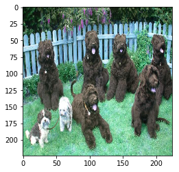

## 卷积神经网络（Convolutional Neural Network, CNN）

## 项目：实现一个狗品种识别算法App

在这个notebook文件中，有些模板代码已经提供给你，但你还需要实现更多的功能来完成这个项目。除非有明确要求，你无须修改任何已给出的代码。以**'(练习)'**开始的标题表示接下来的代码部分中有你需要实现的功能。这些部分都配有详细的指导，需要实现的部分也会在注释中以'TODO'标出。请仔细阅读所有的提示。

除了实现代码外，你还**需要**回答一些与项目及代码相关的问题。每个需要回答的问题都会以 **'问题 X'** 标记。请仔细阅读每个问题，并且在问题后的 **'回答'** 部分写出完整的答案。我们将根据 你对问题的回答 和 撰写代码实现的功能 来对你提交的项目进行评分。

>**提示：**Code 和 Markdown 区域可通过 **Shift + Enter** 快捷键运行。此外，Markdown可以通过双击进入编辑模式。

项目中显示为_选做_的部分可以帮助你的项目脱颖而出，而不是仅仅达到通过的最低要求。如果你决定追求更高的挑战，请在此 notebook 中完成_选做_部分的代码。

---

### 让我们开始吧
在这个notebook中，你将迈出第一步，来开发可以作为移动端或 Web应用程序一部分的算法。在这个项目的最后，你的程序将能够把用户提供的任何一个图像作为输入。如果可以从图像中检测到一只狗，它会输出对狗品种的预测。如果图像中是一个人脸，它会预测一个与其最相似的狗的种类。下面这张图展示了完成项目后可能的输出结果。（……实际上我们希望每个学生的输出结果不相同！）


在现实世界中，你需要拼凑一系列的模型来完成不同的任务；举个例子，用来预测狗种类的算法会与预测人类的算法不同。在做项目的过程中，你可能会遇到不少失败的预测，因为并不存在完美的算法和模型。你最终提交的不完美的解决方案也一定会给你带来一个有趣的学习经验！

### 项目内容

我们将这个notebook分为不同的步骤，你可以使用下面的链接来浏览此notebook。

* [Step 0](#step0): 导入数据集
* [Step 1](#step1): 检测人脸
* [Step 2](#step2): 检测狗狗
* [Step 3](#step3): 从头创建一个CNN来分类狗品种
* [Step 4](#step4): 使用一个CNN来区分狗的品种(使用迁移学习)
* [Step 5](#step5): 建立一个CNN来分类狗的品种（使用迁移学习）
* [Step 6](#step6): 完成你的算法
* [Step 7](#step7): 测试你的算法

在该项目中包含了如下的问题：

* [问题 1](#question1)
* [问题 2](#question2)
* [问题 3](#question3)
* [问题 4](#question4)
* [问题 5](#question5)
* [问题 6](#question6)
* [问题 7](#question7)
* [问题 8](#question8)
* [问题 9](#question9)
* [问题 10](#question10)
* [问题 11](#question11)


---
<a id='step0'></a>
## 步骤 0: 导入数据集

### 导入狗数据集
在下方的代码单元（cell）中，我们导入了一个狗图像的数据集。我们使用 scikit-learn 库中的 `load_files` 函数来获取一些变量：
- `train_files`, `valid_files`, `test_files` - 包含图像的文件路径的numpy数组
- `train_targets`, `valid_targets`, `test_targets` - 包含独热编码分类标签的numpy数组
- `dog_names` - 由字符串构成的与标签相对应的狗的种类


```python
from sklearn.datasets import load_files       
from keras.utils import np_utils
import numpy as np
from glob import glob

# 定义函数来加载train，test和validation数据集
def load_dataset(path):
    data = load_files(path)
    dog_files = np.array(data['filenames'])
    dog_targets = np_utils.to_categorical(np.array(data['target']), 133)
    return dog_files, dog_targets

# 加载train，test和validation数据集
train_files, train_targets = load_dataset('dogImages/train')
valid_files, valid_targets = load_dataset('dogImages/valid')
test_files, test_targets = load_dataset('dogImages/test')

# 加载狗品种列表
dog_names = [item[20:-1] for item in sorted(glob("dogImages/train/*/"))]

# 打印数据统计描述
print('There are %d total dog categories.' % len(dog_names))
print('There are %s total dog images.\n' % len(np.hstack([train_files, valid_files, test_files])))
print('There are %d training dog images.' % len(train_files))
print('There are %d validation dog images.' % len(valid_files))
print('There are %d test dog images.'% len(test_files))
```

    There are 133 total dog categories.
    There are 8351 total dog images.
    
    There are 6680 training dog images.
    There are 835 validation dog images.
    There are 836 test dog images.
    

### 导入人脸数据集

在下方的代码单元中，我们导入人脸图像数据集，文件所在路径存储在名为 `human_files` 的 numpy 数组。


```python
import random
random.seed(8675309)

# 加载打乱后的人脸数据集的文件名
human_files = np.array(glob("lfw/*/*"))
random.shuffle(human_files)

# 打印数据集的数据量
print('There are %d total human images.' % len(human_files))
```

    There are 13233 total human images.
    

---
<a id='step1'></a>
## 步骤1：检测人脸
 
我们将使用 OpenCV 中的 [Haar feature-based cascade classifiers](http://docs.opencv.org/trunk/d7/d8b/tutorial_py_face_detection.html) 来检测图像中的人脸。OpenCV 提供了很多预训练的人脸检测模型，它们以XML文件保存在 [github](https://github.com/opencv/opencv/tree/master/data/haarcascades)。我们已经下载了其中一个检测模型，并且把它存储在 `haarcascades` 的目录中。

在如下代码单元中，我们将演示如何使用这个检测模型在样本图像中找到人脸。


```python
import cv2       # 没有使用命令 pip install opencv-python            
import matplotlib.pyplot as plt                        
%matplotlib inline                               

# 提取预训练的人脸检测模型
face_cascade = cv2.CascadeClassifier('haarcascades/haarcascade_frontalface_alt.xml')

# 加载彩色（通道顺序为BGR）图像
img = cv2.imread(human_files[7])

# 将BGR图像进行灰度处理
gray = cv2.cvtColor(img, cv2.COLOR_BGR2GRAY)

# 在图像中找出脸
faces = face_cascade.detectMultiScale(gray)

# 打印图像中检测到的脸的个数
print('Number of faces detected:', len(faces))

# 获取每一个所检测到的脸的识别框
for (x,y,w,h) in faces:
    # 在人脸图像中绘制出识别框
    cv2.rectangle(img,(x,y),(x+w,y+h),(255,0,0),2)
    
# 将BGR图像转变为RGB图像以打印
cv_rgb = cv2.cvtColor(img, cv2.COLOR_BGR2RGB)

# 展示含有识别框的图像
plt.imshow(cv_rgb)
plt.show()
```

    Number of faces detected: 1
    


    

    


在使用任何一个检测模型之前，将图像转换为灰度图是常用过程。`detectMultiScale` 函数使用储存在 `face_cascade` 中的的数据，对输入的灰度图像进行分类。

在上方的代码中，`faces` 以 numpy 数组的形式，保存了识别到的面部信息。它其中每一行表示一个被检测到的脸，该数据包括如下四个信息：前两个元素  `x`、`y` 代表识别框左上角的 x 和 y 坐标（参照上图，注意 y 坐标的方向和我们默认的方向不同）；后两个元素代表识别框在 x 和 y 轴两个方向延伸的长度 `w` 和 `d`。 

### 写一个人脸识别器

我们可以将这个程序封装为一个函数。该函数的输入为人脸图像的**路径**，当图像中包含人脸时，该函数返回 `True`，反之返回 `False`。该函数定义如下所示。


```python
# 如果img_path路径表示的图像检测到了脸，返回"True" 
def face_detector(img_path):
    img = cv2.imread(img_path)
    gray = cv2.cvtColor(img, cv2.COLOR_BGR2GRAY)
    faces = face_cascade.detectMultiScale(gray)
    return len(faces) > 0
```

### **【练习】** 评估人脸检测模型


---

<a id='question1'></a>
### __问题 1:__ 

在下方的代码块中，使用 `face_detector` 函数，计算：

- `human_files` 的前100张图像中，能够检测到**人脸**的图像占比多少？
- `dog_files` 的前100张图像中，能够检测到**人脸**的图像占比多少？

理想情况下，人图像中检测到人脸的概率应当为100%，而狗图像中检测到人脸的概率应该为0%。你会发现我们的算法并非完美，但结果仍然是可以接受的。我们从每个数据集中提取前100个图像的文件路径，并将它们存储在`human_files_short`和`dog_files_short`中。


```python
human_files_short = human_files[:100]
dog_files_short   = train_files[:100]
## 请不要修改上方代码
#print(human_files_short)

## TODO: 基于human_files_short和dog_files_short

list_human = list(map(face_detector, human_files_short))

list_dog   = list(map(face_detector, dog_files_short))

hunman_files_humanper = (list_human.count(True))/len(list_human)

dog_files_humanper    = (list_dog.count(True))/len(list_dog)

#print(list_human)
print("human_files 的前100张图像中，能够检测到人脸的图像占比 {:.2%} ".format(hunman_files_humanper))
#print(list_dog)
print("dog_files 的前100张图像中，能够检测到人脸的图像占比 {:.2%}".format(dog_files_humanper))
## 中的图像测试face_detector的表现


```

    human_files 的前100张图像中，能够检测到人脸的图像占比 99.00% 
    dog_files 的前100张图像中，能够检测到人脸的图像占比 12.00%
    

---

<a id='question2'></a>

### __问题 2:__ 

就算法而言，该算法成功与否的关键在于，用户能否提供含有清晰面部特征的人脸图像。
那么你认为，这样的要求在实际使用中对用户合理吗？如果你觉得不合理，你能否想到一个方法，即使图像中并没有清晰的面部特征，也能够检测到人脸？

__回答:__ 场景是需要进行人脸识别的一些APP或者其他应用上要求用户提供清晰的这个方法还是可行的；在很多场景下这中方法可能不太合适，可以通过训练一个CNN来实现。这里有一篇关于人脸识别算法参考资料：https://www.jiqizhixin.com/articles/2017-12-17-7

---

<a id='Selection1'></a>
### 选做：

我们建议在你的算法中使用opencv的人脸检测模型去检测人类图像，不过你可以自由地探索其他的方法，尤其是尝试使用深度学习来解决它:)。请用下方的代码单元来设计和测试你的面部监测算法。如果你决定完成这个_选做_任务，你需要报告算法在每一个数据集上的表现。


```python
## (选做) TODO: 报告另一个面部检测算法在LFW数据集上的表现
### 你可以随意使用所需的代码单元数

```

---
<a id='step2'></a>

## 步骤 2: 检测狗狗

在这个部分中，我们使用预训练的 [ResNet-50](http://ethereon.github.io/netscope/#/gist/db945b393d40bfa26006) 模型去检测图像中的狗。下方的第一行代码就是下载了 ResNet-50 模型的网络结构参数，以及基于 [ImageNet](http://www.image-net.org/) 数据集的预训练权重。

ImageNet 这目前一个非常流行的数据集，常被用来测试图像分类等计算机视觉任务相关的算法。它包含超过一千万个 URL，每一个都链接到 [1000 categories](https://gist.github.com/yrevar/942d3a0ac09ec9e5eb3a) 中所对应的一个物体的图像。任给输入一个图像，该 ResNet-50 模型会返回一个对图像中物体的预测结果。


```python
from keras.applications.resnet50 import ResNet50

# 定义ResNet50模型
ResNet50_model = ResNet50(weights='imagenet')
```

### 数据预处理

- 在使用 TensorFlow 作为后端的时候，在 Keras 中，CNN 的输入是一个4维数组（也被称作4维张量），它的各维度尺寸为 `(nb_samples, rows, columns, channels)`。其中 `nb_samples` 表示图像（或者样本）的总数，`rows`, `columns`, 和 `channels` 分别表示图像的行数、列数和通道数。


- 下方的 `path_to_tensor` 函数实现如下将彩色图像的字符串型的文件路径作为输入，返回一个4维张量，作为 Keras CNN 输入。因为我们的输入图像是彩色图像，因此它们具有三个通道（ `channels` 为 `3`）。
    1. 该函数首先读取一张图像，然后将其缩放为 224×224 的图像。
    2. 随后，该图像被调整为具有4个维度的张量。
    3. 对于任一输入图像，最后返回的张量的维度是：`(1, 224, 224, 3)`。


- `paths_to_tensor` 函数将图像路径的字符串组成的 numpy 数组作为输入，并返回一个4维张量，各维度尺寸为 `(nb_samples, 224, 224, 3)`。 在这里，`nb_samples`是提供的图像路径的数据中的样本数量或图像数量。你也可以将 `nb_samples` 理解为数据集中3维张量的个数（每个3维张量表示一个不同的图像。


```python
from keras.preprocessing import image                  
from tqdm import tqdm

def path_to_tensor(img_path):
    # 用PIL加载RGB图像为PIL.Image.Image类型
    img = image.load_img(img_path, target_size=(224, 224))
    # 将PIL.Image.Image类型转化为格式为(224, 224, 3)的3维张量
    x = image.img_to_array(img)
    # 将3维张量转化为格式为(1, 224, 224, 3)的4维张量并返回
    return np.expand_dims(x, axis=0)

def paths_to_tensor(img_paths):
    list_of_tensors = [path_to_tensor(img_path) for img_path in tqdm(img_paths)]
    return np.vstack(list_of_tensors)
```

### 基于 ResNet-50 架构进行预测

对于通过上述步骤得到的四维张量，在把它们输入到 ResNet-50 网络、或 Keras 中其他类似的预训练模型之前，还需要进行一些额外的处理：
1. 首先，这些图像的通道顺序为 RGB，我们需要重排他们的通道顺序为 BGR。
2. 其次，预训练模型的输入都进行了额外的归一化过程。因此我们在这里也要对这些张量进行归一化，即对所有图像所有像素都减去像素均值 `[103.939, 116.779, 123.68]`（以 RGB 模式表示，根据所有的 ImageNet 图像算出）。

导入的 `preprocess_input` 函数实现了这些功能。如果你对此很感兴趣，可以在 [这里](https://github.com/fchollet/keras/blob/master/keras/applications/imagenet_utils.py) 查看 `preprocess_input`的代码。


在实现了图像处理的部分之后，我们就可以使用模型来进行预测。这一步通过 `predict` 方法来实现，它返回一个向量，向量的第 i 个元素表示该图像属于第 i 个 ImageNet 类别的概率。这通过如下的 `ResNet50_predict_labels` 函数实现。

通过对预测出的向量取用 argmax 函数（找到有最大概率值的下标序号），我们可以得到一个整数，即模型预测到的物体的类别。进而根据这个 [清单](https://gist.github.com/yrevar/942d3a0ac09ec9e5eb3a)，我们能够知道这具体是哪个品种的狗狗。


```python
from keras.applications.resnet50 import preprocess_input, decode_predictions
def ResNet50_predict_labels(img_path):
    # 返回img_path路径的图像的预测向量
    img = preprocess_input(path_to_tensor(img_path))
    return np.argmax(ResNet50_model.predict(img))
```

### 完成狗检测模型


在研究该 [清单](https://gist.github.com/yrevar/942d3a0ac09ec9e5eb3a) 的时候，你会注意到，狗类别对应的序号为151-268。因此，在检查预训练模型判断图像是否包含狗的时候，我们只需要检查如上的 `ResNet50_predict_labels` 函数是否返回一个介于151和268之间（包含区间端点）的值。

我们通过这些想法来完成下方的 `dog_detector` 函数，如果从图像中检测到狗就返回 `True`，否则返回 `False`。


```python
def dog_detector(img_path):
    prediction = ResNet50_predict_labels(img_path)
    return ((prediction <= 268) & (prediction >= 151)) 
```

### 【作业】评估狗狗检测模型

---

<a id='question3'></a>
### __问题 3:__ 

在下方的代码块中，使用 `dog_detector` 函数，计算：

- `human_files_short`中图像检测到狗狗的百分比？
- `dog_files_short`中图像检测到狗狗的百分比？


```python
### TODO: 测试dog_detector函数在human_files_short和dog_files_short的表现
list_human = list(map(dog_detector, human_files_short))
list_dog = list(map(dog_detector, dog_files_short))
hunman_files_dogper = (list_human.count(True))/len(list_human)
dog_files_dogper = (list_dog.count(True))/len(list_dog)
#print(list_human)
print("human_files_short中图像检测到狗狗的百分比 {:.2%} ".format(hunman_files_dogper))
#print(list_dog)
print("dog_files_short中图像检测到狗狗的百分比 {:.2%}".format(dog_files_dogper))
```

    human_files_short中图像检测到狗狗的百分比 1.00% 
    dog_files_short中图像检测到狗狗的百分比 100.00%
    

---

<a id='step3'></a>

## 步骤 3: 从头开始创建一个CNN来分类狗品种


现在我们已经实现了一个函数，能够在图像中识别人类及狗狗。但我们需要更进一步的方法，来对狗的类别进行识别。在这一步中，你需要实现一个卷积神经网络来对狗的品种进行分类。你需要__从头实现__你的卷积神经网络（在这一阶段，你还不能使用迁移学习），并且你需要达到超过1%的测试集准确率。在本项目的步骤五种，你还有机会使用迁移学习来实现一个准确率大大提高的模型。

在添加卷积层的时候，注意不要加上太多的（可训练的）层。更多的参数意味着更长的训练时间，也就是说你更可能需要一个 GPU 来加速训练过程。万幸的是，Keras 提供了能够轻松预测每次迭代（epoch）花费时间所需的函数。你可以据此推断你算法所需的训练时间。

值得注意的是，对狗的图像进行分类是一项极具挑战性的任务。因为即便是一个正常人，也很难区分布列塔尼犬和威尔士史宾格犬。


布列塔尼犬（Brittany） | 威尔士史宾格犬（Welsh Springer Spaniel）
- | - 
 | 

不难发现其他的狗品种会有很小的类间差别（比如金毛寻回犬和美国水猎犬）。


金毛寻回犬（Curly-Coated Retriever） | 美国水猎犬（American Water Spaniel）
- | -
 | 

同样，拉布拉多犬（labradors）有黄色、棕色和黑色这三种。那么你设计的基于视觉的算法将不得不克服这种较高的类间差别，以达到能够将这些不同颜色的同类狗分到同一个品种中。

黄色拉布拉多犬（Yellow Labrador） | 棕色拉布拉多犬（Chocolate Labrador） | 黑色拉布拉多犬（Black Labrador）
- | -
 |  | 

我们也提到了随机分类将得到一个非常低的结果：不考虑品种略有失衡的影响，随机猜测到正确品种的概率是1/133，相对应的准确率是低于1%的。

请记住，在深度学习领域，实践远远高于理论。大量尝试不同的框架吧，相信你的直觉！当然，玩得开心！


### 数据预处理


通过对每张图像的像素值除以255，我们对图像实现了归一化处理。


```python
from PIL import ImageFile                            
ImageFile.LOAD_TRUNCATED_IMAGES = True                 


# Keras中的数据预处理过程
train_tensors = paths_to_tensor(train_files).astype('float32')/255

valid_tensors = paths_to_tensor(valid_files).astype('float32')/255

test_tensors = paths_to_tensor(test_files).astype('float32')/255
```

    100%|██████████████████████████████████████████████████████████████████████████████| 6680/6680 [01:10<00:00, 94.28it/s]
    100%|████████████████████████████████████████████████████████████████████████████████| 835/835 [00:08<00:00, 95.27it/s]
    100%|████████████████████████████████████████████████████████████████████████████████| 836/836 [00:08<00:00, 97.50it/s]
    

### 【练习】模型架构


创建一个卷积神经网络来对狗品种进行分类。在你代码块的最后，执行 `model.summary()` 来输出你模型的总结信息。
    
我们已经帮你导入了一些所需的 Python 库，如有需要你可以自行导入。如果你在过程中遇到了困难，如下是给你的一点小提示——该模型能够在5个 epoch 内取得超过1%的测试准确率，并且能在CPU上很快地训练。


---

<a id='question4'></a>  

### __问题 4:__ 

在下方的代码块中尝试使用 Keras 搭建卷积网络的架构，并回答相关的问题。

1. 你可以尝试自己搭建一个卷积网络的模型，那么你需要回答你搭建卷积网络的具体步骤（用了哪些层）以及为什么这样搭建。
2. 你也可以根据上图提示的步骤搭建卷积网络，那么请说明为何如上的架构能够在该问题上取得很好的表现。

__回答:__ 
我决定选择用于图像识别的标准基本CNN结构,该网络以三个卷积层（每一层都有相应的最大池化层）,最后两层由完全连接层组成。第一个卷积层过滤器的数量是16,过滤器对图像中的轮廓很敏感,后面两个卷积层过滤器数量逐渐加倍,以识别更复杂的特征形状。利用（relu）激活函数将使网络不易于线性变换。 'relu'激活函数非常适合图像检测任务,并允许CNN非常有效地进行反向传播。最后一层使用softmax将每个图像的概率应用于每个类标签,并返回概率值。


```python
from keras.layers import Conv2D, MaxPooling2D, GlobalAveragePooling2D,Activation
from keras.layers import Dropout, Flatten, Dense
from keras.models import Sequential

model = Sequential()  #搭建一个书架

# output_size =1+ (input_size+2*padding-kernel_size)/stride 
### TODO: 定义你的网络架构

model.add(Conv2D(16,(2,2),input_shape=(224,224,3),padding = 'valid',activation='relu'))
model.add(MaxPooling2D(pool_size=(2,2),strides=2))
model.add(Conv2D(32,(2,2),padding = 'valid', activation='relu'))
model.add(MaxPooling2D(pool_size=(2,2),strides=2))
model.add(Conv2D(64,(2,2),padding = 'valid',activation='relu'))
model.add(MaxPooling2D(pool_size=(2,2),strides=2))
model.add(GlobalAveragePooling2D())
model.add(Dense(500, activation='relu'))
model.add(Dense(units=133,activation='softmax'))

model.summary()
```

    _________________________________________________________________
    Layer (type)                 Output Shape              Param #   
    =================================================================
    conv2d_7 (Conv2D)            (None, 223, 223, 16)      208       
    _________________________________________________________________
    max_pooling2d_9 (MaxPooling2 (None, 111, 111, 16)      0         
    _________________________________________________________________
    conv2d_8 (Conv2D)            (None, 110, 110, 32)      2080      
    _________________________________________________________________
    max_pooling2d_10 (MaxPooling (None, 55, 55, 32)        0         
    _________________________________________________________________
    conv2d_9 (Conv2D)            (None, 54, 54, 64)        8256      
    _________________________________________________________________
    max_pooling2d_11 (MaxPooling (None, 27, 27, 64)        0         
    _________________________________________________________________
    global_average_pooling2d_3 ( (None, 64)                0         
    _________________________________________________________________
    dense_5 (Dense)              (None, 500)               32500     
    _________________________________________________________________
    dense_6 (Dense)              (None, 133)               66633     
    =================================================================
    Total params: 109,677
    Trainable params: 109,677
    Non-trainable params: 0
    _________________________________________________________________
    


```python
## 编译模型
model.compile(optimizer='rmsprop', loss='categorical_crossentropy', metrics=['accuracy'])
```

---

## 【练习】训练模型


---

<a id='question5'></a>  

### __问题 5:__ 

在下方代码单元训练模型。使用模型检查点（model checkpointing）来储存具有最低验证集 loss 的模型。

可选题：你也可以对训练集进行 [数据增强](https://blog.keras.io/building-powerful-image-classification-models-using-very-little-data.html)，来优化模型的表现。


```python
from keras.callbacks import ModelCheckpoint  

### TODO: 设置训练模型的epochs的数量

epochs = 10

### 不要修改下方代码

checkpointer = ModelCheckpoint(filepath='saved_models/weights.best.from_scratch.hdf5', 
                               verbose=1, save_best_only=True)

model.fit(train_tensors, train_targets, 
          validation_data=(valid_tensors, valid_targets),
          epochs=epochs, batch_size=20, callbacks=[checkpointer], verbose=1)


```

    Train on 6680 samples, validate on 835 samples
    Epoch 1/10
    4040/6680 [=================>............] - ETA: 12:11 - loss: 4.8779 - acc: 0.0000e+ - ETA: 7:27 - loss: 4.8868 - acc: 0.0000e+00 - ETA: 5:51 - loss: 4.8919 - acc: 0.0000e+0 - ETA: 5:02 - loss: 4.8913 - acc: 0.0125    - ETA: 4:35 - loss: 4.8920 - acc: 0.010 - ETA: 4:19 - loss: 4.8916 - acc: 0.008 - ETA: 4:05 - loss: 4.8886 - acc: 0.007 - ETA: 3:53 - loss: 4.8902 - acc: 0.006 - ETA: 3:44 - loss: 4.8930 - acc: 0.011 - ETA: 3:37 - loss: 4.8936 - acc: 0.010 - ETA: 3:31 - loss: 4.8936 - acc: 0.009 - ETA: 3:26 - loss: 4.8927 - acc: 0.008 - ETA: 3:22 - loss: 4.8933 - acc: 0.007 - ETA: 3:18 - loss: 4.8920 - acc: 0.007 - ETA: 3:15 - loss: 4.8924 - acc: 0.010 - ETA: 3:12 - loss: 4.8915 - acc: 0.012 - ETA: 3:09 - loss: 4.8927 - acc: 0.011 - ETA: 3:07 - loss: 4.8922 - acc: 0.011 - ETA: 3:05 - loss: 4.8933 - acc: 0.010 - ETA: 3:03 - loss: 4.8930 - acc: 0.010 - ETA: 3:01 - loss: 4.8934 - acc: 0.009 - ETA: 2:59 - loss: 4.8946 - acc: 0.009 - ETA: 2:58 - loss: 4.8945 - acc: 0.008 - ETA: 2:56 - loss: 4.8940 - acc: 0.008 - ETA: 2:55 - loss: 4.8939 - acc: 0.008 - ETA: 2:53 - loss: 4.8929 - acc: 0.007 - ETA: 2:52 - loss: 4.8932 - acc: 0.007 - ETA: 2:51 - loss: 4.8933 - acc: 0.008 - ETA: 2:49 - loss: 4.8933 - acc: 0.008 - ETA: 2:48 - loss: 4.8932 - acc: 0.008 - ETA: 2:47 - loss: 4.8931 - acc: 0.008 - ETA: 2:46 - loss: 4.8929 - acc: 0.007 - ETA: 2:45 - loss: 4.8932 - acc: 0.007 - ETA: 2:44 - loss: 4.8932 - acc: 0.007 - ETA: 2:43 - loss: 4.8930 - acc: 0.007 - ETA: 2:42 - loss: 4.8927 - acc: 0.006 - ETA: 2:41 - loss: 4.8924 - acc: 0.006 - ETA: 2:40 - loss: 4.8930 - acc: 0.006 - ETA: 2:39 - loss: 4.8927 - acc: 0.006 - ETA: 2:38 - loss: 4.8928 - acc: 0.006 - ETA: 2:37 - loss: 4.8927 - acc: 0.006 - ETA: 2:37 - loss: 4.8922 - acc: 0.006 - ETA: 2:36 - loss: 4.8919 - acc: 0.005 - ETA: 2:35 - loss: 4.8919 - acc: 0.005 - ETA: 2:34 - loss: 4.8915 - acc: 0.005 - ETA: 2:33 - loss: 4.8911 - acc: 0.005 - ETA: 2:33 - loss: 4.8910 - acc: 0.005 - ETA: 2:32 - loss: 4.8912 - acc: 0.005 - ETA: 2:31 - loss: 4.8908 - acc: 0.005 - ETA: 2:31 - loss: 4.8909 - acc: 0.005 - ETA: 2:30 - loss: 4.8909 - acc: 0.004 - ETA: 2:29 - loss: 4.8908 - acc: 0.004 - ETA: 2:29 - loss: 4.8912 - acc: 0.004 - ETA: 2:28 - loss: 4.8910 - acc: 0.004 - ETA: 2:27 - loss: 4.8908 - acc: 0.004 - ETA: 2:27 - loss: 4.8908 - acc: 0.004 - ETA: 2:26 - loss: 4.8908 - acc: 0.004 - ETA: 2:25 - loss: 4.8912 - acc: 0.004 - ETA: 2:25 - loss: 4.8913 - acc: 0.004 - ETA: 2:24 - loss: 4.8914 - acc: 0.004 - ETA: 2:23 - loss: 4.8914 - acc: 0.004 - ETA: 2:23 - loss: 4.8911 - acc: 0.004 - ETA: 2:22 - loss: 4.8914 - acc: 0.004 - ETA: 2:21 - loss: 4.8912 - acc: 0.004 - ETA: 2:21 - loss: 4.8912 - acc: 0.004 - ETA: 2:20 - loss: 4.8916 - acc: 0.004 - ETA: 2:19 - loss: 4.8911 - acc: 0.004 - ETA: 2:19 - loss: 4.8910 - acc: 0.004 - ETA: 2:18 - loss: 4.8911 - acc: 0.004 - ETA: 2:18 - loss: 4.8911 - acc: 0.004 - ETA: 2:17 - loss: 4.8909 - acc: 0.004 - ETA: 2:16 - loss: 4.8909 - acc: 0.004 - ETA: 2:16 - loss: 4.8906 - acc: 0.004 - ETA: 2:15 - loss: 4.8906 - acc: 0.004 - ETA: 2:15 - loss: 4.8902 - acc: 0.004 - ETA: 2:14 - loss: 4.8902 - acc: 0.004 - ETA: 2:13 - loss: 4.8901 - acc: 0.004 - ETA: 2:13 - loss: 4.8903 - acc: 0.004 - ETA: 2:12 - loss: 4.8902 - acc: 0.004 - ETA: 2:12 - loss: 4.8904 - acc: 0.004 - ETA: 2:11 - loss: 4.8904 - acc: 0.004 - ETA: 2:11 - loss: 4.8903 - acc: 0.005 - ETA: 2:10 - loss: 4.8899 - acc: 0.005 - ETA: 2:09 - loss: 4.8900 - acc: 0.005 - ETA: 2:09 - loss: 4.8900 - acc: 0.005 - ETA: 2:08 - loss: 4.8901 - acc: 0.005 - ETA: 2:08 - loss: 4.8902 - acc: 0.005 - ETA: 2:07 - loss: 4.8900 - acc: 0.005 - ETA: 2:06 - loss: 4.8902 - acc: 0.005 - ETA: 2:06 - loss: 4.8900 - acc: 0.006 - ETA: 2:05 - loss: 4.8902 - acc: 0.006 - ETA: 2:05 - loss: 4.8899 - acc: 0.006 - ETA: 2:04 - loss: 4.8900 - acc: 0.005 - ETA: 2:04 - loss: 4.8898 - acc: 0.005 - ETA: 2:03 - loss: 4.8897 - acc: 0.005 - ETA: 2:03 - loss: 4.8895 - acc: 0.005 - ETA: 2:02 - loss: 4.8895 - acc: 0.005 - ETA: 2:01 - loss: 4.8896 - acc: 0.005 - ETA: 2:01 - loss: 4.8894 - acc: 0.005 - ETA: 2:00 - loss: 4.8897 - acc: 0.006 - ETA: 2:00 - loss: 4.8898 - acc: 0.005 - ETA: 1:59 - loss: 4.8895 - acc: 0.005 - ETA: 1:59 - loss: 4.8897 - acc: 0.005 - ETA: 1:58 - loss: 4.8898 - acc: 0.005 - ETA: 1:58 - loss: 4.8898 - acc: 0.005 - ETA: 1:57 - loss: 4.8897 - acc: 0.005 - ETA: 1:57 - loss: 4.8896 - acc: 0.006 - ETA: 1:56 - loss: 4.8894 - acc: 0.006 - ETA: 1:56 - loss: 4.8892 - acc: 0.006 - ETA: 1:55 - loss: 4.8892 - acc: 0.006 - ETA: 1:55 - loss: 4.8891 - acc: 0.006 - ETA: 1:54 - loss: 4.8892 - acc: 0.006 - ETA: 1:54 - loss: 4.8889 - acc: 0.006 - ETA: 1:53 - loss: 4.8890 - acc: 0.006 - ETA: 1:53 - loss: 4.8889 - acc: 0.006 - ETA: 1:52 - loss: 4.8885 - acc: 0.006 - ETA: 1:52 - loss: 4.8891 - acc: 0.006 - ETA: 1:51 - loss: 4.8888 - acc: 0.006 - ETA: 1:51 - loss: 4.8889 - acc: 0.006 - ETA: 1:50 - loss: 4.8891 - acc: 0.007 - ETA: 1:50 - loss: 4.8889 - acc: 0.007 - ETA: 1:49 - loss: 4.8886 - acc: 0.007 - ETA: 1:48 - loss: 4.8886 - acc: 0.007 - ETA: 1:48 - loss: 4.8887 - acc: 0.007 - ETA: 1:47 - loss: 4.8885 - acc: 0.008 - ETA: 1:47 - loss: 4.8886 - acc: 0.007 - ETA: 1:46 - loss: 4.8886 - acc: 0.008 - ETA: 1:46 - loss: 4.8887 - acc: 0.008 - ETA: 1:45 - loss: 4.8889 - acc: 0.008 - ETA: 1:45 - loss: 4.8889 - acc: 0.008 - ETA: 1:44 - loss: 4.8888 - acc: 0.008 - ETA: 1:44 - loss: 4.8889 - acc: 0.008 - ETA: 1:43 - loss: 4.8889 - acc: 0.008 - ETA: 1:42 - loss: 4.8886 - acc: 0.008 - ETA: 1:42 - loss: 4.8888 - acc: 0.008 - ETA: 1:41 - loss: 4.8886 - acc: 0.008 - ETA: 1:41 - loss: 4.8888 - acc: 0.008 - ETA: 1:40 - loss: 4.8888 - acc: 0.008 - ETA: 1:40 - loss: 4.8886 - acc: 0.008 - ETA: 1:39 - loss: 4.8886 - acc: 0.008 - ETA: 1:39 - loss: 4.8886 - acc: 0.008 - ETA: 1:38 - loss: 4.8885 - acc: 0.008 - ETA: 1:38 - loss: 4.8884 - acc: 0.008 - ETA: 1:37 - loss: 4.8885 - acc: 0.008 - ETA: 1:37 - loss: 4.8882 - acc: 0.008 - ETA: 1:36 - loss: 4.8884 - acc: 0.008 - ETA: 1:35 - loss: 4.8881 - acc: 0.008 - ETA: 1:35 - loss: 4.8881 - acc: 0.008 - ETA: 1:34 - loss: 4.8881 - acc: 0.008 - ETA: 1:34 - loss: 4.8879 - acc: 0.008 - ETA: 1:33 - loss: 4.8879 - acc: 0.008 - ETA: 1:33 - loss: 4.8876 - acc: 0.008 - ETA: 1:32 - loss: 4.8877 - acc: 0.008 - ETA: 1:32 - loss: 4.8876 - acc: 0.008 - ETA: 1:31 - loss: 4.8876 - acc: 0.008 - ETA: 1:31 - loss: 4.8878 - acc: 0.008 - ETA: 1:30 - loss: 4.8879 - acc: 0.008 - ETA: 1:30 - loss: 4.8879 - acc: 0.008 - ETA: 1:29 - loss: 4.8878 - acc: 0.008 - ETA: 1:29 - loss: 4.8879 - acc: 0.008 - ETA: 1:28 - loss: 4.8878 - acc: 0.008 - ETA: 1:28 - loss: 4.8877 - acc: 0.008 - ETA: 1:27 - loss: 4.8878 - acc: 0.008 - ETA: 1:26 - loss: 4.8876 - acc: 0.008 - ETA: 1:26 - loss: 4.8878 - acc: 0.008 - ETA: 1:25 - loss: 4.8880 - acc: 0.008 - ETA: 1:25 - loss: 4.8880 - acc: 0.008 - ETA: 1:24 - loss: 4.8879 - acc: 0.008 - ETA: 1:24 - loss: 4.8877 - acc: 0.008 - ETA: 1:23 - loss: 4.8879 - acc: 0.008 - ETA: 1:23 - loss: 4.8879 - acc: 0.008 - ETA: 1:22 - loss: 4.8876 - acc: 0.008 - ETA: 1:22 - loss: 4.8875 - acc: 0.008 - ETA: 1:21 - loss: 4.8873 - acc: 0.008 - ETA: 1:21 - loss: 4.8874 - acc: 0.008 - ETA: 1:20 - loss: 4.8873 - acc: 0.008 - ETA: 1:20 - loss: 4.8875 - acc: 0.008 - ETA: 1:19 - loss: 4.8876 - acc: 0.008 - ETA: 1:19 - loss: 4.8877 - acc: 0.008 - ETA: 1:18 - loss: 4.8878 - acc: 0.008 - ETA: 1:18 - loss: 4.8877 - acc: 0.008 - ETA: 1:17 - loss: 4.8878 - acc: 0.008 - ETA: 1:17 - loss: 4.8876 - acc: 0.008 - ETA: 1:16 - loss: 4.8877 - acc: 0.008 - ETA: 1:15 - loss: 4.8878 - acc: 0.008 - ETA: 1:15 - loss: 4.8877 - acc: 0.008 - ETA: 1:14 - loss: 4.8876 - acc: 0.008 - ETA: 1:14 - loss: 4.8874 - acc: 0.008 - ETA: 1:13 - loss: 4.8873 - acc: 0.008 - ETA: 1:13 - loss: 4.8874 - acc: 0.008 - ETA: 1:12 - loss: 4.8874 - acc: 0.008 - ETA: 1:12 - loss: 4.8871 - acc: 0.008 - ETA: 1:11 - loss: 4.8873 - acc: 0.008 - ETA: 1:11 - loss: 4.8874 - acc: 0.008 - ETA: 1:10 - loss: 4.8873 - acc: 0.008 - ETA: 1:10 - loss: 4.8874 - acc: 0.008 - ETA: 1:09 - loss: 4.8871 - acc: 0.008 - ETA: 1:09 - loss: 4.8871 - acc: 0.008 - ETA: 1:08 - loss: 4.8872 - acc: 0.008 - ETA: 1:08 - loss: 4.8870 - acc: 0.008 - ETA: 1:07 - loss: 4.8869 - acc: 0.008 - ETA: 1:07 - loss: 4.8869 - acc: 0.00846680/6680 [==============================] - ETA: 1:06 - loss: 4.8868 - acc: 0.008 - ETA: 1:06 - loss: 4.8865 - acc: 0.008 - ETA: 1:05 - loss: 4.8870 - acc: 0.008 - ETA: 1:05 - loss: 4.8869 - acc: 0.008 - ETA: 1:04 - loss: 4.8865 - acc: 0.008 - ETA: 1:04 - loss: 4.8865 - acc: 0.008 - ETA: 1:03 - loss: 4.8866 - acc: 0.008 - ETA: 1:03 - loss: 4.8867 - acc: 0.008 - ETA: 1:02 - loss: 4.8868 - acc: 0.008 - ETA: 1:02 - loss: 4.8867 - acc: 0.008 - ETA: 1:01 - loss: 4.8867 - acc: 0.008 - ETA: 1:01 - loss: 4.8870 - acc: 0.008 - ETA: 1:00 - loss: 4.8869 - acc: 0.008 - ETA: 59s - loss: 4.8871 - acc: 0.008 - ETA: 59s - loss: 4.8869 - acc: 0.00 - ETA: 58s - loss: 4.8866 - acc: 0.00 - ETA: 58s - loss: 4.8866 - acc: 0.00 - ETA: 57s - loss: 4.8866 - acc: 0.00 - ETA: 57s - loss: 4.8864 - acc: 0.00 - ETA: 56s - loss: 4.8864 - acc: 0.00 - ETA: 56s - loss: 4.8863 - acc: 0.00 - ETA: 55s - loss: 4.8862 - acc: 0.00 - ETA: 55s - loss: 4.8861 - acc: 0.00 - ETA: 54s - loss: 4.8860 - acc: 0.00 - ETA: 54s - loss: 4.8858 - acc: 0.00 - ETA: 53s - loss: 4.8855 - acc: 0.00 - ETA: 53s - loss: 4.8857 - acc: 0.00 - ETA: 52s - loss: 4.8852 - acc: 0.00 - ETA: 52s - loss: 4.8852 - acc: 0.00 - ETA: 51s - loss: 4.8851 - acc: 0.00 - ETA: 51s - loss: 4.8843 - acc: 0.00 - ETA: 50s - loss: 4.8849 - acc: 0.00 - ETA: 50s - loss: 4.8850 - acc: 0.00 - ETA: 49s - loss: 4.8852 - acc: 0.00 - ETA: 49s - loss: 4.8850 - acc: 0.00 - ETA: 48s - loss: 4.8850 - acc: 0.00 - ETA: 48s - loss: 4.8853 - acc: 0.00 - ETA: 47s - loss: 4.8851 - acc: 0.01 - ETA: 47s - loss: 4.8854 - acc: 0.01 - ETA: 46s - loss: 4.8853 - acc: 0.00 - ETA: 46s - loss: 4.8851 - acc: 0.00 - ETA: 45s - loss: 4.8850 - acc: 0.01 - ETA: 45s - loss: 4.8852 - acc: 0.01 - ETA: 44s - loss: 4.8852 - acc: 0.01 - ETA: 44s - loss: 4.8851 - acc: 0.01 - ETA: 43s - loss: 4.8850 - acc: 0.01 - ETA: 43s - loss: 4.8848 - acc: 0.01 - ETA: 42s - loss: 4.8848 - acc: 0.01 - ETA: 42s - loss: 4.8850 - acc: 0.01 - ETA: 41s - loss: 4.8849 - acc: 0.00 - ETA: 41s - loss: 4.8849 - acc: 0.00 - ETA: 40s - loss: 4.8850 - acc: 0.00 - ETA: 40s - loss: 4.8850 - acc: 0.00 - ETA: 39s - loss: 4.8848 - acc: 0.00 - ETA: 39s - loss: 4.8846 - acc: 0.00 - ETA: 38s - loss: 4.8845 - acc: 0.00 - ETA: 38s - loss: 4.8845 - acc: 0.00 - ETA: 37s - loss: 4.8842 - acc: 0.00 - ETA: 37s - loss: 4.8849 - acc: 0.00 - ETA: 36s - loss: 4.8846 - acc: 0.00 - ETA: 36s - loss: 4.8845 - acc: 0.00 - ETA: 35s - loss: 4.8846 - acc: 0.00 - ETA: 34s - loss: 4.8846 - acc: 0.00 - ETA: 34s - loss: 4.8849 - acc: 0.00 - ETA: 33s - loss: 4.8850 - acc: 0.00 - ETA: 33s - loss: 4.8850 - acc: 0.00 - ETA: 32s - loss: 4.8851 - acc: 0.00 - ETA: 32s - loss: 4.8849 - acc: 0.00 - ETA: 31s - loss: 4.8848 - acc: 0.00 - ETA: 31s - loss: 4.8850 - acc: 0.00 - ETA: 30s - loss: 4.8849 - acc: 0.00 - ETA: 30s - loss: 4.8850 - acc: 0.00 - ETA: 29s - loss: 4.8850 - acc: 0.00 - ETA: 29s - loss: 4.8851 - acc: 0.00 - ETA: 28s - loss: 4.8850 - acc: 0.00 - ETA: 28s - loss: 4.8848 - acc: 0.00 - ETA: 27s - loss: 4.8848 - acc: 0.00 - ETA: 27s - loss: 4.8847 - acc: 0.00 - ETA: 26s - loss: 4.8847 - acc: 0.00 - ETA: 26s - loss: 4.8847 - acc: 0.00 - ETA: 25s - loss: 4.8847 - acc: 0.00 - ETA: 25s - loss: 4.8847 - acc: 0.00 - ETA: 24s - loss: 4.8846 - acc: 0.00 - ETA: 24s - loss: 4.8845 - acc: 0.00 - ETA: 23s - loss: 4.8845 - acc: 0.00 - ETA: 23s - loss: 4.8844 - acc: 0.00 - ETA: 22s - loss: 4.8844 - acc: 0.00 - ETA: 22s - loss: 4.8841 - acc: 0.00 - ETA: 21s - loss: 4.8840 - acc: 0.00 - ETA: 21s - loss: 4.8840 - acc: 0.00 - ETA: 20s - loss: 4.8839 - acc: 0.00 - ETA: 20s - loss: 4.8840 - acc: 0.00 - ETA: 19s - loss: 4.8840 - acc: 0.00 - ETA: 19s - loss: 4.8838 - acc: 0.00 - ETA: 18s - loss: 4.8837 - acc: 0.00 - ETA: 18s - loss: 4.8837 - acc: 0.00 - ETA: 17s - loss: 4.8836 - acc: 0.00 - ETA: 17s - loss: 4.8838 - acc: 0.00 - ETA: 16s - loss: 4.8836 - acc: 0.00 - ETA: 16s - loss: 4.8836 - acc: 0.00 - ETA: 15s - loss: 4.8837 - acc: 0.00 - ETA: 15s - loss: 4.8836 - acc: 0.00 - ETA: 14s - loss: 4.8836 - acc: 0.00 - ETA: 14s - loss: 4.8836 - acc: 0.00 - ETA: 13s - loss: 4.8836 - acc: 0.00 - ETA: 13s - loss: 4.8837 - acc: 0.00 - ETA: 12s - loss: 4.8836 - acc: 0.00 - ETA: 12s - loss: 4.8834 - acc: 0.00 - ETA: 11s - loss: 4.8831 - acc: 0.00 - ETA: 11s - loss: 4.8828 - acc: 0.00 - ETA: 10s - loss: 4.8827 - acc: 0.00 - ETA: 10s - loss: 4.8826 - acc: 0.00 - ETA: 9s - loss: 4.8825 - acc: 0.0098 - ETA: 9s - loss: 4.8823 - acc: 0.009 - ETA: 8s - loss: 4.8821 - acc: 0.009 - ETA: 8s - loss: 4.8822 - acc: 0.009 - ETA: 7s - loss: 4.8820 - acc: 0.009 - ETA: 7s - loss: 4.8813 - acc: 0.009 - ETA: 6s - loss: 4.8812 - acc: 0.010 - ETA: 6s - loss: 4.8811 - acc: 0.009 - ETA: 5s - loss: 4.8810 - acc: 0.009 - ETA: 5s - loss: 4.8814 - acc: 0.009 - ETA: 4s - loss: 4.8814 - acc: 0.009 - ETA: 4s - loss: 4.8814 - acc: 0.009 - ETA: 3s - loss: 4.8816 - acc: 0.009 - ETA: 3s - loss: 4.8816 - acc: 0.009 - ETA: 2s - loss: 4.8817 - acc: 0.009 - ETA: 2s - loss: 4.8818 - acc: 0.009 - ETA: 1s - loss: 4.8817 - acc: 0.010 - ETA: 1s - loss: 4.8816 - acc: 0.009 - ETA: 0s - loss: 4.8815 - acc: 0.010 - 176s 26ms/step - loss: 4.8812 - acc: 0.0103 - val_loss: 4.8603 - val_acc: 0.0120
    
    Epoch 00001: val_loss improved from inf to 4.86034, saving model to saved_models/weights.best.from_scratch.hdf5
    Epoch 2/10
    4080/6680 [=================>............] - ETA: 2:37 - loss: 4.9625 - acc: 0.0000e+0 - ETA: 2:38 - loss: 4.9139 - acc: 0.0000e+0 - ETA: 2:36 - loss: 4.8993 - acc: 0.0000e+0 - ETA: 2:37 - loss: 4.8886 - acc: 0.0000e+0 - ETA: 2:36 - loss: 4.8692 - acc: 0.0000e+0 - ETA: 2:35 - loss: 4.8631 - acc: 0.0083    - ETA: 2:35 - loss: 4.8809 - acc: 0.007 - ETA: 2:35 - loss: 4.8771 - acc: 0.012 - ETA: 2:34 - loss: 4.8789 - acc: 0.022 - ETA: 2:34 - loss: 4.8765 - acc: 0.020 - ETA: 2:34 - loss: 4.8767 - acc: 0.018 - ETA: 2:33 - loss: 4.8731 - acc: 0.025 - ETA: 2:33 - loss: 4.8735 - acc: 0.023 - ETA: 2:33 - loss: 4.8722 - acc: 0.021 - ETA: 2:32 - loss: 4.8679 - acc: 0.020 - ETA: 2:32 - loss: 4.8691 - acc: 0.021 - ETA: 2:32 - loss: 4.8667 - acc: 0.020 - ETA: 2:31 - loss: 4.8631 - acc: 0.019 - ETA: 2:30 - loss: 4.8605 - acc: 0.021 - ETA: 2:30 - loss: 4.8571 - acc: 0.022 - ETA: 2:30 - loss: 4.8563 - acc: 0.021 - ETA: 2:29 - loss: 4.8553 - acc: 0.022 - ETA: 2:29 - loss: 4.8569 - acc: 0.021 - ETA: 2:28 - loss: 4.8569 - acc: 0.020 - ETA: 2:28 - loss: 4.8595 - acc: 0.020 - ETA: 2:28 - loss: 4.8594 - acc: 0.019 - ETA: 2:27 - loss: 4.8593 - acc: 0.018 - ETA: 2:27 - loss: 4.8614 - acc: 0.017 - ETA: 2:26 - loss: 4.8622 - acc: 0.017 - ETA: 2:26 - loss: 4.8607 - acc: 0.018 - ETA: 2:26 - loss: 4.8609 - acc: 0.017 - ETA: 2:25 - loss: 4.8610 - acc: 0.017 - ETA: 2:25 - loss: 4.8622 - acc: 0.016 - ETA: 2:24 - loss: 4.8631 - acc: 0.016 - ETA: 2:24 - loss: 4.8630 - acc: 0.015 - ETA: 2:23 - loss: 4.8626 - acc: 0.015 - ETA: 2:23 - loss: 4.8615 - acc: 0.016 - ETA: 2:22 - loss: 4.8603 - acc: 0.017 - ETA: 2:22 - loss: 4.8606 - acc: 0.016 - ETA: 2:21 - loss: 4.8576 - acc: 0.018 - ETA: 2:21 - loss: 4.8568 - acc: 0.018 - ETA: 2:21 - loss: 4.8547 - acc: 0.017 - ETA: 2:20 - loss: 4.8531 - acc: 0.018 - ETA: 2:20 - loss: 4.8503 - acc: 0.019 - ETA: 2:19 - loss: 4.8497 - acc: 0.018 - ETA: 2:19 - loss: 4.8488 - acc: 0.019 - ETA: 2:19 - loss: 4.8497 - acc: 0.019 - ETA: 2:18 - loss: 4.8517 - acc: 0.018 - ETA: 2:18 - loss: 4.8531 - acc: 0.018 - ETA: 2:17 - loss: 4.8532 - acc: 0.018 - ETA: 2:17 - loss: 4.8518 - acc: 0.017 - ETA: 2:16 - loss: 4.8495 - acc: 0.018 - ETA: 2:16 - loss: 4.8523 - acc: 0.017 - ETA: 2:15 - loss: 4.8544 - acc: 0.017 - ETA: 2:15 - loss: 4.8537 - acc: 0.018 - ETA: 2:14 - loss: 4.8538 - acc: 0.017 - ETA: 2:14 - loss: 4.8526 - acc: 0.018 - ETA: 2:13 - loss: 4.8519 - acc: 0.018 - ETA: 2:13 - loss: 4.8505 - acc: 0.017 - ETA: 2:12 - loss: 4.8504 - acc: 0.017 - ETA: 2:12 - loss: 4.8498 - acc: 0.017 - ETA: 2:11 - loss: 4.8508 - acc: 0.016 - ETA: 2:11 - loss: 4.8509 - acc: 0.017 - ETA: 2:10 - loss: 4.8504 - acc: 0.017 - ETA: 2:10 - loss: 4.8504 - acc: 0.016 - ETA: 2:09 - loss: 4.8497 - acc: 0.016 - ETA: 2:09 - loss: 4.8494 - acc: 0.016 - ETA: 2:08 - loss: 4.8501 - acc: 0.016 - ETA: 2:08 - loss: 4.8490 - acc: 0.015 - ETA: 2:08 - loss: 4.8494 - acc: 0.015 - ETA: 2:07 - loss: 4.8490 - acc: 0.016 - ETA: 2:07 - loss: 4.8472 - acc: 0.016 - ETA: 2:06 - loss: 4.8474 - acc: 0.016 - ETA: 2:06 - loss: 4.8475 - acc: 0.016 - ETA: 2:05 - loss: 4.8477 - acc: 0.016 - ETA: 2:05 - loss: 4.8471 - acc: 0.015 - ETA: 2:04 - loss: 4.8460 - acc: 0.015 - ETA: 2:04 - loss: 4.8457 - acc: 0.016 - ETA: 2:03 - loss: 4.8453 - acc: 0.015 - ETA: 2:03 - loss: 4.8454 - acc: 0.015 - ETA: 2:02 - loss: 4.8467 - acc: 0.015 - ETA: 2:02 - loss: 4.8467 - acc: 0.015 - ETA: 2:01 - loss: 4.8461 - acc: 0.015 - ETA: 2:01 - loss: 4.8477 - acc: 0.015 - ETA: 2:00 - loss: 4.8474 - acc: 0.015 - ETA: 2:00 - loss: 4.8479 - acc: 0.015 - ETA: 1:59 - loss: 4.8481 - acc: 0.015 - ETA: 1:59 - loss: 4.8481 - acc: 0.015 - ETA: 1:58 - loss: 4.8479 - acc: 0.015 - ETA: 1:58 - loss: 4.8470 - acc: 0.015 - ETA: 1:57 - loss: 4.8472 - acc: 0.015 - ETA: 1:57 - loss: 4.8450 - acc: 0.015 - ETA: 1:56 - loss: 4.8456 - acc: 0.015 - ETA: 1:56 - loss: 4.8465 - acc: 0.015 - ETA: 1:55 - loss: 4.8457 - acc: 0.015 - ETA: 1:55 - loss: 4.8465 - acc: 0.015 - ETA: 1:54 - loss: 4.8472 - acc: 0.015 - ETA: 1:54 - loss: 4.8467 - acc: 0.015 - ETA: 1:53 - loss: 4.8460 - acc: 0.015 - ETA: 1:53 - loss: 4.8469 - acc: 0.015 - ETA: 1:52 - loss: 4.8470 - acc: 0.015 - ETA: 1:52 - loss: 4.8476 - acc: 0.015 - ETA: 1:51 - loss: 4.8475 - acc: 0.015 - ETA: 1:51 - loss: 4.8485 - acc: 0.015 - ETA: 1:50 - loss: 4.8492 - acc: 0.015 - ETA: 1:50 - loss: 4.8495 - acc: 0.015 - ETA: 1:49 - loss: 4.8501 - acc: 0.015 - ETA: 1:49 - loss: 4.8500 - acc: 0.015 - ETA: 1:49 - loss: 4.8499 - acc: 0.015 - ETA: 1:48 - loss: 4.8508 - acc: 0.015 - ETA: 1:48 - loss: 4.8506 - acc: 0.014 - ETA: 1:47 - loss: 4.8496 - acc: 0.015 - ETA: 1:47 - loss: 4.8493 - acc: 0.015 - ETA: 1:46 - loss: 4.8495 - acc: 0.015 - ETA: 1:46 - loss: 4.8492 - acc: 0.015 - ETA: 1:45 - loss: 4.8489 - acc: 0.015 - ETA: 1:45 - loss: 4.8486 - acc: 0.015 - ETA: 1:44 - loss: 4.8485 - acc: 0.015 - ETA: 1:44 - loss: 4.8490 - acc: 0.015 - ETA: 1:43 - loss: 4.8488 - acc: 0.015 - ETA: 1:43 - loss: 4.8490 - acc: 0.015 - ETA: 1:42 - loss: 4.8498 - acc: 0.015 - ETA: 1:42 - loss: 4.8489 - acc: 0.015 - ETA: 1:41 - loss: 4.8491 - acc: 0.015 - ETA: 1:41 - loss: 4.8485 - acc: 0.015 - ETA: 1:40 - loss: 4.8488 - acc: 0.015 - ETA: 1:40 - loss: 4.8489 - acc: 0.015 - ETA: 1:39 - loss: 4.8483 - acc: 0.015 - ETA: 1:39 - loss: 4.8489 - acc: 0.015 - ETA: 1:38 - loss: 4.8490 - acc: 0.015 - ETA: 1:38 - loss: 4.8482 - acc: 0.015 - ETA: 1:37 - loss: 4.8480 - acc: 0.015 - ETA: 1:37 - loss: 4.8486 - acc: 0.015 - ETA: 1:36 - loss: 4.8483 - acc: 0.016 - ETA: 1:36 - loss: 4.8490 - acc: 0.015 - ETA: 1:35 - loss: 4.8479 - acc: 0.015 - ETA: 1:35 - loss: 4.8477 - acc: 0.015 - ETA: 1:34 - loss: 4.8480 - acc: 0.015 - ETA: 1:34 - loss: 4.8479 - acc: 0.015 - ETA: 1:34 - loss: 4.8482 - acc: 0.015 - ETA: 1:33 - loss: 4.8481 - acc: 0.015 - ETA: 1:33 - loss: 4.8491 - acc: 0.015 - ETA: 1:32 - loss: 4.8487 - acc: 0.015 - ETA: 1:32 - loss: 4.8485 - acc: 0.015 - ETA: 1:31 - loss: 4.8486 - acc: 0.015 - ETA: 1:31 - loss: 4.8479 - acc: 0.015 - ETA: 1:30 - loss: 4.8474 - acc: 0.015 - ETA: 1:30 - loss: 4.8481 - acc: 0.015 - ETA: 1:29 - loss: 4.8483 - acc: 0.015 - ETA: 1:29 - loss: 4.8472 - acc: 0.015 - ETA: 1:28 - loss: 4.8468 - acc: 0.016 - ETA: 1:28 - loss: 4.8462 - acc: 0.016 - ETA: 1:28 - loss: 4.8453 - acc: 0.016 - ETA: 1:27 - loss: 4.8445 - acc: 0.016 - ETA: 1:27 - loss: 4.8446 - acc: 0.016 - ETA: 1:26 - loss: 4.8439 - acc: 0.016 - ETA: 1:26 - loss: 4.8449 - acc: 0.015 - ETA: 1:25 - loss: 4.8447 - acc: 0.016 - ETA: 1:25 - loss: 4.8451 - acc: 0.016 - ETA: 1:24 - loss: 4.8450 - acc: 0.015 - ETA: 1:24 - loss: 4.8457 - acc: 0.015 - ETA: 1:23 - loss: 4.8456 - acc: 0.015 - ETA: 1:23 - loss: 4.8462 - acc: 0.016 - ETA: 1:22 - loss: 4.8463 - acc: 0.016 - ETA: 1:22 - loss: 4.8461 - acc: 0.016 - ETA: 1:21 - loss: 4.8464 - acc: 0.016 - ETA: 1:21 - loss: 4.8458 - acc: 0.015 - ETA: 1:20 - loss: 4.8458 - acc: 0.016 - ETA: 1:20 - loss: 4.8462 - acc: 0.016 - ETA: 1:19 - loss: 4.8466 - acc: 0.016 - ETA: 1:19 - loss: 4.8465 - acc: 0.016 - ETA: 1:18 - loss: 4.8458 - acc: 0.016 - ETA: 1:18 - loss: 4.8456 - acc: 0.015 - ETA: 1:17 - loss: 4.8449 - acc: 0.015 - ETA: 1:17 - loss: 4.8456 - acc: 0.016 - ETA: 1:16 - loss: 4.8457 - acc: 0.015 - ETA: 1:16 - loss: 4.8457 - acc: 0.015 - ETA: 1:15 - loss: 4.8460 - acc: 0.016 - ETA: 1:15 - loss: 4.8458 - acc: 0.016 - ETA: 1:14 - loss: 4.8460 - acc: 0.016 - ETA: 1:14 - loss: 4.8467 - acc: 0.016 - ETA: 1:13 - loss: 4.8460 - acc: 0.016 - ETA: 1:13 - loss: 4.8461 - acc: 0.016 - ETA: 1:13 - loss: 4.8463 - acc: 0.017 - ETA: 1:12 - loss: 4.8459 - acc: 0.017 - ETA: 1:12 - loss: 4.8463 - acc: 0.017 - ETA: 1:11 - loss: 4.8459 - acc: 0.017 - ETA: 1:11 - loss: 4.8445 - acc: 0.018 - ETA: 1:10 - loss: 4.8444 - acc: 0.018 - ETA: 1:10 - loss: 4.8443 - acc: 0.017 - ETA: 1:09 - loss: 4.8446 - acc: 0.017 - ETA: 1:09 - loss: 4.8444 - acc: 0.017 - ETA: 1:08 - loss: 4.8443 - acc: 0.017 - ETA: 1:08 - loss: 4.8452 - acc: 0.017 - ETA: 1:07 - loss: 4.8448 - acc: 0.017 - ETA: 1:07 - loss: 4.8441 - acc: 0.017 - ETA: 1:06 - loss: 4.8444 - acc: 0.017 - ETA: 1:06 - loss: 4.8444 - acc: 0.017 - ETA: 1:05 - loss: 4.8445 - acc: 0.017 - ETA: 1:05 - loss: 4.8447 - acc: 0.017 - ETA: 1:04 - loss: 4.8451 - acc: 0.017 - ETA: 1:04 - loss: 4.8452 - acc: 0.017 - ETA: 1:03 - loss: 4.8448 - acc: 0.017 - ETA: 1:03 - loss: 4.8450 - acc: 0.01726680/6680 [==============================] - ETA: 1:02 - loss: 4.8452 - acc: 0.017 - ETA: 1:02 - loss: 4.8452 - acc: 0.017 - ETA: 1:01 - loss: 4.8451 - acc: 0.017 - ETA: 1:01 - loss: 4.8448 - acc: 0.017 - ETA: 1:00 - loss: 4.8452 - acc: 0.017 - ETA: 1:00 - loss: 4.8454 - acc: 0.017 - ETA: 59s - loss: 4.8446 - acc: 0.017 - ETA: 59s - loss: 4.8439 - acc: 0.01 - ETA: 58s - loss: 4.8441 - acc: 0.01 - ETA: 58s - loss: 4.8428 - acc: 0.01 - ETA: 57s - loss: 4.8423 - acc: 0.01 - ETA: 57s - loss: 4.8426 - acc: 0.01 - ETA: 56s - loss: 4.8425 - acc: 0.01 - ETA: 56s - loss: 4.8420 - acc: 0.01 - ETA: 55s - loss: 4.8421 - acc: 0.01 - ETA: 55s - loss: 4.8412 - acc: 0.01 - ETA: 54s - loss: 4.8407 - acc: 0.01 - ETA: 54s - loss: 4.8402 - acc: 0.01 - ETA: 53s - loss: 4.8398 - acc: 0.01 - ETA: 53s - loss: 4.8397 - acc: 0.01 - ETA: 53s - loss: 4.8393 - acc: 0.01 - ETA: 52s - loss: 4.8390 - acc: 0.01 - ETA: 52s - loss: 4.8381 - acc: 0.01 - ETA: 51s - loss: 4.8379 - acc: 0.01 - ETA: 51s - loss: 4.8382 - acc: 0.01 - ETA: 50s - loss: 4.8381 - acc: 0.01 - ETA: 50s - loss: 4.8382 - acc: 0.01 - ETA: 49s - loss: 4.8382 - acc: 0.01 - ETA: 49s - loss: 4.8378 - acc: 0.01 - ETA: 48s - loss: 4.8374 - acc: 0.01 - ETA: 48s - loss: 4.8376 - acc: 0.01 - ETA: 47s - loss: 4.8377 - acc: 0.01 - ETA: 47s - loss: 4.8373 - acc: 0.01 - ETA: 46s - loss: 4.8373 - acc: 0.01 - ETA: 46s - loss: 4.8374 - acc: 0.01 - ETA: 45s - loss: 4.8373 - acc: 0.01 - ETA: 45s - loss: 4.8371 - acc: 0.01 - ETA: 44s - loss: 4.8372 - acc: 0.01 - ETA: 44s - loss: 4.8368 - acc: 0.01 - ETA: 43s - loss: 4.8361 - acc: 0.01 - ETA: 43s - loss: 4.8363 - acc: 0.01 - ETA: 42s - loss: 4.8361 - acc: 0.01 - ETA: 42s - loss: 4.8352 - acc: 0.01 - ETA: 41s - loss: 4.8353 - acc: 0.01 - ETA: 41s - loss: 4.8351 - acc: 0.01 - ETA: 40s - loss: 4.8346 - acc: 0.01 - ETA: 40s - loss: 4.8338 - acc: 0.01 - ETA: 39s - loss: 4.8342 - acc: 0.01 - ETA: 39s - loss: 4.8350 - acc: 0.01 - ETA: 38s - loss: 4.8349 - acc: 0.01 - ETA: 38s - loss: 4.8347 - acc: 0.01 - ETA: 37s - loss: 4.8344 - acc: 0.01 - ETA: 37s - loss: 4.8341 - acc: 0.01 - ETA: 36s - loss: 4.8337 - acc: 0.01 - ETA: 36s - loss: 4.8337 - acc: 0.01 - ETA: 35s - loss: 4.8343 - acc: 0.01 - ETA: 35s - loss: 4.8348 - acc: 0.01 - ETA: 34s - loss: 4.8351 - acc: 0.01 - ETA: 34s - loss: 4.8351 - acc: 0.01 - ETA: 34s - loss: 4.8347 - acc: 0.01 - ETA: 33s - loss: 4.8346 - acc: 0.01 - ETA: 33s - loss: 4.8343 - acc: 0.01 - ETA: 32s - loss: 4.8345 - acc: 0.01 - ETA: 32s - loss: 4.8345 - acc: 0.01 - ETA: 31s - loss: 4.8344 - acc: 0.01 - ETA: 31s - loss: 4.8347 - acc: 0.01 - ETA: 30s - loss: 4.8340 - acc: 0.01 - ETA: 30s - loss: 4.8340 - acc: 0.01 - ETA: 29s - loss: 4.8338 - acc: 0.01 - ETA: 29s - loss: 4.8335 - acc: 0.01 - ETA: 28s - loss: 4.8345 - acc: 0.01 - ETA: 28s - loss: 4.8341 - acc: 0.01 - ETA: 27s - loss: 4.8340 - acc: 0.01 - ETA: 27s - loss: 4.8335 - acc: 0.01 - ETA: 26s - loss: 4.8334 - acc: 0.01 - ETA: 26s - loss: 4.8333 - acc: 0.01 - ETA: 25s - loss: 4.8339 - acc: 0.01 - ETA: 25s - loss: 4.8337 - acc: 0.01 - ETA: 24s - loss: 4.8341 - acc: 0.01 - ETA: 24s - loss: 4.8343 - acc: 0.01 - ETA: 23s - loss: 4.8339 - acc: 0.01 - ETA: 23s - loss: 4.8341 - acc: 0.01 - ETA: 22s - loss: 4.8339 - acc: 0.01 - ETA: 22s - loss: 4.8340 - acc: 0.01 - ETA: 21s - loss: 4.8338 - acc: 0.01 - ETA: 21s - loss: 4.8337 - acc: 0.01 - ETA: 20s - loss: 4.8331 - acc: 0.01 - ETA: 20s - loss: 4.8333 - acc: 0.01 - ETA: 19s - loss: 4.8330 - acc: 0.01 - ETA: 19s - loss: 4.8335 - acc: 0.01 - ETA: 18s - loss: 4.8332 - acc: 0.01 - ETA: 18s - loss: 4.8334 - acc: 0.01 - ETA: 17s - loss: 4.8337 - acc: 0.01 - ETA: 17s - loss: 4.8337 - acc: 0.01 - ETA: 16s - loss: 4.8336 - acc: 0.01 - ETA: 16s - loss: 4.8333 - acc: 0.01 - ETA: 16s - loss: 4.8331 - acc: 0.01 - ETA: 15s - loss: 4.8330 - acc: 0.01 - ETA: 15s - loss: 4.8325 - acc: 0.01 - ETA: 14s - loss: 4.8323 - acc: 0.01 - ETA: 14s - loss: 4.8321 - acc: 0.01 - ETA: 13s - loss: 4.8322 - acc: 0.01 - ETA: 13s - loss: 4.8322 - acc: 0.01 - ETA: 12s - loss: 4.8322 - acc: 0.01 - ETA: 12s - loss: 4.8321 - acc: 0.01 - ETA: 11s - loss: 4.8327 - acc: 0.01 - ETA: 11s - loss: 4.8323 - acc: 0.01 - ETA: 10s - loss: 4.8325 - acc: 0.01 - ETA: 10s - loss: 4.8324 - acc: 0.01 - ETA: 9s - loss: 4.8320 - acc: 0.0170 - ETA: 9s - loss: 4.8322 - acc: 0.017 - ETA: 8s - loss: 4.8320 - acc: 0.017 - ETA: 8s - loss: 4.8317 - acc: 0.017 - ETA: 7s - loss: 4.8318 - acc: 0.017 - ETA: 7s - loss: 4.8313 - acc: 0.017 - ETA: 6s - loss: 4.8316 - acc: 0.017 - ETA: 6s - loss: 4.8313 - acc: 0.017 - ETA: 5s - loss: 4.8319 - acc: 0.017 - ETA: 5s - loss: 4.8320 - acc: 0.017 - ETA: 4s - loss: 4.8318 - acc: 0.017 - ETA: 4s - loss: 4.8322 - acc: 0.017 - ETA: 3s - loss: 4.8327 - acc: 0.017 - ETA: 3s - loss: 4.8325 - acc: 0.017 - ETA: 2s - loss: 4.8326 - acc: 0.017 - ETA: 2s - loss: 4.8325 - acc: 0.017 - ETA: 1s - loss: 4.8325 - acc: 0.017 - ETA: 1s - loss: 4.8325 - acc: 0.017 - ETA: 0s - loss: 4.8323 - acc: 0.017 - ETA: 0s - loss: 4.8321 - acc: 0.017 - 170s 26ms/step - loss: 4.8322 - acc: 0.0178 - val_loss: 4.7923 - val_acc: 0.0216
    
    Epoch 00002: val_loss improved from 4.86034 to 4.79226, saving model to saved_models/weights.best.from_scratch.hdf5
    Epoch 3/10
    4080/6680 [=================>............] - ETA: 2:45 - loss: 4.7071 - acc: 0.100 - ETA: 2:42 - loss: 4.6843 - acc: 0.050 - ETA: 2:44 - loss: 4.7110 - acc: 0.033 - ETA: 2:42 - loss: 4.7247 - acc: 0.037 - ETA: 2:40 - loss: 4.7264 - acc: 0.040 - ETA: 2:39 - loss: 4.7149 - acc: 0.033 - ETA: 2:39 - loss: 4.7175 - acc: 0.035 - ETA: 2:38 - loss: 4.6960 - acc: 0.037 - ETA: 2:38 - loss: 4.7076 - acc: 0.038 - ETA: 2:37 - loss: 4.7075 - acc: 0.040 - ETA: 2:37 - loss: 4.7162 - acc: 0.036 - ETA: 2:36 - loss: 4.7295 - acc: 0.033 - ETA: 2:36 - loss: 4.7341 - acc: 0.034 - ETA: 2:35 - loss: 4.7567 - acc: 0.032 - ETA: 2:35 - loss: 4.7651 - acc: 0.030 - ETA: 2:34 - loss: 4.7519 - acc: 0.031 - ETA: 2:34 - loss: 4.7571 - acc: 0.032 - ETA: 2:33 - loss: 4.7471 - acc: 0.038 - ETA: 2:33 - loss: 4.7382 - acc: 0.039 - ETA: 2:32 - loss: 4.7523 - acc: 0.037 - ETA: 2:31 - loss: 4.7634 - acc: 0.035 - ETA: 2:31 - loss: 4.7647 - acc: 0.034 - ETA: 2:31 - loss: 4.7577 - acc: 0.034 - ETA: 2:30 - loss: 4.7594 - acc: 0.033 - ETA: 2:30 - loss: 4.7568 - acc: 0.032 - ETA: 2:29 - loss: 4.7577 - acc: 0.030 - ETA: 2:29 - loss: 4.7572 - acc: 0.029 - ETA: 2:28 - loss: 4.7590 - acc: 0.028 - ETA: 2:28 - loss: 4.7543 - acc: 0.029 - ETA: 2:27 - loss: 4.7480 - acc: 0.028 - ETA: 2:26 - loss: 4.7423 - acc: 0.027 - ETA: 2:26 - loss: 4.7356 - acc: 0.029 - ETA: 2:25 - loss: 4.7365 - acc: 0.028 - ETA: 2:25 - loss: 4.7354 - acc: 0.027 - ETA: 2:24 - loss: 4.7406 - acc: 0.027 - ETA: 2:24 - loss: 4.7448 - acc: 0.027 - ETA: 2:24 - loss: 4.7472 - acc: 0.027 - ETA: 2:24 - loss: 4.7487 - acc: 0.026 - ETA: 2:23 - loss: 4.7487 - acc: 0.025 - ETA: 2:23 - loss: 4.7473 - acc: 0.025 - ETA: 2:23 - loss: 4.7496 - acc: 0.024 - ETA: 2:22 - loss: 4.7488 - acc: 0.023 - ETA: 2:21 - loss: 4.7517 - acc: 0.024 - ETA: 2:21 - loss: 4.7531 - acc: 0.023 - ETA: 2:20 - loss: 4.7526 - acc: 0.023 - ETA: 2:20 - loss: 4.7500 - acc: 0.023 - ETA: 2:20 - loss: 4.7494 - acc: 0.025 - ETA: 2:19 - loss: 4.7523 - acc: 0.025 - ETA: 2:19 - loss: 4.7525 - acc: 0.024 - ETA: 2:18 - loss: 4.7519 - acc: 0.024 - ETA: 2:18 - loss: 4.7517 - acc: 0.023 - ETA: 2:17 - loss: 4.7478 - acc: 0.025 - ETA: 2:17 - loss: 4.7513 - acc: 0.024 - ETA: 2:16 - loss: 4.7510 - acc: 0.024 - ETA: 2:16 - loss: 4.7542 - acc: 0.024 - ETA: 2:15 - loss: 4.7562 - acc: 0.024 - ETA: 2:15 - loss: 4.7561 - acc: 0.023 - ETA: 2:14 - loss: 4.7577 - acc: 0.025 - ETA: 2:14 - loss: 4.7565 - acc: 0.025 - ETA: 2:13 - loss: 4.7548 - acc: 0.025 - ETA: 2:13 - loss: 4.7536 - acc: 0.025 - ETA: 2:12 - loss: 4.7560 - acc: 0.025 - ETA: 2:12 - loss: 4.7582 - acc: 0.024 - ETA: 2:11 - loss: 4.7569 - acc: 0.024 - ETA: 2:11 - loss: 4.7566 - acc: 0.023 - ETA: 2:10 - loss: 4.7583 - acc: 0.023 - ETA: 2:10 - loss: 4.7600 - acc: 0.023 - ETA: 2:09 - loss: 4.7575 - acc: 0.024 - ETA: 2:09 - loss: 4.7527 - acc: 0.024 - ETA: 2:08 - loss: 4.7533 - acc: 0.024 - ETA: 2:08 - loss: 4.7521 - acc: 0.023 - ETA: 2:07 - loss: 4.7531 - acc: 0.024 - ETA: 2:07 - loss: 4.7523 - acc: 0.024 - ETA: 2:06 - loss: 4.7506 - acc: 0.025 - ETA: 2:06 - loss: 4.7534 - acc: 0.024 - ETA: 2:05 - loss: 4.7527 - acc: 0.024 - ETA: 2:05 - loss: 4.7524 - acc: 0.024 - ETA: 2:04 - loss: 4.7509 - acc: 0.023 - ETA: 2:04 - loss: 4.7538 - acc: 0.023 - ETA: 2:03 - loss: 4.7538 - acc: 0.023 - ETA: 2:03 - loss: 4.7535 - acc: 0.023 - ETA: 2:02 - loss: 4.7524 - acc: 0.024 - ETA: 2:02 - loss: 4.7522 - acc: 0.024 - ETA: 2:01 - loss: 4.7540 - acc: 0.024 - ETA: 2:01 - loss: 4.7549 - acc: 0.024 - ETA: 2:00 - loss: 4.7561 - acc: 0.024 - ETA: 2:00 - loss: 4.7551 - acc: 0.024 - ETA: 1:59 - loss: 4.7564 - acc: 0.025 - ETA: 1:59 - loss: 4.7569 - acc: 0.025 - ETA: 1:58 - loss: 4.7577 - acc: 0.025 - ETA: 1:58 - loss: 4.7570 - acc: 0.024 - ETA: 1:57 - loss: 4.7580 - acc: 0.024 - ETA: 1:57 - loss: 4.7587 - acc: 0.024 - ETA: 1:56 - loss: 4.7579 - acc: 0.023 - ETA: 1:56 - loss: 4.7587 - acc: 0.023 - ETA: 1:55 - loss: 4.7598 - acc: 0.023 - ETA: 1:55 - loss: 4.7611 - acc: 0.023 - ETA: 1:54 - loss: 4.7622 - acc: 0.023 - ETA: 1:54 - loss: 4.7604 - acc: 0.022 - ETA: 1:53 - loss: 4.7615 - acc: 0.022 - ETA: 1:53 - loss: 4.7617 - acc: 0.022 - ETA: 1:52 - loss: 4.7618 - acc: 0.022 - ETA: 1:52 - loss: 4.7591 - acc: 0.021 - ETA: 1:51 - loss: 4.7601 - acc: 0.021 - ETA: 1:51 - loss: 4.7600 - acc: 0.021 - ETA: 1:50 - loss: 4.7579 - acc: 0.022 - ETA: 1:50 - loss: 4.7569 - acc: 0.022 - ETA: 1:49 - loss: 4.7571 - acc: 0.021 - ETA: 1:49 - loss: 4.7556 - acc: 0.022 - ETA: 1:48 - loss: 4.7553 - acc: 0.022 - ETA: 1:48 - loss: 4.7589 - acc: 0.022 - ETA: 1:47 - loss: 4.7582 - acc: 0.022 - ETA: 1:47 - loss: 4.7597 - acc: 0.022 - ETA: 1:46 - loss: 4.7589 - acc: 0.022 - ETA: 1:46 - loss: 4.7596 - acc: 0.022 - ETA: 1:45 - loss: 4.7595 - acc: 0.022 - ETA: 1:45 - loss: 4.7596 - acc: 0.022 - ETA: 1:44 - loss: 4.7607 - acc: 0.022 - ETA: 1:44 - loss: 4.7624 - acc: 0.022 - ETA: 1:43 - loss: 4.7607 - acc: 0.022 - ETA: 1:43 - loss: 4.7610 - acc: 0.022 - ETA: 1:42 - loss: 4.7603 - acc: 0.023 - ETA: 1:42 - loss: 4.7605 - acc: 0.022 - ETA: 1:41 - loss: 4.7606 - acc: 0.022 - ETA: 1:41 - loss: 4.7613 - acc: 0.022 - ETA: 1:40 - loss: 4.7602 - acc: 0.022 - ETA: 1:40 - loss: 4.7605 - acc: 0.022 - ETA: 1:39 - loss: 4.7587 - acc: 0.023 - ETA: 1:39 - loss: 4.7591 - acc: 0.023 - ETA: 1:38 - loss: 4.7597 - acc: 0.023 - ETA: 1:38 - loss: 4.7609 - acc: 0.022 - ETA: 1:37 - loss: 4.7604 - acc: 0.023 - ETA: 1:37 - loss: 4.7600 - acc: 0.022 - ETA: 1:37 - loss: 4.7589 - acc: 0.023 - ETA: 1:36 - loss: 4.7595 - acc: 0.023 - ETA: 1:36 - loss: 4.7599 - acc: 0.023 - ETA: 1:35 - loss: 4.7607 - acc: 0.023 - ETA: 1:35 - loss: 4.7603 - acc: 0.023 - ETA: 1:34 - loss: 4.7601 - acc: 0.023 - ETA: 1:34 - loss: 4.7602 - acc: 0.022 - ETA: 1:33 - loss: 4.7614 - acc: 0.023 - ETA: 1:33 - loss: 4.7602 - acc: 0.024 - ETA: 1:32 - loss: 4.7606 - acc: 0.024 - ETA: 1:32 - loss: 4.7598 - acc: 0.024 - ETA: 1:31 - loss: 4.7605 - acc: 0.024 - ETA: 1:31 - loss: 4.7614 - acc: 0.024 - ETA: 1:30 - loss: 4.7608 - acc: 0.024 - ETA: 1:30 - loss: 4.7605 - acc: 0.024 - ETA: 1:29 - loss: 4.7594 - acc: 0.024 - ETA: 1:29 - loss: 4.7595 - acc: 0.024 - ETA: 1:28 - loss: 4.7614 - acc: 0.024 - ETA: 1:28 - loss: 4.7608 - acc: 0.024 - ETA: 1:27 - loss: 4.7607 - acc: 0.024 - ETA: 1:27 - loss: 4.7611 - acc: 0.024 - ETA: 1:27 - loss: 4.7625 - acc: 0.024 - ETA: 1:26 - loss: 4.7628 - acc: 0.024 - ETA: 1:26 - loss: 4.7626 - acc: 0.023 - ETA: 1:25 - loss: 4.7619 - acc: 0.023 - ETA: 1:25 - loss: 4.7615 - acc: 0.023 - ETA: 1:24 - loss: 4.7616 - acc: 0.023 - ETA: 1:24 - loss: 4.7622 - acc: 0.023 - ETA: 1:23 - loss: 4.7611 - acc: 0.023 - ETA: 1:23 - loss: 4.7614 - acc: 0.023 - ETA: 1:22 - loss: 4.7610 - acc: 0.023 - ETA: 1:22 - loss: 4.7615 - acc: 0.023 - ETA: 1:21 - loss: 4.7616 - acc: 0.022 - ETA: 1:21 - loss: 4.7613 - acc: 0.022 - ETA: 1:20 - loss: 4.7615 - acc: 0.022 - ETA: 1:20 - loss: 4.7606 - acc: 0.023 - ETA: 1:19 - loss: 4.7599 - acc: 0.022 - ETA: 1:19 - loss: 4.7601 - acc: 0.022 - ETA: 1:18 - loss: 4.7604 - acc: 0.022 - ETA: 1:18 - loss: 4.7606 - acc: 0.022 - ETA: 1:17 - loss: 4.7613 - acc: 0.022 - ETA: 1:17 - loss: 4.7620 - acc: 0.022 - ETA: 1:16 - loss: 4.7621 - acc: 0.022 - ETA: 1:16 - loss: 4.7616 - acc: 0.022 - ETA: 1:15 - loss: 4.7603 - acc: 0.021 - ETA: 1:15 - loss: 4.7599 - acc: 0.021 - ETA: 1:14 - loss: 4.7594 - acc: 0.021 - ETA: 1:14 - loss: 4.7600 - acc: 0.021 - ETA: 1:13 - loss: 4.7607 - acc: 0.021 - ETA: 1:13 - loss: 4.7605 - acc: 0.021 - ETA: 1:12 - loss: 4.7591 - acc: 0.021 - ETA: 1:12 - loss: 4.7587 - acc: 0.021 - ETA: 1:11 - loss: 4.7585 - acc: 0.021 - ETA: 1:11 - loss: 4.7589 - acc: 0.021 - ETA: 1:10 - loss: 4.7593 - acc: 0.021 - ETA: 1:10 - loss: 4.7593 - acc: 0.021 - ETA: 1:09 - loss: 4.7596 - acc: 0.021 - ETA: 1:09 - loss: 4.7600 - acc: 0.020 - ETA: 1:08 - loss: 4.7606 - acc: 0.020 - ETA: 1:08 - loss: 4.7606 - acc: 0.020 - ETA: 1:07 - loss: 4.7609 - acc: 0.020 - ETA: 1:07 - loss: 4.7605 - acc: 0.020 - ETA: 1:06 - loss: 4.7608 - acc: 0.020 - ETA: 1:06 - loss: 4.7610 - acc: 0.020 - ETA: 1:06 - loss: 4.7611 - acc: 0.021 - ETA: 1:05 - loss: 4.7616 - acc: 0.021 - ETA: 1:05 - loss: 4.7617 - acc: 0.021 - ETA: 1:04 - loss: 4.7613 - acc: 0.020 - ETA: 1:04 - loss: 4.7618 - acc: 0.020 - ETA: 1:03 - loss: 4.7625 - acc: 0.020 - ETA: 1:03 - loss: 4.7613 - acc: 0.02086680/6680 [==============================] - ETA: 1:02 - loss: 4.7615 - acc: 0.021 - ETA: 1:02 - loss: 4.7609 - acc: 0.020 - ETA: 1:01 - loss: 4.7605 - acc: 0.020 - ETA: 1:01 - loss: 4.7604 - acc: 0.020 - ETA: 1:00 - loss: 4.7614 - acc: 0.020 - ETA: 1:00 - loss: 4.7613 - acc: 0.020 - ETA: 59s - loss: 4.7621 - acc: 0.020 - ETA: 59s - loss: 4.7614 - acc: 0.02 - ETA: 58s - loss: 4.7625 - acc: 0.02 - ETA: 58s - loss: 4.7632 - acc: 0.02 - ETA: 57s - loss: 4.7627 - acc: 0.02 - ETA: 57s - loss: 4.7632 - acc: 0.02 - ETA: 56s - loss: 4.7625 - acc: 0.02 - ETA: 56s - loss: 4.7623 - acc: 0.02 - ETA: 55s - loss: 4.7621 - acc: 0.01 - ETA: 55s - loss: 4.7624 - acc: 0.01 - ETA: 54s - loss: 4.7623 - acc: 0.01 - ETA: 54s - loss: 4.7614 - acc: 0.01 - ETA: 53s - loss: 4.7605 - acc: 0.02 - ETA: 53s - loss: 4.7600 - acc: 0.02 - ETA: 52s - loss: 4.7596 - acc: 0.02 - ETA: 52s - loss: 4.7583 - acc: 0.02 - ETA: 51s - loss: 4.7572 - acc: 0.02 - ETA: 51s - loss: 4.7568 - acc: 0.02 - ETA: 50s - loss: 4.7579 - acc: 0.02 - ETA: 50s - loss: 4.7574 - acc: 0.02 - ETA: 49s - loss: 4.7569 - acc: 0.02 - ETA: 49s - loss: 4.7565 - acc: 0.02 - ETA: 48s - loss: 4.7563 - acc: 0.02 - ETA: 48s - loss: 4.7572 - acc: 0.02 - ETA: 47s - loss: 4.7576 - acc: 0.02 - ETA: 47s - loss: 4.7577 - acc: 0.02 - ETA: 46s - loss: 4.7588 - acc: 0.02 - ETA: 46s - loss: 4.7590 - acc: 0.02 - ETA: 46s - loss: 4.7590 - acc: 0.02 - ETA: 45s - loss: 4.7587 - acc: 0.02 - ETA: 45s - loss: 4.7592 - acc: 0.02 - ETA: 44s - loss: 4.7584 - acc: 0.02 - ETA: 44s - loss: 4.7581 - acc: 0.02 - ETA: 43s - loss: 4.7579 - acc: 0.02 - ETA: 43s - loss: 4.7579 - acc: 0.02 - ETA: 42s - loss: 4.7580 - acc: 0.02 - ETA: 42s - loss: 4.7580 - acc: 0.02 - ETA: 41s - loss: 4.7581 - acc: 0.02 - ETA: 41s - loss: 4.7580 - acc: 0.02 - ETA: 40s - loss: 4.7581 - acc: 0.02 - ETA: 40s - loss: 4.7579 - acc: 0.02 - ETA: 39s - loss: 4.7579 - acc: 0.02 - ETA: 39s - loss: 4.7572 - acc: 0.02 - ETA: 38s - loss: 4.7570 - acc: 0.02 - ETA: 38s - loss: 4.7569 - acc: 0.02 - ETA: 37s - loss: 4.7565 - acc: 0.02 - ETA: 37s - loss: 4.7563 - acc: 0.02 - ETA: 36s - loss: 4.7572 - acc: 0.02 - ETA: 36s - loss: 4.7572 - acc: 0.02 - ETA: 35s - loss: 4.7574 - acc: 0.02 - ETA: 35s - loss: 4.7564 - acc: 0.02 - ETA: 34s - loss: 4.7576 - acc: 0.02 - ETA: 34s - loss: 4.7577 - acc: 0.02 - ETA: 33s - loss: 4.7572 - acc: 0.02 - ETA: 33s - loss: 4.7569 - acc: 0.02 - ETA: 32s - loss: 4.7571 - acc: 0.02 - ETA: 32s - loss: 4.7568 - acc: 0.02 - ETA: 31s - loss: 4.7572 - acc: 0.02 - ETA: 31s - loss: 4.7575 - acc: 0.01 - ETA: 30s - loss: 4.7574 - acc: 0.02 - ETA: 30s - loss: 4.7578 - acc: 0.02 - ETA: 30s - loss: 4.7575 - acc: 0.02 - ETA: 29s - loss: 4.7576 - acc: 0.02 - ETA: 29s - loss: 4.7572 - acc: 0.02 - ETA: 28s - loss: 4.7573 - acc: 0.02 - ETA: 28s - loss: 4.7578 - acc: 0.02 - ETA: 27s - loss: 4.7579 - acc: 0.02 - ETA: 27s - loss: 4.7581 - acc: 0.02 - ETA: 26s - loss: 4.7580 - acc: 0.01 - ETA: 26s - loss: 4.7574 - acc: 0.02 - ETA: 25s - loss: 4.7574 - acc: 0.02 - ETA: 25s - loss: 4.7575 - acc: 0.02 - ETA: 24s - loss: 4.7573 - acc: 0.02 - ETA: 24s - loss: 4.7571 - acc: 0.02 - ETA: 23s - loss: 4.7577 - acc: 0.02 - ETA: 23s - loss: 4.7576 - acc: 0.02 - ETA: 22s - loss: 4.7579 - acc: 0.02 - ETA: 22s - loss: 4.7577 - acc: 0.02 - ETA: 21s - loss: 4.7571 - acc: 0.02 - ETA: 21s - loss: 4.7577 - acc: 0.02 - ETA: 20s - loss: 4.7577 - acc: 0.01 - ETA: 20s - loss: 4.7577 - acc: 0.01 - ETA: 19s - loss: 4.7584 - acc: 0.01 - ETA: 19s - loss: 4.7580 - acc: 0.01 - ETA: 18s - loss: 4.7583 - acc: 0.01 - ETA: 18s - loss: 4.7586 - acc: 0.01 - ETA: 17s - loss: 4.7585 - acc: 0.01 - ETA: 17s - loss: 4.7589 - acc: 0.01 - ETA: 16s - loss: 4.7587 - acc: 0.01 - ETA: 16s - loss: 4.7583 - acc: 0.01 - ETA: 15s - loss: 4.7583 - acc: 0.01 - ETA: 15s - loss: 4.7586 - acc: 0.01 - ETA: 15s - loss: 4.7585 - acc: 0.01 - ETA: 14s - loss: 4.7578 - acc: 0.01 - ETA: 14s - loss: 4.7577 - acc: 0.01 - ETA: 13s - loss: 4.7576 - acc: 0.01 - ETA: 13s - loss: 4.7575 - acc: 0.01 - ETA: 12s - loss: 4.7570 - acc: 0.01 - ETA: 12s - loss: 4.7573 - acc: 0.01 - ETA: 11s - loss: 4.7579 - acc: 0.01 - ETA: 11s - loss: 4.7573 - acc: 0.01 - ETA: 10s - loss: 4.7576 - acc: 0.01 - ETA: 10s - loss: 4.7579 - acc: 0.01 - ETA: 9s - loss: 4.7582 - acc: 0.0194 - ETA: 9s - loss: 4.7582 - acc: 0.019 - ETA: 8s - loss: 4.7577 - acc: 0.019 - ETA: 8s - loss: 4.7584 - acc: 0.019 - ETA: 7s - loss: 4.7582 - acc: 0.019 - ETA: 7s - loss: 4.7580 - acc: 0.019 - ETA: 6s - loss: 4.7571 - acc: 0.019 - ETA: 6s - loss: 4.7572 - acc: 0.019 - ETA: 5s - loss: 4.7576 - acc: 0.019 - ETA: 5s - loss: 4.7576 - acc: 0.019 - ETA: 4s - loss: 4.7576 - acc: 0.019 - ETA: 4s - loss: 4.7578 - acc: 0.019 - ETA: 3s - loss: 4.7577 - acc: 0.019 - ETA: 3s - loss: 4.7577 - acc: 0.019 - ETA: 2s - loss: 4.7579 - acc: 0.019 - ETA: 2s - loss: 4.7581 - acc: 0.019 - ETA: 1s - loss: 4.7585 - acc: 0.019 - ETA: 1s - loss: 4.7581 - acc: 0.019 - ETA: 0s - loss: 4.7577 - acc: 0.019 - ETA: 0s - loss: 4.7579 - acc: 0.019 - 169s 25ms/step - loss: 4.7579 - acc: 0.0192 - val_loss: 4.7342 - val_acc: 0.0144
    
    Epoch 00003: val_loss improved from 4.79226 to 4.73423, saving model to saved_models/weights.best.from_scratch.hdf5
    Epoch 4/10
    4080/6680 [=================>............] - ETA: 2:42 - loss: 4.6002 - acc: 0.050 - ETA: 2:41 - loss: 4.6998 - acc: 0.075 - ETA: 2:40 - loss: 4.6581 - acc: 0.050 - ETA: 2:39 - loss: 4.6987 - acc: 0.037 - ETA: 2:38 - loss: 4.7028 - acc: 0.030 - ETA: 2:38 - loss: 4.7085 - acc: 0.025 - ETA: 2:37 - loss: 4.7125 - acc: 0.021 - ETA: 2:36 - loss: 4.7090 - acc: 0.025 - ETA: 2:36 - loss: 4.7210 - acc: 0.022 - ETA: 2:35 - loss: 4.7313 - acc: 0.020 - ETA: 2:35 - loss: 4.7345 - acc: 0.018 - ETA: 2:34 - loss: 4.7313 - acc: 0.016 - ETA: 2:34 - loss: 4.7422 - acc: 0.015 - ETA: 2:33 - loss: 4.7367 - acc: 0.017 - ETA: 2:33 - loss: 4.7377 - acc: 0.016 - ETA: 2:32 - loss: 4.7370 - acc: 0.015 - ETA: 2:32 - loss: 4.7351 - acc: 0.014 - ETA: 2:31 - loss: 4.7368 - acc: 0.016 - ETA: 2:31 - loss: 4.7201 - acc: 0.015 - ETA: 2:30 - loss: 4.7136 - acc: 0.015 - ETA: 2:30 - loss: 4.6996 - acc: 0.016 - ETA: 2:29 - loss: 4.6940 - acc: 0.015 - ETA: 2:29 - loss: 4.6904 - acc: 0.015 - ETA: 2:28 - loss: 4.6856 - acc: 0.014 - ETA: 2:28 - loss: 4.7061 - acc: 0.014 - ETA: 2:27 - loss: 4.7084 - acc: 0.013 - ETA: 2:27 - loss: 4.7165 - acc: 0.013 - ETA: 2:26 - loss: 4.7160 - acc: 0.012 - ETA: 2:26 - loss: 4.7155 - acc: 0.012 - ETA: 2:25 - loss: 4.7127 - acc: 0.011 - ETA: 2:25 - loss: 4.7139 - acc: 0.011 - ETA: 2:24 - loss: 4.7158 - acc: 0.010 - ETA: 2:24 - loss: 4.7204 - acc: 0.012 - ETA: 2:23 - loss: 4.7169 - acc: 0.013 - ETA: 2:23 - loss: 4.7218 - acc: 0.012 - ETA: 2:23 - loss: 4.7189 - acc: 0.012 - ETA: 2:22 - loss: 4.7170 - acc: 0.013 - ETA: 2:22 - loss: 4.7172 - acc: 0.013 - ETA: 2:21 - loss: 4.7135 - acc: 0.012 - ETA: 2:21 - loss: 4.7124 - acc: 0.013 - ETA: 2:20 - loss: 4.7152 - acc: 0.013 - ETA: 2:20 - loss: 4.7149 - acc: 0.013 - ETA: 2:19 - loss: 4.7181 - acc: 0.012 - ETA: 2:19 - loss: 4.7154 - acc: 0.012 - ETA: 2:18 - loss: 4.7145 - acc: 0.012 - ETA: 2:18 - loss: 4.7152 - acc: 0.013 - ETA: 2:18 - loss: 4.7153 - acc: 0.012 - ETA: 2:17 - loss: 4.7154 - acc: 0.012 - ETA: 2:17 - loss: 4.7159 - acc: 0.013 - ETA: 2:16 - loss: 4.7134 - acc: 0.014 - ETA: 2:16 - loss: 4.7099 - acc: 0.013 - ETA: 2:15 - loss: 4.7089 - acc: 0.013 - ETA: 2:15 - loss: 4.7075 - acc: 0.014 - ETA: 2:14 - loss: 4.7081 - acc: 0.014 - ETA: 2:14 - loss: 4.7086 - acc: 0.014 - ETA: 2:13 - loss: 4.7133 - acc: 0.014 - ETA: 2:13 - loss: 4.7153 - acc: 0.014 - ETA: 2:12 - loss: 4.7131 - acc: 0.014 - ETA: 2:12 - loss: 4.7158 - acc: 0.014 - ETA: 2:11 - loss: 4.7160 - acc: 0.014 - ETA: 2:11 - loss: 4.7190 - acc: 0.013 - ETA: 2:10 - loss: 4.7186 - acc: 0.014 - ETA: 2:10 - loss: 4.7205 - acc: 0.014 - ETA: 2:09 - loss: 4.7195 - acc: 0.014 - ETA: 2:09 - loss: 4.7161 - acc: 0.015 - ETA: 2:08 - loss: 4.7144 - acc: 0.015 - ETA: 2:08 - loss: 4.7138 - acc: 0.014 - ETA: 2:08 - loss: 4.7118 - acc: 0.015 - ETA: 2:07 - loss: 4.7119 - acc: 0.015 - ETA: 2:07 - loss: 4.7120 - acc: 0.016 - ETA: 2:06 - loss: 4.7126 - acc: 0.016 - ETA: 2:06 - loss: 4.7108 - acc: 0.016 - ETA: 2:05 - loss: 4.7123 - acc: 0.015 - ETA: 2:05 - loss: 4.7128 - acc: 0.016 - ETA: 2:04 - loss: 4.7134 - acc: 0.016 - ETA: 2:04 - loss: 4.7140 - acc: 0.016 - ETA: 2:03 - loss: 4.7142 - acc: 0.016 - ETA: 2:03 - loss: 4.7151 - acc: 0.016 - ETA: 2:02 - loss: 4.7166 - acc: 0.016 - ETA: 2:02 - loss: 4.7176 - acc: 0.016 - ETA: 2:01 - loss: 4.7162 - acc: 0.016 - ETA: 2:01 - loss: 4.7174 - acc: 0.015 - ETA: 2:00 - loss: 4.7180 - acc: 0.015 - ETA: 2:00 - loss: 4.7172 - acc: 0.015 - ETA: 1:59 - loss: 4.7189 - acc: 0.015 - ETA: 1:59 - loss: 4.7207 - acc: 0.015 - ETA: 1:58 - loss: 4.7209 - acc: 0.016 - ETA: 1:58 - loss: 4.7202 - acc: 0.015 - ETA: 1:57 - loss: 4.7179 - acc: 0.016 - ETA: 1:57 - loss: 4.7166 - acc: 0.016 - ETA: 1:57 - loss: 4.7173 - acc: 0.016 - ETA: 1:56 - loss: 4.7195 - acc: 0.016 - ETA: 1:56 - loss: 4.7197 - acc: 0.016 - ETA: 1:55 - loss: 4.7189 - acc: 0.016 - ETA: 1:55 - loss: 4.7181 - acc: 0.016 - ETA: 1:54 - loss: 4.7183 - acc: 0.016 - ETA: 1:54 - loss: 4.7177 - acc: 0.016 - ETA: 1:53 - loss: 4.7161 - acc: 0.016 - ETA: 1:53 - loss: 4.7160 - acc: 0.017 - ETA: 1:52 - loss: 4.7154 - acc: 0.017 - ETA: 1:52 - loss: 4.7154 - acc: 0.017 - ETA: 1:51 - loss: 4.7145 - acc: 0.017 - ETA: 1:51 - loss: 4.7137 - acc: 0.017 - ETA: 1:50 - loss: 4.7143 - acc: 0.017 - ETA: 1:50 - loss: 4.7134 - acc: 0.017 - ETA: 1:49 - loss: 4.7142 - acc: 0.017 - ETA: 1:49 - loss: 4.7140 - acc: 0.016 - ETA: 1:48 - loss: 4.7124 - acc: 0.017 - ETA: 1:48 - loss: 4.7124 - acc: 0.017 - ETA: 1:47 - loss: 4.7114 - acc: 0.018 - ETA: 1:47 - loss: 4.7099 - acc: 0.018 - ETA: 1:46 - loss: 4.7100 - acc: 0.018 - ETA: 1:46 - loss: 4.7099 - acc: 0.018 - ETA: 1:45 - loss: 4.7115 - acc: 0.018 - ETA: 1:45 - loss: 4.7128 - acc: 0.018 - ETA: 1:45 - loss: 4.7123 - acc: 0.018 - ETA: 1:44 - loss: 4.7133 - acc: 0.018 - ETA: 1:44 - loss: 4.7120 - acc: 0.019 - ETA: 1:43 - loss: 4.7123 - acc: 0.018 - ETA: 1:43 - loss: 4.7109 - acc: 0.018 - ETA: 1:42 - loss: 4.7123 - acc: 0.018 - ETA: 1:42 - loss: 4.7132 - acc: 0.018 - ETA: 1:41 - loss: 4.7135 - acc: 0.018 - ETA: 1:41 - loss: 4.7121 - acc: 0.018 - ETA: 1:40 - loss: 4.7137 - acc: 0.018 - ETA: 1:40 - loss: 4.7144 - acc: 0.017 - ETA: 1:39 - loss: 4.7140 - acc: 0.018 - ETA: 1:39 - loss: 4.7145 - acc: 0.018 - ETA: 1:38 - loss: 4.7144 - acc: 0.017 - ETA: 1:38 - loss: 4.7147 - acc: 0.017 - ETA: 1:37 - loss: 4.7133 - acc: 0.017 - ETA: 1:37 - loss: 4.7132 - acc: 0.017 - ETA: 1:36 - loss: 4.7127 - acc: 0.017 - ETA: 1:36 - loss: 4.7128 - acc: 0.017 - ETA: 1:35 - loss: 4.7118 - acc: 0.017 - ETA: 1:35 - loss: 4.7121 - acc: 0.017 - ETA: 1:34 - loss: 4.7117 - acc: 0.017 - ETA: 1:34 - loss: 4.7125 - acc: 0.017 - ETA: 1:33 - loss: 4.7126 - acc: 0.017 - ETA: 1:33 - loss: 4.7111 - acc: 0.017 - ETA: 1:32 - loss: 4.7120 - acc: 0.017 - ETA: 1:32 - loss: 4.7116 - acc: 0.017 - ETA: 1:31 - loss: 4.7126 - acc: 0.017 - ETA: 1:31 - loss: 4.7115 - acc: 0.017 - ETA: 1:31 - loss: 4.7124 - acc: 0.017 - ETA: 1:30 - loss: 4.7113 - acc: 0.017 - ETA: 1:30 - loss: 4.7130 - acc: 0.017 - ETA: 1:29 - loss: 4.7138 - acc: 0.016 - ETA: 1:29 - loss: 4.7146 - acc: 0.017 - ETA: 1:28 - loss: 4.7146 - acc: 0.017 - ETA: 1:28 - loss: 4.7141 - acc: 0.017 - ETA: 1:27 - loss: 4.7147 - acc: 0.017 - ETA: 1:27 - loss: 4.7149 - acc: 0.017 - ETA: 1:26 - loss: 4.7139 - acc: 0.017 - ETA: 1:26 - loss: 4.7142 - acc: 0.017 - ETA: 1:25 - loss: 4.7153 - acc: 0.017 - ETA: 1:25 - loss: 4.7144 - acc: 0.017 - ETA: 1:24 - loss: 4.7131 - acc: 0.017 - ETA: 1:24 - loss: 4.7148 - acc: 0.017 - ETA: 1:23 - loss: 4.7139 - acc: 0.018 - ETA: 1:23 - loss: 4.7135 - acc: 0.018 - ETA: 1:22 - loss: 4.7130 - acc: 0.018 - ETA: 1:22 - loss: 4.7131 - acc: 0.018 - ETA: 1:21 - loss: 4.7123 - acc: 0.018 - ETA: 1:21 - loss: 4.7120 - acc: 0.018 - ETA: 1:20 - loss: 4.7124 - acc: 0.018 - ETA: 1:20 - loss: 4.7123 - acc: 0.018 - ETA: 1:20 - loss: 4.7124 - acc: 0.018 - ETA: 1:19 - loss: 4.7122 - acc: 0.018 - ETA: 1:19 - loss: 4.7125 - acc: 0.018 - ETA: 1:18 - loss: 4.7116 - acc: 0.018 - ETA: 1:18 - loss: 4.7106 - acc: 0.018 - ETA: 1:17 - loss: 4.7102 - acc: 0.018 - ETA: 1:17 - loss: 4.7102 - acc: 0.018 - ETA: 1:16 - loss: 4.7105 - acc: 0.018 - ETA: 1:16 - loss: 4.7107 - acc: 0.018 - ETA: 1:15 - loss: 4.7107 - acc: 0.018 - ETA: 1:15 - loss: 4.7104 - acc: 0.018 - ETA: 1:14 - loss: 4.7099 - acc: 0.018 - ETA: 1:14 - loss: 4.7097 - acc: 0.018 - ETA: 1:13 - loss: 4.7082 - acc: 0.018 - ETA: 1:13 - loss: 4.7073 - acc: 0.018 - ETA: 1:12 - loss: 4.7081 - acc: 0.018 - ETA: 1:12 - loss: 4.7077 - acc: 0.019 - ETA: 1:11 - loss: 4.7072 - acc: 0.018 - ETA: 1:11 - loss: 4.7070 - acc: 0.019 - ETA: 1:10 - loss: 4.7061 - acc: 0.019 - ETA: 1:10 - loss: 4.7056 - acc: 0.019 - ETA: 1:09 - loss: 4.7059 - acc: 0.019 - ETA: 1:09 - loss: 4.7071 - acc: 0.019 - ETA: 1:09 - loss: 4.7065 - acc: 0.019 - ETA: 1:08 - loss: 4.7067 - acc: 0.019 - ETA: 1:08 - loss: 4.7058 - acc: 0.019 - ETA: 1:07 - loss: 4.7035 - acc: 0.019 - ETA: 1:07 - loss: 4.7039 - acc: 0.019 - ETA: 1:06 - loss: 4.7039 - acc: 0.019 - ETA: 1:06 - loss: 4.7040 - acc: 0.019 - ETA: 1:05 - loss: 4.7041 - acc: 0.019 - ETA: 1:05 - loss: 4.7035 - acc: 0.019 - ETA: 1:04 - loss: 4.7034 - acc: 0.020 - ETA: 1:04 - loss: 4.7044 - acc: 0.020 - ETA: 1:03 - loss: 4.7041 - acc: 0.020 - ETA: 1:03 - loss: 4.7043 - acc: 0.020 - ETA: 1:02 - loss: 4.7049 - acc: 0.02036680/6680 [==============================] - ETA: 1:02 - loss: 4.7048 - acc: 0.020 - ETA: 1:01 - loss: 4.7057 - acc: 0.020 - ETA: 1:01 - loss: 4.7058 - acc: 0.020 - ETA: 1:00 - loss: 4.7059 - acc: 0.020 - ETA: 1:00 - loss: 4.7062 - acc: 0.021 - ETA: 59s - loss: 4.7058 - acc: 0.021 - ETA: 59s - loss: 4.7056 - acc: 0.02 - ETA: 58s - loss: 4.7065 - acc: 0.02 - ETA: 58s - loss: 4.7068 - acc: 0.02 - ETA: 57s - loss: 4.7059 - acc: 0.02 - ETA: 57s - loss: 4.7067 - acc: 0.02 - ETA: 56s - loss: 4.7064 - acc: 0.02 - ETA: 56s - loss: 4.7058 - acc: 0.02 - ETA: 55s - loss: 4.7067 - acc: 0.02 - ETA: 55s - loss: 4.7071 - acc: 0.02 - ETA: 54s - loss: 4.7069 - acc: 0.02 - ETA: 54s - loss: 4.7069 - acc: 0.02 - ETA: 54s - loss: 4.7062 - acc: 0.02 - ETA: 53s - loss: 4.7056 - acc: 0.02 - ETA: 53s - loss: 4.7048 - acc: 0.02 - ETA: 52s - loss: 4.7040 - acc: 0.02 - ETA: 52s - loss: 4.7050 - acc: 0.02 - ETA: 51s - loss: 4.7047 - acc: 0.02 - ETA: 51s - loss: 4.7055 - acc: 0.02 - ETA: 50s - loss: 4.7058 - acc: 0.02 - ETA: 50s - loss: 4.7054 - acc: 0.02 - ETA: 49s - loss: 4.7053 - acc: 0.02 - ETA: 49s - loss: 4.7043 - acc: 0.02 - ETA: 48s - loss: 4.7043 - acc: 0.02 - ETA: 48s - loss: 4.7038 - acc: 0.02 - ETA: 47s - loss: 4.7036 - acc: 0.02 - ETA: 47s - loss: 4.7030 - acc: 0.02 - ETA: 46s - loss: 4.7029 - acc: 0.02 - ETA: 46s - loss: 4.7028 - acc: 0.02 - ETA: 45s - loss: 4.7033 - acc: 0.02 - ETA: 45s - loss: 4.7037 - acc: 0.02 - ETA: 44s - loss: 4.7044 - acc: 0.02 - ETA: 44s - loss: 4.7047 - acc: 0.02 - ETA: 43s - loss: 4.7053 - acc: 0.02 - ETA: 43s - loss: 4.7053 - acc: 0.02 - ETA: 42s - loss: 4.7056 - acc: 0.02 - ETA: 42s - loss: 4.7056 - acc: 0.01 - ETA: 41s - loss: 4.7055 - acc: 0.02 - ETA: 41s - loss: 4.7046 - acc: 0.02 - ETA: 40s - loss: 4.7038 - acc: 0.02 - ETA: 40s - loss: 4.7028 - acc: 0.02 - ETA: 40s - loss: 4.7035 - acc: 0.02 - ETA: 39s - loss: 4.7031 - acc: 0.02 - ETA: 39s - loss: 4.7035 - acc: 0.02 - ETA: 38s - loss: 4.7027 - acc: 0.02 - ETA: 38s - loss: 4.7029 - acc: 0.02 - ETA: 37s - loss: 4.7019 - acc: 0.02 - ETA: 37s - loss: 4.7018 - acc: 0.02 - ETA: 36s - loss: 4.7014 - acc: 0.02 - ETA: 36s - loss: 4.7007 - acc: 0.02 - ETA: 35s - loss: 4.7004 - acc: 0.02 - ETA: 35s - loss: 4.7011 - acc: 0.02 - ETA: 34s - loss: 4.7011 - acc: 0.02 - ETA: 34s - loss: 4.7010 - acc: 0.02 - ETA: 33s - loss: 4.7000 - acc: 0.02 - ETA: 33s - loss: 4.6998 - acc: 0.02 - ETA: 32s - loss: 4.6994 - acc: 0.02 - ETA: 32s - loss: 4.6996 - acc: 0.02 - ETA: 31s - loss: 4.7004 - acc: 0.02 - ETA: 31s - loss: 4.7000 - acc: 0.02 - ETA: 30s - loss: 4.7000 - acc: 0.02 - ETA: 30s - loss: 4.6995 - acc: 0.02 - ETA: 29s - loss: 4.6999 - acc: 0.02 - ETA: 29s - loss: 4.7001 - acc: 0.02 - ETA: 28s - loss: 4.6993 - acc: 0.02 - ETA: 28s - loss: 4.6998 - acc: 0.02 - ETA: 27s - loss: 4.6996 - acc: 0.01 - ETA: 27s - loss: 4.6992 - acc: 0.01 - ETA: 26s - loss: 4.6987 - acc: 0.02 - ETA: 26s - loss: 4.6996 - acc: 0.01 - ETA: 26s - loss: 4.6999 - acc: 0.01 - ETA: 25s - loss: 4.6992 - acc: 0.01 - ETA: 25s - loss: 4.6990 - acc: 0.01 - ETA: 24s - loss: 4.6986 - acc: 0.02 - ETA: 24s - loss: 4.6988 - acc: 0.02 - ETA: 23s - loss: 4.6979 - acc: 0.02 - ETA: 23s - loss: 4.6982 - acc: 0.01 - ETA: 22s - loss: 4.6983 - acc: 0.02 - ETA: 22s - loss: 4.6982 - acc: 0.02 - ETA: 21s - loss: 4.6979 - acc: 0.02 - ETA: 21s - loss: 4.6978 - acc: 0.02 - ETA: 20s - loss: 4.6983 - acc: 0.01 - ETA: 20s - loss: 4.6979 - acc: 0.01 - ETA: 19s - loss: 4.6967 - acc: 0.02 - ETA: 19s - loss: 4.6968 - acc: 0.02 - ETA: 18s - loss: 4.6974 - acc: 0.02 - ETA: 18s - loss: 4.6975 - acc: 0.01 - ETA: 17s - loss: 4.6976 - acc: 0.01 - ETA: 17s - loss: 4.6974 - acc: 0.01 - ETA: 16s - loss: 4.6972 - acc: 0.01 - ETA: 16s - loss: 4.6968 - acc: 0.01 - ETA: 15s - loss: 4.6967 - acc: 0.01 - ETA: 15s - loss: 4.6970 - acc: 0.01 - ETA: 14s - loss: 4.6970 - acc: 0.01 - ETA: 14s - loss: 4.6972 - acc: 0.01 - ETA: 13s - loss: 4.6972 - acc: 0.02 - ETA: 13s - loss: 4.6976 - acc: 0.01 - ETA: 13s - loss: 4.6978 - acc: 0.01 - ETA: 12s - loss: 4.6975 - acc: 0.02 - ETA: 12s - loss: 4.6965 - acc: 0.02 - ETA: 11s - loss: 4.6969 - acc: 0.02 - ETA: 11s - loss: 4.6968 - acc: 0.02 - ETA: 10s - loss: 4.6975 - acc: 0.02 - ETA: 10s - loss: 4.6970 - acc: 0.02 - ETA: 9s - loss: 4.6972 - acc: 0.0201 - ETA: 9s - loss: 4.6977 - acc: 0.020 - ETA: 8s - loss: 4.6971 - acc: 0.020 - ETA: 8s - loss: 4.6973 - acc: 0.020 - ETA: 7s - loss: 4.6975 - acc: 0.020 - ETA: 7s - loss: 4.6974 - acc: 0.019 - ETA: 6s - loss: 4.6971 - acc: 0.020 - ETA: 6s - loss: 4.6972 - acc: 0.020 - ETA: 5s - loss: 4.6980 - acc: 0.020 - ETA: 5s - loss: 4.6985 - acc: 0.020 - ETA: 4s - loss: 4.6982 - acc: 0.020 - ETA: 4s - loss: 4.6979 - acc: 0.020 - ETA: 3s - loss: 4.6979 - acc: 0.020 - ETA: 3s - loss: 4.6982 - acc: 0.020 - ETA: 2s - loss: 4.6982 - acc: 0.020 - ETA: 2s - loss: 4.6977 - acc: 0.020 - ETA: 1s - loss: 4.6977 - acc: 0.020 - ETA: 1s - loss: 4.6975 - acc: 0.020 - ETA: 0s - loss: 4.6978 - acc: 0.020 - ETA: 0s - loss: 4.6975 - acc: 0.020 - 168s 25ms/step - loss: 4.6978 - acc: 0.0208 - val_loss: 4.7153 - val_acc: 0.0180
    
    Epoch 00004: val_loss improved from 4.73423 to 4.71526, saving model to saved_models/weights.best.from_scratch.hdf5
    Epoch 5/10
    4080/6680 [=================>............] - ETA: 2:40 - loss: 4.8863 - acc: 0.100 - ETA: 2:39 - loss: 4.8117 - acc: 0.050 - ETA: 2:39 - loss: 4.8287 - acc: 0.050 - ETA: 2:38 - loss: 4.8326 - acc: 0.050 - ETA: 2:38 - loss: 4.7899 - acc: 0.050 - ETA: 2:38 - loss: 4.7678 - acc: 0.050 - ETA: 2:37 - loss: 4.7456 - acc: 0.042 - ETA: 2:37 - loss: 4.7065 - acc: 0.037 - ETA: 2:36 - loss: 4.7134 - acc: 0.033 - ETA: 2:36 - loss: 4.7207 - acc: 0.030 - ETA: 2:35 - loss: 4.7193 - acc: 0.027 - ETA: 2:35 - loss: 4.7120 - acc: 0.029 - ETA: 2:34 - loss: 4.7296 - acc: 0.030 - ETA: 2:34 - loss: 4.7317 - acc: 0.032 - ETA: 2:33 - loss: 4.7350 - acc: 0.030 - ETA: 2:33 - loss: 4.7279 - acc: 0.031 - ETA: 2:32 - loss: 4.7201 - acc: 0.029 - ETA: 2:32 - loss: 4.7022 - acc: 0.033 - ETA: 2:31 - loss: 4.7052 - acc: 0.031 - ETA: 2:31 - loss: 4.7009 - acc: 0.032 - ETA: 2:30 - loss: 4.7091 - acc: 0.031 - ETA: 2:30 - loss: 4.7080 - acc: 0.029 - ETA: 2:29 - loss: 4.7080 - acc: 0.028 - ETA: 2:29 - loss: 4.7030 - acc: 0.027 - ETA: 2:28 - loss: 4.7039 - acc: 0.026 - ETA: 2:28 - loss: 4.7000 - acc: 0.028 - ETA: 2:27 - loss: 4.6934 - acc: 0.027 - ETA: 2:27 - loss: 4.6860 - acc: 0.026 - ETA: 2:26 - loss: 4.6816 - acc: 0.027 - ETA: 2:26 - loss: 4.6820 - acc: 0.026 - ETA: 2:25 - loss: 4.6843 - acc: 0.027 - ETA: 2:25 - loss: 4.6918 - acc: 0.028 - ETA: 2:24 - loss: 4.6914 - acc: 0.027 - ETA: 2:24 - loss: 4.6866 - acc: 0.026 - ETA: 2:23 - loss: 4.6855 - acc: 0.025 - ETA: 2:23 - loss: 4.6825 - acc: 0.026 - ETA: 2:22 - loss: 4.6739 - acc: 0.027 - ETA: 2:22 - loss: 4.6666 - acc: 0.027 - ETA: 2:21 - loss: 4.6663 - acc: 0.029 - ETA: 2:21 - loss: 4.6666 - acc: 0.028 - ETA: 2:21 - loss: 4.6637 - acc: 0.030 - ETA: 2:20 - loss: 4.6633 - acc: 0.029 - ETA: 2:20 - loss: 4.6581 - acc: 0.029 - ETA: 2:19 - loss: 4.6568 - acc: 0.029 - ETA: 2:19 - loss: 4.6564 - acc: 0.030 - ETA: 2:18 - loss: 4.6575 - acc: 0.029 - ETA: 2:18 - loss: 4.6590 - acc: 0.028 - ETA: 2:17 - loss: 4.6529 - acc: 0.028 - ETA: 2:17 - loss: 4.6494 - acc: 0.027 - ETA: 2:16 - loss: 4.6552 - acc: 0.027 - ETA: 2:16 - loss: 4.6583 - acc: 0.027 - ETA: 2:15 - loss: 4.6602 - acc: 0.026 - ETA: 2:15 - loss: 4.6585 - acc: 0.026 - ETA: 2:14 - loss: 4.6603 - acc: 0.025 - ETA: 2:14 - loss: 4.6572 - acc: 0.026 - ETA: 2:13 - loss: 4.6564 - acc: 0.025 - ETA: 2:13 - loss: 4.6566 - acc: 0.025 - ETA: 2:13 - loss: 4.6527 - acc: 0.025 - ETA: 2:12 - loss: 4.6561 - acc: 0.025 - ETA: 2:12 - loss: 4.6533 - acc: 0.025 - ETA: 2:11 - loss: 4.6559 - acc: 0.024 - ETA: 2:11 - loss: 4.6537 - acc: 0.025 - ETA: 2:10 - loss: 4.6534 - acc: 0.025 - ETA: 2:10 - loss: 4.6520 - acc: 0.025 - ETA: 2:09 - loss: 4.6559 - acc: 0.025 - ETA: 2:09 - loss: 4.6585 - acc: 0.025 - ETA: 2:08 - loss: 4.6560 - acc: 0.025 - ETA: 2:08 - loss: 4.6586 - acc: 0.025 - ETA: 2:07 - loss: 4.6558 - acc: 0.024 - ETA: 2:07 - loss: 4.6574 - acc: 0.024 - ETA: 2:06 - loss: 4.6594 - acc: 0.023 - ETA: 2:06 - loss: 4.6604 - acc: 0.023 - ETA: 2:05 - loss: 4.6599 - acc: 0.023 - ETA: 2:05 - loss: 4.6588 - acc: 0.023 - ETA: 2:04 - loss: 4.6564 - acc: 0.024 - ETA: 2:04 - loss: 4.6575 - acc: 0.023 - ETA: 2:03 - loss: 4.6574 - acc: 0.024 - ETA: 2:03 - loss: 4.6550 - acc: 0.024 - ETA: 2:02 - loss: 4.6588 - acc: 0.024 - ETA: 2:02 - loss: 4.6598 - acc: 0.024 - ETA: 2:01 - loss: 4.6558 - acc: 0.025 - ETA: 2:01 - loss: 4.6552 - acc: 0.026 - ETA: 2:01 - loss: 4.6556 - acc: 0.026 - ETA: 2:00 - loss: 4.6558 - acc: 0.026 - ETA: 2:00 - loss: 4.6573 - acc: 0.025 - ETA: 1:59 - loss: 4.6609 - acc: 0.026 - ETA: 1:59 - loss: 4.6618 - acc: 0.025 - ETA: 1:58 - loss: 4.6623 - acc: 0.025 - ETA: 1:58 - loss: 4.6630 - acc: 0.025 - ETA: 1:57 - loss: 4.6617 - acc: 0.026 - ETA: 1:57 - loss: 4.6621 - acc: 0.026 - ETA: 1:56 - loss: 4.6611 - acc: 0.026 - ETA: 1:56 - loss: 4.6605 - acc: 0.026 - ETA: 1:55 - loss: 4.6623 - acc: 0.026 - ETA: 1:55 - loss: 4.6643 - acc: 0.026 - ETA: 1:54 - loss: 4.6634 - acc: 0.026 - ETA: 1:54 - loss: 4.6631 - acc: 0.027 - ETA: 1:54 - loss: 4.6649 - acc: 0.027 - ETA: 1:53 - loss: 4.6657 - acc: 0.027 - ETA: 1:53 - loss: 4.6661 - acc: 0.028 - ETA: 1:52 - loss: 4.6679 - acc: 0.028 - ETA: 1:52 - loss: 4.6675 - acc: 0.027 - ETA: 1:51 - loss: 4.6692 - acc: 0.027 - ETA: 1:51 - loss: 4.6677 - acc: 0.027 - ETA: 1:50 - loss: 4.6682 - acc: 0.027 - ETA: 1:50 - loss: 4.6672 - acc: 0.027 - ETA: 1:49 - loss: 4.6665 - acc: 0.028 - ETA: 1:49 - loss: 4.6648 - acc: 0.029 - ETA: 1:48 - loss: 4.6646 - acc: 0.028 - ETA: 1:48 - loss: 4.6635 - acc: 0.028 - ETA: 1:47 - loss: 4.6651 - acc: 0.028 - ETA: 1:47 - loss: 4.6636 - acc: 0.029 - ETA: 1:46 - loss: 4.6651 - acc: 0.029 - ETA: 1:46 - loss: 4.6631 - acc: 0.029 - ETA: 1:45 - loss: 4.6645 - acc: 0.029 - ETA: 1:45 - loss: 4.6657 - acc: 0.029 - ETA: 1:44 - loss: 4.6641 - acc: 0.029 - ETA: 1:44 - loss: 4.6637 - acc: 0.028 - ETA: 1:43 - loss: 4.6627 - acc: 0.029 - ETA: 1:43 - loss: 4.6639 - acc: 0.028 - ETA: 1:42 - loss: 4.6632 - acc: 0.028 - ETA: 1:42 - loss: 4.6628 - acc: 0.028 - ETA: 1:41 - loss: 4.6628 - acc: 0.028 - ETA: 1:41 - loss: 4.6625 - acc: 0.029 - ETA: 1:40 - loss: 4.6629 - acc: 0.028 - ETA: 1:40 - loss: 4.6632 - acc: 0.029 - ETA: 1:39 - loss: 4.6629 - acc: 0.029 - ETA: 1:39 - loss: 4.6629 - acc: 0.028 - ETA: 1:39 - loss: 4.6622 - acc: 0.029 - ETA: 1:38 - loss: 4.6621 - acc: 0.028 - ETA: 1:38 - loss: 4.6638 - acc: 0.028 - ETA: 1:37 - loss: 4.6637 - acc: 0.028 - ETA: 1:37 - loss: 4.6640 - acc: 0.028 - ETA: 1:36 - loss: 4.6635 - acc: 0.028 - ETA: 1:36 - loss: 4.6641 - acc: 0.028 - ETA: 1:35 - loss: 4.6647 - acc: 0.028 - ETA: 1:35 - loss: 4.6627 - acc: 0.028 - ETA: 1:34 - loss: 4.6643 - acc: 0.028 - ETA: 1:34 - loss: 4.6650 - acc: 0.028 - ETA: 1:33 - loss: 4.6639 - acc: 0.028 - ETA: 1:33 - loss: 4.6625 - acc: 0.028 - ETA: 1:32 - loss: 4.6630 - acc: 0.028 - ETA: 1:32 - loss: 4.6633 - acc: 0.028 - ETA: 1:31 - loss: 4.6641 - acc: 0.028 - ETA: 1:31 - loss: 4.6645 - acc: 0.028 - ETA: 1:30 - loss: 4.6641 - acc: 0.028 - ETA: 1:30 - loss: 4.6641 - acc: 0.028 - ETA: 1:29 - loss: 4.6640 - acc: 0.028 - ETA: 1:29 - loss: 4.6647 - acc: 0.028 - ETA: 1:29 - loss: 4.6635 - acc: 0.028 - ETA: 1:28 - loss: 4.6656 - acc: 0.028 - ETA: 1:28 - loss: 4.6657 - acc: 0.028 - ETA: 1:27 - loss: 4.6661 - acc: 0.028 - ETA: 1:27 - loss: 4.6661 - acc: 0.028 - ETA: 1:27 - loss: 4.6665 - acc: 0.028 - ETA: 1:26 - loss: 4.6659 - acc: 0.028 - ETA: 1:26 - loss: 4.6670 - acc: 0.028 - ETA: 1:25 - loss: 4.6677 - acc: 0.028 - ETA: 1:25 - loss: 4.6669 - acc: 0.028 - ETA: 1:24 - loss: 4.6662 - acc: 0.028 - ETA: 1:24 - loss: 4.6654 - acc: 0.029 - ETA: 1:23 - loss: 4.6653 - acc: 0.029 - ETA: 1:23 - loss: 4.6631 - acc: 0.029 - ETA: 1:22 - loss: 4.6648 - acc: 0.029 - ETA: 1:22 - loss: 4.6641 - acc: 0.029 - ETA: 1:21 - loss: 4.6631 - acc: 0.029 - ETA: 1:21 - loss: 4.6623 - acc: 0.029 - ETA: 1:20 - loss: 4.6622 - acc: 0.029 - ETA: 1:20 - loss: 4.6626 - acc: 0.029 - ETA: 1:19 - loss: 4.6632 - acc: 0.028 - ETA: 1:19 - loss: 4.6642 - acc: 0.028 - ETA: 1:18 - loss: 4.6653 - acc: 0.028 - ETA: 1:18 - loss: 4.6642 - acc: 0.028 - ETA: 1:17 - loss: 4.6641 - acc: 0.028 - ETA: 1:17 - loss: 4.6632 - acc: 0.028 - ETA: 1:16 - loss: 4.6622 - acc: 0.027 - ETA: 1:16 - loss: 4.6621 - acc: 0.027 - ETA: 1:15 - loss: 4.6631 - acc: 0.027 - ETA: 1:15 - loss: 4.6634 - acc: 0.027 - ETA: 1:14 - loss: 4.6634 - acc: 0.027 - ETA: 1:14 - loss: 4.6631 - acc: 0.027 - ETA: 1:13 - loss: 4.6626 - acc: 0.027 - ETA: 1:13 - loss: 4.6629 - acc: 0.027 - ETA: 1:12 - loss: 4.6633 - acc: 0.027 - ETA: 1:12 - loss: 4.6626 - acc: 0.027 - ETA: 1:11 - loss: 4.6620 - acc: 0.027 - ETA: 1:11 - loss: 4.6627 - acc: 0.027 - ETA: 1:10 - loss: 4.6619 - acc: 0.027 - ETA: 1:10 - loss: 4.6623 - acc: 0.027 - ETA: 1:09 - loss: 4.6620 - acc: 0.027 - ETA: 1:09 - loss: 4.6618 - acc: 0.027 - ETA: 1:09 - loss: 4.6622 - acc: 0.027 - ETA: 1:08 - loss: 4.6618 - acc: 0.027 - ETA: 1:08 - loss: 4.6609 - acc: 0.027 - ETA: 1:07 - loss: 4.6600 - acc: 0.026 - ETA: 1:07 - loss: 4.6604 - acc: 0.026 - ETA: 1:06 - loss: 4.6595 - acc: 0.026 - ETA: 1:06 - loss: 4.6602 - acc: 0.026 - ETA: 1:05 - loss: 4.6595 - acc: 0.026 - ETA: 1:05 - loss: 4.6589 - acc: 0.026 - ETA: 1:04 - loss: 4.6575 - acc: 0.026 - ETA: 1:04 - loss: 4.6565 - acc: 0.026 - ETA: 1:03 - loss: 4.6577 - acc: 0.026 - ETA: 1:03 - loss: 4.6583 - acc: 0.02656680/6680 [==============================] - ETA: 1:02 - loss: 4.6586 - acc: 0.026 - ETA: 1:02 - loss: 4.6588 - acc: 0.026 - ETA: 1:01 - loss: 4.6579 - acc: 0.026 - ETA: 1:01 - loss: 4.6571 - acc: 0.026 - ETA: 1:00 - loss: 4.6568 - acc: 0.026 - ETA: 1:00 - loss: 4.6558 - acc: 0.026 - ETA: 59s - loss: 4.6538 - acc: 0.026 - ETA: 59s - loss: 4.6521 - acc: 0.02 - ETA: 58s - loss: 4.6534 - acc: 0.02 - ETA: 58s - loss: 4.6543 - acc: 0.02 - ETA: 57s - loss: 4.6532 - acc: 0.02 - ETA: 57s - loss: 4.6532 - acc: 0.02 - ETA: 56s - loss: 4.6535 - acc: 0.02 - ETA: 56s - loss: 4.6530 - acc: 0.02 - ETA: 55s - loss: 4.6526 - acc: 0.02 - ETA: 55s - loss: 4.6529 - acc: 0.02 - ETA: 54s - loss: 4.6541 - acc: 0.02 - ETA: 54s - loss: 4.6544 - acc: 0.02 - ETA: 53s - loss: 4.6541 - acc: 0.02 - ETA: 53s - loss: 4.6529 - acc: 0.02 - ETA: 52s - loss: 4.6527 - acc: 0.02 - ETA: 52s - loss: 4.6519 - acc: 0.02 - ETA: 51s - loss: 4.6518 - acc: 0.02 - ETA: 51s - loss: 4.6509 - acc: 0.02 - ETA: 50s - loss: 4.6515 - acc: 0.02 - ETA: 50s - loss: 4.6518 - acc: 0.02 - ETA: 49s - loss: 4.6509 - acc: 0.02 - ETA: 49s - loss: 4.6498 - acc: 0.02 - ETA: 48s - loss: 4.6493 - acc: 0.02 - ETA: 48s - loss: 4.6492 - acc: 0.02 - ETA: 48s - loss: 4.6480 - acc: 0.02 - ETA: 47s - loss: 4.6473 - acc: 0.02 - ETA: 47s - loss: 4.6484 - acc: 0.02 - ETA: 46s - loss: 4.6505 - acc: 0.02 - ETA: 46s - loss: 4.6516 - acc: 0.02 - ETA: 45s - loss: 4.6520 - acc: 0.02 - ETA: 45s - loss: 4.6510 - acc: 0.02 - ETA: 44s - loss: 4.6511 - acc: 0.02 - ETA: 44s - loss: 4.6521 - acc: 0.02 - ETA: 43s - loss: 4.6514 - acc: 0.02 - ETA: 43s - loss: 4.6512 - acc: 0.02 - ETA: 42s - loss: 4.6514 - acc: 0.02 - ETA: 42s - loss: 4.6499 - acc: 0.02 - ETA: 41s - loss: 4.6489 - acc: 0.02 - ETA: 41s - loss: 4.6483 - acc: 0.02 - ETA: 40s - loss: 4.6475 - acc: 0.02 - ETA: 40s - loss: 4.6469 - acc: 0.02 - ETA: 39s - loss: 4.6465 - acc: 0.02 - ETA: 39s - loss: 4.6450 - acc: 0.02 - ETA: 38s - loss: 4.6445 - acc: 0.02 - ETA: 38s - loss: 4.6448 - acc: 0.02 - ETA: 37s - loss: 4.6446 - acc: 0.02 - ETA: 37s - loss: 4.6438 - acc: 0.02 - ETA: 36s - loss: 4.6445 - acc: 0.02 - ETA: 36s - loss: 4.6451 - acc: 0.02 - ETA: 35s - loss: 4.6440 - acc: 0.02 - ETA: 35s - loss: 4.6436 - acc: 0.02 - ETA: 34s - loss: 4.6436 - acc: 0.02 - ETA: 34s - loss: 4.6434 - acc: 0.02 - ETA: 33s - loss: 4.6440 - acc: 0.02 - ETA: 33s - loss: 4.6440 - acc: 0.02 - ETA: 32s - loss: 4.6435 - acc: 0.02 - ETA: 32s - loss: 4.6432 - acc: 0.02 - ETA: 31s - loss: 4.6442 - acc: 0.02 - ETA: 31s - loss: 4.6442 - acc: 0.02 - ETA: 31s - loss: 4.6442 - acc: 0.02 - ETA: 30s - loss: 4.6433 - acc: 0.02 - ETA: 30s - loss: 4.6429 - acc: 0.02 - ETA: 29s - loss: 4.6425 - acc: 0.02 - ETA: 29s - loss: 4.6420 - acc: 0.02 - ETA: 28s - loss: 4.6418 - acc: 0.02 - ETA: 28s - loss: 4.6419 - acc: 0.02 - ETA: 27s - loss: 4.6425 - acc: 0.02 - ETA: 27s - loss: 4.6435 - acc: 0.02 - ETA: 26s - loss: 4.6441 - acc: 0.02 - ETA: 26s - loss: 4.6434 - acc: 0.02 - ETA: 25s - loss: 4.6442 - acc: 0.02 - ETA: 25s - loss: 4.6446 - acc: 0.02 - ETA: 24s - loss: 4.6448 - acc: 0.02 - ETA: 24s - loss: 4.6452 - acc: 0.02 - ETA: 23s - loss: 4.6459 - acc: 0.02 - ETA: 23s - loss: 4.6457 - acc: 0.02 - ETA: 22s - loss: 4.6455 - acc: 0.02 - ETA: 22s - loss: 4.6456 - acc: 0.02 - ETA: 21s - loss: 4.6463 - acc: 0.02 - ETA: 21s - loss: 4.6462 - acc: 0.02 - ETA: 20s - loss: 4.6469 - acc: 0.02 - ETA: 20s - loss: 4.6464 - acc: 0.02 - ETA: 19s - loss: 4.6472 - acc: 0.02 - ETA: 19s - loss: 4.6465 - acc: 0.02 - ETA: 18s - loss: 4.6467 - acc: 0.02 - ETA: 18s - loss: 4.6468 - acc: 0.02 - ETA: 17s - loss: 4.6470 - acc: 0.02 - ETA: 17s - loss: 4.6464 - acc: 0.02 - ETA: 16s - loss: 4.6463 - acc: 0.02 - ETA: 16s - loss: 4.6462 - acc: 0.02 - ETA: 15s - loss: 4.6465 - acc: 0.02 - ETA: 15s - loss: 4.6467 - acc: 0.02 - ETA: 15s - loss: 4.6464 - acc: 0.02 - ETA: 14s - loss: 4.6470 - acc: 0.02 - ETA: 14s - loss: 4.6468 - acc: 0.02 - ETA: 13s - loss: 4.6479 - acc: 0.02 - ETA: 13s - loss: 4.6476 - acc: 0.02 - ETA: 12s - loss: 4.6476 - acc: 0.02 - ETA: 12s - loss: 4.6481 - acc: 0.02 - ETA: 11s - loss: 4.6476 - acc: 0.02 - ETA: 11s - loss: 4.6471 - acc: 0.02 - ETA: 10s - loss: 4.6473 - acc: 0.02 - ETA: 10s - loss: 4.6465 - acc: 0.02 - ETA: 9s - loss: 4.6463 - acc: 0.0268 - ETA: 9s - loss: 4.6460 - acc: 0.026 - ETA: 8s - loss: 4.6458 - acc: 0.026 - ETA: 8s - loss: 4.6459 - acc: 0.027 - ETA: 7s - loss: 4.6459 - acc: 0.027 - ETA: 7s - loss: 4.6458 - acc: 0.027 - ETA: 6s - loss: 4.6459 - acc: 0.027 - ETA: 6s - loss: 4.6460 - acc: 0.027 - ETA: 5s - loss: 4.6463 - acc: 0.027 - ETA: 5s - loss: 4.6457 - acc: 0.027 - ETA: 4s - loss: 4.6457 - acc: 0.027 - ETA: 4s - loss: 4.6458 - acc: 0.027 - ETA: 3s - loss: 4.6452 - acc: 0.027 - ETA: 3s - loss: 4.6447 - acc: 0.027 - ETA: 2s - loss: 4.6449 - acc: 0.027 - ETA: 2s - loss: 4.6444 - acc: 0.027 - ETA: 1s - loss: 4.6437 - acc: 0.027 - ETA: 1s - loss: 4.6439 - acc: 0.027 - ETA: 0s - loss: 4.6442 - acc: 0.027 - ETA: 0s - loss: 4.6442 - acc: 0.027 - 169s 25ms/step - loss: 4.6436 - acc: 0.0272 - val_loss: 4.6629 - val_acc: 0.0251
    
    Epoch 00005: val_loss improved from 4.71526 to 4.66294, saving model to saved_models/weights.best.from_scratch.hdf5
    Epoch 6/10
    4080/6680 [=================>............] - ETA: 2:45 - loss: 4.4133 - acc: 0.050 - ETA: 2:43 - loss: 4.3968 - acc: 0.050 - ETA: 2:41 - loss: 4.5250 - acc: 0.066 - ETA: 2:39 - loss: 4.4692 - acc: 0.050 - ETA: 2:39 - loss: 4.4797 - acc: 0.050 - ETA: 2:38 - loss: 4.5014 - acc: 0.041 - ETA: 2:37 - loss: 4.5444 - acc: 0.042 - ETA: 2:37 - loss: 4.5407 - acc: 0.043 - ETA: 2:37 - loss: 4.5307 - acc: 0.044 - ETA: 2:36 - loss: 4.5298 - acc: 0.045 - ETA: 2:36 - loss: 4.5502 - acc: 0.040 - ETA: 2:36 - loss: 4.5608 - acc: 0.037 - ETA: 2:36 - loss: 4.5720 - acc: 0.034 - ETA: 2:35 - loss: 4.5663 - acc: 0.046 - ETA: 2:35 - loss: 4.5703 - acc: 0.043 - ETA: 2:34 - loss: 4.5656 - acc: 0.043 - ETA: 2:34 - loss: 4.5477 - acc: 0.044 - ETA: 2:33 - loss: 4.5637 - acc: 0.041 - ETA: 2:33 - loss: 4.5625 - acc: 0.039 - ETA: 2:32 - loss: 4.5636 - acc: 0.037 - ETA: 2:31 - loss: 4.5664 - acc: 0.038 - ETA: 2:31 - loss: 4.5778 - acc: 0.036 - ETA: 2:31 - loss: 4.5771 - acc: 0.034 - ETA: 2:30 - loss: 4.5853 - acc: 0.035 - ETA: 2:30 - loss: 4.5897 - acc: 0.034 - ETA: 2:29 - loss: 4.5831 - acc: 0.034 - ETA: 2:29 - loss: 4.5846 - acc: 0.035 - ETA: 2:28 - loss: 4.5767 - acc: 0.035 - ETA: 2:28 - loss: 4.5807 - acc: 0.034 - ETA: 2:27 - loss: 4.5819 - acc: 0.033 - ETA: 2:27 - loss: 4.5876 - acc: 0.035 - ETA: 2:26 - loss: 4.5987 - acc: 0.035 - ETA: 2:26 - loss: 4.5973 - acc: 0.034 - ETA: 2:25 - loss: 4.6001 - acc: 0.033 - ETA: 2:25 - loss: 4.6002 - acc: 0.032 - ETA: 2:25 - loss: 4.6010 - acc: 0.031 - ETA: 2:24 - loss: 4.5987 - acc: 0.031 - ETA: 2:24 - loss: 4.6029 - acc: 0.031 - ETA: 2:23 - loss: 4.5990 - acc: 0.030 - ETA: 2:23 - loss: 4.6012 - acc: 0.030 - ETA: 2:22 - loss: 4.5951 - acc: 0.030 - ETA: 2:22 - loss: 4.5981 - acc: 0.031 - ETA: 2:21 - loss: 4.6032 - acc: 0.030 - ETA: 2:21 - loss: 4.6044 - acc: 0.029 - ETA: 2:20 - loss: 4.6034 - acc: 0.030 - ETA: 2:20 - loss: 4.5959 - acc: 0.031 - ETA: 2:19 - loss: 4.6000 - acc: 0.031 - ETA: 2:19 - loss: 4.5976 - acc: 0.031 - ETA: 2:18 - loss: 4.5987 - acc: 0.030 - ETA: 2:18 - loss: 4.5970 - acc: 0.031 - ETA: 2:17 - loss: 4.6041 - acc: 0.030 - ETA: 2:17 - loss: 4.6105 - acc: 0.029 - ETA: 2:16 - loss: 4.6084 - acc: 0.030 - ETA: 2:16 - loss: 4.6061 - acc: 0.029 - ETA: 2:15 - loss: 4.6082 - acc: 0.029 - ETA: 2:15 - loss: 4.6092 - acc: 0.029 - ETA: 2:14 - loss: 4.6103 - acc: 0.029 - ETA: 2:14 - loss: 4.6085 - acc: 0.031 - ETA: 2:13 - loss: 4.6082 - acc: 0.032 - ETA: 2:13 - loss: 4.6077 - acc: 0.031 - ETA: 2:12 - loss: 4.6045 - acc: 0.033 - ETA: 2:12 - loss: 4.6051 - acc: 0.033 - ETA: 2:11 - loss: 4.6042 - acc: 0.032 - ETA: 2:11 - loss: 4.6045 - acc: 0.032 - ETA: 2:10 - loss: 4.6066 - acc: 0.033 - ETA: 2:10 - loss: 4.6072 - acc: 0.033 - ETA: 2:09 - loss: 4.6052 - acc: 0.032 - ETA: 2:09 - loss: 4.6034 - acc: 0.032 - ETA: 2:08 - loss: 4.6043 - acc: 0.031 - ETA: 2:08 - loss: 4.6047 - acc: 0.031 - ETA: 2:07 - loss: 4.6039 - acc: 0.031 - ETA: 2:07 - loss: 4.6063 - acc: 0.031 - ETA: 2:06 - loss: 4.6055 - acc: 0.032 - ETA: 2:06 - loss: 4.6077 - acc: 0.032 - ETA: 2:05 - loss: 4.6066 - acc: 0.033 - ETA: 2:05 - loss: 4.6066 - acc: 0.032 - ETA: 2:04 - loss: 4.6082 - acc: 0.032 - ETA: 2:04 - loss: 4.6077 - acc: 0.032 - ETA: 2:03 - loss: 4.6063 - acc: 0.032 - ETA: 2:03 - loss: 4.6083 - acc: 0.032 - ETA: 2:02 - loss: 4.6097 - acc: 0.032 - ETA: 2:02 - loss: 4.6094 - acc: 0.031 - ETA: 2:01 - loss: 4.6082 - acc: 0.031 - ETA: 2:01 - loss: 4.6066 - acc: 0.031 - ETA: 2:00 - loss: 4.6088 - acc: 0.031 - ETA: 2:00 - loss: 4.6104 - acc: 0.032 - ETA: 1:59 - loss: 4.6078 - acc: 0.033 - ETA: 1:59 - loss: 4.6077 - acc: 0.033 - ETA: 1:58 - loss: 4.6057 - acc: 0.032 - ETA: 1:58 - loss: 4.6069 - acc: 0.032 - ETA: 1:57 - loss: 4.6075 - acc: 0.032 - ETA: 1:57 - loss: 4.6076 - acc: 0.032 - ETA: 1:56 - loss: 4.6081 - acc: 0.031 - ETA: 1:56 - loss: 4.6058 - acc: 0.032 - ETA: 1:55 - loss: 4.6079 - acc: 0.032 - ETA: 1:55 - loss: 4.6055 - acc: 0.033 - ETA: 1:54 - loss: 4.6047 - acc: 0.033 - ETA: 1:54 - loss: 4.6040 - acc: 0.033 - ETA: 1:53 - loss: 4.6061 - acc: 0.032 - ETA: 1:53 - loss: 4.6032 - acc: 0.032 - ETA: 1:52 - loss: 4.6036 - acc: 0.032 - ETA: 1:52 - loss: 4.6037 - acc: 0.031 - ETA: 1:51 - loss: 4.6022 - acc: 0.032 - ETA: 1:51 - loss: 4.6017 - acc: 0.031 - ETA: 1:50 - loss: 4.6020 - acc: 0.031 - ETA: 1:50 - loss: 4.5998 - acc: 0.031 - ETA: 1:49 - loss: 4.5992 - acc: 0.031 - ETA: 1:49 - loss: 4.6016 - acc: 0.031 - ETA: 1:48 - loss: 4.6035 - acc: 0.031 - ETA: 1:48 - loss: 4.6058 - acc: 0.031 - ETA: 1:47 - loss: 4.6065 - acc: 0.031 - ETA: 1:47 - loss: 4.6067 - acc: 0.031 - ETA: 1:46 - loss: 4.6070 - acc: 0.031 - ETA: 1:46 - loss: 4.6092 - acc: 0.030 - ETA: 1:45 - loss: 4.6078 - acc: 0.030 - ETA: 1:45 - loss: 4.6080 - acc: 0.030 - ETA: 1:44 - loss: 4.6068 - acc: 0.030 - ETA: 1:44 - loss: 4.6096 - acc: 0.030 - ETA: 1:43 - loss: 4.6112 - acc: 0.030 - ETA: 1:43 - loss: 4.6113 - acc: 0.030 - ETA: 1:43 - loss: 4.6108 - acc: 0.030 - ETA: 1:42 - loss: 4.6100 - acc: 0.029 - ETA: 1:42 - loss: 4.6094 - acc: 0.029 - ETA: 1:41 - loss: 4.6083 - acc: 0.030 - ETA: 1:41 - loss: 4.6105 - acc: 0.030 - ETA: 1:40 - loss: 4.6104 - acc: 0.030 - ETA: 1:40 - loss: 4.6099 - acc: 0.029 - ETA: 1:39 - loss: 4.6099 - acc: 0.029 - ETA: 1:39 - loss: 4.6092 - acc: 0.029 - ETA: 1:38 - loss: 4.6090 - acc: 0.029 - ETA: 1:38 - loss: 4.6083 - acc: 0.029 - ETA: 1:37 - loss: 4.6075 - acc: 0.029 - ETA: 1:37 - loss: 4.6050 - acc: 0.028 - ETA: 1:36 - loss: 4.6046 - acc: 0.028 - ETA: 1:36 - loss: 4.6046 - acc: 0.028 - ETA: 1:35 - loss: 4.6043 - acc: 0.028 - ETA: 1:35 - loss: 4.6029 - acc: 0.028 - ETA: 1:34 - loss: 4.6044 - acc: 0.028 - ETA: 1:34 - loss: 4.6054 - acc: 0.028 - ETA: 1:33 - loss: 4.6030 - acc: 0.028 - ETA: 1:33 - loss: 4.6035 - acc: 0.028 - ETA: 1:32 - loss: 4.6055 - acc: 0.028 - ETA: 1:32 - loss: 4.6043 - acc: 0.028 - ETA: 1:31 - loss: 4.6036 - acc: 0.029 - ETA: 1:31 - loss: 4.6029 - acc: 0.029 - ETA: 1:30 - loss: 4.6031 - acc: 0.029 - ETA: 1:30 - loss: 4.6023 - acc: 0.029 - ETA: 1:29 - loss: 4.6020 - acc: 0.030 - ETA: 1:29 - loss: 4.6008 - acc: 0.029 - ETA: 1:28 - loss: 4.6012 - acc: 0.030 - ETA: 1:28 - loss: 4.6008 - acc: 0.030 - ETA: 1:27 - loss: 4.5987 - acc: 0.030 - ETA: 1:27 - loss: 4.5997 - acc: 0.030 - ETA: 1:26 - loss: 4.5992 - acc: 0.030 - ETA: 1:26 - loss: 4.5997 - acc: 0.030 - ETA: 1:26 - loss: 4.6011 - acc: 0.029 - ETA: 1:25 - loss: 4.6001 - acc: 0.030 - ETA: 1:25 - loss: 4.6016 - acc: 0.030 - ETA: 1:24 - loss: 4.6021 - acc: 0.030 - ETA: 1:24 - loss: 4.6035 - acc: 0.030 - ETA: 1:23 - loss: 4.6025 - acc: 0.030 - ETA: 1:23 - loss: 4.6027 - acc: 0.030 - ETA: 1:22 - loss: 4.6025 - acc: 0.030 - ETA: 1:22 - loss: 4.6005 - acc: 0.031 - ETA: 1:21 - loss: 4.6021 - acc: 0.031 - ETA: 1:21 - loss: 4.6038 - acc: 0.031 - ETA: 1:20 - loss: 4.6037 - acc: 0.031 - ETA: 1:20 - loss: 4.6041 - acc: 0.031 - ETA: 1:19 - loss: 4.6050 - acc: 0.031 - ETA: 1:19 - loss: 4.6050 - acc: 0.031 - ETA: 1:18 - loss: 4.6044 - acc: 0.031 - ETA: 1:18 - loss: 4.6033 - acc: 0.031 - ETA: 1:17 - loss: 4.6050 - acc: 0.031 - ETA: 1:17 - loss: 4.6055 - acc: 0.031 - ETA: 1:16 - loss: 4.6050 - acc: 0.031 - ETA: 1:16 - loss: 4.6056 - acc: 0.031 - ETA: 1:15 - loss: 4.6049 - acc: 0.031 - ETA: 1:15 - loss: 4.6051 - acc: 0.030 - ETA: 1:14 - loss: 4.6050 - acc: 0.031 - ETA: 1:14 - loss: 4.6053 - acc: 0.030 - ETA: 1:13 - loss: 4.6051 - acc: 0.030 - ETA: 1:13 - loss: 4.6056 - acc: 0.030 - ETA: 1:12 - loss: 4.6043 - acc: 0.030 - ETA: 1:12 - loss: 4.6041 - acc: 0.030 - ETA: 1:11 - loss: 4.6032 - acc: 0.030 - ETA: 1:11 - loss: 4.6030 - acc: 0.030 - ETA: 1:11 - loss: 4.6028 - acc: 0.030 - ETA: 1:10 - loss: 4.6019 - acc: 0.030 - ETA: 1:10 - loss: 4.6028 - acc: 0.030 - ETA: 1:09 - loss: 4.6019 - acc: 0.030 - ETA: 1:09 - loss: 4.6024 - acc: 0.030 - ETA: 1:08 - loss: 4.6028 - acc: 0.030 - ETA: 1:08 - loss: 4.6023 - acc: 0.030 - ETA: 1:07 - loss: 4.6014 - acc: 0.030 - ETA: 1:07 - loss: 4.6022 - acc: 0.030 - ETA: 1:06 - loss: 4.6025 - acc: 0.030 - ETA: 1:06 - loss: 4.6024 - acc: 0.030 - ETA: 1:05 - loss: 4.6015 - acc: 0.030 - ETA: 1:05 - loss: 4.6025 - acc: 0.030 - ETA: 1:04 - loss: 4.6027 - acc: 0.030 - ETA: 1:04 - loss: 4.6021 - acc: 0.030 - ETA: 1:03 - loss: 4.6018 - acc: 0.030 - ETA: 1:03 - loss: 4.6026 - acc: 0.030 - ETA: 1:02 - loss: 4.6016 - acc: 0.03116680/6680 [==============================] - ETA: 1:02 - loss: 4.6022 - acc: 0.031 - ETA: 1:01 - loss: 4.6024 - acc: 0.031 - ETA: 1:01 - loss: 4.6024 - acc: 0.031 - ETA: 1:00 - loss: 4.6032 - acc: 0.031 - ETA: 1:00 - loss: 4.6033 - acc: 0.031 - ETA: 59s - loss: 4.6033 - acc: 0.031 - ETA: 59s - loss: 4.6033 - acc: 0.03 - ETA: 58s - loss: 4.6018 - acc: 0.03 - ETA: 58s - loss: 4.6025 - acc: 0.03 - ETA: 57s - loss: 4.6019 - acc: 0.03 - ETA: 57s - loss: 4.6017 - acc: 0.03 - ETA: 56s - loss: 4.6006 - acc: 0.03 - ETA: 56s - loss: 4.6015 - acc: 0.03 - ETA: 56s - loss: 4.6027 - acc: 0.03 - ETA: 55s - loss: 4.6027 - acc: 0.03 - ETA: 55s - loss: 4.6016 - acc: 0.03 - ETA: 54s - loss: 4.6030 - acc: 0.03 - ETA: 54s - loss: 4.6040 - acc: 0.03 - ETA: 53s - loss: 4.6035 - acc: 0.03 - ETA: 53s - loss: 4.6031 - acc: 0.03 - ETA: 52s - loss: 4.6018 - acc: 0.03 - ETA: 52s - loss: 4.6013 - acc: 0.03 - ETA: 51s - loss: 4.6015 - acc: 0.03 - ETA: 51s - loss: 4.6009 - acc: 0.03 - ETA: 50s - loss: 4.6006 - acc: 0.03 - ETA: 50s - loss: 4.6003 - acc: 0.03 - ETA: 49s - loss: 4.6007 - acc: 0.03 - ETA: 49s - loss: 4.6007 - acc: 0.03 - ETA: 48s - loss: 4.6009 - acc: 0.03 - ETA: 48s - loss: 4.6011 - acc: 0.03 - ETA: 47s - loss: 4.6003 - acc: 0.03 - ETA: 47s - loss: 4.6004 - acc: 0.03 - ETA: 46s - loss: 4.6001 - acc: 0.03 - ETA: 46s - loss: 4.5997 - acc: 0.03 - ETA: 45s - loss: 4.5987 - acc: 0.03 - ETA: 45s - loss: 4.5988 - acc: 0.03 - ETA: 44s - loss: 4.5996 - acc: 0.03 - ETA: 44s - loss: 4.5991 - acc: 0.03 - ETA: 43s - loss: 4.5993 - acc: 0.03 - ETA: 43s - loss: 4.5985 - acc: 0.03 - ETA: 42s - loss: 4.5990 - acc: 0.03 - ETA: 42s - loss: 4.5991 - acc: 0.03 - ETA: 42s - loss: 4.5991 - acc: 0.03 - ETA: 41s - loss: 4.5997 - acc: 0.03 - ETA: 41s - loss: 4.6000 - acc: 0.03 - ETA: 40s - loss: 4.5996 - acc: 0.03 - ETA: 40s - loss: 4.5994 - acc: 0.03 - ETA: 39s - loss: 4.5998 - acc: 0.03 - ETA: 39s - loss: 4.6001 - acc: 0.03 - ETA: 38s - loss: 4.6004 - acc: 0.03 - ETA: 38s - loss: 4.6010 - acc: 0.03 - ETA: 37s - loss: 4.6007 - acc: 0.03 - ETA: 37s - loss: 4.6004 - acc: 0.03 - ETA: 36s - loss: 4.5997 - acc: 0.03 - ETA: 36s - loss: 4.5999 - acc: 0.03 - ETA: 35s - loss: 4.6000 - acc: 0.03 - ETA: 35s - loss: 4.6002 - acc: 0.03 - ETA: 34s - loss: 4.5994 - acc: 0.03 - ETA: 34s - loss: 4.5996 - acc: 0.03 - ETA: 33s - loss: 4.5997 - acc: 0.03 - ETA: 33s - loss: 4.6000 - acc: 0.03 - ETA: 32s - loss: 4.5999 - acc: 0.03 - ETA: 32s - loss: 4.5993 - acc: 0.03 - ETA: 31s - loss: 4.5985 - acc: 0.03 - ETA: 31s - loss: 4.5985 - acc: 0.03 - ETA: 30s - loss: 4.5983 - acc: 0.03 - ETA: 30s - loss: 4.5982 - acc: 0.03 - ETA: 29s - loss: 4.5975 - acc: 0.03 - ETA: 29s - loss: 4.5982 - acc: 0.03 - ETA: 28s - loss: 4.5987 - acc: 0.03 - ETA: 28s - loss: 4.5975 - acc: 0.03 - ETA: 28s - loss: 4.5980 - acc: 0.03 - ETA: 27s - loss: 4.5979 - acc: 0.03 - ETA: 27s - loss: 4.5979 - acc: 0.03 - ETA: 26s - loss: 4.5979 - acc: 0.03 - ETA: 26s - loss: 4.5977 - acc: 0.03 - ETA: 25s - loss: 4.5973 - acc: 0.03 - ETA: 25s - loss: 4.5987 - acc: 0.03 - ETA: 24s - loss: 4.5989 - acc: 0.03 - ETA: 24s - loss: 4.5990 - acc: 0.03 - ETA: 23s - loss: 4.6001 - acc: 0.03 - ETA: 23s - loss: 4.5994 - acc: 0.03 - ETA: 22s - loss: 4.6002 - acc: 0.03 - ETA: 22s - loss: 4.5999 - acc: 0.03 - ETA: 21s - loss: 4.5997 - acc: 0.03 - ETA: 21s - loss: 4.5994 - acc: 0.03 - ETA: 20s - loss: 4.5996 - acc: 0.02 - ETA: 20s - loss: 4.6006 - acc: 0.02 - ETA: 19s - loss: 4.5999 - acc: 0.03 - ETA: 19s - loss: 4.6007 - acc: 0.02 - ETA: 18s - loss: 4.6000 - acc: 0.02 - ETA: 18s - loss: 4.5995 - acc: 0.02 - ETA: 17s - loss: 4.5992 - acc: 0.03 - ETA: 17s - loss: 4.5990 - acc: 0.02 - ETA: 16s - loss: 4.5989 - acc: 0.02 - ETA: 16s - loss: 4.5989 - acc: 0.02 - ETA: 15s - loss: 4.5988 - acc: 0.02 - ETA: 15s - loss: 4.5991 - acc: 0.02 - ETA: 14s - loss: 4.5986 - acc: 0.02 - ETA: 14s - loss: 4.5990 - acc: 0.02 - ETA: 13s - loss: 4.5984 - acc: 0.02 - ETA: 13s - loss: 4.5977 - acc: 0.02 - ETA: 13s - loss: 4.5982 - acc: 0.03 - ETA: 12s - loss: 4.5986 - acc: 0.03 - ETA: 12s - loss: 4.5985 - acc: 0.03 - ETA: 11s - loss: 4.5979 - acc: 0.03 - ETA: 11s - loss: 4.5977 - acc: 0.03 - ETA: 10s - loss: 4.5979 - acc: 0.03 - ETA: 10s - loss: 4.5978 - acc: 0.03 - ETA: 9s - loss: 4.5970 - acc: 0.0301 - ETA: 9s - loss: 4.5984 - acc: 0.030 - ETA: 8s - loss: 4.5983 - acc: 0.030 - ETA: 8s - loss: 4.5982 - acc: 0.030 - ETA: 7s - loss: 4.5983 - acc: 0.029 - ETA: 7s - loss: 4.5979 - acc: 0.029 - ETA: 6s - loss: 4.5979 - acc: 0.029 - ETA: 6s - loss: 4.5973 - acc: 0.029 - ETA: 5s - loss: 4.5974 - acc: 0.029 - ETA: 5s - loss: 4.5984 - acc: 0.029 - ETA: 4s - loss: 4.5979 - acc: 0.029 - ETA: 4s - loss: 4.5978 - acc: 0.029 - ETA: 3s - loss: 4.5977 - acc: 0.029 - ETA: 3s - loss: 4.5971 - acc: 0.029 - ETA: 2s - loss: 4.5959 - acc: 0.029 - ETA: 2s - loss: 4.5957 - acc: 0.029 - ETA: 1s - loss: 4.5967 - acc: 0.029 - ETA: 1s - loss: 4.5972 - acc: 0.029 - ETA: 0s - loss: 4.5966 - acc: 0.029 - ETA: 0s - loss: 4.5971 - acc: 0.029 - 169s 25ms/step - loss: 4.5976 - acc: 0.0298 - val_loss: 4.6337 - val_acc: 0.0311
    
    Epoch 00006: val_loss improved from 4.66294 to 4.63370, saving model to saved_models/weights.best.from_scratch.hdf5
    Epoch 7/10
    4080/6680 [=================>............] - ETA: 2:42 - loss: 4.6389 - acc: 0.0000e+0 - ETA: 2:42 - loss: 4.6631 - acc: 0.0500    - ETA: 2:40 - loss: 4.6387 - acc: 0.050 - ETA: 2:39 - loss: 4.6730 - acc: 0.050 - ETA: 2:38 - loss: 4.6263 - acc: 0.050 - ETA: 2:37 - loss: 4.6444 - acc: 0.041 - ETA: 2:37 - loss: 4.6416 - acc: 0.035 - ETA: 2:37 - loss: 4.6674 - acc: 0.031 - ETA: 2:36 - loss: 4.6220 - acc: 0.027 - ETA: 2:36 - loss: 4.6314 - acc: 0.025 - ETA: 2:35 - loss: 4.6394 - acc: 0.022 - ETA: 2:34 - loss: 4.6363 - acc: 0.020 - ETA: 2:34 - loss: 4.6423 - acc: 0.019 - ETA: 2:34 - loss: 4.6330 - acc: 0.021 - ETA: 2:33 - loss: 4.6293 - acc: 0.020 - ETA: 2:33 - loss: 4.6267 - acc: 0.021 - ETA: 2:32 - loss: 4.6311 - acc: 0.023 - ETA: 2:32 - loss: 4.6251 - acc: 0.025 - ETA: 2:31 - loss: 4.6270 - acc: 0.023 - ETA: 2:31 - loss: 4.6275 - acc: 0.025 - ETA: 2:30 - loss: 4.6308 - acc: 0.023 - ETA: 2:30 - loss: 4.6342 - acc: 0.027 - ETA: 2:29 - loss: 4.6250 - acc: 0.026 - ETA: 2:29 - loss: 4.6170 - acc: 0.025 - ETA: 2:28 - loss: 4.6187 - acc: 0.024 - ETA: 2:28 - loss: 4.6148 - acc: 0.023 - ETA: 2:27 - loss: 4.6123 - acc: 0.024 - ETA: 2:27 - loss: 4.6157 - acc: 0.023 - ETA: 2:26 - loss: 4.6122 - acc: 0.022 - ETA: 2:26 - loss: 4.6101 - acc: 0.021 - ETA: 2:25 - loss: 4.6011 - acc: 0.022 - ETA: 2:25 - loss: 4.5970 - acc: 0.021 - ETA: 2:24 - loss: 4.5917 - acc: 0.022 - ETA: 2:24 - loss: 4.5896 - acc: 0.022 - ETA: 2:24 - loss: 4.5843 - acc: 0.021 - ETA: 2:23 - loss: 4.5864 - acc: 0.020 - ETA: 2:23 - loss: 4.5919 - acc: 0.020 - ETA: 2:22 - loss: 4.5909 - acc: 0.019 - ETA: 2:22 - loss: 4.5926 - acc: 0.020 - ETA: 2:21 - loss: 4.5907 - acc: 0.022 - ETA: 2:21 - loss: 4.5894 - acc: 0.023 - ETA: 2:20 - loss: 4.5967 - acc: 0.022 - ETA: 2:20 - loss: 4.6020 - acc: 0.022 - ETA: 2:19 - loss: 4.5986 - acc: 0.021 - ETA: 2:19 - loss: 4.5966 - acc: 0.021 - ETA: 2:18 - loss: 4.5933 - acc: 0.021 - ETA: 2:18 - loss: 4.5919 - acc: 0.021 - ETA: 2:17 - loss: 4.5928 - acc: 0.020 - ETA: 2:17 - loss: 4.5870 - acc: 0.021 - ETA: 2:16 - loss: 4.5781 - acc: 0.022 - ETA: 2:16 - loss: 4.5785 - acc: 0.021 - ETA: 2:15 - loss: 4.5736 - acc: 0.021 - ETA: 2:15 - loss: 4.5717 - acc: 0.020 - ETA: 2:14 - loss: 4.5711 - acc: 0.023 - ETA: 2:14 - loss: 4.5713 - acc: 0.022 - ETA: 2:13 - loss: 4.5686 - acc: 0.022 - ETA: 2:13 - loss: 4.5688 - acc: 0.021 - ETA: 2:12 - loss: 4.5718 - acc: 0.022 - ETA: 2:12 - loss: 4.5699 - acc: 0.022 - ETA: 2:11 - loss: 4.5760 - acc: 0.021 - ETA: 2:11 - loss: 4.5802 - acc: 0.021 - ETA: 2:11 - loss: 4.5802 - acc: 0.021 - ETA: 2:10 - loss: 4.5778 - acc: 0.021 - ETA: 2:10 - loss: 4.5780 - acc: 0.022 - ETA: 2:09 - loss: 4.5750 - acc: 0.023 - ETA: 2:09 - loss: 4.5747 - acc: 0.023 - ETA: 2:08 - loss: 4.5754 - acc: 0.024 - ETA: 2:08 - loss: 4.5764 - acc: 0.026 - ETA: 2:07 - loss: 4.5778 - acc: 0.026 - ETA: 2:07 - loss: 4.5787 - acc: 0.025 - ETA: 2:06 - loss: 4.5757 - acc: 0.026 - ETA: 2:06 - loss: 4.5744 - acc: 0.027 - ETA: 2:05 - loss: 4.5736 - acc: 0.026 - ETA: 2:05 - loss: 4.5726 - acc: 0.026 - ETA: 2:04 - loss: 4.5721 - acc: 0.027 - ETA: 2:04 - loss: 4.5693 - acc: 0.027 - ETA: 2:03 - loss: 4.5753 - acc: 0.027 - ETA: 2:03 - loss: 4.5767 - acc: 0.026 - ETA: 2:02 - loss: 4.5740 - acc: 0.026 - ETA: 2:02 - loss: 4.5739 - acc: 0.026 - ETA: 2:01 - loss: 4.5736 - acc: 0.026 - ETA: 2:01 - loss: 4.5737 - acc: 0.027 - ETA: 2:01 - loss: 4.5710 - acc: 0.027 - ETA: 2:00 - loss: 4.5651 - acc: 0.028 - ETA: 2:00 - loss: 4.5638 - acc: 0.029 - ETA: 1:59 - loss: 4.5669 - acc: 0.029 - ETA: 1:59 - loss: 4.5680 - acc: 0.029 - ETA: 1:58 - loss: 4.5676 - acc: 0.029 - ETA: 1:58 - loss: 4.5656 - acc: 0.029 - ETA: 1:57 - loss: 4.5680 - acc: 0.029 - ETA: 1:57 - loss: 4.5646 - acc: 0.030 - ETA: 1:56 - loss: 4.5640 - acc: 0.031 - ETA: 1:56 - loss: 4.5630 - acc: 0.032 - ETA: 1:55 - loss: 4.5605 - acc: 0.032 - ETA: 1:55 - loss: 4.5607 - acc: 0.032 - ETA: 1:54 - loss: 4.5593 - acc: 0.032 - ETA: 1:54 - loss: 4.5600 - acc: 0.032 - ETA: 1:53 - loss: 4.5607 - acc: 0.032 - ETA: 1:53 - loss: 4.5608 - acc: 0.031 - ETA: 1:52 - loss: 4.5624 - acc: 0.031 - ETA: 1:52 - loss: 4.5623 - acc: 0.032 - ETA: 1:51 - loss: 4.5631 - acc: 0.032 - ETA: 1:51 - loss: 4.5633 - acc: 0.033 - ETA: 1:50 - loss: 4.5610 - acc: 0.033 - ETA: 1:50 - loss: 4.5616 - acc: 0.033 - ETA: 1:49 - loss: 4.5591 - acc: 0.033 - ETA: 1:49 - loss: 4.5604 - acc: 0.032 - ETA: 1:48 - loss: 4.5597 - acc: 0.032 - ETA: 1:48 - loss: 4.5622 - acc: 0.032 - ETA: 1:47 - loss: 4.5603 - acc: 0.032 - ETA: 1:47 - loss: 4.5618 - acc: 0.032 - ETA: 1:46 - loss: 4.5620 - acc: 0.032 - ETA: 1:46 - loss: 4.5617 - acc: 0.032 - ETA: 1:45 - loss: 4.5625 - acc: 0.032 - ETA: 1:45 - loss: 4.5612 - acc: 0.032 - ETA: 1:44 - loss: 4.5620 - acc: 0.032 - ETA: 1:44 - loss: 4.5625 - acc: 0.032 - ETA: 1:44 - loss: 4.5665 - acc: 0.032 - ETA: 1:43 - loss: 4.5673 - acc: 0.032 - ETA: 1:43 - loss: 4.5675 - acc: 0.032 - ETA: 1:42 - loss: 4.5675 - acc: 0.032 - ETA: 1:42 - loss: 4.5666 - acc: 0.032 - ETA: 1:41 - loss: 4.5647 - acc: 0.032 - ETA: 1:41 - loss: 4.5635 - acc: 0.032 - ETA: 1:40 - loss: 4.5637 - acc: 0.032 - ETA: 1:40 - loss: 4.5622 - acc: 0.033 - ETA: 1:39 - loss: 4.5602 - acc: 0.033 - ETA: 1:39 - loss: 4.5606 - acc: 0.033 - ETA: 1:38 - loss: 4.5593 - acc: 0.033 - ETA: 1:38 - loss: 4.5574 - acc: 0.033 - ETA: 1:37 - loss: 4.5575 - acc: 0.033 - ETA: 1:37 - loss: 4.5558 - acc: 0.033 - ETA: 1:36 - loss: 4.5541 - acc: 0.033 - ETA: 1:36 - loss: 4.5560 - acc: 0.033 - ETA: 1:35 - loss: 4.5565 - acc: 0.033 - ETA: 1:35 - loss: 4.5559 - acc: 0.033 - ETA: 1:35 - loss: 4.5558 - acc: 0.033 - ETA: 1:34 - loss: 4.5554 - acc: 0.033 - ETA: 1:34 - loss: 4.5563 - acc: 0.033 - ETA: 1:33 - loss: 4.5551 - acc: 0.033 - ETA: 1:33 - loss: 4.5546 - acc: 0.034 - ETA: 1:32 - loss: 4.5542 - acc: 0.033 - ETA: 1:32 - loss: 4.5543 - acc: 0.033 - ETA: 1:31 - loss: 4.5572 - acc: 0.033 - ETA: 1:31 - loss: 4.5568 - acc: 0.033 - ETA: 1:30 - loss: 4.5547 - acc: 0.033 - ETA: 1:30 - loss: 4.5542 - acc: 0.033 - ETA: 1:29 - loss: 4.5544 - acc: 0.033 - ETA: 1:29 - loss: 4.5570 - acc: 0.033 - ETA: 1:28 - loss: 4.5570 - acc: 0.033 - ETA: 1:28 - loss: 4.5563 - acc: 0.033 - ETA: 1:27 - loss: 4.5556 - acc: 0.033 - ETA: 1:27 - loss: 4.5554 - acc: 0.033 - ETA: 1:26 - loss: 4.5548 - acc: 0.033 - ETA: 1:26 - loss: 4.5549 - acc: 0.033 - ETA: 1:25 - loss: 4.5563 - acc: 0.033 - ETA: 1:25 - loss: 4.5563 - acc: 0.033 - ETA: 1:24 - loss: 4.5580 - acc: 0.032 - ETA: 1:24 - loss: 4.5570 - acc: 0.033 - ETA: 1:23 - loss: 4.5553 - acc: 0.033 - ETA: 1:23 - loss: 4.5567 - acc: 0.032 - ETA: 1:22 - loss: 4.5568 - acc: 0.032 - ETA: 1:22 - loss: 4.5570 - acc: 0.032 - ETA: 1:21 - loss: 4.5585 - acc: 0.032 - ETA: 1:21 - loss: 4.5583 - acc: 0.032 - ETA: 1:20 - loss: 4.5564 - acc: 0.032 - ETA: 1:20 - loss: 4.5568 - acc: 0.032 - ETA: 1:20 - loss: 4.5577 - acc: 0.031 - ETA: 1:19 - loss: 4.5567 - acc: 0.031 - ETA: 1:19 - loss: 4.5568 - acc: 0.032 - ETA: 1:18 - loss: 4.5578 - acc: 0.031 - ETA: 1:18 - loss: 4.5563 - acc: 0.032 - ETA: 1:17 - loss: 4.5565 - acc: 0.032 - ETA: 1:17 - loss: 4.5577 - acc: 0.032 - ETA: 1:16 - loss: 4.5590 - acc: 0.032 - ETA: 1:16 - loss: 4.5605 - acc: 0.031 - ETA: 1:15 - loss: 4.5603 - acc: 0.031 - ETA: 1:15 - loss: 4.5597 - acc: 0.031 - ETA: 1:14 - loss: 4.5605 - acc: 0.031 - ETA: 1:14 - loss: 4.5603 - acc: 0.031 - ETA: 1:13 - loss: 4.5603 - acc: 0.031 - ETA: 1:13 - loss: 4.5606 - acc: 0.031 - ETA: 1:12 - loss: 4.5604 - acc: 0.031 - ETA: 1:12 - loss: 4.5603 - acc: 0.031 - ETA: 1:11 - loss: 4.5597 - acc: 0.031 - ETA: 1:11 - loss: 4.5602 - acc: 0.031 - ETA: 1:10 - loss: 4.5606 - acc: 0.031 - ETA: 1:10 - loss: 4.5598 - acc: 0.031 - ETA: 1:09 - loss: 4.5603 - acc: 0.031 - ETA: 1:09 - loss: 4.5604 - acc: 0.031 - ETA: 1:08 - loss: 4.5606 - acc: 0.031 - ETA: 1:08 - loss: 4.5610 - acc: 0.031 - ETA: 1:07 - loss: 4.5603 - acc: 0.031 - ETA: 1:07 - loss: 4.5596 - acc: 0.031 - ETA: 1:06 - loss: 4.5603 - acc: 0.031 - ETA: 1:06 - loss: 4.5593 - acc: 0.031 - ETA: 1:06 - loss: 4.5589 - acc: 0.031 - ETA: 1:05 - loss: 4.5586 - acc: 0.031 - ETA: 1:05 - loss: 4.5578 - acc: 0.031 - ETA: 1:04 - loss: 4.5569 - acc: 0.031 - ETA: 1:04 - loss: 4.5554 - acc: 0.031 - ETA: 1:03 - loss: 4.5556 - acc: 0.031 - ETA: 1:03 - loss: 4.5553 - acc: 0.031 - ETA: 1:02 - loss: 4.5557 - acc: 0.03146680/6680 [==============================] - ETA: 1:02 - loss: 4.5557 - acc: 0.031 - ETA: 1:01 - loss: 4.5558 - acc: 0.031 - ETA: 1:01 - loss: 4.5566 - acc: 0.031 - ETA: 1:00 - loss: 4.5556 - acc: 0.031 - ETA: 1:00 - loss: 4.5562 - acc: 0.031 - ETA: 59s - loss: 4.5577 - acc: 0.031 - ETA: 59s - loss: 4.5579 - acc: 0.03 - ETA: 58s - loss: 4.5587 - acc: 0.03 - ETA: 58s - loss: 4.5583 - acc: 0.03 - ETA: 57s - loss: 4.5584 - acc: 0.03 - ETA: 57s - loss: 4.5573 - acc: 0.03 - ETA: 56s - loss: 4.5561 - acc: 0.03 - ETA: 56s - loss: 4.5550 - acc: 0.03 - ETA: 55s - loss: 4.5555 - acc: 0.03 - ETA: 55s - loss: 4.5558 - acc: 0.03 - ETA: 54s - loss: 4.5554 - acc: 0.03 - ETA: 54s - loss: 4.5561 - acc: 0.03 - ETA: 53s - loss: 4.5565 - acc: 0.03 - ETA: 53s - loss: 4.5569 - acc: 0.03 - ETA: 52s - loss: 4.5577 - acc: 0.03 - ETA: 52s - loss: 4.5573 - acc: 0.03 - ETA: 52s - loss: 4.5560 - acc: 0.03 - ETA: 51s - loss: 4.5550 - acc: 0.03 - ETA: 51s - loss: 4.5553 - acc: 0.03 - ETA: 50s - loss: 4.5542 - acc: 0.03 - ETA: 50s - loss: 4.5551 - acc: 0.03 - ETA: 49s - loss: 4.5534 - acc: 0.03 - ETA: 49s - loss: 4.5545 - acc: 0.03 - ETA: 48s - loss: 4.5544 - acc: 0.03 - ETA: 48s - loss: 4.5542 - acc: 0.03 - ETA: 47s - loss: 4.5534 - acc: 0.03 - ETA: 47s - loss: 4.5542 - acc: 0.03 - ETA: 46s - loss: 4.5536 - acc: 0.03 - ETA: 46s - loss: 4.5534 - acc: 0.03 - ETA: 45s - loss: 4.5544 - acc: 0.03 - ETA: 45s - loss: 4.5557 - acc: 0.03 - ETA: 44s - loss: 4.5555 - acc: 0.03 - ETA: 44s - loss: 4.5553 - acc: 0.03 - ETA: 43s - loss: 4.5561 - acc: 0.03 - ETA: 43s - loss: 4.5564 - acc: 0.03 - ETA: 42s - loss: 4.5548 - acc: 0.03 - ETA: 42s - loss: 4.5550 - acc: 0.03 - ETA: 41s - loss: 4.5542 - acc: 0.03 - ETA: 41s - loss: 4.5544 - acc: 0.03 - ETA: 40s - loss: 4.5550 - acc: 0.03 - ETA: 40s - loss: 4.5547 - acc: 0.03 - ETA: 39s - loss: 4.5549 - acc: 0.03 - ETA: 39s - loss: 4.5543 - acc: 0.03 - ETA: 38s - loss: 4.5548 - acc: 0.03 - ETA: 38s - loss: 4.5545 - acc: 0.03 - ETA: 38s - loss: 4.5546 - acc: 0.03 - ETA: 37s - loss: 4.5540 - acc: 0.03 - ETA: 37s - loss: 4.5531 - acc: 0.03 - ETA: 36s - loss: 4.5543 - acc: 0.03 - ETA: 36s - loss: 4.5546 - acc: 0.03 - ETA: 35s - loss: 4.5536 - acc: 0.03 - ETA: 35s - loss: 4.5547 - acc: 0.03 - ETA: 34s - loss: 4.5545 - acc: 0.03 - ETA: 34s - loss: 4.5559 - acc: 0.03 - ETA: 33s - loss: 4.5568 - acc: 0.03 - ETA: 33s - loss: 4.5570 - acc: 0.03 - ETA: 32s - loss: 4.5562 - acc: 0.03 - ETA: 32s - loss: 4.5558 - acc: 0.03 - ETA: 31s - loss: 4.5551 - acc: 0.03 - ETA: 31s - loss: 4.5557 - acc: 0.03 - ETA: 30s - loss: 4.5548 - acc: 0.03 - ETA: 30s - loss: 4.5555 - acc: 0.03 - ETA: 29s - loss: 4.5551 - acc: 0.03 - ETA: 29s - loss: 4.5545 - acc: 0.03 - ETA: 28s - loss: 4.5544 - acc: 0.03 - ETA: 28s - loss: 4.5541 - acc: 0.03 - ETA: 27s - loss: 4.5540 - acc: 0.03 - ETA: 27s - loss: 4.5546 - acc: 0.03 - ETA: 26s - loss: 4.5534 - acc: 0.03 - ETA: 26s - loss: 4.5538 - acc: 0.03 - ETA: 25s - loss: 4.5532 - acc: 0.03 - ETA: 25s - loss: 4.5542 - acc: 0.03 - ETA: 25s - loss: 4.5542 - acc: 0.03 - ETA: 24s - loss: 4.5545 - acc: 0.03 - ETA: 24s - loss: 4.5544 - acc: 0.03 - ETA: 23s - loss: 4.5546 - acc: 0.03 - ETA: 23s - loss: 4.5544 - acc: 0.03 - ETA: 22s - loss: 4.5538 - acc: 0.03 - ETA: 22s - loss: 4.5541 - acc: 0.03 - ETA: 21s - loss: 4.5545 - acc: 0.03 - ETA: 21s - loss: 4.5546 - acc: 0.03 - ETA: 20s - loss: 4.5552 - acc: 0.03 - ETA: 20s - loss: 4.5552 - acc: 0.03 - ETA: 19s - loss: 4.5544 - acc: 0.03 - ETA: 19s - loss: 4.5547 - acc: 0.03 - ETA: 18s - loss: 4.5540 - acc: 0.03 - ETA: 18s - loss: 4.5542 - acc: 0.03 - ETA: 17s - loss: 4.5549 - acc: 0.03 - ETA: 17s - loss: 4.5551 - acc: 0.03 - ETA: 16s - loss: 4.5557 - acc: 0.03 - ETA: 16s - loss: 4.5555 - acc: 0.03 - ETA: 15s - loss: 4.5564 - acc: 0.03 - ETA: 15s - loss: 4.5561 - acc: 0.03 - ETA: 14s - loss: 4.5561 - acc: 0.03 - ETA: 14s - loss: 4.5566 - acc: 0.03 - ETA: 13s - loss: 4.5568 - acc: 0.03 - ETA: 13s - loss: 4.5568 - acc: 0.03 - ETA: 13s - loss: 4.5574 - acc: 0.03 - ETA: 12s - loss: 4.5575 - acc: 0.03 - ETA: 12s - loss: 4.5577 - acc: 0.03 - ETA: 11s - loss: 4.5569 - acc: 0.03 - ETA: 11s - loss: 4.5562 - acc: 0.03 - ETA: 10s - loss: 4.5559 - acc: 0.03 - ETA: 10s - loss: 4.5559 - acc: 0.03 - ETA: 9s - loss: 4.5561 - acc: 0.0336 - ETA: 9s - loss: 4.5559 - acc: 0.033 - ETA: 8s - loss: 4.5553 - acc: 0.033 - ETA: 8s - loss: 4.5555 - acc: 0.033 - ETA: 7s - loss: 4.5554 - acc: 0.033 - ETA: 7s - loss: 4.5546 - acc: 0.033 - ETA: 6s - loss: 4.5551 - acc: 0.033 - ETA: 6s - loss: 4.5545 - acc: 0.033 - ETA: 5s - loss: 4.5543 - acc: 0.033 - ETA: 5s - loss: 4.5545 - acc: 0.033 - ETA: 4s - loss: 4.5538 - acc: 0.033 - ETA: 4s - loss: 4.5536 - acc: 0.033 - ETA: 3s - loss: 4.5545 - acc: 0.033 - ETA: 3s - loss: 4.5537 - acc: 0.033 - ETA: 2s - loss: 4.5538 - acc: 0.033 - ETA: 2s - loss: 4.5532 - acc: 0.033 - ETA: 1s - loss: 4.5533 - acc: 0.033 - ETA: 1s - loss: 4.5532 - acc: 0.033 - ETA: 0s - loss: 4.5529 - acc: 0.033 - ETA: 0s - loss: 4.5527 - acc: 0.033 - 168s 25ms/step - loss: 4.5517 - acc: 0.0337 - val_loss: 4.5942 - val_acc: 0.0335
    
    Epoch 00007: val_loss improved from 4.63370 to 4.59415, saving model to saved_models/weights.best.from_scratch.hdf5
    Epoch 8/10
    4080/6680 [=================>............] - ETA: 2:43 - loss: 4.3259 - acc: 0.0000e+0 - ETA: 2:41 - loss: 4.1961 - acc: 0.0250    - ETA: 2:41 - loss: 4.4382 - acc: 0.050 - ETA: 2:40 - loss: 4.4254 - acc: 0.062 - ETA: 2:39 - loss: 4.4424 - acc: 0.060 - ETA: 2:38 - loss: 4.3983 - acc: 0.058 - ETA: 2:38 - loss: 4.3646 - acc: 0.057 - ETA: 2:37 - loss: 4.3831 - acc: 0.050 - ETA: 2:37 - loss: 4.3894 - acc: 0.050 - ETA: 2:36 - loss: 4.4123 - acc: 0.045 - ETA: 2:36 - loss: 4.3884 - acc: 0.045 - ETA: 2:35 - loss: 4.4134 - acc: 0.041 - ETA: 2:35 - loss: 4.4056 - acc: 0.046 - ETA: 2:34 - loss: 4.3968 - acc: 0.050 - ETA: 2:34 - loss: 4.3847 - acc: 0.056 - ETA: 2:33 - loss: 4.3923 - acc: 0.056 - ETA: 2:33 - loss: 4.4108 - acc: 0.052 - ETA: 2:32 - loss: 4.4128 - acc: 0.050 - ETA: 2:32 - loss: 4.4072 - acc: 0.055 - ETA: 2:31 - loss: 4.4185 - acc: 0.057 - ETA: 2:31 - loss: 4.4139 - acc: 0.054 - ETA: 2:30 - loss: 4.4268 - acc: 0.054 - ETA: 2:30 - loss: 4.4236 - acc: 0.052 - ETA: 2:29 - loss: 4.4351 - acc: 0.052 - ETA: 2:29 - loss: 4.4427 - acc: 0.050 - ETA: 2:28 - loss: 4.4561 - acc: 0.050 - ETA: 2:28 - loss: 4.4664 - acc: 0.048 - ETA: 2:28 - loss: 4.4701 - acc: 0.048 - ETA: 2:28 - loss: 4.4773 - acc: 0.048 - ETA: 2:28 - loss: 4.4828 - acc: 0.046 - ETA: 2:27 - loss: 4.4758 - acc: 0.046 - ETA: 2:26 - loss: 4.4691 - acc: 0.046 - ETA: 2:26 - loss: 4.4682 - acc: 0.047 - ETA: 2:26 - loss: 4.4674 - acc: 0.045 - ETA: 2:25 - loss: 4.4682 - acc: 0.044 - ETA: 2:25 - loss: 4.4687 - acc: 0.044 - ETA: 2:24 - loss: 4.4643 - acc: 0.044 - ETA: 2:23 - loss: 4.4615 - acc: 0.046 - ETA: 2:23 - loss: 4.4677 - acc: 0.044 - ETA: 2:22 - loss: 4.4654 - acc: 0.046 - ETA: 2:22 - loss: 4.4630 - acc: 0.047 - ETA: 2:21 - loss: 4.4624 - acc: 0.050 - ETA: 2:21 - loss: 4.4616 - acc: 0.051 - ETA: 2:20 - loss: 4.4633 - acc: 0.051 - ETA: 2:20 - loss: 4.4621 - acc: 0.051 - ETA: 2:19 - loss: 4.4672 - acc: 0.050 - ETA: 2:19 - loss: 4.4659 - acc: 0.048 - ETA: 2:19 - loss: 4.4650 - acc: 0.049 - ETA: 2:18 - loss: 4.4648 - acc: 0.048 - ETA: 2:17 - loss: 4.4679 - acc: 0.047 - ETA: 2:17 - loss: 4.4766 - acc: 0.047 - ETA: 2:16 - loss: 4.4721 - acc: 0.048 - ETA: 2:16 - loss: 4.4725 - acc: 0.047 - ETA: 2:15 - loss: 4.4677 - acc: 0.049 - ETA: 2:15 - loss: 4.4737 - acc: 0.048 - ETA: 2:14 - loss: 4.4709 - acc: 0.047 - ETA: 2:14 - loss: 4.4751 - acc: 0.046 - ETA: 2:13 - loss: 4.4772 - acc: 0.045 - ETA: 2:13 - loss: 4.4780 - acc: 0.047 - ETA: 2:13 - loss: 4.4829 - acc: 0.046 - ETA: 2:12 - loss: 4.4883 - acc: 0.046 - ETA: 2:12 - loss: 4.4913 - acc: 0.046 - ETA: 2:11 - loss: 4.4952 - acc: 0.045 - ETA: 2:11 - loss: 4.4936 - acc: 0.045 - ETA: 2:10 - loss: 4.4942 - acc: 0.045 - ETA: 2:10 - loss: 4.4929 - acc: 0.044 - ETA: 2:09 - loss: 4.4931 - acc: 0.044 - ETA: 2:09 - loss: 4.4937 - acc: 0.044 - ETA: 2:08 - loss: 4.4927 - acc: 0.044 - ETA: 2:08 - loss: 4.4931 - acc: 0.044 - ETA: 2:07 - loss: 4.4924 - acc: 0.043 - ETA: 2:07 - loss: 4.4969 - acc: 0.043 - ETA: 2:06 - loss: 4.5006 - acc: 0.043 - ETA: 2:06 - loss: 4.5022 - acc: 0.043 - ETA: 2:05 - loss: 4.5021 - acc: 0.043 - ETA: 2:05 - loss: 4.4986 - acc: 0.042 - ETA: 2:04 - loss: 4.5005 - acc: 0.042 - ETA: 2:04 - loss: 4.4997 - acc: 0.042 - ETA: 2:03 - loss: 4.5003 - acc: 0.044 - ETA: 2:03 - loss: 4.5000 - acc: 0.044 - ETA: 2:02 - loss: 4.5003 - acc: 0.044 - ETA: 2:02 - loss: 4.4988 - acc: 0.046 - ETA: 2:01 - loss: 4.4975 - acc: 0.047 - ETA: 2:01 - loss: 4.4971 - acc: 0.046 - ETA: 2:00 - loss: 4.4963 - acc: 0.047 - ETA: 2:00 - loss: 4.4974 - acc: 0.047 - ETA: 1:59 - loss: 4.4972 - acc: 0.047 - ETA: 1:59 - loss: 4.4978 - acc: 0.047 - ETA: 1:58 - loss: 4.4971 - acc: 0.047 - ETA: 1:58 - loss: 4.4986 - acc: 0.047 - ETA: 1:57 - loss: 4.4996 - acc: 0.047 - ETA: 1:57 - loss: 4.4989 - acc: 0.047 - ETA: 1:56 - loss: 4.4996 - acc: 0.047 - ETA: 1:56 - loss: 4.4995 - acc: 0.047 - ETA: 1:55 - loss: 4.5026 - acc: 0.047 - ETA: 1:55 - loss: 4.5000 - acc: 0.047 - ETA: 1:54 - loss: 4.4975 - acc: 0.047 - ETA: 1:54 - loss: 4.4990 - acc: 0.047 - ETA: 1:53 - loss: 4.4974 - acc: 0.047 - ETA: 1:53 - loss: 4.4973 - acc: 0.047 - ETA: 1:52 - loss: 4.4963 - acc: 0.047 - ETA: 1:52 - loss: 4.4954 - acc: 0.046 - ETA: 1:51 - loss: 4.4968 - acc: 0.046 - ETA: 1:51 - loss: 4.4986 - acc: 0.046 - ETA: 1:50 - loss: 4.4995 - acc: 0.045 - ETA: 1:50 - loss: 4.5004 - acc: 0.045 - ETA: 1:50 - loss: 4.5032 - acc: 0.045 - ETA: 1:49 - loss: 4.5021 - acc: 0.045 - ETA: 1:49 - loss: 4.5015 - acc: 0.045 - ETA: 1:48 - loss: 4.5010 - acc: 0.045 - ETA: 1:48 - loss: 4.5028 - acc: 0.044 - ETA: 1:47 - loss: 4.5015 - acc: 0.044 - ETA: 1:47 - loss: 4.5020 - acc: 0.044 - ETA: 1:46 - loss: 4.5064 - acc: 0.043 - ETA: 1:46 - loss: 4.5053 - acc: 0.044 - ETA: 1:45 - loss: 4.5047 - acc: 0.044 - ETA: 1:45 - loss: 4.5051 - acc: 0.044 - ETA: 1:44 - loss: 4.5047 - acc: 0.044 - ETA: 1:44 - loss: 4.5053 - acc: 0.044 - ETA: 1:43 - loss: 4.5051 - acc: 0.044 - ETA: 1:43 - loss: 4.5082 - acc: 0.044 - ETA: 1:42 - loss: 4.5090 - acc: 0.044 - ETA: 1:42 - loss: 4.5086 - acc: 0.045 - ETA: 1:41 - loss: 4.5092 - acc: 0.045 - ETA: 1:41 - loss: 4.5088 - acc: 0.045 - ETA: 1:40 - loss: 4.5073 - acc: 0.045 - ETA: 1:40 - loss: 4.5085 - acc: 0.044 - ETA: 1:39 - loss: 4.5069 - acc: 0.044 - ETA: 1:39 - loss: 4.5036 - acc: 0.045 - ETA: 1:38 - loss: 4.5032 - acc: 0.045 - ETA: 1:38 - loss: 4.5038 - acc: 0.044 - ETA: 1:37 - loss: 4.5053 - acc: 0.044 - ETA: 1:37 - loss: 4.5063 - acc: 0.044 - ETA: 1:36 - loss: 4.5039 - acc: 0.044 - ETA: 1:36 - loss: 4.5029 - acc: 0.044 - ETA: 1:35 - loss: 4.5038 - acc: 0.044 - ETA: 1:35 - loss: 4.5046 - acc: 0.044 - ETA: 1:34 - loss: 4.5066 - acc: 0.044 - ETA: 1:34 - loss: 4.5050 - acc: 0.043 - ETA: 1:33 - loss: 4.5024 - acc: 0.043 - ETA: 1:33 - loss: 4.5033 - acc: 0.043 - ETA: 1:32 - loss: 4.5033 - acc: 0.044 - ETA: 1:32 - loss: 4.5022 - acc: 0.044 - ETA: 1:31 - loss: 4.5031 - acc: 0.044 - ETA: 1:31 - loss: 4.5037 - acc: 0.043 - ETA: 1:30 - loss: 4.5033 - acc: 0.043 - ETA: 1:30 - loss: 4.4997 - acc: 0.044 - ETA: 1:30 - loss: 4.4987 - acc: 0.044 - ETA: 1:29 - loss: 4.4976 - acc: 0.045 - ETA: 1:29 - loss: 4.4962 - acc: 0.045 - ETA: 1:28 - loss: 4.4989 - acc: 0.045 - ETA: 1:28 - loss: 4.5021 - acc: 0.044 - ETA: 1:27 - loss: 4.5017 - acc: 0.045 - ETA: 1:27 - loss: 4.5013 - acc: 0.044 - ETA: 1:26 - loss: 4.5026 - acc: 0.044 - ETA: 1:26 - loss: 4.5016 - acc: 0.044 - ETA: 1:25 - loss: 4.5004 - acc: 0.044 - ETA: 1:25 - loss: 4.5002 - acc: 0.045 - ETA: 1:24 - loss: 4.5006 - acc: 0.045 - ETA: 1:24 - loss: 4.5015 - acc: 0.044 - ETA: 1:23 - loss: 4.5022 - acc: 0.044 - ETA: 1:23 - loss: 4.5022 - acc: 0.044 - ETA: 1:22 - loss: 4.5013 - acc: 0.044 - ETA: 1:22 - loss: 4.5010 - acc: 0.043 - ETA: 1:21 - loss: 4.5015 - acc: 0.044 - ETA: 1:21 - loss: 4.5003 - acc: 0.044 - ETA: 1:20 - loss: 4.5042 - acc: 0.044 - ETA: 1:20 - loss: 4.5047 - acc: 0.043 - ETA: 1:19 - loss: 4.5031 - acc: 0.043 - ETA: 1:19 - loss: 4.5046 - acc: 0.043 - ETA: 1:18 - loss: 4.5041 - acc: 0.043 - ETA: 1:18 - loss: 4.5037 - acc: 0.043 - ETA: 1:17 - loss: 4.5032 - acc: 0.043 - ETA: 1:17 - loss: 4.5045 - acc: 0.043 - ETA: 1:16 - loss: 4.5058 - acc: 0.043 - ETA: 1:16 - loss: 4.5061 - acc: 0.043 - ETA: 1:15 - loss: 4.5065 - acc: 0.043 - ETA: 1:15 - loss: 4.5058 - acc: 0.044 - ETA: 1:14 - loss: 4.5053 - acc: 0.044 - ETA: 1:14 - loss: 4.5067 - acc: 0.044 - ETA: 1:14 - loss: 4.5061 - acc: 0.044 - ETA: 1:13 - loss: 4.5066 - acc: 0.044 - ETA: 1:13 - loss: 4.5073 - acc: 0.043 - ETA: 1:12 - loss: 4.5062 - acc: 0.043 - ETA: 1:12 - loss: 4.5047 - acc: 0.043 - ETA: 1:11 - loss: 4.5038 - acc: 0.043 - ETA: 1:11 - loss: 4.5043 - acc: 0.043 - ETA: 1:10 - loss: 4.5031 - acc: 0.043 - ETA: 1:10 - loss: 4.5048 - acc: 0.042 - ETA: 1:09 - loss: 4.5054 - acc: 0.042 - ETA: 1:09 - loss: 4.5050 - acc: 0.042 - ETA: 1:08 - loss: 4.5044 - acc: 0.042 - ETA: 1:08 - loss: 4.5041 - acc: 0.042 - ETA: 1:07 - loss: 4.5034 - acc: 0.042 - ETA: 1:07 - loss: 4.5030 - acc: 0.042 - ETA: 1:06 - loss: 4.5028 - acc: 0.042 - ETA: 1:06 - loss: 4.5036 - acc: 0.042 - ETA: 1:05 - loss: 4.5030 - acc: 0.041 - ETA: 1:05 - loss: 4.5021 - acc: 0.042 - ETA: 1:04 - loss: 4.5018 - acc: 0.042 - ETA: 1:04 - loss: 4.5009 - acc: 0.041 - ETA: 1:03 - loss: 4.5001 - acc: 0.041 - ETA: 1:03 - loss: 4.5007 - acc: 0.041 - ETA: 1:02 - loss: 4.4990 - acc: 0.04176680/6680 [==============================] - ETA: 1:02 - loss: 4.4989 - acc: 0.041 - ETA: 1:01 - loss: 4.4994 - acc: 0.041 - ETA: 1:01 - loss: 4.4974 - acc: 0.042 - ETA: 1:00 - loss: 4.4973 - acc: 0.041 - ETA: 1:00 - loss: 4.4967 - acc: 0.041 - ETA: 59s - loss: 4.4974 - acc: 0.041 - ETA: 59s - loss: 4.4972 - acc: 0.04 - ETA: 58s - loss: 4.4963 - acc: 0.04 - ETA: 58s - loss: 4.4957 - acc: 0.04 - ETA: 58s - loss: 4.4954 - acc: 0.04 - ETA: 57s - loss: 4.4952 - acc: 0.04 - ETA: 57s - loss: 4.4953 - acc: 0.04 - ETA: 56s - loss: 4.4949 - acc: 0.04 - ETA: 56s - loss: 4.4950 - acc: 0.04 - ETA: 55s - loss: 4.4951 - acc: 0.04 - ETA: 55s - loss: 4.4956 - acc: 0.04 - ETA: 54s - loss: 4.4951 - acc: 0.04 - ETA: 54s - loss: 4.4944 - acc: 0.04 - ETA: 53s - loss: 4.4949 - acc: 0.04 - ETA: 53s - loss: 4.4948 - acc: 0.04 - ETA: 52s - loss: 4.4946 - acc: 0.04 - ETA: 52s - loss: 4.4955 - acc: 0.04 - ETA: 51s - loss: 4.4947 - acc: 0.04 - ETA: 51s - loss: 4.4947 - acc: 0.04 - ETA: 50s - loss: 4.4959 - acc: 0.04 - ETA: 50s - loss: 4.4950 - acc: 0.04 - ETA: 49s - loss: 4.4955 - acc: 0.04 - ETA: 49s - loss: 4.4961 - acc: 0.04 - ETA: 48s - loss: 4.4961 - acc: 0.04 - ETA: 48s - loss: 4.4968 - acc: 0.04 - ETA: 47s - loss: 4.4962 - acc: 0.04 - ETA: 47s - loss: 4.4955 - acc: 0.04 - ETA: 46s - loss: 4.4953 - acc: 0.04 - ETA: 46s - loss: 4.4952 - acc: 0.04 - ETA: 45s - loss: 4.4948 - acc: 0.04 - ETA: 45s - loss: 4.4939 - acc: 0.04 - ETA: 44s - loss: 4.4950 - acc: 0.04 - ETA: 44s - loss: 4.4960 - acc: 0.04 - ETA: 43s - loss: 4.4972 - acc: 0.04 - ETA: 43s - loss: 4.4988 - acc: 0.04 - ETA: 43s - loss: 4.4985 - acc: 0.04 - ETA: 42s - loss: 4.4991 - acc: 0.04 - ETA: 42s - loss: 4.4995 - acc: 0.03 - ETA: 41s - loss: 4.4994 - acc: 0.03 - ETA: 41s - loss: 4.5001 - acc: 0.03 - ETA: 40s - loss: 4.5004 - acc: 0.03 - ETA: 40s - loss: 4.4999 - acc: 0.03 - ETA: 39s - loss: 4.4993 - acc: 0.03 - ETA: 39s - loss: 4.4998 - acc: 0.03 - ETA: 38s - loss: 4.4995 - acc: 0.03 - ETA: 38s - loss: 4.4997 - acc: 0.03 - ETA: 37s - loss: 4.5005 - acc: 0.03 - ETA: 37s - loss: 4.5002 - acc: 0.03 - ETA: 36s - loss: 4.5001 - acc: 0.03 - ETA: 36s - loss: 4.5004 - acc: 0.03 - ETA: 35s - loss: 4.5001 - acc: 0.03 - ETA: 35s - loss: 4.5001 - acc: 0.03 - ETA: 34s - loss: 4.4994 - acc: 0.03 - ETA: 34s - loss: 4.4998 - acc: 0.03 - ETA: 33s - loss: 4.5003 - acc: 0.03 - ETA: 33s - loss: 4.5006 - acc: 0.03 - ETA: 32s - loss: 4.5004 - acc: 0.03 - ETA: 32s - loss: 4.5014 - acc: 0.03 - ETA: 31s - loss: 4.5018 - acc: 0.03 - ETA: 31s - loss: 4.5024 - acc: 0.03 - ETA: 30s - loss: 4.5021 - acc: 0.03 - ETA: 30s - loss: 4.5017 - acc: 0.03 - ETA: 29s - loss: 4.5024 - acc: 0.03 - ETA: 29s - loss: 4.5028 - acc: 0.03 - ETA: 28s - loss: 4.5034 - acc: 0.03 - ETA: 28s - loss: 4.5035 - acc: 0.03 - ETA: 28s - loss: 4.5033 - acc: 0.03 - ETA: 27s - loss: 4.5050 - acc: 0.03 - ETA: 27s - loss: 4.5053 - acc: 0.03 - ETA: 26s - loss: 4.5053 - acc: 0.03 - ETA: 26s - loss: 4.5049 - acc: 0.03 - ETA: 25s - loss: 4.5054 - acc: 0.03 - ETA: 25s - loss: 4.5064 - acc: 0.03 - ETA: 24s - loss: 4.5060 - acc: 0.03 - ETA: 24s - loss: 4.5055 - acc: 0.03 - ETA: 23s - loss: 4.5054 - acc: 0.03 - ETA: 23s - loss: 4.5056 - acc: 0.03 - ETA: 22s - loss: 4.5054 - acc: 0.03 - ETA: 22s - loss: 4.5043 - acc: 0.03 - ETA: 21s - loss: 4.5057 - acc: 0.03 - ETA: 21s - loss: 4.5061 - acc: 0.03 - ETA: 20s - loss: 4.5063 - acc: 0.03 - ETA: 20s - loss: 4.5061 - acc: 0.03 - ETA: 19s - loss: 4.5059 - acc: 0.03 - ETA: 19s - loss: 4.5054 - acc: 0.03 - ETA: 18s - loss: 4.5045 - acc: 0.03 - ETA: 18s - loss: 4.5046 - acc: 0.03 - ETA: 17s - loss: 4.5039 - acc: 0.03 - ETA: 17s - loss: 4.5037 - acc: 0.03 - ETA: 16s - loss: 4.5040 - acc: 0.03 - ETA: 16s - loss: 4.5035 - acc: 0.03 - ETA: 15s - loss: 4.5028 - acc: 0.03 - ETA: 15s - loss: 4.5027 - acc: 0.03 - ETA: 14s - loss: 4.5037 - acc: 0.03 - ETA: 14s - loss: 4.5035 - acc: 0.03 - ETA: 14s - loss: 4.5030 - acc: 0.03 - ETA: 13s - loss: 4.5029 - acc: 0.03 - ETA: 13s - loss: 4.5028 - acc: 0.03 - ETA: 12s - loss: 4.5037 - acc: 0.03 - ETA: 12s - loss: 4.5029 - acc: 0.03 - ETA: 11s - loss: 4.5025 - acc: 0.03 - ETA: 11s - loss: 4.5023 - acc: 0.03 - ETA: 10s - loss: 4.5015 - acc: 0.03 - ETA: 10s - loss: 4.5005 - acc: 0.03 - ETA: 9s - loss: 4.5013 - acc: 0.0396 - ETA: 9s - loss: 4.5007 - acc: 0.039 - ETA: 8s - loss: 4.5015 - acc: 0.039 - ETA: 8s - loss: 4.5019 - acc: 0.039 - ETA: 7s - loss: 4.5017 - acc: 0.039 - ETA: 7s - loss: 4.5012 - acc: 0.039 - ETA: 6s - loss: 4.5009 - acc: 0.039 - ETA: 6s - loss: 4.5007 - acc: 0.039 - ETA: 5s - loss: 4.5012 - acc: 0.039 - ETA: 5s - loss: 4.5016 - acc: 0.039 - ETA: 4s - loss: 4.5013 - acc: 0.039 - ETA: 4s - loss: 4.5011 - acc: 0.040 - ETA: 3s - loss: 4.5009 - acc: 0.039 - ETA: 3s - loss: 4.5001 - acc: 0.039 - ETA: 2s - loss: 4.5003 - acc: 0.039 - ETA: 2s - loss: 4.5000 - acc: 0.039 - ETA: 1s - loss: 4.4996 - acc: 0.039 - ETA: 1s - loss: 4.5008 - acc: 0.039 - ETA: 0s - loss: 4.5018 - acc: 0.039 - ETA: 0s - loss: 4.5018 - acc: 0.039 - 169s 25ms/step - loss: 4.5020 - acc: 0.0397 - val_loss: 4.5570 - val_acc: 0.0371
    
    Epoch 00008: val_loss improved from 4.59415 to 4.55704, saving model to saved_models/weights.best.from_scratch.hdf5
    Epoch 9/10
    4080/6680 [=================>............] - ETA: 2:36 - loss: 4.7445 - acc: 0.0000e+0 - ETA: 2:36 - loss: 4.5262 - acc: 0.0750    - ETA: 2:34 - loss: 4.5281 - acc: 0.066 - ETA: 2:36 - loss: 4.4985 - acc: 0.050 - ETA: 2:38 - loss: 4.5245 - acc: 0.040 - ETA: 2:37 - loss: 4.5061 - acc: 0.041 - ETA: 2:36 - loss: 4.5010 - acc: 0.042 - ETA: 2:35 - loss: 4.5363 - acc: 0.037 - ETA: 2:34 - loss: 4.5280 - acc: 0.050 - ETA: 2:33 - loss: 4.5191 - acc: 0.050 - ETA: 2:33 - loss: 4.4956 - acc: 0.054 - ETA: 2:32 - loss: 4.4811 - acc: 0.054 - ETA: 2:31 - loss: 4.4796 - acc: 0.053 - ETA: 2:31 - loss: 4.4639 - acc: 0.053 - ETA: 2:30 - loss: 4.4310 - acc: 0.056 - ETA: 2:29 - loss: 4.4473 - acc: 0.053 - ETA: 2:29 - loss: 4.4543 - acc: 0.050 - ETA: 2:28 - loss: 4.4505 - acc: 0.047 - ETA: 2:28 - loss: 4.4404 - acc: 0.047 - ETA: 2:27 - loss: 4.4419 - acc: 0.045 - ETA: 2:27 - loss: 4.4610 - acc: 0.042 - ETA: 2:26 - loss: 4.4568 - acc: 0.043 - ETA: 2:25 - loss: 4.4600 - acc: 0.041 - ETA: 2:25 - loss: 4.4562 - acc: 0.043 - ETA: 2:24 - loss: 4.4627 - acc: 0.046 - ETA: 2:24 - loss: 4.4606 - acc: 0.046 - ETA: 2:23 - loss: 4.4512 - acc: 0.046 - ETA: 2:23 - loss: 4.4525 - acc: 0.044 - ETA: 2:22 - loss: 4.4414 - acc: 0.048 - ETA: 2:22 - loss: 4.4360 - acc: 0.046 - ETA: 2:21 - loss: 4.4469 - acc: 0.045 - ETA: 2:21 - loss: 4.4540 - acc: 0.043 - ETA: 2:20 - loss: 4.4572 - acc: 0.042 - ETA: 2:20 - loss: 4.4645 - acc: 0.041 - ETA: 2:19 - loss: 4.4640 - acc: 0.040 - ETA: 2:19 - loss: 4.4695 - acc: 0.041 - ETA: 2:18 - loss: 4.4727 - acc: 0.040 - ETA: 2:18 - loss: 4.4756 - acc: 0.039 - ETA: 2:17 - loss: 4.4730 - acc: 0.042 - ETA: 2:17 - loss: 4.4767 - acc: 0.042 - ETA: 2:16 - loss: 4.4852 - acc: 0.041 - ETA: 2:16 - loss: 4.4797 - acc: 0.041 - ETA: 2:15 - loss: 4.4808 - acc: 0.041 - ETA: 2:15 - loss: 4.4879 - acc: 0.042 - ETA: 2:14 - loss: 4.4940 - acc: 0.041 - ETA: 2:14 - loss: 4.5037 - acc: 0.040 - ETA: 2:13 - loss: 4.4972 - acc: 0.039 - ETA: 2:13 - loss: 4.4995 - acc: 0.038 - ETA: 2:12 - loss: 4.4991 - acc: 0.037 - ETA: 2:12 - loss: 4.4956 - acc: 0.038 - ETA: 2:11 - loss: 4.5027 - acc: 0.037 - ETA: 2:11 - loss: 4.4967 - acc: 0.037 - ETA: 2:11 - loss: 4.4962 - acc: 0.038 - ETA: 2:10 - loss: 4.4928 - acc: 0.039 - ETA: 2:10 - loss: 4.4924 - acc: 0.040 - ETA: 2:09 - loss: 4.4909 - acc: 0.039 - ETA: 2:09 - loss: 4.4849 - acc: 0.039 - ETA: 2:08 - loss: 4.4897 - acc: 0.040 - ETA: 2:08 - loss: 4.4904 - acc: 0.041 - ETA: 2:07 - loss: 4.4919 - acc: 0.041 - ETA: 2:07 - loss: 4.4921 - acc: 0.042 - ETA: 2:06 - loss: 4.4933 - acc: 0.042 - ETA: 2:06 - loss: 4.4913 - acc: 0.042 - ETA: 2:05 - loss: 4.4889 - acc: 0.042 - ETA: 2:05 - loss: 4.4958 - acc: 0.041 - ETA: 2:04 - loss: 4.4998 - acc: 0.040 - ETA: 2:04 - loss: 4.4988 - acc: 0.041 - ETA: 2:03 - loss: 4.4972 - acc: 0.041 - ETA: 2:03 - loss: 4.4973 - acc: 0.040 - ETA: 2:03 - loss: 4.4979 - acc: 0.040 - ETA: 2:02 - loss: 4.4987 - acc: 0.040 - ETA: 2:02 - loss: 4.4956 - acc: 0.041 - ETA: 2:01 - loss: 4.4986 - acc: 0.040 - ETA: 2:01 - loss: 4.4977 - acc: 0.041 - ETA: 2:00 - loss: 4.4960 - acc: 0.042 - ETA: 2:00 - loss: 4.4947 - acc: 0.041 - ETA: 1:59 - loss: 4.4901 - acc: 0.042 - ETA: 1:59 - loss: 4.4855 - acc: 0.043 - ETA: 1:58 - loss: 4.4860 - acc: 0.043 - ETA: 1:58 - loss: 4.4823 - acc: 0.043 - ETA: 1:57 - loss: 4.4778 - acc: 0.043 - ETA: 1:57 - loss: 4.4813 - acc: 0.042 - ETA: 1:56 - loss: 4.4817 - acc: 0.042 - ETA: 1:56 - loss: 4.4796 - acc: 0.042 - ETA: 1:56 - loss: 4.4800 - acc: 0.042 - ETA: 1:55 - loss: 4.4759 - acc: 0.043 - ETA: 1:55 - loss: 4.4751 - acc: 0.043 - ETA: 1:54 - loss: 4.4748 - acc: 0.042 - ETA: 1:54 - loss: 4.4725 - acc: 0.042 - ETA: 1:53 - loss: 4.4710 - acc: 0.042 - ETA: 1:53 - loss: 4.4713 - acc: 0.043 - ETA: 1:52 - loss: 4.4691 - acc: 0.043 - ETA: 1:52 - loss: 4.4649 - acc: 0.045 - ETA: 1:51 - loss: 4.4675 - acc: 0.046 - ETA: 1:51 - loss: 4.4670 - acc: 0.046 - ETA: 1:50 - loss: 4.4667 - acc: 0.046 - ETA: 1:50 - loss: 4.4652 - acc: 0.047 - ETA: 1:49 - loss: 4.4632 - acc: 0.047 - ETA: 1:49 - loss: 4.4608 - acc: 0.048 - ETA: 1:48 - loss: 4.4591 - acc: 0.048 - ETA: 1:48 - loss: 4.4581 - acc: 0.048 - ETA: 1:48 - loss: 4.4570 - acc: 0.048 - ETA: 1:47 - loss: 4.4602 - acc: 0.047 - ETA: 1:47 - loss: 4.4609 - acc: 0.047 - ETA: 1:46 - loss: 4.4622 - acc: 0.046 - ETA: 1:46 - loss: 4.4637 - acc: 0.046 - ETA: 1:45 - loss: 4.4642 - acc: 0.047 - ETA: 1:45 - loss: 4.4620 - acc: 0.048 - ETA: 1:44 - loss: 4.4618 - acc: 0.048 - ETA: 1:44 - loss: 4.4594 - acc: 0.048 - ETA: 1:43 - loss: 4.4621 - acc: 0.048 - ETA: 1:43 - loss: 4.4604 - acc: 0.047 - ETA: 1:42 - loss: 4.4611 - acc: 0.047 - ETA: 1:42 - loss: 4.4605 - acc: 0.047 - ETA: 1:41 - loss: 4.4639 - acc: 0.047 - ETA: 1:41 - loss: 4.4652 - acc: 0.047 - ETA: 1:41 - loss: 4.4660 - acc: 0.047 - ETA: 1:40 - loss: 4.4653 - acc: 0.047 - ETA: 1:40 - loss: 4.4655 - acc: 0.046 - ETA: 1:39 - loss: 4.4645 - acc: 0.046 - ETA: 1:39 - loss: 4.4648 - acc: 0.046 - ETA: 1:38 - loss: 4.4629 - acc: 0.047 - ETA: 1:38 - loss: 4.4614 - acc: 0.046 - ETA: 1:37 - loss: 4.4608 - acc: 0.047 - ETA: 1:37 - loss: 4.4619 - acc: 0.047 - ETA: 1:36 - loss: 4.4599 - acc: 0.047 - ETA: 1:36 - loss: 4.4596 - acc: 0.047 - ETA: 1:35 - loss: 4.4604 - acc: 0.046 - ETA: 1:35 - loss: 4.4573 - acc: 0.046 - ETA: 1:34 - loss: 4.4558 - acc: 0.046 - ETA: 1:34 - loss: 4.4546 - acc: 0.046 - ETA: 1:33 - loss: 4.4537 - acc: 0.046 - ETA: 1:33 - loss: 4.4565 - acc: 0.047 - ETA: 1:33 - loss: 4.4542 - acc: 0.047 - ETA: 1:32 - loss: 4.4530 - acc: 0.047 - ETA: 1:32 - loss: 4.4536 - acc: 0.047 - ETA: 1:31 - loss: 4.4545 - acc: 0.047 - ETA: 1:31 - loss: 4.4514 - acc: 0.047 - ETA: 1:30 - loss: 4.4517 - acc: 0.047 - ETA: 1:30 - loss: 4.4519 - acc: 0.047 - ETA: 1:29 - loss: 4.4507 - acc: 0.047 - ETA: 1:29 - loss: 4.4485 - acc: 0.047 - ETA: 1:28 - loss: 4.4471 - acc: 0.047 - ETA: 1:28 - loss: 4.4491 - acc: 0.047 - ETA: 1:27 - loss: 4.4485 - acc: 0.047 - ETA: 1:27 - loss: 4.4504 - acc: 0.047 - ETA: 1:26 - loss: 4.4481 - acc: 0.047 - ETA: 1:26 - loss: 4.4481 - acc: 0.047 - ETA: 1:26 - loss: 4.4489 - acc: 0.047 - ETA: 1:25 - loss: 4.4474 - acc: 0.047 - ETA: 1:25 - loss: 4.4492 - acc: 0.047 - ETA: 1:24 - loss: 4.4500 - acc: 0.047 - ETA: 1:24 - loss: 4.4517 - acc: 0.047 - ETA: 1:23 - loss: 4.4518 - acc: 0.047 - ETA: 1:23 - loss: 4.4517 - acc: 0.047 - ETA: 1:22 - loss: 4.4513 - acc: 0.046 - ETA: 1:22 - loss: 4.4491 - acc: 0.046 - ETA: 1:21 - loss: 4.4494 - acc: 0.047 - ETA: 1:21 - loss: 4.4487 - acc: 0.046 - ETA: 1:20 - loss: 4.4492 - acc: 0.046 - ETA: 1:20 - loss: 4.4488 - acc: 0.047 - ETA: 1:19 - loss: 4.4470 - acc: 0.047 - ETA: 1:19 - loss: 4.4458 - acc: 0.047 - ETA: 1:19 - loss: 4.4494 - acc: 0.047 - ETA: 1:18 - loss: 4.4507 - acc: 0.047 - ETA: 1:18 - loss: 4.4501 - acc: 0.047 - ETA: 1:17 - loss: 4.4480 - acc: 0.046 - ETA: 1:17 - loss: 4.4488 - acc: 0.046 - ETA: 1:16 - loss: 4.4481 - acc: 0.046 - ETA: 1:16 - loss: 4.4480 - acc: 0.046 - ETA: 1:15 - loss: 4.4461 - acc: 0.046 - ETA: 1:15 - loss: 4.4464 - acc: 0.046 - ETA: 1:14 - loss: 4.4474 - acc: 0.046 - ETA: 1:14 - loss: 4.4482 - acc: 0.046 - ETA: 1:13 - loss: 4.4481 - acc: 0.046 - ETA: 1:13 - loss: 4.4485 - acc: 0.046 - ETA: 1:12 - loss: 4.4489 - acc: 0.046 - ETA: 1:12 - loss: 4.4490 - acc: 0.046 - ETA: 1:12 - loss: 4.4497 - acc: 0.047 - ETA: 1:11 - loss: 4.4489 - acc: 0.047 - ETA: 1:11 - loss: 4.4485 - acc: 0.047 - ETA: 1:10 - loss: 4.4486 - acc: 0.047 - ETA: 1:10 - loss: 4.4500 - acc: 0.046 - ETA: 1:09 - loss: 4.4510 - acc: 0.046 - ETA: 1:09 - loss: 4.4497 - acc: 0.046 - ETA: 1:08 - loss: 4.4503 - acc: 0.046 - ETA: 1:08 - loss: 4.4505 - acc: 0.046 - ETA: 1:07 - loss: 4.4490 - acc: 0.046 - ETA: 1:07 - loss: 4.4497 - acc: 0.046 - ETA: 1:07 - loss: 4.4502 - acc: 0.046 - ETA: 1:06 - loss: 4.4495 - acc: 0.046 - ETA: 1:06 - loss: 4.4512 - acc: 0.045 - ETA: 1:05 - loss: 4.4513 - acc: 0.046 - ETA: 1:05 - loss: 4.4517 - acc: 0.046 - ETA: 1:04 - loss: 4.4520 - acc: 0.046 - ETA: 1:04 - loss: 4.4514 - acc: 0.045 - ETA: 1:03 - loss: 4.4517 - acc: 0.045 - ETA: 1:03 - loss: 4.4511 - acc: 0.046 - ETA: 1:02 - loss: 4.4522 - acc: 0.045 - ETA: 1:02 - loss: 4.4519 - acc: 0.045 - ETA: 1:01 - loss: 4.4528 - acc: 0.045 - ETA: 1:01 - loss: 4.4525 - acc: 0.046 - ETA: 1:00 - loss: 4.4531 - acc: 0.046 - ETA: 1:00 - loss: 4.4541 - acc: 0.04586680/6680 [==============================] - ETA: 1:00 - loss: 4.4542 - acc: 0.045 - ETA: 59s - loss: 4.4541 - acc: 0.045 - ETA: 59s - loss: 4.4531 - acc: 0.04 - ETA: 58s - loss: 4.4532 - acc: 0.04 - ETA: 58s - loss: 4.4534 - acc: 0.04 - ETA: 57s - loss: 4.4536 - acc: 0.04 - ETA: 57s - loss: 4.4543 - acc: 0.04 - ETA: 56s - loss: 4.4535 - acc: 0.04 - ETA: 56s - loss: 4.4534 - acc: 0.04 - ETA: 55s - loss: 4.4543 - acc: 0.04 - ETA: 55s - loss: 4.4544 - acc: 0.04 - ETA: 54s - loss: 4.4544 - acc: 0.04 - ETA: 54s - loss: 4.4545 - acc: 0.04 - ETA: 53s - loss: 4.4541 - acc: 0.04 - ETA: 53s - loss: 4.4532 - acc: 0.04 - ETA: 53s - loss: 4.4542 - acc: 0.04 - ETA: 52s - loss: 4.4537 - acc: 0.04 - ETA: 52s - loss: 4.4530 - acc: 0.04 - ETA: 51s - loss: 4.4532 - acc: 0.04 - ETA: 51s - loss: 4.4535 - acc: 0.04 - ETA: 50s - loss: 4.4524 - acc: 0.04 - ETA: 50s - loss: 4.4533 - acc: 0.04 - ETA: 49s - loss: 4.4536 - acc: 0.04 - ETA: 49s - loss: 4.4532 - acc: 0.04 - ETA: 48s - loss: 4.4540 - acc: 0.04 - ETA: 48s - loss: 4.4546 - acc: 0.04 - ETA: 47s - loss: 4.4545 - acc: 0.04 - ETA: 47s - loss: 4.4550 - acc: 0.04 - ETA: 46s - loss: 4.4540 - acc: 0.04 - ETA: 46s - loss: 4.4529 - acc: 0.04 - ETA: 46s - loss: 4.4521 - acc: 0.04 - ETA: 45s - loss: 4.4516 - acc: 0.04 - ETA: 45s - loss: 4.4514 - acc: 0.04 - ETA: 44s - loss: 4.4515 - acc: 0.04 - ETA: 44s - loss: 4.4504 - acc: 0.04 - ETA: 43s - loss: 4.4498 - acc: 0.04 - ETA: 43s - loss: 4.4503 - acc: 0.04 - ETA: 42s - loss: 4.4506 - acc: 0.04 - ETA: 42s - loss: 4.4514 - acc: 0.04 - ETA: 41s - loss: 4.4520 - acc: 0.04 - ETA: 41s - loss: 4.4518 - acc: 0.04 - ETA: 40s - loss: 4.4526 - acc: 0.04 - ETA: 40s - loss: 4.4527 - acc: 0.04 - ETA: 39s - loss: 4.4516 - acc: 0.04 - ETA: 39s - loss: 4.4518 - acc: 0.04 - ETA: 39s - loss: 4.4521 - acc: 0.04 - ETA: 38s - loss: 4.4518 - acc: 0.04 - ETA: 38s - loss: 4.4512 - acc: 0.04 - ETA: 37s - loss: 4.4513 - acc: 0.04 - ETA: 37s - loss: 4.4506 - acc: 0.04 - ETA: 36s - loss: 4.4507 - acc: 0.04 - ETA: 36s - loss: 4.4520 - acc: 0.04 - ETA: 35s - loss: 4.4522 - acc: 0.04 - ETA: 35s - loss: 4.4530 - acc: 0.04 - ETA: 34s - loss: 4.4527 - acc: 0.04 - ETA: 34s - loss: 4.4536 - acc: 0.04 - ETA: 33s - loss: 4.4539 - acc: 0.04 - ETA: 33s - loss: 4.4546 - acc: 0.04 - ETA: 33s - loss: 4.4543 - acc: 0.04 - ETA: 32s - loss: 4.4547 - acc: 0.04 - ETA: 32s - loss: 4.4537 - acc: 0.04 - ETA: 31s - loss: 4.4529 - acc: 0.04 - ETA: 31s - loss: 4.4533 - acc: 0.04 - ETA: 30s - loss: 4.4521 - acc: 0.04 - ETA: 30s - loss: 4.4513 - acc: 0.04 - ETA: 29s - loss: 4.4524 - acc: 0.04 - ETA: 29s - loss: 4.4529 - acc: 0.04 - ETA: 28s - loss: 4.4533 - acc: 0.04 - ETA: 28s - loss: 4.4537 - acc: 0.04 - ETA: 27s - loss: 4.4532 - acc: 0.04 - ETA: 27s - loss: 4.4524 - acc: 0.04 - ETA: 26s - loss: 4.4536 - acc: 0.04 - ETA: 26s - loss: 4.4542 - acc: 0.04 - ETA: 26s - loss: 4.4545 - acc: 0.04 - ETA: 25s - loss: 4.4540 - acc: 0.04 - ETA: 25s - loss: 4.4531 - acc: 0.04 - ETA: 24s - loss: 4.4532 - acc: 0.04 - ETA: 24s - loss: 4.4537 - acc: 0.04 - ETA: 23s - loss: 4.4538 - acc: 0.04 - ETA: 23s - loss: 4.4531 - acc: 0.04 - ETA: 22s - loss: 4.4529 - acc: 0.04 - ETA: 22s - loss: 4.4530 - acc: 0.04 - ETA: 21s - loss: 4.4531 - acc: 0.04 - ETA: 21s - loss: 4.4539 - acc: 0.04 - ETA: 20s - loss: 4.4548 - acc: 0.04 - ETA: 20s - loss: 4.4544 - acc: 0.04 - ETA: 19s - loss: 4.4535 - acc: 0.04 - ETA: 19s - loss: 4.4535 - acc: 0.04 - ETA: 19s - loss: 4.4544 - acc: 0.04 - ETA: 18s - loss: 4.4552 - acc: 0.04 - ETA: 18s - loss: 4.4543 - acc: 0.04 - ETA: 17s - loss: 4.4538 - acc: 0.04 - ETA: 17s - loss: 4.4535 - acc: 0.04 - ETA: 16s - loss: 4.4534 - acc: 0.04 - ETA: 16s - loss: 4.4536 - acc: 0.04 - ETA: 15s - loss: 4.4538 - acc: 0.04 - ETA: 15s - loss: 4.4538 - acc: 0.04 - ETA: 14s - loss: 4.4543 - acc: 0.04 - ETA: 14s - loss: 4.4528 - acc: 0.04 - ETA: 13s - loss: 4.4526 - acc: 0.04 - ETA: 13s - loss: 4.4522 - acc: 0.04 - ETA: 13s - loss: 4.4520 - acc: 0.04 - ETA: 12s - loss: 4.4524 - acc: 0.04 - ETA: 12s - loss: 4.4525 - acc: 0.04 - ETA: 11s - loss: 4.4529 - acc: 0.04 - ETA: 11s - loss: 4.4536 - acc: 0.04 - ETA: 10s - loss: 4.4539 - acc: 0.04 - ETA: 10s - loss: 4.4543 - acc: 0.04 - ETA: 9s - loss: 4.4542 - acc: 0.0449 - ETA: 9s - loss: 4.4534 - acc: 0.045 - ETA: 8s - loss: 4.4530 - acc: 0.044 - ETA: 8s - loss: 4.4526 - acc: 0.044 - ETA: 7s - loss: 4.4520 - acc: 0.045 - ETA: 7s - loss: 4.4514 - acc: 0.045 - ETA: 6s - loss: 4.4503 - acc: 0.045 - ETA: 6s - loss: 4.4499 - acc: 0.045 - ETA: 6s - loss: 4.4504 - acc: 0.045 - ETA: 5s - loss: 4.4504 - acc: 0.044 - ETA: 5s - loss: 4.4503 - acc: 0.045 - ETA: 4s - loss: 4.4496 - acc: 0.045 - ETA: 4s - loss: 4.4499 - acc: 0.044 - ETA: 3s - loss: 4.4501 - acc: 0.044 - ETA: 3s - loss: 4.4495 - acc: 0.045 - ETA: 2s - loss: 4.4490 - acc: 0.045 - ETA: 2s - loss: 4.4489 - acc: 0.044 - ETA: 1s - loss: 4.4491 - acc: 0.044 - ETA: 1s - loss: 4.4479 - acc: 0.044 - ETA: 0s - loss: 4.4475 - acc: 0.044 - ETA: 0s - loss: 4.4479 - acc: 0.044 - 162s 24ms/step - loss: 4.4486 - acc: 0.0445 - val_loss: 4.5027 - val_acc: 0.0431
    
    Epoch 00009: val_loss improved from 4.55704 to 4.50267, saving model to saved_models/weights.best.from_scratch.hdf5
    Epoch 10/10
    4080/6680 [=================>............] - ETA: 2:36 - loss: 4.3243 - acc: 0.050 - ETA: 2:35 - loss: 4.2954 - acc: 0.075 - ETA: 2:34 - loss: 4.4079 - acc: 0.066 - ETA: 2:34 - loss: 4.3576 - acc: 0.087 - ETA: 2:33 - loss: 4.3079 - acc: 0.100 - ETA: 2:32 - loss: 4.3365 - acc: 0.091 - ETA: 2:32 - loss: 4.3393 - acc: 0.085 - ETA: 2:31 - loss: 4.3433 - acc: 0.075 - ETA: 2:30 - loss: 4.3427 - acc: 0.077 - ETA: 2:30 - loss: 4.3442 - acc: 0.075 - ETA: 2:29 - loss: 4.3565 - acc: 0.077 - ETA: 2:29 - loss: 4.3833 - acc: 0.075 - ETA: 2:28 - loss: 4.3910 - acc: 0.073 - ETA: 2:28 - loss: 4.3774 - acc: 0.071 - ETA: 2:27 - loss: 4.3902 - acc: 0.070 - ETA: 2:27 - loss: 4.3725 - acc: 0.071 - ETA: 2:27 - loss: 4.3553 - acc: 0.073 - ETA: 2:26 - loss: 4.3821 - acc: 0.072 - ETA: 2:26 - loss: 4.3905 - acc: 0.071 - ETA: 2:25 - loss: 4.3955 - acc: 0.072 - ETA: 2:25 - loss: 4.3993 - acc: 0.069 - ETA: 2:24 - loss: 4.3977 - acc: 0.065 - ETA: 2:24 - loss: 4.3940 - acc: 0.065 - ETA: 2:24 - loss: 4.3856 - acc: 0.062 - ETA: 2:23 - loss: 4.3889 - acc: 0.062 - ETA: 2:23 - loss: 4.3717 - acc: 0.065 - ETA: 2:22 - loss: 4.3699 - acc: 0.066 - ETA: 2:22 - loss: 4.3658 - acc: 0.064 - ETA: 2:21 - loss: 4.3734 - acc: 0.062 - ETA: 2:21 - loss: 4.3819 - acc: 0.060 - ETA: 2:21 - loss: 4.3864 - acc: 0.061 - ETA: 2:20 - loss: 4.3944 - acc: 0.059 - ETA: 2:20 - loss: 4.3911 - acc: 0.062 - ETA: 2:19 - loss: 4.3916 - acc: 0.064 - ETA: 2:19 - loss: 4.3882 - acc: 0.062 - ETA: 2:18 - loss: 4.3902 - acc: 0.061 - ETA: 2:18 - loss: 4.3916 - acc: 0.059 - ETA: 2:17 - loss: 4.3846 - acc: 0.059 - ETA: 2:17 - loss: 4.3868 - acc: 0.059 - ETA: 2:17 - loss: 4.3994 - acc: 0.058 - ETA: 2:16 - loss: 4.4001 - acc: 0.058 - ETA: 2:16 - loss: 4.3997 - acc: 0.057 - ETA: 2:15 - loss: 4.3965 - acc: 0.057 - ETA: 2:15 - loss: 4.4037 - acc: 0.055 - ETA: 2:14 - loss: 4.4056 - acc: 0.056 - ETA: 2:14 - loss: 4.4094 - acc: 0.057 - ETA: 2:13 - loss: 4.4039 - acc: 0.056 - ETA: 2:13 - loss: 4.4079 - acc: 0.055 - ETA: 2:12 - loss: 4.4082 - acc: 0.057 - ETA: 2:12 - loss: 4.4079 - acc: 0.056 - ETA: 2:11 - loss: 4.4041 - acc: 0.056 - ETA: 2:11 - loss: 4.4049 - acc: 0.055 - ETA: 2:10 - loss: 4.3993 - acc: 0.054 - ETA: 2:10 - loss: 4.4038 - acc: 0.054 - ETA: 2:09 - loss: 4.4073 - acc: 0.054 - ETA: 2:09 - loss: 4.4049 - acc: 0.054 - ETA: 2:09 - loss: 4.4071 - acc: 0.054 - ETA: 2:08 - loss: 4.4109 - acc: 0.054 - ETA: 2:08 - loss: 4.4083 - acc: 0.055 - ETA: 2:07 - loss: 4.4077 - acc: 0.055 - ETA: 2:07 - loss: 4.4092 - acc: 0.055 - ETA: 2:06 - loss: 4.4069 - acc: 0.054 - ETA: 2:06 - loss: 4.4045 - acc: 0.055 - ETA: 2:05 - loss: 4.4005 - acc: 0.054 - ETA: 2:05 - loss: 4.3982 - acc: 0.054 - ETA: 2:04 - loss: 4.3955 - acc: 0.056 - ETA: 2:04 - loss: 4.4007 - acc: 0.056 - ETA: 2:03 - loss: 4.3962 - acc: 0.055 - ETA: 2:03 - loss: 4.3955 - acc: 0.055 - ETA: 2:02 - loss: 4.3937 - acc: 0.055 - ETA: 2:02 - loss: 4.3919 - acc: 0.055 - ETA: 2:02 - loss: 4.3923 - acc: 0.055 - ETA: 2:01 - loss: 4.3880 - acc: 0.056 - ETA: 2:01 - loss: 4.3894 - acc: 0.056 - ETA: 2:00 - loss: 4.3872 - acc: 0.058 - ETA: 2:00 - loss: 4.3891 - acc: 0.057 - ETA: 1:59 - loss: 4.3840 - acc: 0.058 - ETA: 1:59 - loss: 4.3811 - acc: 0.058 - ETA: 1:58 - loss: 4.3803 - acc: 0.057 - ETA: 1:58 - loss: 4.3800 - acc: 0.056 - ETA: 1:57 - loss: 4.3797 - acc: 0.056 - ETA: 1:57 - loss: 4.3837 - acc: 0.056 - ETA: 1:56 - loss: 4.3843 - acc: 0.056 - ETA: 1:56 - loss: 4.3878 - acc: 0.056 - ETA: 1:56 - loss: 4.3881 - acc: 0.055 - ETA: 1:55 - loss: 4.3894 - acc: 0.055 - ETA: 1:55 - loss: 4.3874 - acc: 0.055 - ETA: 1:54 - loss: 4.3841 - acc: 0.054 - ETA: 1:54 - loss: 4.3885 - acc: 0.053 - ETA: 1:53 - loss: 4.3877 - acc: 0.053 - ETA: 1:53 - loss: 4.3902 - acc: 0.053 - ETA: 1:53 - loss: 4.3901 - acc: 0.054 - ETA: 1:52 - loss: 4.3916 - acc: 0.054 - ETA: 1:52 - loss: 4.3915 - acc: 0.053 - ETA: 1:51 - loss: 4.3894 - acc: 0.054 - ETA: 1:51 - loss: 4.3876 - acc: 0.054 - ETA: 1:50 - loss: 4.3898 - acc: 0.055 - ETA: 1:50 - loss: 4.3916 - acc: 0.055 - ETA: 1:49 - loss: 4.3930 - acc: 0.054 - ETA: 1:49 - loss: 4.3917 - acc: 0.054 - ETA: 1:48 - loss: 4.3931 - acc: 0.053 - ETA: 1:48 - loss: 4.3936 - acc: 0.053 - ETA: 1:47 - loss: 4.3905 - acc: 0.054 - ETA: 1:47 - loss: 4.3913 - acc: 0.053 - ETA: 1:46 - loss: 4.3917 - acc: 0.054 - ETA: 1:46 - loss: 4.3922 - acc: 0.054 - ETA: 1:45 - loss: 4.3940 - acc: 0.054 - ETA: 1:45 - loss: 4.3925 - acc: 0.054 - ETA: 1:44 - loss: 4.3951 - acc: 0.054 - ETA: 1:44 - loss: 4.3935 - acc: 0.055 - ETA: 1:44 - loss: 4.3907 - acc: 0.056 - ETA: 1:43 - loss: 4.3925 - acc: 0.057 - ETA: 1:43 - loss: 4.3923 - acc: 0.056 - ETA: 1:42 - loss: 4.3903 - acc: 0.056 - ETA: 1:42 - loss: 4.3923 - acc: 0.056 - ETA: 1:41 - loss: 4.3937 - acc: 0.055 - ETA: 1:41 - loss: 4.3928 - acc: 0.056 - ETA: 1:40 - loss: 4.3952 - acc: 0.055 - ETA: 1:40 - loss: 4.3924 - acc: 0.056 - ETA: 1:39 - loss: 4.3946 - acc: 0.056 - ETA: 1:39 - loss: 4.3936 - acc: 0.057 - ETA: 1:38 - loss: 4.3895 - acc: 0.057 - ETA: 1:38 - loss: 4.3918 - acc: 0.057 - ETA: 1:37 - loss: 4.3919 - acc: 0.056 - ETA: 1:37 - loss: 4.3927 - acc: 0.056 - ETA: 1:36 - loss: 4.3916 - acc: 0.057 - ETA: 1:36 - loss: 4.3910 - acc: 0.057 - ETA: 1:36 - loss: 4.3909 - acc: 0.057 - ETA: 1:35 - loss: 4.3915 - acc: 0.057 - ETA: 1:35 - loss: 4.3932 - acc: 0.057 - ETA: 1:34 - loss: 4.3907 - acc: 0.057 - ETA: 1:34 - loss: 4.3905 - acc: 0.056 - ETA: 1:33 - loss: 4.3922 - acc: 0.057 - ETA: 1:33 - loss: 4.3925 - acc: 0.057 - ETA: 1:32 - loss: 4.3917 - acc: 0.057 - ETA: 1:32 - loss: 4.3897 - acc: 0.057 - ETA: 1:31 - loss: 4.3885 - acc: 0.056 - ETA: 1:31 - loss: 4.3890 - acc: 0.056 - ETA: 1:30 - loss: 4.3897 - acc: 0.056 - ETA: 1:30 - loss: 4.3893 - acc: 0.056 - ETA: 1:29 - loss: 4.3899 - acc: 0.055 - ETA: 1:29 - loss: 4.3862 - acc: 0.055 - ETA: 1:29 - loss: 4.3852 - acc: 0.055 - ETA: 1:28 - loss: 4.3867 - acc: 0.055 - ETA: 1:28 - loss: 4.3898 - acc: 0.055 - ETA: 1:27 - loss: 4.3892 - acc: 0.055 - ETA: 1:27 - loss: 4.3869 - acc: 0.056 - ETA: 1:26 - loss: 4.3855 - acc: 0.055 - ETA: 1:26 - loss: 4.3896 - acc: 0.056 - ETA: 1:25 - loss: 4.3897 - acc: 0.056 - ETA: 1:25 - loss: 4.3908 - acc: 0.055 - ETA: 1:24 - loss: 4.3902 - acc: 0.056 - ETA: 1:24 - loss: 4.3909 - acc: 0.056 - ETA: 1:23 - loss: 4.3897 - acc: 0.056 - ETA: 1:23 - loss: 4.3924 - acc: 0.056 - ETA: 1:22 - loss: 4.3924 - acc: 0.056 - ETA: 1:22 - loss: 4.3920 - acc: 0.057 - ETA: 1:22 - loss: 4.3907 - acc: 0.057 - ETA: 1:21 - loss: 4.3897 - acc: 0.057 - ETA: 1:21 - loss: 4.3902 - acc: 0.057 - ETA: 1:20 - loss: 4.3893 - acc: 0.056 - ETA: 1:20 - loss: 4.3881 - acc: 0.058 - ETA: 1:19 - loss: 4.3879 - acc: 0.058 - ETA: 1:19 - loss: 4.3874 - acc: 0.058 - ETA: 1:18 - loss: 4.3855 - acc: 0.059 - ETA: 1:18 - loss: 4.3830 - acc: 0.058 - ETA: 1:17 - loss: 4.3830 - acc: 0.058 - ETA: 1:17 - loss: 4.3820 - acc: 0.058 - ETA: 1:16 - loss: 4.3834 - acc: 0.058 - ETA: 1:16 - loss: 4.3815 - acc: 0.058 - ETA: 1:15 - loss: 4.3820 - acc: 0.057 - ETA: 1:15 - loss: 4.3814 - acc: 0.057 - ETA: 1:15 - loss: 4.3820 - acc: 0.057 - ETA: 1:14 - loss: 4.3826 - acc: 0.056 - ETA: 1:14 - loss: 4.3833 - acc: 0.056 - ETA: 1:13 - loss: 4.3821 - acc: 0.056 - ETA: 1:13 - loss: 4.3817 - acc: 0.056 - ETA: 1:12 - loss: 4.3813 - acc: 0.056 - ETA: 1:12 - loss: 4.3790 - acc: 0.056 - ETA: 1:11 - loss: 4.3819 - acc: 0.056 - ETA: 1:11 - loss: 4.3804 - acc: 0.056 - ETA: 1:10 - loss: 4.3793 - acc: 0.056 - ETA: 1:10 - loss: 4.3790 - acc: 0.057 - ETA: 1:09 - loss: 4.3793 - acc: 0.056 - ETA: 1:09 - loss: 4.3813 - acc: 0.057 - ETA: 1:08 - loss: 4.3811 - acc: 0.057 - ETA: 1:08 - loss: 4.3789 - acc: 0.057 - ETA: 1:08 - loss: 4.3809 - acc: 0.057 - ETA: 1:07 - loss: 4.3816 - acc: 0.057 - ETA: 1:07 - loss: 4.3813 - acc: 0.057 - ETA: 1:06 - loss: 4.3818 - acc: 0.057 - ETA: 1:06 - loss: 4.3808 - acc: 0.057 - ETA: 1:05 - loss: 4.3817 - acc: 0.057 - ETA: 1:05 - loss: 4.3814 - acc: 0.057 - ETA: 1:04 - loss: 4.3822 - acc: 0.057 - ETA: 1:04 - loss: 4.3831 - acc: 0.057 - ETA: 1:03 - loss: 4.3841 - acc: 0.057 - ETA: 1:03 - loss: 4.3855 - acc: 0.057 - ETA: 1:02 - loss: 4.3846 - acc: 0.057 - ETA: 1:02 - loss: 4.3843 - acc: 0.057 - ETA: 1:02 - loss: 4.3843 - acc: 0.056 - ETA: 1:01 - loss: 4.3841 - acc: 0.056 - ETA: 1:01 - loss: 4.3835 - acc: 0.056 - ETA: 1:00 - loss: 4.3833 - acc: 0.05696680/6680 [==============================] - ETA: 1:00 - loss: 4.3826 - acc: 0.057 - ETA: 59s - loss: 4.3816 - acc: 0.057 - ETA: 59s - loss: 4.3807 - acc: 0.05 - ETA: 58s - loss: 4.3794 - acc: 0.05 - ETA: 58s - loss: 4.3795 - acc: 0.05 - ETA: 57s - loss: 4.3814 - acc: 0.05 - ETA: 57s - loss: 4.3810 - acc: 0.05 - ETA: 56s - loss: 4.3824 - acc: 0.05 - ETA: 56s - loss: 4.3828 - acc: 0.05 - ETA: 55s - loss: 4.3816 - acc: 0.05 - ETA: 55s - loss: 4.3825 - acc: 0.05 - ETA: 54s - loss: 4.3819 - acc: 0.05 - ETA: 54s - loss: 4.3827 - acc: 0.05 - ETA: 54s - loss: 4.3843 - acc: 0.05 - ETA: 53s - loss: 4.3838 - acc: 0.05 - ETA: 53s - loss: 4.3844 - acc: 0.05 - ETA: 52s - loss: 4.3831 - acc: 0.05 - ETA: 52s - loss: 4.3831 - acc: 0.05 - ETA: 51s - loss: 4.3827 - acc: 0.05 - ETA: 51s - loss: 4.3829 - acc: 0.05 - ETA: 50s - loss: 4.3826 - acc: 0.05 - ETA: 50s - loss: 4.3829 - acc: 0.05 - ETA: 49s - loss: 4.3841 - acc: 0.05 - ETA: 49s - loss: 4.3835 - acc: 0.05 - ETA: 48s - loss: 4.3827 - acc: 0.05 - ETA: 48s - loss: 4.3812 - acc: 0.05 - ETA: 47s - loss: 4.3818 - acc: 0.05 - ETA: 47s - loss: 4.3821 - acc: 0.05 - ETA: 47s - loss: 4.3823 - acc: 0.05 - ETA: 46s - loss: 4.3810 - acc: 0.05 - ETA: 46s - loss: 4.3805 - acc: 0.05 - ETA: 45s - loss: 4.3800 - acc: 0.05 - ETA: 45s - loss: 4.3796 - acc: 0.05 - ETA: 44s - loss: 4.3798 - acc: 0.05 - ETA: 44s - loss: 4.3804 - acc: 0.05 - ETA: 43s - loss: 4.3801 - acc: 0.05 - ETA: 43s - loss: 4.3797 - acc: 0.05 - ETA: 42s - loss: 4.3798 - acc: 0.05 - ETA: 42s - loss: 4.3801 - acc: 0.05 - ETA: 41s - loss: 4.3792 - acc: 0.05 - ETA: 41s - loss: 4.3788 - acc: 0.05 - ETA: 40s - loss: 4.3794 - acc: 0.05 - ETA: 40s - loss: 4.3802 - acc: 0.05 - ETA: 40s - loss: 4.3807 - acc: 0.05 - ETA: 39s - loss: 4.3810 - acc: 0.05 - ETA: 39s - loss: 4.3808 - acc: 0.05 - ETA: 38s - loss: 4.3817 - acc: 0.05 - ETA: 38s - loss: 4.3819 - acc: 0.05 - ETA: 37s - loss: 4.3822 - acc: 0.05 - ETA: 37s - loss: 4.3821 - acc: 0.05 - ETA: 36s - loss: 4.3831 - acc: 0.05 - ETA: 36s - loss: 4.3837 - acc: 0.05 - ETA: 35s - loss: 4.3838 - acc: 0.05 - ETA: 35s - loss: 4.3841 - acc: 0.05 - ETA: 34s - loss: 4.3830 - acc: 0.05 - ETA: 34s - loss: 4.3834 - acc: 0.05 - ETA: 33s - loss: 4.3832 - acc: 0.05 - ETA: 33s - loss: 4.3830 - acc: 0.05 - ETA: 33s - loss: 4.3823 - acc: 0.05 - ETA: 32s - loss: 4.3832 - acc: 0.05 - ETA: 32s - loss: 4.3837 - acc: 0.05 - ETA: 31s - loss: 4.3832 - acc: 0.05 - ETA: 31s - loss: 4.3836 - acc: 0.05 - ETA: 30s - loss: 4.3821 - acc: 0.05 - ETA: 30s - loss: 4.3821 - acc: 0.05 - ETA: 29s - loss: 4.3817 - acc: 0.05 - ETA: 29s - loss: 4.3812 - acc: 0.05 - ETA: 28s - loss: 4.3816 - acc: 0.05 - ETA: 28s - loss: 4.3824 - acc: 0.05 - ETA: 27s - loss: 4.3831 - acc: 0.05 - ETA: 27s - loss: 4.3825 - acc: 0.05 - ETA: 26s - loss: 4.3820 - acc: 0.05 - ETA: 26s - loss: 4.3814 - acc: 0.05 - ETA: 26s - loss: 4.3820 - acc: 0.05 - ETA: 25s - loss: 4.3810 - acc: 0.05 - ETA: 25s - loss: 4.3819 - acc: 0.05 - ETA: 24s - loss: 4.3830 - acc: 0.05 - ETA: 24s - loss: 4.3838 - acc: 0.05 - ETA: 23s - loss: 4.3849 - acc: 0.05 - ETA: 23s - loss: 4.3848 - acc: 0.05 - ETA: 22s - loss: 4.3848 - acc: 0.05 - ETA: 22s - loss: 4.3845 - acc: 0.05 - ETA: 21s - loss: 4.3838 - acc: 0.05 - ETA: 21s - loss: 4.3834 - acc: 0.05 - ETA: 20s - loss: 4.3834 - acc: 0.05 - ETA: 20s - loss: 4.3848 - acc: 0.05 - ETA: 20s - loss: 4.3854 - acc: 0.05 - ETA: 19s - loss: 4.3831 - acc: 0.05 - ETA: 19s - loss: 4.3833 - acc: 0.05 - ETA: 18s - loss: 4.3826 - acc: 0.05 - ETA: 18s - loss: 4.3828 - acc: 0.05 - ETA: 17s - loss: 4.3833 - acc: 0.05 - ETA: 17s - loss: 4.3838 - acc: 0.05 - ETA: 16s - loss: 4.3837 - acc: 0.05 - ETA: 16s - loss: 4.3839 - acc: 0.05 - ETA: 15s - loss: 4.3850 - acc: 0.05 - ETA: 15s - loss: 4.3853 - acc: 0.05 - ETA: 14s - loss: 4.3854 - acc: 0.05 - ETA: 14s - loss: 4.3850 - acc: 0.05 - ETA: 13s - loss: 4.3857 - acc: 0.05 - ETA: 13s - loss: 4.3852 - acc: 0.05 - ETA: 13s - loss: 4.3857 - acc: 0.05 - ETA: 12s - loss: 4.3858 - acc: 0.05 - ETA: 12s - loss: 4.3852 - acc: 0.05 - ETA: 11s - loss: 4.3857 - acc: 0.05 - ETA: 11s - loss: 4.3868 - acc: 0.05 - ETA: 10s - loss: 4.3871 - acc: 0.05 - ETA: 10s - loss: 4.3858 - acc: 0.05 - ETA: 9s - loss: 4.3861 - acc: 0.0540 - ETA: 9s - loss: 4.3856 - acc: 0.054 - ETA: 8s - loss: 4.3856 - acc: 0.054 - ETA: 8s - loss: 4.3854 - acc: 0.054 - ETA: 7s - loss: 4.3856 - acc: 0.054 - ETA: 7s - loss: 4.3852 - acc: 0.054 - ETA: 6s - loss: 4.3855 - acc: 0.054 - ETA: 6s - loss: 4.3862 - acc: 0.054 - ETA: 6s - loss: 4.3865 - acc: 0.054 - ETA: 5s - loss: 4.3872 - acc: 0.053 - ETA: 5s - loss: 4.3871 - acc: 0.053 - ETA: 4s - loss: 4.3872 - acc: 0.053 - ETA: 4s - loss: 4.3871 - acc: 0.053 - ETA: 3s - loss: 4.3870 - acc: 0.054 - ETA: 3s - loss: 4.3873 - acc: 0.054 - ETA: 2s - loss: 4.3878 - acc: 0.054 - ETA: 2s - loss: 4.3879 - acc: 0.053 - ETA: 1s - loss: 4.3879 - acc: 0.053 - ETA: 1s - loss: 4.3883 - acc: 0.053 - ETA: 0s - loss: 4.3883 - acc: 0.053 - ETA: 0s - loss: 4.3887 - acc: 0.053 - 163s 24ms/step - loss: 4.3897 - acc: 0.0530 - val_loss: 4.4737 - val_acc: 0.0455
    
    Epoch 00010: val_loss improved from 4.50267 to 4.47366, saving model to saved_models/weights.best.from_scratch.hdf5
    


    <keras.callbacks.History at 0x21e8f999f98>


```python
## 加载具有最好验证loss的模型

model.load_weights('saved_models/weights.best.from_scratch.hdf5')
```

### 测试模型

在狗图像的测试数据集上试用你的模型。确保测试准确率大于1%。


```python
# 获取测试数据集中每一个图像所预测的狗品种的index
dog_breed_predictions = [np.argmax(model.predict(np.expand_dims(tensor, axis=0))) for tensor in test_tensors]

# 报告测试准确率
test_accuracy = 100*np.sum(np.array(dog_breed_predictions)==np.argmax(test_targets, axis=1))/len(dog_breed_predictions)
print('Test accuracy: %.4f%%' % test_accuracy)
```

    Test accuracy: 4.4258%
    

---
<a id='step4'></a>
## 步骤 4: 使用一个CNN来区分狗的品种


使用 迁移学习（Transfer Learning）的方法，能帮助我们在不损失准确率的情况下大大减少训练时间。在以下步骤中，你可以尝试使用迁移学习来训练你自己的CNN。


### 得到从图像中提取的特征向量（Bottleneck Features）


```python
bottleneck_features = np.load('bottleneck_features/DogVGG16Data.npz')
train_VGG16 = bottleneck_features['train']
valid_VGG16 = bottleneck_features['valid']
test_VGG16 = bottleneck_features['test']
```

### 模型架构

该模型使用预训练的 VGG-16 模型作为固定的图像特征提取器，其中 VGG-16 最后一层卷积层的输出被直接输入到我们的模型。我们只需要添加一个全局平均池化层以及一个全连接层，其中全连接层使用 softmax 激活函数，对每一个狗的种类都包含一个节点。


```python
from keras.layers import Conv2D, MaxPooling2D, GlobalAveragePooling2D
from keras.layers import Dropout, Flatten, Dense
from keras.models import Sequential


VGG16_model = Sequential()
VGG16_model.add(GlobalAveragePooling2D(input_shape=train_VGG16.shape[1:]))
VGG16_model.add(Dense(133, activation='softmax'))

VGG16_model.summary()
```

    _________________________________________________________________
    Layer (type)                 Output Shape              Param #   
    =================================================================
    global_average_pooling2d_4 ( (None, 512)               0         
    _________________________________________________________________
    dense_7 (Dense)              (None, 133)               68229     
    =================================================================
    Total params: 68,229
    Trainable params: 68,229
    Non-trainable params: 0
    _________________________________________________________________
    


```python
## 编译模型

VGG16_model.compile(loss='categorical_crossentropy', optimizer='rmsprop', metrics=['accuracy'])
```


```python
## 训练模型
from keras.callbacks import ModelCheckpoint  
checkpointer = ModelCheckpoint(filepath='saved_models/weights.best.VGG16.hdf5', 
                               verbose=1, save_best_only=True)

VGG16_model.fit(train_VGG16, train_targets, 
          validation_data=(valid_VGG16, valid_targets),
          epochs=20, batch_size=20, callbacks=[checkpointer], verbose=1)


```

    Train on 6680 samples, validate on 835 samples
    Epoch 1/20
    6680/6680 [==============================] - ETA: 5:29 - loss: 14.8945 - acc: 0.0000e+ - ETA: 42s - loss: 14.7717 - acc: 0.0188     - ETA: 23s - loss: 14.6808 - acc: 0.016 - ETA: 14s - loss: 14.6024 - acc: 0.020 - ETA: 11s - loss: 14.6809 - acc: 0.018 - ETA: 8s - loss: 14.6849 - acc: 0.020 - ETA: 7s - loss: 14.5959 - acc: 0.02 - ETA: 6s - loss: 14.5264 - acc: 0.02 - ETA: 5s - loss: 14.3466 - acc: 0.02 - ETA: 4s - loss: 14.3036 - acc: 0.02 - ETA: 4s - loss: 14.0950 - acc: 0.03 - ETA: 3s - loss: 13.9578 - acc: 0.04 - ETA: 3s - loss: 13.9387 - acc: 0.04 - ETA: 3s - loss: 13.8577 - acc: 0.04 - ETA: 3s - loss: 13.7289 - acc: 0.05 - ETA: 2s - loss: 13.6494 - acc: 0.05 - ETA: 2s - loss: 13.5494 - acc: 0.05 - ETA: 2s - loss: 13.5041 - acc: 0.05 - ETA: 2s - loss: 13.4439 - acc: 0.06 - ETA: 2s - loss: 13.4082 - acc: 0.06 - ETA: 1s - loss: 13.3622 - acc: 0.06 - ETA: 1s - loss: 13.3104 - acc: 0.06 - ETA: 1s - loss: 13.2396 - acc: 0.07 - ETA: 1s - loss: 13.1836 - acc: 0.07 - ETA: 1s - loss: 13.1448 - acc: 0.07 - ETA: 1s - loss: 13.0678 - acc: 0.08 - ETA: 1s - loss: 13.0163 - acc: 0.08 - ETA: 0s - loss: 12.9309 - acc: 0.09 - ETA: 0s - loss: 12.8950 - acc: 0.09 - ETA: 0s - loss: 12.8571 - acc: 0.09 - ETA: 0s - loss: 12.8089 - acc: 0.09 - ETA: 0s - loss: 12.7723 - acc: 0.09 - ETA: 0s - loss: 12.7250 - acc: 0.10 - ETA: 0s - loss: 12.6815 - acc: 0.10 - ETA: 0s - loss: 12.6479 - acc: 0.10 - ETA: 0s - loss: 12.5979 - acc: 0.10 - ETA: 0s - loss: 12.5619 - acc: 0.10 - ETA: 0s - loss: 12.5267 - acc: 0.11 - ETA: 0s - loss: 12.4916 - acc: 0.11 - 3s 484us/step - loss: 12.4840 - acc: 0.1133 - val_loss: 10.8806 - val_acc: 0.1892
    
    Epoch 00001: val_loss improved from inf to 10.88060, saving model to saved_models/weights.best.VGG16.hdf5
    Epoch 2/20
    6680/6680 [==============================] - ETA: 1s - loss: 11.8493 - acc: 0.20 - ETA: 1s - loss: 10.1099 - acc: 0.27 - ETA: 1s - loss: 10.3115 - acc: 0.24 - ETA: 1s - loss: 10.6588 - acc: 0.22 - ETA: 1s - loss: 10.5896 - acc: 0.23 - ETA: 1s - loss: 10.4184 - acc: 0.24 - ETA: 1s - loss: 10.3481 - acc: 0.24 - ETA: 1s - loss: 10.3837 - acc: 0.24 - ETA: 1s - loss: 10.5683 - acc: 0.23 - ETA: 1s - loss: 10.4667 - acc: 0.23 - ETA: 1s - loss: 10.4514 - acc: 0.23 - ETA: 1s - loss: 10.4834 - acc: 0.23 - ETA: 1s - loss: 10.5353 - acc: 0.23 - ETA: 1s - loss: 10.4259 - acc: 0.24 - ETA: 1s - loss: 10.3640 - acc: 0.24 - ETA: 1s - loss: 10.3281 - acc: 0.24 - ETA: 1s - loss: 10.3802 - acc: 0.24 - ETA: 1s - loss: 10.3753 - acc: 0.25 - ETA: 1s - loss: 10.3554 - acc: 0.25 - ETA: 0s - loss: 10.3538 - acc: 0.25 - ETA: 0s - loss: 10.3360 - acc: 0.25 - ETA: 0s - loss: 10.3409 - acc: 0.25 - ETA: 0s - loss: 10.3383 - acc: 0.25 - ETA: 0s - loss: 10.3280 - acc: 0.25 - ETA: 0s - loss: 10.2992 - acc: 0.25 - ETA: 0s - loss: 10.2870 - acc: 0.25 - ETA: 0s - loss: 10.2526 - acc: 0.25 - ETA: 0s - loss: 10.2190 - acc: 0.26 - ETA: 0s - loss: 10.1610 - acc: 0.26 - ETA: 0s - loss: 10.1660 - acc: 0.26 - ETA: 0s - loss: 10.1634 - acc: 0.26 - ETA: 0s - loss: 10.1347 - acc: 0.26 - ETA: 0s - loss: 10.1587 - acc: 0.26 - ETA: 0s - loss: 10.1628 - acc: 0.26 - ETA: 0s - loss: 10.1546 - acc: 0.26 - ETA: 0s - loss: 10.1432 - acc: 0.26 - ETA: 0s - loss: 10.1498 - acc: 0.26 - 2s 312us/step - loss: 10.1552 - acc: 0.2699 - val_loss: 10.0593 - val_acc: 0.2778
    
    Epoch 00002: val_loss improved from 10.88060 to 10.05932, saving model to saved_models/weights.best.VGG16.hdf5
    Epoch 3/20
    6680/6680 [==============================] - ETA: 1s - loss: 9.5037 - acc: 0.350 - ETA: 1s - loss: 9.4916 - acc: 0.325 - ETA: 1s - loss: 9.6442 - acc: 0.320 - ETA: 1s - loss: 9.3490 - acc: 0.341 - ETA: 1s - loss: 9.3669 - acc: 0.346 - ETA: 1s - loss: 9.4327 - acc: 0.345 - ETA: 1s - loss: 9.5757 - acc: 0.333 - ETA: 1s - loss: 9.5889 - acc: 0.333 - ETA: 1s - loss: 9.7176 - acc: 0.327 - ETA: 1s - loss: 9.6152 - acc: 0.336 - ETA: 1s - loss: 9.7017 - acc: 0.332 - ETA: 1s - loss: 9.6619 - acc: 0.335 - ETA: 1s - loss: 9.6868 - acc: 0.335 - ETA: 1s - loss: 9.7170 - acc: 0.333 - ETA: 1s - loss: 9.6878 - acc: 0.333 - ETA: 1s - loss: 9.7100 - acc: 0.331 - ETA: 1s - loss: 9.6921 - acc: 0.331 - ETA: 1s - loss: 9.6904 - acc: 0.332 - ETA: 0s - loss: 9.7133 - acc: 0.331 - ETA: 0s - loss: 9.7193 - acc: 0.330 - ETA: 0s - loss: 9.7153 - acc: 0.329 - ETA: 0s - loss: 9.7174 - acc: 0.329 - ETA: 0s - loss: 9.7119 - acc: 0.330 - ETA: 0s - loss: 9.6920 - acc: 0.331 - ETA: 0s - loss: 9.6841 - acc: 0.332 - ETA: 0s - loss: 9.6803 - acc: 0.333 - ETA: 0s - loss: 9.6557 - acc: 0.334 - ETA: 0s - loss: 9.6420 - acc: 0.335 - ETA: 0s - loss: 9.6371 - acc: 0.335 - ETA: 0s - loss: 9.6061 - acc: 0.337 - ETA: 0s - loss: 9.5999 - acc: 0.337 - ETA: 0s - loss: 9.5661 - acc: 0.339 - ETA: 0s - loss: 9.5434 - acc: 0.340 - ETA: 0s - loss: 9.5206 - acc: 0.341 - ETA: 0s - loss: 9.5255 - acc: 0.340 - ETA: 0s - loss: 9.5145 - acc: 0.341 - ETA: 0s - loss: 9.4882 - acc: 0.342 - 2s 309us/step - loss: 9.4708 - acc: 0.3431 - val_loss: 9.5591 - val_acc: 0.3222
    
    Epoch 00003: val_loss improved from 10.05932 to 9.55913, saving model to saved_models/weights.best.VGG16.hdf5
    Epoch 4/20
    6680/6680 [==============================] - ETA: 1s - loss: 10.4816 - acc: 0.35 - ETA: 1s - loss: 9.1379 - acc: 0.3727 - ETA: 1s - loss: 9.0513 - acc: 0.387 - ETA: 1s - loss: 8.9321 - acc: 0.386 - ETA: 1s - loss: 8.7120 - acc: 0.398 - ETA: 1s - loss: 8.9313 - acc: 0.386 - ETA: 1s - loss: 9.0294 - acc: 0.381 - ETA: 1s - loss: 9.0769 - acc: 0.376 - ETA: 1s - loss: 9.0770 - acc: 0.380 - ETA: 1s - loss: 8.9997 - acc: 0.386 - ETA: 1s - loss: 8.9861 - acc: 0.388 - ETA: 1s - loss: 8.9872 - acc: 0.388 - ETA: 1s - loss: 8.9639 - acc: 0.390 - ETA: 1s - loss: 8.9817 - acc: 0.389 - ETA: 1s - loss: 9.0383 - acc: 0.386 - ETA: 1s - loss: 9.0143 - acc: 0.387 - ETA: 1s - loss: 9.0144 - acc: 0.388 - ETA: 1s - loss: 8.9975 - acc: 0.389 - ETA: 0s - loss: 9.0104 - acc: 0.388 - ETA: 0s - loss: 9.0227 - acc: 0.388 - ETA: 0s - loss: 9.0325 - acc: 0.387 - ETA: 0s - loss: 9.0333 - acc: 0.387 - ETA: 0s - loss: 9.0204 - acc: 0.388 - ETA: 0s - loss: 9.0256 - acc: 0.387 - ETA: 0s - loss: 8.9934 - acc: 0.390 - ETA: 0s - loss: 9.0143 - acc: 0.389 - ETA: 0s - loss: 9.0149 - acc: 0.388 - ETA: 0s - loss: 9.0073 - acc: 0.387 - ETA: 0s - loss: 9.0330 - acc: 0.386 - ETA: 0s - loss: 9.0645 - acc: 0.385 - ETA: 0s - loss: 9.0728 - acc: 0.384 - ETA: 0s - loss: 9.0751 - acc: 0.384 - ETA: 0s - loss: 9.0849 - acc: 0.384 - ETA: 0s - loss: 9.0706 - acc: 0.384 - ETA: 0s - loss: 9.0744 - acc: 0.384 - ETA: 0s - loss: 9.0780 - acc: 0.383 - ETA: 0s - loss: 9.0729 - acc: 0.383 - 2s 306us/step - loss: 9.0699 - acc: 0.3840 - val_loss: 9.5249 - val_acc: 0.3126
    
    Epoch 00004: val_loss improved from 9.55913 to 9.52494, saving model to saved_models/weights.best.VGG16.hdf5
    Epoch 5/20
    6680/6680 [==============================] - ETA: 2s - loss: 9.7859 - acc: 0.350 - ETA: 2s - loss: 9.0904 - acc: 0.390 - ETA: 1s - loss: 8.8844 - acc: 0.405 - ETA: 1s - loss: 9.0134 - acc: 0.401 - ETA: 1s - loss: 8.9670 - acc: 0.405 - ETA: 1s - loss: 8.9375 - acc: 0.408 - ETA: 1s - loss: 8.9282 - acc: 0.409 - ETA: 1s - loss: 8.9922 - acc: 0.404 - ETA: 1s - loss: 8.8694 - acc: 0.412 - ETA: 1s - loss: 9.0315 - acc: 0.401 - ETA: 1s - loss: 9.1133 - acc: 0.396 - ETA: 1s - loss: 9.0446 - acc: 0.401 - ETA: 1s - loss: 9.1380 - acc: 0.395 - ETA: 1s - loss: 9.1394 - acc: 0.395 - ETA: 1s - loss: 9.1504 - acc: 0.395 - ETA: 1s - loss: 9.1304 - acc: 0.395 - ETA: 1s - loss: 9.0994 - acc: 0.396 - ETA: 1s - loss: 9.0785 - acc: 0.396 - ETA: 0s - loss: 9.0657 - acc: 0.398 - ETA: 0s - loss: 9.0606 - acc: 0.399 - ETA: 0s - loss: 9.0819 - acc: 0.398 - ETA: 0s - loss: 9.0780 - acc: 0.399 - ETA: 0s - loss: 9.0652 - acc: 0.400 - ETA: 0s - loss: 9.0383 - acc: 0.401 - ETA: 0s - loss: 8.9978 - acc: 0.403 - ETA: 0s - loss: 9.0068 - acc: 0.403 - ETA: 0s - loss: 9.0051 - acc: 0.403 - ETA: 0s - loss: 8.9649 - acc: 0.405 - ETA: 0s - loss: 8.9086 - acc: 0.409 - ETA: 0s - loss: 8.8799 - acc: 0.410 - ETA: 0s - loss: 8.8601 - acc: 0.411 - ETA: 0s - loss: 8.8765 - acc: 0.410 - ETA: 0s - loss: 8.8783 - acc: 0.408 - ETA: 0s - loss: 8.8673 - acc: 0.409 - ETA: 0s - loss: 8.8352 - acc: 0.411 - ETA: 0s - loss: 8.8618 - acc: 0.409 - 2s 304us/step - loss: 8.8779 - acc: 0.4079 - val_loss: 9.2429 - val_acc: 0.3389
    
    Epoch 00005: val_loss improved from 9.52494 to 9.24289, saving model to saved_models/weights.best.VGG16.hdf5
    Epoch 6/20
    6680/6680 [==============================] - ETA: 1s - loss: 8.2850 - acc: 0.450 - ETA: 1s - loss: 7.5619 - acc: 0.510 - ETA: 1s - loss: 7.8480 - acc: 0.484 - ETA: 1s - loss: 8.0489 - acc: 0.474 - ETA: 1s - loss: 8.1684 - acc: 0.468 - ETA: 1s - loss: 8.2580 - acc: 0.457 - ETA: 1s - loss: 8.3844 - acc: 0.450 - ETA: 1s - loss: 8.4529 - acc: 0.447 - ETA: 1s - loss: 8.3759 - acc: 0.450 - ETA: 1s - loss: 8.4218 - acc: 0.446 - ETA: 1s - loss: 8.4868 - acc: 0.443 - ETA: 1s - loss: 8.4615 - acc: 0.444 - ETA: 1s - loss: 8.4479 - acc: 0.444 - ETA: 1s - loss: 8.4066 - acc: 0.448 - ETA: 1s - loss: 8.4481 - acc: 0.445 - ETA: 1s - loss: 8.5399 - acc: 0.440 - ETA: 1s - loss: 8.5752 - acc: 0.437 - ETA: 0s - loss: 8.6205 - acc: 0.434 - ETA: 0s - loss: 8.5987 - acc: 0.434 - ETA: 0s - loss: 8.6117 - acc: 0.434 - ETA: 0s - loss: 8.6071 - acc: 0.434 - ETA: 0s - loss: 8.6064 - acc: 0.434 - ETA: 0s - loss: 8.6192 - acc: 0.433 - ETA: 0s - loss: 8.6187 - acc: 0.433 - ETA: 0s - loss: 8.6434 - acc: 0.432 - ETA: 0s - loss: 8.6517 - acc: 0.430 - ETA: 0s - loss: 8.6605 - acc: 0.429 - ETA: 0s - loss: 8.6967 - acc: 0.427 - ETA: 0s - loss: 8.6723 - acc: 0.428 - ETA: 0s - loss: 8.6861 - acc: 0.427 - ETA: 0s - loss: 8.7045 - acc: 0.426 - ETA: 0s - loss: 8.6992 - acc: 0.426 - ETA: 0s - loss: 8.6911 - acc: 0.427 - ETA: 0s - loss: 8.7053 - acc: 0.426 - ETA: 0s - loss: 8.6745 - acc: 0.428 - 2s 296us/step - loss: 8.6631 - acc: 0.4298 - val_loss: 9.1445 - val_acc: 0.3485
    
    Epoch 00006: val_loss improved from 9.24289 to 9.14446, saving model to saved_models/weights.best.VGG16.hdf5
    Epoch 7/20
    6680/6680 [==============================] - ETA: 1s - loss: 8.0776 - acc: 0.500 - ETA: 1s - loss: 7.9334 - acc: 0.500 - ETA: 1s - loss: 8.0706 - acc: 0.484 - ETA: 1s - loss: 8.3618 - acc: 0.463 - ETA: 1s - loss: 8.1756 - acc: 0.476 - ETA: 1s - loss: 8.3741 - acc: 0.465 - ETA: 1s - loss: 8.5362 - acc: 0.456 - ETA: 1s - loss: 8.4894 - acc: 0.459 - ETA: 1s - loss: 8.4649 - acc: 0.453 - ETA: 1s - loss: 8.5528 - acc: 0.447 - ETA: 1s - loss: 8.5654 - acc: 0.444 - ETA: 1s - loss: 8.5873 - acc: 0.442 - ETA: 1s - loss: 8.5799 - acc: 0.443 - ETA: 1s - loss: 8.5931 - acc: 0.443 - ETA: 1s - loss: 8.5949 - acc: 0.443 - ETA: 1s - loss: 8.5906 - acc: 0.443 - ETA: 1s - loss: 8.6459 - acc: 0.439 - ETA: 0s - loss: 8.6679 - acc: 0.438 - ETA: 0s - loss: 8.6893 - acc: 0.437 - ETA: 0s - loss: 8.6700 - acc: 0.438 - ETA: 0s - loss: 8.6915 - acc: 0.437 - ETA: 0s - loss: 8.6982 - acc: 0.437 - ETA: 0s - loss: 8.6791 - acc: 0.438 - ETA: 0s - loss: 8.6762 - acc: 0.437 - ETA: 0s - loss: 8.7032 - acc: 0.435 - ETA: 0s - loss: 8.6906 - acc: 0.437 - ETA: 0s - loss: 8.6975 - acc: 0.437 - ETA: 0s - loss: 8.7067 - acc: 0.436 - ETA: 0s - loss: 8.7115 - acc: 0.436 - ETA: 0s - loss: 8.7038 - acc: 0.436 - ETA: 0s - loss: 8.6599 - acc: 0.438 - ETA: 0s - loss: 8.6548 - acc: 0.439 - ETA: 0s - loss: 8.5996 - acc: 0.441 - ETA: 0s - loss: 8.6056 - acc: 0.440 - ETA: 0s - loss: 8.5655 - acc: 0.443 - ETA: 0s - loss: 8.5457 - acc: 0.444 - 2s 299us/step - loss: 8.5519 - acc: 0.4437 - val_loss: 9.0127 - val_acc: 0.3557
    
    Epoch 00007: val_loss improved from 9.14446 to 9.01265, saving model to saved_models/weights.best.VGG16.hdf5
    Epoch 8/20
    6680/6680 [==============================] - ETA: 1s - loss: 10.4778 - acc: 0.35 - ETA: 1s - loss: 8.1133 - acc: 0.4650 - ETA: 1s - loss: 8.1667 - acc: 0.471 - ETA: 1s - loss: 8.2388 - acc: 0.469 - ETA: 1s - loss: 8.4484 - acc: 0.457 - ETA: 1s - loss: 8.2949 - acc: 0.467 - ETA: 1s - loss: 8.3050 - acc: 0.468 - ETA: 1s - loss: 8.4551 - acc: 0.455 - ETA: 1s - loss: 8.4646 - acc: 0.453 - ETA: 1s - loss: 8.3469 - acc: 0.459 - ETA: 1s - loss: 8.2868 - acc: 0.463 - ETA: 1s - loss: 8.3536 - acc: 0.457 - ETA: 1s - loss: 8.3043 - acc: 0.460 - ETA: 1s - loss: 8.1994 - acc: 0.464 - ETA: 1s - loss: 8.1935 - acc: 0.466 - ETA: 1s - loss: 8.1618 - acc: 0.466 - ETA: 1s - loss: 8.1968 - acc: 0.462 - ETA: 0s - loss: 8.1260 - acc: 0.466 - ETA: 0s - loss: 8.1378 - acc: 0.465 - ETA: 0s - loss: 8.1631 - acc: 0.463 - ETA: 0s - loss: 8.1701 - acc: 0.464 - ETA: 0s - loss: 8.1794 - acc: 0.463 - ETA: 0s - loss: 8.2040 - acc: 0.461 - ETA: 0s - loss: 8.2144 - acc: 0.460 - ETA: 0s - loss: 8.1803 - acc: 0.462 - ETA: 0s - loss: 8.1924 - acc: 0.461 - ETA: 0s - loss: 8.2123 - acc: 0.460 - ETA: 0s - loss: 8.2046 - acc: 0.460 - ETA: 0s - loss: 8.2068 - acc: 0.460 - ETA: 0s - loss: 8.2098 - acc: 0.459 - ETA: 0s - loss: 8.2099 - acc: 0.459 - ETA: 0s - loss: 8.2271 - acc: 0.458 - ETA: 0s - loss: 8.2309 - acc: 0.458 - ETA: 0s - loss: 8.2472 - acc: 0.457 - ETA: 0s - loss: 8.2414 - acc: 0.457 - 2s 297us/step - loss: 8.2477 - acc: 0.4572 - val_loss: 8.7412 - val_acc: 0.3737
    
    Epoch 00008: val_loss improved from 9.01265 to 8.74116, saving model to saved_models/weights.best.VGG16.hdf5
    Epoch 9/20
    6680/6680 [==============================] - ETA: 1s - loss: 8.0809 - acc: 0.500 - ETA: 1s - loss: 7.0697 - acc: 0.536 - ETA: 1s - loss: 7.3469 - acc: 0.520 - ETA: 1s - loss: 7.6668 - acc: 0.500 - ETA: 1s - loss: 8.0738 - acc: 0.478 - ETA: 1s - loss: 8.0019 - acc: 0.480 - ETA: 1s - loss: 7.9581 - acc: 0.485 - ETA: 1s - loss: 8.0082 - acc: 0.484 - ETA: 1s - loss: 7.9853 - acc: 0.486 - ETA: 1s - loss: 7.9697 - acc: 0.486 - ETA: 1s - loss: 7.9951 - acc: 0.484 - ETA: 1s - loss: 7.9374 - acc: 0.487 - ETA: 1s - loss: 7.9474 - acc: 0.486 - ETA: 1s - loss: 7.9797 - acc: 0.485 - ETA: 1s - loss: 8.0392 - acc: 0.482 - ETA: 1s - loss: 8.0390 - acc: 0.481 - ETA: 0s - loss: 7.9920 - acc: 0.484 - ETA: 0s - loss: 7.9931 - acc: 0.483 - ETA: 0s - loss: 7.9552 - acc: 0.484 - ETA: 0s - loss: 7.9559 - acc: 0.484 - ETA: 0s - loss: 7.9729 - acc: 0.484 - ETA: 0s - loss: 7.9690 - acc: 0.484 - ETA: 0s - loss: 8.0011 - acc: 0.481 - ETA: 0s - loss: 8.0101 - acc: 0.480 - ETA: 0s - loss: 8.0167 - acc: 0.479 - ETA: 0s - loss: 8.0317 - acc: 0.478 - ETA: 0s - loss: 8.0457 - acc: 0.478 - ETA: 0s - loss: 8.0649 - acc: 0.477 - ETA: 0s - loss: 8.0307 - acc: 0.479 - ETA: 0s - loss: 8.0317 - acc: 0.480 - ETA: 0s - loss: 8.0384 - acc: 0.479 - ETA: 0s - loss: 8.0573 - acc: 0.478 - ETA: 0s - loss: 8.0548 - acc: 0.478 - ETA: 0s - loss: 8.0574 - acc: 0.477 - ETA: 0s - loss: 8.0483 - acc: 0.477 - 2s 296us/step - loss: 8.0652 - acc: 0.4760 - val_loss: 8.5619 - val_acc: 0.3952
    
    Epoch 00009: val_loss improved from 8.74116 to 8.56188, saving model to saved_models/weights.best.VGG16.hdf5
    Epoch 10/20
    6680/6680 [==============================] - ETA: 1s - loss: 6.4695 - acc: 0.600 - ETA: 1s - loss: 7.2295 - acc: 0.527 - ETA: 1s - loss: 7.8338 - acc: 0.488 - ETA: 1s - loss: 7.9888 - acc: 0.480 - ETA: 1s - loss: 7.9278 - acc: 0.485 - ETA: 1s - loss: 7.6550 - acc: 0.498 - ETA: 1s - loss: 7.8481 - acc: 0.487 - ETA: 1s - loss: 7.8172 - acc: 0.489 - ETA: 1s - loss: 7.8962 - acc: 0.485 - ETA: 1s - loss: 7.8102 - acc: 0.490 - ETA: 1s - loss: 7.7752 - acc: 0.494 - ETA: 1s - loss: 7.8047 - acc: 0.492 - ETA: 1s - loss: 7.8114 - acc: 0.491 - ETA: 1s - loss: 7.8189 - acc: 0.488 - ETA: 1s - loss: 7.9130 - acc: 0.483 - ETA: 1s - loss: 7.9199 - acc: 0.483 - ETA: 0s - loss: 7.8858 - acc: 0.485 - ETA: 0s - loss: 7.9047 - acc: 0.484 - ETA: 0s - loss: 7.8864 - acc: 0.486 - ETA: 0s - loss: 7.8865 - acc: 0.486 - ETA: 0s - loss: 7.9186 - acc: 0.483 - ETA: 0s - loss: 7.9139 - acc: 0.483 - ETA: 0s - loss: 7.9319 - acc: 0.482 - ETA: 0s - loss: 7.8957 - acc: 0.485 - ETA: 0s - loss: 7.9066 - acc: 0.484 - ETA: 0s - loss: 7.8853 - acc: 0.486 - ETA: 0s - loss: 7.8724 - acc: 0.486 - ETA: 0s - loss: 7.9099 - acc: 0.484 - ETA: 0s - loss: 7.8480 - acc: 0.487 - ETA: 0s - loss: 7.8319 - acc: 0.488 - ETA: 0s - loss: 7.8388 - acc: 0.487 - ETA: 0s - loss: 7.8419 - acc: 0.487 - ETA: 0s - loss: 7.8414 - acc: 0.487 - ETA: 0s - loss: 7.8466 - acc: 0.487 - ETA: 0s - loss: 7.8577 - acc: 0.487 - 2s 295us/step - loss: 7.8716 - acc: 0.4861 - val_loss: 8.4391 - val_acc: 0.3952
    
    Epoch 00010: val_loss improved from 8.56188 to 8.43915, saving model to saved_models/weights.best.VGG16.hdf5
    Epoch 11/20
    6680/6680 [==============================] - ETA: 1s - loss: 8.8742 - acc: 0.450 - ETA: 1s - loss: 7.4656 - acc: 0.527 - ETA: 1s - loss: 7.3782 - acc: 0.531 - ETA: 1s - loss: 7.6021 - acc: 0.514 - ETA: 1s - loss: 7.6596 - acc: 0.512 - ETA: 1s - loss: 7.7447 - acc: 0.506 - ETA: 1s - loss: 7.7197 - acc: 0.510 - ETA: 1s - loss: 7.6555 - acc: 0.515 - ETA: 1s - loss: 7.6150 - acc: 0.517 - ETA: 1s - loss: 7.6228 - acc: 0.516 - ETA: 1s - loss: 7.5680 - acc: 0.515 - ETA: 1s - loss: 7.5869 - acc: 0.515 - ETA: 1s - loss: 7.6186 - acc: 0.514 - ETA: 1s - loss: 7.6055 - acc: 0.514 - ETA: 1s - loss: 7.6557 - acc: 0.511 - ETA: 1s - loss: 7.6860 - acc: 0.509 - ETA: 0s - loss: 7.6743 - acc: 0.507 - ETA: 0s - loss: 7.6701 - acc: 0.507 - ETA: 0s - loss: 7.6911 - acc: 0.505 - ETA: 0s - loss: 7.6961 - acc: 0.503 - ETA: 0s - loss: 7.6857 - acc: 0.503 - ETA: 0s - loss: 7.6699 - acc: 0.504 - ETA: 0s - loss: 7.6709 - acc: 0.503 - ETA: 0s - loss: 7.6927 - acc: 0.501 - ETA: 0s - loss: 7.7136 - acc: 0.499 - ETA: 0s - loss: 7.6643 - acc: 0.501 - ETA: 0s - loss: 7.6918 - acc: 0.499 - ETA: 0s - loss: 7.6754 - acc: 0.500 - ETA: 0s - loss: 7.6649 - acc: 0.499 - ETA: 0s - loss: 7.6352 - acc: 0.500 - ETA: 0s - loss: 7.6439 - acc: 0.499 - ETA: 0s - loss: 7.6686 - acc: 0.498 - ETA: 0s - loss: 7.6637 - acc: 0.499 - ETA: 0s - loss: 7.6553 - acc: 0.500 - ETA: 0s - loss: 7.6579 - acc: 0.500 - 2s 295us/step - loss: 7.6548 - acc: 0.5004 - val_loss: 8.1296 - val_acc: 0.4156
    
    Epoch 00011: val_loss improved from 8.43915 to 8.12964, saving model to saved_models/weights.best.VGG16.hdf5
    Epoch 12/20
    6680/6680 [==============================] - ETA: 1s - loss: 7.2542 - acc: 0.550 - ETA: 1s - loss: 7.8575 - acc: 0.490 - ETA: 1s - loss: 7.4810 - acc: 0.513 - ETA: 1s - loss: 7.2356 - acc: 0.530 - ETA: 1s - loss: 7.3378 - acc: 0.525 - ETA: 1s - loss: 7.4904 - acc: 0.514 - ETA: 1s - loss: 7.7035 - acc: 0.500 - ETA: 1s - loss: 7.6304 - acc: 0.503 - ETA: 1s - loss: 7.5520 - acc: 0.507 - ETA: 1s - loss: 7.4616 - acc: 0.514 - ETA: 1s - loss: 7.3628 - acc: 0.520 - ETA: 1s - loss: 7.3553 - acc: 0.522 - ETA: 1s - loss: 7.3876 - acc: 0.520 - ETA: 1s - loss: 7.4315 - acc: 0.518 - ETA: 1s - loss: 7.4495 - acc: 0.517 - ETA: 0s - loss: 7.4589 - acc: 0.516 - ETA: 0s - loss: 7.4855 - acc: 0.515 - ETA: 0s - loss: 7.4568 - acc: 0.516 - ETA: 0s - loss: 7.4328 - acc: 0.518 - ETA: 0s - loss: 7.4496 - acc: 0.517 - ETA: 0s - loss: 7.4607 - acc: 0.515 - ETA: 0s - loss: 7.4653 - acc: 0.515 - ETA: 0s - loss: 7.4652 - acc: 0.516 - ETA: 0s - loss: 7.4509 - acc: 0.517 - ETA: 0s - loss: 7.4548 - acc: 0.517 - ETA: 0s - loss: 7.4344 - acc: 0.518 - ETA: 0s - loss: 7.4316 - acc: 0.518 - ETA: 0s - loss: 7.4436 - acc: 0.517 - ETA: 0s - loss: 7.4407 - acc: 0.518 - ETA: 0s - loss: 7.4556 - acc: 0.516 - ETA: 0s - loss: 7.4551 - acc: 0.516 - ETA: 0s - loss: 7.4497 - acc: 0.517 - ETA: 0s - loss: 7.4394 - acc: 0.517 - ETA: 0s - loss: 7.4716 - acc: 0.515 - 2s 289us/step - loss: 7.4667 - acc: 0.5160 - val_loss: 8.1017 - val_acc: 0.4180
    
    Epoch 00012: val_loss improved from 8.12964 to 8.10167, saving model to saved_models/weights.best.VGG16.hdf5
    Epoch 13/20
    6680/6680 [==============================] - ETA: 1s - loss: 7.2576 - acc: 0.550 - ETA: 1s - loss: 6.7522 - acc: 0.580 - ETA: 1s - loss: 7.2066 - acc: 0.552 - ETA: 1s - loss: 7.6402 - acc: 0.520 - ETA: 1s - loss: 7.3340 - acc: 0.538 - ETA: 1s - loss: 7.4278 - acc: 0.532 - ETA: 1s - loss: 7.4581 - acc: 0.530 - ETA: 1s - loss: 7.3263 - acc: 0.538 - ETA: 1s - loss: 7.2816 - acc: 0.540 - ETA: 1s - loss: 7.2900 - acc: 0.540 - ETA: 1s - loss: 7.2565 - acc: 0.540 - ETA: 1s - loss: 7.3422 - acc: 0.534 - ETA: 1s - loss: 7.3101 - acc: 0.536 - ETA: 1s - loss: 7.3170 - acc: 0.535 - ETA: 1s - loss: 7.2794 - acc: 0.538 - ETA: 1s - loss: 7.3063 - acc: 0.537 - ETA: 0s - loss: 7.3417 - acc: 0.534 - ETA: 0s - loss: 7.3712 - acc: 0.533 - ETA: 0s - loss: 7.4013 - acc: 0.531 - ETA: 0s - loss: 7.3660 - acc: 0.533 - ETA: 0s - loss: 7.3805 - acc: 0.532 - ETA: 0s - loss: 7.4249 - acc: 0.529 - ETA: 0s - loss: 7.4115 - acc: 0.530 - ETA: 0s - loss: 7.4228 - acc: 0.529 - ETA: 0s - loss: 7.4127 - acc: 0.530 - ETA: 0s - loss: 7.3864 - acc: 0.531 - ETA: 0s - loss: 7.4009 - acc: 0.530 - ETA: 0s - loss: 7.4026 - acc: 0.530 - ETA: 0s - loss: 7.3974 - acc: 0.530 - ETA: 0s - loss: 7.3781 - acc: 0.531 - ETA: 0s - loss: 7.3777 - acc: 0.531 - ETA: 0s - loss: 7.3767 - acc: 0.531 - ETA: 0s - loss: 7.4018 - acc: 0.529 - ETA: 0s - loss: 7.4245 - acc: 0.528 - ETA: 0s - loss: 7.4189 - acc: 0.528 - 2s 293us/step - loss: 7.4146 - acc: 0.5283 - val_loss: 8.1691 - val_acc: 0.4204
    
    Epoch 00013: val_loss did not improve from 8.10167
    Epoch 14/20
    6680/6680 [==============================] - ETA: 1s - loss: 7.3523 - acc: 0.500 - ETA: 1s - loss: 6.9223 - acc: 0.540 - ETA: 1s - loss: 7.2054 - acc: 0.527 - ETA: 1s - loss: 7.2767 - acc: 0.530 - ETA: 1s - loss: 7.4146 - acc: 0.525 - ETA: 1s - loss: 7.4756 - acc: 0.522 - ETA: 1s - loss: 7.3966 - acc: 0.530 - ETA: 1s - loss: 7.3124 - acc: 0.535 - ETA: 1s - loss: 7.3808 - acc: 0.530 - ETA: 1s - loss: 7.2940 - acc: 0.534 - ETA: 1s - loss: 7.2589 - acc: 0.537 - ETA: 1s - loss: 7.2909 - acc: 0.535 - ETA: 1s - loss: 7.2672 - acc: 0.538 - ETA: 1s - loss: 7.2715 - acc: 0.537 - ETA: 1s - loss: 7.3119 - acc: 0.536 - ETA: 1s - loss: 7.3556 - acc: 0.533 - ETA: 1s - loss: 7.3785 - acc: 0.531 - ETA: 0s - loss: 7.3668 - acc: 0.532 - ETA: 0s - loss: 7.4028 - acc: 0.529 - ETA: 0s - loss: 7.3730 - acc: 0.532 - ETA: 0s - loss: 7.3229 - acc: 0.535 - ETA: 0s - loss: 7.3124 - acc: 0.536 - ETA: 0s - loss: 7.3269 - acc: 0.535 - ETA: 0s - loss: 7.3643 - acc: 0.533 - ETA: 0s - loss: 7.3446 - acc: 0.534 - ETA: 0s - loss: 7.3502 - acc: 0.533 - ETA: 0s - loss: 7.3696 - acc: 0.531 - ETA: 0s - loss: 7.3826 - acc: 0.530 - ETA: 0s - loss: 7.4038 - acc: 0.529 - ETA: 0s - loss: 7.3811 - acc: 0.530 - ETA: 0s - loss: 7.3968 - acc: 0.529 - ETA: 0s - loss: 7.3945 - acc: 0.529 - ETA: 0s - loss: 7.3690 - acc: 0.531 - ETA: 0s - loss: 7.3731 - acc: 0.531 - ETA: 0s - loss: 7.3921 - acc: 0.530 - 2s 294us/step - loss: 7.3852 - acc: 0.5304 - val_loss: 8.0785 - val_acc: 0.4132
    
    Epoch 00014: val_loss improved from 8.10167 to 8.07846, saving model to saved_models/weights.best.VGG16.hdf5
    Epoch 15/20
    6680/6680 [==============================] - ETA: 1s - loss: 11.4302 - acc: 0.25 - ETA: 1s - loss: 7.8926 - acc: 0.5000 - ETA: 1s - loss: 7.6799 - acc: 0.515 - ETA: 1s - loss: 7.9590 - acc: 0.498 - ETA: 1s - loss: 7.9628 - acc: 0.497 - ETA: 1s - loss: 7.6185 - acc: 0.518 - ETA: 1s - loss: 7.4766 - acc: 0.526 - ETA: 1s - loss: 7.4014 - acc: 0.531 - ETA: 1s - loss: 7.4550 - acc: 0.528 - ETA: 1s - loss: 7.4859 - acc: 0.527 - ETA: 1s - loss: 7.4353 - acc: 0.530 - ETA: 1s - loss: 7.4560 - acc: 0.528 - ETA: 1s - loss: 7.4354 - acc: 0.530 - ETA: 1s - loss: 7.4617 - acc: 0.528 - ETA: 1s - loss: 7.4180 - acc: 0.531 - ETA: 1s - loss: 7.3950 - acc: 0.531 - ETA: 1s - loss: 7.3395 - acc: 0.534 - ETA: 1s - loss: 7.3484 - acc: 0.533 - ETA: 0s - loss: 7.2764 - acc: 0.536 - ETA: 0s - loss: 7.3145 - acc: 0.534 - ETA: 0s - loss: 7.3595 - acc: 0.530 - ETA: 0s - loss: 7.3613 - acc: 0.530 - ETA: 0s - loss: 7.3228 - acc: 0.533 - ETA: 0s - loss: 7.3090 - acc: 0.533 - ETA: 0s - loss: 7.2885 - acc: 0.535 - ETA: 0s - loss: 7.2826 - acc: 0.535 - ETA: 0s - loss: 7.2700 - acc: 0.535 - ETA: 0s - loss: 7.2997 - acc: 0.533 - ETA: 0s - loss: 7.3188 - acc: 0.531 - ETA: 0s - loss: 7.3054 - acc: 0.532 - ETA: 0s - loss: 7.3268 - acc: 0.531 - ETA: 0s - loss: 7.3266 - acc: 0.531 - ETA: 0s - loss: 7.3579 - acc: 0.529 - ETA: 0s - loss: 7.3686 - acc: 0.528 - ETA: 0s - loss: 7.3189 - acc: 0.530 - ETA: 0s - loss: 7.3137 - acc: 0.531 - ETA: 0s - loss: 7.3106 - acc: 0.531 - 2s 308us/step - loss: 7.3139 - acc: 0.5314 - val_loss: 7.9205 - val_acc: 0.4263
    
    Epoch 00015: val_loss improved from 8.07846 to 7.92055, saving model to saved_models/weights.best.VGG16.hdf5
    Epoch 16/20
    6680/6680 [==============================] - ETA: 1s - loss: 3.3419 - acc: 0.750 - ETA: 1s - loss: 6.4198 - acc: 0.580 - ETA: 1s - loss: 7.1234 - acc: 0.542 - ETA: 1s - loss: 7.2525 - acc: 0.539 - ETA: 1s - loss: 7.0453 - acc: 0.550 - ETA: 1s - loss: 7.1096 - acc: 0.547 - ETA: 1s - loss: 7.1051 - acc: 0.544 - ETA: 1s - loss: 6.9037 - acc: 0.556 - ETA: 1s - loss: 6.9552 - acc: 0.552 - ETA: 1s - loss: 6.9918 - acc: 0.549 - ETA: 1s - loss: 7.0694 - acc: 0.543 - ETA: 1s - loss: 7.0558 - acc: 0.544 - ETA: 1s - loss: 7.1415 - acc: 0.537 - ETA: 1s - loss: 7.1369 - acc: 0.538 - ETA: 1s - loss: 7.0804 - acc: 0.541 - ETA: 1s - loss: 7.0601 - acc: 0.541 - ETA: 0s - loss: 7.1030 - acc: 0.538 - ETA: 0s - loss: 7.1051 - acc: 0.537 - ETA: 0s - loss: 7.0976 - acc: 0.538 - ETA: 0s - loss: 7.0844 - acc: 0.539 - ETA: 0s - loss: 7.1012 - acc: 0.538 - ETA: 0s - loss: 7.0826 - acc: 0.539 - ETA: 0s - loss: 7.0413 - acc: 0.542 - ETA: 0s - loss: 7.0477 - acc: 0.541 - ETA: 0s - loss: 7.0803 - acc: 0.539 - ETA: 0s - loss: 7.1198 - acc: 0.537 - ETA: 0s - loss: 7.1550 - acc: 0.535 - ETA: 0s - loss: 7.1742 - acc: 0.534 - ETA: 0s - loss: 7.1843 - acc: 0.533 - ETA: 0s - loss: 7.1864 - acc: 0.531 - ETA: 0s - loss: 7.1482 - acc: 0.534 - ETA: 0s - loss: 7.1335 - acc: 0.535 - ETA: 0s - loss: 7.1027 - acc: 0.537 - ETA: 0s - loss: 7.1133 - acc: 0.536 - 2s 285us/step - loss: 7.1045 - acc: 0.5373 - val_loss: 7.6335 - val_acc: 0.4311
    
    Epoch 00016: val_loss improved from 7.92055 to 7.63351, saving model to saved_models/weights.best.VGG16.hdf5
    Epoch 17/20
    6680/6680 [==============================] - ETA: 1s - loss: 4.8359 - acc: 0.700 - ETA: 1s - loss: 7.2349 - acc: 0.525 - ETA: 1s - loss: 7.3088 - acc: 0.528 - ETA: 1s - loss: 7.2158 - acc: 0.537 - ETA: 1s - loss: 7.4153 - acc: 0.526 - ETA: 1s - loss: 7.3256 - acc: 0.531 - ETA: 1s - loss: 7.1518 - acc: 0.539 - ETA: 1s - loss: 7.0525 - acc: 0.547 - ETA: 1s - loss: 7.0170 - acc: 0.550 - ETA: 1s - loss: 7.1141 - acc: 0.542 - ETA: 1s - loss: 7.0644 - acc: 0.544 - ETA: 1s - loss: 7.1099 - acc: 0.541 - ETA: 1s - loss: 7.0835 - acc: 0.541 - ETA: 1s - loss: 7.0984 - acc: 0.540 - ETA: 1s - loss: 7.0605 - acc: 0.541 - ETA: 1s - loss: 7.0746 - acc: 0.540 - ETA: 0s - loss: 7.0942 - acc: 0.538 - ETA: 0s - loss: 7.1245 - acc: 0.536 - ETA: 0s - loss: 7.0263 - acc: 0.541 - ETA: 0s - loss: 6.9834 - acc: 0.544 - ETA: 0s - loss: 6.9808 - acc: 0.545 - ETA: 0s - loss: 6.9134 - acc: 0.549 - ETA: 0s - loss: 6.9074 - acc: 0.549 - ETA: 0s - loss: 6.9055 - acc: 0.549 - ETA: 0s - loss: 6.9051 - acc: 0.549 - ETA: 0s - loss: 6.9215 - acc: 0.549 - ETA: 0s - loss: 6.9161 - acc: 0.549 - ETA: 0s - loss: 6.9056 - acc: 0.549 - ETA: 0s - loss: 6.8595 - acc: 0.553 - ETA: 0s - loss: 6.8602 - acc: 0.553 - ETA: 0s - loss: 6.8485 - acc: 0.554 - ETA: 0s - loss: 6.8236 - acc: 0.555 - ETA: 0s - loss: 6.8479 - acc: 0.553 - ETA: 0s - loss: 6.8483 - acc: 0.554 - ETA: 0s - loss: 6.8550 - acc: 0.553 - 2s 291us/step - loss: 6.8753 - acc: 0.5524 - val_loss: 7.6422 - val_acc: 0.4407
    
    Epoch 00017: val_loss did not improve from 7.63351
    Epoch 18/20
    6680/6680 [==============================] - ETA: 1s - loss: 7.2533 - acc: 0.550 - ETA: 1s - loss: 6.5960 - acc: 0.581 - ETA: 1s - loss: 6.4091 - acc: 0.585 - ETA: 1s - loss: 6.7276 - acc: 0.570 - ETA: 1s - loss: 6.7103 - acc: 0.573 - ETA: 1s - loss: 6.7328 - acc: 0.571 - ETA: 1s - loss: 6.7579 - acc: 0.569 - ETA: 1s - loss: 6.7067 - acc: 0.573 - ETA: 1s - loss: 6.6873 - acc: 0.574 - ETA: 1s - loss: 6.6724 - acc: 0.576 - ETA: 1s - loss: 6.7212 - acc: 0.573 - ETA: 1s - loss: 6.7296 - acc: 0.571 - ETA: 1s - loss: 6.6819 - acc: 0.574 - ETA: 1s - loss: 6.7072 - acc: 0.571 - ETA: 1s - loss: 6.7313 - acc: 0.569 - ETA: 1s - loss: 6.7436 - acc: 0.569 - ETA: 0s - loss: 6.7829 - acc: 0.566 - ETA: 0s - loss: 6.7852 - acc: 0.566 - ETA: 0s - loss: 6.7990 - acc: 0.566 - ETA: 0s - loss: 6.8155 - acc: 0.564 - ETA: 0s - loss: 6.7983 - acc: 0.566 - ETA: 0s - loss: 6.7889 - acc: 0.567 - ETA: 0s - loss: 6.7590 - acc: 0.568 - ETA: 0s - loss: 6.7661 - acc: 0.568 - ETA: 0s - loss: 6.7298 - acc: 0.570 - ETA: 0s - loss: 6.7269 - acc: 0.570 - ETA: 0s - loss: 6.7270 - acc: 0.569 - ETA: 0s - loss: 6.7611 - acc: 0.567 - ETA: 0s - loss: 6.7683 - acc: 0.567 - ETA: 0s - loss: 6.7643 - acc: 0.567 - ETA: 0s - loss: 6.7778 - acc: 0.566 - ETA: 0s - loss: 6.7980 - acc: 0.565 - ETA: 0s - loss: 6.7952 - acc: 0.565 - ETA: 0s - loss: 6.7864 - acc: 0.566 - ETA: 0s - loss: 6.8069 - acc: 0.564 - 2s 291us/step - loss: 6.8158 - acc: 0.5642 - val_loss: 7.5431 - val_acc: 0.4491
    
    Epoch 00018: val_loss improved from 7.63351 to 7.54314, saving model to saved_models/weights.best.VGG16.hdf5
    Epoch 19/20
    6680/6680 [==============================] - ETA: 1s - loss: 8.0591 - acc: 0.500 - ETA: 1s - loss: 6.5575 - acc: 0.575 - ETA: 1s - loss: 7.1597 - acc: 0.540 - ETA: 1s - loss: 7.1063 - acc: 0.544 - ETA: 1s - loss: 6.8692 - acc: 0.559 - ETA: 1s - loss: 6.7694 - acc: 0.565 - ETA: 1s - loss: 6.7899 - acc: 0.565 - ETA: 1s - loss: 6.8462 - acc: 0.561 - ETA: 1s - loss: 6.9439 - acc: 0.557 - ETA: 1s - loss: 6.9229 - acc: 0.558 - ETA: 1s - loss: 6.8996 - acc: 0.561 - ETA: 1s - loss: 6.7609 - acc: 0.567 - ETA: 1s - loss: 6.8974 - acc: 0.560 - ETA: 1s - loss: 6.9191 - acc: 0.558 - ETA: 1s - loss: 6.8455 - acc: 0.563 - ETA: 1s - loss: 6.8566 - acc: 0.562 - ETA: 1s - loss: 6.9130 - acc: 0.559 - ETA: 0s - loss: 6.8608 - acc: 0.563 - ETA: 0s - loss: 6.9127 - acc: 0.560 - ETA: 0s - loss: 6.9246 - acc: 0.558 - ETA: 0s - loss: 6.9291 - acc: 0.558 - ETA: 0s - loss: 6.9251 - acc: 0.559 - ETA: 0s - loss: 6.8757 - acc: 0.562 - ETA: 0s - loss: 6.8628 - acc: 0.562 - ETA: 0s - loss: 6.8753 - acc: 0.562 - ETA: 0s - loss: 6.8405 - acc: 0.563 - ETA: 0s - loss: 6.8364 - acc: 0.563 - ETA: 0s - loss: 6.8294 - acc: 0.564 - ETA: 0s - loss: 6.8137 - acc: 0.564 - ETA: 0s - loss: 6.8141 - acc: 0.565 - ETA: 0s - loss: 6.8013 - acc: 0.566 - ETA: 0s - loss: 6.7725 - acc: 0.568 - ETA: 0s - loss: 6.7490 - acc: 0.569 - ETA: 0s - loss: 6.7741 - acc: 0.568 - ETA: 0s - loss: 6.7676 - acc: 0.568 - 2s 295us/step - loss: 6.7416 - acc: 0.5701 - val_loss: 7.5353 - val_acc: 0.4479
    
    Epoch 00019: val_loss improved from 7.54314 to 7.53526, saving model to saved_models/weights.best.VGG16.hdf5
    Epoch 20/20
    6680/6680 [==============================] - ETA: 2s - loss: 3.4867 - acc: 0.700 - ETA: 1s - loss: 7.0094 - acc: 0.550 - ETA: 1s - loss: 7.0586 - acc: 0.547 - ETA: 1s - loss: 6.7056 - acc: 0.571 - ETA: 1s - loss: 6.4549 - acc: 0.586 - ETA: 1s - loss: 6.5566 - acc: 0.580 - ETA: 1s - loss: 6.6502 - acc: 0.576 - ETA: 1s - loss: 6.6342 - acc: 0.578 - ETA: 1s - loss: 6.5894 - acc: 0.579 - ETA: 1s - loss: 6.5254 - acc: 0.583 - ETA: 1s - loss: 6.5349 - acc: 0.583 - ETA: 1s - loss: 6.5468 - acc: 0.583 - ETA: 1s - loss: 6.5528 - acc: 0.583 - ETA: 1s - loss: 6.5821 - acc: 0.582 - ETA: 1s - loss: 6.5527 - acc: 0.583 - ETA: 0s - loss: 6.5806 - acc: 0.580 - ETA: 0s - loss: 6.5783 - acc: 0.580 - ETA: 0s - loss: 6.6182 - acc: 0.578 - ETA: 0s - loss: 6.6316 - acc: 0.576 - ETA: 0s - loss: 6.6577 - acc: 0.574 - ETA: 0s - loss: 6.6009 - acc: 0.578 - ETA: 0s - loss: 6.6141 - acc: 0.578 - ETA: 0s - loss: 6.5914 - acc: 0.579 - ETA: 0s - loss: 6.6403 - acc: 0.575 - ETA: 0s - loss: 6.6171 - acc: 0.577 - ETA: 0s - loss: 6.6041 - acc: 0.577 - ETA: 0s - loss: 6.6269 - acc: 0.575 - ETA: 0s - loss: 6.6550 - acc: 0.574 - ETA: 0s - loss: 6.6804 - acc: 0.573 - ETA: 0s - loss: 6.6877 - acc: 0.572 - ETA: 0s - loss: 6.6775 - acc: 0.573 - ETA: 0s - loss: 6.7086 - acc: 0.571 - ETA: 0s - loss: 6.7049 - acc: 0.571 - ETA: 0s - loss: 6.6955 - acc: 0.572 - 2s 288us/step - loss: 6.6826 - acc: 0.5729 - val_loss: 7.5678 - val_acc: 0.4443
    
    Epoch 00020: val_loss did not improve from 7.53526
    


    <keras.callbacks.History at 0x21e96b33358>


```python
## 加载具有最好验证loss的模型

VGG16_model.load_weights('saved_models/weights.best.VGG16.hdf5')
```

### 测试模型
现在，我们可以测试此CNN在狗图像测试数据集中识别品种的效果如何。我们在下方打印出测试准确率。


```python
# 获取测试数据集中每一个图像所预测的狗品种的index
VGG16_predictions = [np.argmax(VGG16_model.predict(np.expand_dims(feature, axis=0))) for feature in test_VGG16]

# 报告测试准确率
test_accuracy = 100*np.sum(np.array(VGG16_predictions)==np.argmax(test_targets, axis=1))/len(VGG16_predictions)
print('Test accuracy: %.4f%%' % test_accuracy)
```

    Test accuracy: 47.1292%
    

### 使用模型预测狗的品种


```python
from extract_bottleneck_features import *

def VGG16_predict_breed(img_path):
    # 提取bottleneck特征
    bottleneck_feature = extract_VGG16(path_to_tensor(img_path))
    # 获取预测向量
    predicted_vector = VGG16_model.predict(bottleneck_feature)
    # 返回此模型预测的狗的品种
    return dog_names[np.argmax(predicted_vector)]
```

---
<a id='step5'></a>
## 步骤 5: 建立一个CNN来分类狗的品种（使用迁移学习）

现在你将使用迁移学习来建立一个CNN，从而可以从图像中识别狗的品种。你的 CNN 在测试集上的准确率必须至少达到60%。

在步骤4中，我们使用了迁移学习来创建一个使用基于 VGG-16 提取的特征向量来搭建一个 CNN。在本部分内容中，你必须使用另一个预训练模型来搭建一个 CNN。为了让这个任务更易实现，我们已经预先对目前 keras 中可用的几种网络进行了预训练：

- [VGG-19](https://s3.cn-north-1.amazonaws.com.cn/static-documents/nd101/DLND+documents/DogVGG19Data.npz) bottleneck features
- [ResNet-50](https://s3.cn-north-1.amazonaws.com.cn/static-documents/nd101/DLND+documents/DogResnet50Data.npz) bottleneck features
- [Inception](https://s3.cn-north-1.amazonaws.com.cn/static-documents/nd101/DLND+documents/DogInceptionV3Data.npz) bottleneck features
- [Xception](https://s3.cn-north-1.amazonaws.com.cn/static-documents/nd101/DLND+documents/DogXceptionData.npz) bottleneck features

这些文件被命名为为：

    Dog{network}Data.npz

其中 `{network}` 可以是 `VGG19`、`Resnet50`、`InceptionV3` 或 `Xception` 中的一个。选择上方网络架构中的一个，下载相对应的bottleneck特征，并将所下载的文件保存在目录 `bottleneck_features/` 中。


### 【练习】获取模型的特征向量

在下方代码块中，通过运行下方代码提取训练、测试与验证集相对应的bottleneck特征。

    bottleneck_features = np.load('https://s3.cn-north-1.amazonaws.com.cn/static-documents/nd101/DLND+documents/DogXceptionData.npz')
    train_{network} = bottleneck_features['train']
    valid_{network} = bottleneck_features['valid']
    test_{network} = bottleneck_features['test']


```python
### TODO: 从另一个预训练的CNN获取bottleneck特征
bottleneck_features = np.load('bottleneck_features/DogXceptionData.npz')
train_Xception = bottleneck_features['train']
valid_Xception = bottleneck_features['valid']
test_Xception = bottleneck_features['test']
```

### 【练习】模型架构

建立一个CNN来分类狗品种。在你的代码单元块的最后，通过运行如下代码输出网络的结构：
    
        <your model's name>.summary()
   
---

<a id='question6'></a>  

### __问题 6:__ 


在下方的代码块中尝试使用 Keras 搭建最终的网络架构，并回答你实现最终 CNN 架构的步骤与每一步的作用，并描述你在迁移学习过程中，使用该网络架构的原因。


__回答:__ 

* 第1步：序列模型。
* 第2步：GlobalAveragePooling2D层。它对Xception预处理的数据采取全局平均池操作。它获得特征映射堆栈，并计算堆栈中每个映射的节点均值，最终变为向量。可以有效的达到减少模型参数的作用，加快训练和拟合时间。
* 第3步：密集层。该层用于预测，因为狗品种有133个标签，所以设置为133个神经元。并选择softmax功能作为激活函数。
* 使用Xception的原因：尝试了上述四种模型后Xception准确率最高，准确度达到85.28％。
* 该网络架构的好处就是充分利用了已经训练好的Xception的特征向量作为输入， Xception网络它由一系列SeparableConv（即“极致的Inception”）、类似ResNet中的残差连接形式和一些其他常规的操作组成。有别于VGG等传统的网络通过堆叠简单的3*3卷积实现特征提取，Xception模块通过组合1*1，3*3，5*5和pooling等结构，用更少的参数和更少的计算开销可以学习到更丰富的特征表示。
* 相对于早期的CNN模型的准确率不高，该架构通过预训练模型，“迁移”学来的特征，不再从零训练整个结构，只需要针对dense layer进行训练即可得到相对较好的准确率。


```python
### TODO: 定义你的框架
Xception_model = Sequential()
Xception_model.add(GlobalAveragePooling2D(input_shape=train_Xception.shape[1:]))
Xception_model.add(Dense(133, activation='softmax'))
Xception_model.summary()
```

    _________________________________________________________________
    Layer (type)                 Output Shape              Param #   
    =================================================================
    global_average_pooling2d_9 ( (None, 2048)              0         
    _________________________________________________________________
    dense_13 (Dense)             (None, 133)               272517    
    =================================================================
    Total params: 272,517
    Trainable params: 272,517
    Non-trainable params: 0
    _________________________________________________________________
    


```python
### TODO: 编译模型
Xception_model.compile(loss='categorical_crossentropy', optimizer='rmsprop', metrics=['accuracy'])
```

---

### 【练习】训练模型

<a id='question7'></a>  

### __问题 7:__ 

在下方代码单元中训练你的模型。使用模型检查点（model checkpointing）来储存具有最低验证集 loss 的模型。

当然，你也可以对训练集进行 [数据增强](https://blog.keras.io/building-powerful-image-classification-models-using-very-little-data.html) 以优化模型的表现，不过这不是必须的步骤。


```python
### TODO: 训练模型
from keras.callbacks import ModelCheckpoint  
checkpointer = ModelCheckpoint(filepath='saved_models/weights.best.Xception.hdf5', 
                               verbose=1, save_best_only=True)

Xception_model.fit(train_Xception, train_targets, 
          validation_data=(valid_Xception, valid_targets),
          epochs=20, batch_size=20, callbacks=[checkpointer], verbose=1)
```

    Train on 6680 samples, validate on 835 samples
    Epoch 1/20
    6680/6680 [==============================] - ETA: 6:00 - loss: 4.9373 - acc: 0.0000e+0 - ETA: 1:15 - loss: 4.8003 - acc: 0.1100    - ETA: 48s - loss: 4.6505 - acc: 0.131 - ETA: 33s - loss: 4.4027 - acc: 0.17 - ETA: 26s - loss: 4.2696 - acc: 0.19 - ETA: 21s - loss: 4.0907 - acc: 0.23 - ETA: 18s - loss: 3.9355 - acc: 0.27 - ETA: 17s - loss: 3.8457 - acc: 0.28 - ETA: 15s - loss: 3.6958 - acc: 0.31 - ETA: 13s - loss: 3.5018 - acc: 0.35 - ETA: 12s - loss: 3.3583 - acc: 0.37 - ETA: 11s - loss: 3.2138 - acc: 0.38 - ETA: 11s - loss: 3.0694 - acc: 0.41 - ETA: 10s - loss: 2.9565 - acc: 0.43 - ETA: 9s - loss: 2.8487 - acc: 0.4527 - ETA: 9s - loss: 2.7478 - acc: 0.467 - ETA: 8s - loss: 2.6547 - acc: 0.480 - ETA: 8s - loss: 2.5686 - acc: 0.491 - ETA: 8s - loss: 2.5007 - acc: 0.504 - ETA: 7s - loss: 2.4481 - acc: 0.512 - ETA: 7s - loss: 2.3745 - acc: 0.525 - ETA: 7s - loss: 2.3073 - acc: 0.538 - ETA: 7s - loss: 2.2410 - acc: 0.548 - ETA: 6s - loss: 2.1795 - acc: 0.556 - ETA: 6s - loss: 2.1252 - acc: 0.565 - ETA: 6s - loss: 2.0789 - acc: 0.573 - ETA: 6s - loss: 2.0496 - acc: 0.577 - ETA: 5s - loss: 2.0070 - acc: 0.582 - ETA: 5s - loss: 1.9774 - acc: 0.586 - ETA: 5s - loss: 1.9441 - acc: 0.591 - ETA: 5s - loss: 1.9018 - acc: 0.597 - ETA: 5s - loss: 1.8677 - acc: 0.603 - ETA: 5s - loss: 1.8294 - acc: 0.608 - ETA: 5s - loss: 1.7907 - acc: 0.615 - ETA: 4s - loss: 1.7626 - acc: 0.619 - ETA: 4s - loss: 1.7335 - acc: 0.624 - ETA: 4s - loss: 1.7024 - acc: 0.630 - ETA: 4s - loss: 1.6729 - acc: 0.635 - ETA: 4s - loss: 1.6505 - acc: 0.638 - ETA: 4s - loss: 1.6256 - acc: 0.643 - ETA: 4s - loss: 1.5982 - acc: 0.647 - ETA: 4s - loss: 1.5777 - acc: 0.651 - ETA: 3s - loss: 1.5549 - acc: 0.655 - ETA: 3s - loss: 1.5270 - acc: 0.661 - ETA: 3s - loss: 1.5079 - acc: 0.665 - ETA: 3s - loss: 1.4849 - acc: 0.670 - ETA: 3s - loss: 1.4690 - acc: 0.671 - ETA: 3s - loss: 1.4479 - acc: 0.675 - ETA: 3s - loss: 1.4323 - acc: 0.677 - ETA: 3s - loss: 1.4173 - acc: 0.679 - ETA: 3s - loss: 1.3999 - acc: 0.682 - ETA: 2s - loss: 1.3837 - acc: 0.686 - ETA: 2s - loss: 1.3654 - acc: 0.689 - ETA: 2s - loss: 1.3495 - acc: 0.691 - ETA: 2s - loss: 1.3354 - acc: 0.692 - ETA: 2s - loss: 1.3241 - acc: 0.695 - ETA: 2s - loss: 1.3088 - acc: 0.698 - ETA: 2s - loss: 1.2970 - acc: 0.699 - ETA: 2s - loss: 1.2861 - acc: 0.700 - ETA: 2s - loss: 1.2745 - acc: 0.703 - ETA: 2s - loss: 1.2676 - acc: 0.704 - ETA: 2s - loss: 1.2575 - acc: 0.707 - ETA: 1s - loss: 1.2466 - acc: 0.709 - ETA: 1s - loss: 1.2344 - acc: 0.711 - ETA: 1s - loss: 1.2214 - acc: 0.713 - ETA: 1s - loss: 1.2102 - acc: 0.714 - ETA: 1s - loss: 1.1982 - acc: 0.716 - ETA: 1s - loss: 1.1908 - acc: 0.717 - ETA: 1s - loss: 1.1867 - acc: 0.717 - ETA: 1s - loss: 1.1782 - acc: 0.718 - ETA: 1s - loss: 1.1671 - acc: 0.720 - ETA: 1s - loss: 1.1603 - acc: 0.721 - ETA: 1s - loss: 1.1523 - acc: 0.722 - ETA: 1s - loss: 1.1402 - acc: 0.724 - ETA: 0s - loss: 1.1354 - acc: 0.725 - ETA: 0s - loss: 1.1279 - acc: 0.726 - ETA: 0s - loss: 1.1228 - acc: 0.727 - ETA: 0s - loss: 1.1142 - acc: 0.729 - ETA: 0s - loss: 1.1060 - acc: 0.730 - ETA: 0s - loss: 1.0993 - acc: 0.732 - ETA: 0s - loss: 1.0914 - acc: 0.733 - ETA: 0s - loss: 1.0840 - acc: 0.734 - ETA: 0s - loss: 1.0768 - acc: 0.735 - ETA: 0s - loss: 1.0703 - acc: 0.736 - ETA: 0s - loss: 1.0644 - acc: 0.738 - ETA: 0s - loss: 1.0594 - acc: 0.738 - ETA: 0s - loss: 1.0541 - acc: 0.739 - ETA: 0s - loss: 1.0472 - acc: 0.741 - 7s 1ms/step - loss: 1.0435 - acc: 0.7418 - val_loss: 0.5319 - val_acc: 0.8204
    
    Epoch 00001: val_loss improved from inf to 0.53185, saving model to saved_models/weights.best.Xception.hdf5
    Epoch 2/20
    6680/6680 [==============================] - ETA: 4s - loss: 0.5301 - acc: 0.850 - ETA: 4s - loss: 0.4272 - acc: 0.850 - ETA: 4s - loss: 0.4938 - acc: 0.855 - ETA: 4s - loss: 0.4014 - acc: 0.888 - ETA: 5s - loss: 0.3954 - acc: 0.887 - ETA: 5s - loss: 0.3788 - acc: 0.892 - ETA: 4s - loss: 0.3561 - acc: 0.897 - ETA: 4s - loss: 0.3651 - acc: 0.890 - ETA: 4s - loss: 0.3755 - acc: 0.882 - ETA: 4s - loss: 0.3781 - acc: 0.881 - ETA: 4s - loss: 0.3891 - acc: 0.878 - ETA: 4s - loss: 0.3872 - acc: 0.880 - ETA: 4s - loss: 0.3844 - acc: 0.880 - ETA: 4s - loss: 0.3891 - acc: 0.881 - ETA: 4s - loss: 0.3919 - acc: 0.880 - ETA: 4s - loss: 0.3952 - acc: 0.880 - ETA: 4s - loss: 0.3918 - acc: 0.881 - ETA: 4s - loss: 0.3974 - acc: 0.882 - ETA: 3s - loss: 0.4023 - acc: 0.880 - ETA: 3s - loss: 0.4010 - acc: 0.880 - ETA: 3s - loss: 0.3980 - acc: 0.881 - ETA: 3s - loss: 0.3937 - acc: 0.878 - ETA: 3s - loss: 0.3963 - acc: 0.876 - ETA: 3s - loss: 0.3928 - acc: 0.876 - ETA: 3s - loss: 0.3883 - acc: 0.876 - ETA: 3s - loss: 0.3985 - acc: 0.873 - ETA: 3s - loss: 0.3965 - acc: 0.874 - ETA: 3s - loss: 0.3990 - acc: 0.873 - ETA: 3s - loss: 0.3941 - acc: 0.876 - ETA: 3s - loss: 0.3904 - acc: 0.877 - ETA: 3s - loss: 0.3930 - acc: 0.875 - ETA: 3s - loss: 0.3965 - acc: 0.873 - ETA: 3s - loss: 0.4032 - acc: 0.872 - ETA: 3s - loss: 0.3973 - acc: 0.874 - ETA: 3s - loss: 0.3926 - acc: 0.876 - ETA: 3s - loss: 0.3922 - acc: 0.876 - ETA: 2s - loss: 0.3961 - acc: 0.875 - ETA: 2s - loss: 0.3958 - acc: 0.874 - ETA: 2s - loss: 0.3927 - acc: 0.876 - ETA: 2s - loss: 0.3933 - acc: 0.876 - ETA: 2s - loss: 0.3894 - acc: 0.877 - ETA: 2s - loss: 0.3920 - acc: 0.877 - ETA: 2s - loss: 0.3946 - acc: 0.876 - ETA: 2s - loss: 0.3964 - acc: 0.875 - ETA: 2s - loss: 0.3950 - acc: 0.875 - ETA: 2s - loss: 0.3951 - acc: 0.875 - ETA: 2s - loss: 0.3946 - acc: 0.875 - ETA: 2s - loss: 0.3954 - acc: 0.876 - ETA: 2s - loss: 0.3967 - acc: 0.877 - ETA: 2s - loss: 0.3957 - acc: 0.876 - ETA: 2s - loss: 0.3947 - acc: 0.877 - ETA: 2s - loss: 0.3978 - acc: 0.875 - ETA: 1s - loss: 0.3973 - acc: 0.876 - ETA: 1s - loss: 0.3976 - acc: 0.876 - ETA: 1s - loss: 0.3982 - acc: 0.877 - ETA: 1s - loss: 0.3948 - acc: 0.877 - ETA: 1s - loss: 0.3940 - acc: 0.878 - ETA: 1s - loss: 0.3920 - acc: 0.878 - ETA: 1s - loss: 0.3936 - acc: 0.877 - ETA: 1s - loss: 0.3925 - acc: 0.877 - ETA: 1s - loss: 0.3966 - acc: 0.876 - ETA: 1s - loss: 0.3970 - acc: 0.876 - ETA: 1s - loss: 0.3958 - acc: 0.876 - ETA: 1s - loss: 0.3951 - acc: 0.876 - ETA: 1s - loss: 0.3950 - acc: 0.876 - ETA: 1s - loss: 0.3989 - acc: 0.875 - ETA: 1s - loss: 0.3962 - acc: 0.876 - ETA: 1s - loss: 0.3947 - acc: 0.876 - ETA: 1s - loss: 0.3931 - acc: 0.876 - ETA: 0s - loss: 0.3951 - acc: 0.876 - ETA: 0s - loss: 0.3945 - acc: 0.875 - ETA: 0s - loss: 0.3932 - acc: 0.876 - ETA: 0s - loss: 0.3931 - acc: 0.876 - ETA: 0s - loss: 0.3918 - acc: 0.877 - ETA: 0s - loss: 0.3905 - acc: 0.877 - ETA: 0s - loss: 0.3894 - acc: 0.878 - ETA: 0s - loss: 0.3900 - acc: 0.878 - ETA: 0s - loss: 0.3914 - acc: 0.878 - ETA: 0s - loss: 0.3933 - acc: 0.877 - ETA: 0s - loss: 0.3947 - acc: 0.876 - ETA: 0s - loss: 0.3930 - acc: 0.877 - ETA: 0s - loss: 0.3930 - acc: 0.877 - ETA: 0s - loss: 0.3928 - acc: 0.877 - ETA: 0s - loss: 0.3965 - acc: 0.876 - ETA: 0s - loss: 0.3975 - acc: 0.875 - ETA: 0s - loss: 0.3994 - acc: 0.875 - 5s 802us/step - loss: 0.3992 - acc: 0.8757 - val_loss: 0.5032 - val_acc: 0.8431
    
    Epoch 00002: val_loss improved from 0.53185 to 0.50317, saving model to saved_models/weights.best.Xception.hdf5
    Epoch 3/20
    6680/6680 [==============================] - ETA: 4s - loss: 0.2291 - acc: 0.950 - ETA: 4s - loss: 0.2052 - acc: 0.940 - ETA: 4s - loss: 0.2639 - acc: 0.911 - ETA: 4s - loss: 0.2466 - acc: 0.919 - ETA: 4s - loss: 0.2722 - acc: 0.905 - ETA: 4s - loss: 0.3239 - acc: 0.897 - ETA: 4s - loss: 0.3231 - acc: 0.898 - ETA: 4s - loss: 0.3164 - acc: 0.896 - ETA: 4s - loss: 0.3070 - acc: 0.898 - ETA: 4s - loss: 0.2998 - acc: 0.902 - ETA: 4s - loss: 0.3016 - acc: 0.898 - ETA: 4s - loss: 0.3128 - acc: 0.896 - ETA: 4s - loss: 0.3005 - acc: 0.900 - ETA: 4s - loss: 0.3105 - acc: 0.899 - ETA: 4s - loss: 0.3125 - acc: 0.900 - ETA: 4s - loss: 0.3093 - acc: 0.898 - ETA: 4s - loss: 0.3055 - acc: 0.896 - ETA: 4s - loss: 0.3174 - acc: 0.894 - ETA: 3s - loss: 0.3181 - acc: 0.895 - ETA: 3s - loss: 0.3116 - acc: 0.893 - ETA: 3s - loss: 0.3093 - acc: 0.895 - ETA: 3s - loss: 0.3196 - acc: 0.893 - ETA: 3s - loss: 0.3147 - acc: 0.894 - ETA: 3s - loss: 0.3118 - acc: 0.894 - ETA: 3s - loss: 0.3106 - acc: 0.894 - ETA: 3s - loss: 0.3157 - acc: 0.892 - ETA: 3s - loss: 0.3201 - acc: 0.892 - ETA: 3s - loss: 0.3162 - acc: 0.894 - ETA: 3s - loss: 0.3146 - acc: 0.895 - ETA: 3s - loss: 0.3169 - acc: 0.894 - ETA: 3s - loss: 0.3223 - acc: 0.892 - ETA: 3s - loss: 0.3239 - acc: 0.892 - ETA: 3s - loss: 0.3215 - acc: 0.892 - ETA: 3s - loss: 0.3179 - acc: 0.894 - ETA: 2s - loss: 0.3205 - acc: 0.895 - ETA: 2s - loss: 0.3151 - acc: 0.896 - ETA: 2s - loss: 0.3166 - acc: 0.896 - ETA: 2s - loss: 0.3191 - acc: 0.895 - ETA: 2s - loss: 0.3205 - acc: 0.895 - ETA: 2s - loss: 0.3211 - acc: 0.894 - ETA: 2s - loss: 0.3239 - acc: 0.893 - ETA: 2s - loss: 0.3229 - acc: 0.894 - ETA: 2s - loss: 0.3214 - acc: 0.894 - ETA: 2s - loss: 0.3235 - acc: 0.894 - ETA: 2s - loss: 0.3200 - acc: 0.895 - ETA: 2s - loss: 0.3187 - acc: 0.896 - ETA: 2s - loss: 0.3191 - acc: 0.896 - ETA: 2s - loss: 0.3185 - acc: 0.896 - ETA: 2s - loss: 0.3196 - acc: 0.896 - ETA: 2s - loss: 0.3201 - acc: 0.896 - ETA: 2s - loss: 0.3199 - acc: 0.895 - ETA: 1s - loss: 0.3179 - acc: 0.896 - ETA: 1s - loss: 0.3168 - acc: 0.897 - ETA: 1s - loss: 0.3146 - acc: 0.898 - ETA: 1s - loss: 0.3134 - acc: 0.898 - ETA: 1s - loss: 0.3127 - acc: 0.899 - ETA: 1s - loss: 0.3132 - acc: 0.898 - ETA: 1s - loss: 0.3125 - acc: 0.898 - ETA: 1s - loss: 0.3132 - acc: 0.898 - ETA: 1s - loss: 0.3129 - acc: 0.899 - ETA: 1s - loss: 0.3135 - acc: 0.899 - ETA: 1s - loss: 0.3139 - acc: 0.899 - ETA: 1s - loss: 0.3133 - acc: 0.899 - ETA: 1s - loss: 0.3147 - acc: 0.898 - ETA: 1s - loss: 0.3164 - acc: 0.898 - ETA: 1s - loss: 0.3161 - acc: 0.898 - ETA: 1s - loss: 0.3162 - acc: 0.898 - ETA: 1s - loss: 0.3189 - acc: 0.897 - ETA: 0s - loss: 0.3175 - acc: 0.897 - ETA: 0s - loss: 0.3161 - acc: 0.898 - ETA: 0s - loss: 0.3168 - acc: 0.898 - ETA: 0s - loss: 0.3175 - acc: 0.898 - ETA: 0s - loss: 0.3163 - acc: 0.898 - ETA: 0s - loss: 0.3171 - acc: 0.898 - ETA: 0s - loss: 0.3179 - acc: 0.897 - ETA: 0s - loss: 0.3181 - acc: 0.897 - ETA: 0s - loss: 0.3178 - acc: 0.897 - ETA: 0s - loss: 0.3171 - acc: 0.897 - ETA: 0s - loss: 0.3193 - acc: 0.896 - ETA: 0s - loss: 0.3195 - acc: 0.896 - ETA: 0s - loss: 0.3208 - acc: 0.895 - ETA: 0s - loss: 0.3224 - acc: 0.895 - ETA: 0s - loss: 0.3241 - acc: 0.895 - ETA: 0s - loss: 0.3222 - acc: 0.896 - ETA: 0s - loss: 0.3212 - acc: 0.896 - ETA: 0s - loss: 0.3211 - acc: 0.896 - ETA: 0s - loss: 0.3211 - acc: 0.897 - 5s 798us/step - loss: 0.3206 - acc: 0.8970 - val_loss: 0.4860 - val_acc: 0.8479
    
    Epoch 00003: val_loss improved from 0.50317 to 0.48597, saving model to saved_models/weights.best.Xception.hdf5
    Epoch 4/20
    6680/6680 [==============================] - ETA: 4s - loss: 0.3619 - acc: 0.900 - ETA: 4s - loss: 0.2692 - acc: 0.930 - ETA: 4s - loss: 0.2415 - acc: 0.933 - ETA: 4s - loss: 0.2332 - acc: 0.923 - ETA: 4s - loss: 0.2509 - acc: 0.929 - ETA: 4s - loss: 0.2573 - acc: 0.926 - ETA: 4s - loss: 0.2606 - acc: 0.924 - ETA: 4s - loss: 0.2466 - acc: 0.929 - ETA: 4s - loss: 0.2436 - acc: 0.933 - ETA: 4s - loss: 0.2356 - acc: 0.936 - ETA: 4s - loss: 0.2458 - acc: 0.937 - ETA: 4s - loss: 0.2514 - acc: 0.932 - ETA: 4s - loss: 0.2507 - acc: 0.930 - ETA: 4s - loss: 0.2441 - acc: 0.931 - ETA: 4s - loss: 0.2415 - acc: 0.931 - ETA: 4s - loss: 0.2401 - acc: 0.928 - ETA: 4s - loss: 0.2376 - acc: 0.928 - ETA: 3s - loss: 0.2442 - acc: 0.926 - ETA: 3s - loss: 0.2461 - acc: 0.924 - ETA: 3s - loss: 0.2419 - acc: 0.925 - ETA: 3s - loss: 0.2350 - acc: 0.927 - ETA: 3s - loss: 0.2433 - acc: 0.926 - ETA: 3s - loss: 0.2392 - acc: 0.927 - ETA: 3s - loss: 0.2396 - acc: 0.927 - ETA: 3s - loss: 0.2423 - acc: 0.926 - ETA: 3s - loss: 0.2411 - acc: 0.926 - ETA: 3s - loss: 0.2378 - acc: 0.927 - ETA: 3s - loss: 0.2331 - acc: 0.928 - ETA: 3s - loss: 0.2355 - acc: 0.927 - ETA: 3s - loss: 0.2394 - acc: 0.927 - ETA: 3s - loss: 0.2403 - acc: 0.926 - ETA: 3s - loss: 0.2395 - acc: 0.926 - ETA: 3s - loss: 0.2433 - acc: 0.924 - ETA: 3s - loss: 0.2519 - acc: 0.922 - ETA: 2s - loss: 0.2517 - acc: 0.921 - ETA: 2s - loss: 0.2519 - acc: 0.921 - ETA: 2s - loss: 0.2547 - acc: 0.919 - ETA: 2s - loss: 0.2530 - acc: 0.920 - ETA: 2s - loss: 0.2523 - acc: 0.920 - ETA: 2s - loss: 0.2579 - acc: 0.919 - ETA: 2s - loss: 0.2614 - acc: 0.918 - ETA: 2s - loss: 0.2658 - acc: 0.916 - ETA: 2s - loss: 0.2637 - acc: 0.917 - ETA: 2s - loss: 0.2661 - acc: 0.916 - ETA: 2s - loss: 0.2628 - acc: 0.917 - ETA: 2s - loss: 0.2638 - acc: 0.917 - ETA: 2s - loss: 0.2655 - acc: 0.917 - ETA: 2s - loss: 0.2634 - acc: 0.917 - ETA: 2s - loss: 0.2656 - acc: 0.917 - ETA: 2s - loss: 0.2640 - acc: 0.917 - ETA: 2s - loss: 0.2629 - acc: 0.918 - ETA: 1s - loss: 0.2647 - acc: 0.917 - ETA: 1s - loss: 0.2663 - acc: 0.917 - ETA: 1s - loss: 0.2655 - acc: 0.917 - ETA: 1s - loss: 0.2670 - acc: 0.917 - ETA: 1s - loss: 0.2677 - acc: 0.917 - ETA: 1s - loss: 0.2683 - acc: 0.916 - ETA: 1s - loss: 0.2692 - acc: 0.916 - ETA: 1s - loss: 0.2676 - acc: 0.916 - ETA: 1s - loss: 0.2676 - acc: 0.916 - ETA: 1s - loss: 0.2713 - acc: 0.915 - ETA: 1s - loss: 0.2758 - acc: 0.913 - ETA: 1s - loss: 0.2737 - acc: 0.914 - ETA: 1s - loss: 0.2712 - acc: 0.914 - ETA: 1s - loss: 0.2721 - acc: 0.914 - ETA: 1s - loss: 0.2724 - acc: 0.914 - ETA: 1s - loss: 0.2722 - acc: 0.914 - ETA: 1s - loss: 0.2733 - acc: 0.914 - ETA: 0s - loss: 0.2714 - acc: 0.915 - ETA: 0s - loss: 0.2715 - acc: 0.915 - ETA: 0s - loss: 0.2738 - acc: 0.915 - ETA: 0s - loss: 0.2748 - acc: 0.914 - ETA: 0s - loss: 0.2755 - acc: 0.914 - ETA: 0s - loss: 0.2752 - acc: 0.914 - ETA: 0s - loss: 0.2750 - acc: 0.913 - ETA: 0s - loss: 0.2752 - acc: 0.914 - ETA: 0s - loss: 0.2764 - acc: 0.913 - ETA: 0s - loss: 0.2751 - acc: 0.913 - ETA: 0s - loss: 0.2762 - acc: 0.912 - ETA: 0s - loss: 0.2757 - acc: 0.913 - ETA: 0s - loss: 0.2755 - acc: 0.913 - ETA: 0s - loss: 0.2759 - acc: 0.913 - ETA: 0s - loss: 0.2755 - acc: 0.913 - ETA: 0s - loss: 0.2746 - acc: 0.913 - ETA: 0s - loss: 0.2752 - acc: 0.913 - ETA: 0s - loss: 0.2750 - acc: 0.912 - ETA: 0s - loss: 0.2745 - acc: 0.912 - ETA: 0s - loss: 0.2734 - acc: 0.913 - 5s 814us/step - loss: 0.2728 - acc: 0.9133 - val_loss: 0.5041 - val_acc: 0.8551
    
    Epoch 00004: val_loss did not improve from 0.48597
    Epoch 5/20
    6680/6680 [==============================] - ETA: 4s - loss: 0.1349 - acc: 0.950 - ETA: 5s - loss: 0.1224 - acc: 0.962 - ETA: 5s - loss: 0.1935 - acc: 0.943 - ETA: 5s - loss: 0.1748 - acc: 0.933 - ETA: 5s - loss: 0.1706 - acc: 0.937 - ETA: 5s - loss: 0.1793 - acc: 0.931 - ETA: 5s - loss: 0.1843 - acc: 0.938 - ETA: 5s - loss: 0.1845 - acc: 0.938 - ETA: 4s - loss: 0.1775 - acc: 0.941 - ETA: 4s - loss: 0.1763 - acc: 0.938 - ETA: 4s - loss: 0.1807 - acc: 0.936 - ETA: 4s - loss: 0.1849 - acc: 0.935 - ETA: 4s - loss: 0.1877 - acc: 0.934 - ETA: 4s - loss: 0.2006 - acc: 0.931 - ETA: 4s - loss: 0.1957 - acc: 0.933 - ETA: 4s - loss: 0.1908 - acc: 0.935 - ETA: 4s - loss: 0.1991 - acc: 0.933 - ETA: 4s - loss: 0.1984 - acc: 0.933 - ETA: 4s - loss: 0.2108 - acc: 0.930 - ETA: 4s - loss: 0.2182 - acc: 0.928 - ETA: 4s - loss: 0.2211 - acc: 0.927 - ETA: 4s - loss: 0.2297 - acc: 0.927 - ETA: 4s - loss: 0.2299 - acc: 0.924 - ETA: 4s - loss: 0.2254 - acc: 0.925 - ETA: 3s - loss: 0.2322 - acc: 0.921 - ETA: 3s - loss: 0.2300 - acc: 0.921 - ETA: 3s - loss: 0.2308 - acc: 0.920 - ETA: 3s - loss: 0.2316 - acc: 0.921 - ETA: 3s - loss: 0.2293 - acc: 0.921 - ETA: 3s - loss: 0.2264 - acc: 0.922 - ETA: 3s - loss: 0.2283 - acc: 0.920 - ETA: 3s - loss: 0.2294 - acc: 0.919 - ETA: 3s - loss: 0.2323 - acc: 0.918 - ETA: 2s - loss: 0.2316 - acc: 0.918 - ETA: 2s - loss: 0.2295 - acc: 0.919 - ETA: 2s - loss: 0.2298 - acc: 0.919 - ETA: 2s - loss: 0.2297 - acc: 0.919 - ETA: 2s - loss: 0.2303 - acc: 0.919 - ETA: 2s - loss: 0.2267 - acc: 0.920 - ETA: 2s - loss: 0.2289 - acc: 0.920 - ETA: 2s - loss: 0.2296 - acc: 0.920 - ETA: 2s - loss: 0.2325 - acc: 0.919 - ETA: 2s - loss: 0.2384 - acc: 0.917 - ETA: 2s - loss: 0.2422 - acc: 0.917 - ETA: 2s - loss: 0.2419 - acc: 0.918 - ETA: 2s - loss: 0.2465 - acc: 0.918 - ETA: 2s - loss: 0.2454 - acc: 0.918 - ETA: 2s - loss: 0.2510 - acc: 0.918 - ETA: 1s - loss: 0.2503 - acc: 0.918 - ETA: 1s - loss: 0.2499 - acc: 0.918 - ETA: 1s - loss: 0.2497 - acc: 0.918 - ETA: 1s - loss: 0.2466 - acc: 0.919 - ETA: 1s - loss: 0.2450 - acc: 0.920 - ETA: 1s - loss: 0.2443 - acc: 0.920 - ETA: 1s - loss: 0.2427 - acc: 0.920 - ETA: 1s - loss: 0.2465 - acc: 0.919 - ETA: 1s - loss: 0.2452 - acc: 0.920 - ETA: 1s - loss: 0.2430 - acc: 0.921 - ETA: 1s - loss: 0.2430 - acc: 0.920 - ETA: 1s - loss: 0.2425 - acc: 0.921 - ETA: 1s - loss: 0.2410 - acc: 0.921 - ETA: 1s - loss: 0.2422 - acc: 0.920 - ETA: 0s - loss: 0.2405 - acc: 0.921 - ETA: 0s - loss: 0.2427 - acc: 0.920 - ETA: 0s - loss: 0.2449 - acc: 0.920 - ETA: 0s - loss: 0.2434 - acc: 0.920 - ETA: 0s - loss: 0.2448 - acc: 0.919 - ETA: 0s - loss: 0.2439 - acc: 0.920 - ETA: 0s - loss: 0.2424 - acc: 0.920 - ETA: 0s - loss: 0.2429 - acc: 0.920 - ETA: 0s - loss: 0.2440 - acc: 0.920 - ETA: 0s - loss: 0.2443 - acc: 0.920 - ETA: 0s - loss: 0.2436 - acc: 0.920 - ETA: 0s - loss: 0.2437 - acc: 0.920 - ETA: 0s - loss: 0.2442 - acc: 0.921 - ETA: 0s - loss: 0.2424 - acc: 0.921 - ETA: 0s - loss: 0.2421 - acc: 0.921 - ETA: 0s - loss: 0.2418 - acc: 0.921 - ETA: 0s - loss: 0.2412 - acc: 0.921 - 5s 741us/step - loss: 0.2415 - acc: 0.9214 - val_loss: 0.5207 - val_acc: 0.8575
    
    Epoch 00005: val_loss did not improve from 0.48597
    Epoch 6/20
    6680/6680 [==============================] - ETA: 4s - loss: 0.2854 - acc: 0.900 - ETA: 5s - loss: 0.2177 - acc: 0.900 - ETA: 5s - loss: 0.2150 - acc: 0.916 - ETA: 5s - loss: 0.1915 - acc: 0.926 - ETA: 5s - loss: 0.1958 - acc: 0.929 - ETA: 4s - loss: 0.1742 - acc: 0.935 - ETA: 4s - loss: 0.1768 - acc: 0.934 - ETA: 4s - loss: 0.1777 - acc: 0.934 - ETA: 4s - loss: 0.1877 - acc: 0.927 - ETA: 4s - loss: 0.1837 - acc: 0.927 - ETA: 4s - loss: 0.1769 - acc: 0.930 - ETA: 4s - loss: 0.1755 - acc: 0.931 - ETA: 4s - loss: 0.1862 - acc: 0.928 - ETA: 4s - loss: 0.1806 - acc: 0.929 - ETA: 4s - loss: 0.1843 - acc: 0.928 - ETA: 4s - loss: 0.1797 - acc: 0.929 - ETA: 4s - loss: 0.1891 - acc: 0.929 - ETA: 3s - loss: 0.1816 - acc: 0.933 - ETA: 3s - loss: 0.1867 - acc: 0.934 - ETA: 3s - loss: 0.1845 - acc: 0.932 - ETA: 3s - loss: 0.1849 - acc: 0.933 - ETA: 3s - loss: 0.1889 - acc: 0.932 - ETA: 3s - loss: 0.1973 - acc: 0.931 - ETA: 3s - loss: 0.1976 - acc: 0.931 - ETA: 3s - loss: 0.2043 - acc: 0.930 - ETA: 3s - loss: 0.2062 - acc: 0.931 - ETA: 3s - loss: 0.2058 - acc: 0.930 - ETA: 3s - loss: 0.2054 - acc: 0.931 - ETA: 3s - loss: 0.2091 - acc: 0.930 - ETA: 3s - loss: 0.2162 - acc: 0.929 - ETA: 3s - loss: 0.2160 - acc: 0.930 - ETA: 3s - loss: 0.2141 - acc: 0.930 - ETA: 3s - loss: 0.2168 - acc: 0.929 - ETA: 2s - loss: 0.2197 - acc: 0.928 - ETA: 2s - loss: 0.2177 - acc: 0.928 - ETA: 2s - loss: 0.2205 - acc: 0.927 - ETA: 2s - loss: 0.2202 - acc: 0.927 - ETA: 2s - loss: 0.2225 - acc: 0.928 - ETA: 2s - loss: 0.2261 - acc: 0.927 - ETA: 2s - loss: 0.2260 - acc: 0.928 - ETA: 2s - loss: 0.2303 - acc: 0.928 - ETA: 2s - loss: 0.2318 - acc: 0.928 - ETA: 2s - loss: 0.2298 - acc: 0.928 - ETA: 2s - loss: 0.2297 - acc: 0.928 - ETA: 2s - loss: 0.2299 - acc: 0.928 - ETA: 2s - loss: 0.2288 - acc: 0.929 - ETA: 2s - loss: 0.2275 - acc: 0.929 - ETA: 2s - loss: 0.2270 - acc: 0.929 - ETA: 2s - loss: 0.2280 - acc: 0.929 - ETA: 2s - loss: 0.2274 - acc: 0.930 - ETA: 1s - loss: 0.2238 - acc: 0.931 - ETA: 1s - loss: 0.2219 - acc: 0.932 - ETA: 1s - loss: 0.2205 - acc: 0.932 - ETA: 1s - loss: 0.2186 - acc: 0.932 - ETA: 1s - loss: 0.2164 - acc: 0.933 - ETA: 1s - loss: 0.2157 - acc: 0.933 - ETA: 1s - loss: 0.2163 - acc: 0.932 - ETA: 1s - loss: 0.2163 - acc: 0.932 - ETA: 1s - loss: 0.2133 - acc: 0.934 - ETA: 1s - loss: 0.2134 - acc: 0.933 - ETA: 1s - loss: 0.2133 - acc: 0.933 - ETA: 1s - loss: 0.2142 - acc: 0.932 - ETA: 1s - loss: 0.2146 - acc: 0.933 - ETA: 1s - loss: 0.2142 - acc: 0.933 - ETA: 1s - loss: 0.2147 - acc: 0.933 - ETA: 1s - loss: 0.2134 - acc: 0.933 - ETA: 1s - loss: 0.2121 - acc: 0.934 - ETA: 1s - loss: 0.2106 - acc: 0.934 - ETA: 0s - loss: 0.2119 - acc: 0.934 - ETA: 0s - loss: 0.2110 - acc: 0.934 - ETA: 0s - loss: 0.2118 - acc: 0.934 - ETA: 0s - loss: 0.2122 - acc: 0.934 - ETA: 0s - loss: 0.2111 - acc: 0.934 - ETA: 0s - loss: 0.2111 - acc: 0.934 - ETA: 0s - loss: 0.2111 - acc: 0.934 - ETA: 0s - loss: 0.2107 - acc: 0.934 - ETA: 0s - loss: 0.2114 - acc: 0.933 - ETA: 0s - loss: 0.2110 - acc: 0.933 - ETA: 0s - loss: 0.2159 - acc: 0.933 - ETA: 0s - loss: 0.2157 - acc: 0.932 - ETA: 0s - loss: 0.2181 - acc: 0.932 - ETA: 0s - loss: 0.2200 - acc: 0.931 - ETA: 0s - loss: 0.2186 - acc: 0.931 - ETA: 0s - loss: 0.2193 - acc: 0.931 - 5s 786us/step - loss: 0.2191 - acc: 0.9311 - val_loss: 0.5395 - val_acc: 0.8551
    
    Epoch 00006: val_loss did not improve from 0.48597
    Epoch 7/20
    6680/6680 [==============================] - ETA: 4s - loss: 0.2984 - acc: 0.850 - ETA: 4s - loss: 0.1274 - acc: 0.950 - ETA: 4s - loss: 0.1750 - acc: 0.938 - ETA: 4s - loss: 0.1764 - acc: 0.938 - ETA: 4s - loss: 0.1642 - acc: 0.944 - ETA: 4s - loss: 0.1562 - acc: 0.945 - ETA: 4s - loss: 0.1632 - acc: 0.940 - ETA: 4s - loss: 0.1524 - acc: 0.944 - ETA: 4s - loss: 0.1562 - acc: 0.945 - ETA: 4s - loss: 0.1514 - acc: 0.947 - ETA: 4s - loss: 0.1572 - acc: 0.945 - ETA: 4s - loss: 0.1651 - acc: 0.944 - ETA: 4s - loss: 0.1668 - acc: 0.944 - ETA: 3s - loss: 0.1673 - acc: 0.944 - ETA: 3s - loss: 0.1679 - acc: 0.943 - ETA: 3s - loss: 0.1633 - acc: 0.946 - ETA: 3s - loss: 0.1708 - acc: 0.946 - ETA: 3s - loss: 0.1752 - acc: 0.945 - ETA: 3s - loss: 0.1824 - acc: 0.941 - ETA: 3s - loss: 0.1778 - acc: 0.943 - ETA: 3s - loss: 0.1752 - acc: 0.944 - ETA: 3s - loss: 0.1718 - acc: 0.945 - ETA: 3s - loss: 0.1703 - acc: 0.946 - ETA: 3s - loss: 0.1753 - acc: 0.945 - ETA: 3s - loss: 0.1748 - acc: 0.944 - ETA: 3s - loss: 0.1760 - acc: 0.944 - ETA: 3s - loss: 0.1755 - acc: 0.944 - ETA: 3s - loss: 0.1746 - acc: 0.945 - ETA: 3s - loss: 0.1766 - acc: 0.944 - ETA: 3s - loss: 0.1786 - acc: 0.944 - ETA: 3s - loss: 0.1829 - acc: 0.942 - ETA: 2s - loss: 0.1810 - acc: 0.942 - ETA: 2s - loss: 0.1793 - acc: 0.943 - ETA: 2s - loss: 0.1820 - acc: 0.942 - ETA: 2s - loss: 0.1807 - acc: 0.943 - ETA: 2s - loss: 0.1798 - acc: 0.942 - ETA: 2s - loss: 0.1831 - acc: 0.942 - ETA: 2s - loss: 0.1835 - acc: 0.942 - ETA: 2s - loss: 0.1844 - acc: 0.942 - ETA: 2s - loss: 0.1876 - acc: 0.942 - ETA: 2s - loss: 0.1855 - acc: 0.942 - ETA: 2s - loss: 0.1831 - acc: 0.943 - ETA: 2s - loss: 0.1830 - acc: 0.943 - ETA: 2s - loss: 0.1810 - acc: 0.943 - ETA: 2s - loss: 0.1803 - acc: 0.943 - ETA: 2s - loss: 0.1798 - acc: 0.943 - ETA: 2s - loss: 0.1767 - acc: 0.944 - ETA: 2s - loss: 0.1778 - acc: 0.943 - ETA: 2s - loss: 0.1779 - acc: 0.943 - ETA: 1s - loss: 0.1770 - acc: 0.944 - ETA: 1s - loss: 0.1766 - acc: 0.944 - ETA: 1s - loss: 0.1742 - acc: 0.944 - ETA: 1s - loss: 0.1739 - acc: 0.945 - ETA: 1s - loss: 0.1750 - acc: 0.945 - ETA: 1s - loss: 0.1755 - acc: 0.944 - ETA: 1s - loss: 0.1768 - acc: 0.944 - ETA: 1s - loss: 0.1773 - acc: 0.944 - ETA: 1s - loss: 0.1776 - acc: 0.944 - ETA: 1s - loss: 0.1765 - acc: 0.944 - ETA: 1s - loss: 0.1757 - acc: 0.944 - ETA: 1s - loss: 0.1773 - acc: 0.944 - ETA: 1s - loss: 0.1778 - acc: 0.943 - ETA: 1s - loss: 0.1780 - acc: 0.943 - ETA: 1s - loss: 0.1765 - acc: 0.944 - ETA: 1s - loss: 0.1800 - acc: 0.943 - ETA: 1s - loss: 0.1785 - acc: 0.944 - ETA: 0s - loss: 0.1780 - acc: 0.944 - ETA: 0s - loss: 0.1784 - acc: 0.944 - ETA: 0s - loss: 0.1776 - acc: 0.944 - ETA: 0s - loss: 0.1800 - acc: 0.943 - ETA: 0s - loss: 0.1817 - acc: 0.943 - ETA: 0s - loss: 0.1809 - acc: 0.943 - ETA: 0s - loss: 0.1832 - acc: 0.942 - ETA: 0s - loss: 0.1836 - acc: 0.942 - ETA: 0s - loss: 0.1836 - acc: 0.942 - ETA: 0s - loss: 0.1833 - acc: 0.942 - ETA: 0s - loss: 0.1850 - acc: 0.942 - ETA: 0s - loss: 0.1844 - acc: 0.942 - ETA: 0s - loss: 0.1863 - acc: 0.942 - ETA: 0s - loss: 0.1862 - acc: 0.942 - ETA: 0s - loss: 0.1874 - acc: 0.941 - ETA: 0s - loss: 0.1878 - acc: 0.941 - ETA: 0s - loss: 0.1872 - acc: 0.941 - ETA: 0s - loss: 0.1891 - acc: 0.941 - 5s 766us/step - loss: 0.1889 - acc: 0.9413 - val_loss: 0.5093 - val_acc: 0.8563
    
    Epoch 00007: val_loss did not improve from 0.48597
    Epoch 8/20
    6680/6680 [==============================] - ETA: 4s - loss: 0.0554 - acc: 0.950 - ETA: 4s - loss: 0.0419 - acc: 0.970 - ETA: 4s - loss: 0.0913 - acc: 0.961 - ETA: 4s - loss: 0.0951 - acc: 0.961 - ETA: 4s - loss: 0.0995 - acc: 0.961 - ETA: 4s - loss: 0.1371 - acc: 0.959 - ETA: 4s - loss: 0.1348 - acc: 0.958 - ETA: 4s - loss: 0.1520 - acc: 0.953 - ETA: 4s - loss: 0.1445 - acc: 0.956 - ETA: 4s - loss: 0.1408 - acc: 0.956 - ETA: 4s - loss: 0.1453 - acc: 0.952 - ETA: 4s - loss: 0.1399 - acc: 0.954 - ETA: 4s - loss: 0.1355 - acc: 0.955 - ETA: 3s - loss: 0.1302 - acc: 0.956 - ETA: 3s - loss: 0.1260 - acc: 0.957 - ETA: 3s - loss: 0.1313 - acc: 0.956 - ETA: 3s - loss: 0.1301 - acc: 0.957 - ETA: 3s - loss: 0.1369 - acc: 0.956 - ETA: 3s - loss: 0.1476 - acc: 0.956 - ETA: 3s - loss: 0.1447 - acc: 0.957 - ETA: 3s - loss: 0.1436 - acc: 0.956 - ETA: 3s - loss: 0.1444 - acc: 0.957 - ETA: 3s - loss: 0.1520 - acc: 0.953 - ETA: 3s - loss: 0.1545 - acc: 0.953 - ETA: 3s - loss: 0.1554 - acc: 0.953 - ETA: 3s - loss: 0.1525 - acc: 0.954 - ETA: 3s - loss: 0.1601 - acc: 0.952 - ETA: 3s - loss: 0.1655 - acc: 0.951 - ETA: 3s - loss: 0.1635 - acc: 0.952 - ETA: 3s - loss: 0.1599 - acc: 0.953 - ETA: 3s - loss: 0.1604 - acc: 0.953 - ETA: 3s - loss: 0.1612 - acc: 0.952 - ETA: 2s - loss: 0.1600 - acc: 0.952 - ETA: 2s - loss: 0.1581 - acc: 0.953 - ETA: 2s - loss: 0.1552 - acc: 0.954 - ETA: 2s - loss: 0.1563 - acc: 0.954 - ETA: 2s - loss: 0.1552 - acc: 0.954 - ETA: 2s - loss: 0.1551 - acc: 0.954 - ETA: 2s - loss: 0.1573 - acc: 0.953 - ETA: 2s - loss: 0.1571 - acc: 0.952 - ETA: 2s - loss: 0.1556 - acc: 0.952 - ETA: 2s - loss: 0.1535 - acc: 0.953 - ETA: 2s - loss: 0.1564 - acc: 0.952 - ETA: 2s - loss: 0.1580 - acc: 0.951 - ETA: 2s - loss: 0.1608 - acc: 0.950 - ETA: 2s - loss: 0.1630 - acc: 0.949 - ETA: 2s - loss: 0.1672 - acc: 0.948 - ETA: 2s - loss: 0.1662 - acc: 0.948 - ETA: 2s - loss: 0.1650 - acc: 0.949 - ETA: 2s - loss: 0.1654 - acc: 0.949 - ETA: 1s - loss: 0.1661 - acc: 0.949 - ETA: 1s - loss: 0.1701 - acc: 0.947 - ETA: 1s - loss: 0.1710 - acc: 0.947 - ETA: 1s - loss: 0.1710 - acc: 0.947 - ETA: 1s - loss: 0.1703 - acc: 0.947 - ETA: 1s - loss: 0.1723 - acc: 0.947 - ETA: 1s - loss: 0.1754 - acc: 0.947 - ETA: 1s - loss: 0.1738 - acc: 0.948 - ETA: 1s - loss: 0.1726 - acc: 0.948 - ETA: 1s - loss: 0.1710 - acc: 0.948 - ETA: 1s - loss: 0.1702 - acc: 0.948 - ETA: 1s - loss: 0.1697 - acc: 0.948 - ETA: 1s - loss: 0.1707 - acc: 0.948 - ETA: 1s - loss: 0.1701 - acc: 0.947 - ETA: 1s - loss: 0.1695 - acc: 0.948 - ETA: 1s - loss: 0.1678 - acc: 0.948 - ETA: 1s - loss: 0.1672 - acc: 0.948 - ETA: 0s - loss: 0.1663 - acc: 0.948 - ETA: 0s - loss: 0.1664 - acc: 0.948 - ETA: 0s - loss: 0.1664 - acc: 0.947 - ETA: 0s - loss: 0.1665 - acc: 0.947 - ETA: 0s - loss: 0.1686 - acc: 0.947 - ETA: 0s - loss: 0.1682 - acc: 0.947 - ETA: 0s - loss: 0.1723 - acc: 0.946 - ETA: 0s - loss: 0.1731 - acc: 0.946 - ETA: 0s - loss: 0.1746 - acc: 0.946 - ETA: 0s - loss: 0.1776 - acc: 0.945 - ETA: 0s - loss: 0.1777 - acc: 0.945 - ETA: 0s - loss: 0.1783 - acc: 0.945 - ETA: 0s - loss: 0.1782 - acc: 0.945 - ETA: 0s - loss: 0.1774 - acc: 0.945 - ETA: 0s - loss: 0.1770 - acc: 0.945 - ETA: 0s - loss: 0.1769 - acc: 0.945 - ETA: 0s - loss: 0.1767 - acc: 0.945 - ETA: 0s - loss: 0.1775 - acc: 0.945 - 5s 781us/step - loss: 0.1781 - acc: 0.9451 - val_loss: 0.5395 - val_acc: 0.8611
    
    Epoch 00008: val_loss did not improve from 0.48597
    Epoch 9/20
    6680/6680 [==============================] - ETA: 3s - loss: 0.2899 - acc: 0.900 - ETA: 4s - loss: 0.1231 - acc: 0.960 - ETA: 4s - loss: 0.1016 - acc: 0.961 - ETA: 4s - loss: 0.1294 - acc: 0.961 - ETA: 4s - loss: 0.1363 - acc: 0.964 - ETA: 4s - loss: 0.1405 - acc: 0.964 - ETA: 4s - loss: 0.1362 - acc: 0.960 - ETA: 4s - loss: 0.1292 - acc: 0.962 - ETA: 4s - loss: 0.1272 - acc: 0.962 - ETA: 4s - loss: 0.1336 - acc: 0.958 - ETA: 4s - loss: 0.1284 - acc: 0.958 - ETA: 4s - loss: 0.1346 - acc: 0.956 - ETA: 4s - loss: 0.1329 - acc: 0.957 - ETA: 4s - loss: 0.1283 - acc: 0.957 - ETA: 3s - loss: 0.1250 - acc: 0.957 - ETA: 3s - loss: 0.1270 - acc: 0.956 - ETA: 3s - loss: 0.1285 - acc: 0.956 - ETA: 3s - loss: 0.1338 - acc: 0.955 - ETA: 3s - loss: 0.1310 - acc: 0.955 - ETA: 3s - loss: 0.1310 - acc: 0.955 - ETA: 3s - loss: 0.1337 - acc: 0.955 - ETA: 3s - loss: 0.1345 - acc: 0.954 - ETA: 3s - loss: 0.1312 - acc: 0.956 - ETA: 3s - loss: 0.1398 - acc: 0.953 - ETA: 3s - loss: 0.1419 - acc: 0.954 - ETA: 3s - loss: 0.1391 - acc: 0.954 - ETA: 3s - loss: 0.1382 - acc: 0.954 - ETA: 3s - loss: 0.1475 - acc: 0.952 - ETA: 3s - loss: 0.1463 - acc: 0.953 - ETA: 3s - loss: 0.1452 - acc: 0.952 - ETA: 3s - loss: 0.1504 - acc: 0.951 - ETA: 3s - loss: 0.1570 - acc: 0.950 - ETA: 3s - loss: 0.1564 - acc: 0.949 - ETA: 2s - loss: 0.1526 - acc: 0.951 - ETA: 2s - loss: 0.1528 - acc: 0.950 - ETA: 2s - loss: 0.1518 - acc: 0.950 - ETA: 2s - loss: 0.1504 - acc: 0.951 - ETA: 2s - loss: 0.1484 - acc: 0.951 - ETA: 2s - loss: 0.1461 - acc: 0.952 - ETA: 2s - loss: 0.1441 - acc: 0.953 - ETA: 2s - loss: 0.1468 - acc: 0.952 - ETA: 2s - loss: 0.1468 - acc: 0.953 - ETA: 2s - loss: 0.1448 - acc: 0.954 - ETA: 2s - loss: 0.1437 - acc: 0.954 - ETA: 2s - loss: 0.1432 - acc: 0.954 - ETA: 2s - loss: 0.1446 - acc: 0.953 - ETA: 2s - loss: 0.1453 - acc: 0.953 - ETA: 2s - loss: 0.1505 - acc: 0.952 - ETA: 2s - loss: 0.1517 - acc: 0.952 - ETA: 2s - loss: 0.1511 - acc: 0.952 - ETA: 2s - loss: 0.1510 - acc: 0.951 - ETA: 1s - loss: 0.1511 - acc: 0.951 - ETA: 1s - loss: 0.1505 - acc: 0.951 - ETA: 1s - loss: 0.1519 - acc: 0.951 - ETA: 1s - loss: 0.1540 - acc: 0.950 - ETA: 1s - loss: 0.1547 - acc: 0.950 - ETA: 1s - loss: 0.1544 - acc: 0.950 - ETA: 1s - loss: 0.1553 - acc: 0.949 - ETA: 1s - loss: 0.1572 - acc: 0.949 - ETA: 1s - loss: 0.1570 - acc: 0.948 - ETA: 1s - loss: 0.1548 - acc: 0.949 - ETA: 1s - loss: 0.1543 - acc: 0.949 - ETA: 1s - loss: 0.1525 - acc: 0.950 - ETA: 1s - loss: 0.1522 - acc: 0.950 - ETA: 1s - loss: 0.1509 - acc: 0.950 - ETA: 1s - loss: 0.1514 - acc: 0.949 - ETA: 1s - loss: 0.1517 - acc: 0.949 - ETA: 1s - loss: 0.1500 - acc: 0.950 - ETA: 0s - loss: 0.1514 - acc: 0.949 - ETA: 0s - loss: 0.1519 - acc: 0.949 - ETA: 0s - loss: 0.1524 - acc: 0.949 - ETA: 0s - loss: 0.1527 - acc: 0.949 - ETA: 0s - loss: 0.1520 - acc: 0.949 - ETA: 0s - loss: 0.1554 - acc: 0.949 - ETA: 0s - loss: 0.1554 - acc: 0.949 - ETA: 0s - loss: 0.1547 - acc: 0.949 - ETA: 0s - loss: 0.1543 - acc: 0.949 - ETA: 0s - loss: 0.1536 - acc: 0.949 - ETA: 0s - loss: 0.1546 - acc: 0.948 - ETA: 0s - loss: 0.1561 - acc: 0.948 - ETA: 0s - loss: 0.1565 - acc: 0.947 - ETA: 0s - loss: 0.1565 - acc: 0.948 - ETA: 0s - loss: 0.1562 - acc: 0.947 - ETA: 0s - loss: 0.1575 - acc: 0.948 - ETA: 0s - loss: 0.1566 - acc: 0.948 - 5s 782us/step - loss: 0.1565 - acc: 0.9485 - val_loss: 0.5660 - val_acc: 0.8479
    
    Epoch 00009: val_loss did not improve from 0.48597
    Epoch 10/20
    6680/6680 [==============================] - ETA: 4s - loss: 0.1350 - acc: 0.950 - ETA: 4s - loss: 0.1100 - acc: 0.960 - ETA: 4s - loss: 0.1021 - acc: 0.961 - ETA: 4s - loss: 0.1492 - acc: 0.953 - ETA: 4s - loss: 0.1397 - acc: 0.955 - ETA: 4s - loss: 0.1607 - acc: 0.954 - ETA: 4s - loss: 0.1578 - acc: 0.956 - ETA: 4s - loss: 0.1614 - acc: 0.953 - ETA: 4s - loss: 0.1527 - acc: 0.953 - ETA: 4s - loss: 0.1467 - acc: 0.955 - ETA: 4s - loss: 0.1457 - acc: 0.954 - ETA: 4s - loss: 0.1448 - acc: 0.954 - ETA: 4s - loss: 0.1467 - acc: 0.953 - ETA: 4s - loss: 0.1397 - acc: 0.954 - ETA: 4s - loss: 0.1356 - acc: 0.955 - ETA: 4s - loss: 0.1387 - acc: 0.956 - ETA: 3s - loss: 0.1335 - acc: 0.958 - ETA: 3s - loss: 0.1312 - acc: 0.958 - ETA: 3s - loss: 0.1339 - acc: 0.959 - ETA: 3s - loss: 0.1310 - acc: 0.960 - ETA: 3s - loss: 0.1274 - acc: 0.960 - ETA: 3s - loss: 0.1233 - acc: 0.962 - ETA: 3s - loss: 0.1191 - acc: 0.963 - ETA: 3s - loss: 0.1176 - acc: 0.964 - ETA: 3s - loss: 0.1237 - acc: 0.962 - ETA: 3s - loss: 0.1248 - acc: 0.962 - ETA: 3s - loss: 0.1246 - acc: 0.961 - ETA: 3s - loss: 0.1238 - acc: 0.962 - ETA: 3s - loss: 0.1240 - acc: 0.962 - ETA: 3s - loss: 0.1275 - acc: 0.962 - ETA: 3s - loss: 0.1278 - acc: 0.961 - ETA: 3s - loss: 0.1249 - acc: 0.962 - ETA: 2s - loss: 0.1238 - acc: 0.963 - ETA: 2s - loss: 0.1259 - acc: 0.961 - ETA: 2s - loss: 0.1242 - acc: 0.962 - ETA: 2s - loss: 0.1250 - acc: 0.962 - ETA: 2s - loss: 0.1277 - acc: 0.962 - ETA: 2s - loss: 0.1302 - acc: 0.961 - ETA: 2s - loss: 0.1300 - acc: 0.961 - ETA: 2s - loss: 0.1341 - acc: 0.960 - ETA: 2s - loss: 0.1328 - acc: 0.959 - ETA: 2s - loss: 0.1337 - acc: 0.960 - ETA: 2s - loss: 0.1356 - acc: 0.960 - ETA: 2s - loss: 0.1365 - acc: 0.960 - ETA: 2s - loss: 0.1372 - acc: 0.960 - ETA: 2s - loss: 0.1353 - acc: 0.960 - ETA: 2s - loss: 0.1397 - acc: 0.959 - ETA: 2s - loss: 0.1395 - acc: 0.959 - ETA: 2s - loss: 0.1395 - acc: 0.959 - ETA: 2s - loss: 0.1384 - acc: 0.959 - ETA: 1s - loss: 0.1369 - acc: 0.959 - ETA: 1s - loss: 0.1365 - acc: 0.959 - ETA: 1s - loss: 0.1382 - acc: 0.959 - ETA: 1s - loss: 0.1375 - acc: 0.959 - ETA: 1s - loss: 0.1364 - acc: 0.959 - ETA: 1s - loss: 0.1369 - acc: 0.959 - ETA: 1s - loss: 0.1363 - acc: 0.958 - ETA: 1s - loss: 0.1388 - acc: 0.958 - ETA: 1s - loss: 0.1379 - acc: 0.958 - ETA: 1s - loss: 0.1386 - acc: 0.958 - ETA: 1s - loss: 0.1390 - acc: 0.958 - ETA: 1s - loss: 0.1375 - acc: 0.958 - ETA: 1s - loss: 0.1382 - acc: 0.957 - ETA: 1s - loss: 0.1368 - acc: 0.958 - ETA: 1s - loss: 0.1363 - acc: 0.958 - ETA: 1s - loss: 0.1362 - acc: 0.958 - ETA: 1s - loss: 0.1376 - acc: 0.958 - ETA: 0s - loss: 0.1371 - acc: 0.958 - ETA: 0s - loss: 0.1372 - acc: 0.958 - ETA: 0s - loss: 0.1360 - acc: 0.958 - ETA: 0s - loss: 0.1353 - acc: 0.958 - ETA: 0s - loss: 0.1399 - acc: 0.958 - ETA: 0s - loss: 0.1393 - acc: 0.958 - ETA: 0s - loss: 0.1398 - acc: 0.958 - ETA: 0s - loss: 0.1386 - acc: 0.958 - ETA: 0s - loss: 0.1388 - acc: 0.958 - ETA: 0s - loss: 0.1399 - acc: 0.957 - ETA: 0s - loss: 0.1384 - acc: 0.958 - ETA: 0s - loss: 0.1392 - acc: 0.958 - ETA: 0s - loss: 0.1412 - acc: 0.957 - ETA: 0s - loss: 0.1405 - acc: 0.957 - ETA: 0s - loss: 0.1417 - acc: 0.957 - ETA: 0s - loss: 0.1422 - acc: 0.957 - ETA: 0s - loss: 0.1430 - acc: 0.956 - ETA: 0s - loss: 0.1423 - acc: 0.956 - ETA: 0s - loss: 0.1419 - acc: 0.956 - 5s 793us/step - loss: 0.1426 - acc: 0.9564 - val_loss: 0.5851 - val_acc: 0.8455
    
    Epoch 00010: val_loss did not improve from 0.48597
    Epoch 11/20
    6680/6680 [==============================] - ETA: 4s - loss: 0.0310 - acc: 1.000 - ETA: 4s - loss: 0.1089 - acc: 0.960 - ETA: 4s - loss: 0.0814 - acc: 0.972 - ETA: 4s - loss: 0.0692 - acc: 0.973 - ETA: 4s - loss: 0.0879 - acc: 0.964 - ETA: 4s - loss: 0.0882 - acc: 0.962 - ETA: 4s - loss: 0.0828 - acc: 0.966 - ETA: 4s - loss: 0.0814 - acc: 0.966 - ETA: 4s - loss: 0.0901 - acc: 0.962 - ETA: 4s - loss: 0.0985 - acc: 0.962 - ETA: 4s - loss: 0.0983 - acc: 0.965 - ETA: 4s - loss: 0.1059 - acc: 0.963 - ETA: 4s - loss: 0.1091 - acc: 0.965 - ETA: 3s - loss: 0.1198 - acc: 0.965 - ETA: 3s - loss: 0.1182 - acc: 0.965 - ETA: 3s - loss: 0.1197 - acc: 0.965 - ETA: 3s - loss: 0.1304 - acc: 0.964 - ETA: 3s - loss: 0.1277 - acc: 0.965 - ETA: 3s - loss: 0.1227 - acc: 0.966 - ETA: 3s - loss: 0.1237 - acc: 0.964 - ETA: 3s - loss: 0.1238 - acc: 0.964 - ETA: 3s - loss: 0.1304 - acc: 0.963 - ETA: 3s - loss: 0.1292 - acc: 0.962 - ETA: 3s - loss: 0.1235 - acc: 0.963 - ETA: 3s - loss: 0.1193 - acc: 0.965 - ETA: 3s - loss: 0.1257 - acc: 0.964 - ETA: 3s - loss: 0.1281 - acc: 0.963 - ETA: 3s - loss: 0.1299 - acc: 0.963 - ETA: 3s - loss: 0.1274 - acc: 0.963 - ETA: 2s - loss: 0.1279 - acc: 0.964 - ETA: 2s - loss: 0.1301 - acc: 0.962 - ETA: 2s - loss: 0.1274 - acc: 0.963 - ETA: 2s - loss: 0.1266 - acc: 0.963 - ETA: 2s - loss: 0.1237 - acc: 0.963 - ETA: 2s - loss: 0.1264 - acc: 0.963 - ETA: 2s - loss: 0.1258 - acc: 0.963 - ETA: 2s - loss: 0.1248 - acc: 0.963 - ETA: 2s - loss: 0.1238 - acc: 0.963 - ETA: 2s - loss: 0.1249 - acc: 0.962 - ETA: 2s - loss: 0.1252 - acc: 0.963 - ETA: 2s - loss: 0.1275 - acc: 0.962 - ETA: 2s - loss: 0.1286 - acc: 0.962 - ETA: 2s - loss: 0.1295 - acc: 0.962 - ETA: 2s - loss: 0.1279 - acc: 0.963 - ETA: 1s - loss: 0.1266 - acc: 0.963 - ETA: 1s - loss: 0.1283 - acc: 0.963 - ETA: 1s - loss: 0.1282 - acc: 0.963 - ETA: 1s - loss: 0.1273 - acc: 0.963 - ETA: 1s - loss: 0.1329 - acc: 0.962 - ETA: 1s - loss: 0.1376 - acc: 0.962 - ETA: 1s - loss: 0.1364 - acc: 0.962 - ETA: 1s - loss: 0.1374 - acc: 0.962 - ETA: 1s - loss: 0.1368 - acc: 0.962 - ETA: 1s - loss: 0.1379 - acc: 0.962 - ETA: 1s - loss: 0.1380 - acc: 0.961 - ETA: 1s - loss: 0.1381 - acc: 0.961 - ETA: 1s - loss: 0.1374 - acc: 0.961 - ETA: 1s - loss: 0.1366 - acc: 0.961 - ETA: 1s - loss: 0.1371 - acc: 0.961 - ETA: 1s - loss: 0.1364 - acc: 0.961 - ETA: 0s - loss: 0.1359 - acc: 0.960 - ETA: 0s - loss: 0.1372 - acc: 0.960 - ETA: 0s - loss: 0.1376 - acc: 0.960 - ETA: 0s - loss: 0.1361 - acc: 0.960 - ETA: 0s - loss: 0.1371 - acc: 0.960 - ETA: 0s - loss: 0.1362 - acc: 0.961 - ETA: 0s - loss: 0.1367 - acc: 0.960 - ETA: 0s - loss: 0.1356 - acc: 0.961 - ETA: 0s - loss: 0.1376 - acc: 0.960 - ETA: 0s - loss: 0.1375 - acc: 0.960 - ETA: 0s - loss: 0.1383 - acc: 0.960 - ETA: 0s - loss: 0.1375 - acc: 0.960 - ETA: 0s - loss: 0.1369 - acc: 0.960 - ETA: 0s - loss: 0.1377 - acc: 0.960 - ETA: 0s - loss: 0.1377 - acc: 0.960 - ETA: 0s - loss: 0.1367 - acc: 0.960 - ETA: 0s - loss: 0.1358 - acc: 0.960 - ETA: 0s - loss: 0.1358 - acc: 0.960 - 5s 715us/step - loss: 0.1355 - acc: 0.9602 - val_loss: 0.5887 - val_acc: 0.8527
    
    Epoch 00011: val_loss did not improve from 0.48597
    Epoch 12/20
    6680/6680 [==============================] - ETA: 4s - loss: 0.0220 - acc: 1.000 - ETA: 4s - loss: 0.0349 - acc: 0.990 - ETA: 4s - loss: 0.0418 - acc: 0.990 - ETA: 4s - loss: 0.0492 - acc: 0.985 - ETA: 4s - loss: 0.0660 - acc: 0.984 - ETA: 4s - loss: 0.0604 - acc: 0.984 - ETA: 4s - loss: 0.0828 - acc: 0.981 - ETA: 4s - loss: 0.0823 - acc: 0.980 - ETA: 4s - loss: 0.0803 - acc: 0.981 - ETA: 4s - loss: 0.0802 - acc: 0.982 - ETA: 4s - loss: 0.0867 - acc: 0.979 - ETA: 4s - loss: 0.0978 - acc: 0.978 - ETA: 3s - loss: 0.1014 - acc: 0.975 - ETA: 3s - loss: 0.0983 - acc: 0.974 - ETA: 3s - loss: 0.1057 - acc: 0.971 - ETA: 3s - loss: 0.1073 - acc: 0.971 - ETA: 3s - loss: 0.1038 - acc: 0.971 - ETA: 3s - loss: 0.1067 - acc: 0.971 - ETA: 3s - loss: 0.1110 - acc: 0.970 - ETA: 3s - loss: 0.1081 - acc: 0.971 - ETA: 3s - loss: 0.1093 - acc: 0.969 - ETA: 3s - loss: 0.1062 - acc: 0.970 - ETA: 3s - loss: 0.1056 - acc: 0.970 - ETA: 3s - loss: 0.1035 - acc: 0.970 - ETA: 3s - loss: 0.1138 - acc: 0.968 - ETA: 3s - loss: 0.1109 - acc: 0.969 - ETA: 3s - loss: 0.1117 - acc: 0.968 - ETA: 2s - loss: 0.1182 - acc: 0.967 - ETA: 2s - loss: 0.1172 - acc: 0.968 - ETA: 2s - loss: 0.1155 - acc: 0.968 - ETA: 2s - loss: 0.1145 - acc: 0.968 - ETA: 2s - loss: 0.1136 - acc: 0.968 - ETA: 2s - loss: 0.1140 - acc: 0.968 - ETA: 2s - loss: 0.1156 - acc: 0.968 - ETA: 2s - loss: 0.1153 - acc: 0.967 - ETA: 2s - loss: 0.1154 - acc: 0.967 - ETA: 2s - loss: 0.1140 - acc: 0.968 - ETA: 2s - loss: 0.1134 - acc: 0.968 - ETA: 2s - loss: 0.1148 - acc: 0.968 - ETA: 2s - loss: 0.1150 - acc: 0.968 - ETA: 2s - loss: 0.1133 - acc: 0.968 - ETA: 2s - loss: 0.1116 - acc: 0.969 - ETA: 2s - loss: 0.1109 - acc: 0.969 - ETA: 2s - loss: 0.1132 - acc: 0.969 - ETA: 1s - loss: 0.1132 - acc: 0.969 - ETA: 1s - loss: 0.1134 - acc: 0.968 - ETA: 1s - loss: 0.1171 - acc: 0.968 - ETA: 1s - loss: 0.1172 - acc: 0.967 - ETA: 1s - loss: 0.1172 - acc: 0.967 - ETA: 1s - loss: 0.1171 - acc: 0.967 - ETA: 1s - loss: 0.1185 - acc: 0.967 - ETA: 1s - loss: 0.1176 - acc: 0.967 - ETA: 1s - loss: 0.1173 - acc: 0.967 - ETA: 1s - loss: 0.1165 - acc: 0.967 - ETA: 1s - loss: 0.1187 - acc: 0.967 - ETA: 1s - loss: 0.1186 - acc: 0.967 - ETA: 1s - loss: 0.1183 - acc: 0.967 - ETA: 1s - loss: 0.1199 - acc: 0.966 - ETA: 1s - loss: 0.1203 - acc: 0.966 - ETA: 1s - loss: 0.1209 - acc: 0.966 - ETA: 1s - loss: 0.1210 - acc: 0.966 - ETA: 1s - loss: 0.1248 - acc: 0.965 - ETA: 1s - loss: 0.1241 - acc: 0.965 - ETA: 0s - loss: 0.1230 - acc: 0.965 - ETA: 0s - loss: 0.1231 - acc: 0.965 - ETA: 0s - loss: 0.1234 - acc: 0.965 - ETA: 0s - loss: 0.1228 - acc: 0.965 - ETA: 0s - loss: 0.1240 - acc: 0.964 - ETA: 0s - loss: 0.1225 - acc: 0.964 - ETA: 0s - loss: 0.1234 - acc: 0.964 - ETA: 0s - loss: 0.1236 - acc: 0.963 - ETA: 0s - loss: 0.1238 - acc: 0.963 - ETA: 0s - loss: 0.1237 - acc: 0.964 - ETA: 0s - loss: 0.1228 - acc: 0.964 - ETA: 0s - loss: 0.1246 - acc: 0.964 - ETA: 0s - loss: 0.1240 - acc: 0.964 - ETA: 0s - loss: 0.1245 - acc: 0.963 - ETA: 0s - loss: 0.1248 - acc: 0.963 - ETA: 0s - loss: 0.1240 - acc: 0.963 - ETA: 0s - loss: 0.1231 - acc: 0.964 - 5s 730us/step - loss: 0.1241 - acc: 0.9641 - val_loss: 0.5838 - val_acc: 0.8527
    
    Epoch 00012: val_loss did not improve from 0.48597
    Epoch 13/20
    6680/6680 [==============================] - ETA: 5s - loss: 0.4044 - acc: 0.900 - ETA: 6s - loss: 0.1557 - acc: 0.950 - ETA: 6s - loss: 0.1149 - acc: 0.964 - ETA: 6s - loss: 0.0876 - acc: 0.975 - ETA: 5s - loss: 0.0898 - acc: 0.967 - ETA: 5s - loss: 0.0813 - acc: 0.972 - ETA: 5s - loss: 0.0745 - acc: 0.975 - ETA: 5s - loss: 0.0878 - acc: 0.970 - ETA: 5s - loss: 0.0802 - acc: 0.973 - ETA: 5s - loss: 0.1182 - acc: 0.968 - ETA: 4s - loss: 0.1210 - acc: 0.969 - ETA: 4s - loss: 0.1142 - acc: 0.971 - ETA: 4s - loss: 0.1161 - acc: 0.970 - ETA: 4s - loss: 0.1178 - acc: 0.967 - ETA: 4s - loss: 0.1107 - acc: 0.970 - ETA: 4s - loss: 0.1171 - acc: 0.969 - ETA: 4s - loss: 0.1223 - acc: 0.967 - ETA: 4s - loss: 0.1176 - acc: 0.968 - ETA: 4s - loss: 0.1190 - acc: 0.966 - ETA: 3s - loss: 0.1171 - acc: 0.965 - ETA: 3s - loss: 0.1128 - acc: 0.967 - ETA: 3s - loss: 0.1117 - acc: 0.966 - ETA: 3s - loss: 0.1135 - acc: 0.966 - ETA: 3s - loss: 0.1161 - acc: 0.965 - ETA: 3s - loss: 0.1126 - acc: 0.966 - ETA: 3s - loss: 0.1089 - acc: 0.967 - ETA: 3s - loss: 0.1062 - acc: 0.968 - ETA: 3s - loss: 0.1100 - acc: 0.968 - ETA: 3s - loss: 0.1101 - acc: 0.967 - ETA: 3s - loss: 0.1073 - acc: 0.967 - ETA: 3s - loss: 0.1060 - acc: 0.968 - ETA: 3s - loss: 0.1074 - acc: 0.967 - ETA: 3s - loss: 0.1074 - acc: 0.966 - ETA: 3s - loss: 0.1103 - acc: 0.966 - ETA: 2s - loss: 0.1077 - acc: 0.967 - ETA: 2s - loss: 0.1054 - acc: 0.967 - ETA: 2s - loss: 0.1077 - acc: 0.967 - ETA: 2s - loss: 0.1062 - acc: 0.967 - ETA: 2s - loss: 0.1044 - acc: 0.967 - ETA: 2s - loss: 0.1028 - acc: 0.968 - ETA: 2s - loss: 0.1011 - acc: 0.969 - ETA: 2s - loss: 0.1024 - acc: 0.968 - ETA: 2s - loss: 0.1011 - acc: 0.969 - ETA: 2s - loss: 0.0998 - acc: 0.969 - ETA: 2s - loss: 0.1007 - acc: 0.968 - ETA: 2s - loss: 0.1023 - acc: 0.968 - ETA: 2s - loss: 0.1021 - acc: 0.968 - ETA: 2s - loss: 0.1020 - acc: 0.968 - ETA: 1s - loss: 0.1003 - acc: 0.968 - ETA: 1s - loss: 0.1015 - acc: 0.968 - ETA: 1s - loss: 0.1009 - acc: 0.968 - ETA: 1s - loss: 0.0996 - acc: 0.968 - ETA: 1s - loss: 0.0990 - acc: 0.968 - ETA: 1s - loss: 0.0998 - acc: 0.968 - ETA: 1s - loss: 0.1017 - acc: 0.967 - ETA: 1s - loss: 0.1035 - acc: 0.967 - ETA: 1s - loss: 0.1045 - acc: 0.967 - ETA: 1s - loss: 0.1064 - acc: 0.967 - ETA: 1s - loss: 0.1076 - acc: 0.966 - ETA: 1s - loss: 0.1083 - acc: 0.966 - ETA: 1s - loss: 0.1080 - acc: 0.966 - ETA: 1s - loss: 0.1088 - acc: 0.966 - ETA: 1s - loss: 0.1117 - acc: 0.965 - ETA: 1s - loss: 0.1124 - acc: 0.965 - ETA: 1s - loss: 0.1114 - acc: 0.965 - ETA: 0s - loss: 0.1105 - acc: 0.966 - ETA: 0s - loss: 0.1113 - acc: 0.966 - ETA: 0s - loss: 0.1128 - acc: 0.966 - ETA: 0s - loss: 0.1118 - acc: 0.966 - ETA: 0s - loss: 0.1117 - acc: 0.966 - ETA: 0s - loss: 0.1125 - acc: 0.966 - ETA: 0s - loss: 0.1135 - acc: 0.965 - ETA: 0s - loss: 0.1146 - acc: 0.965 - ETA: 0s - loss: 0.1139 - acc: 0.965 - ETA: 0s - loss: 0.1169 - acc: 0.965 - ETA: 0s - loss: 0.1171 - acc: 0.965 - ETA: 0s - loss: 0.1162 - acc: 0.965 - ETA: 0s - loss: 0.1154 - acc: 0.965 - ETA: 0s - loss: 0.1161 - acc: 0.965 - ETA: 0s - loss: 0.1151 - acc: 0.966 - ETA: 0s - loss: 0.1164 - acc: 0.966 - ETA: 0s - loss: 0.1152 - acc: 0.966 - 5s 729us/step - loss: 0.1150 - acc: 0.9666 - val_loss: 0.5868 - val_acc: 0.8683
    
    Epoch 00013: val_loss did not improve from 0.48597
    Epoch 14/20
    6680/6680 [==============================] - ETA: 5s - loss: 0.0107 - acc: 1.000 - ETA: 4s - loss: 0.0229 - acc: 1.000 - ETA: 5s - loss: 0.0270 - acc: 0.993 - ETA: 4s - loss: 0.0251 - acc: 0.995 - ETA: 4s - loss: 0.0361 - acc: 0.993 - ETA: 4s - loss: 0.0408 - acc: 0.990 - ETA: 4s - loss: 0.0423 - acc: 0.990 - ETA: 4s - loss: 0.0535 - acc: 0.987 - ETA: 4s - loss: 0.0584 - acc: 0.985 - ETA: 4s - loss: 0.0578 - acc: 0.983 - ETA: 3s - loss: 0.0710 - acc: 0.981 - ETA: 3s - loss: 0.0774 - acc: 0.981 - ETA: 3s - loss: 0.0740 - acc: 0.981 - ETA: 3s - loss: 0.0745 - acc: 0.980 - ETA: 3s - loss: 0.0749 - acc: 0.980 - ETA: 3s - loss: 0.0801 - acc: 0.979 - ETA: 3s - loss: 0.0813 - acc: 0.977 - ETA: 3s - loss: 0.0814 - acc: 0.976 - ETA: 3s - loss: 0.0835 - acc: 0.976 - ETA: 3s - loss: 0.0854 - acc: 0.975 - ETA: 3s - loss: 0.0840 - acc: 0.976 - ETA: 3s - loss: 0.0885 - acc: 0.975 - ETA: 3s - loss: 0.0935 - acc: 0.975 - ETA: 3s - loss: 0.0937 - acc: 0.975 - ETA: 3s - loss: 0.0928 - acc: 0.975 - ETA: 2s - loss: 0.0922 - acc: 0.974 - ETA: 2s - loss: 0.0896 - acc: 0.974 - ETA: 2s - loss: 0.0880 - acc: 0.975 - ETA: 2s - loss: 0.0875 - acc: 0.974 - ETA: 2s - loss: 0.0866 - acc: 0.974 - ETA: 2s - loss: 0.0922 - acc: 0.973 - ETA: 2s - loss: 0.0913 - acc: 0.973 - ETA: 2s - loss: 0.0943 - acc: 0.972 - ETA: 2s - loss: 0.0928 - acc: 0.972 - ETA: 2s - loss: 0.0921 - acc: 0.972 - ETA: 2s - loss: 0.0902 - acc: 0.973 - ETA: 2s - loss: 0.0891 - acc: 0.973 - ETA: 2s - loss: 0.0904 - acc: 0.973 - ETA: 2s - loss: 0.0922 - acc: 0.974 - ETA: 2s - loss: 0.0960 - acc: 0.973 - ETA: 2s - loss: 0.0975 - acc: 0.973 - ETA: 1s - loss: 0.0966 - acc: 0.973 - ETA: 1s - loss: 0.1012 - acc: 0.970 - ETA: 1s - loss: 0.1050 - acc: 0.970 - ETA: 1s - loss: 0.1036 - acc: 0.970 - ETA: 1s - loss: 0.1053 - acc: 0.970 - ETA: 1s - loss: 0.1065 - acc: 0.970 - ETA: 1s - loss: 0.1049 - acc: 0.970 - ETA: 1s - loss: 0.1032 - acc: 0.970 - ETA: 1s - loss: 0.1044 - acc: 0.970 - ETA: 1s - loss: 0.1059 - acc: 0.970 - ETA: 1s - loss: 0.1053 - acc: 0.970 - ETA: 1s - loss: 0.1055 - acc: 0.969 - ETA: 1s - loss: 0.1044 - acc: 0.969 - ETA: 1s - loss: 0.1050 - acc: 0.969 - ETA: 1s - loss: 0.1038 - acc: 0.969 - ETA: 1s - loss: 0.1024 - acc: 0.969 - ETA: 1s - loss: 0.1015 - acc: 0.970 - ETA: 1s - loss: 0.0998 - acc: 0.970 - ETA: 0s - loss: 0.0985 - acc: 0.970 - ETA: 0s - loss: 0.0978 - acc: 0.970 - ETA: 0s - loss: 0.0981 - acc: 0.970 - ETA: 0s - loss: 0.1001 - acc: 0.970 - ETA: 0s - loss: 0.0998 - acc: 0.970 - ETA: 0s - loss: 0.0993 - acc: 0.970 - ETA: 0s - loss: 0.1028 - acc: 0.968 - ETA: 0s - loss: 0.1016 - acc: 0.969 - ETA: 0s - loss: 0.1024 - acc: 0.968 - ETA: 0s - loss: 0.1023 - acc: 0.968 - ETA: 0s - loss: 0.1017 - acc: 0.969 - ETA: 0s - loss: 0.1042 - acc: 0.968 - ETA: 0s - loss: 0.1033 - acc: 0.969 - ETA: 0s - loss: 0.1041 - acc: 0.968 - ETA: 0s - loss: 0.1034 - acc: 0.968 - ETA: 0s - loss: 0.1051 - acc: 0.968 - ETA: 0s - loss: 0.1064 - acc: 0.968 - 5s 698us/step - loss: 0.1064 - acc: 0.9678 - val_loss: 0.6520 - val_acc: 0.8587
    
    Epoch 00014: val_loss did not improve from 0.48597
    Epoch 15/20
    6680/6680 [==============================] - ETA: 4s - loss: 0.0029 - acc: 1.000 - ETA: 4s - loss: 0.1595 - acc: 0.980 - ETA: 4s - loss: 0.0954 - acc: 0.988 - ETA: 4s - loss: 0.0832 - acc: 0.984 - ETA: 3s - loss: 0.1091 - acc: 0.986 - ETA: 3s - loss: 0.0890 - acc: 0.989 - ETA: 3s - loss: 0.0968 - acc: 0.985 - ETA: 3s - loss: 0.1067 - acc: 0.985 - ETA: 3s - loss: 0.0992 - acc: 0.984 - ETA: 3s - loss: 0.0899 - acc: 0.985 - ETA: 3s - loss: 0.0953 - acc: 0.984 - ETA: 3s - loss: 0.0940 - acc: 0.981 - ETA: 3s - loss: 0.0880 - acc: 0.983 - ETA: 3s - loss: 0.0859 - acc: 0.983 - ETA: 3s - loss: 0.0891 - acc: 0.981 - ETA: 3s - loss: 0.0858 - acc: 0.981 - ETA: 3s - loss: 0.0820 - acc: 0.981 - ETA: 3s - loss: 0.0856 - acc: 0.978 - ETA: 3s - loss: 0.0822 - acc: 0.980 - ETA: 3s - loss: 0.0827 - acc: 0.979 - ETA: 3s - loss: 0.0842 - acc: 0.976 - ETA: 3s - loss: 0.0819 - acc: 0.977 - ETA: 2s - loss: 0.0802 - acc: 0.977 - ETA: 2s - loss: 0.0821 - acc: 0.975 - ETA: 2s - loss: 0.0873 - acc: 0.974 - ETA: 2s - loss: 0.0864 - acc: 0.975 - ETA: 2s - loss: 0.0888 - acc: 0.975 - ETA: 2s - loss: 0.0884 - acc: 0.974 - ETA: 2s - loss: 0.0885 - acc: 0.974 - ETA: 2s - loss: 0.0886 - acc: 0.974 - ETA: 2s - loss: 0.0894 - acc: 0.974 - ETA: 2s - loss: 0.0965 - acc: 0.972 - ETA: 2s - loss: 0.0947 - acc: 0.972 - ETA: 2s - loss: 0.0983 - acc: 0.971 - ETA: 2s - loss: 0.0983 - acc: 0.971 - ETA: 2s - loss: 0.0973 - acc: 0.971 - ETA: 2s - loss: 0.0956 - acc: 0.972 - ETA: 2s - loss: 0.0948 - acc: 0.971 - ETA: 2s - loss: 0.0932 - acc: 0.972 - ETA: 2s - loss: 0.0922 - acc: 0.972 - ETA: 1s - loss: 0.0914 - acc: 0.972 - ETA: 1s - loss: 0.0903 - acc: 0.972 - ETA: 1s - loss: 0.0893 - acc: 0.972 - ETA: 1s - loss: 0.0913 - acc: 0.972 - ETA: 1s - loss: 0.0902 - acc: 0.972 - ETA: 1s - loss: 0.0887 - acc: 0.973 - ETA: 1s - loss: 0.0909 - acc: 0.972 - ETA: 1s - loss: 0.0919 - acc: 0.972 - ETA: 1s - loss: 0.0914 - acc: 0.972 - ETA: 1s - loss: 0.0902 - acc: 0.972 - ETA: 1s - loss: 0.0897 - acc: 0.973 - ETA: 1s - loss: 0.0893 - acc: 0.973 - ETA: 1s - loss: 0.0916 - acc: 0.972 - ETA: 1s - loss: 0.0936 - acc: 0.972 - ETA: 1s - loss: 0.0949 - acc: 0.972 - ETA: 1s - loss: 0.0975 - acc: 0.971 - ETA: 1s - loss: 0.0973 - acc: 0.971 - ETA: 1s - loss: 0.0992 - acc: 0.970 - ETA: 1s - loss: 0.0996 - acc: 0.970 - ETA: 0s - loss: 0.0999 - acc: 0.970 - ETA: 0s - loss: 0.0993 - acc: 0.970 - ETA: 0s - loss: 0.1001 - acc: 0.970 - ETA: 0s - loss: 0.0994 - acc: 0.970 - ETA: 0s - loss: 0.0988 - acc: 0.970 - ETA: 0s - loss: 0.1009 - acc: 0.970 - ETA: 0s - loss: 0.1001 - acc: 0.970 - ETA: 0s - loss: 0.0992 - acc: 0.970 - ETA: 0s - loss: 0.1004 - acc: 0.970 - ETA: 0s - loss: 0.1011 - acc: 0.969 - ETA: 0s - loss: 0.0999 - acc: 0.970 - ETA: 0s - loss: 0.0999 - acc: 0.970 - ETA: 0s - loss: 0.1006 - acc: 0.969 - ETA: 0s - loss: 0.0999 - acc: 0.969 - ETA: 0s - loss: 0.0996 - acc: 0.969 - ETA: 0s - loss: 0.0988 - acc: 0.969 - ETA: 0s - loss: 0.0981 - acc: 0.970 - ETA: 0s - loss: 0.0997 - acc: 0.969 - 5s 692us/step - loss: 0.0994 - acc: 0.9699 - val_loss: 0.6375 - val_acc: 0.8635
    
    Epoch 00015: val_loss did not improve from 0.48597
    Epoch 16/20
    6680/6680 [==============================] - ETA: 4s - loss: 0.0092 - acc: 1.000 - ETA: 4s - loss: 0.0528 - acc: 0.980 - ETA: 4s - loss: 0.0877 - acc: 0.972 - ETA: 4s - loss: 0.0940 - acc: 0.973 - ETA: 4s - loss: 0.0790 - acc: 0.979 - ETA: 4s - loss: 0.0756 - acc: 0.978 - ETA: 4s - loss: 0.0815 - acc: 0.976 - ETA: 3s - loss: 0.0946 - acc: 0.972 - ETA: 3s - loss: 0.0974 - acc: 0.970 - ETA: 3s - loss: 0.0931 - acc: 0.972 - ETA: 3s - loss: 0.0875 - acc: 0.973 - ETA: 3s - loss: 0.0825 - acc: 0.975 - ETA: 3s - loss: 0.0806 - acc: 0.974 - ETA: 3s - loss: 0.0829 - acc: 0.973 - ETA: 3s - loss: 0.0837 - acc: 0.974 - ETA: 3s - loss: 0.0796 - acc: 0.976 - ETA: 3s - loss: 0.0820 - acc: 0.973 - ETA: 3s - loss: 0.0865 - acc: 0.971 - ETA: 3s - loss: 0.0828 - acc: 0.972 - ETA: 3s - loss: 0.0860 - acc: 0.973 - ETA: 3s - loss: 0.0825 - acc: 0.974 - ETA: 3s - loss: 0.0846 - acc: 0.975 - ETA: 3s - loss: 0.0838 - acc: 0.974 - ETA: 3s - loss: 0.0824 - acc: 0.975 - ETA: 3s - loss: 0.0819 - acc: 0.975 - ETA: 2s - loss: 0.0815 - acc: 0.974 - ETA: 2s - loss: 0.0864 - acc: 0.974 - ETA: 2s - loss: 0.0875 - acc: 0.973 - ETA: 2s - loss: 0.0888 - acc: 0.974 - ETA: 2s - loss: 0.0898 - acc: 0.974 - ETA: 2s - loss: 0.0891 - acc: 0.974 - ETA: 2s - loss: 0.0888 - acc: 0.974 - ETA: 2s - loss: 0.0896 - acc: 0.974 - ETA: 2s - loss: 0.0922 - acc: 0.973 - ETA: 2s - loss: 0.0921 - acc: 0.973 - ETA: 2s - loss: 0.0964 - acc: 0.973 - ETA: 2s - loss: 0.0962 - acc: 0.973 - ETA: 2s - loss: 0.0959 - acc: 0.973 - ETA: 2s - loss: 0.0932 - acc: 0.974 - ETA: 2s - loss: 0.0937 - acc: 0.973 - ETA: 2s - loss: 0.0921 - acc: 0.973 - ETA: 1s - loss: 0.0913 - acc: 0.973 - ETA: 1s - loss: 0.0912 - acc: 0.973 - ETA: 1s - loss: 0.0910 - acc: 0.973 - ETA: 1s - loss: 0.0894 - acc: 0.974 - ETA: 1s - loss: 0.0909 - acc: 0.973 - ETA: 1s - loss: 0.0899 - acc: 0.973 - ETA: 1s - loss: 0.0926 - acc: 0.972 - ETA: 1s - loss: 0.0923 - acc: 0.972 - ETA: 1s - loss: 0.0941 - acc: 0.972 - ETA: 1s - loss: 0.0942 - acc: 0.972 - ETA: 1s - loss: 0.0934 - acc: 0.972 - ETA: 1s - loss: 0.0927 - acc: 0.972 - ETA: 1s - loss: 0.0932 - acc: 0.972 - ETA: 1s - loss: 0.0928 - acc: 0.972 - ETA: 1s - loss: 0.0917 - acc: 0.973 - ETA: 1s - loss: 0.0936 - acc: 0.973 - ETA: 1s - loss: 0.0939 - acc: 0.973 - ETA: 1s - loss: 0.0947 - acc: 0.973 - ETA: 1s - loss: 0.0938 - acc: 0.973 - ETA: 1s - loss: 0.0934 - acc: 0.973 - ETA: 1s - loss: 0.0946 - acc: 0.972 - ETA: 0s - loss: 0.0944 - acc: 0.972 - ETA: 0s - loss: 0.0943 - acc: 0.972 - ETA: 0s - loss: 0.0958 - acc: 0.972 - ETA: 0s - loss: 0.0963 - acc: 0.972 - ETA: 0s - loss: 0.0999 - acc: 0.971 - ETA: 0s - loss: 0.0995 - acc: 0.971 - ETA: 0s - loss: 0.0984 - acc: 0.972 - ETA: 0s - loss: 0.0979 - acc: 0.972 - ETA: 0s - loss: 0.0981 - acc: 0.972 - ETA: 0s - loss: 0.0978 - acc: 0.971 - ETA: 0s - loss: 0.0970 - acc: 0.972 - ETA: 0s - loss: 0.0966 - acc: 0.971 - ETA: 0s - loss: 0.0956 - acc: 0.972 - ETA: 0s - loss: 0.0954 - acc: 0.972 - ETA: 0s - loss: 0.0950 - acc: 0.972 - ETA: 0s - loss: 0.0943 - acc: 0.972 - ETA: 0s - loss: 0.0940 - acc: 0.972 - ETA: 0s - loss: 0.0938 - acc: 0.972 - ETA: 0s - loss: 0.0937 - acc: 0.972 - 5s 743us/step - loss: 0.0932 - acc: 0.9723 - val_loss: 0.6254 - val_acc: 0.8611
    
    Epoch 00016: val_loss did not improve from 0.48597
    Epoch 17/20
    6680/6680 [==============================] - ETA: 5s - loss: 0.0277 - acc: 1.000 - ETA: 5s - loss: 0.1296 - acc: 0.960 - ETA: 5s - loss: 0.0943 - acc: 0.968 - ETA: 5s - loss: 0.0694 - acc: 0.979 - ETA: 5s - loss: 0.0738 - acc: 0.978 - ETA: 4s - loss: 0.0850 - acc: 0.977 - ETA: 4s - loss: 0.0756 - acc: 0.979 - ETA: 4s - loss: 0.0673 - acc: 0.982 - ETA: 4s - loss: 0.0675 - acc: 0.982 - ETA: 4s - loss: 0.0620 - acc: 0.984 - ETA: 4s - loss: 0.0725 - acc: 0.984 - ETA: 4s - loss: 0.0694 - acc: 0.985 - ETA: 4s - loss: 0.0740 - acc: 0.984 - ETA: 4s - loss: 0.0716 - acc: 0.983 - ETA: 4s - loss: 0.0725 - acc: 0.983 - ETA: 4s - loss: 0.0749 - acc: 0.980 - ETA: 4s - loss: 0.0725 - acc: 0.981 - ETA: 4s - loss: 0.0701 - acc: 0.981 - ETA: 3s - loss: 0.0773 - acc: 0.979 - ETA: 3s - loss: 0.0765 - acc: 0.978 - ETA: 3s - loss: 0.0735 - acc: 0.979 - ETA: 3s - loss: 0.0714 - acc: 0.980 - ETA: 3s - loss: 0.0685 - acc: 0.981 - ETA: 3s - loss: 0.0700 - acc: 0.980 - ETA: 3s - loss: 0.0720 - acc: 0.980 - ETA: 3s - loss: 0.0795 - acc: 0.979 - ETA: 3s - loss: 0.0804 - acc: 0.979 - ETA: 3s - loss: 0.0807 - acc: 0.979 - ETA: 3s - loss: 0.0837 - acc: 0.977 - ETA: 3s - loss: 0.0809 - acc: 0.978 - ETA: 3s - loss: 0.0810 - acc: 0.978 - ETA: 3s - loss: 0.0866 - acc: 0.977 - ETA: 3s - loss: 0.0865 - acc: 0.976 - ETA: 3s - loss: 0.0854 - acc: 0.977 - ETA: 2s - loss: 0.0859 - acc: 0.976 - ETA: 2s - loss: 0.0873 - acc: 0.975 - ETA: 2s - loss: 0.0873 - acc: 0.975 - ETA: 2s - loss: 0.0870 - acc: 0.975 - ETA: 2s - loss: 0.0865 - acc: 0.976 - ETA: 2s - loss: 0.0854 - acc: 0.976 - ETA: 2s - loss: 0.0851 - acc: 0.976 - ETA: 2s - loss: 0.0881 - acc: 0.975 - ETA: 2s - loss: 0.0893 - acc: 0.975 - ETA: 2s - loss: 0.0882 - acc: 0.975 - ETA: 2s - loss: 0.0870 - acc: 0.975 - ETA: 2s - loss: 0.0860 - acc: 0.975 - ETA: 2s - loss: 0.0851 - acc: 0.975 - ETA: 2s - loss: 0.0839 - acc: 0.976 - ETA: 2s - loss: 0.0855 - acc: 0.975 - ETA: 2s - loss: 0.0856 - acc: 0.975 - ETA: 2s - loss: 0.0841 - acc: 0.976 - ETA: 1s - loss: 0.0866 - acc: 0.975 - ETA: 1s - loss: 0.0854 - acc: 0.976 - ETA: 1s - loss: 0.0893 - acc: 0.975 - ETA: 1s - loss: 0.0878 - acc: 0.975 - ETA: 1s - loss: 0.0881 - acc: 0.975 - ETA: 1s - loss: 0.0909 - acc: 0.975 - ETA: 1s - loss: 0.0904 - acc: 0.975 - ETA: 1s - loss: 0.0898 - acc: 0.975 - ETA: 1s - loss: 0.0886 - acc: 0.975 - ETA: 1s - loss: 0.0876 - acc: 0.976 - ETA: 1s - loss: 0.0865 - acc: 0.976 - ETA: 1s - loss: 0.0870 - acc: 0.975 - ETA: 1s - loss: 0.0873 - acc: 0.975 - ETA: 1s - loss: 0.0887 - acc: 0.975 - ETA: 1s - loss: 0.0875 - acc: 0.975 - ETA: 0s - loss: 0.0890 - acc: 0.975 - ETA: 0s - loss: 0.0891 - acc: 0.975 - ETA: 0s - loss: 0.0908 - acc: 0.975 - ETA: 0s - loss: 0.0916 - acc: 0.974 - ETA: 0s - loss: 0.0922 - acc: 0.974 - ETA: 0s - loss: 0.0929 - acc: 0.974 - ETA: 0s - loss: 0.0925 - acc: 0.974 - ETA: 0s - loss: 0.0919 - acc: 0.974 - ETA: 0s - loss: 0.0917 - acc: 0.974 - ETA: 0s - loss: 0.0911 - acc: 0.974 - ETA: 0s - loss: 0.0913 - acc: 0.974 - ETA: 0s - loss: 0.0909 - acc: 0.974 - ETA: 0s - loss: 0.0908 - acc: 0.974 - ETA: 0s - loss: 0.0914 - acc: 0.974 - ETA: 0s - loss: 0.0912 - acc: 0.974 - ETA: 0s - loss: 0.0903 - acc: 0.974 - 5s 745us/step - loss: 0.0903 - acc: 0.9744 - val_loss: 0.6633 - val_acc: 0.8659
    
    Epoch 00017: val_loss did not improve from 0.48597
    Epoch 18/20
    6680/6680 [==============================] - ETA: 5s - loss: 0.1231 - acc: 0.950 - ETA: 5s - loss: 0.2032 - acc: 0.930 - ETA: 5s - loss: 0.1379 - acc: 0.950 - ETA: 4s - loss: 0.0967 - acc: 0.966 - ETA: 4s - loss: 0.0782 - acc: 0.973 - ETA: 4s - loss: 0.0808 - acc: 0.973 - ETA: 4s - loss: 0.0721 - acc: 0.978 - ETA: 4s - loss: 0.0659 - acc: 0.980 - ETA: 4s - loss: 0.0662 - acc: 0.978 - ETA: 3s - loss: 0.0730 - acc: 0.978 - ETA: 3s - loss: 0.0729 - acc: 0.977 - ETA: 3s - loss: 0.0904 - acc: 0.974 - ETA: 3s - loss: 0.0863 - acc: 0.976 - ETA: 3s - loss: 0.0916 - acc: 0.976 - ETA: 3s - loss: 0.0885 - acc: 0.975 - ETA: 3s - loss: 0.0875 - acc: 0.975 - ETA: 3s - loss: 0.0832 - acc: 0.976 - ETA: 3s - loss: 0.0816 - acc: 0.976 - ETA: 3s - loss: 0.0776 - acc: 0.977 - ETA: 3s - loss: 0.0844 - acc: 0.975 - ETA: 3s - loss: 0.0837 - acc: 0.975 - ETA: 3s - loss: 0.0842 - acc: 0.975 - ETA: 3s - loss: 0.0900 - acc: 0.975 - ETA: 3s - loss: 0.0923 - acc: 0.975 - ETA: 3s - loss: 0.0929 - acc: 0.975 - ETA: 3s - loss: 0.0904 - acc: 0.976 - ETA: 3s - loss: 0.0897 - acc: 0.977 - ETA: 3s - loss: 0.0889 - acc: 0.977 - ETA: 2s - loss: 0.0881 - acc: 0.977 - ETA: 2s - loss: 0.0862 - acc: 0.977 - ETA: 2s - loss: 0.0851 - acc: 0.977 - ETA: 2s - loss: 0.0910 - acc: 0.976 - ETA: 2s - loss: 0.0894 - acc: 0.976 - ETA: 2s - loss: 0.0883 - acc: 0.977 - ETA: 2s - loss: 0.0890 - acc: 0.976 - ETA: 2s - loss: 0.0874 - acc: 0.977 - ETA: 2s - loss: 0.0884 - acc: 0.977 - ETA: 2s - loss: 0.0885 - acc: 0.976 - ETA: 2s - loss: 0.0897 - acc: 0.976 - ETA: 2s - loss: 0.0909 - acc: 0.975 - ETA: 2s - loss: 0.0890 - acc: 0.976 - ETA: 2s - loss: 0.0876 - acc: 0.976 - ETA: 2s - loss: 0.0863 - acc: 0.977 - ETA: 2s - loss: 0.0872 - acc: 0.976 - ETA: 1s - loss: 0.0857 - acc: 0.977 - ETA: 1s - loss: 0.0849 - acc: 0.977 - ETA: 1s - loss: 0.0836 - acc: 0.977 - ETA: 1s - loss: 0.0834 - acc: 0.977 - ETA: 1s - loss: 0.0830 - acc: 0.977 - ETA: 1s - loss: 0.0817 - acc: 0.978 - ETA: 1s - loss: 0.0810 - acc: 0.978 - ETA: 1s - loss: 0.0803 - acc: 0.978 - ETA: 1s - loss: 0.0799 - acc: 0.978 - ETA: 1s - loss: 0.0795 - acc: 0.978 - ETA: 1s - loss: 0.0810 - acc: 0.977 - ETA: 1s - loss: 0.0810 - acc: 0.977 - ETA: 1s - loss: 0.0801 - acc: 0.978 - ETA: 1s - loss: 0.0797 - acc: 0.977 - ETA: 1s - loss: 0.0789 - acc: 0.978 - ETA: 1s - loss: 0.0785 - acc: 0.978 - ETA: 1s - loss: 0.0783 - acc: 0.977 - ETA: 1s - loss: 0.0783 - acc: 0.977 - ETA: 1s - loss: 0.0785 - acc: 0.977 - ETA: 0s - loss: 0.0784 - acc: 0.977 - ETA: 0s - loss: 0.0775 - acc: 0.977 - ETA: 0s - loss: 0.0776 - acc: 0.977 - ETA: 0s - loss: 0.0766 - acc: 0.977 - ETA: 0s - loss: 0.0763 - acc: 0.977 - ETA: 0s - loss: 0.0765 - acc: 0.977 - ETA: 0s - loss: 0.0758 - acc: 0.977 - ETA: 0s - loss: 0.0753 - acc: 0.977 - ETA: 0s - loss: 0.0777 - acc: 0.977 - ETA: 0s - loss: 0.0770 - acc: 0.977 - ETA: 0s - loss: 0.0764 - acc: 0.977 - ETA: 0s - loss: 0.0766 - acc: 0.977 - ETA: 0s - loss: 0.0765 - acc: 0.977 - ETA: 0s - loss: 0.0761 - acc: 0.977 - ETA: 0s - loss: 0.0762 - acc: 0.977 - ETA: 0s - loss: 0.0767 - acc: 0.976 - ETA: 0s - loss: 0.0766 - acc: 0.976 - ETA: 0s - loss: 0.0788 - acc: 0.976 - 5s 754us/step - loss: 0.0800 - acc: 0.9762 - val_loss: 0.6717 - val_acc: 0.8623
    
    Epoch 00018: val_loss did not improve from 0.48597
    Epoch 19/20
    6680/6680 [==============================] - ETA: 4s - loss: 0.0109 - acc: 1.000 - ETA: 4s - loss: 0.0860 - acc: 0.980 - ETA: 5s - loss: 0.0837 - acc: 0.975 - ETA: 5s - loss: 0.0619 - acc: 0.983 - ETA: 4s - loss: 0.0594 - acc: 0.979 - ETA: 4s - loss: 0.0582 - acc: 0.978 - ETA: 4s - loss: 0.0563 - acc: 0.978 - ETA: 4s - loss: 0.0813 - acc: 0.976 - ETA: 4s - loss: 0.0854 - acc: 0.977 - ETA: 4s - loss: 0.1218 - acc: 0.972 - ETA: 4s - loss: 0.1274 - acc: 0.967 - ETA: 4s - loss: 0.1207 - acc: 0.970 - ETA: 4s - loss: 0.1215 - acc: 0.970 - ETA: 3s - loss: 0.1168 - acc: 0.971 - ETA: 3s - loss: 0.1155 - acc: 0.971 - ETA: 3s - loss: 0.1092 - acc: 0.973 - ETA: 3s - loss: 0.1043 - acc: 0.973 - ETA: 3s - loss: 0.1027 - acc: 0.973 - ETA: 3s - loss: 0.0978 - acc: 0.975 - ETA: 3s - loss: 0.1004 - acc: 0.975 - ETA: 3s - loss: 0.0992 - acc: 0.974 - ETA: 3s - loss: 0.0953 - acc: 0.975 - ETA: 3s - loss: 0.0964 - acc: 0.975 - ETA: 3s - loss: 0.0954 - acc: 0.974 - ETA: 3s - loss: 0.0978 - acc: 0.974 - ETA: 3s - loss: 0.0945 - acc: 0.975 - ETA: 3s - loss: 0.0923 - acc: 0.975 - ETA: 3s - loss: 0.0896 - acc: 0.975 - ETA: 3s - loss: 0.0873 - acc: 0.976 - ETA: 3s - loss: 0.0894 - acc: 0.975 - ETA: 3s - loss: 0.0886 - acc: 0.975 - ETA: 3s - loss: 0.0866 - acc: 0.975 - ETA: 3s - loss: 0.0844 - acc: 0.976 - ETA: 3s - loss: 0.0876 - acc: 0.976 - ETA: 2s - loss: 0.0859 - acc: 0.976 - ETA: 2s - loss: 0.0848 - acc: 0.977 - ETA: 2s - loss: 0.0833 - acc: 0.977 - ETA: 2s - loss: 0.0832 - acc: 0.977 - ETA: 2s - loss: 0.0815 - acc: 0.977 - ETA: 2s - loss: 0.0819 - acc: 0.977 - ETA: 2s - loss: 0.0819 - acc: 0.977 - ETA: 2s - loss: 0.0810 - acc: 0.977 - ETA: 2s - loss: 0.0831 - acc: 0.977 - ETA: 2s - loss: 0.0817 - acc: 0.977 - ETA: 2s - loss: 0.0841 - acc: 0.976 - ETA: 2s - loss: 0.0823 - acc: 0.977 - ETA: 2s - loss: 0.0818 - acc: 0.977 - ETA: 2s - loss: 0.0809 - acc: 0.977 - ETA: 2s - loss: 0.0818 - acc: 0.976 - ETA: 2s - loss: 0.0809 - acc: 0.976 - ETA: 2s - loss: 0.0798 - acc: 0.977 - ETA: 2s - loss: 0.0801 - acc: 0.977 - ETA: 1s - loss: 0.0790 - acc: 0.977 - ETA: 1s - loss: 0.0785 - acc: 0.977 - ETA: 1s - loss: 0.0772 - acc: 0.977 - ETA: 1s - loss: 0.0768 - acc: 0.977 - ETA: 1s - loss: 0.0759 - acc: 0.978 - ETA: 1s - loss: 0.0752 - acc: 0.978 - ETA: 1s - loss: 0.0758 - acc: 0.978 - ETA: 1s - loss: 0.0761 - acc: 0.978 - ETA: 1s - loss: 0.0769 - acc: 0.978 - ETA: 1s - loss: 0.0764 - acc: 0.978 - ETA: 1s - loss: 0.0754 - acc: 0.978 - ETA: 1s - loss: 0.0745 - acc: 0.978 - ETA: 1s - loss: 0.0747 - acc: 0.978 - ETA: 1s - loss: 0.0740 - acc: 0.978 - ETA: 1s - loss: 0.0759 - acc: 0.978 - ETA: 1s - loss: 0.0764 - acc: 0.978 - ETA: 0s - loss: 0.0753 - acc: 0.978 - ETA: 0s - loss: 0.0746 - acc: 0.978 - ETA: 0s - loss: 0.0743 - acc: 0.978 - ETA: 0s - loss: 0.0749 - acc: 0.978 - ETA: 0s - loss: 0.0754 - acc: 0.978 - ETA: 0s - loss: 0.0749 - acc: 0.978 - ETA: 0s - loss: 0.0765 - acc: 0.978 - ETA: 0s - loss: 0.0753 - acc: 0.978 - ETA: 0s - loss: 0.0745 - acc: 0.978 - ETA: 0s - loss: 0.0745 - acc: 0.978 - ETA: 0s - loss: 0.0735 - acc: 0.979 - ETA: 0s - loss: 0.0731 - acc: 0.979 - ETA: 0s - loss: 0.0748 - acc: 0.978 - ETA: 0s - loss: 0.0751 - acc: 0.978 - ETA: 0s - loss: 0.0743 - acc: 0.978 - 5s 745us/step - loss: 0.0755 - acc: 0.9781 - val_loss: 0.6660 - val_acc: 0.8479
    
    Epoch 00019: val_loss did not improve from 0.48597
    Epoch 20/20
    6680/6680 [==============================] - ETA: 4s - loss: 0.0121 - acc: 1.000 - ETA: 4s - loss: 0.0254 - acc: 0.990 - ETA: 4s - loss: 0.0251 - acc: 0.988 - ETA: 4s - loss: 0.0530 - acc: 0.980 - ETA: 4s - loss: 0.0419 - acc: 0.985 - ETA: 4s - loss: 0.0454 - acc: 0.983 - ETA: 4s - loss: 0.0539 - acc: 0.980 - ETA: 4s - loss: 0.0518 - acc: 0.980 - ETA: 3s - loss: 0.0605 - acc: 0.978 - ETA: 3s - loss: 0.0745 - acc: 0.978 - ETA: 3s - loss: 0.0724 - acc: 0.978 - ETA: 4s - loss: 0.0696 - acc: 0.979 - ETA: 4s - loss: 0.0669 - acc: 0.980 - ETA: 4s - loss: 0.0634 - acc: 0.981 - ETA: 4s - loss: 0.0624 - acc: 0.981 - ETA: 4s - loss: 0.0602 - acc: 0.982 - ETA: 4s - loss: 0.0582 - acc: 0.982 - ETA: 4s - loss: 0.0585 - acc: 0.981 - ETA: 4s - loss: 0.0616 - acc: 0.980 - ETA: 4s - loss: 0.0644 - acc: 0.979 - ETA: 4s - loss: 0.0780 - acc: 0.976 - ETA: 4s - loss: 0.0787 - acc: 0.976 - ETA: 4s - loss: 0.0801 - acc: 0.976 - ETA: 4s - loss: 0.0800 - acc: 0.975 - ETA: 4s - loss: 0.0888 - acc: 0.975 - ETA: 4s - loss: 0.0868 - acc: 0.975 - ETA: 4s - loss: 0.0846 - acc: 0.976 - ETA: 4s - loss: 0.0827 - acc: 0.977 - ETA: 4s - loss: 0.0841 - acc: 0.976 - ETA: 4s - loss: 0.0827 - acc: 0.976 - ETA: 4s - loss: 0.0806 - acc: 0.977 - ETA: 4s - loss: 0.0784 - acc: 0.978 - ETA: 4s - loss: 0.0786 - acc: 0.978 - ETA: 4s - loss: 0.0784 - acc: 0.977 - ETA: 4s - loss: 0.0764 - acc: 0.978 - ETA: 4s - loss: 0.0750 - acc: 0.979 - ETA: 4s - loss: 0.0744 - acc: 0.978 - ETA: 3s - loss: 0.0731 - acc: 0.978 - ETA: 3s - loss: 0.0713 - acc: 0.979 - ETA: 3s - loss: 0.0698 - acc: 0.979 - ETA: 3s - loss: 0.0694 - acc: 0.979 - ETA: 3s - loss: 0.0690 - acc: 0.979 - ETA: 3s - loss: 0.0678 - acc: 0.979 - ETA: 3s - loss: 0.0682 - acc: 0.979 - ETA: 3s - loss: 0.0678 - acc: 0.979 - ETA: 3s - loss: 0.0684 - acc: 0.979 - ETA: 3s - loss: 0.0694 - acc: 0.979 - ETA: 3s - loss: 0.0690 - acc: 0.979 - ETA: 3s - loss: 0.0682 - acc: 0.979 - ETA: 3s - loss: 0.0688 - acc: 0.979 - ETA: 3s - loss: 0.0682 - acc: 0.979 - ETA: 3s - loss: 0.0672 - acc: 0.979 - ETA: 3s - loss: 0.0670 - acc: 0.979 - ETA: 3s - loss: 0.0660 - acc: 0.980 - ETA: 3s - loss: 0.0673 - acc: 0.979 - ETA: 2s - loss: 0.0675 - acc: 0.979 - ETA: 2s - loss: 0.0665 - acc: 0.979 - ETA: 2s - loss: 0.0659 - acc: 0.980 - ETA: 2s - loss: 0.0650 - acc: 0.980 - ETA: 2s - loss: 0.0646 - acc: 0.980 - ETA: 2s - loss: 0.0700 - acc: 0.980 - ETA: 2s - loss: 0.0692 - acc: 0.980 - ETA: 2s - loss: 0.0690 - acc: 0.980 - ETA: 2s - loss: 0.0689 - acc: 0.980 - ETA: 2s - loss: 0.0695 - acc: 0.980 - ETA: 2s - loss: 0.0703 - acc: 0.979 - ETA: 2s - loss: 0.0708 - acc: 0.979 - ETA: 2s - loss: 0.0701 - acc: 0.979 - ETA: 2s - loss: 0.0703 - acc: 0.980 - ETA: 2s - loss: 0.0698 - acc: 0.980 - ETA: 2s - loss: 0.0702 - acc: 0.980 - ETA: 2s - loss: 0.0694 - acc: 0.980 - ETA: 1s - loss: 0.0711 - acc: 0.979 - ETA: 1s - loss: 0.0721 - acc: 0.979 - ETA: 1s - loss: 0.0722 - acc: 0.979 - ETA: 1s - loss: 0.0723 - acc: 0.979 - ETA: 1s - loss: 0.0722 - acc: 0.978 - ETA: 1s - loss: 0.0715 - acc: 0.978 - ETA: 1s - loss: 0.0730 - acc: 0.978 - ETA: 1s - loss: 0.0721 - acc: 0.978 - ETA: 1s - loss: 0.0719 - acc: 0.978 - ETA: 1s - loss: 0.0727 - acc: 0.978 - ETA: 1s - loss: 0.0722 - acc: 0.979 - ETA: 1s - loss: 0.0725 - acc: 0.978 - ETA: 1s - loss: 0.0725 - acc: 0.978 - ETA: 1s - loss: 0.0726 - acc: 0.978 - ETA: 1s - loss: 0.0726 - acc: 0.978 - ETA: 0s - loss: 0.0722 - acc: 0.978 - ETA: 0s - loss: 0.0717 - acc: 0.978 - ETA: 0s - loss: 0.0712 - acc: 0.979 - ETA: 0s - loss: 0.0710 - acc: 0.978 - ETA: 0s - loss: 0.0718 - acc: 0.978 - ETA: 0s - loss: 0.0725 - acc: 0.978 - ETA: 0s - loss: 0.0719 - acc: 0.978 - ETA: 0s - loss: 0.0717 - acc: 0.978 - ETA: 0s - loss: 0.0719 - acc: 0.978 - ETA: 0s - loss: 0.0721 - acc: 0.978 - ETA: 0s - loss: 0.0714 - acc: 0.978 - ETA: 0s - loss: 0.0713 - acc: 0.978 - ETA: 0s - loss: 0.0713 - acc: 0.978 - 6s 924us/step - loss: 0.0732 - acc: 0.9784 - val_loss: 0.7169 - val_acc: 0.8479
    
    Epoch 00020: val_loss did not improve from 0.48597
    


    <keras.callbacks.History at 0x21e967982b0>


```python
### TODO: 加载具有最佳验证loss的模型权重
Xception_model.load_weights('saved_models/weights.best.Xception.hdf5')
```

---

### 【练习】测试模型

<a id='question8'></a>  

### __问题 8:__ 

在狗图像的测试数据集上试用你的模型。确保测试准确率大于60%。


```python
### TODO: 在测试集上计算分类准确率
Xception_predictions = [np.argmax(Xception_model.predict(np.expand_dims(feature, axis=0))) for feature in test_Xception]

# 报告测试准确率
test_accuracy = 100*np.sum(np.array(Xception_predictions)==np.argmax(test_targets, axis=1))/len(Xception_predictions)
print('Test accuracy: %.4f%%' % test_accuracy)
```

    Test accuracy: 85.2871%
    

---

### 【练习】使用模型测试狗的品种


实现一个函数，它的输入为图像路径，功能为预测对应图像的类别，输出为你模型预测出的狗类别（`Affenpinscher`, `Afghan_hound` 等）。

与步骤5中的模拟函数类似，你的函数应当包含如下三个步骤：

1. 根据选定的模型载入图像特征（bottleneck features）
2. 将图像特征输输入到你的模型中，并返回预测向量。注意，在该向量上使用 argmax 函数可以返回狗种类的序号。
3. 使用在步骤0中定义的 `dog_names` 数组来返回对应的狗种类名称。

提取图像特征过程中使用到的函数可以在 `extract_bottleneck_features.py` 中找到。同时，他们应已在之前的代码块中被导入。根据你选定的 CNN 网络，你可以使用 `extract_{network}` 函数来获得对应的图像特征，其中 `{network}` 代表 `VGG19`, `Resnet50`, `InceptionV3`, 或 `Xception` 中的一个。
 
---

<a id='question9'></a>  

### __问题 9:__


```python
### TODO: 写一个函数，该函数将图像的路径作为输入
### 然后返回此模型所预测的狗的品种
from extract_bottleneck_features import *

def Xception_predict_breed(img_path):
     # 提取bottleneck特征
    bottleneck_feature = extract_Xception(path_to_tensor(img_path))
    # 获取预测向量
    predicted_vector = Xception_model.predict(bottleneck_feature)
    # 返回此模型预测的狗的品种
    return dog_names[np.argmax(predicted_vector)]

```

---

<a id='step6'></a>
## 步骤 6: 完成你的算法


实现一个算法，它的输入为图像的路径，它能够区分图像是否包含一个人、狗或两者都不包含，然后：

- 如果从图像中检测到一只__狗__，返回被预测的品种。
- 如果从图像中检测到__人__，返回最相像的狗品种。
- 如果两者都不能在图像中检测到，输出错误提示。

我们非常欢迎你来自己编写检测图像中人类与狗的函数，你可以随意地使用上方完成的 `face_detector` 和 `dog_detector` 函数。你__需要__在步骤5使用你的CNN来预测狗品种。

下面提供了算法的示例输出，但你可以自由地设计自己的模型！


<a id='question10'></a>  

### __问题 10:__

在下方代码块中完成你的代码。

---


```python
### TODO: 设计你的算法

from keras.preprocessing import image                  
from os import walk
from os import listdir
from os.path import isfile, join
import random


def show_image(path):
    img = image.load_img(path, target_size=(224, 224))
    img = image.img_to_array(img)
    plt.imshow(img/255)
    plt.show()
    
### 自由地使用所需的代码单元数吧
```


```python
import numpy as np
import cv2

#使用opencv读取文件
def predicts_dog_breed_by_image(path):
    cvimage = cv2.imread(path,1) #参数 -1 代表以原始图像读取，0 灰度模式 1 以RGB格式读取 
    width,height = 224,224 #设置新的图片尺寸 (w,h)
    img_path = cv2.resize(cvimage,(width,height))     # 图像缩放 (224,224)
    
    #cv_rgb = cv2.cvtColor(img_path, cv2.COLOR_BGR2RGB)
    imgplot = plt.imshow(img_path)
    
    if (face_detector(path)): # 检测人类
        human_breed = Xception_predict_breed(path)
        print (" 这是一张人类的照片,预测到最亲配狗狗类型 : ", human_breed )
    
    elif (dog_detector(path)==1): #检测狗狗类型
        dog_breed = Xception_predict_breed(path)
        print (" 预测到的狗狗品种是  :", dog_breed )
    else: #否则
        print (" 这张照片无法非人非狗,算法还无法识别 ")
```

---
<a id='step7'></a>
## 步骤 7: 测试你的算法

在这个部分中，你将尝试一下你的新算法！算法认为__你__看起来像什么类型的狗？如果你有一只狗，它可以准确地预测你的狗的品种吗？如果你有一只猫，它会将你的猫误判为一只狗吗？


<a id='question11'></a>  

### __问题 11:__

在下方编写代码，用至少6张现实中的图片来测试你的算法。你可以使用任意照片，不过请至少使用两张人类图片（要征得当事人同意哦）和两张狗的图片。
同时请回答如下问题：

1. 输出结果比你预想的要好吗 :) ？或者更糟 :( ？
2. 提出至少三点改进你的模型的想法。

### 回答:

 最终模型的测试精度，输出符合我的期望,通过测试6张图片,所有狗和人类都被识别出来,猫的图片也被识别为其他分类,但是同一张图有多个品种的狗的情况下算法识别某一种,这个地方需要改进。
 ### 改进的想法: 

 * 1.增加多面部识别,比如多个狗品种合照,分别检测并识别相应的品种
 * 2.相似度比较高狗品种,增加特定的特征识别  
 * 3.针对人增加更多特征（人脸识别，仅通过身体部位也可以识别等等）


```python
## TODO: 在你的电脑上，在步骤6中，至少在6张图片上运行你的算法。
## 自由地使用所需的代码单元数吧
predicts_dog_breed_by_image('images/test_1.jpg')
```

     预测到的狗狗品种是  : Clumber_spaniel
    


    

    


```python
predicts_dog_breed_by_image('images/test_2.jpg')
```

     预测到的狗狗品种是  : Bichon_frise
    


    

    


```python
predicts_dog_breed_by_image('images/test_3.jpg')
```

     这是一张人类的照片,预测到最亲配狗狗类型 :  Smooth_fox_terrier
    


    

    


```python
predicts_dog_breed_by_image('images/test_4.jpg')
```

     这张照片无法非人非狗,算法还无法识别 
    


    

    


```python
predicts_dog_breed_by_image('images/test_5.jpg')
```

     预测到的狗狗品种是  : Akita
    


    

    


```python
predicts_dog_breed_by_image('images/test_6.jpg')
```

     预测到的狗狗品种是  : Black_russian_terrier
    


    

    


```python
predicts_dog_breed_by_image('images/test_7.jpg')
```

     这是一张人类的照片,预测到最亲配狗狗类型 :  Dachshund
    


    

    


**注意: 当你写完了所有的代码，并且回答了所有的问题。你就可以把你的 iPython Notebook 导出成 HTML 文件。你可以在菜单栏，这样导出File -> Download as -> HTML (.html)把这个 HTML 和这个 iPython notebook 一起做为你的作业提交。**


```python

```


```python

```


```python

```
